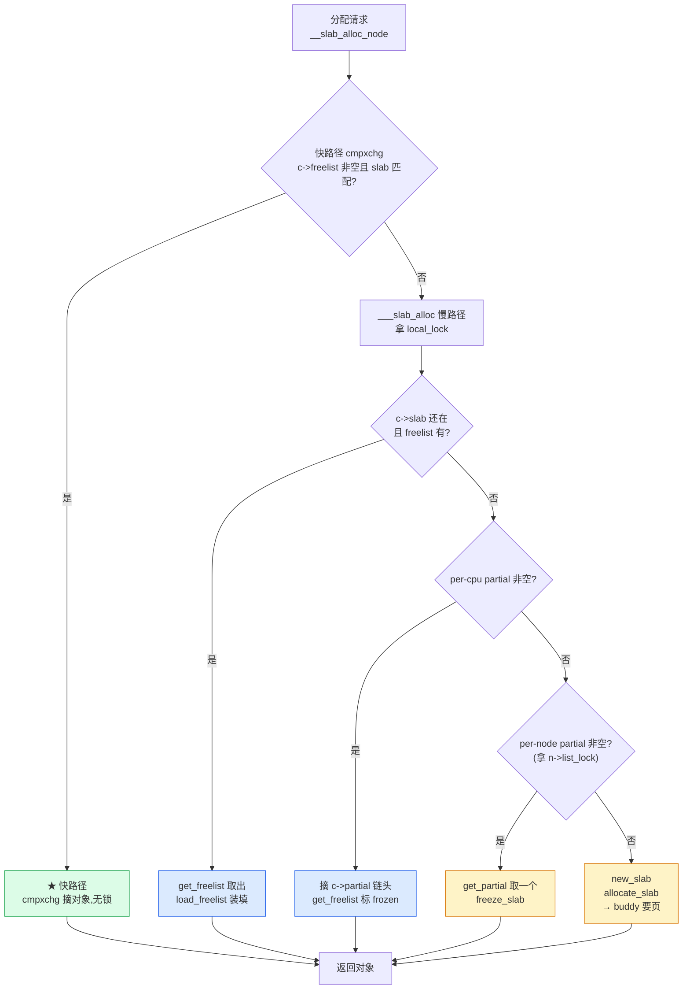
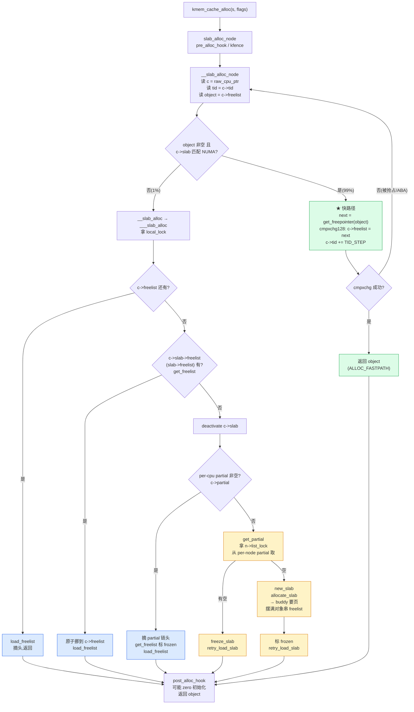

# 第八章 · alloc/free 路径与 per-cpu partial:快路径

> 篇:第 2 篇 · slab/slub(分配·小对象)
> 主线呼应:第 7 章把 slab 的"静态结构"讲清了——一个 `kmem_cache` 怎么在 buddy 给的页上紧凑摆满同型号对象、空闲对象怎么用一根内嵌 freelist 串起来、分配摘头 / 释放挂头都是 O(1)。但那一章我们故意绕开了一个问题:**多 CPU 高并发下,这套摘/挂头操作怎么不互相打架?** 答案就是本章的标题——SLUB 的 **per-cpu frozen slab + `cmpxchg` 无锁快路径**。这是 SLUB 区别于老 SLAB 的最大性能优势所在,也是 mm 把内存**分出去**第二层(对象级)的"快"之极致。读完本章你会明白:为什么内核到处 `kmalloc`,锁竞争却几乎测不出来。

## 核心问题

**内核里 `kmalloc` 几乎每秒被调几百万次,如果每次分配都锁某个全局(或 per-node)链表,多核会全部堵在锁上——SLUB 怎么把分配做到几乎完全无锁?**

读完本章你会明白:

1. **per-cpu 的 `kmem_cache_cpu`** —— 每个 CPU 持有一个独占的"当前 slab"(`c->slab`)+ 一串 per-cpu partial slab,**别的 CPU 不碰它**,这是无锁的前提。
2. **`cmpxchg` 双字段原子快路径** —— 分配 = 读 `c->freelist`,用 `this_cpu_try_cmpxchg128` 原子地把"freelist 推进一格 + tid 自增"两个更新打包成一次 16 字节原子操作,**全程无锁**。
3. **`tid`(事务 id)** —— 一次 `+TID_STEP` 的计数器,把 CPU 号编在低位,防"抢占切到别的 CPU 还误以为在自己 CPU 上"的竞态。
4. **三级 partial 队列** —— 当前 frozen slab → per-cpu partial → per-node partial,对应"快 → 较快 → 慢"三级回填;当前 slab 用完不阻塞,自动降级。
5. **释放对称** —— 多数释放 `cmpxchg` 直接挂回本 CPU 的 frozen slab,仍无锁;只有释放到**非本 CPU 的 slab** 才走 `__slab_free` 慢路径(可能合并空 slab 还回 buddy)。

> **逃生阀**:本章并发细节较多,如果你被 `cmpxchg`、`tid`、`frozen` 这些词绕晕,先抓一个心智模型:**SLUB 给每个 CPU 准备了一个"私房 slab"(frozen),分配/释放只动这个私房,所以本 CPU 内没有锁竞争;私房空了再去公共仓库(per-node partial)取。**`cmpxchg` 和 `tid` 只是"怎么在没有锁的情况下安全地动这个私房"的工程实现。理解了私房模型,再回头看 `cmpxchg` 的细节就顺了。

---

## 8.1 一个数字:内核一秒分配几百万次

第 7 章我们用 buddy 的"64 字节占 4KB"逼出了 slab。但只解决内部碎片还不够——内核对 slab 的另一个压迫,来自**调用频率**。

随便想几个内核的热路径:

- 收一个网络包:要走 `netif_receive_skb` → 协议栈 → socket buffer,**每收一个包至少一两次 `kmalloc`**(`sk_buff` 头、附属结构)。一台千兆网卡满载,每秒十几万包。
- 走一层目录:`VFS` 给每个目录项分配 `dentry`(约 192 字节),`find` 一个大目录树能瞬间产生几万个 dentry。
- 创建进程:`fork` 要分配 `task_struct`(约 9500 字节)、`mm_struct`、页表页……容器里密集 fork(比如 CI 跑测试)一秒几千次。
- 文件系统:每打开一个 inode 要分配 `struct inode`,ext4 在大压力下每秒几万次。

把这些加起来,一台忙的机器,内核**每秒做几百万次 slab 分配**(`kmem_cache_alloc`/`kmalloc`),释放同样量级。而这台机器可能有 16、32、64 个 CPU 同时在跑——**如果每一次分配都要去抢一把全局锁,锁竞争会把性能打到地板上**。

> **不这样会怎样**:假设 SLUB 朴素地用一个全局链表管所有空闲对象,每次分配/释放都 `spin_lock(&global_lock)`。后果:
>
> 1. **锁竞争爆炸**:64 个 CPU 抢一把锁,大部分时间在自旋等锁,真正干活的就那么一两个核——多核等于单核。
> 2. **cache line 弹跳**:这把锁所在的 cache line 在所有 CPU 之间疯狂弹来弹去,MESI 协议的 invalidate 风暴把内存总线打满,性能甚至比单核还差。
> 3. **NUMA 跨节点**:全局锁还在一个 NUMA 节点上,另一个节点的 CPU 要跨节点访问锁,延迟翻几倍。
>
> 这是早期 slab 实现(以及用户态早期 malloc)真实遇到过的问题。SLUB 的解法是:**把"全局锁"拆成"per-cpu 私房",让大部分分配根本不碰共享数据**。

---

## 8.2 一句话点破

> **SLUB 给每个 CPU 准备一个独占的 `kmem_cache_cpu`(私房),里面有一个"当前 slab"(`c->slab`,被标 `frozen=1`,只有本 CPU 能动)+ 一串 per-cpu partial slab。分配从当前 slab 的 freelist 摘一个对象,靠 `this_cpu_try_cmpxchg128` 原子推进 freelist,全程无锁;当前 slab 用完才回 per-cpu partial 拿一个新的(较快),per-cpu partial 也空才去 per-node partial(加自旋锁,慢)。三级缓存对应"快 → 较快 → 慢",让 99% 的分配走第一级、无锁完成。**

这是结论,不是理由。本章倒过来拆:先看 `kmem_cache_cpu` 这个"私房"长什么样、`frozen` 标志为什么能成立;再钻进快路径的 `cmpxchg` 看 SLUB 怎么把"摘 freelist 头"做成一次 16 字节原子操作、`tid` 怎么挡住抢占竞态;然后看慢路径 `___slab_alloc` 怎么逐级回填(per-cpu partial → per-node partial → 新建 slab);最后讲释放路径对称的 `do_slab_free` 快路径和 `__slab_free` 慢路径,以及它为什么 sound(无数据竞争、无 ABA、无死锁)。

---

## 8.3 per-cpu 私房:`struct kmem_cache_cpu`

### 8.3.1 它就五个字段,但决定了一切

SLUB 给每个 `kmem_cache`、每个 CPU 分配一个 [`struct kmem_cache_cpu`](../linux/mm/slub.c#L384-L400)([slub.c:384](../linux/mm/slub.c#L384)),通过 [`s->cpu_slab = __alloc_percpu(...)`](../linux/mm/slub.c#L4809)([slub.c:4809](../linux/mm/slub.c#L4809))在 `kmem_cache_open` 时挂上。一个 `kmem_cache_cpu` 就五个字段:

```c
// mm/slub.c#L384-L400
struct kmem_cache_cpu {
    union {
        struct {
            void **freelist;    /* Pointer to next available object */
            unsigned long tid;  /* Globally unique transaction id */
        };
        freelist_aba_t freelist_tid;   // ★ 16 字节整体,给 cmpxchg128 用
    };
    struct slab *slab;         /* The slab from which we are allocating */
#ifdef CONFIG_SLUB_CPU_PARTIAL
    struct slab *partial;      /* Partially allocated slabs */
#endif
    local_lock_t lock;         /* Protects the fields above */
    ...
};
```

> **全书级修正钉死**:`freelist_aba_t` 这个 union 类型**定义在 [`mm/slab.h#L43-L49`](../linux/mm/slab.h#L43)**(不是 `slub.c`),它把 `{void *freelist; unsigned long counter;}` 和一个 `freelist_full_t`(64 位机上是 `u128`)**挤在同一段 16 字节内存**。这个 union 是 SLUB 无锁快路径的物理基础——没有它,就没法把"freelist 指针 + tid"打包成一次 16 字节原子操作。第 7 章没讲它,本章正式登场。

每个字段的用途,本章会逐个拆:

| 字段 | 干什么 | 本章哪里拆 |
|------|--------|-----------|
| `freelist` | 当前 slab 的空闲对象链头(本 CPU 视图,可能和 `slab->freelist` 暂时不同) | 8.4 快路径 |
| `tid` | 事务 id,`+TID_STEP` 自增,CPU 号编在低位,防抢占竞态 | 8.5 技巧精解 |
| `slab` | 本 CPU 当前的"私房 slab"(frozen=1,只有本 CPU 能动) | 8.3.2 frozen |
| `partial` | 本 CPU 的 per-cpu partial slab 链(单链,几个半空 slab) | 8.6 二级缓存 |
| `lock` | `local_lock_t`,只在慢路径回填时拿,快路径完全不碰 | 8.6 慢路径 |

注意 `lock` 字段——`local_lock_t` 在普通内核上就是"关本 CPU 中断 + preempt_disable"的组合,它**保护的是慢路径里对 `slab`/`partial` 字段的写入**,快路径(`__slab_alloc_node` 里的 `cmpxchg` 那段)**完全不走这个锁**。这是 SLUB 性能优势的关键:快路径无锁,慢路径才上锁。

### 8.3.2 `frozen`:为什么只有本 CPU 能动

第 7 章我们见过 `slab->frozen` 这个 1 位字段([`mm/slab.h#L76`](../linux/mm/slab.h#L76)),当时只说它"表示被某 CPU 独占"。本章把它讲透。

```c
// mm/slab.h#L68-L83 (struct slab 里的核心字段)
union {
    struct {
        void *freelist;            /* first free object */
        union {
            unsigned long counters;
            struct {
                unsigned inuse:16;     // 已分配对象数
                unsigned objects:15;   // 总对象数
                unsigned frozen:1;     // ★ 是否被某 CPU 独占
            };
        };
    };
#ifdef system_has_freelist_aba
    freelist_aba_t freelist_counter;   // 把上面 16 字节整体打包,给 cmpxchg128
#endif
};
```

`frozen=1` 的语义是:**这个 slab 正在某个 CPU 的 `kmem_cache_cpu->slab` 字段里,本 CPU 会高速地摘/挂它的 freelist,所以别的 CPU 不许动它的 `freelist` 字段**。这给 SLUB 的快路径提供了无锁的前提——本 CPU 摘/挂 frozen slab 的 freelist,不需要和任何别的 CPU 协调。

那"别的 CPU 想释放一个对象到这个 frozen slab"怎么办?走慢路径 `__slab_free`——它会把这个对象挂到 slab 的 freelist 上,但因为 slab 是 frozen 的,本 CPU 独占的快路径还在飞快地改 `slab->freelist`,两个 CPU 改同一个 `slab->freelist` 怎么不冲突?答案是:**frozen slab 的 `slab->freelist` 这条 freelist 实际上有两个"链头"——一个在 `c->freelist`(本 CPU 视图,本 CPU 摘对象用)、一个在 `slab->freelist`(慢路径挂对象用)**。具体见 8.7.2 节,这里先记住:**frozen 语义保证了"本 CPU 摘对象"和"别的 CPU 挂对象"走的是两条不同的 freelist,所以不打架**。

`frozen` 是 SLUB 的招牌设计之一。老 SLAB 没有"frozen slab"这个概念,它的 per-CPU 数组要靠更复杂的 array_cache 锁来保护;SLUB 靠 frozen 标志把"本 CPU 独占 slab"这件事显式化,让无锁快路径在语义上站得住。

> **钉死这件事**:`frozen` 标志是 SLUB 无锁快路径的**语义基石**。它承诺:"我这个 slab 的 freelist 归某 CPU 独占改",让本 CPU 的快路径可以放心地用 `cmpxchg` 推进 `c->freelist`,不用和别的 CPU 协调。代价是:frozen slab 不能进 per-node partial 队列(那是要被任何 CPU 取的),所以 SLUB 用 per-cpu partial 来"冷冻半空的 slab",用 per-node partial 来"流通共享的 slab"。

---

## 8.4 快路径:`__slab_alloc_node` 的 cmpxchg

现在钻进全章最硬核的代码——分配快路径。

### 8.4.1 调用层次

先理一下从 `kmem_cache_alloc` 到快路径的调用层次:

```
kmem_cache_alloc(s, flags)                          // 对外 API
  └─ slab_alloc_node(s, ...)                        // 包装 pre/post hook
       └─ __slab_alloc_node(s, ...)                 // ★ 快路径入口(内联)
            ├─ [快路径] cmpxchg 摘对象               ← 99% 走这里,无锁
            └─ [慢路径] __slab_alloc(s, ...)
                  └─ ___slab_alloc(s, ...)          // 拿 local_lock,回填
```

`__slab_alloc_node` 用 `__always_inline` 标注([slub.c:3622](../linux/mm/slub.c#L3622)),会被强制内联到 `slab_alloc_node` 里,再被内联到 `kmem_cache_alloc`/`kfree` 里——**热路径不希望有一次函数调用开销**。`USE_LOCKLESS_FAST_PATH()` 默认为 `true`([slub.c:192](../linux/mm/slub.c#L192)),只在 `PREEMPT_RT` 配置下才关掉(因为 RT 内核的实时性约束不允许无锁快路径的 cmpxchg 重试)。

### 8.4.2 快路径核心代码

[`__slab_alloc_node`](../linux/mm/slub.c#L3622-L3695)([slub.c:3622](../linux/mm/slub.c#L3622))的核心:

```c
// mm/slub.c#L3622-L3695 (简化示意,只留快路径主干)
static __always_inline void *__slab_alloc_node(struct kmem_cache *s,
        gfp_t gfpflags, int node, unsigned long addr, size_t orig_size)
{
    struct kmem_cache_cpu *c;
    struct slab *slab;
    unsigned long tid;
    void *object;

redo:
    /* 1. 读本 CPU 的 kmem_cache_cpu 和 tid */
    c = raw_cpu_ptr(s->cpu_slab);
    tid = READ_ONCE(c->tid);
    barrier();                         // ★ 内存屏障,保证 tid 在 object/slab 之前读

    object = c->freelist;              // ★ 读当前 freelist 头
    slab = c->slab;

    /* 2. 快路径能走的三个条件 */
    if (!USE_LOCKLESS_FAST_PATH() ||
        unlikely(!object || !slab || !node_match(slab, node))) {
        /* 慢路径:freelist 空 / slab 空 / NUMA 不匹配 */
        object = __slab_alloc(s, gfpflags, node, addr, c, orig_size);
    } else {
        /* 3. ★ 快路径:cmpxchg 摘对象 */
        void *next_object = get_freepointer_safe(s, object);

        if (unlikely(!__update_cpu_freelist_fast(s, object, next_object, tid))) {
            note_cmpxchg_failure("slab_alloc", s, tid);
            goto redo;
        }
        prefetch_freepointer(s, next_object);
        stat(s, ALLOC_FASTPATH);
    }

    return object;
}
```

快路径主干就**三步**:

1. **读 `c->freelist`**(当前空闲对象链头,这就是要返回的对象)。
2. **读 `get_freepointer_safe(s, object)`**(从对象体内解出下一个空闲对象,作为新的链头)。
3. **`__update_cpu_freelist_fast` 原子推进**——如果成功,返回 `object` 给调用者。

整个过程**没有拿任何锁**。精彩在 `__update_cpu_freelist_fast`——它就是那个"无锁摘对象"的魔法。

### 8.4.3 `__update_cpu_freelist_fast`:16 字节原子更新

```c
// mm/slub.c#L3285-L3295
static inline bool
__update_cpu_freelist_fast(struct kmem_cache *s,
                           void *freelist_old, void *freelist_new,
                           unsigned long tid)
{
    freelist_aba_t old = { .freelist = freelist_old, .counter = tid };
    freelist_aba_t new = { .freelist = freelist_new, .counter = next_tid(tid) };

    return this_cpu_try_cmpxchg_freelist(s->cpu_slab->freelist_tid.full,
                                         &old.full, new.full);
}
```

这三行代码藏着 SLUB 无锁快路径的全部魔法。一层层拆:

1. `old` 和 `new` 都是 `freelist_aba_t`——那个 16 字节的 union([`slab.h:43`](../linux/mm/slab.h#L43)),由 `{void *freelist; unsigned long counter}` 组成。`old` 把"`c->freelist` 当前值 + 刚读到的 `tid`"打包,`new` 把"下一个对象 + `next_tid(tid)`"打包。

2. **`this_cpu_try_cmpxchg_freelist`** 在 64 位机上宏展开为 [`this_cpu_try_cmpxchg128`](../linux/mm/slab.h#L24)([slab.h:24](../linux/mm/slab.h#L24))。它做的是:**比较本 CPU 的 `c->freelist_tid.full`(16 字节整体)和 `old.full` 是否相等,相等就把它原子地写成 `new.full`,返回 true;不相等返回 false**。`this_cpu_` 前缀保证这条指令绑定到读 `c` 那一刻的 CPU——不能跑到别的 CPU 上去 cmpxchg。

3. 如果 cmpxchg 成功,意味着"从我们读 `c->freelist` 到现在,没有任何别的代码改过 `c->freelist` 或 `c->tid`"——本 CPU 拿走了 `object`,新链头是 `next_object`,tid 也前进了。**整个 16 字节(8 字节 freelist + 8 字节 tid)的更新在一次原子指令里完成**,中间没有任何窗口能让别的代码插进来。

> **为什么要把 freelist 和 tid 打包成 16 字节一起更新?** 这是为了挡住**抢占竞态**。考虑这个序列(假设只有一个 8 字节的 freelist,没有 tid):
>
> 1. CPU 0 上的线程 T1 读 `c->freelist = obj_A`,算出 `next = obj_B`。
> 2. **T1 被抢占**,内核调度到 CPU 1 上继续跑(或者另一个线程在 CPU 0 上跑了一次分配,推进了 freelist)。
> 3. 中间 `c->freelist` 已经变了(比如变成了 `obj_C`)。
> 4. T1 恢复,试图 cmpxchg `freelist` 从 `obj_A` 改成 `obj_B`——但 `c->freelist` 已经是 `obj_C`,cmpxchg 成功条件是"freelist 还是 obj_A",**如果不带 tid,cmpxchg 会失败**。但如果中间又恰好有别的操作把 freelist 改回 `obj_A`(ABA),cmpxchg 会**误成功**,把已经被别人拿走的 `obj_A` 又当空闲对象返回——**double allocate**。
>
> 加了 `tid`,cmpxchg 同时验证"freelist 还是 obj_A **且** tid 还是原来的值"。`tid` 每次 cmpxchg 成功都 `+TID_STEP`,所以**即使 freelist 数值回到 obj_A,tid 一定不同**,cmpxchg 会失败,走 `redo` 重来。这就是 `freelist_aba_t` 里 `counter` 字段的用途——它叫"ABA counter",是这个 union 名字里 "aba" 的来历。8.5 节会专门拆 tid 怎么编码 CPU 号、怎么挡这个竞态。

如果 cmpxchg 失败(返回 false),意味着我们读到的 `freelist`/`tid` 已经过期——`note_cmpxchg_failure` 记一下数(给 `/sys/kernel/slab/<cache>/` 看),`goto redo` 重来。重试是 `redo` 标号,重新读 `c->freelist` 和 `tid`,再试一次 cmpxchg。**只要本 CPU 没被频繁打断,重试一两次就成功;最坏情况退化到慢路径**。

> **钉死这件事**:SLUB 的分配快路径就一个核心招——**把"freelist 推进一格 + tid 自增"打包成一次 16 字节 `this_cpu_cmpxchg128`,全程无锁**。cmpxchg 成功 = 拿到了对象;失败 = 重来。这把第 7 章讲的"摘 freelist 头"这个 O(1) 操作,变成了一个完全无锁的原子操作。`tid` 是防 ABA 的计数器,freelist 和 tid 一起在 16 字节 union 里原子更新——这是 SLUB 区别于老 SLAB 的最大工程亮点。

---

## 8.5 技巧精解:cmpxchg + tid 怎么做到"无锁且 sound"

本节挑全章最硬核的技巧——**SLUB 的无锁快路径为什么 sound**(无数据竞争、无 ABA、无死锁)——配真实源码 + 反面对比拆透。

### 8.5.1 招式一:`this_cpu_cmpxchg128` 把两个更新打包

看 [`__update_cpu_freelist_fast`](../linux/mm/slub.c#L3285-L3295)([slub.c:3285](../linux/mm/slub.c#L3285))真正的原子原语:

```c
// mm/slub.c#L3293-L3294
return this_cpu_try_cmpxchg_freelist(s->cpu_slab->freelist_tid.full,
                                     &old.full, new.full);
```

`this_cpu_try_cmpxchg_freelist` 在 64 位机上展开为 `this_cpu_try_cmpxchg128`。x86-64 上它对应一条 **`cmpxchg16b`** 指令——这是 x86 提供的"16 字节(128 位)比较交换"指令,它能在一条指令里原子地比较和交换 16 字节内存。这条指令要 16 字节对齐,所以 SLUB 在 `struct slab` 里有这条断言:

```c
// mm/slab.h#L105-L107
#if defined(system_has_freelist_aba)
static_assert(IS_ALIGNED(offsetof(struct slab, freelist), sizeof(freelist_aba_t)));
#endif
```

保证 `freelist` 字段在 `struct slab`(其实是 `struct page`)里的偏移是 16 字节对齐的,否则 `cmpxchg16b` 会触发 alignment fault。

`this_cpu_cmpxchg128` 还有一个隐含的好处:**它绑定了 CPU**。`this_cpu_` 前缀的 per-cpu 操作宏,会在指令执行期间禁用抢占(或至少保证这段指令不跨 CPU),确保 cmpxchg 是在"我们以为的那个 CPU"上执行的。这一点和 `tid` 的 CPU 号编码配合,挡住了"抢占切到别的 CPU"的竞态。

> **反面对比·朴素方案 A(用一把 per-cache 自旋锁)**:假设 SLUB 给每个 `kmem_cache` 一把 `spinlock_t cache_lock`,快路径这样写:
>
> ```c
> spin_lock(&s->cache_lock);
> object = c->freelist;
> c->freelist = get_freepointer(s, object);
> spin_unlock(&s->cache_lock);
> ```
>
> 看起来简单,但在多核高并发下,64 个 CPU 抢一把锁,锁 cache line 在核之间疯狂弹跳(MESI invalidate 风暴),性能比无锁版本差一个数量级。这把锁在 hot path 上,会成为整个内核的性能天花板。
>
> **反面对比·朴素方案 B(用 per-cpu 锁)**:如果给每个 CPU 一把锁(`percpu spinlock`),快路径里 `spin_lock(this_cpu_ptr(&s->percpu_lock))`,确实避免了跨 CPU 弹跳,但锁本身(原子读改写 + 内存屏障)的开销仍比 `cmpxchg128` 大——尤其 cmpxchg 在竞争不激烈时几乎就是一次 cache hit。SLUB 选了**完全不用锁**,直接 `this_cpu_cmpxchg128`,把开销压到最低。

### 8.5.2 招式二:`tid` 编码 CPU 号,挡住抢占竞态

光有 `cmpxchg128` 还不够——还要解决"读 `c` 之后、cmpxchg 之前,本 CPU 被抢占切到别的 CPU"的竞态。`tid`(transaction id)就是为这件事设计的。

看 tid 怎么定义和递增:

```c
// mm/slub.c#L2715-L2733
#ifdef CONFIG_PREEMPTION
/*
 * Calculate the next globally unique transaction for disambiguation
 * during cmpxchg. The transactions start with the cpu number and are then
 * incremented by CONFIG_NR_CPUS.
 */
#define TID_STEP  roundup_pow_of_two(CONFIG_NR_CPUS)
#else
#define TID_STEP 1
#endif

static inline unsigned long next_tid(unsigned long tid)
{
    return tid + TID_STEP;
}
```

关键设计:**`TID_STEP = roundup_pow_of_two(CONFIG_NR_CPUS)`**。在支持抢占的内核里,`TID_STEP` 是"≥ CONFIG_NR_CPUS 的最小 2 的幂"。这意味着 tid 的**低位(`log2(TID_STEP)` 个 bit)就是 CPU 号**:

```
假设 CONFIG_NRCPUS = 64, TID_STEP = 64 = 2^6
tid 的二进制:[ 高位: 每次操作递增 ] [ 低 6 位: CPU 号 ]

CPU 0 的 tid 序列:0, 64, 128, 192, ...   (低 6 位 = 000000)
CPU 1 的 tid 序列:1, 65, 129, 193, ...   (低 6 位 = 000001)
CPU 7 的 tid 序列:7, 71, 135, 199, ...   (低 6 位 = 000111)
```

注释里 `tid_to_cpu(tid) = tid % TID_STEP`(就是取低 `log2(TID_STEP)` 位)就是这个意思([slub.c:2736-2739](../linux/mm/slub.c#L2736-L2739))。

这个编码挡住了一个关键竞态:

> **场景**:线程 T1 在 CPU 0 上读 `c = raw_cpu_ptr(s->cpu_slab)`,`tid = c->tid`(假设是 64,代表"CPU 0 的第 1 次操作")。然后 T1 被抢占,调度到 CPU 1 上继续跑。此时 T1 手里的 `c` 指针其实是 **CPU 0 的 `kmem_cache_cpu`**(因为 `raw_cpu_ptr` 读的是读那一刻的 per-cpu 区域),`tid` 是 64。但 T1 现在在 CPU 1 上,如果它直接调 `this_cpu_cmpxchg128`,`this_cpu_cmpxchg128` 会在 **CPU 1 上**比较 **CPU 1 的 `c->freelist_tid`**——这和 T1 手里"CPU 0 的 c 指针"完全不是同一个东西。

但 SLUB 的设计让这件事不会出问题——`__update_cpu_freelist_fast` 里的 cmpxchg:

```c
return this_cpu_try_cmpxchg_freelist(s->cpu_slab->freelist_tid.full, ...);
```

注意这里传的是 `s->cpu_slab->freelist_tid.full`(per-cpu 字段引用),不是 T1 手里缓存的 `c`。`this_cpu_try_cmpxchg128` 宏会在**当前 CPU** 上读 `s->cpu_slab->freelist_tid.full`——也就是 CPU 1 的那个。它和 T1 缓存的 `old = {obj_A, tid=64}` 比较:

- CPU 1 的 `freelist_tid.counter` 低 6 位是 `000001`(CPU 1),T1 缓存的 tid=64 低 6 位是 `000000`(CPU 0)——**两者 tid 必然不等,cmpxchg 失败,返回 false**。
- T1 看到 cmpxchg 失败,走 `goto redo`,重新 `raw_cpu_ptr` 拿到 CPU 1 的 `c`、读 CPU 1 的 tid,再 cmpxchg——这次在正确的 CPU 上做正确的事。

**tid 的低位 CPU 号编码,把"我以为在 CPU X、实际在 CPU Y"的竞态自动转换成 cmpxchg 失败 + 重试**,不需要任何显式的"检查我是不是还在原 CPU 上"。这是 SLUB 一个非常巧妙的工程设计——用一个简单的编码规则,把抢占检测的复杂度藏进了 cmpxchg 的失败路径。

注释里那句 "The transactions start with the cpu number and are then incremented by CONFIG_NR_CPUS" 就是这个意思——tid 从 CPU 号开始(每个 CPU 的初始 tid = `cpu`),之后每次操作 `+CONFIG_NR_CPUS`,所以低位永远是 CPU 号。

> **钉死这件事**:tid 的设计是 `TID_STEP = roundup_pow_of_two(CONFIG_NRCPUS)`,让 tid 低位就是 CPU 号。cmpxchg 时如果"我以为在 CPU X、实际在 CPU Y",tid 低位不等,cmpxchg 必然失败,自动走 redo 重试。这把"抢占切 CPU"的竞态藏进了 cmpxchg 失败路径,不需要任何显式检查——是 SLUB 一个非常漂亮的工程细节。

### 8.5.3 招式三:三件事都要 sound

无锁快路径的"sound"包含三件事,SLUB 都满足:

1. **无数据竞争(data race)**:本 CPU 改的是 `c->freelist_tid`(per-cpu 字段),别的 CPU 不碰它;frozen slab 的 `slab->freelist` 在本 CPU 路径上只被本 CPU 改(别的 CPU 释放到它会走慢路径,见 8.7.2)。所以**没有两个 CPU 同时写同一个 8 字节**。

2. **无 ABA 问题**:freelist 是单链,`c->freelist` 推进只往后走。即使别的操作把 freelist 数值改回原值(极不可能,但理论上),`tid` 每次都变,cmpxchg 双字段同时验证——ABA 被挡死。

3. **无死锁(deadlock-free)**:快路径完全不拿锁,没有死锁的可能。慢路径拿 `local_lock`(关本 CPU 中断 + preempt_disable)和 `n->list_lock`(per-node 自旋锁),锁顺序固定(总是先关中断,再拿 list_lock,绝不反向),不会死锁。

> **反面对比·朴素方案 C(只 cmpxchg 8 字节 freelist,不加 tid)**:假设 SLUB 只 cmpxchg 8 字节的 `c->freelist`,不打包 tid。那么 ABA 问题无法避免:本 CPU 读 `freelist=obj_A`、被抢占、别的代码把 freelist 改成 `obj_B` 又改回 `obj_A`,本 CPU 恢复后 cmpxchg `obj_A→obj_B` 成功——**但 `obj_A` 中间已经被分配出去过**,这次又分配一遍 = double allocate。加了 tid 之后,中间那次"改回 obj_A"必然伴随着 tid 递增,cmpxchg 双字段失败,double allocate 被挡死。

### 8.5.4 ★ 对照第 8 本:per-cpu frozen slab vs thread cache

(本章标 ★,这里给轻量对照。完整对照在第 10、21 章。)

| 概念 | SLUB(本书·内核态) | tcmalloc/jemalloc(第 8 本·用户态) |
|------|-------------------|-----------------------------------|
| 无锁缓存粒度 | **per-cpu** `kmem_cache_cpu`(frozen slab) | **per-thread** ThreadCache |
| 缓存里放什么 | 当前 frozen slab + per-cpu partial 链 | per-size-class 的 free list |
| 怎么做到无锁 | **`cmpxchg128` 原子推进 freelist + tid**,靠内核抢占检测 | **线程局部**(同线程访问本线程 cache 无并发) |
| 缓存空了去哪 | per-node partial(自旋锁) → buddy 新建 | CentralFreeList(自旋锁) → PageHeap 新建 span |
| 跨"CPU/线程"释放 | frozen slab 接收,慢路径 `__slab_free` | 跨线程释放要 CentralFreeList 中转 |

**最值得品味的对照**:SLUB 用 **per-cpu**(因为内核线程能在 CPU 间迁移,但不会"消失"),tcmalloc 用 **per-thread**(因为用户线程随进程生死)。SLUB 的难点是"线程被抢占切到别的 CPU"——靠 `tid` 编 CPU 号解决;tcmalloc 的难点是"线程的 cache 不够用要 evict"——靠 GC 风格的 garbage list 解决。**内核态和用户态选择了不同的"无锁缓存单位",但抽象完全同构**:`per-X cache + 共享 central freelist`,两者都是这个三段式。

另一个对照:**frozen slab ↔ thread-local free list**。两者都表示"这块归我独占、别人别碰"。内核靠 `frozen` 标志位显式声明、靠 `cmpxchg128` 原子操作;用户态靠"线程局部存储(TLS)自然就是别人碰不到"——不需要显式标志位,但也没有内核那样的跨 CPU cmpxchg 加速。这是两种世界观的差异。

---

## 8.6 慢路径:三级 partial 队列逐级回填

快路径只是分配的 99% 情况。剩下 1%——当前 slab 用完、或 NUMA 节点不匹配、或被抢占切了 CPU——走慢路径 `___slab_alloc`。慢路径的核心是**三级 partial 队列的逐级回填**,我们用 mermaid 画清。

### 8.6.1 三级 partial 的全景

SLUB 给每个 `kmem_cache` 准备了三级 slab 缓存,从"最热"到"最冷":

```
   一个 kmem_cache 的 slab 三级缓存全景

   CPU 0 私房                  CPU 1 私房              CPU 2 私房  ...
   ┌────────────────┐          ┌────────────────┐      ┌──────────┐
   │ c->slab (frozen)│         │ c->slab (frozen)│     │ ...      │  ← 第 1 级:per-cpu 当前 slab
   │ obj→obj→obj→...│         │ obj→obj→obj     │     │          │    (frozen,本 CPU 独占,无锁)
   ├────────────────┤         ├────────────────┤      ├──────────┤
   │ c->partial     │          │ c->partial     │      │          │  ← 第 2 级:per-cpu partial
   │  ↓ slab_B      │          │  ↓ slab_X      │      │          │    (单链,几个半空 slab)
   │  ↓ slab_C      │          │  ↓ slab_Y      │      │          │    (本 CPU 独占,慢路径才碰)
   └────────────────┘         └────────────────┘      └──────────┘
            │                          │
            │  per-cpu 缓存都空了,才降到共享层
            ▼                          ▼
   ┌──────────────────────────────────────────┐
   │ node[0]->partial (自旋锁 n->list_lock)    │              ← 第 3 级:per-node partial
   │  slab_E ↔ slab_F ↔ slab_G ↔ ...           │                 (任何 CPU 都能取,要锁)
   └──────────────────────────────────────────┘
            │
            │  per-node 也空了,才新建
            ▼
   new_slab() → allocate_slab() → buddy 要页         ← 兜底:找 buddy 要新页,摆满对象
```

三级对应**"快 → 较快 → 慢"**:

| 级别 | 在哪 | 谁能访问 | 何时用 | 性能 |
|------|------|---------|--------|------|
| 1. 当前 frozen slab | `c->slab` | 本 CPU 独占 | 快路径 cmpxchg | 极快(无锁) |
| 2. per-cpu partial | `c->partial` | 本 CPU 独占 | 慢路径,当前 slab 空 | 较快(关中断,无自旋锁) |
| 3. per-node partial | `n->partial` | 所有 CPU | per-cpu partial 也空 | 慢(自旋锁 `n->list_lock`) |
| 兜底. 新建 slab | buddy | — | per-node 也空 | 最慢(找 buddy,可能触发回收) |

这个三级结构的妙处:**让本 CPU 跑得尽量快**。99% 的分配走第 1 级(无锁),少数走第 2 级(关中断),极少走第 3 级(自旋锁),几乎不触发兜底。这是 SLUB 区别于老 SLAB 的核心性能优势。

### 8.6.2 慢路径 `___slab_alloc`:逐级回填

[`___slab_alloc`](../linux/mm/slub.c#L3376-L3594)([slub.c:3376](../linux/mm/slub.c#L3376))是慢路径的核心。它分四步走,对应三级回填 + 兜底。

**第 1 步:检查当前 slab 还能不能用**。

```c
// mm/slub.c#L3386-L3411
reread_slab:
    slab = READ_ONCE(c->slab);
    if (!slab) {
        /* 当前 slab 空,直接跳到 new_slab 找新 slab */
        goto new_slab;
    }
    if (unlikely(!node_match(slab, node))) {
        /* NUMA 不匹配,deactivate 当前 slab */
        goto deactivate_slab;
    }
    if (unlikely(!pfmemalloc_match(slab, gfpflags)))
        goto deactivate_slab;
```

注意 `READ_ONCE(c->slab)`——因为快路径可能并发地改 `c->slab`(虽然慢路径自己拿了 `local_lock`,但读 `c->slab` 之前可能被快路径改过),所以用 `READ_ONCE` 保证读到的是完整指针。

**第 2 步:当前 slab 还在,但 freelist 可能空了——重新装填**。

```c
// mm/slub.c#L3421-L3456
local_lock_irqsave(&s->cpu_slab->lock, flags);
if (unlikely(slab != c->slab)) {                  // 拿锁后再确认一次
    local_unlock_irqrestore(&s->cpu_slab->lock, flags);
    goto reread_slab;
}
freelist = c->freelist;
if (freelist)
    goto load_freelist;                            // c->freelist 还有,直接装填

freelist = get_freelist(s, slab);                  // ★ c->freelist 空了,从 slab 拿
if (!freelist) {
    c->slab = NULL;
    c->tid = next_tid(c->tid);
    local_unlock_irqrestore(&s->cpu_slab->lock, flags);
    stat(s, DEACTIVATE_BYPASS);
    goto new_slab;
}

load_freelist:
    VM_BUG_ON(!c->slab->frozen);
    c->freelist = get_freepointer(s, freelist);    // ★ 摘头,把第二个变新头
    c->tid = next_tid(c->tid);
    local_unlock_irqrestore(&s->cpu_slab->lock, flags);
    return freelist;
```

注意 [`get_freelist`](../linux/mm/slub.c#L3305-L3328)([slub.c:3305](../linux/mm/slub.c#L3305))——当 `c->freelist` 空(本 CPU 视图的链头空),但 slab 本身还有空闲对象(在 `slab->freelist` 里,可能是别的 CPU 释放进来的,见 8.7.2)时,它用 cmpxchg 把 `slab->freelist` 原子地"取出来"放进 `c->freelist`,同时把 slab 标 frozen。这一步打通了"frozen slab 的两条 freelist 合并"——本 CPU 的 `c->freelist` 用完后,可以从 `slab->freelist`(别的 CPU 释放到这里攒下的)接着用,不用换 slab。

**第 3 步:per-cpu partial 拿一个半空 slab 当新当前**。

```c
// mm/slub.c#L3474-L3504 (CONFIG_SLUB_CPU_PARTIAL)
new_slab:
    while (slub_percpu_partial(c)) {
        local_lock_irqsave(&s->cpu_slab->lock, flags);
        if (unlikely(c->slab)) {                   // 拿锁后发现别的路径已经装好了
            local_unlock_irqrestore(&s->cpu_slab->lock, flags);
            goto reread_slab;
        }
        if (unlikely(!slub_percpu_partial(c))) {   // partial 被别的路径 drain 了
            local_unlock_irqrestore(&s->cpu_slab->lock, flags);
            goto new_objects;
        }

        slab = slub_percpu_partial(c);
        slub_set_percpu_partial(c, slab);          // ★ c->partial = slab->next(摘链头)

        if (likely(node_match(slab, node) &&
                   pfmemalloc_match(slab, gfpflags))) {
            c->slab = slab;                        // 这个 slab 升级成当前 slab
            freelist = get_freelist(s, slab);      // 从 slab 取 freelist,标 frozen
            VM_BUG_ON(!freelist);
            stat(s, CPU_PARTIAL_ALLOC);
            goto load_freelist;
        }
        ...
    }
```

`slub_percpu_partial(c)` 宏展开就是 `(c)->partial`([`slab.h:223`](../linux/mm/slab.h#L223));`slub_set_percpu_partial(c, slab)` 就是 `c->partial = slab->next`([`slab.h:225-228`](../linux/mm/slab.h#L225))——摘链头。摘下来的 partial slab 用 `get_freelist` 标 frozen 并取出它的 freelist,变成新的"当前 slab"。

**第 4 步:per-node partial 拿,或新建**。

```c
// mm/slub.c#L3506-L3536
new_objects:
    pc.flags = gfpflags;
    pc.orig_size = orig_size;
    slab = get_partial(s, node, &pc);              // ★ 去 per-node partial 找
    if (slab) {
        ...
        freelist = freeze_slab(s, slab);           // 标 frozen,取 freelist
        goto retry_load_slab;
    }

    slub_put_cpu_ptr(s->cpu_slab);
    slab = new_slab(s, gfpflags, node);            // ★ 都没有,找 buddy 新建
    c = slub_get_cpu_ptr(s->cpu_slab);
    if (unlikely(!slab)) {
        slab_out_of_memory(s, gfpflags, node);
        return NULL;
    }
    ...
```

`get_partial` 内部要拿 per-node 的 `n->list_lock` 自旋锁([`slub.c:425-434`](../linux/mm/slub.c#L425-L434) 定义的 `struct kmem_cache_node` 里的 `list_lock`)——这是三级里**唯一上自旋锁**的一级。如果 per-node partial 也空,只能 `new_slab`→`allocate_slab`→`alloc_slab_page` 找 buddy 要新页(第 7 章讲过 `allocate_slab` 怎么摆满对象、串 freelist)。

用 mermaid 把整套慢路径画清:



### 8.6.3 per-cpu partial 的上限:`cpu_partial_slabs`

per-cpu partial 不能无限长——它缓存的是"半空 slab",留着太多会占用大量内存却不干活。SLUB 用 [`cpu_partial_slabs`](../linux/mm/slub.c#L625)([slub.c:625](../linux/mm/slub.c#L625))限制每个 CPU 上 partial slab 的数量:

```c
// mm/slub.c#L612-L626
static void slub_set_cpu_partial(struct kmem_cache *s, unsigned int nr_objects)
{
    unsigned int nr_slabs;
    s->cpu_partial = nr_objects;
    /*
     * We take the number of objects but actually limit the number
     * of slabs on the per cpu partial list, in order to limit excessive
     * growth of the list. For simplicity we assume that the slabs will
     * be half-full.
     */
    nr_slabs = DIV_ROUND_UP(nr_objects * 2, oo_objects(s->oo));
    s->cpu_partial_slabs = nr_slabs;
}
```

注释把计算思路讲清了:**用户配的是"对象数"(`cpu_partial`),SLUB 假设每个 partial slab 半空,换算成"slab 数"作为上限**(`cpu_partial_slabs = ceil(cpu_partial * 2 / oo_objects)`)。比如 `cpu_partial=30`、`oo_objects=50`,则 `cpu_partial_slabs = ceil(60/50) = 2`——每个 CPU 最多缓存 2 个 partial slab。

超了怎么办?看 [`put_cpu_partial`](../linux/mm/slub.c#L2951-L2989)([slub.c:2951](../linux/mm/slub.c#L2951)):

```c
// mm/slub.c#L2951-L2989 (简化)
static void put_cpu_partial(struct kmem_cache *s, struct slab *slab, int drain)
{
    struct slab *oldslab;
    struct slab *slab_to_put = NULL;
    unsigned long flags;
    int slabs = 0;

    local_lock_irqsave(&s->cpu_slab->lock, flags);
    oldslab = this_cpu_read(s->cpu_slab->partial);

    if (oldslab) {
        if (drain && oldslab->slabs >= s->cpu_partial_slabs) {
            /* ★ per-cpu partial 满了,把老的整串 drain 到 per-node partial */
            slab_to_put = oldslab;
            oldslab = NULL;
        } else {
            slabs = oldslab->slabs;
        }
    }

    slabs++;
    slab->slabs = slabs;                       // ★ 这条链上的 slab 数,记在链头
    slab->next = oldslab;
    this_cpu_write(s->cpu_slab->partial, slab);

    local_unlock_irqrestore(&s->cpu_slab->lock, flags);

    if (slab_to_put) {
        __put_partials(s, slab_to_put);        // 把整串搬到 per-node(拿 list_lock)
        stat(s, CPU_PARTIAL_DRAIN);
    }
}
```

这里有个巧妙的字段复用——[`slab->slabs`](../linux/mm/slab.h#L63)([slab.h:63](../linux/mm/slab.h#L63))记录"这条 per-cpu partial 链上一共有几个 slab",挂在链头 slab 的 `next`/`slabs` 字段(利用 `struct slab` 的 union,这块内存在不挂 partial 时是 `slab_list`)。每次新挂一个 slab,链头 `slab->slabs = 旧值 + 1`。这样 `put_cpu_partial` 不用遍历整条链就能知道长度,摊还 O(1)。

> **全书级修正钉死**:6.9 里 per-cpu partial 的上限字段叫 **`cpu_partial_slabs`**([slub.c:625](../linux/mm/slub.c#L625)),**不是**老版本/老文档里的 `cpu_partial`(`cpu_partial` 仍然存在,但它记的是"对象数",换算成 `cpu_partial_slabs` 才是实际上限)。`put_cpu_partial` 在 `drain && oldslab->slabs >= s->cpu_partial_slabs` 时,会把老的一整串 partial drain 到 per-node partial(这个过程叫 `CPU_PARTIAL_DRAIN`)。如果你看的是老资料,字段名要对一下。

---

## 8.7 释放路径:对称的快慢两级

释放路径和分配路径**对称**——也有快慢两级,快的也用 cmpxchg,慢的也走 `__slab_free`。

### 8.7.1 快路径 `do_slab_free`:cmpxchg 挂回 frozen slab

释放的入口是 [`do_slab_free`](../linux/mm/slub.c#L4217-L4270)([slub.c:4217](../linux/mm/slub.c#L4217)),`__always_inline` 强制内联到 `kfree`/`kmem_cache_free`:

```c
// mm/slub.c#L4217-L4270 (简化示意,只留快路径主干)
static __always_inline void do_slab_free(struct kmem_cache *s,
                struct slab *slab, void *head, void *tail, int cnt,
                unsigned long addr)
{
    struct kmem_cache_cpu *c;
    unsigned long tid;
    void **freelist;

redo:
    c = raw_cpu_ptr(s->cpu_slab);
    tid = READ_ONCE(c->tid);
    barrier();

    /* ★ 关键判断:释放的对象,是不是就在本 CPU 当前的 frozen slab 里? */
    if (unlikely(slab != c->slab)) {
        /* 不在,走慢路径 */
        __slab_free(s, slab, head, tail, cnt, addr);
        return;
    }

    if (USE_LOCKLESS_FAST_PATH()) {
        freelist = READ_ONCE(c->freelist);

        set_freepointer(s, tail, freelist);    // ★ 把释放对象挂到当前 freelist 头前

        if (unlikely(!__update_cpu_freelist_fast(s, freelist, head, tid))) {
            note_cmpxchg_failure("slab_free", s, tid);
            goto redo;
        }
    }
    stat_add(s, FREE_FASTPATH, cnt);
}
```

快路径几乎和分配快路径**镜像**:

- 分配:读 `c->freelist`,cmpxchg 把它推进到 `next_object`(摘头)。
- 释放:读 `c->freelist`,把释放对象挂到它前面,cmpxchg 把 `c->freelist` 改成 `head`(挂头)。

`set_freepointer(s, tail, freelist)` 把释放对象体内的 freeptr 指向旧链头 `freelist`(第 7 章 7.5.3 节讲过);然后 `__update_cpu_freelist_fast(s, freelist, head, tid)` 用 cmpxchg128 原子地把 `c->freelist` 从 `freelist` 改成 `head`,tid 同时递增。成功就完成了释放,**全程无锁**。

**释放快路径能走的条件**:`slab == c->slab`——释放的对象所在的 slab,正好是本 CPU 当前的 frozen slab。这是大多数情况,因为内核代码常常是"刚分配就释放"(短生命周期对象,比如 `sk_buff` 收发包路径),分配和释放发生在同一个 CPU 的同一个 frozen slab 上。

### 8.7.2 慢路径 `__slab_free`:释放到非本 CPU 的 slab

如果释放的对象所在的 slab **不是**本 CPU 的当前 frozen slab(比如对象在 CPU 0 上分配,然后对象指针被传到 CPU 1 上,在 CPU 1 上释放),走慢路径 [`__slab_free`](../linux/mm/slub.c#L4089-L4199)([slub.c:4089](../linux/mm/slub.c#L4089)):

```c
// mm/slub.c#L4109-L4142 (简化)
do {
    if (unlikely(n)) {
        spin_unlock_irqrestore(&n->list_lock, flags);
        n = NULL;
    }
    prior = slab->freelist;                      // ★ 读 slab 的 freelist(不是 c->freelist!)
    counters = slab->counters;
    set_freepointer(s, tail, prior);             // 释放对象挂到 slab freelist 头前
    new.counters = counters;
    was_frozen = new.frozen;
    new.inuse -= cnt;
    if ((!new.inuse || !prior) && !was_frozen) {
        /* 空了或 prior 空了,且没 frozen —— 可能要上 per-node 队列 */
        if (!kmem_cache_has_cpu_partial(s) || prior) {
            n = get_node(s, slab_nid(slab));
            spin_lock_irqsave(&n->list_lock, flags);   // ★ 抢 per-node 锁
            on_node_partial = slab_test_node_partial(slab);
        }
    }
} while (!slab_update_freelist(s, slab,          // ★ cmpxchg slab->freelist_counter
            prior, counters,
            head, new.counters,
            "__slab_free"));
```

这里有几个关键点:

1. **改的是 `slab->freelist`,不是 `c->freelist`**——因为这个 slab 不在本 CPU 的 `c->slab` 里,它的 freelist 归"slab 本身"管。用 [`slab_update_freelist`](../linux/mm/slub.c#L724)([slub.c:724](../linux/mm/slub.c#L724))→[`__update_freelist_fast`](../linux/mm/slub.c#L653)([slub.c:653](../linux/mm/slub.c#L653)),它底层是 `try_cmpxchg128`——同样一次 16 字节原子操作,但操作的是 `slab->freelist_counter`(8.3.2 节那个 union 的第二个成员),不是 `c->freelist_tid`。

2. **cmpxchg 失败重试**:`do {} while` 循环,如果中间别的 CPU 改了 `slab->freelist`(比如别的 CPU 也在往这个 slab 释放,或本 slab 的拥有者 CPU 在摘对象),cmpxchg 失败,重新读 `prior`/`counters` 再试。**这个循环是 SLUB 释放路径并发正确性的根——两个 CPU 同时往同一个非 frozen slab 释放,只有一个能成功改 `slab->freelist`,另一个重试时 prior 已更新,不会丢对象**。

3. **释放后 slab 可能要进 partial 队列**:`was_frozen` 表示释放前 slab 是不是 frozen 的。如果不是 frozen(它不在任何 CPU 的当前 slab 里),且释放后变空了或 prior 空了,就要把它挂到 per-node partial(或 per-cpu partial,见后面)。这一步要拿 `n->list_lock` 自旋锁。

释放后 slab 的去向,看 [`__slab_free` 后半段](../linux/mm/slub.c#L4144-L4198)([slub.c:4144](../linux/mm/slub.c#L4144)):

```c
// mm/slub.c#L4144-L4162 (简化)
if (likely(!n)) {
    if (likely(was_frozen)) {
        /* slab 本来就 frozen,挂回去不影响别人,啥也不用做 */
        stat(s, FREE_FROZEN);
    } else if (kmem_cache_has_cpu_partial(s) && !prior) {
        /* slab 原来是满的(prior=NULL),现在有空位了 —— 挂到 per-cpu partial */
        put_cpu_partial(s, slab, 1);
        stat(s, CPU_PARTIAL_FREE);
    }
    return;
}
```

三种情况:

- **`was_frozen=1`**:slab 本来就在某个 CPU 的 `c->slab` 里(frozen)。释放后还是 frozen,不需要动任何队列——本 CPU 会继续从这个 slab 摘对象。
- **`was_frozen=0` 且 `prior=NULL`**:slab 之前是满的(全分配出去),现在因为这次释放有了第一个空位。把它挂到本 CPU 的 per-cpu partial(`put_cpu_partial`),方便本 CPU 后续从 partial 取。这是 SLUB 的"懒挂"策略——一个 slab 从满变部分空,优先进 per-cpu partial(无自旋锁),不到万不得已不进 per-node partial。
- **其他**:走 per-node partial(`add_partial`),拿了 `n->list_lock`,可能还要合并空 slab(`slab_empty` 分支 [`discard_slab`](../linux/mm/slub.c#L4198) 还回 buddy)。

### 8.7.3 frozen slab 的两条 freelist:为什么不打架

回扣 8.3.2 节那个悬念:frozen slab 的 `slab->freelist` 和 `c->freelist` 是两条不同的链,怎么协作?

答案在 [`get_freelist`](../linux/mm/slub.c#L3305-L3328)([slub.c:3305](../linux/mm/slub.c#L3305)):

```c
// mm/slub.c#L3305-L3328
static inline void *get_freelist(struct kmem_cache *s, struct slab *slab)
{
    struct slab new;
    unsigned long counters;
    void *freelist;

    do {
        freelist = slab->freelist;
        counters = slab->counters;
        new.counters = counters;
        new.inuse = slab->objects;
        new.frozen = freelist != NULL;
    } while (!__slab_update_freelist(s, slab,
                freelist, counters,
                NULL, new.counters,
                "get_freelist"));
    return freelist;
}
```

`get_freelist` 干的事:**原子地把 `slab->freelist` 整条"挪"出来**(cmpxchg 把 `slab->freelist` 从 `freelist` 改成 `NULL`,返回 `freelist`)。它发生在两个地方:

1. **`___slab_alloc` 第 2 步**([slub.c:3431](../linux/mm/slub.c#L3431)):本 CPU 的 `c->freelist` 空了,调 `get_freelist(s, slab)` 把 `slab->freelist`(别的 CPU 释放到这个 frozen slab 攒下的对象)整条搬到 `c->freelist`,继续摘。
2. **per-cpu partial 升级成当前 slab 时**([slub.c:3493](../linux/mm/slub.c#L3493)):摘下来的 partial slab 用 `get_freelist` 标 frozen 并取 freelist。

所以 frozen slab 实际上有**两条 freelist**,各自分工:

- `c->freelist`:本 CPU 独占改,快路径 cmpxchg 推进(摘对象)。
- `slab->freelist`:别的 CPU 释放到这个 frozen slab 时,慢路径 `__slab_free` 用 cmpxchg128 挂到这里(`slab_update_freelist`)。

两条链都改 slab 里的字段,但不冲突——**`c->freelist` 是 per-cpu 字段,`slab->freelist` 是 slab 字段,物理上是两块内存**。本 CPU 的快路径只动 `c->freelist`,不动 `slab->freelist`;别的 CPU 慢路径只动 `slab->freelist`,不动 `c->freelist`。等本 CPU 的 `c->freelist` 用完,`get_freelist` 把 `slab->freelist` 原子地"挪"过来接着用。

> **钉死这件事**:frozen slab 有两条 freelist——`c->freelist`(本 CPU 独占,快路径摘对象用)和 `slab->freelist`(别的 CPU 慢路径挂对象用)。两者物理上是不同内存,本 CPU 和别的 CPU 改的是不同字段,**没有数据竞争**。本 CPU 的 `c->freelist` 用完后,`get_freelist` 用 cmpxchg128 把 `slab->freelist` 整条原子挪过来,继续摘。这个设计是 SLUB 无锁快路径能 sound 的关键细节——它让"本 CPU 摘对象"和"别的 CPU 挂对象"在同一个 slab 上能并发进行。

---

## 8.8 用 mermaid 串起来:一次分配的完整决策

把 8.4~8.7 的逻辑串成一张完整的"一次 `kmem_cache_alloc` 决策图":



这张图把"一次分配"的所有决策点都摊开了。注意绿色(快路径)覆盖 99% 的情况,蓝色(per-cpu partial)覆盖多数剩余,黄色(per-node / 新建)覆盖极少情况——**这个分布正是 SLUB 设计的目标**:让最常见的路径最便宜。

---

## 8.9 章末小结

这一章我们把 SLUB 的**快慢路径**拆透了。第 7 章讲了 slab 的"静态结构"——`kmem_cache`、对象布局、freelist 怎么串,分配摘头/释放挂头都是 O(1)。本章回答了那个被故意绕开的问题:**多 CPU 高并发下,这套摘/挂头怎么不互相打架?** 答案是四件事:

1. **per-cpu 私房 `kmem_cache_cpu`**:每个 CPU 独占一个"当前 slab"(`c->slab`,frozen=1)+ 一串 per-cpu partial,**别的 CPU 不碰它**,这是无锁的前提。
2. **`cmpxchg128` 双字段原子快路径**:分配 = 读 `c->freelist`,用 `this_cpu_try_cmpxchg128` 把"freelist 推进 + tid 自增"打包成一次 16 字节原子操作,**全程无锁**;释放镜像对称。
3. **`tid` 编码 CPU 号**:`TID_STEP = roundup_pow_of_two(CONFIG_NR_CPUS)`,tid 低位就是 CPU 号,cmpxchg 自动检测"被抢占切到别的 CPU"的竞态(失败重试),不需要任何显式检查。
4. **三级 partial 队列**:当前 frozen slab → per-cpu partial → per-node partial → buddy 新建,对应"快 → 较快 → 慢 → 最慢",让 99% 的分配走第一级、无锁完成。

这套设计让"在多核高并发下分配小对象"变得几乎完全无锁——`kmalloc` 一秒被调几百万次,锁竞争却测不出来。这是 mm 把内存**分出去**第二层(对象级)的"快"之极致,也是 SLUB 区别于老 SLAB 的最大性能优势。

本章服务二分法的**分配**那一面:快路径是分配路径的"快"之极致。但它有个限制——本章讲的全是**某个特定 `kmem_cache`**(`task_struct` cache、`inode_cache`……)的快路径。可是内核里到处是 `kmalloc(64)`、`kmalloc(128)`、`kmalloc(192)`……这些**任意大小**的请求怎么映射到一组 cache?这就是下一章 `kmalloc` size class 的事。

### 五个"为什么"清单

1. **为什么 SLUB 给每个 CPU 一个独占的 `kmem_cache_cpu`?** 如果用全局(或 per-node)共享的当前 slab,多核每次分配都要抢锁,锁 cache line 在核间疯狂弹跳,性能差一个数量级。per-cpu 私房让本 CPU 分配**根本不碰共享数据**,无锁的前提。

2. **`cmpxchg128` 为什么能保证无锁且 sound?** 它把"`c->freelist` 推进一格 + `c->tid` 自增"打包成一次 16 字节原子操作——要么整体成功(摘到对象),要么整体失败(重试)。加 `tid` 防 ABA,加 `this_cpu_` 前缀绑定 CPU,所以无数据竞争、无 ABA、无死锁。

3. **`tid` 为什么用 `TID_STEP = roundup_pow_of_two(CONFIG_NRCPUS)`?** 让 tid 低位就是 CPU 号。如果线程读 `c` 后被抢占切到别的 CPU,cmpxchg 时 tid 低位不等,自动失败 + redo,把"抢占切 CPU"的竞态藏进 cmpxchg 失败路径,不需要显式检查。

4. **frozen slab 有两条 freelist(`c->freelist` 和 `slab->freelist`),为什么不冲突?** 物理上是两块内存:本 CPU 快路径只动 `c->freelist`(per-cpu 字段),别的 CPU 慢路径释放到这个 frozen slab 时只动 `slab->freelist`(slab 字段)。本 CPU 的 `c->freelist` 用完后,`get_freelist` 用 cmpxchg128 把 `slab->freelist` 整条原子挪过来。这是"本 CPU 摘对象"和"别的 CPU 挂对象"能并发的关键。

5. **三级 partial 队列(per-cpu 当前 / per-cpu partial / per-node partial)为什么要这么分?** 对应"快 → 较快 → 慢"三级,让最常见的路径最便宜。per-cpu 当前 slab 无锁(99% 走这里);per-cpu partial 关中断但无自旋锁(慢路径多数走这里);per-node partial 要自旋锁(很少走);最后兜底找 buddy 新建(几乎不走)。这个分级让 SLUB 在多核高并发下性能稳如老狗。

### 想继续深入往哪钻

- **源码**:
  - [`mm/slub.c`](../linux/mm/slub.c) 的 `struct kmem_cache_cpu`(L384)、`struct kmem_cache_node`(L425)、`USE_LOCKLESS_FAST_PATH`(L192)、`TID_STEP`/`next_tid`/`tid_to_cpu`(L2715/L2730/L2736)、`__update_cpu_freelist_fast`(L3285)、`__update_freelist_fast`(L653)、`get_freelist`(L3305)、`__slab_alloc_node`(L3622,快路径入口)、`slab_alloc_node`(L3826,带 hook 的入口)、`___slab_alloc`(L3376,慢路径)、`do_slab_free`(L4217,释放快路径)、`__slab_free`(L4089,释放慢路径)、`put_cpu_partial`(L2951)、`__put_partials`(L2875)、`slub_set_cpu_partial`/`cpu_partial_slabs`(L612/L625)。
  - [`mm/slab.h`](../linux/mm/slab.h) 的 `freelist_aba_t`(L43)、`struct slab`(L52,含 frozen 字段 L76)、`this_cpu_try_cmpxchg_freelist`(L24,L19-33 的宏定义)、`slub_percpu_partial`/`slub_set_percpu_partial`(L223/L225)。
- **观测**:
  - `cat /sys/kernel/slab/<cache-name>/` ——每个 cache 一个目录。重点看:`slabs_cpu_partial`(每 CPU partial slab 数)、`cpu_partial_slabs`(上限)、`alloc_fastpath`/`alloc_slowpath`(快慢路径比例,反映缓存命中率)、`cmpxchg_double_cpu_fail`(cmpxchg 失败次数,高表示抢占/竞争激烈)、`free_fastpath`/`free_frozen`/`cpu_partial_free`(释放路径分布)。
  - `cat /proc/slabinfo`——看每个 cache 的 active/total objects、slabs。
  - `slabtop`——按占用排序的可视化。
  - `ftrace` 的 `kmem_cache_alloc`/`kmem_cache_free` tracepoint,看每次分配的 cache 名和对象地址,统计一个 workload 的分配热度。
  - `perf stat -e cache-misses` 跑一个高并发 workload,对比开/关 SLUB 快路径(CONFIG_PREEMPT_RT 会关)的 cache miss 差异。
- **延伸**:Christoph Lameter 2007 年的 SLUB 提交(commit `a9feb7f0`系列)是 SLUB 进主线的源头,注释里详细解释了 frozen/tid 的设计动机;`Documentation/mm/slub.rst` 是 SLUB 设计文档;`tools/testing/selftests/mm/` 有 slab 相关测试。per-cpu partial 的 drain 策略(`cpu_partial_slabs` 阈值)在内核不同版本调过几次,6.9 的当前值是这个版本的工程取舍。

### 引出下一章

本章讲的快慢路径,都是**某个特定 `kmem_cache`**(`task_struct` cache、`inode_cache`……)的。但内核里最常见的小内存请求是 `kmalloc(N)`——**N 是任意值**(64、128、192、256、1000……)。如果为每个 N 都建一个 cache,cache 数量会爆炸;如果只建少数几个固定大小的 cache,把任意 N 归并进去,又会有内部碎片。`kmalloc` 怎么在这两者之间找平衡?这就是下一章 size class 的事——`kmalloc-8/16/32/64/96/128/192/256/512/1024/...` 这一组全局 cache,怎么把任意大小映射到合适的档位。

> **二分法回扣**:本章服务二分法的**分配**那一面——具体说是分配路径的"快"之极致。第 7 章(slab 静态结构)和本章(快慢路径)合起来,把"内核怎么把小对象**分出去**"讲清了。下一步(第 9 章 kmalloc size class)是这条线的最后一块拼图——通用任意大小分配。读完第 9 章,你就完整理解了一次 `kmalloc(64)` 从 API 到物理内存的全过程。
