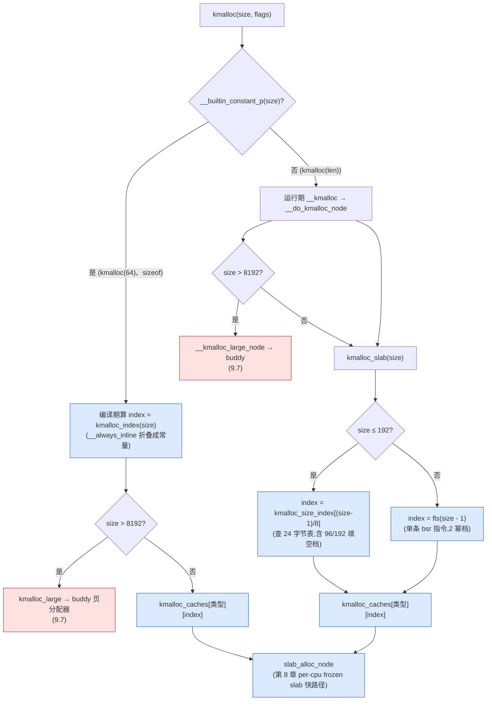

# 第九章 · kmalloc:size class 与全局 cache

> 篇:第 2 篇 · slab/slub(分配·小对象)
> 主线呼应:第 7 章讲了 `kmem_cache`——一种固定大小对象的池子,`task_struct` 一个、`inode` 一个。但内核里到处有 `kmalloc(47)`、`kmalloc(200)` 这种**任意大小**的请求——总不能为 47、200、133 每个数都建一个 cache(那会有无穷多个 cache)。本章就回答:`kmalloc(任意大小)` 怎么落到 slab 上?答案是 **size class**——把任意大小向上取整到一组有限的、精心挑选的"档位"(8/16/32/64/96/128/192/256/512/1024/…),每档一个全局 `kmalloc-<size>` cache;`kmalloc(47)` 进 `kmalloc-64`,`kmalloc(200)` 进 `kmalloc-256`。`kmalloc` 是内核里**最常用**的分配入口,它是 slab 把内存**分出去**这条路上,把"固定大小对象池"推广到"任意大小请求"的那一招。

## 核心问题

**第 7 章的 `kmem_cache` 只能分配固定大小对象(每种类型一个 cache),但 `kmalloc` 要接受任意大小——既不能为每个可能的大小建一个 cache(cache 数会爆炸),也不能只用一个通用 cache(大对象挤小对象、内部碎片失控)。内核怎么把"无限可能的大小"映射到"有限几个 slab cache"上?**

读完本章你会明白:

1. **size class**——内核怎么把任意大小归并到一组有限的档位(为什么是 8/16/32/64/96/128/192/256…这几档,不是别的),档位选取在"碎片率"和"档位数"之间怎么取舍。
2. **`kmalloc_caches` 二维数组**——一组全局 `kmalloc-<size>` cache,按"类型(NORMAL/DMA/CGROUP/RCL/RANDOM)× 档位"组织,`create_kmalloc_caches` 在启动时一次性建好。
3. **`kmalloc` 的两条路**——小对象(≤ `KMALLOC_MAX_CACHE_SIZE = 8192` 字节)走 size-class slab cache(快路径 per-cpu frozen slab);大对象(> 8192)走 `kmalloc_large` 直接找 buddy 页分配器,绕过 slab。讲清分界点和为什么这么切。
4. **`kfree` 怎么知道释放多大的**——slab 对象靠 page 的 `slab_cache` 指针反查所属 cache;大对象靠 folio 的 `__GFP_COMP` 复合页标志 + order。**释放只需一个指针,大小从页元数据反查**,这是 kmalloc 接口"只给指针不给大小"的根基。
5. **kmalloc 的多种变体**——`KMALLOC_NORMAL`/`KMALLOC_DMA`(给 ISA DMA 用)/`KMALLOC_CGROUP`(memcg 记账)/`KMALLOC_RECLAIM`(可回收)/`KMALLOC_RANDOM`(随机化抗喷射),怎么用 GFP 标志在运行时选。

> **逃生阀**:第 7 章讲 `kmem_cache` 是"一种固定大小的对象池",本章把视野放大到"一组覆盖所有大小的池子"。如果你对"为什么不能每 size 一个 cache"觉得这问题有点傻(那不就无穷多个嘛),别急——内核的答案不是"建几个"那么简单,它还要选**哪几个**(为什么有 96、192 这种非 2 的幂),还要处理**编译期 vs 运行期**两种 size(`__builtin_constant_p`),还要给 DMA/memcg/可回收各开一套变体。每个选择背后都有动机。

---

## 9.1 一个被回避的问题:第 7 章只解决了"固定大小"

第 7 章的 `kmem_cache` 设计很漂亮——为每种固定大小的对象建一个池子,`task_struct` 一个 cache、`inode` 一个 cache。但这个设计有个前提:**对象大小在编译期已知**(`sizeof(struct task_struct)`)。内核里确实大量如此,但也有海量代码不能预先知道大小:

```c
// 内核里到处都是这种"大小是运行期变量"的请求
buf = kmalloc(len + 1, GFP_KERNEL);          // len 来自网络包
dev = kmalloc(sizeof(*dev) + n_ports * sizeof(struct port), GFP_KERNEL);  // n 是运行期
p = kmalloc(count * sizeof(struct entry), GFP_KERNEL);  // count 是运行期
skb = kmalloc(sizeof(struct sk_buff) + headroom + user_data_len, GFP_KERNEL);
```

这些 `kmalloc(size)` 的 `size` 是运行期的,可以是任意值——47、133、200、1000、65537……`kmem_cache_create` 不能为它们一一建池子。

> **不这样会怎样**:朴素方案有两种,都不行:
>
> 1. **"每个 size 一个 cache"**:为 1、2、3、…、几百万字节每个建一个 `kmalloc-N` cache。后果:cache 数量爆炸(几百万个 `struct kmem_cache`,每个几百字节,光元数据就几 GB);每个 cache 名下只有少量对象,per-cpu partial 队列切得过碎,缓存局部性崩坏;buddy 给 slab 的页被切得太零散,回收/规整压力巨大。
>
> 2. **"只有一个通用 cache"**:所有 `kmalloc(任意大小)` 都进同一个 cache,按"最大可能大小"(比如 8KB)切对象。后果:要 16 字节的请求也占 8KB,内部碎片率 99.8%;小对象和大对象混在一个 slab,对齐要求互相打架(16 字节对象和 4KB 对象能共用一个 align 吗);freelist 管理混乱。
>
> 这两条死路逼出 size class。

---

## 9.2 一句话点破

> **kmalloc 的招数是:把任意大小向上取整到一组有限的、精心挑选的"档位"(size class),每档一个全局 `kmalloc-<size>` cache。`kmalloc(47)` 进 `kmalloc-64`(浪费 17 字节),`kmalloc(200)` 进 `kmalloc-256`(浪费 56 字节)。档位是 8/16/32/64/96/128/192/256/512/1024/2048/4096/8192——2 的幂为主,中间穿插 96/192 两个"填空档"降低碎片。超过 8192 的请求绕过 slab,直接走 buddy 页分配器。**

这是结论,不是理由。本章倒过来拆:先看档位怎么选(9.3),再看这些 cache 在内核里怎么组织(9.4)、怎么在启动时建好(9.5);然后钻进 `kmalloc(size, flags)` 的真实代码,看清编译期 vs 运行期两条路(9.6)、大对象的 buddy 旁路(9.7)、释放时怎么反查大小(9.8);最后讲 DMA/CGROUP/RCL/RANDOM 四种变体(9.9)和两个招牌技巧(9.10)。

---

## 9.3 size class:把无限可能归并到有限档位

先建立核心抽象。`kmalloc(任意 size)` 的目标:用**有限几个** cache 覆盖**无限可能**的 size,既不让 cache 数爆炸,也不让内部碎片失控。这两个约束是反向的:

- 档位**越少** → 平均浪费越多(只有 8/65536 两档时,`kmalloc(9)` 要占 65536,浪费 65527)。
- 档位**越多** → 浪费越少,但 cache 数膨胀、per-cpu 缓存碎裂。

内核在两者间找平衡,挑出的档位序列(读自 [`kmalloc_info[]`](../linux/mm/slab_common.c#L777-L800))是:

```
8, 16, 32, 64, 96, 128, 192, 256, 512, 1024, 2048, 4096, 8192
(以及更小的 0 档、和超过 8192 但仍登记在 kmalloc_info 里的
 16384, 32768, ..., 2097152 备用——实际是否建 cache 见 9.5)
```

注意三件事:

1. **主流是 2 的幂**(8/16/32/64/128/256/512/1024/2048/4096/8192)——2 的幂对齐简单、易算(`fls(size-1)` 一步出索引)、cache line 友好。
2. **穿插两个非 2 的幂:96、192**。这是"填空档"——没有它们,65~128 字节的请求都得进 `kmalloc-128`(最坏浪费 63 字节,约 49%);有了 `kmalloc-96`,65~96 的请求进 `kmalloc-96`(最坏浪费 31 字节,约 32%)。同理 129~192 进 `kmalloc-192`,省一半。
3. **大请求(> 8192)不走 slab**——直接找 buddy 页分配器。这是 slab 与 buddy 的分界点(9.7 详讲)。

档位表(简化示意,索引含义见 9.4):

| `kmalloc_index` 索引 | 档位(字节) | cache 名 | 典型 size_to_class 覆盖范围 |
|---|---|---|---|
| 0 | 0 | (特殊,`ZERO_SIZE_PTR`) | `kmalloc(0)` |
| 1 | 96 | `kmalloc-96` | 65~96(非 2 幂填空档) |
| 2 | 192 | `kmalloc-192` | 129~192(非 2 幂填空档) |
| 3 | 8 | `kmalloc-8` | 1~8 |
| 4 | 16 | `kmalloc-16` | 9~16 |
| 5 | 32 | `kmalloc-32` | 17~32 |
| 6 | 64 | `kmalloc-64` | 33~64 |
| 7 | 128 | `kmalloc-128` | 97~128 |
| 8 | 256 | `kmalloc-256` | 193~256 |
| 9 | 512 | `kmalloc-512` | 257~512 |
| 10 | 1024 | `kmalloc-1k` | 513~1024 |
| 11 | 2048 | `kmalloc-2k` | 1025~2048 |
| 12 | 4096 | `kmalloc-4k` | 2049~4096 |
| 13 | 8192 | `kmalloc-8k` | 4097~8192(★ slab 上限) |
| > 13 | — | (不建 cache) | > 8192 走 buddy 页分配器 |

(档位和索引的对应读自 [`__kmalloc_index`](../linux/include/linux/slab.h#L472-L512) 和 [`kmalloc_info[]`](../linux/mm/slab_common.c#L777-L800);x86_64 默认 `KMALLOC_SHIFT_LOW=3`、`KMALLOC_SHIFT_HIGH=PAGE_SHIFT+1=13`。)

> **为什么穿插 96、192 而不是 24、48、80、96、160、192 这种更密的填空?** 内核经验数据显示:64~128 和 128~256 这两个区间是 kmalloc 请求最密集的地方(很多内核结构体落在 80~200 字节,如 `sk_buff` 头部、`dentry`、小 buffer)。在这两个区间各插一个 96、192 档,把碎片率从约 50% 降到约 33%,收益最大;再插更细的档(48、80、160),收益递减而 cache 数翻倍,得不偿失。**这是工程取舍,不是数学最优**——内核选定这套档位后基本稳定了十几年。

> **反面对比·只有 2 的幂档位**:假设去掉 96、192,只用 8/16/32/64/128/256/…。那么 `kmalloc(72)`(很常见,比如带几个字段的 buffer)进 `kmalloc-128`,浪费 56 字节,碎片率 44%。全国内核每次 `kmalloc(72)` 都多占 56 字节,累积下来是个不小的数字。插一个 `kmalloc-96` 把它降到浪费 24 字节、碎片率 25%,近乎腰斩。这就是两个非 2 幂档位存在的全部理由。

> **反面对比·每个 size 一个 cache**:假设为每个可能的大小建 cache(`kmalloc-1`、`kmalloc-2`、…、`kmalloc-8192`,共 8192 个)。后果:(a) 每个 cache 一个 `struct kmem_cache`(几百字节)+ per-cpu `kmem_cache_cpu` + per-node partial 队列,8192 个 cache 就是几 MB 元数据;(b) 每个 cache 名下 slab 数稀少,per-cpu partial 切得过碎,缓存局部性差;(c) `/proc/slabinfo` 列出来 8000 多行,运维噩梦。**档位约 13 个,是经验上"够用又不碎"的甜点**。

### 9.3.1 一句话对照:tcmalloc 也是 size class

size class 不是内核独创——用户态分配器(tcmalloc/jemalloc/mimalloc)都用同一招。tcmalloc 的 `SizeMap::ClassToSize` 也是把任意大小归到一组档位(8/16/32/48/64/80/96/128/…),粒度比内核更细(它要服务任意用户 `malloc`,不能预知类型)。第 10 章会正式对照,这里先记住:**kmalloc 的 size class 和 tcmalloc 的 size class 是同一个思想在内核态和用户态的两次落地**。

---

## 9.4 `kmalloc_caches`:一组全局 cache 的二维组织

档位定下来,内核就用一个二维数组把所有 kmalloc cache 组织起来([slab_common.c:656-659](../linux/mm/slab_common.c#L656-L659)):

```c
// mm/slab_common.c#L656-L659
struct kmem_cache *
kmalloc_caches[NR_KMALLOC_TYPES][KMALLOC_SHIFT_HIGH + 1] __ro_after_init =
{ /* initialization for https://llvm.org/pr42570 */ };
EXPORT_SYMBOL(kmalloc_caches);
```

这是一个 `[类型][档位索引]` 的二维表:

- 第一维 `NR_KMALLOC_TYPES`:kmalloc 的**类型变体**(NORMAL/DMA/CGROUP/RCL/RANDOM),见 9.9。
- 第二维 `KMALLOC_SHIFT_HIGH + 1 = 14`:档位索引 0~13(对应 kmalloc_info[] 的 22 项里实际启用的那些,x86_64 启用到 13=8192)。

所以 `kmalloc_caches[KMALLOC_NORMAL][6]` 就是 `kmalloc-64` 这个 cache;`kmalloc_caches[KMALLOC_DMA][6]` 是 `dma-kmalloc-64`(给 DMA 用的 64 字节 cache)。每个元素是一个 `struct kmem_cache *`,指向第 7 章讲的那种对象池。

类型枚举([slab.h:392-414](../linux/include/linux/slab.h#L392-L414)):

```c
// include/linux/slab.h#L392-L414
enum kmalloc_cache_type {
    KMALLOC_NORMAL = 0,
#ifndef CONFIG_ZONE_DMA
    KMALLOC_DMA = KMALLOC_NORMAL,        // 不开 DMA 就是 NORMAL 的别名
#endif
#ifndef CONFIG_MEMCG_KMEM
    KMALLOC_CGROUP = KMALLOC_NORMAL,     // 不开 memcg 就是 NORMAL 的别名
#endif
    KMALLOC_RANDOM_START = KMALLOC_NORMAL,
    KMALLOC_RANDOM_END = KMALLOC_RANDOM_START + RANDOM_KMALLOC_CACHES_NR,  // 15 个随机副本
#ifdef CONFIG_SLUB_TINY
    KMALLOC_RECLAIM = KMALLOC_NORMAL,
#else
    KMALLOC_RECLAIM,                     // 可回收
#endif
#ifdef CONFIG_ZONE_DMA
    KMALLOC_DMA,                         // 给 ISA DMA
#endif
#ifdef CONFIG_MEMCG_KMEM
    KMALLOC_CGROUP,                      // memcg 记账
#endif
    NR_KMALLOC_TYPES
};
```

注意这套 `#ifndef ... = KMALLOC_NORMAL` 的写法——**没开对应配置时,变体就是 NORMAL 的别名,共用同一个 cache**。这是个"配置即别名"的省内存招数:不开 `CONFIG_ZONE_DMA` 就没有 DMA 专用 cache,所有 `__GFP_DMA` 请求都落 NORMAL;开它才会有独立的 `dma-kmalloc-*`。

心智模型:

```
kmalloc_caches[类型][索引]
                 idx: 0    1        2     3     4    5    6    7    8   ... 13
                      (0)  (96)    (192) (8)   (16) (32) (64) (128)(256)   (8192)
[KMALLOC_NORMAL]    →  -   km-96   km-192 km-8 km-16 km-32 km-64 ...
[KMALLOC_RECLAIM]   →  -   km-rcl-96 ...                                (可回收,加 SLAB_RECLAIM_ACCOUNT)
[KMALLOC_DMA]       →  -   dma-kmalloc-96 ...                            (给 ISA DMA,加 SLAB_CACHE_DMA)
[KMALLOC_CGROUP]    →  -   kmalloc-cg-96 ...                             (memcg 记账,加 SLAB_ACCOUNT)
[KMALLOC_RANDOM+1]  →  -   kmalloc-rnd-01-96 ...                         (CONFIG_RANDOM_KMALLOC_CACHES 开启时,15 副本)
...
```

(`__ro_after_init` 表示这数组在 `init` 阶段写好后,之后只读——硬件级别的写保护,见内核 `rodata_full` 机制。)

> **钉死这件事**:kmalloc 的"通用池"不是一个 cache,是**一张二维表**——按类型(NORMAL/DMA/CGROUP/RCL/RANDOM)和档位(8~8192)铺开,共几十个 `kmem_cache`。每个 `kmem_cache` 都是第 7 章讲的那种"固定大小对象池",有自己的 `cpu_slab`/`node[]`/freelist。**`kmalloc(64)` 的本质,是从这张表里挑出 `kmalloc_caches[NORMAL][6]`(即 `kmalloc-64`)这个 cache,再走第 8 章的快路径摘一个对象**。

---

## 9.5 启动时建好:`create_kmalloc_caches`

这张二维表什么时候、怎么填好?在内核启动早期([`create_kmalloc_caches`](../linux/mm/slab_common.c#L910-L942)):

```c
// mm/slab_common.c#L910-L942
void __init create_kmalloc_caches(void)
{
    int i;
    enum kmalloc_cache_type type;

    /* 每种类型 */
    for (type = KMALLOC_NORMAL; type < NR_KMALLOC_TYPES; type++) {
        /* 每个档位索引(KMALLOC_SHIFT_LOW=3 .. KMALLOC_SHIFT_HIGH=13) */
        for (i = KMALLOC_SHIFT_LOW; i <= KMALLOC_SHIFT_HIGH; i++) {
            if (!kmalloc_caches[type][i])
                new_kmalloc_cache(i, type);

            /*
             * Caches that are not of the two-to-the-power-of size.
             * These have to be created immediately after the
             * earlier power of two caches
             */
            /* ★ 建完 idx=6(km-64)顺手建 idx=1(km-96);建完 idx=7(km-128)建 idx=2(km-192) */
            if (KMALLOC_MIN_SIZE <= 32 && i == 6 &&
                    !kmalloc_caches[type][1])
                new_kmalloc_cache(1, type);
            if (KMALLOC_MIN_SIZE <= 64 && i == 7 &&
                    !kmalloc_caches[type][2])
                new_kmalloc_cache(2, type);
        }
    }
#ifdef CONFIG_RANDOM_KMALLOC_CACHES
    random_kmalloc_seed = get_random_u64();
#endif

    /* Kmalloc array is now usable */
    slab_state = UP;
}
```

注意循环里 `i` 从 `KMALLOC_SHIFT_LOW=3`(idx 3 = 8 字节)到 `KMALLOC_SHIFT_HIGH=13`(idx 13 = 8192 字节),建的是 2 的幂档(idx 3、4、5、6、7、…、13)。然后那两个 `if` 是**穿插建 96(idx 1)和 192(idx 2)两个填空档**:

- 建完 `idx=6`(64 字节)紧接着建 `idx=1`(96 字节)——因为 96 的请求会被路由到 kmalloc-96。
- 建完 `idx=7`(128 字节)紧接着建 `idx=2`(192 字节)。

(穿插时机选在"前一个 2 幂档刚建完"是为了引导顺序——早期 slab 还没完全可用时,有些 cache 的创建依赖更小的 cache 已存在,按 size 升序建能避免鸡生蛋问题。)

真正建一个 cache 的 [`new_kmalloc_cache`](../linux/mm/slab_common.c#L860-L903):

```c
// mm/slab_common.c#L860-L903 (简化示意)
static void __init
new_kmalloc_cache(int idx, enum kmalloc_cache_type type)
{
    slab_flags_t flags = 0;
    unsigned int minalign = __kmalloc_minalign();
    unsigned int aligned_size = kmalloc_info[idx].size;
    int aligned_idx = idx;

    /* 按 type 加对应的标志 */
    if ((KMALLOC_RECLAIM != KMALLOC_NORMAL) && (type == KMALLOC_RECLAIM)) {
        flags |= SLAB_RECLAIM_ACCOUNT;                  /* 可回收:告诉 vmscan 这些对象可回收 */
    } else if (IS_ENABLED(CONFIG_MEMCG_KMEM) && (type == KMALLOC_CGROUP)) {
        if (mem_cgroup_kmem_disabled()) {
            kmalloc_caches[type][idx] = kmalloc_caches[KMALLOC_NORMAL][idx];
            return;                                      /* memcg 被禁用,直接复用 NORMAL */
        }
        flags |= SLAB_ACCOUNT;                          /* 记账到 memcg */
    } else if (IS_ENABLED(CONFIG_ZONE_DMA) && (type == KMALLOC_DMA)) {
        flags |= SLAB_CACHE_DMA;                        /* DMA 用,内存来自 DMA zone */
    }

    /* RANDOM 副本禁止合并(每副本独立) */
#ifdef CONFIG_RANDOM_KMALLOC_CACHES
    if (type >= KMALLOC_RANDOM_START && type <= KMALLOC_RANDOM_END)
        flags |= SLAB_NO_MERGE;
#endif

    /* 开了 memcg,普通 kmalloc 也不允许合并(便于按 cg 记账) */
    if (IS_ENABLED(CONFIG_MEMCG_KMEM) && (type == KMALLOC_NORMAL))
        flags |= SLAB_NO_MERGE;

    /* 如果架构要求更大的对齐(MIPS 等),把 size 往上对齐 */
    if (minalign > ARCH_KMALLOC_MINALIGN) {
        aligned_size = ALIGN(aligned_size, minalign);
        aligned_idx = __kmalloc_index(aligned_size, false);
    }

    if (!kmalloc_caches[type][aligned_idx])
        kmalloc_caches[type][aligned_idx] = create_kmalloc_cache(
                    kmalloc_info[aligned_idx].name[type],
                    aligned_size, flags);
    if (idx != aligned_idx)
        kmalloc_caches[type][idx] = kmalloc_caches[type][aligned_idx];
}
```

每个 kmalloc cache 创建时,`create_kmalloc_cache`([slab_common.c:641-654](../linux/mm/slab_common.c#L641-L654))给它打上 `SLAB_KMALLOC` 标志(让别的代码能识别"这是 kmalloc cache",见 [`is_kmalloc_cache`](../linux/mm/slab.h#L437-L440)),然后调 `create_boot_cache` 走第 7 章讲过的 `__kmem_cache_create`/`kmem_cache_open`/`calculate_sizes` 算出 `size`/`inuse`/`offset`/`oo` 等所有布局字段。

每个 kmalloc cache 的 name 读自 [`kmalloc_info[]`](../linux/mm/slab_common.c#L777-L800)(配合宏 [`INIT_KMALLOC_INFO`](../linux/mm/slab_common.c#L762-L770)):

```c
// mm/slab_common.c#L777-L800 (档位表,name/size 都在这里)
const struct kmalloc_info_struct kmalloc_info[] __initconst = {
    INIT_KMALLOC_INFO(0, 0),
    INIT_KMALLOC_INFO(96, 96),       /* → "kmalloc-96" / "kmalloc-rcl-96" / "dma-kmalloc-96" / "kmalloc-cg-96" */
    INIT_KMALLOC_INFO(192, 192),     /* → "kmalloc-192" / ... */
    INIT_KMALLOC_INFO(8, 8),
    INIT_KMALLOC_INFO(16, 16),
    INIT_KMALLOC_INFO(32, 32),
    INIT_KMALLOC_INFO(64, 64),
    INIT_KMALLOC_INFO(128, 128),
    INIT_KMALLOC_INFO(256, 256),
    INIT_KMALLOC_INFO(512, 512),
    INIT_KMALLOC_INFO(1024, 1k),
    INIT_KMALLOC_INFO(2048, 2k),
    INIT_KMALLOC_INFO(4096, 4k),
    INIT_KMALLOC_INFO(8192, 8k),
    /* 下面这些在 kmalloc_info 里登记(给 slab_debug=kmalloc-XX 启动参数用),
       但 x86_64 默认 KMALLOC_SHIFT_HIGH=13,实际不建 cache,超过 8192 走 buddy */
    INIT_KMALLOC_INFO(16384, 16k),
    INIT_KMALLOC_INFO(32768, 32k),
    INIT_KMALLOC_INFO(65536, 64k),
    INIT_KMALLOC_INFO(131072, 128k),
    INIT_KMALLOC_INFO(262144, 256k),
    INIT_KMALLOC_INFO(524288, 512k),
    INIT_KMALLOC_INFO(1048576, 1M),
    INIT_KMALLOC_INFO(2097152, 2M)
};
```

注意 `kmalloc_info[]` 表本身**支持到 2MB**(给 `slab_debug=kmalloc-2M` 这种启动参数用,方便对特定档位单独开调试),但**真正建 cache 的范围**由 `KMALLOC_SHIFT_LOW..KMALLOC_SHIFT_HIGH` 决定,x86_64 上就是 8~8192。`kmalloc_info[]` 里有 16384~2M 这些行,只是登记给调试参数识别,不建 cache——这些大小的 `kmalloc` 请求会走 9.7 的 buddy 旁路。

> **钉死这件事**:kmalloc 全套 cache 在内核启动早期一次性建好(`create_kmalloc_caches` → `slab_state = UP`),之后 `__ro_after_init` 锁定,运行期不再新建/销毁。这和"按需 `kmem_cache_create`"的专用 cache(`inode_cache` 等)不一样——专用 cache 是子系统按需创建的,kmalloc 是**全局通用基础设施**,启动时就得备齐。所以你 `cat /proc/slabinfo` 一开机就能看到 `kmalloc-8`、`kmalloc-64`、…、`kmalloc-8192` 这一长串。

---

## 9.6 `kmalloc(size, flags)`:编译期 vs 运行期两条路

现在钻进 `kmalloc(size, flags)` 的真实代码,看一次请求怎么落到 cache 上。这是本章最核心的代码点。

[`kmalloc`](../linux/include/linux/slab.h#L619-L633) 是 `include/linux/slab.h` 里的内联函数:

```c
// include/linux/slab.h#L619-L633
static __always_inline __alloc_size(1) void *kmalloc(size_t size, gfp_t flags)
{
    if (__builtin_constant_p(size) && size) {
        unsigned int index;

        if (size > KMALLOC_MAX_CACHE_SIZE)
            return kmalloc_large(size, flags);          /* ★ 大对象,9.7 讲 */

        index = kmalloc_index(size);                     /* ★ 编译期算档位索引 */
        return kmalloc_trace(
                kmalloc_caches[kmalloc_type(flags, _RET_IP_)][index],
                flags, size);
    }
    return __kmalloc(size, flags);                       /* ★ 运行期 size,走 __kmalloc */
}
```

这里有 SLUB 性能优化的精髓:**`__builtin_constant_p(size)`** —— 如果 `size` 是编译期常量(`kmalloc(64)`、`sizeof(struct foo)`),走第一条路;否则(运行期变量,`kmalloc(len)`)走第二条。两条路差别巨大:

### 9.6.1 编译期常量 size:直接索引 + 内联

`size` 是编译期常量时,编译器能把 [`kmalloc_index(size)`](../linux/include/linux/slab.h#L514)(展开为 [`__kmalloc_index`](../linux/include/linux/slab.h#L472-L512))**整个在编译期算完**:

```c
// include/linux/slab.h#L472-L512 (节选)
static __always_inline unsigned int __kmalloc_index(size_t size,
                                                    bool size_is_constant)
{
    if (!size)
        return 0;
    if (size <= KMALLOC_MIN_SIZE)
        return KMALLOC_SHIFT_LOW;
    if (KMALLOC_MIN_SIZE <= 32 && size > 64 && size <= 96)
        return 1;                                       /* 96 档 */
    if (KMALLOC_MIN_SIZE <= 64 && size > 128 && size <= 192)
        return 2;                                       /* 192 档 */
    if (size <=          8) return 3;
    if (size <=         16) return 4;
    if (size <=         32) return 5;
    if (size <=         64) return 6;
    if (size <=        128) return 7;
    if (size <=        256) return 8;
    if (size <=        512) return 9;
    if (size <=       1024) return 10;
    if (size <=   2 * 1024) return 11;
    if (size <=   4 * 1024) return 12;
    if (size <=   8 * 1024) return 13;                  /* KMALLOC_SHIFT_HIGH */
    ...
}
```

因为 `size` 是常量、`__always_inline`、`size_is_constant=true`,编译器把这堆 `if` 在编译期全部折叠,最后**生成出来的机器码就是一句**:`kmalloc_caches[NORMAL][6]`(对 `kmalloc(64)` 而言)——一次数组索引、一条 `call slab_alloc_node`。**所有"算档位"的开销在编译期就消失了**。

> **不这样会怎样**:假设不分编译期/运行期,所有 `kmalloc(size)` 都走 `__kmalloc` → `__do_kmalloc_node` → `kmalloc_slab`(查表 / `fls`)。后果:每次 `kmalloc(64)` 都要在运行期多一次表查找 + 分支判断(几十纳秒),而内核里 `kmalloc(常量)` 占绝大多数(`kmalloc(sizeof(*p))` 这种)。把编译期能算的全算掉,是 C 库函数 + `__always_inline` + `__builtin_constant_p` 这套组合的标准优化范式(`glibc` 的 `memcpy`/`strlen` 也这么干)。

### 9.6.2 运行期变量 size:走 `__kmalloc` → `__do_kmalloc_node` → `kmalloc_slab`

`size` 不是编译期常量(`kmalloc(len)`,`len` 来自网络包长度等)时,走 [`__kmalloc`](../linux/mm/slub.c#L3983-L3986) → [`__do_kmalloc_node`](../linux/mm/slub.c#L3953-L3975):

```c
// mm/slub.c#L3953-L3975
static __always_inline
void *__do_kmalloc_node(size_t size, gfp_t flags, int node,
                        unsigned long caller)
{
    struct kmem_cache *s;
    void *ret;

    /* ★ 大对象走 buddy 旁路,9.7 讲 */
    if (unlikely(size > KMALLOC_MAX_CACHE_SIZE)) {
        ret = __kmalloc_large_node(size, flags, node);
        trace_kmalloc(caller, ret, size,
                      PAGE_SIZE << get_order(size), flags, node);
        return ret;
    }

    if (unlikely(!size))
        return ZERO_SIZE_PTR;                           /* kmalloc(0) 返回非 NULL 的特殊值 */

    s = kmalloc_slab(size, flags, caller);              /* ★ 按 size 选 cache */

    ret = slab_alloc_node(s, NULL, flags, node, caller, size);   /* 走第 8 章的 slab 快路径 */
    ret = kasan_kmalloc(s, ret, size, flags);
    trace_kmalloc(caller, ret, size, s->size, flags, node);
    return ret;
}
```

运行期选 cache 的 [`kmalloc_slab`](../linux/mm/slab.h#L405-L416):

```c
// mm/slab.h#L405-L416
static inline struct kmem_cache *
kmalloc_slab(size_t size, gfp_t flags, unsigned long caller)
{
    unsigned int index;

    if (size <= 192)
        index = kmalloc_size_index[size_index_elem(size)];  /* ★ 小 size 查表(处理 96/192 填空档) */
    else
        index = fls(size - 1);                              /* ★ 大 size 用 fls 找 2 幂档 */

    return kmalloc_caches[kmalloc_type(flags, caller)][index];
}
```

这段代码里有 SLUB 的两招:

1. **`size <= 192` 查表 [`kmalloc_size_index[24]`](../linux/mm/slab_common.c#L672-L697)**:因为 192 以内有非 2 幂的 96、192 档,光用 `fls` 找不出来(65 字节的 `fls(64)=7`→idx 7=128 字节档,但 65~96 应该进 96 档=idx 1)。于是用一个 24 项的查找表,每项对应 8 字节区间(`size_index_elem(bytes) = (bytes-1)/8`),值就是档位索引:

```c
// mm/slab_common.c#L672-L697 (节选)
u8 kmalloc_size_index[24] __ro_after_init = {
    3,  /*  8 → idx3 (kmalloc-8)   */
    4,  /* 16 → idx4 (kmalloc-16)  */
    5,  /* 24 → idx5 (kmalloc-32)  */
    5,  /* 32 */
    6,  /* 40 → idx6 (kmalloc-64)  */
    6,  /* 48 */
    6,  /* 56 */
    6,  /* 64 */
    1,  /* 72 → idx1 (kmalloc-96)  ★ 填空档! */
    1,  /* 80 */
    1,  /* 88 */
    1,  /* 96 */
    7,  /* 104 → idx7 (kmalloc-128) */
    7,  /* 112 */
    7,  /* 120 */
    7,  /* 128 */
    2,  /* 136 → idx2 (kmalloc-192) ★ 填空档! */
    2,  /* 144 */
    ...
    2   /* 192 */
};
```

   这张表是 SLUB 处理 96/192 填空档的关键——它把"65~96 进 96 档、129~192 进 192 档"这件不太规则的事用一张 24 字节的表记住,运行期一次查找就完。表的某些项会被 [`setup_kmalloc_cache_index_table`](../linux/mm/slab_common.c#L813-L847)(MIPS 等高对齐架构)按 `ARCH_KMALLOC_MINALIGN` 改写,以跳过 96/192 档(架构对齐大于 64 时,96 档没用,见 9.9)。

2. **`size > 192` 用 `fls(size - 1)`**:192 以上全是 2 的幂档位(256/512/…/8192),`fls(size-1)`(找最高 set bit)直接给出档位索引。`fls` 是单条 CPU 指令(`bsr` on x86),极快。

把这两条画成流程图:



> **钉死这件事**:`kmalloc` 编译期/运行期两条路的根本目的,是把"算档位"这件事尽可能挪到编译期。绝大多数 `kmalloc(sizeof(*p))` 这种用法,编译器直接生成"取某个固定 cache 的对象",运行期零选档开销;只有 `kmalloc(len)` 这种真的运行期才知道大小的,才走 `__do_kmalloc_node` → `kmalloc_slab` 多花一次表查找。**这是 C 库"用 `__builtin_constant_p` + `__always_inline` 做编译期特化"的教科书案例**,和 `memcpy` 常量长度展开一个道理。

---

## 9.7 大对象的 buddy 旁路:`kmalloc_large`

前面一直说"超过 8192 字节绕过 slab",现在拆清楚。分界点是 [`KMALLOC_MAX_CACHE_SIZE`](../linux/include/linux/slab.h#L356):

```c
// include/linux/slab.h#L347-L358
#define KMALLOC_SHIFT_HIGH      (PAGE_SHIFT + 1)        /* x86_64: 12+1 = 13 */
#define KMALLOC_SHIFT_MAX       (MAX_PAGE_ORDER + PAGE_SHIFT)   /* 10+12 = 22,对应 4MB */
#define KMALLOC_MAX_SIZE        (1UL << KMALLOC_SHIFT_MAX)     /* 4MB,kmalloc 能请求的最大值 */
#define KMALLOC_MAX_CACHE_SIZE  (1UL << KMALLOC_SHIFT_HIGH)    /* 8192,走 slab 的最大值 */
#define KMALLOC_MAX_ORDER       (KMALLOC_SHIFT_MAX - PAGE_SHIFT)
```

(注释 [slab.h:343-346](../linux/include/linux/slab.h#L343-L346) 明说:"SLUB directly allocates requests fitting in to an order-1 page (PAGE_SIZE*2). Larger requests are passed to the page allocator.")

也就是说:**`kmalloc(size)`,size ≤ 8192 走 slab(单页/双页 slab),size > 8192 走 buddy**。分界在 8192 = 2 页 = order 1。这个选择是有道理的:

> **为什么不建更大的 kmalloc cache(比如 kmalloc-1M)?** 原因有三:
>
> 1. **slab 管理大对象不划算**:slab 的优势是"在 1~2 页里切几十个小对象,freelist 摘/挂 O(1)"。对象越大,每页能装的对象越少,slab 元数据(每个 slab 一个 `struct slab`,partial 队列挂点)占的比例越高。一个 1MB 的对象,一个 slab 就 256 页,里面只装 1 个对象——slab 的"紧凑摆放 + freelist"优势全废,退化为"一页一对象"。
>
> 2. **回收压力**:slab 页是 `NR_SLAB_UNRECLAIMABLE_B`(不可回收)或 `NR_SLAB_RECLAIMABLE_B`(可回收),大对象堆在 slab 里挤占 buddy 的连续页资源,内存紧张时回收/规整更难。直接走 buddy,大对象的页挂回 buddy 的 `free_area[]`,和其他页一样参与合并/规整。
>
> 3. **buddy 处理大块本来就是强项**:buddy 按 order(2^N 页)管理,order 1~10 覆盖 8KB~4MB,正是大对象的范围。把大对象交给 buddy,既享受 buddy 的合并抗碎片(第 3 章),又避免 slab 的"每页一对象"退化。

大对象走 buddy 的入口是 [`__kmalloc_large_node`](../linux/mm/slub.c#L3907-L3930):

```c
// mm/slub.c#L3907-L3930
static void *__kmalloc_large_node(size_t size, gfp_t flags, int node)
{
    struct folio *folio;
    void *ptr = NULL;
    unsigned int order = get_order(size);               /* ★ 按 size 算最小 order */

    if (unlikely(flags & GFP_SLAB_BUG_MASK))
        flags = kmalloc_fix_flags(flags);

    flags |= __GFP_COMP;                                /* ★ 标记"复合页",释放时凭此识别 */
    folio = (struct folio *)alloc_pages_node(node, flags, order);   /* 找 buddy 要页 */
    if (folio) {
        ptr = folio_address(folio);
        lruvec_stat_mod_folio(folio, NR_SLAB_UNRECLAIMABLE_B,
                              PAGE_SIZE << order);      /* 记账:slab 不可回收 */
    }

    ptr = kasan_kmalloc_large(ptr, size, flags);
    kmemleak_alloc(ptr, size, 1, flags);
    kmsan_kmalloc_large(ptr, size, flags);

    return ptr;
}
```

关键三步:

1. **`order = get_order(size)`**:按请求的 size 算出最小能放下的 buddy order(`get_order(8193)=1`,因为 8193 > 8192 = 2 页)。
2. **`flags |= __GFP_COMP`**:**复合页标志**——告诉 buddy "这是一组连续页组成的复合 folio",`struct folio` 的元数据只在第一页,但 order 信息存在 folio 里。**这个标志是大对象释放时识别身份的关键**(9.8 详讲)。
3. **`alloc_pages_node`**:走第 4 章讲的 `__alloc_pages` 快慢路径,从 buddy 的 `free_area[order]` 拿一组连续页。

返回的指针是这块连续页的起始地址(页对齐)。注意 `__assume_page_alignment` 注解([slab.h:559](../linux/include/linux/slab.h#L559))——**大对象返回页对齐地址**,而小对象 slab 返回的是 `ARCH_KMALLOC_MINALIGN` 对齐(通常 8 字节)。这是 kmalloc 接口的一个细节:**对齐取决于走哪条路**——这有时会让调用者 surprise(他可能以为总能拿到 8 字节对齐,但拿到的是页对齐,反而更好)。

> **反面对比·所有请求都走 slab**:假设让 kmalloc-1M、kmalloc-4M 也都建 cache 走 slab。后果:(a) 这些 cache 名下每个 slab 都是几百页的大块,buddy 的 `free_area[high order]` 被切得七零八落,高阶分配(THP、网络大 buffer)拿不到;(b) 一个 slab 只装一两个对象,freelist 优势全废;(c) `NR_SLAB_UNRECLAIMABLE_B` 统计失真(大块占用的页混在 slab 里,分不清是"真 slab 对象"还是"借 slab 名义的大块分配")。**slab 适合"页内切多个小对象",buddy 适合"按页块分配大块",各司其职**——这条分界线划在 8192,是十几年实测下来的甜点。

---

## 9.8 释放:`kfree` 怎么知道释放多大的?

kmalloc 的接口有个不对称:**分配给 size**,但**释放只给指针**(`kfree(ptr)`,不给 size)。kfree 怎么知道这个 ptr 是 64 字节的 slab 对象,还是 64KB 的 buddy 大块?

答案:**靠页的元数据反查**。这是 mm"释放只给指针"能成立的根基,几乎所有释放路径(`kfree`、`__free_pages`、用户态 `free`)都靠某种形式的反查。

[`kfree`](../linux/mm/slub.c#L4376-L4397):

```c
// mm/slub.c#L4376-L4397
void kfree(const void *object)
{
    struct folio *folio;
    struct slab *slab;
    struct kmem_cache *s;
    void *x = (void *)object;

    trace_kfree(_RET_IP_, object);

    if (unlikely(ZERO_OR_NULL_PTR(object)))
        return;                                         /* kmalloc(0) 返回的 ZERO_SIZE_PTR,直接返回 */

    folio = virt_to_folio(object);                      /* ★ 从虚拟地址反查所属 folio */

    if (unlikely(!folio_test_slab(folio))) {
        free_large_kmalloc(folio, (void *)object);      /* ★ 不是 slab → 是大对象,走 buddy 释放 */
        return;
    }

    slab = folio_slab(folio);                           /* ★ 是 slab,转成 slab 视图 */
    s = slab->slab_cache;                               /* ★ 从 slab 反查所属 cache */
    slab_free(s, slab, x, _RET_IP_);                    /* ★ 走第 8 章的 slab_free(挂 freelist 头) */
}
```

两条路,凭 `folio_test_slab(folio)` 区分:

### 9.8.1 小对象:从 folio 反查 cache

slab 对象所在的页,其 `struct folio`(== `struct page` 的头部,第 2 章)被打上了 `PG_slab` 标志(buddy 把页交给 slab 时打的)。所以 `folio_test_slab(folio)` 返回 true,说明这个 ptr 落在某个 slab 上。

然后 [`slab = folio_slab(folio)`](../linux/mm/slab.h)——把 `struct folio` 头部 reinterpret 成 `struct slab`(第 7 章讲过,`struct slab` 复用 `struct page` 的位),拿到 slab 描述符。`slab->slab_cache` 就指向这个 slab 所属的 `kmem_cache`——**第 7 章 [`allocate_slab`](../linux/mm/slub.c#L2322-L2387) 里那行 `slab->slab_cache = s` 的伏笔,这里用上了**。

拿到 `s`,`slab_free(s, slab, x, ...)` 就是第 7、8 章讲的"挂 freelist 头"——把释放对象挂到当前 slab 的 freelist 链头,cmpxchg 无锁快路径或 `__slab_free` 慢路径。

**所以释放一个 slab 对象,根本不需要知道它多大**——它的 size 信息存在所属 `kmem_cache` 的 `s->size` 字段里,从页元数据反查 `s` 就拿到了。这个设计让 `kfree(ptr)` 的接口极简(一个参数),且**永远不会"释放大小不匹配"**——ptr 决定了 folio,folio 决定了 slab,slab 决定了 cache,cache 决定了 size,一环扣一环,不会错。

### 9.8.2 大对象:`free_large_kmalloc` 还给 buddy

`folio_test_slab(folio)` 返回 false,说明这个 ptr 不在 slab 上——那它一定是 9.7 节 `__kmalloc_large_node` 走 buddy 分配的大块。释放走 [`free_large_kmalloc`](../linux/mm/slub.c#L4354-L4368):

```c
// mm/slub.c#L4354-L4368
static void free_large_kmalloc(struct folio *folio, void *object)
{
    unsigned int order = folio_order(folio);            /* ★ 从 folio 拿 order */

    if (WARN_ON_ONCE(order == 0))
        pr_warn_once("object pointer: 0x%p\n", object); /* order=0 应该走 slab,不该到这 */

    kmemleak_free(object);
    kasan_kfree_large(object);
    kmsan_kfree_large(object);

    lruvec_stat_mod_folio(folio, NR_SLAB_UNRECLAIMABLE_B,
                          -(PAGE_SIZE << order));       /* 减去当初记的账 */
    folio_put(folio);                                   /* ★ 归还 buddy */
}
```

大对象的"size 信息"存在哪?**存在 folio 自己的 order 字段里**——`__kmalloc_large_node` 当初分配时 `flags |= __GFP_COMP`,buddy 给的复合 folio 记住了 order(几页),`folio_order(folio)` 一查就知道。`folio_put` 把这组页还给 buddy 的 `__free_pages`,走第 5 章的合并伙伴路径。

> **钉死这件事**:kfree 能"只给指针不给 size"释放,根基是**页的元数据自带身份信息**:slab 页有 `PG_slab` 标志 + `slab->slab_cache` 指针(指向 cache,cache 里有 size);buddy 大块页是带 `__GFP_COMP` 的复合 folio,folio 字段记住 order。**指针 → folio(via `virt_to_folio`)→ 身份(slab 还是 buddy)→ size**,这条反查链是 mm 所有"释放只给指针"接口的统一根基,第 5 章的 `__free_pages`、第 15 章用户态 `free` 也是同构思路。

### 9.8.3 `ksize`:事后查实际分配大小

有时调用者确实想知道"我这次 kmalloc 实际拿到了多少字节"(比如想复用多余的尾部空间),有 [`ksize`](../linux/mm/slab_common.c#L956-L978) 接口(底层 [`__ksize`](../linux/mm/slab_common.c#L956-L978)):

```c
// mm/slab_common.c#L956-L978 (简化示意)
size_t __ksize(const void *object)
{
    struct folio *folio;

    if (unlikely(object == ZERO_SIZE_PTR))
        return 0;

    folio = virt_to_folio(object);

    if (unlikely(!folio_test_slab(folio))) {
        /* 大对象 */
        if (WARN_ON(folio_size(folio) <= KMALLOC_MAX_CACHE_SIZE))
            return 0;
        return folio_size(folio);                       /* 返回 folio 实际大小(PAGE_SIZE << order) */
    }

    return slab_ksize(folio_slab(folio)->slab_cache);   /* slab 对象,返回 cache 的 slab_ksize */
}
```

`ksize` 返回的是**实际占用的字节数**(slab 对象的 `slab_ksize`,或大对象的 `folio_size`),可能比请求的 size 大(比如 `kmalloc(47)` 实际占 64 字节)。注释明确警告:[slab_common.c:949-952](../linux/mm/slab_common.c#L949-L952) "It is not meant to be a way to discover the usable size of an allocation after the fact"——**不鼓励用 ksize 探测可用空间然后越界用**(会触发 KASAN/UBSAN/FORTIFY 检查),它主要是内核内部记账用。

[`slab_ksize`](../linux/mm/slab.h#L578-L601) 返回值有讲究:开 `SLAB_RED_ZONE`/`SLAB_POISON` 调试时返回 `object_size`(不含 redzone),否则返回 `s->size`(含对齐 padding,即对象实际占的槽位大小)。这是"调试模式牺牲一点空间换 redzone 检测"的体现(第 7 章讲过)。

---

## 9.9 kmalloc 的变体:DMA / CGROUP / RECLAIM / RANDOM

前面一直说"kmalloc 进 kmalloc-64 cache",其实准确说是进 `kmalloc_caches[类型][6]`,这里的"类型"由 GFP 标志在运行期选。这就是 kmalloc 的**变体机制**——同一套档位,按用途分 NORMAL/DMA/CGROUP/RCL/RANDOM 几套。

### 9.9.1 选类型:`kmalloc_type(flags)`

[`kmalloc_type`](../linux/include/linux/slab.h#L429-L457) 是个内联函数,根据 GFP 标志选类型:

```c
// include/linux/slab.h#L429-L457
static __always_inline enum kmalloc_cache_type kmalloc_type(gfp_t flags, unsigned long caller)
{
    /* 最常见情况:无特殊标志 → NORMAL */
    if (likely((flags & KMALLOC_NOT_NORMAL_BITS) == 0))
#ifdef CONFIG_RANDOM_KMALLOC_CACHES
        /* RANDOM_KMALLOC_CACHES_NR (=15) 副本 + NORMAL */
        return KMALLOC_RANDOM_START + hash_64(caller ^ random_kmalloc_seed,
                                              ilog2(RANDOM_KMALLOC_CACHES_NR + 1));
#else
        return KMALLOC_NORMAL;
#endif

    /* 至少有一个特殊标志,按优先级 */
    if (IS_ENABLED(CONFIG_ZONE_DMA) && (flags & __GFP_DMA))
        return KMALLOC_DMA;                             /* 优先级 1:DMA */
    if (!IS_ENABLED(CONFIG_MEMCG_KMEM) || (flags & __GFP_RECLAIMABLE))
        return KMALLOC_RECLAIM;                         /* 优先级 2:可回收 */
    else
        return KMALLOC_CGROUP;                          /* 优先级 3:memcg 记账 */
}
```

`KMALLOC_NOT_NORMAL_BITS`([slab.h:422-425](../linux/include/linux/slab.h#L422-L425))是几个标志的组合:`__GFP_RECLAIMABLE | __GFP_DMA | __GFP_ACCOUNT`。一个都没有,就是最普通的 NORMAL 分配;有任一个,按优先级(DMA > RECLAIM > CGROUP)选。

> **优先级的意思**:`__GFP_DMA | __GFP_ACCOUNT` 同时设时,选 DMA(因为 ISA DMA 必须用 DMA zone 的物理页,这个是硬约束;memcg 记账是软约束,可以记到 root cgroup)。这是个"硬约束优先于软约束"的取舍。

### 9.9.2 四种变体的用途

| 变体 | cache 名前缀 | 触发标志 | 用途 |
|---|---|---|---|
| `KMALLOC_NORMAL` | `kmalloc-` | (无特殊标志) | 普通内核对象,绝大部分 kmalloc 走这里 |
| `KMALLOC_DMA` | `dma-kmalloc-` | `__GFP_DMA` | 给 ISA DMA 设备(只能访问 16MB 以下物理内存);cache 创建时加 `SLAB_CACHE_DMA`,页来自 DMA zone |
| `KMALLOC_CGROUP` | `kmalloc-cg-` | `__GFP_ACCOUNT`(且未设 RECLAIM/DMA) | memcg 记账——分配计入触发它的进程的 memory cgroup,用于限额 |
| `KMALLOC_RECLAIM` | `kmalloc-rcl-` | `__GFP_RECLAIMABLE` | 可回收对象(调用者承诺这内存可被回收/丢弃,如 cache);cache 加 `SLAB_RECLAIM_ACCOUNT`,vmscan 统计区分 |
| `KMALLOC_RANDOM_*`(15 副本) | `kmalloc-rnd-01-` … `kmalloc-rnd-15-` | (无,`CONFIG_RANDOM_KMALLOC_CACHES` 启用时自动) | 随机化——按调用地址哈希到 15 个副本之一,让相同 size 的不同调用者分散到不同 cache,抗 heap 喷射攻击 |

每个变体创建时打不同的标志([`new_kmalloc_cache`](../linux/mm/slab_common.c#L860-L903) 里那些 `flags |=`),最终影响 slab 的行为(DMA 强制页来自 DMA zone、RECLAIM 告诉 vmscan 这些对象可回收、CGROUP 触发 memcg 记账、RANDOM 禁止合并保持各副本独立)。

> **为什么要分这么多变体?** 因为"内存来自哪、归谁账、能不能回收、是否抗攻击"这四件事是**正交的约束**,把它们混在一个 cache 里没法区分。分开设:
>
> - **DMA 独立**:ISA DMA 设备只能访问低 16MB 物理内存,这些页必须来自 DMA zone(第 2 章 zone),和 NORMAL 的页分开管理。
> - **CGROUP 独立**:memcg 限额要求"这个进程的内核分配要计入它的 cgroup",如果和 NORMAL 混用,没法把单次分配归到正确的 cgroup(同一个 cache 里的对象可能来自不同 cgroup 的进程)。
> - **RECLAIM 独立**:vmscan 统计要区分"slab 不可回收对象"和"slab 可回收对象",后者(如 dentry/inode cache 的某些部分)在内存紧张时可以丢弃,前者不能。分 cache 让 `NR_SLAB_RECLAIMABLE_B` / `NR_SLAB_UNRECLAIMABLE_B` 统计准确。
> - **RANDOM 独立**:CONFIG_RANDOM_KMALLOC_CACHES 是 6.x 加的抗 heap 喷射特性——同 size 的不同调用者(比如 `cred` 结构和某个 buffer 都 192 字节)哈希到不同 cache,攻击者喷射大量 192 字节对象时,不能保证喷射到 `cred` 所在的 cache(他不知道 `cred` 用的是 15 个副本里的哪个)。这个特性默认不开,部分发行版(如 hardened Linux)会开。

### 9.9.3 RANDOM_KMALLOC_CACHES:新版抗攻击特性

`CONFIG_RANDOM_KMALLOC_CACHES`(默认 15 个副本)是值得单独提一句的新特性。它把 `KMALLOC_NORMAL` 拆成 16 份(1 个 NORMAL + 15 个 RANDOM)。每次 kmalloc,按**调用地址 + 全局随机种子**哈希到 16 份之一([slab.h:436-440](../linux/include/linux/slab.h#L436-L440)):

```c
return KMALLOC_RANDOM_START + hash_64(caller ^ random_kmalloc_seed,
                                      ilog2(RANDOM_KMALLOC_CACHES_NR + 1));
```

`caller` 是 `_RET_IP_`(调用 kmalloc 的函数地址),每个调用点的 caller 不同 → 哈希到不同副本,且开机时 `random_kmalloc_seed` 随机生成,跨机器/跨重启不同。这把"喷射一堆 kmalloc-192 占位然后利用 UAF 改写"这类攻击的概率从"几乎 100%"降到"约 1/16"——攻击者不知道目标对象在 16 个 cache 中的哪个,无法保证喷射覆盖。

代价是 cache 数翻 16 倍(每档 16 份),per-cpu partial 也跟着切细,有些性能损失。所以它默认关闭,只在 hardened 发行版开启——是"性能换安全"的取舍。**这是 slab 安全演进的延续**:第 7 章的 freelist 混淆(防单 cache 内劫持)→ 第 8 章的 freelist 随机化(防相邻对象溢出)→ 这里的多副本(防跨调用者喷射),层层设防。

---

## 9.10 技巧精解:size class + 释放反查

本章挑两个最硬核的技巧,配真实源码 + 反面对比拆透。

### 技巧一:size class——把无限归并到有限(配两档填空)

size class 是本章的核心技巧,但它的精妙不在"有档位"(这谁都想得到),而在**档位怎么选**——具体说就是 96、192 这两个非 2 幂填空档的存在。我们用反面对比让它的妙处显形。

```c
// mm/slab_common.c#L672-L697 (这是 96/192 填空档的全部代码——一张 24 字节的查找表)
u8 kmalloc_size_index[24] __ro_after_init = {
    3,  /*  8 */
    4,  /* 16 */
    5,  /* 24 */
    5,  /* 32 */
    6,  /* 40 */
    6,  /* 48 */
    6,  /* 56 */
    6,  /* 64 */
    1,  /* 72 */     /* ★ 65~96 都进 idx1=kmalloc-96 */
    1,  /* 80 */
    1,  /* 88 */
    1,  /* 96 */
    7,  /* 104 */    /* 97~128 进 idx7=kmalloc-128 */
    7,  /* 112 */
    7,  /* 120 */
    7,  /* 128 */
    2,  /* 136 */    /* ★ 129~192 都进 idx2=kmalloc-192 */
    ...
    2   /* 192 */
};
```

**反面对比·方案 A(纯 2 幂档位)**:去掉 96、192,只保留 8/16/32/64/128/256/…。那么 `kmalloc(72)`(一个很常见的请求,比如带点附加字段的 buffer)进 `kmalloc-128`,占 128 字节,浪费 56 字节,碎片率 44%。内核里类似 72~96 字节的请求每秒成千上万次,累积浪费可观。

**反面对比·方案 B(过密填空,48/80/96/160/192 全开)**:假设在 64~128 之间插 48、80、96,128~256 之间插 160、192、256,共 7 档。碎片率确实更低(平均降到 ~20%),但 cache 数从 13 涨到 17,per-cpu partial 队列切得更细,`struct kmem_cache` 元数据多几 KB,缓存局部性反而下降。**实测下来收益不抵代价**,所以内核只选了 96、192 这两个收益最大的填空档。

**当前方案(96、192)**:在"碎片率"和"cache 数"之间取甜点——65~96 的常见请求碎片率从 44% 降到 25%,129~192 同理,收益最大;只多 2 个 cache,代价可忽略。这是工程经验沉淀,**不是数学最优,是实测最优**。

**另一个妙处——`fls` 与查表的双路**:`kmalloc_slab` 对 size ≤ 192 用查表(因为 96/192 不规则,`fls` 找不出),size > 192 用 `fls`(全是 2 幂,一条指令搞定)。这个分界**正好卡在"192 以内需要表,以上不需要"**——表只 24 字节,正好覆盖最不规则的小 size 区间;大 size 用 `fls` 单条指令,零开销。如果填空档出现在大 size(比如搞一个 kmalloc-768),就得把表扩到 96 项,得不偿失——这也是为什么填空档只在小 size 出现。

> **钉死这件事**:size class 的精髓不是"建几个档",而是**"哪几档"** ——96、192 这两个非 2 幂填空档的存在,是内核十几年实测沉淀的工程甜点。它把最常见的 64~128、128~256 区间碎片率腰斩,只多 2 个 cache。配合 `size ≤ 192 查表 / > 192 用 fls` 的双路查找,把"填空档的查表开销"严格限制在最小的 24 字节表内。**这是 Linux mm"工程取舍优于数学最优"哲学的典型体现**。

### 技巧二:释放只给指针——页元数据反查

第二个技巧是 `kfree(ptr)` 不需要 size 这件事背后的反查链。这条反查链不是 kmalloc 独有,而是 mm 所有"释放只给指针"接口的统一根基,本章把它在 slab/buddy 分界处讲透。

```c
// mm/slub.c#L4388-L4396 (kfree 的核心)
folio = virt_to_folio(object);                      /* ① 指针 → folio */
if (unlikely(!folio_test_slab(folio))) {
    free_large_kmalloc(folio, (void *)object);      /* ②a 不是 slab → 大对象,folio 自带 order */
    return;
}
slab = folio_slab(folio);                           /* ②b 是 slab → folio 转 slab 视图 */
s = slab->slab_cache;                               /* ③ slab → 所属 cache(cache 里有 size) */
slab_free(s, slab, x, _RET_IP_);                    /* ④ 走 slab 释放(挂 freelist 头) */
```

**反面对比·方案 A(分配时返回 size,释放时带回)**:假设 kmalloc 接口设计成 `ptr = kmalloc(size); ...; kfree(ptr, size);`——要求调用者记住 size。后果:

1. **API 负担**:每个调用者要存 size,struct 里多一个字段、栈上多一个变量,内核代码膨胀。`file_operations`、`net_device` 等大量结构体都得加 size 字段。
2. **正确性风险**:调用者记错 size 是难以避免的 bug(尤其 size 是运行期算出来的)。释放大小不匹配,要么踩到相邻对象(太小),要么漏掉尾巴页(太大),极难排查。
3. **和"size class 实际占用大于请求"冲突**:`kmalloc(47)` 实际占 64 字节,调用者记 47 还是 64?记 47 释放会漏;记 64 调用者又不知道(他请求的是 47)。

**当前方案(释放只给指针)**:把"size 信息"存在**页的元数据**里(slab 页存 `slab_cache` 指针,buddy 大块存 `folio->order`),释放时反查。代价是每个物理页要有元数据(`struct page`/`struct folio`,第 2 章技巧精解讲过怎么省内存),但这套元数据本来就要存在(页的总账本),顺手存个身份信息零额外开销。

**反面对比·方案 B(独立的"分配账本")**:假设不靠页元数据,而是维护一个全局哈希表 `ptr → size`。后果:哈希表本身占大量内存(几百万对象的哈希表),查找开销(每次释放一次哈希),并发锁竞争(全局表要锁)。**页元数据是"账本已存在,顺手记身份"——零额外开销**。

> **钉死这件事**:"释放只给指针"是 mm 接口设计的统一哲学,根基是**页的元数据自带身份**。`virt_to_folio` 是这条反查链的入口(给定虚拟地址,O(1) 算出所属物理页的 `struct folio`,靠 `vmemmap` 数组,第 2 章),然后 folio 的标志/字段决定后续(slab 还是 buddy、哪个 cache、什么 order)。第 5 章的 `__free_pages`、第 12 章 `mmap` 的反向、第 15 章 rmap 反查 PTE,都是这条哲学的不同表现——**指针 → 页 → 身份**,是 mm 的"看指针知一切"。

---

## 章末小结

这一章把 `kmalloc` 拆透了。它不是什么新分配器,而是**第 7、8 章的 slab 在"任意大小请求"上的推广**。核心就四件事:

1. **size class**:把任意大小归并到有限档位(8/16/32/64/96/128/192/256/…/8192),2 幂为主 + 96/192 两个填空档降低碎片。`kmalloc(47)` 进 `kmalloc-64`,`kmalloc(200)` 进 `kmalloc-256`。
2. **`kmalloc_caches` 二维表**:一组全局 cache,按"类型(NORMAL/DMA/CGROUP/RCL/RANDOM)× 档位"铺开,启动时 `create_kmalloc_caches` 一次性建好,`__ro_after_init` 锁定。
3. **两条路**:小对象(≤ 8192)走 slab size-class cache → 第 8 章的 per-cpu frozen slab 快路径;大对象(> 8192)走 `kmalloc_large` → buddy 页分配器(`__GFP_COMP` 复合页)。分界在 8192 = order 1,因为更大对象走 slab 不划算。
4. **释放反查**:`kfree(ptr)` 靠 `virt_to_folio` → `folio_test_slab` 反查身份,slab 对象从 `slab->slab_cache` 拿 size,大对象从 `folio->order` 拿 size——**释放只给指针,大小从页元数据反查**。

加上编译期/运行期的特化(`__builtin_constant_p` + `__always_inline` 把档位选择尽量挪到编译期),kmalloc 在保持接口极简(`kmalloc(size, flags)`、`kfree(ptr)`)的同时,把性能榨到接近"直接调 slab_alloc"。

本章服务二分法的**分配**那一面:kmalloc 是内核**最常用**的分配入口,是 slab 把内存分出去这条路上的主力。它把"第 7 章的固定大小对象池"推广到"任意大小请求",让 slab 真正成为内核小对象分配的通用基础设施。本章也最后一次站在 slab 内部——下一章(第 10 章)会把视角拉到 slab 外面,正式和第 8 本《内存分配器》的 tcmalloc/jemalloc 做对照,看内核态和用户态在"小对象分配"这件事上,怎么殊途同归、又各有取舍。

### 五个"为什么"清单

1. **为什么不能为每个 size 建一个 kmalloc cache?** cache 数会爆炸(几百万个 `struct kmem_cache`,几 GB 元数据),per-cpu partial 切得过碎,缓存局部性崩坏。size class 把无限归并到约 13 档,是"碎片率"和"cache 数"的甜点。

2. **为什么档位里有 96、192 两个非 2 幂?** 它们是"填空档"——65~96 的请求进 96 档(而非 128),129~192 进 192 档(而非 256),碎片率从约 44% 降到约 25%,腰斩。只多 2 个 cache,代价可忽略。是实测最优,不是数学最优。

3. **kmalloc(47) 具体走什么路?** 编译期 `size=47` 是常量 → `kmalloc_index(47)` 编译期算出 idx=6 → 直接索引 `kmalloc_caches[NORMAL][6]`(= `kmalloc-64`) → `slab_alloc_node` 摘对象。运行期 size(如 `kmalloc(len)`)则走 `__kmalloc` → `__do_kmalloc_node` → `kmalloc_slab`(查表)。

4. **`kfree(ptr)` 不知道 size,怎么释放?** `virt_to_folio(ptr)` 拿到 folio → `folio_test_slab` 区分:slab 页从 `slab->slab_cache` 反查 cache(含 size),buddy 大块从 `folio->order` 反查 order。**释放只给指针,大小从页元数据反查**——这是 mm 所有"释放只给指针"接口的统一根基。

5. **kmalloc 的 DMA/CGROUP/RCL/RANDOM 变体怎么选?** `kmalloc_type(flags)` 按 GFP 标志选:`__GFP_DMA` → DMA(ISA DMA 用 DMA zone 页),`__GFP_RECLAIMABLE` → RECLAIM(可回收,vmscan 统计区分),`__GFP_ACCOUNT` → CGROUP(memcg 记账),无特殊 → NORMAL(或开 `CONFIG_RANDOM_KMALLOC_CACHES` 时哈希到 15 个 RANDOM 副本之一,抗喷射)。优先级:DMA > RECLAIM > CGROUP。

### 想继续深入往哪钻

- **源码**:
  - [`mm/slab_common.c`](../linux/mm/slab_common.c):`kmalloc_info[]`(L777)、`kmalloc_size_index[24]`(L672)、`setup_kmalloc_cache_index_table`(L813,MIPS 等架构改写)、`__kmalloc_minalign`(L849)、`new_kmalloc_cache`(L860)、`create_kmalloc_caches`(L910)、`create_kmalloc_cache`(L641)、`__ksize`(L956)、`kmalloc_size_roundup`(L699)。
  - [`include/linux/slab.h`](../linux/include/linux/slab.h):`KMALLOC_SHIFT_HIGH`/`KMALLOC_MAX_CACHE_SIZE`(L347/L356)、`enum kmalloc_cache_type`(L392)、`kmalloc_caches` 声明(L417)、`kmalloc_type`(L429)、`__kmalloc_index`/`kmalloc_index`(L472/L514)、`kmalloc` 内联(L619)、`kmalloc_node`(L635)、`kmalloc_large` 声明(L559)。
  - [`mm/slab.h`](../linux/mm/slab.h):`kmalloc_info_struct`(L382)、`kmalloc_slab`(L405)、`slab_ksize`(L578)、`is_kmalloc_cache`(L437)。
  - [`mm/slub.c`](../linux/mm/slub.c):`__kmalloc_large_node`(L3907)、`kmalloc_large`/`kmalloc_large_node`(L3932/L3942)、`__do_kmalloc_node`(L3953)、`__kmalloc`/`__kmalloc_node`(L3983/L3977)、`kmalloc_trace`/`kmalloc_node_trace`(L3996/L4008)、`kfree`(L4376)、`free_large_kmalloc`(L4354)。
- **观测**:
  - `cat /proc/slabinfo | grep kmalloc` —— 看到一长串 `kmalloc-8`、`kmalloc-16`、…、`kmalloc-8k`,以及(开了对应配置)`dma-kmalloc-*`、`kmalloc-cg-*`、`kmalloc-rcl-*`、`kmalloc-rnd-01-*` …。每个 cache 显示 active/total objects、对象大小、每 slab 对象数、order。
  - `ls /sys/kernel/slab/` —— 每个 kmalloc cache 一个目录,里面有 `objs_per_slab`/`order`/`size`/`align`/`slabs_cpu_partial` 等详细属性。
  - `slabtop -s c` —— 按占用排序,前几名几乎总是 `kmalloc-64`、`kmalloc-128`、`kmalloc-192`、`kmalloc-256`(对应最常见的内核结构体大小)。
  - `ftrace` 的 `kmalloc`/`kfree` tracepoint,看每次分配的 size/flags/返回地址、释放的 ptr,能验证 `kmalloc(47)` 是否真落在 `kmalloc-64`(看 trace 里 `call_site` 对应的 cache 名)。
- **延伸**:`CONFIG_RANDOM_KMALLOC_CACHES`(commit `51889cd5b190` "slab: add random cache")是 6.x 引入的多副本抗喷射机制,`Documentation/mm/slub.rst` 有简介。`slab_debug=kmalloc-192`(启动参数,利用 `kmalloc_info[]` 里登记的名字)能给指定档位单独开调试。`__builtin_constant_p` 在 GCC/Clang 文档里有,这套"编译期特化"范式在 `glibc` 的 `memcpy`/`strlen`/`strcmp` 也广泛使用。

### 引出下一章

本章是 slab 篇的收尾(机制层面)。第 7 章讲 `kmem_cache` 和对象布局,第 8 章讲 per-cpu partial 快路径,本章讲 kmalloc 怎么把任意大小请求接到这套 slab 上。三件就绪,slab 内部的"怎么分小对象"就讲完了。下一章(第 10 章)换个视角——把整个 slab 篇和第 8 本《内存分配器设计与实现深入浅出》的 tcmalloc/jemalloc 正式对照:per-cpu partial vs thread cache、slab vs span/中央堆、内核 buddy vs 用户态 PageHeap、kmalloc size class vs tcmalloc SizeMap、内核无 sbrk(直接 buddy)。那张对照总表,会把本书和第 8 本钉成"内存分配全栈"——一个内核态,一个用户态,同一个问题的两种最优解。
