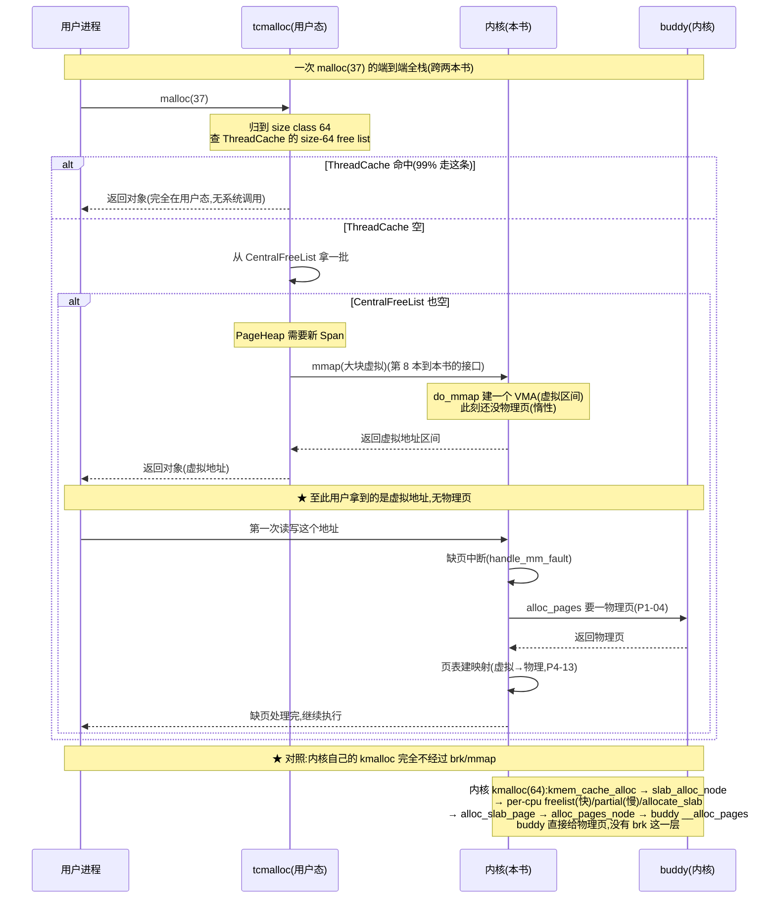

# 第十章 · ★对照第 8 本:slab vs tcmalloc

> 篇:第 2 篇 · slab/slub(分配·小对象)
> 本章标 ★,是对照章。主线呼应:第 7 章我们立起了 slab 的核心抽象——`kmem_cache`(固定大小对象池)、一个 slab 在 buddy 给的页上紧凑摆满同型号对象、空闲对象用内嵌 freelist 串起来。这个"把页切成小对象"的问题,**用户态分配器(tcmalloc/jemalloc)也在解**——而且解得惊人地像:都是 size class 分档 + per-X 快路径缓存 + freelist + 向下批发大块。但"像"只是表象,**根上有一处分野**:内核**是**物理页的主人(buddy 直接给页,没有 `sbrk`),用户态分配器只能通过 `mmap`/`brk` 系统调用**向内核批发**虚拟大块。本章把这条分野讲透,slab 篇就此收束,也为第 4 篇(用户地址空间)和第 7 篇(收尾总表)埋下接口。

## 核心问题

**同一个"分配小对象"的问题,内核(slab/slub)和用户态(tcmalloc/jemalloc)各自怎么解?同在哪里、异在根上(内核直接拥有物理页,用户态只能向内核批发虚拟大块)?**

读完本章你会明白:

1. **五个对照维度**(size class / per-X 快路径 / 对象载体 / 中央堆 / 批发边界),slab 和 tcmalloc/jemalloc **在前四个维度几乎同构**,**第五个维度根上分野**。
2. **为什么内核 per-cpu、用户态 per-thread**——这是最有洞察的对照点:内核按 CPU 切(抢占/调度以 CPU 为单位,线程数远多于 CPU 会碎);用户态按线程切(用户态分配器看不到 CPU 亲和信息,只能绑线程)。
3. **"批发边界"是两本书的接口**:用户态分配器的 `mmap`/`brk` 批发请求,正是本书第 4 篇 mmap/缺页要服务的对象;内核的 slab 直接站在 buddy(物理页主人)上,**没有 sbrk 这一层**。
4. **一张对照总表**,把内核 slab 的字段/机制钉到 tcmalloc/jemalloc 的对应物,为第 21 章总表预热。
5. **slab 篇的收束**:slab 讲完,内核"小对象"分配闭环;下一章(第 3 篇)切到 vmalloc——内核"大块虚拟连续"的另一条路。

> **逃生阀**:本章前半假设你读过 P2-07(slab 的 `kmem_cache`/freelist/对象布局)。用户态侧只用准确通识描述(ThreadCache/Span/Size-Class/PageHeap;jemalloc 的 extent/arena/tcache),不引具体行号——第 8 本《内存分配器》那本书的细节留给它自己讲。如果你只关心"为什么内核 per-cpu、用户态 per-thread",直接跳到 10.5 节。

---

## 10.1 一句话点破

> **slab 和 tcmalloc 解的是同一个问题——"把页切成小对象,还要分得快"。它们在 size class、per-X 快路径、freelist、中央堆四个维度上殊途同归(因为问题的最优解本来就长这样);真正的分野在批发边界——内核就是物理页的主人(buddy 给页,没有 sbrk),用户态分配器只能靠 `mmap`/`brk` 向内核批发大块虚拟内存。这一处分野,决定了内核 per-cpu、用户态 per-thread,也决定了"用户态分配器的批发请求,正是本书 mmap/缺页要服务的对象"。**

这是结论,不是理由。本章倒过来拆:先讲清楚两边的"同"(为什么问题的最优解都长这样),再沿着五个维度一格格比对,最后钻到最有洞察的那一维——per-cpu vs per-thread,把"为什么"讲到底。

---

## 10.2 同:小对象分配的最优解,本来就是这个形状

在比对之前,先把"为什么两边这么像"讲清。这不是巧合,是这个问题被同一组物理约束逼出来的最优解。

把"把页切成小对象,分配要快"这件事拆到极致,会撞上四道墙:

1. **任意大小归并**:调用方传来的字节数千变万化(`kmalloc(37)`、`malloc(208)`),如果为每个值单独建池,池子比对象还多。**必须把任意大小归并到有限档**(size class)。
2. **锁竞争**:多个执行流同时分配,如果每次都锁一个全局结构,核越多越堵。**必须把热路径切成 per-X(每 CPU 或每线程一份)**,让热路径无锁。
3. **载体开销**:对象在哪个"物理载体"上切?用户数据要紧凑摆,空闲对象要能 O(1) 摘/挂。**载体必须是"页级"的连续块,对象在页里紧凑摆放,空闲对象用 freelist 串**。
4. **回填**:per-X 快路径会耗尽,耗尽了要找一个能补货的地方。**必须有一层"中央堆"**统筹所有 per-X 缓存,缓存空了从中央堆拿一批。

这四道墙是物理性的——不管你在内核态还是用户态,只要在解"小对象分配",都会撞上同一组约束,于是长出同一个形状:

```
小对象分配器的"标准形状"(内核 slab 和用户态 tcmalloc/jemalloc 都长这样):

    ┌──────────────────────────────────────────────────────────────┐
    │ ① size class 分档(任意大小 → 有限档)                          │
    ├──────────────────────────────────────────────────────────────┤
    │ ② per-X 快路径(每 CPU 或每线程一份,热路径无锁)                │
    │     ┌────────┐ ┌────────┐ ┌────────┐                          │
    │     │ per-X  │ │ per-X  │ │ per-X  │  ← 快路径:摘/挂 freelist 头 │
    │     │ cache  │ │ cache  │ │ cache  │     O(1),几乎无锁          │
    │     └───┬────┘ └───┬────┘ └───┬────┘                          │
    ├─────────┼──────────┼──────────┼───────────────────────────────┤
    │ ③ 对象载体(页级连续块,页内紧凑摆对象 + freelist)               │
    ├─────────┴──────────┴──────────┴───────────────────────────────┤
    │ ④ 中央堆(全局统筹,per-X 耗尽时从这拿)                          │
    └──────────────────────────────────────────────────────────────┘
                                  │
                                  ▼
                    ⑤ 批发边界(★ 分野在这)
                  内核:buddy 给页(物理页主人)
                  用户态:mmap/brk 向内核批发虚拟大块
```

前四层(①②③④)就是 slab 和 tcmalloc/jemalloc 长得几乎一样的部分——**最优解本来就是这个形状**。第五层(⑤)是两边根上的分野,本章后半细拆。

> **钉死这件事**:内核 slab 和用户态 tcmalloc/jemalloc 的"像",不是谁抄谁,而是同一组物理约束(任意大小归并、抗锁竞争、紧凑载体、回填)逼出来的同一个最优解。这个"形状"在小对象分配领域几乎是普适的——BSD 的 malloc、Windows 的 LFH、glibc 的 ptmalloc,长得都差不多。所以**学透 slab,等于学透了用户态分配器的一半**——这也是为什么本书和第 8 本是一对。

---

## 10.3 五维对照总表

接下来五节,沿着五个维度一格格比对。先把总表放出来,后面分维度展开。

> **如何读这张表**:左列是"维度",中列是内核 slab(本书),右列是用户态 tcmalloc/jemalloc(第 8 本)。每个维度下面会单独展开一节,讲"同在哪、异在哪、为什么"。

| 维度 | 内核 slab/slub(本书·内核态) | 用户态 tcmalloc/jemalloc(第 8 本·用户态) |
|------|------------------------------|------------------------------------------|
| ① **size class** | `kmalloc-<size>` 全局 cache(`kmalloc-8/16/32/64/96/128/192/.../2M`),每种对象类型还能开专属 cache(`task_struct` cache) | tcmalloc size class(`SizeMap::ClassToSize`,8/16/32/48/64/80/96/...字节一档);jemalloc size classes(类似分档,大档含小数对齐) |
| ② **per-X 快路径** | per-**cpu** `kmem_cache_cpu`:每 CPU 一个 `freelist` + `slab`(frozen)+ `partial` 链;`cmpxchg` 无锁快路径 | per-**thread** `ThreadCache`(tcmalloc)/ `tcache`(jemalloc):每线程一份 free list;线程内访问完全无锁 |
| ③ **对象载体** | **slab**:buddy 给的若干连续页(`alloc_slab_page` → `alloc_pages_node`),页内紧凑摆对象,内嵌 freelist(freeptr 藏对象中间) | **Span**(tcmalloc):PageHeap 给的若干连续页,页内切对象;**extent**(jemalloc):类似,extent 管一段页 |
| ④ **中央堆** | per-**node** `kmem_cache_node`:每 NUMA node 一份 `partial` 队列(自旋锁保护);耗尽时找 buddy 要新页 | tcmalloc `CentralFreeList` + `PageHeap`(全局 span 池);jemalloc `arena`(每几线程一个 arena)+ extent 池 |
| ⑤ **批发边界** ★ | **没有 sbrk**——内核**就是**物理页主人,`alloc_pages_node` → buddy `__alloc_pages` 直接给物理页 | 靠 `mmap`(`do_mmap`)/ `brk`(`SYSCALL_DEFINE1(brk)`)系统调用向内核**批发**大块虚拟内存;实际物理页在缺页时才给 |

后面五节,逐维展开。① ~ ④ 是"同"的维度,⑤ 是"异"的维度(本章的重头戏)。

---

## 10.4 维度①:size class —— 把任意大小归并到有限档

### 同:都是"把任意大小归并到有限几个 cache"

调用方传来的字节数千变万化,分配器要为每个值单独建池是不现实的——池子的元数据会比对象还多。所以两边都选了同一招:**把任意大小归并到有限档**,每档一个 cache,档位的选取遵循"小对象密、大对象稀"的曲线(小对象最常见,档位要密;大对象罕见,档位可以稀)。

内核侧的档位表是 [`kmalloc_info[]`](../linux/mm/slab_common.c#L777-L800)([slab_common.c:777](../linux/mm/slab_common.c#L777)):

```c
// mm/slab_common.c#L777-L800 (kmalloc_info[]:kmalloc 的 size class 档位表)
const struct kmalloc_info_struct kmalloc_info[] __initconst = {
    INIT_KMALLOC_INFO(0, 0),
    INIT_KMALLOC_INFO(96, 96),
    INIT_KMALLOC_INFO(192, 192),
    INIT_KMALLOC_INFO(8, 8),
    INIT_KMALLOC_INFO(16, 16),
    INIT_KMALLOC_INFO(32, 32),
    INIT_KMALLOC_INFO(64, 64),
    INIT_KMALLOC_INFO(128, 128),
    INIT_KMALLOC_INFO(256, 256),
    INIT_KMALLOC_INFO(512, 512),
    INIT_KMALLOC_INFO(1024, 1k),
    INIT_KMALLOC_INFO(2048, 2k),
    INIT_KMALLOC_INFO(4096, 4k),
    INIT_KMALLOC_INFO(8192, 8k),
    INIT_KMALLOC_INFO(16384, 16k),
    INIT_KMALLOC_INFO(32768, 32k),
    INIT_KMALLOC_INFO(65536, 64k),
    INIT_KMALLOC_INFO(131072, 128k),
    INIT_KMALLOC_INFO(262144, 256k),
    INIT_KMALLOC_INFO(524288, 512k),
    INIT_KMALLOC_INFO(1048576, 1M),
    INIT_KMALLOC_INFO(2097152, 2M)
};
```

调 `kmalloc(37)`,会归到 `kmalloc-64`(向上取整到 64);调 `kmalloc(200)`,归到 `kmalloc-256`。注意中间夹了两个"非 2 的幂"档——**96 和 192**——这是为了减少内部碎片:常见对象大小(`inode` 600 字节、`dentry` 192 字节)落在这些档位上更紧凑,所以专门为它们开了档。

用户态 tcmalloc 的 size class 设计思路完全一致——档位表大致是 8/16/32/48/64/80/96/128/...,同样是"小密大稀",中间也有几个非 2 的幂档位(如 48、80、96)用来吃常见对象大小。jemalloc 的 size class 曲线更细一点(它会按"小数对齐"在每两个 2 的幂之间再插几个档),但**核心招数一模一样**。

### 异:内核还能"为一种对象类型开专属 cache"

这是内核侧独有的一个维度,用户态分配器没有。除了通用的 `kmalloc-<size>` 档位,内核**还为每种内核对象类型开专属 cache**:

```c
// 内核里的常见专属 cache(示意)
struct kmem_cache *task_struct_cachep;   // task_struct 专属,9500 字节
struct kmem_cache *inode_cache;          // inode 专属,约 600 字节
struct kmem_cache *dentry_cache;         // dentry 专属,约 192 字节
```

这些专属 cache 由 `kmem_cache_create("task_struct", sizeof(struct task_struct), ...)` 创建([slab_common.c:387](../linux/mm/slab_common.c#L387)),每个 cache 只服务一种对象类型。这样设计的好处是**每个对象槽恰好等于对象大小,零内部碎片**(通用 `kmalloc-64` 装 37 字节对象,内部碎片 42%;专属 cache 装 192 字节的 `dentry`,内部碎片 0%),还能给对象配构造函数(`ctor`)、RCU 释放、调试 redzone 等定制能力。

用户态 `malloc` 不能这么做——用户传给 `malloc` 的只有"大小",没有"类型"概念,分配器无从知道"这 200 字节是给 `struct foo` 用的"。所以用户态分配器只能走通用 size class,做不到"为类型专属开 cache"。这是内核独有的优势:**内核知道自己每个对象是什么类型,可以为每种类型量身定制 cache**。

> **钉死这件事**:size class 维度,两边"通用档位"几乎同构(任意大小归并到有限档,小密大稀);差别是内核**多了一个维度**——为每种对象类型开专属 cache(`task_struct` cache、`inode_cache`),零内部碎片 + 可定制。用户态分配器看不到类型,只能走通用档。

---

## 10.5 维度②:per-X 快路径 —— 为什么内核 per-cpu、用户态 per-thread

这是五个维度里**最有洞察的一个**。两边都把热路径切成 per-X(每 X 一份缓存,绕开全局锁),但内核选了 **CPU**(`kmem_cache_cpu` 是 per-cpu 的),用户态选了 **线程**(tcmalloc 的 `ThreadCache`、jemalloc 的 `tcache` 是 per-thread 的)。**为什么?** 这一节专门拆这个根因。

### 同:都是"把热路径切出 per-X 份,绕开全局锁"

先看内核侧的 per-cpu 数据结构。每个 `kmem_cache` 有一个 per-cpu 指针 [`cpu_slab`](../linux/mm/slab.h#L253)([slab.h:253](../linux/mm/slab.h#L253)),指向一个 [`struct kmem_cache_cpu`](../linux/mm/slub.c#L384)([slub.c:384](../linux/mm/slub.c#L384)):

```c
// mm/slub.c#L384-L400 (per-cpu 快路径缓存)
struct kmem_cache_cpu {
    union {
        struct {
            void **freelist;    /* Pointer to next available object */
            unsigned long tid;  /* Globally unique transaction id */
        };
        freelist_aba_t freelist_tid;
    };
    struct slab *slab;          /* The slab from which we are allocating */
#ifdef CONFIG_SLUB_CPU_PARTIAL
    struct slab *partial;       /* Partially allocated slabs */
#endif
    local_lock_t lock;          /* Protects the fields above */
    ...
};
```

每次 `kmem_cache_alloc`(转 [`slab_alloc_node`](../linux/mm/slub.c#L3856),[slub.c:3856](../linux/mm/slub.c#L3856)),先尝试从**当前 CPU 的 `cpu_slab->freelist`** 摘对象——这条路径靠 `cmpxchg` 做无锁原子更新(P2-08 会专门拆),几乎完全不拿锁。只有当 per-cpu 的 slab 用完了,才回退到慢路径,去 per-node partial 队列或 buddy 找新 slab。

用户态 tcmalloc 的 `ThreadCache` 在概念上是镜像:每个进程线程有一个 `ThreadCache`,里面是每个 size class 一条 free list。`malloc(37)` 归到 size class 64 后,先从**当前线程** `ThreadCache` 的 size-64 free list 摘对象——这条路径**完全无锁**(线程独占,没人竞争)。只有当线程的 free list 空了,才回退到 `CentralFreeList` 拿一批。jemalloc 的 `tcache` 是一样的思路。

两边都想达到同一个目的:**让 99% 的分配不拿任何锁**。差别只在——这个"per-X"的 X,内核选了 CPU,用户态选了线程。

### 异:为什么内核选 CPU、用户态选线程?

这是本章最值得品味的一组对照。我们用两个反面对比让根因显形。

> **反面对比 A:假设内核选 per-thread(像用户态那样)**——一个 `kmem_cache` 给每个**线程**开一份 `freelist`/`partial`。后果:
>
> 1. **线程数远多于 CPU 数**:一台 8 核机器跑 200 个线程很常见。一个 cache 开 200 份 per-thread 缓存,每份至少挂一个 slab(几 KB 到几十 KB),光缓存就吃掉几 MB——而内核的 `task_struct` cache、`inode_cache` 加起来上百个,每 cache × 200 线程 = 上万份缓存,**缓存元数据自身就把内存撑爆**。
> 2. **partial slab 极度分散**:每个 per-thread 缓存都挂着自己的 partial slab,slab 用了一半就空在那(其他线程用不上),**整体内部碎片暴涨**。一个 cache 名下可能挂着几千个"半满 slab",每个都还不回 buddy,内存利用率塌方。
> 3. **线程迁移时缓存失效**:Linux 调度器随时可能把线程从 CPU 0 迁到 CPU 3。如果 slab 缓存按线程切,迁移后线程在 CPU 3 上访问的还是它在 CPU 0 上攒的 slab——**NUMA 局部性丢失**(跨 NUMA node 访问慢);更糟的是,线程销毁后它的 per-thread slab 还得专门回收。
> 4. **内核根本不"按线程"调度**:内核调度的单位是 task(线程),但**分配的并发单位是 CPU**——同一个 CPU 上的多个线程(哪怕切来切去)共享同一个 per-cpu slab,反而能复用缓存;不同 CPU 才需要各自的 slab 抗锁竞争。

> **反面对比 B:假设用户态选 per-cpu(像内核那样)**——tcmalloc 给每个**CPU** 开一份 `ThreadCache`。后果:
>
> 1. **用户态拿不到 CPU 亲和信息**:用户态分配器是个普通 `.so`,它**看不到"我现在在哪个 CPU 上跑"**——确切说,可以通过 `sched_getcpu()`(读 `gs` 殟基址里的 `vgetcpu`)查,但每次 `malloc` 都查一次成本太高;更根本的是,**用户态无法保证一段代码一直在同一个 CPU 上**(随时被抢占、迁 CPU),per-cpu 缓存的"本 CPU 独占"假设站不住。
> 2. **跨 CPU 的对象迁移灾难**:tcmalloc 的 Span 是全局的,如果 `ThreadCache` 按 CPU 切,线程 T 在 CPU 0 上分配的对象、迁到 CPU 3 上释放——释放要锁 CPU 3 的 cache、对象却来自 CPU 0 的 span,**跨 CPU 一致性开销大**(需要 IPI 或原子操作)。
> 3. **内核才有的"关抢占 + per-cpu 地址"机制,用户态没有**:内核的 per-cpu 数据访问靠 `this_cpu_ptr`(读 `gs` 段寄存器拿到本 CPU 的 per-cpu 基址)+ `preempt_disable`(关抢占,保证读基址和访问数据之间不被迁 CPU)。**用户态没法关抢占**(它没有这个特权),所以即使想 per-cpu,也保证不了"读基址 → 访问数据"这一段的原子性。

所以两边的"per-X"选择,是各自环境逼出来的**最优解**:

| 项 | 内核(per-cpu) | 用户态(per-thread) |
|----|---------------|--------------------|
| **物理事实** | CPU 数少(几到几十),线程数多(几百) | 线程是用户态自己创建的,可控;CPU 亲和信息不直接可见 |
| **能关抢占吗** | 能(`preempt_disable`) | 不能(用户态没特权) |
| **能看到本 CPU 吗** | 能(`this_cpu_ptr` 经 `gs` 段基址) | 不能直接(`sched_getcpu` 太慢,且不保证一致) |
| **缓存的天然单位** | CPU(调度/抢占以 CPU 为单位) | 线程(用户态唯一可控的并发单位) |

一句话:**内核按 CPU 切,是因为它有权管 CPU;用户态按线程切,是因为它只能管线程**。

> **钉死这件事**:per-cpu vs per-thread 是五个对照维度里**最有洞察**的一维。这不是"两边各选了一个",而是各自环境(内核有特权 / 用户态无特权)逼出来的必然——内核按 CPU 切(线程数远多于 CPU,per-thread 会碎成渣;内核能关抢占、能 `this_cpu_ptr`),用户态按线程切(用户态看不到 CPU、关不了抢占,只能绑线程)。这背后是**内核态和用户态的特权差异**,不是设计偏好。

### 延伸:per-cpu 怎么做到无锁?

既然内核按 CPU 切,那 per-cpu 的 `freelist` 操作怎么做到无锁?核心是 [`cmpxchg`](../linux/mm/slub.c)(双字段原子比较交换)+ [`tid`](../linux/mm/slub.c#L388)(事务 id)配合。

`tid` 是 [`kmem_cache_cpu`](../linux/mm/slub.c#L384-L400) 里的一个字段,它**编码了"当前 CPU id + 一个递增计数器"**。分配时:

1. 进入快路径前,读 `tid = this_cpu_read(s->cpu_slab->tid)`,同时记录 `this_cpu` 是哪个 CPU。
2. 读 `freelist = c->freelist`、`slab = c->slab`。
3. 算下一个对象 `next = get_freepointer(s, freelist)`。
4. 用 `cmpxchg` 双字段原子地更新 `cpu_slab` 的 `freelist` 和 `tid`:**只有当 `cpu_slab` 当前值仍是我读出来的(`freelist`+`tid` 都没变)才更新成功**。

如果在这期间,本 CPU 被中断/抢占,中断里又分配了对象(改了 `freelist` 和 `tid`),`cmpxchg` 会失败——慢路径重试。`tid` 的作用就是检测这种"中间被改过"的情况。**这是 SLUB 区别于老 SLAB 的最大性能优势**,P2-08 会专门拆,本章只点到。

---

## 10.6 维度③:对象载体 —— slab vs Span/extent

### 同:都是"页级管理 + 页内切对象"

不管内核还是用户态,小对象分配器都不直接管字节——它管"页"。一次"载体"分配 = 批发一个页级连续块,然后**在这个块里紧凑摆同型号对象**。这是两层结构:**页级管理(谁有哪些页)+ 对象级管理(页里怎么摆)**。

内核侧的"页级载体"是 **slab**,由 [`allocate_slab`](../linux/mm/slub.c#L2322)([slub.c:2322](../linux/mm/slub.c#L2322))创建。它内部调 [`alloc_slab_page`](../linux/mm/slub.c#L2173)([slub.c:2173](../linux/mm/slub.c#L2173)),后者直接找 buddy 要页:

```c
// mm/slub.c#L2173-L2192 (slab 的"页级批发":找 buddy 要页)
static inline struct slab *alloc_slab_page(gfp_t flags, int node,
        struct kmem_cache_order_objects oo)
{
    struct folio *folio;
    struct slab *slab;
    unsigned int order = oo_order(oo);

    folio = (struct folio *)alloc_pages_node(node, flags, order);  // ★ 找 buddy 要页
    if (!folio)
        return NULL;

    slab = folio_slab(folio);    // 把 page/folio 头部 reinterpret 成 slab
    __folio_set_slab(folio);
    smp_wmb();                   // 让"slab 标志"对其他 CPU 可见
    if (folio_is_pfmemalloc(folio))
        slab_set_pfmemalloc(slab);

    return slab;
}
```

注意 `alloc_pages_node(node, flags, order)` 这一行——它最终走到 buddy 的 [`__alloc_pages`](../linux/mm/page_alloc.c#L4539)([page_alloc.c:4539](../linux/mm/page_alloc.c#L4539)),**这就是内核的"批发"**:buddy 直接给页,没有中间商。`folio_slab(folio)` 是 `struct page`/`struct folio` 的"另一种视图"——slab 复用 folio 的内存(参见 P2-07 的 `struct slab` 解释),不另开结构体。

用户态 tcmalloc 的"页级载体"叫 **Span**(jemalloc 叫 **extent**),概念上完全镜像:Span 是 PageHeap 管理的"一段连续的 N 个页",Span 内部按 size class 切成同型号对象,空闲对象用 free list 串。**唯一的不同在"Span 从哪来"**——这是维度⑤批发边界要讲的事(下面 10.8 节)。

### 同:空闲对象的 free list 都"内嵌在对象体内"

slab 的 freelist 是内嵌的——空闲对象体内的 `s->offset` 位置(默认是对象中间,P2-07 详讲)临时存"下一个空闲对象的指针",链头在 `slab->freelist`。这个设计的妙处是**零额外开销**:不另开数组,freelist 指针借用对象体内本来就归用户用的字节(反正空闲对象用户不读)。

tcmalloc/jemalloc 的 free list 在概念上也是这个思路——空闲对象的前几个字节(或对象体内某个位置)临时当 next 指针用。**这是小对象分配器几乎普适的做法**:既然空闲对象反正没人读,那几个字节临时当指针用,零额外开销,摘头时一次 cache line 命中。slab 的独特点是**它把 freeptr 默认藏在对象中间**(抗堆溢出),并配合 `CONFIG_SLAB_FREELIST_HARDENED` 做 `ptr ^ random ^ swab(ptr_addr)` 混淆(防劫持)——这是内核的安全增强,用户态分配器基本不做(进程内信任边界不同,用户态的攻击面在别处)。

> **钉死这件事**:载体维度,两边几乎同构——"页级管理 + 页内切对象 + 内嵌 free list"。slab 复用 buddy 给的页(`alloc_slab_page` → `alloc_pages_node`),tcmalloc 用 Span、jemalloc 用 extent,概念完全镜像。slab 独有的是 freeptr 藏中间 + 混淆两道安全增强(因为内核的信任边界更敏感)。

---

## 10.7 维度④:中央堆 —— per-node partial vs CentralFreeList/arena

per-X 快路径会耗尽,耗尽了要找谁补货?两边都有一层"中央堆"统筹。

### 同:都是"统筹 per-X 缓存的全局结构,带锁"

内核侧的中央堆是 per-**node** 的 [`struct kmem_cache_node`](../linux/mm/slub.c#L425)([slub.c:425](../linux/mm/slub.c#L425)):

```c
// mm/slub.c#L425-L434 (per-node 中央堆)
struct kmem_cache_node {
    spinlock_t list_lock;       // 保护 partial 队列的自旋锁
    unsigned long nr_partial;   // partial 队列里 slab 的个数
    struct list_head partial;   // ★ partial slab 链(用了一部分,还有空位的 slab)
#ifdef CONFIG_SLUB_DEBUG
    atomic_long_t nr_slabs;
    atomic_long_t total_objects;
    struct list_head full;
#endif
};
```

每个 NUMA node 一个,`partial` 队列挂着一堆"用了一部分、还有空位"的 slab。当某个 CPU 的 per-cpu slab 用完了(快路径 cmpxchg 失败、慢路径 `___slab_alloc` 启动),它**优先从本 node 的 partial 队列**拿一个 slab 来用([`node->partial`](../linux/mm/slub.c#L428));本 node 没有再去 buddy 要新页(`new_slab` → `allocate_slab`)。

注意 **per-node 而不是全局一份**——这是 NUMA 感知:同一个物理 node 上的 CPU 优先共享一个 partial 链,既减少跨 node 访问(局部性),又减少锁竞争(node 数比 CPU 数少,node 锁比单一全局锁分散)。

用户态 tcmalloc 的中央堆是 **CentralFreeList**(每个 size class 一份,全局)+ **PageHeap**(全局 span 池)。线程的 ThreadCache 空了,从 CentralFreeList 拿一批同 size class 的对象;CentralFreeList 空了,从 PageHeap 要一个 Span,把 Span 切成对象回填。jemalloc 的中央堆是 **arena**(默认 4 × ncpu 个 arena,每个 arena 自带 bins/extents),线程第一次 malloc 时绑到一个 arena 上,后续都走那个 arena。

> **注意一个微妙差异**:内核的中央堆是 per-**node**(NUMA 感知),用户态 tcmalloc 的中央堆是 per-**size-class**(全局,每档一个 CentralFreeList),jemalloc 是 per-**arena**(每几线程一个)。三种切法的共通点是"**比 per-X(快路径)粗、比单一全局细**"——既要减少全局锁竞争,又要不让 per-X 缓存太散。这是工程上对"锁粒度"的精细权衡。

### 同:都是"快路径空了 → 找中央堆;中央堆空了 → 找批发层"

把回填路径画出来,两边几乎同构:

```mermaid
flowchart TD
    subgraph 内核["内核 slab 的回填路径"]
        K1["kmem_cache_alloc<br/>(快路径)"] -->|freelist 空| K2["___slab_alloc<br/>(慢路径)"]
        K2 -->|先试| K3["per-cpu partial 链"]
        K3 -->|没有| K4["per-node partial<br/>(kmem_cache_node)"]
        K4 -->|没有| K5["allocate_slab<br/>→ alloc_slab_page<br/>→ alloc_pages_node<br/>★ buddy 给页"]
    end
    subgraph 用户态["用户态 tcmalloc 的回填路径"]
        U1["malloc<br/>(快路径)"] -->|free list 空| U2["ThreadCache 回填"]
        U2 -->|先试| U3["ThreadCache 的 size-class list"]
        U3 -->|不够| U4["CentralFreeList<br/>(每 size class 一份)"]
        U4 -->|没有| U5["PageHeap 要 Span<br/>★ Span 从哪来?<br/>→ mmap 向内核批发"]
    end
    classDef fast fill:#dbeafe,stroke:#2563eb
    classDef slow fill:#fef3c7,stroke:#d97706
    classDef whole fill:#fee2e2,stroke:#dc2626
    class K1,U1 fast
    class K2,K3,K4,U2,U3,U4 slow
    class K5,U5 whole
```



注意最底层 `★` 标的那一步——这是两边**唯一不同的地方**:内核的 `allocate_slab` 找 buddy 要页(`alloc_pages_node`),用户态的 PageHeap 找 `mmap` 批发虚拟大块。这一步就是维度⑤,下面专讲。

---

## 10.8 维度⑤:批发边界 —— ★本章的重头戏

终于到本章的重头戏——批发边界。前面四个维度两边都同构,只有这一维度**根上分野**,而这个分野正是"内核态 vs 用户态"的天然边界,也是本书和第 8 本《内存分配器》的接口。

### 异:内核是物理页的主人,用户态只能向内核批发

内核侧——**没有 `sbrk`,没有 `malloc`**,内核**就是物理页的主人**。slab 要新页,直接 `alloc_slab_page` → `alloc_pages_node` → buddy 的 [`__alloc_pages`](../linux/mm/page_alloc.c#L4539) 给页。buddy 自己管着所有空闲物理页(挂在各 zone 的 `free_area[]` 上,详见 P1-03 buddy 算法),它**不需要向任何人"批发"**——它就是物理内存的最终仲裁者。

用户态侧——tcmalloc/jemalloc **不拥有任何物理页**。它们只是用户态进程里的一个 `.so`,看到的是**自己的虚拟地址空间**。当 PageHeap 需要新 span 时,它**必须通过系统调用向内核批发**:

- **`brk`** 系统调用([`SYSCALL_DEFINE1(brk, ...)`](../linux/mm/mmap.c#L178),[mmap.c:178](../linux/mm/mmap.c#L178)):扩展进程的 heap 段(把 `mm->brk` 往上推),适合小块小批。
- **`mmap`** 系统调用([`SYSCALL_DEFINE6(mmap_pgoff, ...)`](../linux/mm/mmap.c#L1438) → [`do_mmap`](../linux/mm/mmap.c#L1214),[mmap.c:1438/1214](../linux/mm/mmap.c#L1438)):在进程地址空间里开一段新的虚拟区间(由内核建一个 VMA),适合大块大批。

tcmalloc 默认对小请求(≤ 32KB 左右)走 `brk`(回收到 heap 段,快),对大请求走 `mmap`(直接映射,释放时整段还回去);jemalloc 类似,大块走 `mmap`,小块从已有的 arena 里切。**不管是 `brk` 还是 `mmap`,它们干的事都是"在进程虚拟地址空间里圈一段"**——此刻**还没有物理页**(惰性分配,P4-14 缺页中断会讲),等进程真正读写这段虚拟地址时,触发缺页,内核才分配物理页、在页表里建映射。

### 用一张图钉死"批发边界"



这张图把两本书接到了一起——上半部分(`malloc` → `ThreadCache` → `mmap`)是第 8 本《内存分配器》的主场,下半部分(`mmap` → `do_mmap` → 缺页 → `alloc_pages` → buddy)是本书的主场。**它们的接口就是那条 `mmap`/`brk` 系统调用**。

### 内核自己的 `kmalloc` 走完全不同的路

再对比一下内核自己的分配路径。内核代码调 `kmalloc(64)` 时:

```c
// mm/slub.c#L3983-L3987 (__kmalloc 入口)
void *__kmalloc(size_t size, gfp_t flags)
{
    return __do_kmalloc_node(size, flags, NUMA_NO_NODE, _RET_IP_);
}
```

它走到 [`slab_alloc_node`](../linux/mm/slub.c#L3856) → 快路径(本 CPU `cpu_slab->freelist`)→ 慢路径(per-node partial)→ `allocate_slab` → `alloc_slab_page` → [`alloc_pages_node`](../linux/mm/page_alloc.c) → buddy。**全程没有任何系统调用,没有 `brk`,没有 `mmap`**——因为内核就在自己家里,它要物理页就找 buddy,buddy 是它的"内部账本"。这就是"内核是物理页主人"的含义。

| 项 | 内核 `kmalloc`(本书) | 用户态 `malloc`(第 8 本) |
|----|---------------------|--------------------------|
| 是否有"批发接口" | **没有**——buddy 给页是内部调用 | **有**——`brk`/`mmap` 是系统调用 |
| 批发的对象 | (不适用) | 虚拟地址区间(VMA) |
| 物理页何时到位 | 立即(`alloc_pages_node` 同步返回物理页) | 延后(等进程访问触发缺页,`handle_mm_fault`) |
| 看得到物理地址吗 | 能(内核直接处理 `struct page`/`pfn`) | 不能(用户态只看到虚拟地址) |

> **钉死这件事**:批发边界是内核态和用户态的天然分野。**内核 = 物理页主人**(slab 找 buddy 要页,没有 sbrk 这层);**用户态 = 物理页的客户**(tcmalloc/jemalloc 靠 `mmap`/`brk` 向内核批发虚拟大块,物理页在缺页时才给)。用户态分配器的批发请求(`brk`/`mmap`),正是本书第 4 篇 mmap/缺页要服务的对象——**这就是两本书的接口**。

---

## 10.9 技巧精解:per-cpu vs per-thread —— 根因再钻一遍

本章挑一个最有洞察的对照点专拆——为什么内核 per-cpu、用户态 per-thread。10.5 节已经给出了"反面对比 A/B"的宏观论证,这一节钻到**底层机制**讲清"内核为什么能做到 per-cpu"。

### 内核 per-cpu 的底层机制:`gs` 段基址 + 关抢占

内核 per-cpu 数据访问的物理基础是两个:**`gs` 段寄存器 + `preempt_disable`**。

x86_64 上,Linux 启动时给每个 CPU 设了一个 per-cpu 基址,存在 `gs` 段寄存器里(CPU 0 的 `gs` 基址 = per-cpu 区域 0 的起点,CPU 1 的 `gs` 基址 = per-cpu 区域 1 的起点,以此类推)。每个 CPU 看到的 `gs:offset` 都是自己那份 per-cpu 数据。访问 per-cpu 数据用 [`this_cpu_ptr(ptr)`](../linux/include/linux/percpu-defs.h)(展开成 `((typeof(*(ptr)) __kernel __force *)tcp_ptr__(ptr))`),底层是 `mov %gs:offset, %rax`——**一条指令,本 CPU 独占,不需要锁**。

但光有 `gs` 还不够——如果在"读 `gs:offset` 拿到本 CPU 的 per-cpu 区域指针"和"用这个指针访问数据"之间,本 CPU 被抢占、调度到别的 CPU 上,那后续访问就跑到**别的 CPU 的 per-cpu 区域**了(因为 `gs` 跟着 CPU 走,不是跟着线程走)。所以**访问 per-cpu 数据必须先关抢占**:

```c
// 内核访问 per-cpu 数据的典型 pattern(简化示意)
preempt_disable();                  // 关抢占,本线程不会被迁 CPU
this_cpu_write(s->cpu_slab->freelist, ...);   // 写本 CPU 的 per-cpu freelist
preempt_enable();                   // 开抢占
```

`preempt_disable` 是内核特权——用户态没这个权限。所以**用户态即使想做 per-cpu,也保证不了"读基址 → 访问数据"这一段的原子性**(它可能在这一段中间被抢占、迁 CPU,然后访问到错的 per-cpu 区域)。

这就是"为什么内核能 per-cpu,用户态只能 per-thread"的**最底层根因**:**per-cpu 要求关抢占 + `gs` 段基址,这两样都是内核特权**。用户态没有这些特权,只能退而求其次,按线程(用户态唯一可控的并发单位)切。

### 用户态 per-thread 的代价

用户态选 per-thread 也不是免费的——它有自己的一组代价,只是比 per-cpu 在用户态下的代价小:

1. **线程多了缓存膨胀**:一个进程开 100 个线程,就有 100 份 `ThreadCache`,每份都挂着若干 size class 的 free list,缓存总占用可能上 MB。tcmalloc/jemalloc 用"cache size limit"控制(每线程 cache 不能超过某个阈值,超过就回收一些到 central),缓解这个问题。
2. **线程销毁要回收 cache**:线程退出时,它的 `ThreadCache` 里残留的对象要回收到 central,否则就泄漏。这是用户态分配器的一笔固定开销。
3. **arena 数受限制**(jemalloc):jemalloc 默认开 `4 × ncpu` 个 arena,线程按 round-robin 绑定,这样多线程时 arena 锁竞争被分摊。但 arena 数是固定的,线程数远超 arena 数时,一个 arena 仍可能被多个线程竞争(它的 bins 有锁)。

这些代价都是用户态"看不到 CPU"这件事的连锁后果。**内核 per-cpu 的优势,正是它有特权能看到 CPU、能关抢占**——这是内核和用户态在分配器设计上最根本的不对称。

> **钉死这件事**:per-cpu vs per-thread 的根因,可以一路追到**底层机制**——per-cpu 要求"`gs` 段基址 + 关抢占"两样特权,内核有,用户态没有。这是内核和用户态在分配器设计上最根本的不对称,也是本对照章最有洞察的一处分野。学透这个对照,你就理解了"为什么内核 slab 那么快、那么省,而用户态分配器要费那么大劲做 arena/tcache"——它们各自在自己能用的特权里,把同一个最优解做到极致。

---

## 10.10 ★对照第 8 本:本章即对照章

(本章标 ★,这里把对照再收束一遍,呼应第 7 章 7.9 的轻量对照,为第 21 章总表预热。)

| 维度 | 内核 slab/slub(本书) | 用户态 tcmalloc/jemalloc(第 8 本) |
|------|---------------------|----------------------------------|
| **① size class** | `kmalloc-<size>`(8/16/32/64/96/128/.../2M)+ 每对象类型专属 cache | size class 分档,无"类型专属"维度 |
| **② per-X 快路径** | per-**cpu**(特权:`gs` + `preempt_disable`),`cmpxchg` 无锁 | per-**thread**(用户态无特权,只能绑线程),线程内完全无锁 |
| **③ 对象载体** | slab(buddy 给的页,`alloc_slab_page`),内嵌 freelist 藏对象中间 + 混淆 | Span(tcmalloc)/extent(jemalloc),内嵌 free list |
| **④ 中央堆** | per-**node** `kmem_cache_node.partial`(NUMA 感知,自旋锁) | CentralFreeList/PageHeap(tcmalloc,per-size-class),arena(jemalloc) |
| **⑤ 批发边界** ★ | **没有 sbrk**——buddy 直接给页(`alloc_pages_node` → `__alloc_pages`) | `brk`/`mmap` 系统调用向内核批发虚拟大块,缺页时才给物理页 |
| 安全增强 | `SLAB_FREELIST_HARDENED` 混淆,freeptr 藏中间 | 基本不做(进程内信任边界) |
| NUMA 感知 | per-node partial,`__GFP_THISNODE` 等节点策略 | 一般无(tcmalloc 有 OS-based NUMA 选项,弱) |
| RC/unwind | RCU 释放、构造函数、调试 redzone/slub_debug | 基本无(用户态需求不同) |

**一句话总括**:前四维同构(同一组约束逼出同一个最优解),第五维分野(内核是物理页主人,用户态只能向内核批发)。**用户态分配器的批发请求(`brk`/`mmap`),正是本书第 4 篇 mmap/缺页要服务的对象**——这是两本书的接口,也是"内存分配全栈"被切成两半的地方。

---

## 章末小结

这一章是 slab 篇的收束章,也是本书和第 8 本《内存分配器》的对照章。我们没有钻新机制,而是沿着五个维度把 slab 和 tcmalloc/jemalloc 钉到一起,看清了三件事:

1. **同**:小对象分配的最优解本来就是这个形状(size class 分档 + per-X 快路径 + 内嵌 freelist + 中央堆),内核 slab 和用户态 tcmalloc/jemalloc 在前四个维度**殊途同归**。学透 slab,等于学透了用户态分配器的一半。
2. **异在 per-X**:内核按 **CPU** 切(per-cpu `kmem_cache_cpu`),用户态按**线程**切(ThreadCache/tcache)。根因是 per-cpu 要求"`gs` 段基址 + 关抢占"两样**内核特权**,用户态没有,只能退而绑线程。这是内核态/用户态最根本的不对称。
3. **异在批发边界**:内核**是物理页的主人**(slab 找 buddy 要页,没有 sbrk 这层),用户态只能靠 `brk`/`mmap` **向内核批发虚拟大块**,物理页在缺页时才给。**用户态分配器的批发请求,正是本书第 4 篇 mmap/缺页的服务对象**——这就是两本书的接口。

本章服务二分法的**分配**那一面:slab(内核小对象)和 tcmalloc/jemalloc(用户态小对象)都是把内存**分出去**的核心机制。两者拼起来,加上第 4 篇的用户地址空间(进程虚拟内存)和缺页中断,就是完整的"`malloc` 一行调用"全栈——这条全栈在第 7 篇(P7-21)会有一张完整的总表。

slab 篇到此收束,内核"小对象"分配闭环。但 slab 只解决"页内切对象"——如果内核需要**大块虚拟连续**的内存(几十 KB 到几 MB,但物理页不需要连续),slab 给不了(它的对象一般不超过 8KB,而且要求物理连续)。这时内核有另一条路:**vmalloc**——虚拟地址连续、物理页离散,靠页表缝起来。下一章(第 3 篇)我们就拆 vmalloc,以及它的近亲 percpu(per-CPU 无锁副本)。

### 五个"为什么"清单

1. **为什么 slab 和 tcmalloc 在 size class/per-X/freelist 上那么像?** 不是谁抄谁,而是同一组物理约束(任意大小归并、抗锁竞争、紧凑载体、回填)逼出来的同一个最优解。小对象分配器几乎普适地长这个形状(BSD malloc、Windows LFH、glibc ptmalloc 都类似)。

2. **为什么内核 slab 是 per-cpu,而 tcmalloc 是 per-thread?** per-cpu 要求"`gs` 段基址 + 关抢占"两样内核特权——内核有,用户态没有。线程数远多于 CPU 数(per-thread 会碎),内核选 CPU 既省又快;用户态看不到 CPU、关不了抢占,只能绑线程。这是内核/用户态特权差异,不是设计偏好。

3. **为什么用户态分配器要"向内核批发"?** 用户态进程**不拥有物理页**,它只看到自己的虚拟地址空间。tcmalloc/jemalloc 只是用户态 `.so`,要拿内存只能通过 `brk`/`mmap` 系统调用向内核申请一段虚拟区间;物理页要等进程访问触发缺页时才由内核分配。这就是"批发边界"。

4. **内核的 `kmalloc` 走 `brk`/`mmap` 吗?** 不走。内核代码调 `kmalloc` 直接走 slab → buddy(`alloc_pages_node` → `__alloc_pages`),**全程没有系统调用**——因为内核就在自己家里,buddy 是它的内部账本。`brk`/`mmap` 是给用户态进程用的接口。

5. **per-node partial(内核)和 CentralFreeList/arena(用户态)都是"中央堆",为什么切法不同?** 内核 per-node 是 NUMA 感知(同 node CPU 共享 partial 链,局部性好);tcmalloc per-size-class 是为了让"小对象回填"和"页级 span 管理"解耦;jemalloc per-arena 是分摊锁竞争。共通点是"比 per-X 粗、比全局细"——锁粒度的精细权衡。

### 想继续深入往哪钻

- **源码**(内核侧,Grep/Read 已核实):
  - [`mm/slab_common.c`](../linux/mm/slab_common.c) 的 `kmalloc_info[]`(L777,kmalloc 的 size class 档位表)、`kmalloc_caches[]`(L657,每档一个 cache 的二维数组)。
  - [`mm/slub.c`](../linux/mm/slub.c) 的 `struct kmem_cache_cpu`(L384,per-cpu 快路径)、`struct kmem_cache_node`(L425,per-node 中央堆)、`alloc_slab_page`(L2173,slab 找 buddy 要页)、`allocate_slab`(L2322,摆对象 + 串 freelist)、`kmem_cache_alloc`(L3856,分配入口)、`__kmalloc`(L3983)。
  - [`mm/page_alloc.c`](../linux/mm/page_alloc.c) 的 `__alloc_pages`(L4539,buddy 给页 = 内核的"批发")、`get_page_from_free_area`(L709,快路径)。
  - [`mm/mmap.c`](../linux/mm/mmap.c) 的 `SYSCALL_DEFINE1(brk)`(L178,用户态 brk 批发)、`SYSCALL_DEFINE6(mmap_pgoff)`(L1438)、`do_mmap`(L1214,建 VMA,第 4 篇详讲)。
- **用户态侧(第 8 本《内存分配器》)**:tcmalloc 的 `ThreadCache`(每线程一份)/`Span`(页级载体)/`CentralFreeList`(每 size class 中央堆)/`PageHeap`(全局 span 池);jemalloc 的 `tcache`(每线程)/`extent`(页级载体)/`arena`(中央堆,默认 4×ncpu 个)/`RTREE`(radix tree 反查 extent)。具体实现细节看第 8 本,本章只用通识描述。
- **观测**:
  - `cat /proc/slabinfo` —— 列出所有 slab cache,每 cache 的 active/total objects、对象大小、每 slab 对象数、order(第 9 章详讲)。
  - `cat /proc/buddyinfo` —— 看 buddy 各 zone/order 的空闲页(第 3 章详讲)。slab 找 buddy 要页时,从这里扣。
  - `cat /proc/<pid>/maps` —— 看一个用户进程的虚拟地址空间(含 `[heap]` 段 = `brk` 拓展、其他段的 `mmap` 映射)。用户态分配器的批发结果在这里可见。
  - `strace -e trace=brk,mmap <cmd>` —— 抓用户进程的 `brk`/`mmap` 系统调用,看 tcmalloc/jemalloc 何时向内核批发。
- **延伸**:tcmalloc 的设计文档(Sanjay Ghemawat, Google);jemalloc 的设计文档(Jason Evans, 2011);Christoph Lameter 2007 年 SLUB 进主线的 LKML 讨论。两本书的对照总表在第 21 章(P7-21)给完整版。

### 引出下一章

slab 篇(P2)到此收束——内核"小对象"分配闭环了。但 slab 有个限制:它的对象大小一般不超过 8KB(再大就走 `kmalloc-8k`/`kmalloc-16k` 档,但 slab 单个 slab 通常也就 4 页 = 16KB,装不下大对象),且要求**物理连续**(因为 slab 是 buddy 给的连续页)。如果内核需要**大块虚拟连续**的内存(比如 1MB 的某个数据结构),但**物理页可以离散**(不要求 buddy 找出连续 256 页,那样碎片化下根本拿不到),怎么办?——这就是 **vmalloc**:虚拟地址连续、物理页离散,靠页表缝起来。下一章(第 3 篇 P3-11)我们就拆 vmalloc,以及它的近亲 **percpu**(per-CPU 无锁副本,内存分配器之外的另一个"per-cpu"应用)。这是内核在"分配"这面的另一条路,和 slab/buddy 互补。
