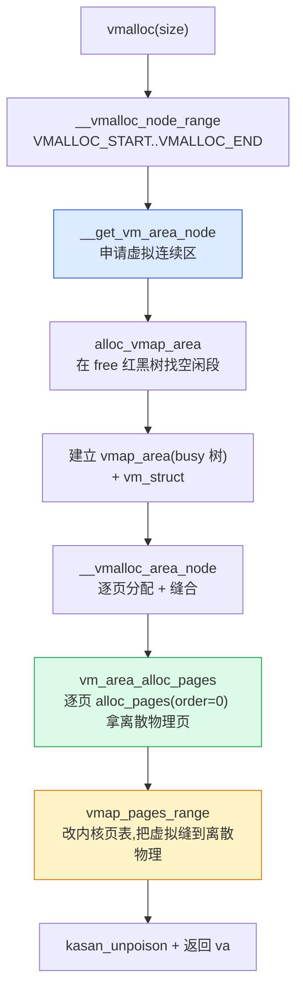

# 第十一 章 · vmalloc 与 percpu:虚拟连续与每 CPU 副本

> 篇:P3 vmalloc 与 percpu
> 主线呼应:前两篇(buddy、slab)把"内核怎么把内存分出去"的常规路径讲透了——buddy 按 2^N 页分、slab 在页上切小对象。但内核自己还有两种"特殊需求"buddy/slab 没覆盖:**要一大块虚拟连续(而物理可以离散)的区域**,以及**每个 CPU 一份副本的变量**。这一章补这两块,把"内核自己的分配工具箱"凑齐,然后第 4 篇就要转向**用户进程**的地址空间。

## 核心问题

**buddy 给的是物理连续的页,slab 给的是固定大小的小对象。但内核有时要:(1) 一大块"虚拟地址连续、物理页可以离散"的区域(加载一个内核模块、建一张很大的 hash 表、给 percpu chunk),物理连续是奢侈品,长跑的机器碎片化后根本拿不到几 MB 的连续物理页;(2) 一个"每个 CPU 都有一份独立副本"的变量(统计计数器、per-CPU 的 task 链表),全局一把锁会成热点。vmalloc 和 percpu 就是这两个需求对应的机制。**

读完本章你会明白:

1. **内核虚拟地址布局**:线性映射区(物理直接映射,O(1) 算物理地址)vs vmalloc 区(需要查页表)——这个反差是本章最有价值的洞察。
2. **vmalloc 全流程**:申请一段虚拟连续区(`vmap_area`)→ 逐页 `alloc_page` → 改内核页表把离散物理页"缝"成虚拟连续(`vmap_pages_range`)。
3. **vmalloc 的取舍**:换得"大块虚拟连续",代价是慢(建/改页表 + 访问时 TLB 不连续),所以只用在"需要大块连续地址但访问不密集"的场景。
4. **percpu 无锁原理**:每 CPU 一份副本,`this_cpu_inc(counter)` 编译成单条本 CPU 指令(x86 `inc %gs:offset`),无需任何锁;percpu chunk 的内存本身也靠类似 vmalloc 的机制分配。
5. **vmalloc vs percpu 在内核虚拟地址布局里的位置**,以及它们为什么不能用在快路径密集访问的场景。

> **逃生阀**:如果你只读一句话,就记住这句——**`kmalloc` 走的是线性映射区(物理地址 = 虚拟 − 固定偏移,O(1),不需查页表);`vmalloc` 走的是专门的 vmalloc 区(虚拟连续但物理离散,每次访问都要走多级页表,慢)**。这就是为什么内核代码反复强调"能用 `kmalloc` 就别用 `vmalloc`"。

---

## 11.1 一句话点破

> **vmalloc 用"虚拟连续换物理离散",绕开物理连续这个奢侈品;percpu 用"每 CPU 一份副本",把热点变量的锁拆掉。两者都在内核虚拟地址布局里另开一块"特殊区",换取线性映射区给不了的灵活性,代价是慢一点。**

这是结论,不是理由。本章倒过来拆:先看清内核虚拟地址长什么样(线性映射区 vs vmalloc 区 vs fixmap),再讲 vmalloc 怎么缝页表,然后讲 percpu 怎么靠段基址定位本 CPU 副本,最后回到那个反差——为什么 `kmalloc` 不用查页表、`vmalloc` 要查。

---

## 11.2 先看清楚:内核虚拟地址长什么样

要讲 vmalloc,必须先把内核虚拟地址的"地图"摊开,否则你无法理解"为什么 vmalloc 慢"。这是本章的地基。

在 64 位 x86(`x86_64`)上,内核虚拟地址空间(高位一半,典型的 `0xffff800000000000` 以上)被切成几段。简化布局如下(数字是典型值,因 KASLR、`CONFIG_X86_5LEVEL` 等会偏移):

```
   内核虚拟地址空间(x86_64 简化布局)
   ┌─────────────────────────────────────────────────────────────┐
   │ 直接映射区 / 线性映射区(direct mapping)                  │
   │   虚拟 = 物理 + PAGE_OFFSET(固定偏移)                    │
   │   ★ O(1) 算物理地址,无需查页表                            │
   │   kmalloc、__get_free_pages、slab 对象都在这里             │
   │   几乎全部物理内存都"平铺"映射进来                         │
   ├─────────────────────────────────────────────────────────────┤
   │ vmalloc 区(VMALLOC_START ~ VMALLOC_END)                    │
   │   ★ 虚拟连续、物理离散,需要查页表                         │
   │   vmalloc()、vmap()、ioremap()、内核模块都在这里            │
   │   稀疏——只占整体虚拟空间一小段                              │
   ├─────────────────────────────────────────────────────────────┤
   │ vmemmap 区(struct page 数组)                              │
   │   每个 struct page 都在这里有连续位置                       │
   ├─────────────────────────────────────────────────────────────┤
   │ fixmap / kmap_local 区(固定映射、临时映射)                │
   └─────────────────────────────────────────────────────────────┘
```

这张图里,**最关键的反差在"直接映射区 vs vmalloc 区"**:

- **直接映射区(direct mapping)**:物理内存几乎被"平铺"映射进这段虚拟区。虚拟地址和物理地址之间只差一个固定常量(`PAGE_OFFSET` 或类似偏移):
  ```
  物理地址 = 虚拟地址 − PAGE_OFFSET
  虚拟地址 = 物理地址 + PAGE_OFFSET
  ```
  这意味着——**给定一个直接映射区里的虚拟地址,O(1) 算出物理地址,根本不用查页表**。`kmalloc` 返回的指针、`page_address(page)` 返回的地址,都在这段。页表当然是有的(为了访问),但内核要算物理地址时直接做减法,不走 MMU。

- **vmalloc 区**:`VMALLOC_START` ~ `VMALLOC_END` 是一段**专门留出来**的虚拟区。这里的虚拟地址**和物理地址没有固定偏移关系**——一段虚拟连续区可以映射到任意离散的物理页。要知道"虚拟地址 X 映射到哪个物理页",**必须走多级页表查**(这就是 [`vmalloc_to_page`](../linux/mm/vmalloc.c#L731) 的全部工作)。

> **钉死这件事**:`kmalloc` 的指针在线性映射区,物理地址 O(1) 可得;`vmalloc` 的指针在 vmalloc 区,物理地址要查页表。**这个反差解释了为什么内核代码反复说"vmalloc 慢,能用 kmalloc 就别用 vmalloc"——不只是分配慢,访问也慢(TLB 不连续)。**

`VMALLOC_START` / `VMALLOC_END` 是**体系结构相关**宏(在 `arch/x86/include/asm/pgtable_64_types.h` 等位置,本地 sparse clone 未含 `arch/`,这里只描述事实):x86_64 上它们紧跟在直接映射区之后,典型跨度可达 TB 级,因为内核模块、大型 hash 表、percpu chunk 都要在这里吃饭。`include/linux/vmalloc.h` 里给出总量宏 [`VMALLOC_TOTAL`](../linux/include/linux/vmalloc.h#L288)(`VMALLOC_END - VMALLOC_START`)。

有了这张地图,我们就能讲 vmalloc 在做什么了。

---

## 11.3 vmalloc 的"为什么":虚拟连续换物理离散

### 提出问题

内核有很多场景需要一块**地址连续**的大区域:

- **加载内核模块**(`insmod`):模块的代码段、数据段、重定位表得放在一块连续的虚拟地址里,这样模块内部的相对跳转、相对寻址才成立。一个模块几 MB 不稀奇。
- **大型 hash 表、radix tree**:有些子系统(比如网络连接跟踪 `nf_conntrack`、inode cache 的扩展结构)需要一张可能上百万个槽的表,而且要能 `table[i]` 这样按偏移索引——这要求地址连续。
- **percpu chunk**(下一节细讲):每个 CPU 一段副本,加起来要连续虚拟区。
- **大缓冲区**:某些驱动要给 DMA 准备几 MB 的内核缓冲,而且这个缓冲要传给用户态当大块数据。

这些场景都要"地址连续"。**问题来了:这些场景,真的需要"物理连续"吗?**

> **不这样会怎样**:如果硬要"物理连续",就得从 buddy 要高 order 的页块——比如要 4MB 就得 `alloc_pages(GFP_KERNEL, order=10)`(2^10 = 1024 页)。但 buddy 高 order 分配在长跑的机器上**极难成功**:机器跑久了,物理内存碎片化严重,4MB 连续都未必拿得到(P1-06 的 migrate types 和 P5-18 的 compaction 就是为这个洞擦屁股的)。而实际上,模块代码、hash 表这些**根本不关心底层物理页连不连续**——只要虚拟地址连续,CPU 访问时 MMU 自己会翻译,软件层完全感知不到物理离散。**为了"软件感知不到的连续"付出"物理连续"这个奢侈品,划不来。**

### 所以这样设计

**vmalloc 的核心取舍**:在 vmalloc 区申请一段**虚拟连续**的区域,但它映射到的**物理页是离散的**——逐页 `alloc_page`(只要 order-0,物理连续性要求极低),再用 `vmap_pages_range` 把这些离散页"缝"进内核页表,让这段虚拟地址看起来连续。

```
   vmalloc(4MB) 做的事

   虚拟区(连续):                 物理页(离散,可能来自各处):
   ┌──────────┐ va                ┌──┐ page0 = alloc_page()  → pfn 0x12345
   │  page0   │ ─────────────────▶│  │
   ├──────────┤ va+4K             ├──┤ page1 = alloc_page()  → pfn 0x88abc  (不相邻!)
   │  page1   │ ─────────────────▶│  │
   ├──────────┤ va+8K             ├──┤ page2 = alloc_page()  → pfn 0x401de
   │  page2   │ ─────────────────▶│  │
   ├──────────┤                   ├──┤ ...
   │   ...    │                   │  │ (4MB = 1024 页,每页独立分配)
   ├──────────┤ va+4M-4K          ├──┤
   │ page1023 │ ─────────────────▶│  │
   └──────────┘                   └──┘

   缝合动作: vmap_pages_range() 改内核页表,
             把 va、va+4K、va+8K... 分别指向离散物理页,
             软件看到 va~va+4M 一片"连续"。
```

> **所以这样设计**:用"改页表 + 物理离散"换"绕开物理连续约束"。代价是每页都要建/改内核页表项(分配时 `vmap_pages_range` 一次性建,但访问时 TLB 是离散的、不连续),所以 vmalloc 区访问比线性映射区慢——后面技巧精解详谈。

### 反面对比:buddy 高 order vs vmalloc

把两种朴素方案对比一下,vmalloc 的取舍就显形了:

| 方案 | 虚拟连续 | 物理连续 | 成功概率(碎片化机器) | 访问速度 |
|------|---------|---------|---------------------|---------|
| `alloc_pages(order=10)`(buddy) | 是(在线性映射区) | 是 | **极低**(4MB 物理连续难) | 快(O(1) 物理地址,TLB 友好) |
| `vmalloc(4MB)` | 是(在 vmalloc 区) | **否** | **高**(只要 1024 个 order-0 页) | 慢(查页表,TLB 不连续) |

**vmalloc 用"访问慢一点"换"分配必然成功"**。对模块、hash 表这种"分配一次性、之后访问不极密"的场景,这个交易非常划算。但对"分配后高频访问、性能敏感"的场景(比如网络包数据路径),绝不能用 vmalloc——必须坚持 `kmalloc`(线性映射区)。

> **钉死这件事**:vmalloc 不是 `kmalloc` 的升级版,它是**另一种工具**,用于"虚拟地址连续性是刚需、物理连续性是奢侈"的场景。判断要不要用 vmalloc 的标准:**你真的需要地址连续吗?访问有多频繁?** 大多数时候答案是"用 kmalloc 就够了"。

---

## 11.4 vmalloc 全流程:三步走

现在我们走一次 `vmalloc(size)` 的真实源码,看它怎么把上面这套取舍落地。三步:

1. **申请一段虚拟连续区**(`__get_vm_area_node` → `alloc_vmap_area`)——在 vmalloc 区的红黑树里找一块空闲虚拟范围。
2. **逐页分配物理页**(`__vmalloc_area_node` → `vm_area_alloc_pages`)——从 buddy 要 order-0 页。
3. **改内核页表缝合**(`vmap_pages_range` → `vmap_small_pages_range_noflush`)——把离散页映射进第 1 步的虚拟区。

### 第 0 步:入口 `__vmalloc_node_range`

[`vmalloc`](../linux/mm/util.c#L659) 在 `mm/util.c`,只是个薄封装:

```c
// mm/util.c#L659(简化示意,非源码原文)
return __vmalloc_node_range(size, 1, VMALLOC_START, VMALLOC_END,
                            gfp_mask, PAGE_KERNEL, 0, node, caller);
```

所有 `vmalloc` 家族(`vmalloc`、`vzalloc`、`vmalloc_user`、`vmalloc_32`……)最终都汇聚到 [`__vmalloc_node_range`](../linux/mm/vmalloc.c#L3733),它就是 vmalloc 的"主干"。

### 第 1 步:申请虚拟连续区

[`__vmalloc_node_range`](../linux/mm/vmalloc.c#L3733) 第一件事是调 [`__get_vm_area_node`](../linux/mm/vmalloc.c#L3068):

```c
// mm/vmalloc.c#L3068-L3099(简化)
static struct vm_struct *__get_vm_area_node(unsigned long size,
        unsigned long align, unsigned int shift, unsigned long flags,
        unsigned long start, unsigned long end, int node,
        gfp_t gfp_mask, const void *caller)
{
    struct vmap_area *va;
    struct vm_struct *area;
    ...
    if (!(flags & VM_NO_GUARD))
        size += PAGE_SIZE;            // 留一个 guard page(下文讲)
    va = alloc_vmap_area(size, align, start, end, node, gfp_mask, 0);
    ...
    setup_vmalloc_vm(area, va, flags, caller);
    return area;
}
```

[`alloc_vmap_area`](../linux/mm/vmalloc.c#L1933) 在 vmalloc 区的红黑树里找一块大小够、对齐满足的空闲虚拟段。空闲区由**两棵红黑树**管(详见 11.5):

- `free_vmap_area_root`:所有空闲虚拟段,按地址排序,**augmented**(每个节点记子树最大空闲块大小,O(log N) 找"最低地址的够大空闲块")。
- `vmap_area_root`(busy 树):所有已分配的虚拟段。

一个 `vmap_area`(已分配段)的结构在 [`include/linux/vmalloc.h`](../linux/include/linux/vmalloc.h#L64):

```c
// include/linux/vmalloc.h#L64-L82(简化)
struct vmap_area {
    unsigned long va_start;          // 虚拟区起始
    unsigned long va_end;            // 虚拟区结束
    struct rb_node rb_node;          // busy 树的节点
    struct list_head list;           // 地址排序链表
    union {
        unsigned long subtree_max_size;  // 在 free 树里:子树最大空闲
        struct vm_struct *vm;            // 在 busy 树里:指向 vm_struct
    };
    unsigned long flags;
};
```

注意这个 **`union` 复用**:`vmap_area` 要么在 free 树(此时只关心"我有多大空闲"),要么在 busy 树(此时关心"我映射给哪个 `vm_struct`")。两种状态互斥,用 `union` 共用同一段内存,省 8 字节。这和第 1 章 `struct page` 的紧凑布局是同一种思路。

### 第 2 步:逐页分配物理页

回到 [`__vmalloc_node_range`](../linux/mm/vmalloc.c#L3733),拿到虚拟区后,调 [`__vmalloc_area_node`](../linux/mm/vmalloc.c#L3599):

```c
// mm/vmalloc.c#L3599-L3698(简化)
static void *__vmalloc_area_node(struct vm_struct *area, gfp_t gfp_mask,
                                 pgprot_t prot, unsigned int page_shift,
                                 int node)
{
    unsigned long addr = (unsigned long)area->addr;
    unsigned long size = get_vm_area_size(area);
    unsigned int nr_small_pages = size >> PAGE_SHIFT;
    ...
    // ① 先给 page 指针数组分配空间(若数组 > 1 页,递归 vmalloc;否则 kmalloc)
    area->pages = kmalloc_node(array_size, nested_gfp, node);

    // ② 逐页(或按 page_order)从 buddy 要物理页
    area->nr_pages = vm_area_alloc_pages(gfp_mask, node, page_order,
                                         nr_small_pages, area->pages);
    ...
    // ③ 缝合(下一步)
    ret = vmap_pages_range(addr, addr + size, prot, area->pages, page_shift);
    return area->addr;
}
```

关键点:

- **`area->pages` 是一个 `struct page *` 数组**,记录"虚拟区第 i 页对应哪个物理页"——这是离散物理页的"账本"。因为物理页离散,没法像线性映射区那样 O(1) 算,只能查这个数组(或查页表,见 [`vmalloc_to_page`](../linux/mm/vmalloc.c#L731))。
- **`vm_area_alloc_pages` 逐页(或大页)调 buddy**:`__alloc_pages(GFP_KERNEL, 0, ...)` 一页一页要,完全绕开"物理连续"要求。每页 order-0,buddy 几乎总能给。
- **`gfp_mask |= __GFP_HIGHMEM`**(L3616):vmalloc 不怕 HIGHMEM(32 位时代遗留,64 位无影响)——反正页表会缝,物理页在哪个 zone 都行。

### 第 3 步:缝合——改内核页表

`vm_area_alloc_pages` 拿到 `nr_pages` 个离散物理页后,真正的"缝"由 [`vmap_pages_range`](../linux/mm/vmalloc.c#L648) 完成:

```c
// mm/vmalloc.c#L599-L633(简化)
int __vmap_pages_range_noflush(unsigned long addr, unsigned long end,
        pgprot_t prot, struct page **pages, unsigned int page_shift)
{
    if (page_shift == PAGE_SHIFT)
        return vmap_small_pages_range_range_noflush(addr, end, prot, pages);
    // 大页路径(VM_ALLOW_HUGE_VMAP)
    for (i = 0; i < nr; i += 1U << (page_shift - PAGE_SHIFT)) {
        vmap_range_noflush(addr, addr + (1UL << page_shift),
                           page_to_phys(pages[i]), prot, page_shift);
        addr += 1UL << page_shift;
    }
}
```

`vmap_small_pages_range_noflush`(以及大页路径的 `vmap_range_noflush`)会**走内核多级页表**(pgd→p4d→pud→pmd→pte),为虚拟区每一页(或大页)建立/修改页表项,让它指向第 2 步拿到的离散物理页。这一步是 vmalloc 真正的"重活"——每页一次页表修改,可能还要分配中间页表页(pmd/pud 表页)。

> **源码修正**:本章任务文档里提到 `map_kernel_range`,但 Linux 6.9 的 `mm/vmalloc.c` **已不存在 `map_kernel_range` 这个名字**——它被重构成了 [`vmap_pages_range`](../linux/mm/vmalloc.c#L648) / [`__vmap_pages_range_noflush`](../linux/mm/vmalloc.c#L599) / `vmap_small_pages_range_noflush` 这套。`include/linux/kmsan.h` 里有 `kmsan_map_kernel_range_noflush` 的残留命名,但 mm 主路径用的是 `vmap_pages_range`。这是版本演进,我们按 6.9 真实代码讲。

建完页表,一段虚拟连续区就"缝"好了。从软件看,`vmalloc()` 返回的指针 `va ~ va+size` 是一片连续地址;从硬件看,MMU 翻译每一页时走页表查到离散的物理页。

### 流程总图



---

## 11.5 vmap_area 管理:红黑树 + augmented + 合并

vmalloc 区是稀缺资源(虚拟地址空间虽大,但 fixmap、模块区也要吃饭),所以 `vmap_area` 的管理很讲究。这是 vmalloc 实现**最硬核的技巧之一**,我们单独拆。

### 两棵树 + 一个链表

[`vmap_area`](../linux/include/linux/vmalloc.h#L64) 同时挂在两个地方(见 11.4 结构):

- **busy 树**(`vmap_area_root` / `vn->busy.root`):已分配的段,按 `va_start` 排序。`vfree` 时按地址查这棵树找到对应段。
- **free 树**(`free_vmap_area_root`):空闲段。`alloc_vmap_area` 时在这棵树里找一块够大的。

外加一个**地址排序链表**(`vn->busy.head`、`free_vmap_area_list`),用于顺序扫描。

### augmented 红黑树:O(log N) 找"最低地址够大块"

[`__alloc_vmap_area`](../linux/mm/vmalloc.c#L1750) 在 free 树里找一块时,要求是:**最低地址的、能放下 size 的空闲块**(first-fit,偏向低地址,减少碎片)。朴素红黑树只能按 key(地址)排序,不知道"子树里有没有够大的块"——找 first-fit 得 O(N) 扫描。

内核用 **augmented red-black tree**(增强红黑树)解决:每个节点除了 key,还额外存一个 `subtree_max_size`——**以本节点为根的子树里,最大空闲块的尺寸**(见 [`vmap_area` 的 union](../linux/include/linux/vmalloc.h#L77))。这样查找时:

- 从根开始,若左子树的最大空闲 ≥ size,就往左走(左子树地址更低,优先);
- 否则若本节点够大,就用本节点;
- 否则往右走。

一次查找 O(log N)。插入/删除时,augmented 字段沿着路径回写更新,O(log N)。这是**用空间(每个节点多 8 字节)换时间**(O(N) → O(log N))的典型工程技巧。

> **反面对比**:如果朴素用红黑树(不 augmented),`alloc_vmap_area` 在碎片化的 vmalloc 区会退化为 O(N) 扫描——vmalloc 区段多时(大型服务器上千个 vmalloc 区),分配会显著变慢。augmented 把这个洞堵了。

### 释放时合并相邻空闲段

[`free_vmap_area`](../linux/mm/vmalloc.c#L1789) 把段从 busy 树摘下后,调 [`merge_or_add_vmap_area_augment`](../linux/mm/vmalloc.c#L1804) 插回 free 树——**这个名字里的 `merge` 是关键**:它会尝试和相邻的空闲段合并,再插入。这和 buddy 的"释放时合并伙伴"是**同一种抗碎片思路**(详见 P1-03),只不过 buddy 按 2 的幂、vmap_area 按地址相邻。

> **钉死这件事**:vmalloc 区虽是虚拟空间,但它也会"碎片化"——频繁 vmalloc/vfree 后,空闲段会被切成碎渣,后续大块 vmalloc 失败。`merge_or_add_vmap_area_augment` 的合并 + augmented 树的 first-fit,合力把碎片化压住。

### guard page:区与区之间留一页空

回到 [`__get_vm_area_node`](../linux/mm/vmalloc.c#L3068),除非指定 `VM_NO_GUARD`,每个 vmalloc 区都会**多留一页**(`size += PAGE_SIZE`)作 guard page。这一页**不映射任何物理页**,访问它就缺页报错。

> **为什么**:vmalloc 区是虚拟连续的,如果两个相邻 vmalloc 区紧贴着,**前一个区写越界(缓冲区溢出)会神不知鬼不觉地写到后一个区**,bug 难查。guard page 把每段 vmalloc 区隔开,越界访问立刻缺页 panic——把"内存越界"这种隐蔽 bug 变成立即可见的崩溃。这是内核 mm 里反复出现的"**牺牲一点空间换调试性**"哲学。

---

## 11.6 vfree 与 vmalloc_to_page:回收与反查

### vfree:拆除映射 + 还物理页 + 还虚拟段

[`vfree`](../linux/mm/vmalloc.c#L3305) 是 vmalloc 的逆操作,三步:

1. [`remove_vm_area`](../linux/mm/vmalloc.c#L3182):按地址在 busy 树找到 `vmap_area`,把页表项清掉、TLB 刷新(unmap),把段从 busy 树摘下,合并回 free 树。
2. 遍历 `vm->pages[]`,对每个物理页调 `__free_page`(还给 buddy)。
3. 释放 `vm_struct` 本身和 `pages` 数组。

```c
// mm/vmalloc.c#L3305-L3346(简化)
void vfree(const void *addr)
{
    struct vm_struct *vm;
    ...
    vm = remove_vm_area(addr);        // ① 拆页表 + 还虚拟段
    ...
    for (i = 0; i < vm->nr_pages; i++)
        __free_page(vm->pages[i]);    // ② 还物理页给 buddy
    kvfree(vm->pages);                // ③ 还 page 数组
    kfree(vm);                        //    还 vm_struct
}
```

一个细节:`vfree` **不能在中断上下文调**(L3310 检查 `in_interrupt()`,中断里只能走 [`vfree_atomic`](../linux/mm/vmalloc.c#L3271) 延迟到工作队列)——因为 `remove_vm_area` 会睡眠(TLB 刷新、锁),中断里不能睡。

### vmalloc_to_page:虚拟反查物理

给定一个 vmalloc 区的虚拟地址,要找它映射到哪个物理页,**必须走多级页表**——这就是 [`vmalloc_to_page`](../linux/mm/vmalloc.c#L731):

```c
// mm/vmalloc.c#L731-L784(简化)
struct page *vmalloc_to_page(const void *vmalloc_addr)
{
    unsigned long addr = (unsigned long)vmalloc_addr;
    pgd_t *pgd = pgd_offset_k(addr);
    p4d_t *p4d; pud_t *pud; pmd_t *pmd;
    pte_t *ptep, pte;

    // 逐级走页表:pgd → p4d → pud → pmd → pte
    ...
    ptep = pte_offset_kernel(pmd, addr);
    pte = ptep_get(ptep);
    if (pte_present(pte))
        return pte_page(pte);
    return NULL;
}
```

这就是"vmalloc 慢"的根源——**线性映射区的指针,O(1) 减法得物理地址;vmalloc 区的指针,O(页表层级)走 4~5 级页表才得物理地址**。每多一层页表查询,多一次内存访问(页表本身也在内存里)。

[`vmalloc_to_pfn`](../linux/mm/vmalloc.c#L790) 只是 `page_to_pfn(vmalloc_to_page(addr))` 的薄封装。

> **钉死这件事**:`vmalloc_to_page` 的存在本身就是"vmalloc 区和线性映射区有本质区别"的证据——线性映射区根本不需要这种函数(减法即可)。下一次你看到内核代码里调 `vmalloc_to_page`,就知道:这段代码在为"vmalloc 区的物理地址不可 O(1) 得"擦屁股。

---

## 11.7 percpu 的"为什么":每 CPU 一份副本换无锁

vmalloc 讲完,我们转向本章第二个机制——**percpu**(per-CPU 变量)。它和 vmalloc 看似无关,实则共享同一类技巧(都在内核虚拟地址布局里"另开一块",都靠 vmalloc-like 机制分配底层内存)。

### 提出问题

内核里大量用到**计数器**和**per-CPU 状态**:

- 网络收包计数、CPU 利用率统计、各类 `vmstat` 字段——每个事件都自增一个全局计数器。
- 每个 CPU 自己的"当前任务"指针、run queue、软中断 pending 位图——每个 CPU 独立维护。
- slab 的 per-cpu partial、buddy 的 per-cpu pageset(P1-05、P2-08)——每个 CPU 一份本地缓存。

这些数据有个共同特点:**逻辑上每个 CPU 独立、不该共享**。如果朴素地用一个全局变量 + 一把自旋锁保护:

> **反面对比**:假设 `int packet_count` 是全局计数器,加 `atomic_t`。每次网卡收一个包,中断处理里 `atomic_inc(&packet_count)`——这翻译成 `lock inc [packet_count]`,**`lock` 前缀会独占总线/缓存行**,所有 CPU 同时收包时,这个缓存行在 CPU 间疯狂弹跳(cache line bouncing),计数器成了全局热点,性能随核数增加而下降。这就是"共享可写状态"的经典病灶。

### 所以这样设计

**percpu 的核心思想**:给这个变量配**每个 CPU 一份独立副本**,各 CPU 只读写自己那份,**互不相干**——自然无需锁。

```
   per-CPU 变量:每 CPU 一份副本

   CPU 0 副本                  CPU 1 副本              CPU 2 副本
   ┌──────────────┐            ┌──────────────┐        ┌──────────────┐
   │ packet_count │            │ packet_count │        │ packet_count │
   │ = 1234       │            │ = 5678       │  ...   │ = 9012       │
   ├──────────────┤            ├──────────────┤        ├──────────────┤
   │ task_curr    │            │ task_curr    │        │ task_curr    │
   │ =进程A       │            │ =进程B       │        │ =进程C       │
   └──────────────┘            └──────────────┘        └──────────────┘

   统计总数时:for_each_cpu  sum += *per_cpu_ptr(&packet_count, cpu);
   每次只碰本 CPU 那份 → 无锁、无缓存行弹跳
```

声明一个 per-CPU 变量用 [`DEFINE_PER_CPU`](../linux/include/linux/percpu-defs.h#L114)(宏):

```c
// include/linux/percpu-defs.h#L114-L115(简化)
#define DEFINE_PER_CPU(type, name)                            \
    DEFINE_PER_CPU_SECTION(type, name, "")
```

它展开后,链接器在 `.data..percpu` 段里给 `name` 留 **N 份**(N = CPU 数)空间。运行时,每份副本被映射到对应 CPU 的 percpu 虚拟区。

### 访问:`this_cpu_ptr` 编译成单条指令

访问本 CPU 副本用 [`this_cpu_ptr`](../linux/include/linux/percpu-defs.h#L246)(或 `this_cpu_read`/`this_cpu_inc` 等操作宏):

```c
// include/linux/percpu-defs.h#L233-L253(简化)
#define per_cpu_ptr(ptr, cpu)                                 \
    SHIFT_PERCPU_PTR((ptr), per_cpu_offset((cpu)))            // 加偏移到指定 CPU 副本

#define raw_cpu_ptr(ptr)                                      \
    arch_raw_cpu_ptr(ptr)                                     // 体系结构相关,走段基址

#ifdef CONFIG_DEBUG_PREEMPT
#define this_cpu_ptr(ptr)                                     \
    SHIFT_PERCPU_PTR(ptr, my_cpu_offset)                      // 加本 CPU 偏移
#else
#define this_cpu_ptr(ptr) raw_cpu_ptr(ptr)
#endif
```

**关键在 `my_cpu_offset` / `arch_raw_cpu_ptr` 在 x86 上怎么实现**——这是 percpu 无锁的精髓,我们在技巧精解里单独拆透(11.9)。

**`this_cpu_inc(counter)` 编译成单条本 CPU 指令**,例如 x86 上是 `inc %gs:offset`——一条指令,无锁,只碰本 CPU 的缓存行,不弹跳。

> **钉死这件事**:percpu 不是"每 CPU 变量加锁"——它根本不要锁。每个 CPU 只碰自己那份副本,逻辑上"互不可见",没有共享可写状态,自然不需要同步。读总数时,显式 `for_each_cpu` 把所有 CPU 副本加起来,这是**最终一致**(某一刻的总数可能不精确,因为别的 CPU 正在改自己的副本),但对统计场景完全够。

---

## 11.8 percpu chunk 的内存从哪来

per-CPU 变量的副本放在哪?每 CPU 一段虚拟地址区(percpu 区),按 unit 切分,**每个 unit 对应一个 CPU 的所有 per-CPU 变量副本**。

### first chunk:引导期的第一块

percpu 分配器启动时,要建"第一块 chunk"([`pcpu_first_chunk`](../linux/mm/percpu.c#L162))。这一块由 [`pcpu_embed_first_chunk`](../linux/mm/percpu.c#L3075) 在 boot 期用 memblock 物理分配 + 直接映射:

```c
// mm/percpu.c#L3075-L3160(简化)
int __init pcpu_embed_first_chunk(size_t reserved_size, size_t dyn_size,
                                  size_t atom_size, ...)
{
    ...
    for (group = 0; group < ai->nr_groups; group++) {
        // 给每组 CPU 用 memblock 分配连续物理内存(x86 靠 pcpu_fc_alloc → memblock)
        ptr = pcpu_fc_alloc(cpu, gi->nr_units * ai->unit_size, atom_size, ...);
        // 拷贝静态 percpu 变量初始值
        memcpy(ptr, __per_cpu_load, ai->static_size);
        ...
    }
    ...
}
```

关键点:

- **first chunk 的物理内存来自 boot 期 memblock**(早期分配器,P1-02 讲),靠**线性映射区**直接访问(`pcpu_embed_first_chunk` 的注释 L3060 明说 "piggy back on the linear physical mapping")——所以 first chunk **不在 vmalloc 区**。
- first chunk 装两样:**静态 per-CPU 变量**(`DEFINE_PER_CPU` 编译进 `.data..percpu` 的那些,以及 `PERCPU_MODULE_RESERVE` 给模块用)+ **动态预留**(`PERCPU_DYNAMIC_RESERVE`,给运行时 `alloc_percpu` 用)。

### dynamic chunk:运行时按需扩张

当 first chunk 的动态预留用完,内核要建**新 chunk**。新 chunk 的物理内存**不在线性映射区**,而是**靠 vmalloc-like 机制**分配——具体由 `pcpu_create_chunk`(在 `mm/percpu-vm.c`,本地 sparse 未含但它是 vmalloc 体系的薄封装)调 [`__get_vm_area_node`](../linux/mm/vmalloc.c#L3068) 在 vmalloc 区申请一段虚拟,然后逐页 `alloc_page` + `vmap_pages_range` 缝合。

> **钉死这件事**:percpu 的底层内存分配**复用了 vmalloc 机制**(至少 dynamic chunk 是)。这就是为什么 vmalloc 和 percpu 在同一章——它们共享"虚拟连续 + 物理离散 + 改页表缝合"的核心技巧。

### bitmap 分配器:在 chunk 内部切单位

[`pcpu_alloc`](../linux/mm/percpu.c#L1717) 在 chunk 里找一个空闲位段,管理粒度是 `PCPU_MIN_ALLOC_SIZE`(4 字节,[`include/linux/percpu.h`](../linux/include/linux/percpu.h#L27)):

```c
// mm/percpu.c#L1717-L1875(简化)
static void __percpu *pcpu_alloc(size_t size, size_t align, bool reserved, gfp_t gfp)
{
    ...
    size = ALIGN(size, PCPU_MIN_ALLOC_SIZE);
    bits = size >> PCPU_MIN_ALLOC_SHIFT;        // 折算成 bitmap 位数
    ...
    // 在各 slot 的 chunk 里找一块够大的
    for (slot = pcpu_size_to_slot(size); slot <= pcpu_free_slot; slot++) {
        list_for_each_entry_safe(chunk, next, &pcpu_chunk_lists[slot], list) {
            off = pcpu_find_block_fit(chunk, bits, bit_align, is_atomic);
            ...
            off = pcpu_alloc_area(chunk, bits, bit_align, off);
            if (off >= 0) goto area_found;
        }
    }
    // 没找到就新建 chunk
    if (list_empty(&pcpu_chunk_lists[pcpu_free_slot])) {
        chunk = pcpu_create_chunk(pcpu_gfp);   // ← vmalloc-like 机制分配
        ...
    }
    ...
    // 按需 populate 物理页(没填的 chunk 段才分配物理页)
    for_each_clear_bitrange_from(rs, re, chunk->populated, page_end) {
        ret = pcpu_populate_chunk(chunk, rs, re, pcpu_gfp);  // ← 逐页分配 + 缝合
        ...
    }
    ...
    return __addr_to_pcpu_ptr(chunk->base_addr + off);
}
```

几个技巧点:

- **bitmap + 块提示(block hint)**:`chunk` 内部用一张 bitmap 记"哪些位已分",配 [`struct pcpu_block_md`](../linux/mm/percpu.c#L286 附近)提示每个块的连续空闲长度,避免 O(N) 全扫——和 vmalloc 的 augmented 树同理,**用额外元数据换 O(1)~O(log) 的查找**。
- **slot 分级**:`pcpu_chunk_lists[pcpu_nr_slots]` 把 chunk 按"剩余空闲"分到不同 slot(满的、半满的、空的),分配时**从最满的 slot 先试**——填满一个 chunk 再用下一个,减少碎片。和 slab 的 per-node partial 队列、buddy 的 migrate types 一样,都是"**抗碎片**"思路。
- **惰性 populate**:chunk 创建时**不立刻分配所有物理页**,而是按需 [`pcpu_populate_chunk`](../linux/mm/percpu.c#L1574)(调底层 vmalloc 机制)——`pcpu_alloc` 只在真正用到那段时才填物理页。这是"惰性分配"在 percpu 的体现(和 P4-14 用户态缺页的惰性同源)。

---

## 11.9 技巧精解:线性映射 vs vmalloc 页表查 & percpu 段基址定位

这一章最值钱的两个技巧,我们单独拆透。

### 技巧一:线性映射区 O(1) vs vmalloc 区查页表

**这是本章最有价值的洞察**。把同一段代码在两种区的物理地址计算方式并排:

**线性映射区(`kmalloc`、`page_address`)**:

```c
// 内核里通常写法(简化示意)
phys_addr = virt_to_phys(kmalloc_ptr);   // 展开:virt - PAGE_OFFSET
```

`virt_to_phys` 在 x86_64 上就是**一次减法**(`virt - PAGE_OFFSET`),O(1),不访问内存,不查页表。因为整片物理内存被"平铺"映射进线性映射区,虚拟和物理只差一个固定偏移。

**vmalloc 区**:

```c
// 要拿物理地址,必须走 vmalloc_to_page(走 4~5 级页表)
struct page *p = vmalloc_to_page(vmalloc_ptr);
phys_addr = page_to_phys(p);
```

[`vmalloc_to_page`](../linux/mm/vmalloc.c#L731) 走 pgd→p4d→pud→pmd→pte 五级(4 级页表的话 4 次),**每级都是一次内存访问**(页表项在内存里)。在 TLB miss 时,一次虚拟地址翻译可能触发多次内存访问——这就是 vmalloc 慢的根源。

**这个反差的根源**:线性映射区在内核启动时就一次性建好(连续大段),之后不再改;vmalloc 区是**运行时一段一段建/拆**(`vmap_pages_range` / `remove_vm_area`),每段映射的物理页离散,页表是"碎片化"的——TLB 缓存也不连续(每页独立 TLB 项),容易 miss。

> **反面对比**:假设有个高频网络数据路径,有人图省事写了 `buf = vmalloc(BIG)`。每次收包都访问 `buf[i]`:
> - **线性映射区**(`kmalloc`):虚拟地址连续、物理也连续,TLB 几个 entry 覆盖大段,几乎全命中,延迟稳定。
> - **vmalloc 区**:虚拟连续、物理离散,TLB 一页一项、1024 页要 1024 个 TLB entry,极易 thrash(抖动),延迟尖刺。
>
> 这就是为什么"能用 `kmalloc` 就别用 `vmalloc`"——不只是分配路径慢,**访问路径也慢**,而且慢得隐蔽(TLB miss 不像函数调用那样可观测)。

> **钉死这件事**:这个反差是判断"该不该用 vmalloc"的**唯一标准**。问自己:(1) 我真的需要虚拟地址连续吗?(2) 访问频繁吗?(3) 物理连续是不是奢侈品?三个问题里只要有一个偏向"频繁访问、物理连续可接受",就用 `kmalloc`;只有"需要大块连续地址 + 物理连续拿不到 + 访问不密集"才用 `vmalloc`。

### 技巧二:percpu 的 `this_cpu_ptr` —— 段基址定位本 CPU 副本

percpu 无锁的精髓在 `this_cpu_ptr` 在 x86 上**编译成单条段基址寻址指令**。我们拆透。

#### per-CPU 副本的虚拟布局

每个 CPU 有一段**专用的 percpu 虚拟区**,所有 per-CPU 变量的"本 CPU 副本"都放在这段。关键:**所有 CPU 看到的 percpu 虚拟区起始地址是一样的**(同一个 `pcpu_base_addr`),但**每段虚拟区实际指向的物理页不同**(各 CPU 的 unit)。

```
   percpu 虚拟布局(简化)

   pcpu_base_addr + 0      : CPU 0 的 unit(所有 per-CPU 变量副本)
   pcpu_base_addr + unit   : CPU 1 的 unit
   pcpu_base_addr + 2*unit : CPU 2 的 unit
   ...

   每个 unit 内部:
   ┌──────────────────────────┐
   │ var_0 (offset 0)         │
   │ var_1 (offset 8)         │
   │ ...                      │
   │ dynamic_alloc 区域       │
   └──────────────────────────┘
   (所有 unit 内部布局相同——同一变量在每 unit 里偏移一致)
```

**`DEFINE_PER_CPU(int, counter)` 编译时**:变量符号 `counter` 实际是个**偏移**(相对 `pcpu_base_addr` 的偏移,记为 `offset_counter`),而不是具体地址。链接器把所有 per-CPU 变量塞进 `.data..percpu` 段,这个段在引导时被复制到每个 CPU 的 unit。

#### x86 上 `gs` 段寄存器

x86_64 上,**内核为每个 CPU 设置 `MSR_GS_BASE`(MSR `0xC0000101`)**,把它指向"本 CPU 的 percpu unit 起始虚拟地址"。CPU 访问内存时,用 `gs:` 前缀的指令会**用 `MSR_GS_BASE` 作为基址**(x86_64 段选择子不再用,改用 MSR 存段基址——这是 64 位模式和 32 位的本质区别,详见内核文档 `arch/x86/x86_64/fsgs.rst`)。

进入内核态时,`swapgs` 指令把用户态的 GS base(`MSR_KERNEL_GS_BASE`)和内核态的 GS base(`MSR_GS_BASE`)对调——这样**内核态下 `gs:` 永远指向"本 CPU 的 percpu unit"**。

#### `this_cpu_ptr(counter)` 编译成什么

`arch_raw_cpu_ptr(ptr)` 在 x86 上展开(简化):

```asm
; 简化示意(非源码原文,x86_64 的典型展开)
movq    %gs:offset_counter, %rax    ; 直接从本 CPU 副本读
```

**就一条指令**——`%gs:offset` 用 `MSR_GS_BASE` 作基址 + `offset_counter` 偏移,直接定位到"本 CPU 的 `counter` 副本"。无锁、无内存访问(除了最终那个变量本身)、无 cache line 弹跳。

`this_cpu_inc(counter)` 同理,编译成:

```asm
; 简化示意
incq    %gs:offset_counter          ; 单条指令,只碰本 CPU 缓存行
```

**对比 `atomic_inc(&global_counter)`**:`lock inc [global_counter]`——`lock` 前缀触发总线/缓存行独占,所有 CPU 同时自增时缓存行在核间弹跳,核数越多越慢。percpu 把这个热点彻底拆掉。

#### `per_cpu_ptr(ptr, cpu)` 访问**别的** CPU 副本

如果要访问**指定 CPU**(不是本 CPU)的副本,用 [`per_cpu_ptr(ptr, cpu)`](../linux/include/linux/percpu-defs.h#L233):

```c
// 展开(简化)
SHIFT_PERCPU_PTR(ptr, per_cpu_offset(cpu))
// 即:ptr + __per_cpu_offset[cpu]
```

这里不用 `gs:`,而是查 `__per_cpu_offset[cpu]` 数组(每 CPU 一个偏移值),加上变量本身的偏移,得到"指定 CPU 副本"的地址。**访问别的 CPU 副本要小心**——可能和那个 CPU 的写并发,通常只在统计场景(`for_each_cpu` sum)用,接受最终一致。

> **为什么 sound**(并发安全):
> - **本 CPU 写本 CPU 副本**:`this_cpu_*` 只碰本 CPU 缓存行,别的 CPU 不碰,**单线程视角,无数据竞争**。注意:**抢占要关**(`this_cpu_*` 在内核里通常配 `preempt_disable` 或在不可抢占上下文),否则中途被调度到别的 CPU,会写到"错误 CPU 的副本"——这是 percpu 的头号陷阱。
> - **统计读**:`per_cpu_ptr` 遍历所有 CPU 读,每个 CPU 的副本只有那个 CPU 写——读到的是某一刻的快照,可能不是"同一瞬时"的总和,但对统计足够。
> - **模块的 per-CPU 变量**:靠 first chunk 的 `PERCPU_MODULE_RESERVE` 区,模块加载时分配;模块卸载时归还。

> **钉死这件事**:percpu 无锁的根基是 `gs` 段基址定位本 CPU 副本——**它把"哪个 CPU"这个信息烧进硬件(MSR + `gs:` 前缀),变成一条指令**。配上 `preempt_disable` 保证"操作期间不换 CPU",整条路径无锁且 sound。这是"用体系结构特性换无锁"的教科书案例。

---

## 11.10 章末小结

这一章补齐了"内核自己的分配工具箱"的最后两块——buddy 给物理连续页、slab 给小对象,vmalloc 给**大块虚拟连续(物理离散)**,percpu 给**每 CPU 无锁副本**。

### 核心回扣

1. **内核虚拟地址布局的反差**:线性映射区(物理 O(1) 可得,`kmalloc` 在这)vs vmalloc 区(要查页表,`vmalloc` 在这)——这是判断"用 kmalloc 还是 vmalloc"的唯一标准。
2. **vmalloc = 虚拟连续换物理离散**:三步(申请虚拟区 → 逐页 alloc_page → 改页表缝合),换"分配必然成功",代价"访问慢(查页表 + TLB 不连续)"。只在"需要大块连续地址但访问不密集"用。
3. **percpu = 每 CPU 一份副本换无锁**:`this_cpu_ptr` 靠 `gs` 段基址定位本 CPU 副本,单条指令无锁;底层 chunk 内存复用 vmalloc-like 机制(dynamic chunk 在 vmalloc 区)。
4. **抗碎片的统一思路**:vmap_area 的 augmented 红黑树 + 释放合并、percpu chunk 的 block hint + slot 分级——都是"用额外元数据换 O(log) 查找 + 释放合并抗碎片",和 buddy 合并、slab partial 同源。

### 二分法归属

本章两个机制都服务**分配路径**(把内存分出去):

- vmalloc 是**大块虚拟连续**分配器——给内核自己(模块、hash 表)。
- percpu 是**每 CPU 副本**分配器——给内核自己的统计、per-CPU 状态。

它们都不参与回收路径——vmalloc 区的页不会被 vmscan 直接换出(它们是内核占用的、不进 LRU),percpu chunk 由专门的 `pcpu_balance_workfn` 后台平衡。

至此,第 0~3 篇讲完了**内核自己怎么用内存**(buddy 分页、slab 切对象、vmalloc 大块虚拟、percpu 副本)。第 4 篇转向另一个主战场——**用户进程**的地址空间。

### 五个"为什么"清单

1. **为什么 `kmalloc` 比 `vmalloc` 快(不只是分配快)?** `kmalloc` 返回的指针在线性映射区,虚拟和物理只差固定偏移,O(1) 算物理地址;`vmalloc` 返回的指针在 vmalloc 区,物理地址要走多级页表(4~5 级),访问时 TLB 也不连续。所以 vmalloc 不只分配慢,**访问也慢**。

2. **vmalloc 为什么"分配必然成功"?** 它逐页 `alloc_page`(order-0),只要 buddy 还有零散页就给,不要求物理连续。碎片化机器上,4MB 连续物理页(order=10)难求,但 1024 个 order-0 页几乎总有——vmalloc 用"物理离散"绕开这个约束。

3. **`vmap_area` 为什么要用 augmented 红黑树?** 为了在 free 树里 O(log N) 找"最低地址的够大空闲块"(first-fit)。朴素红黑树不知道子树有没有够大块,first-fit 退化为 O(N);augmented 给每个节点加 `subtree_max_size`,堵住这个洞。

4. **percpu 为什么可以无锁?** 每个 CPU 一份副本,各 CPU 只读写自己那份,逻辑上互不可见,没有共享可写状态。本 CPU 副本靠 `gs` 段基址(`MSR_GS_BASE`)单条指令定位,配 `preempt_disable` 保证操作期间不换 CPU。

5. **percpu chunk 的底层内存从哪来?** first chunk(引导期)由 `pcpu_embed_first_chunk` 用 memblock 在线性映射区分配;dynamic chunk(运行时新建)由 `pcpu_create_chunk` 调 vmalloc 机制(`__get_vm_area_node` + 逐页 alloc + `vmap_pages_range`)在 vmalloc 区分配。**所以 vmalloc 和 percpu 共享同一套核心技巧。**

### 想继续深入往哪钻

- **源码**:[`mm/vmalloc.c`](../linux/mm/vmalloc.c) 全文 4500+ 行,核心是 [`__vmalloc_node_range`](../linux/mm/vmalloc.c#L3733)、[`alloc_vmap_area`](../linux/mm/vmalloc.c#L1933)、[`merge_or_add_vmap_area_augment`](../linux/mm/vmalloc.c#L1804)、[`vmalloc_to_page`](../linux/mm/vmalloc.c#L731)、[`vfree`](../linux/mm/vmalloc.c#L3305);[`mm/percpu.c`](../linux/mm/percpu.c) 核心 [`pcpu_alloc`](../linux/mm/percpu.c#L1717)、[`pcpu_embed_first_chunk`](../linux/mm/percpu.c#L3075)、[`pcpu_balance_workfn`](../linux/mm/percpu.c#L2217);percpu 变量访问宏 [`include/linux/percpu-defs.h`](../linux/include/linux/percpu-defs.h#L233)。
- **x86 段基址**:`MSR_GS_BASE`、`swapgs`、`gs:` 前缀的体系结构事实在 `arch/x86/`(本地 sparse 未含),内核文档 `Documentation/arch/x86/x86_64/fsgs.rst` 是权威。
- **观测**:`/proc/vmallocinfo` 列出所有 vmalloc 区段(地址、大小、谁分配的、caller);`/proc/meminfo` 的 `VmallocUsed` / `VmallocChunk` 看总量和最大空闲;`grep -i percpu /proc/meminfo`、`debugfs` 里的 percpu 统计(附录 B 详讲);`ftrace` `kmalloc`/`vmalloc` event 看分配路径。
- **延伸阅读**:vmap_area 的红黑树 + augmented 算法注释在 `mm/vmalloc.c` L1200~L1500;percpu 的设计文档 `Documentation/mm/` 下的 percpu 设计说明(早期 LWN 文章 "The per-cpu allocator" 仍值得一读)。

### 引出下一章

第 1~3 篇讲完了**内核自己怎么用内存**:buddy 分页、slab 切对象、vmalloc 大块虚拟、percpu 副本。但内核内存只是一半——**用户进程**怎么用内存,是另一半。一个用户进程 `malloc` 一行,背后是 `brk`/`mmap` 在进程地址空间建一段虚拟区间(此刻还没物理页),等真正访问触发缺页,内核才分配物理页、建页表映射。第 4 篇从 **VMA 与 mmap** 讲起:进程地址空间怎么组织(`mm_struct` + maple tree),`mmap` 怎么建虚拟区间,以及为什么是惰性分配。我们将看到——用户态的 `malloc`,和本章的 vmalloc,在"虚拟连续换物理离散 + 惰性建映射"上,有惊人的相似,但实现的细节(进程隔离、缺页驱动)完全不同。
