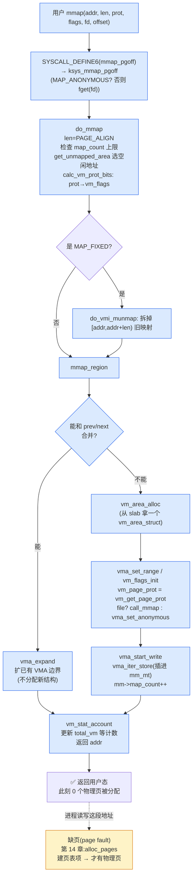

# 第十二章 · VMA 与 mmap:用户地址空间的账本

> 篇:第 4 篇 · 用户地址空间:进程内存
> 主线呼应:前三篇讲的是**内核自己怎么用内存**——buddy 分物理页、slab 切小对象、vmalloc 缝虚拟连续。但绝大多数读者真正关心的是另一件事:我在程序里写一行 `malloc(1<<30)`(1GB),系统明明只有 16GB 物理内存,为什么这一行**立刻返回、内存也没被吃掉**?这背后就是本章的主题——用户进程的虚拟地址空间是用**账本(VMA)**组织的,`mmap`/`brk` **此刻只记账、不动物理页**。这一章是"分配路径的虚拟层",把"内核分配"和"用户分配"真正接起来。

## 核心问题

**用户进程的虚拟地址空间(动辄 48 位、256TB)怎么组织?为什么 `mmap` 建 1GB 区间,此刻一个物理页都不分配也能成功?**

读完本章你会明白:

1. 进程地址空间的"骨架":`struct mm_struct` 是总账,里面一棵 **maple tree(`mm_mt`)** 索引所有 VMA,一段段 VMA 是"虚拟区间的登记条目"。
2. VMA 是什么:`[vm_start, vm_end)` + 权限(`vm_flags`)+ 后端(匿名 / 文件)+ `vm_ops`——一张"我承诺这段虚拟地址将来这么用"的登记卡。
3. `mmap` 系统调用怎么建一个 VMA(`do_mmap`→`mmap_region`),以及为什么它**不碰物理页**(惰性分配)。
4. **6.x 关键演进:maple tree 替代红黑树**索引 VMA,为什么换、换了什么并发收益。
5. VMA 合并(`vma_merge`):相邻且属性一致的 VMA 合成一个,`brk` 扩展、`mmap` 挨着旧区都靠它。

> **逃生阀**:如果你对"虚拟地址 vs 物理地址"还模糊,先回 [第一章(P0-01)](P0-01-第一性原理-为什么内核要管内存.md)的 1.3 节补一句"MMU + 页表把虚拟翻译成物理"再回来。本章只讲"虚拟区间怎么登记",不碰"虚拟怎么落到物理"——那是下一章(页表)和第 14 章(缺页)的事。

---

## 12.1 一句话点破

> **`mmap` 建的不是物理内存,是账本——它只在 maple tree 里登记一张"这段虚拟地址我承诺这么用"的 VMA 卡片,物理页一个都不给。等进程真去读写,触发缺页,内核才给物理页。虚拟空间因此近乎免费。**

这是结论,不是理由。本章倒过来拆:先看进程地址空间长什么样、VMA 这张卡记了什么,再看 `mmap` 怎么建卡、为什么敢不给物理页,最后拆 maple tree 为什么在 6.x 顶替了红黑树。

---

## 12.2 进程地址空间的骨架:`mm_struct` + 一串 VMA

### 先看地址空间长什么样

每个进程有自己的虚拟地址空间(64 位 x86 默认 48 位有效,256TB)。内核给每个进程一个 [`struct mm_struct`](../linux/include/linux/mm_types.h#L762)——它是这个进程地址空间的**总账**。在这本总账里,地址空间被切成一段段**不重叠**的 VMA(虚拟内存区,`struct vm_area_struct`):

```
 进程虚拟地址空间(简化,从低到高):

 0x400000   ┌─────────────────────┐ ← 代码段 (.text)         VMA#0  r-x  (file: /bin/a.out)
            │  代码 / 只读数据      │
            ├─────────────────────┤ ← 数据段 (.data/.bss)    VMA#1  rw-  (file: /bin/a.out)
            │  全局变量            │
            ├─────────────────────┤
            │  ↑ heap (brk 扩展)   │ ← VMA#2  rw-  (匿名)    mm->brk 在此范围内向上推
            │                     │
            │       ... 空洞 ...    │   ← 未登记,访问就 SIGSEGV
            │                     │
            │  ↓ mmap 区(自顶向下)│ ← VMA#3  rw-  (匿名,大 malloc 走这)
            │  共享库 / 大映射     │   VMA#4  r-x  (file: libc.so)
            │                     │   ...
            ├─────────────────────┤ ← 栈段                    VMA#N  rw-  (匿名,向下生长)
 0x7fff...  └─────────────────────┘
                  ↑
            task_size 之上的高半区属于内核空间(所有进程共享)
```

每一段就是一个 VMA。**进程能合法访问的虚拟地址,必须落在某个 VMA 的 `[vm_start, vm_end)` 区间内,且访问方式(读/写/执行)得符合该 VMA 的权限**——否则 MMU 翻译失败,触发缺页异常,内核一看"这地址没登记 / 权限不对",送一个 `SIGSEGV`。VMA 就是"合法地址"的边界。

### `struct mm_struct`:总账记了什么

[`struct mm_struct`](../linux/include/linux/mm_types.h#L762)([mm_types.h:762](../linux/include/linux/mm_types.h#L762))核心字段(挑本章要用的):

| 字段 | 含义 | 相关章节 |
|------|------|---------|
| `struct maple_tree mm_mt` | **VMA 索引**(6.x 用 maple tree,见 12.5) | 本章核心 |
| `pgd_t *pgd` | 进程顶级页表根(PGD) | 第 13 章 |
| `unsigned long mmap_base` / `mmap_legacy_base` | mmap 区起点(自顶向下 vs 自底向上) | 本章 12.3 |
| `unsigned long task_size` | 进程地址空间上界(用户态上限) | 本章 |
| `int map_count` | VMA 数量(有 `sysctl_max_map_count` 上限,默认 65530) | 本章 |
| `struct rw_semaphore mmap_lock` | 保护整个地址空间(读写信号量) | 本章 + 第 14 章 |
| `unsigned long total_vm` / `data_vm` / `exec_vm` / `stack_vm` | 已映射的总页数 / 数据 / 代码 / 栈(单位页) | 本章 |
| `unsigned long locked_vm` | `mlock` 锁定的页数(不可回收) | 第 5 篇 |
| `unsigned long start_code/end_code/start_data/end_data` | 代码段、数据段边界 | 本章 |
| `unsigned long start_brk, brk` | heap 起点、当前堆顶(brk) | 本章 12.4 |
| `unsigned long start_stack` | 栈起点 | 本章 |
| `atomic_t mm_users` / `mm_count` | 引用计数(线程共享 mm 用 `mm_users`,整个 mm_struct 生命周期用 `mm_count`) | 第 14 章 fork |

注意 [`mm_mt`](../linux/include/linux/mm_types.h#L779) 的位置——它在 `mm_struct` 里是**第一个字段附近**,和 `pgd`、`mmap_base` 紧挨着。这是有意为之:地址空间操作(查 VMA、改 VMA)是热路径,相关字段挤进同一个 cache line。源码注释甚至专门提醒 `mmap_lock` 的偏移被精心调过,让它的 `count` 和 `owner` 落在两个 cache line 以减少 bouncing([mm_types.h:840-851](../linux/include/linux/mm_types.h#L840))——这就是内核里常见的"为 cache 行布局而调整字段顺序"的工程。

### VMA:一张"虚拟区间的登记卡"

[`struct vm_area_struct`](../linux/include/linux/mm_types.h#L647)([mm_types.h:647](../linux/include/linux/mm_types.h#L647))是 VMA 本体。挑本章关心的字段:

```c
struct vm_area_struct {
    unsigned long vm_start;              /* VMA 覆盖 [vm_start, vm_end) */
    unsigned long vm_end;
    struct mm_struct *vm_mm;             /* 属于哪个 mm */
    pgprot_t vm_page_prot;               /* 硬件页表项里的保护位 */
    const vm_flags_t vm_flags;           /* VM_READ/VM_WRITE/VM_EXEC/VM_SHARED/... */
    ...
    struct anon_vma *anon_vma;           /* 反向映射:匿名页用(第 15 章) */
    const struct vm_operations_struct *vm_ops;  /* 缺页/打开/关闭的回调 */
    unsigned long vm_pgoff;              /* 文件映射:在文件内的页偏移 */
    struct file *vm_file;                /* 文件映射:映射的 file(匿名则为 NULL) */
    ...
};
```

一张 VMA 卡记了四件事:

1. **范围**:`[vm_start, vm_end)`,页对齐(4KB 整数倍)。
2. **权限**:`vm_flags`(软件层的 `VM_READ`/`VM_WRITE`/`VM_EXEC`/`VM_SHARED` 等)+ `vm_page_prot`(翻译成硬件 MMU 能识别的保护位)。访问越权 → 缺页 → `SIGSEGV`。
3. **后端**:这段虚拟地址"靠什么兑现"。
   - `vm_file != NULL`:文件映射,虚拟地址对应文件 `vm_file` 偏移 `vm_pgoff` 处的内容(读文件页、共享内存映射都走这条)。
   - `vm_file == NULL`:匿名映射,后端是"什么也没有",访问时内核给一个清零的物理页(见第 14 章匿名缺页)。
4. **操作**:`vm_ops`(`struct vm_operations_struct`),一组回调:`fault`(缺页怎么处理)、`open`/`close`(VMA 加入/移除时的钩子)。匿名映射、不同文件系统各自的 `vm_ops` 不同——这就是"后端"的具体实现。

> **钉死这件事**:VMA 是"承诺",不是"兑现"。它登记"这段虚拟地址**将来**这么用",但不保证此刻有物理页。物理页的兑现是缺页(第 14 章)的事。把承诺和兑现分开,正是虚拟空间近乎免费的根源。

### `mm_struct` 怎么索引这么多 VMA:6.x 的关键

一个进程可能有几百到几万个 VMA(每个共享库一段、每次 `mmap` 一段、栈一段……)。内核要频繁做两件事:**① 查地址在哪个 VMA 里**(`find_vma`,缺页、`munmap`、信号处理都要查);**② 插入/删除/修改 VMA**(`mmap`/`munmap`/`brk`)。

这就需要一个**按地址区间组织、能快速查找 + 高效增删**的数据结构。Linux 5.x 以前用的是**红黑树 + 链表**;**6.x 起改成了 maple tree**。这个改动是 6.x 与老资料(包括很多教科书、博客)最大的差异点,12.5 节专门拆。现在你只需要知道:在 `struct mm_struct` 里,索引 VMA 的就是 `mm_mt`(maple tree),`find_vma` 一路走 `mt_find(&mm->mm_mt, ...)`。

---

## 12.3 `mmap` 系统调用:建一个虚拟区间(此刻不给物理页)

### 用户眼中的 `mmap`

用户程序调 `mmap` 把一段虚拟地址"准备好":

```c
void *p = mmap(NULL, 1<<30, PROT_READ|PROT_WRITE,
               MAP_PRIVATE|MAP_ANONYMOUS, -1, 0);
/* 返回一个虚拟地址,此刻 1GB 物理内存一个字节都没动 */
*p = 42;   /* 写第一个字节 → 触发缺页 → 内核才给一个物理页 */
```

这是用户态分配大块内存的标准姿势(`malloc` 申请大块时,glibc 也是底层调 `mmap`)。注意:`mmap` **立刻返回成功**,1GB 区间建好了——但物理内存一点没少。这就是"惰性分配"。

### 系统调用入口到 `do_mmap`

`mmap` 系统调用在 x86-64 上的入口是 [`SYSCALL_DEFINE6(mmap_pgoff, ...)`](../linux/mm/mmap.c#L1438)([mmap.c:1438](../linux/mm/mmap.c#L1438)),它只是薄薄包一层,转 [`ksys_mmap_pgoff`](../linux/mm/mmap.c#L1393)([mmap.c:1393](../linux/mm/mmap.c#L1393))。后者干两件事:① 如果是文件映射(`!(flags & MAP_ANONYMOUS)`),`fget(fd)` 把 file 拿出来;② 调 `vm_mmap_pgoff`→`do_mmap`。

真正干活的是 [`do_mmap`](../linux/mm/mmap.c#L1214)([mmap.c:1214](../linux/mm/mmap.c#L1214))。它负责"把用户意图翻译成 VMA 属性 + 选地址"。简化后的主干:

```c
unsigned long do_mmap(struct file *file, unsigned long addr,
        unsigned long len, unsigned long prot,
        unsigned long flags, vm_flags_t vm_flags,
        unsigned long pgoff, unsigned long *populate, ...)
{
    struct mm_struct *mm = current->mm;

    if (!len) return -EINVAL;
    len = PAGE_ALIGN(len);                 /* 长度页对齐 */
    if (mm->map_count > sysctl_max_map_count)
        return -ENOMEM;                    /* VMA 数量超限 */

    /* 选一段空闲虚拟地址区间 */
    addr = get_unmapped_area(file, addr, len, pgoff, flags);
    if (IS_ERR_VALUE(addr)) return addr;

    /* prot(flags) → vm_flags(VM_READ/VM_WRITE/VM_EXEC/VM_SHARED + MAY* 位) */
    vm_flags |= calc_vm_prot_bits(prot, pkey) | calc_vm_flag_bits(flags)
              | mm->def_flags | VM_MAYREAD | VM_MAYWRITE | VM_MAYEXEC;

    /* 各种权限/资源检查(略) */
    ...
    /* 真正建 VMA */
    return mmap_region(file, addr, len, vm_flags, pgoff, uf);
}
```

`do_mmap` 的职责:**把用户层的参数(`prot`/`flags`/`fd`/`pgoff`)翻译成内核内的 `vm_flags` + 选一段空闲地址**,然后把"建 VMA"这步丢给 [`mmap_region`](../linux/mm/mmap.c#L2715)([mmap.c:2715](../linux/mm/mmap.c#L2715))。

> **不这样会怎样**:如果没有 `get_unmapped_area` 这步"选地址",用户就得自己指定地址(`MAP_FIXED`)——但用户根本不知道哪段虚拟地址是空的(被别的 VMA 占了、或落在内核空间)。内核必须有个仲裁者,根据 `mmap_base`、地址空间布局(top-down 还是 bottom-up)、是否要对齐等各种约束,挑一段"没被任何 VMA 占用"的区间。这一步**只看 maple tree 里的现有 VMA 布局**,和物理内存完全无关。

### `mmap_region`:建 VMA 的核心

[`mmap_region`](../linux/mm/mmap.c#L2715)([mmap.c:2715](../linux/mm/mmap.c#L2715))是建 VMA 的主体。它分三步:**先试合并/扩展、不行再分配新 VMA、最后插进 maple tree**。简化主干(去掉错误处理):

```c
unsigned long mmap_region(struct file *file, unsigned long addr,
        unsigned long len, vm_flags_t vm_flags, unsigned long pgoff, ...)
{
    struct mm_struct *mm = current->mm;
    struct vm_area_struct *vma, *next, *prev;
    VMA_ITERATOR(vmi, mm, addr);          /* 绑定到 mm_mt,游标在 addr */

    /* ① 先把 [addr, addr+len) 里已有的映射拆掉(MAP_FIXED 场景) */
    do_vmi_munmap(&vmi, mm, addr, len, uf, false);

    /* ② 看看能不能和前/后已有的 VMA 合并 */
    next = vma_next(&vmi);
    prev = vma_prev(&vmi);
    if (next && next->vm_start == addr+len
        && can_vma_merge_before(next, vm_flags, ...)) {
        /* 新区间刚好接在 next 前面,属性一致 → 可以向后扩 next */
        vma = next;
    }
    if (prev && prev->vm_end == addr
        && can_vma_merge_after(prev, vm_flags, ...)) {
        /* 新区间刚好接在 prev 后面,属性一致 → 可以向前扩 prev */
        vma = prev;
    }

    /* ③ 能合并就用 vma_expand 把已有 VMA 的 vm_end/vm_start 扩一下,
     *    不用新分配 VMA 结构 */
    if (vma && !vma_expand(&vmi, vma, merge_start, merge_end, vm_pgoff, next))
        goto expanded;     /* 合并成功,直接跳到收尾 */

    /* ④ 不能合并 → 新分配一个 vm_area_struct,填好字段,插进 maple tree */
    vma = vm_area_alloc(mm);                          /* 从 slab 拿一个 */
    vma_set_range(vma, addr, addr+len, pgoff);
    vm_flags_init(vma, vm_flags);
    vma->vm_page_prot = vm_get_page_prot(vm_flags);
    if (file) {
        vma->vm_file = get_file(file);
        call_mmap(file, vma);                         /* 文件系统自己的 mmap */
    } else if (vm_flags & VM_SHARED) {
        shmem_zero_setup(vma);                        /* 共享匿名 → 走 shmem/tmpfs */
    } else {
        vma_set_anonymous(vma);                       /* 私有匿名:啥也不干 */
    }

    vma_start_write(vma);                             /* per-VMA 写锁(6.x,见 12.5) */
    vma_iter_store(&vmi, vma);                        /* 把新 VMA 存进 maple tree */
    mm->map_count++;
    vma_link_file(vma);                               /* 文件映射:挂进 address_space 区间树 */
expanded:
    vm_stat_account(mm, vm_flags, len >> PAGE_SHIFT); /* 更新 total_vm 等计数 */
    return addr;
}
```

读这段代码,三件事钉死:

**第一,全程不碰物理页。** 你看不到任何 `alloc_pages`、`buddy`、页表写入。`mmap_region` 只是在 maple tree 里**记账**:要么扩一个已有 VMA(`vma_expand`),要么新分配一个 `vm_area_struct` 结构体(`vm_area_alloc`,从 slab 拿,几十字节)然后 `vma_iter_store` 插进 maple tree。**真正的物理页要等进程访问触发缺页(第 14 章)才给。**

**第二,合并优先。** 建新区间前先看能不能和左边(`prev`)或右边(`next`)的 VMA 合并——能合就扩一下现有 VMA 的边界,不分配新结构。这把 VMA 数量控制在最小(`brk` 连续推、连续 `mmap` 相邻区间都不会让 VMA 数暴涨),12.6 节专门拆。

**第三,匿名私有映射最便宜。** 如果是匿名私有映射(最常见的 `malloc` 大块),`vma_set_anonymous(vma)` 完事——不挂文件、不建 shmem 对象,连后端都没有。物理页要等缺页时现给一个清零页。

### `mmap` 全流程图



注意图里最后那步虚线:从 `mmap` 返回到"真正有物理页"中间隔着一次缺页。这就是本章和第 14 章的衔接点。

---

## 12.4 `brk`:小 `malloc` 的另一条路

### heap 段和 `brk`

除了 `mmap`,用户态 `malloc` 还有另一条向内核要内存的路:`brk`。它操作的是 heap 段——`mm_struct` 里的 [`start_brk, brk`](../linux/include/linux/mm_types.h#L899)。

- `start_brk`:heap 起点(数据段末尾之上)。
- `brk`:当前堆顶(逻辑边界,可上下移动)。

`brk` 段在 maple tree 里通常就是一个 VMA(`[start_brk, ...)`),边界随 `brk` 系统调用推上去/缩回来。glibc 的 `malloc` 对**小块**请求优先用 `brk`(连续、缓存友好),对**大块**(默认 128KB 以上,可配)才走 `mmap`(避免 heap 碎片、便于归还)。

### `brk` 系统调用:也是只调账本

[`SYSCALL_DEFINE1(brk, unsigned long, brk)`](../linux/mm/mmap.c#L178)([mmap.c:178](../linux/mm/mmap.c#L178))做三件事:

1. **收缩**:`brk <= mm->brk`,把 heap VMA 的尾部 `munmap` 掉(`do_vma_munmap`)。
2. **扩张**:`brk > mm->brk`,调 [`do_brk_flags`](../linux/mm/mmap.c#L3113)([mmap.c:3113](../linux/mm/mmap.c#L3113))扩展 heap VMA。
3. 同样**不分配物理页**——`do_brk_flags` 只是把 heap VMA 的 `vm_end` 往上推(或新建匿名 VMA),物理页还是等缺页给。

`do_brk_flags` 的合并逻辑(简化):

```c
static int do_brk_flags(struct vma_iterator *vmi, struct vm_area_struct *vma,
        unsigned long addr, unsigned long len, unsigned long flags)
{
    /* 能扩就扩:如果 heap VMA 的 vm_end 恰好 == addr 且属性一致,
     * 直接把 vm_end 往上推 len,不分配新 VMA */
    if (vma && vma->vm_end == addr
        && can_vma_merge_after(vma, flags, NULL, NULL, ...)) {
        vma_iter_config(vmi, vma->vm_start, addr + len);
        vma_start_write(vma);
        vma->vm_end = addr + len;
        vma_iter_store(vmi, vma);
        goto out;
    }
    /* 否则新建一个匿名 VMA */
    vma = vm_area_alloc(mm);
    vma_set_anonymous(vma);
    vma_set_range(vma, addr, addr+len, addr >> PAGE_SHIFT);
    vma_iter_store_gfp(vmi, vma, GFP_KERNEL);
    mm->map_count++;
out:
    mm->total_vm += len >> PAGE_SHIFT;
    return 0;
}
```

和 `mmap_region` 一个模子:**优先合并(扩边界)→ 不行新建 VMA → 插 maple tree → 完事,不碰物理页**。这就是为什么连续多次小 `malloc` 不会让 VMA 数暴涨——它们都合并到同一个 heap VMA 里,只是 `vm_end` 不断往上推。

> **钉死这件事**:`mmap` 和 `brk` 在"建虚拟区间"这件事上**本质相同**——都是改 maple tree 里的账本,不动物理页。区别只是:`mmap` 区间在 mmap 区(可以指定位置、可以映射文件、可以共享),`brk` 区间固定在数据段上方、只能是匿名私有。两者都靠**合并 + maple tree 插入**实现,都是惰性分配。

---

## 12.5 maple tree 替代红黑树:6.x 的关键演进 ⚠️

这一节是本章和**所有 5.x 及更早资料**的最大分歧点。如果你看的老书/老博客讲 VMA 索引是"红黑树 + `mm->mm_rb`",那是 5.x 的写法;**6.x 已经换成 maple tree**。务必以源码为准。

### 先把事实钉死

在 6.9 的 [`struct mm_struct`](../linux/include/linux/mm_types.h#L779) 里,索引 VMA 的字段是 [`struct maple_tree mm_mt`](../linux/include/linux/mm_types.h#L779)。所有 VMA 查找都走 maple tree API:

- [`find_vma`](../linux/mm/mmap.c#L1888)([mmap.c:1888](../linux/mm/mmap.c#L1888)):查"地址 `addr` 落在哪个 VMA,或之后的第一个 VMA"。一行核心:`return mt_find(&mm->mm_mt, &index, ULONG_MAX);`。
- [`find_vma_intersection`](../linux/mm/mmap.c#L1869)([mmap.c:1869](../linux/mm/mmap.c#L1869)):查"和 `[start, end)` 相交的第一个 VMA",也是 `mt_find(&mm->mm_mt, &index, end_addr - 1)`。
- 遍历用 [`VMA_ITERATOR(vmi, mm, addr)`](../linux/include/linux/mm_types.h#L1101)([mm_types.h:1101](../linux/include/linux/mm_types.h#L1101))宏,它把一个 `struct vma_iterator`(本质是 `ma_state` 的薄包装,见 [`mm_types.h:1097`](../linux/include/linux/mm_types.h#L1097))绑定到 `mm->mm_mt`、游标设在 `addr`,然后 `vma_next`/`vma_prev`/`vma_find` 这些内联函数封装 `mas_find`/`mas_prev`。

红黑树字段(`mm_rb`、VMA 的 `vm_rb`)在 6.9 源码里**已经被弱化**——`struct vm_area_struct` 里还保留 `shared.rb`(L700-703),但那**不是 VMA 在进程内的索引**,而是文件映射挂进 `address_space->i_mmap` 区间树(给 rmap 用,第 15 章)的节点。**进程内按地址查 VMA,完全是 maple tree 的事**。

### maple tree 是什么

maple tree(mat-ree,枫树)是一种 **RCU-safe 的、为存储范围(range)优化的 B-tree 变种**。头文件第一行注释就定义了它:[maple_tree.h:5 "An RCU-safe adaptive tree for storing ranges"](../linux/include/linux/maple_tree.h#L5)([maple_tree.h:5](../linux/include/linux/maple_tree.h#L5))。它由 Oracle 的 Liam Howlett 和 Matthew Wilcox 在 2021 年前后为 Linux mm 专门设计,5.18 起取代红黑树索引 VMA。

它的几个关键特性(都在头文件和源码里):

- **节点固定 256 字节、256 字节对齐**:`MAPLE_NODE_MASK = 255`([maple_tree.h:41](../linux/include/linux/maple_tree.h#L41)),注释明确"Nodes are 256 bytes in size and are also aligned to 256 bytes, giving us 8 low bits for our own purposes"([maple_tree.h:271-272](../linux/include/linux/maple_tree.h#L271))。这 8 个低位被用来存节点类型、标志位,**指针本身不存额外信息**——一个干净的"指针就是指针"的布局。
- **每个节点多个 slot**:64 位下普通节点 31 个 slot(`MAPLE_NODE_SLOTS = 31`,[maple_tree.h:29](../linux/include/linux/maple_tree.h#L29))。这比红黑树(每节点最多 2 子)扁平得多——树高更低,查找的指针解引用次数更少。
- **按区间天然组织**:maple tree 的 key 是范围 `[index, last]`,每个 slot 对应一段子区间。这正是 VMA 的组织方式——每个 VMA 就是一段 `[vm_start, vm_end)`。在 maple tree 里,"查地址 X 在哪个 VMA"和"查 `[a, b)` 区间相交哪些 VMA"都是**原生操作**(`mt_find`、`mas_walk`),不需要像红黑树那样靠额外维护子树最大值(`vm_rb.rb_subtree_last`)来近似区间查询。
- **RCU-safe**:`ma_root` 是 `__rcu` 指针([maple_tree.h:225](../linux/include/linux/maple_tree.h#L225)),节点删除后通过"把 `->parent` 指向自己 + RCU 宽限期"让读者无锁安全地判断"我读到的这个节点是不是还活着"([maple_tree.h:21-23](../linux/include/linux/maple_tree.h#L21))。这是 maple tree 能做无锁查找的根基。

### 为什么换:并发 + 区间查询

红黑树索引 VMA 在 5.x 用了二十年,为什么 6.x 非要换?两个本质痛点:

**痛点一:红黑树并发差,VMA 查找被 `mmap_lock` 卡死。**

红黑树是二叉平衡树,任何插入/删除都可能触发**整棵树旋转**(单点写会改变多个节点的父子关系)。这意味着读者(查 `find_vma`)必须拿**同一把 `mmap_lock` 的读锁**,写者(建/删 VMA)拿**写锁**,二者互斥。在多线程进程里,缺页(要查 VMA)、`mmap`、页迁移、`/proc/pid/maps` 读取……全都抢这一把锁,`mmap_lock` 成了严重的扩展性瓶颈。

maple tree 的改进:它是 **RCU-friendly 的 B-tree**,读者可以在**持有 RCU 读锁**的情况下无锁遍历(不拿 `mmap_lock`);写者写时,只在改动的局部路径上加锁,且通过"建新节点 + RCU 释放旧节点"让旧读者继续看到一致视图。这把 VMA 查找的并发度大幅提高。

**痛点二:红黑树不擅长区间查询。**

VMA 是区间 `[vm_start, vm_end)`,而红黑树是按**点**(`vm_start`)排序的。要查"`[a, b)` 区间相交哪些 VMA",红黑树得靠每个节点额外维护 `rb_subtree_last`(子树中最大的 `vm_end`)来剪枝——这是 `mmap_region`、`munmap` 都要做的操作,实现复杂、常量因子大。maple tree 原生就是 range tree,区间查询是它的看家本领,代码更简单、更快。

> **不这样会怎样**:如果 6.x 还用红黑树,大型多线程程序(数据库、JVM、浏览器进程数万 VMA、频繁 mmap/munmap)的 `mmap_lock` 争抢会随核数线性恶化——这就是 2010 年代后期 Linux mm 社区著名的"mmap_lock 瓶颈"。maple tree 是这个瓶颈的**地基级解药**(另一味药是 per-VMA lock,见下)。今天你能在一个 200 万 VMA 的进程里还算流畅地跑,很大程度是 maple tree 的功劳。

### per-VMA lock:maple tree 带来的"趁热打铁"

maple tree 让无锁读成为可能,这又催生了 6.x 的另一个优化:**per-VMA lock**(`CONFIG_PER_VMA_LOCK`,默认开)。在 [`struct vm_area_struct`](../linux/include/linux/mm_types.h#L673) 里多了 `vm_lock_seq` 和 `vm_lock`(L688-689),在 [`struct mm_struct`](../linux/include/linux/mm_types.h#L859) 里多了 `mm_lock_seq`(L874)。

机制(看 VMA 注释 [mm_types.h:674-687](../linux/include/linux/mm_types.h#L674)):

- **写者**(改 VMA,持有 `mmap_lock` 写锁 + VMA 的 `vm_lock` 写锁)修改后,`mm_lock_seq++`,让所有 VMA 的 `vm_lock_seq` 一次性失效。
- **读者**(缺页路径)可以**不拿 `mmap_lock`**,而是拿目标 VMA 自己的 `vm_lock` 读锁,然后检查 `vm_lock_seq == mm_lock_seq`——相等说明这个 VMA 在我读期间没被改过,读到的 `vm_flags`/`vm_start` 等是可信的,直接用于缺页处理。不等就退回到慢路径(拿 `mmap_lock` 重来)。

这让缺页处理这种**只读单个 VMA** 的热路径,彻底绕开 `mmap_lock`。对多线程 + 频繁缺页的程序,这是巨大的扩展性收益。注释明说这个序列号"explicitly allowed to overflow"(L683-685),偶尔溢出只会让读者误走慢路径,不影响正确性——这是个典型的"乐观读"模式。

> **钉死这件事**:maple tree + per-VMA lock 是 6.x 的地基级改进。读者读 VMA 可以无锁(RCU)或只锁单个 VMA;只有改 VMA 布局(插/删/合并)才需要 `mmap_lock` 写锁。这就是为什么 6.x 多线程程序在地址空间操作上比 5.x 扩展性好得多。**老资料讲红黑树 + 全局 `mmap_lock` 的,都过时了。**

---

## 12.6 技巧精解:VMA 合并(`vma_merge`)

这一节拆本章最硬核的一个技巧:**VMA 合并**。它是 `mmap`/`brk` 让 VMA 数量不失控的关键,也是 `vm_area_struct` 这个"账本卡"能保持精简的根本。

### 不合并会怎样:反面对比

朴素地想,`mmap` 建新区间就建一个新 VMA,`brk` 推一次就建一个新 VMA。那会怎样?

考虑一个程序:glibc 启动时 mmap 一堆匿名页做 thread arena、动态加载 50 个共享库、每个 `.so` 至少 4 段 VMA(text/data/bss/got),用户代码里再 `malloc` 一万次小块(都走 `brk`)……如果不合并,**每次 `brk` +1 个 VMA,每次相邻 `mmap` +1 个 VMA**,进程轻松几万 VMA。每个 VMA 至少 200 字节(`struct vm_area_struct` 在 64 位下加上 per-VMA lock 字段更大),几万 VMA 就是十几 MB 纯元数据——更糟的是 `find_vma`、`munmap` 的查找/分裂成本随 VMA 数上升,`map_count` 还会撞 `sysctl_max_map_count`(默认 65530)直接 `ENOMEM` 报错。这就是为什么历史上某些大量使用 `mmap` 的程序(尤其是内存数据库、Java `Unsafe.allocateInstance`)需要 `sysctl vm.max_map_count` 调大——但这只是症状治疗,根源是 VMA 数量没控制好。

> **反面对比**:如果内核不合并 VMA,一个连续 `brk` 一万次的程序就会有一万个紧挨着的、属性完全相同的匿名 VMA——账本爆炸。合并把它们粘成**一个** VMA,`vm_end` 一路推上去,账本回到一条。

### 合并的条件:`can_vma_merge_after` / `can_vma_merge_before`

什么时候两个相邻 VMA 能合并成一个?必须**所有"影响后端兑现"的属性都一致**:

- **`vm_flags` 一致**:权限/共享性/特殊标志都得一样。`VM_SPECIAL`(`VM_HUGETLB`/`VM_PFNMAP`/`VM_MIXEDMAP`/`VM_HUGEPAGE` 等)的 VMA 直接不参与合并(见 [`vma_merge` 开头的 VM_SPECIAL 检查](../linux/mm/mmap.c#L890),[mmap.c:890](../linux/mm/mmap.c#L890))。
- **`vm_file` 一致 + `vm_pgoff` 衔接正确**:文件映射必须映射同一个 file 对象,而且新区间的 `pgoff` 要和 prev 的 `pgoff + vma_pages(prev)` 精确对上(否则文件偏移错位)。
- **`anon_vma` 可合并**:匿名映射的 `anon_vma`(反向映射,第 15 章)要能接上,涉及 `is_mergeable_anon_vma` 判断。
- **NUMA policy 一致**(`mpol_equal`)、userfaultfd ctx 一致、anon_vma_name 一致。

`can_vma_merge_after(prev, ...)` 判断"新区间能否接在 prev 后面";`can_vma_merge_before(next, ...)` 判断"新区间能否接在 next 前面"。这是合并的两块基本积木。

### `vma_merge`:8 种拓扑 case

[`vma_merge`](../linux/mm/mmap.c#L863)([mmap.c:863](../linux/mm/mmap.c#L863))是合并的总调度。它的注释([mmap.c:855-861](../linux/mm/mmap.c#L855))用 `PPPP`/`CCCC`/`NNNN` 表示 prev/curr/next 三段区间,穷举 8 种拓扑 case(新区间是否与 prev 相邻、是否覆盖 curr、是否与 next 相邻)。简化主干:

```c
static struct vm_area_struct
*vma_merge(struct vma_iterator *vmi, struct vm_area_struct *prev,
       struct vm_area_struct *src, unsigned long addr, unsigned long end,
       unsigned long vm_flags, pgoff_t pgoff, ...)
{
    if (vm_flags & VM_SPECIAL) return NULL;   /* 特殊映射不合并 */

    /* 找新区间覆盖到的现有 VMA(curr),以及紧邻的 next */
    curr = find_vma_intersection(mm, prev ? prev->vm_end : 0, end);
    if (!curr || end == curr->vm_end)
        next = vma_lookup(mm, end);
    else
        next = NULL;

    /* 试着和 prev 合并(merge_prev)、和 next 合并(merge_next) */
    if (prev && addr == prev->vm_end
        && can_vma_merge_after(prev, vm_flags, anon_vma, file, pgoff, ...))
        merge_prev = true;
    if (next && can_vma_merge_before(next, vm_flags, anon_vma, file, pgoff+pglen, ...))
        merge_next = true;

    if (!merge_prev && !merge_next) return NULL;  /* 两边都不能合,放弃 */

    /* case 1~8:根据 prev/curr/next 的不同组合,决定:
     *   - 哪个 VMA 的边界要扩(adjust)
     *   - 哪个 VMA 要被吸收掉(remove / remove2)
     *   - anon_vma 怎么 dup
     * 最后统一走 vma_prepare + vma_complete 把改动落到 maple tree */
    ...
}
```

8 种 case 的本质是**"新区间和左邻右舍的关系"的排列组合**:

| case | prev 相邻 | 覆盖 curr | next 相邻 | 动作 |
|------|----------|-----------|----------|------|
| 1 | 是 | 否 | 是 | prev 吸收新区间 + 吞掉 next(三合一) |
| 2 | 是 | 否 | 否 | prev 向后扩到新区间末尾 |
| 3 | 否 | 否 | 是 | next 向前扩到新区间起点 |
| 4 | 否 | 否 | 否 | 不合并(理论上不会走到这,因为前面已 return) |
| 5 | 是 | 是 | 否 | prev 吞掉 curr |
| 6 | 是 | 是 | 是 | prev 吞掉 curr + next(全吞) |
| 7 | 是 | 是 | 否 | 同 5 的边界情况 |
| 8 | … | … | … | (其余细分) |

无论哪种 case,最终都是**修改一个 VMA 的 `vm_start`/`vm_end`/`vm_pgoff` + 移除被吸收的 VMA**,改动通过 `vma_iter_store`(maple tree 写)一次性落到账本。新区间本身**不需要新分配 `vm_area_struct`**——它被吸收进已有 VMA。这就是合并省账本开销的机制。

### 合并的产物:连续 `brk` / 相邻 `mmap` 都只扩一个 VMA

把 `do_brk_flags`(12.4 节)和 `mmap_region`(12.3 节)对照看,合并机制带来的效果一目了然:

- **连续 `brk`**:第一次 `brk` 建 heap VMA `[start_brk, A)`;第二次 `brk(A→B)`,因为 `addr == vma->vm_end` 且都是匿名私有,`can_vma_merge_after` 成立,`do_brk_flags` 走"扩边界"分支,把 `vm_end` 从 A 推到 B。**一万次 `brk` 也只是一个 VMA 的 `vm_end` 一路往上推,`map_count` 只 +1**。
- **相邻 `mmap`**:两次相邻的匿名 `mmap`(属性一致),`mmap_region` 也会让第二次走 `vma_expand`,扩第一个 VMA 的 `vm_end` 而不是新建。
- **文件映射的连续段**:loader 加载 `.so` 时,如果 text/data 段在文件里偏移连续、权限衔接合理,也可能合并;但权限不同的段(如 text 是 r-x、data 是 rw-)永远不合并。

> **钉死这件事**:VMA 合并是 mm 在"虚拟区间层"抗碎片的核心机制。它让连续、同质的虚拟区间**粘成一个 VMA**,把账本条目数从"潜在数万"压到"实际几百"。配合 maple tree 的高效增删,`mmap`/`brk` 哪怕被疯狂调用,进程地址空间也保持精简。这是为什么一个普通进程的 `/proc/pid/maps` 通常只有几十行,而不是上万行。

---

## 12.7 把本章放进全局:`malloc` → 物理页的完整旅程(虚拟层这一段)

把前三篇和本章接起来,看一次 `malloc(1<<30)`(1GB)走到"还没物理页"这一步的完整旅程:

```
 用户程序: malloc(1<<30)
    │
    │  glibc 的 malloc 看到 1GB > mmap 阈值(默认 128KB)
    ▼
 glibc: mmap(NULL, 1<<30, PROT_READ|PROT_WRITE, MAP_PRIVATE|MAP_ANONYMOUS, -1, 0)
    │
    │  系统调用陷入内核
    ▼
 SYSCALL_DEFINE6(mmap_pgoff)  →  ksys_mmap_pgoff  →  do_mmap
    │  (本章 12.3)
    │  - get_unmapped_area: 在 mmap 区选一段 1GB 的空闲虚拟地址(查 maple tree)
    │  - calc_vm_prot_bits: PROT_READ|PROT_WRITE → VM_READ|VM_WRITE|VM_MAY*
    ▼
 mmap_region
    │  - 试着和 prev/next 合并(1GB 这么大,通常不能合,走新建)
    │  - vm_area_alloc: 从 slab 拿一个 vm_area_struct(几十字节)
    │  - vma_set_anonymous(vma): 后端 = 匿名(啥也没有)
    │  - vma_iter_store: 插进 mm->mm_mt(maple tree)
    │  - mm->map_count++
    ▼
 返回虚拟地址 p(此刻 0 个物理页被分配,物理内存一个字节没少)
    │
    │  用户写 *p = 42
    ▼
 MMU 翻译 p → 查页表 → 没有 → 缺页异常
    │  (第 14 章)
    ▼
 handle_mm_fault → do_anonymous_page
    │  - alloc_pages: 从 buddy 拿一个物理页(第 1 篇!)
    │  - 建页表项:p → 物理页
    │  - 返回用户态,重试指令
    ▼
 *p = 42 成功(此刻只有 1 个物理页被用,不是 1GB)
```

注意这段旅程里**前三篇(buddy/slab)的角色**:本章只走到"建 VMA、返回虚拟地址",物理页一个没动;真正调 buddy 是下一站(第 14 章缺页)。所以本章在二分法里是**分配路径的虚拟层**——把"用户 `malloc`"和"内核 buddy 给物理页"用 VMA 这张账本卡接起来,中间隔了一次缺页。

> **回扣二分法**:本章服务**分配路径**——但和 buddy/slab 不同,它是**惰性、虚拟**的分配:只登记,不兑现。兑现要等缺页触发真分配(第 14 章)。这个"承诺 vs 兑现"的分离,是用户地址空间能远超物理内存的根本——没有它,1GB 的 `mmap` 立刻吃掉 1GB 物理内存,虚拟空间毫无意义。

---

## 章末小结

这一章是第 4 篇(用户地址空间)的开篇。我们没碰物理页、没碰页表,只讲了一件事:**用户进程的虚拟地址空间是用"账本"组织的,`mmap`/`brk` 只动账本、不动物理页**。账本的核心是两样:

1. **`mm_struct` + VMA**:总账 + 一张张虚拟区间登记卡(范围、权限、后端、`vm_ops`)。
2. **maple tree**(`mm_mt`):6.x 起 VMA 索引,RCU-safe 的 range B-tree,替代了 5.x 的红黑树;配合 per-VMA lock,让 VMA 查找和缺页路径绕开了 `mmap_lock`。

并拆了三个关键技巧:

- **VMA 抽象 + 惰性分配**:`mmap` 只建 VMA 不给物理页,虚拟空间近乎免费(反面对比"立刻分配 1TB 立刻耗光内存")。
- **maple tree 替代红黑树**:RCU-friendly 的 range B-tree,解决 5.x 的 `mmap_lock` 瓶颈(反面对比红黑树"每次插入可能整树旋转 + 区间查询要额外维护子树最大值")。
- **VMA 合并**:`vma_merge` 把相邻同质 VMA 粘成一个,`brk`/`mmap` 再多也不会让 VMA 数爆炸(反面对比"不合并 → `map_count` 撞顶 → `ENOMEM`")。

### 五个"为什么"清单

1. **为什么 `mmap` 1GB 能立刻返回、内存却没被吃?** 因为 `mmap` 只在 maple tree 里建一个 VMA(账本登记),一个物理页都不分配。物理页要等缺页才给——这是惰性分配。
2. **VMA 是什么?** 一张"虚拟区间登记卡":`[vm_start, vm_end)` + 权限(`vm_flags`/`vm_page_prot`)+ 后端(`vm_file`/匿名)+ 操作(`vm_ops`)。它是承诺,不是兑现。
3. **6.x 为什么用 maple tree 而不是红黑树索引 VMA?** 红黑树并发差(全局 `mmap_lock`)、不擅长区间查询(要额外维护 `rb_subtree_last`)。maple tree 是 RCU-safe 的 range B-tree,允许无锁读、原生区间查询,大幅缓解 mmap_lock 瓶颈。
4. **`brk` 和 `mmap` 在"建虚拟区间"上什么关系?** 本质相同——都改 maple tree 账本、不动物理页。区别:`brk` 只扩 heap 段(数据段上方,匿名私有),`mmap` 在 mmap 区、可指定位置、可映射文件、可共享。
5. **VMA 合并解决什么问题?** 防止连续同质的虚拟区间产生海量 VMA。`vma_merge` 把相邻且属性一致的 VMA 粘成一个,让 `map_count` 保持精简(反面对比:不合并会撞 `sysctl_max_map_count` 直接 `ENOMEM`)。

### 想继续深入往哪钻

- **源码**:
  - [`mm/mmap.c`](../linux/mm/mmap.c):本章的主角。重点读 `do_mmap`(L1214)、`mmap_region`(L2715)、`do_brk_flags`(L3113)、`find_vma`(L1888)、`vma_merge`(L863)。
  - [`include/linux/mm_types.h`](../linux/include/linux/mm_types.h):`struct mm_struct`(L762)、`struct vm_area_struct`(L647)、`struct vma_iterator`(L1097)。
  - [`include/linux/maple_tree.h`](../linux/include/linux/maple_tree.h):maple tree 的全部公开 API 和数据结构。maple tree 实现在 `mm/maple_tree.c`(本章没细读,想钻 maple tree 节点分裂/合并内部机制的去看这个)。
- **观测**:
  - `cat /proc/<pid>/maps`:看进程的所有 VMA(每行一个 VMA:地址范围、权限、偏移、设备号、inode、文件名)。匿名段显示 `[anon]` 或空,heap 是 `[heap]`,栈是 `[stack]`。
  - `cat /proc/<pid>/status` 的 `Vm*` 行:看 `VmPeak`/`VmSize`(虚拟)、`VmRSS`(物理驻留)、`VmData`(数据段)、`VmStk`(栈)。对比 `VmSize` 远大于 `VmRSS`,就是惰性分配的直接证据——一大堆 VMA 登记了,但物理页还没给。
  - `pmap -x <pid>`:更人性化的 VMA 视图,带 RSS 列。
  - `echo 1 > /proc/sys/vm/drop_caches` 后再观察:纯粹影响文件页缓存,不影响 VMA 数量——印证 VMA 和物理页是两层。
  - 写个小程序 `mmap` 一段大内存,用 `strace -e mmap,mmap2,brk` 看系统调用,再用 `/proc/<pid>/maps` 确认 VMA 真的建了。
- **延伸**:
  - 想看 maple tree vs 红黑树的性能对比,LPC 2021 Liam Howlett 的 talk "Maple Tree, a modern data structure for managing user address spaces"。
  - 想懂 per-VMA lock 怎么让缺页绕开 mmap_lock,看 `mm/memory.c` 里 `lock_vma_under_rcu`(`do_user_addr_fault` 路径)。
  - `sysctl vm.max_map_count`:调整 VMA 数量上限,内存数据库、SAP HANA、Java 大堆应用常调大。

### 引出下一章

VMA 是"虚拟区间的账本"——它只回答"这段虚拟地址**承诺**这么用"。但承诺怎么落到物理?靠**页表**:把虚拟地址翻译成物理地址的硬件查询表。下一章,第 13 章,我们钻进 x86 的**多级页表**(pgd/p4d/pud/pmd/pte),看为什么是"多级"(稀疏地址空间省内存),以及 `mmu_gather` 怎么批量刷 TLB 防抖动。第 14 章再讲"缺页"——把本章的 VMA 兑现成物理页。

> 迷路时回到二分法:本章是**分配路径的虚拟层**(惰性、只记账)。第 13 章(页表)是**支撑地基**。第 14 章(缺页)才是**分配路径的物理层**(真去 buddy 拿页)。三章合起来,才是"用户 `malloc` → 物理页"的完整旅程。
