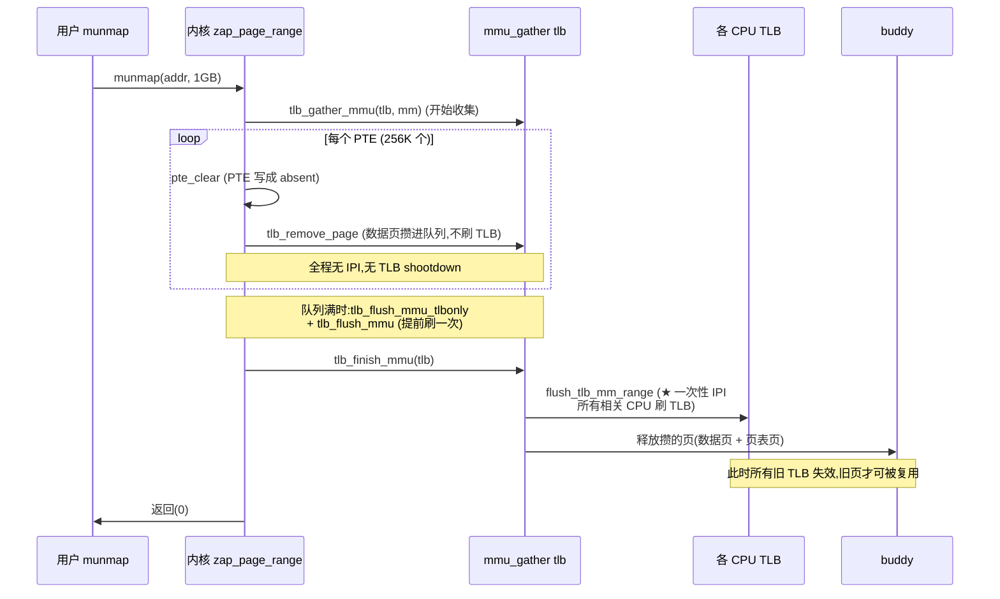

# 第十三章 · 多级页表与 mmu_gather

> 篇:第 4 篇 · 用户地址空间:进程内存
> 主线呼应:上一章我们立起了用户地址空间的"账本(VMA)"——`mmap`/`brk` 只在 maple tree 里登记"这段虚拟地址我承诺这么用",一个物理页都不给。但承诺怎么落到物理?硬件 MMU 怎么把一个虚拟地址翻译成物理地址?答案就是本章的主题——**页表(page table)**。这一章是**支撑地基**:它本身既不是"分配"(不给物理页),也不是"回收"(不收物理页),但分配路径(缺页建 PTE)和回收路径(解除 PTE)都要在它上面操作。读完这一章,你就拿到了第 14 章(缺页)和第 5 篇(回收)共同依赖的硬件地基。

## 核心问题

**x86-64 的页表为什么是四级(PGD/P4D/PUD/PMD/PTE)?稀疏的虚拟地址空间,页表元数据怎么"按需付出"?大量改/删页表项时(munmap/exit/迁移),为什么必须攒一批再刷 TLB?** 把这两个问题拆透,就是本章。

读完本章你会明白:

1. x86-64 多级页表的结构:PGD→P4D→PUD→PMD→PTE→物理页的层级,每级 9 位索引(va[47:39]/[38:30]/[29:21]/[20:12]),每级项数 512,每级覆盖范围(PTE=4KB、PMD=2MB、PUD=1GB、P4D=512GB、PGD=256TB);48 位 4 级 vs 57 位 5 级(5 级页表,LA57)的区别。
2. 为什么是"多级":稀疏地址空间只付"实际用到的部分"的页表代价;朴素一级平铺会让页表元数据比物理内存还大。
3. 页表项操作宏(`pgd_offset`/`p4d_alloc`/`pud_alloc`/`pmd_alloc`/`pte_offset_map_lock`、`set_pte`/`set_ptes`/`pte_clear`)在 `include/linux/pgtable.h` 里怎么展开、怎么用。
4. **`mmu_gather` 批量刷 TLB**:为什么删 PTE 不能"删一个刷一次 TLB",得攒进 `mmu_gather` 队列延迟到 `tlb_finish_mmu` 一次性刷;以及这段延迟期"页表项已清但旧 TLB 还在"为什么仍然 sound。

> **逃生阀**:如果你对"虚拟地址 + MMU 把虚拟翻译成物理"这件事还模糊,先回 [第一章(P0-01)1.3 节](P0-01-第一性原理-为什么内核要管内存.md)看一眼"MMU + 页表是隔离与保护的硬件地基"再回来。本章默认你已经知道 VMA 是"合法地址的登记簿"(第 12 章)。本章不碰"缺页怎么建 PTE"(那是第 14 章),也不碰"rmap 反查"(第 15 章),只讲**页表本身的层级结构**和**批量刷 TLB 的工程**。

---

## 13.1 一句话点破

> **多级页表是把"稀疏虚拟空间"压缩成"只用到的部分"的元数据账本——一级平铺会因 2^48/4KB×8B = 512GB 的 PTE 数组而破产,多级让没访问过的地址中间项都不建。改/删大量页表项时,内核不逐项刷 TLB,而是攒进 `mmu_gather` 队列,延迟到一批结束一次性 `flush_tlb_mm_range`,把 TLB shootdown 的 IPI 风暴压成一次。**

这是结论,不是理由。本章倒过来拆:先看多级页表长什么样、为什么必须多级,再看页表项操作宏怎么封装,然后钻进 `mmu_gather` 批量刷 TLB 的机制,最后回到全书"分配 vs 回收"二分法,看本章在这条线上站在哪。

---

## 13.2 x86-64 多级页表:结构图

### 一张图钉死层级

x86-64 默认 48 位有效虚拟地址(2^48 = 256TB 用户空间,另有 256TB 内核空间),4KB 页。MMU 把 48 位虚拟地址按下表切分成若干段,**逐级查页表**:

```
  48 位虚拟地址(简化,用户空间低半区)布局:
  ┌─────────┬─────────┬─────────┬─────────┬─────────┬────────────┐
  │  保留   │ PGD 索引│ P4D 索引│ PUD 索引│ PMD 索引│ PTE 索引 │ 页内偏移 │
  │ (63:48) │ [47:39] │ [38:30] │ [29:21] │ [20:12] │   …(折叠)  │ [11:0]   │
  └─────────┴─────────┴─────────┴─────────┴─────────┴────────────┘
       9 bit       9 bit     9 bit     9 bit     9 bit        12 bit
       512 项      512 项     512 项    512 项    512 项        4KB
       ↓ pgd_offset ↓ p4d_offset ↓ pud_offset ↓ pmd_offset ↓ pte_offset
  ┌──────┐
  │ CR3  │ 进程顶级页表根(物理地址,在 mm->pgd 指向的 4KB 页里)
  └──┬───┘
     │ + va[47:39]×8 ── 索引到 PGD 表里的某一项(PGD entry,8 字节)
     ▼
  ┌──────────────────┐  PGD 表:512 个 P4D 表的物理地址(每项 8B,共 4KB = 1 页)
  │ PGD[0..511]      │  ── 覆盖 256TB 虚拟空间(GRD_SIZE = 2^48)
  │   ⌄ 第 N 项 ──┐  │
  └────────────────┼─┘
                   ▼
              ┌──────────────────┐  P4D 表:512 个 PUD 表的物理地址
              │ P4D[0..511]      │  ── 覆盖 512GB(P4D_SIZE = 2^39)
              │   ⌄         ──┐  │
              └────────────────┼─┘
                              ▼
                         ┌──────────────────┐  PUD 表:512 个 PMD 表的物理地址
                         │ PUD[0..511]      │  ── 覆盖 1GB(PUD_SIZE = 2^30)
                         │   ⌄         ──┐  │   (可建 1GB 大页:PUD leaf)
                         └────────────────┼─┘
                                         ▼
                                    ┌──────────────────┐  PMD 表:512 个 PTE 表的物理地址
                                    │ PMD[0..511]      │  ── 覆盖 2MB(PMD_SIZE = 2^21)
                                    │   ⌄         ──┐  │   (可建 2MB 大页:PMD leaf)
                                    └────────────────┼─┘
                                                    ▼
                                               ┌──────────────────┐  PTE 表:512 个物理页的 PFN
                                               │ PTE[0..511]      │  ── 每项覆盖 4KB(PAGE_SIZE)
                                               │   ⌄         ──┐  │     含 R/W/U/S/P/A/D 位
                                               └────────────────┼─┘
                                                               ▼
                                                          ┌──────────┐
                                                          │ 物理页   │  4KB
                                                          │ (PFN)    │
                                                          └──────────┘
```

**每级表都是"4KB 一页"(512 项 × 8 字节)**,正好是一个物理页。这个巧合不是设计随意——它让每一级页表本身就由 buddy 按 4KB 分配/回收,页表页自己是"物理页",在 `struct page` 里有自己的描述符,也会被统计(`mm->mm_pgtables_bytes`)。每一级表项(PGD entry/P4D entry/PUD entry/PMD entry/PTE entry)都是 8 字节(`sizeof(pte_t) == 8`),里面装着**下一级表的物理地址(PFN)+ 权限位(P/R/W/U/S/A/D)+ 状态位**。

| 层级 | 索引位 | 项数 | 一项覆盖 | 一整表覆盖 | 查表宏 |
|------|--------|------|----------|-----------|--------|
| PGD  | va[47:39] | 512 | 512GB(P4D) | **256TB** | `pgd_offset(mm, va)` |
| P4D  | va[38:30] | 512 | 1GB(PUD) | 512GB | `p4d_offset(pgd, va)` |
| PUD  | va[29:21] | 512 | 2MB(PMD) | 1GB | `pud_offset(p4d, va)` |
| PMD  | va[20:12] | 512 | 4KB(PTE) | 2MB | `pmd_offset(pud, va)` |
| PTE  | — | 512 | — | 4KB | `pte_offset_map(pmd, va)` |
| 页内 | va[11:0] | — | 字节 | 4KB | 物理地址直接加 |

> **钉死这件事**:页表的每级都是"9 位索引 + 512 项 + 4KB 一页"。这个 9/512/4KB 的整齐,源自 48 位虚拟地址按 4KB 切(12 位页内偏移),剩下 36 位分 4 级 × 9 位。这是 x86-64 硬件决定的,**软件不能改**——MMU 硬件就是这么一步步查的。内核代码里的所有 `*_offset` 宏,都是配合这个硬件查表过程。

### 4 级 vs 5 级:LA57

上面是 48 位 4 级页表的默认情况。x86 还有一个 5 级页表模式 **LA57**(57 位虚拟地址),在较新的服务器 CPU(Intel Sapphire Rapids 等)启用。5 级页表多插入一级——PGD 之上加一个 **PML4**(Page Map Level 4),或者等价地说"PGD 之上还有一级":

```
  57 位地址:9(PML4/PGD)+ 9(P4D)+ 9(PUD)+ 9(PMD)+ 9(PTE)+ 12(page offset)
  覆盖空间:128PB(2^57),而不是 256TB(2^48)
```

为什么要 5 级?**因为 4 级页表的 256TB 已经不够大内存机器了**——一台 128TB 物理内存的服务器(虚拟化、大数据库),4 级页表连"用户空间上限"都顶到了。5 级把虚拟空间上限抬到 128PB。代价是多一级查表(多一次内存访问,TLB miss 时更慢),且页表页更多。

Linux 内核用 `CONFIG_PGTABLE_LEVELS` 编译期控制是 4 级还是 5 级。`include/linux/pgtable.h` 和 `asm-generic/pgtable-nopXd.h`(`pgtable-nop4d.h`、`pgtable-nopud.h`、`pgtable-nopmd.h`)用宏把"不存在的级"折叠掉——4 级页表系统里 P4D 是"折叠"的(`pgtable-nop4d.h` 让 `p4d_offset` 退化为返回 pgd),3 级页表系统(老的 ARM、x86-32)再把 PUD 折叠,2 级(MIPS)把 PMD 也折叠。这就是为什么代码里到处是 `p4d_alloc`/`pud_alloc`/`pmd_alloc`,但不同架构编译出来级数不同——**折叠让通用代码看不见"我现在是几级页表"**。

> **不这样会怎样**:如果没有"级数折叠"这套宏,内核就得为每种架构(2/3/4/5 级)各维护一份 mm 代码。折叠让一份 `mm/memory.c` 通用代码能在所有架构上跑,只需架构头文件提供对应的 `*_offset`/`*_alloc` 展开定义。这是 mm"通用代码 + 架构胶水"分层的一个典范。

---

## 13.3 为什么是"多级":稀疏地址空间的元数据压缩

### 反面对比:一级平铺会破产

让我们算一笔账。48 位虚拟地址,4KB 页,那么一个进程的虚拟空间有 2^48 / 4KB = **2^36 个页**(64 亿个)。如果页表是**一级平铺**(就是一张巨大的 PTE 数组,每个 PTE 8 字节):

```
  一级平铺 PTE 数组大小 = 2^36 × 8 字节 = 2^39 字节 = 512 GB
```

**光一个进程的页表就要 512GB——比物理内存还大**。这还没算所有进程加起来。一个进程 `mmap` 256TB 的稀疏空间(用户经常这么干——比如数据库预分配、JVM 大堆),光填这个 PTE 数组就要 512GB 物理内存,荒谬。

更关键的问题是:这个 512GB 的页表必须**在进程创建时全部填好**(因为 MMU 要按固定格式查表),哪怕进程只用了其中 1MB。**这是不可接受的浪费**。

### 多级:只付"用到的部分"

多级页表的精妙在于:**它让没访问过的虚拟地址,中间项都不建**。

- 进程刚 `fork` 出来时,`mm->pgd` 只有一张 4KB 的 PGD 表(512 项,大多数空)。
- 进程访问虚拟地址 `0x400000`(代码段)时,MMU 查 PGD[0]——空?触发缺页,内核**才分配一个 P4D 页**(4KB,如果 P4D 没折叠)、再分配一个 PUD 页、再分配一个 PMD 页、最后分配一个 PTE 页,逐级填好。**只有这一条路径上的页表页被分配,共 5 个 4KB = 20KB**。
- 进程再访问一个隔了几 TB 的地址,内核再为那条路径建一串页表页。

这样,一个进程哪怕声明了 256TB 虚拟空间,**只占其访问到的少数几条路径的页表页**。一个典型进程实际用到的虚拟地址集中在几个段(代码、数据、栈、几个 mmap 区),页表总共几 MB,而不是 512GB。

```
  一级平铺 vs 多级(进程实际访问 1MB 内存的情况):

  一级平铺: PTE 数组[2^36 项]    ← 512GB,无论用不用都得全填
            ████████████████████

  多级(5 表): PGD[512]            ← 4KB(只填到 1 项)
                └─ P4D[512]        ← 4KB(只填到 1 项)
                    └─ PUD[512]    ← 4KB(只填到 1 项)
                        └─ PMD[512]← 4KB(只填到 ~1 项,每项指向一个 PTE 表)
                            └─ PTE[512] ← 4KB × 几个 PTE 表
              总计 ~ 几十个 4KB = 几十 KB ~ 几百 KB
```

> **钉死这件事**:多级页表是"稀疏数据结构"的经典——它把一个理论上巨大的稀疏数组(PTE 平铺),压缩成"按路径生长"的树,只在被访问到的路径上付出元数据代价。这是 mm 在"虚拟空间远超物理内存"这个事实下,**省页表元数据**的核心手段。和第 12 章的 VMA 惰性分配同源——一个"账本只记用到的",一个"页表只建用到的"。

### 多级的代价:TLB miss 时多查几次

多级不是免费的。**TLB 命中**时,MMU 一次拿到物理地址,很快。但 **TLB miss** 时,MMU 要逐级查 4~5 次内存(PGD→P4D→PUD→PMD→PTE→物理页),每次是一个 8 字节 load,要走 cache hierarchy。对 4 级页表,一次 TLB miss 是 4~5 次串行内存访问。

这就是为什么 **TLB(Translation Lookaside Buffer,页表项缓存)** 如此重要——它把最近用过的虚拟→物理映射缓存起来,命中就不用查多级页表。也是为什么有**大页(huge page)**:一个 PMD 大页直接覆盖 2MB,只需一个 PMD entry(不用 PTE 表),TLB 一项管 2MB,大大降低 TLB miss。大页(THP/hugetlb)详见第 20 章。

> **回扣二分法**:多级页表本身是**支撑地基**——它既不是"把内存分出去"(不给物理页),也不是"把内存收回来"(不收物理页)。但分配路径(缺页,第 14 章)要往里写 PTE,回收路径(第 5 篇)要从中删 PTE,两者都要操作它。这一节讲清了它的**结构**,后面两节讲怎么**操作**(页表项宏 + mmu_gather)。

---

## 13.4 页表项操作宏:在多级页表上"走"

### 沿页表走:`*_offset` 系列

mm 通用代码要"沿页表走"时,用的是一套宏。这些宏定义在 [`include/linux/pgtable.h`](../linux/include/linux/pgtable.h),核心是**把虚拟地址翻译成"在某一层表里的具体项的指针"**:

```c
/* include/linux/pgtable.h,简化展示真实定义 */
static inline pgd_t *pgd_offset_pgd(pgd_t *pgd, unsigned long address)
{
    return (pgd + pgd_index(address));      /* pgd_index = (addr >> PGDIR_SHIFT) & 511 */
}

#define pgd_offset(mm, address)        pgd_offset_pgd((mm)->pgd, (address))
                                        /* 从 mm->pgd 起,按 va[47:39] 索引到 PGD 项 */

static inline pmd_t *pmd_offset(pud_t *pud, unsigned long address)
{
    return pud_pgtable(*pud) + pmd_index(address);   /* + va[20:12] 索引到 PMD 项 */
}

static inline pud_t *pud_offset(p4d_t *p4d, unsigned long address)
{
    return p4d_pgtable(*p4d) + pud_index(address);   /* + va[29:21] 索引到 PUD 项 */
}
```

(见 [`pgd_offset_pgd`](../linux/include/linux/pgtable.h#L136) 与 [`pgd_offset` 宏](../linux/include/linux/pgtable.h#L144)、[`pmd_offset`](../linux/include/linux/pgtable.h#L120)、[`pud_offset`](../linux/include/linux/pgtable.h#L128)。)

注意一个**关键点**:`pgd_offset` 的入参是 `mm` 和地址(从进程的 `mm->pgd` 起走),而 `p4d_offset`/`pud_offset`/`pmd_offset` 的入参是**上一层项的指针**(比如 `pmd_offset(pud, addr)` 接受一个 `pud_t *`,先 `pud_pgtable(*pud)` 解出 PMD 表的物理地址,再加上索引)。这是一个"指针追逐(pointer chasing)"过程——每一层的项里存着下一层表的物理地址,内核按指针一步步走。

还有一个**便捷封装** [`pmd_off`](../linux/include/linux/pgtable.h#L163):

```c
static inline pmd_t *pmd_off(struct mm_struct *mm, unsigned long va)
{
    return pmd_offset(pud_offset(p4d_offset(pgd_offset(mm, va), va), va), va);
}
```

一行把四级走完,直接拿到 PMD 项指针。这是 mm 代码里常见的"我知道这段地址至少建到 PMD 层了,直接给我 PMD"的便捷写法。

### 按需"种"中间项:`*_alloc` 系列

沿页表走时,中间项(P4D/PUD/PMD)可能**不存在**——多级页表就是"没访问过的地址中间项都不建"。缺页路径(第 14 章)需要**按需分配中间项**,用 `*_alloc`:

```c
pgd = pgd_offset(mm, address);              /* PGD:进程创建时就建好,一定存在 */
p4d = p4d_alloc(mm, pgd, address);          /* P4D:不存在就分配一个 PUD 表页 */
vmf.pud = pud_alloc(mm, p4d, address);      /* PUD:不存在就分配一个 PMD 表页 */
vmf.pmd = pmd_alloc(mm, vmf.pud, address);  /* PMD:不存在就分配一个 PTE 表页 */
/* 最后 PTE 表页:由 __pte_alloc -> pte_alloc_one 拿一个 4KB 页,见下 */
```

这是第 14 章 [`__handle_mm_fault`](../linux/mm/memory.c#L5350) 的核心节奏。`p4d_alloc`/`pud_alloc`/`pmd_alloc` 在 `include/linux/pgtable.h` 和 `asm-generic/pgtable-nopXd.h` 里展开,底层最终调到 [`__pte_alloc`](../linux/mm/memory.c#L438):

```c
int __pte_alloc(struct mm_struct *mm, pmd_t *pmd)
{
    pgtable_t new = pte_alloc_one(mm);     /* 拿一个 4KB 页(从 buddy)做 PTE 表 */
    if (!new)
        return -ENOMEM;

    pmd_install(mm, pmd, &new);            /* 装进 PMD 项,见下 */
    if (new)                               /* 别人抢先把 PTE 页建好了? */
        pte_free(mm, new);                 /* 释放我多分配的 */
    return 0;
}
```

`pte_alloc_one(mm)` 从 buddy 拿一个 4KB 页(架构相关,x86-64 是 `__get_free_page(GFP_PGTABLE_USER)`,本质是 `__alloc_pages`),这页就是新的 PTE 表。然后 [`pmd_install`](../linux/mm/memory.c#L412) 把它"装"进 PMD 项:

```c
void pmd_install(struct mm_struct *mm, pmd_t *pmd, pgtable_t *pte)
{
    spinlock_t *ptl = pmd_lock(mm, pmd);   /* 拿 PMD 锁 */

    if (likely(pmd_none(*pmd))) {          /* ★ 关键:复查 PMD 还是空的吗? */
        mm_inc_nr_ptes(mm);
        /*
         * 确保页表项的初始化(pte 页的清零、可能的锁)在"被别的 CPU 通过
         * PMD 项看到"之前完成——这是 store-store 屏障,smp_wmb()。
         * 注释解释:页表走是 data-dependent loads 链,大多数 CPU 保序
         * (alpha 例外),所以 reader 端通常不需要额外屏障。
         */
        smp_wmb();
        pmd_populate(mm, pmd, *pte);       /* 把 PTE 页地址写进 PMD 项 */
        *pte = NULL;
    }
    spin_unlock(ptl);
}
```

注意这里有个 mm 里反复出现的**乐观并发模式**:**拿锁后复查"这个中间项是不是还没被建"**(`pmd_none(*pmd)`)。为什么?因为 `pte_alloc_one` 是在**不持锁**的情况下分配的(分配可能阻塞、调度),两个 CPU 同时缺页到同一个 PMD 下,都会各自分配一个 PTE 页;然后都来抢 PMD 锁,谁先抢到谁把 PTE 页装进去;后抢到的发现 PMD 已经不是 `none` 了,**就把自己多分配的 PTE 页释放掉**(`__pte_alloc` 里 `if (new) pte_free(mm, new)`)。这就是 mm 里"分配 + 拿锁复查 + 必要时回滚"的典型模式,第 14 章缺页路径里会反复看到。

### 锁定 PTE 修改:`pte_offset_map_lock`

走到 PTE 层、要修改某个 PTE 时,必须拿这个 PTE 页的锁。内核提供组合宏 [`pte_offset_map_lock`](../linux/include/linux/pgtable.h):

```c
/* 简化示意,非源码原文:把"定位 PTE + 拿 PTE 页锁"打包成一步 */
pte_t *pte = pte_offset_map_lock(mm, pmd, addr, &ptl);
/* ... 读写 PTE ... */
pte_unmap_unlock(pte, ptl);
```

`pte_offset_map_lock` 干三件事:① `pmd_offset` 拿到 PMD 项;② 拿 PMD 项里 PTE 表的物理地址 + `addr` 索引到具体 PTE;③ 拿这个 PTE 页的 spinlock(`pmd_lock` 派生,**每个 PTE 页一把锁**)。返回 PTE 指针 + 锁。

> **钉死这件事**:mm 的页表锁是**细粒度的**——不是一把锁锁整个页表,而是**每个 PTE 页(也就是每个 PMD 项指向的那 512 个 PTE)一把 spinlock**。这让多线程的缺页路径并发度最大化:N 个线程在同一个 PMD 下不同的 PTE 上缺页,各自拿自己的 PTE 页锁,不互斥。第 12 章提到的 per-VMA lock(让缺页绕开 `mmap_lock`)是更大的并发优化,但 PTE 锁是更底层的、修改 PTE 时必须持有的锁。

### 写 PTE:`set_pte`/`set_ptes`/`pte_clear`

把一个物理页的 PFN + 权限位"打包"成一个 PTE 值,写进 PTE 项,用的是 [`set_ptes`](../linux/include/linux/pgtable.h#L264):

```c
/* include/linux/pgtable.h,简化 */
static inline void set_ptes(struct mm_struct *mm, unsigned long addr,
        pte_t *ptep, pte_t pte, unsigned int nr)
{
    page_table_check_ptes_set(mm, ptep, pte, nr);  /* CONFIG_PAGE_TABLE_CHECK 钩子 */
    arch_enter_lazy_mmu_mode();                     /* 进入 lazy MMU 模式(批处理 PTE 改) */
    for (;;) {
        set_pte(ptep, pte);                         /* 架构相关:真正写 8 字节到 PTE */
        if (--nr == 0) break;
        ptep++;
        pte = pte_next_pfn(pte);                    /* PFN +1,写下一个 PTE(连续物理页) */
    }
    arch_leave_lazy_mmu_mode();
}
#define set_pte_at(mm, addr, ptep, pte)  set_ptes(mm, addr, ptep, pte, 1)
```

[`set_pte_at`](../linux/include/linux/pgtable.h#L280) 是 `set_ptes` 写单个 PTE 的特例。`set_pte` 是架构相关的底层宏,在 x86 上最终就是一条 `mov` 指令把 8 字节写进 PTE 项。`pte_clear` 则相反,把 PTE 写成"全 0(absent)"。

`set_ptes` 支持**批量写连续 `nr` 个 PTE**(`nr` 个 PFN 连续的物理页映射到 `nr` 个连续虚拟地址)——这是 6.x 为 mTHP(中等大小 folio)加的优化:一次缺页可能建多个连续 PTE,而不是循环里逐个 `set_pte_at`。这就是为什么第 14 章缺页代码里大量出现 `set_ptes(... nr_pages)`。

注意 [`arch_enter_lazy_mmu_mode`](../linux/include/linux/pgtable.h#L193) 的注释——它允许"批量 PTE 修改"被 hypervisor(Xen/KVM)批处理,减少 vmexit 次数。这是个对虚拟化透明的优化接口,裸机上通常是空操作。

---

## 13.5 mmu_gather:批量刷 TLB 抗抖动

### TLB 刷新为什么必须

前面提过,TLB 缓存"虚拟→物理"映射,命中就跳过查多级页表。但 TLB 是**每个 CPU 一份**的硬件缓存——CPU A 改了 PTE,CPU B 的 TLB 里可能还缓存着旧值。如果 CPU B 还能通过旧 TLB 访问旧物理页,而 CPU A 已经把旧页回收/迁移/改了——**数据不一致**。

所以 mm 里**每次改 present PTE**(改权限、改映射、删除),都必须配套**刷 TLB**。第 14 章 COW 里 [`ptep_clear_flush`](../linux/mm/memory.c) 就是"清 PTE + 刷 TLB"的组合(先清 PTE,再刷 TLB,确保所有 CPU 的 TLB 失效后才写新 PTE)。

### 反面对比:逐项刷 TLB 会 IPI 风暴

朴素地想,删一个 PTE 就刷一次 TLB。但**刷 TLB 不是本 CPU 自己的事**——如果这个 PTE 可能被别的 CPU 的 TLB 缓存,本 CPU 必须**给那些 CPU 发 IPI(Inter-Processor Interrupt,核间中断)**,让它们各自刷自己的 TLB。这就是 **TLB shootdown**:本 CPU 发 IPI → 等所有目标 CPU 响应 → 各自 `invlpg`。

考虑一个进程 `exit` 或 `munmap` 一大段地址(比如一个进程 `mmap` 了 1GB 然后 `munmap`,涉及 256K 个 PTE)。如果**逐个 PTE 刷 TLB**:

- 每删一个 PTE,可能要发一次 IPI 给所有正在跑这个进程线程的 CPU;
- IPI 是**同步**的——发 IPI 的 CPU 要等目标 CPU 响应(目标 CPU 要进中断处理),代价是几千到几万周期;
- 256K 个 PTE × IPI 风暴 → 系统完全陷在 TLB shootdown 里,业务进程**严重抖动**。

这就是为什么 Linux mm **不逐项刷 TLB**,而是用 **`mmu_gather`** 机制:**攒一批,最后一次性刷**。

### `mmu_gather` 的结构

`struct mmu_gather` 的完整定义在 `include/asm-generic/tlb.h`(本书未 sparse clone `include/asm-generic/`,只描述其作用与公开 API)。它在栈上分配(一个 `struct mmu_gather tlb;` 局部变量),核心字段(从用法和注释推断):

- `mm`:`struct mm_struct *`,本次操作的目标地址空间。
- `fullmm`:`bool`,是否"整个 mm 都要被释放"(进程 exit)。`fullmm=true` 时刷 TLB 可以用更便宜的"刷整个 mm"指令(`flush_tlb_mm`),不用精确到地址范围。
- `start` / `end`:本次累计收集的地址范围(用于精确范围刷 TLB `flush_tlb_mm_range`)。
- `freed_tables`:位图,记录"哪些层的页表页待释放"(PTE/PMD/PUD/P4D)。
- `need_flush_all`:是否必须全 mm 刷。
- 一组待释放的页(包括被 unmap 的数据页、被删的页表页)队列,由架构相关代码管理。

公开 API(声明在 [`include/linux/mm_types.h#L1203`](../linux/include/linux/mm_types.h#L1203)):

```c
extern void tlb_gather_mmu(struct mmu_gather *tlb, struct mm_struct *mm);
extern void tlb_gather_mmu_fullmm(struct mmu_gather *tlb, struct mm_struct *mm);
extern void tlb_finish_mmu(struct mmu_gather *tlb);
```

典型用法(以 [`zap_page_range_single`](../linux/mm/memory.c#L1900) 为例):

```c
void zap_page_range_single(struct vm_area_struct *vma, unsigned long address,
        unsigned long size, struct zap_details *details)
{
    struct mmu_gather tlb;

    lru_add_drain();
    /* ... mmu_notifier 初始化 ... */
    tlb_gather_mmu(&tlb, vma->vm_mm);            /* ★ 初始化 mmu_gather,开始收集 */
    /* ... */
    unmap_single_vma(&tlb, vma, address, end, details, false);  /* 沿页表删 PTE,攒进 tlb */
    /* ... mmu_notifier ... */
    tlb_finish_mmu(&tlb);                          /* ★ 一次性刷 TLB + 释放攒的页 */
}
```

[`tlb_gather_mmu`](../linux/mm/memory.c) 初始化 `tlb`(`fullmm=false`),[`tlb_finish_mmu`](../linux/mm/memory.c) 做收尾:① 一次性 `flush_tlb_mm_range`(把累计的 `[start, end)` 范围 TLB 刷掉);② 真正释放攒在队列里的页(数据页 + 页表页)。

中间这一段 `unmap_single_vma` → `zap_pte_range`,每次删一个 PTE,**不立刻刷 TLB**,而是把"这个 PTE 对应的数据页"和"如果整个 PTE 页都空了,这个 PTE 页本身"攒进 `tlb` 队列。攒满或区域处理完,才一次性刷 TLB + 释放。

### `zap_pte_range`:删 PTE 的主路径

[`zap_pte_range`](../linux/mm/memory.c#L1568) 是 munmap/exit 删 PTE 的核心。简化主干:

```c
static unsigned long zap_pte_range(struct mmu_gather *tlb,
        struct vm_area_struct *vma, pmd_t *pmd,
        unsigned long addr, unsigned long end, struct zap_details *details)
{
    struct mm_struct *mm = tlb->mm;
    spinlock_t *ptl;
    pte_t *start_pte, *pte;

    tlb_change_page_size(tlb, PAGE_SIZE);
    start_pte = pte = pte_offset_map_lock(mm, pmd, addr, &ptl);  /* 拿 PTE 锁 */
    arch_enter_lazy_mmu_mode();
    do {
        pte_t ptent = ptep_get(pte);          /* 读当前 PTE */

        if (pte_none(ptent)) continue;         /* 空项,跳过 */

        if (need_resched()) break;             /* 让出 CPU,避免长时间持锁 */

        if (pte_present(ptent)) {
            /* ★ 核心:删 present PTE,把对应数据页攒进 tlb */
            nr = zap_present_ptes(tlb, vma, pte, ptent, max_nr,
                                   addr, details, rss, &force_flush, ...);
            continue;
        }
        /* swap entry / migration / hwpoison 等非 present 项,各自处理 */
        pte_clear_not_present_full(mm, addr, pte, tlb->fullmm);
    } while (pte += nr, addr += PAGE_SIZE * nr, addr != end);

    arch_leave_lazy_mmu_mode();
    /* 如果攒的页太多(force_flush),提前刷一次 TLB(队列满了) */
    if (force_flush) {
        tlb_flush_mmu_tlbonly(tlb);            /* 只刷 TLB,不释放页 */
        tlb_flush_rmaps(tlb, vma);
    }
    pte_unmap_unlock(start_pte, ptl);          /* 释放 PTE 锁 */

    if (force_flush)
        tlb_flush_mmu(tlb);                     /* 刷 TLB + 释放攒的页 */

    return addr;
}
```

读这段代码,钉死三件事:

**第一,删 PTE 时(`zap_present_ptes`)不立刻刷 TLB。** 它做的是:把数据页的引用计数减、移除 rmap 关系、把数据页指针攒进 `tlb->pages` 队列(实际由架构 `tlb_remove_page` 实现),然后 `pte_clear` 把 PTE 写成 absent。**没有 IPI,没有 TLB 刷**。

**第二,攒到一定程度会提前刷一次。** `force_flush` 在 `tlb` 队列满时置位——`mmu_gather` 的页队列容量有限(不能无限攒),满了就提前 `tlb_flush_mmu_tlbonly`(刷 TLB)+ `tlb_flush_mmu`(释放页),清空队列继续攒。这是个"批量但有上限"的平衡:不能攒太多(内存压力大),也不能太少(IPI 风暴)。

**第三,持锁期间不让 CPU 饿死。** `if (need_resched()) break;` 让 `zap_pte_range` 在持 PTE 锁太久时主动让出(返回未处理完的地址,上层会重入)。这让大段 `munmap` 不会让一个 CPU 卡死在 PTE 锁里。

### 释放页表页:`pmd_free_tlb`/`pud_free_tlb`

删 PTE 时,如果一个 PTE 页的所有 512 项都变 absent,这个 PTE 页本身也可以释放(还给 buddy)。这通过 [`free_pmd_range`](../linux/mm/memory.c#L196) → [`free_pte_range`](../linux/mm/memory.c) → `pmd_free_tlb` 实现:

```c
static inline void free_pmd_range(struct mmu_gather *tlb, pud_t *pud,
        unsigned long addr, unsigned long end, unsigned long floor, unsigned long ceiling)
{
    pmd_t *pmd;
    unsigned long next, start;

    start = addr;
    pmd = pmd_offset(pud, addr);
    do {
        next = pmd_addr_end(addr, end);            /* 按 PMD 边界切(PMD_SIZE = 2MB) */
        if (pmd_none_or_clear_bad(pmd))
            continue;
        free_pte_range(tlb, pmd, addr);             /* 释放 PTE 页 + 攒进 tlb */
    } while (pmd++, addr = next, addr != end);

    /* 如果整个 PMD 表都空了,PMD 页本身也可以释放 */
    start &= PUD_MASK;
    if (start < floor) return;
    /* ... ceiling 检查 ... */

    pmd = pmd_offset(pud, start);
    pud_clear(pud);                                  /* 清 PUD 项(absent) */
    pmd_free_tlb(tlb, pmd, start);                   /* ★ PMD 页攒进 tlb,延迟释放 */
    mm_dec_nr_pmds(tlb->mm);
}
```

`pmd_free_tlb`、`pud_free_tlb`、`p4d_free_tlb`(架构相关,在 `asm-generic/tlb.h`)把"释放页表页"这件事也攒进 `mmu_gather` 队列——和释放数据页一样,延迟到 `tlb_finish_mmu`。这就是为什么 [`free_pgtables`](../linux/mm/memory.c#L362)(进程 exit 时释放全部页表)的签名是 `free_pgtables(struct mmu_gather *tlb, ...)`——它需要 `tlb` 来攒页表页。

`mm_dec_nr_pmds`(`mm_inc_nr_ptes` 对应)是给 `mm->mm_pgtables_bytes` 减计数——内核统计这个 mm 用了多少页表内存,可以在 `/proc/<pid>/status` 的 `VmPTE` 看到影子。

### "页表项已清但旧 TLB 还在"为什么 sound

这是 `mmu_gather` 最微妙的地方。从 `zap_present_ptes` 删 PTE 到 `tlb_finish_mmu` 真正刷 TLB,中间有**一段窗口**:

- PTE 已经被 `pte_clear` 写成 absent;
- 但别的 CPU 的 TLB 可能还缓存着旧映射(虚拟→旧物理页);
- 旧物理页**还没真正释放**(`tlb_finish_mmu` 才释放),它还在 buddy 的控制之外、在 `tlb` 队列里。

这段时间,别的 CPU 能通过旧 TLB 访问到旧物理页吗?**能**。但**旧物理页的内容没变**——它还在 `tlb` 队列里,没被复用。所以别的 CPU 读到的是**旧的、一致的数据**,不是脏数据。直到 `tlb_finish_mmu`:

1. **先刷 TLB**(`flush_tlb_mm_range` + 可能的 IPI shootdown),让所有 CPU 的旧 TLB 失效;
2. **再释放页**(数据页 + 页表页还给 buddy)。

释放之后,旧物理页才可能被 buddy 复用(分给别人)。此时所有 CPU 的 TLB 都已失效,没有任何 CPU 能通过旧 TLB 访问到旧页——**没有 CPU 会写到"已被别人复用的页"**。

> **钉死这件事**:`mmu_gather` 的 sound 性,靠的是**两个顺序约束**:① PTE 先清(absent),TLB 后刷——这样刷之前,硬件查表(走多级页表)会发现 absent 而触发缺页,不会再"新建"映射到旧页;② TLB 先刷,页后释放——这样页被释放(可能被复用)之前,所有 CPU 对旧页的 TLB 都已失效,不会有 CPU 通过旧 TLB 写到"已被别人复用的页"。这两条 ordering 保证"延迟刷 TLB"不会导致数据竞争。第 14 章讲 COW 改映射时的"先清 PTE + 刷 TLB,再写新 PTE",是同一套 ordering 在单 PTE 操作上的特例。

### 一段完整的"批量删"时序

把上面拼起来,一次 `munmap` 大段地址空间的 TLB 刷新节奏:



对比"逐项刷"——256K 次 IPI 风暴:`mmu_gather` 把它压成 1 次(或几次,如果队列满要提前刷)。**这就是 mm 抗回收抖动的关键工程**。

---

## 13.6 技巧精解:多级省内存 + mmu_gather 批量刷

这一章的两个标志性技巧,我们单独拆透。

### 技巧一:多级页表压缩稀疏地址空间

#### 它解决什么问题

48 位虚拟地址 + 4KB 页,理论上需要 2^36 个 PTE 项的"账本"。如果一级平铺,光这个账本就要 512GB/进程,且必须**预先全部填好**——不管用不用。这和"虚拟空间可以远超物理内存"的初衷直接矛盾:你给用户 256TB 虚拟空间,但账本自己就要 512GB,荒谬。

#### 反面对比:一级平铺会怎样

> **反面对比**:如果内核用一级平铺页表,会怎样?
>
> 1. 进程创建时光填 PTE 数组就要 512GB 物理内存——16GB 机器连一个进程都起不来。
> 2. 哪怕用 swap/压缩,512GB 的元数据也是天文数字。`fork` 复制页表(复制 512GB)要几小时。
> 3. "虚拟空间超过物理内存"这个虚拟内存的核心价值完全无法实现——账本自己就吃光了物理内存。
>
> 多级页表把"理论上巨大的稀疏数组"压缩成"按路径生长的树",只在被访问到的路径上付出元数据代价。一个进程实际用几 MB 内存,页表也就几 KB ~ 几十 KB。

#### 实现的精妙:按路径生长

多级的精妙在于**它和 MMU 硬件查表过程同构**。MMU 本来就是逐级查(PGD→P4D→PUD→PMD→PTE),每一级用 9 位索引。软件只要保证"被访问到的路径上的页表页存在",MMU 就能正确翻译;没访问过的路径,中间项 `none`,MMU 查到 `none` 就触发缺页,内核此时**才分配那一层的页表页**(`p4d_alloc`/`pud_alloc`/`pmd_alloc`/`__pte_alloc`)。这就是 [`__handle_mm_fault`](../linux/mm/memory.c#L5350) 里逐级 `*_alloc` 的本质——**多级页表的按需生长**。

> **钉死这件事**:多级页表是 mm"省元数据"的经典,和第 12 章 VMA 的惰性分配(只记用到的区间)、第一章 `struct page` 的紧凑布局(union 复用 + 位段)同源——都是"海量数据的元数据要省"。这套思路在第 15 章 rmap(anon_vma 复用)、第 2 篇 slab(对象布局)里会反复出现。

### 技巧二:mmu_gather 攒一批刷一次

#### 它解决什么问题

mm 里"改/删大量 PTE"的场景非常多:`munmap` 一大段、进程 `exit` 释放整个地址空间、`mremap`、迁移、compaction。每次改 present PTE 都要刷 TLB(否则别的 CPU 通过旧 TLB 访问旧页,数据不一致)。但**刷 TLB 在多核上是 IPI**——发中断、等响应、各 CPU 中断处理,代价巨大。逐项刷会让系统陷在 TLB shootdown 风暴里。

#### 反面对比:逐项刷 TLB 会怎样

> **反面对比**:如果内核每删一个 PTE 就立刻刷 TLB,会怎样?
>
> 1. `exit` 一个用 1GB 内存的进程:256K 次 TLB shootdown IPI,系统卡死几秒。
> 2. 每次 IPI 要让所有可能跑该 mm 的 CPU 响应,核数越多越糟(8 路 96 核服务器上一进程 `munmap` 几百 MB 能把整机打抖)。
> 3. IPI 是同步的——发 IPI 的 CPU 阻塞等待,期间不能做别的。回收路径陷入 IPI 风暴 = 业务延迟尖峰。
>
> `mmu_gather` 把"刷 TLB"摊到"一批结束",256K 次 PTE 删除 → 1~几次 IPI(取决于队列容量)。这是 mm 在多核扩展性上的关键工程。

#### 实现的精妙:延迟 + 顺序约束保 sound

`mmu_gather` 的精妙不在"攒队列"(那很简单),而在**延迟刷 TLB 期间正确性怎么保证**。前面 13.5 节末尾拆过,核心是两条 ordering:

1. **PTE 先清(absent),TLB 后刷**:刷之前,硬件查表走多级页表会撞到 absent,触发缺页,不会"新建"映射到旧页(缺页路径会查 VMA,如果 VMA 已被 munmap,直接 SIGSEGV;如果还在,会重新建映射,但映射的是新物理页,不是旧页)。
2. **TLB 先刷,页后释放**:页被释放(可能被 buddy 复用)之前,所有 CPU 对旧页的 TLB 都已失效,没有 CPU 能通过旧 TLB 写到"已被别人复用的页"。

这两条合起来,让"延迟刷 TLB"不会引发数据竞争——这是 `mmu_gather` 能 sound 的根基。第 14 章 COW 改映射时的"先清 PTE + 刷 TLB,再写新 PTE"和"先改 PTE + 刷 TLB,再减 mapcount",是同一套 ordering 思想在单 PTE 操作上的体现。

还有一个细节:`mmu_gather` 队列容量有上限,满了会提前刷一次(`force_flush` 路径)。这是个"批量但有界"的平衡——不能无限攒(否则内存被待释放页占着),也不能太少(IPI 风暴)。典型实现里,队列能攒几百到几千页,对应一次 `munmap` 几 MB ~ 几十 MB 才需要中途刷一次。

> **钉死这件事**:`mmu_gather` 是 mm 在多核扩展性上的标志性工程。它把"删大量 PTE"的 TLB 刷新代价从 O(删除数) 压到 O(删除数 / 批量大小),让大规模 `munmap`/`exit`/迁移不会抖动系统。它的 sound 性靠两条 ordering 保证(先清后刷、先刷后释),这是 mm 并发正确性的典范——和第 14 章 COW 的 ordering、第 15 章 rmap 的锁分级,是同一类"为什么 sound"的硬核问题。

---

## 13.7 把本章放进全局:页表是分配与回收的共同地基

把第 12 章(VMA)和本章(页表)接起来,看一次 `malloc(1<<30)`(1GB)从"建 VMA"到"虚拟地址能翻译到物理页"需要什么:

```
 用户程序: malloc(1<<30)  →  glibc: mmap(NULL, 1<<30, ..., MAP_ANONYMOUS, -1, 0)
    │
    ▼  (第 12 章)
 mmap_region
    │  - maple tree 建 VMA(账本:这段虚拟地址我承诺这么用)
    │  - 不调 alloc_pages,不建页表
    ▼
 返回虚拟地址 p(此刻 mm->pgd 只有一张 PGD 页,P4D/PUD/PMD/PTE 都还没建)
    │
    │  用户写 *p = 42
    ▼
 MMU 翻译 p:
    │  - CR3 → PGD[va[47:39]]   ← PGD 项存在?不存在?→ 缺页
    │  - → P4D[va[38:30]]        ← 不存在 → 缺页
    │  - → PUD[va[29:21]]        ← 不存在 → 缺页
    │  - → PMD[va[20:12]]        ← 不存在 → 缺页
    │  - → PTE[...]              ← 不存在 → 缺页
    ▼
 内核缺页处理(第 14 章):
    __handle_mm_fault
    │  - p4d_alloc / pud_alloc / pmd_alloc / __pte_alloc:沿页表逐级"种"中间项
    │    ★ 每一级 *_alloc 不存在就分配一个 4KB 页(从 buddy)做下一层表
    │  - do_anonymous_page:从 buddy 拿一个数据页,mk_pte,set_pte_at 写 PTE
    ▼
 返回用户态,重试指令 → MMU 这次能沿 PGD→P4D→PUD→PMD→PTE 一路查到物理页
    │  - 后续访问若 TLB 命中,直接拿物理地址(不查多级页表)
    │  - 若 TLB miss,才重新走多级页表(4~5 次内存访问)
    ▼
 *p = 42 落地
```

注意这段旅程里**本章(页表)的角色**:它是 VMA(承诺)和物理页(兑现)之间的**翻译层**。VMA 说"这段虚拟地址合法",页表说"这个虚拟地址映射到这个物理页"。两者缺一不可——光有 VMA 没页表,MMU 翻译失败(缺页);光有页表没 VMA,缺页处理无法判断合法性(段错误)。

**`mmu_gather` 则服务回收路径**——第 5 篇(vmscan/compaction/swap)和进程 `exit`/`munmap` 要删大量 PTE,都靠它把 TLB 刷新摊销。本章讲的两件事(多级结构 + mmu_gather),一个是**分配/缺页路径的地基**(沿页表建项),一个是**回收/解除映射路径的抗抖动**(批量刷 TLB)。

> **回扣二分法**:本章是**支撑地基**——不直接给内存、不直接收内存,但分配路径(缺页建 PTE,第 14 章)和回收路径(第 5 篇删 PTE)都建立在它之上。第 12 章(VMA)+ 本章(页表)+ 第 14 章(缺页)+ 第 15 章(rmap)合起来,才是"用户 `malloc` → 物理页 → 紧张时收回"的完整地基。

---

## 章末小结

这一章是第 4 篇(用户地址空间)的"硬件地基"。我们没碰新的物理内存管理机制(buddy/slab/VMA 都已立),讲了两件支撑性的事:**x86-64 多级页表的结构**,和**`mmu_gather` 批量刷 TLB 的机制**。

钉死三件事:

1. **多级页表**:PGD→P4D→PUD→PMD→PTE→物理页,每级 9 位索引、512 项、4KB 一页;48 位 4 级、57 位 5 级(LA57);级数靠 `asm-generic/pgtable-nopXd.h` 折叠。多级让稀疏地址空间只付"用到的部分"的元数据代价。
2. **页表项操作**:`pgd_offset`/`p4d_alloc`/`pud_alloc`/`pmd_alloc`/`pte_offset_map_lock` 沿页表走/种;`set_ptes`/`pte_clear` 改 PTE;PTE 锁是**每个 PTE 页一把**(细粒度,多线程缺页并发)。
3. **`mmu_gather`**:删大量 PTE 时不逐项刷 TLB,攒进队列延迟到 `tlb_finish_mmu` 一次性刷;sound 性靠"PTE 先清 TLB 后刷"+"TLB 先刷页后释"两条 ordering 保证。

三个关键技巧:

- **多级页表压缩稀疏空间**:理论上 512GB 的 PTE 数组,被压缩成"按路径生长"的树,只付"用到部分"的代价(反面对比"一级平铺 → 进程起不来")。
- **`mmu_gather` 攒一批刷一次**:把删大量 PTE 的 TLB shootdown 从 O(删除数) 压到 O(删除数/批量),避免 IPI 风暴(反面对比"逐项刷 → 大 munmap 卡死系统")。
- **延迟刷 TLB 的 ordering 保证**:PTE 先清、TLB 后刷,TLB 先刷、页后释,让"延迟刷 TLB"不引发数据竞争(和第 14 章 COW 的 ordering 同源)。

### 五个"为什么"清单

1. **为什么页表是 4~5 级,不是一级平铺?** 一级平铺的 PTE 数组要 2^48/4KB×8B = 512GB/进程,且必须预填——光账本就吃光物理内存。多级让没访问过的地址中间项都不建,只付"用到的部分"的代价。
2. **PGD/P4D/PUD/PMD/PTE 每级覆盖多少?每级多少项?** 项数都是 512(9 位索引);覆盖范围 PTE=4KB、PMD=2MB、PUD=1GB、P4D=512GB、PGD=256TB(48 位)。每级表都是 4KB 一页(512×8B)。
3. **缺页时页表怎么"生长"?** `__handle_mm_fault` 沿 PGD→P4D→PUD→PMD→PTE 逐级 `*_alloc`,某层中间项不存在就分配一个 4KB 页(从 buddy)做下一层表;PTE 层用 `__pte_alloc`/`pte_alloc_one`。每一级"种"中间项都用拿锁后复查的乐观并发。
4. **为什么删 PTE 要攒进 mmu_gather,不立刻刷 TLB?** 刷 TLB 在多核上是 IPI shootdown,逐项刷会让大 munmap/exit 引发 IPI 风暴系统抖动。`mmu_gather` 把 TLB 刷新摊到一批结束,256K 次 PTE 删除压成 1~几次 IPI。
5. **"页表项已清但旧 TLB 还在"为什么仍然 sound?** 靠两条 ordering:① PTE 先清(absent)、TLB 后刷——刷之前硬件查表撞 absent,不会新建映射到旧页;② TLB 先刷、页后释放——页被释放(可能被复用)之前,所有 CPU 对旧页的 TLB 都已失效,没有 CPU 能写到"已被别人复用的页"。

### 想继续深入往哪钻

- **源码**:
  - [`include/linux/pgtable.h`](../linux/include/linux/pgtable.h):本章主角之一。重点读 `pgd_offset_pgd`(L136)/`pgd_offset`(L144)、`pmd_off`(L163)、`set_ptes`(L264)/`set_pte_at`(L280)、`pte_clear` 相关宏、`*_addr_end` 宏(L1100 起)。
  - [`mm/memory.c`](../linux/mm/memory.c):本章主角之二。重点读 `__pte_alloc`(L438)/`pmd_install`(L412)、`free_pgtables`(L362)、`free_pmd_range`(L196)/`free_pud_range`(L230)/`free_p4d_range`(L264)、`zap_pte_range`(L1568)/`zap_pmd_range`(L1688)、`zap_page_range_single`(L1900)。
  - [`include/linux/mm_types.h`](../linux/include/linux/mm_types.h):`struct mm_struct` 的 `pgd`(L793)、`struct mmu_gather` 前置声明与 `tlb_gather_mmu`/`tlb_finish_mmu` 声明(L1203-1205)。
  - `include/asm-generic/tlb.h`、`include/asm-generic/pgtable-nop4d.h`/`-nopud.h`/`-nopmd.h`:本书未 sparse clone,想看 `struct mmu_gather` 完整字段和级数折叠宏的,去内核源码树这两个目录。
  - 体系结构层(x86,本书未 sparse clone):`arch/x86/include/asm/pgtable_64.h`(4 级/5 级页表项类型与位定义)、`arch/x86/mm/tlb.c`(TLB shootdown IPI 的实现)。
- **观测**:
  - `cat /proc/<pid>/status | grep -E 'VmPTE|VmPMD'`:看进程用了多少 PTE/PMD 内存(对应 `mm_pgtables_bytes`)。
  - `cat /proc/<pid>/maps` + `pmap -x <pid>`:看 VMA,对照"VMA 数 vs 页表大小"——VMA 数多,页表通常也大(每个 VMA 至少建几条 PMD/PTE 路径)。
  - `perf stat -e tlb:tlb_flush,... <cmd>` 或 `perf stat -e 'tlb:*' <cmd>`:看 TLB flush 次数。大 `munmap` 时会看到一批 `tlb_flush` 而不是海量单次——这就是 `mmu_gather` 摊销的直接证据。
  - `perf stat -e 'i915:*',tlb:* <cmd>`(如果有 IPI 统计):看 TLB shootdown IPI。`mmu_gather` 让 IPI 数量大幅下降。
  - 写个小程序 `mmap(NULL, 1GB, ...)` 然后 `munmap`,用 `perf trace -e mmap,munmap` + `perf stat -e 'tlb:*'` 观察:munmap 触发的 TLB flush 远少于 256K(页数)。
  - 想看 LA57 是否启用:`grep la57 /proc/cpuinfo`(有 `la57` flag 说明 CPU 支持),`dmesg | grep -i "5-level"` 看启动是否启用了 5 级页表。
- **延伸**:
  - **大页与多级页表的关系**:PMD 可以是 "leaf"(直接指向一个 2MB 物理大页,不建 PTE 表),PUD 也可以是 1GB leaf。这绕过 PTE 层,大大降低 TLB 压力。详见第 20 章 THP/hugetlb。
  - **PCID(进程上下文 ID)**:x86 硬件给每个进程一个 PCID,TLB 项带 PCID 标签,进程切换时不必全刷 TLB。这是缓解 TLB 抖动的硬件优化,内核在 `arch/x86/mm/tlb.c` 里用。
  - **`mmu_notifier`**:本章代码里多次出现 `mmu_notifier_invalidate_range_start/end`,是给 KSM/KVM/外设 IOMMU 的钩子——它们也缓存了页表映射(影子页表/IOMMU 页表),主内核改 PTE 时得通知它们同步刷新。这不是 `mmu_gather` 本身,但和 TLB 刷新同源——"硬件缓存了映射,改了软件页表就要通知"。
  - **lazy TLB / `CPUMASK`:多线程** mm 在多核上的 TLB 同步是个大话题。`flush_tlb_mm_range` 在 x86 上的实现用 `CPUMASK` 只给"最近跑过这个 mm 的 CPU"发 IPI,而不是广播给所有 CPU——这是另一个减少 IPI 的优化。

### 引出下一章

本章立起了页表的**结构**和**批量刷 TLB 的工程**。但有个问题一直悬着:**页表里的 PTE 是按需建的,谁按需建?** 答案是缺页——进程访问一个还没 PTE 的虚拟地址,MMU 翻译失败触发缺页异常,内核沿页表逐级"种"中间项,最后从 buddy 拿一个物理页填进 PTE。

下一章,第 14 章,我们钻进**缺页中断**(page fault):从 CPU 抛异常到 [`handle_mm_fault`](../linux/mm/memory.c#L5574) → [`__handle_mm_fault`](../linux/mm/memory.c#L5350) 的逐级 `*_alloc`,再到三类缺页(匿名页/文件页/写时复制)各自的"物理页来源"。你会发现,本章的页表结构图是第 14 章缺页路径的"地图"——`__handle_mm_fault` 沿着这张地图一级一级走。

> 迷路时回到二分法:本章是**支撑地基**——页表是分配路径(缺页,第 14 章)和回收路径(第 5 篇)的共同翻译层。第 12 章(VMA)+ 本章(页表)+ 第 14 章(缺页)+ 第 15 章(rmap)是用户地址空间的四块地基。回收路径(第 5 篇)站在第 4 篇对面,把按需给出去的页、紧张时再按需收回来——收回时删 PTE,就靠本章的 `mmu_gather`。
