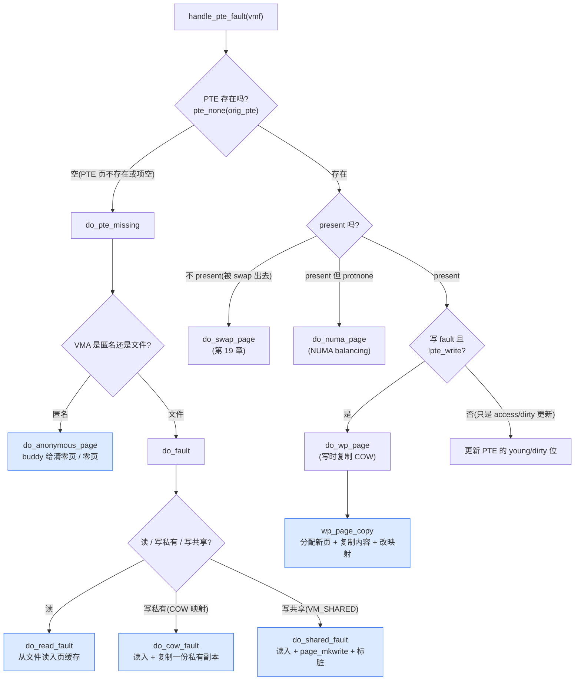
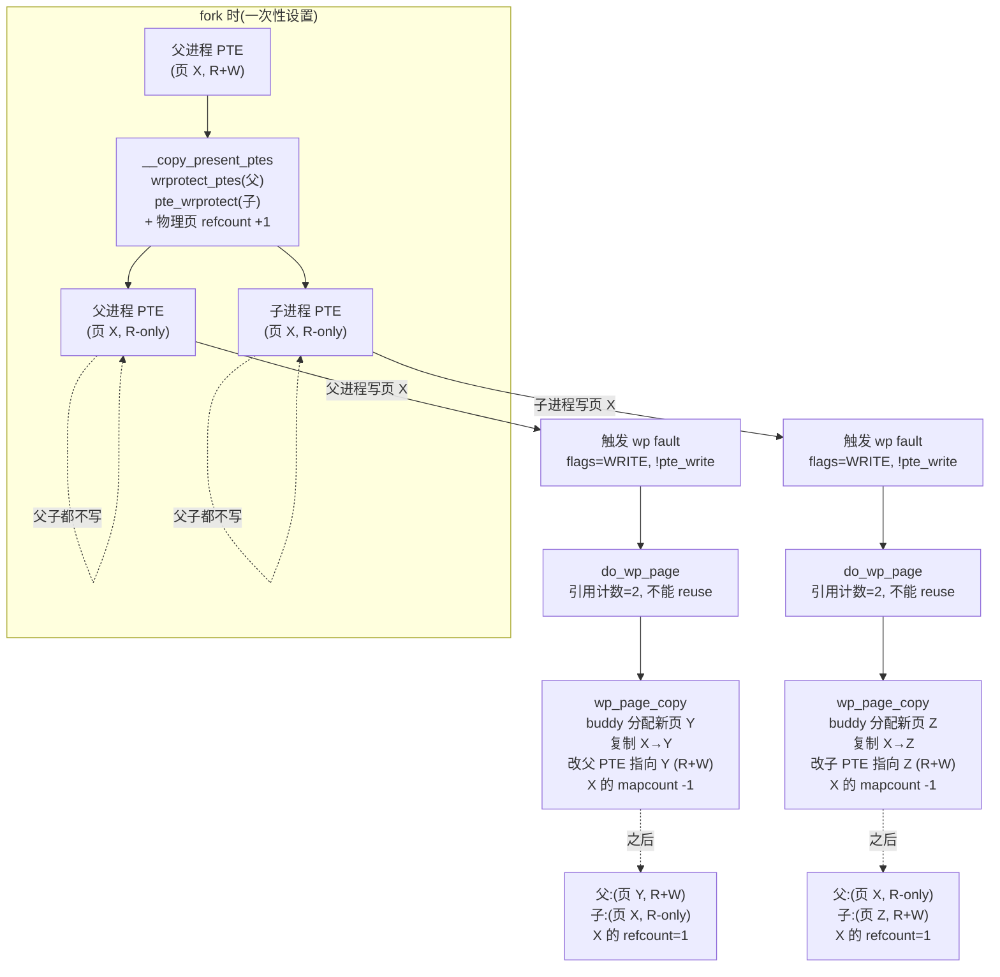

# 第十四章 · 缺页中断:从虚拟到物理

> 篇:第 4 篇 · 用户地址空间:进程内存
> 主线呼应:前两章我们立起了用户地址空间的"账本(VMA)"和"账册的索引方式(多级页表)",但一直把物理页这件事悬着——第 12 章 `mmap` 建了 VMA 却一个物理页都没给,第 13 章页表项(PTE)也大多还空着。这一章就是**兑现时刻**:用户进程真正去读写那段虚拟地址,CPU 翻译页表失败,触发缺页异常(page fault),内核沿着页表一路建项、最后从 buddy 拿一个物理页填进 PTE。这是**惰性分配(lazy allocation)**落地的瞬间,也是第 1 篇 buddy(给物理页)与第 4 篇用户地址空间(建映射)的**接合点**——全书"分配路径"在这里完成关键的一次缝合。

## 核心问题

**用户进程访问一个还没有映射到物理页的虚拟地址(刚 `mmap` 的惰性区、栈生长、`fork` 后第一次写共享页),CPU 翻译页表失败 → 触发缺页异常 → 内核怎么沿页表逐级建项、最后分配一个物理页并填好 PTE?三种典型缺页——匿名页、文件页、写时复制(COW)——内核分别怎么处理?**

读完本章你会明白:

1. 缺页异常的完整路径:从 CPU 抛异常 → 体系结构入口 → 通用层 [`handle_mm_fault`](../linux/mm/memory.c#L5574) → [`__handle_mm_fault`](../linux/mm/memory.c#L5350)(逐级 `p4d_alloc`/`pud_alloc`/`pmd_alloc` + [`handle_pte_fault`](../linux/mm/memory.c#L5266) 分发)。
2. **三类缺页**的分流与各自的"物理页来源":匿名页([`do_anonymous_page`](../linux/mm/memory.c#L4383),buddy 给一个清零页)、文件页([`do_fault`](../linux/mm/memory.c#L4994)→`do_read_fault`/`do_cow_fault`/`do_shared_fault`,从文件读入)、写时复制([`do_wp_page`](../linux/mm/memory.c#L3570)→[`wp_page_copy`](../linux/mm/memory.c#L3241),分配新页 + 复制内容)。
3. **惰性分配**的兑现机制:`mmap` 只建 VMA、缺页才建 PTE;首次读匿名页还能映射到全局零页(zero page)省一次分配。
4. **写时复制(COW)**的全套机制:`fork` 时父子 PTE 都被写保护(`__copy_present_ptes`),某一方写触发 wp fault → 分配新页 → 复制 → 改映射;以及"先清 PTE 再刷 TLB"的顺序为什么 sound。
5. 缺页是**分配路径的按需兑现**:把第 12 章的"承诺"变成"物理页",把第 1 篇 buddy 给的页接进用户页表。

> **逃生阀**:如果你对"VMA 是账本,访问才给物理页"这件事还模糊,先回 [第 12 章 12.3 节](P4-12-VMA与mmap.md)看一眼 `mmap_region` 的最后一行("不碰物理页")再回来;对 PTE/PMD/PUD 的层级不熟,回 [第 13 章](P4-13-多级页表与mmu_gather.md)的多级页表结构图。本章默认你已经知道 PTE 长什么样、权限位怎么放。

---

## 14.1 一句话点破

> **缺页是惰性分配的兑现时刻——CPU 一句"我翻译不了这个虚拟地址",内核就沿着页表一级一级往下建项,最后从 buddy 拿一个物理页填进 PTE。读一个还没建的匿名页给个零页,读一个文件页从文件读入,写一个被写保护的共享页就复制一份。三种分流,同一个目的:把"虚拟地址→物理页"这条映射真正建立起来。**

这是结论,不是理由。本章倒过来拆:先看缺页异常怎么从 CPU 传到内核、内核怎么在页表里逐级建项,再看三类缺页各自怎么"找物理页",然后专门拆 COW 这个最绕的分支,最后回到全书"分配 vs 回收"二分法,看缺页在这条线上站在哪。

---

## 14.2 缺页异常:CPU 到内核的入口

### 异常是怎么发生的

进程执行一条访问内存的指令(比如 `mov (%rax), %rbx`),CPU 的 MMU 拿到虚拟地址 `(%rax)`,去查页表。页表查询是**硬件自动**的——MMU 一级一级走 PGD→P4D→PUD→PMD→PTE(第 13 章拆的多级页表)。如果沿途任何一级查到"这一项不存在(present 位为 0)"、或者"权限对不上"(比如写一个只读 PTE),MMU **不抛出错误**,而是产生一个 **page fault 异常**,把控制权交给内核里注册的异常处理入口。

在 x86-64 上,page fault 是中断向量 14(`#PF`)。CPU 把**触发异常的虚拟地址**写进 `CR2` 寄存器(无论引起 fault 的是哪个地址,CPU 都精确地把它记到 CR2),把错误码压栈(区分"页不存在 / 写错误 / 保护错误 / 用户态 / 内核态"……)。然后跳到 IDT 里的 page fault 处理入口——这是体系结构相关的汇编 stub,保存现场后调到 C 函数 `do_page_fault`(x86 在 `arch/x86/mm/fault.c`,本书未 sparse clone `arch/`,只描述其作用)。

`do_page_fault` 干两件事:**① 从 `CR2` 读出 fault 地址;② 在 `current` 进程的 `mm` 上下文里定位这个地址属于哪个 VMA**,然后调到通用层 [`handle_mm_fault`](../linux/mm/memory.c#L5574)。

> **钉死这件事**:缺页异常的"地址已知"靠硬件——`CR2` 寄存器精确记录 fault 的虚拟地址,内核不用反推。体系结构层做的事是"读 CR2 + 查 VMA + 调 `handle_mm_fault`",通用层做的事才是"沿页表建项 + 找物理页"。这条分层是 mm 的标准模式:**硬件给事实,体系结构层做胶水,通用层做策略**。

### 一个关键判断:地址合法吗

在调 `handle_mm_fault` 之前,体系结构层(配合 [`do_user_addr_fault`](../linux/mm/memory.c#L5628) 这套封装)做一件很重要的事:**判断 fault 地址是不是合法的**——它必须落在某个 VMA 的 `[vm_start, vm_end)` 区间内,且访问方式(读/写/执行)必须符合 VMA 的权限。

- 合法:地址在某 VMA 内,权限对得上 → 调 `handle_mm_fault`,内核沿页表建项、给物理页(本章主题)。
- 非法:地址在空洞里(没 VMA),或者权限对不上(对只读段写、对不可执行段执行)→ 内核给进程发 `SIGSEGV`,进程默认崩。

> **不这样会怎样**:如果没有 VMA 这一层"合法性裁决",内核就得**扫描所有进程页表**来判断"这地址该不该给页"——但页表是稀疏的、按需建的,扫描它根本回答不了"这段地址用户有没有声明过要用"。VMA(第 12 章)是"合法地址的登记簿",缺页裁决先查 VMA 再动页表,这是 mm 把"声明"和"兑现"分层的结果。

### `FAULT_FLAG_*`:这次 fault 是什么"姿势"

进入 [`handle_mm_fault`](../linux/mm/memory.c#L5574) 时,体系结构层传一个 `flags` 参数,告诉通用层这次 fault 的"姿势"——是读还是写、是用户态还是内核态、是不是指令抓取……这些标志定义在 [`enum fault_flag`](../linux/include/linux/mm_types.h#L1355)([mm_types.h:1355](../linux/include/linux/mm_types.h#L1355)):

```c
enum fault_flag {
    FAULT_FLAG_WRITE          = 1 << 0,   /* 写触发的 fault */
    FAULT_FLAG_MKWRITE        = 1 << 1,
    FAULT_FLAG_ALLOW_RETRY    = 1 << 2,   /* 允许内核 drop mmap_lock 重试 */
    FAULT_FLAG_RETRY_NOWAIT   = 1 << 3,
    FAULT_FLAG_KILLABLE       = 1 << 4,   /* 可被致命信号中断 */
    FAULT_FLAG_TRIED          = 1 << 5,   /* 已经重试过 */
    FAULT_FLAG_USER           = 1 << 6,   /* 用户态触发的 */
    FAULT_FLAG_REMOTE         = 1 << 7,
    FAULT_FLAG_INSTRUCTION    = 1 << 8,   /* 取指触发的 */
    FAULT_FLAG_INTERRUPTIBLE  = 1 << 9,
    FAULT_FLAG_UNSHARE        = 1 << 10,  /* GUP 主动 unshare(强制 COW) */
    FAULT_FLAG_ORIG_PTE_VALID = 1 << 11,
    FAULT_FLAG_VMA_LOCK       = 1 << 12,  /* 持 per-VMA lock 而非 mmap_lock */
};
```

后面三类缺页的分流,全靠 `FAULT_FLAG_WRITE`(写?读?)这一位的区别。本章 14.4 拆 COW 时,你会看到这个位的决定性作用。

### `handle_mm_fault`:通用层入口

[`handle_mm_fault`](../linux/mm/memory.c#L5574)([memory.c:5574](../linux/mm/memory.c#L5574)) 是缺页处理的通用入口(无论哪种体系结构,最终都汇到这里)。简化后的主干:

```c
vm_fault_t handle_mm_fault(struct vm_area_struct *vma, unsigned long address,
                           unsigned int flags, struct pt_regs *regs)
{
    struct mm_struct *mm = vma->vm_mm;
    vm_fault_t ret;

    /* 1. flags 合法性校验:写 fault 不能落在无 VM_MAYWRITE 的 VMA 上等 */
    ret = sanitize_fault_flags(vma, &flags);
    if (ret) goto out;

    /* 2. 额外权限校验(x86 PKS/PKEY 等) */
    if (!arch_vma_access_permitted(vma, flags & FAULT_FLAG_WRITE,
                                       flags & FAULT_FLAG_INSTRUCTION,
                                       flags & FAULT_FLAG_REMOTE)) {
        ret = VM_FAULT_SIGSEGV;
        goto out;
    }

    /* 3. 用户态 fault:进入 memcg OOM 处理上下文 */
    if (flags & FAULT_FLAG_USER)
        mem_cgroup_enter_user_fault();

    lru_gen_enter_fault(vma);

    /* 4. hugetlb 大页走专门的路径;普通页走 __handle_mm_fault */
    if (unlikely(is_vm_hugetlb_page(vma)))
        ret = hugetlb_fault(vma->vm_mm, vma, address, flags);
    else
        ret = __handle_mm_fault(vma, address, flags);

    lru_gen_exit_fault();
    /* 5. memcg OOM 清理 */
    if (flags & FAULT_FLAG_USER) {
        mem_cgroup_exit_user_fault();
        if (task_in_memcg_oom(current) && !(ret & VM_FAULT_OOM))
            mem_cgroup_oom_synchronize(false);
    }
out:
    mm_account_fault(mm, regs, address, flags, ret);   /* 统计 maj_flt/min_flt */
    return ret;
}
```

`handle_mm_fault` 自己不做"建页表项"的脏活,它做的是**收口、校验、分发**:校验 flags 合法性、做一些 per-arch 的权限检查、给 memcg OOM 和 LRU_GEN 钩子机会、把 hugetlb 和普通页分流、最后把真正的处理丢给 [`__handle_mm_fault`](../linux/mm/memory.c#L5350)。返回值是 [`vm_fault_t`](../linux/include/linux/mm_types.h#L1355) 位掩码——`VM_FAULT_OOM`(没内存了)、`VM_FAULT_SIGBUS`(信号)、`VM_FAULT_MAJOR`(走了 IO 的 major fault)、`VM_FAULT_RETRY`(drop 了锁要重试)等,体系结构层据此决定要不要重发 fault、要不要给进程发信号。

> **钉死这件事**:`handle_mm_fault` 把"建映射"的策略和"统计、清理、OOM、hugetlb 分流"这些横切关注点切开了。策略在 `__handle_mm_fault`,横切在 `handle_mm_fault`。这是内核里很典型的"薄入口 + 真正干活"的分层——你写自己的代码时如果发现入口函数既在做策略又在收口,那就是该拆的信号。

---

## 14.3 `__handle_mm_fault`:沿页表逐级建项

[`__handle_mm_fault`](../linux/mm/memory.c#L5350)([memory.c:5350](../linux/mm/memory.c#L5350)) 是缺页处理的主体之一——它的职责是**沿页表向下走,把缺的中间项(P4D/PUD/PMD)建好,最后把 PTE 层的事丢给 `handle_pte_fault`**。

### 逐级建项的主干

```c
static vm_fault_t __handle_mm_fault(struct vm_area_struct *vma,
        unsigned long address, unsigned int flags)
{
    struct vm_fault vmf = {
        .vma = vma,
        .address = address & PAGE_MASK,
        .real_address = address,
        .flags = flags,
        .pgoff = linear_page_index(vma, address),
        .gfp_mask = __get_fault_gfp_mask(vma),
    };
    struct mm_struct *mm = vma->vm_mm;
    unsigned long vm_flags = vma->vm_flags;
    pgd_t *pgd;
    p4d_t *p4d;

    pgd = pgd_offset(mm, address);                 /* PGD:永远存在(进程创建时就建好) */
    p4d = p4d_alloc(mm, pgd, address);             /* P4D:不存在就分配一个 PUD 页 */
    if (!p4d) return VM_FAULT_OOM;

    vmf.pud = pud_alloc(mm, p4d, address);         /* PUD:不存在就分配一个 PMD 页 */
    if (!vmf.pud) return VM_FAULT_OOM;

    /* 这里有一段:如果 PUD 能建大页(DAX/PUD-THP),走 create_huge_pud */
    /* ... 否则 fall through 到 PMD 层 ... */

    vmf.pmd = pmd_alloc(mm, vmf.pud, address);     /* PMD:不存在就分配一个 PTE 页 */
    if (!vmf.pmd) return VM_FAULT_OOM;

    /* 这里也有一段:PMD 层的透明大页(THP),create_huge_pmd,见第 20 章 */

    return handle_pte_fault(&vmf);                  /* 最后落到 PTE 层 */
}
```

注意一个细节:**代码里并没有写"PMD 不存在就分配 PTE 页"这种朴素的话,而是用 `pmd_alloc` 这种封装**。`pmd_alloc(mm, pud, addr)` 的语义是"返回 addr 对应的 PMD 指针,中间项不存在就建"。每一级的 `*_alloc` 都是这套——`p4d_alloc` / `pud_alloc` / `pmd_alloc` 在 `include/asm-generic/pgtable-nop4d.h` 等头文件里展开成具体的"查项 + 没有就 `__p4d_alloc` 调 `pte_alloc_one` 拿一个 PTE 页"的动作。

中间项(PUD/PMD)本身就是一个**页大小的页表项数组**(PTE page)。在 x86-64 上一个 PTE 页 4KB,每项 8 字节,512 项,正好覆盖 512 × 4KB = 2MB 的虚拟地址范围(对 PMD 层);PUD 一个 PMD 页 512 项,每项 1GB,一个 PUD 页覆盖 512GB……这套层级第 13 章拆过,这里不重复。

> **不这样会怎样**:如果页表是**一级平铺**(虚拟地址直接索引一个巨大的 PTE 数组),一个 48 位地址空间需要 2^48 / 4KB × 8 字节 = **512GB 的 PTE 数组**——光一个进程的页表就比物理内存还大。多级页表让"稀疏的地址空间"只付出"实际用到的部分"的元数据代价——没访问过的虚拟地址,中间项都不建。缺页路径里逐级 `*_alloc`,就是**多级页表按需生长**的实现:走到哪、建到哪。

### THP 的岔路:大页在缺页里的位置

注意 `__handle_mm_fault` 里有两段"`create_huge_pud` / `create_huge_pmd`"——这是**透明大页(THP)**的路径。如果 VMA 允许大页(`thp_vma_allowable_order` 返回 true)且 PMD 项不存在,内核会试着直接建一个 PMD 级别的大页(2MB,绕过 512 个 4KB PTE)。这一段涉及 `__do_huge_pmd_anonymous_page`、`do_huge_pmd_wp_page` 等,在第 20 章(进阶)拆。本章只关注 **4KB 普通页**路径,即 `__handle_mm_fault` 最后那行 `return handle_pte_fault(&vmf)`。

---

## 14.4 `handle_pte_fault`:分发到三类缺页

[`handle_pte_fault`](../linux/mm/memory.c#L5266)([memory.c:5266](../linux/mm/memory.c#L5266)) 是缺页处理的"路由器"——拿到 PMD 已经建好的 `vmf`,它决定这次 fault 该走哪条分支。简化主干:

```c
static vm_fault_t handle_pte_fault(struct vm_fault *vmf)
{
    pte_t entry;

    if (unlikely(pmd_none(*vmf->pmd))) {
        vmf->pte = NULL;                          /* PTE 页整个不存在 */
    } else {
        /* PTE 页存在,定位到具体 PTE */
        vmf->pte = pte_offset_map_nolock(vmf->vma->vm_mm, vmf->pmd,
                                         vmf->address, &vmf->ptl);
        vmf->orig_pte = ptep_get_lockless(vmf->pte);   /* 无锁读当前 PTE */
        if (pte_none(vmf->orig_pte)) {                  /* PTE 是空的(没映射) */
            pte_unmap(vmf->pte);
            vmf->pte = NULL;
        }
    }

    /* ① PTE 不存在(页表项空) */
    if (!vmf->pte)
        return do_pte_missing(vmf);

    /* ② PTE 存在但不 in-memory(swap 出去过) */
    if (!pte_present(vmf->orig_pte))
        return do_swap_page(vmf);

    /* ③ NUMA balancing 把页设成 protnone,迁到本节点 */
    if (pte_protnone(vmf->orig_pte) && vma_is_accessible(vmf->vma))
        return do_numa_page(vmf);

    /* ④ PTE 存在且 present:可能是写一个只读页(COW),或仅是 access bit 设置 */
    spin_lock(vmf->ptl);
    entry = vmf->orig_pte;
    if (vmf->flags & (FAULT_FLAG_WRITE|FAULT_FLAG_UNSHARE)) {
        if (!pte_write(entry))                    /* 写一个没有写权限的 PTE → COW */
            return do_wp_page(vmf);
        else if (likely(vmf->flags & FAULT_FLAG_WRITE))
            entry = pte_mkdirty(entry);           /* 正常可写,标记 dirty */
    }
    entry = pte_mkyoung(entry);                   /* 设置 accessed 位 */
    ptep_set_access_flags(...);                   /* 写回 PTE */
    ...
}
```

`handle_pte_fault` 的分发决策本质上是**看 PTE 当前的状态**,把 fault 路由到四个分支之一:

| PTE 状态 | fault 原因 | 走哪个函数 | 物理页来源 |
|---------|-----------|-----------|-----------|
| 不存在(PTE 空) | 首次访问、惰性分配 | [`do_pte_missing`](../linux/mm/memory.c#L3875) → `do_anonymous_page` / `do_fault` | 见 14.5/14.6 |
| 存在但不 in-memory | 之前被 swap 出去 | `do_swap_page` | 从 swap 读回 |
| present 但 protnone | NUMA balancing | `do_numa_page` | 迁移页 |
| present 但无写权限 + 写 | 写时复制(COW) | [`do_wp_page`](../linux/mm/memory.c#L3570) → `wp_page_copy` | buddy 给新页 + 复制 |

**最后落到三个真正的"物理页来源"分支**:

1. **`do_pte_missing`**(PTE 空缺)→ 进一步分两类:
   - 匿名 VMA → [`do_anonymous_page`](../linux/mm/memory.c#L4383):buddy 给一个**清零页**(或读时给零页)。
   - 文件 VMA → [`do_fault`](../linux/mm/memory.c#L4994):从文件读入(读/写私有/写共享三种)。
2. **`do_wp_page`**(写一个写保护的 present 页)→ [`wp_page_copy`](../linux/mm/memory.c#L3241):buddy 给新页 + 把旧页内容复制过去(COW)。
3. (swap 回填的 `do_swap_page` 不在本章范围,见第 19 章。)



下面三节分别拆这三类。

---

## 14.5 匿名缺页:`do_anonymous_page` 与零页优化

### 匿名页的"第一次访问"

最常见的缺页:**用户 `malloc` 了一段内存(匿名 VMA),第一次去访问**。PTE 是空的,VMA 是匿名的(`vma_is_anonymous(vma)`),走 [`do_anonymous_page`](../linux/mm/memory.c#L4383)([memory.c:4383](../linux/mm/memory.c#L4383))。

匿名缺页的核心问题:**物理页从哪来,内容应该是什么?** 对匿名页,答案是"内容是零"。但"内容是零"有两种实现——一种笨办法(每次都分配新页 + 清零),一种聪明的(只读时复用一个全局零页)。内核两种都用,而且根据访问是**读**还是**写**分流。

### 读匿名页:复用全局零页

第一次访问一个匿名页,如果是**读**(没有 `FAULT_FLAG_WRITE`),内核**根本不分配物理页**,而是把 PTE 指向一个全局的、永远存在的"零页"(zero page)。看 [`do_anonymous_page` 的前半段](../linux/mm/memory.c#L4405):

```c
/* Use the zero-page for reads */
if (!(vmf->flags & FAULT_FLAG_WRITE) &&
        !mm_forbids_zeropage(vma->vm_mm)) {
    entry = pte_mkspecial(pfn_pte(my_zero_pfn(vmf->address),
                                   vma->vm_page_prot));
    vmf->pte = pte_offset_map_lock(vma->vm_mm, vmf->pmd,
                                    vmf->address, &vmf->ptl);
    if (!vmf->pte) goto unlock;
    if (vmf_pte_changed(vmf)) { update_mmu_tlb(...); goto unlock; }
    ret = check_stable_address_space(vma->vm_mm);
    if (ret) goto unlock;
    if (userfaultfd_missing(vma)) {
        pte_unmap_unlock(vmf->pte, vmf->ptl);
        return handle_userfault(vmf, VM_UFFD_MISSING);
    }
    goto setpte;
}
```

[`my_zero_pfn(addr)`](../linux/include/linux/pgtable.h#L1479)([pgtable.h:1479](../linux/include/linux/pgtable.h#L1479)) 返回的是**全局零页的 PFN**(物理页号)——这个页在系统启动时由 [`init_zero_pfn`](../linux/mm/memory.c#L171) 创建,内容全零,所有进程共享。`pte_mkspecial` 把 PTE 标成"special"(表示这是个特殊映射,不参与 rmap/回收——第 15 章)。

> **不这样会怎样**:如果匿名页的"读"也每次都分配一个真物理页(分配 + 清零),那一个程序里大量"声明了但还没写"的内存(比如 `char buf[1<<20]` 然后只 `memcmp` 不 `memset`)会立刻吃掉 1MB 物理内存——而其实用户根本没写过任何字节,内容都是零。零页让"读未写的匿名内存"**完全免费**:所有进程的未写匿名页 PTE 都指向同一个物理页(零页),不占任何额外物理内存。

读零页的代价是:**PTE 是只读的(且 special)**。一旦用户写这个地址,会再次触发缺页(写一个无写权限的 PTE),这次走 `do_wp_page` → `wp_page_copy`(`wp_page_copy` 会处理"从零页 COW 出一个真页"的情况,见 14.7)。零页本质上是 COW 的一个特例——共享一个全零页,写时才各分配自己的真页。

### 写匿名页:从 buddy 拿一个真清零页

如果第一次访问是**写**(`flags & FAULT_FLAG_WRITE`),或者读时被 `mm_forbids_zeropage` 禁了零页(KVM 之类),就走 [`do_anonymous_page` 的后半段](../linux/mm/memory.c#L4429):

```c
/* Allocate our own private page. */
if (unlikely(anon_vma_prepare(vma)))    /* 给 VMA 准备 anon_vma(rmap 用,第 15 章) */
    goto oom;
folio = alloc_anon_folio(vmf);          /* 从 buddy 拿一个(可能大页)folio */
if (IS_ERR(folio)) return 0;
if (!folio) goto oom;

nr_pages = folio_nr_pages(folio);
addr = ALIGN_DOWN(vmf->address, nr_pages * PAGE_SIZE);

__folio_mark_uptodate(folio);           /* 标记页内容"已是最新"(就是零) */

entry = mk_pte(&folio->page, vma->vm_page_prot);
entry = pte_sw_mkyoung(entry);
if (vma->vm_flags & VM_WRITE)
    entry = pte_mkwrite(pte_mkdirty(entry), vma);   /* 标 dirty + writable */

vmf->pte = pte_offset_map_lock(vma->vm_mm, vmf->pmd, addr, &vmf->ptl);
if (!vmf->pte) goto release;
if (nr_pages == 1 && vmf_pte_changed(vmf)) { update_mmu_tlb(...); goto release; }
... /* 大 folio 多 PTE 的检查 */

ret = check_stable_address_space(vma->vm_mm);   /* 期间不能 fork/oom */
if (ret) goto release;

if (userfaultfd_missing(vma)) { ... }

folio_ref_add(folio, nr_pages - 1);
add_mm_counter(vma->vm_mm, MM_ANONPAGES, nr_pages);   /* 统计:匿名页数 +N */
folio_add_new_anon_rmap(folio, vma, addr);             /* 加进 rmap(第 15 章) */
folio_add_lru_vma(folio, vma);                         /* 加进 LRU(回收用) */
set_ptes(vma->vm_mm, addr, vmf->pte, entry, nr_pages); /* 真正写 PTE */
update_mmu_cache_range(vmf, vma, addr, vmf->pte, nr_pages);
```

[`alloc_anon_folio`](../linux/mm/memory.c#L4306)([memory.c:4306](../linux/mm/memory.c#L4306)) 在普通配置下调 [`folio_prealloc`](../linux/mm/memory.c#L1040) → [`vma_alloc_zeroed_movable_folio`](../linux/mm/memory.c#L1046) ——这是一个封装了 `alloc_zeroed_page` / `__alloc_pages` 的便捷函数,从 buddy 的 MOVABLE 区拿一个**已经清零**的页(`need_zero=true` 时)。**这就是缺页路径和第 1 篇 buddy 的接合点**——缺页要真物理页,最终调到 `__alloc_pages`(第 4 章),走 buddy 的快慢路径。

> **钉死这件事**:`alloc_anon_folio` 不一定只分配一页。在 `CONFIG_TRANSPARENT_HUGEPAGE` 开启时,它会尝试分配一个更大的 folio(PMD 之下的中等大小 folio,即 mTHP),只要 VMA 允许且对齐范围内 PTE 都空。这是 6.x 的一个性能优化——把"原本要触发 512 次 4KB 缺页"压成"一次大 folio 缺页"。但逻辑分支不变:**找到物理页 → 填 PTE(s)**。看到代码里 `nr_pages = folio_nr_pages(folio)` 和 `set_ptes(... nr_pages)`,就是这个意思。

### 关键并发:PT 锁保护 PTE 修改

注意 `do_anonymous_page` 里反复出现的 `pte_offset_map_lock` —— 这是**PTE 锁**(pte lock,通常是 `ptl`)。多个线程可能同时缺页到同一个 PMD 下的不同 PTE,内核用**每个 PTE 页一把 spinlock**(`pmd_lock` 派生)保护这个 PTE 页的所有项。所有"PTE 读 + 修改 + 写回"的临界区都得拿 `ptl`。

`pte_offset_map_lock(mm, pmd, addr, &ptl)` 是个组合宏:把 addr 映射到 PMD 里具体的 PTE 指针,同时拿到这个 PTE 页的 spinlock。读完 PTE 后 `pte_unmap_unlock` 释放。这就是 mm 里**细粒度锁**的典型——不是一把锁锁整个页表,而是每个 PTE 页一把锁,让多线程的缺页路径并发度最大化。

### 6.x 的 folio 化:为什么是 `folio` 而不是 `page`

注意 6.x 缺页路径里大量出现 `folio` 而非 `page`(`struct folio`)。`folio` 是 5.x 后期引入、6.x 全面铺开的抽象,表示"一个或多个物理连续的页作为一个分配单位"。一个 `folio` 可以是单页(过去叫 `page`),也可以是大页(mTHP / THP)。代码里 `folio->page` 拿到第一个 `struct page`,`page_folio(page)` 反向取回 folio。**缺页处理按 folio 走**,是为了让 mTHP 的多页 PTE 批量填入变成可能(一次 `set_ptes` 填 `nr_pages` 个 PTE)。

---

## 14.6 文件缺页:`do_fault` 与读/写私有/写共享三分

如果缺页的 VMA 是**文件映射**(`vma->vm_file != NULL`、`vm_ops->fault` 有定义),就走 [`do_fault`](../linux/mm/memory.c#L4994)([memory.c:4994](../linux/mm/memory.c#L4994))。文件缺页的核心问题:**物理页从哪来,内容应该是什么?** 对文件页,答案是"从文件读入"——但读入之后要不要复制一份私有副本,取决于映射是私有(`MAP_PRIVATE`)还是共享(`MAP_SHARED`),以及是读还是写。

### `do_fault`:三种文件缺页的总分发

```c
static vm_fault_t do_fault(struct vm_fault *vmf)
{
    struct vm_area_struct *vma = vmf->vma;
    vm_fault_t ret;

    if (!vma->vm_ops->fault) {
        /* 没有 fault 回调:SIGBUS 处理 */
        ...
    } else if (!(vmf->flags & FAULT_FLAG_WRITE)) {
        ret = do_read_fault(vmf);                  /* 读:从文件读入,共享页缓存 */
    } else if (!(vma->vm_flags & VM_SHARED)) {
        ret = do_cow_fault(vmf);                   /* 写 + MAP_PRIVATE:读入再复制一份 */
    } else {
        ret = do_shared_fault(vmf);                /* 写 + MAP_SHARED:读入 + page_mkwrite */
    }
    ...
}
```

三类的本质区别:

| 类型 | 触发条件 | 物理页来源 | 行为 |
|------|---------|-----------|------|
| `do_read_fault` | 读文件页 | 文件页缓存(page cache) | 从文件读入到 page cache,PTE 指向 page cache 的页(只读) |
| `do_cow_fault` | 写私有文件映射 | page cache 读一份 → 复制一份私有副本 | 私有副本 PTE 可写,原 page cache 页引用计数 -1 |
| `do_shared_fault` | 写共享文件映射 | page cache | PTE 可写,标脏(同步回文件),触发 `page_mkwrite` 让文件系统知晓 |

### `do_read_fault`:最常见的文件读缺页

[`do_read_fault`](../linux/mm/memory.c#L4874)([memory.c:4874](../linux/mm/memory.c#L4874)) 干两件事:**① 可能先 `do_fault_around` 预读邻近页(默认 64KB,即 16 页);② 调 `__do_fault` 从文件系统读入,然后 `finish_fault` 把 PTE 填好**。

```c
static vm_fault_t do_read_fault(struct vm_fault *vmf)
{
    vm_fault_t ret = 0;
    struct folio *folio;

    if (should_fault_around(vmf)) {
        ret = do_fault_around(vmf);        /* 预读邻近页,降低 fault 次数 */
        if (ret) return ret;
    }
    ret = __do_fault(vmf);                 /* 调 vma->vm_ops->fault 读入 */
    if (unlikely(ret & (VM_FAULT_ERROR | VM_FAULT_NOPAGE | VM_FAULT_RETRY)))
        return ret;

    ret |= finish_fault(vmf);              /* 填 PTE,加 rmap */
    folio = page_folio(vmf->page);
    folio_unlock(folio);
    ...
}
```

[`__do_fault`](../linux/mm/memory.c#L4504) 调的是 VMA 的 `vm_ops->fault` 回调——对 ext4 这种文件系统,就是 `filemap_fault`,它会去 **page cache** 找这个文件偏移对应的页(已经读过就复用,没读过就触发 `readpage` 从磁盘读)。读完后 `vmf->page` 指向 page cache 里的那个 folio。

### `fault_around`:预读邻近页的优化

[`do_fault_around`](../linux/mm/memory.c#L4828) 是个有意思的优化。读文件经常是**顺序读**(比如 `read` 一个文件从头读到尾),一次只读一页会触发海量缺页。`do_fault_around` 在你这次 fault 之外,顺手把邻近最多 64KB(默认 `fault_around_pages = 65536 >> PAGE_SHIFT` = 16 页)的虚拟地址也试着映射上——通过 `vm_ops->map_pages` 回调(ext4 是 `filemap_map_pages`)批量建 PTE,只要 page cache 里已经有页。如果邻近页还没读入,就跳过(不会引发额外 IO)。

> **不这样会怎样**:如果每次读文件都只 fault 自己这一页,顺序读 1MB 文件就是 256 次缺页(每次 `__do_fault` + `filemap_fault` 一趟)。`fault_around` 把这种"明显会顺序访问"的模式压缩成"第一次 fault 16 页,后续 15 次都零成本(命中已建的 PTE)"。这是用一点预读成本换大量 fault 次数的典型优化。

### `finish_fault`:把读好的页填进 PTE

无论哪种文件缺页,最终都要 [`finish_fault`](../linux/mm/memory.c#L4713)([memory.c:4713](../linux/mm/memory.c#L4713)) 把"页已经准备好"这件事**落到 PTE**:

```c
vm_fault_t finish_fault(struct vm_fault *vmf)
{
    struct vm_area_struct *vma = vmf->vma;
    struct page *page;

    /* 写 + 非共享 → 用 COW 出来的私有副本(cow_page),否则用读入的原页 */
    if ((vmf->flags & FAULT_FLAG_WRITE) && !(vma->vm_flags & VM_SHARED))
        page = vmf->cow_page;
    else
        page = vmf->page;

    if (!(vma->vm_flags & VM_SHARED)) {
        ret = check_stable_address_space(vma->vm_mm);
        if (ret) return ret;
    }

    if (pmd_none(*vmf->pmd)) {                /* PMD 里还没有 PTE 页 */
        ...
        if (vmf->prealloc_pte)
            pmd_install(vma->vm_mm, vmf->pmd, &vmf->prealloc_pte);
        else if (unlikely(pte_alloc(vma->vm_mm, vmf->pmd)))
            return VM_FAULT_OOM;
    }

    vmf->pte = pte_offset_map_lock(vma->vm_mm, vmf->pmd,
                                    vmf->address, &vmf->ptl);
    if (likely(!vmf_pte_changed(vmf))) {       /* 重新检查:PTE 还是空的吗? */
        struct folio *folio = page_folio(page);
        set_pte_range(vmf, folio, page, 1, vmf->address);   /* 填 PTE */
        ret = 0;
    } else {
        update_mmu_tlb(...);
        ret = VM_FAULT_NOPAGE;
    }
    pte_unmap_unlock(vmf->pte, vmf->ptl);
    return ret;
}
```

注意一个**关键的并发模式**:`finish_fault` 在拿 `ptl` 之后,**再次检查 PTE 是否还是空**(`vmf_pte_changed`)。为什么?因为从 `__do_fault` 读入页到 `finish_fault` 拿到 `ptl` 之间,锁是**释放**的——别的线程可能已经把这一项填好了。这种"释放锁 → 干 IO → 重新拿锁 → 复查"的模式在 mm 缺页路径里反复出现,它是**乐观并发**的标志:大部分情况不冲突,冲突了就复查、必要时丢弃自己的工作(`VM_FAULT_NOPAGE`)。

### `do_cow_fault`:私有文件映射的写

写一个**私有文件映射**(`MAP_PRIVATE`)时,要保护原文件不被改——所以读入一份 page cache 页后,要复制一份**私有副本**,让进程的 PTE 指向私有副本(可写),原 page cache 页引用计数 -1。看 [`do_cow_fault`](../linux/mm/memory.c#L4906):

```c
static vm_fault_t do_cow_fault(struct vm_fault *vmf)
{
    struct folio *folio;
    vm_fault_t ret;

    ret = vmf_anon_prepare(vmf);                       /* 准备 anon_vma */
    if (ret) return ret;

    folio = folio_prealloc(vma->vm_mm, vma, vmf->address, false);  /* 预分配新页 */
    if (!folio) return VM_FAULT_OOM;

    vmf->cow_page = &folio->page;

    ret = __do_fault(vmf);                             /* 从文件读入原页 */
    ...
    copy_user_highpage(vmf->cow_page, vmf->page, vmf->address, vma);  /* 复制 */
    __folio_mark_uptodate(folio);

    ret |= finish_fault(vmf);                          /* 填 PTE(用 cow_page) */
    unlock_page(vmf->page);
    put_page(vmf->page);                               /* 原 page cache 页 -1 引用 */
    ...
}
```

> **钉死这件事**:文件缺页的"读 / 写私有 / 写共享"三分,本质是**对 page cache 的处理方式不同**:读共享 page cache;写私有复制一份(类似 COW);写共享直接改 page cache(回写文件)。这三种是用户 `MAP_PRIVATE` vs `MAP_SHARED` 语义在内核缺页层的兑现——你在用户态选的 `mmap` flag,决定了缺页时内核怎么找页。

---

## 14.7 写时复制(COW):`do_wp_page` 与 `wp_page_copy`

最绕的一类缺页是**写时复制(COW)**。它不是"页不存在",而是"页存在、能读、但不能写"——PTE 的写位(W)被清掉,你一写就触发 fault。内核判断是 COW,分配一个新页、把旧页内容复制过去、改 PTE 指向新页(可写)。这一节专门拆 COW 的全套机制。

### COW 的设置:`fork` 时把父子页都写保护

COW 的故事**不是从缺页开始的,而是从 `fork` 开始的**。`fork` 创建子进程,要把父进程的整个地址空间"复制"一份给子进程。但内核**真的复制每一页**吗?不。它只复制**页表**,而且复制时把所有可写的页**改成只读**——父子进程的 PTE 都指向同一个物理页,但都是只读的。直到某一方写,才触发 COW 缺页,那时才真复制那一页。

看 `fork` 路径里的 [`__copy_present_ptes`](../linux/mm/memory.c#L933)([memory.c:933](../linux/mm/memory.c#L933))——这是复制父进程 PTE 给子进程的核心:

```c
static __always_inline void __copy_present_ptes(struct vm_area_struct *dst_vma,
        struct vm_area_struct *src_vma, pte_t *dst_pte, pte_t *src_pte,
        pte_t pte, unsigned long addr, int nr)
{
    struct mm_struct *src_mm = src_vma->vm_mm;

    /* 关键:COW 映射,父子两边的 PTE 都改成只读 */
    if (is_cow_mapping(src_vma->vm_flags) && pte_write(pte)) {
        wrprotect_ptes(src_mm, addr, src_pte, nr);   /* 父进程:PTE 清写位 */
        pte = pte_wrprotect(pte);                     /* 子进程的副本也清写位 */
    }

    /* 共享映射:子进程的副本标记为 clean */
    if (src_vma->vm_flags & VM_SHARED)
        pte = pte_mkclean(pte);
    pte = pte_mkold(pte);

    ...
    set_ptes(dst_vma->vm_mm, addr, dst_pte, pte, nr);  /* 写子进程的 PTE */
}
```

[`is_cow_mapping(flags)`](../linux/include/linux/mm.h#L1622)([mm.h:1622](../linux/include/linux/mm.h#L1622)) 的定义极其简洁:

```c
static inline bool is_cow_mapping(vm_flags_t flags)
{
    return (flags & (VM_SHARED | VM_MAYWRITE)) == VM_MAYWRITE;
}
```

意思是:**私有且可能写**(`VM_MAYWRITE` 置位但 `VM_SHARED` 不置)的映射就是 COW 映射。这覆盖了所有 `MAP_PRIVATE` 可写的 VMA——典型的 `malloc` 拿到的匿名段、`MAP_PRIVATE` 映射的可写文件段。

`fork` 时对 COW 映射的两件关键事:**① 父进程的 PTE 也被写保护(`wrprotect_ptes`);② 物理页的引用计数 +1**(在 `copy_present_ptes` 里,通过 `folio_ref_add` / `folio_try_dup_anon_rmap_ptes`)。这样父子两边的 PTE 都指向同一个物理页,该页的引用计数 = 2。

> **不这样会怎样**:朴素地想,`fork` 应该"复制所有页给子进程"。但一个进程几 GB 的内存,`fork` 一次就要几 GB 的复制 + 几 GB 的物理内存——大进程 `fork` 极慢且大多页根本没被改(典型如 shell `fork` 后立刻 `exec`,父进程所有页白复制了)。COW 让 `fork` 变成 O(页表大小) 而非 O(物理内存)——只复制**页表**(几 MB 级),物理页**推迟到真写时**才按页复制。这就是为什么 `fork` 大进程也很快,而 `fork + exec` 这种典型模式几乎零浪费。

### COW 的触发:写一个只读 PTE

父子进程共享物理页(只读)期间,谁都不写,什么都不发生。某一方写,会**写一个没有写权限的 present PTE**,MMU 触发 fault。体系结构层判断这是"页存在 + 写错误",传 `flags = FAULT_FLAG_WRITE` 给 `handle_mm_fault`。最终走到 [`handle_pte_fault` 的 wp 分支](../linux/mm/memory.c#L5314):

```c
if (vmf->flags & (FAULT_FLAG_WRITE|FAULT_FLAG_UNSHARE)) {
    if (!pte_write(entry))
        return do_wp_page(vmf);            /* 写时复制 */
    ...
}
```

### `do_wp_page`:能不能复用,不能就复制

[`do_wp_page`](../linux/mm/memory.c#L3570)([memory.c:3570](../linux/mm/memory.c#L3570)) 是 COW 处理的入口。它的决策本质是**"这页能不能直接转成可写(复用),还是必须复制一份?"** 简化主干:

```c
static vm_fault_t do_wp_page(struct vm_fault *vmf)
{
    const bool unshare = vmf->flags & FAULT_FLAG_UNSHARE;
    struct vm_area_struct *vma = vmf->vma;
    struct folio *folio = NULL;
    pte_t pte;

    /* userfaultfd 的 wp 处理(略) */
    ...

    vmf->page = vm_normal_page(vma, vmf->address, vmf->orig_pte);
    if (vmf->page) folio = page_folio(vmf->page);

    /* 共享映射(VMA 层共享):不 COW,直接转可写 */
    if (vma->vm_flags & (VM_SHARED | VM_MAYSHARE)) {
        if (!vmf->page) return wp_pfn_shared(vmf);
        return wp_page_shared(vmf, folio);
    }

    /* 私有映射:能不能复用?
     * - 匿名页且标记了 EXCLUSIVE(只有我一个映射) → 直接复用
     * - 匿名页且 wp_can_reuse_anon_folio(引用计数=1 等) → 复用 + 设 EXCLUSIVE
     */
    if (folio && folio_test_anon(folio) &&
        (PageAnonExclusive(vmf->page) ||
         wp_can_reuse_anon_folio(folio, vma))) {
        if (!PageAnonExclusive(vmf->page))
            SetPageAnonExclusive(vmf->page);
        if (unlikely(unshare)) {
            pte_unmap_unlock(vmf->pte, vmf->ptl);
            return 0;
        }
        wp_page_reuse(vmf, folio);          /* 改 PTE 为可写,不复制 */
        return 0;
    }

    /* 不能复用,真复制 */
    if (folio) folio_get(folio);
    pte_unmap_unlock(vmf->pte, vmf->ptl);
    ...
    return wp_page_copy(vmf);
}
```

这里有个**关键优化**:`do_wp_page` 不是无脑复制,而是先看能不能**直接复用**(`wp_can_reuse_anon_folio`)。如果这个匿名页的引用计数 = 1(说明只有我这一个 PTE 映射它,虽然 PTE 是只读的,但其实就是我的私有页),那 COW 复制是浪费——直接把 PTE 改成可写就行,这叫 **reuse**。`wp_can_reuse_anon_folio` 用 `PageAnonExclusive` 标志(6.x 引入)和引用计数判断综合决定。

> **为什么 6.x 要搞 PageAnonExclusive?** 在更老的内核里,COW 复用判断完全靠引用计数(`page_mapcount == 1`),但这有几个 corner case(比如 KSM 合并的页、被 GUP pin 住的页)。6.x 引入 `PageAnonExclusive` 作为"这页明确只属于我一个 VMA、可以独占"的明确标志——`fork` 时父子共享的页就**不**设 EXCLUSIVE,只有"这个页就是我自己 private 的"才设。这让 COW 复用判断更直接、更 sound,堵住了一些历史上的 race(LPC 2023 多个 talk 讨论过 "COW exhaustion" / "GUP vs COW" 的问题,`PageAnonExclusive` 是修复的一部分)。

如果**不能复用**(页被多方共享、且至少一方是 COW 映射需要独立副本),就走真正的复制:[`wp_page_copy`](../linux/mm/memory.c#L3241)。

### `wp_page_copy`:分配新页 + 复制 + 改映射

[`wp_page_copy`](../linux/mm/memory.c#L3241)([memory.c:3241](../linux/mm/memory.c#L3241)) 是 COW 的真正实现。主干:

```c
static vm_fault_t wp_page_copy(struct vm_fault *vmf)
{
    struct vm_area_struct *vma = vmf->vma;
    struct mm_struct *mm = vma->vm_mm;
    struct folio *old_folio = NULL;
    struct folio *new_folio = NULL;
    ...
    if (vmf->page) old_folio = page_folio(vmf->page);
    ret = vmf_anon_prepare(vmf);                          /* 准备 anon_vma */
    ...

    pfn_is_zero = is_zero_pfn(pte_pfn(vmf->orig_pte));    /* 旧页是不是零页? */
    new_folio = folio_prealloc(mm, vma, vmf->address, pfn_is_zero);  /* 分配新页 */
    if (!new_folio) goto oom;

    if (!pfn_is_zero) {
        err = __wp_page_copy_user(&new_folio->page, vmf->page, vmf);  /* 复制内容 */
        ...
    }
    /* 如果旧页是零页,新页本就清零,跳过复制 */

    __folio_mark_uptodate(new_folio);

    mmu_notifier_range_init(&range, MMU_NOTIFY_CLEAR, ...);
    mmu_notifier_invalidate_range_start(&range);          /* 通知 KSM/KVM 等 */

    /* 重新拿 ptl,复查 PTE 没变 */
    vmf->pte = pte_offset_map_lock(mm, vmf->pmd, vmf->address, &vmf->ptl);
    if (likely(vmf->pte && pte_same(ptep_get(vmf->pte), vmf->orig_pte))) {
        if (old_folio) {
            if (!folio_test_anon(old_folio)) {
                dec_mm_counter(mm, mm_counter_file(old_folio));
                inc_mm_counter(mm, MM_ANONPAGES);
            }
        } else { /* 旧页是零页 */
            inc_mm_counter(mm, MM_ANONPAGES);
        }
        flush_cache_page(vma, vmf->address, pte_pfn(vmf->orig_pte));
        entry = mk_pte(&new_folio->page, vma->vm_page_prot);
        entry = pte_sw_mkyoung(entry);
        ...
        entry = maybe_mkwrite(pte_mkdirty(entry), vma);   /* 新 PTE 可写 + dirty */

        /* 关键:先清 PTE + 刷 TLB,再写新 PTE */
        ptep_clear_flush(vma, vmf->address, vmf->pte);
        folio_add_new_anon_rmap(new_folio, vma, vmf->address);   /* 加 rmap */
        folio_add_lru_vma(new_folio, vma);
        ...
        set_pte_at_notify(mm, vmf->address, vmf->pte, entry);    /* 写新 PTE */
        update_mmu_cache_range(vmf, vma, vmf->address, vmf->pte, 1);
        if (old_folio) {
            /* 关键:先改 PTE,再减 mapcount */
            folio_remove_rmap_pte(old_folio, vmf->page, vma);
        }

        new_folio = old_folio;     /* trick:让后面 folio_put 释放旧页(如计数归零) */
        page_copied = 1;
        pte_unmap_unlock(vmf->pte, vmf->ptl);
    }
    ...
    mmu_notifier_invalidate_range_end(&range);

    if (new_folio) folio_put(new_folio);
    if (old_folio) {
        if (page_copied) free_swap_cache(old_folio);
        folio_put(old_folio);
    }
    return 0;
}
```

### COW 的生命周期图



### "先清 PTE 再刷 TLB"为什么 sound

`wp_page_copy` 里有一段长注释解释为什么**先 `ptep_clear_flush` 再 `set_pte_at_notify`**:

```c
/*
 * Clear the pte entry and flush it first, before updating the
 * pte with the new entry, to keep TLBs on different CPUs in
 * sync. This code used to set the new PTE then flush TLBs, but
 * that left a window where the new PTE could be loaded into
 * some TLBs while the old PTE remains in others.
 */
ptep_clear_flush(vma, vmf->address, vmf->pte);
```

朴素地想,COW 改映射可以"先写新 PTE,再刷 TLB"。但这有**正确性陷阱**:

- CPU A(正在执行 `wp_page_copy`)写新 PTE(指向新页 Y);
- CPU B 上 TLB 还缓存着旧 PTE(指向旧页 X);
- 在 TLB 被刷掉之前,CPU B 还能通过旧 TLB 访问到旧页 X——但 CPU A 已经把旧页的 mapcount 减了、可能已经决定复用它(比如另一条 COW fault 在另一个 CPU 上 reuse 旧页)。
- 结果:CPU B 可能读到**已被别人改写的**旧页——数据不一致。

正确的顺序是:**先把 PTE 清成 absent(`ptep_clear_flush` 内含 TLB 刷新),让所有 CPU 的 TLB 都失效;然后再写新 PTE**。这样写新 PTE 之前,没有任何 CPU 能通过旧 TLB 访问旧页。后续 14.8 节会进一步解释这个"先改 PTE 再减 mapcount"的顺序约束。

> **钉死这件事**:COW 改映射不是"原子改 PTE"这么简单——多核环境下,TLB 是每个 CPU 一份的缓存,改 PTE 必须配合 TLB 刷新,且**顺序必须是先清 + 刷,再写新**。这条铁律在 mm 里所有"改 present PTE"的地方都成立(unmap、迁移、COW、NUMA balancing……)。第 13 章拆的 `mmu_gather` 批量刷 TLB,就是为了让这种刷 TLB 不至于成为性能灾难。

### "先改 PTE 再减 mapcount"为什么 sound

`wp_page_copy` 里还有另一段超长注释([memory.c:3340-3362](../linux/mm/memory.c#L3340)),解释为什么**先 `set_pte_at_notify` 再 `folio_remove_rmap_pte`**:

```c
/*
 * Only after switching the pte to the new page may
 * we remove the mapcount here. Otherwise another
 * process may come and find the mapcount decremented
 * before the pte is switched to the new page, and
 * "reuse" the old page writing into it while our pte
 * here still points into it and can be read by other
 * threads.
 *
 * The critical issue is to order this
 * folio_remove_rmap_pte() with the ptp_clear_flush
 * above. Those stores are ordered by (if nothing else,)
 * the barrier present in the atomic_add_negative
 * in folio_remove_rmap_pte();
 *
 * Then the TLB flush in ptep_clear_flush ensures that
 * no process can access the old page before the
 * decremented mapcount is visible. And the old page
 * cannot be reused until after the decremented
 * mapcount is visible. So transitively, TLBs to
 * old page will be flushed before it can be reused.
 */
folio_remove_rmap_pte(old_folio, vmf->page, vma);
```

这段在讲一个微妙的**内存序约束**:

- 如果**先减 mapcount,再改 PTE**:在两者之间有个窗口,旧页的 mapcount 已经减到 0(看起来没人映射了),但当前 CPU 的 PTE 还指着旧页。此时另一个 CPU 上的缺页(或 GUP)看到 mapcount=0,可能"复用"旧页——开始往里写自己的数据。而当前 CPU 的线程还能通过旧 PTE 读到旧页。**两个进程同时写一个物理页 → 数据损坏**。
- 正确顺序:**先改 PTE(且刷 TLB),再减 mapcount**。这样减 mapcount 之前,所有 CPU 对旧页的 TLB 都已失效,没人能再通过旧 PTE 访问旧页。mapcount 减到能让别人复用之前,旧页的访问通道已经完全切断。

这段逻辑由两层 ordering 保证:**① `ptep_clear_flush` 里的 TLB 刷(内存屏障);② `folio_remove_rmap_pte` 里 `atomic_add_negative` 的屏障**。两者组合,让"旧页能被复用"必然晚于"所有 CPU 对旧页的 TLB 失效"。这是 mm 里"为什么 sound"的典范——一个看似普通的 PTE 改动,底下藏着三层 ordering 约束。

---

## 14.8 技巧精解:惰性分配 + COW

这一章的两个标志性技巧,我们单独拆透。

### 技巧一:惰性分配(lazy allocation)

#### 它解决什么问题

第 12 章说过,用户 `malloc(1<<30)`(1GB)能立刻返回成功,内存却没被吃掉——因为 `mmap` 只在 maple tree 里建一个 VMA,不分配物理页。**但 VMA 是"承诺",真正访问时谁来兑现?** 答案是缺页路径。每次缺页,内核按需调一次 buddy 给一页。

#### 反面对比:预分配会怎样

> **反面对比**:如果内核朴素地"建 VMA 时就分配所有物理页",会怎样?
>
> 1. `mmap(NULL, 1<<30, ...)` 立刻分配 1GB 物理页——机器只有 16GB,十几个这样的 `mmap` 就耗光,但实际上程序可能只写其中几 MB。**虚拟空间毫无意义**——它本来是为了"逻辑上的连续"超过物理内存的限制,预分配把这个好处全废了。
> 2. `fork` 一个进程,父子两份物理页(`fork` 后立刻 `exec` 的常见模式,父进程所有页白分配)。
> 3. 一个稀疏数组 `int arr[1<<20]` 只用 `arr[0]` 和 `arr[1000000]`,却要占 4MB 物理内存——99% 浪费。
>
> 惰性分配让"虚拟空间近乎免费"——只有**真用到的页**才占物理内存。一个进程 `mmap` 1TB、实际只用 1MB,物理内存开销就是 1MB(256 页),不是 1TB。

#### 实现的精妙:延迟到缺页才动手

惰性的实现,核心在两件事:

1. **`mmap` 路径完全不碰物理页**(第 12 章)——只建 VMA,不调 `alloc_pages`、不建 PTE。
2. **缺页路径才是真正的物理分配**(本章)——访问触发 fault → `handle_mm_fault` → `do_anonymous_page`(或 `do_fault` / `do_wp_page`)→ `alloc_anon_folio` → `__alloc_pages`(第 1 篇 buddy 的快慢路径)。

这里有一个**性能上的精妙平衡**:惰性分配把代价"摊到了"实际访问上——每次访问一个新页都要触发一次缺页(陷入内核、走完 `handle_mm_fault`、调 buddy)。这看起来慢,但有两个缓解:

- **大多数进程只访问其虚拟空间的一小部分**(稀疏性),惰性分配的总代价 << 预分配的总代价。
- **缺页有局部性优化**:`do_fault_around` 预读邻近页、mTHP/THP 一次给大页(2MB),让一次缺页覆盖一大片后续访问。所以"每页一次缺页"的代价是**均摊**得很低的。

> **钉死这件事**:惰性分配是"虚拟空间免费"的根基,是 Linux mm 设计哲学里**分配路径的"按需兑现"原则**。它和第 5 篇的回收路径(把不用的页收回来)是一对——一个"按需给出去",一个"按需收回来",合起来才能让有限的物理内存撑起几 TB 的虚拟空间。这就是为什么 16GB 的机器能跑几十个进程、每个进程都说自己用了几 GB——它们都"声明"了,但**只有真用到的**才占物理。

### 技巧二:写时复制(COW)

#### 它解决什么问题

`fork` 之后子进程"应该"有一份和父进程完全独立的地址空间——任何一方改了自己的页,对方看不到。但**真的复制每一页**吗?这会把 `fork` 变成 O(物理内存)——大进程 `fork` 一次就要复制几 GB,而且其中**绝大多数页**父子都不改(典型:shell `fork` 后立刻 `exec`,父进程所有页白复制了)。

#### 反面对比:`fork` 立刻复制所有页会怎样

> **反面对比**:如果 `fork` 朴素地复制每一页,会怎样?
>
> 1. 大进程(数据库、JVM 几 GB 堆)`fork` 极慢——几 GB 的页复制是秒级延迟。
> 2. 物理内存立刻翻倍——父子各一份,16GB 机器跑 8GB 进程 `fork` 后立刻 OOM。
> 3. `fork + exec` 模式几乎全部浪费——`exec` 立刻把父进程地址空间扔掉,白复制了。
>
> COW 让 `fork` 变成 O(页表大小):只复制页表(几 MB),物理页推迟到**真写时**才按页复制。`fork + exec` 几乎零浪费——`exec` 之前没有任何页被写,根本不复制。

#### 实现的精妙:用 PTE 只读位 + 写保护"骗"出 fault

COW 的实现极其优雅,**完全复用 PTE 已有的权限位**,不需要新机制:

1. **`fork` 时**:对 COW 映射的页(`is_cow_mapping` 为真),父子两边的 PTE 都被**改成只读**(`pte_wrprotect`),物理页引用计数 +1。这一步是 `__copy_present_ptes` 干的(见 14.7)。
2. **`fork` 后**:父子都能**读**这个页(读只读 PTE 没问题)。这是 COW 的零拷贝收益。
3. **某一方写**:写一个没有 `W` 位的 present PTE → MMU 触发 fault → 走 `do_wp_page` → 复制 → 改 PTE 指向新页(可写)。**只有被写的页才复制**,没被写的页永远零拷贝。

> **钉死这件事**:COW 的精妙在于"用 PTE 只读位 + 写保护异常"**这套硬件已有机制**就实现了"延迟复制"——内核不需要新加任何标志位或协议。MMU 本来就会对"写只读 PTE"抛 fault,内核只要在 fault 处理里识别"这是 COW,不是真违法写",就能复用同一套缺页机制。这是 mm"用最少的机制解决最多问题"的典型——同一套 `do_wp_page`,既处理 `fork` 后的 COW、又处理用户态 `malloc` 写零页的 COW(14.5 的零页优化)、还处理 `MAP_PRIVATE` 文件映射的私有副本(14.6 的 `do_cow_fault`)。

#### COW 的"零页"特例

COW 还有一个特例,让"读未写的匿名内存"完全免费——**零页**。14.5 讲过:首次读匿名页,PTE 指向全局零页(只读、special)。第一次写时,`do_wp_page` → `wp_page_copy` 看到旧页是零页(`is_zero_pfn`),**直接分配新清零页、跳过复制**(`!pfn_is_zero` 才调 `__wp_page_copy_user`)。零页本质上是 COW 的退化——共享一个全零页,写时各分配自己的真页,但"复制"这步因为源是零而省掉。

---

## 14.9 把本章放进全局:`malloc` → 物理页的完整旅程(兑现层)

把第 1 篇(buddy)和第 4 篇接起来,看一次 `malloc(1<<30)`(1GB)从"建 VMA"到"真有物理页"的完整旅程(本章覆盖最后一步):

```
 用户程序: malloc(1<<30)  →  glibc: mmap(NULL, 1<<30, ..., MAP_ANONYMOUS, -1, 0)
    │
    ▼  (第 12 章)
 do_mmap → mmap_region
    │  - 在 maple tree 建 VMA(账本)
    │  - 不调 alloc_pages,不建 PTE
    ▼
 返回虚拟地址 p(此刻 0 个物理页被分配)
    │
    │  用户写 *p = 42
    ▼
 MMU 翻译 p → 查页表 → PTE 不存在 → page fault (CPU 写 CR2)
    │
    ▼  (本章)
 [体系结构层] do_page_fault → 读 CR2, 查 VMA → handle_mm_fault(flags=WRITE)
    │
    ▼
 handle_mm_fault → __handle_mm_fault
    │  - pgd_offset / p4d_alloc / pud_alloc / pmd_alloc:沿页表逐级建项
    │  - (PMD 层 THP 优化:可建 2MB 大页,第 20 章)
    ▼
 handle_pte_fault → PTE 空 → do_pte_missing → 匿名 VMA → do_anonymous_page
    │
    ▼
 alloc_anon_folio → folio_prealloc → vma_alloc_zeroed_movable_folio
    │  ★ 这一步调到 __alloc_pages(第 4 章),走 buddy 快慢路径 ★
    │  - buddy 从 MOVABLE zone 给一个清零的物理页
    ▼
 拿到 folio, mk_pte + pte_mkwrite + pte_mkdirty
    │  - 加 anon rmap(第 15 章)
    │  - 加进 LRU(回收用,第 5 篇)
    │  - set_ptes:把 PTE 写成"虚拟地址 p → 物理页 pfn + R+W + dirty + young"
    ▼
 返回用户态,重试 `mov` 指令 → 这次 MMU 翻译成功 → *p = 42 落地
    (此刻只有 1 个物理页被用,不是 1GB)
```

注意这次旅程的几个关键接合点:

- **第 12 章(VMA)→ 本章(缺页)**:VMA 是"账本",缺页是"兑现"。第 12 章建 VMA 时**不知道**这段地址将来会不会被用、什么时候被用;本章在**第一次访问的瞬间**,按需把 VMA 兑现成物理页。这是"声明 vs 实现"的分离。
- **本章(缺页)→ 第 1 篇(buddy)**:`alloc_anon_folio` 是缺页路径和 buddy 的接口。缺页要物理页,最终调到 `__alloc_pages` —— 这就是为什么本书第 1 篇要花 5 章拆 buddy:它是**所有内核分配路径(包括用户缺页)的物理基础**。
- **本章(正向映射)→ 第 15 章(rmap)**:本章建的 PTE 是**正向映射**(虚拟→物理)。但回收时要反查"哪些虚拟地址映射了这个物理页"——这是 rmap(反向映射)的事,第 15 章拆。注意本章代码里反复出现的 `folio_add_new_anon_rmap` / `folio_add_anon_rmap_pte` / `folio_remove_rmap_pte`,就是建立/拆除 rmap 关系的入口。

> **回扣二分法**:本章服务**分配路径**——而且是分配路径的**物理兑现层**。第 1 篇 buddy 是"准备好物理页的池子",第 2 篇 slab 是"在池子上切小对象",第 12 章 VMA 是"虚拟空间的承诺",本章缺页则是**把承诺真正变成物理页**:沿页表建项、调 buddy 给页、填 PTE。第 1~4 篇合起来,才是一次 `malloc` → 物理页的完整旅程。第 5 篇(回收)则站在对面——把这些按需给出去的页,**紧张时再按需收回来**。

---

## 章末小结

这一章是第 4 篇(用户地址空间)的核心。我们没碰新的物理内存管理机制(buddy/slab 都已立),而是讲了一件接合性的事:**用户进程访问一段还没映射的虚拟地址时,内核怎么沿页表逐级建项、最后从 buddy 拿一个物理页填进 PTE**。

钉死三件事:

1. **缺页处理的分层路径**:`handle_mm_fault`(收口/校验)→ `__handle_mm_fault`(沿 PGD/P4D/PUD/PMD 逐级 `*_alloc`)→ `handle_pte_fault`(按 PTE 状态分发)→ 三类缺页的具体处理。
2. **三类缺页的物理页来源**:匿名页(buddy 给清零页 / 零页)、文件页(page cache 读入,读/COW/共享三分)、COW(buddy 给新页 + 复制旧页)。
3. **缺页是分配路径的物理兑现**:把第 12 章的 VMA 承诺、第 13 章的页表结构、第 1 篇 buddy 给的物理页,在这一刻接起来。

三个关键技巧:

- **惰性分配**:`mmap` 只建 VMA 不给页,真访问才缺页给页——虚拟空间近乎免费(反面对比"预分配所有页"立刻耗光内存)。
- **写时复制 COW**:`fork` 时父子 PTE 都写保护、共享物理页;某一方写才复制那一页——`fork` 变 O(页表) 而非 O(物理内存)(反面对比"`fork` 立刻复制所有页"大进程极慢)。
- **匿名页的零页优化**:首次读匿名页映射到全局零页,写时才分配真页——读未写的匿名内存完全免费。

### 五个"为什么"清单

1. **为什么 `mmap` 1GB 能立刻返回、内存却没被吃,而第一次写时才"扣"内存?** 因为 `mmap` 只在 maple tree 建 VMA(账本),不给物理页;第一次访问触发缺页,内核才从 buddy 拿一个物理页填 PTE——这就是惰性分配。每次缺页扣一页(4KB,或大 folio 一片),不是 1GB。
2. **匿名缺页的"读"和"写"为什么走不同分支?** 读匿名页可以复用全局零页(只读 special PTE,完全免费);写匿名页必须从 buddy 拿一个真清零页(因为有写权限、可能被改,不能共享零页)。零页本质是 COW 的退化——写时才"复制"出真页(且因源是零省去复制)。
3. **`fork` 后父子进程的物理页关系是什么?什么时候才真正复制?** `fork` 时只复制页表,对 COW 映射父子两边的 PTE 都改成只读、共享同一个物理页(引用计数 +1)。直到某一方写,触发 wp fault,`do_wp_page`/`wp_page_copy` 才按页复制——只有被写的页才复制,没被写的永远共享。
4. **`do_wp_page` 什么时候"复用"(不复制),什么时候"复制"?** 如果匿名页是 EXCLUSIVE 的(`PageAnonExclusive` 表示只属于我这个 VMA)或引用计数 = 1(`wp_can_reuse_anon_folio`),直接把 PTE 改成可写(`wp_page_reuse`),不复制。否则(页被多方共享、需要独立副本)走 `wp_page_copy` 复制。6.x 引入 `PageAnonExclusive` 是为了把"能否复用"判断做得更 sound,堵住历史的 race。
5. **COW 改 PTE 为什么"先清 + 刷 TLB,再写新",且"先改 PTE,再减 mapcount"?** 多核环境下 TLB 是 per-CPU 缓存,改 PTE 必须配合刷 TLB,且顺序必须先清+刷、再写新,避免别的 CPU 通过旧 TLB 访问旧页导致数据不一致。先改 PTE(刷 TLB)、再减 mapcount,确保"旧页能被复用"必然晚于"所有 CPU 对旧页的 TLB 失效",避免两个进程同时写一个物理页。

### 想继续深入往哪钻

- **源码**:
  - [`mm/memory.c`](../linux/mm/memory.c):本章主角。重点读 `handle_mm_fault`(L5574)、`__handle_mm_fault`(L5350)、`handle_pte_fault`(L5266)、`do_pte_missing`(L3875)、`do_anonymous_page`(L4383)、`do_fault`(L4994)/`do_read_fault`(L4874)/`do_cow_fault`(L4906)/`do_shared_fault`(L4944)、`finish_fault`(L4713)、`do_wp_page`(L3570)、`wp_page_copy`(L3241)、`__copy_present_ptes`(L933,`fork` 的 COW 设置)。
  - [`include/linux/mm_types.h`](../linux/include/linux/mm_types.h):`enum fault_flag`(L1355)、`struct vm_fault`(L520,缺页上下文)。
  - [`include/linux/pgtable.h`](../linux/include/linux/pgtable.h):`my_zero_pfn`(L1479)、各种 `pte_*` 操作宏。
  - 体系结构层(x86,本书未 sparse clone):`arch/x86/mm/fault.c` 的 `do_page_fault` / `do_user_addr_fault`,看 CR2 怎么读、VMA 怎么查、`handle_mm_fault` 怎么调。
- **观测**:
  - `cat /proc/<pid>/status` 的 `VmSize`(虚拟)vs `VmRSS`(物理驻留)——`VmSize` 远大于 `VmRSS`,就是惰性分配的直接证据:大量 VMA 建了但物理页还没给。
  - `ps -o maj_flt,min_flt -p <pid>`:看进程的 major fault(走 IO,比如文件页从磁盘读)和 minor fault(没走 IO,比如匿名页给清零页)计数。
  - `perf stat -e page-faults,major-faults,minor-faults <cmd>`:精确统计缺页次数。
  - `perf trace -e *mm:* <cmd>`(配合 tracepoint):看缺页路径上各函数的调用。
  - 写个小程序 `mmap` 一段大内存,逐字节写,用 `strace` 看没有系统调用(缺页对用户态透明),用 `/proc/<pid>/status` 的 `VmRSS` 看每写一段就涨一点——直观感受惰性分配。
  - 想看 COW:`fork()` 后子进程立刻写父进程的大数组,观察 `VmRSS` 没立刻翻倍(共享只读),写多少涨多少(按页 COW)。
- **延伸**:
  - **COW 的 race 与修复**:Linux 5.x 后期有过著名的 "COW exhaustion" / "GUP read vs COW" 安全问题(CVE-2020-29374 一族),6.x 引入 `PageAnonExclusive` 是修复的一部分。LPC 2023 David Hildenbrand 的 talk "Get rid of page_mapcount()" 讲了这段历史。`tools/testing/selftests/mm/cow.c` 有相关回归测试。
  - **THP / mTHP**:本章 14.3 提到 `create_huge_pmd`,是透明大页在缺页里的入口。详见第 20 章(P6-20 大页)。`alloc_anon_folio` 里那段 `BIT(PMD_ORDER) - 1` 是 mTHP(中等大小 folio)的尝试逻辑。
  - **userfaultfd**:本章代码里多处 `userfaultfd_missing` / `handle_userfault` 是 userfaultfd 钩子——一种让用户态接管缺页处理的机制(QEMU 用于虚拟机热迁移)。不在本书范围,但和缺页路径强相关。
  - **NUMA balancing**:本章 `handle_pte_fault` 里的 `pte_protnone` + `do_numa_page` 分支,是 NUMA 自动页迁移的入口(把页迁到访问它的 CPU 所在的 NUMA 节点)。第 20 章简提。
  - **memcg OOM**:`handle_mm_fault` 里的 `mem_cgroup_enter_user_fault` / `mem_cgroup_oom_synchronize` 是 memcg OOM 处理钩子,第 20 章讲 memcg 时会回扣。
  - 想看一次"读文件触发缺页"的完整时序,跟踪 `filemap_fault`(`mm/filemap.c`)——它去 page cache 找页、没找到触发 `readpage`。

### 引出下一章

本章建的 PTE 是**正向映射**——虚拟地址 → 物理页。但反过来:**给定一个物理页,怎么找出所有映射它的虚拟地址?** 这不是无聊的反查——内存回收(第 5 篇)要把物理页换出去时,必须先找到所有映射它的 PTE 才能解除映射;页迁移(NUMA balancing、compaction)也要。扫描所有进程的所有页表是 O(总页表大小),不可行。内核为此建了**反向映射(rmap,reverse mapping)**——每个物理页维护一份"谁映射了我"的索引,能 O(映射数) 反查。

下一章,第 15 章,我们拆 rmap(`struct anon_vma` / `struct anon_vma_chain` / 文件页的 `address_space->i_mmap` 区间树),以及 `get_user_pages`(gup,内核钉住用户页给 DMA/IO 用)。你会发现,本章每处 `folio_add_new_anon_rmap` / `folio_add_anon_rmap_pte` 都是在**建立 rmap 索引**——rmap 的种子是缺页这一刻种下的。

> 迷路时回到二分法:本章是**分配路径的物理兑现层**——把 VMA 的承诺变成真物理页。第 13 章(页表)是**支撑地基**(怎么组织映射)。第 15 章(rmap)是另一个**支撑地基**——反向索引,让回收能找到映射。第 5 篇(回收)站在第 4 篇对面,把按需给出去的页、紧张时再按需收回来。
