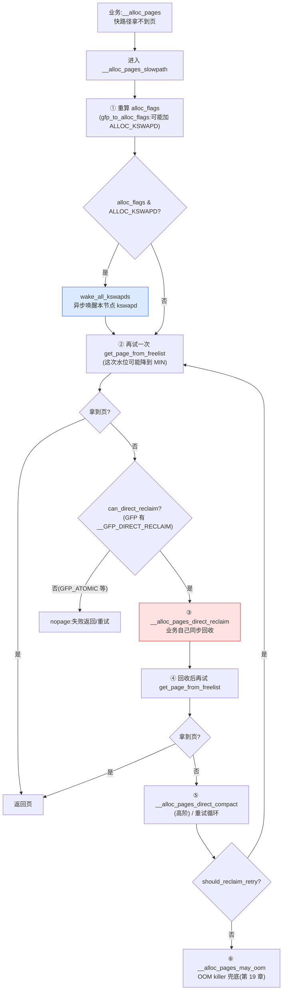

# 第十六章 · watermark 与 kswapd

> 篇:第 5 篇 · 回收与规整:紧张时收回来
> 主线呼应:前四篇我们把内存"分出去"这条路走完了——buddy 按页分、slab 在页上切对象、mmap 建用户虚拟映射、缺页把承诺兑现成物理页。但物理内存是有限的稀缺资源,总有"分多了、塞不下"的时候。从本章起,我们切到二分法的另一面——**回收路径**:内核怎么把已经分出去的页、按需再收回来。本章是这个回收链的**第一环**:内核怎么知道"该收了"(watermark 水位),又由谁来收(kswapd 后台线程)。你会看到,回收的核心难点不是"怎么把页换出去",而是"**在业务撞墙之前、悄悄地把活干了**"——这是 Linux mm 长期稳定的关键设计。

## 核心问题

**每个 zone 的"水位"(high/low/min)是什么,怎么算出来?kswapd 这个后台内核线程为什么在 free 降到 low 时就开始回收、而不是等到内存真满了?这套机制怎么避免业务进程在 `malloc` 里撞上"直接回收(direct reclaim)"的卡顿抖动?**

读完本章你会明白:

1. **zone 三档水位 high/low/min** 的语义与数值来源:从 `min_free_kbytes` 算出来,`watermark_scale_factor` 控制档距。
2. **kswapd 的启停条件**(降到 low 唤醒、升回 high 睡眠)与 `balance_pgdat` 回收循环;为什么用"滞回"(hysteresis)而不是"满才收、空才停"。
3. **分配路径 `__alloc_pages_slowpath` 怎么按水位决定走快/慢、唤醒 kswapd、甚至直接回收**——第 4 章留下的"水位"伏笔在这里收口。
4. **`min_free_kbytes` / `watermark_scale_factor`** 这两个 sysctl 怎么调水位,`min` 为什么是"硬预留"。
5. 为什么"**后台预回收**"比"满了才回收"好——这是 Linux mm 对抗 direct reclaim 抖动的核心一招。

> **逃生阀**:本章默认你读过第 4 章(P1-04 `__alloc_pages` 快慢路径,知道 `ALLOC_WMARK_LOW`、`wmark_pages` 宏)和第 2 章(P1-02 zone 的结构)。如果你对"为什么 free 区不够了要回收"这件事本身还模糊,就回到第 1 章 1.4 节"mm 的三件事"看一眼那句"回收:紧张时把内存收回来"再回来。

---

## 16.1 一句话点破

> **watermark 是 zone 上三道刻度线——free 在 high 以上无忧无虑,降到 low 就唤醒 kswapd 后台偷偷回收,升回 high 它才睡;真要跌破 min,业务分配才会被迫自己下场同步回收(direct reclaim)。kswapd 把"回收"这件重活挪到业务不感知的后台,让 free 在业务眼里永远"差不多够"——这就是 Linux mm 长期以来越用越稳的预回收哲学。**

这是结论,不是理由。本章倒过来拆:先讲为什么不"满了才收"会撞墙(direct reclaim 抖动);再立水位三档的语义和来源;然后看 kswapd 这个线程的启停与回收主循环;最后回到分配路径,看 `__alloc_pages_slowpath` 怎么和 kswapd 协作。

---

## 16.2 撞墙:满了才回收,业务会在 malloc 里卡几十毫秒

### 朴素方案会怎样

如果让你设计一个内存回收机制,最朴素的版本是什么?大概是:**"buddy 的 free_area 空了,分配拿不到页,才同步回收。"**——分配路径里,`get_page_from_freelist` 取不到页,就当场扫 LRU、把不活跃页换出去、再回来分配。

听起来直接,但有一个致命问题:**回收是重活**。一次回收要扫 LRU、判断页能不能丢、可能要回写脏页(writeback)、可能要 swap out(磁盘 IO)。这些都是**毫秒到几十毫秒级**的操作,而正常的分配路径是**微秒级**的。把回收塞进分配路径,意味着:某个进程 `malloc` 一页,本来几微秒的事,瞬间变成几十毫秒——它被同步回收拖住了。这就是著名的 **direct reclaim 抖动**。

> **不这样会怎样**:早期内核(以及很多朴素的内存系统)确实就是这么做的——内存满了才同步回收。后果是系统在内存压力下出现**周期性的延迟尖刺**:平时响应飞快,一旦内存吃紧,任何一次 `malloc` 都可能被卡住。对延迟敏感的应用(数据库、网络服务)这是灾难。你能观察到的典型症状:`top` 里 `wa`(IO wait)周期性飙高,进程的 `maj_flt`(major fault)陡增,`/proc/<pid>/stat` 的运行时间被大段卡在 `D`(uninterruptible sleep,等 IO)状态。这在 mm 圈里有个专门的词:**direct reclaim latency spike**。

### kswapd 的核心想法:把回收挪到后台

Linux 的解法极其朴素但有效:**别等业务撞墙,提前在后台偷偷收**。

具体来说,内核给每个 NUMA node 起一个内核线程,叫 **kswapd**(per-node,比如 `kswapd0`、`kswapd1`)。它平时在睡眠,**free 内存降到某条线(low watermark)时被唤醒**,自己慢慢扫 LRU 回收,直到 free 升回另一条更高的线(high watermark)才重新睡去。业务进程分配内存的时候,只要 free 还在 high 以上,就**完全感知不到**任何回收——kswapd 把这件重活"挪到了后台"。

> **钉死这件事**:kswapd 的本质,是把"回收"这件**重活、慢活**,从分配的**关键路径**上摘下来,挪到一个**和业务并行**的后台线程上。业务分配路径负责"快"(只查水位、拿页),kswapd 负责"稳"(慢慢扫 LRU、维持 free 在水位之上)。这是 mm"**快慢分工**"在回收路径的样板——和第 4 章 buddy 的快慢路径同源。**没有 kswapd 的系统,每次内存紧张都是一次全员卡顿**。

但"降到 low 才收、升到 high 才睡"——这两条线怎么定?这就是 watermark。

---

## 16.3 watermark:zone 的三道刻度线

### 三档水位的语义

每个 zone(物理内存按 DMA/Normal/Movable 分区,第 2 章)都维护三档水位,放在 [`struct zone`](../linux/include/linux/mmzone.h#L822) 的 [`_watermark[NR_WMARK]`](../linux/include/linux/mmzone.h#L826) 数组里。档位由 [`enum zone_watermarks`](../linux/include/linux/mmzone.h#L645) 定义:

```c
// include/linux/mmzone.h#L645-L651
enum zone_watermarks {
    WMARK_MIN,       // 0:最小预留,低于此为极度紧张
    WMARK_LOW,       // 1:kswapd 被唤醒的阈值
    WMARK_HIGH,      // 2:kswapd 回收达到此线就睡
    WMARK_PROMO,     // 3:NUMA tiering 促销用,本章不展开
    NR_WMARK
};
```

三档的语义,用一张图钉死:

```
              free 充裕
                  │
                  ▼            ← free 在这之上:业务无感,buddy 直接给页
   ─────────  high_wmark ─────────  (kswapd 回收到此停,睡觉)
                  │
                  │   ← kswapd 正在后台回收
                  ▼
   ─────────  low_wmark  ─────────  (free 跌破此线:wakeup_kswapd)
                  │
                  │   ← kswapd 在拼命收;业务可能开始紧张
                  ▼
   ─────────  min_wmark  ─────────  (硬预留线,低于此为极度紧张)
                  │
                  │   ← 只有 GFP_ATOMIC / PF_MEMALLOC 才能动用 reserve
                  ▼
                 0
```

三档的分工:

| 档位 | 语义 | 谁来用 |
|------|------|--------|
| **high** | kswapd 的**目标线**——回收到此就睡 | kswapd: `prepare_kswapd_sleep` 用它判断能不能睡 |
| **low** | kswapd 的**唤醒线**——free 降到此以下就唤醒 | 分配路径:`wake_all_kswapds` / `wakeup_kswapd` |
| **min** | **硬预留**——只有 `PF_MEMALLOC`/`GFP_ATOMIC` 才能动用 reserve | `__zone_watermark_ok` 里 `ALLOC_HARDER`/`ALLOC_OOM` 才放行 |

注意一个微妙点:**快路径分配默认用 `ALLOC_WMARK_LOW`**(第 4 章讲过,[page_alloc.c:4543](../linux/mm/page_alloc.c#L4543)),意思是"free 必须高于 low 才能直接给页"。这条线既是分配的门限,也是 kswapd 的唤醒线——两者用同一条 low,恰好做到"分配还没撞墙(low),kswapd 已经在后台收了"。

### 访问水位的宏:`min_wmark_pages` 等

直接读 `zone->_watermark[WMARK_*]` 的人很少,内核提供了一组宏统一访问,加上了 `watermark_boost`(后面讲):

```c
// include/linux/mmzone.h#L667-L670
#define min_wmark_pages(z)  (z->_watermark[WMARK_MIN]  + z->watermark_boost)
#define low_wmark_pages(z)  (z->_watermark[WMARK_LOW]  + z->watermark_boost)
#define high_wmark_pages(z) (z->_watermark[WMARK_HIGH] + z->watermark_boost)
#define wmark_pages(z, i)   (z->_watermark[i]          + z->watermark_boost)
```

`wmark_pages(z, i)` 是最通用的——它把"档位"当成下标直接查数组,所以 [`get_page_from_freelist`](../linux/mm/page_alloc.c#L3176) 里那句 `mark = wmark_pages(zone, alloc_flags & ALLOC_WMARK_MASK)` 才能直接用 `alloc_flags` 的低位当数组下标(第 4 章 4.4 节讲过这个 elegant 设计:`ALLOC_WMARK_*` 直接复用 `WMARK_*` 的数值)。

### 水位怎么算出来:`min_free_kbytes` 与 `__setup_per_zone_wmarks`

水位不是硬编码,是从一个全局量 [`min_free_kbytes`](../linux/mm/page_alloc.c#L289)([page_alloc.c:289](../linux/mm/page_alloc.c#L289))推出来的。这个量本身,由 [`calculate_min_free_kbytes`](../linux/mm/page_alloc.c#L5956) 在启动时算:

```c
// mm/page_alloc.c#L5956-L5970 (简化)
void calculate_min_free_kbytes(void)
{
    unsigned long lowmem_kbytes;
    int new_min_free_kbytes;

    lowmem_kbytes = nr_free_buffer_pages() * (PAGE_SIZE >> 10);
    new_min_free_kbytes = int_sqrt(lowmem_kbytes * 16);

    if (new_min_free_kbytes > user_min_free_kbytes)
        min_free_kbytes = clamp(new_min_free_kbytes, 128, 262144);
    ...
}
```

公式是 **`min_free_kbytes = sqrt(lowmem_kbytes * 16) = 4 * sqrt(lowmem_kbytes)`**(其中 `lowmem_kbytes` 是 DMA+Normal 的 managed pages 总和,大约就是低区内存量)。直觉上:min 随物理内存**平方根**增长——内存越大,预留的绝对量越大,但**比例**越小(因为平方根增长慢于线性)。比如 16GB 的机器,min_free_kbytes 大约几万 KB;256GB 的机器可能十几万 KB,但比例上微乎其微。`clamp(..., 128, 262144)` 把它夹在 [128KB, 256MB] 之间,防止极端值。

> **钉死这件事**:`min_free_kbytes` 不是拍脑袋的常数,是按 `4 * sqrt(lowmem)` 算的——平方根关系反映了"预留量随内存增长,但增长慢于内存本身"的工程权衡。你可以在 `/proc/sys/vm/min_free_kbytes` 看到当前值,也可以写它来手动调(`user_min_free_kbytes` 一旦写过就覆盖自动计算)。

然后, [`__setup_per_zone_wmarks`](../linux/mm/page_alloc.c#L5845)([page_alloc.c:5845](../linux/mm/page_alloc.c#L5845))把 `min_free_kbytes` 分摊到每个 zone,并推出 low/high:

```c
// mm/page_alloc.c#L5845-L5906 (简化,保留主干)
static void __setup_per_zone_wmarks(void)
{
    unsigned long pages_min = min_free_kbytes >> (PAGE_SHIFT - 10);
    unsigned long lowmem_pages = 0;
    struct zone *zone;

    /* 1) 算低区(DMA+Normal)的总 managed pages */
    for_each_zone(zone) {
        if (!is_highmem(zone) && zone_idx(zone) != ZONE_MOVABLE)
            lowmem_pages += zone_managed_pages(zone);
    }

    for_each_zone(zone) {
        u64 tmp;

        /* 2) min 按 zone 大小比例分摊:大 zone 拿大头 */
        tmp = (u64)pages_min * zone_managed_pages(zone);
        tmp = div64_ul(tmp, lowmem_pages);

        if (is_highmem(zone) || zone_idx(zone) == ZONE_MOVABLE) {
            /* 高端区/可移动区:min 封顶(clamp(SWAP_CLUSTER_MAX, 128))*/
            zone->_watermark[WMARK_MIN] = clamp(
                zone_managed_pages(zone) / 1024,
                SWAP_CLUSTER_MAX, 128UL);
        } else {
            zone->_watermark[WMARK_MIN] = tmp;     /* 低区按比例 */
        }

        /* 3) low/high 在 min 基础上外扩 tmp,取 max(tmp/4, managed * scale/10000) */
        tmp = max_t(u64, tmp >> 2,
                    mult_frac(zone_managed_pages(zone),
                              watermark_scale_factor, 10000));

        zone->watermark_boost = 0;
        zone->_watermark[WMARK_LOW]  = min_wmark_pages(zone) + tmp;
        zone->_watermark[WMARK_HIGH] = low_wmark_pages(zone) + tmp;
        zone->_watermark[WMARK_PROMO] = high_wmark_pages(zone) + tmp;
    }
    calculate_totalreserve_pages();
}
```

这段代码看似复杂,核心三步:

1. **min 按比例分摊**:`pages_min`(从 `min_free_kbytes` 换算的页数)× `zone_managed_pages(zone)` / `lowmem_pages`——大 zone 拿大头,小 zone 拿小头。
2. **min 对高端区(MOVABLE/HIGHMEM)封顶**:因为 `__GFP_HIGH`/`PF_MEMALLOC` 通常不需要这些区的页,所以给它们一个小的固定值(`clamp(size/1024, 32, 128)`)。
3. **low/high 在 min 基础上各加一个 `tmp`**:`tmp = max(min/4, managed * watermark_scale_factor / 10000)`。也就是说,**low = min + Δ,high = min + 2Δ**(high = low + Δ,因为代码里 `low_wmark_pages(zone)` 已经含 min + Δ)。这个 Δ 就是档距,它决定 kswapd 一旦被唤醒要收多少才能睡。

### `watermark_scale_factor`:档距的"用户旋钮"

档距 Δ 的公式里有两项取 max:

- **`tmp >> 2`**(min 的 1/4):这是"自适应档距"——min 越大,档距越大。
- **`managed * watermark_scale_factor / 10000`**:这是用户可调的旋钮,默认 [`watermark_scale_factor = 10`](../linux/mm/page_alloc.c#L292)(即千分之一)。一个 16GB 的 zone,`managed = 4M 页`,`4M * 10 / 10000 = 4096 页 = 16MB`,这就是默认档距。

调大 `watermark_scale_factor`(0~1000,最大相当于 10%),low/high 都往上抬,kswapd 启动更早、回收更狠。这对延迟敏感场景有用——比如数据库服务器会把它调到 100 甚至更高,让 kswapd 更早开始干活,业务基本不会撞 direct reclaim。

> **不这样会怎样**:如果档距只能写死一个固定值(比如固定 16MB),那 16GB 机器和 256GB 机器用同一档距显然不合理——大机器档距太小,kswapd 一启动很快就睡,反复抖动;小机器档距太大,kswapd 一收就过量,浪费 IO。`max(min/4, managed * scale/10000)` 这个公式让档距**随 zone 大小自适应**(`managed * scale`)+ **用户可调**(`scale_factor`),两头兼顾。这就是 mm 里"既自适应又可调"的典型设计。

---

## 16.4 kswapd:per-node 的后台回收线程

### 它是怎么诞生的:`kswapd_run`

每个 NUMA node 在初始化时,由 [`kswapd_run`](../linux/mm/vmscan.c#L7269)([vmscan.c:7269](../linux/mm/vmscan.c#L7269))起一个内核线程:

```c
// mm/vmscan.c#L7269-L7286 (简化)
void __meminit kswapd_run(int nid)
{
    pg_data_t *pgdat = NODE_DATA(nid);

    pgdat_kswapd_lock(pgdat);
    if (!pgdat->kswapd) {
        pgdat->kswapd = kthread_run(kswapd, pgdat, "kswapd%d", nid);
        ...
    }
    pgdat_kswapd_unlock(pgdat);
}
```

`kthread_run(kswapd, pgdat, "kswapd%d", nid)` 创建一个名为 `kswapd0`/`kswapd1`/... 的内核线程,主函数是 `kswapd`,参数是这个 node 的 `pgdat`。所以你 `ps aux | grep kswapd` 能看到每节点一个——它们是**per-node**,各管各的内存。

`pgdat` 里和 kswapd 相关的字段([`include/linux/mmzone.h#L1317-L1333`](../linux/include/linux/mmzone.h#L1317)):

| 字段 | 作用 |
|------|------|
| `wait_queue_head_t kswapd_wait` | **kswapd 的等待队列**——kswapd 在这上面睡,`wakeup_kswapd` 唤醒它 |
| `struct task_struct *kswapd` | kswapd 线程的 task_struct 指针 |
| `int kswapd_order` | 唤醒请求的 order(0 是普通回收,> 0 是为高阶分配回收) |
| `enum zone_type kswapd_highest_zoneidx` | 唤醒时允许回收到哪个 zone |
| `int kswapd_failures` | 连续"回收 0 页"的次数,超过阈值就不唤醒了(节点被认为 hopeless) |

### kswapd 主循环:`for(;;) { sleep; wake; balance_pgdat; }`

[`kswapd`](../linux/mm/vmscan.c#L7097)([vmscan.c:7097](../linux/mm/vmscan.c#L7097))的主循环结构极其简洁,是一个典型的"睡眠-工作-睡眠"内核线程:

```c
// mm/vmscan.c#L7097-L7173 (简化)
static int kswapd(void *p)
{
    unsigned int alloc_order, reclaim_order;
    pg_data_t *pgdat = (pg_data_t *)p;
    struct task_struct *tsk = current;

    ...
    /* 关键:kswapd 自带 PF_MEMALLOC 标志——回收时自己分配不会被卡 */
    tsk->flags |= PF_MEMALLOC | PF_KSWAPD;
    set_freezable();

    for ( ; ; ) {
        bool was_frozen;

        alloc_order = reclaim_order = READ_ONCE(pgdat->kswapd_order);
        highest_zoneidx = kswapd_highest_zoneidx(pgdat, highest_zoneidx);

kswapd_try_sleep:
        /* 1) 尝试睡觉:检查水位是否满足,满足就睡 */
        kswapd_try_to_sleep(pgdat, alloc_order, reclaim_order, highest_zoneidx);

        /* 醒来后读最新的 order/zoneidx */
        alloc_order = READ_ONCE(pgdat->kswapd_order);
        WRITE_ONCE(pgdat->kswapd_order, 0);
        ...

        if (kthread_freezable_should_stop(&was_frozen))
            break;
        if (was_frozen)
            continue;

        /* 2) 醒来:干活——balance_pgdat 回收 */
        trace_mm_vmscan_kswapd_wake(pgdat->node_id, highest_zoneidx, alloc_order);
        reclaim_order = balance_pgdat(pgdat, alloc_order, highest_zoneidx);

        /* 如果是为高阶分配但 balance_pgdat 只收了 order-0,重睡让 kcompactd 干 */
        if (reclaim_order < alloc_order)
            goto kswapd_try_sleep;
    }
    return 0;
}
```

整个生命周期就两件事在循环:**睡 → 干**。`kswapd_try_to_sleep` 负责睡(检查水位,够了就 schedule 出去);被唤醒后调 `balance_pgdat` 干活(扫 LRU 回收),干完回到睡。两个细节值得注意:

1. **`PF_MEMALLOC`**:kswapd 自己也分配内存(比如给要换出的页准备 swap entry),如果它的分配又触发回收,会无限递归。`PF_MEMALLOC` 标志让它的分配走 `ALLOC_NO_WATERMARKS`(无视水位、动用 reserve),保护它不被自己卡住——注释里那句 "kswapd should never get caught in the normal page freeing logic" 就是这个意思。
2. **`reclaim_order < alloc_order` 的处理**:如果某次唤醒是请求 order-2(4 页连续)但 balance_pgdat 发现只能收回 order-0(碎片化),它会重睡,并依赖 **kcompactd**(下章讲)去做规整。kswapd 管回收,kcompactd 管规整,分工明确。

### `kswapd_try_to_sleep`:睡觉前的双重检查

[`kswapd_try_to_sleep`](../linux/mm/vmscan.c#L7000)([vmscan.c:7000](../linux/mm/vmscan.c#L7000))有个有意思的设计——**先小睡一会(HZ/10 = 100ms),再彻底睡**:

```c
// mm/vmscan.c#L7000-L7082 (简化)
static void kswapd_try_to_sleep(pg_data_t *pgdat, int alloc_order,
                                int reclaim_order, unsigned int highest_zoneidx)
{
    long remaining = 0;
    DEFINE_WAIT(wait);

    if (freezing(current) || kthread_should_stop())
        return;

    prepare_to_wait(&pgdat->kswapd_wait, &wait, TASK_INTERRUPTIBLE);

    /* 第一次检查:水位够了吗? */
    if (prepare_kswapd_sleep(pgdat, reclaim_order, highest_zoneidx)) {
        reset_isolation_suitable(pgdat);
        wakeup_kcompactd(pgdat, alloc_order, highest_zoneidx);

        /* 小睡 100ms:给系统一个"喘息窗口" */
        remaining = schedule_timeout(HZ/10);

        /* 如果中途被唤醒(remaining > 0),更新 order/zoneidx 后重新排队 */
        if (remaining) {
            WRITE_ONCE(pgdat->kswapd_highest_zoneidx, ...);
            ...
        }
        finish_wait(&pgdat->kswapd_wait, &wait);
        prepare_to_wait(&pgdat->kswapd_wait, &wait, TASK_INTERRUPTIBLE);
    }

    /* 第二次检查:小睡后水位还够吗?够才真睡 */
    if (!remaining && prepare_kswapd_sleep(pgdat, reclaim_order, highest_zoneidx)) {
        trace_mm_vmscan_kswapd_sleep(pgdat->node_id);

        /* 把 vmstat 阈值调回"正常档"——kswapd 醒着时用的是"压力档"(更激进) */
        set_pgdat_percpu_threshold(pgdat, calculate_normal_threshold);

        if (!kthread_should_stop())
            schedule();   /* 真正睡死,等 wakeup_kswapd */

        set_pgdat_percpu_threshold(pgdat, calculate_pressure_threshold);
    } else {
        /* 没睡成(水位又不够了):计数 */
        if (remaining)
            count_vm_event(KSWAPD_LOW_WMARK_HIT_QUICKLY);
        else
            count_vm_event(KSWAPD_HIGH_WMARK_HIT_QUICKLY);
    }
    finish_wait(&pgdat->kswapd_wait, &wait);
}
```

这里有两处反直觉的精妙:

**① 为什么"小睡 100ms 再真睡",而不是检查通过就直接睡死?** 因为水位检查和真正 schedule 之间有 race——`prepare_kswapd_sleep` 看到 free 在 high 之上,但如果刚睡下去系统又有大量分配,free 立刻跌破 low,kswapd 就白睡了。**100ms 小睡**给系统一个缓冲窗口:如果这 100ms 内没被唤醒(remaining == 0),说明水位稳住了,才真睡;中途被唤醒(remaining > 0)说明又有压力,直接重排队干第二轮。这是一种"**sleep hysteresis**"(睡眠滞回)——避免 kswapd 在水位边缘反复"睡-醒-睡-醒"抖动。

**② `set_pgdat_percpu_threshold` 是什么?** 这是 vmstat 计数器的 per-cpu 阈值。`/proc/meminfo` 里那些 `NR_FREE_PAGES` 等统计,为了性能是 per-cpu 累加的,只有累加超过阈值才同步到全局。**kswapd 醒着时,用更小的阈值(`calculate_pressure_threshold`,更频繁同步),让水位判断更准;kswapd 睡着时,恢复正常阈值(`calculate_normal_threshold`,省 cache)**。注释里的原话:"vmstat counters are not perfectly accurate...we reduce the per-cpu vmstat threshold while kswapd is awake and restore them before going back to sleep." 这是性能 vs 精度的动态权衡——kswapd 醒着时需要精确判断水位,睡着时为了省 CPU 用粗粒度。

### `prepare_kswapd_sleep`:睡前的核心裁决

[`prepare_kswapd_sleep`](../linux/mm/vmscan.c#L6645)([vmscan.c:6645](../linux/mm/vmscan.c#L6645))判断"现在能不能睡",核心是 [`pgdat_balanced`](../linux/mm/vmscan.c#L6593):

```c
// mm/vmscan.c#L6593-L6626 (简化)
static bool pgdat_balanced(pg_data_t *pgdat, int order, int highest_zoneidx)
{
    struct zone *zone;
    unsigned long mark = -1;

    /* 自底向上扫 zone(低 zone 更可能达标) */
    for (i = 0; i <= highest_zoneidx; i++) {
        zone = pgdat->node_zones + i;
        if (!managed_zone(zone))
            continue;

        mark = high_wmark_pages(zone);   /* ★ 用 high 判断 */
        if (zone_watermark_ok_safe(zone, order, mark, highest_zoneidx))
            return true;                  /* 任何一个 zone 达 high 就算 balanced */
    }
    if (mark == -1) return true;          /* 没有可管理 zone */
    return false;
}
```

注意这里用的是 **`high_wmark_pages`**——也就是说,kswapd 要睡,必须至少有一个 zone 的 free 达到 high(目标线)。这就是 kswapd 的"**滞回**":唤醒用 low,睡眠用 high,两者之间的区间是 kswapd 的"工作区"。这个设计极其重要,下面专门讲。

---

## 16.5 滞回:low 唤醒、high 睡眠,为什么不是同一条线

### 一条线会怎样:抖动(thrashing)

如果 kswapd 用同一条线唤醒和睡眠——比如"跌破 low 唤醒,升回 low 就睡"——会发生什么?

假设系统内存压力刚好在 low 附近波动:free 一会低于 low(唤醒 kswapd),kswapd 收几页,free 略微高于 low(立刻睡);紧接着业务又分配几页,free 又跌破 low(再唤醒)……kswapd 就会在 low 线附近**高频抖动**:每秒被唤醒睡去几十次,而每次只收几页。这种 **thrashing**(抖动)极其浪费 CPU——唤醒一个内核线程本身就要 context switch、cache miss,频繁做就是性能损耗。而且每次回收一小批,LRU 扫描的 overhead 巨大(扫一页要拿 lru_lock、判断活性)。

> **不这样会怎样**:如果用同一条线,内存压力在水位附近波动时,kswapd 会陷入"高频睡-醒"的抖动。在临界负载下(系统内存使用刚好压在 low),你能在 `/proc/<kswapd_pid>/stat` 看到它被调度成千上万次/秒,而 `/proc/vmstat` 里 `pgsteal_kswapd` 增量却很小——典型的"忙而无功"。这就是为什么内核显式区分了 **wake line**(low)和 **sleep line**(high)。

### 两线之间是工作区:hysteresis

正确的做法是**滞回**(hysteresis):**跌破 low 唤醒,升回 high 才睡**。这样 low 和 high 之间形成一个 Δ 的"工作区":

```
   free
    │
    │        kswapd 工作区(在 low~high 之间一直收)
    │   ◄──────────────────────────────►
    │
   high ─────────────────  (睡)
    │   ▲                    │
    │   │ 收到 high 才睡     │ 一跌破 low 就醒
    │   │                    ▼
   low  ─────────────────  (醒)
    │
    │   业务分配(快路径只要 free > low 就无感)
    ▼
```

kswapd 一旦被唤醒,会一直收到 **free 升回 high** 才睡——这意味着每次唤醒它都会"多收一点",形成一个完整的回收批量,而不是收一页就睡。这把零散的回收合并成批量,效率高得多。

> **钉死这件事**:low 和 high 的差(Δ,即档距)就是 kswapd 一次唤醒要回收的目标量。这个 Δ 由 `__setup_per_zone_wmarks` 算,默认 = `max(min/4, managed * watermark_scale_factor / 10000)`。调大 `watermark_scale_factor` 让 Δ 更大,kswapd 每次收更多、睡更久,业务更无感——但代价是 free 长期更高("浪费"更多内存给预留)。这是"**业务延迟 vs 内存利用率**"的权衡。

这套滞回和硬件里"施密特触发器"(Schmitt trigger)的滞回设计是同源的——任何"阈值附近抖动"的场景,工程上都是用两线滞回来解。kswapd 是这套思想在内核 mm 的典范应用。

---

## 16.6 `balance_pgdat`:kswapd 的回收主循环

被唤醒后,kswapd 调 [`balance_pgdat`](../linux/mm/vmscan.c#L6764)([vmscan.c:6764](../linux/mm/vmscan.c#L6764))干真正的回收活。它的结构:

```c
// mm/vmscan.c#L6764-L6945 (大幅简化,保留主干)
static int balance_pgdat(pg_data_t *pgdat, int order, int highest_zoneidx)
{
    struct scan_control sc = {
        .gfp_mask = GFP_KERNEL,
        .order = order,
        .may_unmap = 1,
    };
    ...
    /* 处理 watermark_boost(用户/系统临时加成的回收量)*/
    nr_boost_reclaim = 0;
    for (i = 0; i <= highest_zoneidx; i++) {
        zone = pgdat->node_zones + i;
        if (!managed_zone(zone)) continue;
        nr_boost_reclaim += zone->watermark_boost;
    }
    boosted = nr_boost_reclaim;

restart:
    set_reclaim_active(pgdat, highest_zoneidx);
    sc.priority = DEF_PRIORITY;        /* 从最低压力开始扫(priority 越小越激进)*/

    do {
        bool balanced;

        /* ① 判断:已经 balanced 了吗?(至少一个 zone 达 high) */
        balanced = pgdat_balanced(pgdat, sc.order, highest_zoneidx);
        if (!balanced && nr_boost_reclaim) { nr_boost_reclaim = 0; goto restart; }
        if (!nr_boost_reclaim && balanced) goto out;

        /* ② 后台 aging:给页面机会被 reference,避免误杀 */
        kswapd_age_node(pgdat, &sc);

        /* ③ memcg soft limit 回收 */
        nr_soft_reclaimed = mem_cgroup_soft_limit_reclaim(...);
        sc.nr_reclaimed += nr_soft_reclaimed;

        /* ④ 真正回收:kswapd_shrink_node → shrink_node → shrink_lruvec */
        if (kswapd_shrink_node(pgdat, &sc))
            raise_priority = false;

        /* ⑤ 唤醒 pfmemalloc_wait 上等待的进程(允许它们继续分配)*/
        if (waitqueue_active(&pgdat->pfmemalloc_wait) && allow_direct_reclaim(pgdat))
            wake_up_all(&pgdat->pfmemalloc_wait);

        /* ⑥ 提高 priority(更激进扫描)继续,直到 balanced 或 priority 耗尽 */
        if (raise_priority || !nr_reclaimed)
            sc.priority--;
    } while (sc.priority >= 1);

    ...
    return sc.order;
}
```

balance_pgdat 的核心是一个 priority 循环(从 `DEF_PRIORITY=12` 降到 1):

- **priority** 是扫描激进度:每轮扫描 `LRU_size >> priority` 页(priority 越小,扫得越多)。开始用 12(只扫 LRU 的 1/4096),收不够就降 priority(扫更多),直到 balanced 或 priority 见底。
- **`kswapd_shrink_node`** 是实际回收入口,它调用 [`shrink_node`](../linux/mm/vmscan.c#L5887) → `shrink_lruvec`(下一章 P5-17 专门拆)。这里 kswapd 只是触发器,**回收哪些页的决策**完全在下一章。
- **`wake_up_all(&pgdat->pfmemalloc_wait)`**:有些业务进程在 direct reclaim 时发现 free 跌破 min,会被 throttle(挂起)在 `pfmemalloc_wait` 上,kswapd 收够后唤醒它们继续。

### `kswapd_shrink_node`:每次至少收多少

[`kswapd_shrink_node`](../linux/mm/vmscan.c#L6684)([vmscan.c:6684](../linux/mm/vmscan.c#L6684))给本次唤醒定个回收目标:

```c
// mm/vmscan.c#L6684-L6717 (简化)
static bool kswapd_shrink_node(pg_data_t *pgdat, struct scan_control *sc)
{
    struct zone *zone;
    int z;

    sc->nr_to_reclaim = 0;
    for (z = 0; z <= sc->reclaim_idx; z++) {
        zone = pgdat->node_zones + z;
        if (!managed_zone(zone)) continue;
        /* 目标:每个 zone 收到 high 以上(至少 SWAP_CLUSTER_MAX=32 页) */
        sc->nr_to_reclaim += max(high_wmark_pages(zone), SWAP_CLUSTER_MAX);
    }

    shrink_node(pgdat, sc);   /* 真正干 */

    /* 高阶回收:如果收回的 >= compact_gap(order),降级到 order-0 避免过度 */
    if (sc->order && sc->nr_reclaimed >= compact_gap(sc->order))
        sc->order = 0;

    return sc->nr_scanned >= sc->nr_to_reclaim;
}
```

回收目标 = `Σ max(high_wmark_pages(zone), 32)`,即把每个 zone 都收到 high 以上(至少收 32 页 = 一个 swap cluster)。这是 kswapd 的"任务量"——没达到这个量,循环不会停。

---

## 16.7 分配路径怎么和 kswapd 协作:慢路径的唤醒与直接回收

前面讲的是 kswapd 自己怎么转。现在回到**业务进程视角**——一次 `malloc` 走到 `__alloc_pages`,快路径拿不到页,慢路径怎么决定是"等 kswapd"还是"自己下场收"?

第 4 章我们看过 [`__alloc_pages_slowpath`](../linux/mm/page_alloc.c#L4046) 的骨架,这里聚焦它和 kswapd 的协作点:



三个关键节点:

### ① `wake_all_kswapds`:异步唤醒

[`wake_all_kswapds`](../linux/mm/page_alloc.c#L3820)([page_alloc.c:3820](../linux/mm/page_alloc.c#L3820))遍历 zonelist 上所有相关 zone,逐个调 [`wakeup_kswapd`](../linux/mm/vmscan.c#L7182):

```c
// mm/page_alloc.c#L3820-L3840 (简化)
static void wake_all_kswapds(unsigned int order, gfp_t gfp_mask,
                             const struct alloc_context *ac)
{
    struct zoneref *z;
    struct zone *zone;
    pg_data_t *last_pgdat = NULL;

    for_each_zone_zonelist_nodemask(zone, z, ac->zonelist,
                                    ac->highest_zoneidx, ac->nodemask) {
        if (!managed_zone(zone)) continue;
        if (last_pgdat != zone->zone_pgdat) {
            wakeup_kswapd(zone, gfp_mask, order, ac->highest_zoneidx);
            last_pgdat = zone->zone_pgdat;
        }
    }
}
```

注意 **`last_pgdat != zone->zone_pgdat`** 这个判断——同一个 node 只唤醒一次 kswapd(哪怕该 node 有多个 zone 触发)。`wakeup_kswapd` 本身([vmscan.c:7182](../linux/mm/vmscan.c#L7182))做几件事:更新 `kswapd_order`/`kswapd_highest_zoneidx`(记录请求)、检查 hopelessness(`kswapd_failures` 或 `pgdat_balanced`)、最后 `wake_up_interruptible(&pgdat->kswapd_wait)`。

**关键:这是异步的**。`wake_up_interruptible` 把 kswapd 加入运行队列后立刻返回,**业务进程不等 kswapd 干完活**。业务接着往下走,可能再试一次分配(这次成功),也可能走到 direct reclaim。

### ② 再试一次:`get_page_from_freelist`

唤醒 kswapd 后,慢路径会再用更激进的 alloc_flags 试一次快路径([page_alloc.c:4108](../linux/mm/page_alloc.c#L4108))。**为什么?** 因为 kswapd 虽然还没干活(它只是被加入了运行队列,真正运行要等调度器调度它),但慢路径重算了 alloc_flags——可能从 `ALLOC_WMARK_LOW` 降到 `ALLOC_WMARK_MIN`(允许动用更多 reserve)、或者 `ALLOC_HARDER`/`ALLOC_OOM` 放宽限制。这次试分配可能就成功了,**完全不用走 direct reclaim**。

### ③ `__alloc_pages_direct_reclaim`:业务自己下场

如果上面都不行,业务进程只能自己下场同步回收——[`__alloc_pages_direct_reclaim`](../linux/mm/page_alloc.c#L3786)([page_alloc.c:3786](../linux/mm/page_alloc.c#L3786)):

```c
// mm/page_alloc.c#L3786-L3818 (简化)
static inline struct page *
__alloc_pages_direct_reclaim(gfp_t gfp_mask, unsigned int order,
        unsigned int alloc_flags, const struct alloc_context *ac,
        unsigned long *did_some_progress)
{
    struct page *page = NULL;
    bool drained = false;

    psi_memstall_enter(&pflags);                         /* 标记进入 memstall(给 PSI 用)*/
    *did_some_progress = __perform_reclaim(gfp_mask, order, ac);
    if (unlikely(!(*did_some_progress)))
        goto out;

retry:
    page = get_page_from_freelist(gfp_mask, order, alloc_flags, ac);

    /* 如果回收后还是拿不到,可能是 per-cpu pageset 缓住了页,drain 一下再试 */
    if (!page && !drained) {
        unreserve_highatomic_pageblock(ac, false);
        drain_all_pages(NULL);
        drained = true;
        goto retry;
    }
out:
    psi_memstall_leave(&pflags);
    return page;
}
```

[`__perform_reclaim`](../linux/mm/page_alloc.c#L3761)([page_alloc.c:3761](../linux/mm/page_alloc.c#L3761))调 `try_to_free_pages`,这才是真正的 direct reclaim——**业务进程自己陷入回收循环**(扫 LRU、写回、swap)。这一步是**阻塞**的:业务进程在 `__alloc_pages` 里睡几十毫秒,等回收完才能继续。这就是本章开头说的 direct reclaim 抖动,kswapd 的存在感正在于——**让大多数分配走不到这一步**。

> **钉死这件事**:direct reclaim 是兜底,不是常规手段。设计良好的系统在稳态下,kswapd 应该跟得上业务分配速度,业务几乎不进 direct reclaim。你能用 `/proc/vmstat` 里的 `pgsteal_kswapd`(kswapd 回收)vs `pgsteal_direct`(direct reclaim)对比——前者应远多于后者。如果 direct reclaim 频繁,说明 `watermark_scale_factor` 太小(kswapd 启动太晚)或工作集真的大到 swap 都换不过来(考虑加内存或调 swappiness)。

---

## 16.8 `watermark_boost`:动态加成的提前量

前面看到 `min_wmark_pages` 等宏都加了 `zone->watermark_boost`。这个字段是**动态加成**——在常规 low/min 之上临时多预留一些,让 kswapd 收得更早。

它怎么来的?真正加成的地方在 [`boost_watermark`](../linux/mm/page_alloc.c#L1720)([page_alloc.c:1720](../linux/mm/page_alloc.c#L1720)),由 [`__rmqueue_fallback`](../linux/mm/page_alloc.c#L1792)([page_alloc.c:1792](../linux/mm/page_alloc.c#L1792))调用——**当 buddy 不得不"窃取"别的 migrate type 的 pageblock 时**(说明已经碎片化到要跨界分配了)。每次加成 `pageblock_nr_pages`(1024 页 = 4MB),上限是 `_watermark[WMARK_HIGH] * watermark_boost_factor / 10000`(默认 [`watermark_boost_factor = 15000`](../linux/mm/page_alloc.c#L291),即 high 的 1.5 倍)。

> **不这样会怎样**:为什么触发点是 migrate fallback 而不是"direct reclaim 频繁"?因为 fallback 意味着**碎片化**——buddy 找不到本 type 的页,只能跨界偷。这种情况下回收再多也不解决碎片(那是 compaction 的事),但通过 boost 让 kswapd 更早、更狠地收,可以腾出更多空间给后续分配,**减少 fallback 发生**。`balance_pgdat` 开始时把 boost 量累加成 `nr_boost_reclaim`([vmscan.c:6791-6800](../linux/mm/vmscan.c#L6791)),作为本次额外回收任务;回收有进展就逐步扣减([vmscan.c:6919](../linux/mm/vmscan.c#L6919)),boost 在循环结束时清零(每代 kswapd 唤醒后 reset)。`wakeup_kswapd` 里用 [`pgdat_watermark_boosted`](../linux/mm/vmscan.c#L6565) 检查"是否还有未消化的 boost"——有就强制唤醒 kswapd,哪怕 `pgdat_balanced`。

> **不这样会怎样**:如果 watermark 完全是静态的,系统遇到突发分配(比如某进程一次性 mmap 几 GB),kswapd 启动会慢一拍。`watermark_boost` 是个"自适应前馈"——direct reclaim 越多,下次 boost 越大,kswapd 越早启动,形成一个负反馈把系统拉回稳态。这是 mm 里"**自我修复**"设计的典型。

---

## 16.9 技巧精解:三档水位 + kswapd 后台预回收

本章两个最硬核的设计,单独拆透。

### 技巧一:三档水位 + 滞回——把抖动从分配路径搬到 kswapd

#### 它解决什么问题

内存回收是重活(扫 LRU、IO、swap),不能塞进每次分配的关键路径。但又不能"等内存真满了才收"——那业务会集体撞墙。需要一种机制:**在内存快满但还没满的窗口里,提前悄悄收**。

#### 反面对比:朴素的两种撞墙

> **反面对比 A:满了才同步回收(direct reclaim always)**。每次分配拿不到页就当场扫 LRU。后果:业务在 `malloc` 里卡几十毫秒,延迟尖刺。早期内核和很多简单 OS 都这样,在内存压力下用户体验差。
>
> **反面对比 B:用同一条线唤醒/睡眠**。跌破 low 醒、升回 low 睡。后果:kswapd 在 low 附近高频抖动(thrashing),每秒被唤醒成千上万次,每次只收几页,CPU 和 lock 开销巨大。

#### 实现的精妙:三档 + 两线滞回

Linux 的解法是把"水位"分成三档,但只用其中的两档做滞回:

1. **min**:硬预留。低于此为极度紧张,只有 `PF_MEMALLOC`/`GFP_ATOMIC` 才能动用 reserve。`min` 不参与 kswapd 的滞回,它是 OOM 守门员(第 19 章)。
2. **low**:kswapd 的**唤醒线**——free 跌破 low,`wakeup_kswapd` 把 kswapd 加入运行队列。
3. **high**:kswapd 的**睡眠线**——`balance_pgdat` 收到 free 升回 high,`prepare_kswapd_sleep` 返回 true,kswapd schedule 出去。

两个滞回特征:
- **唤醒和睡眠用不同线**(low vs high),Δ = high - low 是工作区,避免抖动。
- **业务分配的快路径用 low**(`ALLOC_WMARK_LOW`):free > low 就直接给页,业务无感。free 跌破 low 时,业务进慢路径——但此时 kswapd 已经被唤醒在后台收了,业务再试一次(`get_page_from_freelist` 用 `ALLOC_WMARK_MIN`)往往就成功,**不必走 direct reclaim**。

这是 mm 里"把抖动从关键路径搬到后台"的典范:抖动不可避免(内存就那么多),但可以决定**谁承担**。kswapd 专门承担抖动,业务路径平滑。

> **钉死这件事**:三档水位的本质是**两条滞回线 + 一条硬预留**。low/high 做 kswapd 的滞回工作区(避免抖动),min 做 OOM 守门员(硬预留)。这套设计把"回收时机"从分配路径里完全剥离出来,让业务路径只关心"free 够不够",而把"什么时候收、收多少"的复杂决策交给 kswapd。回收和分配**解耦**,各走各的——这是 mm 快慢分工的精髓。

### 技巧二:`min_free_kbytes` 与平方根公式

#### 它解决什么问题

`min` 水位是硬预留,它的绝对值怎么定?定小了,内存紧张时 reserve 不够(原子分配失败、栈/中断崩溃);定大了,浪费内存(永久预留几百 MB 给谁都不许用)。

#### 反面对比:固定常数会怎样

> **反面对比**:如果 `min` 是固定常数(比如所有机器都 64MB),那 16GB 机器上 reserve 占 0.4%(合理),但 256GB 机器上只占 0.025%(不够,大机器有更多中断/原子上下文需要 reserve);反过来,128MB 嵌入式设备上 64MB reserve 占一半(荒谬)。固定常数无法适应从 MB 到 TB 跨度的内存规模。

#### 实现的精妙:平方根 + clamp

Linux 用 `min_free_kbytes = 4 * sqrt(lowmem_kbytes)`,即**预留量随物理内存的平方根增长**:

- 平方根增长慢于线性——内存越大,比例越小(16GB 机器 reserve 比例 ~0.2%,256GB ~0.05%),符合"大机器 reserve 比例可以小"的直觉(大机器虽然绝对并发高,但相对总量压力更分散)。
- 但绝对量随内存增长(16GB ~ 几万 KB,256GB ~ 十几万 KB),大机器有更多绝对 reserve 给中断/原子上下文。

`clamp(new_min_free_kbytes, 128, 262144)` 加个 [128KB, 256MB] 的硬边界,防止极端值——嵌入式设备至少 128KB(够基本中断用),巨型机最多 256MB(避免浪费)。

这个公式不是拍脑袋,是长期经验调出来的——mm 圈有个老梗:"如果你不知道 reserve 该多大,就开平方根"。这种"随规模亚线性增长"的预留策略,在很多系统里都通用(比如数据库的 work_mem、网络协议栈的 buffer)。

---

## 章末小结

这一章是第 5 篇(回收)的首章。我们没有讲"回收具体收谁"(那是下一章 LRU + vmscan 的事),而是立起了回收链的第一环——**什么时候开始收**(watermark)、**由谁来收**(kswapd)。

钉死三件事:

1. **zone 三档水位**:min(硬预留/OOM 守门)、low(kswapd 唤醒线)、high(kswapd 睡眠线)。从 `min_free_kbytes`(按 `4*sqrt(lowmem)` 算)推出,`watermark_scale_factor` 控制档距。
2. **kswapd 是 per-node 后台线程**:free 跌破 low 唤醒,收到升回 high 睡。滞回设计避免抖动。
3. **分配路径与 kswapd 协作**:慢路径先 `wake_all_kswapds`(异步),再试一次(可能成功);实在不行业务自己 `__alloc_pages_direct_reclaim`(同步,direct reclaim 抖动来源)。kswapd 把大多数回收挪到后台,业务基本无感。

三个关键技巧:

- **滞回(两线)**:low 唤醒、high 睡眠,中间 Δ 是工作区。避免同线抖动。
- **PF_MEMALLOC**:kswapd 自带此标志,自己的分配走 reserve 不被自己卡住——避免递归。
- **平方根公式 + clamp**:`min_free_kbytes = 4*sqrt(lowmem)`,夹在 [128KB, 256MB]。自适应内存规模。

### 五个"为什么"清单

1. **为什么用 low/high 两线而不是同一条线?** 同线会抖动(thrashing)——内存压力在水位附近波动时,kswapd 高频睡醒、每次只收几页,浪费 CPU。两线之间 Δ 形成"批量回收区",kswapd 每次唤醒收完整一批才睡。
2. **min 水位为什么是"硬预留"?** min 以下是极度紧张,普通分配不允许进入(快路径用 low 检查,慢路径即使降到 min 也只对特定 GFP 放行)。只有 `PF_MEMALLOC`(kswapd 自己、OOM 路径)、`GFP_ATOMIC`(中断等不能睡眠)才能动用 reserve——保护系统在最坏情况下还有内存给关键路径(中断处理、OOM killer 自己)用。
3. **`min_free_kbytes` 为什么按平方根而不是线性?** 平方根让 reserve 比例随内存增大而减小(大机器相对压力分散),但绝对量仍增长(给中断/原子上下文够用的量)。`clamp(..., 128, 262144)` 加硬边界防极端。这是 mm 里"随规模亚线性增长"的典型预留策略。
4. **kswapd 为什么要 `PF_MEMALLOC`?** kswapd 回收时自己也要分配(比如 swap entry、rmap 结构)。如果它的分配又触发回收(进 direct reclaim),会无限递归。`PF_MEMALLOC` 让它走 `ALLOC_NO_WATERMARKS`(动用 reserve),保证它不被自己卡住——注释原话:"kswapd should never get caught in the normal page freeing logic"。
5. **direct reclaim 为什么是坏事?** 业务进程在 `__alloc_pages` 里同步扫 LRU、回写、swap,阻塞几十毫秒。这在延迟敏感场景是灾难。设计良好的系统稳态下 kswapd 应该跟得上,direct reclaim 很少。`/proc/vmstat` 的 `pgsteal_kswapd` 应远多于 `pgsteal_direct`——这是观察 kswapd 健康度的关键指标。

### 想继续深入往哪钻

- **源码**:
  - [`mm/vmscan.c`](../linux/mm/vmscan.c):本章主角。重点读 `kswapd`(L7097)、`kswapd_try_to_sleep`(L7000)、`prepare_kswapd_sleep`(L6645)、`pgdat_balanced`(L6593)、`balance_pgdat`(L6764)、`kswapd_shrink_node`(L6684)、`wakeup_kswapd`(L7182)、`kswapd_run`(L7269)。
  - [`mm/page_alloc.c`](../linux/mm/page_alloc.c):水位计算 `__setup_per_zone_wmarks`(L5845)、`calculate_min_free_kbytes`(L5956)、`init_per_zone_wmark_min`(L5972)、`nr_free_zone_pages`(L4919)、慢路径 `__alloc_pages_slowpath`(L4046)、`wake_all_kswapds`(L3820)、`__perform_reclaim`(L3761)、`__alloc_pages_direct_reclaim`(L3786)。
  - [`include/linux/mmzone.h`](../linux/include/linux/mmzone.h):`enum zone_watermarks`(L645)、`min_wmark_pages` 等宏(L667)、`struct zone._watermark`(L826)、`struct pglist_data.kswapd_wait`(L1317)、`struct pglist_data.kswapd`(L1329)。
- **观测**:
  - `cat /proc/sys/vm/min_free_kbytes`、`cat /proc/sys/vm/watermark_scale_factor`:看当前 min 和档距旋钮。
  - `cat /proc/zoneinfo`:每个 zone 的 `min`/`low`/`high` 实际值,以及当前 `free`、`managed`。比较 free 和 low/high,能直观看到 kswapd 是否该启动。
  - `cat /proc/vmstat | grep -E 'pgsteal_kswapd|pgsteal_direct|pgscan_kswapd|pgscan_direct'`:kswapd vs direct reclaim 的回收/扫描量对比——这是判断 kswapd 健康度的金标准。
  - `ps -eo pid,comm,stat | grep kswapd`:看 kswapd 线程(每 node 一个)。
  - `watch -n 1 'grep -E "kswapd" /proc/vmstat'`:压测时看 kswapd 唤醒频率。
  - `perf stat -e vmscan:* <cmd>`:精确统计 kswapd/direct reclaim 各事件。
  - 想制造压力:用 `stress-ng --vm 4 --vm-bytes 80% --vm-keep` 压满内存,观察 `/proc/zoneinfo` 的 free 变化、`/proc/vmstat` 的 `pgsteal_*`。
- **延伸**:
  - **per-cpu vmstat threshold**:`set_pgdat_percpu_threshold` 那段,kswapd 醒着用"压力档"(更精确),睡着用"正常档"(更省)。这是 per-cpu 计数器精度 vs 性能的动态权衡。
  - **pfmemalloc_wait**:业务进程在 direct reclaim 时如果 free 跌破 min,会被 throttle 在 `pfmemalloc_wait` 上(`throttle_direct_reclaim`)。kswapd 收够后唤醒它们。这是防止 direct reclaim 雪崩的机制。
  - **PSI(Pressure Stall Information)**:`__alloc_pages_direct_reclaim` 里的 `psi_memstall_enter/leave` 给 PSI 提供"内存压力导致停顿"的统计,`/proc/pressure/memory` 能看到。这是现代内核衡量内存压力的关键接口。
  - **watermark_boost 的反馈环**:direct reclaim 触发时 `wakeup_kswapd` 给 boost 加成,下次 kswapd 启动更早——负反馈把系统拉回稳态。
  - **大内存机器的 kswapd**:在 TB 级机器上,单个 kswapd 可能跟不上。社区讨论过 per-node 多 kswapd(类似 per-cpu),但 6.9 仍是 per-node 单线程。

### 引出下一章

本章立起了"**何时回收**"——watermark 给出阈值,kswapd 在阈值触发的窗口里干活。但 kswapd 真正回收时,要回答一个更难的问题:**收谁的页?**

物理内存里塞着各种页:刚分配的匿名页、文件的 page cache、共享库的映射、被 `mlock` 钉死的页……回收不能"随机抽一页扔出去"——扔错了一是丢数据(没回写的脏页)、二是抖动(扔了热页马上又被访问)。内核需要一个**页的"价值"判断**:哪些页该留、哪些页可以扔。

下一章,第 17 章,我们拆这套价值判断——**LRU 双链表(active/inactive × anon/file)**近似"最近最少使用"、**workingset 用 shadow entry 记 refault 估算页价值**、**vmscan 的 `shrink_lruvec` 扫描决策**(`get_scan_count`/swappiness)。你会看到回收的真正难点不在"换出",而在"**判断该换谁**"——这是 mm 启发式设计的精华所在。6.x 默认的 **MGLRU**(多代 LRU)也会一并拆。

> 迷路时回到二分法:本章服务**回收路径**——而且是最前面的"何时开始收"这一环。第 17 章(P5-17)决定"收谁";第 18 章(P5-18)compaction 决定"碎片化怎么办";第 19 章(P5-19)swap/OOM 是最后兜底。整条回收链,从 watermark 的"何时"开始,到 OOM 的"杀进程"结束,层层兜底。
