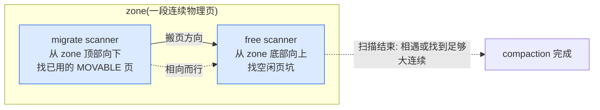
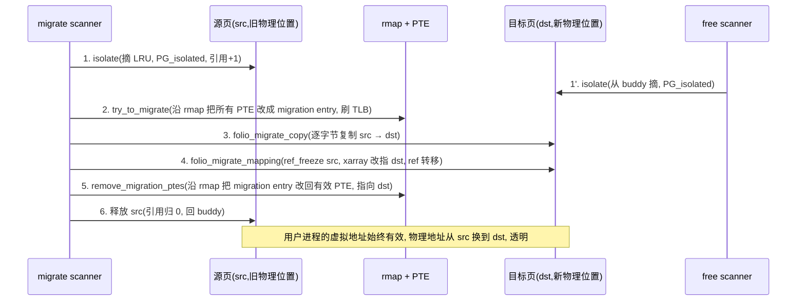

# 第十八章 · compaction 内存规整

> 篇:第 5 篇 · 回收与规整:紧张时收回来(回收侧)
> 主线呼应:P5-16 讲了水位与 kswapd 在低于 low 时后台预回收,P5-17 讲了 LRU/vmscan 怎么挑冷页收回。它们解决的是"**页总数**不够"——释放一些页,空闲计数就涨。但有种困境释放解决不了:**外碎片**。一个 zone 的空闲页总数明明够,可它们东一个西一个,凑不出一块 order>=1 的连续空闲——大页(THP)、高阶分配、`__get_free_pages(GFP_KERNEL, 9)`(2MB)统统拿不到。buddy 看着 `free_area[0]` 一长串单页,就是合不上去(中间夹着在用的页)。compaction 干的就是这件事:把已用的 MOVABLE 页搬走,腾出一整段连续空闲。它和 vmscan 是回收链上的两条腿——vmscan 释放"数量",compaction 释放"连续"。

## 核心问题

**buddy 回收后空闲页总数够,但外碎片导致拿不到一块连续的高阶页(order>0,给大页/THP/高阶分配)怎么办?compaction 怎么在内存里"挤"出一段连续空闲,既不丢数据又对用户进程透明?**

读完本章你会明白:

1. **外碎片问题与高阶分配的矛盾**:为什么"空闲页总数够"还不够,以及 order>=1 分配在碎片化内存里会永久失败的根因。
2. **对向扫描模型**:free scanner 从 zone 底部找空闲坑、migrate scanner 从顶部找已用 MOVABLE 页,两边相向而行,把页从一边搬到另一边的坑里,腾出一整块连续空闲。
3. **migrate_pages 搬页的真实流程**:沿 rmap 解除所有 PTE 映射(`try_to_migrate`)→ 复制页内容(`folio_migrate_copy`)→ 改地址空间索引让新页"顶替"旧页(`folio_migrate_mapping`)→ 重建 PTE 指向新物理页。物理地址变了,虚拟地址不变,用户进程毫无感知。
4. **为什么只搬 MOVABLE 页**:UNMOVABLE 页(slab、内核栈)没有 rmap、或被钉住,搬不动;这正是 P1-06 把页按 migrate types 分类的回报。
5. **compaction 的触发与终止**:direct compaction(分配时同步规整)、kcompactd(后台规整)、`__compact_finished` 的"扫描器相遇即停 / 找到合适空闲块即成功 / 被信号打断即 contended"三套终止条件。

> **逃生阀**:本章假设你读过 P1-03(buddy 的 order/free_area)、P1-06(migrate types:MOVABLE/UNMOVABLE/RECLAIMABLE/pageblock)、P1-04(`__alloc_pages_slowpath` 里有 direct compaction 入口)、P4-15(rmap:从物理页反查所有 PTE)、P4-13(mmu_gather 批量刷 TLB)。如果你对"为什么高阶分配难"还没感觉,先翻 P1-03 的 buddy 合并那一节;如果你对"rmap 怎么反查 PTE"不熟,先翻 P4-15。

---

## 18.1 一句话点破

> **compaction 是个"挪车挪出空车位"的游戏:zone 是一长排车位,有些车位空着但散在各处(外碎片),你想要一排连号的空车位(高阶连续页),就得把占着中间车位的能挪的车(MOVABLE 页)挪到那些散的空车位里,腾出一整段连号。能挪的车(MOVABLE)有"导航"——rmap,能找到它在哪些进程的车钥匙(PTE)上登记着,挪完更新登记就行;挪不了的车(UNMOVABLE,内核 slab)没导航、或被钉死,只能原地不动。**

这是结论,不是理由。本章倒过来拆:先讲外碎片到底怎么把高阶分配逼死,再讲对向扫描怎么把散的空位挤成连续,然后钻进 `migrate_pages` 看它怎么把一页从一个物理位置搬到另一个物理位置还不丢数据,最后讲 compaction 的触发时机和终止条件。

---

## 18.2 外碎片:buddy 合并合不动的根因

### 问题:空闲页总数够,但拿不到 order>=1

回忆 P1-03 的 buddy:空闲页按 order 分桶在 `free_area[order]`,`free_area[3]` 里挂的是 8 页一组的连续空闲块。分配 order=3 时,从 `free_area[3]` 摘一个;没有就拆 `free_area[4]`。释放时如果伙伴也空闲,合并挂回 `free_area[order+1]`。

这套机制能抗外碎片的前提是:**伙伴得空闲**。可现实是,内存用久了之后,zone 长这样:

```
zone 内一段连续的 pageblock 视图(order 9 = 2MB 一个 pageblock):

  ┌──┬──┬──┬──┬──┬──┬──┬──┬──┬──┬──┬──┬──┬──┬──┬──┐
  │空 │用 │空 │用 │用 │空 │空 │用 │空 │用 │空 │用 │用 │空 │空 │用 │   (每格 = 1 页,简化)
  └──┴──┴──┴──┴──┴──┴──┴──┴──┴──┴──┴──┴──┴──┴──┴──┴──┘
        A     B  C        D     E     F  G        H  I

空闲页总数:8(够 order=3 需要 8 页!)
但它们东一个西一个,最大连续空闲只有 2 页(order=1)
order=3 分配 → 失败
```

> **不这样会怎样**:如果没有 compaction,这台机器只要跑久了(尤其长期分配/释放 UNMOVABLE 内核对象 + 用户进程频繁 fork/退出),高阶分配(THP、`vmalloc` 大块、`__get_free_pages(9)`)就永久拿不到内存。THP 拿不到 → TLB 命中率掉 → 性能缓慢衰退;再严重点,即使系统空闲内存还有几个 GB,一个 2MB 的大页分配就是 ENOMEM。这就是**外碎片**:不是没有,是散。

buddy 自己处理不了这个——它的合并只能合并"相邻且都空闲的伙伴"。中间夹着用页,合不动。**必须有人主动把那些"用页"挪走,腾出连续**。这就是 compaction。

### 为什么不直接 defrag 全部内存

朴素想法:每次分配失败就把整个 zone 重新整理一遍,把所有用页挤到一边,所有空页挤到另一边。这不行,有两个硬约束:

1. **挪一页代价不小**:要扫 rmap 找到所有映射它的 PTE,逐个改 PTE,还要刷 TLB(见 P4-13)。每页搬动都涉及 IO/缓存代价。
2. **大部分页挪不动**:UNMOVABLE 页(内核 slab、内核栈、被 `get_user_pages` 钉住的页)没有 rmap 或被钉住,你改不了它的物理位置。所以 compaction **只搬 MOVABLE 页**。

> **钉死这件事**:compaction 只能搬 MOVABLE 页——用户匿名页、用户文件页(有 rmap 的)。UNMOVABLE 页是钉子户,只能绕开。这正是 P1-06 把页按 migrate types 分类、buddy 按 pageblock 整块分类型管理的回报:有了分类,compaction 才知道哪些 pageblock 里的页"理论上都能搬",优先扫这些 block,效率才高。

---

## 18.3 对向扫描:free scanner 与 migrate scanner

compaction 的核心算法是两个扫描器在 zone 里相向而行:



- **migrate scanner**:从 zone 顶部(`zone_end_pfn`)开始,向下扫,**找已用的 MOVABLE 页**。这些页是"待搬运的货物"。
- **free scanner**:从 zone 底部(`zone_start_pfn`)开始,向上扫,**找空闲页**。这些页是"待填入的坑"。
- **搬页**:把 migrate scanner 找到的页,搬到 free scanner 找到的空闲坑里。搬完之后,migrate scanner 走过的区域就空出来了——而且这些空页是**连续**的。

扫描器起点的设置在 [`compact_zone`](../linux/mm/compaction.c#L2524-L2759) 里:

```c
// mm/compaction.c: 2571-2590 (简化示意,非源码原文)
cc->migrate_pfn = start_pfn;                          // migrate scanner 起点
cc->free_pfn   = pageblock_start_pfn(end_pfn - 1);    // free scanner 起点(顶部)
```

为什么是"对向"而不是"同向"?因为 **migrate scanner 想要它的"下游"变空**(它走过的区域应该是连续空出来的,这才凑得出高阶页),而 **free scanner 想要它的"下游"有东西填**(它找的空闲坑要被搬来的页填掉,这样 free scanner 上游的空闲页才能"被迁移页顶替后,空出上游的连续区域")。两边对着走,中间的页被搬走,就腾出了连续。

> **不这样会怎样**:如果两个 scanner 同向(都从顶向下),migrate scanner 找到的页要搬到哪?它后面走过的区域已经空了,直接往回填?那就把刚腾出来的连续空页又填回去了,白干。对向扫描才能保证"搬走的页填到对面的坑里,自己这边的空页不被污染"。

### migrate scanner:isolate_migratepages_block

[`isolate_migratepages`](../linux/mm/compaction.c#L2096-L2195) 是入口,它逐个 pageblock 调 [`isolate_migratepages_block`](../linux/mm/compaction.c#L890-L1365) 扫描。后者做的事:

1. 遍历 pageblock 内的页,跳过非 MOVABLE 的 pageblock(看 `get_pageblock_migratetype`)。
2. 对 MOVABLE 的页,**隔离**(isolate):从 LRU 摘下来,挂到 `cc->migratepages` 链表,引用计数 +1,标记 `PG_isolated`。隔离之后这页"暂时归 compaction 管",vmscan 不会再来回收它,别人也不会释放它。
3. 跳过被 `get_user_pages` 钉住的页(引用计数异常)、跳过 writeback 中的页(async 模式下)。

> **钉死这件事**:隔离这一步是 compaction 与 vmscan、与正常释放路径**协调**的关键。一旦页被 isolate(标记 `PG_isolated`),buddy 的释放、vmscan 的回收、用户的 `munmap` 都不能动它——它"在搬家途中",必须等搬完。这把页的状态从一个"在用"暂时冻成了"搬运中",避免半路被别人改。

### free scanner:isolate_freepages_block

[`isolate_freepages`](../linux/mm/compaction.c#L1734-L1848) 入口,内部调 [`isolate_freepages_block`](../linux/mm/compaction.c#L607-L728)。它做的事:

1. 遍历 pageblock,查 buddy 的 `free_area[]`,找空闲块。
2. 持 [`zone->lock`](../linux/mm/compaction.c#L666-L702),从 buddy 的 free_list 摘下来(空页脱离 buddy 管理),挂到 `cc->freepages[]`(按 order 分桶),标记 `PG_isolated`。
3. 周期性放锁(`compact_unlock_should_abort`,每 `COMPACT_CLUSTER_MAX` 页放一次),避免 IRQ 饥饿。

```c
// mm/compaction.c: 666-667 (持 zone->lock)
locked = compact_lock_irqsave(&cc->zone->lock, &flags, cc);
// ... 从 buddy 摘空闲页 ...
// 702
spin_unlock_irqrestore(&cc->zone->lock, flags);
```

> **为什么 free scanner 持 zone->lock 就 sound**:zone->lock 是 buddy 的分配/释放大锁(见 P1-03/P1-05)。free scanner 要从 buddy 的 free_list 里摘页,本质上是"我做一次分配",必须持这把锁。持锁期间 buddy 看不到这些页,不会把它们分给别人;放锁之后这些页已经在 `cc->freepages[]` 里,挂着 `PG_isolated`,别人也动不了。这里没有死锁风险——compaction 不会在持 zone->lock 时再去抢另一把会反向申请 zone->lock 的锁。

---

## 18.4 主循环:compact_zone

把两个扫描器串起来的是 [`compact_zone`](../linux/mm/compaction.c#L2524-L2759)。它的主循环(行 2610)非常清晰:

```c
// mm/compaction.c: 2610-2661 (简化示意)
while ((ret = compact_finished(cc)) == COMPACT_CONTINUE) {
    switch (isolate_migratepages(cc)) {       // migrate scanner 隔离待搬页
    case ISOLATE_ABORT:  ... goto out;
    case ISOLATE_NONE:   ... goto check_drain;
    case ISOLATE_SUCCESS: ...
    }

    err = migrate_pages(&cc->migratepages,     // 把隔离的页搬走
            compaction_alloc, compaction_free,
            (unsigned long)cc, cc->mode,
            MR_COMPACTION, &nr_succeeded);

    /* 搬完一批,继续下一轮,直到 compact_finished 说停 */
}
```

每一轮:`isolate_migratepages` 拿一批待搬页 → `migrate_pages` 把它们搬到 `compaction_alloc` 提供的空闲页里 → 下一轮。终止由 [`compact_finished`](../linux/mm/compaction.c#L2386-L2396) / [`__compact_finished`](../linux/mm/compaction.c#L2289-L2384) 判断,18.6 节细讲。

注意一个细节:`compaction_alloc` 是 free scanner 找到的页的"供货回调"。`migrate_pages` 每搬一页就调一次 `compaction_alloc`,从 `cc->freepages[]` 里取一个空页当目标。如果 free scanner 还没找到足够的空页,`migrate_pages` 会返回 `-ENOMEM`——主循环看到这个错就当作"扫描器相遇了"(行 2670 注释),让 `compact_finished` 收尾。

---

## 18.5 搬一页:migrate_pages 的真实流程

这是 compaction 最硬核的部分:**怎么把一页从一个物理位置搬到另一个物理位置,数据不丢、所有映射它的 PTE 还指向新位置、用户进程毫无感知**。入口是 migrate.c 的 [`migrate_pages`](../linux/mm/migrate.c#L1909-L2004)。它对链表里的每个 folio 调两步:`migrate_folio_unmap`(解映射)+ `migrate_folio_move`(实际搬)。我们看 [`migrate_folio_unmap`](../linux/mm/migrate.c#L1110-L1269) 的核心。

### 步骤 1:沿 rmap 解除所有 PTE 映射——try_to_migrate

```c
// mm/migrate.c: 1243-1249 (简化)
if (folio_mapped(src)) {
    /* Establish migration ptes */
    try_to_migrate(src, mode == MIGRATE_ASYNC ? TTU_BATCH_FLUSH : 0);
    old_page_state |= PAGE_WAS_MAPPED;
}
```

`try_to_migrate` 是 rmap 反查的入口(P4-15 讲过 rmap)。它沿着 src 这页的 rmap(`struct folio` 上的 `mapping`/`index` → anon_vma 或 address_space → 所有映射它的 VMA → 所有 PTE),**逐个 PTE 改成"migration entry"**——一种特殊的 swap entry,记录"这页在搬家,别管它"。这一步的效果:

- src 页的所有 PTE 现在都指向一个"占位符"(migration entry),用户进程访问这个虚拟地址会被阻塞/重试(取决于 mode)。
- src 页此时**不再被任何 PTE 直接映射**,但它还在内存里、内容没动、引用计数正常。
- 所有相关 TLB 通过 mmu_gather 批量刷掉(见 P4-13)。

> **为什么 sound**:这一步是 compaction 与正在访问这页的用户进程之间的"协调"。`try_to_migrate` 持页锁(`folio_lock`),逐 VMA、逐 PTE 改,改完一批刷 TLB。期间如果有进程的 hardware walker 还在用旧 TLB 访问旧物理页——没问题,因为 src 页内容还没动(后面才复制);如果有进程触发缺页(因为 PTE 已经是 migration entry),缺页处理会检测到 migration entry 并等待(见 P4-14 的 do_swap_page/do_swap_page 类似机制)。页锁保证 src 不被释放、不被改;anon_vma 锁保证 rmap 遍历期间 VMA 树不变。两层锁协作,搬家途中没人能改坏这页。

### 步骤 2:复制页内容——folio_migrate_copy

内容得从 src 复制到 dst。这一步在 [`move_to_new_folio`](../linux/mm/migrate.c#L954-L1030) 里,最终调 [`folio_migrate_copy`](../linux/mm/migrate.c#L650-L654):

```c
// mm/migrate.c: 650-654
void folio_migrate_copy(struct folio *newfolio, struct folio *folio)
{
    folio_copy(newfolio, folio);      // memcopy 4KB(/大页则更多)
    folio_migrate_flags(newfolio, folio);  // 复制 flags(Dirty/Referenced 等)
}
```

`folio_copy` 就是 `copy_highpage`/`copy_user_highpage`——把 src 的 4KB 字节逐字节复制到 dst。复制完后,src 和 dst 内容完全一样。

> **不这样会怎样**:能不能不复制,直接改 PTE 指向新物理页?不行。PTE 改了之后,dst 必须有 src 的全部内容,否则用户进程读到的是垃圾。物理地址不同,硬件不会自动同步,必须软件复制。

### 步骤 3:改地址空间索引——folio_migrate_mapping

这是"顶替"的关键。 [`folio_migrate_mapping`](../linux/mm/migrate.c#L403-L523) 把地址空间(inode 的 `i_pages` xarray,或 swap cache)里指向 src 的索引,**改成指向 dst**:

```c
// mm/migrate.c: 403-473 (简化)
int folio_migrate_mapping(struct address_space *mapping,
        struct folio *newfolio, struct folio *folio, int extra_count)
{
    XA_STATE(xas, &mapping->i_pages, folio_index(folio));
    int expected_count = folio_expected_refs(mapping, folio) + extra_count;
    ...
    xas_lock_irq(&xas);
    if (!folio_ref_freeze(folio, expected_count)) {     // 冻结引用计数
        xas_unlock_irq(&xas);
        return -EAGAIN;                                  // 引用不对,放弃
    }
    newfolio->index = folio->index;
    newfolio->mapping = folio->mapping;                  // dst 顶替 src 的身份
    folio_ref_add(newfolio, nr);
    ...
    for (i = 0; i < entries; i++) {
        xas_store(&xas, newfolio);                       // xarray 改指向 dst
        xas_next(&xas);
    }
    folio_ref_unfreeze(folio, expected_count - nr);      // 解冻,src 引用 -nr
    ...
}
```

关键的 `folio_ref_freeze` 是个**原子 CAS**:它把 src 的引用计数从 `expected_count` 改成 0(冻结),如果失败说明"还有人在用这页,引用对不上"——立即放弃返回 `-EAGAIN`。冻结成功后,**没有任何执行流能再通过正常路径拿到 src 的引用**(引用计数为 0,任何 `folio_try_get` 都失败),这时候改 xarray 索引、改 dst 的 mapping/index,才不会有人看到"半改"状态。

> **为什么 sound**:`folio_ref_freeze` + `xas_lock_irq` 的组合,本质上是"先把 src 从所有索引里摘下来、再让 dst 顶上去"的原子交接。冻结期间 src 既不在地址空间的索引里(马上要改),也不能被新人 grab(引用计数 0);解冻时引用计数已经从 src 转移到 dst(代码里 `folio_ref_unfreeze(folio, expected_count - nr)`),src 变成"可释放"状态。这个原子交接让"换身份证"这件事没有竞态窗口——要么旧页还在,要么新页已顶替,不存在中间态。

### 步骤 4:重建 PTE 指向新物理页——remove_migration_ptes

搬完之后,要把那些"migration entry"再改回正常的 PTE,但这次指向 dst(新物理页)。这一步在 `migrate_folio_move` 里调 `remove_migration_ptes`(沿 rmap 反向遍历,把每个 migration entry 改成指向 dst 的有效 PTE)。改完之后:

- 用户进程访问这个虚拟地址,MMU 翻译 PTE → 物理地址 = dst 的物理地址(新的)。
- 用户进程**完全感知不到物理地址变了**——它看到的虚拟地址不变、内容不变(刚复制过)、权限不变。

至此,一页搬家完成。src 此后引用计数归 0,被释放回 buddy(回到 `cc->freepages[]` 或直接进 buddy free_list)。



---

## 18.6 触发与终止:谁触发 compaction,什么时候停

### 触发:direct compaction 与 kcompactd

compaction 有两个主要触发路径:

1. **direct compaction**:分配失败时同步规整。在 [`__alloc_pages_slowpath`](../linux/mm/page_alloc.c#L4046) 里,当快路径拿不到页,会调 [`__alloc_pages_direct_compaction`](../linux/mm/page_alloc.c#L3514-L3571):

```c
// mm/page_alloc.c: 4125-4128 (慢路径前期,先轻量 compaction)
page = __alloc_pages_direct_compact(gfp_mask, order,
                alloc_flags, ac,
                INIT_COMPACT_PRIORITY,
                &compact_result);

// mm/page_alloc.c: 4208-4209 (直接回收之后再 compaction)
page = __alloc_pages_direct_compact(gfp_mask, order, alloc_flags, ac,
                compact_priority, &compact_result);
```

direct compaction 是**同步阻塞**的——分配进程自己去做规整,做完再试着分配。代价高,但能立即拿到高阶页。

> **不这样会怎样**:如果分配失败不规整就直接报 ENOMEM,THP 等需要高阶页的特性几乎用不了——内存跑几天就碎片化,高阶分配全失败。direct compaction 是"我急用,我自己来规整"的兜底。

2. **kcompactd**:每个 node 一个内核线程,和 kswapd 配对。kswapd 回收页数,kcompactd 在后台做规整,让高阶分配尽量在 background 就准备好,避免业务触发 direct compaction 抖动。kcompactd 在 kswapd 回收完成后、或 THP 分配失败但可后台规整时被唤醒。

还有 `/proc/sys/vm/compact_memory`(手动触发整 node 规整)、`/sys/devices/system/node/nodeN/compact`(同上)、proactive compaction(`vm.compaction_proactiveness`,按碎片分数后台主动规整)。

### 终止:__compact_finished 的三套条件

compaction 不能无限扫下去, [`__compact_finished`](../linux/mm/compaction.c#L2289-L2384) 判断何时停:

```c
// mm/compaction.c: 2289-2384 (简化)
static enum compact_result __compact_finished(struct compact_control *cc)
{
    /* 1. 扫描器相遇:migrate_pfn 与 free_pfn 交叉,扫完整个 zone */
    if (compact_scanners_met(cc)) {
        reset_cached_positions(cc->zone);
        return cc->whole_zone ? COMPACT_COMPLETE : COMPACT_PARTIAL_SKIPPED;
    }

    /* 2. proactive compaction:看碎片分数是否降到阈值以下 */
    if (cc->proactive_compaction) {
        if (fragmentation_score_zone(cc->zone) > fragmentation_score_wmark(true))
            ret = COMPACT_CONTINUE;
        else
            ret = COMPACT_SUCCESS;
        goto out;
    }

    /* 3. direct compaction:检查是否已经有合适的空闲块 */
    if (!pageblock_aligned(cc->migrate_pfn))
        return COMPACT_CONTINUE;

    for (order = cc->order; order < NR_PAGE_ORDERS; order++) {
        struct free_area *area = &cc->zone->free_area[order];
        /* 找到目标 order 的合适 migrate type 空闲块 → 成功 */
        if (!free_area_empty(area, migratetype))
            return COMPACT_SUCCESS;
        /* 能从其他 migrate type 偷也行 */
        if (find_suitable_fallback(area, order, migratetype, true, &can_steal) != -1)
            return COMPACT_SUCCESS;
    }
    ...
}
```

三套终止条件:

1. **扫描器相遇**(`compact_scanners_met`):migrate scanner 向下、free scanner 向上,两者指针交叉,说明整个 zone 扫完了。返回 `COMPACT_COMPLETE`(扫了全 zone)或 `COMPACT_PARTIAL_SKIPPED`(只扫了部分)。
2. **找到合适空闲块**:direct compaction 的目标明确——要 order=N 的连续页。每搬一批就检查 buddy 的 `free_area[N]` 及以上,看有没有目标 migrate type 的空闲块(或能 fallback 的)。有就 `COMPACT_SUCCESS`,立即停。
3. **被打断**(`COMPACT_CONTENDED`):行 2380,如果 `cc->contended`(需要重新调度、或有 fatal signal pending),返回 `COMPACT_CONTENDED`——"我尽力了,但被打断了"。

> **钉死这件事**:第 2 条是 direct compaction 高效的关键——**它不追求"把整个 zone 整理干净",只要腾出当前要的那一块就停**。这是个重要的工程取舍:整 zone 规整代价巨大,direct compaction 只做"最小够用"的搬运。proactive compaction(第 1 类)才追求把碎片分数降下来,那是后台慢慢做的事。

---

## 18.7 技巧精解

### 技巧 1:对向扫描——为什么 migrate_pfn 和 free_pfn 必须相向

对向扫描是 compaction 算法的灵魂。我们把它拆到底。

**问题**:给定一个 zone(物理页序列),里面散布着空闲页和已用 MOVABLE 页。要腾出一段 order=N 的连续空闲,怎么做?

**朴素方案 A:同向扫描**。两个 scanner 都从 zone 底部向上,migrate scanner 找用页、free scanner 找空页。找到一对就搬。问题:migrate scanner 把页搬到 free scanner 找的空坑里,但 free scanner 在 migrate scanner 前面(都在向上扫),空坑在"已扫过"的区域——把用页填回这些空坑,等于把"已扫过"的区域重新搅乱,凑不出连续。

**朴素方案 B:整 zone 重排**。一次性把所有 MOVABLE 页挪到一端,所有空闲挪到另一端。问题:代价巨大,而且大部分时候不需要(只要 order=N 那一块)。

**对向扫描**:migrate scanner 从顶部向下,free scanner 从底部向上。migrate scanner 走过的区域(顶部)就是"将要腾空的区域",free scanner 找到的空坑(底部)就是"接收搬运页的地方"。两边对着走,中间的页被搬走后,顶部就空出了一段连续——而搬走的页填到底部的空坑里,不会污染顶部的连续。

```
zone 初始(数字 = 已用页, _ = 空闲):
顶部  5  3  7  _  2  6  _  4  _  8  _  _  _  1  9  底部
       <-- migrate scanner 从这向下                  <-- free scanner 从这向上

migrate scanner 隔离顶部用页(5,3,7,2,6,4,8,1,9...)
free scanner 找底部空坑(_,_,_)
搬一批:5→底部空坑,3→底部空坑,7→底部空坑...

顶部渐渐空出连续:
顶部  _  _  _  _  _  _  _  _  _  _  _  5  3  7  1 9 底部
       ^^^^^^^^^^^^^^^^^^^^^^^^^^^^^^^^
       这段连续空页 = compaction 成果(order 很高)
```

> **不这样会怎样**:如果同向扫描,migrate scanner 把页搬到自己身后的空坑,等于"边腾边填",永远凑不出连续。对向扫描把"腾空区"和"填入区"分在 zone 两端,搬运是单向的(从顶到底),腾空区只增不减——这才是能凑出连续的根本原因。这个设计朴素但精妙:**几何上的对向 = 逻辑上的单向搬运**。

### 技巧 2:folio_ref_freeze——"换身份证"的原子交接

搬一页的核心难点:`folio_migrate_mapping` 要把地址空间里指向 src 的索引改成指向 dst。这是个"换身份证"操作——src 和 dst 都得改,中间不能有人看到"半改"状态。

朴素方案:加一把大锁,锁住整个地址空间,改完再放。问题:地址空间(inode 的 `i_pages` xarray)是被高频访问的(每次缺页、每次回收都查),大锁会堵死所有人。

Linux 的做法:[`folio_ref_freeze`](../linux/mm/migrate.c#L431) 用引用计数的原子 CAS 做交接:

```c
// mm/migrate.c: 431 (核心)
if (!folio_ref_freeze(folio, expected_count)) {  // 原子: refcount == expected ? 0 : fail
    xas_unlock_irq(&xas);
    return -EAGAIN;
}
```

`folio_ref_freeze(src, expected)` 是个 `cmpxchg`:如果 src 的引用计数等于 `expected`,就原子地改成 0(冻结);否则返回失败。

**这个冻结的妙处**:

- 冻结前,src 在地址空间里、引用计数正常,任何人 `folio_try_get` 都能拿到引用。
- 冻结瞬间,引用计数变 0。**从这一刻起,任何新的 `folio_try_get` 都会失败**(看到 refcount 为 0,不会再去 +1 一个要释放的页)。
- 冻结期间,持有 src 旧引用的执行流(比如已经在用这页的代码)不受影响,他们的引用还在;但**新人进不来**。
- 这时候改 xarray 索引、改 dst 的 mapping,是安全的——没有新的查找能找到 src(它即将被从索引里摘掉),dst 也没暴露(还没解冻)。
- 解冻(`folio_ref_unfreeze`)时,引用计数已经从 src 转移到 dst——src 这时是"剩余引用 = 旧引用 - 已转走的",后面慢慢归 0 被释放。

> **为什么 sound**:这是一个**乐观并发**的精妙用法。不锁整个地址空间,而是用引用计数的 CAS 做"占位":冻结 = 我在换身份证,新人别来;解冻 = 换完了,但身份已经在 dst 上。整个交接的窗口(冻结到解冻)极短,期间只持有 xas 锁(xarray 内部锁),不持有 inode 大锁。反面对比:如果用一把全局地址空间锁,每次 compaction 搬一页都要锁整个 inode,在繁重的页缓存(大量文件 IO)场景下,compaction 会把整个文件系统的页查找都堵死。

> **钉死这件事**:`folio_ref_freeze` 是 mm 里"引用计数即锁"思想的典范。很多地方都用这个套路(`page_cache_delete`、`freehuge` 等):不抢大锁,而是用引用计数的原子操作做细粒度协调。理解了这个,你就理解了 mm 一大半的并发技巧。

---

## 18.8 章末小结

### 回扣二分法

compaction 服务**回收**这一面,但它和 vmscan 互补:vmscan 解决"页数不够"(释放冷页),compaction 解决"连续不够"(腾出高阶页)。两者常配合——分配失败时 `__alloc_pages_slowpath` 先 `__alloc_pages_direct_reclaim`(直接回收,见 P5-17)再 `__alloc_pages_direct_compaction`(直接规整),回收腾出页数、规整腾出连续。回收链至此:P5-16 水位/kswapd 预回收 → P5-17 LRU/vmscan 选页回收 → P5-18 compaction 规整凑连续。

### 五个为什么

1. **为什么需要 compaction**?buddy 合并合不动(中间夹着用页),外碎片让高阶分配(THP、大页、`__get_free_pages(9)`)永久失败。
2. **为什么对向扫描**?migrate scanner 走过的区域要腾空成连续,free scanner 找的坑要在另一端接收搬运页。同向扫描会"边腾边填",凑不出连续。
3. **为什么只搬 MOVABLE 页**?UNMOVABLE 页(slab、内核栈、被 gup 钉住的)没有 rmap 或被钉住,改不了物理位置。migrate types 分类(P1-06)是 compaction 能工作的前提。
4. **为什么搬一页要解映射 + 复制 + 改索引 + 重建映射四步**?物理地址变了,所有映射它的 PTE 都得改(沿 rmap 找全),内容得复制(物理位置不同,硬件不自动同步),地址空间索引得改(让"页缓存"指向新物理页),PTE 得重建指向新页。这四步缺一不可,任何一步偷懒都会让用户看到错页或丢数据。
5. **为什么 direct compaction 找到一块就停**?direct compaction 是同步阻塞的,代价高,只做"最小够用"。整 zone 规整留给 kcompactd/proactive compaction 在后台慢慢做。

### 想继续深入往哪钻

- **源码**:从 [`compact_zone`](../linux/mm/compaction.c#L2524) 入手,跟着主循环读 [`isolate_migratepages_block`](../linux/mm/compaction.c#L890) 和 [`isolate_freepages_block`](../linux/mm/compaction.c#L607);搬页路径读 [`migrate_pages`](../linux/mm/migrate.c#L1909) → [`migrate_folio_unmap`](../linux/mm/migrate.c#L1110) → [`move_to_new_folio`](../linux/mm/migrate.c#L954) → [`folio_migrate_mapping`](../linux/mm/migrate.c#L403)。
- **观测**:`cat /proc/vmstat | grep -E compact`(`compact_migrate_scanned`、`compact_free_scanned`、`compact_isolated`、`compact_migratepages`、`compact_stall`、`compact_fail`、`compact_success`);`/sys/kernel/debug/compaction/`(可用 `echo 1 > .../compact` 触发);`fragindex` 在 `/proc/pagetypeinfo`。
- **调参**:`vm.compaction_proactiveness`(0~100,后台主动规整激进度);THP:`/sys/kernel/mm/transparent_hugepage/enabled`、`khugepaged/defrag`。
- **延伸**:CMA(连续内存分配,见 P1-06)也用 migration 把 MOVABLE 页搬出预留区;memory hotplug/hotremove 用 migration 把页搬空再 offline;`migrate_pages(2)` 系统调用、`move_pages(2)`、MBind 内存策略(NUMA 间搬页,P6-20)。这些都建立在同一套 `migrate_pages` 基础设施上。

### 引出下一章

compaction 解决了"连续不够",但它有个前提——**有空闲坑可搬**。如果内存紧张到 free scanner 找不到空坑(整个 zone 都满了),compaction 就无从下手。这时候回收链要继续往下走:**匿名页(没有后端文件)换出到 swap 设备**(P5-19),腾出物理页;**实在连 swap 都满了或没有 swap,OOM killer 兜底杀进程**。P5-19 是回收链的终点,也是整个第 5 篇的收尾。
