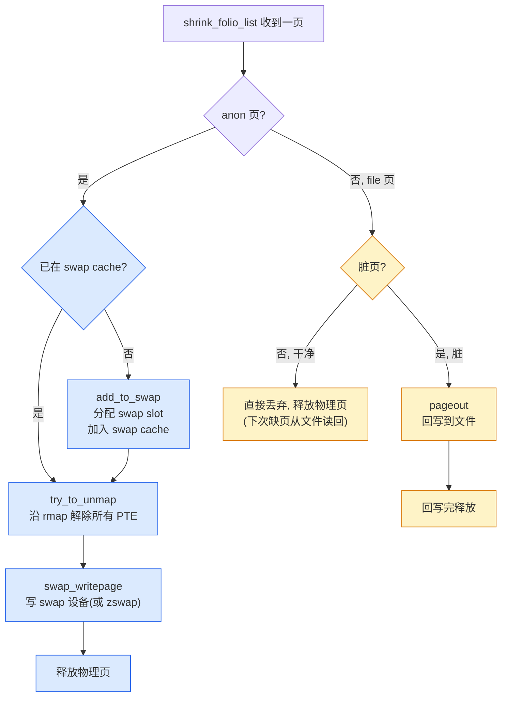
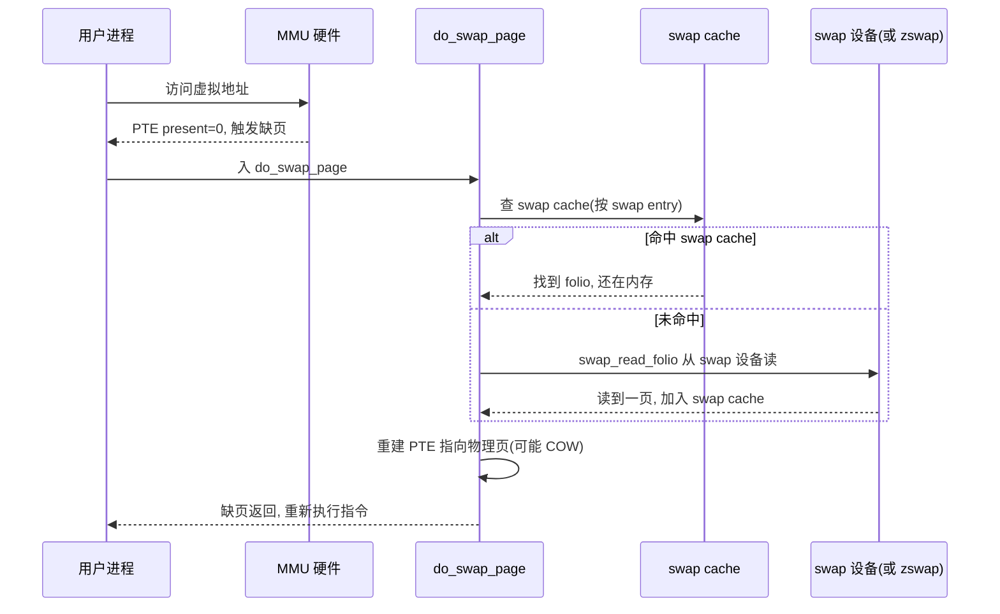
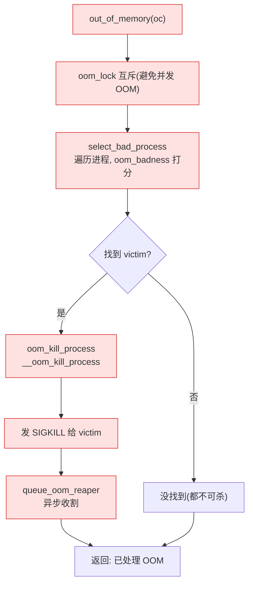

# 第十九章 · swap 与 OOM

> 篇:第 5 篇 · 回收与规整:紧张时收回来(回收侧)· 收尾章
> 主线呼应:回收链走到了终点。P5-16 水位/kswapd 后台预回收、P5-17 LRU/vmscan 选冷页、P5-18 compaction 规整凑连续——它们能腾出物理内存,但都隐含一个前提:**页有地方可去**。文件页能丢(干净)或回写(脏)到磁盘文件,之后重新缺页读回;但**匿名页**(用户 `malloc`/`brk` 拿的、没有后端文件的页)无家可归,丢了就是用户数据没了。swap 就是给匿名页"借一张临时床":换出到 swap 设备(swap 分区/swapfile/zswap),腾出物理页;下次访问触发缺页,再从 swap 换入。但 swap 也可能满(或根本没配 swap),那时连最后的兜底都不剩——OOM killer 上场,按 score 挑一个"占内存最多、最该死"的进程杀掉,用进程的命换系统的命。回收链至此闭环:能回收(vmscan)→ 能规整(compaction)→ 能换出(swap)→ 实在不行就杀人(OOM)。

## 核心问题

**回收冷页时,匿名页(无后端文件)怎么换出到 swap 腾出物理页?文件页怎么处理(干净直接丢、脏的回写)?实在一点内存都挤不出来了,OOM killer 怎么按 score 挑进程杀、保住系统不 hang?**

读完本章你会明白:

1. **anon 页与 file 页的不同处置**:anon 页走 swap(swap entry / swap cache),file 页走丢弃(干净)或回写(脏)。`shrink_folio_list` 的分流是回收链的"分诊台"。
2. **swap 的两层架构**:swap cache(`swapper_spaces[]` xarray,去重 + 索引 swap entry→folio)+ swap 设备(swapfile/swap 分区,真正落盘)。zswap 在 swap 设备前再加一层"内存里的压缩池",命中就省掉真 IO。
3. **swap 换出/换入的完整流程**:换出时 `add_to_swap` 把 folio 加进 swap cache、分配 swap slot、PTE 改成 swap entry、写 swap 设备;换入时 `do_swap_page` 缺页处理、从 swap cache 或 swap 设备读回、重建 PTE。
4. **OOM killer 的评分与收割**:`oom_badness` 按 `RSS + 页表 + swap 占用 + oom_score_adj` 算分,`select_bad_process` 选最高分,`oom_reaper` 异步收割被杀进程的内存(避免它卡在 `mmap_lock` 让整机 hang)。
5. **swap 与 OOM 是回收链的最后兜底**:它们都是"以慢换存"(swap)或"以命换存"(OOM)的极端手段,平时尽量不触发,触发就要稳。

> **逃生阀**:本章假设你读过 P4-13(页表/PTE/mmu_gather)、P4-14(缺页中断 `handle_mm_fault`/`do_anonymous_page`)、P4-15(rmap)、P5-17(LRU/vmscan 的 `shrink_folio_list`)。如果你对"PTE 的 present 位"、"匿名页 vs 文件页的区别"还不熟,先翻 P4-13/P4-14。

---

## 19.1 一句话点破

> **匿名页没有后端文件,丢了就是用户数据没了,所以它必须有个"临时床"——swap;物理内存满了连床都铺不下时,只能让一个进程"睡死"——OOM 杀它。swap 用磁盘/压缩池换内存空间(以慢换存),OOM 用进程的命换系统的命(以命换存)。回收链到此为止,没有更后面的兜底了。**

这是结论,不是理由。本章倒过来拆:先看 `shrink_folio_list` 怎么分诊(anon 走 swap、file 走丢弃/回写),再钻进 swap 的两层架构(swap cache + swap 设备)看换出/换入,接着看 zswap 这个"前置压缩层",最后看 OOM killer 怎么挑人、怎么安全地杀人。

---

## 19.2 分诊台:shrink_folio_list 怎么处置一页

回收的核心决策在 [`shrink_folio_list`](../linux/mm/vmscan.c#L1011-L1503)。vmscan 选出一批冷页后,对每一页做"分诊"——根据页类型(anon/file、干净/脏、是否在 swap cache、是否被映射),决定它的归宿:



关键代码段在 `shrink_folio_list` 内部:

```c
// mm/vmscan.c: 1217 (anon 页加入 swap cache, 分配 swap slot)
if (!add_to_swap(folio)) {
    ...goto activate_locked;
}

// mm/vmscan.c: 1247 (沿 rmap 解除所有 PTE, 改成 swap entry)
try_to_unmap(folio, ...);

// mm/vmscan.c: 1323 (脏 file 页: 回写)
switch (pageout(folio, mapping, &plug)) {
    case PAGE_KEEP: ...
    case PAGE_ACTIVATE: ...
    case PAGE_SUCCESS: ...    // 回写已启动
    case PAGE_CLEAN: ...      // 已干净, 直接释放
}
```

### anon 页 vs file 页:为什么只有 anon 要 swap

回忆 P4-14:用户进程的页分两类——

- **文件页(file-backed)**:`mmap` 一个文件读进来的页、程序的代码段、文件的页缓存。这页**有后端**——磁盘上的文件。物理内存里的这页只是"缓存"。回收时丢了它,下次缺页重新从文件读,数据不会丢。
- **匿名页(anonymous)**:`malloc`/`brk` 拿的、`mmap(MAP_ANONYMOUS)` 的页、进程栈、修改过的堆。这些页**没有后端文件**——它们就是数据本身,丢了就真没了。

> **钉死这件事**:这一区分决定了回收策略:file 页可以"直接丢"(干净)或"回写后丢"(脏),因为数据在文件里有备份;anon 页不能丢,只能"换出到 swap"——swap 就是给 anon 页临时存数据的地方。如果系统没配 swap,anon 页就换不出去,回收只能扔 file 页,内存压力全压在 file 缓存上,严重的会过早 OOM。

判断函数 [`may_enter_fs`](../linux/mm/vmscan.c#L992-L1006) 和 `folio_test_anon`/`folio_is_file_lru`(`include/linux/mm_inline.h`)决定一页走哪条路。`may_enter_fs` 检查"这次回收是否允许进入文件系统层"——某些回收路径(如 memcg 收缩)为了避免文件系统递归,不允许走 pageout。

### 干净 file 页:直接丢

干净的 file 页(没被写过、或已回写)直接丢弃:从页缓存摘下、沿 rmap 解除 PTE(改成 not present)、释放物理页。下次访问触发缺页,`do_read_fault` 从文件重新读回(见 P4-14)。代价几乎为零(不写盘),收益是一页物理内存。

### 脏 file 页:pageout 回写

脏的 file 页(被写过、还没回写)要先回写到文件,等回写完变干净再丢。 [`pageout`](../linux/mm/vmscan.c#L610-L678) 启动回写(交给文件系统的 `writepage`),返回 `PAGE_SUCCESS`(回写启动)或 `PAGE_KEEP`(不能回写,保留页)。回写是异步的——启动后这页挂起,等回写完成的回调把它重新放进 LRU 处理。

### anon 页:add_to_swap

anon 页走 [`add_to_swap`](../linux/mm/swap_state.c#L178-L227):分配一个 swap slot、把 folio 加入 swap cache(这步让多个进程共享同一 anon 页时只换出一份)。然后 `try_to_unmap` 沿 rmap 把所有 PTE 改成 swap entry 形式(present=0 + swap type+offset),最后 `swap_writepage` 把页内容写到 swap 设备(或先压缩进 zswap)。19.3 节细讲。

---

## 19.3 swap 的两层架构:swap cache + swap 设备

swap 不是"一个东西",是两层:

```
┌──────────────────────────────────────────────────────────────┐
│ 应用进程的虚拟地址空间                                          │
│   anon 页映射在这                                              │
└────────┬─────────────────────────────────────────────────────┘
         │ PTE(swap 换出后改成 swap entry)
         ▼
┌──────────────────────────────────────────────────────────────┐
│ 第 1 层: swap cache(在物理内存里)                              │
│   - swapper_spaces[]: xarray, 按 swap entry 索引 → folio       │
│   - 作用: 去重(多个进程共享同一 anon 页只换一份)               │
│           + 读写 swap 设备的地址空间(a_ops)                    │
└────────┬─────────────────────────────────────────────────────┘
         │ swap_writepage / swap_read_folio
         ▼
┌──────────────────────────────────────────────────────────────┐
│ 第 2 层(可选): zswap(在物理内存里的压缩池)                     │
│   - zswap_trees[]: rbtree, 按 swap entry 索引 → zswap_entry     │
│   - 压缩(zstd/LZ4)后存在 zpool                                │
│   - 命中: 在内存里解压, 不动 swap 设备                          │
└────────┬─────────────────────────────────────────────────────┘
         │ miss 或 writeback
         ▼
┌──────────────────────────────────────────────────────────────┐
│ 第 3 层: swap 设备(swap 分区 / swapfile / zram)                │
│   - 真正落盘(或落 zram 的内存盘)                              │
│   - swap_info_struct 描述每个 swap 设备                         │
└──────────────────────────────────────────────────────────────┘
```

### swap entry:PTE 的"我搬去 swap 了"标记

换出时,anon 页的 PTE 被改成 **swap entry**。一个 PTE 在 x86-64 上是 64 位,正常时它的位编码记录"present + 物理页 PFN + 权限"。换出后 present 位清 0,MMU 翻译失败触发缺页;但 PTE 的其他位被复用来存 swap entry:`type`(swap 设备编号)+ `offset`(在这个 swap 设备里的 slot 号)。

```c
// include/linux/swapops.h: 27-28
#define SWP_TYPE_SHIFT    (BITS_PER_XA_VALUE - MAX_SWAPFILES_SHIFT)
#define SWP_OFFSET_MASK   ((1UL << SWP_TYPE_SHIFT) - 1)
```

`swp_entry_t` 类型本身定义在 [`include/linux/mm_types.h`](../linux/include/linux/mm_types.h#L269-L271):

```c
// include/linux/mm_types.h: 269-271
typedef struct { unsigned long val; } swp_entry_t;
```

只是一个 `unsigned long` 包装,通过 [`swp_type()`](../linux/include/linux/swapops.h#L98) / [`swp_offset()`](../linux/include/linux/swapops.h#L107) 取出 type/offset。换出后 PTE 的值就是这个 `swp_entry_t.val`——告诉缺页处理"这页在 type 号 swap 设备的 offset 号 slot 里"。

> **钉死这件事**:swap entry 复用 PTE 位编码是 mm 的精妙设计——PTE 已经在那(8 字节),换出后这 8 字节不浪费,存 swap entry 当"我搬家了"的便条。缺页处理看到 present=0 + 是 swap entry,就走 `do_swap_page` 把页换回来。这是 swap 透明性的根本:用户进程完全感知不到它的页被换出去过,只是访问变慢(一次缺页 + 一次 IO)。

### swap cache:swapper_spaces[] 去重

[`swapper_spaces[]`](../linux/mm/swap_state.c#L41) 是一组 xarray(每个 swap 设备分片成多个 address_space,降低锁竞争),索引是 swap entry,值是 folio。它的作用:

- **去重**:两个进程 fork 出来的、或 `mmap(MAP_SHARED)` 共享的 anon 页(在 swap cache 里只有一份),换出时只换一份,换入时也只读一份。
- **读写 swap 设备的地址空间**:`swap_aops`([swap_state.c:33-39](../linux/mm/swap_state.c#L33)) 提供 `.writepage`/`.read_folio` 回调,抽象 swap 设备 IO。

`add_to_swap` 把 folio 加进 swap cache:

```c
// mm/swap_state.c: 178-227 (简化)
bool add_to_swap(struct folio *folio)
{
    swp_entry_t entry = get_swap_page(folio);   // 分配 swap slot
    ...
    if (add_to_swap_cache(folio, entry, gfp, NULL)) {  // 加入 swapper_spaces[]
        ...
        return false;
    }
    folio->private = (void *)(unsigned long)entry.val;  // folio 记住自己的 swap entry
    return true;
}
```

加入 swap cache 后,这页就同时存在于物理内存(还在,没释放)和 swap 设备的"待换出队列"里。后续 `try_to_unmap` 改 PTE 时,PTE 的 swap entry 指向的就是这个 swap slot。

### swap 设备:swap_info_struct

每个 swap 设备(swap 分区、swapfile、zram)由 [`struct swap_info_struct`](../linux/include/linux/swap.h#L282-L335) 描述。它记着:设备号、优先级、可用 slot 总数、slot 占用位图(`swap_map[]`,每个 slot 的引用计数)、cluster(SSD 上的连续 slot 分配)等。

swap slot 分配入口是 [`get_swap_pages`](../linux/mm/swapfile.c#L1053-L1135):按优先级遍历 swap 设备,在每个设备里调 [`scan_swap_map_slots`](../linux/mm/swapfile.c#L805-L1006) 找一个空闲 slot。SSD 上用 cluster 优化(分配连续 slot 让 swap IO 顺序,见 [`scan_swap_map_try_ssd_cluster`](../linux/mm/swapfile.c#L627-L679))。

### swap_writepage / swap_read_folio:真正 IO

写入:`swap_writepage` 在 [mm/page_io.c#L179-L211](../linux/mm/page_io.c#L179),发起写 swap 设备的 bio。读取:`swap_read_folio` 在 [mm/page_io.c#L495-L534](../linux/mm/page_io.c#L495)(6.9 已从 `swap_readpage` 改名为 folio API)。

### 换入:do_swap_page

进程访问一个被换出的虚拟地址,PTE 是 swap entry(present=0),触发缺页,最终走到 [`do_swap_page`](../linux/mm/memory.c#L3930)([memory.c:3930](../linux/mm/memory.c#L3930)):



`do_swap_page` 先查 swap cache([swap_cache_get_folio](../linux/mm/swap_state.c#L348)),命中直接用(别的进程刚换入过);未命中则 [`__read_swap_cache_async`](../linux/mm/swap_state.c#L429-L540) 分配新物理页、加入 swap cache、`swap_read_folio` 从 swap 设备读回。读回后重建 PTE,缺页返回,用户进程重新执行那条指令,这次 MMU 翻译成功。

> **为什么 sound**:swap cache 的存在让"换入"成为可去重的操作。两个进程共享一个 anon 页(fork 后 COW),换出时只换一份(swap cache 去重),换入时第一个进程触发缺页从 swap 读回并放入 swap cache,第二个进程缺页时直接命中 swap cache,不再读盘。`swap_map[]` 的引用计数记录"有几个 PTE 指向这个 swap slot",最后一个释放时 slot 才真正回收。这套设计让 swap 在多进程共享页时不会重复 IO。

---

## 19.4 zswap:swap 的前置压缩层

zswap 是 swap 的"缓存层"——在 swap 设备前再加一层**内存里的压缩池**。换出时先压缩进 zswap 池;换入时先查 zswap,命中就在内存里解压,不用动慢 swap 设备。

### zswap 的位置与结构

[`struct zswap_pool`](../linux/mm/zswap.c#L174-L182) 是压缩池,内部维护 `struct zpool`(实际压缩页存储,可以是 zbud/zbuddyz/zsmalloc)和 `crypto_acomp_ctx`(异步压缩引擎,通常 zstd 或 LZ4)。[`struct zswap_entry`](../linux/mm/zswap.c#L212-L223) 是每个被压缩页的元数据:关联的 swap entry、压缩后长度、在 zpool 里的 handle、所在 LRU。

[`zswap_trees[MAX_SWAPFILES]`](../linux/mm/zswap.c#L230) 是每个 swap 设备一棵红黑树,按 swap entry 索引 → `zswap_entry`。查询用红黑树(不是 xarray,因为 swap entry 稀疏)。

### zswap_store:换出时压缩

[`zswap_store`](../linux/mm/zswap.c#L1498-L1639) 在 `swap_writepage` 路径上被调用(如果 zswap 启用):

```c
// mm/zswap.c: 1498-1639 (简化)
bool zswap_store(struct folio *folio)
{
    swp_entry_t swp = folio->swap;
    struct zswap_tree *tree = swap_zswap_tree(swp);
    ...
    /* 1. 同值页检测(全 0 等特殊页不压缩, 直接记一个 value) */
    if (zswap_same_filled_pages_enabled) {
        if (zswap_is_page_same_filled(src, &value)) {
            entry->length = 0;
            entry->value = value;
            goto store_entry;   // 不进 zpool, 省到极致
        }
    }

    /* 2. 压缩 */
    acomp_request_set_params(...);   // crypto 异步压缩
    ...
    /* 3. 在 zpool 分配压缩后空间, 存进去 */
    ...
store_entry:
    /* 4. 加入红黑树 + LRU */
    zswap_rb_insert(tree, entry);
    zswap_lru_add(&entry->lru);
}
```

zswap 的几个优化:

1. **同值页检测**:全 0、全某值的页不压缩,只存一个 `value`(8 字节代表整页),极致省内存。
2. **压缩算法可配**:`zswap.compressor`(默认 zstd,也可 LZ4/lzo);crypto 异步压缩 API 让压缩可以走硬件加速器。
3. **多池设计**:`ZSWAP_NR_ZPOOLS` 个池,降低单池锁竞争。

### zswap_load:换入时解压

[`zswap_load`](../linux/mm/zswap.c#L1641-L1693) 在 `swap_read_folio` 路径上先查 zswap,命中就解压返回,不走真 IO。

### zswap_writeback_entry:zswap 太满时回写

zswap 池有上限(`zswap.max_pool_percent`),满了要往真 swap 设备回写——这就是 [`zswap_writeback_entry`](../linux/mm/zswap.c#L1126-L1198):选 LRU 上最老的压缩项,解压、写到 swap 设备、从 zswap 池删除。所以 zswap 是个**真正的缓存**:它的数据最终还是要落 swap 设备,只是把"热数据"留在内存的压缩形式,把"冷数据"逐步挤到磁盘。

### zswap vs zram vs 真 swap

容易混的三个东西:

| 层次 | 是什么 | 数据在哪 | 何时用 |
|------|--------|----------|--------|
| **zswap** | swap 设备的**前置压缩缓存** | 物理内存(压缩) | 后端有真 swap 设备时,zswap 命中省 IO |
| **zram** | **本身就是 swap 设备**(在内存里的伪块设备) | 物理内存(压缩) | 没有真 swap 分区时,把内存的一块当 swap 用 |
| **swap 分区/swapfile** | 真正的磁盘 swap | 磁盘 | 最慢但容量大,持久化 |

> **钉死这件事**:zswap 不能脱离真 swap 设备工作——它的数据最终要回写到 swap 设备。zram 可以独立工作——它自己就是个 swap 设备。这是关键区别:zswap 是"swap 的加速器",zram 是"内存版的 swap 设备"。

---

## 19.5 OOM killer:最后的兜底

物理内存 + swap 都用尽(或某次分配连一页都拿不到),所有回收手段都失败了。再不让任何进程拿到内存,整机就 hang 死——所有分配都 sleep,没人能前进。这时 OOM killer 上场:杀一个进程,用它的命换其他进程能继续分配。

### 评分:oom_badness

[`oom_badness`](../linux/mm/oom_kill.c#L202-L240) 给每个候选进程打分,选分最高的杀。评分依据:

```c
// mm/oom_kill.c: 202-240 (简化)
long oom_badness(struct task_struct *p, unsigned long totalpages)
{
    long adj = (long)p->signal->oom_score_adj;   // 用户可调(-1000 ~ 1000)

    /* 不可杀的(init, oom_score_adj=-1000, 已被 reaped)直接返回 LONG_MIN */
    if (adj == OOM_SCORE_ADJ_MIN || test_bit(MMF_OOM_SKIP, ...) || in_vfork(p))
        return LONG_MIN;

    /* 评分 = RSS + swap 占用 + 页表字节数 */
    points = get_mm_rss(p->mm)                            // 物理内存占用(匿名 + 文件 + shmem)
           + get_mm_counter(p->mm, MM_SWAPENTS)           // swap 占用
           + mm_pgtables_bytes(p->mm) / PAGE_SIZE;        // 页表本身也占内存

    /* oom_score_adj 调整 */
    adj *= totalpages / 1000;
    points += adj;

    return points;
}
```

评分的核心:**谁占的内存多(物理 + swap + 页表),谁就该死**。这是个朴素但有效的启发——杀一个大进程能腾出大量内存,杀一堆小进程才能腾出同样的量,而后者代价更大(每个都要重启、丢状态)。

`oom_score_adj` 是用户可调的"权重":`/proc/<pid>/oom_score_adj` 范围 -1000(永不杀)到 1000(优先杀)。数据库这类重要进程会被设成 -1000,让它躲过 OOM。

### 选择:select_bad_process

[`select_bad_process`](../linux/mm/oom_kill.c#L365-L380) 遍历所有进程,调 `oom_badness` 打分,选最高分的。它是 [`out_of_memory`](../linux/mm/oom_kill.c#L1108-L1177) 的子步骤:



### 杀人:__oom_kill_process

[`__oom_kill_process`](../linux/mm/oom_kill.c#L917-L997) 做的事:

1. **发 SIGKILL**([oom_kill.c:948](../linux/mm/oom_kill.c#L948)):`do_send_sig_info(SIGKILL, ...)`,让 victim 进程开始退出。
2. **`mark_oom_victim`**([oom_kill.c:949](../linux/mm/oom_kill.c#L949)):标记 victim,允许它访问内存预留 reserve(`PF_MEMALLOC`)以便能顺利退出。
3. **杀共享 mm 的其他线程组**([oom_kill.c:969-989](../linux/mm/oom_kill.c#L969)):如果别的进程 `CLONE_VM` 共享了这个 mm(没 `CLONE_THREAD`),也一起杀,避免它们继续分配。
4. **`queue_oom_reaper(victim)`**([oom_kill.c:993](../linux/mm/oom_kill.c#L993)):启动 oom_reaper 异步收割。

### 异步收割:oom_reaper

victim 收到 SIGKILL 后,正常路径是它自己执行 exit 处理,释放内存。但有个严重问题:**victim 可能正持有 `mmap_lock`(读锁,在某个系统调用里),而 exit 需要写锁**。victim 卡在那等锁,内存迟迟释放不出来,其他进程继续 OOM,整机 hang。

[`oom_reaper`](../linux/mm/oom_kill.c#L638-L658) 这个内核线程就是解药——它不等 victim 自己 exit,**直接收割 victim 的用户态页表**,把它的匿名页、文件页映射统统解除、释放物理内存。它的核心是 [`oom_reap_task_mm`](../linux/mm/oom_kill.c#L566-L604):试着拿 `mmap_lock` 的**读锁**(不是写锁,读锁不和别人冲突),拿到就遍历 VMA,对每个 VMA 的页做 `mmu_gather` 批量 unmap + 释放。

> **为什么 sound**:这是 mm 里最精彩的"打破死锁"设计之一。victim 卡在 `mmap_lock` 写者(exit/`munmap`),正常收割要等写锁——死锁。oom_reaper 拿读锁,读锁和 victim 已经持有的读锁不冲突,能拿到;拿到后用 [`__oom_reap_task_mm`](../linux/mm/oom_kill.c#L510-L558) 走 `tlb_gather_mmu` + `unmap_page_range` 把页表项清空、刷 TLB、释放物理页。victim 后续即使访问这些虚拟地址,也只是触发缺页(被 SIGKILL 杀掉之前缺页也会失败,因为 `mark_oom_victim` 后 `OOOM` 路径会让它分配不到内存)。
>
> 反面对比:如果没有 oom_reaper,victim 持有 `mmap_lock` 在某长系统调用(如大型 `read`)中,exit 永远等不到锁,内存永远不释放,其他进程持续 OOM 又互相等锁——整机彻底 hang,无人能恢复。oom_reaper 是"绕过正常退出路径,直接从 victim 进程的 mm_struct 抢救内存"的兜底。

### oom_lock 与 oom_killer_disable

[`oom_lock`](../linux/mm/oom_kill.c#L68) 是个 mutex,保证同一时刻只有一个 OOM 事件在处理。多个 CPU 同时 OOM 时,只有一个进 `out_of_memory`,其他等锁——它们等到锁之后重新检查内存,往往发现已经被释放(前一个 OOM 杀了进程),就不用再杀了。

[`oom_killer_disable`](../linux/mm/oom_kill.c#L818-L840) 用于在 suspend/电源管理场景禁用 OOM(避免在 suspend 过程中杀关键进程)。

---

## 19.6 技巧精解

### 技巧 1:swap cache 去重 + swap entry 编码

swap 的设计有两处精妙:

**(1) swap entry 复用 PTE 位编码**:换出后 PTE 没浪费——它的 64 位被重新解释为 swap entry,记录"页搬到了哪个 swap 设备的哪个 slot"。这是 mm"位编码极致复用"的典范,和 P4-13 讲的 PTE 位编码、P5-18 讲的 migration entry 一脉相承。

**(2) swap cache 去重**:多个进程共享同一 anon 页(fork COW、`mmap(MAP_SHARED)`),换出时通过 swap cache 只换一份(`swap_map[]` 引用计数跟踪);换入时第一个进程缺页读盘 + 放入 swap cache,后续进程缺页直接命中。

朴素方案:每个进程的 PTE 各自指向各自的 swap slot,换出 N 份、换入 N 次。问题:多进程共享页(如 fork 后父子读同一内存)会重复 IO,N 倍磁盘压力。

> **不这样会怎样**:没有 swap cache,fork 后父子进程共享的 anon 页换出时各换一份(浪费 swap 空间)、换入时各读一次(浪费 IO、还可能引入不一致)。有了 swap cache,共享页只换一份、只读一次,`swap_map[]` 的引用计数保证最后一个释放时 slot 才回收。这是 mm "用一层间接换 N 倍效率"的典型设计——和 P1-05 的 per-cpu pageset、P2-08 的 frozen slab 是同一种思路。

### 技巧 2:oom_reaper 拿读锁绕过死锁

这是 OOM 路径最硬核的并发设计,18.5 节已展开。补充一个细节:oom_reaper 用 [`__oom_reap_task_mm`](../linux/mm/oom_kill.c#L510-L558) 里的 `tlb_gather_mmu` + `unmap_page_range`,本质是"代 victim 做一次 munmap 全部用户页"——但用读锁,不动 VMA 树结构,只清页表项、刷 TLB、释放物理页。VMA 树留给 victim 自己 exit 时清理。

> **为什么 sound**:这套设计的关键是"**只清页表不动 VMA**"。清页表只需要页表锁(细粒度,per-VMA),不需要 VMA 树的写锁(`mmap_lock` 写)。VMA 树的修改(撤 VMA)留给 victim 自己 exit 时做——那时它要么已经退出长系统调用、要么 SIGKILL 让它被中断。oom_reaper 只做"用最少锁释放最多内存"的事,把"还能等"的工作留给 victim 自己。这是 mm 并发技巧的精华:**用最小锁范围做最大释放**。

---

## 19.7 章末小结:第 5 篇收尾

### 回扣二分法

swap 与 OOM 是**回收**这一面的最后两道关。整个第 5 篇的回收链:

```
水位下降(kswapd 唤醒) → vmscan 选冷页 → 处置:
                                         ├─ file 页: 干净丢/脏回写(P5-17)
                                         ├─ anon 页: 换出到 swap(P5-19)
                                         └─ 物理内存释放
碎片多? → compaction 规整凑连续(P5-18)
还拿不到? → direct reclaim + direct compaction
全满且 swap 也满? → OOM 杀进程(P5-19)
```

每一环都是"以某种代价换物理内存":vmscan 以"再次访问时缺页 + IO"换内存;compaction 以"搬页的 CPU 代价"换连续;swap 以"慢设备 IO"换内存;OOM 以"一个进程的命"换内存。回收的本质就是**在不同代价之间权衡**。

### 五个为什么

1. **为什么 anon 页要 swap,file 页不用**?file 页有后端(磁盘文件),丢了能从文件读回;anon 页没后端,丢了就是数据丢失,swap 给它一张"临时床"。
2. **为什么 swap 要分两层(swap cache + swap 设备)**?swap cache 在内存里做去重 + 缓存,避免多进程共享页重复 IO;swap 设备是真正落盘的后端。zswap 是中间的压缩缓存层,命中省真 IO。
3. **为什么 OOM 按 RSS+swap+页表打分**?杀一个占内存最多的进程能腾出最多内存,把"重启 N 个小进程"的代价降到"重启 1 个大进程"。
4. **为什么 oom_reaper 要拿 `mmap_lock` 读锁而不是写锁**?victim 可能正持有写锁,oom_reaper 等写锁就死锁。读锁和 victim 持有的读锁不冲突,能拿到;拿到后只清页表(细粒度页表锁就够),不动 VMA 树结构(那个需要写锁,留给 victim 自己 exit)。
5. **为什么 `oom_score_adj` 能让进程躲过 OOM**?它把评分调到 `LONG_MIN`(`OOM_SCORE_ADJ_MIN = -1000`),`oom_badness` 直接返回 `LONG_MIN`,select_bad_process 跳过它。这是用户态控制 OOM 偏好的唯一接口(重要服务如数据库、SSH 守护进程常被设成 -1000)。

### 想继续深入往哪钻

- **源码**:swap 换出从 [`shrink_folio_list`](../linux/mm/vmscan.c#L1011) 的 `add_to_swap` 调用点([vmscan.c:1217](../linux/mm/vmscan.c#L1217))入手 → [`add_to_swap`](../linux/mm/swap_state.c#L178) → [`get_swap_pages`](../linux/mm/swapfile.c#L1053) → [`scan_swap_map_slots`](../linux/mm/swapfile.c#L805);换入 [`do_swap_page`](../linux/mm/memory.c#L3930) → [`__read_swap_cache_async`](../linux/mm/swap_state.c#L429);zswap [`zswap_store`](../linux/mm/zswap.c#L1498) / [`zswap_load`](../linux/mm/zswap.c#L1641);OOM [`out_of_memory`](../linux/mm/oom_kill.c#L1108) → [`oom_badness`](../linux/mm/oom_kill.c#L202) → [`__oom_kill_process`](../linux/mm/oom_kill.c#L917) → [`oom_reap_task_mm`](../linux/mm/oom_kill.c#L566)。
- **观测**:`swapon -s` / `cat /proc/swaps`(swap 设备);`cat /proc/meminfo | grep -E "Swap|Shmem"`;`cat /sys/kernel/debug/zswap/`(zswap 池统计);OOM:`dmesg | grep -i "killed process"`、`/proc/<pid>/oom_score`、`/proc/<pid>/oom_score_adj`。
- **调参**:`vm.swappiness`(0~200,anon/file 回收倾向,默认 60);`vm.watermark_scale_factor`(P5-16);zswap:`/sys/module/zswap/parameters/{enabled,compressor,zpool,max_pool_percent,accept_threhsold_percent}`;`oom_score_adj`(per-process)。
- **延伸**:`mempolicy`/`mbind`(NUMA 间页面迁移,见 P6-20);`userfaultfd`(用户态接管缺页,可做 live migration);`madvise(MADV_FREE)`/`MADV_PAGEOUT`(用户态主动给回收提示);`swapfile` 的 swap cluster(SSD 顺序 IO 优化);`frontswap`(已废弃,曾是个早期 zswap 接口)。

### 引出第 6 篇

第 5 篇到此收束——回收链从水位/kswapd、LRU/vmscan、compaction、swap、OOM 五个层次完整走通。但 mm 还有一组重要机制不属于"分配/回收"主线,而是"提升效率/支持特定场景"的进阶能力,放在第 6 篇:

- **大页(hugetlb 预留 + THP 透明大页)**:省 TLB,与 compaction(P5-18)紧密协作(THP 需要 compaction 腾出 2MB 连续)。
- **KSM(同页合并)**:把内容相同的 anon 页合并成一份,虚拟化场景省内存;它回扣 rmap(P4-15)——多个 PTE 指向同一物理页,rmap 反查时都能找到。
- **memory cgroup**:分组限额 + 记账,回收路径里的 `try_charge` 就是 memcg 记账,它把"内存压力"从全局细化到 per-cgroup。
- **NUMA mempolicy**:跨节点分配策略,迁移(`migrate_pages`,P5-18 的同一套基础设施)在 NUMA balancing 里被用来把页搬到被访问的节点。

P6-20 是这些进阶机制的精选集成章,会反复回扣前 5 篇的地基——compaction、rmap、回收记账、page migration。读完 P6-20,mm 的核心图景就完整了。
