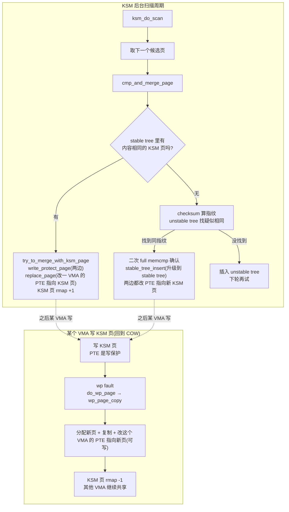
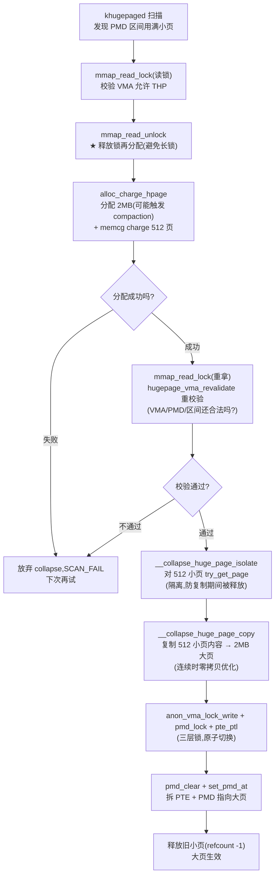
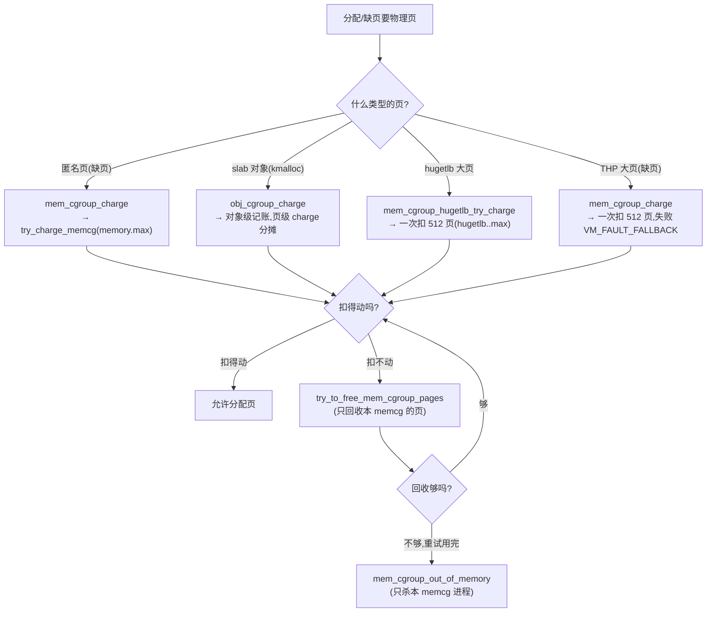
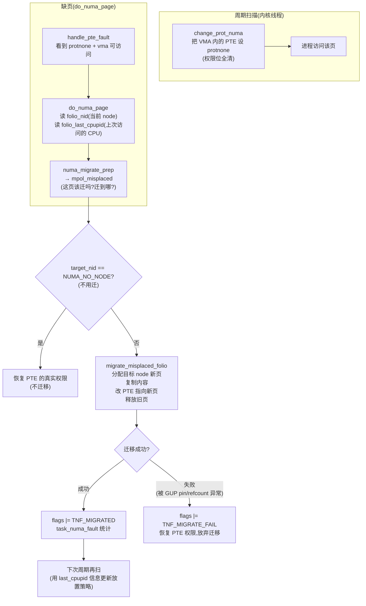

# 第二十章 · 大页 / KSM / memcg / NUMA(精选)

> 篇:第 6 篇 · 进阶(精选)
> 主线呼应:前面五篇我们立起了 mm 的全部主梁——buddy(分页)、slab(切对象)、页表(建映射)、缺页(兑现映射)、回收(紧张时收回来)。这一章不立新主梁,而是给主梁上加**支撑增强**:① **大页**(hugetlb 预留 + THP 透明大页)用 2MB 大页替代 512 个 4KB 小页,把 TLB 命中率推上去;② **KSM**(kernel samepage merging)把内容相同的页合并成一份,在虚拟化里省下几倍的同质 guest OS 内存;③ **memcg**(memory cgroup)给一组进程套上"内存限额 + OOM 隔离"的圈,让一台机器上的 N 个容器各活各的;④ **NUMA mempolicy / NUMA balancing** 决定页放哪个 NUMA 节点、并自动把页迁到访问它的节点。这四个东西都站在前面已立的基础机制之上:大页叠在缺页 + compaction + migrate 上,KSM 叠在 rmap + COW + PTE 锁上,memcg 叠在缺页 + 回收 + buddy 的 charge 钩子上,NUMA 叠在缺页的 `do_numa_page` + migrate 上。读完这一章,你就能把这些"加在主梁上的横档"和它们各自服务的"分配/回收/支撑"对得上号。

## 核心问题

**四个进阶主题,各自解决什么本质问题?① 大页为什么省 TLB、提升大内存程序性能(hugetlb 预留 vs THP 透明大页,两条路)?② KSM 怎么把内容相同的页合并成一份(写时复制),靠什么数据结构在百万页里找"和我一样的页"?③ memcg 怎么给一组进程限额、统计、隔离 OOM(charge 在哪条路径上、回收怎么回环)?④ NUMA mempolicy / NUMA balancing 怎么决定页放哪个节点、自动迁移到访问它的节点?**

读完本章你会明白:

1. **大页的两种形态**——hugetlb(预留 + 显式 `mmap(MAP_HUGETLB)` + 独立的 PMD 页表)vs THP(透明 + 普通匿名 VMA 自动 2MB + 后台 khugepaged collapse),以及它们和第 14 章 `create_huge_pmd`/`__do_huge_pmd_anonymous_page` 岔路、第 18 章 compaction 凑 2MB 连续的关系。
2. **KSM 的核心机制**——stable tree(按页内容指纹的红黑树)找内容相同的页,`write_protect_page` + `replace_page` 改 PTE 指向同一个 KSM 页(主动 COW 合并),以及 KSM 页被多 VMA 共享时 rmap 的"多对一"形态。
3. **memcg 的 charge 路径**——`try_charge_memcg`(分配/缺页记账)在 buddy 分配前先扣额度,扣超了先尝试回收(`try_to_free_mem_cgroup_pages`)再不行才 memcg OOM,以及 `memory.current`/`memory.max`/`memory.oom.group` 怎么把这一切暴露给用户态。
4. **NUMA mempolicy 四种模式**——`MPOL_DEFAULT`/`MPOL_BIND`/`MPOL_PREFERRED`/`MPOL_INTERLEAVE`(手动),以及 NUMA balancing(自动)把 PTE 设 protnone 触发 `do_numa_page`、再 `migrate_misplaced_folio` 把页迁到访问节点。
5. 这四样都在二分法的**支撑地基**一面——给基础机制(buddy/页表/缺页/回收)加可观测、可控、可隔离、可优化的横切能力。

> **逃生阀**:这一章四个主题,各管各的,**完全可按需跳读**。如果你只关心数据库/JVM 为什么需要大页,读 20.1~20.4 + 20.6(THP 技巧精解);如果你只关心 KSM 在虚拟化里怎么省内存,读 20.5;如果你只关心容器的内存隔离和 OOM,读 20.7~20.9;如果你只关心多 socket 机器的跨节点访问,读 20.10~20.12。每节自洽,不需要严格按顺序。

---

## 20.1 一句话点破

> **大页用 2MB 替 512 个 4KB 省 TLB,KSM 把相同内容的页合成一份省内存,memcg 给一组进程套限额+OOM 圈做隔离,NUMA 把页放到访问它的节点上抗跨节点延迟。四样东西都站在 buddy/页表/缺页/回收之上,各管一类"基础机制没顺手解决但生产又绕不开"的问题。**

这是结论,不是理由。本章倒过来拆:先看大页为什么省 TLB(hugetlb 的"明账"路径 vs THP 的"暗账"路径),再讲 KSM 怎么用 stable tree 在百万页里找"和我一样"的页,接着看 memcg 在哪条路径上记账、回收回环怎么走,最后看 NUMA mempolicy 怎么手动设策略、NUMA balancing 怎么自动迁页。技巧精解单独拆 THP collapse(它最能体现"几个基础机制怎么缝出一个增强")。

---

## 20.2 大页的动机:TLB 是怎么"爆"的

我们直接从一个具体的痛点切入。一台机器开 64GB 内存、跑一个 32GB 堆的数据库(或 JVM)。如果按 4KB 小页管理这 32GB,意味着页表里有 32GB / 4KB = **8 百万个 PTE**。这些 PTE 在物理上是 8M / 512 = 15625 个 PTE 页(PMD 的下一级),每页 4KB,占用约 64MB 物理内存(还承受得起);**真正的痛在 TLB**——CPU 的 TLB(translation lookahead buffer)是页表项的硬件缓存,它的容量非常有限,典型 L1 dTLB 只有 64~96 项,L2 TLB(shared)也就 1000~2000 项。

> **不这样会怎样**:8 百万个 PTE 远超 TLB 容量,数据库扫一遍堆(典型 OLTP 工作负载)会出现大量 **TLB miss**。TLB miss 触发硬件 **page walk**——MMU 一级一级去内存里查 PGD/PUD/PMD/PTE,一次 walk 4 次内存访问(几十到上百周期),如果 PTE 还在 L3 cache 里尚可,如果是冷 PTE 就要跑到 DRAM。32GB 堆扫一遍,几百万次 TLB miss + page walk,**性能损失 10%~30% 都是常见的**。这就是为什么数据库、JVM、大模型推理这种"大堆 + 顺序扫"的程序对 4KB 小页格外敏感。

**大页**就是这里的解药。一个 2MB 的大页,在页表里只占 **一个 PMD 项**(绕过它下面的 512 个 PTE)。同样的 32GB 堆,改用 2MB 大页,只需要 32GB / 2MB = **16384 个 PMD 项**——TLB 轻松装下,**TLB miss 率断崖式下降**。一次 TLB entry 覆盖 2MB,扫一遍 32GB 堆只触发 16384 次 TLB 查询,而不是 8 百万次。

```
4KB 小页 vs 2MB 大页(覆盖同样 32GB 堆):

 方案 A: 4KB 小页(第 13 章的标准页表)
 ┌──────────────────────────────────────────────────────┐
 │ PGD  → P4D → PUD → PMD ─┬→ PTE 页 0: [PTE0..PTE511]  │  512 PTE × 4KB = 2MB
 │                          ├→ PTE 页 1: [PTE0..PTE511]  │
 │                          └→ ...                       │  32GB 需要 8M 个 PTE
 │                          └→ PTE 页 16383             │  TLB 装不下 → 频繁 page walk
 └──────────────────────────────────────────────────────┘

 方案 B: 2MB 大页(PMD 项直接指向一个 2MB 物理页)
 ┌──────────────────────────────────────────────────────┐
 │ PGD  → P4D → PUD → PMD 项 = [PFN | R/W | big]         │  一个 PMD 项 = 2MB
 │                          ↓ 16384 个 PMD 项覆盖 32GB   │  TLB 轻松装下 → 命中率高
 └──────────────────────────────────────────────────────┘
 (大页"绕过"PTE 这一级,PMD 项直接当物理页指针)
```

> **钉死这件事**:大页的**本质**是用一个 PMD 项替代 512 个 PTE,把"覆盖一段虚拟地址的 TLB entry 数量"压到 1/512。这是"用更大的粒度换更少的元数据 + 更高的 TLB 命中率"。代价是**一个 2MB 页必须物理连续**(buddy 得有 2MB 连续空闲,即 order-9 的页块)且**对齐 2MB**——这正是第 6 章 migrate types(MOVABLE 分开放)和第 18 章 compaction(规整出连续)存在的理由,它们都是为"能拿到 2MB 连续"扫清地基。

Linux 给了大页**两条独立路径**,本节先讲为什么需要两条,20.3/20.4 分别拆。

---

## 20.3 hugetlb:预留式的"明账"大页

### 为什么先有 hugetlb

最早的大页机制叫 **hugetlb**(历史上叫 hugeTLB,即 huge translation lookahead buffer)。它的思路非常朴素、非常"明账":

1. **启动时(或运行时 `nr_hugepages` sysctl)**,**预留** N 个 2MB(或 1GB,gigantic page)大页到 buddy 之外的池子里。这些页**不再归 buddy 管**,专门给 hugetlb 用。
2. 用户进程通过 `mmap(..., MAP_HUGETLB)` 或 `shmget(..., SHM_HUGETLB)` 显式声明"我要用大页映射这段虚拟地址"。
3. 访问这段地址触发缺页时,内核不走普通缺页路径,走 `hugetlb_fault` → `hugetlb_no_page`,从预留池子里取一个 2MB 页,用 **huge PMD**(独立的 PMD 页表,不复用普通 PMD)建映射。

[`hugetlb_fault`](../linux/mm/hugetlb.c#L6432)([hugetlb.c:6432](../linux/mm/hugetlb.c#L6432)) 的开头有一个非常关键的串行化设计:

```c
// mm/hugetlb.c#L6459-L6473 (hugetlb_fault 的串行化)
/*
 * Serialize hugepage allocation and instantiation, so that we don't
 * get spurious allocation failures if two CPUs race to instantiate
 * the same page in the page cache.
 */
mapping = vma->vm_file->f_mapping;
hash = hugetlb_fault_mutex_hash(mapping, vmf.pgoff);
mutex_lock(&hugetlb_fault_mutex_table[hash]);

/* Acquire vma lock before calling huge_pte_alloc and hold
 * until finished with ptep. This prevents huge_pmd_unshare from
 * being called elsewhere and making the ptep no longer valid.
 */
hugetlb_vma_lock_read(vma);
ptep = huge_pte_alloc(mm, vma, haddr, huge_page_size(h));
```

注意这两层串行:**① `hugetlb_fault_mutex_table[hash]`**——一个 per-(inode, offset) 的 mutex 哈希表,让"两个 CPU 同时缺页同一个大页地址"只走一条,避免 spurious 分配失败;**② per-VMA read lock**(`hugetlb_vma_lock_read`)——防止缺页途中 `huge_pmd_unshare`(共享 hugetlb 页的 PMD 解绑)把 `ptep` 失效。这是 hugetlb 的"为什么 sound":大页页表操作粒度大、影响范围大,**用 mutex + VMA 锁把并发降到能管的粒度**。

### hugetlb 的预留账本:`alloc_hugetlb_folio`

hugetlb 池子的"账本"在 [`alloc_hugetlb_folio`](../linux/mm/hugetlb.c#L3132)([hugetlb.c:3132](../linux/mm/hugetlb.c#L3132)) 里,它的核心是**两层账**:

```c
// mm/hugetlb.c#L3159-L3174 (alloc_hugetlb_folio:看预留账本决定能否分配)
map_chg = gbl_chg = vma_needs_reservation(h, vma, addr);   /* 看区域预留账:有预留吗? */
if (map_chg < 0) { ... return ERR_PTR(-ENOMEM); }

/* 没预留的进程,还要过 subpool 限额检查 */
if (map_chg || avoid_reserve) {
    gbl_chg = hugepage_subpool_get_pages(spool, 1);   /* subpool 限额 -1 */
    if (gbl_chg < 0)
        goto out_end_reservation;                      /* subpool 满了,直接失败 */
    if (avoid_reserve)
        gbl_chg = 1;
}
```

这里的"两层账"是:**① 区域预留账(region/reserve map)**——`mmap(MAP_HUGETLB)` 时内核根据 `vm_flags` 决定要不要给这个 VMA 预留(`vma_needs_reservation`),有预留的进程缺页时一定能拿到页;**② 全局/subpool 池子账(`hugetlb_acct_memory`)**——没预留的进程要扣全局池子的额度。两层都过,才从 [`dequeue_hugetlb_folio_vma`](../linux/mm/hugetlb.c#L1390)([hugetlb.c:1390](../linux/mm/hugetlb.c#L1390)) 真正取一个池子里的大页。

> **不这样会怎样**:如果 hugetlb 不预留、按需分配,大页要求 2MB 物理连续,碎片化下根本拿不到(第 18 章 compaction 给 order-9 也是尽力而为),结果就是"声明了 hugetlb 但缺页时常常失败"。预留让 hugetlb **给出一个硬承诺**:池子里有 N 个大页就是有,不会因为碎片化临时拿不出。代价是这 N 个大页**独占、不可挪作他用**——哪怕进程没用、哪怕系统内存紧张到要 OOM,这些大页也卡在 hugetlb 池子里。这是 hugetlb 的"明账"特性:**确定性高,灵活性低**。

hugetlb 还有几个工程上的"明账"麻烦:**① 自己一套 PMD 页表**(`huge_pte_alloc`,不复用普通页表的 PMD 项布局,而是用一组独立的 huge pte table);**② 自己一套 `hstate`**(管多种大页尺寸,2MB / 1GB / 16GB... 用 [`struct hstate`](../linux/mm/hugetlb.c#L54) 区分);**③ 进程地址空间布局要改**(hugetlb 段不算进 `mm->total_vm` 的常规方式);**④ 自己一套 COW**([`hugetlb_wp`](../linux/mm/hugetlb.c#L5926),不调 `do_wp_page`)。这些"自己一套"的代价决定了 hugetlb 在现代 Linux 里**主要用于数据库、HPC 这种"明确知道自己要 2MB"** 的高价值场景,日常进程基本不用。

### hugetlb 怎么用、怎么观测

```bash
# 启动时预留 1024 个 2MB 大页(共 2GB)
echo 1024 > /proc/sys/vm/nr_hugepages

# 用户程序
void *p = mmap(NULL, 2*1024*1024*100, PROT_READ|PROT_WRITE,
               MAP_PRIVATE|MAP_ANONYMOUS|MAP_HUGETLB, -1, 0);
//                       ^^^^^^^^^^^^^ 关键 flag,告诉内核:这段用大页

# 观测
cat /proc/meminfo | grep -i huge      # HugePages_Total/Free/Reserved/Rsvd
cat /sys/kernel/mm/hugepages/         # 各 size 的预留数
```

> **钉死这件事**:hugetlb 是"明账"大页——启动预留 + 显式 `MAP_HUGETLB` + 自己一套 PMD/hstate/COW。**确定性高、灵活性低**:进程拿到的是确定能用的 2MB 大页;代价是这些大页被独占,其他进程用不了。这适合"明确要大页"的数据库/HPC,不适合一般进程。一般进程想要大页省 TLB,得靠 20.4 节的 **THP**。

---

## 20.4 THP 透明大页:暗账、自动、可拆

### THP 解决什么——hugetlb 不解决的问题

hugetlb 的"明账"对一般进程太重了:**进程要改代码加 `MAP_HUGETLB`、系统要预留、池子还独占**。绝大多数程序不想动代码、也不想占着大页不放,它们只想要"如果方便就用 2MB,不方便就用 4KB,对程序透明"。这就是 **THP**(transparent huge page,透明大页)。

THP 的"透明"二字是关键:**用户代码什么都不用改**,内核在满足条件时自动用 2MB 大页。THP 在第 14 章缺页里以一个"岔路"出现——[`__handle_mm_fault`](../linux/mm/memory.c#L5350) 走到 PMD 层,会先调用 `create_huge_pmd` 试试能不能直接建 2MB 大页(回扣 P4-14 的 14.3 节),只有这条路走不通才 fall through 到 512 个 PTE 的普通缺页。

### THP 的两条产生路径

THP 的 2MB 大页有**两条产生路径**,理解这两条是理解 THP 的钥匙:

**① 缺页时直接建大页(fault path)**——匿名 VMA 缺页,如果 VMA 允许 THP(`thp_vma_allowable_orders` 返回真)且 PMD 项不存在、对齐范围内虚拟地址都还没建映射,就直接分配一个 2MB 大页(走 [`__do_huge_pmd_anonymous_page`](../linux/mm/huge_memory.c#L868),[huge_memory.c:868](../linux/mm/huge_memory.c#L868))。这是 P4-14 14.3 节 `create_huge_pmd` 岔路的具体落地。

**② 后台 khugepaged 扫描 + collapse**——已经存在的小页 PTE 区间,后台内核线程 `khugepaged` 周期性扫描( [`khugepaged_do_scan`](../linux/mm/khugepaged.c#L2492) → [`khugepaged_scan_mm_slot`](../linux/mm/khugepaged.c#L2329) → [`collapse_huge_page`](../linux/mm/khugepaged.c#L1087)),如果某个 2MB 对齐区间里的小页"足够满"(没有太多空洞、没有 swap 出去),就把它**合并(collapse)成一个大页**:分配 2MB → 把 512 个小页的内容复制过去 → 拆掉旧 PTE → 用 PMD 项指向大页。这条路径是 THP 真正"透明"的地方——进程已经用 4KB 跑着,khugepaged 在后台悄悄把它升级到 2MB。

两条路径的差别:

| 维度 | ① 缺页时建大页 | ② khugepaged collapse |
|------|----------------|------------------------|
| 触发 | 进程首次访问 2MB 对齐虚拟区 | 后台周期扫描,无需进程感知 |
| 前提 | PMD 项不存在、对齐区都未建 | 区间已建满小页(用得多、空得少) |
| 物理 2MB 来源 | buddy order-9(必要时触发 compaction) | buddy order-9(必要时 compaction) |
| 内容来源 | 直接清零(匿名页) | 从 512 个小页**复制**过去 |
| 失败回退 | fall through 到 512 个 PTE 缺页 | 放弃 collapse,保留小页(下次再试) |

### `__do_huge_pmd_anonymous_page`:缺页时建大页

```c
// mm/huge_memory.c#L868-L922 (__do_huge_pmd_anonymous_page 主干)
static vm_fault_t __do_huge_pmd_anonymous_page(struct vm_fault *vmf,
                struct page *page, gfp_t gfp)
{
    struct vm_area_struct *vma = vmf->vma;
    struct folio *folio = page_folio(page);
    pgtable_t pgtable;
    unsigned long haddr = vmf->address & HPAGE_PMD_MASK;

    if (mem_cgroup_charge(folio, vma->vm_mm, gfp)) {       /* ① 先过 memcg 账 */
        folio_put(folio);
        count_vm_event(THP_FAULT_FALLBACK);
        count_vm_event(THP_FAULT_FALLBACK_CHARGE);
        return VM_FAULT_FALLBACK;                          /* memcg 拒了,回退 4KB */
    }
    folio_throttle_swaprate(folio, gfp);

    pgtable = pte_alloc_one(vma->vm_mm);                   /* ② 备好 PTE 页(用于将来 split) */
    if (unlikely(!pgtable)) { ... goto release; }

    clear_huge_page(page, vmf->address, HPAGE_PMD_NR);     /* ③ 清零整个 2MB */
    __folio_mark_uptodate(folio);

    vmf->ptl = pmd_lock(vma->vm_mm, vmf->pmd);             /* ④ 拿 PMD 锁 */
    if (unlikely(!pmd_none(*vmf->pmd))) {
        goto unlock_release;                                /* 别人抢先把 PMD 廫了 */
    } else {
        pmd_t entry;
        ret = check_stable_address_space(vma->vm_mm);
        if (ret) goto unlock_release;

        entry = mk_huge_pmd(page, vma->vm_page_prot);
        entry = maybe_pmd_mkwrite(pmd_mkdirty(entry), vma);

        pgtable_trans_huge_deposit(vma->vm_mm, vmf->pmd, pgtable);  /* PTE 页挂到 PMD 上备用 */
        set_pmd_at(vma->vm_mm, haddr, vmf->pmd, entry);              /* PMD 项填好 = 大页映射建立 */
        ...
    }
}
```

读这段代码要抓三个细节:**① memcg 在前**(L879 的 `mem_cgroup_charge` 先扣 2MB 额度,扣不动直接 `VM_FAULT_FALLBACK`,回 20.8 节会看到 memcg 怎么卡大页);**② PTE 页预存**(`pte_alloc_one` + `pgtable_trans_huge_deposit`——大页虽然现在不直接用 PTE,但将来 split(分裂回 4KB)时要 PTE 页,这里先备好挂在 PMD 上,免得 split 时再 OOM);**③ PMD 锁复查**(`pmd_lock` 后查 `pmd_none(*vmf->pmd)`——拿锁期间 PMD 可能被别的路径改过,典型的乐观并发模式,回扣 P4-14 14.6 节的 `finish_fault` 同样的"释放锁 → 干活 → 重新拿锁 → 复查"模式)。

### khugepaged 的 collapse:后台悄悄升级

khugepaged 是 THP 的"暗账"灵魂。它的核心循环 [`khugepaged_do_scan`](../linux/mm/khugepaged.c#L2492) → [`khugepaged_scan_mm_slot`](../linux/mm/khugepaged.c#L2329) → [`collapse_huge_page`](../linux/mm/khugepaged.c#L1087) 干的事是:**周期性扫描每个进程的虚拟地址空间,找"已经用满小页的 2MB 对齐区间",把它合并成大页**。

`collapse_huge_page` 的主干是"释放读锁 → 分配 2MB(可能触发 compaction)→ 重拿读锁 → 校验 VMA/PMD 还合法 → 写锁 → 隔离 512 个小页 → 复制内容 → 拆 PTE → 设 PMD",这里贴释放/重拿锁的关键片段(20.6 节会拆透):

```c
// mm/khugepaged.c#L1110-L1117 (collapse_huge_page:释放锁再分配,是 THP 串行化的关键)
/*
 * Before allocating the hugepage, release the mmap_lock read lock.
 * The allocation can take potentially a long time if it involves
 * sync compaction, and we do not need to hold the mmap_lock during
 * that. We will recheck the vma after taking it again in write mode.
 */
mmap_read_unlock(mm);

result = alloc_charge_hpage(&hpage, mm, cc);    /* 分配 2MB,可能触发 compaction(慢) */
if (result != SCAN_SUCCEED)
    goto out_nolock;

mmap_read_lock(mm);
result = hugepage_vma_revalidate(mm, address, true, &vma, cc);   /* 拿回锁后必须重校验 */
```

> **钉死这件事**:THP 是 hugetlb 的"暗账"对照——用户透明、内核自动、可拆可合。两条产生路径(缺页直接建 + khugepaged 后台 collapse)都依赖 **buddy 能拿到 2MB 连续**(order-9 页块),拿不到就触发第 18 章 compaction 凑连续。**THP 把"省 TLB"这件事从"用户改代码 + 系统预留"降到了"内核后台默默做",这是它和 hugetlb 的根本分野**。代价是 THP 不确定(碎片化严重时可能频繁拿不到 2MB,导致 fallback 抖动)和潜在的长尾延迟(collapse 涉及 compaction + 复制 2MB,几十毫秒级)——这是为什么 6.x 引入 mTHP(中等大小 folio,64KB 等)做折中。

---

## 20.5 KSM:把"内容相同的页"合成一份

### KSM 的动机:虚拟化里的同质内存浪费

KSM(kernel samepage merging)的故事起点是**虚拟化**。一台物理机跑 N 个相同的虚拟机(数据中心常见——N 个跑同样 guest OS 镜像的 KVM guest),这些 guest 的内核代码段、glibc、共享库,**内容完全相同**,但每个 guest 都有一份物理副本——**N 倍的内存浪费**。

朴素想:能不能让这些"内容相同的页"共享同一个物理页?可以,但要做几件事:**① 怎么在百万页里找出"和我内容一样"的页?**(扫描所有页两两比是 O(N²),不可行);**② 找到之后,怎么让两个 VMA 的 PTE 指向同一个物理页?**(要写保护、要更新 rmap,因为一个物理页被多个 VMA 映射);**③ 某个 VMA 后来写改了它,怎么办?**(写时复制,避免一个 guest 改了影响别的)。

KSM 就是解这三个问题的机制。用户进程通过 `madvise(addr, len, MADV_MERGEABLE)` 告诉内核"这段内存你看着办,内容相同就合并"(注册在 mm 的 `MMF_VM_MERGEABLE` flag 上,[`ksm_madvise`](../linux/mm/ksm.c#L2926) L2926),然后后台内核线程 [`ksm_do_scan`](../linux/mm/ksm.c#L2746)([ksm.c:2746](../linux/mm/ksm.c#L2746))周期性扫描这些页,把内容相同的合并。

### KSM 的核心数据结构:stable tree(按内容指纹的红黑树)

KSM 怎么在百万页里找"和我一样"的页?**核心是 stable tree**——一棵按页内容指纹排序的红黑树。看 [`cmp_and_merge_page`](../linux/mm/ksm.c#L2301)([ksm.c:2301](../linux/mm/ksm.c#L2301)) 的主干:

```c
// mm/ksm.c#L2301-L2345 (cmp_and_merge_page:KSM 合并的核心逻辑)
static void cmp_and_merge_page(struct page *page, struct ksm_rmap_item *rmap_item)
{
    struct mm_struct *mm = rmap_item->mm;
    struct ksm_rmap_item *tree_rmap_item;
    struct page *tree_page = NULL;
    struct ksm_stable_node *stable_node;
    struct page *kpage;
    unsigned int checksum;
    int err;

    stable_node = page_stable_node(page);                   /* 这页已经合并过吗? */
    ...

    /* 第一步:在 stable tree 里查"和我内容一样的 KSM 页" */
    kpage = stable_tree_search(page);                        /* L2333 */
    if (kpage == page && rmap_item->head == stable_node)
        return;                                              /* 已经是 KSM 页自己 */

    remove_rmap_item_from_tree(rmap_item);

    if (kpage) {
        /* 找到了!把当前页和 KSM 页合并(写保护 + 改 PTE 指向 KSM 页) */
        err = try_to_merge_with_ksm_page(rmap_item, page, kpage);   /* L2345 */
        ...
    } else {
        /* stable tree 没找到 → 查 unstable tree(临时指纹树),内容真相同才升级到 stable */
        checksum = calc_checksum(page);
        if (rmap_item->oldchecksum != checksum) {
            rmap_item->oldchecksum = checksum;
            return;                                          /* 内容变了,跳过本轮 */
        }
        tree_rmap_item = unstable_tree_search_insert(rmap_item, page, &tree_page);  /* L2403 */
        if (tree_rmap_item) {
            /* unstable 找到一对,复制一份做 KSM 页,两边都改 PTE 指向它 */
            ...
            stable_node = stable_tree_insert(kpage);         /* L2428 */
            ...
        }
    }
}
```

KSM 用了**两棵红黑树**:

| 树 | 作用 | 内容相同判定的严格度 |
|----|------|---------------------|
| **stable tree** | 已确认内容相同的 KSM 页集合 | 严格(红黑树按页内容逐字节比) |
| **unstable tree** | 临时指纹,两个扫描周期内疑似相同 | 宽松(checksum + 部分内容) |

为什么两棵?因为页内容会变,直接拿当前内容和历史比不可靠。**unstable tree** 是"嫌疑页"集合——两个扫描周期内容都没变、且内容相同的,升级到 **stable tree**。stable tree 里的页是"基本稳定"的,可以放心共享。

> **钉死这件事**:KSM 的 stable tree 是"按页内容字节序排序的红黑树",这让"找和我内容一样的页"从 O(N²) 降到 O(log N) × 比较开销(每次比较是 memcmp 一页 4KB,但 KSM 用的是"红黑树按部分内容字段比较 + full memcmp 二次确认"的两级)。这是 KSM 在百万页里能跑起来的根本。

### `write_protect_page` + `replace_page`:改 PTE 指向同一个物理页

找到内容相同的页后,要把两个 VMA 的 PTE 改成指向同一个物理页。这是 KSM 的"主动 COW"。核心是两步:**① 把两个页都写保护**([`write_protect_page`](../linux/mm/ksm.c#L1278),[ksm.c:1278](../linux/mm/ksm.c#L1278));**② 把其中一个 VMA 的 PTE 改指向另一个的物理页**([`replace_page`](../linux/mm/ksm.c#L1370),[ksm.c:1370](../linux/mm/ksm.c#L1370)):

```c
// mm/ksm.c#L1370-L1423 (replace_page:改 PTE 指向 KSM 页)
static int replace_page(struct vm_area_struct *vma, struct page *page,
                struct page *kpage, pte_t orig_pte)
{
    struct folio *kfolio = page_folio(kpage);
    struct mm_struct *mm = vma->vm_mm;
    ...
    pmd = mm_find_pmd(mm, addr);
    pmde = pmdp_get_lockless(pmd);
    if (!pmd_present(pmde) || pmd_trans_huge(pmde))         /* 如果 PMD 是 THP 大页,放过 KSM */
        goto out;

    mmu_notifier_range_init(&range, MMU_NOTIFY_CLEAR, 0, mm, addr, addr + PAGE_SIZE);
    mmu_notifier_invalidate_range_start(&range);            /* 通知 KSM/KVM 等 */

    ptep = pte_offset_map_lock(mm, pmd, addr, &ptl);
    if (!pte_same(ptep_get(ptep), orig_pte)) {              /* PTE 没变吧? */
        pte_unmap_unlock(ptep, ptl);
        goto out_mn;
    }
    VM_BUG_ON_PAGE(PageAnonExclusive(page), page);          /* KSM 页绝不能是 EXCLUSIVE */

    if (!is_zero_pfn(page_to_pfn(kpage))) {
        folio_get(kfolio);
        folio_add_anon_rmap_pte(kfolio, kpage, vma, addr, RMAP_NONE);   /* KSM 页的 rmap +1 */
        newpte = mk_pte(kpage, vma->vm_page_prot);
    } else { ... }
    ...
}
```

注意 **`folio_add_anon_rmap_pte(kfolio, ...)`**——这一步把 KSM 页的 rmap 计数 +1。**KSM 页和普通匿名页的根本区别就在这里**:普通匿名页的 rmap 通常是 1(一个 VMA 映射),KSM 页的 rmap 可以是 N(N 个 VMA 共享同一个物理页)。回扣 P4-15 rmap——KSM 页是 rmap "多对一"的典型(多个虚拟地址指向同一个物理页,rmap 维护这层映射关系)。回收时要 unmap 一个 KSM 页,得遍历它所有的 rmap 项才能拆干净(第 5 篇回收会用到)。

还要注意 `VM_BUG_ON_PAGE(PageAnonExclusive(page), page)` ——这呼应 P4-14 14.7 节讲的 `PageAnonExclusive`:**只有明确"独占"的匿名页才允许 reuse COW,KSM 页绝不能是 EXCLUSIVE**(因为它就是要被多方共享的)。KSM 是 COW 的"主动反向操作"——`fork` 的 COW 是"被动写保护,触发写才分家",KSM 是"主动找相同内容的页,合并成共享"。

### KSM 页被写:回到 COW

KSM 页被多个 VMA 共享后,某个 VMA 写它,会触发 wp fault,走第 14 章的 `do_wp_page` → `wp_page_copy`,复制一份独立副本出来,把那个 VMA 的 PTE 改指向新页(可写)。其他 VMA 的 PTE 不变,继续共享原 KSM 页。这就是 KSM 的"写时复制"语义——**完全复用 COW 机制**,不需要新东西。



> **钉死这件事**:KSM 是"主动 COW"——用 stable tree 红黑树(按页内容指纹)在百万页里找相同内容的页,`write_protect_page` + `replace_page` 把多个 VMA 的 PTE 指向同一个物理页,写时复用第 14 章的 COW。**KSM 页的 rmap 是多对一**(N 个虚拟地址共享一个物理页),这是它和普通匿名页的根本区别。KSM 在虚拟化/同质进程场景能省 50% 以上的同质内存(KVM 跑 100 个相同 guest,典型节省 60~80%)。

---

## 20.6 技巧精解:THP collapse 的"分配-复制-换 PMD"流水线

这一章挑一个最有代表性的技巧拆透——**THP 的 collapse**(把 512 个 4KB 小页合并成一个 2MB 大页)。它最能体现"几个基础机制怎么缝出一个进阶增强":缺页(找 PMD)+ compaction(凑 2MB 连续)+ migrate(隔离页)+ RCU/mmap_lock(并发)+ memcg(扣额度)+ rmap(更新映射)+ COW 思路(复制内容)。理解 collapse,等于把前 5 篇的核心机制在 2MB 粒度上重演一遍。

### 反面对比:朴素 collapse 会撞什么墙

> **反面对比**:假设 collapse 朴素地写——拿写锁 → 分配 2MB → 复制 → 拆 PTE → 换 PMD → 放锁。会撞三道墙:
>
> 1. **长写锁阻塞整个 mm**:`mmap_lock`(读写锁)是 mm 的全局锁,**写锁期间这个进程的所有 `mmap`/缺页/`fork` 都被卡住**。collapse 分配 2MB 可能触发同步 compaction(几十毫秒),复制 2MB 又要几毫秒——这么长时间卡写锁,业务延迟飙升。
> 2. **中间状态不一致**:复制到一半,512 个小页里某个被别的 CPU 改了(因为 PMD 还指着小页 PTE,小页还能被访问),复制的内容就过期了——大页里有"旧数据"。
> 3. **OOM/迁移竞争**:分配 2MB 期间,可能 OOM、可能被 `migrate_pages` 抢页、可能 VMA 被别人 munmap——回到原 mm 时整个布局可能变了,简单的"释放锁 → 操作 → 回来换 PMD"会引用失效地址。

### 内核的解法:分阶段释放锁 + 隔离页 + 重校验

collapse 的完整流水线用一张 mermaid 看清各阶段和锁的演化:



`collapse_huge_page` 用三招破解:

**① 分配阶段释放读锁**——分配 2MB(可能触发 compaction)这种慢活,**不持锁**(上面 L1110 的注释明说了);分配完重拿锁后必须**重校验**(`hugepage_vma_revalidate`)VMA 还合法。

**② 用 page refcount 隔离小页**——[`__collapse_huge_page_isolate`](../linux/mm/khugepaged.c#L541)([khugepaged.c:541](../linux/mm/khugepaged.c#L541))对每个小页 `try_get_page`,拿到 refcount 才能"在复制期间保证页不被释放";复制完换 PMD 后,小页的 refcount 才统一 -1 让它们走回收。这避免了"复制途中页被别人释放"。

**③ 拿 PT 锁做原子切换**——真正"拆 PTE → 换 PMD"的瞬间在 pte lock + pmd lock 双锁下做,是原子的;切换前的 `__collapse_huge_page_copy`(L778) 已经把所有小页内容复制到大页。看 [`collapse_huge_page` 后半段](../linux/mm/khugepaged.c#L1180-L1212):

```c
// mm/khugepaged.c#L1182-L1212 (collapse_huge_page 的"隔离 + 复制"核心)
result = __collapse_huge_page_isolate(vma, address, pte, cc,
                                      &compound_pagelist);   /* ① 隔离 512 个小页(try_get_page) */
...
result = __collapse_huge_page_copy(pte, hpage, pmd, _pmd,
                                   vma, address, _pte, &compound_pagelist);   /* ② 复制小页 → 大页 */
...
/* ③ 拿 pte_ptl + pmd_ptl,原子拆 PTE + 换 PMD */
anon_vma_lock_write(vma->anon_vma);

pmd_ptl = pmd_lock(mm, pmd);          /* 拿 PMD 锁 */
...
/* 把 PMD 改成指向大页 */
_pmd = mk_huge_pmd(hpage, vma->vm_page_prot);
...
spin_lock(pte_ptl);                    /* 双锁 */
...
pmd_clear(vma->vm_mm, pmd);            /* PMD 清空(原 PTE 页失去 PMD 索引) */
set_pmd_at(vma->vm_mm, address, pmd, _pmd);  /* PMD 指向大页 */
spin_unlock(pte_ptl);
spin_unlock(pmd_ptl);
...
```

`__collapse_huge_page_copy` 有一个**特别 sound 的设计**——它先尝试**直接复用**已经物理连续的小页(如果 512 个小页恰好物理连续,就别复制,直接把它们打包成大页,这是 [`__collapse_huge_page_copy_succeeded`](../linux/mm/khugepaged.c#L686) 干的事);只有不连续才回退到"分配新 2MB + 复制"(`__collapse_huge_page_copy_failed` L739)。这让 collapse 在"恰好连续"这种 lucky case 下零拷贝——典型的"乐观优化,失败再回退"模式。

### 为什么 collapse sound:并发性的几道关

collapse 期间有几个并发陷阱,内核都堵住了:

1. **缺页途中进程被 fork**:collapse 期间另一个 CPU 上 `fork` 复制 PMD——collapse 改 PMD 时拿的是 `anon_vma_lock_write`,`fork` 路径的 `copy_huge_pmd` 也要拿它,**串行化**了。
2. **小页被 GUP 钉住**:`__collapse_huge_page_isolate` 用 `try_get_page`,如果某小页被 GUP pin(refcount 异常高),`try_get_page` 失败,整个 collapse 放弃——不会把 pin 住的页换成大页。
3. **swap 出去的小页**:collapse 前会 `__collapse_huge_page_swapin`(L990) 把 swap 的小页换回来;换不回来就放弃。
4. **NUMA balancing 的 protnone PTE**:collapse 扫描时跳过 protnone(第 14 章 `do_numa_page` 那条路径),不会把 NUMA balancing 的页错认成普通页。

> **钉死这件事**:THP collapse 是"把前 5 篇机制在 2MB 粒度上重演"的典范——缺页(找 PMD)+ compaction(凑 2MB)+ migrate(隔离页)+ RCU/mmap_lock(并发)+ memcg(扣额度)+ rmap(更新映射)。它的"为什么 sound"靠三层:**① 分配阶段释放读锁 + 重校验(避免长锁);② 用 page refcount 隔离小页(避免复制期间页被释放);③ pte_ptl + pmd_ptl 双锁做原子 PMD 切换(避免中间状态不一致)**。这是 mm 里"复杂操作怎么做到并发 sound"的标准范式——分阶段降锁粒度、用引用计数做隔离、关键切换瞬间用细粒度锁串行化。

---

## 20.7 memcg:给一组进程套"内存限额 + OOM 隔离"

### memcg 解决什么——容器化的隔离需求

一台物理机跑 100 个 Docker 容器,如果没限制,任何一个容器内存泄漏都能把整机 OOM,**所有容器一起陪葬**。容器化必须有"**给一组进程套一个内存限额,超了先回收自己的,实在不行只杀这组里的进程,不殃及别组**"的机制。这就是 **memcg**(memory cgroup)。

memcg 的本质是**在每个内存分配/缺页路径上加 charge(记账)钩子**——分配物理页前先扣 memcg 额度,扣不动了触发回收或 memcg OOM。它建立在三样基础机制上:**① buddy 分配路径的 charge 钩子**(分配页前 charge);**② 缺页路径的 charge 钩子**(回扣 P4-14 14.2 节 `handle_mm_fault` 里的 `mem_cgroup_enter_user_fault` / `mem_cgroup_oom_synchronize`);**③ vmscan 回收的 memcg 版**(`try_to_free_mem_cgroup_pages`,只回收这个 memcg 的页)。

### memcg 的数据结构:层级树 + obj_cgroup

memcg 在 cgroupfs 里组织成**层级树**(cgroup 树的每个节点是一个 `struct mem_cgroup`,[`include/linux/memcontrol.h`](../linux/include/linux/memcontrol.h#L200) L200)。父 memcg 限额约束子 memcg——子用超了扣父的额度。每个 memcg 有自己的 `memory.current`(当前用量)、`memory.max`(限额)、`memory.events`(事件统计,含 OOM 次数)、`memory.oom.group`(OOM 时整组杀的开关)等接口。

6.x 引入了 **obj_cgroup**(`struct obj_cgroup`,[memcontrol.h:184](../linux/include/linux/memcontrol.h#L184))做 slab 对象级别的精细记账——因为 slab 一个页里切了很多对象,每个对象可能属于不同 memcg,用 `obj_cgroup` 给每个对象单独记账,页的 charge 由对象所属的 obj_cgroup 分摊。这是为了解决"slab 跨 memcg 共享一页"的记账难题。

### `try_charge_memcg`:charge 的回环(分配前扣额度)

memcg 的核心入口是 [`try_charge_memcg`](../linux/mm/memcontrol.c#L2729)([memcontrol.c:2729](../linux/mm/memcontrol.c#L2729))。每个物理页分配前(无论是 buddy 还是缺页)都要先过它扣额度。主干是一个**回环**:

```c
// mm/memcontrol.c#L2729-L2817 (try_charge_memcg:charge + 回收回环)
static int try_charge_memcg(struct mem_cgroup *memcg, gfp_t gfp_mask,
                unsigned int nr_pages)
{
    unsigned int batch = max(MEMCG_CHARGE_BATCH, nr_pages);
    int nr_retries = MAX_RECLAIM_RETRIES;
    ...

retry:
    if (consume_stock(memcg, nr_pages))     /* ① 先用 per-cpu 缓存额度 */
        return 0;

    if (!do_memsw_account() ||
        page_counter_try_charge(&memcg->memsw, batch, &counter)) {  /* ② 扣总限额(mem+swap) */
        if (page_counter_try_charge(&memcg->memory, batch, &counter))   /* ② 扣 memory 限额 */
            goto done_restock;
        ...
        mem_over_limit = mem_cgroup_from_counter(counter, memory);
    } else {
        mem_over_limit = mem_cgroup_from_counter(counter, memsw);
    }
    ...
    if (unlikely(current->flags & PF_MEMALLOC))   /* ③ 回收路径里分配,豁免(避免递归) */
        goto force;

    if (unlikely(task_in_memcg_oom(current)))     /* ④ 已经在 memcg OOM 里,直接失败 */
        goto nomem;

    if (!gfpflags_allow_blocking(gfp_mask))       /* ⑤ 不能阻塞(原子上下文),直接失败 */
        goto nomem;

    memcg_memory_event(mem_over_limit, MEMCG_MAX);   /* ⑥ 上报 memory.max 事件 */

    psi_memstall_enter(&pflags);
    nr_reclaimed = try_to_free_mem_cgroup_pages(mem_over_limit, nr_pages,   /* ⑦ 回收这个 memcg 的页 */
                                                gfp_mask, reclaim_options);
    psi_memstall_leave(&pflags);

    if (mem_cgroup_margin(mem_over_limit) >= nr_pages)
        goto retry;                              /* ⑧ 回收够本了,重试 charge */

    if (!drained) {
        drain_all_stock(mem_over_limit);          /* ⑨ 排空所有 CPU 的 per-cpu 缓存额度 */
        drained = true;
        goto retry;
    }
    ...
    if (nr_retries--)
        goto retry;                              /* ⑩ 还能重试,继续 */

    /* ⑪ 重试用完,还扣不动 → memcg OOM */
    ...
}
```

这个回环有四个 sound 的设计,值得逐条看清:

**① per-cpu stock(`consume_stock`)**——每个 CPU 缓存一份额度,小量 charge 走 per-cpu 无锁,避免每次 charge 都锁 memcg(回扣 P1-05 per-cpu pageset 的同样思路)。批量扣(`MEMCG_CHARGE_BATCH`)。

**② 先扣 `memsw`(mem+swap)再扣 `memory`**——如果开了 swap 记账(`do_memsw_account`),两个 counter 都要扣,任何一超就回环回收。

**③ `PF_MEMALLOC` 豁免**——回收路径里(`kswapd` 或直接回收)再触发 charge,直接 `force`(强制通过)。这是防止"回收需要分配 → 分配触发 charge → charge 触发回收 → 回收需要分配"的**无限递归**。回扣 P5-16 kswapd 的"递归保护"。

**④ `task_in_memcg_oom` 短路**——如果当前 task 已经在 memcg OOM 处理中,直接失败,不再 charge。这避免 OOM 中再 charge 卡死。

**⑦ `try_to_free_mem_cgroup_pages` 只回收这个 memcg 的页**——回扣第 5 篇 vmscan,但加了 memcg 过滤,只扫这个 memcg 的 LRU。这是 memcg 隔离的精髓:**A 容器满了,只回收 A 的页,不动 B 的**。

**⑨ `drain_all_stock`**——其他 CPU 上 per-cpu stock 里可能有这个 memcg 的待结算额度,排空它们统一结算。这是 per-cpu 缓存的"必要时同步"机制。

**⑪ 最终走 memcg OOM**——重试用完还扣不动,走 [`mem_cgroup_out_of_memory`](../linux/mm/memcontrol.c#L1795)([memcontrol.c:1795](../linux/mm/memcontrol.c#L1795))。memcg OOM 和全局 OOM 不同:**它只杀这个 memcg 里的进程**(配合 `memory.oom.group` 杀整组),不影响别的 memcg。这就是"OOM 隔离"。

### memcg 和缺页路径的接点:回扣 P4-14

回扣第 14 章 `handle_mm_fault` 的 L99-L116——那段代码里有 `mem_cgroup_enter_user_fault` 和 `mem_cgroup_exit_user_fault` / `mem_cgroup_oom_synchronize`。它们的作用是:**① `enter_user_fault`** 标记当前 task 进入 memcg OOM 上下文(后续 OOM 决策时知道这次 fault 是用户态触发);**② `oom_synchronize`** 在 fault 返回时检查"这次 fault 是不是因为 memcg OOM 失败",是的话让 task 等待 OOM killer 决策(杀掉自己或别的同组进程)。这是 memcg 把"OOM 决策"和"缺页路径"绑定的接点——**用户态缺页触发的 memcg OOM,在缺页返回时同步处理**,而不是异步挂起。

### memcg 的接口和观测

```bash
# 创建一个限额 1GB 的 memcg
mkdir /sys/fs/cgroup/myapp
echo 1G > /sys/fs/cgroup/myapp/memory.max
echo $$ > /sys/fs/cgroup/myapp/cgroup.procs

# 观测
cat /sys/fs/cgroup/myapp/memory.current           # 当前用量
cat /sys/fs/cgroup/myapp/memory.events             # 事件统计(low/high/max/oom/oom_kill)
cat /sys/fs/cgroup/myapp/memory.stat               # 详细分类(anon/file/slab/...)

# OOM 时整组杀
echo 1 > /sys/fs/cgroup/myapp/memory.oom.group
```

> **钉死这件事**:memcg 在每个分配/缺页路径加 charge 钩子(分配前扣额度),扣不动先回收自己的(`try_to_free_mem_cgroup_pages`,只扫本 memcg 的 LRU),实在不行 memcg OOM(只杀本组)。**它建立在 buddy/缺页/回收之上**,是"支撑地基"的横切能力。per-cpu stock 抗锁竞争、`PF_MEMALLOC` 防递归、`try_to_free_mem_cgroup_pages` 做 memcg 隔离回收,是它的三个核心 sound 设计。容器化隔离、K8s 的 memory limit、systemd 的 MemoryMax 都建立在 memcg 上。

---

## 20.8 memcg 怎么和大页/slab 交互:三个细节

memcg 不只管匿名页,它要管**所有内核分配出去的内存**:匿名页(缺页)、slab 对象(kmalloc)、内核栈、甚至 hugetlb 大页。每条路径都有 charge 钩子,但细节各有不同:

**① slab/kmem 记账**——[`__memcg_kmem_charge_page`](../linux/mm/memcontrol.c#L3321)([memcontrol.c:3321](../linux/mm/memcontrol.c#L3321))在 slab 页分配时调用,把整页 charge 到这个 cache 所属的 memcg。但因为 slab 一页多个对象,且对象可能来自不同 memcg(共享 cache),引入了 `obj_cgroup`([`obj_cgroup_charge`](../linux/mm/memcontrol.c#L3556) L3556)做对象级记账。

**② hugetlb 记账**——20.3 节 [`alloc_hugetlb_folio`](../linux/mm/hugetlb.c#L3132) L3146 有 `mem_cgroup_hugetlb_try_charge`,大页分配前先扣 memcg 的 hugetlb 额度(`memory.max` 之外还有 hugetlb 专属限额 `hugetlb.<size>.max`)。大页粒度大(2MB/1GB),charge 一次扣 512 或 262144 页,超限直接 memcg OOM——这就是为什么在容器里用 hugetlb 要特别小心,一个大页就吃掉全部额度。

**③ THP 和 memcg 的交互**——回扣 20.4 节 [`__do_huge_pmd_anonymous_page`](../linux/mm/huge_memory.c#L868) L879 的 `mem_cgroup_charge(folio, ...)`。THP 大页一次 charge 512 页,如果 memcg 接近限额,直接 `VM_FAULT_FALLBACK` 回退到 4KB——这就是 THP 在 memcg 紧张时自动放弃大页的原因。回扣 memcg 的 OOM 决策:THP fallback 不算 OOM,只算"拿不到大页,降级"。



---

## 20.9 NUMA:页放哪个节点?

### NUMA 的硬件事实:跨节点访问慢

最后进 NUMA。多 socket 服务器(CPU 在 2 个以上 socket,每个 socket 一个 NUMA node)的物理内存分布在不同 node 上——CPU 访问**本 node 的内存快**(几十 ns),**跨 node 访问慢**(上百 ns,要过 interconnect,如 Intel UPI / AMD Infinity Fabric)。这是 NUMA(non-uniform memory access)的硬件事实。

回扣 P1-02 物理内存模型——内核用 `pg_data_t`(每个 NUMA node 一个)组织内存,每个 node 下分 zone(`ZONE_NORMAL` 等),buddy 分配时优先从本 node 拿页(`numa_node_id()` 决定)。但"页放哪个 node"不仅是分配时的选择,**已经分配的页可能要迁移**(页被另一个 node 的 CPU 频繁访问,迁过去更快)。NUMA mempolicy(手动策略)和 NUMA balancing(自动迁移)就是干这两件事。

### NUMA mempolicy:手动策略

用户进程通过 `set_mempolicy(2)` 系统调用给一段虚拟地址(或整个进程)设 mempolicy。mempolicy 有四种模式,定义在 [`mm/mempolicy.c`](../linux/mm/mempolicy.c):

| 模式 | 含义 | 典型用途 |
|------|------|---------|
| `MPOL_DEFAULT` | 用系统默认(本 node 优先) | 大多数进程 |
| `MPOL_BIND` | 严格绑定到一组 node(只在这些 node 分配) | 数据库绑到 DB 所在 socket |
| `MPOL_PREFERRED` | 优先某个 node,满了才去别的 | 想要局部性但允许溢出 |
| `MPOL_INTERLEAVE` | 轮询一组 node(轮流分配) | 大规模均匀分布,抗单 node 压力 |

`MPOL_BIND` 最严格——页只能在这组 node 里分配,即使别处有更多空闲,也不能用。看 [`do_set_mempolicy`](../linux/mm/mempolicy.c#L846)([mempolicy.c:846](../linux/mm/mempolicy.c#L846)) 的主干:

```c
// mm/mempolicy.c#L846-L885 (do_set_mempolicy:设置 task/VMA 的 mempolicy)
static long do_set_mempolicy(unsigned short mode, unsigned short flags,
                             nodemask_t *nodes)
{
    struct mempolicy *new, *old;
    NODEMASK_SCRATCH(scratch);
    ...
    new = mpol_new(mode, flags, nodes);                  /* 创建新 mempolicy */
    ...
    task_lock(current);
    old = current->mempolicy;
    current->mempolicy = new;                            /* 挂到 task_struct */
    ...
    task_unlock(current);
    mpol_put(old);
    return 0;
}
```

mempolicy 怎么影响分配?buddy 分配的页选择路径里, [`policy_nodemask`](../linux/mm/mempolicy.c#L459)([mempolicy.c:459](../linux/mm/mempolicy.c#L459)) 根据 mempolicy 决定**去哪些 node 找空闲页**——`MPOL_BIND` 只在绑定的 node 集合里找,`MPOL_INTERLEAVE` 按 interleave 索引轮流选 node。这是 mempolicy 影响分配的接点。

### NUMA balancing:自动迁移

mempolicy 是手动策略(用户设)。NUMA balancing 是**自动**的——内核周期性扫描每个 task 的页,把"被另一个 node 的 CPU 频繁访问"的页迁到那个 node。它和 mempolicy 互补:**mempolicy 管"页放在哪分配",NUMA balancing 管"页放错了节点自动搬过去"**。

NUMA balancing 的核心 trick 是**用 protnone PTE 触发 NUMA fault**。回扣 P4-14 14.4 节 `handle_pte_fault` 的 protnone 分支——protnone PTE 是"权限位全清"的 PTE,本意是"页不在这个进程的访问权限里",但 NUMA balancing 复用它当"NUMA 探测位":周期性把页的 PTE 设成 protnone([`change_prot_numa`](../linux/mm/mempolicy.c#L671) L671),进程下次访问触发 fault,在 [`do_numa_page`](../linux/mm/memory.c#L5055)([memory.c:5055](../linux/mm/memory.c#L5055)) 里检查页是否在"正确的 node",不在就迁移。

看 [`do_numa_page` 的主干](../linux/mm/memory.c#L5116-L5140):

```c
// mm/memory.c#L5116-L5140 (do_numa_page:NUMA balancing 迁移决策)
nid = folio_nid(folio);                                          /* 页当前在哪个 node */
if ((sysctl_numa_balancing_mode & NUMA_BALANCING_MEMORY_TIERING) &&
    !node_is_toptier(nid))
    last_cpupid = (-1 & LAST_CPUPID_MASK);
else
    last_cpupid = folio_last_cpupid(folio);                      /* 谁上次访问了这页 */
target_nid = numa_migrate_prep(folio, vma, vmf->address, nid, &flags);   /* 决策:要不要迁?迁到哪? */
if (target_nid == NUMA_NO_NODE) {
    folio_put(folio);
    goto out_map;                                                /* 不用迁,恢复 PTE 权限 */
}
pte_unmap_unlock(vmf->pte, vmf->ptl);
writable = false;

/* Migrate to the requested node */
if (migrate_misplaced_folio(folio, vma, target_nid)) {           /* 迁移! */
    nid = target_nid;
    flags |= TNF_MIGRATED;
} else {
    flags |= TNF_MIGRATE_FAIL;
    ...
}
...
task_numa_fault(last_cpupid, nid, 1, flags);                     /* 上报 NUMA fault 统计 */
```

`numa_migrate_prep` 内部调 [`mpol_misplaced`](../linux/mm/mempolicy.c#L2731)([mempolicy.c:2731](../linux/mm/mempolicy.c#L2731)) 判断"页放错了节点吗"。`mpol_misplaced` 根据 mempolicy 判断——比如 `MPOL_BIND` 绑到 node {0,1},页当前在 node 2,就 misplaced,要迁到 {0,1} 里最合适的(`MPOL_F_MORON` flag 表示"用当前 CPU 所在 node")。

### NUMA balancing 的并发陷阱:迁移 race

[`migrate_misplaced_folio`](../linux/mm/migrate.c#L2558)([migrate.c:2558](../linux/mm/migrate.c#L2558)) 干的事是:**分配目标 node 的新页 → 复制内容 → 改所有映射这个页的 PTE 指向新页 → 释放旧页**。这是 migrate 机制(回扣 P5-18 compaction 迁移)的一个应用。整个 NUMA balancing 用一张 mermaid 看清"周期设 protnone → fault → 决策 → 迁移"的闭环:



注意这个闭环的"自动"特性:**进程什么都不用做**,内核周期扫描 + 自动迁。代价是周期性 protnone PTE 触发的额外 fault 开销(对延迟敏感程序可能关 balancing 改用显式 mempolicy)。

迁移期间有几个 race 要堵:**① 别的 CPU 同时在访问这个页**——migrate 用 page refcount 隔离,refcount 高于"映射数"说明有人在临时 pin(如 GUP),放弃迁移;**② 缺页途中另一个 CPU 也触发 NUMA fault**——双锁(ptl + page lock)串行化,先到的迁移,后到的看到 PTE 已改,放弃;**③ 进程 fork**——迁移期间子进程复制页表,migrate 拿 `anon_vma_lock_write` 串行化,避免子进程拿到指向旧页的 PTE。

> **钉死这件事**:NUMA mempolicy 是手动(用户 `set_mempolicy` 设 MPOL_BIND/PREFERRED/INTERLEAVE),NUMA balancing 是自动(内核用 protnone PTE 触发 NUMA fault + `migrate_misplaced_folio` 迁页到访问节点)。两者都建立在 migrate 机制(回扣 P5-18 compaction)和缺页的 `do_numa_page` 上。NUMA balancing 的核心 trick 是**复用 protnone PTE 当 NUMA 探测位**——周期性把 PTE 设 protnone,访问触发 fault,在 fault 里决策迁移。多 socket 服务器的 NUMA 局部性优化靠它。

---

## 20.10 把四样东西放进二分法

把这一章的四个主题放进全书的"分配 vs 回收 vs 支撑地基"二分法:

| 主题 | 归属 | 服务的本质 | 建立在的基础机制 |
|------|------|-----------|------------------|
| **hugetlb + THP** | 支撑(分配的增强) | 省 TLB,提升大内存程序性能 | buddy(order-9)、缺页(`create_huge_pmd`)、compaction(凑 2MB)、migrate(collapse) |
| **KSM** | 支撑(回收的增强,省内存) | 合并相同内容的页,省同质内存 | rmap(多对一)、COW(`do_wp_page`)、PTE 锁 |
| **memcg** | 支撑(分配+回收的横切) | 限额、统计、OOM 隔离 | buddy charge 钩子、缺页 OOM 接点、vmscan(memcg 版回收) |
| **NUMA mempolicy + balancing** | 支撑(分配+迁移的增强) | NUMA 局部性,跨节点优化 | buddy(节点选择)、缺页(`do_numa_page`)、migrate(自动迁移) |

四样东西都是**支撑地基**——给基础机制(buddy/slab/页表/缺页/回收)加横切能力。它们不替代基础机制,而是在基础机制之上加"可观测(memcg 统计)、可控(memcg 限额/mempolicy)、可优化(THP 省 TLB)、可隔离(memcg OOM)"。

> **回扣主线**:这一章不动主线(分配 vs 回收),只是给主线加横档。THP 让分配更快(TLB 友好),KSM 让分配更省(合并重复),memcg 让分配可控(限额+OOM),NUMA 让分配更聪明(局部性)。理解它们,要回到前 5 篇的基础机制——**它们都是基础机制上的增强,不是新机制**。

---

## 章末小结

这一章是进阶精选,我们没立新主梁,而是给已立的主梁加四根横档:大页(hugetlb + THP)省 TLB、KSM 合并相同页省内存、memcg 限额+OOM 隔离、NUMA mempolicy + balancing 抗跨节点延迟。

钉死四件事:

1. **大页有两条路**——hugetlb(预留 + 显式 `MAP_HUGETLB` + 自己一套 PMD/hstate/COW,**确定性高灵活性低**,适合数据库/HPC);THP(透明 + 自动 + khugepaged 后台 collapse + 可拆,**对程序透明**,适合一般进程)。两条路都要求 buddy 能拿到 2MB 连续(order-9),这是 compaction 的用武之地。
2. **KSM 是主动 COW**——用 stable tree 红黑树(按页内容指纹)在百万页里找相同内容的页,`write_protect_page` + `replace_page` 把多个 VMA 的 PTE 指向同一个物理页,写时复用第 14 章的 COW。KSM 页的 rmap 多对一(N 个虚拟地址共享一个物理页),是虚拟化/同质进程场景的省内存利器。
3. **memcg 在每个分配/缺页路径加 charge 钩子**——`try_charge_memcg` 在 buddy/缺页前扣额度,扣不动先回收自己的(`try_to_free_mem_cgroup_pages` 只扫本 memcg LRU),实在不行 memcg OOM(只杀本组)。per-cpu stock 抗锁竞争、`PF_MEMALLOC` 防递归、memcg 隔离回收,是它的三个核心设计。容器化/K8s 的内存隔离全靠它。
4. **NUMA mempolicy 手动 + balancing 自动**——mempolicy(MPOL_BIND/PREFERRED/INTERLEAVE)决定页放哪个 node 分配,NUMA balancing 用 protnone PTE 触发 `do_numa_page` + `migrate_misplaced_folio` 把页迁到访问它的 node。两者都建立在 migrate 机制和缺页上。

技巧精解拆了 THP collapse——它最能体现"几个基础机制怎么缝出一个进阶增强",分阶段释放锁 + 引用计数隔离 + 双锁原子切换是"复杂操作怎么并发 sound"的典范。

### 五个"为什么"清单

1. **hugetlb 和 THP 都是大页,为什么内核要搞两套?** hugetlb 是"明账"(预留 + 显式声明 + 独占池子),给明确要大页的高价值场景(数据库/HPC),确定性高但灵活性低;THP 是"暗账"(透明 + 自动 + 可拆),给一般程序省 TLB,灵活性高但不确定(碎片化时拿不到 2MB)。两套解决不同需求。

2. **KSM 怎么在百万页里找"和我内容一样的页"?** 靠 stable tree——按页内容字节序排序的红黑树,查找是 O(log N) × 比较开销。配合 unstable tree 做"两个扫描周期内疑似相同"的临时指纹,升级到 stable tree 后才真合并。这是 KSM 能跑起来的根本。

3. **THP collapse 时,512 个小页的内容怎么"搬"到大页?会不会丢数据?** `__collapse_huge_page_isolate` 先 `try_get_page` 把每个小页的 refcount +1(隔离,防止复制期间被释放),`__collapse_huge_page_copy` 复制内容,然后双锁(ptl + pmd_ptl)原子拆 PTE + 换 PMD。切换瞬间用细粒度锁串行化,避免中间状态。如果复制期间小页被改了(被 GUP pin 等),isolate 失败,整个 collapse 放弃——不会丢数据。

4. **memcg 怎么避免"回收路径里再触发 charge 导致递归"?** `try_charge_memcg` 检查 `current->flags & PF_MEMALLOC`——回收路径里这个 flag 被设上,charge 直接 `force`(强制通过),不走回收回环。这堵住了"回收要分配 → 分配 charge → charge 触发回收"的无限递归。

5. **NUMA balancing 怎么"知道"页被哪个 node 的 CPU 访问?** 靠 PTE 的 protnone + LAST_CPUPID。周期性把 PTE 设 protnone,访问触发 NUMA fault,在 fault 里读 `folio_last_cpupid`(页上次被哪个 CPU 访问)和 `cpu_to_node(thiscpu)`(当前 CPU 在哪个 node),决策是否迁。这是 NUMA balancing 的核心信息源。

### 想继续深入往哪钻

- **源码**(Grep/Read 已核实):
  - 大页:`mm/hugetlb.c`(`alloc_hugetlb_folio` L3132、`hugetlb_fault` L6432、`hugetlb_no_page` L6196、`hugetlb_acct_memory` L5123)、`mm/huge_memory.c`(`__do_huge_pmd_anonymous_page` L868、`do_huge_pmd_wp_page` L1513、`copy_huge_pmd` L1284、`zap_huge_pmd` L1881)、`mm/khugepaged.c`(`khugepaged_do_scan` L2492、`collapse_huge_page` L1087、`collapse_file` L1795、`__collapse_huge_page_isolate` L541、`__collapse_huge_page_copy` L778)、`include/linux/huge_mm.h`(`HPAGE_PMD_ORDER` L67、`thp_vma_allowable_orders` L235)。
  - KSM:`mm/ksm.c`(`ksm_do_scan` L2746、`cmp_and_merge_page` L2301、`stable_tree_search` L1817、`stable_tree_insert` L2067、`write_protect_page` L1278、`replace_page` L1370、`try_to_merge_one_page` L1475、`ksm_madvise` L2926)、`include/linux/ksm.h`(`MMF_VM_MERGEABLE` L50、`ksm_madvise` L19)。
  - memcg:`mm/memcontrol.c`(`struct mem_cgroup` 在 memcontrol.h L200、`try_charge_memcg` L2729、`mem_cgroup_out_of_memory` L1795、`obj_cgroup_charge` L3556、`__memcg_kmem_charge_page` L3321)、`include/linux/memcontrol.h`(`struct mem_cgroup` L200、`struct obj_cgroup` L184)。
  - NUMA:`mm/mempolicy.c`(`do_set_mempolicy` L846、`do_get_mempolicy` L926、`policy_nodemask` L459、`mpol_misplaced` L2731、`change_prot_numa` L671)、`mm/memory.c`(`do_numa_page` L5055、`task_numa_fault` 调用 L5153)、`mm/migrate.c`(`migrate_misplaced_folio` L2558、`migrate_pages` L1909)。
- **观测**:
  - 大页:`cat /proc/meminfo | grep -i huge`(HugePages_Total/Free/Rsvd)、`cat /sys/kernel/mm/hugepages/hugepages-2048kB/nr_hugepages`、`cat /sys/kernel/mm/transparent_hugepage/enabled`(THP 总开关:always/madvise/never)、`cat /sys/kernel/mm/transparent_hugepage/khugepaged/defrag`(collapse 时是否触发 compaction)。看 THP 命中:`cat /proc/vmstat | grep thp_fault_alloc`、`thp_collapse_alloc`。
  - KSM:`cat /sys/kernel/mm/ksm/run`(1=启用扫描)、`cat /sys/kernel/mm/ksm/pages_shared`(KSM 页数)、`pages_sharing`(共享这些页的 VMA 映射数)、`full_scans`(完整扫描轮数)。
  - memcg:`cat /sys/fs/cgroup/<group>/memory.current` / `memory.max` / `memory.events` / `memory.stat`。容器:`docker stats`。
  - NUMA:`numactl -H`(node 拓扑)、`numastat -p <pid>`(进程各 node 内存用量)、`cat /proc/<pid>/numa_maps`(各 VMA 的 NUMA 分布)、`cat /proc/sys/kernel/numa_balancing`(balancing 开关)。
- **延伸**:
  - **mTHP**(multi-size THP):6.x 引入的中等大小 folio(64KB 等 order-4 级别),介于 4KB 和 2MB 之间,抗 4KB 的 TLB 开销又不像 2MB 那么难凑。`/sys/kernel/mm/transparent_hugepage/hugepages-*kB/enabled` 控制。详见 6.8/6.9 的 LWN 文章和 mTHP LPC 讨论纪录。
  - **KSM 安全性**:KSM 有侧信道风险(一个 guest 能通过"页是否被合并"探测另一个 guest 的内存内容,2015 年 CSE attack 一类)。因此云环境通常关 KSM 或限制使用范围,LWN 有专题讨论。
  - **memcg v1 vs v2**:memcg 有两个 cgroupfs 接口版本,v2(统一 cgroupfs 层级)从 4.x 开始,v1 接口在 6.x 仍保留但被废弃。本书示例是 v2(`memory.current` / `memory.max` / `memory.oom.group`)。
  - **NUMA balancing 的代价**:balancing 周期性把 PTE 设 protnone 触发大量 NUMA fault,本身有开销(每次 fault 都陷入内核 + 决策)。对延迟敏感的数据库/实时程序常常关掉它(`echo 0 > /proc/sys/kernel/numa_balancing`),改用显式 mempolicy + numactl 绑定。LPC 多次讨论过这个 tradeoff。

### 引出下一章

进阶章到此结束——四个支撑增强主题都讲了。全书 21 章里,前 20 章拆了 mm 的全部主梁和横档:buddy/slab(分配小页小对象)、页表/缺页/rmap(用户地址空间映射)、回收/compaction/swap/OOM(紧张时收回)、大页/KSM/memcg/NUMA(进阶增强)。最后一章(P7-21)是收束——把全书的哲学(快慢路径分级、per-cpu 无锁、惰性分配、buddy 抗碎片、回收的启发式)提炼出来,并给一张**内核 mm vs 用户态分配器(tcmalloc/jemalloc)**的对照总表,把本书和第 8 本《内存分配器》钉成完整的"内存分配全栈"。这是全书最宽视角的一章,也是为读者合上书后能"在脑子里放映 mm 全过程"做的最后一次梳理。

> 迷路时回到二分法:这一章四个主题都归**支撑地基**——给基础机制(分配/回收)加横切能力(优化/隔离/统计)。THP 让分配更快、KSM 让分配更省、memcg 让分配可控、NUMA 让分配更聪明。下一章(全书收尾)会把这条主线、这套二分法、这些支撑增强,和第 8 本《内存分配器》接成完整的"内存分配全栈"。
