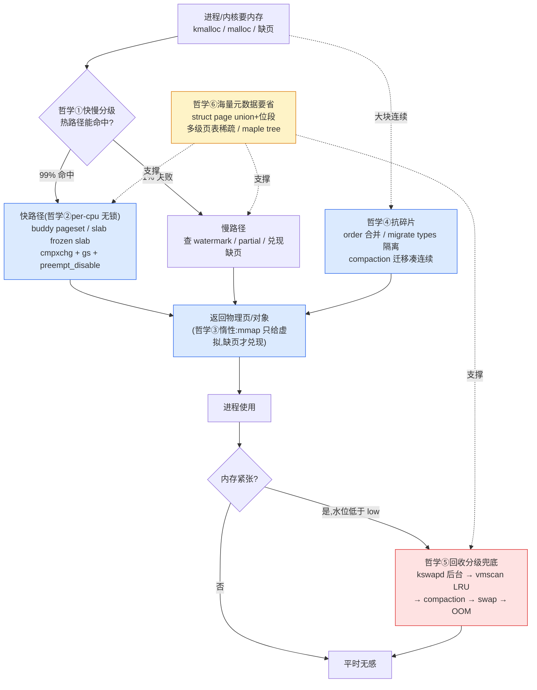

# 第二十一章 · Linux mm 的哲学 + ★对照第 8 本总表

> 篇:第 7 篇 · 收尾(收束)
> 本章标 ★,是全书收束章。主线呼应:从 P0-01 的"内核为什么必须管内存"出发,我们走过 buddy(P1)、slab(P2)、vmalloc/percpu(P3)、用户地址空间(P4)、回收(P5)、进阶(P6)。二十章下来,你脑子里现在应该有一整部电影:一次 `kmalloc` 怎么从 buddy 拿到页、一次用户 `malloc` 怎么在缺页时映射到物理页、内存紧张时 kswapd 怎么趁还没到 min 提前回收、碎片化时 compaction 怎么迁移凑连续、回收不来 swap 也换不出来时 OOM 怎么挑进程杀。这一章不再加新机制,而是把这些机制**收束成一组哲学**——Linux mm 在不同篇章里反复用的同一组设计取向,看穿它们你就拿到了"看任何新 mm 机制都能猜出它长什么样"的钥匙。然后给一张**内核 mm vs 用户态分配器(tcmalloc/jemalloc)对照总表**,把本书和第 8 本《内存分配器》钉成"内存分配全栈"。

## 核心问题

**全书收束——Linux mm 在二十章里反复用的设计哲学是什么?这些哲学各自解决了什么本质问题、为什么 sound、不这么写会撞什么墙?再把内核 mm 和用户态分配器(tcmalloc/jemalloc)对照成一张总表,看清"内核态分配"和"用户态分配"同构在哪、分野在哪,合成全栈的接口在哪?**

读完本章你会明白:

1. **六条贯穿全书的设计哲学**:快慢路径分级、per-cpu 无锁快路径、惰性分配按需兑现、buddy order + migrate types + compaction 抗碎片、回收的启发式 + 多级兜底、海量元数据要省。每条都能指到具体篇章的具体函数。
2. **per-cpu 无锁快路径**是其中最具代表性的技巧——`gs` 段基址 + `preempt_disable` + `cmpxchg` 为什么 sound,用户态为什么学不去。
3. **一张内核 vs 用户态对照总表**(本书 vs 第 8 本),沿 P2-10 的五维表扩展到全书八个维度,看清"同构在前几维、分野在物理页归属和回收",缝合处就在 `brk`/`mmap`。
4. **全书总收束**:回到第一性原理"内核怎么把物理内存分出去又收回来",三件事、二分法、命脉双线一路串到底。
5. **往哪钻**:附录 A 全景图、附录 B 阅读地图、MEL Gorman 的书、LPC/LSF/MM talks。

---

## 21.1 一句话点破

> **Linux mm 二十章的机制,拆到根上都是同一组哲学:热路径无锁分级、按需才兑现、把同类的页归类存放、紧张时分级兜底、元数据按位挤。它们不是散落在各 .c 里的孤岛,而是同一组工程取向在不同篇章的复用——学透这组哲学,任何新 mm 机制你都能先猜出它的形状再去看代码。而内核 mm 和用户态分配器(tcmalloc/jemalloc)在前几维上同构(同约束逼出同解),真正的分野只有两处:物理页归属(内核是主人 vs 用户态只能向内核批发),和有没有内核级回收——这正是两本书合成"内存分配全栈"的缝合处。**

这是结论,不是理由。本章倒过来拆:先把六条哲学一条条拎出来(每条都指到具体篇章、具体函数、不这么写会怎样),再用一节技巧精解把其中最具代表性的 per-cpu 无锁快路径钻到底,然后给对照总表,最后回到第一性原理收束。

---

## 21.2 哲学①:快慢路径分级 —— 热路径极简,慢路径兜底

### 是什么

**凡是分配/回收的入口,都先走一条极简的快路径(几乎无锁、几乎不检查),失败才回退到一条慢路径(拿锁、查水位、做回收、做规整)。** 快路径赌的是"99% 的情况都能命中",把那 1% 的复杂情况留给慢路径——这样绝大多数调用既快又简单,复杂逻辑不会污染热路径。

### 出现在哪些篇章

这条哲学几乎是 Linux mm 的**普适范式**,每篇都有它的影子:

- **P1-04 buddy 分配**:`__alloc_pages` 先走快路径 [`get_page_from_free_area`](../linux/mm/page_alloc.c#L709)([page_alloc.c:709](../linux/mm/page_alloc.c#L709))—— 直接从 zone 的 `free_area[]` 摘一页,**无锁**(zone 在快路径下用 per-cpu 的视角,临界区极短)、不查水位、不唤醒 kswapd。水位满足时这条路径走完就返回了。只有快路径拿不到(`__rmqueue` 失败,或水位不够),才回退到慢路径 [`__alloc_pages_slowpath`](../linux/mm/page_alloc.c#L4046)([page_alloc.c:4046](../linux/mm/page_alloc.c#L4046))——在这里才查 watermark、唤醒 kswapd、做直接回收 `__alloc_pages_direct_reclaim`、做 compaction `__alloc_pages_direct_compact`、最后才考虑 OOM。
- **P2-08 slab 分配**:`slab_alloc_node`(slub.c:3826)先走快路径——从本 CPU 的 `cpu_slab->freelist` 用 `cmpxchg` 摘一个对象,几乎无锁(技巧精解详讲)。失败才回退到慢路径 `___slab_alloc`(slub.c:3376)——去 per-cpu partial 链、per-node partial 链、最后 `allocate_slab` 找 buddy 要新页。
- **P4-14 缺页中断**:`handle_mm_fault` 也分级。绝大多数缺页走"快路径"——`do_anonymous_page`(memory.c:108)/`do_read_fault`/`do_wp_page` 里直接分配一页建 PTE。只有特殊情况(文件预读、写时复制、跨进程共享、userfaultfd)才走更重的处理路径。
- **P5-16 回收路径**:kswapd 是"后台快回收"(balance_pgdat 在低于 low 时悄悄跑),业务直接回收 `__alloc_pages_direct_reclaim` 是"慢回收"(严重时才触发)。

### 为什么 sound

热路径被调用得最频繁(`kmalloc`、缺页每秒被调几万到几十万次),它**每省一行代码,整个系统的吞吐就上一个台阶**。慢路径里的复杂逻辑(查 watermark、唤醒 kswapd、做规整)虽然必要,但**只在异常情况下需要**——把它们挪出热路径,既让热路径跑得飞快,也让慢路径能从容做复杂判断,不互相拖累。

### 反面对比:无分级会怎样

假设朴素地写——`__alloc_pages` 一上来就**每次**都查 watermark、查 NUMA、看要不要唤醒 kswapd、看要不要 compaction。后果:

1. **每次分配都慢**:哪怕内存富余,也要走几十行检查,吞吐塌方。
2. **kswapd 反复唤醒**:每次分配都判水位,kswapd 被抖动式唤醒,系统的后台回收抖动加剧。
3. **复杂逻辑挤热路径**:热路径越来越难维护,容易出 bug。

这就是 Linux 把 `__alloc_pages` 劈成 `get_page_from_free_area`(快)+ `__alloc_pages_slowpath`(慢)的根本原因——**热路径越薄越好,慢路径越周全越好**。

> **钉死这件事**:快慢路径分级是 Linux mm 二十章里最普适的范式。它不是"碰巧这么写",而是工程上对"高频调用必须极简"的硬性回应——把 99% 能命中的简单情况和 1% 的复杂情况物理隔离开。看任何 mm 入口函数,先问"它哪里是快路径、哪里是慢路径、退路是什么",你就能猜出它的大致形状。

---

## 21.3 哲学②:per-cpu 无锁快路径 —— 把锁竞争消灭在物理结构里

### 是什么

**凡是"热路径 + 多核并发"的地方,内核都按 CPU 切分数据,让每 CPU 操作自己那份,从而把锁竞争消灭在数据结构层。** 内核有特权(关抢占 + `gs` 段基址),能保证"读基址 → 访问数据"这一段是原子的,所以 per-cpu 数据在快路径上**几乎无锁**——靠 `cmpxchg` 检测并发,失败重试。

### 出现在哪些篇章

这条哲学贯穿全书,是 Linux 在多核上的核心武器:

- **P1-05 buddy 释放**:`free_unref_page`(page_alloc.c:2479)把页**先进本 CPU 的 per-cpu pageset**(`zone->per_cpu_pageset`,mmzone.h:846 里的 `struct per_cpu_pages __percpu`,L687),`pcp->count` 累积到阈值才批量归还 zone。这样热释放不打 zone 的自旋锁。
- **P2-08 slab 分配**:每 CPU 一个 `kmem_cache_cpu`(slub.c:384),`freelist`(快路径摘对象)+ `slab`(当前 slab,frozen)+ `partial`(per-cpu 半满 slab 链)。`cmpxchg` 双字段(`freelist` + `tid`)原子更新,失败重试。
- **P3-11 percpu 变量**:`DEFINE_PER_CPU(type, name)` 给每个 CPU 一份独立副本,访问 `this_cpu_read`/`this_cpu_write` 用 `gs` 段基址**零锁**。网络栈、调度器统计、VM 计数器(`vm_stat`)全靠它。
- **P5-17 LRU/workingset**:每个 LRU 链 per-pgdat(per-node)切分,回收时尽量本地化。
- **P1-03 buddy `vm_stat`**:`vm_stat[s]` 是 per-cpu 的,统计页状态(`NR_FREE_PAGES` 等)时不打全局锁,定期 flush 到全局。

### 为什么 sound

锁竞争的代价随核数**超线性**增长(8 核比 4 核锁竞争不止 2 倍),per-cpu 把"全局一把锁"切成"每 CPU 一份",竞争降到**零**(物理隔离,根本不会撞到一起)。这要求 per-cpu 数据访问必须保证"读基址 → 访问数据"这一段不被迁 CPU,内核靠 `preempt_disable` + `gs` 段基址实现(`gs` 跟 CPU 走,不跟线程走)。这是**内核特权**,用户态学不来。

### 反面对比:每次锁全局会怎样

假设 slab 的快路径每次都锁 per-node `kmem_cache_node->list_lock`——后果:

1. **核越多越堵**:64 核机器上,每秒几十万次分配全撞一把锁,自旋等待占满 CPU,吞吐随核数反向下降。
2. **缓存行乒乓**:锁变量在多个 CPU 的 L1/L2 之间反复乒乓,即便不阻塞也极大拖慢。

这就是 SLUB 区别于老 SLAB 的最大性能优势——**把 freelist 摞到 per-cpu,快路径几乎完全不碰锁**。

> **钉死这件事**:per-cpu 无锁快路径是本书技巧精解的"主角",它和哲学①(快慢分级)合在一起,是 Linux mm 在多核上跑得快的两条腿。下一节技巧精解专拆它。

---

## 21.4 哲学③:惰性分配,按需兑现 —— 现在不给,要的时候才给

### 是什么

**凡是"承诺"内存(给虚拟地址、给文件映射、fork 父进程页),都不立刻兑现物理页——等真正访问时再给。** 这是 Linux mm 对"内存稀缺"的核心回应:既然物理页是稀缺资源,就不该为"还没用上的承诺"提前消耗它。

### 出现在哪些篇章

这条哲学贯穿用户地址空间和回收:

- **P4-12 VMA + mmap**:`do_mmap`(mmap.c:1214)/`mmap_region`(mmap.c:2715)只**建一个 VMA**(虚拟区间记录在 maple tree 里),**不给物理页**。`malloc(1<<30)` 立刻返回成功,但此刻物理内存一滴没动。
- **P4-14 缺页中断**:进程真正读写那个虚拟地址时,触发缺页,`do_anonymous_page`(memory.c:108)才分配一页、建 PTE。**只兑现访问到的那个页,其余的虚拟区间仍只是承诺**。一个 `malloc(1<<30)` 实际只访问了 1MB,内核就只给 1MB 物理页,剩下的 1GB-1MB 永远不占物理内存。
- **P4-14 写时复制(COW)**:`fork()` 不复制父进程的所有页——子进程共享父进程的页(PTE 标只读),只有**写**发生时才 `do_wp_page` 复制。一个 fork 出来不立刻写的子进程,几乎零内存开销。
- **P4-14 零页(zero page)**:读一个还没映射的匿名页,先映射到全局**零页**(`ZERO_PAGE`),不分配新页。只有**写**时才升级成真正的物理页。
- **P5-19 swap 按需换入**:换出到 swap 的页,换出后 PTE 标"swap entry";进程再访问时缺页,内核才从 swap 读回来。**swap 换出也不立刻换入,按需**。
- **P4-13 文件映射**:文件 `mmap` 后,只有访问到的页才通过 `do_read_fault` 从文件读进来,其余页还在磁盘上(`page cache` 按需填充)。

### 为什么 sound

进程**承诺**的内存远超它**实际**访问的内存——典型服务器进程 `malloc` 几 GB 实际只用几百 MB。如果按承诺提前分配,16GB 的机器跑几个进程就 OOM 了。按需兑现把物理内存的消耗**严格等于实际访问量**,而不是等于承诺量。

### 反面对比:预分配会怎样

假设 `malloc(1<<30)` 立刻给 1GB 物理页——后果:

1. **物理内存立刻耗光**:一个进程声称要用 1GB,实际只用 10MB,剩下 990MB 被白占,别的进程没得用。
2. **fork 无法便宜**:fork 必须复制父进程全部页,一个 10GB 进程 fork 一次要 20GB——根本不可行。
3. **零页机会浪费**:大块 `calloc`(分配清零)会真的分配清零,而惰性方案下 `calloc` 读到的都是同一个零页。

惰性分配是 Linux mm 把"承诺"和"实际"分离的核心设计——P4-12 VMA/页表这对"虚拟物理"二分,就是它的载体。

> **钉死这件事**:惰性分配不是优化,是 Linux mm 能让"多个进程的虚拟地址空间之和远超物理内存"这件事成立的根本。没有它,所有 `malloc` 都得兑现物理页,虚拟内存的意义就没了。

---

## 21.5 哲学④:buddy order + migrate types + compaction —— 把同类的页归类存放,抗碎片

### 是什么

**物理页不能"随便找个空闲页就给",要按迁移性分类(MOVABLE/UNMOVABLE/RECLAIMABLE),让会动的页待在一起、不会动的页待在一起——给大块连续(大页、高阶分配)留余地。碎片化不可避免时,compaction 把 MOVABLE 页迁走凑连续。**

### 出现在哪些篇章

这条哲学是 P1 的核心,贯穿后续的大页和回收:

- **P1-03 buddy 算法**:按 order(2^N 页)管理空闲,`__free_one_page`(page_alloc.c:765)合并伙伴到更高 order。**order 让小碎片能合回去**,抗外碎片。
- **P1-06 migrate types**:每个 pageblock 一个 migrate type,`__rmqueue`(page_alloc.c:2087)优先从同类型 pageblock 取页。MOVABLE 页(用户进程匿名页、文件页)和 UNMOVABLE 页(内核 slab、内核栈)物理隔离——UNMOVABLE 不会卡住大块连续,因为它集中在一小片。
- **P5-18 compaction**:碎片化导致拿不到大块连续时,compaction(`compact_zone`,compaction.c:2525)把 MOVABLE 页迁移走,凑出连续大块。THP 透明大页依赖它。
- **P1-06 CMA**:给设备预留一段连续区,平时允许 MOVABLE 页占着,设备要时迁走。

### 为什么 sound

外碎片(external fragmentation)是按页分配的天然敌人:很多小块分配/释放后,buddy 的 `free_area[high_order]` 空了,只剩 `free_area[0]` 有一堆单页——拿不出 2MB 大页。Linux mm 用三招抗碎片:① order 让小页能合并回大块(buddy 本质);② migrate types 隔离 UNMOVABLE(不让它打散大块);③ compaction 主动迁走 MOVABLE 凑连续。三招合起来,即使在长期运行的服务器上,内核仍能动态挤出大页。

### 反面对比:不分类型会怎样

假设朴素地"任何空闲页都能给任何类型"——后果:

1. **几天就碎片化**:一个 slab 对象占的页(UNMOVABLE)散落在物理内存各处,把 2MB 大页能用的连续区切成渣。
2. **大页永久拿不到**:THP 透明大页退化成 4KB 小页,TLB miss 暴涨,性能下降 10~30%。
3. **compaction 救不回来**:如果不分类型,compaction 没有目标(MOVABLE 才能迁,UNMOVABLE 不能),规整也无从下手。

migrate types 是 Linux 2.6.24 之后加的(之前 mm 会被碎片化卡死),是现代 mm 能长期不重启的关键。

> **钉死这件事**:buddy order + migrate types + compaction 是一组协同的抗碎片武器。order 是底层(能合伙伴),migrate types 是分类(不让 UNMOVABLE 散开),compaction 是主动出击(迁 MOVABLE 凑连续)。少了任何一招,Linux 跑几天就退化。

---

## 21.6 哲学⑤:回收的启发式 + 多级兜底 —— 平时无感,紧张时逐级加码

### 是什么

**内存紧张不是一刀切,而是一套分级启发式:先靠 watermark 预判(kswapd 后台回收)→ 用 LRU/workingset 选冷页(vmscan)→ compaction 规整碎片 → swap 换出 anon 页 → 实在没了 OOM 杀进程。每一级都比前一级更激进、更慢、更费代价,但平时业务基本无感。**

### 出现在哪些篇章

这条哲学是 P5 的核心:

- **P5-16 watermark + kswapd**:每个 zone 有 `_watermark[WMARK_HIGH/LOW/MIN]`(mmzone.h)。空闲页降到 low 时唤醒 `kswapd`(vmscan.c:7097)在后台回收,**业务不阻塞**。降到 min 时业务才被迫直接回收(`__alloc_pages_direct_reclaim`)——这是要避免的。**kswapd 是趁还没到 min 抢前回收**,让业务的快路径(哲学①)尽量不进慢路径。
- **P5-17 LRU + workingset + vmscan**:回收选页不是随机,而是 LRU(least recently used)+ workingset 价值估算。`shrink_folio_list`(vmscan.c:1011)从 inactive LRU 扫,优先回收**长时间没访问**的页。workingset 用页的 refault 距离估算"这页有多大价值",防止把热页误回收。
- **P5-18 compaction**:回收之后如果还缺连续大块(THP 要),compaction 上。
- **P5-19 swap + OOM**:anon 冷页换出到 swap(`swapfile.c`、`zswap`),文件页丢弃(干净的)或回写(脏的)。再不行,`select_bad_process`(oom_kill.c:365)+`oom_kill_process`(oom_kill.c:1013)按 oom_score 挑进程杀。

### 为什么 sound

内存紧张的程度是**连续**的,从"还富余,稍微回收一下"到"已经没了,得杀进程"。单一策略(要么不回收,要么直接 OOM)两头不讨好:要么抖动(回收太激进),要么 OOM(回收太迟)。分级兜底让每一级都处理它最擅长的场景:watermark 负责预判,kswapd 负责后台,LRU 负责选冷页,compaction 负责连续,swap 负责最冷的页,OOM 是最后兜底。**业务在 watermark → swap 之间几乎无感**(kswapd 在后台干活),只有真正到 min 且直接回收也来不及,才会 OOM。

### 反面对比:单一策略会怎样

假设朴素地"满了才一把梭"——后果:

1. **抖动**:内存刚满,业务每次分配都触发直接回收,延迟尖刺;回收几页又用完,再回收,系统反复抖。
2. **OOM 频发**:回收策略简单,选错热页,把活跃页换出,立刻缺页再换回(thrashing),最后只能 OOM。
3. **没有连续**:不规整,THP 永久拿不到大页。

Linux 的多级兜底把"内存紧张"做成了一个**渐变**过程,业务在绝大多数情况下感觉不到回收在发生。

> **钉死这件事**:回收的启发式 + 多级兜底是 Linux mm 能在内存紧张时仍保持"稳"和"省"的核心。它不是"满了才做",而是"预测、预防、分级、兜底"——和哲学①的快慢分级是镜像关系(一个分级给内存,一个分级收内存)。

---

## 21.7 哲学⑥:海量元数据要省 —— 几百万页/几亿 PTE,不能把自己撑爆

### 是什么

**mm 要管理海量小对象(几百万个 `struct page`、几亿个 PTE、每个进程成千上万个 VMA),元数据本身可能比被管理的数据还大。内核靠三招省:union 复用(同一块内存在不同时期扮演不同角色)、位段(挤进 unsigned long 的各位)、稀疏结构(多级页表/maple tree 只为存在的部分分配)。**

### 出现在哪些篇章

- **P0-01/P1-02 `struct page` 紧凑布局**:union 复用(空闲页/映射进进程的页/slab 用的页互斥角色共享内存)+ flags 位段(SECTION/NODE/ZONE/LRU_GEN/PG_* 全挤进一个 `unsigned long`)。64 位系统压到约 64 字节,几百万页才几百 MB 元数据。
- **P1-02 folio**:`folio` 是 head page 的扶正,解决 tail page 字段挪用导致的 bug,本质上也是省——一个 folio 的元数据集中在 head,不重复在 tail。
- **P4-13 多级页表**:x86_64 四级页表(pgd/pud/pmd/pte),只为**实际映射**的虚拟地址区间建下层表。一个 256TB 虚拟地址空间如果平铺要 TB 级页表,多级只为存在的部分分配,典型进程只占几 MB 页表。
- **P4-12 maple tree**:VMA 用 maple tree(B-tree 变种,RCU-safe)替代老的红黑树 + rb_augmented,搜索/插入/区间查询都更快,且**只为存在的 VMA 分配节点**——稀疏。
- **P2-07 slab freelist 内嵌**:freelist 指针借用空闲对象体内的字节(P2-07 详讲),零额外开销。

### 为什么 sound

mm 的元数据规模是物理规模量级——16GB 机器有 4 百万页,要给每页记状态;256TB 虚拟空间要建页表;一个长跑进程几千 VMA。如果元数据朴素罗列(每页几百字节、页表平铺、VMA 链表节点几百字节),元数据自己就把内存吃光。三招省(union 复用、位段、稀疏结构)让 mm 在"管海量对象"和"省自己开销"之间平衡。

### 反面对比:平铺元数据会怎样

假设朴素地给每个物理页一个 256 字节的 `struct page`(每字段独立)——后果:

1. **16GB 机器,`struct page` 占 1GB**:256 字节 × 4 百万 = 1GB,光账本就吃掉 6.25% 物理内存。
2. **256TB 虚拟空间,页表平铺要 PB 级**:显然不可能。
3. **进程 VMA 用链表节点**:几千 VMA × 几百字节,加上搜索 O(n),慢且费。

Linux mm 的省元数据哲学,是"管海量对象"的必修课。

> **钉死这件事**:`struct page` 的 union + 位段、多级页表的稀疏、maple tree 的 RCU B-tree,本质都是同一招——**承认被管理的对象稀疏/状态互斥,只在需要的地方分配元数据,并把元数据本身按位挤紧**。这条哲学在二十章里反复出现。

---

## 21.8 技巧精解:per-cpu 无锁快路径 —— 全书最具代表性的技巧

二十章里如果只挑一个技巧讲透,就是它。per-cpu 无锁快路径是哲学①(快慢分级)和哲学②(per-cpu 切分)的合体,是 Linux mm 在多核上跑得快的命脉。这一节以 buddy 的 pageset + slab 的 frozen slab 为例,钻到底层机制讲清"`gs` 段基址 + `preempt_disable` + `cmpxchg` 为什么 sound"。

### 21.8.1 buddy 的 per-cpu pageset:热释放不打 zone 锁

看 buddy 释放的快路径 [`free_unref_page`](../linux/mm/page_alloc.c#L2479)([page_alloc.c:2479](../linux/mm/page_alloc.c#L2479))。这个函数干的事:把要释放的页**先进本 CPU 的 per-cpu pageset**(`zone->per_cpu_pageset[cpu]`,定义见 [mmzone.h 的 `struct per_cpu_pages`](../linux/include/linux/mmzone.h#L687)),不直接归还 zone。

为什么这么设计?buddy 的 `free_area[]` 是 zone 级的,归还要锁 zone。如果每次释放(每秒几万到几十万次)都锁 zone,64 核机器上锁竞争会爆炸。pageset 把"零散释放"先攒在 per-cpu 缓存里,`pcp->count` 到阈值才批量归还 zone——**热释放路径几乎不打 zone 锁**。

访问 per-cpu pageset 的底层机制是两条:

```c
// 简化示意(非源码原文),核心是 preempt_disable + this_cpu_ptr
pcpu_task_pin();                            // = preempt_disable() (page_alloc.c:117)
pcp = this_cpu_ptr(zone->per_cpu_pageset);  // 读 gs:offset 拿本 CPU 的 pcp
// ... 操作 pcp->list / pcp->count ...
pcpu_task_unpin();                          // = preempt_enable()
```

`pcpu_task_pin()` 就是 `preempt_disable()`([page_alloc.c:117](../linux/mm/page_alloc.c#L117))——关抢占。`this_cpu_ptr` 读 `gs:offset` 拿本 CPU 的 pageset 基址。**关抢占的目的是:保证"读 gs 基址 → 操作 pcp"这一段中间,本 CPU 不会被抢占、调度到别的 CPU 上**(如果被迁 CPU,后续操作就跑到别的 CPU 的 pageset 了,因为 `gs` 跟 CPU 走)。

### 21.8.2 slab 的 frozen slab:快路径几乎无锁

再看 slab 分配的快路径 [`slab_alloc_node`](../linux/mm/slub.c#L3826)。它从本 CPU 的 [`cpu_slab->freelist`](../linux/mm/slub.c#L384)([slub.c:384](../linux/mm/slub.c#L384))用 `cmpxchg` 摘一个对象。这里的核心是 [`struct kmem_cache_cpu`](../linux/mm/slub.c#L384-L400) 的双字段打包:

```c
// mm/slub.c#L384-L400 (per-cpu 快路径缓存)
struct kmem_cache_cpu {
    union {
        struct {
            void **freelist;    /* Pointer to next available object */
            unsigned long tid;  /* Globally unique transaction id */
        };
        freelist_aba_t freelist_tid;   // ★ 双字段打包成一个 128-bit,cmpxchg 双字一次
    };
    struct slab *slab;          /* The slab from which we are allocating */
    ...
};
```

注意 `freelist` 和 `tid` 用 union 打包成 `freelist_tid`——这样一个 `cmpxchg128`(128 位原子比较交换)能同时原子更新两个字段。`tid` 编码了"当前 CPU id + 一个递增计数器",作用是**检测中断/抢占里有没有人改过 freelist**:

1. 进入快路径前,读 `tid = this_cpu_read(s->cpu_slab->tid)`,记录当前 CPU。
2. 读 `freelist = c->freelist`,算下一个对象 `next = get_freepointer(...)`。
3. `cmpxchg` 双字段原子更新:`{freelist, tid}` → `{next, tid + N}`(N 编码了新 CPU)。**只有当 cpu_slab 当前值仍等于我读出来的 `{freelist, tid}` 才成功**。
4. 如果中间本 CPU 被中断、中断里又分配了(改了 freelist 和 tid),cmpxchg 失败——慢路径重试。

`tid` 为什么还要编码 CPU id?因为**线程可能在 cmpxchg 之前被迁 CPU**——迁到别的 CPU 后,它的 tid 还在原地,但操作目标变成了**别的 CPU 的 cpu_slab**。tid 编码 CPU id 后,cmpxchg 检测到 CPU 变了(tid 编码的 CPU 跟当前 CPU 不符),立刻失败重试。

### 21.8.3 为什么 sound:三层保障

per-cpu 无锁快路径的"sound"靠三层保障:

1. **`gs` 段基址**(`this_cpu_ptr` 的物理基础):每个 CPU 一个 `gs` 段基址,CPU 0 访问 `gs:offset` 是 CPU 0 的 per-cpu 区域,CPU 1 访问 `gs:offset` 是 CPU 1 的——物理隔离,根本不会撞到一起。这是 x86_64 硬件给的机制。
2. **`preempt_disable`**(关抢占):保证"读 gs 基址 → 访问 per-cpu 数据"这一段中间本线程不被迁 CPU。如果不关抢占,刚读完基址就被调度到别的 CPU,后续访问就跑到错的 per-cpu 区域了。
3. **`cmpxchg` + `tid`**:检测"中间被改过"(中断/抢占里又有人改了 per-cpu 数据)的情况,失败重试。这是对"读 → 改"窗口的兜底。

这三层合起来,保证了 per-cpu 数据在**几乎无锁**的情况下正确。为什么叫"几乎"无锁?因为快路径不拿锁,但慢路径(快路径失败回退)还是会拿锁——但慢路径是少数,不影响整体性能。

### 21.8.4 反面对比:每次锁全局会怎样

假设朴素地写——每次 slab 分配都锁 per-node `kmem_cache_node->list_lock`(全局视角)。后果:

1. **64 核机器锁竞争爆炸**:每秒几十万次分配全撞一把锁,自旋等待占满 CPU,吞吐随核数**反向下降**(核越多越慢)。
2. **缓存行乒乓**:锁变量在 64 个 CPU 的 L1/L2 之间反复乒乓,即便不阻塞也极大拖慢。

SLUB 这套 per-cpu frozen slab + cmpxchg,把 99% 的分配路径**完全无锁**,慢路径(回 per-node partial)才拿锁——这就是它在多核上的核心优势。

### 21.8.5 用户态为什么学不去

这套机制的物理基础——`gs` 段基址 + `preempt_disable`——是**内核特权**。用户态进程:

- 看不到 `gs` 段基址(虽然可以 `sched_getcpu()` 查,但每次 malloc 都查太慢,且不保证一致)。
- 关不了抢占(用户态没有这个特权),所以"读基址 → 访问数据"这一段不能保证原子。

这就是用户态分配器(tcmalloc/jemalloc)只能选 per-thread 而不能选 per-cpu 的根本原因(详见 P2-10)。**内核 per-cpu 的优势,正是它有特权能看到 CPU、能关抢占**——这是哲学②在内核态下的专属红利。

> **钉死这件事**:per-cpu 无锁快路径是 Linux mm 二十章里最具代表性的技巧。它把"热路径无锁"做到极致,靠三层保障(`gs` + 关抢占 + cmpxchg)保证 sound。用户态学不去(没特权),所以用户态分配器只能 per-thread。这条技巧在 buddy pageset、slab frozen slab、percpu 变量、vm_stat 上反复出现——是 Linux 在多核上跑得快的命脉。

---

## 21.9 ★对照第 8 本总表:内核 mm vs 用户态分配器

这一节把本书和第 8 本《内存分配器设计与实现深入浅出》钉成一张总表。沿 P2-10 的五维表(size class / per-X / 载体 / 中央堆 / 批发边界),扩展到全书八个维度——前几维同构(同约束逼出同解),真正的分野在"物理页归属"和"有无内核级回收"。

> **如何读这张表**:左列是"维度",中列是内核 mm(本书),右列是用户态分配器(tcmalloc/jemalloc,第 8 本)。每个维度下面附一句"同/异 + 为什么"。前四维(P2-10 已展开)这里简表回顾,后四维是本书扩展的新维度。

| 维度 | 内核 mm(本书 · 内核态) | 用户态分配器(第 8 本 · 用户态) | 同/异 |
|------|----------------------|------------------------------|------|
| **① 物理页归属** | **内核是物理页的主人**——buddy 直接管所有空闲物理页(`free_area[]`),slab 找 buddy 要页(`alloc_pages_node`)没有中间层 | **用户态不拥有物理页**——只是进程里的 `.so`,只能通过 `brk`/`mmap` 系统调用向内核批发虚拟大块 | **★ 异**(根因) |
| **② 页级管理** | **buddy**:order 2^N、`free_area[]`、合并伙伴([`__free_one_page`](../linux/mm/page_alloc.c#L765)) | tcmalloc **PageHeap/Span**:span 是连续 N 页的块;jemalloc **extent**:类似 | 同(都是页级块管理 + 合并) |
| **③ 小对象** | **slab/slub**:`kmem_cache` 固定大小对象池 + 内嵌 freelist + `kmalloc` size class(`kmalloc-8/16/.../2M`) | tcmalloc **size class + ThreadCache**;jemalloc **tcache + arena** | 同(都是 size class + freelist) |
| **④ per-X 快路径** | **per-cpu**(`kmem_cache_cpu` + `cmpxchg`,特权:`gs` + `preempt_disable`);buddy `per_cpu_pageset` | **per-thread**(tcmalloc ThreadCache、jemalloc tcache,用户态无特权只能绑线程) | **★ 异**(per-cpu vs per-thread,P2-10 详讲) |
| **⑤ 大块连续** | 内核:**vmalloc**(虚拟连续,物理离散,靠页表缝,P3-11);用户映射:**mmap + 缺页** | 用户态:**`mmap` 大块直接映射**(找内核批发虚拟大块),用户态无"虚拟连续物理离散"概念 | 异(内核有 vmalloc 独有,用户态靠 mmap) |
| **⑥ 按需兑现** | **惰性分配**:mmap 只建 VMA(P4-12)、缺页才给页(P4-14)、fork 用 COW、零页、swap 按需换入 | **半惰性**:`sbrk`/`mmap` 拿虚拟大块也是惰性,但用户态分配器内部常用 `madvise(MADV_POPULATE)` 等预触;free 归还靠 madvise(MADV_DONTNEED) | 同(都惰性),但内核兑现靠缺页,用户态靠 free 归还 |
| **⑦ 回收** | **完整多级回收**:watermark + kswapd 后台(P5-16)→ LRU/workingset/vmscan(P5-17)→ compaction(P5-18)→ swap + OOM(P5-19)。这是本书 P5 的全部内容 | **基本无回收**——用户态分配器只在 free 时归还,或 madvise 主动释放;冷热由分配器自己 LRU-ish 管理(tcmalloc `sampled` 算法),不能回收别的进程的页 | **★ 异**(根因) |
| **⑧ 海量元数据省** | `struct page`(union + 位段,P0-01)、多级页表(稀疏,P4-13)、maple tree(RCU B-tree,P4-12)、slab 内嵌 freelist | tcmalloc/jemalloc 的 span metadata(PageMap 放 span 信息)、radix tree 反查 extent——同样省,但元数据规模小得多(只管进程自己的页) | 同思路(都省),但内核规模大得多(几百万页 vs 几万页) |

### 表后总括

读完这张表,一个判断立刻显形:**前四维(页级管理、小对象、per-X、按需兑现)两边同构**——同一组物理约束(任意大小归并、抗锁竞争、紧凑载体、按需兑现)逼出同一个最优解。**真正的分野只有两处:**

1. **物理页归属**(维度①):内核是物理页的主人(buddy 直接给页,没有 sbrk),用户态只能通过 `brk`/`mmap` 向内核批发虚拟大块。这就是 P2-10 讲的"批发边界"——**用户态分配器的批发请求,正是本书第 4 篇 mmap/缺页的服务对象,这是两本书的接口**。
2. **有无内核级回收**(维度⑦):内核有完整的多级回收(watermark/kswapd/vmscan/compaction/swap/OOM),用户态基本没有(只能 free 自己的,或 madvise 提示)。**这是用户态分配器无法替代内核 mm 的根本**——用户态 `free` 只是把对象放回自己的 freelist,物理页还在;真正"把物理内存收回来"只有内核能做。

这两处分野,正是"内存分配全栈"被切成两半的地方。本书(内核 mm)和第 8 本(用户态分配器)合起来,才是 `malloc` 一行调用背后的全部。**缝合处在 `brk`/`mmap`**:用户态分配器从这里向内核批发,内核从这里建 VMA、在缺页时给物理页、在内存紧张时从这里收回。看穿这条缝合线,你就看穿了"内存分配全栈"的形状。

---

## 21.10 一张图:六条哲学怎么串成"分出去又收回来"

把六条哲学和"分配 vs 回收"二分法画成一张图,看它们怎么串起来:



这张图把六条哲学钉在"分出去又收回来"的主线上:

- **哲学①②③④** 服务**分配**(把内存分出去):快慢分级让分配又快又周全,per-cpu 让热路径无锁,惰性让"承诺"不立刻吃物理页,抗碎片让大块连续拿得出。
- **哲学⑤** 服务**回收**(紧张收回来):分级兜底让回收平时无感、紧张有梯子。
- **哲学⑥** 支撑两者:海量元数据要省,是 mm 能管海量对象的根本。

---

## 章末小结

这一章是全书的**收束章**。我们没有加新机制,而是把二十章里的设计取向提炼成六条哲学,再用一节技巧精解钻透其中最具代表性的 per-cpu 无锁快路径,然后给了一张内核 mm vs 用户态分配器的对照总表。回到全书第一性原理:

> **内核怎么把物理内存这片共享资源"分出去"(buddy/slab/mmap),紧张时"收回来"(vmscan/compaction/swap/OOM)——每一层都在"快"和"省"之间平衡。**

这个"分出去又收回来"的过程,六条哲学贯穿:

1. **快慢路径分级**:热路径极简,慢路径兜底。
2. **per-cpu 无锁快路径**:把锁竞争消灭在物理结构里。
3. **惰性分配,按需兑现**:承诺不立刻兑现物理页。
4. **buddy order + migrate types + compaction**:归类存放,抗碎片。
5. **回收的启发式 + 多级兜底**:平时无感,紧张逐级加码。
6. **海量元数据要省**:union + 位段 + 稀疏结构。

支撑这一切的,是三件事(分配 / 映射 / 回收)和一条二分法(分配路径 vs 回收路径)。任何一处看不懂,回到二分法问"这是在把内存分出去,还是在紧张时收回来,或是在支撑这两件事?"

而内核 mm 和用户态分配器(tcmalloc/jemalloc)拼起来,就是 `malloc` 一行调用背后的"内存分配全栈"——前几维同构(同约束逼出同解),分野在物理页归属和有无内核级回收,缝合处就在 `brk`/`mmap`。

### 五个"为什么"清单(收束级大问题)

1. **如果让你从头设计一个 mm,你会先做什么?** 先立账本(`struct page`/zone/node,P1-02),没有账本就无从管;再立分配(buddy P1-03~06,快慢分级 + 抗碎片);再切对象(slab P2,per-cpu 无锁);再给用户地址空间(mmap + 缺页 P4,惰性兑现);最后立回收(P5,分级兜底)。哲学①~⑥在这条路上依次落地。

2. **per-cpu 无锁快路径为什么内核能做、用户态学不来?** 物理基础是 `gs` 段基址 + `preempt_disable`,都是内核特权。用户态看不到 CPU 亲和(不稳定)、关不了抢占,只能退而 per-thread。这是内核/用户态特权差异,不是设计偏好(详见 P2-10 和 21.8.5)。

3. **惰性分配和回收的分级兜底是不是同一个哲学的两面?** 是。惰性分配是"给内存时按需兑现",分级回收是"收内存时按需收回"——都是"不预先做、按需做"。这是 mm 对"稀缺资源"的核心回应。

4. **buddy 的 order 2^N 为什么是 2 的幂?** O(1) 找伙伴(伙伴地址 = 当前地址 XOR `(1 << order)`)、O(1) 合并(同样 XOR)、抗外碎片(同 order 的页能合到 order+1)。如果按字节分配,合并/拆分都是 O(n),而且碎片化无法收敛。详见 P1-03 技巧精解。

5. **内核 mm 和用户态分配器(tcmalloc/jemalloc)的缝合处在哪?** 在 `brk`/`mmap` 系统调用。用户态分配器从这里向内核批发虚拟大块,内核从这里建 VMA、在缺页时给物理页、在内存紧张时从这里收回。前几维同构,真正的分野在物理页归属(内核是主人)和有无内核级回收(只有内核能回收)。两本书合起来才是 `malloc` 全栈——这是本书和第 8 本的关系。

### 想继续深入往哪钻

本书主体到此结束。继续钻,有三条路:

1. **附录 A · 全景脉络**(`附录A-全景脉络.md`):两张大图——分配/回收两层全景图(把二十章所有组件画进一张)、一次 `kmalloc(128)` 和一次用户 `malloc(1<<30)` 的端到端时序图。看完这张图,二十章的所有组件在脑子里就串成一条完整的流。
2. **附录 B · 源码阅读路线与延伸**(`附录B-源码阅读路线与延伸.md`):mm/ 阅读地图(按本书篇章顺序列每篇对应核心 .c/.h)、观测工具(`/proc/meminfo`/`buddyinfo`/`slabinfo`/`vmstat`/`ftrace`/`crash`/`bpftrace`)、关键调参(`vm.swappiness`/`watermark_scale_factor`/`transparent_hugepage`/`overcommit`/...)、与 BSD/Mach VM 的对照、Linux mm 演进(folio/maple tree/MGLRU/per-VMA lock/mTHP)、推荐书和 LPC/LSF/MM talks。
3. **经典书**:MEL Gorman《Understanding the Linux Virtual Memory Manager》(2004,基于 2.6,虽然老但概念框架最清晰)、ULK(Understanding the Linux Kernel,Bovet & Cesati 第 3 版,mm 章)、Professional Linux Kernel Architecture(Wolfgang Mauerer)。这些是 mm 的"老三样",配合本书的动机+技巧双线读,效果最好。

本书到此收束。二十章下来,你应该能在脑子里放映出:一次 `kmalloc` 从 buddy 拿页、一次用户 `malloc` 在缺页时建映射、内存紧张时 kswapd/vmscan/compaction/swap/OOM 怎么逐级兜底——以及每一步底下 per-cpu 无锁、order 合并、惰性兑现、抗碎片、分级回收、省元数据这六条哲学是怎么撑起整个 mm 的。这才是"看懂 Linux mm"。

**全书完。**
