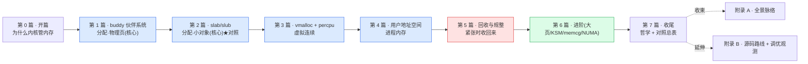

# 《Linux 内存管理设计与实现深入浅出:内核怎么把物理内存分出去又收回来》—— 目录与导读

> 一本写给"写过 Linux 用户态程序、甚至翻过 `mm/`,却总觉得一知半解"的人的小书。
>
> **一句话主旨**:内核怎么管理物理内存这片共享资源——buddy 分页、slab 切对象、mmap 建用户映射,紧张时回收/规整/换出;每一层都在"快"和"省"之间平衡。
>
> **二分法**(迷路时回到它):**分配路径**(给内存:buddy/slab/mmap) vs **回收路径**(紧张时:vmscan/compaction/swap/OOM)。
>
> **★ 对照《内存分配器》(第 8 本)**:内核态分配 vs 用户态分配,合成"内存分配全栈"。标 ★ 的章有对照栏。
>
> **基调**:直球讲透为主,比喻只在反直觉处点睛——延续《LevelDB》。

每章一行:**一句话钩子** —— 技巧标签 —— 二分法归属(`分配` / `回收` / `支撑` / `收束`)。

---

## 全书结构总览

旅程:从"物理内存是稀缺共享资源 + 硬件页表是地基",到"buddy 怎么按页分、slab 怎么切对象、用户 mmap 怎么建映射、缺页怎么给物理页",再到"内存紧张时 kswapd/vmscan 怎么回收、compaction 怎么规整、swap/OOM 怎么兜底"。每篇都是这条路上的一个驿站——读完你能在脑子里放映出内核内存管理的全过程。

---

## 第 0 篇 · 开篇:为什么内核要自己管内存

- [P0-01 · 第一性原理:为什么内核要管内存](P0-01-第一性原理-为什么内核要管内存.md) —— 物理内存稀缺+多进程要隔离+硬件 MMU/页表是地基;内核必须管分配/映射/回收;mm 全貌(buddy/slab/页表/回收)。 —— 分配 vs 回收的根本张力 —— `总览`

## 第 1 篇 · buddy 伙伴系统:分配·物理页 ⚠️ 核心

> 源码 `mm/page_alloc.c`、`include/linux/mmzone.h`、`include/linux/gfp.h`。**建议顺序读**(模型→算法→分配→释放→migrate)。

- [P1-02 · 物理内存模型 + node/zone/pgdat](P1-02-物理内存模型-node-zone-pgdat.md) —— 物理页怎么组织(struct page/folio)、NUMA 的 pg_data_t、zone 与 watermark。 —— struct page 紧凑布局 —— `分配`
- [P1-03 · buddy 算法:order、free_area、拆分合并](P1-03-buddy算法-order-free_area-拆分合并.md) —— 按 2^N 页管理空闲、free_area[]、分配拆分/释放合并伙伴。 —— buddy 合并抗碎片 —— `分配`
- [P1-04 · 分配路径 __alloc_pages:快路径与慢路径](P1-04-分配路径-__alloc_pages-快慢路径.md) —— 快路径(rmqueue,水位满足)+ 慢路径(唤醒 kswapd/直接回收/compaction);GFP 标志。 —— 快慢分级 + watermark —— `分配`
- [P1-05 · 释放路径 __free_pages + per-cpu pageset](P1-05-释放路径-__free_pages与per-cpu-pageset.md) —— 释放合并伙伴 + per-cpu pageset 缓存热页避免锁竞争。 —— per-cpu pageset 无锁快路径 —— `分配`
- [P1-06 · migrate types、pageblock 与 CMA](P1-06-migrate-types-pageblock与CMA.md) —— 页按可迁移性分类、pageblock、CMA 给设备大块。 —— migrate types 抗碎片 —— `分配`

## 第 2 篇 · slab/slub:分配·小对象 ⚠️ 核心 ★对照第8本

> 源码 `mm/slub.c`、`mm/slab_common.c`、`mm/slab.h`。和第 8 本《内存分配器》强对照。

- [P2-07 · kmem_cache、对象布局、freelist](P2-07-kmem_cache-对象布局-freelist.md) ★ —— kmem_cache(固定大小对象池)、slab 上摆满同型号对象 + freelist。 —— 对象布局 + freelist —— `分配`
- [P2-08 · alloc/free 路径 + per-cpu partial](P2-08-alloc-free路径与per-cpu-partial.md) ★ —— per-cpu frozen slab + partial 队列,cmpxchg 无锁分配。 —— frozen slab + cmpxchg 无锁 —— `分配`
- [P2-09 · kmalloc:size class 与全局 cache](P2-09-kmalloc-size-class与全局cache.md) —— kmalloc 按大小归并到 kmalloc-<size> cache。 —— size class —— `分配`
- [P2-10 · ★对照第 8 本:slab vs tcmalloc](P2-10-对照第8本-slab-vs-tcmalloc.md) ★ —— per-cpu partial vs thread cache、slab vs span/中央堆、内核无 sbrk。 —— 内核态 vs 用户态分配 —— `分配`

## 第 3 篇 · vmalloc 与 percpu:虚拟连续

- [P3-11 · vmalloc + percpu](P3-11-vmalloc与percpu.md) —— vmalloc(虚拟连续物理离散,靠页表缝);percpu(per-CPU 无锁副本)。 —— vmalloc 取舍 + percpu 无锁 —— `分配`

## 第 4 篇 · 用户地址空间:进程内存

> 用户 malloc→brk/mmap→访问触发缺页→内核建映射。

- [P4-12 · VMA 与 mmap](P4-12-VMA与mmap.md) —— mm_struct + VMA(maple tree);mmap 建虚拟区间(惰性,不动物理页)。 —— VMA + maple tree —— `分配`
- [P4-13 · 多级页表与 mmu_gather](P4-13-多级页表与mmu_gather.md) —— pgd/p4d/pud/pmd/pte、为什么多级(省内存);mmu_gather 批量刷 TLB。 —— 多级页表 + 批量刷 TLB —— `支撑`
- [P4-14 · 缺页中断:从虚拟到物理](P4-14-缺页中断-从虚拟到物理.md) —— handle_mm_fault→分配物理页→建 PTE;匿名页/文件页/写时复制 COW。 —— 惰性分配 + COW —— `分配`
- [P4-15 · rmap 反向映射 + gup](P4-15-rmap反向映射与gup.md) —— rmap(物理页→PTE 反查,回收/迁移用);get_user_pages(内核钉住用户页)。 —— rmap 反查 —— `支撑`

## 第 5 篇 · 回收与规整:紧张时收回来

- [P5-16 · watermark 与 kswapd](P5-16-watermark与kswapd.md) —— zone 水位(high/low/min);kswapd 在低于 low 时后台回收。 —— watermark + 后台预回收 —— `回收`
- [P5-17 · LRU + workingset + vmscan](P5-17-LRU-workingset与vmscan.md) —— 页按活跃度分 LRU(active/inactive,anon/file);workingset 估算页价值;vmscan 回收决策。 —— LRU + workingset —— `回收`
- [P5-18 · compaction:内存规整](P5-18-compaction内存规整.md) —— 碎片化时迁移 MOVABLE 页凑连续(给大页/高阶分配)。 —— compaction 迁移凑连续 —— `回收`
- [P5-19 · swap 与 OOM](P5-19-swap与OOM.md) —— anon 页换出到 swap、文件页回写/丢弃;实在没了 OOM killer 按 score 杀进程。 —— swap 换出 + OOM 兜底 —— `回收`

## 第 6 篇 · 进阶(精选)

- [P6-20 · 大页 / KSM / memcg / NUMA(精选)](P6-20-大页-KSM-memcg-NUMA精选.md) —— 大页(hugetlb + THP 省 TLB)、KSM(同页合并)、memcg(分组限额)、NUMA mempolicy。 —— THP + KSM + memcg —— `支撑`

## 第 7 篇 · 收尾:哲学与对照总表

- [P7-21 · Linux mm 的哲学 + ★对照第 8 本总表](P7-21-Linux-mm的哲学-对照第8本总表.md) —— 快慢分级、per-cpu 无锁、惰性分配、抗碎片、回收启发式;内核 mm vs 用户态分配器对照总表。 —— 内核态 vs 用户态全栈 —— `收束`

## 附录

- [附录 A · 全景脉络](附录A-全景脉络.md) —— 分配/回收两层全景图 + 一次 kmalloc/缺页的端到端时序总图。
- [附录 B · 源码阅读路线与延伸](附录B-源码阅读路线与延伸.md) —— `mm/` 阅读地图、`/proc/meminfo`/`buddyinfo`/`slabinfo`/`ftrace`/`crash` 观测、`vm.swappiness`/`watermark_scale_factor`/THP 调参、与 BSD/Mach VM 对照。

---

## 推荐阅读路线

**主线(推荐)**:P0-01 → 第 1 篇全(P1-02~06,顺序读)→ 第 2 篇(P2-07~10)→ 第 3 篇(P3-11)→ 第 4 篇(P4-12~15)→ 第 5 篇(P5-16~19)→ 第 6 篇(P6-20)→ 第 7 篇(P7-21)→ 附录 A。

按目标速查:

| 你的目标 | 读这几章 |
|------|------|
| 只想懂"内核怎么分配物理页" | P0-01 → P1-02 → P1-03 → P1-04 |
| 只想懂 kmalloc/slab 怎么工作 | P1-03 → P2-07 → P2-08 → P2-09 |
| 和用户态分配器对照(tcmalloc/jemalloc) | P2-07 → P2-08 → P2-10 → P7-21 |
| 只想懂用户 malloc 怎么变成物理内存 | P4-12 → P4-13 → P4-14 |
| 只想懂内存紧张时内核干嘛 | P5-16 → P5-17 → P5-18 → P5-19 |
| 只想懂页表/rmap | P4-13 → P4-15 |
| 想读 mm 源码 | 附录 B(阅读地图)+ 跟着本书章节啃源码 |

> 一个提醒:第 1 篇(buddy)和第 2 篇(slab)是两大重头,有顺序依赖(slab 站在 buddy 给的页上);第 4 篇(用户地址空间)依赖第 1 篇(缺页要分配物理页);第 5 篇(回收)依赖第 4 篇(rmap 找映射)。

---

## 配套文件

- [全书规划-总纲](全书规划-总纲.md) —— 主线、二分法、分篇分章、Linux 源码策略、写作约定、内核 C 技巧侧重、★对照第 8 本特色。
- [_章节写作提示词](_章节写作提示词.md) —— 写作执行手册(铁律、四段式、技巧精解、★对照栏、宏/体系结构注意、自检清单、附 21 章清单与并行分组)。
- 源码(本地 sparse clone):`../linux/mm/` + `../linux/include/linux/`(gitee 镜像)。本书所有源码引用均经 Grep/Read 核实行号,钉死在对应 commit。

---

> 这本书讲的不是"Linux 怎么用",而是"内核 mm 凭什么这么设计、`mm/page_alloc.c`/`slub.c`/`memory.c` 里那些 buddy 伙伴、per-cpu partial、多级页表、rmap、vmscan 到底在干什么"。读完,你该能在脑子里放映出内核内存管理的全过程——一次 kmalloc/缺页怎么拿到物理页、内存紧张怎么回收——并看清它和用户态分配器(tcmalloc/jemalloc)这对"全栈"的同与不同。
