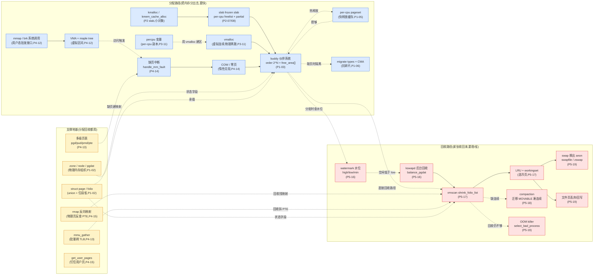
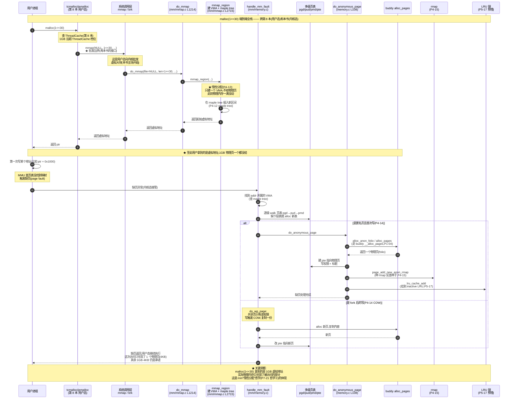

# 附录 A · 全景脉络

> 本附录是全书的**视觉索引**。主体二十章讲透了每个机制的"为什么 + 怎么做",但读者读完仍可能"只见树木不见森林"——buddy、slab、页表、缺页、kswapd、vmscan、compaction、swap,这些组件在脑子里还是散落的。本附录用三张图把它们串起来:① 一张全景图,把"分配路径"和"回收路径"的所有组件画在一张图上,标出每个组件属于哪篇;② 一次内核 `kmalloc(128)` 的端到端时序,跨 P2/P1;③ 一次用户 `malloc(1<<30)` → 缺页的端到端时序,跨 P4/P1,并对接第 8 本《内存分配器》的接口。看完这三张图,二十章的所有组件就串成一条完整的流。
>
> 本附录是参考性材料,不重复二十章的细节讲解,只给图 + 简短说明。读者可以把它当"二十章的地图",读完任何一章回来看这张图,都能定位"我在哪、这条流的上下游是谁"。

## A.1 分配/回收两层全景图

这张图把 Linux mm 的所有核心组件画在一张图上。左半是**分配路径**(把内存分出去),右半是**回收路径**(紧张时收回来),中间是**支撑地基**(物理内存组织、页表、rmap、maple tree——两边都用)。每个组件标注它属于哪篇(P0~P7)。



### 怎么看这张图

- **左半(蓝色,分配)**:把内存**分出去**的所有路径。从顶向下四条分配入口:① `kmalloc` 走 slab → buddy(内核小对象);② `vmalloc`(内核大块虚拟连续);③ `percpu`(内核 per-cpu 数据);④ `mmap`/`brk` + VMA + 缺页(用户进程虚拟内存)。四条路径最终都落到 **buddy**——buddy 是物理页的唯一仲裁者。
- **右半(红色,回收)**:内存紧张**收回来**的所有路径。从 watermark 预判开始,经 kswapd 后台回收 → vmscan 选冷页 → swap 换出/文件页丢弃 → compaction 规整 → OOM 兜底,逐级加码。
- **中间(黄色,支撑地基)**:分配和回收**都依赖**的数据结构和机制。`struct page`/zone 是账本(两边都读写),页表是分配建映射/回收拆映射的载体,rmap 让回收能反查"谁映射了这页",mmu_gather 批量刷 TLB。

任何一处看不懂,回到 P7-21 的二分法:"这是在分配(蓝)、回收(红),还是支撑(黄)?"

---

## A.2 一次 `kmalloc(128)` 的端到端时序(跨 P2/P1)

这张图追踪一次内核小对象分配,从 `kmalloc` 入口一直到 buddy 给物理页。跨 P2(slab)和 P1(buddy),展示两层分配器的协作。

```mermaid
sequenceDiagram
    autonumber
    participant K as 内核代码
    participant KM as __kmalloc<br/>(slab_common.c)
    participant CACHE as kmalloc-192 cache<br/>(归到 192 档)
    participant CPU as per-cpu cpu_slab<br/>(slub.c kmem_cache_cpu)
    partial as per-cpu partial 链
    participant NODE as per-node partial<br/>(kmem_cache_node)
    participant ALLOC as allocate_slab<br/>alloc_slab_page
    participant BUDDY as buddy __alloc_pages

    Note over K,BUDDY: kmalloc(128, GFP_KERNEL) —— 内核小对象分配

    K->>KM: kmalloc(128, GFP_KERNEL)
    Note over KM: __do_kmalloc_node<br/>size=128 归到 kmalloc-192 档<br/>(slab_common.c L777 kmalloc_info[])
    KM->>CACHE: slab_alloc_node(kmalloc-192)

    Note over CPU: 快路径(P2-08):cmpxchg + tid
    CACHE->>CPU: 读 this_cpu_read(cpu_slab->freelist)
    Note over CPU: freelist 非空?摘一个对象

    alt freelist 非空(99% 走这条)
        CPU-->>CACHE: cmpxchg 成功,返回对象
        CACHE-->>KM: 返回 ptr
        KM-->>K: 返回 ptr
        Note over K: ★ 全程无锁,极快
    else freelist 空(慢路径)
        CPU->>partial: ___slab_alloc 查 per-cpu partial
        alt partial 有半满 slab
            partial-->>CPU: 取一个 slab 当 frozen
            CPU-->>CACHE: 返回对象
        else partial 也空
            CPU->>NODE: 查 per-node partial(list_lock)
            alt NODE 有 partial
                NODE-->>CPU: 取一个 slab
            else NODE 也空
                CPU->>ALLOC: allocate_slab<br/>alloc_slab_page<br/>(slub.c L2173/L2322)
                ALLOC->>BUDDY: alloc_pages_node(order)<br/>(P1-04)
                Note over BUDDY: get_page_from_free_area(快)<br/>或 __alloc_pages_slowpath(慢)
                BUDDY-->>ALLOC: 返回连续页
                ALLOC->>ALLOC: 摆满对象 + 串 freelist
                ALLOC-->>CPU: 新 slab
            end
            NODE-->>CPU: slab 到位
            CPU-->>CACHE: 返回对象
        end
        CACHE-->>KM: 返回 ptr
        KM-->>K: 返回 ptr
    end
```

### 怎么看这张图

- **第一层(`__kmalloc`)**:把 `kmalloc(128)` 归到 size class `kmalloc-192`(因为 192 是 ≥ 128 的最小档,中间档减少内部碎片,详见 P2-09)。
- **第二层(快路径)**:走 per-cpu `cpu_slab->freelist`,用 `cmpxchg` + `tid` 双字段原子更新。99% 命中,**全程无锁**(P2-08 技巧精解)。
- **慢路径三层兜底**:快路径失败 → per-cpu partial(还有空位的半满 slab)→ per-node partial(同 node 的中央堆,拿 `list_lock`)→ `allocate_slab` 找 buddy 要新页(底层走 buddy `__alloc_pages`)。
- **buddy 那一步**:是 P1-04 的主场。`get_page_from_free_area` 是快路径(直接从 `free_area[]` 摘一页),失败走 `__alloc_pages_slowpath`(查水位/唤醒 kswapd/直接回收/compaction/OOM)。
- **关键洞察**:`kmalloc` 是**两层分配器串联**——slab 在 buddy 给的页上切对象,slab 没页了就向 buddy 批发新页。用户态 tcmalloc/jemalloc 是**三层**(ThreadCache → CentralFreeList → PageHeap → mmap 内核),因为用户态还要再向内核 `mmap` 批发一次(见 A.3)。

---

## A.3 一次用户 `malloc(1<<30)` → 缺页的端到端时序(跨 P4/P1,对接第 8 本)

这张图追踪一次用户态大对象分配的全栈:从 `malloc` 一行调用(用户态),经 tcmalloc/jemalloc(第 8 本),过 `mmap`/`brk` 批发边界(两本书的接口),到内核建 VMA(P4-12),再到进程访问触发缺页、内核建页表 + 分配物理页(P4-14),最后回到 buddy(P1)。这条链跨两本书。



### 怎么看这张图

- **上半部分(用户态,第 8 本主场)**:`malloc(1<<30)` → tcmalloc/jemalloc → `mmap` 系统调用。注意 tcmalloc 看到 1GB 直接走 `mmap`(不走 `brk`,因为太大),用户态分配器在这里向内核批发。
- **★ 批发边界(步骤 5)**:`mmap` 系统调用是**两本书的接口**。从这里开始是本书主场(内核态)。P2-10 的对照章详讲了这条边界——内核是物理页的主人,用户态只能向内核批发虚拟大块。
- **惰性分配(步骤 9~10)**:`do_mmap` / `mmap_region` **只建一个 VMA**,不给物理页。1GB 的虚拟区间此刻物理内存一滴没动。这是哲学③的体现。
- **缺页触发(步骤 13~14)**:用户写一个地址,MMU 查页表没找到,触发缺页。内核接管,找到 addr 所属 VMA,逐级 walk 页表。
- **按需兑现(步骤 16~21)**:`do_anonymous_page` 分配**一个**物理页(4KB),建 PTE,种 rmap 种子,挂到 inactive LRU。其余 1GB-4KB 仍是承诺。这是哲学③(惰性分配)的完整闭环——**1GB 的 `malloc` 实际只兑现 4KB 物理页**。
- **COW 分支(步骤 22~25)**:如果是 fork 后的子进程写共享页,`do_wp_page` 走写时复制——共享到写时才复制,典型惰性。
- **关键洞察**:这条链把全书 P4(用户地址空间)+ P1(buddy)+ 第 8 本(用户态分配器)串到了一起。**两本书的接口在 `mmap`/`brk`**,内核从这里建 VMA、在缺页时给物理页、在内存紧张时从这里收回(回收路径会拆 PTE、把页挂回 buddy 或换到 swap,见全景图 A.1 右半)。

---

## A.4 把三张图串起来看

把 A.1(全景)、A.2(kmalloc)、A.3(malloc→缺页)三张图串起来读,你会看到:

- **A.1** 是"地图",标出二十章所有组件在分配路径/回收路径/支撑地基里的位置。
- **A.2** 是"内核小对象"的特写,放大分配路径的 `kmalloc → slab → buddy` 这条链(P2/P1)。
- **A.3** 是"用户大对象"的特写,放大分配路径的 `mmap → VMA → 缺页 → buddy` 这条链(P4/P1),并接到第 8 本(用户态分配器)。

回收路径的时序(从 watermark 到 OOM)本书没有单独画大图,因为回收是一个**逐级兜底**的过程,不存在一条"端到端"的固定路径——平时根本不发生(水位够),紧张时按 watermark/kswapd → vmscan/LRU → compaction → swap → OOM 逐级尝试,走到哪一级够用就停。读者可以在 A.1 全景图的右半(红色)看到这条逐级兜底的链条,配合 P5-16~P5-19 的详解阅读。

三张图合起来,二十章的所有组件就串成了"分出去又收回来"的一条完整流——这就是 Linux mm 的全貌。
