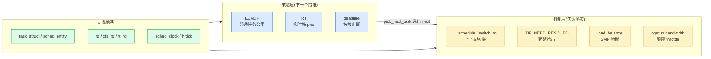

# 第一章 · 第一性原理:为什么内核要调度

> 篇:P0 开篇
> 主线呼应:这一章是全书的**总览与定调**。你写 `while(1);` 一个死循环,整台机器就该卡死吗?在多任务系统里不会——你的进程只拿到一段一段的 CPU 时间片,期间别人也在跑。是谁决定"下一段 CPU 给谁"?是内核的**调度器**。为什么内核非得管这件事?因为 CPU 是**稀缺**又**被所有人共享**的资源——必须有个仲裁者决定下一个谁跑、跑多久、何时被打断、多核时怎么分配。读懂这一章,你就拿到了全书剩余 20 章的钥匙:任务表示、运行队列、EEVDF 选下一个、抢占切换、负载均衡,都是为了让"少量 CPU 驱动海量任务"而存在的。

## 核心问题

**CPU 是稀缺且被所有进程共享的资源,为什么不能让进程自己占着 CPU(像单片机裸奔那样)?内核调度器必须决定下一个跑谁,背后是什么本质约束?它要在哪些矛盾之间平衡?**

读完本章你会明白:

1. CPU 的两个本质约束:稀缺(核数远少于任务数)+ 共享(所有任务抢同一组核)。
2. 多任务的"并发幻觉":靠**时间片轮转**,让 M 个 CPU"同时"跑 N(M ≪ N)个任务。
3. 调度器的四方矛盾:**公平**(每个任务都该有份)、**优先级**(重要的先跑)、**吞吐**(CPU 别闲着)、**响应**(交互快)——调度器在这四者间权衡。
4. 调度器全貌 + 二分法:**策略层**(下一个跑谁:EEVDF/RT/deadline) vs **机制层**(怎么落实:切换/抢占/均衡/限额)。
5. ★ 对照第 7 本:内核级抢占式调度 vs 语言级协作式调度(Go runtime GMP),合成"调度全栈"。

---

## 1.1 一句话点破

> **内核必须调度,是因为 CPU 稀缺又被所有任务共享——必须有个仲裁者决定"下一段 CPU 给谁、给多久、何时打断、在哪个核上跑",否则一个死循环就能独占整机,多任务无从谈起。这个仲裁者,就是调度器。**

这是结论,不是理由。本章倒过来拆:先看 CPU 的两个本质约束,再看多任务怎么靠时间片轮转制造"并发幻觉",然后看调度器要在哪些矛盾间平衡,最后立起全书二分法和 ★对照。

---

## 1.2 CPU 的两个本质约束

CPU 和上一本书(《Linux mm》)里的物理内存一样,有两个绕不开的约束,调度器的一切设计都从它们出发:

- **稀缺**:一台机器的 CPU 核就那么多(几个到几百个),但系统里同时活着的任务(进程 + 线程)动辄成百上千。一台 8 核机器跑 500 个线程很常见——核数 ≪ 任务数,物理上根本没法让它们真的同时跑。
- **共享**:CPU 核是**全局共享**的执行单元,所有任务都要在这同一组核上跑。没有任何一个任务能合法地独占一个核(除非你显式 `SCHED_FIFO` 实时占着,那是特权,见第 17 章)。

> **不这样会怎样**:如果让进程自己决定占多久(像单片机裸跑的 `while(1);`),一个死循环就能独占整个核、甚至整个机器——别的任务永远得不到执行,鼠标键盘没响应、SSH 连不上,系统事实上挂死。多任务的"同时运行"幻觉彻底破裂。

这两个约束决定了:**必须有一个被所有人信任的仲裁者(内核),统一裁决"下一段 CPU 给谁"**。它要在所有渴望 CPU 的任务之间分配这个稀缺资源,还要考虑谁更重要、谁在等交互。这就是调度器。

---

## 1.3 并发幻觉:时间片轮转

那调度器怎么用 M 个核"同时"跑 N(M ≪ N)个任务?靠一个核心技巧:**时间片轮转(time slicing)**。

把 CPU 时间切成一小段一小段的**时间片(time slice / quantum)**,每个任务轮着拿。任务 A 跑 4 毫秒,被**抢占(preempt)**,换任务 B 跑 4 毫秒,再换 C……只要切换得足够快(毫秒级),人眼根本察觉不到中断,看起来就像所有任务"同时"在跑。这就是多任务的**并发幻觉**。

```
 单核上 3 个任务的并发幻觉(简化):

 时间 ──►
 核 ┃ A│B│C│A│B│C│A│B│C│...   ← 每段一个时间片,轮流跑
    └─┴─┴─┴─┴─┴─┴─┴─┴─┴─┘
       4ms 一切,人眼觉得 A/B/C "同时"在跑

 每次切换 = 一次"上下文切换":保存当前任务寄存器/栈,
            换成下一个任务的(第 13 章详讲)。
```

要让这个幻觉成立,调度器得反复做两件事:**① 选下一个该跑的任务(策略)**,**② 把 CPU 真正切换给它(机制)**。这两件事就是全书二分法的两面。

> **钉死这件事**:时间片轮转是多任务的基石。它让 M 个核"假装"同时跑 N 个任务——代价是周期性的上下文切换(有开销,所以时间片不能太短)和每次切换要做的"选下一个"决策。整本《调度器》,本质都是在回答"怎么选下一个、怎么切过去、切得有多值"。

---

## 1.4 调度器的四方矛盾

"选下一个"听起来简单——轮流不就行了?难就难在,调度器要**同时**满足四组互相打架的目标:

| 矛盾 | 含义 | 它和其他几个的冲突 |
|------|------|-------------------|
| **公平(fairness)** | 每个任务都该拿到与其权重成比例的 CPU | 和"优先级"打架:要绝对公平就没法让重要任务先跑 |
| **优先级(priority)** | 重要/紧急的任务该先跑、多跑 | 和"公平"打架:RT 实时任务能 100% 占 CPU,普通任务饿死 |
| **吞吐(throughput)** | CPU 别闲着、别老在切换上浪费 | 和"响应"打架:时间片越长吞吐越高,但交互响应越慢 |
| **响应(latency)** | 交互任务(键盘/鼠标/网络)一唤醒就立刻跑 | 和"吞吐"打架:要快响应就得频繁切换,切换有开销 |

举几个具体的撞墙场景,你会立刻理解这四组为什么不可兼得:

- **公平 vs 优先级**:一个编译任务(CPU 密集)和一个 `vim`(交互式)抢 CPU。纯公平会让 vim 和编译各拿一半——但 vim 用户每敲一个键要等 50ms 才回显,卡顿明显。调度器得识别"vim 是交互式",给它更快的响应(靠 niceness 和唤醒抢占,见第 8、11 章)。
- **吞吐 vs 响应**:时间片设 1 秒,吞吐拉满(几乎不浪费在切换上),但交互任务一唤醒要等最长 1 秒才能跑——用户体验崩。时间片设 1 微秒,响应飞快,但 CPU 一半时间花在切换上(寄存器/缓存/TLB 全刷),吞吐崩。调度器要在中间找平衡(EEVDF 的动态时间片,见第 10 章)。
- **公平 vs 公平**:就算只要"公平"一个目标,也不简单。两个 nice 值差 1 的任务,CPU 该怎么分?各 50%?还是按权重 54:46?(答案:按权重,见第 8 章 `sched_prio_to_weight`)。一个任务刚才睡了很久,它"欠"的 CPU 该不该补?(EEVDF 的 lag,见第 7 章)。

> **钉死这件事**:调度器的所有复杂性,本质都是在**公平、优先级、吞吐、响应**这四方矛盾里找平衡。后面读到任何一段"为什么这么设计",回到这张表问"它在照顾哪一方、牺牲了哪一方",答案就浮出来了。EEVDF(公平 + 延迟保障)、RT throttling(优先级不能压垮系统)、动态时间片(吞吐 vs 响应)、唤醒抢占(交互响应),全是在解这四方矛盾。

---

## 1.5 调度器全貌 + 全书二分法

把调度器摊开,它的所有机制可以归到两条线上,这就是全书的**二分法**:

> **策略层(给定 runqueue,下一个跑谁:EEVDF 公平、RT 实时、deadline 截止期) vs 机制层(怎么落实:任务进出队列、上下文切换、抢占时机、SMP 负载均衡、cgroup 限额)。**

- **策略层**:`pick_next_task`(选下一个)、EEVDF 的 lag/eligible/virtual deadline(普通任务的公平算法)、RT 按 prio(实时任务的优先级)、deadline 按 EDF(带截止期的任务)。这些回答**"谁该跑"**。
- **机制层**:`__schedule`/`context_switch`/`switch_to`(切上去)、`TIF_NEED_RESCHED` + 抢占点(何时打断当前任务)、`load_balance`(多核间搬任务)、cgroup cpu bandwidth(给一组任务限额)。这些回答**"怎么落实跑这件事"**。

支撑这两者的地基:`task_struct`/`sched_entity`(任务表示)、`rq`/`cfs_rq`/`rt_rq`(运行队列)、时钟(`sched_clock`/`hrtick`)、`preempt_count`(抢占计数)。



往后读任何一章,看不懂就回到这个二分法问:"这是在**决定跑谁(策略)**,还是在**落实跑这件事(机制)**,或是在**支撑这两者(表示/队列/时钟)**?"

调度器的主循环——[`__schedule`](../linux/kernel/sched/core.c#L6616)([core.c:6616](../linux/kernel/sched/core.c#L6616))——就是把这两面缝起来的地方:它先调 [`pick_next_task`](../linux/kernel/sched/core.c#L6108)(策略:按 dl > rt > fair > idle 的优先级,从各调度类里选出下一个),再调 [`context_switch`](../linux/kernel/sched/core.c#L5353)(机制:把 CPU 真正切给那个任务)。一个函数,二分法两面俱全。

---

## 1.6 ★ 对照第 7 本:内核调度 vs 语言调度,合成"调度全栈"

本书和第 7 本《Go runtime 设计与实现深入浅出》是一对——一本讲**内核级**调度(Linux 调度器),一本讲**语言级**调度(Go 的 GMP 管 goroutine)。把它们放一起,就拼出了"一段并发程序怎么被调度执行"的**完整全栈**:

| 层 | 谁 | 调度对象 | 切换粒度 |
|---|---|---|---|
| 语言级 | **Go runtime GMP(第 7 本)** | goroutine(用户态,极轻量) | 协作式 + 异步抢占,函数安全点切换,几十 ns |
| 系统调用边界 | `clone`/`futex`/`sched_yield` | goroutine 最终搭在 OS 线程(M)上,由内核调度 | — |
| 内核级 | **本书(Linux 调度器)** | task_struct(进程/线程) | 内核抢占式,任何可抢占点都能切,μs 级 |

一对关键的对照,你先记住,后面关键章会展开:

- **谁在调度**:Linux 调度器调度**线程**(task_struct),Go runtime 在线程之上再调度**goroutine**(M:N 模型)。一个 Go 程序里几百万 goroutine,实际只跑在几个内核线程上——Go runtime 自己管 goroutine 的切换,内核只看到那几个线程。
- **怎么切换**:Linux 的 [`switch_to`](../linux/kernel/sched/core.c#L5353) 切**内核栈 + 完整寄存器 + FPU**(第 13 章),重;Go 的 `gogo` 只切 goroutine 自己的小栈和几个寄存器,轻得多——这正是 goroutine 比 thread 便宜几个数量级的根。
- **怎么均衡**:Linux 的 [`load_balance`](../linux/kernel/sched/fair.c)(第 15 章)是**周期性 pull 模型**(忙核主动从别的核拉任务);Go 是 **work-stealing**(空闲 P 主动偷别的 P 的 goroutine)。思路镜像,粒度不同。
- **怎么抢占**:Linux 靠 `TIF_NEED_RESCHED` 标记 + 抢占点(第 11 章),内核态几乎处处可抢;Go 是**协作式**(函数调用安全点检查抢占标志)+ 6.x 起的**异步抢占**(发信号强制打断任意执行点)。

> **钉死这件事**:内核调度和语言调度是**两层**——Go runtime 的 GMP 最终也建立在内核调度器之上(Go 的 M 就是内核线程,仍由本书的调度器调度)。本书讲"内核怎么调度线程",第 7 本讲"Go 怎么在内核线程之上再调度 goroutine"。两本合起来,才是并发程序被调度的全貌。后续第 13 章(切换)、第 15 章(均衡)、第 21 章(总表)会反复回扣这组对照。

---

## 1.7 技巧精解:调度类多态 + per-CPU 运行队列 —— 调度器的"账本工程"

这一章是定调章,我们把调度器两个最基础也最容易被忽略的工程设计立清楚——它们决定了调度器**长什么样**,也是后面所有章节的地基。

### 技巧一:`sched_class` 多态 —— 用 C 的面向对象组织调度策略

Linux 里有好几种调度策略:`SCHED_NORMAL`(普通,EEVDF)、`SCHED_FIFO`/`SCHED_RR`(实时)、`SCHED_DEADLINE`(带截止期)、还有内部的 idle/stop。每种策略"怎么入队、怎么选下一个、怎么 tick"都不一样。朴素地写,会是一堆 `switch(policy)`:

```c
/* 朴素的、糟糕的写法(示意,非源码) */
struct task_struct *pick_next(struct rq *rq) {
    switch (rq->curr->policy) {
    case SCHED_NORMAL:  return pick_next_fair(rq);
    case SCHED_FIFO:
    case SCHED_RR:      return pick_next_rt(rq);
    case SCHED_DEADLINE: return pick_next_dl(rq);
    ...
    }
}
```

这会**到处散落 `switch`**,每加一种策略要改 N 处。Linux 的做法是**面向对象的多态**——给每种调度策略一个 [`struct sched_class`](../linux/kernel/sched/sched.h#L2261)([sched.h:2261](../linux/kernel/sched/sched.h#L2261)),它是一组**函数指针**(`enqueue_task`/`dequeue_task`/`pick_next_task`/`task_tick`/...),每个策略各实现一份(`fair_sched_class`/`rt_sched_class`/`dl_sched_class`/...)。每个任务在 [`task_struct`](../linux/include/linux/sched.h#L801) 里有个 `const struct sched_class *sched_class` 指针([sched.h:801](../linux/include/linux/sched.h#L801)),指向它所属的调度类。`pick_next_task` 只管按调度类优先级调 `class->pick_next_task()`——**具体怎么选,由那个调度类的实现决定**,调用者不用 `switch`。

```mermaid
flowchart TD
    PX["__schedule / pick_next_task"] -->|"按优先级遍历"| CL["sched_class 链<br/>(dl > rt > fair > idle > stop)"]
    CL --> FAIR["fair_sched_class->pick_next_task<br/>= pick_next_task_fair (EEVDF)"]
    CL --> RT["rt_sched_class->pick_next_task<br/>= pick_next_task_rt"]
    CL --> DL["dl_sched_class->pick_next_task<br/>= pick_next_task_dl"]
    FAIR --> NEXT["返回下一个 task_struct"]
    RT --> NEXT
    DL --> NEXT
    classDef call fill:#dbeafe,stroke:#2563eb
    classDef impl fill:#dcfce7,stroke:#16a34a
    class PX call
    class FAIR,RT,DL,NEXT impl
```

> **反面对比**:如果不用 `sched_class` 多态、用 `switch(policy)`,每加一种调度策略(比如未来要加 `sched_ext`,eBPF 可编程调度器)就要改 `pick_next`/`enqueue`/`tick`/`sleep` 等十几个函数里的 `switch`,散弹式修改。多态把这些差异**封装进各自的 `sched_class` 实现**,新增策略只要写一个新 `struct sched_class` 并挂进链表,**核心调度路径一行不用改**。这是内核里"用 C 写面向对象"的典范(`struct file_operations`、`struct net_proto_family` 都是同款套路)。

### 技巧二:per-CPU 运行队列 —— 把锁竞争消灭在结构里

每个 CPU 一个独立的 [`struct rq`](../linux/kernel/sched/sched.h#L985)([sched.h:985](../linux/kernel/sched/sched.h#L985)),里面挂着这个核上的 `cfs_rq`/`rt_rq`/`dl_rq` 子队列、一个 `curr`(当前在跑的任务)和一把 `rq->lock`。一个核上的调度决策(选下一个、入队、tick)基本只动**本核的 `rq`**,只拿**本核的 `rq->lock`**——不同核的调度路径互不干扰。

```
 每 CPU 一个独立 rq(简化):

   CPU 0 的 rq                 CPU 1 的 rq                 CPU 2 的 rq
   ┌────────────────┐          ┌────────────────┐          ┌────────────────┐
   │ cfs_rq (EEVDF) │          │ cfs_rq (EEVDF) │          │ cfs_rq (EEVDF) │
   │ rt_rq  (实时)  │          │ rt_rq  (实时)  │          │ rt_rq  (实时)  │
   │ dl_rq  (截止)  │          │ dl_rq  (截止)  │          │ dl_rq  (截止)  │
   │ curr = 任务A   │          │ curr = 任务X   │          │ curr = 任务Q   │
   │ rq->lock ──────┼── 不冲突 ─┼── rq->lock     │  不冲突  ──┼── rq->lock     │
   └────────────────┘          └────────────────┘          └────────────────┘
        本核调度只动本 rq、只拿本 rq->lock;核间靠 load_balance 偶尔迁任务
```

> **反面对比**:如果全机一把全局 `rq`、一个全局锁,那 64 核机器上每次 `__schedule`(每核每秒上千次)都要抢同一把锁——锁竞争随核数线性恶化,16 核以上调度器自己就成了瓶颈(这就是 2000 年代初 Linux 调度器 O(1)/大内核锁时代的痛)。per-CPU `rq` + 每队列独立锁,让**正常调度路径几乎无锁竞争**,只有 `load_balance`(第 15 章)偶尔跨核拉任务时才碰别的核的 `rq->lock`。这是"把并发瓶颈消灭在数据结构设计里"的典范,和第 8 本《内存分配器》的 per-cpu cache、上一本 mm 的 per-cpu pageset 是同一套思路。

> **钉死这件事**:`sched_class` 多态(策略可扩展、核心路径零 switch)+ per-CPU `rq`(锁竞争最小化)是调度器的"账本工程"——它们决定了调度器**可扩展、可并发**的骨架。这种"用结构设计消灭问题"的思路,在全书反复出现(PELT 的 per-entity 负载、调度域的分层、cgroup 的层级化 sched_entity),是 Linux 内核工程美学的核心。下一节开始的第 1 篇,就从 `task_struct`/`sched_entity`/`rq` 这些账本讲起。

---

## 章末小结

这一章是全书**总览与定调**,我们没有钻进 EEVDF 或负载均衡的细节,但立起了贯穿全书的四样东西:

1. **CPU 的两个约束**:稀缺 + 共享——逼出"必须有仲裁者"。
2. **时间片轮转**:多任务并发幻觉的基石,调度器反复做"选下一个 + 切过去"。
3. **四方矛盾**:公平、优先级、吞吐、响应——调度器所有复杂性都在平衡这四者。
4. **二分法 + ★对照第 7 本**:策略层(跑谁)vs 机制层(怎么落实);内核调度 vs 语言调度(Go GMP),合成调度全栈。

### 五个"为什么"清单

1. **为什么不能让进程自己占着 CPU?** CPU 稀缺又共享,一个死循环就独占整机;内核调度器仲裁"下一段 CPU 给谁"。
2. **多任务"同时跑"是怎么实现的?** 时间片轮转——每个任务轮着拿一小段 CPU,切换够快就像同时跑(并发幻觉)。代价是周期性上下文切换。
3. **调度器要在哪些矛盾间平衡?** 公平、优先级、吞吐、响应四方矛盾。EEVDF/RT throttling/动态时间片/唤醒抢占都是在解它们。
4. **策略层和机制层怎么分?** 策略 = 选下一个跑谁(EEVDF/RT/deadline);机制 = 怎么切过去/何时打断/怎么均衡/怎么限额。迷路回到二分法。
5. **和第 7 本(Go runtime)什么关系?** 第 7 本讲 Go 在内核线程之上再调度 goroutine(GMP),本书讲内核怎么调度线程;Go 的切换/抢占/均衡都能在本书找到内核级对应物。两本合成调度全栈。

### 想继续深入往哪钻

- 本章点到的 `task_struct`/`sched_class`/`rq` 详见第 2、3 章(P1-02、P1-03)。
- "下一个跑谁"的核心算法 EEVDF,详见第 6、7 章(P2-06、P2-07)。
- 想立刻看一眼调度的全貌,读 [`kernel/sched/core.c`](../linux/kernel/sched/core.c) 的 `__schedule`(L6616)、`pick_next_task`(L6108)、`context_switch`(L5353);以及 [`kernel/sched/sched.h`](../linux/kernel/sched/sched.h) 的 `struct sched_class`(L2261)、`struct rq`(L985)、`struct cfs_rq`(L573)。
- 想观测调度器运行,看 `/proc/sched_debug`、`/proc/<pid>/sched`、`/proc/loadavg`,用 `perf sched`、`trace-cmd`(附录 B 详讲)。

### 引出下一章

我们立起了"内核必须调度"和四方矛盾、二分法。但要真正钻进调度器,得先看清它的"账本"——任务怎么表示、运行队列怎么组织。下一章,我们从 [`include/linux/sched.h`](../linux/include/linux/sched.h) 的 `task_struct`(L793-837 的调度字段)和 `sched_entity`、`sched_class` 讲起,正式进入第 1 篇:任务与运行队列。
