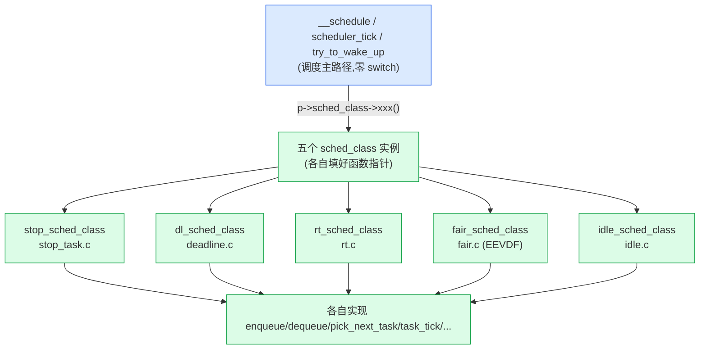

# 第二章 · task_struct 与 sched_entity:任务怎么表示

> 篇:第 1 篇 · 任务与运行队列:调度的账本(本章是本篇第 1 章,正式进入地基)
> 主线呼应:上一章我们说"内核必须有个仲裁者决定下一个谁跑",但仲裁者要裁决的对象——**一个任务**——在内核里到底长什么样?这一章就把这件事钉死:一个进程或线程,在内核里就是一个 [`struct task_struct`](../linux/include/linux/sched.h#L748)([sched.h:748](../linux/include/linux/sched.h#L748)),里面有一组**调度相关字段**(优先级、策略、调度实体)。这些字段把任务和调度器缝起来:任务的 `policy` 决定它归哪个**调度类**(`sched_class`)管,调度类决定它怎么入队、怎么被选中;任务还内嵌一个 [`struct sched_entity`](../linux/include/linux/sched.h#L536)([sched.h:536](../linux/include/linux/sched.h#L536)),这是它挂在公平队列上的"身份证"。读完本章,你就能回答:`task_struct` 里到底哪些字段是给调度器看的、`sched_class` 这套"用 C 写的面向对象"是怎么把多种调度策略插进同一条主调度路径的、`sched_entity` 为什么要和 `task_struct` 分开。

## 核心问题

**一个任务在内核里怎么表示?调度器看一个任务时,它眼里的是什么字段?五种调度策略(SCHED_NORMAL/FIFO/RR/DEADLINE/...)凭什么能共用同一套 `__schedule`/`pick_next_task` 调度路径?**

读完本章你会明白:

1. `task_struct` 里跟调度有关的字段有哪些、各自管什么(`policy`/`prio`/`static_prio`/`normal_prio`/`rt_priority`/`sched_class`/`se`/`rt`/`dl`)。
2. `prio`(动态)、`static_prio`(静态)、`rt_priority`(实时优先级)、`nice` 这一组优先级**到底是什么关系**、怎么换算(`MAX_RT_PRIO`/`NICE_TO_PRIO` 等宏)。
3. `sched_class` 多态:Linux 用一组成员函数指针,把"普通、实时、deadline、idle、stop"五种调度策略封装成五个 `struct sched_class` 实例,主调度路径只调函数指针,**不写任何 `switch(policy)`**。这是内核"用 C 写面向对象"的典范。
4. `sched_entity`(调度实体):任务被公平调度时挂在 `cfs_rq` 上的"身份证",同时也充当**组调度**的载体——一个任务和一个 cgroup 组复用同一个结构体,这是靠 `container_of` 反查实现的。

> 逃生阀:本章没有 EEVDF 算法细节(那是第 7 章),只讲"任务怎么表示"。如果你只关心"下一个怎么被挑",可以跳到第 6、7 章,但你会错过 `sched_class` 多态和 `sched_entity` 这两个贯穿全书的支柱。

---

## 2.1 一句话点破

> **一个任务在内核里是一个 `task_struct`,调度器看它时主要看三组字段:`policy`(它归哪种调度策略管)、`prio`(它多重要)、`sched_class`(它该被哪个调度类的函数操作)。其中 `sched_class` 把多种调度策略封装成函数指针表,主调度路径靠它实现"零 switch 的策略可扩展";而 `sched_entity` 是任务挂在公平队列上的身份证,同时兼任组调度的载体,任务和组复用一套——这是 Linux 调度器账本的两根柱子。**

这是结论,不是理由。本章倒过来拆:先看 `task_struct` 里跟调度相关的字段长什么样,再看 `prio` 这一族优先级怎么换算,然后钻进 `sched_class` 多态,最后讲 `sched_entity` 的嵌入与 `container_of` 反查。

---

## 2.2 task_struct:一个任务的全貌

`task_struct` 是 Linux 里**进程/线程的统一表示**。在 Linux 里,**进程和线程不区分结构**(一个线程就是一个 `task_struct`,只不过和别的线程共享 `mm_struct` 等资源)——所以本章说"任务"统一指 `task_struct`,可能是进程也可能是一个线程。它有上千个字段(进程地址空间、文件描述符、信号、cgroup……),本章只看**调度器关心的那一小撮**。

它们集中在 [`include/linux/sched.h`](../linux/include/linux/sched.h#L790) 的 [task_struct:L790-837](../linux/include/linux/sched.h#L790-L837):

```c
/* include/linux/sched.h(摘录,简化展示) */
struct task_struct {
    ...
    int             on_rq;            // 790: 是否在运行队列上(0 / TASK_ON_RQ_QUEUED / TASK_ON_RQ_MIGRATING)
    int             prio;             // 792: 当前(动态)优先级 —— 调度器实际看的优先级
    int             static_prio;      // 793: 静态优先级 —— nice 决定,普通任务的基准
    int             normal_prio;      // 794: "正常"优先级 —— 不含 RT 临时提升
    unsigned int    rt_priority;      // 795: 实时优先级(用户态 sched_param.sched_priority,1-99)

    struct sched_entity    se;        // 797: 公平调度实体(挂在 cfs_rq 上)
    struct sched_rt_entity rt;        // 798: 实时调度实体(挂在 rt_rq 上)
    struct sched_dl_entity dl;         // 799: deadline 调度实体(挂在 dl_rq 上)
    struct sched_dl_entity *dl_server; // 800: deadline "server"(为本任务提供补充预算,见第 18 章)

    const struct sched_class *sched_class; // 801: 指向所属调度类 —— 决定它被哪组函数操作

    ...
    unsigned int    policy;           // 837: 调度策略(SCHED_NORMAL/FIFO/RR/DEADLINE/BATCH/IDLE...)
    ...
};
```

调度器看一个任务时,主要就盯这几行。可以把它们分成三类:

| 类别 | 字段 | 作用 |
|------|------|------|
| **身份类** | `policy`、`sched_class` | 决定这个任务归哪个调度策略管 |
| **优先级类** | `prio`、`static_prio`、`normal_prio`、`rt_priority` | 决定它多重要(下节细讲) |
| **调度实体类** | `se`、`rt`、`dl` | 任务挂到对应子队列上时的"载体"(下下节细讲) |

外加一个 `on_rq`:`0` 表示任务没在运行队列上(阻塞睡眠中),`TASK_ON_RQ_QUEUED`(=1)表示在队列上,`TASK_ON_RQ_MIGRATING`(=2)表示正在核间迁移、暂时被锁住。这一个 int 是唤醒路径和调度路径判活的核心标志(第 5 章详讲)。

> **不这样会怎样**:如果调度字段不集中、而是散在 `task_struct` 各处,调度器每次决策都要在几千字节的 `task_struct` 里来回跳,破坏 cache 局部性。内核把它们紧凑放在一段(`on_rq` 到 `policy` 大约 50 行),让调度热路径(`__schedule`/`pick_next_task`/`try_to_wake_up`)访问的字段都落在一两个 cache line 里。注意 [task_struct:L797-801](../linux/include/linux/sched.h#L797-L801) 里 `se`/`rt`/`dl`/`sched_class` 紧挨着——因为 `pick_next_task` 选下一个时,基本就是顺着这几个字段走。

---

## 2.3 四个优先级字段:nice、prio、static_prio、rt_priority 到底什么关系

最容易让人犯晕的,是 `prio` 这一族字段。乍看 `task_struct` 里有四个跟"优先级"有关的字段:`prio`、`static_prio`、`normal_prio`、`rt_priority`。它们**不是冗余**,是分工。理解它们,先要记住一个核心事实:

> **Linux 的优先级数值是"反的":数字越小越重要。** `prio = 0` 是最高优先级,`prio = 139` 是最低。这是 [`include/linux/sched/prio.h`](../linux/include/linux/sched/prio.h#L10)([prio.h:10](../linux/include/linux/sched/prio.h#L10))开头注释钉死的事。

整个优先级空间被切成两段(见 [prio.h:L16-19](../linux/include/linux/sched/prio.h#L16-L19)):

```c
/* include/linux/sched/prio.h */
#define MAX_NICE        19           // nice 上界
#define MIN_NICE        -20          // nice 下界
#define NICE_WIDTH      (MAX_NICE - MIN_NICE + 1)   // = 40

#define MAX_RT_PRIO     100          // 实时优先级个数
#define MAX_PRIO        (MAX_RT_PRIO + NICE_WIDTH)  // = 140
#define DEFAULT_PRIO    (MAX_RT_PRIO + NICE_WIDTH / 2)  // = 120

#define NICE_TO_PRIO(nice)  ((nice) + DEFAULT_PRIO)   // nice [-20,19] → prio [100,139]
#define PRIO_TO_NICE(prio)  ((prio) - DEFAULT_PRIO)
```

把这段画成一张图,就一目了然:

```
 内核优先级(prio)空间:0 ───────────────── 100 ─────── 120 ─────── 139
                              ├──── RT 段 ────┤├── 普通段(nice)──┤
                              0-99              100-139

 RT 任务:      prio ∈ [0, 100),   rt_priority ∈ [1, 99] 用户可见
 普通任务:    prio ∈ [100, 140),  nice ∈ [-20, 19] 用户可见(nice 0 → prio 120)
 默认(nice 0): prio = 120 = DEFAULT_PRIO

 换算:  nice -20 → prio 100  |  nice 0 → prio 120  |  nice +19 → prio 139
        rt_priority 99 → prio 0(最高)| rt_priority 1 → prio 98
```

四个字段各自管什么:

| 字段 | 含义 | 谁写它 |
|------|------|--------|
| **`static_prio`** | **静态优先级**:由 `nice` 决定,普通任务 = `NICE_TO_PRIO(nice)`。RT/deadline 任务也有,但调度器不看它 | `renice`/`nice()`/`fork` 时设 |
| **`rt_priority`** | **实时优先级**:用户 `sched_setscheduler(SCHED_FIFO, {.sched_priority=50})` 设的那个数,1-99 | 用户设的实时任务专属 |
| **`normal_prio`** | **"正常"优先级**:`static_prio` 和 `rt_priority` 的归一化——普通任务 = `static_prio`,RT 任务 = `MAX_RT_PRIO - 1 - rt_priority`,deadline = `MAX_DL_PRIO - 1`。**不包含临时提升** | 见 [core.c:__normal_prio@2160](../linux/kernel/sched/core.c#L2160) |
| **`prio`** | **当前(动态)优先级**:调度器实际看的值。通常 = `normal_prio`,但会被**优先级继承(PI)**临时改(如持 RT mutex 时被提上去),所以单独存一份 | 调度器/PI 改 |

> **为什么 `prio` 要和 `normal_prio` 分开?** 这是为了**优先级继承(priority inheritance, PI)**。设想:一个低优先级 RT 任务持有一把锁,高优先级 RT 任务在等这把锁——为了避免优先级反转(高优等低优,中优插队把低优饿死,锁迟迟放不出),内核会**临时**把持有者的 `prio` 提到等锁者的高度,让它赶紧跑完释放锁。但任务"本身的"优先级(`normal_prio`)不能丢——锁一放,要降回去。所以 `normal_prio` 存"本质",`prio` 存"当前有效值"(可被 PI 临时改)。

换算逻辑在 [`core.c:__normal_prio`](../linux/kernel/sched/core.c#L2160)([L2160-2172](../linux/kernel/sched/core.c#L2160-L2172)):

```c
/* kernel/sched/core.c */
static inline int __normal_prio(int policy, int rt_prio, int nice)
{
    int prio;

    if (dl_policy(policy))
        prio = MAX_DL_PRIO - 1;            // deadline 任务:固定最高段
    else if (rt_policy(policy))
        prio = MAX_RT_PRIO - 1 - rt_prio;  // RT 任务:把 1-99 翻转成 98..0
    else
        prio = NICE_TO_PRIO(nice);         // 普通任务:120 + nice
    return prio;
}
```

一个要点:**普通任务的 `prio` 就是 `static_prio = 120 + nice`**,EEVDF/CFS 永远不动它(普通任务没有"动态优先级"概念,这点和老的 Wift/交互启发式不同——6.x 内核已经移除了那些启发式)。RT 任务的 `prio` 才会因为 PI 变动。

> **钉死这件事**:`nice` 是用户看到的"普通任务优先级旋钮",范围 -20..19,默认 0;内核里它被换算成 `static_prio = 120 + nice`(落在 100..139)。RT 任务用 `rt_priority`(1..99),换算成内核 `prio` 是 98..0(翻转)。`prio` 是调度器实际看的、`normal_prio` 是"本质"、`static_prio`/`rt_priority` 是来源。第 8 章讲 nice 如何映射成**权重**(再决定时间片),那时你会真正看到 `static_prio` 的用处。

---

## 2.4 sched_class:用 C 写的面向对象,把策略插进调度主路径

### 不这样会怎样

现在我们有了任务,有了 `policy` 字段标记它是哪种策略。一个朴素写法是:在调度主路径里到处 `switch(policy)`:

```c
/* 朴素的、糟糕的写法(示意,非源码) */
struct task_struct *pick_next(struct rq *rq) {
    switch (rq->curr->policy) {
    case SCHED_NORMAL:   return pick_next_fair(rq);
    case SCHED_FIFO:
    case SCHED_RR:       return pick_next_rt(rq);
    case SCHED_DEADLINE: return pick_next_dl(rq);
    /* ... */
    }
}
/* 同样的 switch 还要出现在 enqueue、dequeue、task_tick、sleep、wakeup ... 十几处 */
```

这是**散弹式修改**的灾难:每加一种调度策略(比如未来加 `sched_ext`,eBPF 可编程调度器,6.12 起合入),就要在十几个函数里改 `switch`。更要命的是,这些 `switch` 散落在调度主路径的每一个角落,既难维护又无法让每种策略独立演进。

### 所以这样设计:调度类 = 函数指针表

Linux 的做法是**面向对象的多态**:给每种调度策略一个 [`struct sched_class`](../linux/kernel/sched/sched.h#L2261)([sched.h:2261](../linux/kernel/sched/sched.h#L2261)),它就是一组**函数指针**——`enqueue_task`、`dequeue_task`、`pick_next_task`、`task_tick`、`select_task_rq`、`wakeup_preempt`……每个策略各实现一份(`fair_sched_class`/`rt_sched_class`/`dl_sched_class`/`idle_sched_class`/`stop_sched_class`)。任务在 `task_struct` 里有个 `const struct sched_class *sched_class` 指针([sched.h:801](../linux/include/linux/sched.h#L801)),指向它所属的调度类。

来看 `sched_class` 的真身([sched.h:L2261-2323](../linux/kernel/sched/sched.h#L2261-L2323),摘关键):

```c
/* kernel/sched/sched.h */
struct sched_class {
    void (*enqueue_task)(struct rq *rq, struct task_struct *p, int flags);
    void (*dequeue_task)(struct rq *rq, struct task_struct *p, int flags);
    void (*yield_task)(struct rq *rq);
    bool (*yield_to_task)(struct rq *rq, struct task_struct *p);

    void (*wakeup_preempt)(struct rq *rq, struct task_struct *p, int flags);
    struct task_struct *(*pick_next_task)(struct rq *rq);
    void (*put_prev_task)(struct rq *rq, struct task_struct *p);
    void (*set_next_task)(struct rq *rq, struct task_struct *p, bool first);
#ifdef CONFIG_SMP
    int  (*balance)(struct rq *rq, struct task_struct *prev, struct rq_flags *rf);
    int  (*select_task_rq)(struct task_struct *p, int task_cpu, int flags);
    struct task_struct *(*pick_task)(struct rq *rq);
    void (*migrate_task_rq)(struct task_struct *p, int new_cpu);
    /* ... */
#endif
    void (*task_tick)(struct rq *rq, struct task_struct *p, int queued);
    void (*task_fork)(struct task_struct *p);
    void (*task_dead)(struct task_struct *p);
    void (*switched_from)(struct rq *this_rq, struct task_struct *task);
    void (*switched_to)(struct rq *this_rq, struct task_struct *task);
    void (*prio_changed)(struct rq *this_rq, struct task_struct *task, int oldprio);
    void (*update_curr)(struct rq *rq);
    /* ... */
};
```

这就是一个**接口**——"一个调度类必须实现哪些操作"。每个调度类实例就是填好这些函数指针的一个 `const struct sched_class`。比如 [`fair.c`](../linux/kernel/sched/fair.c#L13115) 末尾([L13115](../linux/kernel/sched/fair.c#L13115))就是公平调度类的实例:

```c
/* kernel/sched/fair.c(摘) */
DEFINE_SCHED_CLASS(fair) = {
    .enqueue_task       = enqueue_task_fair,
    .dequeue_task       = dequeue_task_fair,
    .yield_task         = yield_task_fair,
    .pick_next_task     = pick_next_task_fair,
    .put_prev_task      = put_prev_task_fair,
    .set_next_task      = set_next_task_fair,
#ifdef CONFIG_SMP
    .balance            = balance_fair,
    .select_task_rq     = select_task_rq_fair,
    .migrate_task_rq    = migrate_task_rq_fair,
    /* ... */
#endif
    .task_tick          = task_tick_fair,
    .task_fork          = task_fork_fair,
    /* ... */
};
```

五个调度类各自在源码里 `DEFINE_SCHED_CLASS` 定义:

| 调度类 | 定义位置 | 管什么 | 优先级 |
|--------|----------|--------|--------|
| `stop_sched_class` | [stop_task.c:106](../linux/kernel/sched/stop_task.c#L106) | 特权迁移/热插拔用,**总是可抢占任何任务** | 最高 |
| `dl_sched_class` | [deadline.c:2815](../linux/kernel/sched/deadline.c#L2815) | `SCHED_DEADLINE`(EDF + CBS) | 高 |
| `rt_sched_class` | [rt.c:2648](../linux/kernel/sched/rt.c#L2648) | `SCHED_FIFO`/`SCHED_RR` | 中高 |
| `fair_sched_class` | [fair.c:13115](../linux/kernel/sched/fair.c#L13115) | `SCHED_NORMAL`/`SCHED_BATCH`/`SCHED_IDLE`(EEVDF) | 普通 |
| `idle_sched_class` | [idle.c:528](../linux/kernel/sched/idle.c#L528) | 没事可做时的兜底 idle 任务 | 最低 |

调度主路径里的关键调用就是顺着函数指针走。比如 [`scheduler_tick`](../linux/kernel/sched/core.c#L5684)([core.c:5684](../linux/kernel/sched/core.c#L5684))里就一句:

```c
/* kernel/sched/core.c:scheduler_tick */
curr->sched_class->task_tick(rq, curr, 0);   // 不写 switch,直接走函数指针
```

普通任务的 `curr->sched_class` 指向 `fair_sched_class`,于是实际调用 `task_tick_fair`;RT 任务则调 `task_tick_rt`。主路径根本不需要知道对方是哪种策略。



> **钉死这件事**:`sched_class` 是 Linux 内核"用 C 写面向对象"的典范——接口(`struct sched_class`)定义行为,实现(各 `xxx_sched_class` 实例)填函数指针,调用者只走指针。这与 `struct file_operations`、`struct net_proto_family` 是同款套路。新增调度策略只要写一个新的 `DEFINE_SCHED_CLASS` 实例并放进调度类 section(下节技巧精解讲怎么排优先级),**主调度路径一行不改**。

### `policy`、`sched_class`、`prio` 怎么联动

你可能会问:任务已经有 `policy` 了,为什么还要单独一个 `sched_class` 指针?因为:

1. **`policy` 是用户视角的策略值**(`SCHED_NORMAL` = 0、`SCHED_FIFO` = 1、…,用户在 `sched_setscheduler` 里设);**`sched_class` 是内核视角的函数表**。两者**不是一一对应**:比如 `SCHED_NORMAL`、`SCHED_BATCH`、`SCHED_IDLE` 三种 policy **都归 `fair_sched_class` 管**(都走 EEVDF,只是参数不同)。
2. 切换 `policy` 时,内核会重新计算 `sched_class` 指针——见 `__setscheduler_class` 等(第 17 章讲 RT 时展开)。一个任务的 `sched_class` 在生命周期里**可以变**(比如用户 `sched_setscheduler` 把普通任务改成 RT,`sched_class` 就从 `fair_sched_class` 切到 `rt_sched_class`)。

---

## 2.5 sched_entity:任务挂在公平队列上的"身份证",也是组调度的载体

### 不这样会怎样

公平调度器要把任务挂到一个按 EEVDF 排序的数据结构里(6.9 里仍是红黑树,按 `deadline` 排,第 7 章详讲)。朴素做法:把整个 `task_struct` 挂上去。但这有两个问题:

1. **`task_struct` 太大**(几千字节),红黑树节点内嵌进去会浪费一大块,而且 cache 不友好。
2. **cgroup 的组调度没法实现**:我们想让"一组任务"在父队列里也作为一个调度单位(组A 和组B 按权重分 CPU,组A 内部再在组A 的子队列里公平分)。如果只有 `task_struct` 能挂树,组怎么挂?

### 所以这样设计:把调度相关字段单独抽出来

Linux 把"公平调度需要的状态"单独抽成一个 [`struct sched_entity`](../linux/include/linux/sched.h#L536)([sched.h:536-575](../linux/include/linux/sched.h#L536-L575)),**内嵌**在 `task_struct` 里(就是上面 `task_struct.se`):

```c
/* include/linux/sched.h */
struct sched_entity {
    /* 负载权重(由 nice 映射,第 8 章) */
    struct load_weight   load;
    /* 红黑树节点(挂在 cfs_rq->tasks_timeline 上) */
    struct rb_node       run_node;
    /* EEVDF 的 virtual deadline(第 7 章) */
    u64                  deadline;
    u64                  min_vruntime;

    struct list_head     group_node;
    unsigned int         on_rq;            /* 是否在该 cfs_rq 上 */

    /* 运行时间记账 */
    u64                  exec_start;
    u64                  sum_exec_runtime;     /* 累计实际运行 ns */
    u64                  prev_sum_exec_runtime;/* 上次被选中时累计值,用于算"本周期跑了多少" */
    u64                  vruntime;             /* 虚拟运行时间(CFS 残留,EEVDF 仍维护) */
    s64                  vlag;                 /* EEVDF 的 lag(欠账,第 7 章核心) */
    u64                  slice;                /* 本周期分配的时间片 ns */

    u64                  nr_migrations;

#ifdef CONFIG_FAIR_GROUP_SCHED
    int                  depth;                /* 在组调度树里的深度 */
    struct sched_entity  *parent;              /* 父实体(组) */
    struct cfs_rq        *cfs_rq;              /* 这个实体挂在哪个 cfs_rq 上 */
    struct cfs_rq        *my_q;                /* 这个实体"拥有"的 cfs_rq(仅当它是组) */
    unsigned long        runnable_weight;
#endif
    /* ...PELT 负载统计(第 9 章) */
};
```

理解 `sched_entity` 的关键是看清它身兼两职:

- **作为任务**的调度实体:每个 `task_struct` 内嵌一个 `se`,`se` 挂到所在 CPU 的 `cfs_rq` 红黑树上。这时 `se->my_q == NULL`——它是个叶子,自己就是调度单位。
- **作为组(cgroup)** 的调度实体:开启 `CONFIG_FAIR_GROUP_SCHED` 后,每个 `task_group`(cgroup 的 cpu 子系统)也对应一组 `sched_entity`(每个 CPU 一个),它**也有一个 `se`**,这个 `se` 挂在父组的 `cfs_rq` 上;同时 `se->my_q` 指向**这个组自己**的 `cfs_rq`(组里的任务挂在 `my_q` 里)。这时 `se->my_q != NULL`——它是个非叶子,代表一整组。

```
 组调度树(开启 CONFIG_FAIR_GROUP_SCHED 时):

   root cfs_rq (每 CPU 一个,挂在 rq->cfs)
       ▲
       │ 挂着:组A 的 se(有 my_q)、组B 的 se(有 my_q)、任务T1 的 se(无 my_q)
       │
   ┌───┴────────┬──────────┐
   │组A 的 cfs_rq│组B 的 cfs_rq│
   │            │            │
   │ 挂着:任务T2│ 挂着:任务T3│
   │      任务T4│            │
   └────────────┴────────────┘

   每个节点(任务或组)都是一个 sched_entity,都复用同一套 enqueue/pick 逻辑。
   组A 和组B 在 root cfs_rq 里按各自权重分 CPU;组A 内部再在自己的 cfs_rq 里
   把 T2/T4 按各自权重分。这就是层级化公平(第 19 章详讲)。
```

> **不这样会怎样**:如果不复用 `sched_entity`,组调度要单独写一套"组调度树",和任务调度各跑各的代码——代码量翻倍,逻辑分叉,bug 满天飞。复用同一个结构体,让任务和组走**完全一样**的 enqueue/dequeue/pick 路径,是组调度能在 Linux 里"自然"实现的关键。这和面向对象的"组合优于继承"是同一种智慧。

### 怎么从 sched_entity 反查 task_struct:container_of

调度器经常从红黑树里取出一个 `sched_entity`,然后想知道"这是哪个任务的"。这时要用 Linux 的招牌宏 `container_of`:

```c
/* 简化示意(展开后的效果,非源码原文) */
struct sched_entity *se = ...;  // 从红黑树取出的节点
struct task_struct *p = container_of(se, struct task_struct, se);
// 等价于:p = (char*)se - offsetof(struct task_struct, se);
```

`container_of` 的原理是:**`se` 是 `task_struct` 内嵌的字段**,所以 `se` 的地址减去 `se` 在 `task_struct` 里的偏移,就是宿主 `task_struct` 的地址。这个偏移编译期就能算出(`offsetof`),运行时只是一次指针减法,**零开销**。

> **技巧精解点**:`container_of` 让 Linux 内核用 C 实现了"嵌入+反查"的面向对象组合——结构体里嵌一个"子对象",需要时反查宿主。这种模式在内核无处不在(`list_head`、`hlist_node`、`rb_node`、`kobject`……),`sched_entity` 是其中一个绝佳样本。注意:如果 `se` 是个**组实体**(不是任务),`container_of` 取出来的就不是 `task_struct`,而是宿主 `task_group` 里那个"per-CPU sched_entity"——调度器靠 `se->my_q != NULL` 区分它是不是组(是组就不该反查 `task_struct`)。

### se、rt、dl:三个调度实体,对应三种队列

回看 [task_struct:L797-799](../linux/include/linux/sched.h#L797-L799),任务内嵌了**三个**调度实体:`se`(公平)、`rt`(实时)、`dl`(deadline)。一个任务**同时**有这三个字段,但同一时刻只用其中一个——`sched_class` 决定用哪个:

| `sched_class` | 用哪个实体 | 挂到哪个子队列 |
|---------------|-----------|----------------|
| `fair_sched_class` | `task->se` | `rq->cfs`(`cfs_rq`) |
| `rt_sched_class` | `task->rt`(`sched_rt_entity`) | `rq->rt`(`rt_rq`) |
| `dl_sched_class` | `task->dl`(`sched_dl_entity`) | `rq->dl`(`dl_rq`) |

> **为什么不只用一个通用调度实体?** 因为三种策略要记的状态差别太大:公平要记 `vruntime`/`vlag`/`deadline`/`slice`(EEVDF),RT 只需记优先级和链表节点,deadline 要记 `runtime`/`deadline`/`period`(CBS)。强行合并会塞一堆互相无关的字段。分开三个,每个只放自己需要的。

---

## 2.6 技巧精解

本章挑两个最硬核的工程技巧拆透:`sched_class` 的**linker section 自动排序**(决定调度类优先级)和 `sched_entity` 的**嵌入式组合 + `container_of` 反查**(组调度复用同一套)。

### 技巧一:sched_class 用 linker section 自动排序——不写显式链表

#### 朴素地写会撞什么墙

我们说"`pick_next_task` 按优先级遍历 `sched_class`"——但**怎么遍历**?朴素做法是给 `struct sched_class` 加一个 `next` 指针,五个实例手动串成链表:

```c
/* 朴素的、糟糕的写法(示意,非源码) */
const struct sched_class *first_sched_class = &stop_sched_class;
struct sched_class stop_sched_class  = { .next = &dl_sched_class,  ... };
struct sched_class dl_sched_class    = { .next = &rt_sched_class,  ... };
/* ... */

for (class = first_sched_class; class; class = class->next) {
    if (class->pick_next_task(rq)) return ...;
}
```

问题:

1. **顺序写死在源码里**:每个 `.c` 文件里定义的调度类,要手动维护 `.next` 指针。增加一个调度类要改两处(前一个的 `.next`、自己的 `.next`)。
2. **跨编译单元耦合**:`stop_sched_class` 必须知道 `dl_sched_class` 的存在,但它们在不同 `.c` 文件(`stop_task.c` 和 `deadline.c`)。这让"独立演进"打了折扣。
3. **顺序错了一时难发现**:链表顺序就是优先级顺序,手写极易写反。

#### 所以 Linux 这样做:linker section + 地址区间遍历

6.9 的做法见 [`sched.h:L2336-2362`](../linux/kernel/sched/sched.h#L2336-L2362):

```c
/* kernel/sched/sched.h */
#define DEFINE_SCHED_CLASS(name) \
const struct sched_class name##_sched_class \
    __aligned(__alignof__(struct sched_class)) \
    __section("__" #name "_sched_class")

/* 链接器脚本(include/asm-generic/vmlinux.lds.h,未本地 sparse clone)
 * 把所有 __xxx_sched_class section 按 REVERSE 顺序排列,
 * 并在两端插上 __sched_class_highest / __sched_class_lowest 符号 */
extern struct sched_class __sched_class_highest[];
extern struct sched_class __sched_class_lowest[];

#define for_each_class(class) \
    for_class_range(class, __sched_class_highest, __sched_class_lowest)

#define sched_class_above(_a, _b)  ((_a) < (_b))   /* 地址小 = 优先级高 */
```

`DEFINE_SCHED_CLASS(stop)` 展开成:

```c
const struct sched_class stop_sched_class
    __aligned(...) __section("__stop_sched_class") = { ... };
```

`__section("__stop_sched_class")` 告诉编译器:把这个变量放进名为 `__stop_sched_class` 的 section。然后**链接器脚本**(`include/asm-generic/vmlinux.lds.h`,架构相关、未本地 sparse clone)按固定顺序排列这些 section(注意源码注释 `*CAREFUL* they are laid out in *REVERSE* order!!!`):

```
 内核镜像里 .data 段(架构相关,简化示意,非源码原文):

   __sched_class_highest:
       [ stop_sched_class ]   ← 地址最低,优先级最高
       [ dl_sched_class ]
       [ rt_sched_class ]
       [ fair_sched_class ]
       [ idle_sched_class ]   ← 地址最高,优先级最低
   __sched_class_lowest:
```

于是 `for_each_class(class)` 就是从 `__sched_class_highest` 到 `__sched_class_lowest` 按**地址递增**扫一遍,天然按优先级从高到低。`sched_class_above(a, b)` 直接比地址:`a < b` 就是 `a` 优先级更高。

#### 妙在哪

1. **顺序由链接器脚本一处定义**:加新调度类只要(1)写 `DEFINE_SCHED_CLASS(newname)` 实例;(2)在 `vmlinux.lds.h` 里把 `__newname_sched_class` 插到合适位置。两个调度类的 `.c` 文件**互不感知**,彻底解耦。
2. **零运行时初始化开销**:链接时就排好了顺序,运行时不需要任何人去串链表。
3. **遍历就是比地址**:`for_each_class` 是个简单的指针递增循环,编译器极易优化。
4. **防止手写顺序错**:顺序错了是链接器脚本的 bug,影响全局、立刻暴露,而不是某个 `.c` 里偷偷写反难查。

> **这是内核"用工具链能力消灭代码"的典范**——把"对象集合的顺序"这件事交给链接器,代码里只声明 section 名。同款手法还有 `__initcall`、`__setup_param`、`PCI device table` 等。本书第 12 章讲 `pick_next_task` 时你会看到 `for_each_class` 的实际用法。

> **架构依赖提示**:`vmlinux.lds.h` 在 `include/asm-generic/`(未本地 sparse clone),但它的作用就是上面描述的——把 `__stop_sched_class`/`__dl_sched_class`/`__rt_sched_class`/`__fair_sched_class`/`__idle_sched_class` 五个 section 按反序排好,两端插 `__sched_class_highest`/`__sched_class_lowest`。若你以后看别的架构(如 arm64)的 `arch/*/kernel/vmlinux.lds.h`,逻辑一致。

### 技巧二:sched_entity 嵌入 + container_of 反查——任务和组复用同一套

#### 朴素地写会撞什么墙

如果调度队列里挂的是"任务指针"(`struct task_struct *`),那组调度时一个组要挂进去怎么办?再开一个挂"组指针"的队列?那公平调度器要写两套 `enqueue`、两套 `pick`、两套红黑树比较,代码立刻分叉。

#### 所以这样设计:队列里挂的是 sched_entity,而不是 task_struct

`sched_entity` 是**独立**的结构体,既能内嵌进 `task_struct`(代表一个任务),也能内嵌进 `task_group` 的 per-CPU 数据(代表一个组)。公平队列(`cfs_rq->tasks_timeline`)里挂的是 `sched_entity`,**调用者根本不用关心它背后是任务还是组**——统一的 `enqueue_entity`/`pick_next_entity`/`update_curr` 走一遍。

- 如果 `se->my_q == NULL`:它是任务,`pick` 出来后直接用 `container_of(se, struct task_struct, se)` 拿到 `task_struct`,切上去跑。
- 如果 `se->my_q != NULL`:它是组,`pick` 出来后**下钻**进 `se->my_q`(组的子 cfs_rq),在里面再 `pick` 一次,直到取到任务为止。

这套机制让组调度几乎"免费"——核心路径一行不改,只是多了一次(或多次,按层级深度)下钻。`container_of` 让"从 `sched_entity` 反查宿主"零开销。

> **反面对比**:如果用 C++/Rust 那种"继承"(任务继承自 SchedEntity、组也继承自 SchedEntity),队列里存的是 `SchedEntity *`,然后 `dynamic_cast`/downcast 取具体类型——但 downcast 有 RTTI 开销且类型不安全。Linux 用 C 的"嵌入 + `container_of`",等价于"编译期已知的 downcast",零开销、类型安全(偏移编译期算出)。这是 Linux 内核用 C 模拟 OOP 的看家本领。

---

## 章末小结

这一章把"任务怎么表示"钉死了。我们没有讲 EEVDF 怎么挑下一个(那是第 7 章),也没有讲上下文切换(第 13 章),但你拿到了贯穿全书的两根柱子:

1. **`task_struct` 的调度字段**:`policy`(身份)、`prio`/`static_prio`/`normal_prio`/`rt_priority`(优先级,数字越小越重要)、`sched_class`(调度类指针)、`se`/`rt`/`dl`(三个调度实体,分别对应公平/实时/deadline 队列)。
2. **优先级换算**:`MAX_RT_PRIO=100`、`MAX_PRIO=140`、`DEFAULT_PRIO=120`;普通任务 `static_prio = 120 + nice`,RT 任务 `prio = 99 - rt_priority`。
3. **`sched_class` 多态**:五个调度类(stop > dl > rt > fair > idle)用 linker section 自动排序,主调度路径 `curr->sched_class->xxx()` 走函数指针,零 `switch`,策略可插拔。
4. **`sched_entity`**:任务挂在公平队列上的身份证,身兼两职(任务实体 / 组实体,靠 `my_q` 区分),靠 `container_of` 反查宿主,让组调度复用同一套代码。

本章服务二分法的**支撑**面——它不决定"跑谁",也不落实"切过去",它只是**把账本搭起来**:任务怎么表示、调度器看哪些字段。下一章讲运行队列怎么组织(`rq`/`cfs_rq`/`rt_rq`),再往下讲时钟、入队出队,都是在这本账本上添内容。

### 五个"为什么"清单

1. **为什么 `prio` 数值是"越小越重要",不直观地用"越大越重要"?** 历史原因(早期 Unix nice 值就是这样,RT 接在前面自然落在 0-99),加上 `prio < MAX_RT_PRIO` 这种判断写起来直接(小于 100 就是 RT)。整个内核都按这个约定,统一了反而好读。
2. **`sched_class` 和 `policy` 有什么区别?** `policy` 是用户设的策略值(`SCHED_NORMAL` 等),`sched_class` 是内核的函数表指针。多个 policy 可归同一调度类(`SCHED_NORMAL/BATCH/IDLE` 都走 `fair_sched_class`)。切 `policy` 时内核会重算 `sched_class`。
3. **为什么有 `prio` 和 `normal_prio` 两个?** `normal_prio` 是"本质优先级"(由 policy/nice/rt_priority 算出),`prio` 是"当前有效优先级",会被优先级继承(PI)临时提升。PI 结束后用 `normal_prio` 复位。
4. **`sched_class` 五个实例的优先级顺序怎么定的?** 不是手写链表,而是用 linker section:`DEFINE_SCHED_CLASS(name)` 把每个实例放进 `__name_sched_class` section,链接器脚本(`vmlinux.lds.h`)按反序排好,`for_each_class` 按地址遍历就是优先级从高到低。
5. **任务和组为什么能复用 `sched_entity`?** `sched_entity` 抽出了"公平调度需要的状态"(权重、vruntime、deadline、lag、slice…),任务内嵌一个,组也内嵌一个(per-CPU)。队列里挂的是 `sched_entity`,调用者不管背后是任务还是组,靠 `my_q` 是否为空区分;`container_of` 反查宿主零开销。这让组调度"免费"接进核心路径。

### 想继续深入往哪钻

- 本章讲的字段,详见 [`include/linux/sched.h`](../linux/include/linux/sched.h#L748) 的 `struct task_struct`(L748 起)、[`include/linux/sched.h`](../linux/include/linux/sched.h#L536) 的 `struct sched_entity`(L536-575)。
- `sched_class` 详见 [`kernel/sched/sched.h`](../linux/kernel/sched/sched.h#L2261) 的 `struct sched_class`(L2261-2323);五个实例分别在 `stop_task.c:106`、`deadline.c:2815`、`rt.c:2648`、`fair.c:13115`、`idle.c:528`。
- 优先级宏见 [`include/linux/sched/prio.h`](../linux/include/linux/sched/prio.h)(全文仅 45 行,值得通读)。
- 想观测一个实际任务的这些字段:`cat /proc/<pid>/sched` 会打印 `se.vruntime`、`se.vlag`、`se.deadline`、`se.slice`、`prio`、`policy` 等(附录 B 详讲)。
- `container_of` 宏定义在 `include/linux/container_of.h`,值得看一眼其 offsetof 实现。

### 引出下一章

任务怎么表示讲完了。但调度器要管理**多个**任务,它们得有个地方**排队**等着被挑——每个 CPU 一个 `rq`,里面挂着 `cfs_rq`(公平)、`rt_rq`(实时)、`dl_rq`(deadline)三个子队列,还有 `rq->lock`、`rq->curr`、`rq->idle`。下一章我们把运行队列这张账本搭起来。
