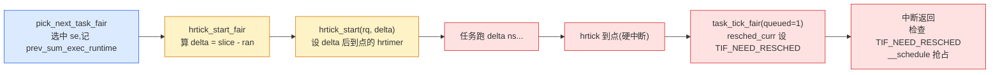

# 第四章 · 时钟:sched_clock、tick 与 hrtick

> 篇:第 1 篇 · 任务与运行队列:调度的账本(本章是本篇第 3 章)
> 主线呼应:上一章我们把运行队列(`rq`/`cfs_rq`/`rt_rq`/`dl_rq`)搭好了,但队列只是"候车厅"——要决定"时间片到没到"、"该不该抢"、"该不该均衡",调度器还差一样东西:**时钟**。这一章讲的就是调度器的心跳。Linux 调度器里其实有**三套**时钟各司其职:`sched_clock`(纳秒级原始时钟,但跨核可能不稳定)、`scheduler_tick`(定期节拍,HZ 频率,粗粒度兜底)、`hrtick`(高精度单次定时器,EEVDF 精确抢占)。读完本章,你会明白为什么需要三套、它们各自管什么、`rq->clock` 这一族时钟字段是怎么维护的,以及为什么 `hrtick` 默认是关的。

## 核心问题

**调度器靠什么感知"时间过了多久"?为什么 Linux 里同时有 `sched_clock`、`scheduler_tick`、`hrtick` 三套时钟机制?为什么粗 tick 不够、要发明 hrtick?EEVDF 的时间片精度是怎么落到纳秒级的?**

读完本章你会明白:

1. `sched_clock`:架构提供的纳秒级原始时钟,快但**跨核可能倒退**(x86 TSC 在不同核上不同步),内核用 `sched_clock_cpu()` 半稳定化(GTOD 基准 + delta 过滤)。
2. `rq->clock` / `rq->clock_task` / `rq->clock_pelt`:每个 `rq` 维护的三套时钟,通过 `update_rq_clock` 增量更新,`rq_clock()` 取值时要求**持锁**。
3. `scheduler_tick`:HZ 频率(默认 100/250/1000 Hz)的定期节拍,在 timer 中断里调用,做 task_tick、calc_load、触发 load_balance——粗粒度的"兜底心跳"。
4. `hrtick`:基于 `hrtimer` 的**高精度单次定时器**,到点产生一次硬中断精确触发抢占,让 EEVDF 时间片精度落到纳秒级。但默认关(`SCHED_FEAT(HRTICK, false)`)。

> 逃生阀:本章不展开 EEVDF 怎么算时间片(第 7、10 章),只讲"时间片到点这个事件是怎么被精确触发的"。如果你只关心算法,可以跳到第 7 章,但你会错过"为什么时间片能精确到纳秒"这个工程细节。

---

## 4.1 一句话点破

> **调度器要管时间,但 Linux 三套时钟机制各有长短:`sched_clock` 快但跨核不稳、`scheduler_tick` 稳但粗(毫秒级)、`hrtick` 精确(纳秒级)但要额外开销。EEVDF 的精确公平靠 hrtick 落地——给当前任务设一个"还剩 slice 时长"的单次定时器,到点立刻触发抢占;不靠 hrtick,只靠粗 tick,时间片误差可达一个 tick(毫秒级),公平性打折。**

这是结论,不是理由。本章倒过来拆:先看 `sched_clock` 为什么不稳、内核怎么治理,再看 `rq->clock` 怎么维护,然后看粗 tick 干什么,最后讲 hrtick 的精妙和它默认关的原因。

---

## 4.2 sched_clock:快但跨核可能倒退的原始时钟

### 它是什么

[`sched_clock`](../linux/kernel/sched/clock.c#L62)([clock.c:62](../linux/kernel/sched/clock.c#L62))是调度器用的**最底层时钟**,返回当前纳秒数:

```c
/* kernel/sched/clock.c(架构可覆盖的弱符号默认实现) */
notrace unsigned long long __weak sched_clock(void)
{
    /* 默认实现:用 jiffies 凑数(精度只到时钟节拍) */
    return (unsigned long long)(jiffies - INITIAL_JIFFIES) *
                    (NSEC_PER_SEC / HZ);
}
EXPORT_SYMBOL_GPL(sched_clock);
```

这是个 `__weak` 弱符号——架构可以覆盖它。x86 上覆盖成读 **TSC**(Time Stamp Counter,`rdtsc` 指令),精度纳秒级、读取极快(几十周期)。ARM 上读 `cntvct_el0`。架构给的 `sched_clock()` 是"原始、快、纳秒级"的。

### 不这样会怎样:跨核倒退

但 TSC 有个坑:**不同核的 TSC 可能不同步**。多核机器上,即使 Intel 努力保证"TSC 同步"(Invariant TSC),虚拟化、深度睡眠(C-state 停 TSC)、异构 CPU 等场景仍可能让 TSC 在核间倒退——**核 A 上读到的 TSC 比核 B 上 1ms 前读到的还小**。

[`kernel/sched/clock.c`](../linux/kernel/sched/clock.c#L21) 开头那个"BIG FAT WARNING"注释把这事钉死了([L21-24](../linux/kernel/sched/clock.c#L21-L24)):

```
 * ######################### BIG FAT WARNING ##########################
 * # when comparing cpu_clock(i) to cpu_clock(j) for i != j, time can #
 * # go backwards !!                                                  #
 * ####################################################################
```

调度器要是直接拿 TSC 算"任务 A 在核 0 上跑了多久,然后迁到核 1 继续算"——一旦倒退,`delta = new - old` 成负数,时间片记账、PELT 衰减全乱套。

### 所以这样设计:sched_clock_cpu 半稳定化

内核在 [`CONFIG_HAVE_UNSTABLE_SCHED_CLOCK`](../linux/kernel/sched/clock.c#L388)(多数 SMP 架构开启)下,实现了**半稳定化**的 [`sched_clock_cpu(int cpu)`](../linux/kernel/sched/clock.c#L388)([L388-410](../linux/kernel/sched/clock.c#L388-L410))。思路是:**用 GTOD(全局单调时钟,`clock_monotonic`)做基准,用 sched_clock() 的 delta 做精度增强,delta 经过滤波保证单调**。

核心数据结构是 per-CPU 的 [`struct sched_clock_data`](../linux/kernel/sched/clock.c#L88-94)([L88-94](../linux/kernel/sched/clock.c#L88-L94)):

```c
/* kernel/sched/clock.c(简化) */
struct sched_clock_data {
    u64 tick_raw;      /* 上次 stamp 时 sched_clock() 的原始值 */
    u64 tick_gtod;     /* 上次 stamp 时 GTOD 的值 */
    u64 tick_stale;    /* ... */
};
static DEFINE_PER_CPU_SHARED_ALIGNED(struct sched_clock_data, sched_clock_data);
```

每个核定期(`sched_clock_tick`)记下"TSC 值 + GTOD 值"对。算 `sched_clock_cpu(cpu)` 时:

1. 取该核的 `tick_raw` / `tick_gtod` 作为锚点;
2. 读当前 `sched_clock()`,减 `tick_raw` 得 delta;
3. **滤波**:delta 过大或过小(倒退)就钳到合理窗口(见 `sched_clock_local` 的 `min_range`/`max_range`);
4. 返回 `tick_gtod + 滤波后的 delta`,加上全局 `__sched_clock_offset`。

效果:同一核上严格单调;跨核也基本单调(因为锚点是 GTOD)。这就是"半稳定"——不绝对同步,但够调度器用。

> **不这样会怎样**:如果直接用 TSC 不滤波,跨核迁移任务时记账会出负数。如果改用 GTOD(`ktime_get_ns()`),它虽稳定但读取代价高(几十到几百 ns,要 seqlock),调度器热路径(`update_rq_clock` 每次入队出队都调)扛不住。半稳定化是个折中:**快**(读 TSC)+ **够稳**(滤波 + GTOD 锚点)。

### "稳定"还能动态切换

注意 [`__sched_clock_stable`](../linux/kernel/sched/clock.c#L79) 这个 static key——架构/平台可以在运行时声明"TSC 稳定了"(比如 Intel 显式声明 Invariant TSC),这时 `sched_clock_cpu(cpu)` 走快路径([clock.c:393-394](../linux/kernel/sched/clock.c#L393-L394)):

```c
if (sched_clock_stable())
    return sched_clock() + __sched_clock_offset;   /* 快路径:直接 TSC + offset */
```

不再做 per-CPU 滤波。如果运行中发现 TSC 不稳(如某些虚拟化场景),又能动态切回不稳定路径(见 [`__sched_clock_work`](../linux/kernel/sched/clock.c#L152) 工作队列)。这个"运行时可切换"由 static key 实现,稳定时零分支预测开销,不稳定时才走滤波——见第 11 本《同步原语》的 `static_branch` 技巧。

> **钉死这件事**:`sched_clock` 是调度器的"时间感"来源。它快(架构 TSC),但跨核可能不稳,所以内核用 GTOD 锚点 + delta 滤波做"半稳定化"(`sched_clock_cpu`)。稳定时还能走快路径。这是"用复杂度换时间精度"的工程取舍。

---

## 4.3 rq->clock:每个运行队列维护的时钟

调度器不直接用 `sched_clock_cpu()`,而是给每个 `rq` 维护一组**缓存时钟**(见第 3 章的 rq 结构):

| 字段 | 含义 | 取法 |
|------|------|------|
| `rq->clock` | 本 rq 的"调度时钟"(纳秒),**含** IRQ/softirq 时间 | `rq_clock(rq)` |
| `rq->clock_task` | **任务时钟**,扣除 IRQ/softirq 时间(只算真正跑任务的时间) | `rq_clock_task(rq)` |
| `rq->clock_pelt` | PELT 时钟,任务不可跑时(idle/throttle)会"暂停"(第 9 章) | `rq_clock_pelt(rq)` |

### 为什么有三个

- `clock`:调度器看"墙钟时间过了多久"用这个(比如算延迟告警)。
- `clock_task`:EEVDF/PELT 记账用这个——任务在跑才算时间。IRQ 处理时任务没跑,不该算到任务的 `sum_exec_runtime` 里。
- `clock_pelt`:PELT 用,任务不可跑时(idle、throttle)这个时钟"冻结",保证 PELT 反映的是"任务实际可跑的时间窗口里的负载"。

### 怎么维护:update_rq_clock 增量更新

[`update_rq_clock`](../linux/kernel/sched/core.c#L751)([L751-771](../linux/kernel/sched/core.c#L751-L771))是核心更新函数:

```c
/* kernel/sched/core.c */
void update_rq_clock(struct rq *rq)
{
    s64 delta;
    lockdep_assert_rq_held(rq);                    /* 必须持 rq->lock */

    if (rq->clock_update_flags & RQCF_ACT_SKIP)
        return;
#ifdef CONFIG_SCHED_DEBUG
    if (sched_feat(WARN_DOUBLE_CLOCK))
        SCHED_WARN_ON(rq->clock_update_flags & RQCF_UPDATED);
    rq->clock_update_flags |= RQCF_UPDATED;
#endif
    delta = sched_clock_cpu(cpu_of(rq)) - rq->clock;   /* 增量 */
    if (delta < 0)
        return;                                    /* 单调:不倒退 */
    rq->clock += delta;
    update_rq_clock_task(rq, delta);               /* 扣除 IRQ 时间,更新 clock_task */
}
```

要点:

1. **必须持 `rq->lock`**:多个地方并发改 `rq->clock` 会乱。`lockdep_assert_rq_held` 强制检查。
2. **增量更新**:不每次重读全量,而是读当前 `sched_clock_cpu` 减 `rq->clock` 得 delta,加到 `rq->clock` 上。delta 是 `s64`,负数直接丢弃(`if (delta < 0) return`)——防止单调性破坏。
3. **去重**:`RQCF_UPDATED` 标志(调试模式)防止一次持锁内重复更新(浪费)。

`rq_clock(rq)` 取值也要持锁,见 [`sched.h:1520`](../linux/kernel/sched/sched.h#L1520-L1526):

```c
/* kernel/sched/sched.h */
static inline u64 rq_clock(struct rq *rq)
{
    lockdep_assert_rq_held(rq);
    assert_clock_updated(rq);   /* 要求本持锁周期内已 update 过 */
    return rq->clock;
}
```

`assert_clock_updated` 会检查"持锁后有没有调过 `update_rq_clock`"——没调就读 clock,触发 `SCHED_WARN`。这是为了防止读到"陈旧的" clock(比如刚锁上还没更新,读到上次留下的值)。

> **钉死这件事**:调度器热路径的模式是:① `rq_lock(rq, &rf)`;② `update_rq_clock(rq)`;③ 用 `rq_clock(rq)` 读时间做各种记账;④ `rq_unlock(rq, &rf)`。这套"锁-更新-读-放"模式在 `scheduler_tick`、`try_to_wake_up`、`enqueue_task`、`__schedule` 里反复出现。

### clock_task 怎么扣除 IRQ 时间

[`update_rq_clock_task`](../linux/kernel/sched/core.c#L695)([L695-749](../linux/kernel/sched/core.c#L695-L749)) 在更新 `rq->clock` 之后被调用,它的活是:把这段时间里花在 IRQ/softirq/steal(虚拟化被偷)上的时间从 `clock` 里扣掉,得到 `clock_task`。这样任务的 `sum_exec_runtime` 只计真正跑任务的时间。具体做法是维护 `rq->prev_irq_time` 等(见 `CONFIG_IRQ_TIME_ACCOUNTING`),每次更新减去新增的 IRQ 时间。

---

## 4.4 scheduler_tick:定期节拍(粗粒度兜底)

### 它是什么

[`scheduler_tick`](../linux/kernel/sched/core.c#L5665)([L5665-5705](../linux/kernel/sched/core.c#L5665-L5705))是调度器的**定期心跳**。它在 **timer 中断**里被调用,频率是 **HZ**(编译时配,常见 100/250/1000)。注释开头就点明了([L5661-5664](../linux/kernel/sched/core.c#L5661-L5664)):

```c
/*
 * This function gets called by the timer code, with HZ frequency.
 * We call it with interrupts disabled.
 */
void scheduler_tick(void)
{
    int cpu = smp_processor_id();
    struct rq *rq = cpu_rq(cpu);
    struct task_struct *curr = rq->curr;
    struct rq_flags rf;
    ...
    rq_lock(rq, &rf);                 /* 标准模式:锁 */

    update_rq_clock(rq);              /* 更新时钟 */
    ...
    curr->sched_class->task_tick(rq, curr, 0);   /* 调度类 tick:记账、判断抢占 */
    ...
    calc_global_load_tick(rq);        /* 全局 load 累计 */
    sched_core_tick(rq);
    task_tick_mm_cid(rq, curr);

    rq_unlock(rq, &rf);               /* 放 */
    ...
#ifdef CONFIG_SMP
    rq->idle_balance = idle_cpu(cpu);
    trigger_load_balance(rq);         /* 触发 load_balance(第 15 章) */
#endif
}
```

### 它干什么

`scheduler_tick` 每个节拍干几件事:

1. **更新时钟**:`update_rq_clock`。
2. **调当前任务的调度类 `task_tick`**:`curr->sched_class->task_tick(rq, curr, 0)`。这是关键——普通任务走 `task_tick_fair`,里面更新 `sum_exec_runtime`、检查"本时间片是不是跑超了"(EEVDF 的 slice),超了就 `resched_curr(rq)` 标记要抢。RT 任务走 `task_tick_rt`,deadline 走 `task_tick_dl`。
3. **全局负载累计**:`calc_global_load_tick`(给 `/proc/loadavg` 用)。
4. **触发负载均衡**:`trigger_load_balance`(第 15 章,周期性 load_balance 的入口)。

### 不这样会怎样:粗 tick 的局限

注意 `task_tick` 是**每个 HZ 节拍**才调一次。HZ=250 时,两个 tick 之间 4ms——**时间片检查的精度上限就是 4ms**。如果一个任务时间片还剩 1ms,但下次 tick 要 4ms 后才来,任务实际会跑超 3ms 才被抢。

EEVDF 追求精确公平,这种"最多跑超一个 tick"的误差显然不理想。一个 4ms 时间片跑超 3ms 是 75% 误差。怎么办?——**hrtick** 登场。

> **钉死这件事**:粗 tick(HZ 频率)是调度器的"基本心跳",负责定期记账、负载累计、触发均衡。但它的精度受限于 HZ(毫秒级),不足以满足 EEVDF 的精确时间片需求。需要更精细的工具:hrtick。

---

## 4.5 hrtick:高精度单次定时器,精确抢占

### 它是什么

[`hrtick`](../linux/kernel/sched/core.c#L788)([L788-801](../linux/kernel/sched/core.c#L788-L801))是基于 `hrtimer`(高精度定时器,见 `kernel/time/hrtimer.c`)的**单次定时器**,挂在 `rq->hrtick_timer` 上。它的用途:**给当前任务设一个"还剩 slice 时长"的定时炸弹,到点炸出一次抢占**。

来看 [`hrtick`](../linux/kernel/sched/core.c#L788)(定时器到点的回调):

```c
/* kernel/sched/core.c */
static enum hrtimer_restart hrtick(struct hrtimer *timer)
{
    struct rq *rq = container_of(timer, struct rq, hrtick_timer);
    struct rq_flags rf;

    WARN_ON_ONCE(cpu_of(rq) != smp_processor_id());  /* 必须在本核触发 */

    rq_lock(rq, &rf);
    update_rq_clock(rq);
    rq->curr->sched_class->task_tick(rq, rq->curr, 1);   /* 注意第 3 参 = 1:hrtick 触发 */
    rq_unlock(rq, &rf);

    return HRTIMER_NORESTART;   /* 单次,不重启 */
}
```

注意 `task_tick(rq, curr, 1)` 的第 3 参 `queued = 1`——这告诉调度类"这是 hrtick 触发,不是粗 tick"。在 `task_tick_fair` 里,`queued=1` 时检查时间片已到,立刻 `resched_curr(rq)` 设 `TIF_NEED_RESCHED`(第 11 章详讲),中断返回时抢占。

### 怎么设:hrtick_start

[`hrtick_start`](../linux/kernel/sched/core.c#L831)(SMP 版,[L831-847](../linux/kernel/sched/core.c#L831-L847)):

```c
/* kernel/sched/core.c */
void hrtick_start(struct rq *rq, u64 delay)
{
    struct hrtimer *timer = &rq->hrtick_timer;
    s64 delta;

    /* 不允许设短于 10000ns(10us)的 slice,防 timer DoS */
    delta = max_t(s64, delay, 10000LL);
    rq->hrtick_time = ktime_add_ns(timer->base->get_time(), delta);

    if (rq == this_rq())
        __hrtick_restart(rq);                              /* 本核:直接设 */
    else
        smp_call_function_single_async(cpu_of(rq), &rq->hrtick_csd);  /* 跨核:IPI */
}
```

两个要点:

1. **10us 下限**:`delta = max_t(s64, delay, 10000LL)`——不允许设比 10us 还短的定时器,防止恶意任务用极短时间片把 hrtimer 子系统打成 DoS。
2. **跨核用 IPI**:`hrtick_start` 可能在 A 核上被调(比如 A 核唤醒了 B 核的任务,要给 B 核设 hrtick),但 `hrtimer` 必须**在它绑定的核上** `hrtimer_start`(因为 hrtimer 是 per-CPU 的 clock base)。SMP 下走 `smp_call_function_single_async`(给目标核发个 IPI,让目标核自己调 `__hrtick_start`);非 SMP 直接 `hrtimer_start`。

### 谁来调 hrtick_start:fair 类的 hrtick_start_fair

公平调度类在选下一个任务后,会算"当前 slice 还剩多久",设个 hrtick 到点抢。见 [`hrtick_start_fair`](../linux/kernel/sched/fair.c#L6630)([L6630-6648](../linux/kernel/sched/fair.c#L6630-L6648)):

```c
/* kernel/sched/fair.c */
static void hrtick_start_fair(struct rq *rq, struct task_struct *p)
{
    struct sched_entity *se = &p->se;

    SCHED_WARN_ON(task_rq(p) != rq);

    if (rq->cfs.h_nr_running > 1) {              /* 队列里有多个任务才有抢的意义 */
        u64 ran = se->sum_exec_runtime - se->prev_sum_exec_runtime;  /* 本周期已跑 */
        u64 slice = se->slice;                   /* 本周期分得的时间片 */
        s64 delta = slice - ran;                 /* 还剩多少 */

        if (delta < 0) {                         /* 已经跑超了,立刻抢 */
            if (task_current(rq, p))
                resched_curr(rq);
            return;
        }
        hrtick_start(rq, delta);                 /* 设个 delta 后到点的定时器 */
    }
}
```

逻辑很直观:`slice` 是 EEVDF 算出的本周期时间片(第 10 章),`ran` 是本周期已跑的,`delta = slice - ran` 就是"还剩多久该被抢"。设个 `delta` 后到点的 hrtick,到点炸出抢占。

### 精妙在哪



时间片精度从"粗 tick 的 HZ 粒度(毫秒级)"提升到"hrtick 的纳秒级"。一个 1ms 的时间片,粗 tick 可能跑超最多 4ms(HZ=250),hrtick 误差是几十 ns(hrtimer 精度)。

> **反面对比**:如果不发明 hrtick,只靠粗 tick 兜底,EEVDF 的"精确公平"打折——权重小的任务会被权重大的一次跑超很多,公平性明显变差。hrtick 是把 EEVDF 精度落地的关键工具。Linux 2.6.25 引入 hrtick(当时还是 CFS),正是为了解决"时间片精度不够"的问题。

### 但 hrtick 默认是关的!

这是个反直觉的事实。看 [`features.h`](../linux/kernel/sched/features.h#L29)([L29-30](../linux/kernel/sched/features.h#L29-L30)):

```c
/* kernel/sched/features.h */
SCHED_FEAT(HRTICK, false)       /* 默认关 */
SCHED_FEAT(HRTICK_DL, false)
```

`SCHED_FEAT(HRTICK, false)` 第 2 参是默认值,`false` 表示**默认关闭**。`hrtick_enabled_fair` 检查这个 feature([sched.h:2585-2590](../linux/kernel/sched/sched.h#L2585-L2590)):

```c
static inline int hrtick_enabled_fair(struct rq *rq)
{
    if (!sched_feat(HRTICK))
        return 0;
    return hrtick_enabled(rq);
}
```

为什么默认关?

1. **hrtimer 开销**:每个时间片设一次 hrtimer,涉及 hrtimer 编程(改硬件定时器,CPU-specific 操作)、可能 IPI(`smp_call_function_single_async`)。频繁设/取消 hrtimer 有开销,在高负载、时间片很短的场合,开销可能超过它带来的精度收益。
2. **粗 tick 够用**:对绝大多数桌面/服务器负载,毫秒级的时间片误差不影响体验。EEVDF 的 lag 机制会在后续周期"补偿"——这次跑超 3ms,下次 vlag 会反映出来,自动少分一点。所以即使不用 hrtick,长期公平性仍成立,只是短期精度差。
3. **可开**:`echo HRTICK > /sys/kernel/debug/sched/features`(需要 `CONFIG_SCHED_DEBUG`)就能打开。实时/低延迟场景(如音频、实时交易)会显式开。

> **钉死这件事**:hrtick 是"时间片精确抢占"的工程实现——hrtimer 单次定时器 + `task_tick(queued=1)` 设 `TIF_NEED_RESCHED`。它把 EEVDF 的时间片精度从 HZ 粒度提到纳秒级。但默认关(开销 vs 收益的取舍),需要时可开。这是"精确"与"开销"的工程平衡——Linux 选择默认粗 tick 兜底,hrtick 作可选增强。

### hrtick 和粗 tick 的分工

注意两者**不互斥**:

- 粗 tick(`scheduler_tick`)始终在跑,做记账、calc_load、触发 load_balance——这些是粗粒度就够的活。
- hrtick(开了的话)在选下一个任务后设,负责精确的时间片到点抢占。

一个任务跑期间,粗 tick 可能触发多次(每次记账、检查抢占),hrtick 只触发一次(到点抢)。两者都最终走 `task_tick_*` + `resched_curr`,只是触发时机不同。`__schedule` 入口([core.c:6631](../linux/kernel/sched/core.c#L6631))会先 `hrtick_clear`——避免切走后旧的 hrtick 还在跑。

---

## 4.6 技巧精解

本章最硬核的技巧有两条:sched_clock 的**半稳定化**(GTOD 锚点 + delta 滤波 + 运行时切换快路径)和 hrtick 的**10us 下限 + 跨核 IPI 设 timer**。

### 技巧一:sched_clock_cpu 的半稳定化——快、稳、还能动态切换

#### 朴素地写会撞什么墙

朴素选择有两个极端:

- **直接用 TSC(`sched_clock()`)**:快,但跨核倒退——任务迁移、跨核唤醒的时间记账出负数,PELT 衰减乱套。
- **直接用 GTOD(`ktime_get_ns()`)**:稳,但慢(seqlock + 可能的时钟源读),热路径(`update_rq_clock` 每次入队出队都调)扛不住——几百万次/秒的调用把 CPU 都耗在读时钟上。

#### 所以这样设计:半稳定化

见 4.2 节。妙在三件事:

1. **GTOD 做锚点**:per-CPU 的 `sched_clock_data` 定期记 `{tick_raw, tick_gtod}` 对,把"TSC 读数"和"GTOD 读数"绑在一起。算时间时以 GTOD 为基准,保证全局单调。
2. **TSC delta 做精度**:`sched_clock_cpu = tick_gtod + (current_tsc - tick_raw)`,delta 部分用 TSC(纳秒级、快),基准部分用 GTOD(稳)。两者结合:精度来自 TSC,稳定性来自 GTOD。
3. **滤波防毛刺**:delta 过大或过小(倒退)钳到合理窗口(`min_range`/`max_range`,见 `sched_clock_local`@clock.c#L263)。极端值来自 TSC 突跳(虚拟化迁移、深度 C-state 唤醒),滤波把它们钳住。

更妙的是**运行时可切换**:`__sched_clock_stable` static key([clock.c:79](../linux/kernel/sched/clock.c#L79))。平台运行时声明"TSC 稳了"(如 Intel Invariant TSC),static key 打开,`sched_clock_cpu` 走快路径([clock.c:393](../linux/kernel/sched/clock.c#L393))直接 `sched_clock() + __sched_clock_offset`,完全跳过 per-CPU 滤波。运行中发现不稳(`clear_sched_clock_stable`),static key 关闭,切回滤波路径。

static key 的妙处(见第 11 本《同步原语》):稳定时是 `jmp` 指令的"跳/不跳"由 code patching 决定,**零分支预测开销**;不稳定时才走分支。这让"快路径"真的快——绝大多数现代 x86 机器 TSC 稳定,常年走快路径,半稳定化的滤波代码只是兜底。

> **反面对比**:如果只 static key 不可切换(写死一种路径),要么永远付滤波开销(稳定机器也走慢路径),要么永远冒倒退风险(不稳机器也走 TSC 直读)。运行时可切换让两边都最优——这是内核处理"运行时才知道的特性"的招牌手法(同款见 `static_branch_likely` 的多处用法)。

### 技巧二:hrtick 的 10us 下限 + 跨核 IPI 设 timer

#### 朴素地写会撞什么墙

hrtick 的朴素写法:

```c
/* 朴素的、糟糕的写法(示意,非源码) */
void hrtick_start(struct rq *rq, u64 delay) {
    hrtimer_start(&rq->hrtick_timer, ns_to_ktime(delay), HRTIMER_MODE_REL);
}
```

两个问题:

1. **timer DoS**:恶意/buggy 任务把 slice 算成 0 或极小,`hrtick` 不断重设,hrtimer 子系统被高频 timer 编程压垮。
2. **跨核失效**:`hrtick_start` 可能在 A 核被调(比如 A 核负载均衡把任务推到 B 核,要给 B 核的 rq 设 hrtick),但 `hrtimer` 是绑定 CPU 的(`HRTIMER_MODE_REL_PINNED`),在别的核上 `hrtimer_start` 不工作或行为错。

#### 所以 Linux 这样做

见 [`hrtick_start`@core.c:831](../linux/kernel/sched/core.c#L831)(4.5 节已贴):

1. **10us 下限**:`delta = max_t(s64, delay, 10000LL)`——任何短于 10000ns(10us)的 slice 都被钳到 10us。注释明说"that just doesn't make sense and can cause timer DoS"。这是 hrtimer 子系统的自我保护:不让调度器成为 DoS 攻击向量。
2. **跨核 IPI**:SMP 下 `if (rq == this_rq()) __hrtick_restart(rq); else smp_call_function_single_async(cpu_of(rq), &rq->hrtick_csd);`。`hrtick_csd` 是个 `call_single_data_t`(见第 11 本《同步原语》的 IPI/CSD 章节),在 [`hrtick_rq_init`@core.c:868](../linux/kernel/sched/core.c#L868) 初始化:`INIT_CSD(&rq->hrtick_csd, __hrtick_start, rq)`。A 核调 `hrtick_start(B 的 rq, ...)`,实际是给 B 核发个 IPI,B 核在 IPI 处理里调 `__hrtick_restart` 给自己设 timer。这样 hrtimer 始终在它绑定的核上 `start`,正确性保证。

#### 妙在哪

- **防 DoS 用"钳到下限"** 而不是"拒绝":`max_t` 让任何 slice 都合法,但不会过短。调用者不用处理错误码,API 简洁。这是"用钳位代替错误处理"的工程美学。
- **跨核 timer 用 IPI**:把"hrtimer 必须本核 start"的约束藏在 `hrtick_start` 内部,调用者根本不用关心是本核还是跨核——API 统一。CSD(call_single_data)是内核 SMP 通信的低层机制,延迟极低(微秒级 IPI)。

> **架构依赖提示**:`HRTIMER_MODE_REL_PINNED_HARD` 是 5.x 起的"硬中断上下文 hrtimer"(用于 PREEMPT_RT),保证 timer 回调在硬中断里执行不被线程化。本书不展开 PREEMPT_RT(那是另一本书的话题),只需知道 hrtick 用的是"硬中断 timer",到点立刻进硬中断,延迟极低。

---

## 章末小结

这一章把"调度器的时间感"钉死了。要点:

1. **三套时钟**:`sched_clock`(架构 TSC,快但跨核可能不稳)、`scheduler_tick`(HZ 粗 tick,毫秒级兜底)、`hrtick`(hrtimer 高精度单次,纳秒级)。
2. **`sched_clock_cpu` 半稳定化**:GTOD 锚点 + TSC delta 滤波 + 运行时 static key 切换快路径,让时钟既快又稳。
3. **`rq->clock`/`clock_task`/`clock_pelt`**:每个 rq 三套时钟,持锁用 `update_rq_clock` 增量更新,`rq_clock()` 取值要求持锁+已更新。
4. **`scheduler_tick`**:HZ 频率的定期节拍,做 `task_tick`(记账+判抢占)、calc_load、触发 load_balance。
5. **`hrtick`**:hrtimer 单次定时器,精确时间片到点抢占,让 EEVDF 精度到纳秒级。默认关(开销 vs 收益),需要时可开。

本章服务二分法的**支撑**面——时钟是"时间片、抢占时机、负载均衡"所有机制的基础设施。下一章讲任务的生命周期:fork 创建、阻塞睡眠、try_to_wake_up 唤醒——这些都是建立在"任务表示 + 运行队列 + 时钟"之上的机制层操作。

### 五个"为什么"清单

1. **为什么调度器不直接用 TSC?** TSC 跨核可能倒退(虚拟化、深度 C-state),会让任务迁移/唤醒的时间记账出负数。内核用 `sched_clock_cpu`(GTOD 锚点 + delta 滤波)半稳定化。
2. **`rq->clock` 和 `rq->clock_task` 有什么区别?** `clock` 是调度时钟(含 IRQ 时间),`clock_task` 扣除 IRQ 时间只算任务跑的时间。任务 `sum_exec_runtime`/PELT 用 `clock_task`,延迟告警等用 `clock`。
3. **为什么有粗 tick 还要 hrtick?** 粗 tick 精度受 HZ 限制(HZ=250 时 4ms),EEVDF 时间片可能远小于此,只靠 tick 会跑超很多。hrtick 用 hrtimer 单次定时器,把精度提到纳秒级。
4. **hrtick 为什么默认关?** hrtimer 编程有开销(可能 IPI、改硬件定时器),高负载下开销可能超精度收益。EEVDF 的 lag 机制能在后续周期补偿,长期公平不依赖 hrtick。需要精度的场景(实时/低延迟)可显式开。
5. **`sched_clock_stable` 这个 static key 干什么?** 平台运行时声明 TSC 稳定(如 Intel Invariant TSC),static key 打开,`sched_clock_cpu` 走快路径直接 TSC+offset 跳过滤波;不稳时切回滤波路径。让"稳定机器"零滤波开销、"不稳机器"有兜底。

### 想继续深入往哪钻

- 本章讲的时钟,详见 [`kernel/sched/clock.c`](../linux/kernel/sched/clock.c)(整个文件就是讲 sched_clock 半稳定化的,注释极详细,值得通读)、[`core.c:update_rq_clock`@751](../linux/kernel/sched/core.c#L751)、[`core.c:scheduler_tick`@5665](../linux/kernel/sched/core.c#L5665)、[`core.c:hrtick`@788](../linux/kernel/sched/core.c#L788)、[`core.c:hrtick_start`@831](../linux/kernel/sched/core.c#L831)、[`fair.c:hrtick_start_fair`@6630](../linux/kernel/sched/fair.c#L6630)。
- `hrtimer` 子系统见 [`kernel/time/hrtimer.c`](../linux/kernel/time/hrtimer.c)(本书不深入,只把 hrtick 当作用户)。
- 想观测实际时钟:`cat /proc/sched_debug` 会列出每个 rq 的 `clock`、`.clock_task`;`cat /proc/timer_list | head` 看挂了哪些 hrtimer;`trace-cmd record -e sched:sched_stat_runtime` 看时间片分配。
- 想开 hrtick:`echo HRTICK > /sys/kernel/debug/sched/features`(需要 `CONFIG_SCHED_DEBUG`);`zcat /proc/config.gz | grep HZ` 看 HZ 配。
- EEVDF 怎么算 `slice` 见第 10 章;`task_tick_fair` 内部逻辑见第 11 章(抢占)。

### 引出下一章

时钟有了,任务表示有了,运行队列有了。最后一章把三件事缝起来:任务的生命周期——fork 创建激活入队、阻塞睡眠出队、try_to_wake_up 唤醒(带选核)。这是本篇(第 1 篇)的收束,也是从"账本"过渡到"机制"的桥梁。
