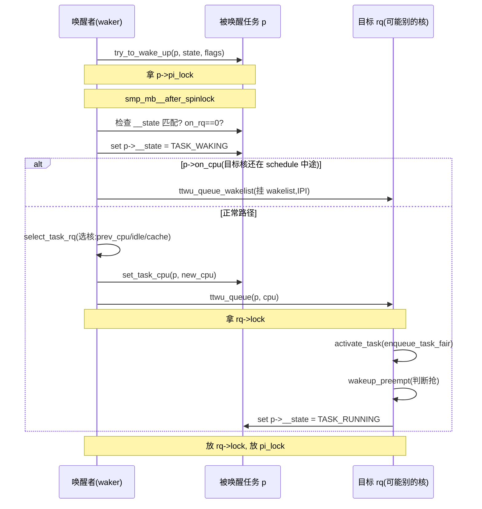

# 第五章 · 任务的入队出队:enqueue/dequeue/wakeup

> 篇:第 1 篇 · 任务与运行队列:调度的账本(本章是本篇第 4 章,也是本篇收束)
> 主线呼应:前三章我们搭好了账本的三块地基——任务怎么表示(`task_struct`/`sched_entity`)、运行队列怎么组织(`rq`/`cfs_rq`)、时钟怎么走(`sched_clock`/`tick`/`hrtick`)。这一章把它们**缝起来**:一个任务的一生——从 `fork` 创建被激活进队列,到阻塞睡眠出队列,到 `try_to_wake_up` 被唤醒(还要选个 CPU)。这一章是本篇(支撑层)向"机制层"的过渡:入队出队是机制层最频繁的操作,唤醒路径里还藏着 SMP 调度最精巧的内存序设计。读完本章,你就能在脑子里放映出"任务被唤醒→选核→入队→可能抢占当前任务"的完整时序,并看懂 `try_to_wake_up` 里那些 `smp_mb__after_spinlock`/`smp_cond_load_acquire` 到底在防什么。

## 核心问题

**任务在"可运行"和"阻塞睡眠"之间是怎么切换的(入队/出队)?`fork` 创建的新任务怎么进队列?被唤醒的任务怎么挑一个 CPU 跑(`select_task_rq`/`select_idle_sibling`,为什么 cache 亲和这么重要)?`try_to_wake_up` 里那么多内存屏障,到底在保证"不丢唤醒"这件什么事?**

读完本章你会明白:

1. `activate_task`/`deactivate_task`/`enqueue_task`/`dequeue_task`:任务进/出运行队列的核心 API,通过 `sched_class` 多态分发给各调度类(`enqueue_task_fair`/`enqueue_task_rt`/…)。
2. `__schedule` 里 `deactivate_task(DEQUEUE_SLEEP)`:任务调 `schedule()` 主动让出 CPU 时,就是在 `__schedule` 里被出队的——出队和切换发生在同一次 `__schedule` 里。
3. `try_to_wake_up`:唤醒一个阻塞任务的全过程——拿 `pi_lock`、检查 state、选核 `select_task_rq`、`set_task_cpu`、入队 `ttwu_queue` → `ttwu_do_activate`、`wakeup_preempt` 判断要不要抢当前任务。
4. 选核 `select_task_rq`/`select_idle_sibling`:唤醒时挑哪个 CPU——优先 prev_cpu(cache 亲和)、其次同 LLC 的 idle 核、再退而求其次。这是 SMP 调度 cache 友好性的关键。
5. 唤醒的内存序:`smp_mb__after_spinlock`、`smp_cond_load_acquire(&p->on_cpu, !VAL)`、`smp_rmb` 这套屏障,保证"丢唤醒"和"在 schedule 中途被切走"的竞态不出错。

> 逃生阀:本章不展开 EEVDF 入队时怎么算 vlag/deadline(第 7 章)、不展开负载均衡怎么主动搬任务(第 15 章),只讲"任务进出队列 + 唤醒选核 + 内存序"。这是机制层最基础的部分,后面所有机制章(抢占、切换、均衡)都建立在它上面。

---

## 5.1 一句话点破

> **任务进出队列通过 `sched_class` 多态分派:`activate_task` → `enqueue_task` → `p->sched_class->enqueue_task()`,出队反过来。唤醒一个阻塞任务是 `try_to_wake_up`,它的核心是两件事——选核(`select_task_rq`,优先 prev_cpu/cache 亲和)和入队后判断抢占(`wakeup_preempt`)。而整个唤醒路径最硬核的是它的内存序设计:`pi_lock` + `smp_mb__after_spinlock` + `smp_cond_load_acquire(on_cpu)` 一套组合拳,保证"唤醒者看到阻塞者已睡"和"阻塞者没在 schedule 中途被切走时被丢唤醒"两个竞态都 sound。**

这是结论,不是理由。本章倒过来拆:先看入队出队的 API 和 `sched_class` 分派,再看 `__schedule` 里的出队(主动让出),然后钻 `try_to_wake_up` 的完整路径,接着讲选核的 cache 亲和策略,最后拆内存序。

---

## 5.2 入队出队的核心 API:activate/dequeue_task

### 它们是什么

任务进出运行队列,核心 API 在 [`kernel/sched/core.c`](../linux/kernel/sched/core.c#L2105) 一带:

- [`enqueue_task(rq, p, flags)`](../linux/kernel/sched/core.c#L2105)([L2105-2120](../linux/kernel/sched/core.c#L2105-L2120)):把任务**放进**运行队列。记账(`update_rq_clock`、`psi_enqueue`、`uclamp_rq_inc`)后,**通过 `sched_class` 多态**调具体调度类的 enqueue。
- [`dequeue_task(rq, p, flags)`](../linux/kernel/sched/core.c#L2122)([L2122-2137](../linux/kernel/sched/core.c#L2122-L2137)):把任务**移出**运行队列。反向。
- [`activate_task(rq, p, flags)`](../linux/kernel/sched/core.c#L2139)([L2139-2150](../linux/kernel/sched/core.c#L2139-L2150)):在 `enqueue_task` 基础上**设 `p->on_rq = TASK_ON_RQ_QUEUED`**——标志着任务"在队列上活着"。
- [`deactivate_task(rq, p, flags)`](../linux/kernel/sched/core.c#L2152)([L2152-2158](../linux/kernel/sched/core.c#L2152-L2158)):在 `dequeue_task` 前置**改 `p->on_rq`**(睡眠时设 0,迁移时设 `TASK_ON_RQ_MIGRATING`)。

来看 `enqueue_task` 的真身([L2105-2120](../linux/kernel/sched/core.c#L2105-L2120)):

```c
/* kernel/sched/core.c */
static inline void enqueue_task(struct rq *rq, struct task_struct *p, int flags)
{
    if (!(flags & ENQUEUE_NOCLOCK))
        update_rq_clock(rq);

    if (!(flags & ENQUEUE_RESTORE)) {
        sched_info_enqueue(rq, p);
        psi_enqueue(p, (flags & ENQUEUE_WAKEUP) && !(flags & ENQUEUE_MIGRATED));
    }

    uclamp_rq_inc(rq, p);
    p->sched_class->enqueue_task(rq, p, flags);   /* 关键:多态分派 */

    if (sched_core_enabled(rq))
        sched_core_enqueue(rq, p);
}
```

最关键的就是 `p->sched_class->enqueue_task(rq, p, flags)` 这一行——**走函数指针**。普通任务(`sched_class == fair_sched_class`)实际调 [`enqueue_task_fair`](../linux/kernel/sched/fair.c#L6716)([fair.c:6716](../linux/kernel/sched/fair.c#L6716));RT 任务调 `enqueue_task_rt`;deadline 调 `enqueue_task_dl`。主路径不写 `switch(policy)`,只走指针(第 2 章已详讲这个多态)。

### activate_task/deactivate_task:多一层"on_rq 标志"

`activate_task` 在 `enqueue_task` 外多包一层——**设 `p->on_rq`**:

```c
/* kernel/sched/core.c */
void activate_task(struct rq *rq, struct task_struct *p, int flags)
{
    if (task_on_rq_migrating(p))
        flags |= ENQUEUE_MIGRATED;
    if (flags & ENQUEUE_MIGRATED)
        sched_mm_cid_migrate_to(rq, p);

    enqueue_task(rq, p, flags);

    WRITE_ONCE(p->on_rq, TASK_ON_RQ_QUEUED);       /* 标"在队列上" */
    ASSERT_EXCLUSIVE_WRITER(p->on_rq);
}

void deactivate_task(struct rq *rq, struct task_struct *p, int flags)
{
    WRITE_ONCE(p->on_rq, (flags & DEQUEUE_SLEEP) ? 0 : TASK_ON_RQ_MIGRATING);
    ASSERT_EXCLUSIVE_WRITER(p->on_rq);

    dequeue_task(rq, p, flags);
}
```

注意 `deactivate_task` 的细节:**先改 `on_rq`,再 dequeue**。为什么这个顺序?因为 dequeue 实际把任务从红黑树摘下来需要时间,期间别的 CPU 可能并发唤醒这个任务——先改 `on_rq` 让唤醒路径能看到"它不在队列了"(要么真的睡了 `on_rq=0`,要么在迁移 `on_rq=MIGRATING`),唤醒路径据此决定要不要重新 enqueue。这个顺序和唤醒路径的内存序配合(5.5 节详讲),保证不丢唤醒。

`on_rq` 三个值:

| 值 | 含义 |
|----|------|
| `0` | 不在队列上(阻塞睡眠中) |
| `TASK_ON_RQ_QUEUED`(=1) | 在运行队列上,可被调度 |
| `TASK_ON_RQ_MIGRATING`(=2) | 正在核间迁移,被临时锁住(不让别人动) |

唤醒路径判活就靠它:`p->on_rq == TASK_ON_RQ_QUEUED` 才算"在跑/可跑"。

> **钉死这件事**:任务进出队列 = `activate_task`/`deactivate_task`(改 `on_rq` + 调度类 enqueue/dequeue)。所有"任务状态变化"(fork、唤醒、阻塞、迁移)最终都落到这两个函数上。它们通过 `sched_class` 多态分派给具体调度类,公平走 `enqueue_task_fair`(下钻到 `enqueue_entity`,第 7 章讲 EEVDF 入队时算 vlag/deadline)。

---

## 5.3 fork:新任务的第一次入队

`fork()`(或 `clone()`/`pthread_create()`)创建新任务时,内核 `copy_process` 建好新的 `task_struct`,最后由 [`wake_up_new_task`](../linux/kernel/sched/core.c)(`fork.c` 调它)把它激活入队。关键路径在 [`core.c`](../linux/kernel/sched/core.c#L4895)([L4895](../linux/kernel/sched/core.c#L4895)):

```c
/* kernel/sched/core.c:wake_up_new_task(摘关键) */
__set_task_cpu(p, select_task_rq(p, task_cpu(p), WF_FORK));   /* 给新任务选个 CPU */
/* ... */
activate_task(rq, p, ENQUEUE_NOCLOCK | flags);                /* 入队 */
wakeup_preempt(rq, p, WF_FORK);                                /* 判断要不要抢父任务 */
```

注意 `WF_FORK` 这个 flag——告诉 `select_task_rq`"这是 fork 唤醒",选核策略可能略不同(fork 时新任务没历史,cache 亲和没那么强,可以更积极地均衡到 idle 核)。fork 完成后新任务就在队列里了,等 `__schedule` 下次选中它就开跑。

新任务的初始 `vruntime`/`vlag`/`deadline` 在 `task_fork_fair`(`sched_class->task_fork` 多态)里设——具体怎么设是 EEVDF 的核心(第 7 章),这里只需知道"fork 时把调度实体的 EEVDF 状态初始化好,然后 activate 入队"。

---

## 5.4 阻塞睡眠:__schedule 里的 dequeue

任务主动让出 CPU(比如等 IO、等锁、调 `sleep`),典型路径是:

```c
/* 用户态/内核态等条件 */
set_current_state(TASK_UNINTERRUPTIBLE);   /* 或 TASK_INTERRUPTIBLE */
if (条件不满足)
    schedule();                              /* 让出 CPU */
```

`schedule()` 最终调 [`__schedule`](../linux/kernel/sched/core.c#L6616)([L6616](../linux/kernel/sched/core.c#L6616))。关键在于:`__schedule` **既选出队又选入队**——它检查当前任务(即将被切走的 `prev`)的状态,如果 prev 是阻塞状态(非 `TASK_RUNNING`),就把它**出队**:

```c
/* kernel/sched/core.c:__schedule(摘关键,L6616-6702) */
prev_state = READ_ONCE(prev->__state);
if (!(sched_mode & SM_MASK_PREEMPT) && prev_state) {     /* prev_state != 0 = 非 RUNNING */
    if (signal_pending_state(prev_state, prev)) {
        WRITE_ONCE(prev->__state, TASK_RUNNING);          /* 有信号,不让睡 */
    } else {
        /* 真的阻塞了 */
        prev->sched_contributes_to_load = ...;
        if (prev->sched_contributes_to_load)
            rq->nr_uninterruptible++;

        deactivate_task(rq, prev, DEQUEUE_SLEEP | DEQUEUE_NOCLOCK);  /* 出队! */

        if (prev->in_iowait) {
            atomic_inc(&rq->nr_iowait);
            delayacct_blkio_start();
        }
    }
    switch_count = &prev->nvcsw;
}

next = pick_next_task(rq, prev, &rf);   /* 选下一个 */
```

注意:`deactivate_task(DEQUEUE_SLEEP)` 把 prev 移出队列,设 `prev->on_rq = 0`。然后 `pick_next_task` 选下一个任务。所以**阻塞睡眠和上下文切换发生在同一次 `__schedule` 里**——任务先 dequeue 自己,再让 CPU 切到 next。这是为什么"调 `schedule()` 让出 CPU"的语义是"我睡了,你们跑"。

> **钉死这件事**:任务阻塞 = `set_current_state(非RUNNING)` + `schedule()`。`schedule()` → `__schedule` 在切走前调 `deactivate_task(DEQUEUE_SLEEP)`,把任务移出队列并设 `on_rq = 0`。这之后任务就不在运行队列上了,等被 `try_to_wake_up` 重新入队才能再跑。

### 不可中断睡眠(D 状态)和 load

注意 `prev->sched_contributes_to_load` 这个判断——只有 `TASK_UNINTERRUPTIBLE`(D 状态)且非 `TASK_NOLOAD` 的任务才"贡献 load"(`sched_contributes_to_load = true`),会让 `rq->nr_uninterruptible++`。这就是 `/proc/loadavg` 里那三个数字的来源——D 状态任务算 load,`TASK_INTERRUPTIBLE`(可被信号唤醒)不算。这个区分背后是 Unix 传统:D 状态任务"真的在等"(典型等 IO),算 load 反映系统繁忙程度;可中断睡眠往往只是短暂等,不算。

---

## 5.5 try_to_wake_up:唤醒一个阻塞任务

现在到本章重头戏。唤醒一个阻塞任务,统一入口是 [`try_to_wake_up(p, state, wake_flags)`](../linux/kernel/sched/core.c#L4231)([L4231-4385](../linux/kernel/sched/core.c#L4231-L4385))。`wake_up_process(p)` 就是 `try_to_wake_up(p, TASK_NORMAL, 0)` 的包装([core.c:4508](../linux/kernel/sched/core.c#L4508))。

### 完整路径

把 `try_to_wake_up` 的骨架抽出来(简化,省略大量注释):

```c
/* kernel/sched/core.c:try_to_wake_up(骨架) */
int try_to_wake_up(struct task_struct *p, unsigned int state, int wake_flags)
{
    guard(preempt)();
    int cpu, success = 0;

    if (p == current) { /* 唤醒自己,快路径 */ ... }

    scoped_guard (raw_spinlock_irqsave, &p->pi_lock) {   /* ① 拿 pi_lock */
        smp_mb__after_spinlock();                          /* ② 关键屏障 */
        if (!ttwu_state_match(p, state, &success))         /* state 匹配? */
            break;

        smp_rmb();
        if (READ_ONCE(p->on_rq) && ttwu_runnable(p, wake_flags))  /* 已经在队列?快路径 */
            break;

#ifdef CONFIG_SMP
        smp_acquire__after_ctrl_dep();
        WRITE_ONCE(p->__state, TASK_WAKING);               /* 中间态:可放开 pi_lock */

        /* ③ 如果目标核还在 schedule 中途,等它完 */
        if (smp_load_acquire(&p->on_cpu) &&
            ttwu_queue_wakelist(p, task_cpu(p), wake_flags))
            break;   /* 走 wakelist 异步入队 */

        /* ④ 选核 */
        cpu = select_task_rq(p, p->wake_cpu, wake_flags | WF_TTWU);
        if (task_cpu(p) != cpu) {
            wake_flags |= WF_MIGRATED;
            set_task_cpu(p, cpu);
        }
#endif
        /* ⑤ 入队 */
        ttwu_queue(p, cpu, wake_flags);
    }
    ...
}
```

五步:

1. **拿 `p->pi_lock`**:这是 `task_struct` 里一把专门保护"任务调度状态变化"的锁(PI = priority inheritance,但用途远不止 PI,所有"改任务 sched 状态"的路径都拿它)。`pi_lock` 比 `rq->lock` 粒度小(只锁单个任务),拿它可以在选核时放开 `rq->lock`。
2. **`smp_mb__after_spinlock()`**:拿锁后的内存屏障——和 `__schedule` 里 `rq_lock` 后的 `smp_mb__after_spinlock` 配对(5.6 节详讲)。
3. **检查 on_cpu / 走 wakelist**:如果目标核还在 `__schedule` 中途(任务 `p` 是它的 prev,正在被切走),`p->on_cpu == 1`,这时直接去抢它的 `rq->lock` 会自旋很久。优化:把入队请求挂到目标核的 wakelist,通过 IPI 让目标核自己处理(`ttwu_queue_wakelist`)。
4. **选核 `select_task_rq`**:挑一个 CPU 跑这个任务(下节详讲)。
5. **`ttwu_queue(p, cpu, ...)`** → **`ttwu_do_activate`**:在目标核上拿 `rq->lock`,调 `activate_task`(入队)+ `wakeup_preempt`(判断抢占)。

[`ttwu_do_activate`](../linux/kernel/sched/core.c#L3773)([L3773-3796](../linux/kernel/sched/core.c#L3773-L3796))是最终入队+抢判断:

```c
/* kernel/sched/core.c */
static void
ttwu_do_activate(struct rq *rq, struct task_struct *p, int wake_flags, struct rq_flags *rf)
{
    int en_flags = ENQUEUE_WAKEUP | ENQUEUE_NOCLOCK;
    ...
    activate_task(rq, p, en_flags);    /* 入队 */
    wakeup_preempt(rq, p, wake_flags);  /* 判断要不要抢当前任务 */
    ttwu_do_wakeup(p);                  /* state = TASK_RUNNING */
    ...
}
```

[`wakeup_preempt`](../linux/kernel/sched/core.c#L2237)([L2237-2250](../linux/kernel/sched/core.c#L2237-L2250))判断"新入队的任务要不要立刻抢占当前在跑的":

```c
void wakeup_preempt(struct rq *rq, struct task_struct *p, int flags)
{
    if (p->sched_class == rq->curr->sched_class)
        rq->curr->sched_class->wakeup_preempt(rq, p, flags);  /* 同类:让调度类判断 */
    else if (sched_class_above(p->sched_class, rq->curr->sched_class))
        resched_curr(rq);   /* 唤醒的任务调度类更高:无条件抢 */

    if (task_on_rq_queued(rq->curr) && test_tsk_need_resched(rq->curr))
        rq_clock_skip_update(rq);  /* 反正要切,跳过下次 clock 更新 */
}
```

逻辑:

- 唤醒的任务调度类**更高**(比如唤醒一个 RT 任务,curr 是普通任务)→ `resched_curr` 立刻标记抢。
- **同类**(都是 fair)→ 调 `wakeup_preempt_fair`,内部比较 vruntime/vlag 决定(第 11 章详讲)。
- 唤醒的任务调度类**更低**→ 不抢,新任务乖乖排队等。

`resched_curr` 设 `rq->curr` 的 `TIF_NEED_RESCHED` 标志(第 11 章详讲延迟抢占),中断返回时检查它,调 `__schedule`。



---

## 5.6 选核:select_task_rq 和 cache 亲和

### 为什么唤醒时要选核

任务被唤醒时,它之前可能在 CPU 0 上跑过(叫 `prev_cpu`)。现在唤醒它,可以让它:

- **回 CPU 0**:它的 L1/L2 cache 还可能有数据残留(cache 热),回原核能复用,省内存访问。
- **去个 idle 核**:如果 CPU 0 现在很忙、CPU 2 是 idle 的,让它去 CPU 2 立刻就能跑,不用等。

这是个权衡:**cache 亲和(cache locality) vs 立刻能跑(idle)**。Linux 的策略是"优先 prev_cpu 或同 LLC 的 idle 核",这是 SMP 调度 cache 友好性的核心。

### select_task_rq:统一入口

[`select_task_rq(p, cpu, wake_flags)`](../linux/kernel/sched/core.c#L3632)([L3632-3655](../linux/kernel/sched/core.c#L3632-L3655))是统一入口,但具体策略**走 `sched_class` 多态**:

```c
/* kernel/sched/core.c */
int select_task_rq(struct task_struct *p, int cpu, int wake_flags)
{
    lockdep_assert_held(&p->pi_lock);

    if (p->nr_cpus_allowed > 1 && !is_migration_disabled(p))
        cpu = p->sched_class->select_task_rq(p, cpu, wake_flags);  /* 多态分派 */
    else
        cpu = cpumask_any(p->cpus_ptr);   /* 只能跑一个核或受限,直接取 */

    if (unlikely(!is_cpu_allowed(p, cpu)))
        cpu = select_fallback_rq(task_cpu(p), p);   /* 不允许就回退 */

    return cpu;
}
```

普通任务走 `select_task_rq_fair`(fair.c),RT 走 `select_task_rq_rt`,deadline 走 `select_task_rq_dl`,各自策略不同。`WF_*` 标志告诉选核函数"这次是什么场景":

| flag | 含义 |
|------|------|
| `WF_FORK` | fork 新任务(`wake_up_new_task`)——新任务没历史,可更激进均衡 |
| `WF_TTWU` | try_to_wake_up 唤醒——有 prev_cpu,优先 cache 亲和 |
| `WF_EXEC` | exec 之后 |
| `WF_SYNC` | woker 唤醒后自己要睡(典型 `wait_event` 醒对方)——可以让 wakee 在 waker 的核上跑(cache 热) |
| `WF_MIGRATED` | (内部用)这次唤醒发生了迁移 |
| `WF_CURRENT_CPU` | 倾向把 wakee 放到当前核 |

### select_idle_sibling:fair 类的选核策略

普通任务走 `select_task_rq_fair` → [`select_idle_sibling`](../linux/kernel/sched/fair.c#L7509)([fair.c:7509-](../linux/kernel/sched/fair.c#L7509))。它的策略一环扣一环:

```c
/* kernel/sched/fair.c:select_idle_sibling(摘关键) */
static int select_idle_sibling(struct task_struct *p, int prev, int target)
{
    ...
    /* 1. target 本身就 idle 且 fits,直接用 */
    if ((available_idle_cpu(target) || sched_idle_cpu(target)) &&
        asym_fits_cpu(task_util, util_min, util_max, target))
        return target;

    /* 2. prev_cpu 共享 cache 且 idle,用 prev(cache 亲和) */
    if (prev != target && cpus_share_cache(prev, target) &&
        (available_idle_cpu(prev) || sched_idle_cpu(prev)) &&
        asym_fits_cpu(...)) {
        ...
        return prev;
    }

    /* 3. per-cpu kworker 同核栈(同步唤醒优化) */
    if (is_per_cpu_kthread(current) && ... && prev == smp_processor_id() &&
        this_rq()->nr_running <= 1 && ...)
        return prev;

    /* 4. recent_used_cpu 之前用过的核,可能 cache 还热 */
    recent_used_cpu = p->recent_used_cpu;
    p->recent_used_cpu = prev;
    if (...) ... return recent_used_cpu;

    /* 5. 退而求其次:扫 LLC 内的 idle 核(select_idle_cpu) */
    ...
}
```

优先级是:

1. target 本身 idle(最直接)。
2. prev_cpu 共享 cache 且 idle(回原核,cache 亲和)。
3. per-cpu kworker 的同步唤醒栈(典型 IO 完成回调唤醒,栈在 waker 核上)。
4. `recent_used_cpu`(最近用过的核,可能还热)。
5. 扫 LLC(Last Level Cache,整物理 CPU)域找 idle 核。

核心思想:**优先复用 cache 热的核(prev / recent),其次找 idle 核立刻能跑**。`cpus_share_cache(prev, target)` 是判断两个核是否共享 cache(看调度域层级,第 14 章)。这是 Linux 调度器对 SMP 硬件结构(cache 层次)的深度适配。

> **反面对比**:如果选核只看"idle 就拉过去",一个任务在 CPU 0 上跑了 10ms 把 L1/L2 都填满,被唤醒到 CPU 2,L1/L2 全冷,要重新从内存拉数据——延迟几个微秒到几十微秒。在高频唤醒的场景(IO 密集、消息驱动)这种 cache 抖动会显著降低吞吐。`select_idle_sibling` 的策略把"优先 cache 亲和"做硬,只有 cache 亲和收益小(prev 不 idle)时才退到扫 idle 核。

### 异构 CPU:fits 检查

注意 `asym_fits_cpu(task_util, ...)`——这是为**异构 CPU**(ARM big.LITTLE、Intel P/E core)设计的:大核算力高、小核算力低,任务的 `util_avg`(第 9 章 PELT)要"fit"进核的算力。一个高负载任务不该被选到小核上(跑不动)。这在 `CONFIG_SCHED_ASYM_CPUCAPACITY` 开启时生效,同构 x86 上是空操作。第 14 章调度域会展开。

---

## 5.7 内存序:唤醒和 schedule 的竞态,为什么 sound

这是本章最硬核的部分。`try_to_wake_up` 里那一堆 `smp_mb__after_spinlock`、`smp_rmb`、`smp_acquire__after_ctrl_dep`、`smp_cond_load_acquire(&p->on_cpu, !VAL)` 不是装饰——每一个都对应一个**真实的竞态**。不讲清它们,等于没讲 Linux SMP 唤醒。

### 竞态一:丢唤醒(state 和 on_rq 的顺序)

设想经典的"等条件变量"模式:

```c
/* 等待者 */                         /* 唤醒者 */
set_current_state(TASK_INTERRUPTIBLE);   /* B: 写 p->state */
if (!condition)                          /* A: 读 condition */
    schedule();                          /* B 之后才睡 */
                                         /* C: 写 condition = 1 */
                                         /* D: wake_up(p) → try_to_wake_up */
                                         /*    读 p->state, 是 INTERRUPTIBLE, 唤醒 */
```

如果没有任何屏障,编译器/CPU 可能**重排**:

- 等待者把 `set_current_state` 和 `if (!condition)` 顺序打乱(先读 condition 再设 state)——读到旧的 condition=0,然后才设 INTERRUPTIBLE,但唤醒者已经看到 state=RUNNING 不唤醒,等待者就此睡死。**丢唤醒**。

`set_current_state(TASK_INTERRUPTIBLE)` 内部就是 `smp_store_mb(p->state, new_state)`——**先写 state,再插全屏障**,屏障之后的 `if (!condition)` 读 condition 不能被重排到屏障前。这保证"设了 INTERRUPTIBLE 之后才读 condition"。

但唤醒者那边也要配对:`try_to_wake_up` 拿 `pi_lock` 后立刻 `smp_mb__after_spinlock()`——它的注释把配对关系钉死了([core.c:4256-4263](../linux/kernel/sched/core.c#L4256-L4263)):

```c
/*
 * If we are going to wake up a thread waiting for CONDITION we
 * need to ensure that CONDITION=1 done by the caller can not be
 * reordered with p->state check below. This pairs with smp_store_mb()
 * in set_current_state() that the waiting thread does.
 */
smp_mb__after_spinlock();
```

效果:等待者写 state(屏障)→ 读 condition;唤醒者写 condition → 拿锁(屏障)→ 读 state。两侧屏障配对,**保证"等待者看到 condition=1 时自己已设好 INTERRUPTIBLE,唤醒者看到 state=INTERRUPTIBLE 时 condition 已写 1"**。竞态消除,不丢唤醒。

### 竞态二:on_rq 和 state 的顺序

接下来还有一对:

```c
/* try_to_wake_up */
smp_rmb();                                       /* (a) */
if (READ_ONCE(p->on_rq) && ttwu_runnable(p, wake_flags))
    break;   /* 已经在队列上,不用 enqueue */
```

为什么要 `smp_rmb()`?注释解释([core.c:4269-4290](../linux/kernel/sched/core.c#L4269-L4290)):防止"先看到 on_rq=1 后看到 state=INTERRUPTIBLE"的错乱。配对是 `__schedule` 里(切到任务 p 时)的 `LOCK rq->lock + smp_mb__after_spinlock + STORE p->on_rq=1`。

简化讲:

- 一个核上,`__schedule` 切到 p 时会 `p->on_rq = 1`(p 入队),然后 p 跑起来可能 `set_current_state(INTERRUPTIBLE)` 准备睡。
- 另一个核上,`try_to_wake_up` 先读 `p->state`,再读 `p->on_rq`。
- 没有 `smp_rmb`:唤醒者可能看到 `on_rq=0`(旧的,实际已入队)而 `state=INTERRUPTIBLE`(新的,准备睡),误以为"任务在睡但不在队列",触发错误的 enqueue 逻辑。
- 有 `smp_rmb`:强制"先 state 后 on_rq"的读顺序,和 `__schedule` 里"先 on_rq 后 state"的写顺序(由锁+屏障保证)配对,看到的状态一致。

### 竞态三:on_cpu 和 schedule 中途

最精彩的是 `smp_cond_load_acquire(&p->on_cpu, !VAL)`([core.c:4361](../linux/kernel/sched/core.c#L4361))。它解决的竞态是:

- 任务 p 之前在 CPU B 上跑。
- CPU B 进入 `__schedule`(要切走 p),正在中途——已经 `deactivate_task`(p->on_rq=0)、还没 `finish_task_switch`(p->on_cpu 还是 1)。
- 这时 CPU A 上的唤醒者调 `try_to_wake_up(p)`,看到 `p->on_rq=0`(p 不在队列),想重新 enqueue。
- 但 CPU B 还在 schedule 中途,持有 p 的某些状态(作为 prev),如果 CPU A 这时改 p 的状态/重新 enqueue,会和 CPU B 的 schedule 操作冲突。

解法:

```c
/* try_to_wake_up */
WRITE_ONCE(p->__state, TASK_WAKING);            /* 标"我正在唤醒它" */
/* smp_load_acquire(&p->on_cpu) 读 on_cpu;如果是 1,说明目标核还在 schedule 中途 */
if (smp_load_acquire(&p->on_cpu) &&
    ttwu_queue_wakelist(p, task_cpu(p), wake_flags))
    break;
/* 否则正常 enqueue */
...
/* 或者 smp_cond_load_acquire(&p->on_cpu, !VAL) 自旋等到 on_cpu=0 */
smp_cond_load_acquire(&p->on_cpu, !VAL);
```

`smp_load_acquire` / `smp_cond_load_acquire` 是 acquire 语义读——保证"读到 on_cpu=0 之后的操作(选核、enqueue)不会被重排到读之前"。而 `on_cpu=0` 是由 `finish_task_switch` 里的 `smp_store_release(&p->on_cpu, 0)`([core.c:finish_task_switch](../linux/kernel/sched/core.c))写的——release 语义写,和 acquire 读配对,**保证 CPU B 完成 schedule 后 CPU A 才开始操作 p**。

这是经典的 **release/acquire 配对**:写方做完一系列操作后 release-store 一个标志,读方 acquire-load 看到标志后,能看到写方之前所有操作。这是 C11/C++11 内存模型的精髓,Linux 内核在 5.x 后大量采用这种表述(替代旧的 `smp_wmb`/`smp_rmb` 组合)。

> **钉死这件事**:唤醒路径的内存序保证三件事 sound:① 不丢唤醒(state 和 condition 的配对);② on_rq 和 state 读顺序一致(`smp_rmb`);③ 不和 schedule 中途冲突(`on_cpu` 的 acquire/release)。这三个屏障不是装饰——每一个都对应一个曾经让内核开发者抓狂的竞态。看不懂它们,就不算看懂 Linux SMP 调度。第 11 本《同步原语》讲内存序时还会回扣这套屏障,本书只钉死"它们在唤醒路径里防什么"。

---

## 5.8 技巧精解

本章最硬核的技巧有两条:`try_to_wake_up` 的"快慢双路径 + wakelist 异步入队"(避免在 schedule 中途自旋抢锁)和 release/acquire 配对(用现代内存模型表述消灭老式的 `mb`/`wmb`/`rmb` 组合)。

### 技巧一:wakelist 异步入队——不在 schedule 中途自旋

#### 朴素地写会撞什么墙

朴素唤醒:看到 `p->on_rq == 0`,直接去抢目标核的 `rq->lock`:

```c
/* 朴素的、糟糕的写法(示意,非源码) */
if (!p->on_rq) {
    rq = cpu_rq(task_cpu(p));
    raw_spin_lock_irq(&rq->lock);   /* 抢目标核 rq->lock */
    activate_task(rq, p, ...);
    raw_spin_unlock_irq(&rq->lock);
}
```

问题:如果目标核此刻在 `__schedule` 中途(正持有 `rq->lock` 切换任务),唤醒者会在 `raw_spin_lock_irq(&rq->lock)` 上**自旋很久**——`__schedule` 涉及 `pick_next_task`、`context_switch`、`switch_to`(切寄存器/栈/FPU),这期间锁不释放。唤醒者空耗一个核 spinning,严重浪费。

#### 所以 Linux 这样做:wakelist + IPI

`try_to_wake_up` 检测到 `p->on_cpu == 1`(目标核还在 schedule 中途)时,**不直接抢锁**,而是把入队请求**挂到目标核的 wakelist**(`ttwu_queue_wakelist`),然后通过 IPI 通知目标核:

```c
/* try_to_wake_up(摘) */
if (smp_load_acquire(&p->on_cpu) &&
    ttwu_queue_wakelist(p, task_cpu(p), wake_flags))
    break;   /* 走 wakelist,不直接抢锁 */
```

`ttwu_queue_wakelist` 把任务挂到 `rq->ttwu_pending` 标志的 wakelist 上,发 IPI 给目标核。目标核在 `__schedule` 结束后(或在 sched tick 等检查点)处理 wakelist,自己拿自己的 `rq->lock` 完成入队。

#### 妙在哪

1. **唤醒者不阻塞**:挂上 wakelist 立刻返回,不空等。唤醒者可以继续干别的(典型是 `wake_up_process` 后继续推进自己的工作)。
2. **目标核自处理**:目标核最清楚自己 schedule 什么时候结束,在合适检查点(`sched_ttwu_pending`)处理 wakelist,拿自己的锁(无竞争)。
3. **IPI 延迟可控**:IPI 是微秒级的,比自旋抢锁快得多。

但注意 `ttwu_queue_wakelist` 默认在某些场景关(`CONFIG_PREEMPT_RT` 时关,因为 RT 不能容忍 IPI 延迟),见 [`features.h:TTWU_QUEUE`](../linux/kernel/sched/features.h#L39) 一带的 `SCHED_FEAT(TTWU_QUEUE, ...)`。这是又一个"默认行为 vs 可调"的例子。

> **反面对比**:如果不用 wakelist,64 核机器上一个高频被唤醒的任务(典型网络收包软中断)会让别的核频繁抢 `rq->lock`,自旋开销累计可观。wakelist + IPI 把"跨核唤醒"的成本从"自旋等锁"降到"挂链表 + 发 IPI",是 SMP 调度的招牌优化。

### 技巧二:release/acquire 配对——现代内存模型表述

#### 朴素地写会撞什么墙

老的内核代码用 `smp_mb()`(全屏障)/`smp_wmb()`(写屏障)/`smp_rmb()`(读屏障)组合表述内存序。问题是:

- `smp_mb()` 太重(在弱内存模型架构如 ARM/POWER 上是 `dmb sy`,刷所有 memory 操作)。
- 多个 `smp_wmb` + `smp_rmb` 组合,配对关系靠注释维护,容易写错。
- 弱内存模型上的优化空间(只屏障必要的)没利用。

#### 所以现代内核用 release/acquire

见 5.7 节的 `smp_store_release(&p->on_cpu, 0)` / `smp_cond_load_acquire(&p->on_cpu, !VAL)` 配对。这对原语直接对应 C11 的 `memory_order_release` / `memory_order_acquire`:

- **release-store**:写一个值,保证**之前的所有读写操作**对这个值的读者可见。
- **acquire-load**:读一个值,保证**之后的所有读写操作**看到写方在 release-store 之前的所有操作。

在 x86(强内存模型)上,这两个基本是空操作(x86 天然 release/acquire,除了 StoreLoad 重排);在 ARM/POWER(弱内存模型)上,它们生成轻量屏障(`dmb ishld` 等),比 `smp_mb` 便宜得多。

妙处:

1. **配对关系显式**:`store_release(x)` 和 `load_acquire(x)` 一定是同一变量(`on_cpu`),配对关系一目了然,不靠注释。
2. **最小化屏障**:只屏障必要的内存操作,弱架构上性能最优。
3. **和 C11 内存模型对齐**:工具链(lockdep/KCSAN)能更好检查。

> **钉死这件事**:Linux 内核 5.x 起大量把老的 `smp_wmb`/`smp_rmb` 组合换成 `smp_store_release`/`smp_load_acquire`(以及 `smp_cond_load_acquire`、`smp_acquire__after_ctrl_dep`)。这是内核向现代内存模型靠拢的体现。唤醒路径的 `on_cpu` 配对就是典范——`finish_task_switch` 的 `smp_store_release(&p->on_cpu, 0)` 和 `try_to_wake_up` 的 `smp_cond_load_acquire(&p->on_cpu, !VAL)` 配对,精确表达"schedule 完成后才让唤醒者操作"这一时序。第 11 本《同步原语》的内存序章节会系统拆 release/acquire,本书只钉它在唤醒里的用法。

---

## 章末小结

这一章把任务的生命周期钉死了,也收束了整个第 1 篇。要点:

1. **入队出队 API**:`activate_task`/`deactivate_task`(改 `on_rq` + 调度类 enqueue/dequeue),通过 `sched_class` 多态分派给各调度类。
2. **fork 入队**:`wake_up_new_task` → `select_task_rq(WF_FORK)` + `activate_task`。
3. **阻塞出队**:任务调 `schedule()` → `__schedule` 里 `deactivate_task(DEQUEUE_SLEEP)`,出队和切换在同一次 `__schedule`。
4. **唤醒路径**:`try_to_wake_up`(拿 `pi_lock` → `smp_mb__after_spinlock` → 选核 `select_task_rq` → `set_task_cpu` → `ttwu_queue`/`ttwu_do_activate` 入队 → `wakeup_preempt` 判断抢)。
5. **选核 cache 亲和**:`select_idle_sibling` 优先 prev_cpu / 同 LLC idle 核,适应 SMP cache 层次。
6. **唤醒内存序**:`smp_mb__after_spinlock` 防丢唤醒,`smp_rmb` 防 on_rq/state 错序,`on_cpu` 的 release/acquire 配对防和 schedule 中途冲突。
7. **wakelist 异步入队**:目标核在 schedule 中途时不抢锁,挂 wakelist 发 IPI 让目标核自处理。

本章服务二分法的**机制**面——它是"任务进出队列"的落实,是从"账本"(第 1-3 章)过渡到"动作"的桥梁。第 1 篇到此结束:你有了任务表示、运行队列、时钟、生命周期四块地基,可以开始讲"下一个跑谁"(第 2 篇 EEVDF)和"怎么切过去"(第 3 篇抢占与切换)了。

### 五个"为什么"清单

1. **为什么 `activate_task` 要先改 `on_rq` 再 enqueue(或反过来)?** `deactivate_task` 是**先改 `on_rq` 后 dequeue**,让并发唤醒者立刻看到"任务不在队列"的状态,据此决定要不要重新 enqueue,配合内存序防丢唤醒。顺序是精心设计的。
2. **任务调 `schedule()` 让出 CPU,实际是在哪里被移出队列的?** 在 `__schedule` 里。它检查 `prev->__state`,非 RUNNING 就 `deactivate_task(DEQUEUE_SLEEP)`。出队和切换发生在同一次 `__schedule`。
3. **唤醒时为什么要选核,不直接放回原核?** 原核可能正忙,选核在"cache 亲和(回原核)"和"立刻能跑(去 idle 核)"间权衡。`select_idle_sibling` 优先 prev_cpu / 同 LLC idle 核,适应 SMP cache 层次。乱迁会让 cache 抖动,抵消均衡收益。
4. **`try_to_wake_up` 里那么多 `smp_*` 屏障,到底防什么?** 三类竞态:① `smp_mb__after_spinlock` 防 state/condition 重排丢唤醒;② `smp_rmb` 防 on_rq/state 读序错乱;③ `on_cpu` 的 release/acquire 防和目标核 schedule 中途冲突。每一个对应一个真实竞态。
5. **wakelist 异步入队解决什么问题?** 目标核在 `__schedule` 中途持 `rq->lock` 时,唤醒者直接抢锁会自旋很久。wakelist + IPI 让唤醒者挂请求立刻返回,目标核在 schedule 结束后自己拿自己的锁处理。把"跨核唤醒"成本从"自旋"降到"挂链表+IPI"。

### 想继续深入往哪钻

- 本章讲的 API,详见 [`core.c:enqueue_task`@2105](../linux/kernel/sched/core.c#L2105)、[`activate_task`@2139](../linux/kernel/sched/core.c#L2139)、[`try_to_wake_up`@4231](../linux/kernel/sched/core.c#L4231)、[`ttwu_queue`@4047](../linux/kernel/sched/core.c#L4047)、[`ttwu_do_activate`@3773](../linux/kernel/sched/core.c#L3773)、[`wakeup_preempt`@2237](../linux/kernel/sched/core.c#L2237)、[`select_task_rq`@3632](../linux/kernel/sched/core.c#L3632);fair 的 [`enqueue_task_fair`@fair.c:6716](../linux/kernel/sched/fair.c#L6716)、[`select_idle_sibling`@fair.c:7509](../linux/kernel/sched/fair.c#L7509)。
- 内存序原语详见 `include/asm-generic/barrier.h`(`smp_store_release`/`smp_load_acquire`/`smp_cond_load_acquire`)。
- 想观测唤醒:`trace-cmd record -e sched:sched_wakeup -e sched:sched_wakeup_new -e sched:sched_switch` 看每次唤醒和切换;`perf sched` 看调度时延。
- 想看任务状态:`cat /proc/<pid>/status` 的 `State:` 行(`R`/`S`/`D`/`T`);`cat /proc/<pid>/sched` 看 `on_rq`、`se.vruntime` 等。
- EEVDF 怎么在 `enqueue_entity` 里算 vlag/deadline 见第 7 章;`wakeup_preempt_fair` 的抢占判断见第 11 章;load_balance 主动跨核拉任务见第 15 章。

### 本篇收束

第 1 篇(任务与运行队列)到此结束。我们搭好了调度器的全部账本地基:

- **任务怎么表示**(P1-02):`task_struct` 的调度字段、`sched_class` 多态、`sched_entity` 嵌入+反查。
- **队列怎么组织**(P1-03):per-CPU `rq`、三个子队列(cfs/rt/dl)、`rq->lock`。
- **时钟怎么走**(P1-04):`sched_clock` 半稳定化、`scheduler_tick` 粗心跳、`hrtick` 精确抢占。
- **任务怎么进出队列**(P1-05):`activate`/`deactivate`、`try_to_wake_up`、选核、内存序。

下一章我们正式进入**第 2 篇:EEVDF 公平调度,下一个跑谁**——这是全书的策略核心,6.6 起替代 CFS 的新公平算法,用 lag/eligible/virtual deadline 三件套实现"既公平又有延迟保障"。
