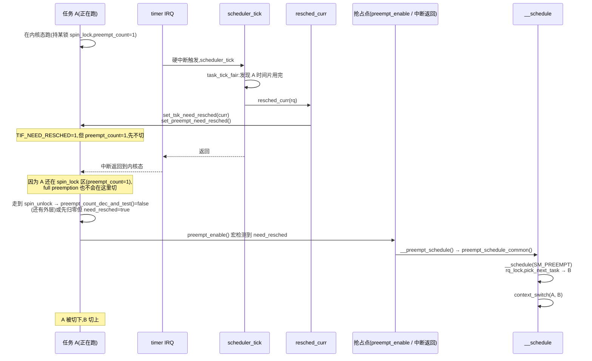

# 第十一章 · 抢占点与 TIF_NEED_RESCHED

> 篇:P3 抢占与上下文切换
> 主线呼应:第 1 篇讲清了 runqueue(账本),第 2 篇讲清了"下一个跑谁"(策略)。但"挑中了下一个"只是决策——一个 tick 到点、时间片耗尽,调度器决定要让 B 来替换正在跑的 A,可 A 此刻正拿着 `rq->lock`、或者在一个 `preempt_disable()` 保护的临界区里、或者在中断处理的上半部。能不能立刻把 A 踢下 CPU?不能。这一章讲清楚:抢占不是"想抢就抢",而是一场精心安排的"延迟满足"——调度器先在 A 身上悄悄插一面小旗 `TIF_NEED_RESCHED`(意思是"你该被换了"),然后耐心地等 A 走到下一个**安全的抢占点**(`preempt_enable`、中断返回、显式 `schedule()`),才真切走 `__schedule` 把它换下。这套机制叫**延迟抢占**(deferred preemption),是 Linux 抢占 sound 的根。

## 核心问题

**调度器决定要换下当前任务 A、改跑 B——能不能立刻切?不能。为什么不能?A 可能正拿着自旋锁、在 `preempt_disable()` 区、在硬中断或 NMI 里。在这些地方切走会破坏什么?内核用什么手段既"及时换"又"不破坏不变量"?**

读完本章你会明白:

1. 抢占不是瞬时动作,而是"**打标记 + 等安全点**"两阶段——`TIF_NEED_RESCHED` 标志 + 抢占点(preempt_enable / 中断返回 / cond_resched)。
2. `preempt_count` 这把多用途瑞士军刀:它同时记录"被 preempt_disable 几层""在 softirq / hardirq / NMI 几层",内核靠它判断"现在能不能抢"。
3. voluntary vs full preemption(`CONFIG_PREEMPT_NONE/VOLUNTARY/FULL`):同一份代码,编译期决定抢占点密度。
4. SMP 下"在别的核上踢一下"——`smp_send_reschedule` IPI,把正在跑的核从用户态或内核态拽回来检查标志。

> 逃生阀:如果你对"自旋锁里能不能 sleep"已经有直觉,本章只是把那个直觉精确化成源码——核心就一句:**抢占只在 `preempt_count == 0` 且不在中断里时发生**。读不下去就反复回到这句。

---

## 11.1 一句话点破

> **抢占是延迟的:调度器先用 `set_tsk_need_resched()` 在目标任务上插旗,真正的切换发生在它走到下一个抢占点、检查到旗子、且 `preempt_count` 归零时。这个"打标记、延迟执行"的设计,是抢占既能及时换人、又绝不在持锁/原子区切走的根本。**

这是结论。本章倒过来拆:先看"立刻抢"会撞什么墙,再看小旗 + 计数器怎么把墙拆掉。

---

## 11.2 为什么不能"立刻抢":被抢任务可能正拿着锁

设想一个朴素的世界:调度器一决定要换人(`pick_next` 选出了 B),就立刻 `context_switch` 把 A 切下去。这听起来直接,但只要想 10 秒钟就崩了。

考虑这段常见的内核代码(简化):

```c
/* 朴素的、会出事的写法(示意,非源码) */
raw_spin_lock(&rq->lock);          /* A 拿到锁,preempt_count += 1 */
/* ... 临界区 ... */
raw_spin_unlock(&rq->lock);        /* 释放,preempt_count -= 1 */
```

`raw_spin_lock` 的标准实现里,**取自旋锁的同时会 `preempt_disable()`**([include/linux/preempt.h](../linux/include/linux/preempt.h#L155) 附近,见下面"技巧精解")。也就是说,只要 A 拿着自旋锁,它的 `preempt_count` 就非零。如果此时被"立刻抢",会发生什么?

- A 切走了,但**锁还在 A 手里**(锁状态在 A 的内核栈/寄存器里,切走不释放)。
- 新切进来的 B 一旦也想拿同一把锁,就死等 A 释放——可 A 已经不在 CPU 上了,它要等下次被切回来才能走到 `unlock`。
- 如果 B 恰好是"负责切回 A"的调度路径(比如 migration 线程、或某个持有锁的唤醒路径),**死锁**。
- 更糟:如果被抢在 `preempt_disable()` 保护的 per-CPU 数据访问中,切到别的核再切回来,`smp_processor_id()` 已经变了,数据访问错乱。

> **不这样会怎样**:任何在 `preempt_disable()` 区、自旋锁临界区、硬中断/NMI 上下文里发生的"立刻抢占",都会破坏内核的**基本不变量**——持锁者必须推进到释放、per-CPU 假设必须成立、中断上下文不能睡眠/被调度。一抢就崩。这就是为什么 Linux 早期(2.4 及以前)的大内核锁时代,内核态几乎不可抢——代价是响应延迟差。

> **所以这样设计**:抢占分成两个阶段——**① 决策阶段**:某处(时间中断、唤醒、更高优先级任务到达)算出"当前任务该被换",但**不立刻切**,而是在它的 `thread_info->flags` 上设一个标志位 `TIF_NEED_RESCHED`。**② 执行阶段**:当前任务继续正常执行,直到它走到一个内核**主动声明的、已知安全的抢占点**,在那里检查 `TIF_NEED_RESCHED`,发现置位、且 `preempt_count == 0`、且不在中断里,才真正调用 `__schedule()` 切走。

这把"想抢"和"真抢"解耦了。决策可以任意时刻发生(中断里也行),执行只在安全点发生。**抢占的及时性靠"安全点足够密",安全性靠"只在 preempt_count 归零时切"**。这就是延迟抢占。

---

## 11.3 TIF_NEED_RESCHED:一面温柔的小旗

`TIF_NEED_RESCHED` 是任务 `thread_info->flags` 中的一个 bit(`TIF_` = Thread Info Flag)。它不强制做任何事,只是个**请求**——告诉系统:"你该让调度器重新挑一次下一个了"。设它和读它的代码极短:

```c
/* include/linux/sched.h:1955 */
static inline void set_tsk_need_resched(struct task_struct *tsk)
{
	set_tsk_thread_flag(tsk, TIF_NEED_RESCHED);
}

static inline int test_tsk_need_resched(struct task_struct *tsk)
{
	return unlikely(test_tsk_thread_flag(tsk, TIF_NEED_RESCHED));
}
```

谁去**设**这面旗?内核里集中在一处:[`resched_curr()`](../linux/kernel/sched/core.c#L1041)([core.c:1041](../linux/kernel/sched/core.c#L1041))——"重新调度当前 rq 上的任务"。它的代码值得逐行读:

```c
/* kernel/sched/core.c:1041 */
void resched_curr(struct rq *rq)
{
	struct task_struct *curr = rq->curr;
	int cpu;

	lockdep_assert_rq_held(rq);

	if (test_tsk_need_resched(curr))   /* 已经设过,不重复 */
		return;

	cpu = cpu_of(rq);

	if (cpu == smp_processor_id()) {   /* 目标就是本核 */
		set_tsk_need_resched(curr);
		set_preempt_need_resched();    /* 在 preempt_count 的最高位再设一位 */
		return;
	}

	if (set_nr_and_not_polling(curr))  /* 目标在别的核,且不在 polling idle */
		smp_send_reschedule(cpu);      /*   → 发 IPI 把那核拽回来 */
	else
		trace_sched_wake_idle_without_ipI(cpu);
}
```

几个要点钉死:

- **本核**:`set_tsk_need_resched(curr)` 直接改 flag。因为这个核的代码马上会走到某个抢占点检查它(下一节),不需要 IPI。`set_preempt_need_resched()` 在 `preempt_count` 的最高位(`PREEMPT_NEED_RESCHED = 0x80000000`)再设一位,这是给 x86 那种"通过读 `preempt_count` 一次性判断需不需要重调"的快速路径用的。
- **别的核**:本核改别的核的当前任务 flag,对方核**看不见也要看见**——所以 `set_nr_and_not_polling` 是原子 `fetch_or`(见 `core.c:906`),配 `smp_send_reschedule(cpu)` 发一个**重调度 IPI**(inter-processor interrupt),把那核从用户态执行或内核态执行里硬拽回来,进入 IPI 处理 → 返回路径 → 检查 `TIF_NEED_RESCHED`。
- **idle 且 polling**:如果目标核在 idle 且声明了"我会自己轮询 flag"(TIF_POLLING_NRFLAG,部分架构 idle 时设),那就免 IPI,它自己会看到 flag 置位。省一笔 IPI 开销,见 `set_nr_if_polling`([core.c:918](../linux/kernel/sched/core.c#L918))的 cmpxchg 循环。

谁调用 `resched_curr`?触发点几乎覆盖所有"该换人"的场景:

| 触发场景 | 调用链 | 出处 |
|---|---|---|
| 时间片到点 | `scheduler_tick` → `task_tick_fair` → `check_preempt_tick` → `resched_curr` | fair.c |
| 唤醒更高优先级/更早 deadline 的任务 | `try_to_wake_up` → `check_preempt_curr` → `resched_curr` | core.c |
| RT 任务就绪 | `check_preempt_curr_rt` → `resched_curr` | rt.c |
| cgroup throttle 触发 | ... → `resched_curr` | core.c |

> **钉死这件事**:`TIF_NEED_RESCHED` 是一个**通知**,不是一个**命令**。设它不需要目标核的配合,只要原子改 bit + 必要时发 IPI;读它发生在每一个抢占点。这个"通知 / 执行"分离,是抢占能在任何上下文(中断里也行)设、却只在安全点执行的根。

---

## 11.4 preempt_count:一把四位一体的计数器

光有 `TIF_NEED_RESCHED` 还不够——设了旗,任务可能在持锁区,这时也不能切。内核需要知道"现在到底安不安全切"。这个"安全与否"的状态,全部压进一个 32 位整数:`preempt_count`。

它的位布局在 [`include/linux/preempt.h`](../linux/include/linux/preempt.h#L14-L36) 顶部注释里写得清清楚楚:

```
 preempt_count 的位布局(preempt.h:14-36):

 31                  23  19       15        8         0
 ┌─────────────────────┬─────┬────────┬────────┬────────┐
 │ PREEMPT_NEED_RESCHED│ NMI │ HARDIRQ│ SOFTIRQ│ PREEMPT│
 │   (0x80000000)      │4bit │ 4bit   │ 8bit   │ 8bit   │
 └─────────────────────┴─────┴────────┴────────┴────────┘
   bit31                  bit20   bit16    bit8     bit0
```

四层计数,各占自己的位段,语义清晰:

- **PREEMPT(0-7,8 位)**:`preempt_disable()` / 自旋锁加了几层。每 `preempt_disable` +1,`enable` -1。**只要这 8 位非零,说明在 preempt_disable 区或持锁中,不能抢。**
- **SOFTIRQ(8-15,8 位)**:softirq 上下文嵌套层数。`__do_softirq` 进入 +1。非零说明在软中断里。
- **HARDIRQ(16-19,4 位)**:硬中断 handler 嵌套层数。非零说明在硬中断里。
- **NMI(20-23,4 位)**:NMI(不可屏蔽中断)嵌套。
- **bit 31**:`PREEMPT_NEED_RESCHED`,辅助标志位,配合架构快速路径。

对应掩码宏([preempt.h:108-115](../linux/include/linux/preempt.h#L108)):

```c
#define nmi_count()       (preempt_count() & NMI_MASK)
#define hardirq_count()   (preempt_count() & HARDIRQ_MASK)
#define softirq_count()   (preempt_count() & SOFTIRQ_MASK)
#define irq_count()       ((preempt_count() & (NMI_MASK|HARDIRQ_MASK|SOFTIRQ_MASK)))
#define in_task()         (!(preempt_count() & (NMI_MASK|HARDIRQ_MASK|SOFTIRQ_OFFSET)))
```

> **钉死这件事**:`preempt_count` 把"为什么不能现在切"的所有原因**打包成一个数**——持锁(preempt 段)、softirq、hardirq、NMI。`preemptible()` 的定义就是 [`preempt_count() == 0 && !irqs_disabled()`](../linux/include/linux/preempt.h#L227):四层全空、且中断没关,才允许抢。检查 O(1)、无分支、原子读。

为什么把四个东西压到一个 int?因为内核**几乎每个函数**都要在某个点问"我现在在中断里吗""我能 sleep 吗""能抢吗"——这些查询要**极快**。一个 per-CPU 的 32 位 int、一次读、几次 mask,完美。x86 上 `preempt_count` 就放在当前 task 的 `cpu_entry_area` / thread_info 里,几条 mov 就拿到。把四层拆成四个字段反而要四次访问。

---

## 11.5 抢占点:在哪里检查小旗

旗子设了、`preempt_count` 也在跑——任务到底在**哪些点**回头检查"该不该抢了"?这些点叫**抢占点**(preemption point)。检查逻辑就一句:`if (need_resched()) schedule();`(`need_resched()` 读 `TIF_NEED_RESCHED`)。抢占点在不同 `CONFIG_PREEMPT_*` 模式下密度不同,我们分两类看。

### 抢占点速查表

| 抢占点 | 何时检查 `TIF_NEED_RESCHED` | 所有模式都有? |
|---|---|---|
| **中断返回到内核态**(`ret_from_intr`) | 中断 handler 跑完、返回内核前 | ✅ 全部(CONFIG_PREEMPT 才真切) |
| **中断返回到用户态**(`ret_to_user`) | 即将回用户态前 | ✅ 全部 |
| **`preempt_enable()` 宏** | 减完 preempt_count、若归零且需重调 → `__preempt_schedule()` | ⚠️ 仅 `CONFIG_PREEMPTION=y`(full) |
| **`cond_resched()`** | 显式调用点,内核多处插入 | ⚠️ voluntary/full |
| **显式 `schedule()`** | 任务主动让出(mutex / wait / sleep) | ✅ 全部 |

### 11.5.1 `preempt_enable`:full preemption 的核心抢占点

[`preempt_enable()`](../linux/include/linux/preempt.h#L230) 宏的展开是这样的(只看 `CONFIG_PREEMPTION=y`):

```c
/* include/linux/preempt.h:230,CONFIG_PREEMPTION=y 分支 */
#define preempt_enable() \
do { \
	barrier(); \
	if (unlikely(preempt_count_dec_and_test())) \
		__preempt_schedule(); \
} while (0)
```

`preempt_count_dec_and_test()` 做:① preempt 段 -1;② 如果结果为 0 且 `should_resched(0)` 成立(即 `TIF_NEED_RESCHED` 已置位),返回 true。一旦返回 true,立刻调 `__preempt_schedule()`,它最终走到 [`preempt_schedule()`](../linux/kernel/sched/core.c#L6941):

```c
/* kernel/sched/core.c:6941 */
asmlinkage __visible void __sched notrace preempt_schedule(void)
{
	/*
	 * If there is a non-zero preempt_count or interrupts are disabled,
	 * we do not want to preempt the current task. Just return..
	 */
	if (likely(!preemptible()))
		return;
	preempt_schedule_common();
}
```

`preemptible()` = `preempt_count() == 0 && !irqs_disabled()`——再次 double check。这是 **sound 的第二道闸**:即便 `preempt_count_dec_and_test` 报告"preempt 段归零",有可能中断此时被关了(`local_irq_save` 之类的临界区),那也不能切——`preemptible()` 一票否决。然后 `preempt_schedule_common()` 在一个 do-while 里反复 `__schedule(SM_PREEMPT)` 直到 `TIF_NEED_RESCHED` 清掉([core.c:6907](../linux/kernel/sched/core.c#L6907))。

> **钉死这件事**:`preempt_enable` 这个宏看起来就是 `count--`,实际上它在 count 归零时**可能触发一次完整的上下文切换**。这就是为什么内核约定"持有 spinlock 时不能 sleep"——锁的 `spin_lock` 隐含 `preempt_disable`,但你 sleep 走的是 `schedule()`,它要求 `preempt_count == 0`(见 11.6)。在 `preempt_disable` 区里 `schedule()`,会立刻在 `__schedule` 里被各种 invariant 检查卡死(或更糟,默默切走持锁者)。

### 11.5.2 中断返回:所有模式共享的抢占点

即便关掉内核抢占(`CONFIG_PREEMPT_NONE`),也必须支持**用户态可被中断打断后抢占**——否则一个用户态死循环就能挂死。这个抢占点在中断返回路径上。x86 的 `ret_from_intr` 在返回前检查 `TIF_NEED_RESCHED`:

- 如果要返回到**用户态**且 flag 置位:跳到 `__schedule` 切走。所有模式都支持。
- 如果要返回到**内核态**:仅 `CONFIG_PREEMPT`(full)才检查并切;voluntary/none 不切,等内核自己走到 cond_resched / preempt_enable。

这就是 voluntary 与 full 的本质区别:

```
 抢占点密度:CONFIG_PREEMPT_NONE < VOLUNTARY < FULL

 PREEMPT_NONE: 只在中断返回用户态 + 显式 schedule() 处抢。内核态几乎不抢(响应慢但吞吐高、内核简单)。
 VOLUNTARY:    额外在内核显式 cond_resched() 点(约几千处)抢。服务器主流。
 FULL(PREEMPT): 再额外在每一个 preempt_enable()、中断返回内核态处抢。桌面/实时主流,响应低延迟。
```

`cond_resched()` 在 voluntary/full 模式下编译进代码(在 `!CONFIG_PREEMPTION` 或 dynamic 模式时),作为内核**自愿**让出的抢占点。它在长循环、长 syscall 路径里被显式插。注意 [`preempt.h:263`](../linux/include/linux/preempt.h#L263):在 `!CONFIG_PREEMPTION` 时 `preempt_check_resched()` 是空宏——因为这种模式不靠 preempt_enable 抢。

---

## 11.6 为什么 `schedule()` 不能在原子上下文调

到这里,你能回答一个内核面试经典题了:**为什么 `schedule()` 不能在原子上下文(持锁、中断、softirq)里调用?**

`schedule()` 走 [`__schedule(SM_NONE)`](../linux/kernel/sched/core.c#L6616),它假设:

1. 调用者已经 `preempt_disable()`(由 [`__schedule_loop`](../linux/kernel/sched/core.c#L6819) 里的 `preempt_disable()` 保证)。
2. 调用者**不在中断/softirq/NMI**——即 `preempt_count` 的中断段为 0。

第 2 点没在 `__schedule` 入口显式 assert(为了快),但 [`finish_task_switch`](../linux/kernel/sched/core.c#L5258) 的 `WARN_ONCE(preempt_count() != 2*PREEMPT_DISABLE_OFFSET, ...)` 会兜住不变量——切换发生时 `preempt_count` 必须正好是 `2 * PREEMPT_DISABLE_OFFSET`(一层来自 `preempt_disable`,一层来自 `rq->lock`,见 [core.c:5248-5256](../linux/kernel/sched/core.c#L5248) 的注释)。如果你在中断里 `schedule()`,这个 invariant 立刻被破坏,触发 WARN 或更糟的连锁。

> **不这样会怎样**:在中断里 `schedule()` → 切换走的是中断 handler 的内核栈,中断还没 ret,APIC 的 in-service 位没清,**同优先级中断再也进不来**;切回来的时机又依赖被切走任务的唤醒——可能永远不醒。一句话:中断上下文没有"任务"语义,调度器对它没有定义。所以"中断里不能 sleep / 不能 schedule"是硬约束,靠 `in_interrupt()` / `in_atomic()` 这类基于 `preempt_count` 的宏检查。

---

## 11.7 时序:一次完整的"时间片到点 → 抢占"

把这套串起来,看一次"周期 tick 到点、A 被换成 B"的全过程:



要点:

1. timer 中断在 A 持锁时**照样**进——`resched_curr` 只设 flag,不抢。
2. 中断返回时,因为 A 在 spin_lock 区(preempt_count≠0),**即便 full preemption 也不切**(返回内核态的抢占点会先看 `preempt_count`)。
3. A 继续跑,直到 `spin_unlock` 触发 `preempt_enable`,`preempt_count_dec_and_test()` 发现归零且 flag 置位,才真正调 `preempt_schedule`。
4. **抢占的"延迟" = A 从被设 flag 到走到下一个抢占点的距离**。在 full preemption 内核里,这个距离通常就是几条指令(到下一个函数边界/preempt_enable);在 voluntary 里,可能要到下一个 cond_resched。这就是 full 延迟低的根。

---

## 11.8 技巧精解:延迟抢占为什么 sound

这一节挑本章最硬的两个技巧拆透——延迟抢占本身,以及 `preempt_count` 把四层上下文压成一个 int 的工程设计。

### 技巧一:延迟抢占(标记 + 安全点)的 sound 证明

朴素写法(立即抢占)前面已经讲过会撞墙。延迟抢占的**妙处**在于它把"想抢"和"真抢"解耦,使得:

| 性质 | 谁保证 | 怎么保证 |
|---|---|---|
| 设 flag 可以在任何上下文 | `set_tsk_thread_flag` 是原子 set bit | 中断里也能安全设,不需要任何锁 |
| 切换只在 `preempt_count==0` 发生 | `preempt_count_dec_and_test()` + `preemptible()` 双检查 | preempt_enable 宏、中断返回路径 |
| 持锁期间不会被切 | 取 spinlock → preempt_disable → preempt 段 ≥1 | count 归零才会进入抢占分支 |
| 中断期间不会被切 | `preemptible()` 检查 `!irqs_disabled()`,中断进入时关中断 | 一票否决 |
| flag 不会丢 | 本核原子 set / 跨核 fetch_or + IPI | `set_nr_and_not_polling` + `smp_send_reschedule` |

> **反面对比**:如果不延迟、在中断里就立刻切——必须在中断 handler 入口处插入"现在能不能切"的判断,而且判断必须考虑**此刻持锁状态**。可中断可能在任务任意指令打断,任务可能正处在取锁和 `preempt_disable` 之间的瞬态——这个瞬态里"能不能切"无定义。延迟抢占根本绕开了这个问题:**中断里只设 flag,绝对不切**;切只发生在任务自己走到抢占点、自己 `preempt_count` 归零时。这一句话,就是 Linux 抢占模型 sound 的核心。

具体到代码的最后一道闸——[`preempt_schedule()`](../linux/kernel/sched/core.c#L6941) 入口的 `if (likely(!preemptible())) return;`:

```c
#define preemptible()	(preempt_count() == 0 && !irqs_disabled())
```

即便 `preempt_enable` 宏的 `preempt_count_dec_and_test()` 已经判断过一次,这里**再检查一次**——因为 `preempt_enable` 宏展开和 `preempt_schedule` 入口之间,理论上中断可能又进来改变了某些状态(虽然在 full preemption 下 `preempt_enable` 后中断通常仍关)。这种"在真正切入前最后一刻再 verify 一次 invariant"的双重检查,是内核并发代码里反复出现的 sound 套路。

### 技巧二:取自旋锁 == preempt_disable

一个反直觉但极其关键的事实:**自旋锁的 `spin_lock` 操作会隐含 `preempt_disable`**。这来自 [`preempt.h:155`](../linux/include/linux/preempt.h#L155) 附近的 `PREEMPT_DISABLE_OFFSET` 注释——"The preempt_count offset after spin_lock()"。具体在 `raw_spinlock_t` 的 `__raw_spin_lock` 实现里:

```c
/* 简化示意,非源码原文(raw_spin_lock 的典型展开) */
static inline void __raw_spin_lock(raw_spinlock_t *lock)
{
	preempt_disable();              /* ← 隐含! */
	spin_acquire(&lock->dep_map, 0, 0, _RET_IP_);
	do {
		/* 原子 CAS 等锁 */
	} while (unlikely(!__raw_spin_trylock(lock)));
}
```

这解释了三件事,全部是内核新手会撞的墙:

1. **持锁期间不会被抢**:因为持锁 → preempt_count ≥ 1 → `preemptible()` false。自旋锁的"自旋"才安全——如果持锁者被切走,等锁者会死等。
2. **持锁不能 sleep / schedule**:`schedule()` 要求 `preempt_count` 语义干净,持锁区 preempt_count 非零,`finish_task_switch` 的 `WARN_ONCE(preempt_count() != 2*PREEMPT_DISABLE_OFFSET)` 会爆。
3. **mutex 不是自旋锁**:mutex 睡眠等待,取 mutex 时如果拿不到会 `schedule()` 切走——所以 mutex 的 fast path 也有 preempt_disable,但在 schedule 之前会 `preempt_enable`。这就是 mutex 能在临界区 sleep、spinlock 不能的本质差异。

> **钉死这件事**:看到内核代码里 `spin_lock` / `raw_spin_lock` / `preempt_disable` / `local_irq_disable` / `local_bh_disable`,你都要立刻在脑子里把对应层的 `preempt_count` 位 +1。看到对应的 `*_unlock` / `*_enable`,就 -1。`preempt_count` 这个数贯穿了内核所有"我现在安不安全"的判断,本章这节是全书最常被回扣的地方之一——第 12 章 `__schedule` 一进就 `rq_lock`(再加一层 preempt_count),第 13 章 `switch_to` 期间 preempt_count 恒为 2 层(`preempt_disable` + `rq->lock`),第 15 章 `load_balance` 跨核时靠双重 rq_lock 串行化,全部建立在它之上。

---

## 章末小结

这一章是机制层第一块硬骨头。我们没有讲"下一个跑谁"(那是 P2 策略),而是讲清了**"决定要换人"到"真切下去"之间那段精心设计的延迟**——它让抢占既及时又 sound。

1. **两阶段**:决策(任何上下文设 `TIF_NEED_RESCHED`)与执行(安全点 + `preempt_count==0` 才 `__schedule`)分离。
2. **preempt_count** 把"持锁 / softirq / hardirq / NMI"四层不能切的上下文压成一个 int,O(1) 判断。
3. **抢占点密度**:`CONFIG_PREEMPT_NONE/VOLUNTARY/FULL` 三档,本质是检查 flag 的点密不密。
4. **SMP**:跨核抢要 `smp_send_reschedule` IPI 把对方核从执行中拽回来。

这一章服务**机制**那面:它不回答"下一个是谁"(策略),只回答"换人的动作怎么落实得不出事"。延迟抢占是后面 `__schedule` 能放心切、`switch_to` 能放心换栈的前提——它们都建立在"调用它们的点一定是 `preempt_count` 干净的安全点"之上。

### 五个"为什么"清单

1. **为什么不能"立刻抢占"?** 被抢任务可能正持自旋锁 / 在 preempt_disable 区 / 在中断里。切走会让锁不释放、per-CPU 假设失效、中断上下文被调度——破坏内核基本不变量。
2. **TIF_NEED_RESCHED 是命令还是通知?** 通知。设它不强制任何动作,只在安全点被读到才触发 `__schedule`。
3. **preempt_count 一个 int 怎么装下四层上下文?** 分位段:PREEMPT(0-7)/ SOFTIRQ(8-15)/ HARDIRQ(16-19)/ NMI(20-23),外加 bit31 的辅助标志。读一次 mask 几下就知道现在能不能切。
4. **voluntary 和 full preemption 差在哪?** 差在抢占点密度。voluntary 靠显式 `cond_resched()`(几千处);full 额外在每个 `preempt_enable()` 和中断返回内核态处检查 flag。同样的源码,编译期决定密度。
5. **为什么 spin_lock 隐含 preempt_disable?** 持锁者若被切走,等锁者会死等锁释放。所以取锁即禁抢,保证持锁期间不被换下,自旋才有意义。

### 想继续深入往哪钻

- 读 [`include/linux/preempt.h`](../linux/include/linux/preempt.h) 全文,特别是宏定义区(L150-280);`CONFIG_PREEMPT_DYNAMIC` 部分讲运行时切换 voluntary/full(L380+)。
- 读 [`resched_curr`](../linux/kernel/sched/core.c#L1041) / [`set_nr_and_not_polling`](../linux/kernel/sched/core.c#L906) / [`check_preempt_curr`](../linux/kernel/sched/core.c),追一次唤醒路径设 flag 的链。
- `arch/x86/entry/entry_64.S` 的 `ret_from_intr` / `common_dispatch`(未 sparse clone,可在线 elixir 看):看中断返回路径怎么检查 `TIF_NEED_RESCHED`。
- 观测:`/proc/<pid>/status` 的 `preempt_count`(debug 用)、`/sys/kernel/debug/sched/preempt`(`CONFIG_PREEMPT_DYNAMIC` 模式切换)、`trace-cmd -e sched:sched_*` 看抢占事件、`perf sched latency`。
- 延伸:`Documentation/scheduler/preempt.rst`(内核文档,讲三档模式与 RT 关系)。

### 引出下一章

我们知道了"什么时候可以真切"——在 `preempt_count` 干净的抢占点。下一章进入 `__schedule` 本体:它怎么关抢占 / 拿 `rq->lock`、怎么调 `pick_next_task` 按调度类优先级遍历挑下一个、怎么把控制权交给 `context_switch`。这是把"决策(下一章 P2 的 EEVDF 选出的 next)"和"机制(第 13 章 switch_to 切栈)"缝起来的中枢函数。
