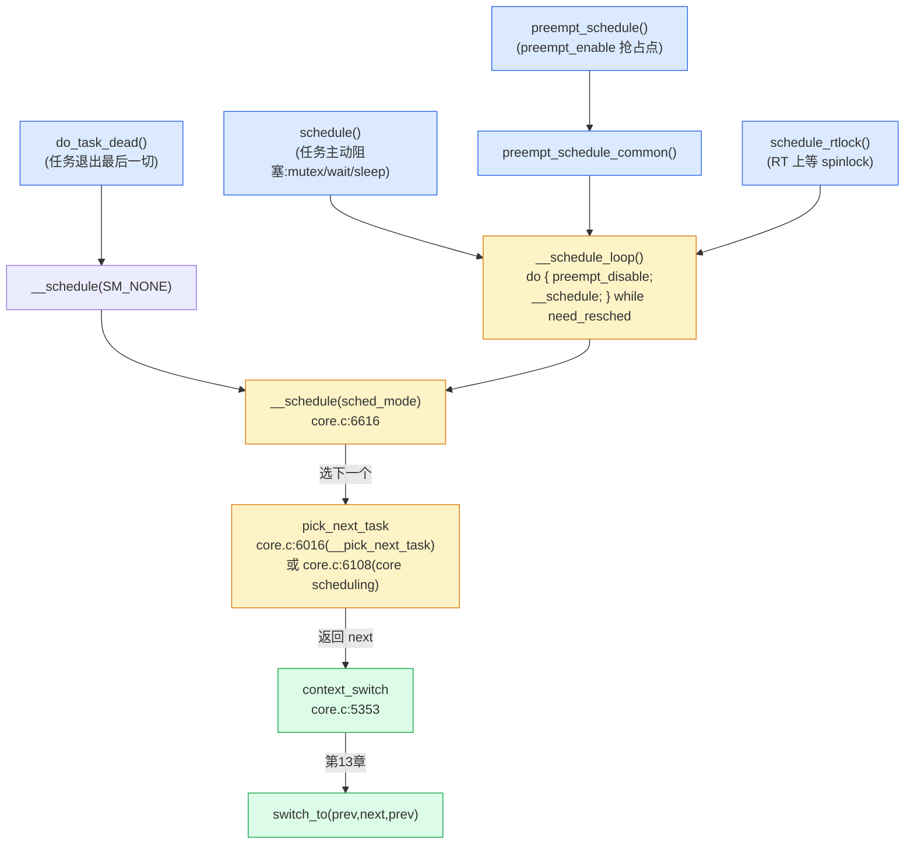

# 第十二章 · __schedule 与 pick_next_task

> 篇:P3 抢占与上下文切换
> 主线呼应:第 11 章讲清了"什么时候可以真切"——只在 `preempt_count` 干净的抢占点。本章进入真切的那一瞬:调度器的**主函数** [`__schedule()`](../linux/kernel/sched/core.c#L6616) 和它调用的 [`pick_next_task()`](../linux/kernel/sched/core.c#L6016)。一切调度路径——显式 `schedule()`(任务阻塞睡眠)、`preempt_schedule`(抢占点)、`schedule_preempt_disable`(RT lock wait)、`do_task_dead`(任务退出)——最后都汇到这两个函数。`__schedule` 干三件事:**关中断 → 拿 `rq->lock` → `pick_next_task` 选下一个 → `context_switch` 切过去**。`pick_next_task` 干一件事:**按调度类优先级(stop > dl > rt > fair > idle)遍历,谁有就绪任务谁胜出**。这一章拆透这个中枢,把第 2 篇(EEVDF/RT/deadline 选谁)和第 13 章(switch_to 切栈)缝起来。

## 核心问题

**调度主函数 `__schedule` 为什么必须按"关中断 → preempt_disable → rq_lock → pick_next_task → context_switch"这个顺序?顺序能换吗?`pick_next_task` 怎么在 dl/rt/fair/idle 四个调度类里挑出"该跑的"?为什么用 `for_each_class` 链表遍历而不是 `switch(policy)`?**

读完本章你会明白:

1. `__schedule` 的固定时序:为什么关中断在前、拿 `rq->lock` 在中、选下一个在后;`smp_mb__after_spinlock` 这道屏障解的是什么 race。
2. `pick_next_task` 的优先级遍历:stop > dl > rt > fair > idle,以及它的 fast path(全是 fair 类时直接走 `pick_next_task_fair`)。
3. **链接器 section 实现的优先级链**:`for_each_class` 不是手写 `next` 指针链表,而是把每个 `sched_class` 放进各自己的链接 section,靠链接脚本排序——这是内核"用链接器做工程"的典范。
4. `prev` 的状态分支:`__state == 0`(RUNNING)直接重入队列,非 0 走 `deactivate_task`(睡眠)或被信号拽回 RUNNING。

> 逃生阀:本章只读 [`__schedule`](../linux/kernel/sched/core.c#L6616) 这一个函数(L6616-L6752)和 [`__pick_next_task`](../linux/kernel/sched/core.c#L6016)(L6016-L6068),其余都是细节支撑。读不下去就反复回看这两段源码,注释比任何讲解都清楚。

---

## 12.1 一句话点破

> **`__schedule` 是全书的"中枢函数":它以 `rq->lock` 为锚、在关中断 + preempt_disable 的双保险下,先让 prev 出队或保留、再调 `pick_next_task` 按调度类优先级选出 next、最后 `context_switch` 把 CPU 交给 next。`pick_next_task` 不写一个 `switch(policy)`,而是用 `for_each_class` 遍历一条由链接器排好序的调度类链(stop→dl→rt→fair→idle),谁先返回非 NULL 谁就是下一个——这是"用 C 写多态、用链接器做优先级"的双重典范。**

这是结论。本章倒过来拆:先看为什么这个时序动不了,再拆 `pick_next_task` 的两层(快路径 + for_each_class),最后讲 prev 的状态分支。

---

## 12.2 调用图:所有路径汇到 `__schedule`

进入源码前,先看谁会调 `__schedule`。内核里没有任何地方直接调 `__schedule`(它是 `static`),所有入口都经过几个薄壳:



注意 [`__schedule_loop`](../linux/kernel/sched/core.c#L6819)(L6819-6826)里的 do-while:

```c
/* kernel/sched/core.c:6819 */
static __always_inline void __schedule_loop(unsigned int sched_mode)
{
	do {
		preempt_disable();
		__schedule(sched_mode);
		sched_preempt_enable_no_resched();
	} while (need_resched());
}
```

它干三件事:**① 进 `__schedule` 前 `preempt_disable`**(保证进 `__schedule` 时 preempt_count 至少有 1 层,与 `rq->lock` 加的 1 层凑成 `finish_task_switch` 期望的 2 层);**② 调 `__schedule`**;**③ 出来后用 `sched_preempt_enable_no_resched()`**(注意是 `_no_resched` 版本,减 count 但不再触发抢占——刚切完不必立刻再抢)。循环条件 `need_resched()`——如果切出来的 next 在切换期间又被设了旗(比如更高优先级任务刚唤醒),再来一次。

> **钉死这件事**:几乎所有"调度入口"都包了一层 `preempt_disable` 后才进 `__schedule`。这不是冗余,而是 **invariant**:`__schedule` 假设自己被调时 preempt_count ≥ 1,与它内部 `rq_lock` 的 +1 凑成 2,正好对上 [`finish_task_switch`](../linux/kernel/sched/core.c#L5258) 的 `WARN_ONCE(preempt_count() != 2*PREEMPT_DISABLE_OFFSET)`。少这一层会触发 WARN,内核用这个断言兜住所有破坏 invariant 的错误入口。

---

## 12.3 `__schedule` 的固定时序:为什么顺序动不了

[`__schedule`](../linux/kernel/sched/core.c#L6616) 主体我们已经读过(L6616-L6752),它是一条**严格有序**的步骤链。每一步都为后一步铺垫,顺序错一点就 race。我们逐段拆。

### 步骤一:定位本核 rq(L6625-6627)

```c
/* core.c:6625 */
cpu = smp_processor_id();
rq = cpu_rq(cpu);
prev = rq->curr;
```

`__schedule` 操作的是**本核的 rq**——调度是 per-CPU 决策。这里 `smp_processor_id()` 是安全的,因为调用者都 `preempt_disable` 了(否则可能被抢到别的核,`smp_processor_id()` 返回旧值,见第 11 章关于 preempt_count 与 per-CPU 的关系)。

### 步骤二:清 hrtick、关中断(L6631-6635)

```c
/* core.c:6631 */
if (sched_feat(HRTICK) || sched_feat(HRTICK_DL))
	hrtick_clear(rq);

local_irq_disable();          /* ← 关中断 */
rcu_note_context_switch(!!sched_mode);
```

`hrtick_clear`:如果开了 hrtick(高精度单次定时器,见 P1-04),先停掉它,避免它在我们切换过程中又触发一次抢占中断。

`local_irq_disable()` 是关键:**从这一刻到 `context_switch` 结束,本核中断关闭**。为什么?

> **不这样会怎样**:如果中断开着,中断 handler 里可能 `wake_up` 一个高优先级任务 → `resched_curr` → 设 `TIF_NEED_RESCHED`。这时我们已经在准备切走 prev、选 next——`pick_next_task` 刚基于"此刻的 rq 状态"选了 next,中断进来的唤醒会改 rq 状态但不会重选,造成"刚选的 next 已经不是最优"或更糟"prev 的状态被改但没记账"。关中断把这一窗口封死,保证 `__schedule` 内部 rq 状态稳定。

### 步骤三:rq_lock + smp_mb__after_spinlock(L6654-6655)

```c
/* core.c:6654 */
rq_lock(rq, &rf);
smp_mb__after_spinlock();
```

`rq_lock` 取 `rq->lock` 自旋锁(内部隐含 `preempt_disable`,preempt_count 再 +1)。`rq->lock` 是 per-CPU rq 的唯一锁,保护 rq 的所有状态(`cfs_rq`/`rt_rq`/`curr`/`nr_running`...)。

`smp_mb__after_spinlock()` 这道屏障看着突兀,它的理由写在上面 L6637-6653 的长注释里——解的是 `schedule()` 与 `signal_wake_up()` 之间的 race:

```
 __set_current_state(TASK_INTERRUPTIBLE)   signal_wake_up()
 schedule()                                  set_tsk_thread_flag(TIF_SIGPENDING)
   LOCK rq->lock                             wake_up_state(p, state)
   smp_mb__after_spinlock()                  smp_mb__after_spinlock()
     if (signal_pending_state())              if (p->state & @state)
```

任务 A 准备睡眠时,先 `__set_current_state(TASK_INTERRUPTIBLE)`(让自己可被信号唤醒),再调 `schedule()`。如果刚好这时有信号到来(另一个 CPU 上的 `signal_wake_up`),两个 CPU 上对 `A->state` 和 `pending signal` 的读写没有屏障就可能 reorder:`schedule` 看不到 signal,把 A 切下睡眠;signal 设置的唤醒被丢。`smp_mb__after_spinlock` 配对锁内的内存屏障,保证 `schedule` 读 `prev->state` 时一定看得到并发的 signal 写。这是**第 11 章 `TIF_NEED_RESCHED` 之外的另一个"靠内存屏障防丢事件"的例子**——内核里这种"屏障配对解 race"的套路反复出现。

### 步骤四:处理 prev 的状态(L6662-6700)

```c
/* core.c:6662-6700(简化) */
switch_count = &prev->nivcsw;     /* 默认记为"非自愿切换" */

prev_state = READ_ONCE(prev->__state);
if (!(sched_mode & SM_MASK_PREEMPT) && prev_state) {  /* 非 preempt 路径 且 prev 不 RUNNING */
	if (signal_pending_state(prev_state, prev)) {
		WRITE_ONCE(prev->__state, TASK_RUNNING);   /* 有信号,拽回 RUNNING */
	} else {
		prev->sched_contributes_to_load = ...;
		if (prev->sched_contributes_to_load)
			rq->nr_uninterruptible++;
		deactivate_task(rq, prev, DEQUEUE_SLEEP | DEQUEUE_NOCLOCK);  /* 出队 */
		...
	}
	switch_count = &prev->nvcsw;     /* 自愿切换(睡眠) */
}
```

这一段决定 prev 怎么记账:

- `prev_state == 0`(TASK_RUNNING):prev 还想跑,只是被抢了。**不入队、不出队**——它继续留在 rq 里,只是 `pick_next_task` 可能选了别人。`switch_count` 指向 `nivcsw`(非自愿切换计数)。
- `prev_state != 0` 且不是 preempt 路径:prev 主动睡眠(`schedule()` 从 mutex/wait 来)。检查信号——如果信号到了,拽回 RUNNING(`__state` 写回 0);否则 `deactivate_task` 把 prev 从 rq 出队(它要睡了)。`switch_count` 指向 `nvcsw`(自愿切换计数)。
- `sched_mode & SM_MASK_PREEMPT`:如果是抢占路径(preempt_schedule 来的),prev 是被抢的不是睡的,即便它 `__state` 非 0(可能抢占发生时它刚 `set_current_state` 还没 sleep)**也不能出队**——保留在 rq 里,等下次切回来继续。

> **钉死这件事**:`schedule()` 的语义有两种:① 任务**主动让出**(睡眠,典型从 mutex_lock 拿不到、wait_event 等不到),这种 prev 要 `deactivate_task` 出队;② 任务**被动被抢**(时间片到、更高优先级抢占),prev 继续 RUNNING,留在 rq。`__schedule` 靠 `sched_mode` 和 `prev->__state` 区分这两种。`nvcsw`(voluntary)和 `nivcsw`(involuntary)两个字段就是 `/proc/<pid>/stat` 里那两个上下文切换计数,你能直接观测。

### 步骤五:pick_next_task + context_switch(L6702-6751)

```c
/* core.c:6702 */
next = pick_next_task(rq, prev, &rf);
clear_tsk_need_resched(prev);
clear_preempt_need_resched();

if (likely(prev != next)) {
	rq->nr_switches++;
	RCU_INIT_POINTER(rq->curr, next);
	++*switch_count;
	migrate_disable_switch(rq, prev);
	psi_sched_switch(prev, next, !task_on_rq_queued(prev));
	trace_sched_switch(...);
	rq = context_switch(rq, prev, next, &rf);   /* ← 第13章 */
} else {
	rq_unpin_lock(rq, &rf);
	__balance_callbacks(rq);
	raw_spin_rq_unlock_irq(rq);                  /* 同核重选到自己,直接放锁开中断 */
}
```

`pick_next_task` 返回 next(下一节拆)。如果 `prev == next`(没选出别人,常见于 rq 上只有 prev 一个任务),走 else 分支:**直接放锁、开中断、返回**,不切。否则进入 `context_switch`——真正的切换,在第 13 章详讲。这里只钉一点:`context_switch` **返回的是新的 rq**(因为可能触发 `migrate_disable_switch` / balance callback,理论上极少情况下切到的 rq 不是当前 rq),所以 `__schedule` 后续没代码了——它实际上**不会"return 到调用者"**,而是在 `context_switch → switch_to` 之后,从 next 任务**上一次被切走时的返回点**继续。这个"两个返回点"是第 13 章最 tricky 的部分,本章先标记。

### 时序总图

```
__schedule(sched_mode) 时序(core.c:6616-6752):

  preempt_disable (来自 __schedule_loop)         preempt_count = 1
  ├ local_irq_disable                              IRQ off
  ├ rq_lock(rq)                                    preempt_count = 2, 持 rq->lock
  ├ smp_mb__after_spinlock                         屏障:防 signal 丢
  ├ update_rq_clock                                推进 rq 时钟
  ├ 读 prev->__state,分支:
  │   ├ RUNNING         → 保留在 rq,switch_count=&nivcsw
  │   └ 主动睡眠        → deactivate_task 出队,switch_count=&nvcsw
  ├ pick_next_task(rq, prev, &rf)                  策略:选 next
  ├ clear_tsk_need_resched(prev)                   清旗
  ├ if (prev != next):
  │   ├ rq->nr_switches++
  │   ├ rq->curr = next
  │   ├ context_switch(rq, prev, next, &rf)        机制:切栈(第13章)
  │   │     └ 内部 raw_spin_rq_unlock(rq)  preempt_count = 1
  │   │     └ switch_to → 切到 next 的内核栈
  │   └ (这里不会执行,实际从 next 的旧返回点继续)
  └ else:
      └ raw_spin_rq_unlock_irq(rq)                 放锁 + 开中断
```

---

## 12.4 `pick_next_task`:调度类链的优先级遍历

[`__pick_next_task`](../linux/kernel/sched/core.c#L6016)(L6016-6068)是 pick 的核心。它分两层:**fast path**(全部是 fair 类)和**通用路径**(`for_each_class` 遍历)。

### 12.4.1 fast path:绝大多数情况直接走 fair

```c
/* core.c:6016 */
__pick_next_task(struct rq *rq, struct task_struct *prev, struct rq_flags *rf)
{
	const struct sched_class *class;
	struct task_struct *p;

	/*
	 * Optimization: 如果 rq 上全是 fair 类任务,直接调 fair 的 pick。
	 */
	if (likely(!sched_class_above(prev->sched_class, &fair_sched_class) &&
		   rq->nr_running == rq->cfs.h_nr_running)) {

		p = pick_next_task_fair(rq, prev, rf);
		if (unlikely(p == RETRY_TASK))
			goto restart;

		if (!p) {                          /* fair 没有就绪,选 idle */
			put_prev_task(rq, prev);
			p = pick_next_task_idle(rq);
		}
		if (p->dl_server)
			p->dl_server = NULL;
		return p;
	}
	...
}
```

fast path 的判断是:**prev 不高于 fair 类,且 rq 的总就绪数 == cfs 的就绪数**——意思就是 rq 上一个 RT/deadline 任务都没有。这时直接调 `pick_next_task_fair`(EEVDF,第 2 篇讲过),跳过调度类遍历。这个优化在桌面/服务器(99% 任务都是 SCHED_NORMAL)下命中率极高,省掉遍历开销。

注意 `pick_next_task_fair` 可能返回 `RETRY_TASK`——一种特殊情况(组调度/核心调度场景需要重选),走 `restart` 进通用路径。

### 12.4.2 通用路径:`for_each_class` 遍历

```c
/* core.c:6050 */
restart:
	put_prev_task_balance(rq, prev, rf);

	if (prev->dl_server)
		prev->dl_server = NULL;

	for_each_class(class) {              /* ← 链接器 section 排序的调度类链 */
		p = class->pick_next_task(rq);
		if (p)
			return p;
	}

	BUG(); /* The idle class should always have a runnable task. */
```

`for_each_class(class)` 从最高优先级的调度类开始,**逐个调它的 `pick_next_task` 方法**,谁先返回非 NULL 谁就是 next。idle 类总是有任务(idle task 永远在),所以循环必返回,末尾的 `BUG()` 是兜底断言。

调度类的优先级顺序是:**stop > dl > rt > fair > idle**。语义:

- **stop**(最高,特殊):migration 线程、CPU hotplug 用。`pick_next_task_stop` 只在 rq 上有 stop 任务时返回它。普通任务看不见 stop。
- **dl**(deadline):`SCHED_DEADLINE`,EDF 最早截止期 + CBS。只要有 dl 任务就绪,它一定先跑(最高真实优先级)。
- **rt**(real-time):`SCHED_FIFO`/`SCHED_RR`,按 prio(0-99)。
- **fair**(CFS/EEVDF):`SCHED_NORMAL`/`SCHED_BATCH`,绝大多数任务。
- **idle**(最低):没有别的任务时跑 idle task(进 idle 循环、等中断)。

> **钉死这件事**:这个顺序意味着——只要系统里有一个 `SCHED_FIFO` 任务在跑,普通 fair 任务一律被压住;只要有一个 `SCHED_DEADLINE` 任务在跑,RT 也得让位(所以 dl 比 rt 高)。这就是为什么 RT throttling(第 17 章)和 dl 的 admission control(带宽预留)至关重要——没有它们,一个失控的 RT/dl 任务能饿死整机的普通任务。

---

## 12.5 技巧精解:`for_each_class` 用链接器 section 做优先级链

这一节拆本章最硬的工程技巧:**`for_each_class` 不是手写 `next` 指针的链表,而是把每个 `sched_class` 放进各自己的链接器 section,靠链接脚本排序,遍历就是"按地址升序扫 section 数组"**。

### 12.5.1 `DEFINE_SCHED_CLASS` 宏:每个类进自己的 section

[`DEFINE_SCHED_CLASS`](../linux/kernel/sched/sched.h#L2347)(L2347-2350):

```c
/* sched.h:2347 */
#define DEFINE_SCHED_CLASS(name) \
const struct sched_class name##_sched_class \
	__aligned(__alignof__(struct sched_class)) \
	__section("__" #name "_sched_class")
```

每个调度类用这个宏定义,会展开成:

```c
const struct sched_class fair_sched_class
	__aligned(...) __section("__fair_sched_class") = { ... };
```

注意 `__section("__fair_sched_class")`——这个 `sched_class` 实例被放进名为 `__fair_sched_class` 的自定义 section。同理 `stop_sched_class` 进 `__stop_sched_class`,`dl_sched_class` 进 `__dl_sched_class`,依此类推。

### 12.5.2 链接脚本排序 section

接下来,链接脚本(`include/asm-generic/vmlinux.lds.h`,未 sparse clone,但 `sched.h:2341` 的注释明示)按**优先级顺序**排这些 section:

```
 链接脚本(简化,顺序即优先级,REVERSE order 注释见 sched.h:2343):

 .__stop_sched_class    ← 地址最低,最高优先级
 .__dl_sched_class
 .__rt_sched_class
 .__fair_sched_class
 .__idle_sched_class    ← 地址最高,最低优先级
```

链接器再定义两个符号 `__sched_class_highest`(= `__stop_sched_class` 起始)和 `__sched_class_lowest`(= `__idle_sched_class` 结束)。这样,从 `__sched_class_highest` 到 `__sched_class_lowest` 这段地址区间内,sched_class 实例**按优先级降序连续排列**。

### 12.5.3 `for_each_class`:就是线性扫这段地址

```c
/* sched.h:2353-2360 */
extern struct sched_class __sched_class_highest[];
extern struct sched_class __sched_class_lowest[];

#define for_class_range(class, _from, _to) \
	for (class = (_from); class < (_to); class++)

#define for_each_class(class) \
	for_class_range(class, __sched_class_highest, __sched_class_lowest)
```

`__sched_class_highest` 是数组首地址、`__sched_class_lowest` 是数组尾地址。`for_each_class(class)` 就是 `for (class = __sched_class_highest; class < __sched_class_lowest; class++)`——按地址升序扫,因为每个 sched_class 大小一样(都是 `struct sched_class` 全字段填充,即便某方法 NULL 也占指针位),`class++` 自动跳到下一个。

`sched_class_above(_a, _b)` 就是 `((_a) < (_b))`(地址比较,L2362)——prev 的 sched_class 地址 < fair 的地址,说明 prev 是 dl/rt/stop,优先级更高。

### 12.5.4 为什么不用手写 `next` 指针链表?

这是这一节的关键。朴素写法是把 `struct sched_class` 加一个 `const struct sched_class *next` 字段,手动串:

```c
/* 朴素的、内核没用过的写法(示意,非源码) */
const struct sched_class fair_sched_class = {
	.pick_next_task = ...,
	.next = &idle_sched_class,
};
```

为什么内核不这么写?对比:

| 维度 | 手写 next 链表 | 链接器 section 链 |
|---|---|---|
| **加新调度类** | 要改至少一处(prev 的 next 指向新类),散弹式 | 只写一个 `DEFINE_SCHED_CLASS(new)`,链接脚本加一行 section |
| **顺序写在哪** | 散在各 .c 文件 | 集中在链接脚本一处 |
| **能否删类** | 要改 next,容易漏 | 删 section 即可,链接自动收敛 |
| **const 安全** | next 字段占空间、可被误改 | 没有额外字段,纯靠 section 地址 |
| **遍历速度** | 解 next 指针(可能跨 cacheline) | 连续内存扫,cacheline 友好 |
| **能否编译期检查顺序** | 不能 | 链接器天然按 section 排序 |

> **反面对比**:手写 next 链表的问题在"顺序信息散落"——stop 在 stop_task.c、dl 在 deadline.c、rt 在 rt.c、fair 在 fair.c,要让 stop→dl→rt→fair→idle 这个顺序成立,得让某个文件"知道"全局顺序并串起来,这是循环依赖。链接器 section 把"我在优先级链的哪个位置"这件事**交给链接脚本集中管理**,各调度类文件只声明自己的 section 名,互不耦合。新增调度类(`sched_ext` 在 6.12+ 合入)就是加一个 section,核心代码零修改。这是"用链接器做工程"的典范,内核里 `initcall`、`PCI driver`、`file_system_type` 都用同款套路。

> **钉死这件事**:`for_each_class` 是个**没有 next 指针的"链表"**——它靠链接器把各 sched_class 排进连续地址,遍历就是 `class++`。这是 Linux 把"数据结构 + 工具链"结合到极致的例子:用 `struct` 表多态、用 section 表顺序、用 `__section` + `__aligned` 保证布局、用 `extern []` 符号定边界。看到 `__section(...)` + `extern ..._highest[]` + `extern ..._lowest[]` 这三件套,就是这套机制的指纹。

---

## 12.6 技巧精解:`prev` 状态分支为什么这么写

第二个技巧精解回到 [`__schedule`](../linux/kernel/sched/core.c#L6662) 的 prev 状态处理。看起来就是个 if-else,但里面藏着一个微妙的 race,代码用 **control dependency** 解。

```c
/* core.c:6664-6668 */
/*
 * We must load prev->state once (task_struct::state is volatile), such
 * that we form a control dependency vs deactivate_task() below.
 */
prev_state = READ_ONCE(prev->__state);
if (!(sched_mode & SM_MASK_PREEMPT) && prev_state) {
	if (signal_pending_state(prev_state, prev)) {
		WRITE_ONCE(prev->__state, TASK_RUNNING);
	} else {
		...
		deactivate_task(rq, prev, DEQUEUE_SLEEP | DEQUEUE_NOCLOCK);
		...
	}
	switch_count = &prev->nvcsw;
}
```

注释里的 "control dependency" 是关键。考虑 [`try_to_wake_up`](../linux/kernel/sched/core.c#L4231)(另一个 CPU 上唤醒 prev)与这段代码的并发:

```
 __schedule (CPU 0)                     try_to_wake_up (CPU 1)
   prev_state = prev->__state  (读)
                                         if (p->on_rq && ...) goto out;  (读 prev->on_rq)
                                         prev->on_rq = 0 (写)            ← 实际在 __schedule 里 deactivate 写
                                         ...
```

L6682-6691 的注释精确描述了这个 race:`__schedule` 读 `prev->__state` 形成一个 control dependency(后面的 `deactivate_task` 是否执行,依赖这个读),CPU 不能把 `deactivate_task` 重排到读之前;`ttwu` 那边读 `p->on_rq` 形成匹配的控制依赖。两边靠 `smp_acquire__after_ctrl_dep()` 配对,保证:如果 `__schedule` 已经把 prev 出队(`on_rq = 0`),`ttwu` 一定能看到,然后走完整的 wakeup 路径把 prev 重新入队;反之如果 `ttwu` 看到 `on_rq == 1`,直接返回不重复唤醒。

> **钉死这件事**:这段代码用了**三层并发防御**——①`READ_ONCE`/`WRITE_ONCE` 防编译器优化掉读写;②control dependency(条件依赖)防 CPU 重排;③配对的内存屏障(`smp_mb__after_spinlock` 在前面、`smp_acquire__after_ctrl_dep` 在 ttwu 那边)防多核可见性乱序。这是内核并发代码的标准范式:**"显式 atomic 访问 + 控制依赖屏障 + 跨函数配对屏障"**,看见 `READ_ONCE ... if(...) ... WRITE_ONCE` 这个模式就是它的指纹。EEVDF 的 lag 更新、PELT 的累积、`load_balance` 的任务迁移,全是这套范式。

---

## 章末小结

这一章拆透了调度器的**中枢函数** `__schedule` 和它的**策略接口** `pick_next_task`。

1. **`__schedule` 的固定时序**:关中断 → preempt_disable → `rq_lock` → `smp_mb__after_spinlock`(防 signal 丢)→ 处理 prev 状态 → `pick_next_task` → `context_switch`。每一步都是为下一步铺垫,顺序动不了。
2. **prev 的两种命运**:RUNNING(被抢,留 rq)vs 非 RUNNING(主动睡眠,`deactivate_task` 出队)。靠 `sched_mode` 和 `prev->__state` 区分。
3. **`pick_next_task` 的优先级遍历**:fast path(全 fair 直选)+ 通用 `for_each_class`(stop > dl > rt > fair > idle,谁先返回非 NULL 谁赢)。
4. **链接器 section 实现的优先级链**:`for_each_class` 不写 next 指针,靠链接脚本把各 sched_class 排进连续地址——加调度类零修改核心代码。

这一章是把"策略(第 2 篇 EEVDF/RT 选谁)"和"机制(第 13 章 switch_to 切栈)"缝起来的中枢,服务**机制**那面(它落实"怎么把决定变成 CPU 上发生的事")。

### 五个"为什么"清单

1. **`__schedule` 为什么必须关中断 + preempt_disable 才能跑?** 关中断防 rq 状态在选 next 期间被中断改;preempt_disable 保证 preempt_count 满足 `finish_task_switch` 的 invariant(2 层)。两层一起锁死切换窗口的并发安全。
2. **`smp_mb__after_spinlock` 解的是什么 race?** `schedule()` 与 `signal_wake_up()` 之间的 race——任务刚 `set_current_state(INTERRUPTIBLE)` 还没 sleep,信号到了。屏障配对保证 schedule 读 `prev->state` 时一定看到并发的 signal 写。
3. **`pick_next_task` 为什么不写 `switch(policy)`?** 因为调度类是插件化(第 0 章 P0-01 讲过多态),新增类不该改核心路径。`for_each_class` 遍历让核心代码零修改。
4. **`for_each_class` 怎么实现的?** 链接器 section。每个 `DEFINE_SCHED_CLASS(name)` 把实例放进 `__name_sched_class` section,链接脚本按优先级排序,`for_each_class` 就是从 `__sched_class_highest` 到 `__sched_class_lowest` 的地址线性扫。
5. **fast path 什么时候命中?** rq 上没有 RT/deadline 任务时(`nr_running == cfs.h_nr_running`),直接调 `pick_next_task_fair`,跳过遍历。桌面/服务器命中率极高。

### 想继续深入往哪钻

- 通读 [`__schedule`](../linux/kernel/sched/core.c#L6616)(L6616-6752)及其顶部注释(L6577-6614)——那一段注释把所有进入 `__schedule` 的路径总结得极清楚。
- 读 [`__pick_next_task`](../linux/kernel/sched/core.c#L6016) 与带 core scheduling 的 [`pick_next_task`](../linux/kernel/sched/core.c#L6108)(CFS 核调度,6.x 后的 SMT 安全特性)。
- 各调度类的 `pick_next_task_*` 实现:`pick_next_task_fair`(fair.c)、`pick_next_task_rt`(rt.c)、`pick_next_task_dl`(deadline.c)、`pick_next_task_idle`(idle.c)、`pick_next_task_stop`(stop_task.c)。
- 链接器 section 机制:`include/asm-generic/vmlinux.lds.h` 里 `SCHED_DATA` 宏(在线 elixir 看),看 section 怎么排序;对比 `initcall` section 的同类设计。
- 观测:`/proc/<pid>/sched`(看 `nr_switches`/`nvcsw`/`nivcsw`)、`/proc/sched_debug`、`perf sched`(看每次 `sched:sched_switch` 事件)。

### 引出下一章

`pick_next_task` 选出了 next、`__schedule` 准备调 `context_switch(rq, prev, next, &rf)`。下一章进入全机制层最 tricky 的部分:`context_switch` → `switch_to`(宏,切内核栈 + 切寄存器 + 切 FPU)。我们会讲清为什么 `switch_to` 是宏不是函数、切了 `rsp` 之后"返回"是什么意思、为什么 prev 不能靠函数参数传、为什么有两个返回点。这是全书机制章的硬骨头。
