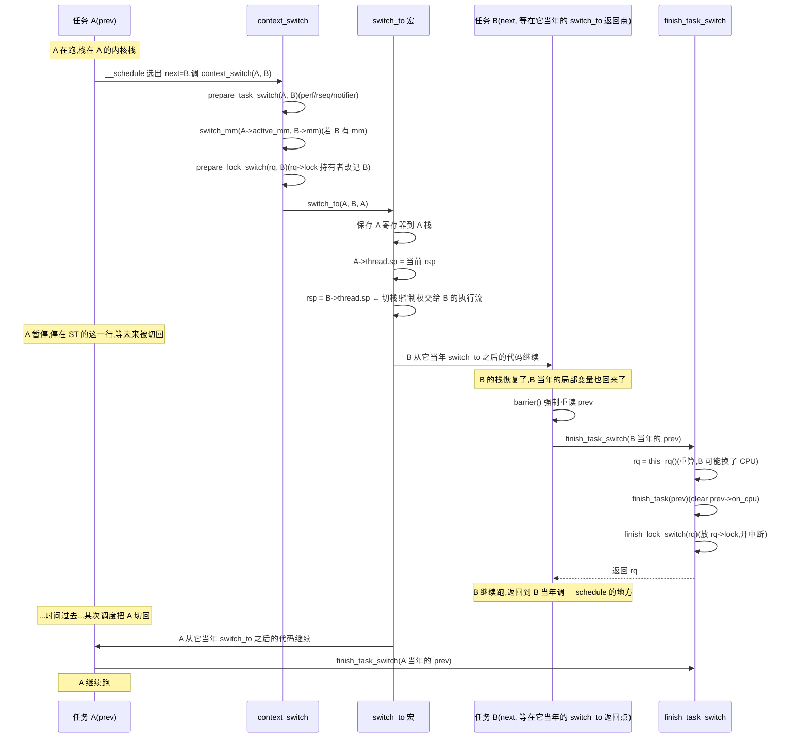

# 第十三章 · 上下文切换 switch_to ★

> 篇:P3 抢占与上下文切换(全篇收束章)
> 主线呼应:第 11 章讲清"什么时候能切",第 12 章讲清"怎么选中 next、怎么进 `context_switch`"。本章进入切的那一瞬——全机制层最 tricky 的代码。我们要回答三个看似简单、实则坑深的问题:**① 为什么 `switch_to` 是宏不是函数?② 切了内核栈指针 `rsp` 之后,函数"返回"到哪里?③ prev 任务之后被切回来,代码怎么知道"刚才切出去的是谁",毕竟 `current` 已经变了?** 这三个问题指向同一个核心事实:**`switch_to` 不是"调用一个函数再返回",而是"换一个内核栈、让控制权沿着新栈上一次被切走时的返回点继续"。** 它是全书最难理解的一处代码,也是 Linux 调度器机制美学的顶点。本章标 ★,章末对照第 7 本《Go runtime》的 `gogo`,看内核切线程和 Go 切 goroutine 的同与不同。

## 核心问题

**`context_switch → switch_to` 真正"切"了什么?为什么用宏不用函数?切了 `rsp` 之后怎么"返回"?被切走的 prev 之后怎么被认出来——它的指针怎么传到 `finish_task_switch`?为什么 `switch_to(prev, next, prev)` 第三个参数也是 `prev`,且代码紧跟一句 `barrier()` 再 `return finish_task_switch(prev)`?**

读完本章你会明白:

1. 一次切换真正切的东西:内核栈指针 `rsp`、地址空间(`switch_mm` 切页表)、FPU/向量寄存器、`current` 指针、`rq->curr`。
2. **`switch_to` 必须是宏**:它不能用普通函数调用栈,因为切 `rsp` 本身就是栈切换——必须用宏(或 inline asm)在调用者的栈帧里直接改 `rsp`。
3. **两个返回点**:切之前 `switch_to` 是"普通"代码;切 `rsp` 之后,代码不再"返回到 context_switch",而是从 next 任务**上一次被切走时**的返回点继续。当下次 prev 被切回来,从它自己上次的返回点继续。
4. **prev 的传递**:`switch_to` 宏的第三个参数 `last`(通常写成 `prev`)是"输出参数",next 任务切回来时,内核用一个 per-CPU 变量把"我刚切走的那个 prev"交给 next 的 `finish_task_switch`。

> 逃生阀:这是全书最 tricky 的章,如果一遍看不懂,正常。先把这一节读到"切 rsp = 换了内核栈 = 换了执行流"这句话消化掉,这是钥匙。剩下的细节都是围绕"换了执行流之后,代码怎么继续"展开。

---

## 13.1 一句话点破

> **`switch_to` 切的不是"函数状态",而是"内核栈指针 `rsp`"——一旦 `rsp` 改成 next 的栈顶,当前这条代码流事实上就结束了,控制权落到 next 任务上一次切走时压在它栈上的返回地址。等 prev 下次被切回来,它从自己当年压在栈上的返回地址继续。这就是为什么 `switch_to` 必须是宏(它要直接操作 `rsp`,不走函数调用约定),也是为什么 `finish_task_switch` 跟在 `switch_to` 后面、看似普通函数调用,实际上**是在 next(以及未来 prev 被切回来时)的执行流上跑**。**

这是结论,而且反直觉到让人想反驳。本章倒过来拆:先看"切换"到底切了什么,再讲为什么必须宏,最后解"两个返回点"的谜题。

---

## 13.2 切换到底切了什么:`context_switch` 的全貌

[`context_switch`](../linux/kernel/sched/core.c#L5353)(L5353-5413)是 `__schedule` 和底层架构切换之间的中间层。读它一遍:

```c
/* kernel/sched/core.c:5352 */
static __always_inline struct rq *
context_switch(struct rq *rq, struct task_struct *prev,
	       struct task_struct *next, struct rq_flags *rf)
{
	prepare_task_switch(rq, prev, next);              /* ① 切换前清理:perf/rseq/notifier */

	arch_start_context_switch(prev);                  /* ② paravirt 钩子 */

	/* ③ 地址空间(mm)切换 */
	if (!next->mm) {                                  /* next 是内核线程 */
		enter_lazy_tlb(prev->active_mm, next);
		next->active_mm = prev->active_mm;
		if (prev->mm)                            /* prev 是用户态 */
			mmgrab_lazy_tlb(prev->active_mm);
		else
			prev->active_mm = NULL;
	} else {                                          /* next 是用户态 */
		membarrier_switch_mm(rq, prev->active_mm, next->mm);
		switch_mm_irqs_off(prev->active_mm, next->mm, next);   /* ← 真正切页表 */
		lru_gen_use_mm(next->mm);
		if (!prev->mm) {                        /* prev 是内核线程 */
			rq->prev_mm = prev->active_mm;  /* 延后 mmdrop */
			prev->active_mm = NULL;
		}
	}

	switch_mm_cid(rq, prev, next);                     /* ④ mm_cid 切 */

	prepare_lock_switch(rq, next, rf);                /* ⑤ rq->lock 持有者改记为 next */

	/* Here we just switch the register state and the stack. */
	switch_to(prev, next, prev);                       /* ⑥ 真正切:寄存器 + 栈 */
	barrier();                                         /* ⑦ 编译器屏障 */

	return finish_task_switch(prev);                   /* ⑧ 切换后清理 */
}
```

它把切换拆成五件事:

| 步 | 切什么 | 谁负责 |
|---|---|---|
| ① `prepare_task_switch` | perf event 切出、rseq 抢占、notifier、kmap | core.c |
| ③ `switch_mm_irqs_off` | **地址空间**(页表基寄存器 CR3) | arch/x86(架构相关) |
| ⑤ `prepare_lock_switch` | `rq->lock` 持有者记录改成 next(让 lockdep/释放正确) | spinlock 头 |
| ⑥ `switch_to` 宏 | **内核栈 + 通用寄存器 + 指令指针(隐式)** | arch/x86 |
| ⑧ `finish_task_switch` | 放 `rq->lock`、`mmdrop`、`vtime`、dead task 回收 | core.c |

切的东西里最关键的是 **③ 地址空间** 和 **⑥ 栈 + 寄存器**。地址空间切换(`switch_mm`)改的是 CR3,让后续访存走 next 的页表——这是任务隔离的根(每个用户任务有独立地址空间)。内核线程没有 mm(`!next->mm`),复用 prev 的 `active_mm`(lazy TLB,省一次 CR3 刷新)。

> **钉死这件事**:`context_switch` 里前三步(prepare / mm / lock)切完之后,**第 ⑥ 步 `switch_to` 之前的代码,跑在 prev 的栈上;`switch_to` 之后的代码(`barrier()` + `return finish_task_switch`),跑在 next 的栈上**。这一行 `switch_to(prev, next, prev)` 是"分水岭"——它左边的代码属于 prev 的执行流,右边的代码属于 next(以及未来某次 prev 被切回来时,继续在这里)。这就是"两个返回点"的伏笔。

---

## 13.3 为什么 `switch_to` 必须是宏

这是第一个反直觉点。Linux 里几乎所有函数都是普通 C 函数,唯独 `switch_to` 用宏定义。读 [`switch_to` 调用点](../linux/kernel/sched/core.c#L5409):

```c
/* core.c:5408 */
/* Here we just switch the register state and the stack. */
switch_to(prev, next, prev);
barrier();
return finish_task_switch(prev);
```

为什么不能用:

```c
/* 朴素的、会出错的写法(示意,非源码) */
switch_to_func(prev, next, &prev);   /* 假设这是个函数 */
```

答案藏在"函数调用是怎么实现的"里。x86 调用约定下,`call switch_to_func` 会:

1. 把"返回地址"(call 的下一条指令)压栈——压在**当前栈**(prev 的内核栈)。
2. 跳到函数入口,函数用自己的栈帧(在 prev 栈上往下长)。
3. 函数 `ret` 时弹出返回地址,回到调用者。

如果 `switch_to_func` 内部把 `rsp` 改成 next 的栈顶,会发生什么?**`ret` 弹出的是 next 栈顶的返回地址——回到 next 上一次切走时压的返回点**。这看起来正是我们想要的!那为什么还要宏?

问题在**函数返回时的栈清理**和**编译器优化**:

- C 函数被编译后,call/ret 配对,函数有自己的 prologue(`push rbp; mov rbp,rsp; sub rsp,N`)和 epilogue(`add rsp,N; pop rbp; ret`)。如果在函数中间改了 `rsp`(指向另一段完全不同的栈),函数的 epilogue 会基于这个**错误**的 `rsp` 做 `add` 和 `pop`,读到的根本不是本函数 prologue 压的东西——寄存器全错、栈被破坏。
- 更糟,编译器可能在 `switch_to_func` 返回后,继续基于"调用前寄存器状态"做优化(认为 `rbx`/`r12` 等被调用者保存寄存器还是调用前的值),但实际上 `switch_to` 切走了,这些寄存器已经是 next(或未来某 prev)任务上次切走时的状态。

所以 `switch_to` 必须用宏(或 `__always_inline` + 内联汇编),让"改 rsp"这件事**发生在 `context_switch` 自己的函数体里**——切完 `rsp` 之后,后续代码(`barrier()` + `finish_task_switch`)直接在 next 的栈上继续,没有额外的 call/ret 栈帧需要清理。

x86-64 上 `switch_to` 宏的内核(在 `arch/x86/include/asm/switch_to.h`,未 sparse clone)大致结构是这样的(描述,非源码原文):

```c
/* arch/x86/include/asm/switch_to.h,__switch_to_asm 的语义(简化描述) */
/* 1. 保存 prev 的被调用者保存寄存器(rbx, rbp, r12-r15)到 prev 栈 */
/* 2. 保存 prev 的 rsp 到 prev->thread.sp;从 next->thread.sp 恢复 rsp */
/* 3. 从 next 栈恢复 next 上次保存的寄存器 */
/* 4. jmp 到 __switch_to(C 函数,做 FPU/DS/TLS 等剩余切换) */
```

第 2 步是核心:`prev->thread.sp = current_rsp`(存旧栈),`current_rsp = next->thread.sp`(装新栈)。从这一刻起,任何压栈/弹栈都发生在 next 的栈上。next 上次切走时,它停在它自己 `switch_to` 宏的第 2 步(反方向)——也就是说,**next 一直在等"它的 rsp 被恢复、它的寄存器被恢复、然后从那条指令往下继续"**。

> **钉死这件事**:`switch_to` 是宏因为**它要绕过 C 的函数调用栈约定,直接操作 `rsp`**。函数做不到(会被 prologue/epilogue 和编译器优化坑死)。宏让"切栈"和"`context_switch` 后续代码"在同一个函数体里无缝衔接——切完 `rsp`,`barrier()` 阻止编译器把后面的代码优化到切栈之前,`finish_task_switch` 直接在 next 的栈上跑。这是 C 语言 + 内联汇编做"控制流魔术"的典范。

---

## 13.4 两个返回点:切了 `rsp` 之后,"返回"到哪里

理解了 `switch_to` 是宏,第二个谜题"返回到哪里"自然解开。

看 [`context_switch`](../linux/kernel/sched/core.c#L5409) 这一行:

```c
switch_to(prev, next, prev);
barrier();
return finish_task_switch(prev);
```

假设当前 CPU 0 上 prev = A、next = B。执行到 `switch_to`:

1. **`switch_to` 宏内部**:保存 A 的寄存器到 A 栈;`A->thread.sp = 当前 rsp`;`rsp = B->thread.sp`(换成 B 的栈);恢复 B 栈上保存的寄存器。**控制权从此刻起,已经在 B 的执行流上。**
2. B 上一次切走时,也是停在它自己的 `switch_to` 宏里(当 B 还是 prev 的那次)。所以 B 的栈顶,正是 B 当年保存的"切走瞬间寄存器 + 返回地址"。`switch_to` 宏恢复完这些,B 从它当年 `switch_to` 宏之后的代码继续——也就是 B 当年 `context_switch` 里的 `barrier(); return finish_task_switch(B当时的prev);`。
3. **A(我们最初讲的 prev)暂时"消失"了**。它的栈保存在 `A->thread.sp`,它要等未来某次有任务被切到 A 时,才会从它当年的返回点继续。

所以"`switch_to` 之后的 `finish_task_switch(prev)`",在切换发生那一刻,**事实上是 B 在跑**(B 当年的 prev,不是 A)。"两个返回点"的含义:

- **返回点 1(切换瞬间,next 视角)**:B 从它当年被切走时的 `switch_to` 之后继续,跑的是 B 当年的 `finish_task_switch(B当时的prev)`。
- **返回点 2(未来,prev 被切回)**:未来某次,有任务把 A 切回来,A 从它**这次**被切走时的 `switch_to` 之后继续,跑 `finish_task_switch(A这次切走时的...)`。

这就是为什么 [`finish_task_switch` 的注释](../linux/kernel/sched/core.c#L5235)(L5235-5238)说:

> The context switch have flipped the stack from under us and restored the local variables which were saved when this task called schedule() in the past. prev == current is still correct but we need to recalculate this_rq because prev may have moved to another CPU.

翻译:**"切换把栈从我们脚下抽走了,恢复了当年这个任务调 schedule() 时保存的局部变量。`prev == current` 仍然成立(因为当年 B 调 `context_switch` 时,prev 就是它当时的 prev,而 current 现在又是 B),但 rq 要重新算,因为 B 可能被切到了另一个 CPU。"**

> **钉死这件事**:`switch_to(prev, next, prev)` 不是"调用并返回",而是"放弃当前执行流、把 CPU 让给 next 当年的执行流"。当下次 prev 被切回来,它从自己当年的"放弃点"继续。这一行代码,事实上横跨了**多个任务的生命周期**。理解了这点,`barrier()` 和第三个 `prev` 参数才有意义。

---

## 13.5 第三个参数 `prev`:被切走的那位怎么传

第三个谜题:`switch_to(prev, next, prev)` 为什么第三个参数(宏展开里叫 `last`)也是 `prev`?它不是输入吗,为什么用 prev 当输出?

这要从"切换之后,代码怎么知道刚切走的是谁"讲起。切换发生之后:

- `current` 变成了 next(B)。
- B 要调 `finish_task_switch(prev)`,这里的 `prev` 应该是**B 切走时的那个 prev**——不是 A。

但 B 当年调 `context_switch` 时,它栈上保存的局部变量 `prev` 是它当年的 prev。当 B 被切回来、栈恢复,B 的 `context_switch` 里那个 `prev` 局部变量就是 B 当年的 prev——这正好是 B 要传给 `finish_task_switch` 的值。**所以 `context_switch` 里 `return finish_task_switch(prev)` 的 `prev`,在每次执行时都正确**——它用的是"当前这个执行流当年保存的 prev"。

那为什么 `switch_to` 宏还要第三个参数 `last`?这解的是**另一种情况**。考虑 [CFS 核调度(core scheduling)](../linux/kernel/sched/core.c#L6108) 和一些架构(比如早期 x86-32)的细节:切换发生在 `__schedule` 的循环里,可能涉及多次 pick。`switch_to` 宏在某些架构上,会把"我刚切走的那个 prev"通过一个 per-CPU 变量或寄存器,显式交给宏调用点的 `last` 参数,这样**宏调用点之后**的代码能拿到"我刚切走的这位",而不是依赖局部变量。

在 x86-64 上,`switch_to(prev, next, last)` 宏大致语义(简化描述):

```
 1. 把 prev 的寄存器存到 prev 栈
 2. 切 rsp 到 next 栈
 3. 在 next 栈上,把"next 当年切走时的 prev"作为宏的"输出"赋给 last
 4. 从 next 当年的返回点继续
```

所以 `switch_to(prev, next, prev)` 的意思是:① 输入 prev(切走它)、next(切到它);② 输出 last(在切换之后,这个变量被赋值为"刚切走的那位",也就是切换前 prev 的值,但在新执行流上重新装载)。在 `context_switch` 里,last 和 prev 是同一个变量,所以写 `switch_to(prev, next, prev)`——第三个参数既是输入位也是输出位,prev 变量在 `switch_to` 之后被重新赋值为"当前执行流切走的那位"。

紧跟着的 `barrier()`(L5410)极关键:**阻止编译器把 `finish_task_switch(prev)` 优化到 `switch_to` 之前**。切换在汇编里改了内存(切了栈,等价于换了所有局部变量的"有效存储位置"),编译器如果不被屏障挡住,可能基于切换前的分析认为 `prev` 还是某个寄存器值——错了。`barrier()` 强制编译器在 `switch_to` 之后重新从内存读 `prev`。

> **钉死这件事**:`switch_to(prev, next, prev)` 是个**输入 + 输出参数宏**。第三个 `prev` 在宏展开里被赋值为"当前执行流(切换之后)的 prev"——也就是切换前 prev 的同一个 task_struct 指针,但在新栈上重新装载。`barrier()` 保证编译器尊重这一切。这两个细节是"用 C 写跨执行流代码"的硬骨头,理解它们你就理解了为什么 `context_switch` 这十几行代码被反复 review、为什么内核新手在这里翻车最多。

---

## 13.6 时序:一次完整的 `context_switch`

把 `__schedule → context_switch → switch_to → finish_task_switch` 串起来,看 CPU 0 上 A 切到 B 的全过程:



要点钉死:

1. `switch_to` 那一行执行后,**CPU 立刻开始跑 B 的代码**(B 当年的返回点)。A 的执行流暂停在 `switch_to` 内部,等未来被切回。
2. `finish_task_switch` 在切换**之后**跑,但它跑在 next(B)的执行流上,处理的是 B 当年的 prev。所以它的注释说"prev == current is still correct"——对 B 当年的 context_switch 调用来说,prev 确实是它切走时的那位。
3. A 被"暂停"不是 sleep——它的状态完全保留在它的内核栈(`A->thread.sp` 指向)和它的 `task_struct` 里。等切换发生,这个状态被恢复,A 从当年的代码继续。**这就是"上下文"二字的全部含义:内核栈 + 寄存器 + task_struct 状态**。

---

## 13.7 `finish_task_switch`:切换后的清理

[`finish_task_switch`](../linux/kernel/sched/core.c#L5240)(L5240-5322)是切换发生在 next 执行流上后,做的"打扫"。读它的关键部分:

```c
/* core.c:5240 */
static struct rq *finish_task_switch(struct task_struct *prev)
	__releases(rq->lock)
{
	struct rq *rq = this_rq();
	struct mm_struct *mm = rq->prev_mm;
	unsigned int prev_state;

	/* invariant 检查:切换时 preempt_count 必须正好 2 层 */
	if (WARN_ONCE(preempt_count() != 2*PREEMPT_DISABLE_OFFSET,
		      "corrupted preempt_count: ..."))
		preempt_count_set(FORK_PREEMPT_COUNT);

	rq->prev_mm = NULL;

	prev_state = READ_ONCE(prev->__state);
	vtime_task_switch(prev);
	perf_event_task_sched_in(prev, current);
	finish_task(prev);            /* ← 清 prev->on_cpu(关键) */
	tick_nohz_task_switch();
	finish_lock_switch(rq);       /* ← 放 rq->lock,开中断 */
	...

	if (mm) {
		membarrier_mm_sync_core_before_usermode(mm);
		mmdrop_lazy_tlb_sched(mm);  /* 延后的 mm 释放 */
	}

	if (unlikely(prev_state == TASK_DEAD)) {
		...
		put_task_stack(prev);
		put_task_struct_rcu_user(prev);  /* prev 死了,释放 task_struct */
	}

	return rq;
}
```

几个关键点:

1. **`WARN_ONCE(preempt_count() != 2*PREEMPT_DISABLE_OFFSET)`**:这是切换 invariant 的兜底断言。切换发生时 preempt_count 必须正好 2 层(`__schedule_loop` 的 preempt_disable + rq->lock),否则说明入口错了——内核用 WARN 立刻暴露。
2. **`finish_task(prev)`**:清 `prev->on_cpu = 0`。这极重要——`try_to_wake_up` 会用 `smp_cond_load_acquire(&p->on_cpu, !VAL)` 等 prev 真正切完(见 [`try_to_wake_up`](../linux/kernel/sched/core.c#L4278) 附近的注释 L4278-4317)。`finish_task` 之前,prev 还"占着 CPU";之后,prev 可以被唤醒/迁移。这是唤醒路径不丢事件的根。
3. **`finish_lock_switch(rq)`**:放 `rq->lock`、开中断。从 `__schedule` 关中断到这一刻,中断一直关着(切换全程关中断,见第 12 章)。放锁后中断打开,本核恢复响应。
4. **`prev_state == TASK_DEAD`**:如果 prev 是 `do_task_dead` 来的(任务退出),这里释放它的 task_struct。这是"任务最后一次切换"——prev 不会再被切回,它的 task_struct 在这里被回收。

> **钉死这件事**:`finish_task_switch` 的存在回答了一个微妙问题——切换发生在 next 的执行流上,但 prev(刚被切走的)还有"收尾"要做(清 on_cpu、放锁、可能释放 task_struct)。这些收尾在 next 的执行流上做,**用的是 next 当年保存的 prev 指针**。所以 `finish_task_switch` 不光清理 prev,事实上**也在为未来某次自己(prev)被切回做准备**——这次它处理的是"刚切走的",下次它被切回时,会有别的任务处理它。

---

## 13.8 内存序:切换全程为什么 sound

切换是全内核最敏感的并发点之一——一个 CPU 上正在切栈,别的 CPU 可能同时唤醒 prev、迁移 next、读 rq 状态。这套 sound 靠几条精心安排的内存序:

| 点 | 操作 | 配对/作用 |
|---|---|---|
| `__schedule` 关中断 | `local_irq_disable` | 切换全程中断关闭,防 rq 状态在中途变 |
| `rq_lock` | 自旋锁获取(隐含 acquire) | 保护 rq 状态 |
| `smp_mb__after_spinlock` | 全屏障 | 防 `schedule`/`signal_wake_up` race(第 12 章) |
| `switch_to` 切栈 | 架构相关屏障(切栈 = 全屏障) | 切栈本身是序列化点 |
| `finish_task(prev)` | `WRITE_ONCE(prev->on_cpu, 0)` + release 屏障 | 配 `try_to_wake_up` 的 `smp_cond_load_acquire(&p->on_cpu, !VAL)` |
| `finish_lock_switch` | `spin_unlock`(release) | 释放 rq->lock,配其他核的 rq_lock |

最关键的是 **`finish_task`/`on_cpu` 这一对**。看 [`try_to_wake_up`](../linux/kernel/sched/core.c#L4278) 注释描述的 dance:

```
 CPU 0(切换 prev 出)             CPU 1(唤醒 prev)
   context_switch(prev, next)
     switch_to(prev, next)          smp_cond_load_acquire(&prev->on_cpu, !VAL);
                                     /* 等 prev 真正切完 */
   finish_task(prev):
     WRITE_ONCE(prev->on_cpu, 0)    ← 一旦 on_cpu=0,CPU 1 醒来
                                     prev->state = TASK_WAKING
                                     enqueue prev 到某 rq
```

CPU 1 想唤醒 prev,但 prev 此刻正在 CPU 0 上被切走(在 `context_switch` 中途)。如果 CPU 1 直接改 prev 状态入队,可能和 CPU 0 的切换 race——prev 已经不在 CPU 0 的 rq 上,但 prev->on_cpu 还没清。`smp_cond_load_acquire` 是个忙等(自旋),等 CPU 0 把 `prev->on_cpu` 写 0(`finish_task` 里),才继续唤醒。这一对保证:**prev 真正"脱离 CPU 0"之后,CPU 1 才能把它重新入队**。

> **反面对比**:如果没有 `on_cpu` 这个握手,wakeup 路径可能在 prev 还在 CPU 0 切换中途时把它 enqueue 到别的 rq,prev 的状态就乱了(它的 `task_struct` 字段被两边同时改)。`on_cpu` 这个 1-bit 标志 + 自旋等待 + acquire/release 屏障,把"切换完成"这个事件安全地广播出去。这是内核并发代码"用一个标志位 + 内存屏障串行化两个 CPU"的典范,和第 11 章 `TIF_NEED_RESCHED`、第 12 章 control dependency 同源。

---

## 13.9 技巧精解:`switch_to` 的栈切换魔术

这一节把本章最硬的技巧单独拆透:**切 `rsp` 这个动作为什么这么 sound,以及它怎么让"代码跨执行流继续"成为可能**。

### 13.9.1 `rsp` 是执行流的全部

在 x86(以及绝大多数架构)上,**内核任务的"执行流状态"= 当前内核栈 + 通用寄存器**。指令指针 `rip` 的"下一步执行什么"完全由栈顶的返回地址(函数调用链)决定——`ret` 弹栈顶作为返回地址。所以:

```
 切 rsp = 换内核栈 = 换"返回地址链" = 换"接下来执行什么"
```

`switch_to` 的核心就是这一句话。一旦 `rsp` 指向 next 的栈顶,接下来任何 `ret`(包括 `switch_to` 宏末尾的跳转)都会从 next 栈顶弹返回地址,跳到 next 上一次切走时压的返回点。prev 的"返回地址链"完好地保存在它的栈里(由 `A->thread.sp` 指向),等未来切回时恢复。

### 13.9.2 为什么 prev 的寄存器也要存

切 `rsp` 只换了栈,通用寄存器(`rbx`/`rbp`/`r12-r15` 等被调用者保存的)还在原 CPU 的物理寄存器里。如果不存,这些寄存器会被 next 的代码改写,prev 切回时它的寄存器值已经丢了。

所以 `switch_to` 宏在切 `rsp` **之前**,把 prev 的被调用者保存寄存器压到 prev 栈;切 `rsp` 之后,从 next 栈恢复 next 上次保存的寄存器。这样每个任务的"寄存器快照"都存在它自己的栈顶,切走时压、切回时弹。**调用者保存寄存器(rax/rcx/rdx 等)不需要 switch_to 存**——按 C 调用约定,它们在函数调用边界本来就被认为是"易失"的,`context_switch` 的调用者(`__schedule`)会在自己的 prologue 里处理。

### 13.9.3 FPU/向量寄存器:lazy 切换

切 FPU(浮点/SSE/AVX)很贵(几百字节状态)。Linux 用 **lazy FPU switch**:切换时不真切 FPU,只在下一次 FPU 指令触发 #NM(trap)时才切。`__switch_to`(架构相关函数)里设 CR0.TS(或等价的 XFD),FPU 指令触发 trap 后才保存 prev 的 FPU 状态、加载 next 的。这样,内核线程、不碰 FPU的任务切换零 FPU 开销。

> **钉死这件事**:`switch_to` 的 sound 在于它**完整保存了执行流状态**:栈(切 rsp)+ 通用寄存器(压 prev 栈)+ FPU(lazy,按需)+ 地址空间(switch_mm 改 CR3)+ task_struct 状态(`rq->curr`/`current` 指针切换)。每一项都有明确的"切走时存、切回时恢复"位置。任何一项遗漏都会导致任务切回时状态错乱(最经典:漏存某寄存器,任务算错数;漏切 CR3,任务访问到别的任务的内存)。这套完整性是进程/线程隔离的物理基础——没有正确的 `switch_to`,一个任务能"看见"另一个任务的数据,安全彻底崩。

---

## 13.10 ★ 对照第 7 本《Go runtime》:切线程 vs 切 goroutine

| 维度 | Linux `switch_to`(本书) | Go `gogo`(第 7 本) |
|---|---|---|
| 切的对象 | task_struct(进程/线程) | goroutine(用户态) |
| 切栈 | 切**内核栈**(几 KB-16 KB) | 切 goroutine 的**用户态小栈**(初始 2 KB,可增长) |
| 切寄存器 | 全部通用寄存器 + FPU(lazy) + CR3(若切地址空间) | 只切必要寄存器(rip/rsp/bp),无 FPU/无 CR3 |
| 切换成本 | μs 级(涉及 CR3、TLB 部分刷新、可能 FPU trap) | 几十 ns(纯寄存器 + 栈指针,无内核参与) |
| 谁触发 | 内核(`__schedule → context_switch`) | Go runtime(GMP 调度循环,在用户态) |
| 抢占基础 | `TIF_NEED_RESCHED` + 抢占点(第 11 章) | 协作抢占(函数调用安全点)+ 6.x 异步抢占(信号) |

Go 的 `gogo` 只切 goroutine 的小栈和几个寄存器——这正是 goroutine 比线程便宜几个数量级的根。一个 Go 程序里几百万 goroutine,切换都是 Go runtime 在用户态完成;Linux 的 `switch_to` 切的是真线程,要进内核、可能刷 TLB、可能 FPU trap,重得多。但要注意:**Go 的 M(内核线程)本身,也是由本书的 Linux 调度器 `switch_to` 来切的**——Go runtime 最终搭在内核线程上,内核调度器调度 M,Go runtime 在 M 之上再调度 G。两本合起来才是并发程序被调度的全貌。

---

## 章末小结

这一章是机制层的硬骨头,也是全书的 tricky 顶点。

1. **`context_switch` 切五样**:prepare(mm/lock 预切换)→ `switch_mm`(CR3,地址空间)→ `switch_to`(栈 + 寄存器 + FPU)→ `finish_task_switch`(放锁、清 on_cpu、可能回收 dead task)。
2. **`switch_to` 必须是宏**:它要直接操作 `rsp`,绕过 C 函数调用的栈约定;宏让"切栈"和"`context_switch` 后续代码"在同一函数体里无缝衔接。
3. **两个返回点**:`switch_to` 之后,代码事实上在 next(以及未来 prev 被切回)的执行流上跑。`finish_task_switch` 处理的是"当前执行流当年切走时的 prev",不是切换瞬间的那位。
4. **第三个参数 `prev` + `barrier()`**:宏的输出参数把"刚切走的那位"交给后续代码;`barrier()` 阻止编译器跨 `switch_to` 优化。
5. **内存序**:`finish_task` 清 `on_cpu` 配 `try_to_wake_up` 的 `smp_cond_load_acquire`,是唤醒不丢事件的根;切换全程关中断 + rq->lock 保证 rq 状态稳定。

这一章服务**机制**那面,把第 12 章 `__schedule → context_switch` 这条线落实成真实的 CPU 执行流切换。到这里,P3 全篇("怎么落实跑")收束:第 11 章讲抢占时机,第 12 章讲选 next + 进切换,本章讲切栈本身。接下来第 4 篇要把视角从"单核切换"扩展到"多核均衡"——任务在核间怎么搬、什么时候搬。

### 五个"为什么"清单

1. **`switch_to` 为什么是宏不是函数?** 函数有自己的 prologue/epilogue 和调用栈,在函数内部改 `rsp` 会让 epilogue 读错栈、编译器优化错。宏直接在 `context_switch` 函数体里改 `rsp`,后续代码无缝在 next 栈上继续。
2. **切了 `rsp` 之后,"返回"到哪里?** 返回到 next 任务上一次切走时压在它栈顶的返回地址——也就是 next 当年 `context_switch` 的 `switch_to` 之后那行。prev 不"返回",它暂停在 `switch_to` 内部等切回。
3. **`switch_to(prev, next, prev)` 第三个 prev 是干什么的?** 它是宏的输出参数,在切换之后被赋值为"当前执行流切走的那位"。配 `barrier()` 阻止编译器跨切换优化,让 `finish_task_switch(prev)` 拿到正确的 prev。
4. **`finish_task_switch` 为什么说 "prev == current is still correct"?** 因为切换之后代码跑在 next 的执行流上,用的是 next 当年保存的局部变量——对 next 当年的 `context_switch` 调用,prev 就是它切走时的那位,关系仍然成立。但 rq 要重算(可能换 CPU 了)。
5. **切换全程为什么 sound?** 三道闸:关中断(防 rq 中途变)+ rq->lock(保护 rq 状态)+ `finish_task` 的 on_cpu 握手(配 wakeup 的 `smp_cond_load_acquire`,不丢唤醒)。每一道都解一类 race。

### 想继续深入往哪钻

- 通读 [`context_switch`](../linux/kernel/sched/core.c#L5353)(L5353-5413)和 [`finish_task_switch`](../linux/kernel/sched/core.c#L5240)(L5240-5322),特别是它们的注释——L5235-5238 和 L5247-5257 把"两个返回点"和 preempt_count invariant 讲得极清楚。
- x86-64 的 `__switch_to_asm`(`arch/x86/kernel/process_64.S`,未 sparse clone,elixir 在线读):看切 `rsp`、保存/恢复寄存器的真实汇编。注意 `__switch_to_asm` 末尾 `jmp __switch_to`(不是 call),`__switch_to` 末尾 `ret`——这个 ret 弹的是 next 栈顶的返回地址。
- 读 `try_to_wake_up`(L4231)附近关于 `on_cpu` 的注释(L4278-4340),看切换与唤醒的 dance。
- 观测:`/proc/<pid>/status` 的 `voluntary_ctxt_switches`/`nonvoluntary_ctxt_switches`(对应 nvcsw/nivcsw)、`perf sched` 看每次 sched_switch 的 prev/next、`/proc/<pid>/sched` 的 `nr_switches`。
- 延伸:`Documentation/asm-arm64/switch_to.rst`(arm64 的等价机制)、`arch/x86/kernel/fpu/core.c`(lazy FPU switch 细节,6.x 后改为 eager+TILinux,可对比)。

### 引出下一篇

P3 三章讲清了"单核上怎么落实跑":抢占时机(11)、选中 next 进切换(12)、切栈本身(13)。接下来 P4 把视角拉到多核:一个核忙死、一个核闲死不行,任务得在核间均衡。第 14 章讲调度域怎么把 SMP 拓扑(SMT/物理核/NUMA)抽象成层次结构,第 15 章讲 `load_balance` 怎么按这个层次周期性地 pull 任务,第 16 章讲迁移的 cache 代价和 CPU 亲和。整个 P4 都建立在 P1(runqueue)+ P2(PELT 负载)+ P3(切换机制)之上——均衡要做的事就是"挑一个任务、在另一个核上 enqueue、靠 `switch_to` 切过去"。
