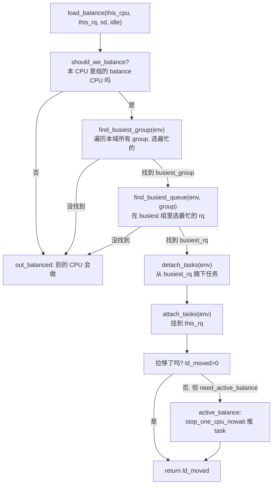
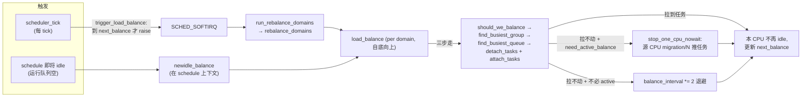

# 第十五章 · load_balance:周期均衡与 idle 均衡

> 篇:第 4 篇 · SMP 负载均衡:核间搬任务
> 主线呼应:上一章 P4-14 把硬件拓扑抽象成了 `sched_domain`/`sched_group` 层次树,告诉负载均衡"近域该勤均衡、远域该懒均衡"。本章钻进负载均衡的主循环——[`load_balance`](../linux/kernel/sched/fair.c#L11259)、[`newidle_balance`](../linux/kernel/sched/fair.c#L12289)、[`find_busiest_group`](../linux/kernel/sched/fair.c#L10837)——看它怎么在调度域树上一层一层地把任务从忙核"拉"到闲核。它是 SMP 均衡的发动机,也是 PELT(第 9 章)统计出来的负载数据真正被消费的地方。

## 核心问题

**调度域是地图,负载均衡才是跑车。内核怎么在调度域树上一层一层地拉任务?它怎么决定"该不该均衡、从哪个组拉、从哪个 CPU 拉、拉哪个任务、拉多少"?为什么用 pull 模型(闲核主动从忙核拉)而不是 push 模型(忙核主动推)?**

读完本章你会明白:

1. 负载均衡的两个触发点:**周期均衡**(`trigger_load_balance` → `rebalance_domains` → `load_balance`,softirq 触发)和 **newidle 均衡**(`schedule` 路径里 CPU 即将 idle 时主动拉任务)。
2. pull 模型的三步走:`find_busiest_group`(选最忙组)→ `find_busiest_queue`(选最忙 CPU)→ `detach_tasks` + `attach_tasks`(摘下任务挂到本 CPU)。
3. 迁移代价的评估:`task_hot` 判断 cache 热度、`cache_nice_tries` 给热任务豁免、`sysctl_sched_migration_cost` 是阈值。
4. active balance:当 pull 失败但确实该迁(比如 task 正在跑、misfit 任务、asym packing),踢一脚目标 CPU 的 migration 线程,把它上面跑着的任务**推**出来。
5. ★ 对照 Go runtime:Linux `load_balance` 是**周期 pull**(忙核定期主动拉),Go 是 **work-stealing**(空闲 P 主动偷)。

---

## 15.1 一句话点破

> **负载均衡是"忙的拉过来给闲的"——由空闲(或不太忙)的 CPU 在每一层调度域上发起 pull,从最忙的组里挑最忙的 CPU,把它上面 cache 不热、亲和允许、能填平 imbalance 的任务摘下来挂到本 CPU;拉不动且真的该拉时,再踢一脚 migration 线程强制推。**

这是结论,不是理由。本章倒过来拆:先看为什么选 pull 模型、怎么触发,再看 pull 的三步流程,再看代价评估和 active balance。

---

## 15.2 为什么是 pull 模型,什么时候触发

> **不这样会怎样**:假设用 push 模型——忙核主动把自己上面的任务推给别的核。问题来了:**忙核正忙着,哪有空去想"我该推给谁"?** 它要 push 就得在跑业务的间隙扫所有核的状态、算 imbalance、挑目标——忙的时候干这事儿,既打断业务又慢。更糟的是,多个忙核可能同时 push 到同一个闲核,造成"惊群式"过均衡。

> **所以这样设计**:Linux 选了 **pull 模型**——**由"需要更多任务的 CPU"主动发起均衡**。谁需要?闲的 CPU。闲 CPU 一边没业务,有的是时间扫拓扑、算 imbalance、拉任务;而且每个 CPU 只为自己拉,天然不会"过均衡"(拉够自己的份就停)。

这个模型有两个触发点:

### 触发一:周期均衡(periodic / idle load balance)

每个 CPU 在调度 tick 里被定期提醒"该均衡了"——[`trigger_load_balance`](../linux/kernel/sched/fair.c#L12440)([fair.c:12440](../linux/kernel/sched/fair.c#L12440)):

```c
/* kernel/sched/fair.c:12440 */
void trigger_load_balance(struct rq *rq)
{
    /* 拓扑未建好或 CPU 不活跃,跳过 */
    if (unlikely(on_null_domain(rq) || !cpu_active(cpu_of(rq))))
        return;

    /* 到点了,触发 SCHED_SOFTIRQ */
    if (time_after_eq(jiffies, rq->next_balance))
        raise_softirq(SCHED_SOFTIRQ);

    /* NOHZ:顺便踢一下 nohz 均衡器,让它替 idle CPU 做均衡 */
    nohz_balancer_kick(rq);
}
```

`trigger_load_balance` 在每个 tick(`scheduler_tick`)里被调一次,但它**不会立刻均衡**——它只判断"到 `rq->next_balance` 这个时间点了吗?"如果到了,raise 一个软中断 `SCHED_SOFTIRQ`,真正的均衡在软中断里跑。`next_balance` 是个动态值,每次均衡完会按当前层的 `balance_interval` 重置。

软中断处理函数是 [`run_rebalance_domains`](../linux/kernel/sched/fair.c#L12415)([fair.c:12415](../linux/kernel/sched/fair.c#L12415)),它调 [`rebalance_domains`](../linux/kernel/sched/fair.c#L11689)([fair.c:11689](../linux/kernel/sched/fair.c#L11689)):

```c
/* kernel/sched/fair.c:11689 (简化) */
static void rebalance_domains(struct rq *rq, enum cpu_idle_type idle)
{
    int continue_balancing = 1;
    int cpu = rq->cpu;
    int busy = idle != CPU_IDLE && !sched_idle_cpu(cpu);
    struct sched_domain *sd;
    unsigned long next_balance = jiffies + 60*HZ;

    rcu_read_lock();
    for_each_domain(cpu, sd) {                         /* 自底向上遍历调度域链 */
        ...
        interval = get_sd_balance_interval(sd, busy);  /* busy=CPU 在忙,间隔×16 */

        need_serialize = sd->flags & SD_SERIALIZE;
        if (need_serialize)
            if (!spin_trylock(&balancing)) goto out;   /* NUMA 域全局串行 */

        if (time_after_eq(jiffies, sd->last_balance + interval)) {
            if (load_balance(cpu, rq, sd, idle, &continue_balancing)) {
                /* 拉到了任务,重新评估 idle 状态 */
                idle = idle_cpu(cpu) ? CPU_IDLE : CPU_NOT_IDLE;
                busy = idle != CPU_IDLE && !sched_idle_cpu(cpu);
            }
            sd->last_balance = jiffies;
            interval = get_sd_balance_interval(sd, busy);
        }
        if (need_serialize) spin_unlock(&balancing);
        ...
    }
    rcu_read_unlock();
    ...
}
```

注意几个细节:

- **`for_each_domain` 自底向上**:先在 SMT 层均衡,够便宜先做;然后 MC 层、PKG 层、NUMA 层。`continue_balancing` 是个反馈——如果低层有别的 CPU 在更积极地均衡,高层就跳过。
- **`busy_factor=16`**:`get_sd_balance_interval` 里,如果 CPU 在忙,`interval *= 16`。忙 CPU 不希望被频繁打扰,所以拉长间隔。这跟"忙核 push 不好"是同一个理由——忙的时候少折腾。
- **`SD_SERIALIZE`**:NUMA 域带这个标志(见 P4-14 的 `sd_init`),意味着本层均衡要全局抢 `balancing` 自旋锁,避免多个 CPU 同时跨 NUMA 均衡互相踩。
- **`idle` 参数**:`CPU_IDLE`(CPU 当前闲)、`CPU_NOT_IDLE`(CPU 在忙)、`CPU_NEWLY_IDLE`(CPU 刚要进入 idle)。这个参数贯穿整个均衡流程,影响选什么任务、迁多少。

### 触发二:newidle 均衡

第二种触发是 **newidle balance**:CPU 即将进入 idle 时(运行队列空了,要选 idle 任务),主动拉一把任务过来——因为等下一个周期均衡 tick 可能要等几毫秒,而这台 CPU 现在就能干活。入口是 `schedule` 路径里的 [`newidle_balance`](../linux/kernel/sched/fair.c#L12289)([fair.c:12289](../linux/kernel/sched/fair.c#L12289)):

```c
/* kernel/sched/fair.c:12289 (简化) */
static int newidle_balance(struct rq *this_rq, struct rq_flags *rf)
{
    ...
    /* 有任务待唤醒?那就别浪费时间均衡了,马上就有活儿 */
    if (this_rq->ttwu_pending)
        return 0;

    /* 记 idle 时间戳,把均衡耗时算成 idle 时间 */
    this_rq->idle_stamp = rq_clock(this_rq);
    ...
    /* 关键闸门:系统没"overload"或预期均衡成本比预期 idle 还短,跳过 */
    if (!READ_ONCE(this_rq->rd->overload) ||
        (sd && this_rq->avg_idle < sd->max_newidle_lb_cost)) {
        goto out;
    }

    raw_spin_rq_unlock(this_rq);                        /* newidle 均衡要放开 rq->lock */

    t0 = sched_clock_cpu(this_cpu);
    update_blocked_averages(this_cpu);                  /* 先更新 PELT */

    rcu_read_lock();
    for_each_domain(this_cpu, sd) {
        ...
        /* 预计本次均衡成本超 avg_idle?停,不值得 */
        if (this_rq->avg_idle < curr_cost + sd->max_newidle_lb_cost)
            break;

        if (sd->flags & SD_BALANCE_NEWIDLE) {
            pulled_task = load_balance(this_cpu, this_rq, sd,
                                        CPU_NEWLY_IDLE, &continue_balancing);

            t1 = sched_clock_cpu(this_cpu);
            domain_cost = t1 - t0;
            update_newidle_cost(sd, domain_cost);      /* 学习本层均衡成本 */
            curr_cost += domain_cost;
        }

        /* 拉到任务或本队列又有任务了,停 */
        if (pulled_task || this_rq->nr_running > 0 || this_rq->ttwu_pending)
            break;
    }
    rcu_read_unlock();

    raw_spin_rq_lock(this_rq);
    ...
}
```

newidle 均衡的精髓是**自我节制**:

- **`avg_idle < max_newidle_lb_cost`**:本 CPU 平均空闲多久(过去几次 idle 的经验) vs 本域历史上均衡花多久。如果预计均衡花的比 idle 还长,直接不做——比 idle 干等还亏。这是用历史代价做预测。
- **`update_newidle_cost`**:每次均衡完都更新"本层 newidle 均衡的历史最高成本",用作下次判断。这是个**自适应学习**机制。
- **`pulled_task` 一拉到就停**:CPU 不再 idle,后面的高层就不用看了。
- **NEWLY_IDLE 是低延迟路径**:在 `detach_tasks` 里,[`PREEMPTION` 内核 NEWLY_IDLE 拉一个任务就 break](../linux/kernel/sched/fair.c#L9163-L9171)([fair.c:9163](../linux/kernel/sched/fair.c#L9163)),因为 newidle 均衡发生在 `schedule` 路径,任务越早拉到越好,多拉一个不值得延长临界区。

> **钉死这件事**:周期均衡和 newidle 均衡共用同一个 `load_balance` 主循环,差别只在 `env.idle`(CPU_IDLE/NOT_IDLE/NEWLY_IDLE)和触发频率。周期均衡按 `balance_interval` 节奏来,newidle 均衡即时来,但有"成本预测"做闸门。两个入口共享 pull 模型——闲的拉忙的。

---

## 15.3 pull 的三步走:`load_balance` 主循环

负载均衡的发动机是 [`load_balance`](../linux/kernel/sched/fair.c#L11259)([fair.c:11259](../linux/kernel/sched/fair.c#L11259))。它的三步走流程:



主体代码([fair.c:11259-L11310](../linux/kernel/sched/fair.c#L11259)):

```c
/* kernel/sched/fair.c:11259 (简化) */
static int load_balance(int this_cpu, struct rq *this_rq,
                        struct sched_domain *sd, enum cpu_idle_type idle,
                        int *continue_balancing)
{
    int ld_moved, cur_ld_moved, active_balance = 0;
    struct sched_group *group;
    struct rq *busiest;
    struct lb_env env = {
        .sd         = sd,
        .dst_cpu    = this_cpu,
        .dst_rq     = this_rq,
        .dst_grpmask = group_balance_mask(sd->groups),
        .idle       = idle,
        .loop_break = SCHED_NR_MIGRATE_BREAK,
        .cpus       = cpus,
        .fbq_type   = all,
        .tasks      = LIST_HEAD_INIT(env.tasks),
    };

redo:
    /* ① 本 CPU 该不该做这次均衡?(组里只有一个 balance CPU 做) */
    if (!should_we_balance(&env)) {
        *continue_balancing = 0;
        goto out_balanced;
    }

    /* ② 找最忙的组 */
    group = find_busiest_group(&env);
    if (!group) goto out_balanced;

    /* ③ 在最忙组里找最忙的 rq */
    busiest = find_busiest_queue(&env, group);
    if (!busiest) goto out_balanced;

    env.src_cpu = busiest->cpu;
    env.src_rq  = busiest;

    /* ④ 拉任务 */
    if (busiest->nr_running > 1) {
        env.loop_max = min(sysctl_sched_nr_migrate, busiest->nr_running);
more_balance:
        rq_lock_irqsave(busiest, &rf);
        update_rq_clock(busiest);
        cur_ld_moved = detach_tasks(&env);      /* 摘 */
        rq_unlock(busiest, &rf);
        if (cur_ld_moved) {
            attach_tasks(&env);                 /* 挂 */
            ld_moved += cur_ld_moved;
        }
        local_irq_restore(rf.flags);
        ...
    }

    /* ⑤ 拉不动但该迁 → active balance */
    if (!ld_moved) {
        schedstat_inc(sd->lb_failed[idle]);
        if (idle != CPU_NEWLY_IDLE)
            sd->nr_balance_failed++;
        if (need_active_balance(&env)) {
            ...
            if (!busiest->active_balance) {
                busiest->active_balance = 1;
                busiest->push_cpu = this_cpu;
                active_balance = 1;
            }
            ...
            if (active_balance) {
                stop_one_cpu_nowait(cpu_of(busiest),
                    active_load_balance_cpu_stop, busiest,
                    &busiest->active_balance_work);
            }
        }
    } else {
        sd->nr_balance_failed = 0;
    }
    ...
}
```

注意几个值得展开的点。

### `should_we_balance`:组里只有一个 balance CPU 发起

[`should_we_balance`](../linux/kernel/sched/fair.c#L11189)([fair.c:11189](../linux/kernel/sched/fair.c#L11189))的核心是 `group_balance_cpu(sg)`——每个 `sched_group` 在创建时(`build_balance_mask`,见 P4-14)就挑了一个"balance CPU"(组的第一个 CPU),只有这个 CPU 才会在父域发起均衡:

```c
/* kernel/sched/fair.c:11215-11252 (简化) */
cpumask_copy(swb_cpus, group_balance_mask(sg));
for_each_cpu_and(cpu, swb_cpus, env->cpus) {
    if (!idle_cpu(cpu)) continue;
    /* 找到第一个 idle CPU,只有它该均衡 */
    return cpu == env->dst_cpu;
}
...
return group_balance_cpu(sg) == env->dst_cpu;
```

> **为什么这样设计**:假设组里有 8 个 CPU,如果 8 个都同时去父域发起均衡,它们都看到"我们组最闲,父域里别的组最忙",会一起扑上去拉任务——同一个目标 rq 被多个 CPU 同时锁,严重竞争。`should_we_balance` 强制**组里只有一个 CPU(优先 idle 的那个)在父域均衡**,把并发降到 1。NEWLY_IDLE 是例外——CPU 即将 idle,不等了,自己做。

### `find_busiest_group`:组级统计 + imbalance_pct 阈值

[`find_busiest_group`](../linux/kernel/sched/fair.c#L10837)([fair.c:10837](../linux/kernel/sched/fair.c#L10837))遍历本域所有 group,调 `update_sd_lb_stats` 把每个组的负载/算力/idle CPU 数统计出来(消费 PELT 的 `load_avg`),然后用一系列规则选最忙的组。核心阈值是 `env->sd->imbalance_pct`(见 P4-14 的 `sd_init`):

```c
/* kernel/sched/fair.c:10914 (在两边都 overloaded 时) */
if (100 * busiest->avg_load <= env->sd->imbalance_pct * local->avg_load)
    goto out_balanced;
```

意思是"最忙组的平均负载没比本组高 `imbalance_pct`%(SMT 是 110、MC 是 117),就不均衡"——容忍度。这一行就是上一章 `imbalance_pct` 字段被消费的地方。

### `detach_tasks` + `attach_tasks`:摘下再挂上

[`detach_tasks`](../linux/kernel/sched/fair.c#L9059)([fair.c:9059](../linux/kernel/sched/fair.c#L9059))从 `src_rq->cfs_tasks` 链表里逐个挑任务,通过 `can_migrate_task` 判断能不能迁,能迁的就 `deactivate_task` + `set_task_cpu`,挂到临时链表 `env.tasks`。**关键:这一步持有 `src_rq->lock`**。

[`attach_tasks`](../linux/kernel/sched/fair.c#L9225)([fair.c:9225](../linux/kernel/sched/fair.c#L9225))随后拿 `dst_rq->lock`,把 `env.tasks` 上的任务 `activate_task` 到本队列,触发 `wakeup_preempt`。

为什么要拆成 detach 和 attach 两步,中间还松锁?看下一节技巧精解。

---

## 15.4 技巧精解:迁移代价评估 + detach/attach 的两段锁

这一节挑两个最硬核的技巧,配真实源码,讲清"为什么 sound"。

### 技巧一:`task_hot` 与 `cache_nice_tries`——评估迁移的 cache 代价

迁移一个任务的代价不是 0——它的工作集可能正热在源 CPU 的 cache 上,迁过去全冷,要重新从内存拉一遍。如果迁过去省的 CPU 时间还不够填 cache 重建,那就不该迁。Linux 用 [`task_hot`](../linux/kernel/sched/fair.c#L8818)([fair.c:8818](../linux/kernel/sched/fair.c#L8818))判断:

```c
/* kernel/sched/fair.c:8818 (简化) */
static int task_hot(struct task_struct *p, struct lb_env *env)
{
    s64 delta;

    if (p->sched_class != &fair_sched_class)
        return 0;

    if (unlikely(task_has_idle_policy(p)))
        return 0;

    /* SMT 兄弟共享 cache,迁过去不冷 */
    if (env->sd->flags & SD_SHARE_CPUCAPACITY)
        return 0;

    if (sched_feat(CACHE_HOT_BUDDY) && env->dst_rq->nr_running &&
        (&p->se == cfs_rq_of(&p->se)->next))
        return 1;                                       /* buddy 任务视为热 */

    if (sysctl_sched_migration_cost == -1)
        return 1;                                       /* 永远热,不迁 */
    if (sysctl_sched_migration_cost == 0)
        return 0;                                       /* 永远冷,任意迁 */

    /* 核心判断:距上次执行的时间差 < 阈值(默认 500000 ns = 500μs) */
    delta = rq_clock_task(env->src_rq) - p->se.exec_start;
    return delta < (s64)sysctl_sched_migration_cost;
}
```

阈值 `sysctl_sched_migration_cost` 默认是 [`500000UL`](../linux/kernel/sched/fair.c#L79)([fair.c:79](../linux/kernel/sched/fair.c#L79)),即 500μs——一个任务如果距上次执行不到 500μs,认为它的工作集还热在 cache,迁过去不划算。

但光"热"还不一定拦下来,得看 [`can_migrate_task`](../linux/kernel/sched/fair.c#L8994-L9009)([fair.c:8998](../linux/kernel/sched/fair.c#L8998)):

```c
/* kernel/sched/fair.c:8998 */
tsk_cache_hot = migrate_degrades_locality(p, env);
if (tsk_cache_hot == -1)
    tsk_cache_hot = task_hot(p, env);

if (tsk_cache_hot <= 0 ||
    env->sd->nr_balance_failed > env->sd->cache_nice_tries) {
    if (tsk_cache_hot == 1) {
        schedstat_inc(env->sd->lb_hot_gained[env->idle]);
        schedstat_inc(p->stats.nr_forced_migrations);
    }
    return 1;                                           /* 可以迁 */
}
schedstat_inc(p->stats.nr_failed_migrations_hot);
return 0;                                               /* 太热了,放过 */
```

注意第二个条件——**`nr_balance_failed > cache_nice_tries`**:如果一个域连续均衡失败(没有可迁的任务),失败的次数累计起来;**当失败次数超过 `cache_nice_tries`(MC=1、NUMA=2,P4-14 见过)时,即使任务 cache 热,也强制迁**。这是个"先礼后兵"的机制:前几次尊重 cache 局部性,但卡太久说明系统已经严重不均衡,宁可付 cache 代价也要把它均衡过来。

> **反面对比**:如果没有 `task_hot` 判断,负载均衡会无脑迁——一个刚跑了 1μs 的任务,下一秒就被迁到另一个核,它的工作集全冷,接下来 500μs~几毫秒全在 cache miss,吞吐暴跌。如果没有 `cache_nice_tries` 的退让,cache 热任务永远迁不动,NUMA 域长期严重不均衡。两个机制配合:平时尊重 cache,卡久了强行均衡。

### 技巧二:`detach_tasks`/`attach_tasks` 的两段锁——为什么摘和挂要分开

看 `load_balance` 的代码,你会发现 detach 和 attach 之间**松开了 `src_rq->lock`**:

```c
/* kernel/sched/fair.c:11323-L11347 (简化) */
rq_lock_irqsave(busiest, &rf);
update_rq_clock(busiest);
cur_ld_moved = detach_tasks(&env);      /* 持 busiest->lock,摘下任务到 env.tasks */
rq_unlock(busiest, &rf);                /* 松开 busiest->lock !! */

if (cur_ld_moved) {
    attach_tasks(&env);                 /* 持 this_rq->lock,挂上 */
    ld_moved += cur_ld_moved;
}
local_irq_restore(rf.flags);
```

为什么不一次性把两把锁都拿住再操作?为什么敢在 detach 和 attach 之间松开 `busiest->lock`?这看起来很危险——任务从源队列摘下、还没挂到目标队列,这中间它在哪?会不会丢?

答案是 **`TASK_ON_RQ_MIGRATING` 标志**——`detach_task` 在 `deactivate_task` 前会把这个标志设上(在 `deactivate_task` 内部):

```c
/* kernel/sched/fair.c:9014 */
static void detach_task(struct task_struct *p, struct lb_env *env)
{
    lockdep_assert_rq_held(env->src_rq);
    deactivate_task(env->src_rq, p, DEQUEUE_NOCLOCK);  /* 内部设 MIGRATING */
    set_task_cpu(p, env->dst_cpu);
}
```

`deactivate_task` 把 `p->on_rq` 设成 `TASK_ON_RQ_MIGRATING`(不是 0 也不是普通的 1)。这个状态告诉**整个调度器的所有路径**:"这个任务正在迁移,你别动它"。具体效果:

- `try_to_wake_up` 在 [`task_rq_lock`](../linux/kernel/sched/core.c) 家族里看到 `p->on_rq == TASK_ON_RQ_MIGRATING` 会**自旋等**它迁完,不会丢唤醒。这就是 `load_balance` 注释([fair.c:11332-L11338](../linux/kernel/sched/fair.c#L11332))说的:"Every task is masked TASK_ON_RQ_MIGRATING, so we can safely unlock busiest->lock"。
- 别的 CPU 的 `load_balance` 看到 `src_rq->nr_running` 已经扣掉了这个任务,不会再选它做迁移目标。
- `pick_next_task` 在它 on_rq 不为正常值时不会选它。

> **不这样会怎样**:如果不敢松锁,就要同时持有 `src_rq->lock` 和 `dst_rq->lock` 才能迁移。**锁顺序是个大问题**——多个 CPU 同时均衡,你必须定义一个全局锁顺序(比如按 CPU 编号升序加锁),否则 A 拿了 src 锁等 dst 锁,B 拿了 dst 锁等 src 锁,死锁。Linux 早期版本就是这么做的,代码又难又慢。引入 `TASK_ON_RQ_MIGRATING` 后,**detach 持 src 锁、attach 持 dst 锁,中间松锁**,锁顺序问题彻底消失,每个锁的临界区也更短。

> **钉死这件事**:`TASK_ON_RQ_MIGRATING` 是一个用任务状态字段做的"**逻辑锁**"——它把"这个任务正在迁移"这件事广播给整个调度器,让所有路径在它迁完前自觉绕开。代价是一个原子写和读端的几次检查,收益是避免了两段锁的全局顺序约束,迁移路径变得又简单又快。这是"用状态机替代锁"的典范,内核里 `task_struct->__state`、`on_rq` 等几个字段组合出大量类似的状态机。

### 技巧三:`active_balance`——拉不动时踢一脚 migration 线程

`load_balance` 在 `!ld_moved` 且 `need_active_balance` 时,会调 `stop_one_cpu_nowait(cpu_of(busiest), active_load_balance_cpu_stop, ...)`([fair.c:11466](../linux/kernel/sched/fair.c#L11466))。这是什么场景?

[`need_active_balance`](../linux/kernel/sched/fair.c#L11158)([fair.c:11158](../linux/kernel/sched/fair.c#L11158))返回真的情况:

- **`asym_active_balance`**:异构算力(如 big.LITTLE),任务该跑到大核;
- **`imbalanced_active_balance`**:组被亲和约束卡死,标记 `group_imbalanced`;
- **`migrate_misfit`**:任务算力需求超过当前 CPU(比如一个 CPU 密集任务跑在小核上,该迁到大核);
- **CPU 即将 idle 且 src 上只跑着 1 个 CFS 任务且算力受限**:把那个跑着的任务推过来。

共同点:**这些场景下,要迁的任务正在源 CPU 上跑**(`task_on_cpu` 返回真),`can_migrate_task` 直接返回 0(见 [fair.c:8979](../linux/kernel/sched/fair.c#L8979))——你不可能从一个正在执行的任务身上把它摘下来。pull 模型彻底失效。

怎么办?**主动均衡**:在本 CPU 上排队一个工作到源 CPU 的 `migration/N` 线程(`stop_sched_class`,见下一章 P4-16)。`migration/N` 是最高优先级的调度类,一旦排队,源 CPU 下次调度时**立刻抢占当前任务**,执行 `active_load_balance_cpu_stop`([fair.c:11570](../linux/kernel/sched/fair.c#L11570))——它在源 CPU 自己的上下文里把这个跑着的任务摘下来,推给本 CPU。这就把 pull 翻译成了 push:本 CPU 通过 IPI/stopper "命令"源 CPU 把任务推出来。

> **反面对比**:如果没有 active balance,RT 任务绑定在小核上、misfit 任务跑在小核上这些场景,任务永远占着 CPU 不下来,load_balance 永远拉不动,系统算力永远用不满。active balance 是 pull 模型的逃生舱——它承认"任务正在跑"是 pull 的硬限制,然后通过 stopper 这个特权通道绕过去。

---

## 15.5 状态机:周期均衡 vs newidle 均衡

把两种触发点画在一起,你能看清负载均衡的全貌:



---

## 15.6 ★ 对照第 7 本:Linux pull vs Go work-stealing

负载均衡是 Linux 调度器和 Go runtime GMP 最直接的对照点,两边的思路镜像但粒度不同:

| 维度 | Linux 调度器 | Go runtime GMP(第 7 本) |
|---|---|---|
| 谁主动 | **空闲/不忙的 CPU** 主动 pull(周期 + newidle) | **空闲的 P** 主动偷别的 P 的 goroutine |
| 触发 | tick 软中断 + schedule idle 路径 | P 的本地队列空了,在 `findrunnable` 里偷 |
| 选谁 | 按 `sched_domain` 层次,先近后远,算 PELT imbalance | 随机选一个 P 偷,失败换下一个,无拓扑感知(早期);新版加 NUMA |
| 决策频率 | 按域 `balance_interval`,忙时 ×16 退避 | 每次调度失败就偷 |
| 抢占支持 | active balance(踢 stopper 推任务) | goroutine 协作抢占,直接偷 runnable 的,不偷 running 的 |
| 代价模型 | `task_hot` + `cache_nice_tries` + `migration_cost` | 几乎不算,goroutine 栈小、迁移便宜 |

一个关键差异:**Linux 均衡认拓扑(`sched_domain`),Go work-stealing 默认不认**(Go 1.x 才逐步加 NUMA 感知)。原因是 goroutine 栈只有几 KB,迁移比 thread(切 task_struct + 内核栈 + FPU)便宜几个数量级,Go 宁可多偷几次也不维护复杂的拓扑结构。Linux 的 task 迁移代价大,必须用拓扑+PELT 仔细算。这是**内核通用调度 vs 语言轻量调度**的根本分野,下一章 P4-16 会展开迁移代价的细节。

---

## 章末小结

这一章钻进了 SMP 负载均衡的发动机 `load_balance`,看它怎么按调度域树一层一层拉任务。回到二分法,本章服务**机制**面——它把"任务在核间怎么搬"这件事落到了代码:周期均衡(tick 软中断)+ newidle 均衡(主动拉),三步走(选组→选队列→摘挂),用 `task_hot` 评估代价、`TASK_ON_RQ_MIGRATING` 做无锁交接、active balance 处理"任务正在跑"的硬场景。它是 PELT(策略层的负载数据)和 sched_domain(机制层的地图)的真正消费者。

### 五个"为什么"清单

1. **为什么用 pull 模型?** 忙 CPU 没空算均衡,且多个忙核 push 同一目标会惊群;闲 CPU 有时间、只为自己拉、天然不过均衡。
2. **两种均衡触发是什么?** 周期均衡(tick → `trigger_load_balance` → softirq → `rebalance_domains` → 每层 `load_balance`,按 `balance_interval` 节奏)和 newidle 均衡(schedule 即将 idle 时主动拉,有 `avg_idle < max_newidle_lb_cost` 成本闸门)。
3. **怎么评估"该不该迁这个任务"?** `task_hot`(距上次执行 < `sysctl_sched_migration_cost`=500μs 视为热)+ `cache_nice_tries`(卡久了强制迁)+ NUMA 局部性 + 亲和约束(`can_migrate_task` 综合判断)。
4. **detach/attach 为什么拆开、中间松锁?** `TASK_ON_RQ_MIGRATING` 状态让任务"在迁移中"对全调度器可见,唤醒/选任务都会绕开它;这样 src/dst 两把锁不用同时持,锁顺序问题消失,临界区更短。
5. **active balance 是什么?** pull 模型对"正在跑"的任务无能为力,active balance 通过 `stop_one_cpu_nowait` 踢源 CPU 的 migration 线程(最高优先级),由源 CPU 主动把任务推出来。处理 misfit/asym packing/单任务等硬场景。

### 想继续深入往哪钻

- 源码:[`fair.c`](../linux/kernel/sched/fair.c) 的 `trigger_load_balance`(12440)、`run_rebalance_domains`(12415)、`rebalance_domains`(11689)、`load_balance`(11259)、`should_we_balance`(11189)、`find_busiest_group`(10837)、`find_busiest_queue`(10978)、`detach_tasks`(9059)、`attach_tasks`(9225)、`can_migrate_task`(8923)、`task_hot`(8818)、`need_active_balance`(11158)、`active_load_balance_cpu_stop`(11570)、`newidle_balance`(12289)。
- 观测:`perf sched`、`trace-cmd record -e sched:sched_*`(看 `sched_migrate_task` 事件)、`/proc/sched_debug` 里的 `lb_count`/`lb_failed`/`lb_gained` 统计。
- 调参:`sysctl kernel.sched_migration_cost_ns`(改 cache hot 阈值)、`sysctl kernel.sched_nr_migrate`(一次最多迁几个任务)。

### 引出下一章

`load_balance` 解决了"要不要迁、迁谁"的策略,但**"迁"本身——一个任务从 CPU A 摘下来挂到 CPU B——的代价和约束还没讲透**:cache 全冷、亲和掩码(`sched_setaffinity`)限制、migration 线程为什么必须用 `stop_sched_class`、cpuset cgroup 怎么改亲和。下一章 P4-16,我们钻进 [`core.c`](../linux/kernel/sched/core.c) 的 `set_cpus_allowed_ptr`、`affine_move_task`、`migration_cpu_stop`,以及 [`stop_task.c`](../linux/kernel/sched/stop_task.c) 的 `stop_sched_class`,把"任务迁移与 CPU 亲和"讲完。
