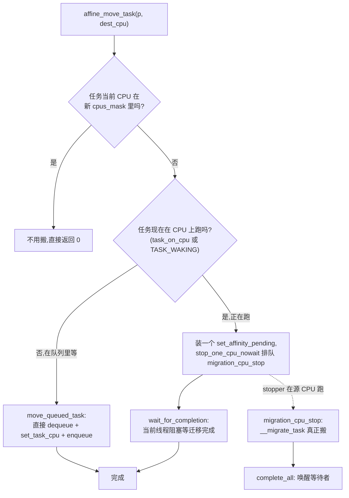
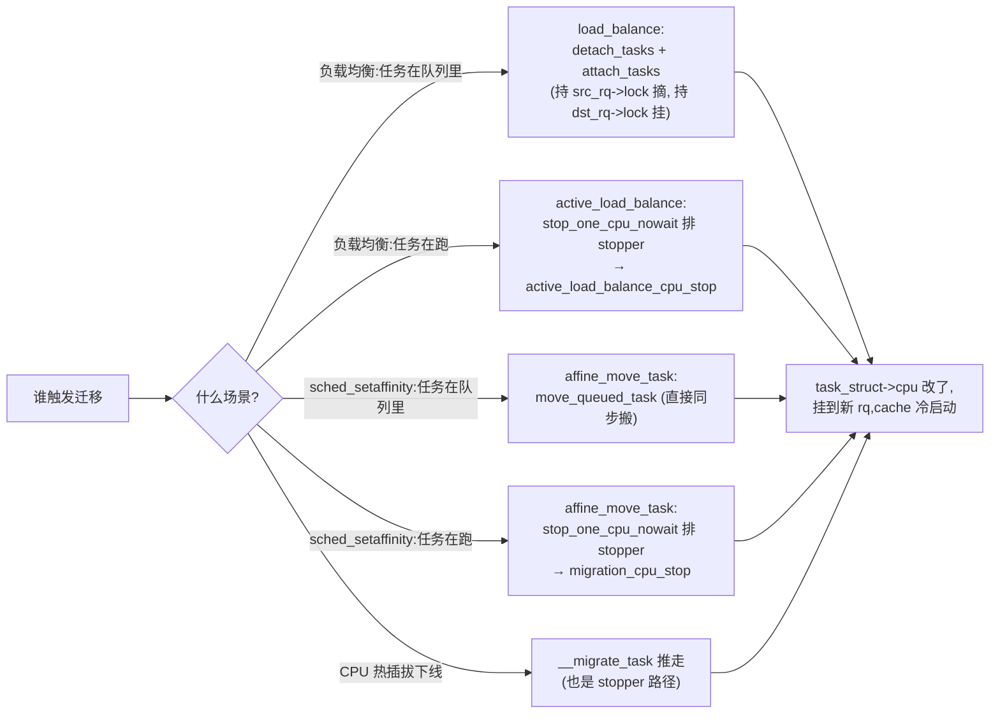

# 第十六章 · 任务迁移与 CPU 亲和

> 篇:第 4 篇 · SMP 负载均衡:核间搬任务
> 主线呼应:前两章 P4-14/P4-15 把负载均衡讲完了——什么时候均衡、选谁迁、迁多少。但还有几个问题没回答:**迁移一个任务到底有什么代价?用户怎么限制"这个进程只能在某几个核上跑"(CPU 亲和)?把任务从一个核搬到另一个核,中间不能丢、不能在两个核上同时跑,这是怎么做到的?CPU 热插拔、cpuset cgroup 改亲和时,正在跑的任务怎么被"推"走?** 本章钻进 [`kernel/sched/core.c`](../linux/kernel/sched/core.c) 的 `set_cpus_allowed_ptr`、`affine_move_task`、`migration_cpu_stop` 和 [`stop_task.c`](../linux/kernel/sched/stop_task.c) 的 `stop_sched_class`,把"任务迁移与 CPU 亲和"这块讲透,第 4 篇 SMP 负载均衡收尾。

## 核心问题

**任务从一个 CPU 搬到另一个 CPU 不是免费的——cache 要重新预热、内存可能要跨 NUMA 访问;而且迁移过程必须原子(不能丢、不能双跑)。内核怎么:(1) 让用户限制任务的 CPU 亲和(`sched_setaffinity`/`cpuset`)?(2) 在不持双锁的前提下安全地搬一个正在跑的任务?(3) 为什么搬任务要用一个特殊调度类 `stop_sched_class` 的 migration 线程?**

读完本章你会明白:

1. 迁移的真实代价:cache 冷、TLB 刷新、NUMA 距离;`task_hot`/`cache_nice_tries` 不是装样子。
2. CPU 亲和的数据结构:`task_struct->cpus_mask`/`cpus_ptr`/`user_cpus_ptr`,以及 `sched_setaffinity` syscall → `set_cpus_allowed_ptr` → `__set_cpus_allowed_ptr_locked` 的链路。
3. 迁移的核心技巧:`affine_move_task` + `migration_cpu_stop` + `set_affinity_pending`,用 `stop_one_cpu_nowait` 把"搬正在跑的任务"翻译成"在目标 CPU 上的特权 stopper 任务"。
4. 为什么 migration 线程必须是 `stop_sched_class`(最高优先级):它要能抢占任何任务,保证迁移一定发生。
5. `migrate_disable`/`migrate_enable`:RT-Linux 让任务在临界区里暂时禁迁,保护 per-CPU 数据。

---

## 16.1 一句话点破

> **迁移一个任务=改它归属的 CPU 记账(`task_struct->cpu`)+ 把它从源 rq 摘下挂到目标 rq;难就难在"任务可能正在跑",普通 pull 模型拉不动它。内核用 stopper 这个特权通道:把"搬任务"翻译成"在源 CPU 上排队一个最高优先级的 migration 线程",它一来就抢占当前任务,在自己的上下文里把任务摘下来,完成迁移。**

这是结论,不是理由。本章倒过来拆:先看迁移代价,再看亲和数据结构和 `sched_setaffinity`,然后看迁移的三种场景与核心函数,最后看 `stop_sched_class` 的特殊性。

---

## 16.2 迁移的真实代价:为什么不能随便搬

把一个任务从 CPU A 搬到 CPU B,看似只是改个字段、调两个队列的链表,但硬件层面的代价不小:

```
 任务 T 在 CPU A 上跑了一阵,工作集热在 A 的 cache 上:

   CPU A                                    CPU B
   ┌──────────────┐                         ┌──────────────┐
   │ L1 d/i: HOT  │                         │ L1 d/i: 冷    │
   │ L2:     HOT  │                         │ L2:     冷    │
   │ LLC:    HOT  │  ─── 搬 T 到 B ───►      │ LLC:    (A与B 共享则 OK) │
   │ TLB:    HOT  │                         │ TLB:    冷    │
   └──────────────┘                         └──────────────┘

   T 在 B 上跑的前 N 微秒,几乎每条访存都 miss:
     - L1/L2 全冷:工作集要重新加载(几百 ns~几 μs)
     - 如果 A、B 不共享 LLC:LLC 也冷(几 μs~几十 μs 重建)
     - TLB 全冷:页表要重新走(数百 ns/页)
     - 如果 A、B 跨 NUMA:T 的私有数据还在远程 DRAM,访问慢 1.5~2 倍
```

这就是为什么 P4-15 的 `task_hot` 判断"距上次执行 < 500μs"就拒绝迁——T 的工作集还热着,搬过去 cache 全冷,接下来重建 cache 的时间可能比均衡省下来的 CPU 时间还长。`sysctl_sched_migration_cost = 500000`(ns,见 [fair.c:79](../linux/kernel/sched/fair.c#L79))就是基于这个经验值。

但代价不止 cache。还有**迁移过程的同步代价**——必须保证 T 在迁移期间不会被别的 CPU 选上、不会被丢失唤醒、不会在两个核上同时跑。这部分由 `TASK_ON_RQ_MIGRATING` 状态(见 P4-15)和本章的 `affine_move_task` 保证。

> **钉死这件事**:迁移不是免费的。Linux 用三层机制把代价控制住:① 拓扑分层(`sched_domain`)让均衡优先在同 LLC 内做,代价最小;② `task_hot`/`cache_nice_tries` 拦下 cache 热任务的迁移;③ `TASK_ON_RQ_MIGRATING` + stopper 保证迁移过程的正确性。

---

## 16.3 CPU 亲和的数据结构

每个 `task_struct` 有几个和 CPU 亲和相关的字段(`include/linux/sched.h`):

- **`cpus_mask`**:任务的**允许 CPU 掩码**——这是个 `cpumask_t` 结构,位图每一位代表一个 CPU,置位表示允许跑。这是"持久"的亲和设置,`sched_setaffinity` 改的就是它。
- **`cpus_ptr`**:指向**当前生效**的掩码。正常情况下指向 `cpus_mask`,但 `migrate_disable` 时会被临时改成单个 CPU(`task_cpu(p)`),`migrate_enable` 再改回来。这样 `cpus_ptr` 既能表示"持久亲和",也能表示"临时被钉"。
- **`user_cpus_ptr`**:用户通过 `sched_setaffinity` 设的掩码指针。和 `cpus_mask` 的区别是,`cpuset` cgroup 等机制可能进一步收窄 `cpus_mask`(取 `user_cpus_ptr ∩ cpuset.cpus`),`user_cpus_ptr` 保存原始的用户意图,以便 cgroup 解除时恢复。
- **`nr_cpus_allowed`**:`cpus_mask` 里置位的 CPU 数,缓存值避免每次 `cpumask_weight`。

判定的入口是 [`is_cpu_allowed`](../linux/kernel/sched/core.c#L2475-L2499)([core.c:2475](../linux/kernel/sched/core.c#L2475)):

```c
/* kernel/sched/core.c:2475 */
static inline bool is_cpu_allowed(struct task_struct *p, int cpu)
{
    /* 不在 cpus_ptr 里,直接不行 */
    if (!cpumask_test_cpu(cpu, p->cpus_ptr))
        return false;

    /* migrate_disabled 的任务:只要是 online CPU 就行(它必须能跑完临界区) */
    if (is_migration_disabled(p))
        return cpu_online(cpu);

    /* 非内核线程:必须 active(热插拔中可 online 但不 active) */
    if (!(p->flags & PF_KTHREAD))
        return cpu_active(cpu) && task_cpu_possible(cpu, p);

    /* per-CPU 内核线程(如 kworker/N):只要 online */
    if (kthread_is_per_cpu(p))
        return cpu_online(cpu);

    /* 普通内核线程:online 时允许,dying 时不允许(热插拔下线时被赶走) */
    if (cpu_dying(cpu))
        return false;
    return cpu_online(cpu);
}
```

注意这个函数把"在不在 cpus_ptr"+"CPU 状态(online/active/dying)"+"任务类型(用户/per-CPU kthread/普通 kthread)"三者结合起来——亲和只是基础约束,热插拔状态也会进一步限制。

---

## 16.4 `sched_setaffinity`:用户怎么改亲和

用户态改亲和的 syscall 是 `sched_setaffinity(pid, len, mask)`,定义在 [`core.c:8482`](../linux/kernel/sched/core.c#L8482)([core.c:8482](../linux/kernel/sched/core.c#L8482))。它经过几层包装:

```
SYSCALL_DEFINE3(sched_setaffinity)        core.c:8482
  └► sched_setaffinity(pid, in_mask)      core.c:8417
       └► __sched_setaffinity(p, &ac)     core.c:8356
            └► __set_cpus_allowed_ptr(p, &ac)   core.c:3202
                 └► __set_cpus_allowed_ptr_locked(p, ctx, rq, rf)  core.c:3114
                      ├► __do_set_cpus_allowed(p, ctx)   /* 改 cpus_mask */
                      └► affine_move_task(rq, p, rf, dest_cpu, flags)  /* 实际迁 */
```

主入口 [`set_cpus_allowed_ptr`](../linux/kernel/sched/core.c#L3221)([core.c:3221](../linux/kernel/sched/core.c#L3221)),内核里其他子系统(cpuset、CPU hotplug、RT 调度类)都调它:

```c
/* kernel/sched/core.c:3221 */
int set_cpus_allowed_ptr(struct task_struct *p, const struct cpumask *new_mask)
{
    struct affinity_context ac = {
        .new_mask  = new_mask,
        .flags     = 0,
    };
    return __set_cpus_allowed_ptr(p, &ac);
}
EXPORT_SYMBOL_GPL(set_cpus_allowed_ptr);
```

真正干活的是 [`__set_cpus_allowed_ptr_locked`](../linux/kernel/sched/core.c#L3114)([core.c:3114](../linux/kernel/sched/core.c#L3114))。简化版:

```c
/* kernel/sched/core.c:3114 (简化) */
static int __set_cpus_allowed_ptr_locked(struct task_struct *p,
                                         struct affinity_context *ctx,
                                         struct rq *rq, struct rq_flags *rf)
{
    const struct cpumask *cpu_valid_mask = cpu_active_mask;
    unsigned int dest_cpu;
    int ret = 0;

    ...

    /* 在 (active ∩ new_mask) 里挑一个目标 CPU,随机分布 */
    dest_cpu = cpumask_any_and_distribute(cpu_valid_mask, ctx->new_mask);
    if (dest_cpu >= nr_cpu_ids) { ret = -EINVAL; goto out; }

    /* 改 cpus_mask / nr_cpus_allowed */
    __do_set_cpus_allowed(p, ctx);

    /* 把任务搬到 dest_cpu(或安排 stopper 来搬) */
    return affine_move_task(rq, p, rf, dest_cpu, ctx->flags);

out:
    task_rq_unlock(rq, p, rf);
    return ret;
}
```

注意 `cpumask_any_and_distribute` ——**随机选一个**(不是固定选第一个),注释说"在 cpuset 给一组任务改亲和时,随机分布能避免立即需要 load_balance"。这是个很小的技巧,但能省一次均衡。

`__do_set_cpus_allowed` 通过 `set_cpus_allowed_common`([core.c:2736](../linux/kernel/sched/core.c#L2736))实际改掩码:

```c
/* kernel/sched/core.c:2736 */
void set_cpus_allowed_common(struct task_struct *p, struct affinity_context *ctx)
{
    if (ctx->flags & (SCA_MIGRATE_ENABLE | SCA_MIGRATE_DISABLE)) {
        p->cpus_ptr = ctx->new_mask;          /* migrate_disable/enable 只改 cpus_ptr */
        return;
    }
    cpumask_copy(&p->cpus_mask, ctx->new_mask);            /* 持久掩码 */
    p->nr_cpus_allowed = cpumask_weight(ctx->new_mask);
    if (ctx->flags & SCA_USER)
        swap(p->user_cpus_ptr, ctx->user_mask);
}
```

注意 `cpus_ptr` 和 `cpus_mask` 的区分在这里体现得最清楚:`migrate_disable` 只改 `cpus_ptr`(临时钉住),不动 `cpus_mask`(持久亲和);用户 `sched_setaffinity` 改 `cpus_mask`。

---

## 16.5 `affine_move_task`:把任务搬到目标 CPU 的核心函数

真正决定"怎么搬"的是 [`affine_move_task`](../linux/kernel/sched/core.c#L2967)([core.c:2967](../linux/kernel/sched/core.c#L2967))。它分三种情况:



核心代码([core.c:2967](../linux/kernel/sched/core.c#L2967),简化):

```c
/* kernel/sched/core.c:2967 (简化) */
static int affine_move_task(struct rq *rq, struct task_struct *p, struct rq_flags *rf,
                            int dest_cpu, unsigned int flags)
{
    struct set_affinity_pending my_pending = { }, *pending = NULL;
    bool stop_pending, complete = false;

    /* 情况一:任务当前 CPU 还在新 cpus_mask 里,不用搬 */
    if (cpumask_test_cpu(task_cpu(p), &p->cpus_mask)) {
        ...
        return 0;
    }

    /* 情况二/三都走到这:任务的当前 CPU 不在新掩码里,必须搬 */

    if (!(flags & SCA_MIGRATE_ENABLE)) {
        /* 装一个 pending(如果还没有),作为迁移的"凭证" */
        if (!p->migration_pending) {
            refcount_set(&my_pending.refs, 1);
            init_completion(&my_pending.done);
            my_pending.arg = (struct migration_arg) {
                .task = p, .dest_cpu = dest_cpu, .pending = &my_pending,
            };
            p->migration_pending = &my_pending;
        }
        ...
    }
    pending = p->migration_pending;

    if (task_on_cpu(rq, p) || READ_ONCE(p->__state) == TASK_WAKING) {
        /* 情况三:任务正在跑(或正被唤醒),普通搬不动,排 stopper */
        ...
        stop_one_cpu_nowait(cpu_of(rq), migration_cpu_stop,
                            &pending->arg, &pending->stop_work);
        ...
    } else {
        /* 情况二:任务在队列里等,直接搬 */
        if (!is_migration_disabled(p)) {
            if (task_on_rq_queued(p))
                rq = move_queued_task(rq, rf, p, dest_cpu);
            ...
        }
        task_rq_unlock(rq, p, rf);
        if (complete) complete_all(&pending->done);
    }

    wait_for_completion(&pending->done);  /* 阻塞等迁移真正完成 */
    ...
    return 0;
}
```

注意三个细节:

1. **情况二(`move_queued_task`)是同步的**——任务在队列里(没在跑),直接 `deactivate_task` + `set_task_cpu` + `activate_task`([core.c:2520](../linux/kernel/sched/core.c#L2520))。这是最快的路径,因为任务没占 CPU,直接改归属就行。
2. **情况三必须用 stopper**——任务正在 CPU 上执行,你没法从外部把它"摘下来",必须让那个 CPU 自己来。`stop_one_cpu_nowait` 给目标 CPU 排一个 `migration_cpu_stop` 任务,等那个 CPU 调度时跑它。
3. **`wait_for_completion`**——发起 `sched_setaffinity` 的线程会阻塞,直到迁移真正完成。这是个同步接口。`set_affinity_pending` + `complete_all` 是发起者和 stopper 之间的握手。

---

## 16.6 `migration_cpu_stop`:在源 CPU 上真正执行迁移

[`migration_cpu_stop`](../linux/kernel/sched/core.c#L2583)([core.c:2583](../linux/kernel/sched/core.c#L2583))是 stopper 线程上跑的函数。它在**源 CPU 自己的上下文**里执行,持 `rq->lock`,调 [`__migrate_task`](../linux/kernel/sched/core.c#L2566)([core.c:2566](../linux/kernel/sched/core.c#L2566)) → `move_queued_task`,把任务搬到 `dest_cpu`:

```c
/* kernel/sched/core.c:2583 (简化) */
static int migration_cpu_stop(void *data)
{
    struct migration_arg *arg = data;
    struct set_affinity_pending *pending = arg->pending;
    struct task_struct *p = arg->task;
    struct rq *rq = this_rq();
    bool complete = false;
    struct rq_flags rf;

    local_irq_save(rf.flags);
    flush_smp_call_function_queue();          /* 先把挂着的 IPI 函数跑完 */

    raw_spin_lock(&p->pi_lock);
    rq_lock(rq, &rf);

    if (task_rq(p) == rq) {                    /* 任务还在本 CPU? */
        if (is_migration_disabled(p)) goto out;

        if (pending) {
            p->migration_pending = NULL;
            complete = true;
            if (cpumask_test_cpu(task_cpu(p), &p->cpus_mask))
                goto out;                      /* 已经在合法 CPU 上 */
        }

        if (task_on_rq_queued(p)) {
            update_rq_clock(rq);
            rq = __migrate_task(rq, &rf, p, arg->dest_cpu);  /* 真正搬 */
        } else {
            p->wake_cpu = arg->dest_cpu;       /* 睡着的任务改 wake_cpu */
        }
    } else if (pending) {
        ...
    }

    ...
    if (complete) complete_all(&pending->done);  /* 唤醒发起者 */
    ...
}
```

为什么 stopper 函数要持 `rq->lock`、`p->pi_lock`?因为迁移要修改任务的归属和队列,这是持锁操作。`migration_cpu_stop` 跑在最高优先级的 stopper 上,但持锁规则不变。

`__migrate_task` 本身极其简单([core.c:2566](../linux/kernel/sched/core.c#L2566)):

```c
/* kernel/sched/core.c:2566 */
static struct rq *__migrate_task(struct rq *rq, struct rq_flags *rf,
                                 struct task_struct *p, int dest_cpu)
{
    if (!is_cpu_allowed(p, dest_cpu))         /* 亲和又被改了?放弃 */
        return rq;
    rq = move_queued_task(rq, rf, p, dest_cpu);
    return rq;
}
```

`move_queued_task`([core.c:2520](../linux/kernel/sched/core.c#L2520))是迁移的最底层操作:

```c
/* kernel/sched/core.c:2520 */
static struct rq *move_queued_task(struct rq *rq, struct rq_flags *rf,
                                   struct task_struct *p, int new_cpu)
{
    lockdep_assert_rq_held(rq);

    deactivate_task(rq, p, DEQUEUE_NOCLOCK);   /* 从旧 rq 摘下 */
    set_task_cpu(p, new_cpu);                   /* 改 task_struct->cpu */
    rq_unlock(rq, rf);

    rq = cpu_rq(new_cpu);
    rq_lock(rq, rf);
    WARN_ON_ONCE(task_cpu(p) != new_cpu);
    activate_task(rq, p, 0);                    /* 挂到新 rq */
    wakeup_preempt(rq, p, 0);                   /* 必要时设 TIF_NEED_RESCHED */
    return rq;
}
```

注意它**也是两段锁**——和 P4-15 的 detach/attach 一样,先摘(持旧锁)、松锁、再挂(持新锁)。中间的"任务不在任何 rq 上"由 `TASK_ON_RQ_MIGRATING` 保护(在 `deactivate_task` 里设置,见 P4-15)。这是同一个机制的两处使用,确认了"`TASK_ON_RQ_MIGRATING` 状态机替代双锁"是调度器迁移路径的通用模式。

---

## 16.7 为什么 migration 线程必须是 `stop_sched_class`

这一章的标题技巧——为什么搬任务要用 `stop_sched_class` 的 migration 线程,而不是普通的内核线程或工作队列?

`stop_sched_class` 是 Linux 调度类里**最高优先级**的类(优先级高于 deadline、RT、fair、idle),定义在 [`stop_task.c:106`](../linux/kernel/sched/stop_task.c#L106)([stop_task.c:106](../linux/kernel/sched/stop_task.c#L106))。文件开头的注释把它的地位说得很直白:

```c
/* stop_task.c:1-9 (节选) */
/*
 * stop-task scheduling class.
 *
 * The stop task is the highest priority task in the system, it preempts
 * everything and will be preempted by nothing.
 *
 * See kernel/stop_machine.c
 */
```

它的 `pick_next_task_stop` 只看 `rq->stop`(每个 CPU 一个 stopper 任务):

```c
/* stop_task.c:36 */
static struct task_struct *pick_task_stop(struct rq *rq)
{
    if (!sched_stop_runnable(rq))
        return NULL;
    return rq->stop;
}
```

只要 `rq->stop` 上有排队的 stopper 工作,它就胜出——不管当前跑的是 deadline、RT 还是普通任务。注释甚至说 "we're never preempted"([stop_task.c:28](../linux/kernel/sched/stop_task.c#L28))。

> **不这样会怎样**:假设用普通内核线程(比如 fair 调度类)来搬任务。这个线程要等当前任务时间片用完才能跑——可如果当前任务是个 CPU 密集的 `SCHED_FIFO` 实时任务,它**永远不让出**;即使普通 fair 任务,也得等到下一个抢占点。这意味着迁移可能要等几毫秒甚至更久。更糟的是,如果系统已经严重过载(正是需要迁移的场景),搬任务的线程自己可能也排不上。

> **所以这样设计**:用 `stop_sched_class`——stopper 一排队,源 CPU 在**下一个调度点**(中断返回、抢占点)立刻选它,把当前任务踢下去。这是"无商量"的抢占。所以 stopper 是内核里"必须立刻发生"的事情的载体:不只是任务迁移,CPU 热插拔、`stop_machine`(全局所有 CPU 同时进入 stopper,做关键的全机操作)、core scheduling 的 cookie 调整都靠它。

每个 CPU 的 stopper 线程叫 `migration/N`,在内核启动时由 `kernel/stop_machine.c` 的 `cpu_stop_init`/`stop_machine_prepare` 创建(本地未 sparse clone 这个文件,描述其作用:用 `kthread_create` + `wake_up_process` 创建一个名为 `migration/N` 的内核线程,绑到对应 CPU,priority 设成 `stop_sched_class`)。`migration_init`([core.c:9888](../linux/kernel/sched/core.c#L9888))在 `early_initcall` 阶段启动这条线:

```c
/* kernel/sched/core.c:9888 */
static int __init migration_init(void)
{
    sched_cpu_starting(smp_processor_id());
    return 0;
}
early_initcall(migration_init);
```

每个 CPU 上线时(`sched_cpu_starting` → `cpu_stop_cpu_parking` 链,在 stop_machine.c),都会启动自己的 `migration/N`。它平时睡,有工作排上来就跑(跑完就睡)。

---

## 16.8 `migrate_disable`/`migrate_enable`:RT-Linux 的临时禁迁

最后一个相关机制——[`migrate_disable`](../linux/kernel/sched/core.c#L2417)([core.c:2417](../linux/kernel/sched/core.c#L2417))。它让一个任务**临时禁止被迁移**(主要用于 RT-Linux 内核,保护 per-CPU 数据):

```c
/* kernel/sched/core.c:2417 */
void migrate_disable(void)
{
    struct task_struct *p = current;

    if (p->migration_disabled) {        /* 嵌套计数 */
        p->migration_disabled++;
        return;
    }

    guard(preempt)();
    this_rq()->nr_pinned++;             /* 告诉均衡器:本 rq 多了一个钉子 */
    p->migration_disabled = 1;
}
EXPORT_SYMBOL_GPL(migrate_disable);
```

它做的事很简单:把 `p->cpus_ptr` 改成只指向当前 CPU(在 `__set_cpus_allowed_ptr` 里通过 `SCA_MIGRATE_DISABLE` 走 `set_cpus_allowed_common` 的特殊路径——见 [core.c:2738](../linux/kernel/sched/core.c#L2738)),并 `nr_pinned++` 让均衡器知道本队列上有"钉住"的任务。

`migrate_enable`([core.c:2432](../linux/kernel/sched/core.c#L2432))是反操作:把 `cpus_ptr` 改回 `cpus_mask`,如果当前 CPU 不在 `cpus_mask` 里(亲和变了),还要触发一次迁移。

> **为什么需要这个**:RT-Linux 在临界区里访问 per-CPU 变量,如果中途被迁到别的 CPU,per-CPU 指针就指向错误的数据。`migrate_disable` 保证临界区内不被迁。注意它**不禁抢占**(和 `preempt_disable` 不同)——任务还能被高优先级 RT 任务抢占,但抢占它的 RT 任务跑完回到它时,它还在原 CPU。这是 RT-Linux 在"允许抢占"和"保护 per-CPU 数据"之间的折中。

---

## 16.9 状态机:迁移的三种路径

把本章讲的几种迁移路径画在一起:



所有路径最终都汇聚到"改 `task_struct->cpu` + 挂到新 rq",差别只在"任务在不在跑"和"谁来执行"。**只要任务在跑,就必须用 stopper 这条特权通道**。

---

## 16.10 技巧精解:stopper 的"无商量抢占"+ 完成等待握手

挑两个最硬核的技巧,讲清"为什么 sound"。

### 技巧一:`stop_one_cpu_nowait` 为什么一定能跑——stopper 是无商量抢占

`stop_one_cpu_nowait(cpu, fn, arg, work)` 给 `cpu` 的 stopper 排一个工作 `fn`。它"一定"会跑,因为:

1. stopper 是 `stop_sched_class`,`pick_next_task` 的优先级遍历里**最先**被检查(在 dl/rt/fair 之前)。
2. 只要 `rq->stop` 有工作排着,`sched_stop_runnable(rq)` 返回真,`pick_task_stop` 立刻返回 `rq->stop`。
3. stopper 一旦被选中,**当前正在跑的任务**被无条件挤下去——`put_prev_task` 把它放回队列,stopper 上 CPU。
4. stopper 跑完 `fn`(如 `migration_cpu_stop`),把工作从队列里取下,然后自己 `schedule()` 退出,让出 CPU 给原任务。

这个"无商量抢占"是 stopper 区别于普通 kthread 的本质。普通 kthread 是 fair 类,要等当前任务时间片;RT 任务甚至能压住它。stopper 没这个问题。

> **反面对比**:如果用工作队列(`workqueue`)来搬任务,工作队列线程是普通 fair 调度,在过载系统上可能很久排不上,迁移迟迟不发生,亲和设置实际上形同虚设。stopper 保证迁移"立刻"发生(下一个调度点),这对亲和约束和热插拔是硬需求。

但"无商量抢占"也有代价——**stopper 一旦跑了,持锁的当前任务被挤下去,这个锁会一直挂着**直到 stopper 让出 CPU、原任务再次被选中。所以 stopper 函数必须**短、不能睡、不能持锁睡**。`migration_cpu_stop` 持的是 `rq->lock`/`pi_lock`(自旋锁,不睡),且操作极简(改字段、链表),很快完成。如果你给 stopper 排一个会睡的函数,内核会报错。

### 技巧二:`set_affinity_pending` + `wait_for_completion` 的跨 CPU 握手

发起 `sched_setaffinity` 的线程(在 CPU A)和真正执行迁移的 stopper(在 CPU B)是两个不同的 CPU 上的两个不同执行上下文。怎么协调?

[`affine_move_task`](../linux/kernel/sched/core.c#L2967) 用了一个 `set_affinity_pending` 结构([core.c:2549](../linux/kernel/sched/core.c#L2549))作为握手凭证:

```c
/* kernel/sched/core.c:2549 */
struct set_affinity_pending {
    refcount_t              refs;        /* 多少个发起者在等 */
    unsigned int            stop_pending;/* stop_work 是否在用 */
    struct completion       done;        /* 完成量 */
    struct cpu_stop_work    stop_work;   /* 排到 stopper 上的工作 */
    struct migration_arg    arg;         /* 传给 migration_cpu_stop 的参数 */
};
```

流程:

1. CPU A 上的发起者在 `affine_move_task` 里**栈上分配** `my_pending`,`init_completion(&my_pending.done)`,挂到 `p->migration_pending`,排 stopper。
2. CPU A 的发起者 `wait_for_completion(&pending->done)` —— **阻塞睡眠**,让出 CPU A。
3. CPU B 的 stopper 跑 `migration_cpu_stop`,搬完任务后 `complete_all(&pending->done)` —— **唤醒**所有等这个 completion 的线程。
4. CPU A 的发起者被唤醒,`wait_for_completion` 返回,函数返回 0,sched_setaffinity syscall 完成。

> **为什么这样设计**:跨 CPU 的同步不能用普通锁(发起者持锁睡,stopper 拿不到锁就死锁)。`completion` 是专门为"等待一次性事件"设计的——`wait_for_completion` 睡,`complete_all` 唤醒,无锁顺序约束。`set_affinity_pending` 用 `refcount` 支持多个发起者同时等(并发改同一任务亲和的情况),用 `pending->arg` 把任务和目标 CPU 传给 stopper。这是内核跨 CPU 协作的典型模式:`per-CPU stopper 干活 + completion 同步 + 状态字段保护中间态`。

> **反面对比**:如果发起者不睡,而是自旋等 stopper 完成——发起者占着 CPU A 自旋,而 stopper 在 CPU B 持 `rq->lock` 搬任务,发起者又可能因为 sched_setaffinity 持 `pi_lock` 没释放......容易死锁。用 `completion` 把发起者睡下去,彻底释放 CPU,让 stopper 安心干活,这是"睡等优于自旋"的典范。

---

## 章末小结

这一章讲完了任务迁移与 CPU 亲和,第 4 篇 SMP 负载均衡收尾。回到二分法,本章服务**机制**面——它是负载均衡机制的"最后一公里":负载均衡(策略)决定"该迁",本章的 `set_cpus_allowed_ptr`/`affine_move_task`/`migration_cpu_stop`(机制)真正把任务搬过去。`stop_sched_class` 的 migration 线程是这套机制的特权通道,它保证"任务在跑"这种硬场景也能迁。

合上第 4 篇三章,你应该能在脑子里放映出 SMP 负载均衡的全过程:

- **拓扑分层**(P4-14):硬件拓扑抽象成 `sched_domain`/`sched_group`,每层有自己的容忍度、间隔、cache 豁免次数。
- **均衡发动机**(P4-15):`load_balance` 在调度域树上一层一层拉任务,pull 模型,`task_hot` 评估代价,`TASK_ON_RQ_MIGRATING` 保证安全。
- **亲和与迁移**(P4-16):`sched_setaffinity` 改 `cpus_mask`,`affine_move_task` 处理"任务在跑"的硬场景,`stop_sched_class` 的 migration 线程无商量抢占完成任务搬运。

### 五个"为什么"清单

1. **迁移一个任务的代价是什么?** cache 全冷(L1/L2/LLC 视拓扑而定)、TLB 刷、NUMA 距离。`task_hot`(< 500μs 视为热)+ `cache_nice_tries` 拦下热任务迁移。
2. **CPU 亲和怎么表示?** `task_struct->cpus_mask`(持久掩码,`sched_setaffinity` 改)、`cpus_ptr`(当前生效指针,`migrate_disable` 临时改)、`user_cpus_ptr`(用户原始意图,被 cpuset 收窄后保留)。判定函数是 `is_cpu_allowed`。
3. **任务在跑时怎么迁?** 普通 pull 拉不动正在执行的任务。内核用 stopper:`stop_one_cpu_nowait` 给源 CPU 排一个 `migration_cpu_stop`,源 CPU 的 migration 线程(`stop_sched_class` 最高优先级)一来就抢占当前任务,在自己的上下文里 `__migrate_task` 完成搬运。发起者用 `completion` 阻塞等完成。
4. **为什么 migration 线程必须用 `stop_sched_class`?** 它必须无商量抢占任何任务(RT、deadline、fair 都得让),保证迁移立刻发生。普通 kthread 是 fair 类,会被压住。代价是 stopper 函数必须短、不睡。
5. **`migrate_disable` 是什么?** RT-Linux 的临时禁迁,把 `cpus_ptr` 改成单个 CPU,保护 per-CPU 数据的临界区。不禁抢占(和 `preempt_disable` 不同),嵌套计数,`migrate_enable` 恢复。

### 想继续深入往哪钻

- 源码:[`core.c`](../linux/kernel/sched/core.c) 的 `set_cpus_allowed_ptr`(3221)、`__set_cpus_allowed_ptr_locked`(3114)、`affine_move_task`(2967)、`migration_cpu_stop`(2583)、`__migrate_task`(2566)、`move_queued_task`(2520)、`set_task_cpu`(3348)、`is_cpu_allowed`(2475)、`migrate_disable`(2417)/`migrate_enable`(2432)、`sched_init_smp`(9863)、`migration_init`(9888);[`stop_task.c`](../linux/kernel/sched/stop_task.c) 全文(130 行,极短);`kernel/stop_machine.c`(本地未拉,描述其作用:创建 `migration/N` 线程、实现 `stop_one_cpu_nowait`/`stop_machine`)。
- 观测:`taskset -p <pid>` 看亲和、`taskset -pc 0,2 <pid>` 改亲和;`cat /proc/<pid>/status | grep Cpus_allowed`;`trace-cmd record -e sched:sched_migrate_task`(看迁移事件);`perf sched` 看迁移热点。
- cgroup:`cpuset.cpus` 改一组任务的亲和(底层走 `set_cpus_allowed_ptr`)。

### 引出下一篇

第 4 篇 SMP 负载均衡讲完了。到这里,普通任务(`SCHED_NORMAL`/EEVDF)的调度全貌——任务表示、运行队列、EEVDF 选下一个、抢占切换、多核均衡——已经完整。但还有一类任务我们没讲:**实时任务**。`SCHED_FIFO`/`SCHED_RR` 按 prio 绝对抢占普通任务,`rt_rq` 用位图 O(1) 选最高优先级;如果失控 RT 进程 100% 占 CPU,整机能挂死,所以有 RT throttling(默认 95% 上限)。下一章 P5-17,我们钻进 [`kernel/sched/rt.c`](../linux/kernel/sched/rt.c) 的 RT 实时调度,正式进入第 5 篇:实时与特殊调度类。
