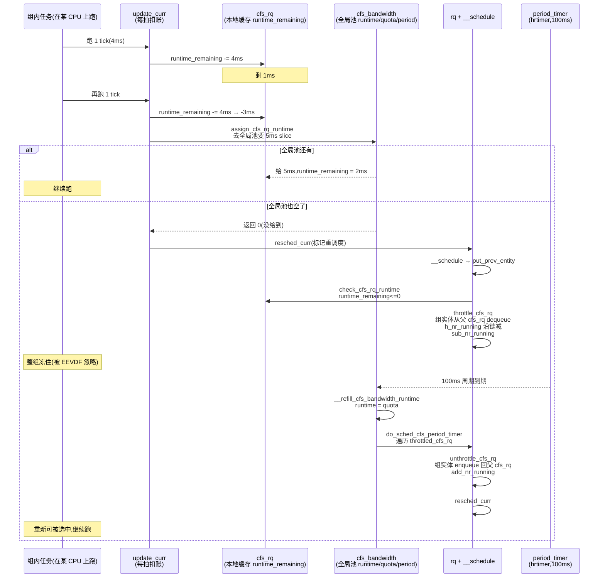

# 第十九章 · cgroup cpu:组调度与 bandwidth 限额

> 篇:第 6 篇 · cgroup 与调度进阶
> 主线呼应:前面 18 章,我们一直在"扁平"的世界里看调度——一组任务挂在每 CPU 一个的 `cfs_rq` 上,EEVDF 按权重算 lag/deadline 选下一个。但真实服务器里你绝不会把所有任务一视同仁:数据库容器该拿多少 CPU、批处理作业该让让交互式进程、一个跑失控的压测脚本不能把整机拖垮。cgroup 的 `cpu` 子系统就是干这件事的——它把任务**分组**,让一组任务在更大的调度框架里作为一个整体被公平地对待、被限额地管住。这一章讲清两件事:①**组调度(group scheduling)**,组本身也是一个 `sched_entity`,公平算法天然地在"任务 vs 任务"和"组 vs 组"之间复用同一套 EEVDF 数学;②**bandwidth 限额**,`cpu.max` 的 period/quota 配额,一个组在一个周期里跑超了配额就被 **throttle**(整组冻住),下个周期再放出来。这是机制层在"限额"这一面的终极形态。

## 核心问题

**怎么把任务分组管,让一组任务作为一个整体拿走固定比例的 CPU、甚至被硬性上限冻住?组调度为什么能几乎零代价复用 EEVDF 的同一套代码?bandwidth throttle 的 period/quota 是怎么定时把超额组冻住、又在周期边界精确放出来的?**

读完本章你会明白:

1. **组调度的本质**:一个 `task_group` 在每个 CPU 上都有一个 `sched_entity`(充当"组实体")和一个子 `cfs_rq`(挂这个组的任务),组实体挂进父 `cfs_rq`,公平算法在树的每一层各跑一遍 EEVDF——"组 vs 组"和"任务 vs 任务"用**同一份** `pick_next_entity`。
2. **cpu.weight 怎么影响分配**:`shares` 字段就是组实体的权重,改 `cpu.weight` 实际是改挂在每个 CPU 上的那个组 `sched_entity` 的 `load.weight`,通过 `reweight_entity` 沿层级上推。
3. **bandwidth 的 period/quota 模型**:每个 `task_group` 一个 [`struct cfs_bandwidth`](../linux/kernel/sched/sched.h#L352),配 `period`(周期,默认 100ms)/`quota`(配额,设成 `max` 表示不限)/`runtime`(本周期剩余)。任务每跑一点时间,`__account_cfs_rq_runtime` 从 `runtime_remaining` 里扣;扣到 0 就 [`throttle_cfs_rq`](../linux/kernel/sched/fair.c#L5756) 把整组冻住。
4. **throttle 的层级传播**:冻一个组 `cfs_rq`,等于把这个组的组实体从父 `cfs_rq` 里 dequeue 掉,父层 EEVDF 自然不会再选中它——`h_nr_running` 沿树减回去,`rq->nr_running` 在根减掉,整组在调度器眼里"消失"到下个周期。
5. **period_timer 的精确放行**:[`sched_cfs_period_timer`](../linux/kernel/sched/fair.c#L6335) 用 `hrtimer` 在周期到期时 [`__refill_cfs_bandwidth_runtime`](../linux/kernel/sched/core.c) 重灌配额、遍历 `throttled_cfs_rq` 链表逐个 [`unthrottle_cfs_rq`](../linux/kernel/sched/fair.c#L5845) 把组重新挂回去。

---

## 19.1 一句话点破

> **组调度让一组任务作为一个整体参与公平分配,靠的是把"组"也做成一个 sched_entity、挂进父 cfs_rq——EEVDF 在树的非叶层和叶层跑的是同一份代码;bandwidth 限额是"硬上限",靠每周期一笔配额扣到 0 就把整组冻住、周期边界 hrtimer 精确放行,是组调度之上的一层限额机制。**

这是结论,不是理由。本章倒过来拆:先讲组调度为什么"天然"——它复用了什么已有的结构;再讲 bandwidth 的三件套(period/quota/runtime)怎么在 `update_curr` 的每拍里扣账;然后看 throttle 怎么沿层级传播;最后看 period_timer 怎么在周期边界放行。

---

## 19.2 痛点:没有组调度会怎样

先把"为什么需要组调度"讲透,不然后面所有结构都显得多此一举。

设想一台 8 核机器,32 个 CPU 密集型任务。朴素地看,EEVDF 把 8 核的时间片在 32 个任务间公平分配,每个任务拿 25% CPU——这很公平。但真实场景里这 32 个任务常常**分属不同租户**:

- 租户 A 起了 30 个任务(它人多/线程多);
- 租户 B 只起了 2 个任务。

EEVDF 在扁平视角下看的是"32 个 sched_entity 每个一份"——租户 A 拿走 30/32 ≈ 94% 的机器,租户 B 拿 2/32 ≈ 6%。一个租户靠"多 fork 几个进程"就能霸占整机,这不叫公平,这叫 fork 炸弹赢。

> **不这样会怎样**:没有组调度,任务数即话语权——谁开的进程多谁就多吃 CPU。一个失控的批处理脚本 fork 出几千个 worker,你的 SSH 都连不上;云上多租户混部根本不可能;`nice`/`renice` 在数量级碾压面前形同虚设(几百个 nice +19 的任务照样淹死几个 nice 0 的交互任务)。这是共享机器最古老的痛点。

组调度的解法:**把任务分组,公平算法在组的层面先分一轮,组内再分一轮**。租户 A 的 30 个任务先作为一个"租户 A 组"在顶层拿走它该有的份额(比如和租户 B 各占 50%),组内 30 个任务再分这 50%。这样租户 A fork 多 fork 少,**它在租户层面拿的份额不变**(由组的权重决定),fork 炸弹失效。这是组调度的全部动机。

> **钉死这件事**:组调度的本质不是"管住单个任务",而是"管住一组任务的总份额"。它把"任务数即话语权"的扁平公平,升级成"组 vs 组按权重分、组内再公平分"的层级公平。fork 炸弹在组调度面前失效——组拿多少由组的权重定,和组里塞多少任务无关。

---

## 19.3 组调度的结构:task_group + 每组一个 sched_entity + 一个子 cfs_rq

现在看怎么实现"组作为一个整体参与公平"。Linux 的答案是**零结构创新地复用 `sched_entity`**:一个组在某个 CPU 上,既是父 `cfs_rq` 里的一个 `sched_entity`(被父层 EEVDF 挑选),自己也挂着一个子 `cfs_rq`(装这个组在这颗 CPU 上的任务)。

### 数据结构:task_group 的 per-CPU 双数组

[`struct task_group`](../linux/kernel/sched/sched.h#L379)([sched.h:379](../linux/kernel/sched/sched.h#L379))是 cgroup 里一个 cpu 子目录在内核里的化身。最关键的两个字段是**每 CPU 一个**的数组:

```c
/* sched.h:379 起的 task_group(节选) */
struct task_group {
    struct cgroup_subsys_state css;       /* cgroup 子系统标准头 */

#ifdef CONFIG_FAIR_GROUP_SCHED
    /* schedulable entities of this group on each CPU */
    struct sched_entity **se;             /* tg->se[cpu]:本组的"组实体",挂进父 cfs_rq */
    /* runqueue "owned" by this group on each CPU */
    struct cfs_rq        **cfs_rq;        /* tg->cfs_rq[cpu]:本组在这 CPU 上的子队列 */
    unsigned long         shares;         /* 组的权重(对应 cpu.weight) */
    int                   idle;           /* SCHED_IDLE 组标志 */
    ...
#endif
    struct task_group *parent;
    struct list_head   siblings;
    struct list_head   children;
    struct cfs_bandwidth cfs_bandwidth;   /* period/quota 配额,见 19.5 */
    ...
};
```

(`tg->se[cpu]` 和 `tg->cfs_rq[cpu]` 是指针数组,每颗 CPU 各一份。`se` 数组的每个元素是一个 `struct sched_entity`,和挂任务的 `task_struct->se` **是完全相同的结构体**——这正是组调度能复用 EEVDF 的关键。)

画成一张图,一台 2 核机器上有一个根组(root_task_group)、一个租户组 `/tenantA`(里面 2 个任务),结构是这样:

```
 CPU 0 的 cfs_rq 层级(组调度,简化):

  root cfs_rq (CPU0)  ← 根组在 CPU0 的子队列,挂在 rq->cfs
   │
   ├── sched_entity: task T1        (叶:一个任务)
   │
   └── sched_entity: tg/tenantA[0]  (非叶:租户组在 CPU0 的"组实体")
         │
         └── 子 cfs_rq: tg/tenantA->cfs_rq[0]   ← 这个组在这 CPU 上的私有队列
               │
               ├── sched_entity: task T2        (叶:租户 A 的任务)
               └── sched_entity: task T3        (叶:租户 A 的任务)

  CPU 1 的 cfs_rq 层级同构(另一份 tg->se[1]/tg->cfs_rq[1])
```

> **钉死这件事**:`task_group` 在每颗 CPU 上各有一个 `sched_entity`(挂进父 `cfs_rq`)和一个子 `cfs_rq`(装自己的任务)。组实体和任务实体是**同一种结构体**(`sched_entity`)——这就是组调度"零结构创新"的全部魔法。一个 `sched_entity` 到底是任务还是组,靠 [`entity_is_task(se)`](../linux/kernel/sched/sched.h)(检查它是不是嵌在 `task_struct` 里,用 `container_of`)区分。

### 选下一个:EEVDF 在树的每一层各跑一遍

选下一个跑谁,变成了**自顶向下逐层 EEVDF**:

1. `pick_next_task_fair` 从根 `cfs_rq` 出发;
2. 在根 `cfs_rq` 里跑 [`pick_eevdf`](../linux/kernel/sched/fair.c#L884),选最早 deadline 的 entity;
3. 如果选中的是任务(叶),直接返回;如果选中的是组实体(非叶),`se = pick_next_entity(cfs_rq_of(se))` 下钻进它的子 `cfs_rq`,再跑一遍 EEVDF;
4. 重复直到选到任务。

这就是为什么 [`pick_next_task_fair`](../linux/kernel/sched/fair.c) 里有那个 `do { ... } while (cfs_rq != root)` 的循环——它在树的每一层各调一次 `pick_next_entity`。EEVDF 的 `entity_eligible`/`avg_vruntime`/`pick_eevdf`(第 7 章)在每层各跑一遍,**完全没有"组 vs 任务"的特判**。

> **反面对比**:如果不用"组实体也是 sched_entity"这套设计,而是给组单独搞一套结构(`struct group_sched_entity` 之类),那 `enqueue_task`/`dequeue_task`/`pick_next`/`update_curr`/`task_tick` 全都得各写一份"组版"和"任务版",`switch` 散得到处都是。Linux 的做法是**用嵌入 + `container_of` 把"是任务还是组"的差别折叠进同一个结构体**——第 2 章讲的 `sched_entity` 多态,在组调度这里是它最大的回本。这是"用结构设计消灭 switch"的又一典范。

### shares:组实体的权重

组的权重 `shares`(对应 cgroup 的 `cpu.weight`)决定组实体在父 `cfs_rq` 里和别的实体(其他组、根组下的任务)怎么分 CPU。默认 `ROOT_TASK_GROUP_LOAD`(= `NICE_0_LOAD` = 1024,见 [sched.h:434](../linux/kernel/sched/sched.h#L434))。设 `cpu.weight` 改的是 `tg->shares`,然后沿每颗 CPU 把组实体的 `load.weight` 重算:

```c
/* fair.c:12971 __sched_group_set_shares(简化) */
static int __sched_group_set_shares(struct task_group *tg, unsigned long shares)
{
    ...
    shares = clamp(shares, scale_load(MIN_SHARES), scale_load(MAX_SHARES));  /* 2..2^18 */
    tg->shares = shares;
    for_each_possible_cpu(i) {
        struct rq *rq = cpu_rq(i);
        struct sched_entity *se = tg->se[i];        /* 本 CPU 上的那个组实体 */
        rq_lock_irqsave(rq, &rf);
        update_rq_clock(rq);
        for_each_sched_entity(se) {                 /* 沿父链向上 */
            update_load_avg(cfs_rq_of(se), se, UPDATE_TG);
            update_cfs_group(se);                   /* 重算这个 se 的 shares→weight */
        }
        rq_unlock_irqrestore(rq, &rf);
    }
    return 0;
}
```

([fair.c:12971](../linux/kernel/sched/fair.c#L12971) `__sched_group_set_shares`,[fair.c:13007](../linux/kernel/sched/fair.c#L13007) `sched_group_set_shares` 外层加 `shares_mutex` 锁。)

`update_cfs_group(se)` 会根据子 `cfs_rq` 的负载占组总负载的比例,把 `tg->shares` 按比例分摊到这个 `se` 的 `load.weight` 上(一组在多 CPU 上跑,shares 不是简单平分,而是按"这个 CPU 上组里有多少负载"加权)。这是为什么 `cpu.weight 100` 不等于"本组在每颗 CPU 上各占 100/NICE_0_LOAD"——它在每颗 CPU 上的实际权重看子队列负载动态算。

---

## 19.4 bandwidth 限额:period/quota/runtime 的三件套

组调度解决了"按权重分",但它**只调比例,不设上限**——一个高权重组如果一直有活干,它就按权重一直拿。云上、容器、SLA 场景里,你常常需要的是**硬上限**:"这个容器最多拿 1 个 CPU,超了就冻住,别管它权重多高"。这就是 **bandwidth 限额**。

### 三件套:period / quota / runtime

[`struct cfs_bandwidth`](../linux/kernel/sched/sched.h#L352)([sched.h:352](../linux/kernel/sched/sched.h#L352))是限额的全部状态:

```c
/* sched.h:352 起的 cfs_bandwidth(节选) */
struct cfs_bandwidth {
    raw_spinlock_t   lock;
    ktime_t          period;           /* 周期,默认 100ms */
    u64              quota;            /* 配额:本组每 period 最多跑多久;RUNTIME_INF = 不限 */
    u64              runtime;          /* 本周期全局池里还剩多少 */
    u64              burst;            /* 允许借用之前攒下的额度(burst) */
    u8               idle;             /* 本周期这个组是否完全没跑过 */
    u8               period_active;    /* period_timer 是否在跑 */
    struct hrtimer   period_timer;     /* 周期到期定时器:重灌 runtime + 放行 throttle */
    struct hrtimer   slack_timer;      /* slack 定时器:把闲置配额回收重分配 */
    struct list_head throttled_cfs_rq; /* 被冻住的子 cfs_rq 链表 */
    /* 统计:nr_periods / nr_throttled / throttled_time ... */
};
```

用户写 `echo "100000 50000" > cpu.max` 表示 `quota=50ms, period=100ms`(即本组最多用半个 CPU)。`echo "max 100000"` 表示不限(`quota = RUNTIME_INF`)。这两个值在 [`cpu_max_write`](../linux/kernel/sched/core.c#L11400)([core.c:11400](../linux/kernel/sched/core.c#L11400))里解析,最终调 [`tg_set_cfs_bandwidth`](../linux/kernel/sched/core.c#L10809)([core.c:10809](../linux/kernel/sched/core.c#L10809)):

```c
/* core.c:10809 tg_set_cfs_bandwidth(简化) */
static int tg_set_cfs_bandwidth(struct task_group *tg, u64 period, u64 quota, u64 burst)
{
    ...
    if (tg == &root_task_group) return -EINVAL;   /* 根组不能限额 */
    if (quota < min_cfs_quota_period || period < min_cfs_quota_period)
        return -EINVAL;                           /* period/quota 下限校验 */
    if (period > max_cfs_quota_period) return -EINVAL;
    ...
    runtime_enabled = quota != RUNTIME_INF;
    ...
    scoped_guard (raw_spinlock_irq, &cfs_b->lock) {
        cfs_b->period = ns_to_ktime(period);
        cfs_b->quota  = quota;
        cfs_b->burst  = burst;
        __refill_cfs_bandwidth_runtime(cfs_b);    /* 把 runtime 灌满到 quota+burst */
        if (runtime_enabled) start_cfs_bandwidth(cfs_b);  /* 起 period_timer */
    }
    for_each_online_cpu(i) {                       /* 每 CPU 的 cfs_rq 同步开关 */
        ...
        cfs_rq->runtime_enabled = runtime_enabled;
        cfs_rq->runtime_remaining = 0;             /* 清掉本地缓存 */
        if (cfs_rq->throttled) unthrottle_cfs_rq(cfs_rq);  /* 改了配置,先放出来 */
    }
    ...
}
```

注意几个关键校验:`min_cfs_quota_period`(1ms)、`max_cfs_quota_period`(1s)——period 太短会让 throttle/unthrottle 抖得太频繁,太长会让"超了一下"惩罚过重;`max_cfs_runtime` 防 quota 溢出。还要过 [`__cfs_schedulable`](../linux/kernel/sched/core.c):**子组配额不能超过父组**(层级一致性,否则限额形同虚设)。

### 每拍扣账:`update_curr` → `__account_cfs_rq_runtime`

bandwidth 怎么"实时"扣?答案藏在 [`update_curr`](../linux/kernel/sched/fair.c#L1162)([fair.c:1162](../linux/kernel/sched/fair.c#L1162))里——这个函数每次 tick、每次入队出队都会被调,精确累加当前 se 实际跑了多少(`delta_exec`)。第 7 章我们看过它做 EEVDF 的 `vruntime += calc_delta_fair`、`update_deadline`,**最后一行**就是 bandwidth 扣账:

```c
/* fair.c:1162 update_curr(完整,EEVDF + bandwidth 同一个函数) */
static void update_curr(struct cfs_rq *cfs_rq)
{
    struct sched_entity *curr = cfs_rq->curr;
    s64 delta_exec;
    if (unlikely(!curr)) return;

    delta_exec = update_curr_se(rq_of(cfs_rq), curr);   /* 算这一拍实际跑了多少 */
    if (unlikely(delta_exec <= 0)) return;

    curr->vruntime += calc_delta_fair(delta_exec, curr); /* EEVDF:加 vruntime */
    update_deadline(cfs_rq, curr);                       /* EEVDF:更新 deadline */
    update_min_vruntime(cfs_rq);

    if (entity_is_task(curr))
        update_curr_task(task_of(curr), delta_exec);

    account_cfs_rq_runtime(cfs_rq, delta_exec);          /* bandwidth:从配额里扣 */
}
```

[`account_cfs_rq_runtime`](../linux/kernel/sched/fair.c#L5671)([fair.c:5671](../linux/kernel/sched/fair.c#L5671))检查这个组的 `cfs_rq->runtime_enabled` 开没开,开了就调 [`__account_cfs_rq_runtime`](../linux/kernel/sched/fair.c#L5653):

```c
/* fair.c:5653 __account_cfs_rq_runtime(简化) */
static void __account_cfs_rq_runtime(struct cfs_rq *cfs_rq, u64 delta_exec)
{
    cfs_rq->runtime_remaining -= delta_exec;   /* 本地账扣掉这一拍 */

    if (likely(cfs_rq->runtime_remaining > 0))
        return;                                /* 还有额度,继续 */

    if (cfs_rq->throttled)
        return;                                /* 已经冻了,别再折腾 */

    /* 本地额度耗尽,去全局池要一点 */
    if (!assign_cfs_rq_runtime(cfs_rq) && likely(cfs_rq->curr))
        resched_curr(rq_of(cfs_rq));           /* 要不到 → 标记重调度,准备 throttle */
}
```

> **钉死这件事**:bandwidth 的扣账不是单独的定时器,而是**寄生在 `update_curr` 上**——每拍算 `delta_exec` 时既加 vruntime(EEVDF)、又扣 `runtime_remaining`(bandwidth)。一个函数同时服务策略(EEVDF)和机制(限额)两层。当本地额度扣完,`assign_cfs_rq_runtime` 去**全局池** `cfs_b->runtime` 要一勺;全局池也空了,就 `resched_curr` 标记重调度,下一拍 `__schedule` 走 `put_prev_entity` → `check_cfs_rq_runtime` 真正冻这个组。

### 全局池与本地缓存的二级账

为什么要"本地额度 → 全局池"的二级结构?因为 `cfs_bandwidth` 是**整个组**的(跨所有 CPU 共享一份配额),而 `cfs_rq` 是**每 CPU** 的。每跑一拍都去抢全局 `cfs_b->lock` 太贵,所以每个 `cfs_rq` 有个 `runtime_remaining` 本地缓存,一次从全局池领一勺(由 [`sched_cfs_bandwidth_slice()`](../linux/kernel/sched/fair.c) 控制,默认 5ms),领到的存在本地慢慢扣,扣完再领。

```c
/* fair.c:5613 __assign_cfs_rq_runtime(简化) */
static int __assign_cfs_rq_runtime(struct cfs_bandwidth *cfs_b,
                                   struct cfs_rq *cfs_rq, u64 target_runtime)
{
    u64 min_amount, amount = 0;
    min_amount = target_runtime - cfs_rq->runtime_remaining;

    if (cfs_b->quota == RUNTIME_INF)
        amount = min_amount;                  /* 不限,要多少给多少 */
    else {
        start_cfs_bandwidth(cfs_b);
        if (cfs_b->runtime > 0) {
            amount = min(cfs_b->runtime, min_amount);
            cfs_b->runtime -= amount;         /* 从全局池扣 */
            cfs_b->idle = 0;
        }
    }
    cfs_rq->runtime_remaining += amount;
    return cfs_rq->runtime_remaining > 0;     /* 0 = 没给到,该 throttle 了 */
}
```

> **反面对比**:如果不要二级缓存、每拍都去抢全局 `cfs_b->lock`,8 核机器上一个组的所有任务每 tick(每 1ms/4ms)都要抢同一把锁——bandwidth 自己就成了瓶颈,组越大锁竞争越惨(典型多核扩展性陷阱)。二级缓存把锁竞争摊薄到"每 5ms 一次、每 CPU 一次",正常路径几乎不抢锁。这是 per-CPU 结构消灭锁竞争的思路(第 1 章 `rq`、第 8 本 `per-cpu cache`)在 bandwidth 这里的又一次复用。

---

## 19.5 throttle:把一个组从调度器眼里"抹掉"

扣账扣到全局池也空了,下一步就是**真正冻住这个组**。这是 bandwidth 区别于"软权重"的关键——它是个**硬刹车**。

### throttle_cfs_rq:把组实体从父 cfs_rq 里拔掉

[`throttle_cfs_rq`](../linux/kernel/sched/fair.c#L5756)([fair.c:5756](../linux/kernel/sched/fair.c#L5756))的核心动作是:**把本组在这个 CPU 上的组实体,从它父 `cfs_rq` 里 dequeue 掉**,沿父链一路更新 `h_nr_running`。注意它**不动子 `cfs_rq` 里的任务**(它们还以为自己可运行),只是让上层"看不到"这个组:

```c
/* fair.c:5756 throttle_cfs_rq(关键骨架,简化) */
static bool throttle_cfs_rq(struct cfs_rq *cfs_rq)
{
    struct rq *rq = rq_of(cfs_rq);
    struct cfs_bandwidth *cfs_b = tg_cfs_bandwidth(cfs_rq->tg);
    struct sched_entity *se;
    long task_delta, idle_task_delta, dequeue = 1;

    raw_spin_lock(&cfs_b->lock);
    /* 先再问一次全局池(万一别的 CPU 还了点),要到了就不用冻 */
    if (__assign_cfs_rq_runtime(cfs_b, cfs_rq, 1)) {
        dequeue = 0;          /* 竞态:刚有额度了,放弃 throttle */
    } else {
        list_add_tail_rcu(&cfs_rq->throttled_list, &cfs_b->throttled_cfs_rq);
    }
    raw_spin_unlock(&cfs_b->lock);
    if (!dequeue) return false;

    se = cfs_rq->tg->se[cpu_of(rq)];   /* 本 CPU 上的组实体 */

    /* 冻住期间,冻结本组层级的 PELT 平均值(第 9 章) */
    rcu_read_lock();
    walk_tg_tree_from(cfs_rq->tg, tg_throttle_down, tg_nop, (void *)rq);
    rcu_read_unlock();

    task_delta = cfs_rq->h_nr_running;            /* 组里有几个任务要"消失" */
    idle_task_delta = cfs_rq->idle_h_nr_running;
    for_each_sched_entity(se) {                   /* 沿父链一路 dequeue + 减 h_nr_running */
        struct cfs_rq *qcfs_rq = cfs_rq_of(se);
        if (!se->on_rq) goto done;
        dequeue_entity(qcfs_rq, se, DEQUEUE_SLEEP);   /* 把组实体从父 cfs_rq 拔掉 */
        qcfs_rq->h_nr_running -= task_delta;          /* 父层"少"了这么多任务 */
        qcfs_rq->idle_h_nr_running -= idle_task_delta;
        if (qcfs_rq->load.weight) {                   /* 父层还有别的,停在这一层 */
            se = parent_entity(se); break;
        }
    }
    for_each_sched_entity(se) {                       /* 父链剩余层:更新负载 + 减计数 */
        ...
        qcfs_rq->h_nr_running -= task_delta;
        qcfs_rq->idle_h_nr_running -= idle_task_delta;
    }
    /* 一直到根,在 rq 上把这群任务的 nr_running 减掉 */
    sub_nr_running(rq, task_delta);

done:
    cfs_rq->throttled = 1;
    SCHED_WARN_ON(cfs_rq->throttled_clock);
    if (cfs_rq->nr_running)
        cfs_rq->throttled_clock = rq_clock(rq);       /* 记下何时开始冻,供统计 */
    return true;
}
```

> **钉死这件事**:throttle 的本质是"把组实体从父 `cfs_rq` 里 dequeue 掉,沿父链一路减 `h_nr_running`、最后在 `rq` 上 `sub_nr_running`"。EEVDF 看不到这个组 → 不会选它 → 组里所有任务一起停。**不需要遍历组里的任务**——只要在上层把它"藏起来",下层就没人选得中。这是层级化调度的妙处:限额一个组 = 隐藏一个非叶节点,复杂度和组里塞了多少任务无关。

### 触发 throttle 的两个入口

throttle 在两个时机被触发:

1. **`put_prev_entity` → `check_cfs_rq_runtime`**(主动):[`check_cfs_rq_runtime`](../linux/kernel/sched/fair.c#L6305)([fair.c:6305](../linux/kernel/sched/fair.c#L6305))检查 `runtime_remaining <= 0`,是就调 `throttle_cfs_rq`。这发生在 `__schedule` 把当前任务换下去的路径里(`put_prev_task_fair` → `put_prev_entity`),所以 throttle 时**当前任务一定正在被换走**,不会在持锁/原子区切到一半。

2. **`check_enqueue_throttle`**(防御性):[`check_enqueue_throttle`](../linux/kernel/sched/fair.c#L6268)([fair.c:6268](../linux/kernel/sched/fair.c#L6268))在一个被冻的组有新任务唤醒时调用——醒来的任务想进组,但组已经超额了,直接冻住不让它进。

```c
/* fair.c:6305 check_cfs_rq_runtime(完整,很短) */
static bool check_cfs_rq_runtime(struct cfs_rq *cfs_rq)
{
    if (!cfs_bandwidth_used()) return false;
    if (likely(!cfs_rq->runtime_enabled || cfs_rq->runtime_remaining > 0))
        return false;
    if (cfs_rq_throttled(cfs_rq)) return true;     /* 已经冻了,别重复冻 */
    return throttle_cfs_rq(cfs_rq);
}
```

> **不这样会怎样**:如果在 `runtime_remaining` 扣到 0 的瞬间(在中断或 tick 里)立即 throttle,可能正好这个任务持着某把锁、或正处于不可抢占区,强切会让锁永远无人释放、或破坏记账。Linux 的做法是**延迟 throttle**:`__account_cfs_rq_runtime` 只 `resched_curr` 标个重调度请求,真正的 `throttle_cfs_rq` 在 `__schedule` 的 `put_prev_entity` 路径里跑——那是任务主动让出 CPU 的安全点。这和第 11 章的延迟抢占(`TIF_NEED_RESCHED` + 抢占点)是同一思路:**标记要做的危险动作、延迟到安全点再做**。

### throttle 的层级传播:throttled_hierarchy

一个组被冻,它的所有子组也"看不见"——因为父组的组实体已经从祖父的 `cfs_rq` 里消失了,子组的实体虽然还在父组的子 `cfs_rq` 里,但父组自己都没人挑了,子组自然也轮不到。代码上用 [`throttle_count`](../linux/kernel/sched/sched.h#L673)([sched.h:673](../linux/kernel/sched/sched.h#L673))和 [`throttled_hierarchy`](../linux/kernel/sched/fair.c#L5686)([fair.c:5686](../linux/kernel/sched/fair.c#L5686))快速判断"这个 cfs_rq 或它的任一祖先是不是被冻了":

```c
/* fair.c:5686 */
static inline int throttled_hierarchy(struct cfs_rq *cfs_rq)
{
    return cfs_bandwidth_used() && cfs_rq->throttle_count;
}
```

`throttle_count` 在 [`tg_throttle_down`](../linux/kernel/sched/fair.c)(`walk_tg_tree_from` 的下行访问器)里沿子树加 1——一个组被冻,它所有后代的 `throttle_count` 都加 1。负载均衡(`load_balance`,第 15 章)在挑要搬的任务时会用 `throttled_lb_pair` 跳过被冻的层级(见 [fair.c:5696](../linux/kernel/sched/fair.c#L5696)),避免把被冻组的任务搬到别的 CPU 上又发现搬不动。

---

## 19.6 unthrottle:周期边界的精确放行

throttle 是冻结,但**不是永冻**——下个周期开始时,`period_timer` 重灌配额,把所有被冻的组逐个放出来。

### period_timer:周期到点的 hrtimer

[`sched_cfs_period_timer`](../linux/kernel/sched/fair.c#L6335)([fair.c:6335](../linux/kernel/sched/fair.c#L6335))是 `cfs_bandwidth.period_timer` 的回调,它是个 **hrtimer**(第 4 章讲过的高精度定时器)。周期到点(默认 100ms),它做三件事:

```c
/* fair.c:6335 sched_cfs_period_timer(简化) */
static enum hrtimer_restart sched_cfs_period_timer(struct hrtimer *timer)
{
    struct cfs_bandwidth *cfs_b = container_of(timer, struct cfs_bandwidth, period_timer);
    ...
    raw_spin_lock_irqsave(&cfs_b->lock, flags);
    for (;;) {
        overrun = hrtimer_forward_now(timer, cfs_b->period);
        if (!overrun) break;

        /* 把全局池 runtime 重灌到 quota + burst 剩余 */
        __refill_cfs_bandwidth_runtime(cfs_b);    /* → runtime = quota(若没攒 burst) */

        /* idle 标志、统计 nr_periods 更新 */
        ...

        /* 调 do_sched_cfs_period_timer:遍历 throttled_cfs_rq 逐个 unthrottle */
        idle = do_sched_cfs_period_timer(cfs_b, overrun, flags);
        ...
    }
    ...
}
```

`__refill_cfs_bandwidth_runtime` 把全局池 `cfs_b->runtime` 灌满到 `cfs_b->quota`(加上没用完的 burst 攒下来的额度)。然后 [`do_sched_cfs_period_timer`](../linux/kernel/sched/fair.c#L6096)([fair.c:6096](../linux/kernel/sched/fair.c#L6096))遍历 `cfs_b->throttled_cfs_rq` 链表,对每个被冻的 `cfs_rq` 调 [`unthrottle_cfs_rq`](../linux/kernel/sched/fair.c#L5845)。

> **钉死这件事**:period_timer 用 hrtimer(高精度,ns 级)而不是普通 tick,是为了让 throttle/unthrottle 的边界**精确**。如果用普通 tick(粗 1ms/4ms 精度),50ms 配额会被 tick 对齐误差吃掉一个 tick 的精度——一个周期就被多冻或少冻 1~4ms。hrtimer 让配额周期**精确到 period_timer 到点的纳秒**,这是 bandwidth 能保证 SLA("正好半个 CPU")的底层支撑。这和第 4 章 hrtick 用来精确抢占时间片,是 hrtimer 在调度器里的两处典型用法。

### unthrottle_cfs_rq:把组重新挂回去

[`unthrottle_cfs_rq`](../linux/kernel/sched/fair.c#L5845)([fair.c:5845](../linux/kernel/sched/fair.c#L5845))是 throttle 的逆操作:把组实体**重新 enqueue** 进父 `cfs_rq`,沿父链加回 `h_nr_running`、在根 `rq` 上 `add_nr_running`:

```c
/* fair.c:5845 unthrottle_cfs_rq(关键骨架,简化) */
void unthrottle_cfs_rq(struct cfs_rq *cfs_rq)
{
    struct rq *rq = rq_of(cfs_rq);
    struct cfs_bandwidth *cfs_b = tg_cfs_bandwidth(cfs_rq->tg);
    struct sched_entity *se;

    se = cfs_rq->tg->se[cpu_of(rq)];
    cfs_rq->throttled = 0;

    raw_spin_lock(&cfs_b->lock);
    if (cfs_rq->throttled_clock) {                /* 统计冻了多久 */
        cfs_b->throttled_time += rq_clock(rq) - cfs_rq->throttled_clock;
        cfs_rq->throttled_clock = 0;
    }
    list_del_rcu(&cfs_rq->throttled_list);        /* 从 throttled 链表摘下来 */
    raw_spin_unlock(&cfs_b->lock);

    walk_tg_tree_from(cfs_rq->tg, tg_nop, tg_unthrottle_up, (void *)rq);  /* 解冻子树 PELT */

    if (!cfs_rq->load.weight) {
        ...  /* 没活干的边界处理 */
        goto unthrottle_throttle;
    }

    task_delta = cfs_rq->h_nr_running;
    for_each_sched_entity(se) {                   /* 沿父链一路 enqueue + 加 h_nr_running */
        struct cfs_rq *qcfs_rq = cfs_rq_of(se);
        if (se->on_rq) break;                     /* 父组本来就挂着,不用再 enqueue */
        enqueue_entity(qcfs_rq, se, ENQUEUE_WAKEUP);
        qcfs_rq->h_nr_running += task_delta;
        ...
    }
    add_nr_running(rq, task_delta);               /* 在根 rq 上加回 nr_running */
    ...
    /* 如果有任务该跑,resched 让本 CPU 重新选 */
    if (...) resched_curr(rq);
}
```

放出来之后,组实体重新挂进父 `cfs_rq`,EEVDF 又能看到它了——下个 `__schedule` 就可能选到它、下钻到子 `cfs_rq` 选到被冻期间一直等着的任务。

### slack_timer:把闲着的额度回收重分配

除了 period_timer,还有 [`slack_timer`](../linux/kernel/sched/fair.c#L6323)([fair.c:6323](../linux/kernel/sched/fair.c#L6323))。它的动机:一个组在某颗 CPU 上本地缓存了 5ms 额度,但这颗 CPU 上组里没活干了(任务睡眠/迁移走了),这 5ms 就闲在本地。`slack_timer` 周期性(默认 7ms 触发一次,见 [`runtime_refresh_within`](../linux/kernel/sched/fair.c) 的判断)把这种"闲置本地额度"回收进全局池 `cfs_b->runtime`,再通过 [`distribute_cfs_runtime`](../linux/kernel/sched/fair.c)([do_sched_cfs_slack_timer](../linux/kernel/sched/fair.c#L6238) 里调)分给那些**被冻等着额度**的 `cfs_rq`。

> **钉死这件事**:slack 机制解决的是"本地缓存闲置浪费"——没有它,被冻的组可能要干等到下个 period_timer 边界(最长 100ms)才有额度,而与此同时别的 CPU 上同组的额度正闲着没用。slack_timer 把闲着的额度**挪给真正缺额度的 cfs_rq**,降低 throttle 的尾部延迟。这是带宽池"借调"思想的代码化,让一个组在多 CPU 间的配额能动态流转。

---

## 19.7 一张图把 throttle 的生命周期串起来

把 throttle 从"扣账→冻住→周期到点→放出来"的全过程画成时序,完整看一遍:



---

## 19.8 技巧精解:两个最硬核的工程设计

这一章的技巧精解,挑两个最容易被读者"看过去但没看懂"的设计深入拆。

### 技巧一:组调度零成本复用 EEVDF —— 嵌入式 sched_entity + container_of

组调度最大的妙处是:**它没有引入任何新的公平算法**。EEVDF 的 `lag`/`eligible`/`virtual deadline`/`pick_eevdf`(第 7 章)在树的每一层各跑一遍,代码里**完全不知道**当前挑选的是任务还是组。

这靠的是 `sched_entity` 的"嵌入 + 多态"设计:

- 任务:`task_struct` 里嵌一个 `struct sched_entity se`(见 `include/linux/sched.h` 的 task_struct);
- 组:`task_group` 在每 CPU 上有个独立的 `struct sched_entity`(`tg->se[cpu]`),它**不嵌在 task_struct 里**,但字段布局完全一样(有 `load`、`vruntime`、`vlag`、`deadline`、`on_rq`...)。

区分"是任务还是组"靠 [`entity_is_task(se)`](../linux/kernel/sched/sched.h):它检查 `se` 是不是嵌在 `task_struct` 里的那个(具体实现是判断 `se` 后面跟着的是不是 task_struct 头)。从 `se` 反查回 `task_struct` 用 [`task_of(se)`](../linux/kernel/sched/sched.h)(= `container_of(se, struct task_struct, se)`)——这是 Linux 内核里 `container_of` 做面向对象多态的典范(和 `file_operations`、`sched_class` 同款)。

**反面对比**:如果朴素地设计,给组一个独立结构 `struct group_se { struct sched_entity se; ...额外字段... };`,那 `enqueue_entity`/`dequeue_entity`/`pick_next_entity`/`update_curr` 全都得在各处判断"这是组 se 还是任务 se",写一堆 `if (is_group(se))`。Linux 的做法是**让组直接用 `struct sched_entity` 本身**(不包一层),把"组特有"的信息(`tg` 指针、子 `cfs_rq`)放到 `sched_entity` 的字段里(`se->my_q` 指向子 `cfs_rq`,任务则为 NULL)。于是 EEVDF 主路径(`update_curr`/`pick_eevdf`/`enqueue_entity`)100% 共用,**新增一个调度层 = 新挂一层 sched_entity**,核心代码零修改。

> **钉死这件事**:组调度是"嵌入式结构体 + `container_of`"这套内核面向对象范式的最佳案例。一个 `sched_entity` 可以是任务、可以是组、可以是一层套一层的组层次,EEVDF 在每一层无知地跑。这就是为什么 `task_group` 能套任意深(容器里套容器、租户里套子租户)而不需要改调度核心——每套一层只是多挂几个 `sched_entity`,算法不变。这种"同一份代码、数据结构自己长出层次"的设计,在第 14 章的 `sched_domain`(调度域层次)里还会看到同款。

### 技巧二:二级带宽缓存 —— 把全局锁竞争摊薄到每 CPU

前面 19.4 提过 `runtime_remaining` 本地缓存,这里把它和"为什么这么设计 sound"讲透。

朴素地写,bandwidth 该这样:每个 `cfs_rq` 每跑 1ns 都去 `cfs_bandwidth` 里扣 1ns。但 `cfs_bandwidth` 是**全组跨所有 CPU 共享一份**的——8 核上一个组的 8 个 `cfs_rq` 每 tick(1ms/4ms)都要抢同一把 `cfs_b->lock`,组越大核越多锁越惨。这是经典的多核扩展性陷阱。

Linux 的解法是**二级缓存 + 批量领取**:

- 每个 `cfs_rq` 有 `runtime_remaining`(本地额度);
- 本地扣到 ≤0,才去全局池领一勺(`sched_cfs_bandwidth_slice()`,默认 5ms);
- 一勺用完再领;领不到(全局池空)才 throttle。

这样,正常路径上每 CPU 每 5ms 才抢一次 `cfs_b->lock`,锁竞争降低到原来的 1/5000(相比每 ns 抢)。这是和第 1 章 per-CPU `rq`、第 8 本 per-CPU cache、上一本 mm 的 per-cpu pageset **同一套思路**:把全局共享资源切成每 CPU 一份本地缓存,把全局锁的竞争摊薄到"偶尔回补一次"。

**反面对比**:如果不要本地缓存,或者把 slice 设得极小(比如 1us),bandwidth 自己的锁竞争就会吃掉 CPU——你会看到 `perf` 里 `cfs_b->lock` 的等待时间飙升,quota 越紧 throttle 越频繁、锁竞争越惨(雪崩)。`sched_cfs_bandwidth_slice` 默认 5ms 是经验值:足够大让锁竞争可忽略,又足够小让 throttle 的粒度不至于太粗(一个被冻组最长等 slice 才有别的 CPU 让出额度)。

> **钉死这件事**:二级带宽缓存 = 全局池(共享、限额权威)+ 本地缓存(per-CPU、防锁竞争)。这是"用结构设计消灭锁瓶颈"在 bandwidth 这里的落地。它有一个微妙的代价:**本 CPU 上组额度闲着没用,别的 CPU 上同组可能正冻着**——slack_timer(19.6)就是为回收这种闲置而存在的补偿机制。两者配合,既避免了锁竞争、又把浪费降到了可接受。

---

## 章末小结

这一章把"限额"这一面的机制讲完了。cgroup 的 `cpu` 子系统做了两件事,都属于机制层:

1. **组调度**(19.2~19.4):`task_group` 在每 CPU 上一个 `sched_entity` + 一个子 `cfs_rq`,EEVDF 在树的每一层各跑一遍——"组 vs 组"和"任务 vs 任务"复用同一份代码。`cpu.weight` 改的是组实体权重。
2. **bandwidth 限额**(19.4~19.6):`cfs_bandwidth` 的 period/quota/runtime,`update_curr` 每拍从 `runtime_remaining` 扣;扣到 0 `throttle_cfs_rq` 把组从父层抹掉;`period_timer` 重灌配额、`unthrottle_cfs_rq` 把组挂回去。二级缓存 + slack_timer 平衡锁竞争与延迟。

> **回扣二分法**:组调度是**机制层**——它不决定"下一个跑谁"(那是 EEVDF 在每层各算一遍),它决定"哪些任务作为一个整体被看见、哪些被限额冻住"。bandwidth 更是纯机制:period/quota 是预算,throttle/unthrottle 是执行预算的刹车和油门。它们都建立在第 1~3 篇的地基(`sched_entity`/`cfs_rq`/`update_curr`/`__schedule`)之上,核心代码几乎零改动。

### 五个"为什么"清单

1. **为什么需要组调度?** 没有 group scheduling,任务数即话语权——谁 fork 多谁多吃 CPU。组调度把"任务 vs 任务"的扁平公平,升级成"组 vs 组按权重分、组内再公平分"的层级公平,让 fork 炸弹失效、多租户混部可能。
2. **组怎么复用 EEVDF?** 一个组在每 CPU 上有一个 `sched_entity`(挂进父 `cfs_rq`)和一个子 `cfs_rq`(装本组任务),EEVDF 在每一层各跑一遍 `pick_eevdf`。组实体和任务实体是同一种 `struct sched_entity`,靠 `entity_is_task`/`container_of` 区分。
3. **cpu.max 的 period/quota 怎么生效?** 每周期(period,默认 100ms)重灌一份配额(quota)到全局池 `cfs_b->runtime`;每 CPU 的 `cfs_rq` 从全局池领一勺(默认 5ms)放本地 `runtime_remaining`,`update_curr` 每拍扣;扣到 0 throttle,周期到期 period_timer 重灌并 unthrottle。
4. **throttle 是怎么"冻住"整组的?** 把组实体从父 `cfs_rq` dequeue 掉、沿父链一路减 `h_nr_running`、在根 `rq` 上 `sub_nr_running`——EEVDF 看不到这个组就不选它,组里所有任务一起停。不需要遍历组里的任务。
5. **为什么有二级带宽缓存?** `cfs_bandwidth` 全组跨 CPU 共享一把锁,每拍都抢会成瓶颈。每 CPU 缓存一勺(5ms),锁竞争摊薄 5000 倍;闲着的本地额度由 slack_timer 回收给缺额度的 cfs_rq,降低 throttle 尾延迟。

### 想继续深入往哪钻

- 源码:[`kernel/sched/fair.c`](../linux/kernel/sched/fair.c) 的 `throttle_cfs_rq`(L5756)、`unthrottle_cfs_rq`(L5845)、`__account_cfs_rq_runtime`(L5653)、`__assign_cfs_rq_runtime`(L5613)、`check_cfs_rq_runtime`(L6305)、`sched_cfs_period_timer`(L6335)、`do_sched_cfs_slack_timer`(L6238)、`__sched_group_set_shares`(L12971);[`kernel/sched/core.c`](../linux/kernel/sched/core.c) 的 `tg_set_cfs_bandwidth`(L10809)、`cpu_max_write`(L11400);[`kernel/sched/sched.h`](../linux/kernel/sched/sched.h) 的 `struct task_group`(L379)、`struct cfs_bandwidth`(L352)、cfs_rq 的 bandwidth 字段(L659-676)。
- `/proc`/`sysfs` 观测:`cat /sys/fs/cgroup/<path>/cpu.max` 看当前 period/quota;`cpu.stat` 看 `nr_periods`/`nr_throttled`/`throttled_time`(被冻了多少次、累计冻了多久);`cpu.weight` 看组权重。被频繁 throttle 的容器,`cpu.stat` 的 `throttled_time` 会飙升——这是容器 CPU 限流最直接的观测点。
- 调参:`cpu.max.burst` 允许组借用之前攒下的额度(IDLE 期间攒的)以应对突发;`cpu.idle` 把组标成 `SCHED_IDLE` 组(整组降到最低优先级,见 [sched.h:390](../linux/kernel/sched/sched.h#L390) 的 `tg->idle`)。
- 延伸:第 9 章 PELT 和 throttle 的交互(throttle 期间冻结 PELT 衰减,见 `tg_throttle_down`/`throttled_clock_pelt`);第 17 章 RT 也有同款 group 限额(`rt_bandwidth`,见 [sched.h:406](../linux/kernel/sched/sched.h#L406));Kubernetes 的 CPU limit 就是 `cpu.cfs_quota_us`/`cpu.cfs_period_us`。

### 引出下一章

cgroup 的"限额"是把任务**按组管**,但还有一类优化跨 NUMA 节点:在一个多 socket NUMA 机器上,任务和它的内存最好待在同一个 NUMA 节点(否则跨节点访存慢好几倍)。下一章讲 **NUMA balancing**(自动把页和任务迁到本 NUMA 节点)+ 调度可观测(`/proc/sched_debug`、`/proc/<pid>/sched`、schedstat)和调参工具,并展望 sched_ext(eBPF 可编程调度器)。
