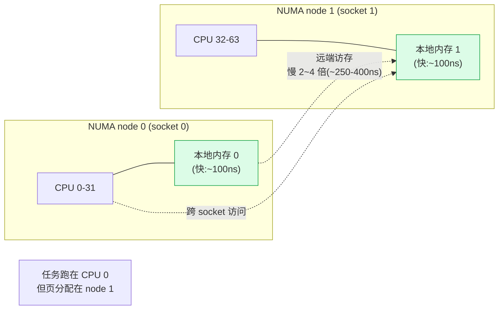
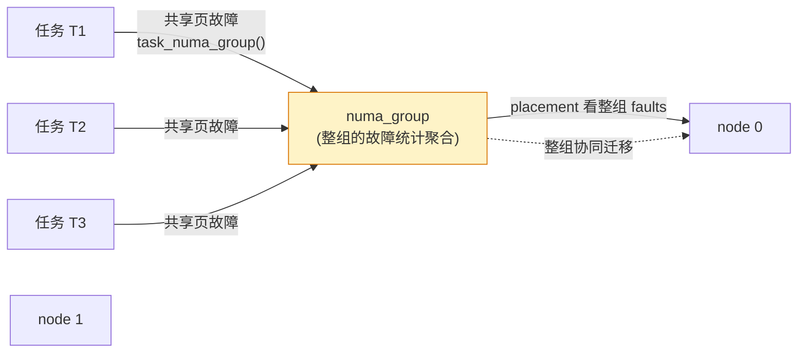
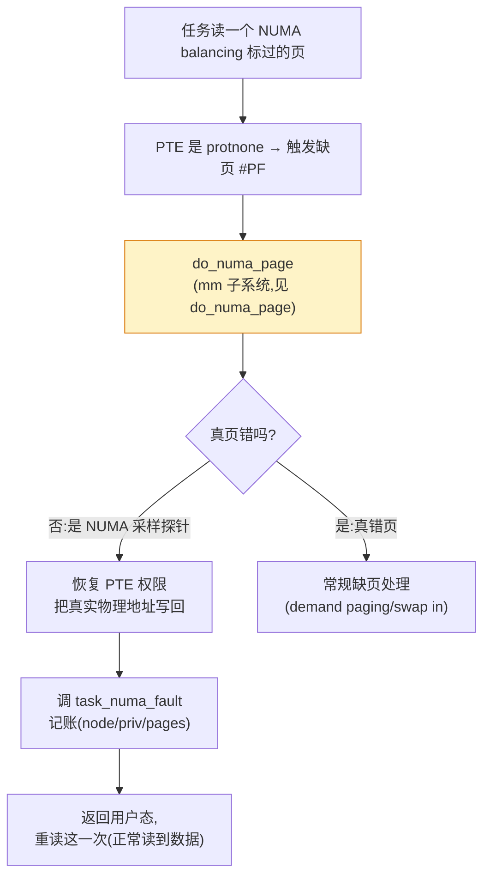
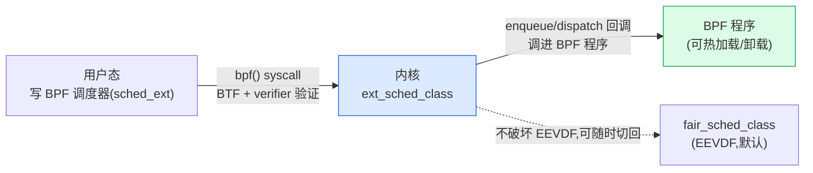

# 第二十章 · NUMA balancing + 调度可观测与调参

> 篇:第 6 篇 · cgroup 与调度进阶
> 主线呼应:第 19 章讲的是"把任务**按组**管",这一章讲"把任务**按 NUMA 节点**摆"和"怎么**看见**调度器在干什么"。一台多 socket 的 NUMA 机器,任务跑在 node 0 的 CPU、却访问 node 1 的内存,会比访本地内存慢 2~4 倍——这是内存子系统的延迟税(见第 8、9 本《内存分配器》《Linux mm》的 NUMA 章节)。Linux 的 **NUMA balancing** 自动侦测"任务跑在哪、它的内存堆在哪",把两者尽量挪到同一个节点。这一章还讲**调度可观测**(`/proc/sched_debug`、`/proc/<pid>/sched`、`/proc/schedstat`)和**调参工具**(`chrt`/`renice`/`taskset`/`tuna`),让你读完源码后真的能看见、能调;最后展望 **sched_ext**(eBPF 可编程调度器,6.9 未合入主线,6.12 起,作延伸)。这些都是机制层在"优化"和"运维"这一面的收尾。

## 核心问题

**NUMA balancing 怎么在不让用户手动绑定的前提下,自动把任务和它的内存迁到同一个 NUMA 节点?它用"protnone PTE 触发缺页"做采样,这套机制为什么 sound(不破坏内存保护、采样代价可控)?调度器跑起来后,运维怎么从 `/proc/sched_debug` 看出 EEVDF 的 lag/deadline、从 schedstat 看出任务的等待时间、用 chrt/renice/taskset 真正调参?sched_ext 给"可编程调度器"带来什么?**

读完本章你会明白:

1. **NUMA 的延迟税**:跨节点访存慢 2~4 倍,NUMA balancing 的目标就是把"任务和它的热点内存"迁到同一个节点,降低访存延迟。
2. **NUMA balancing 的采样机制**:周期性把一批页的 PTE 改成 `protnone`(无读权限),任务访问触发缺页 → 缺页处理里 [`task_numa_fault`](../linux/kernel/sched/fair.c#L3077) 记账"这次访存的页在哪个 node、任务当前在哪个 node",攒够一轮数据 [`task_numa_placement`](../linux/kernel/sched/fair.c#L2805) 选最优 node、[`numa_migrate_preferred`](../linux/kernel/sched/fair.c#L2551) 迁任务。
3. **故障率采样为什么 sound**:`protnone` 不是真撤销页(物理页还在),只是把 PTE 标成"触发缺页"以收集统计;采样是**按周期分批**(扫描地址空间的一段、改一部分页),代价可调(`sysctl_numa_balancing_scan_size`)、可关。
4. **可观测三件套**:`/proc/sched_debug`(每 CPU 的 `cfs_rq`/EEVDF vruntime/deadline、`rq` 当前任务),`/proc/<pid>/sched`(任务的 `se.vruntime`/`sum_exec_runtime`/迁移次数/等待时间),`/proc/schedstat`(调度统计、调度域负载均衡计数)。
5. **调参工具的本质**:`chrt` 改 `policy`/`prio`(切到 RT/deadline)、`renice` 改 nice→weight、`taskset` 改 `cpus_allowed` 亲和掩码、`tuna` 综合图形化。它们最终都是写 `task_struct` 的几个字段。
6. **sched_ext 展望**:6.12 起合入的 eBPF 可编程调度器,让你用 BPF 写一个 `sched_class` 热加载——是 `sched_class` 多态(第 1 章)的终极延伸。

---

## 20.1 一句话点破

> **NUMA balancing 用 protnone PTE 触发的缺页做"访存位置采样",攒够一轮统计选出最优 node,把任务迁过去、把页迁过去;它的所有精妙在于"采样要 cheap、要 sound、不能破坏内存语义"。可观测和调参则是源码读完后把调度器"看见、调到"的临门一脚。**

这是结论,不是理由。本章倒过来拆:先讲 NUMA 为什么要 balancing、延迟税从哪来;再看采样三件套(scan/fault/placement);然后看迁移决策和 numa_group;接着是可观测三件套;最后是调参和 sched_ext。

---

## 20.2 痛点:NUMA 延迟税与"自动 balancing"

多 socket 服务器是 NUMA(Non-Uniform Memory Access)架构:每个 socket 有自己的本地内存,访问别的 socket 的内存要走 interconnect(Intel UPI、AMD Infinity),延迟高 2~4 倍、带宽低。第 8、9 本讲过,这是物理内存拓扑决定的、绕不开。



理想情况:任务和它常用的内存堆在同一个 node。但内核调度器、内存分配器各自为政——`fork` 时按策略(默认 first-touch)分配内存,任务之后被 `load_balance` 迁到别的 CPU,跨节点访存就发生了。

> **不这样会怎样**:没有 NUMA balancing,跨节点访存在多 socket 机器上是**隐形的延迟税**:任务跑得动,但慢;`perf` 看 CPU 利用率正常,数据库 QPS 就是上不去。手动绑定(`numactl`、`taskset`、`cpuset.mems`)能解决,但要求用户懂拓扑——云上多租户、容器化场景根本不可能让每个用户都绑对。NUMA balancing 的目标就是**内核自动侦测并迁移**,让用户不用管。

NUMA balancing 由一个 sysctl 总开关控制:

```c
/* core.c:4571-4590(简化) */
DEFINE_STATIC_KEY_FALSE(sched_numa_balancing);
int sysctl_numa_balancing_mode;     /* NORMAL / MEMORY_TIERING / DISABLED */

/* 打开时 static_branch_enable,sched 路径上的 numa 检查才生效 */
```

([core.c:4571](../linux/kernel/sched/core.c#L4571) 定义,`/proc/sys/kernel/numa_balancing` 写它。)这是个 `static_key`(静态分支),关掉时几乎零开销——NUMA balancing 整套逻辑只在 `static_branch_likely(&sched_numa_balancing)` 为真时才跑(见 [fair.c:3086](../linux/kernel/sched/fair.c#L3086) 的 `task_numa_fault` 开头)。这是"用静态分支把可选功能关掉时零代价"的内核技巧,和 tracepoint 是同一套。

---

## 20.3 采样三件套:scan → fault → placement

NUMA balancing 怎么知道"任务常用的内存堆在哪个 node"?它**不能直接知道**——内核看不出未来。它只能**采样**:周期性触发一些"访存事件",统计这些事件落在哪个 node 上,推断最优节点。这就是**故障率采样**——用故意的"轻量缺页"做采样探针。

### 第一步:scan —— task_numa_work 把 PTE 改成 protnone

[`task_numa_work`](../linux/kernel/sched/fair.c#L3206)([fair.c:3206](../linux/kernel/sched/fair.c#L3206))是采样的发起者。它是个 `task_work`(任务回到用户态时回调),周期性被 [`task_tick_numa`](../linux/kernel/sched/fair.c) 在 tick 里 enqueue(每 `numa_scan_period` ms 一次,默认起步 1s,稳态可拉到更长)。它的核心动作是:**扫一段地址空间,把扫到的页的 PTE 改成 `protnone`**(无读权限):

```c
/* fair.c:3206 task_numa_work(关键骨架,简化) */
static void task_numa_work(struct callback_head *work)
{
    unsigned long migrate, next_scan, now = jiffies;
    struct task_struct *p = current;
    struct mm_struct *mm = p->mm;
    ...
    /* 周期到了吗? */
    migrate = mm->numa_next_scan;
    if (time_before(now, migrate)) return;

    if (p->numa_scan_period == 0) {
        p->numa_scan_period_max = task_scan_max(p);
        p->numa_scan_period = task_scan_start(p);
    }
    /* 用 cmpxchg 抢"本次扫描权"(同 mm 的多线程只让一个扫) */
    next_scan = now + msecs_to_jiffies(p->numa_scan_period);
    if (!try_cmpxchg(&mm->numa_next_scan, &migrate, next_scan)) return;
    ...
    pages = sysctl_numa_balancing_scan_size;          /* 一次扫多少 MB,默认 ~256MB */
    pages <<= 20 - PAGE_SHIFT;
    virtpages = pages * 8;
    ...
    if (!mmap_read_trylock(mm)) return;

    /* 遍历 VMA,调 change_prot_numa 把页的 PTE 标成 protnone */
    start = mm->numa_scan_offset;
    ...  /* 按地址空间偏移循环扫一段 */
    do {
        if (!vma_migratable(vma) || ...) continue;
        ...
        /* change_prot_numa:把这 VMA 一段的 PTE 改 protnone,但不真正撤销页 */
        change_prot_numa(mm, start, end);
        ...
    } while (...);
    mmap_read_unlock(mm);
}
```

> **钉死这件事**:`protnone` PTE 是 NUMA balancing 采样的核心技巧。`protnone` 意为"页保护位被清掉,触发缺页",但**物理页还在、内容没变**——它只是个"请这次访存来趟缺页处理"的探针。任务下次读这个页,触发缺页,缺页处理函数(见 mm 系列的 [`do_numa_page`](../linux/mm/memory.c))识别出这是 NUMA 采样而非真错页,恢复 PTE 权限、调 `task_numa_fault(last_cpupid, mem_node, pages, flags)` 把这次采样记下来。

> **反面对比**:如果不用 `protnone` 采样,而是朴素地"遍历所有 PTE 统计访问模式"(像一些老 NUMA 调优方案),遍历地址空间本身就要走多 socket、扫一遍可能几秒——采样代价远超收益。`protnone` 把"统计访存位置"这件事**摊到了真实访存上**:任务真的去读那页,才触发一次记账;不读就不记。代价和实际访存频率成正比,自适应。这是把"采样代价折叠进业务路径"的妙手。

### 第二步:fault —— task_numa_fault 记账

任务读到 protnone 页 → 缺页 → `do_numa_page`(mm 子系统)恢复 PTE 并调 [`task_numa_fault`](../linux/kernel/sched/fair.c#L3077)([fair.c:3077](../linux/kernel/sched/fair.c#L3077))。这是采样的"事件收集"环节:

```c
/* fair.c:3077 task_numa_fault(关键骨架,简化) */
void task_numa_fault(int last_cpupid, int mem_node, int pages, int flags)
{
    struct task_struct *p = current;
    bool migrated = flags & TNF_MIGRATED;
    int cpu_node = task_node(current);     /* 任务当前在哪个 node */
    int local = !!(flags & TNF_FAULT_LOCAL);
    struct numa_group *ng;
    int priv;

    if (!static_branch_likely(&sched_numa_balancing)) return;  /* 关了就退出 */
    if (!p->mm) return;

    /* 分配 per-node 故障计数数组(首次访问时) */
    if (unlikely(!p->numa_faults)) {
        int size = sizeof(*p->numa_faults) * NR_NUMA_HINT_FAULT_BUCKETS * nr_node_ids;
        p->numa_faults = kzalloc(size, GFP_KERNEL | __GFP_NOWARN);
        if (!p->numa_faults) return;
        ...
    }

    /* 私有页(只这个 pid 用)还是共享页? */
    if (unlikely(last_cpupid == (-1 & LAST_CPUPID_MASK))) {
        priv = 1;
    } else {
        priv = cpupid_match_pid(p, last_cpupid);
        if (!priv && !(flags & TNF_NO_GROUP))
            task_numa_group(p, last_cpupid, flags, &priv);     /* 共享页 → 聚合到 numa_group */
    }

    ...
    /* 攒够了再 placement + migrate */
    if (time_after(jiffies, p->numa_migrate_retry)) {
        task_numa_placement(p);
        numa_migrate_preferred(p);
    }

    /* 把这次访存记到 numa_faults 数组里(mem_node×priv 这一格) */
    p->numa_faults[task_faults_idx(NUMA_MEMBUF, mem_node, priv)] += pages;
    p->numa_faults[task_faults_idx(NUMA_CPUBUF, cpu_node, priv)] += pages;
    ...
}
```

`numa_faults` 是个**多维数组**:`(node_id × {MEM, CPU} × {private, shared} × {current, buffer})` 多个桶。每次采样 +1 到对应格。区分 private(只本任务用的页)和 shared(多任务共享的页)——私有页迁移代价低、收益高;共享页要协调整个 numa_group(20.4)。

### 第三步:placement —— task_numa_placement 选最优 node

[`task_numa_placement`](../linux/kernel/sched/fair.c#L2805)([fair.c:2805](../linux/kernel/sched/fair.c#L2805))是决策点:遍历所有 node,看哪个 node 上累计的 `numa_faults` 最多(即"这个任务的内存最多堆在哪个 node"),把它设为 `numa_preferred_nid`:

```c
/* fair.c:2805 task_numa_placement(关键骨架,简化) */
static void task_numa_placement(struct task_struct *p)
{
    int seq, nid, max_nid = NUMA_NO_NODE;
    unsigned long max_faults = 0;
    ...
    /* 只有 mm 的扫描序号变了(新一扫描轮)才重算 */
    seq = READ_ONCE(p->mm->numa_scan_seq);
    if (p->numa_scan_seq == seq) return;
    p->numa_scan_seq = seq;
    ...

    /* 遍历每个 node,把 buffer 里的故障数衰减合并到主计数,找最高的 */
    for_each_online_node(nid) {
        unsigned long faults = 0, group_faults = 0;
        for (priv = 0; priv < NR_NUMA_HINT_FAULT_TYPES; priv++) {
            ...
            /* 衰减旧窗口的一半,加上本轮 buffer 收集到的 */
            diff = p->numa_faults[membuf_idx] - p->numa_faults[mem_idx] / 2;
            p->numa_faults[membuf_idx] = 0;
            p->numa_faults[mem_idx] += diff;
            faults += p->numa_faults[mem_idx];
            if (ng) {
                ng->faults[mem_idx] += diff;
                group_faults += ng->faults[mem_idx];
            }
        }
        if (!ng) {
            if (faults > max_faults) { max_faults = faults; max_nid = nid; }
        } else if (group_faults > max_faults) {   /* 在组里,看整组的最优 node */
            max_faults = group_faults; max_nid = nid;
        }
    }

    /* 不能迁到没 CPU 的 node */
    max_nid = numa_nearest_node(max_nid, N_CPU);
    ...
    /* 设首选 node(之后 numa_migrate_preferred 真正迁) */
    if (max_nid != p->numa_preferred_nid)
        sched_setnuma(p, max_nid);     /* 改 p->numa_preferred_nid,重 enqueue */
}
```

([`sched_setnuma`](../linux/kernel/sched/core.c#L9390) 改 `p->numa_preferred_nid` 并 dequeue/enqueue,让 EEVDF 用新信息。)

> **钉死这件事**:placement 用"半衰减滑动窗口"——每轮把旧计数衰减一半,加上新 buffer 的计数。这和第 9 章的 PELT 几何衰减是同一思路:**老数据慢慢淡出、新数据权重更高**,既不被尖峰(一次扫到大量远端访存)误导、又能跟上负载变化。找 fault 最多的那个 node = "这个任务最常访问的内存堆在哪个 node",迁过去就降延迟税。

### 第四步:migrate —— numa_migrate_preferred

[`numa_migrate_preferred`](../linux/kernel/sched/fair.c#L2551)([fair.c:2551](../linux/kernel/sched/fair.c#L2551))真正把任务迁到 `numa_preferred_nid` 的某个 CPU 上(通过 [`task_numa_migrate`](../linux/kernel/sched/fair.c#L2415) 选 CPU + `stop_task`/migration 线程实际迁移):

```c
/* fair.c:2551 numa_migrate_preferred(完整,很短) */
static void numa_migrate_preferred(struct task_struct *p)
{
    unsigned long interval = HZ;

    if (unlikely(p->numa_preferred_nid == NUMA_NO_NODE || !p->numa_faults))
        return;

    /* 周期性重试(上次没迁成,或调度器又把我挪走了) */
    interval = min(interval, msecs_to_jiffies(p->numa_scan_period) / 16);
    p->numa_migrate_retry = jiffies + interval;

    /* 已经在首选 node 上跑了,完事 */
    if (task_node(p) == p->numa_preferred_nid) return;

    /* 否则尝试迁到首选 node 上的一个 CPU */
    task_numa_migrate(p);
}
```

任务迁过去之后,**它的页不会自动跟过来**——内存迁移由页级别的 NUMA balancing 单独做(在 `should_numa_migrate_memory` 决策,见 20.4)。任务侧的 placement 和页侧的迁移是**两条并行轨道**,合起来才能让"任务和它的内存堆到同一个 node"。

---

## 20.4 numa_group:共享内存的多任务协同

私有页好办——只这个任务用,迁它的任务 + 迁它的页。但**共享页**(多个任务读写同一块内存,比如数据库的共享 buffer pool)麻烦:迁一个任务到 node 0,可它的共享页还和另一个任务纠缠,可能迁了反而更慢。

Linux 的解法是 **numa_group**:多个任务通过共享页故障聚合成一个 `struct numa_group`([fair.c:1376](../linux/kernel/sched/fair.c#L1376)),整组一起做 placement 决策。



([`task_numa_group`](../linux/kernel/sched/fair.c#L2929) 在共享页故障时聚合,`numa_group->faults[node]` 是整组的聚合统计,placement 时 `task_numa_placement` 优先看 group_faults。)

numa_group 还有几个微妙的决策:

- **active_nodes**:整组活跃地使用多个 node 时(`numa_group_count_active_nodes`,[fair.c:2577](../linux/kernel/sched/fair.c#L2577)),跨这些 node 的访问被算作 local(不算延迟税),避免"一个数据库实例横跨两个 socket"被错误地疯狂迁移。
- **should_numa_migrate_memory**([fair.c:1832](../linux/kernel/sched/fair.c#L1832)):页迁移决策。区分 private/shared、toptier/慢速 tier、首访/稳态。私有页首访直接迁(早期布局);稳态后看 latency 阈值(只迁热页)。

### 扫描周期自适应:update_task_scan_period

[`update_task_scan_period`](../linux/kernel/sched/fair.c#L2614)([fair.c:2614](../linux/kernel/sched/fair.c#L2614))根据 local/remote 比例动态调 `numa_scan_period`:

- local 访问比例高(>= 70%,`NUMA_PERIOD_THRESHOLD = 7`):说明已经摆好了,放慢扫描(周期拉长,代价降低);
- remote 比例高:还有优化空间,加快扫描(周期缩短,更快找到最优 node)。

> **钉死这件事**:NUMA balancing 不是"一次迁移搞定",而是个**闭环反馈**——采样 → 决策 → 迁移 → 再采样 → 看比例改善没 → 调整扫描速度。这套自适应让 balancing 在稳态几乎不耗 CPU(已经摆好就慢扫),在负载变化时快速收敛(发现 remote 多就快扫)。这是机制层"用反馈控制收敛延迟税"的典范,和第 4 章 hrtick 的"按时间片动态设"是同一种"算法跟着现实跑"的思路。

---

## 20.5 可观测三件套:看见调度器在干什么

源码读到这里,你得能在真机上**看见**调度器的决策。Linux 提供三个主要的观测窗口。

### /proc/sched_debug:全局俯瞰

[`/proc/sched_debug`](../linux/kernel/sched/debug.c#L879) 由 [`sched_debug_show`](../linux/kernel/sched/debug.c#L879) → [`print_cpu`](../linux/kernel/sched/debug.c#L763) → [`print_cfs_rq`](../linux/kernel/sched/debug.c#L629) 生成。它打印每颗 CPU 的 `rq` 状态、`cfs_rq` 的 EEVDF 关键字段:

```
$ cat /proc/sched_debug | head -50
Sched Debug Version: v0.11, 6.9.0
...
cfs_rq[0]:/
  .exec_clock                      : 1234567.890123
  .left_deadline                   : 0.012345       ← EEVDF 最左(最早)deadline
  .left_vruntime                   : 0.011000
  .min_vruntime                    : 0.012001
  .avg_vruntime                    : 0.012500       ← avg_vruntime(EEVDF 第 7 章)
  .spread                          : 0.000500
  .nr_spread_over                  : 0
  .nr_running                      : 3
  .h_nr_running                    : 3
  .load                            : 1024           ← 本 cfs_rq 总权重
  .load_avg                        : 823            ← PELT load_avg(第 9 章)
  .runnable_avg                    : 810
  .util_avg                        : 780
  .util_est                        : 800
  ...

runnable tasks:
            task   PID         tree-key  switches  prio     wait-time        ...
------------------------------------------------------------------------------------
R        chrome    1234   0.012345001    567890    120      0.000123 ...
R      kworker      45   0.012345678    123456    120      0.000456 ...
```

([`print_cfs_rq`](../linux/kernel/sched/debug.c#L629) 打印每个 cfs_rq 的 `left_deadline`/`avg_vruntime`/`min_vruntime`/`load_avg`/`util_avg`;如果有 cgroup 组调度,还会 `SEQ_printf_task_group_path` 打印组路径,见 [debug.c:638](../linux/kernel/sched/debug.c#L638)。)

关键看几个:
- `left_deadline`:EEVDF 队列里**最左(最早 deadline)的 entity 的 deadline**,下一个被选中的就是它;
- `avg_vruntime`/`min_vruntime`:EEVDF 算 `entity_eligible` 的基准(第 7 章);
- `load_avg`/`util_avg`:驱动 CPU 频率调节和负载均衡(第 9 章 PELT);
- 组调度时,你能看到每个 `task_group` 在这 CPU 上的 `cfs_rq`(`cfs_rq[0]:/tenantA`)。

### /proc/<pid>/sched:单任务透视

[`/proc/<pid>/sched`](../linux/kernel/sched/debug.c#L989) 由 [`proc_sched_show_task`](../linux/kernel/sched/debug.c#L989) 生成,打印这个任务的调度字段:

```
$ cat /proc/1234/sched
chrome (1234, #threads: 42)
---------------------------------------------------------
se.exec_start                              : 12345678.901234 ns    ← 上次 update_curr 的时刻
se.vruntime                                : 123456.789012 ns      ← EEVDF vruntime(第 7 章)
se.sum_exec_runtime                        : 98765.432109 ns       ← 累计实际跑的 CPU 时间
nr_switches                                : 567890                ← 上下文切换次数(自愿+非自愿)
nr_migrations                              : 1234                  ← 在 CPU 间迁移次数
...
wait_sum                                   : 1234.567890 s         ← 累计等待(可运行但没在跑)
sleep_sum                                  : 5678.901234 s         ← 累计睡眠
block_sum                                  : 12.345678 s           ← 累计阻塞(D 状态)
```

([`proc_sched_show_task`](../linux/kernel/sched/debug.c#L989) 打 `PN(se.exec_start)`/`PN(se.vruntime)`/`PN(se.sum_exec_runtime)` 等 `__PS`/`__PSN` 宏展开的字段;schedstat 启用时还有 `PN_SCHEDSTAT(wait_sum)` 等等待/睡眠/阻塞统计。)

调优时常用:
- `se.vruntime` 和 `cfs_rq` 的 `min_vruntime` 比,看出这个任务跑得多(相对超前)还是少(相对落后);
- `nr_switches` 高 + `nr_migrations` 高 → 任务在核间被频繁迁移,cache 局部性差(可考虑绑核);
- `wait_sum` 高 → 任务可运行但老抢不到 CPU(可能 nice 太低,或被 throttle)。

### /proc/schedstat:负载均衡与等待统计

[`/proc/schedstat`](../linux/kernel/sched/stats.c#L118) 由 [`show_schedstat`](../linux/kernel/sched/stats.c#L118) 生成。每颗 CPU 的等待/睡眠统计,以及**每个调度域**的负载均衡计数:

```
$ cat /proc/schedstat | head
version 15
timestamp 1234567890
cpu0 0 0 12345 67890 ...           ← 每 CPU 的 schedstat 计数
domain0 000000ff 000000ff ...       ← 调度域 0(SMT/MC 层)的均衡计数
  ... lb_idle 12 lb_balanced 345 lb_moved 6 ...
domain1 0000ffff ...                ← 调度域 1(NUMA 层)
```

([stats.c:118](../linux/kernel/sched/stats.c#L118) `show_schedstat` + [`schedstat_start`](../linux/kernel/sched/stats.c#L186) 遍历;SMP 段见 [stats.c:145](../linux/kernel/sched/stats.c#L145) 的 `domain%d %*pb`。)

> **钉死这件事**:schedstat 默认可能编译关掉(`CONFIG_SCHEDSTAT=n` 时这些字段是空桩,`schedstat_enabled()` 返回 false)。生产环境若要看负载均衡是否在有效迁移、任务的等待 tail latency,要开 `CONFIG_SCHEDSTAT`(或运行时某些发行版用 debugfs/sysctl 开)。这层有少量记账开销,所以默认关——和 tracepoint、ftrace 一样,Linux 的原则是**可观测机制默认轻、按需打开**。

---

## 20.6 调参工具的本质:改 task_struct 的几个字段

读完源码,用户态调参工具就透明了——它们都是写 `task_struct` 的几个字段。

| 工具 | 改的字段 | 对应内核路径 |
|---|---|---|
| `renice -n 5 pid` | `static_prio` → `se.load.weight`(`prio_to_weight` 查表) | [`set_user_nice`](../linux/kernel/sched/core.c) → `set_load_weight` → EEVDF 权重变,时间片占比变(第 8 章) |
| `chrt -f 80 pid` | `policy = SCHED_FIFO`,`rt_priority = 80` | [`__sched_setscheduler`](../linux/kernel/sched/core.c) → 切到 `rt_sched_class`,按 prio 绝对抢占(第 17 章) |
| `chrt -d ... pid` | `policy = SCHED_DEADLINE`,`dl.runtime/dl.deadline` | 切到 `dl_sched_class`,EDF + CBS(第 18 章) |
| `taskset -c 0,1 pid` | `cpus_mask`(CPU 亲和掩码) | [`sched_setaffinity`](../linux/kernel/sched/core.c) → `set_cpus_allowed_ptr`,任务只在指定核跑(第 16 章) |
| `numactl --cpunodebind=0` | `cpus_mask` 限到 node 0 的核 + 影响 memory policy | 同上 + mm 的 `mempolicy` |
| `tuna` | 上面几个的综合图形化 | 同上 |
| `echo > cpu.max` | `task_group->cfs_bandwidth.quota/period` | 第 19 章 bandwidth |
| `echo > cpu.weight` | `task_group->shares` | 第 19 章 `sched_group_set_shares` |

几个常见误区:

- **`renice` 不是"调快"进程**:它改的是**权重比例**——nice +5 的任务和 nice 0 的任务按 36:100 分 CPU,不是"少跑 5%"。两个都 nice 0 的任务,你怎么 nice 都不影响它们的相对比例(都还是 1:1)。第 8 章讲过 nice→weight 是非线性的(每级差约 10% CPU)。
- **`chrt -f` 给了 RT 后,别忘了 RT throttling**:RT 任务默认占总 CPU 95% 上限(第 17 章),超过会被 throttle 5%——你以为给了绝对优先级,真跑满还是会被刹一下。
- **`taskset` 绑核不是"独占"**:绑到 CPU 0 只意味着任务**只**能在 CPU 0 跑,但 CPU 0 还能跑别的任务。要真正独占得用 `cpuset`(cgroup 的 cpuset 子系统)的 `cpuset.cpus` + 把别的任务挪走,或者 `isolcpus` 启动参数。

---

## 20.7 技巧精解:protnone 采样为什么 sound

这一章的技巧精解,钻 NUMA balancing 最反直觉、最容易被误解的点:**用 protnone PTE 触发缺页做采样,为什么不出事?**

### 朴素疑问:把 PTE 改成"无读权限",难道不会破坏程序?

第一次看到 NUMA balancing 的实现,直觉反应是:**这不会让程序读到一半崩吗?** 毕竟"页表被改成无读权限"听起来就像 `mprotect(PROT_NONE)`,任务一读就该 `SIGSEGV`。但 NUMA balancing 是全自动开的,生产线上跑得好好的——它为什么 sound?

答案在于 `protnone` 的**特殊处理路径**。它不是普通的 `PROT_NONE`(那是用户主动撤销权限,确实该 segv)。它是内核内部的一个**采样标记**,在 x86 上通过 `_PAGE_PROTNONE` 位实现,在缺页处理里走专门分支:



关键有三点 sound 保障:

1. **物理页始终在**:scan 阶段只改 PTE 的权限位,**不动物理页**(不回收、不迁移)。缺页处理时物理页还在、内容没变,恢复 PTE 权限就能正常读。
2. **缺页处理识别出是 NUMA 采样**:`do_numa_page` 检查 PTE 的 protnone 位(及相关的 `_PAGE_NUMA` 标记),走 NUMA 采样分支——**不**走 demand paging/swap in,也不发 `SIGSEGV`。恢复 PTE 后用户态重读,读到正确数据。
3. **采样后立刻恢复**:每个页只在它**被实际访问的那一刻**触发一次采样,然后 PTE 恢复——下次访问就正常了,不再触发。所以采样的代价 = "每次 scan 周期内、每个被扫到的页一次额外缺页",这有界、可调(`scan_size` 限制每轮扫多少 MB)。

### 反面对比:如果不用 protnone 采样

如果用别的方案:

- **遍历页表统计 accessed 位**:每次 scan 走完整个地址空间,扫页表本身就要走跨节点内存、TLB 抖动,代价随地址空间大小线性增长——大内存数据库扫一遍要几秒,根本不能用。
- **在每个 load 指令插桩**:对用户透明、代价均摊?不行,内核不知道用户代码哪里访存,无法插桩。
- **靠硬件 PMU 采样访存**(如 Intel PEBS / AMD IBS):可以做、Linux 也部分用了(在 NUMA 调优工具里),但代价高、硬件相关、采样率低,不适合做默认 balancing。

`protnone` 把"统计访存位置"的代价**精确摊到了真实访存上**:不读的页不记(代价零);读得多的页多记(代价随热度)。这是把"采样代价和业务路径同构"的妙手,和第 8 本《内存分配器》里"按需分裂 slab"是同一种"按实际访问模式工作"的思想。

> **钉死这件事**:NUMA balancing 的 protnone 采样 sound 的三根支柱:**物理页不动**(不破坏数据)、**缺页走 NUMA 分支**(不发信号、不走重路径)、**采样后恢复**(代价有界)。它的精妙在于把"统计访存位置"这件本该很贵的事,折叠进了"任务本来就要做的访存"——访问发生才记账,不访问零代价。这是机制层"用业务路径承载管理开销"的典范,和第 11 章延迟抢占(用业务安全点承载切换)、第 4 章 hrtick(用业务时间片承载精确抢占)是同一种设计哲学。

---

## 20.8 展望:sched_ext —— eBPF 可编程调度器

最后展望一个**6.9 未合入主线、6.12 起合入**的延伸方向:**sched_ext**(简称 scx)。

回想第 1 章的 `sched_class` 多态:dl/rt/fair/idle/stop 是一条链,`pick_next_task` 按优先级遍历。sched_ext 是**新增的第六个调度类**:`ext_sched_class`,它的实现**完全用 eBPF 程序定义**。你写一个 BPF 程序实现 `enqueue`/`select_cpu`/`dispatch` 等回调,热加载进内核,它就成了当前系统的调度策略。



sched_ext 解决的是"调度策略不可实验"的痛点:以前想试个新调度算法(比如针对数据库的、针对 AI 推理延迟的),要么改 kernel 重新编译重启,要么写内核模块(易崩)。sched_ext 借 eBPF(见第 18 本《Linux eBPF 与可观测》的 verifier + JIT),让调度策略**可编程、可热加载、被 verifier 保证不崩**。

> **注**:本书源码基于 Linux **6.9**,sched_ext 在 6.9 未合入主线(在 6.12 起合入)。这里只作延伸展望,不讲其源码细节——但它的**存在**恰好印证了第 1 章 `sched_class` 多态设计的威力:正因为 fair/rt/dl 都只是 `sched_class` 的实现,新增一个"用 BPF 实现的调度类"才能**核心调度路径一行不改**。这是"用结构设计消灭 switch"在多年后的最大回本。

---

## 章末小结

这一章把"调度进阶与可观测"收尾。讲了两块:

1. **NUMA balancing**(20.2~20.4):自动把任务和它的热点内存迁到同一个 NUMA 节点。机制是"protnone PTE 采样":周期性把页标成 protnone → 任务访问触发缺页 → `do_numa_page` 走 NUMA 分支调 `task_numa_fault` 记账 → 攒够数据 `task_numa_placement` 选最优 node → `numa_migrate_preferred` 迁任务。共享页由 `numa_group` 协同决策。扫描周期根据 local/remote 比例自适应收敛。
2. **可观测与调参**(20.5~20.7):`/proc/sched_debug`(全局俯瞰,EEVDF vruntime/deadline)、`/proc/<pid>/sched`(单任务)、`/proc/schedstat`(负载均衡计数)三件套;`renice`/`chrt`/`taskset`/`tuna` 调参的本质是改 `task_struct` 的 `static_prio`/`policy`/`cpus_mask` 等字段。最后展望了 sched_ext(eBPF 可编程调度器)。

> **回扣二分法**:NUMA balancing 和可观测都属于**机制层**——它们不决定"下一个跑谁"(那是 EEVDF/RT/deadline 的事),它们决定"任务和内存摆在哪个 node 最优"(NUMA balancing)和"运维怎么看见、调到"(可观测)。它们都建立在第 1~5 篇的地基之上:`task_numa_fault` 用 `task_struct` 的 `numa_preferred_nid`,`sched_setnuma` 走 dequeue/enqueue 让 EEVDF 用新信息,`/proc/sched_debug` 打印的是 `cfs_rq` 的 EEVDF 字段。这些进阶机制不是孤立岛屿,而是核心调度机制在"跨节点优化"和"运维观测"两个方向的延伸。

### 五个"为什么"清单

1. **为什么需要 NUMA balancing?** 多 socket 机器跨 NUMA 节点访存慢 2~4 倍,不 balancing 就有隐形延迟税。手动绑定要求用户懂拓扑,云/容器场景不可行,所以内核自动侦测并迁移。
2. **protnone 采样怎么工作?** 周期性把一批页的 PTE 改成 protnone(无读权限但物理页还在),任务访问触发缺页;`do_numa_page` 识别这是 NUMA 采样,恢复 PTE 并调 `task_numa_fault` 记账。代价按"实际访存频率"均摊,不访问零代价。
3. **怎么选最优 node?** `task_numa_placement` 用半衰减滑动窗口累加每个 node 上的 `numa_faults`,选最高的设为 `numa_preferred_nid`,然后 `numa_migrate_preferred` 把任务迁过去。私有页单任务决策,共享页由 `numa_group` 整组协同。
4. **三件套可观测看什么?** `/proc/sched_debug` 看每 CPU 的 EEVDF `left_deadline`/`avg_vruntime`/`load_avg`/`util_avg`;`/proc/<pid>/sched` 看单任务的 `vruntime`/`sum_exec_runtime`/`nr_switches`/`wait_sum`;`/proc/schedstat` 看负载均衡域的迁移计数(默认 `CONFIG_SCHEDSTAT=n` 可能关闭)。
5. **chrt/renice/taskset 到底改了什么?** `renice` 改 `static_prio`→EEVDF 权重;`chrt` 改 `policy`/`rt_priority`→切调度类(RT/deadline);`taskset` 改 `cpus_mask`→CPU 亲和。都是写 `task_struct` 字段,通过相应的 `__sched_setscheduler`/`set_user_nice`/`sched_setaffinity` 生效。

### 想继续深入往哪钻

- 源码:[`kernel/sched/fair.c`](../linux/kernel/sched/fair.c) 的 `task_numa_work`(L3206)、`task_numa_fault`(L3077)、`task_numa_placement`(L2805)、`numa_migrate_preferred`(L2551)、`should_numa_migrate_memory`(L1832)、`update_task_scan_period`(L2614)、`task_numa_group`(L2929);[`kernel/sched/core.c`](../linux/kernel/sched/core.c) 的 `sched_setnuma`(L9390)、`sysctl_numa_balancing`(L4606);[`kernel/sched/stats.c`](../linux/kernel/sched/stats.c) 的 `show_schedstat`(L118);[`kernel/sched/debug.c`](../linux/kernel/sched/debug.c) 的 `print_cfs_rq`(L629)、`print_cpu`(L763)、`proc_sched_show_task`(L989)。
- `/proc`/`sysctl` 观测:`/proc/sched_debug`、`/proc/<pid>/sched`、`/proc/schedstat`(开 `CONFIG_SCHEDSTAT`);`/proc/sys/kernel/numa_balancing`(开关)、`/proc/sys/kernel/numa_balancing_scan_size`(每轮扫多少 MB)、`numa_balancing_scan_delay`/`scan_period_min_ms`/`scan_period_max_ms`(扫描周期参数);debugfs 的 `/sys/kernel/debug/sched/`(`base_slice_ns`/`migration_cost_ns`/`nr_migrate`/`features`/`verbose`)。
- 工具:`perf sched`(看调度时序)、`trace-cmd record -e sched:*`(抓调度 tracepoint)、`perf stat`(看 CPU 迁移计数 `cpu-migrations`)、`numastat -p <pid>`(看任务在每 node 上的内存);`stress-ng`/`hackbench`/`perf bench` 做调度压力测试。
- 延伸:第 9 章 PELT(NUMA balancing 的扫描周期自适应和 PELT 衰减同源);mm 系列的 `do_numa_page`(NUMA 缺页的真身在 mm 子系统);eBPF 系列(verifier + JIT,sched_ext 的 6.12+ 实现基于它);`Documentation/scheduler/sched-numa.rst`、`Documentation/admin-guide/mm/numa_memory_policy.rst`。

### 引出下一章

这是第 6 篇的收尾,全书 21 章里只剩最后一篇。第 7 篇只有一章(P7-21):**Linux 调度器的哲学 + ★对照 Go runtime 总表**——全书收束,把延迟抢占、per-CPU 细粒度锁、`sched_class` 多态、PELT 几何衰减、调度域分层均衡、组调度复用 `sched_entity` 这些反复出现的技巧拧成一根哲学之线;并给一张 Linux 调度器 vs Go runtime GMP 的**对照总表**,把本书和第 7 本钉成"调度全栈"。
