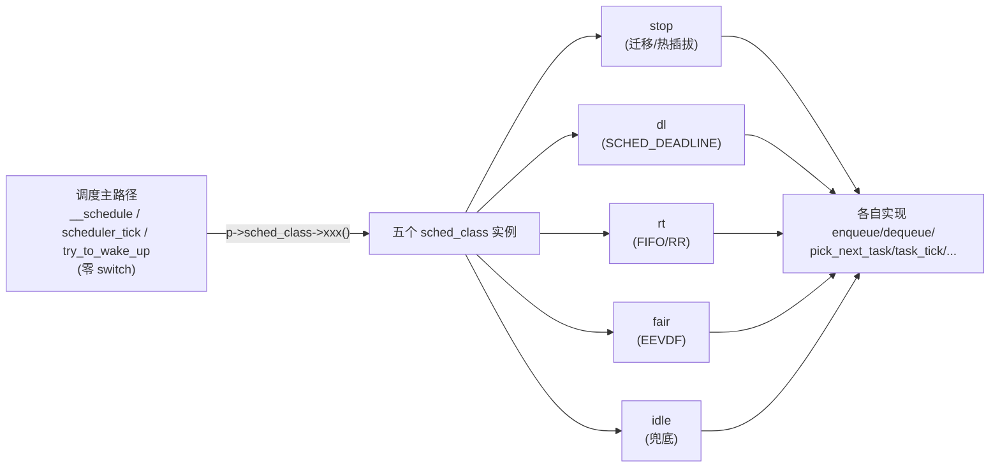
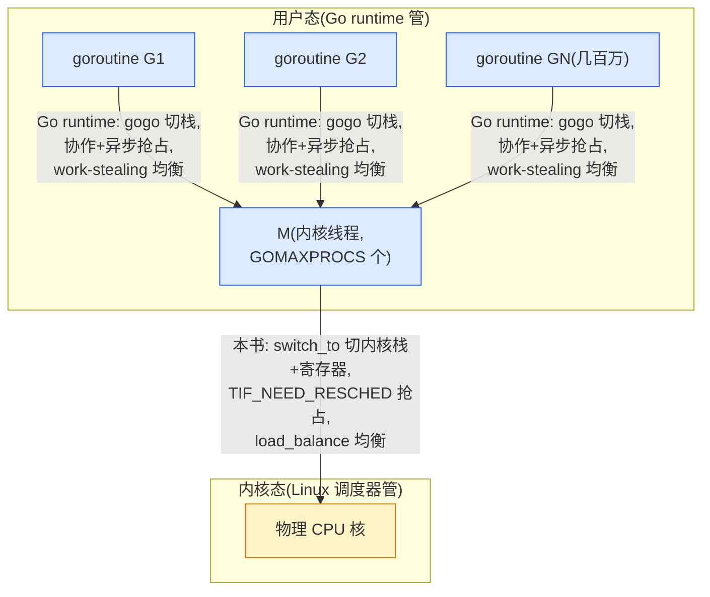
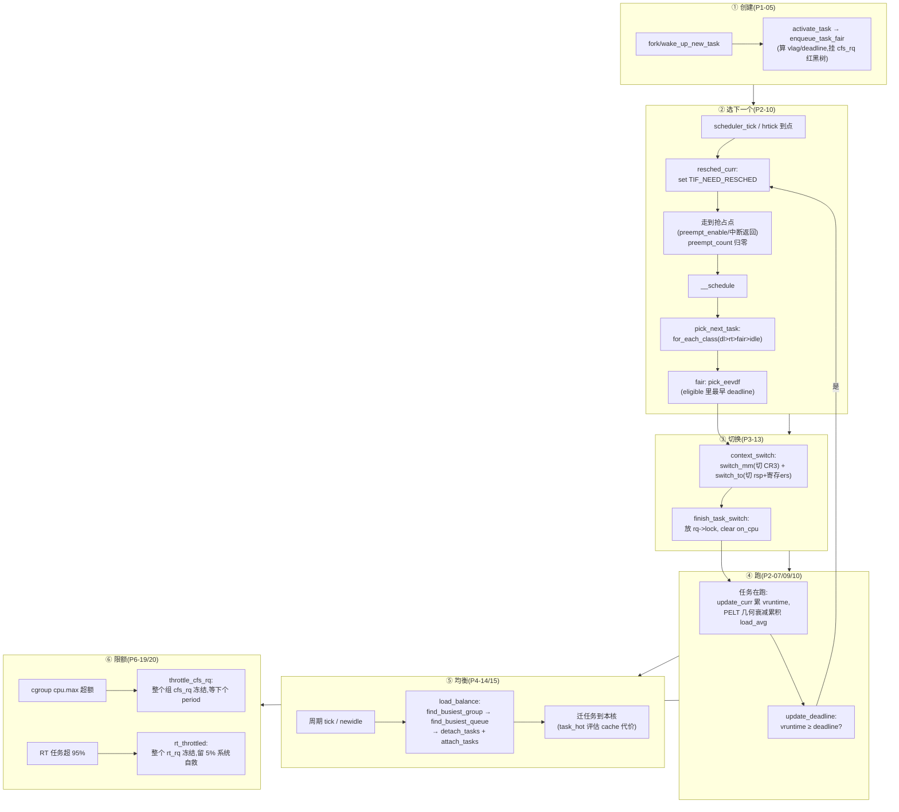

# 第二十一章 · Linux 调度器的哲学 + ★对照 Go runtime 总表

> 篇:第 7 篇 · 收尾:哲学与对照总表(全书最后一章)
> 主线呼应:前 20 章我们从"为什么内核要调度"出发,搭了任务表示(`task_struct`/`sched_entity`)、运行队列(`rq`/`cfs_rq`/`rt_rq`)、时钟(`sched_clock`/`tick`/`hrtick`),钻了 EEVDF 三件套(lag/eligible/deadline)、nice 权重、PELT 衰减,走完了抢占(`TIF_NEED_RESCHED`)、主调度函数(`__schedule`)、上下文切换(`switch_to`),讲了 SMP 负载均衡(调度域/`load_balance`/迁移)、RT/deadline/idle/stop 调度类、cgroup 组调度、NUMA balancing 与可观测。这一章是**收束**——把全书 20 章串成一条线,提炼 Linux 调度器的**七条设计哲学**,每条都配"它在哪章讲的、为什么这么设计、不这样会怎样",最后给一张**Linux 调度器 vs Go runtime GMP 对照总表**,把本书和第 7 本钉成"调度全栈"(内核通用抢占 vs 语言轻量协作)。

## 核心问题

**20 章读完,Linux 调度器到底体现了几条反复出现的"设计哲学"?它们各自解决什么本质问题、不这样会怎样?和 Go runtime 的 GMP 对照,内核调度和语言调度到底在哪些维度上同、哪些维度上不同——为什么会有这些不同?**

读完本章你会明白:

1. **Linux 调度器的七条哲学**:① 延迟抢占(标记+安全点);② per-CPU 队列 + 细粒度锁;③ `sched_class` 多态(策略可插拔);④ EEVDF 三件套(公平/资格/延迟三维解耦);⑤ PELT 几何衰减(常数时间负载跟踪);⑥ 调度域分层均衡(按 cache/NUMA 距离分层);⑦ 组调度复用 `sched_entity`(任务和组同构)。每条哲学的动机、技巧、反面。
2. 一张**贯穿维度的对照总表**:Linux 调度器(内核级抢占式通用调度)vs Go runtime GMP(语言级协作+异步抢占轻量调度),从调度对象、切换粒度、抢占机制、均衡模型、优先级、时间片、可观测性等十多个维度对照。
3. 两本为什么能合成"调度全栈":Go 的 M 是内核线程,最终仍由本书的调度器调度;本书讲"内核怎么调度线程",第 7 本讲"Go 怎么在内核线程之上再调度 goroutine"。两层调度,各管各的,合起来才是并发程序被调度的全貌。

> 逃生阀:本章没有新算法、没有新源码细节,纯粹是"把前 20 章串起来回头看"。如果你已经读过前 20 章,本章是一份"全局索引 + 哲学提炼 + 对照总表";如果你只读这一章,你会拿到一张"Linux 调度器地图"——每条哲学配章节链接,可按图索骥。

---

## 21.1 一句话点破

> **Linux 调度器的全部复杂度,都可以归约到七条反复出现的设计哲学上——延迟抢占(可抢但只在安全点抢)、per-CPU 队列(把锁竞争消灭在结构里)、`sched_class` 多态(策略插进同一套主路径)、EEVDF 三件套(公平从一维升到三维)、PELT 几何衰减(O(1) 负载跟踪)、调度域分层(认拓扑地均衡)、组调度复用 `sched_entity`(任务和组同构)。每一条都是"用一点点预处理或结构开销,换热路径的大头收益或正确性保障"。这七条哲学,内核级调度和语言级调度(Go GMP)在根本思路上同源(都要切、都要均衡、都要公平),但在粒度、机制、复杂度上分野——内核切重任务讲通用抢占,语言切轻 goroutine 讲协作+异步抢占,两层合成调度全栈。**

这是结论,不是理由。本章倒过来拆:先逐条提炼七条哲学(配章节、动机、反面),再给对照总表,最后讲两层调度的关系。

---

## 21.2 七条设计哲学

### 21.2.1 哲学一:延迟抢占——可抢,但只在安全点真切

**在哪一章**:第 11 章(P3-11 抢占点与 `TIF_NEED_RESCHED`)、第 12 章(P3-12 `__schedule` 与 `pick_next_task`)。

**核心**:`TIF_NEED_RESCHED` 是一面通知旗,不是命令。任何上下文(中断里也行)都可以设它;真正的切换只发生在任务自己走到**抢占点**(`preempt_enable` / 中断返回 / `cond_resched`)、且 `preempt_count` 归零、且不在中断里时。`preempt_count` 这一个 32 位 int 把"持锁/softirq/hardirq/NMI"四层不能切的上下文打包成 O(1) 判断。

**为什么这么设计**:被抢任务可能正拿着自旋锁、在 `preempt_disable()` 区、在硬中断或 NMI 里。在这些地方立刻切走会破坏内核基本不变量——持锁者必须推进到释放、per-CPU 假设必须成立、中断上下文不能被调度。一抢就崩。

**不这样会怎样**:如果在中断里立刻切,必须在中断 handler 入口判断"现在能不能切",而中断可能在任务任意指令打断——任务可能正处在取锁和 `preempt_disable` 之间的瞬态,这个瞬态里"能不能切"无定义。早期 Linux(2.4 及以前的大内核锁时代)内核态几乎不可抢,代价是响应延迟差。延迟抢占把"想抢"和"真抢"解耦,**既及时(安全点足够密)又 sound(只在 preempt_count 归零时切)**。

**源码锚点**:[`resched_curr`@core.c:1041](../linux/kernel/sched/core.c#L1041)(设旗)、[`preempt_schedule`@core.c:6941](../linux/kernel/sched/core.c#L6941)(抢占点检查 + `preemptible()` 二次验证)、[`__schedule`@core.c:6616](../linux/kernel/sched/core.c#L6616)(真切)。

```c
/* kernel/sched/core.c:6941 */
asmlinkage __visible void __sched notrace preempt_schedule(void)
{
    if (likely(!preemptible()))   /* preempt_count()==0 && !irqs_disabled() */
        return;
    preempt_schedule_common();
}
```

---

### 21.2.2 哲学二:per-CPU 运行队列 + 细粒度锁——把锁竞争消灭在结构里

**在哪一章**:第 3 章(P1-03 `rq`/`cfs_rq`/`rt_rq` 运行队列)、第 15 章(P4-15 `load_balance` 跨核拉任务)。

**核心**:每个 CPU 一个独立的 [`struct rq`](../linux/kernel/sched/sched.h#L985)([sched.h:985](../linux/kernel/sched/sched.h#L985)),内含 `cfs`/`rt`/`dl` 三个子队列、一把 `__lock`、一组时钟。本核调度路径(`__schedule`/`scheduler_tick`/`try_to_wake_up`)只动本核 `rq`、只锁本核 `rq->lock`——不同核互不干扰。锁的粒度还细:`rt_rq->rt_runtime_lock`(RT throttle 配额)、`cfs_rq->removed.lock`(PELT 跨核移除负载)各自独立。

**为什么这么设计**:调度决策有天然的本核局部性——一个核选下一个、tick、唤醒,绝大多数只动本核队列。

**不这样会怎样**:全机一把全局 `rq` + 一把全局锁,64 核机器上每次 `__schedule`(每核每秒上千次)都抢同一把锁——锁竞争随核数线性恶化,缓存行在核间反复 invalidate。这正是 Linux 2.4 时代的真实痛点,16 核以上调度器自己就成了瓶颈。Ingo Molnar 的 O(1) 调度器(2.6 起)用 per-CPU rq 一举解决。

**源码锚点**:[`DEFINE_PER_CPU_SHARED_ALIGNED(struct rq, runqueues)`@core.c:119](../linux/kernel/sched/core.c#L119)、[`this_rq()`@sched.h:1222](../linux/kernel/sched/sched.h#L1222)(无锁取本核 rq)、[`double_rq_lock`@sched.h:2838](../linux/kernel/sched/sched.h#L2838)(跨核迁移按固定顺序加两把锁防死锁)。

> **钉死这件事**:per-CPU rq 不是"加一层锁的优化",是**重新设计数据结构让锁竞争消失**。结构设计 > 锁优化:per-CPU 化是治本,锁优化(如 qspinlock,见第 11 本《同步原语》)是治标。这条哲学在内核里反复出现——第 8 本《内存分配器》的 per-CPU cache、上一本 mm 的 per-CPU pageset、第 11 本的 per-CPU 计数器,都是同一套思路:**把并发瓶颈消灭在数据结构设计里**。

---

### 21.2.3 哲学三:`sched_class` 多态——把策略插进同一套主路径

**在哪一章**:第 2 章(P1-02 `task_struct` 与 `sched_entity`)、第 12 章(P3-12 `__schedule` 与 `pick_next_task`)、第 17、18 章(P5-17/18 RT/deadline/idle/stop)。

**核心**:给每种调度策略一个 [`struct sched_class`](../linux/kernel/sched/sched.h#L2261)([sched.h:2261](../linux/kernel/sched/sched.h#L2261))——一组函数指针(`enqueue_task`/`dequeue_task`/`pick_next_task`/`task_tick`/...)。五个调度类(stop > dl > rt > fair > idle)各实现一份,用 linker section(`DEFINE_SCHED_CLASS` 宏 + `__xxx_sched_class` section)自动按优先级排序。主调度路径 `curr->sched_class->xxx()` 走函数指针,**零 `switch(policy)`**。

**为什么这么设计**:新增调度策略(比如 6.12 起的 `sched_ext`,eBPF 可编程调度器)只要写一个新 `DEFINE_SCHED_CLASS` 实例并放进 section,核心调度路径一行不改。

**不这样会怎样**:朴素写法是在调度主路径里到处 `switch(policy)`,每加一种策略要改 `pick_next`/`enqueue`/`tick`/`sleep` 等十几个函数——散弹式修改,维护灾难,各策略无法独立演进。

**源码锚点**:[`struct sched_class`@sched.h:2261](../linux/kernel/sched/sched.h#L2261)、[`DEFINE_SCHED_CLASS`@sched.h:2336](../linux/kernel/sched/sched.h#L2336)(linker section 宏)、[`fair_sched_class`@fair.c:13115](../linux/kernel/sched/fair.c#L13115)、[`for_each_class`@sched.h:2345](../linux/kernel/sched/sched.h#L2345)(按地址递增遍历 = 优先级从高到低)。



> **钉死这件事**:`sched_class` 多态是 Linux 内核"用 C 写面向对象"的典范——和 `struct file_operations`、`struct net_proto_family` 是同款套路。linker section 自动排序是"用工具链能力消灭代码"的典范:加新调度类不需要手写链表,链接器脚本一处定义顺序。

---

### 21.2.4 哲学四:EEVDF 三件套——公平从一维升到三维

**在哪一章**:第 6 章(P2-06 从 CFS 到 EEVDF)、第 7 章(P2-07 EEVDF 算法)、第 8 章(P2-08 nice 与权重)、第 10 章(P2-10 `pick_next_fair` 与时间片)。

**核心**:6.6 起,EEVDF 用三个独立字段取代 CFS 的单一 vruntime 判据:
- `vruntime`(沿用 CFS,按权重折算的虚拟时间);
- `vlag`(虚拟欠账 `V - v_i`,决定 eligibility,lag ≥ 0 才有资格跑);
- `deadline`(本次请求的虚拟截止 `v_i + r_i/w_i`,决定先后)。

选下一个 = **在 eligible 任务里挑 deadline 最早的**。`pick_eevdf` 用 augmented rbtree(按 deadline 排序 + 每节点缓存子树 `min_vruntime` 做剪枝)O(log N) 完成搜索。

**为什么这么设计**:CFS 把"公平份额、先后顺序、延迟紧急度"三件事挤在 vruntime 一根轴上,导致延迟保障只能靠全局 `sched_latency_ns` 软调、唤醒补偿靠一堆 feature flag 打补丁、权重边界精度不够——三个老毛病打了 16 年补丁没根治。EEVDF 把三件事拆成三个独立字段,各司其职。

**不这样会怎样**:如果只在 CFS 上打补丁(继续用"选最小 vruntime"但额外维护 deadline),会出现判据冲突:vruntime 说"A 该跑",deadline 说"B 该跑",听谁的?判据必须单一自洽。EEVDF 把判据统一成"eligible 里最早 deadline"。

**EEVDF 带来的工程简化**:时间片从动态(`sched_latency_ns * weight / 总权重`)砍成常量 [`sysctl_sched_base_slice`](../linux/kernel/sched/fair.c#L76)([fair.c:76](../linux/kernel/sched/fair.c#L76),0.75ms)。权重不再通过"slice 长短"起作用,改通过"deadline 紧迫度"(权重大的 deadline 更近,被更频繁选中)。`sched_latency_ns`/`sched_min_granularity`/`sched_wakeup_granularity` 一堆旋钮全砍。

**源码锚点**:[`avg_vruntime`@fair.c:660](../linux/kernel/sched/fair.c#L660)(全队列加权平均 V)、[`entity_eligible`@fair.c:749](../linux/kernel/sched/fair.c#L749)(资格判据,无除法变形)、[`pick_eevdf`@fair.c:884](../linux/kernel/sched/fair.c#L884)(augmented tree 搜索)、[`update_deadline`@fair.c:984](../linux/kernel/sched/fair.c#L984)(算 deadline)、[`place_entity`@fair.c:5170](../linux/kernel/sched/fair.c#L5170)(唤醒 lag 补偿)。

```
 EEVDF 三件套的几何关系(虚拟时间轴 v):

   vruntime 轴 ──────────────────────────────────► (v 越大 = 跑得越多)
        v_A              V(avg)       v_B
        │← lag_A (>0) →│            │
   ─────┼──────────────┼────────────┼─────
        │              │            │
        A eligible      │       B ineligible(v_B > V)
        (v_A ≤ V)       │       (lag_B < 0,跑过头)
        │              │
        │◄─deadline_A─►│
        │ = v_A+r/w    │
        │              │
   pick: 在 eligible 里选 deadline 最早的 → A 胜出
```

> **钉死这件事**:EEVDF 是全书最硬核的策略升级——把 CFS 一维 vruntime 升到三维(lag/vruntime/deadline),一举解掉 CFS 的三个老毛病。所有讲 "CFS 红黑树按 vruntime 排序选最小"的老资料在 6.6 之后都过时了:6.9 里红黑树**按 deadline 排序**,挑选算法是 `pick_eevdf`(eligible 里最早 deadline),不是取最左 vruntime 最小。

---

### 21.2.5 哲学五:PELT 几何衰减——常数时间负载跟踪

**在哪一章**:第 9 章(P2-09 PELT 负载跟踪)。

**核心**:每个 `sched_entity` 维护一组按几何级数衰减的负载/利用率:`load_avg`(带权重,服务负载均衡)、`util_avg`(不带权重 0..1024,服务 CPU 频率调节)。衰减系数 `y^32 = 1/2`(32ms 半衰期)。`decay_load` 用"右移 + 查表"做到 O(1) 衰减(无论衰减多少周期);`accumulate_sum` 用闭式公式三段累积(d1/d2/d3),不在每个 1ms 周期都更新,而是事件触发时一次性补算跨过的所有周期——O(1) 更新。

**为什么这么设计**:调度器要"任务最近有多忙"这个量。瞬时采样被尖峰误导(5ms 尖峰判 100%),长期平均被历史拖累(1 小时前的忙还影响现在)。几何级数是唯一能 O(1) 增量更新的衰减形式(新状态 = y * 旧状态 + 新贡献),既平滑又会遗忘。

**不这样会怎样**:用滑动窗口平均(最近 N 个周期算术平均),每次窗口滚动要 O(N) 重算或维护 O(N) 环形缓冲;系统里几百个任务,PELT 维护成本累加,显著拖慢调度路径。用别的衰减(线性衰减)不能 O(1) 增量。几何级数 + 32ms 半衰期是工程甜蜜点:覆盖几个 slice(0.75ms * 几十),对尖峰遗忘够快(32ms 衰减一半),对稳态响应够稳(~200ms 收敛)。

**配套补丁——`util_est`**:PELT 慢启动(util_avg 从 0 爬到稳态要几百毫秒)。`util_est` 记录历史峰值 util_avg 的 EMA 作为下限,任务睡醒后即使 PELT 没追上,util_est 也给保底估计,cpufreq 立刻升频,避免慢启动卡顿。

**源码锚点**:[`decay_load`@pelt.c:31](../linux/kernel/sched/pelt.c#L31)(O(1) 衰减)、[`accumulate_sum`@pelt.c:102](../linux/kernel/sched/pelt.c#L102)(三段累积)、[`runnable_avg_yN_inv[]`@sched-pelt.h:4](../linux/kernel/sched/sched-pelt.h#L4)(32 项查表常数)、[`struct sched_avg`@include/linux/sched.h:471](../linux/include/linux/sched.h#L471)(账本)。

> **钉死这件事**:PELT 是"用数学换性能"的典范——几何级数给 O(1) 增量更新,y^32=1/2 给合适的"近期敏感/远期遗忘"平衡,1024µs 周期给快速移位运算(2^10,`delta >>= 10`)。它不决定"下一个跑谁"(那是 EEVDF),它为负载均衡(第 15 章)和 CPU 频率调节提供输入——是策略和均衡机制之间的数据桥梁。

---

### 21.2.6 哲学六:调度域分层均衡——认拓扑地搬任务

**在哪一章**:第 14 章(P4-14 调度域与调度组)、第 15 章(P4-15 `load_balance`)、第 16 章(P4-16 任务迁移与 CPU 亲和)。

**核心**:把硬件拓扑(SMT → MC 共享 LLC → PKG → NUMA)抽象成自底向上的 [`sched_domain`](../linux/include/linux/sched/topology.h#L87) 链,每个 CPU 一条。负载均衡按这条链从低到高逐层执行:先在最底层(SMT/同 LLC)均衡,够便宜、最该做;最上层(NUMA)均衡代价大,做得最谨慎、最不频繁。每层有自己的 `imbalance_pct`(不平衡容忍度)、`cache_nice_tries`(cache 热任务豁免次数)、`balance_interval`(均衡间隔)。

**为什么这么设计**:同样搬一次任务,搬到同 LLC 的核代价小(数据在 LLC 里还在),搬到跨 NUMA 的核代价大(cache 全冷 + DRAM 远)。负载均衡必须认拓扑,否则省下来的 CPU 份额不够填 cache 重建。

**pull 模型 + 迁移代价评估**:Linux 选 **pull 模型**——由空闲/不忙的 CPU 主动发起均衡(忙 CPU 没空算均衡,且多个忙核 push 同一目标会惊群)。三步走:`find_busiest_group`(选最忙组)→ `find_busiest_queue`(选最忙 CPU)→ `detach_tasks` + `attach_tasks`(摘下再挂上)。`task_hot` 用 `sysctl_sched_migration_cost`(默认 500µs)判断 cache 热度,热任务前几次豁免(`cache_nice_tries`),卡久了强制迁。

**两个招牌技巧**:
1. **`TASK_ON_RQ_MIGRATING` 状态机替代双锁**:`detach_tasks` 持 `src_rq->lock` 摘下任务、`attach_tasks` 持 `dst_rq->lock` 挂上,中间松锁。任务在迁移期间 `on_rq = TASK_ON_RQ_MIGRATING`,全调度器可见,唤醒路径自旋等它迁完——避免双 rq 锁的全局顺序约束。
2. **active balance**:pull 模型对"正在跑"的任务无能为力(不能从执行中的任务身上摘下来),通过 `stop_one_cpu_nowait` 踢源 CPU 的 migration 线程(最高优先级 `stop_sched_class`),由源 CPU 主动把任务推出来。

**源码锚点**:[`struct sched_domain`@topology.h:87](../linux/include/linux/sched/topology.h#L87)、[`load_balance`@fair.c:11259](../linux/kernel/sched/fair.c#L11259)、[`detach_tasks`@fair.c:9059](../linux/kernel/sched/fair.c#L9059)、[`task_hot`@fair.c:8818](../linux/kernel/sched/fair.c#L8818)、[`newidle_balance`@fair.c:12289](../linux/kernel/sched/fair.c#L12289)。

> **钉死这件事**:调度域分层是 SMP 均衡的地基——它把"全局一把尺子衡量均衡"换成"按拓扑距离逐层衡量",保护 cache 局部性。`imbalance_pct`(SMT 110/MC 117/NUMA 117)和 `cache_nice_tries`(MC 1/NUMA 2)这些参数在 `sd_init` 里按域类型不同地设置,不是凭空来的。负载均衡是 PELT(策略层数据)和 sched_domain(机制层地图)的真正消费者。

---

### 21.2.7 哲学七:组调度复用 `sched_entity`——任务和组同构

**在哪一章**:第 2 章(P1-02 `sched_entity` 嵌入 + `container_of`)、第 19 章(P6-19 cgroup cpu 组调度与 bandwidth 限额)。

**核心**:[`struct sched_entity`](../linux/include/linux/sched.h#L536)([sched.h:536](../linux/include/linux/sched.h#L536))既能内嵌进 `task_struct`(代表一个任务),也能内嵌进 `task_group` 的 per-CPU 数据(代表一个组)。公平队列里挂的是 `sched_entity`,**调用者不管背后是任务还是组**,靠 `se->my_q` 是否为空区分(非空是组,下钻进 `my_q` 再 pick;空是任务,`container_of` 反查宿主)。这让组调度几乎"免费"——核心路径一行不改,只是 `pick_next_task_fair` 多了逐层下钻。

**为什么这么设计**:cgroup 的 cpu 子系统要把任务分组,每组一个调度实体,父组限制子组的 CPU 占比。如果任务和组用两套数据结构,公平调度器要写两套 enqueue/pick 逻辑,代码分叉。

**不这样会怎样**:用 C++/Rust 的"继承"(任务继承自 SchedEntity、组也继承),队列存 `SchedEntity *`,然后 `dynamic_cast` 取具体类型——有 RTTI 开销且类型不安全。Linux 用 C 的"嵌入 + `container_of`",等价于"编译期已知的 downcast",零开销、类型安全(偏移编译期算出)。这是 Linux 内核用 C 模拟 OOP 的看家本领。

**bandwidth throttle**:cgroup 的 `cpu.max`(period/quota)给一组任务限额。组用超了配额,整个 `cfs_rq` 被 throttle(`throttle_cfs_rq`),组里的所有任务都暂停,等下个 period 补配额。这防"一个进程的几千线程独占整机"。

**源码锚点**:[`struct sched_entity`@include/linux/sched.h:536](../linux/include/linux/sched.h#L536)(`my_q` 字段区分任务/组)、[`pick_next_task_fair`@fair.c:8398](../linux/kernel/sched/fair.c#L8398)(逐层下钻)、`container_of` 宏(`include/linux/container_of.h`)。

> **钉死这件事**:组调度复用 `sched_entity` 是"用一致性消灭特例"的工程美学——任务和组复用同一套 enqueue/pick/EEVDF 逻辑,靠 `my_q` 区分。`container_of` 让"从 `sched_entity` 反查宿主"零开销。这是 Linux 调度器账本工程的另一根柱子,和 `sched_class` 多态并列。

---

## 21.3 七条哲学的共性:用预处理换热路径大头收益

把七条哲学放一起,你会发现一个共性:**每一条都是"用一点点预处理或结构开销,换热路径的大头收益或正确性保障"**。

| 哲学 | 预处理/结构开销 | 换来的热路径收益/保障 |
|------|----------------|----------------------|
| 延迟抢占 | 一个 `TIF_NEED_RESCHED` bit + `preempt_count` | 抢占可在任意上下文设、只在安全点真切,sound |
| per-CPU rq | 每核一份 rq 结构 + 每队列一把锁 | 正常调度路径几乎零锁竞争 |
| `sched_class` 多态 | linker section 排序 + 函数指针调用 | 零 `switch(policy)`,策略可插拔 |
| EEVDF 三件套 | 维护 `vlag`/`deadline`/`avg_vruntime` + augmented tree | 公平/资格/延迟三维解耦,CFS 三个老毛病根治 |
| PELT 几何衰减 | 32 项查表 + 三段累积闭式公式 | O(1) 增量更新,无论跨多少周期 |
| 调度域分层 | 每核一条 sched_domain 链 + sched_group 环 | 均衡认拓扑,cache 友好 |
| 组调度复用 `sched_entity` | `my_q` 字段 + `container_of` 反查 | 任务和组同一套代码,组调度免费 |

这是内核 C 性能工程的精髓——热路径上的每一条指令都要抠。`__schedule` 每核每秒跑上千次,`pick_eevdf` 每次 tick 都调,`calc_delta_fair` 每次 `update_curr` 都算——这些地方多省一条指令、少做一次除法,累加起来就是可扩展性和低延迟。

> **钉死这件事**:七条哲学的共同模式是"**用结构设计消灭问题,而不是用优化缓解问题**"。per-CPU rq 消灭锁竞争(不是优化锁)、`sched_class` 消灭 switch(不是优化 switch)、augmented tree 消灭 O(N) 搜索(不是优化搜索)、几何级数消灭 O(N) 更新(不是优化更新)、sched_domain 消灭 cache 不友好(不是优化迁移代价)。这种"治本不治标"的工程美学,是 Linux 内核能在 64 核、128 核机器上仍线性扩展的根。

---

## 21.4 ★ Linux 调度器 vs Go runtime GMP 对照总表

这是全书和第 7 本《Go runtime 设计与实现深入浅出》的对照总表。把它钉死,你就看清了"调度全栈"——内核级通用调度 vs 语言级轻量调度。

| 维度 | Linux 调度器(本书) | Go runtime GMP(第 7 本) |
|------|---------------------|--------------------------|
| **调度对象** | task_struct(进程/线程,内核对象) | goroutine(用户态,极轻量,初始栈 2KB) |
| **谁调度** | 内核(`__schedule`/`context_switch`/`switch_to`) | Go runtime(在用户态的调度循环里,`runtime.schedule`/`runtime.execute`) |
| **M:N 模型** | 1 任务 : 1 内核线程(原生线程) | N goroutine : M 内核线程(M 个 M 由内核调度,G 由 Go 调度) |
| **切换粒度** | 切内核栈(几 KB-16KB)+ 全部通用寄存器 + FPU(lazy)+ CR3(若切地址空间),μs 级 | 切 goroutine 用户态小栈 + 几个寄存器(rip/rsp/bp),无 FPU/无 CR3,几十 ns |
| **切换入口** | `switch_to` 宏(`context_switch`@core.c:5353),直接操作 `rsp` 绕过 C 调用约定 | `gogo`(汇编,`runtime/asm_amd64.s`),切 goroutine 栈指针 |
| **公平策略** | EEVDF:lag(欠账)/eligible(资格)/deadline(截止)三维,按权重比例分配 CPU | 无显式策略算法:runnext 槽(下次一定跑)+ 本地队列 FIFO + work-stealing,结构性公平 |
| **优先级** | 有:nice(-20..19,普通)、rt_priority(1-99,实时)、SCHED_DEADLINE(硬实时) | **无**:goroutine 默认全平等,没有 nice/优先级/权重 API。优先级靠业务层 |
| **时间片** | EEVDF 常量 `sysctl_sched_base_slice`(0.75ms),CFS 老的动态 slice 已砍 | 无固定时间片:goroutine 跑到阻塞(channel/IO/syscall)或被抢占才让出 |
| **抢占机制** | `TIF_NEED_RESCHED` + 抢占点(preempt_enable/中断返回/cond_resched),延迟抢占,内核态处处可抢(CONFIG_PREEMPT) | 协作抢占(函数调用安全点检查抢占标志)+ 6.x 起异步抢占(发信号强制打断任意执行点,解决密集循环) |
| **抢占延迟** | 内核态几条指令到下一个 preempt_enable(full preemption);用户态中断返回即抢 | 协作式:到下一个函数调用(可能很久,纯循环卡死);异步式:信号延迟(~10μs) |
| **均衡模型** | **pull 模型**:空闲/不忙的 CPU 主动从忙核拉(load_balance,周期 + newidle) | **work-stealing**:空闲的 P 主动偷别的 P 的 goroutine 队列一半 |
| **均衡频率** | 按调度域 `balance_interval`,忙时 ×16 退避 | 每次本地队列空就偷 |
| **拓扑感知** | 强:`sched_domain` 按 SMT/MC/PKG/NUMA 分层,先近后远,`task_hot` 评估 cache 代价 | 弱(早期无):6.x 才逐步加 NUMA 感知。goroutine 栈小迁移便宜,宁多偷不维护复杂拓扑 |
| **负载跟踪** | PELT 几何衰减(32ms 半衰期),per-entity `load_avg`/`util_avg` | 简单计数:每个 P 的本地队列长度 + 全局 runnable goroutine 数 |
| **实时保障** | 有:SCHED_DEADLINE(EDF+CBS,数学可证可调度)、SCHED_FIFO/RR(绝对优先级) | **无**:goroutine 无 deadline 概念,延迟敏感靠业务层(channel 同步/GOMAXPROCS 隔离) |
| **cgroup 限额** | 有:`cpu.max`(period/quota)+ bandwidth throttle,组用超额整个 cfs_rq 冻结 | 有(Go 层面):cgroup 限制 Go 进程整体 CPU,但不细到 goroutine |
| **可观测性** | `/proc/sched_debug`/`<pid>/sched`/`loadavg`、`perf sched`、`trace-cmd`、`tuna` | `pprof`、`GODEBUG=schedtrace=1`、`runtime.ReadMemStats`、`/debug/pprof` |
| **失败模式** | RT 任务失控 → RT throttling(95% 上限)兜底;死循环 → 其他任务饿但系统不挂(有 idle 兜底) | goroutine 泄漏(永远阻塞在 channel);单个 goroutine 死循环 → 异步抢占兜底(6.x 前 GOMAXPROCS>1 时靠其他 M 切走) |
| **代码规模** | `kernel/sched/`:`fair.c` 13227 行、`core.c` 12067 行、`sched.h` 3484 行 + rt/deadline/topology/clock/pelt/idle/stop | `runtime/`:`proc.go`(~3000 行)+ `asm_amd64.s`(gogo 等汇编),整体小一个量级 |
| **设计哲学** | 通用仲裁者:服务各种负载(交互/批处理/实时),必须有权重/优先级/延迟保障 | 协作并发原语:默认全公平,优先级让给业务层,把"轻"做到极致 |

### 21.4.1 对照的核心洞察

读这张表,提炼出三组核心对照:

**对照一:切换粒度——内核切重任务,语言切轻 goroutine**。Linux 的 `switch_to` 切内核栈(几 KB)+ 完整寄存器 + 可能刷 TLB(切 CR3),μs 级;Go 的 `gogo` 只切 goroutine 小栈(2KB 起步,可增长)+ 几个寄存器,几十 ns。这就是 goroutine 比 thread 便宜几个数量级的根。但要注意:**Go 的 M(内核线程)本身,也是由本书的 Linux 调度器 `switch_to` 来切的**——Go runtime 最终搭在内核线程上,内核调度 M,Go runtime 在 M 之上再调度 G。两层切换,各管各的。

**对照二:抢占——内核通用抢占 vs 语言协作+异步抢占**。Linux 靠 `TIF_NEED_RESCHED` + 抢占点,内核态几乎处处可抢(CONFIG_PREEMPT 下,任何 `preempt_enable` 和中断返回都是抢占点),延迟几条指令。Go 默认协作式——只在函数调用安全点检查抢占标志,纯 CPU 循环(无函数调用)能卡死调度器;Go 1.14 起加异步抢占(发 SIGURG 信号强制打断任意执行点),延迟约 10μs。内核抢占更通用(对任何任务),Go 抢占更轻(不进内核)但延迟稍高。

**对照三:公平/均衡——内核算法公平 vs 语言结构公平**。Linux 的 EEVDF 用 lag/deadline 数学实现"按权重比例分配 CPU",负载均衡用 sched_domain 认拓扑 pull;Go 没有 nice/权重,公平靠 runnext 槽 + FIFO + work-stealing 的**结构**隐式保证——每个 goroutine 进队列机会均等,空闲 P 偷忙 P 的一半。Linux 的公平是**算法化的**(EEVDF 数学),Go 的公平是**结构性的**(队列位置 + 偷)。这反映了服务场景的不同:Linux 要服务各种互相竞争的进程(必须有优先级),Go 通常一个进程内跑一种业务(不需要进程内优先级)。

### 21.4.2 两层调度的关系

一个 Go 程序的实际调度路径:



- **Go runtime** 把几百万 goroutine 复用(M:N)到 GOMAXPROCS 个 M(内核线程)上。Go 的 `gogo` 切 goroutine,`schedule()` 选下一个 goroutine,work-stealing 在 P 之间均衡 goroutine——全在用户态,几十 ns 级切换。
- **Linux 调度器** 调度那 GOMAXPROCS 个 M(把它们当成普通 task_struct)。`switch_to` 切内核栈,`__schedule` 选下一个 task,`load_balance` 在核间均衡 task——μs 级切换。

两层调度各管各的:Go 管 goroutine 之间的切换/抢占/均衡(用户态,轻),Linux 管 M(线程)之间的切换/抢占/均衡(内核态,重)。一个 Go 程序的"并发幻觉"是两层叠加的结果——goroutine 在 M 之间快速切换(用户态),M 在 CPU 核之间被 Linux 调度(内核态)。

> **钉死这件事**:本书和第 7 本合成"调度全栈"——本书讲"内核怎么调度线程",第 7 本讲"Go 怎么在内核线程之上再调度 goroutine"。Go 的切换/抢占/均衡都能在本书找到**内核级对应物**(`gogo` ↔ `switch_to`、协作+异步抢占 ↔ `TIF_NEED_RESCHED` + 抢占点、work-stealing ↔ `load_balance`),但粒度、机制、复杂度完全不同。理解了这两层,你才真正理解"一段并发程序怎么被调度执行"的全貌。

---

## 21.5 调度器全貌一张图

把全书 20 章缝成一张图,这是"在脑子里放映内核调度全过程"的终极版:



这张图把全书 20 章的路径串起来:任务从 fork 创建激活入队(P1-05)→ 被 EEVDF 选中(P2-07/10)→ 上下文切换切上去(P3-13)→ 跑期间 vruntime 累积、PELT 衰减、deadline 到点重调度(P2-07/09)→ SMP 负载均衡在核间搬任务(P4-14/15)→ cgroup 限额/RT throttling 兜底(P5-17/P6-19)。每一步底下都用了七条哲学里的若干条。

---

## 21.6 章末小结

这一章是全书收束,我们做了三件事:

1. **提炼了七条 Linux 调度器的设计哲学**:延迟抢占、per-CPU 队列细粒度锁、`sched_class` 多态、EEVDF 三件套、PELT 几何衰减、调度域分层均衡、组调度复用 `sched_entity`。每条都配了"在哪一章、为什么这么设计、不这样会怎样、源码锚点"。七条哲学的共性是"**用结构设计消灭问题,而不是用优化缓解问题**"。
2. **给了一张 Linux 调度器 vs Go runtime GMP 对照总表**:20 个维度对照,三组核心洞察(切换粒度、抢占机制、公平/均衡)。两本合成"调度全栈"——内核切重任务讲通用抢占,语言切轻 goroutine 讲协作+异步抢占,Go 的 M 最终仍由本书的调度器调度。
3. **画了一张调度器全貌图**:把全书 20 章的路径(创建→选下一个→切换→跑→均衡→限额)缝成端到端旅程。

本书的二分法(策略 vs 机制)贯穿全书:策略层(EEVDF/RT/deadline)回答"下一个跑谁",机制层(抢占/切换/均衡/限额)回答"怎么落实跑",支撑地基(task_struct/rq/时钟/PELT)为两者服务。回到第 1 章的四方矛盾——公平、优先级、吞吐、响应——调度器的所有复杂性都在平衡这四者:EEVDF(公平+延迟保障)、RT throttling(优先级不能压垮系统)、动态时间片(吞吐 vs 响应,EEVDF 砍成常量简化)、唤醒抢占(交互响应)。

### 五个"为什么"清单

1. **Linux 调度器七条哲学的共同模式是什么?** "用结构设计消灭问题,而不是用优化缓解问题"。per-CPU rq 消灭锁竞争、`sched_class` 消灭 switch、augmented tree 消灭 O(N) 搜索、几何级数消灭 O(N) 更新、sched_domain 消灭 cache 不友好、`sched_entity` 复用消灭特例。每条都是"用一点点预处理或结构开销,换热路径的大头收益或正确性保障"。
2. **EEVDF 相比 CFS 的根本进步在哪?** 把公平从一维(vruntime)升到三维(lag/vruntime/deadline)。CFS 把"公平份额、先后顺序、延迟紧急度"挤在 vruntime 一根轴上,导致延迟保障只能全局调、唤醒补偿靠打补丁、权重边界精度不够。EEVDF 用 `vlag`(表公平份额)、`deadline`(表延迟紧急度)、eligibility(表资格)三维解耦,一举根治 CFS 三个老毛病。时间片也从动态砍成常量 0.75ms。
3. **Linux 调度器和 Go GMP 最本质的差异是什么?** **服务场景不同导致设计取舍不同**。Linux 是通用仲裁者,要服务各种互相竞争的负载(交互/批处理/实时),必须有 nice/优先级/延迟保障/算法公平(EEVDF);Go 的 goroutine 是协作并发原语,通常一个进程内跑一种业务,默认全公平(FIFO+runnext+work-stealing),优先级让给业务层。内核切换重(切内核栈+寄存器+可能刷 TLB,μs 级),语言切换轻(切小栈+几个寄存器,几十 ns)——这就是 goroutine 比 thread 便宜几个数量级的根。
4. **两本为什么能合成"调度全栈"?** Go 的 M 是内核线程,最终仍由本书的 Linux 调度器调度。Go runtime 把几百万 goroutine 复用到 GOMAXPROCS 个 M 上(用户态调度),Linux 调度器把那几个 M 当 task_struct 调度(内核态调度)。两层调度各管各的:`gogo` ↔ `switch_to`、协作+异步抢占 ↔ `TIF_NEED_RESCHED`+抢占点、work-stealing ↔ `load_balance`——对应物齐全,但粒度/机制/复杂度完全不同。合起来才是并发程序被调度的全貌。
5. **如果只能记住一件事,应该记什么?** **调度器的所有复杂性,都在平衡公平、优先级、吞吐、响应这四方矛盾**。EEVDF 是公平+延迟保障,RT throttling 是优先级不能压垮系统,常量 slice + hrtick 是吞吐 vs 响应的平衡,唤醒抢占是交互响应。任何时候看不懂某个机制,回到这四方矛盾问"它在照顾哪一方、牺牲了哪一方",答案就浮出来了。

### 想继续深入往哪钻

- **本书 20 章就是答案**:本章的每条哲学都配了章节链接,按图索骥回去重读对应章节,理解会更深。
- **对照第 7 本《Go runtime》**:把本书的 `switch_to`/`__schedule`/`load_balance` 和第 7 本的 `gogo`/`schedule`/work-stealing 对读,看清两层调度的同与不同。特别推荐重读 P3-13(上下文切换)的 ★ 对照栏,那是切换粒度对照的精华。
- **延伸阅读**:
  - EEVDF 原论文:Stiliadis & Varma, *Earliest Eligible Virtual Deadline First*, IEEE/ACM Trans. Networking, 1998。
  - 6.6 EEVDF 合入的 LKML 讨论(Peter Zijlstra 的 patch series)。
  - `Documentation/scheduler/`(内核源码树,sched-eevdf/sched-pelt/sched-rt-group 等文档)。
  - `sched_ext`(6.12+):eBPF 可编程调度器,允许用户态写自定义调度策略——这是 `sched_class` 多态的最新用武之地。
- **观测实际调度**:`perf sched`、`trace-cmd record -e sched:sched_*`、`/proc/sched_debug`、`/proc/<pid>/sched`、`tuna`(附录 B 详讲)。

### 全书收官

至此,《Linux 调度器设计与实现深入浅出:少量 CPU 怎么驱动海量任务》21 章 + 8 篇全部讲完。从第 1 章"为什么内核要调度"的第一性原理,到本章的七条哲学 + 对照总表,我们走完了:任务表示 → 运行队列 → 时钟 → 入队出队 → EEVDF 算法 → nice 权重 → PELT 负载 → `pick_next_fair` → 抢占点 → `__schedule` → `switch_to` → 调度域 → `load_balance` → 任务迁移 → RT 实时 → deadline/idle/stop → cgroup 组调度 → NUMA balancing + 可观测 → 哲学收束。

你现在应该能在脑子里放映出内核调度的全过程:一个任务从 `fork` 创建、被 `activate_task` 入队、`pick_eevdf` 在 eligible 任务里按 deadline 选出它、`context_switch → switch_to` 切栈切寄存器切上去、跑期间 `update_curr` 累 vruntime、`hrtick` 到点或 deadline 到点触发 `resched_curr`、抢占点检查 `TIF_NEED_RESCHED` 进 `__schedule` 重选、`load_balance` 在核间把它搬到别的核、cgroup 超额 throttle 它——以及每一步底下用了什么巧妙的手段。

这本书讲的不是"Linux 调度怎么调优",而是"内核调度器凭什么这么设计、`kernel/sched/fair.c`/`core.c` 里那些 EEVDF lag、PELT 衰减、`switch_to` 栈切换、`load_balance` 到底在干什么"。读完,你拿到了一把钥匙——下次再看 `kernel/sched/` 源码、再调一个调度延迟问题、再和 Go runtime 的 GMP 对比,你心里都有了这张地图。
