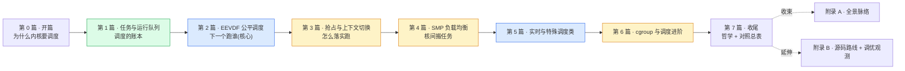

# 《Linux 调度器设计与实现深入浅出:少量 CPU 怎么驱动海量任务》—— 目录与导读

> 一本写给"写过 Linux 用户态程序、甚至翻过 `kernel/sched/`,却总觉得一知半解"的人的小书。
>
> **一句话主旨**:少量物理 CPU 要公平、高效地驱动海量任务——调度器决定下一个跑谁、跑多久、何时被打断、负载怎么在多核间均衡,在公平、优先级、吞吐、响应之间平衡。
>
> **二分法**(迷路时回到它):**策略层**(给定 runqueue,下一个跑谁:EEVDF 公平、RT 实时、deadline 截止期) vs **机制层**(怎么落实:上下文切换、抢占时机、SMP 负载均衡、cgroup 限额)。
>
> **★ 对照《Go runtime》(第 7 本)**:内核级抢占式通用调度 vs 语言级协作式轻量调度,合成"调度全栈"。标 ★ 的章有对照栏。
>
> **基调**:直球讲透为主,比喻只在反直觉处点睛——延续《LevelDB》/Linux mm。

每章一行:**一句话钩子** —— 技巧标签 —— 二分法归属(`策略` / `机制` / `支撑` / `收束`)。

---

## 全书结构总览

旅程:从"CPU 是稀缺共享资源 + 公平/优先级矛盾",到"任务怎么表示、怎么入队",到"EEVDF 怎么挑下一个、nice 怎么定权重、PELT 怎么跟踪负载",到"怎么抢占、怎么上下文切换",再到"多核怎么负载均衡、实时任务怎么抢占、cgroup 怎么限额"。每篇都是这条路上的一个驿站——读完你能在脑子里放映出内核调度的全过程。

---

## 第 0 篇 · 开篇:为什么内核要自己调度

- [P0-01 · 第一性原理:为什么内核要调度](P0-01-第一性原理-为什么内核要调度.md) —— CPU 稀缺共享 + 多任务并发幻觉 + 公平/优先级/吞吐/响应矛盾;内核必须管下一个跑谁;调度器全貌(policy/mechanism/支撑)。 —— 策略 vs 机制的根本张力 —— `总览`

## 第 1 篇 · 任务与运行队列:调度的账本

> 源码 `kernel/sched/core.c`、`kernel/sched/sched.h`(内部头)、`include/linux/sched.h`(`task_struct`)。**建议顺序读**(表示→队列→时钟→生命周期)。

- [P1-02 · task_struct 与 sched_entity:任务怎么表示](P1-02-task_struct与sched_entity-任务怎么表示.md) —— task_struct/sched_class 多态/sched_entity(任务+组复用)/prio·nice·policy 字段。 —— sched_class 多态 + sched_entity 嵌入 —— `支撑`
- [P1-03 · rq、cfs_rq、rt_rq:运行队列](P1-03-rq-cfs_rq-rt_rq-运行队列.md) —— 每 CPU 一个 rq,内含 cfs_rq/rt_rq/dl_rq 子队列,rq->lock/rq->curr。 —— per-CPU rq + 细粒度 rq->lock —— `支撑`
- [P1-04 · 时钟:sched_clock、tick 与 hrtick](P1-04-时钟-sched_clock-tick与hrtick.md) —— 调度心跳:sched_clock/scheduler_tick/hrtick 高精度抢占。 —— hrtick 精确抢占 —— `支撑`
- [P1-05 · 任务的入队出队:enqueue/dequeue/wakeup](P1-05-任务的入队出队-enqueue-dequeue-wakeup.md) —— fork 激活/阻塞停用/try_to_wake_up 唤醒 + select_task_rq 选核。 —— wakeup 的选核 + cache 亲和 —— `机制`

## 第 2 篇 · EEVDF 公平调度:下一个跑谁 ⚠️ 核心 ★对照第7本

> 源码主体 `kernel/sched/fair.c`(全书最大最核心)、`kernel/sched/features.h`。EEVDF 是 6.6 替代 CFS 的重头,老资料全过时。

- [P2-06 · 从 CFS 到 EEVDF:为什么换](P2-06-从CFS到EEVDF-为什么换.md) ★ —— CFS 的 vruntime + 红黑树及其局限(延迟保障弱/体重不公平)→ 6.6 EEVDF。 —— CFS vruntime 的直觉与缺陷 —— `策略`
- [P2-07 · EEVDF 算法:lag、eligibility、virtual deadline](P2-07-EEVDF算法-lag-eligibility-virtual-deadline.md) ★ —— lag 欠账/eligible 资格/virtual deadline 截止;pick = eligible 里最早 deadline。 —— EEVDF 三件套 —— `策略`
- [P2-08 · nice 与权重:从 nice -20..19 到 timeslice](P2-08-nice与权重-从nice到timeslice.md) ★ —— nice → prio_to_weight 查表 → 时间片占比;renice 改了什么。 —— nice→weight 非线性查表 —— `策略`
- [P2-09 · PELT 负载跟踪:per-entity 的 load_avg/util_avg](P2-09-PELT负载跟踪-load_avg-util_avg.md) —— 几何级数衰减的 per-entity 负载/利用率,驱动均衡与频调。 —— PELT 几何衰减 —— `支撑`
- [P2-10 · EEVDF 的 pick_next_fair 与时间片](P2-10-EEVDF的pick_next_fair与时间片.md) ★ —— 选最早 deadline 的 entity、按权重比例算本周期时间片。 —— 动态时间片 —— `策略`

## 第 3 篇 · 抢占与上下文切换:怎么落实跑

> 选下一个谁只是决策;切过去、还能让被打断的任务之后恢复,是机制硬骨头。

- [P3-11 · 抢占点与 TIF_NEED_RESCHED](P3-11-抢占点与TIF_NEED_RESCHED.md) —— TIF_NEED_RESCHED 标志 + 抢占点 + preempt_count 控制可否抢。 —— 延迟抢占 —— `机制`
- [P3-12 · __schedule 与 pick_next_task](P3-12-__schedule与pick_next_task.md) —— 主调度函数:关抢占/拿 rq->lock/sched_class 链遍历挑下一个/context_switch。 —— sched_class 链按优先级遍历 —— `机制`
- [P3-13 · 上下文切换 switch_to](P3-13-上下文切换-switch_to.md) ★ —— context_switch→switch_to(切内核栈+寄存器+FPU)+finish_task_switch。 —— switch_to 栈切换 + 两返回点 —— `机制`

## 第 4 篇 · SMP 负载均衡:核间搬任务

> 多核:一个核忙死、一个核闲死不行。

- [P4-14 · 调度域与调度组:sched_domain/sched_group](P4-14-调度域与调度组-sched_domain-sched_group.md) —— SMP 拓扑抽象成调度域层次(核→物理CPU→NUMA)。 —— 调度域分层保 cache 局部性 —— `机制`
- [P4-15 · load_balance:周期均衡与 idle 均衡](P4-15-load_balance-周期均衡与idle均衡.md) —— load_balance(sched_balance_rq)周期 pull/idle_balance 主动 pull/选最忙。 —— pull 模型 + 迁移代价评估 —— `机制`
- [P4-16 · 任务迁移与 CPU 亲和](P4-16-任务迁移与CPU亲和.md) —— 迁移的 cache 代价/sched_setaffinity 掩码/cpuset/migration 线程。 —— 迁移代价 + 亲和掩码 —— `机制`

## 第 5 篇 · 实时与特殊调度类

> CFS/EEVDF 只管 SCHED_NORMAL/BATCH;实时与特殊任务有专门调度类。

- [P5-17 · RT 实时调度:rt_rq 与 RT throttling](P5-17-RT实时调度-rt_rq与RT-throttling.md) —— SCHED_FIFO/RR 按 prio 绝对抢占/位图 O(1) 选最高/RT throttling 95% 上限。 —— RT 位图 O(1) + throttling —— `策略`
- [P5-18 · deadline 调度 + idle + stop](P5-18-deadline调度-idle-stop.md) ★ —— SCHED_DEADLINE(EDF+CBS)/idle 兜底/stop 特权类。 —— EDF + CBS + stop 特殊地位 —— `策略`

## 第 6 篇 · cgroup 与调度进阶

- [P6-19 · cgroup cpu:组调度与 bandwidth 限额](P6-19-cgroup-cpu-组调度与bandwidth限额.md) —— cpu 子系统分组/task_group 复用 sched_entity/cpu.max 限额 + 超额 throttle。 —— 组调度 + bandwidth throttle —— `机制`
- [P6-20 · NUMA balancing + 调度可观测与调参](P6-20-NUMA-balancing-调度可观测与调参.md) —— NUMA balancing 采样迁移/proc/sched_debug/chrt/renice/taskset + sched_ext 展望。 —— NUMA balancing 故障率采样 —— `机制`

## 第 7 篇 · 收尾:哲学与对照总表

- [P7-21 · Linux 调度器的哲学 + ★对照 Go runtime 总表](P7-21-Linux调度器的哲学-对照第7本总表.md) —— 延迟抢占/per-CPU 细粒度锁/sched_class 多态/PELT 衰减/调度域分层/组调度复用;Linux 调度器 vs Go GMP 对照总表。 —— 内核通用 vs 语言轻量调度全栈 —— `收束`

## 附录

- **附录 A · 全景脉络** —— 任务从 fork 到 running 的端到端时序 + SMP 均衡全景 + 抢占/切换状态机。
- **附录 B · 源码阅读路线与延伸** —— `kernel/sched/` 阅读地图、`/proc/sched_debug`/`<pid>/sched`/`loadavg`/`perf sched`/`trace-cmd` 观测、与 BSD/Windows/Go runtime 对照、调参。

---

## 推荐阅读路线

**主线(推荐)**:P0-01 → 第 1 篇全(P1-02~05,顺序读)→ 第 2 篇(P2-06~10,核心)→ 第 3 篇(P3-11~13)→ 第 4 篇(P4-14~16)→ 第 5 篇(P5-17~18)→ 第 6 篇(P6-19~20)→ 第 7 篇(P7-21)→ 附录 A。

按目标速查:

| 你的目标 | 读这几章 |
|------|------|
| 只想懂"下一个跑谁怎么决定" | P0-01 → P1-02 → P2-06 → P2-07 → P2-10 |
| 只想懂 EEVDF 为什么取代 CFS | P2-06 → P2-07 → P7-21 |
| 只想懂上下文切换/抢占 | P3-11 → P3-12 → P3-13 |
| 只想懂多核负载均衡 | P1-05(选核)→ P4-14 → P4-15 → P4-16 |
| 只想懂实时任务 | P5-17 → P5-18 |
| 和 Go runtime GMP 对照 | P1-03 → P3-13 → P4-15 → P7-21 |
| 想读 kernel/sched/ 源码 | 附录 B(阅读地图)+ 跟着本书章节啃 |

> 一个提醒:第 2 篇(EEVDF)是最大重头,有顺序依赖(EEVDF 算法 P2-07 是核心,nice P2-08 / PELT P2-09 / pick P2-10 都围着它);第 3 篇(抢占/切换)依赖第 1 篇(runqueue);第 4 篇(SMP 均衡)依赖第 2 篇(PELT 负载)。

---

## 配套文件

- [全书规划-总纲](全书规划-总纲.md) —— 主线、二分法、分篇分章、Linux 源码策略、写作约定、内核 C 技巧侧重、★对照 Go runtime 特色。
- [_章节写作提示词](_章节写作提示词.md) —— 写作执行手册(铁律、四段式、技巧精解、★对照栏、宏/体系结构注意、自检清单、附 21 章清单与并行分组)。
- 源码(本地):`../linux/kernel/sched/` + `../linux/kernel/time/` + `../linux/include/linux/sched.h`(Linux 6.9,清华 tarball 解压)。本书所有源码引用均经 Grep/Read 核实行号。

---

> 这本书讲的不是"Linux 调度怎么调优",而是"内核调度器凭什么这么设计、`kernel/sched/fair.c`/`core.c` 里那些 EEVDF lag、PELT 衰减、`switch_to` 栈切换、`load_balance` 到底在干什么"。读完,你该能在脑子里放映出内核调度的全过程——一个任务怎么被选中、怎么切上去、怎么在核间被搬来搬去——并看清它和 Go runtime GMP 这对"全栈"的同与不同。
