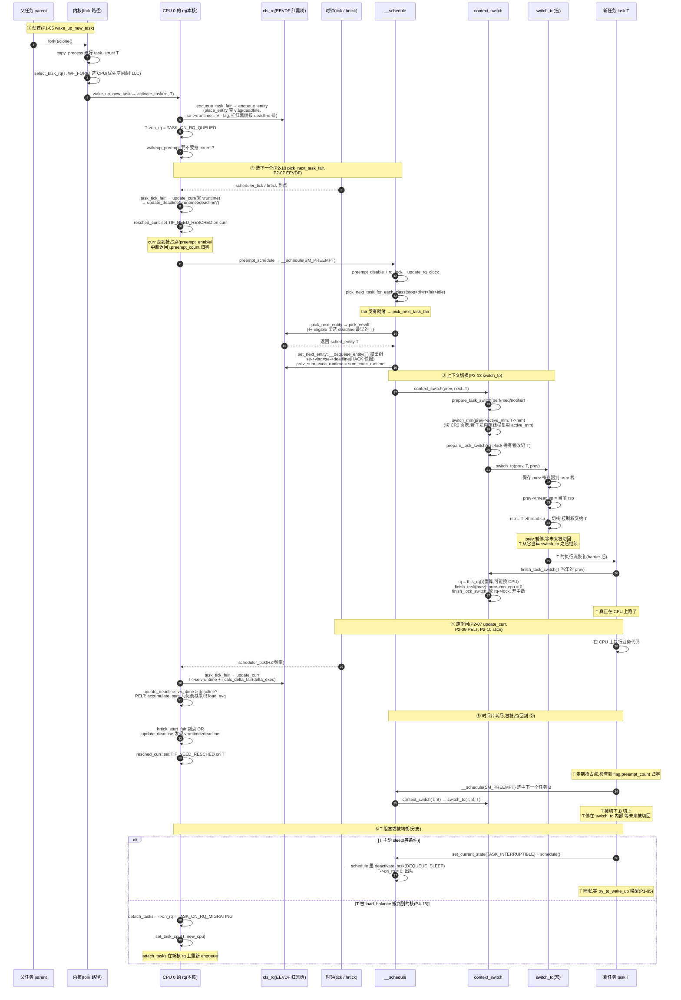
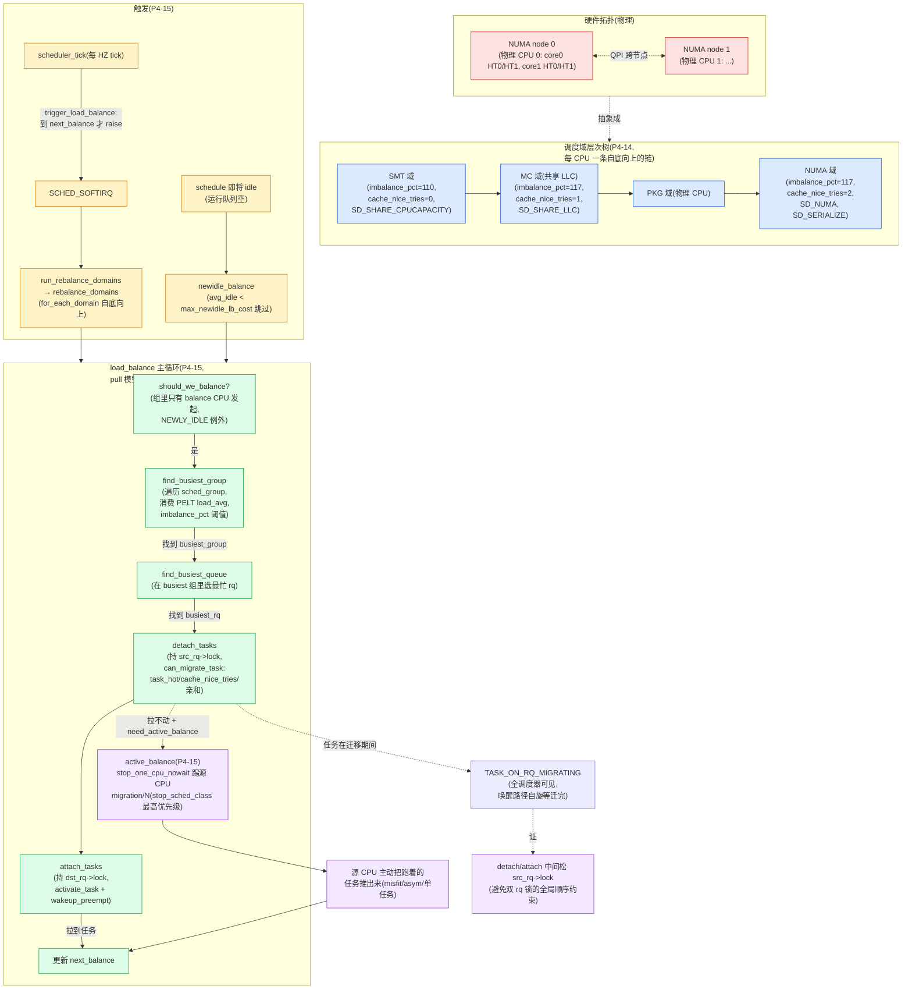
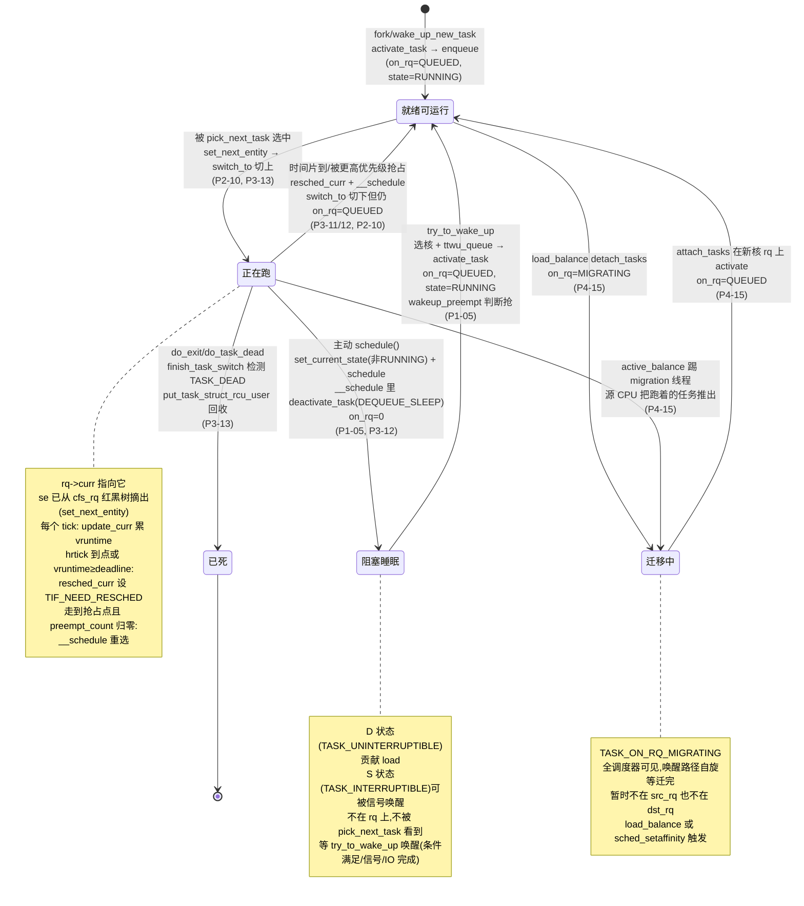

# 附录 A · 全景脉络

> 一张图看懂全书。本附录把前 20 章缝成**端到端旅程**——任务从 `fork` 到 running、从 running 到阻塞、从被唤醒到再被选中、以及在核间被搬来搬去的全过程。以图为主(mermaid 时序图 + 状态图 + 流程图),配少量说明。如果你读完 20 章后想"在脑子里放映一遍内核调度的全过程",这里是放映厅。

本附录三张图:

- **图 A-1**:任务从 `fork` 到 running 的端到端时序总图(串起 activate_task → enqueue_entity → pick_next_task → context_switch → switch_to → scheduler_tick → resched → 再 schedule)。
- **图 A-2**:SMP 负载均衡全景图(调度域分层 → load_balance → detach/attach)。
- **图 A-3**:抢占/切换状态机(任务的可运行/阻塞/被抢占流转)。

---

## 图 A-1:任务从 fork 到 running 的端到端时序

这张图串起全书最核心的一条路径:一个任务从被 `fork` 创建,到被 EEVDF 选中,到上下文切换切上去跑,到时间片耗尽被抢占,再到被重新选中。涉及章节:P1-05(入队)、P2-07/10(EEVDF 选)、P3-11/12/13(抢占/`__schedule`/`switch_to`)、P1-04(时钟/tick)。



### 图 A-1 读图要点

1. **(1)→(2) fork 创建到入队**:父任务调 `fork` → 内核 `copy_process` 建好新 `task_struct` → `wake_up_new_task` → `select_task_rq` 选个 CPU(优先 prev_cpu/同 LLC idle 核)→ `activate_task` → `enqueue_task_fair` → `enqueue_entity`。`place_entity` 用 `vlag` 补偿算 `se->vruntime = V - lag` 和 `se->deadline`(第 7 章 EEVDF)。
2. **(2)→(3) 抢占点到 `__schedule`**:时钟 tick 或 hrtick 到点 → `task_tick_fair` 更新 vruntime、检查 deadline → `resched_curr` 设 `TIF_NEED_RESCHED` → curr 走到抢占点(`preempt_enable`/中断返回)且 `preempt_count` 归零 → `preempt_schedule` → `__schedule`(第 11/12 章)。
3. **(3)→(4) EEVDF 选 + 切换**:`pick_next_task` 遍历 `sched_class` 链 → fair 类的 `pick_next_task_fair` → `pick_eevdf` 在 eligible 任务里选 deadline 最早的 → `set_next_entity` 摘出树 → `context_switch` → `switch_to` 切栈切寄存器(第 7/10/13 章)。
4. **(4)→(5) `switch_to` 的两个返回点**:`switch_to(prev, T, prev)` 之后,代码事实上在 **T 的执行流** 上跑(T 当年被切走时的返回点)。`finish_task_switch` 处理 T 当年的 prev,放锁清 `on_cpu`。T 真正在 CPU 上跑(第 13 章)。
5. **(5)→(6) 跑期间记账**:T 执行业务代码。每个 tick,`update_curr` 把刚跑的时间按权重折算累到 `vruntime`,`update_deadline` 检查 deadline,PELT 几何衰减累积 `load_avg`/`util_avg`(第 7/9 章)。
6. **(6)→(2) 时间片耗尽再抢占**:hrtick 到点或 `vruntime ≥ deadline` → `resched_curr` 设 flag → T 走到抢占点 → `__schedule` 重选下一个 → `switch_to(T, B, T)` 把 T 切下。T 停在 `switch_to` 内部,等未来被切回。
7. **(7) 分支:阻塞或被均衡**:T 可能主动 sleep(`deactivate_task(DEQUEUE_SLEEP)` 出队)或被 `load_balance` 搬到别的核(`TASK_ON_RQ_MIGRATING` 状态)(第 5/15 章)。

---

## 图 A-2:SMP 负载均衡全景

这张图串起第 4 篇(P4-14 调度域、P4-15 `load_balance`、P4-16 迁移)的全过程:从硬件拓扑抽象成调度域层次树,到周期/newidle 触发,到 pull 模型三步走,到 detach/attach 摘挂任务。



### 图 A-2 读图要点

1. **硬件拓扑 → 调度域层次树**:SMT(同核超线程,共享 L1/L2)→ MC(共享 LLC)→ PKG(物理 CPU)→ NUMA。每层有自己的 `imbalance_pct`(SMT 110/MC 117)、`cache_nice_tries`(MC 1/NUMA 2)、`balance_interval`。越往上层,容忍度越高、迁移代价越大、均衡频率越低。
2. **两种触发**:周期均衡(`trigger_load_balance` 在 tick 里 raise `SCHED_SOFTIRQ`,按 `balance_interval` 节奏)和 newidle 均衡(schedule 即将 idle 时主动拉,`avg_idle < max_newidle_lb_cost` 成本闸门)。两个入口共享同一个 `load_balance` 主循环,差别在 `env.idle`。
3. **pull 模型三步走**:`should_we_balance`(组里只有 balance CPU 发起,避免惊群)→ `find_busiest_group`(消费 PELT load_avg,imbalance_pct 阈值)→ `find_busiest_queue`(选最忙 CPU)→ `detach_tasks` + `attach_tasks`。
4. **`TASK_ON_RQ_MIGRATING` 状态机替代双锁**:`detach_tasks` 持 `src_rq->lock`、`attach_tasks` 持 `dst_rq->lock`,中间松锁。任务在迁移期间 `on_rq = TASK_ON_RQ_MIGRATING`,全调度器可见,唤醒路径自旋等迁完——避免双 rq 锁的全局顺序约束。
5. **active balance**:pull 模型对"正在跑"的任务无能为力,通过 `stop_one_cpu_nowait` 踢源 CPU 的 migration 线程(最高优先级 `stop_sched_class`),由源 CPU 主动把任务推出来。处理 misfit(异构算力)/asym packing/单任务等硬场景。

---

## 图 A-3:任务状态流转机(可运行/阻塞/被抢占)

这张图把任务在几种状态间的流转画清:可运行(TASK_RUNNING + on_rq=1)、正在跑(rq->curr)、阻塞睡眠(TASK_INTERRUPTIBLE/UNINTERRUPTIBLE + on_rq=0)、被迁移(TRANSIENT)、已死(TASK_DEAD)。涉及章节:P1-05(唤醒/睡眠)、P3-11/12(抢占)、P3-13(切换)、P4-15(迁移)。



### 图 A-3 读图要点

1. **就绪可运行 ↔ 正在跑**:这是最频繁的流转。任务被 `pick_next_task` 选中(`set_next_entity` 摘出树)+ `switch_to` 切上 → 进入"正在跑";时间片到或被更高优先级任务抢占(`resched_curr` + `__schedule` + `switch_to` 切下)→ 回到"就绪可运行"(仍在 `cfs_rq` 上,`on_rq=QUEUED`)。
2. **正在跑 → 阻塞睡眠**:任务调 `schedule()` 主动让出(等条件/IO/锁)。`__schedule` 检查 `prev->__state` 非 RUNNING,调 `deactivate_task(DEQUEUE_SLEEP)` 出队,`on_rq=0`。注意:阻塞和切换发生在**同一次** `__schedule` 里(第 5 章)。
3. **阻塞睡眠 → 就绪可运行**:`try_to_wake_up` 唤醒——拿 `pi_lock`、`smp_mb__after_spinlock`、`select_task_rq` 选核、`set_task_cpu`、`ttwu_queue` → `ttwu_do_activate`(activate_task 入队 + wakeup_preempt 判断抢)。唤醒路径的内存序(`on_cpu` 的 release/acquire 配对)防丢唤醒和 schedule 中途冲突(第 5 章)。
4. **就绪可运行 ↔ 迁移中**:`load_balance` 的 `detach_tasks` 把任务从源 rq 摘下(`on_rq=MIGRATING`),`attach_tasks` 在目标 rq 上重新 enqueue。`TASK_ON_RQ_MIGRATING` 状态让任务"在迁移中"对全调度器可见,唤醒路径自旋等迁完(第 15 章)。
5. **正在跑 → 已死**:任务 `do_exit`/`do_task_dead`,`finish_task_switch` 检测 `TASK_DEAD`,调 `put_task_struct_rcu_user` 回收 `task_struct`。这是任务最后一次切换——不会再被切回(第 13 章)。

---

## 附:数据结构嵌套速查

把全书反复出现的几个核心数据结构画成一张嵌套图,帮你记住"谁套着谁":

```
 物理 CPU N
   └─ struct rq (每 CPU 一个,DEFINE_PER_CPU_SHARED_ALIGNED)
       ├─ raw_spinlock_t __lock      (本 rq 一致性锁)
       ├─ unsigned int nr_running    (cfs+rt+dl 总和)
       ├─ struct task_struct *curr   (当前在跑)
       ├─ struct task_struct *idle   (idle 线程)
       ├─ struct task_struct *stop   (migration/stop 线程)
       ├─ struct cfs_rq cfs          (公平子队列)
       │    ├─ struct load_weight load       (总权重)
       │    ├─ unsigned int nr_running / h_nr_running
       │    ├─ s64 avg_vruntime              (EEVDF 的 V)
       │    ├─ u64 min_vruntime              (单调基准)
       │    ├─ struct rb_root_cached tasks_timeline  (按 deadline 排的红黑树)
       │    │     └─ 挂着 struct sched_entity (augmented, 每节点带 min_vruntime)
       │    │           ├─ struct load_weight load   (权重)
       │    │           ├─ u64 vruntime / deadline / slice
       │    │           ├─ s64 vlag                (EEVDF 欠账)
       │    │           ├─ struct sched_avg avg     (PELT)
       │    │           └─ struct cfs_rq *my_q      (非 NULL=是组,下钻)
       │    └─ struct sched_entity *curr   (本队列当前在跑的 se)
       ├─ struct rt_rq rt            (实时子队列)
       │    ├─ struct rt_prio_array active
       │    │     ├─ DECLARE_BITMAP(bitmap, 101)   (位图,O(1) 选最高 prio)
       │    │     └─ struct list_head queue[100]   (100 条 prio 链表)
       │    ├─ u64 rt_time / rt_runtime            (throttle 配额)
       │    └─ int rt_throttled
       ├─ struct dl_rq dl            (deadline 子队列)
       │    ├─ struct rb_root_cached root          (按 deadline 排红黑树,EDF)
       │    └─ struct { u64 curr, next; } earliest_dl
       ├─ u64 clock / clock_task / clock_pelt      (三套时钟)
       ├─ struct sched_domain *sd                  (调度域链根, P4-14)
       ├─ struct root_domain *rd                   (根域, 跨核共享忙/闲位图)
       └─ struct hrtimer hrtick_timer              (hrtick 高精度定时器, P1-04)

 struct task_struct (include/linux/sched.h)
   ├─ int on_rq                  (0/QUEUED/MIGRATING)
   ├─ int prio / static_prio / normal_prio
   ├─ unsigned int rt_priority
   ├─ struct sched_entity se     (公平调度实体,内嵌)
   ├─ struct sched_rt_entity rt  (实时调度实体)
   ├─ struct sched_dl_entity dl  (deadline 调度实体)
   ├─ const struct sched_class *sched_class  (指向 stop/dl/rt/fair/idle 之一)
   └─ unsigned int policy        (SCHED_NORMAL/FIFO/RR/DEADLINE/BATCH/IDLE)

 struct sched_class (sched.h:2261, 用 linker section 排序)
   ├─ enqueue_task / dequeue_task / yield_task
   ├─ pick_next_task / put_prev_task / set_next_task
   ├─ task_tick / task_fork / task_dead
   ├─ select_task_rq / migrate_task_rq  (SMP)
   └─ update_curr / wakeup_preempt / ...

 五个 sched_class 实例(按优先级从高到低,for_each_class 遍历):
   stop_sched_class (stop_task.c) > dl_sched_class (deadline.c) >
   rt_sched_class (rt.c) > fair_sched_class (fair.c, EEVDF) >
   idle_sched_class (idle.c)
```

这张嵌套图把全书的核心数据结构——`rq` 套 `cfs_rq`/`rt_rq`/`dl_rq`、`cfs_rq` 套红黑树、树挂 `sched_entity`、`task_struct` 内嵌三个调度实体 + `sched_class` 指针、五个 `sched_class` 实例按优先级排序——一次性钉死。配合前面三张时序/状态/流程图,你应该能在脑子里放映出内核调度的全过程。

---

> 这个附录是"一张图看懂全书"的放映厅。如果你读完正文 20 章后想快速回忆"内核调度到底在干什么",回到这里看三张图 + 一张嵌套图就够了。想看每个步骤底下的源码细节和技巧精解,回到对应章节。
