# 附录 B · 源码阅读路线与延伸

> 读完 20 章正文,你想自己啃 `kernel/sched/` 源码、想观测调度器运行、想了解其他系统的调度器、想调参或试验。这个附录给你四样东西:① `kernel/sched/` 的**阅读地图**(按本书篇章顺序的"先读哪个文件、哪个函数"路线表);② 调度**可观测工具**(`/proc/sched_debug`/`<pid>/sched`/`loadavg`/`perf sched`/`trace-cmd`/`tuna` 怎么用);③ 与 **BSD/Windows/Go runtime** 的调度器对照表;④ **调参指南**(`sched_base_slice`/RT throttling/`cpuset`/EEVDF sysctl,以 6.9 实际为准——老资料里的 `sched_latency_ns`/`sched_min_granularity_ns` 已移除);⑤ 延伸阅读 **sched_ext**(6.12+ eBPF 可编程调度器)。

---

## B.1 `kernel/sched/` 阅读地图

`kernel/sched/` 有十几个 `.c`、一个巨大的内部头 `sched.h`(3484 行)。第一次读容易迷路——文件之间高度耦合,不知道从哪开始。这里按**本书篇章顺序**给一份"先读哪个文件、哪个函数"的路线表。

### B.1.1 阅读顺序总览

```mermaid
flowchart LR
    A["1. 地基<br/>include/linux/sched.h<br/>+ prio.h<br/>(task_struct/sched_entity)"] --> B["2. 运行队列<br/>sched.h (内部头)<br/>+ core.c (rq 定义)"]
    B --> C["3. 时钟<br/>clock.c + core.c<br/>(sched_clock/tick/hrtick)"]
    C --> D["4. 入队出队/唤醒<br/>core.c<br/>(activate/wakeup)"]
    D --> E["5. EEVDF 核心<br/>fair.c<br/>(lag/eligible/deadline)"]
    E --> F["6. nice/PELT<br/>core.c (权重表)<br/>+ pelt.c"]
    F --> G["7. 抢占/切换<br/>core.c<br/>(__schedule/switch_to)"]
    G --> H["8. 负载均衡<br/>fair.c + topology.c"]
    H --> I["9. RT/DL/idle/stop<br/>rt.c + deadline.c<br/>+ idle.c + stop_task.c"]
    I --> J["10. cgroup/NUMA<br/>fair.c (组调度)<br/>+ debug.c"]

    classDef base fill:#dcfce7,stroke:#16a34a
    classDef policy fill:#dbeafe,stroke:#2563eb
    classDef mech fill:#fef3c7,stroke:#d97706
    class A,B,C base
    class E,F,I policy
    class D,G,H,J mech
```



### B.1.2 逐文件阅读路线(按本书章节顺序)

| 顺序 | 文件 | 关键函数/结构 | 对应本书章节 | 阅读重点 |
|------|------|--------------|-------------|---------|
| 1 | [`include/linux/sched.h`](../linux/include/linux/sched.h) | `struct task_struct`(L748-)、`struct sched_entity`(L536-)、`struct sched_avg`(L471-) | P1-02 | 任务怎么表示。重点看 L790-837 的调度字段组(`on_rq`/`prio`/`static_prio`/`se`/`rt`/`dl`/`sched_class`/`policy`)。 |
| 2 | [`include/linux/sched/prio.h`](../linux/include/linux/sched/prio.h) | `MAX_RT_PRIO`/`MAX_PRIO`/`DEFAULT_PRIO`/`NICE_TO_PRIO` | P1-02、P2-08 | 优先级体系。全文仅 45 行,值得通读。 |
| 3 | [`kernel/sched/sched.h`](../linux/kernel/sched/sched.h) | `struct rq`(L985-)、`struct cfs_rq`(L573-)、`struct rt_rq`(L691-)、`struct dl_rq`(L730-)、`struct sched_class`(L2261-)、`DEFINE_SCHED_CLASS`(L2336-)、`for_each_class`(L2345-)、`this_rq`/`cpu_rq`(L1222-) | P1-02、P1-03、P3-12 | **内部头,全书最常引用的文件**。运行队列、调度类、访问宏、锁助手都在这。建议先通读,后面随时回来查字段。 |
| 4 | [`kernel/sched/core.c`](../linux/kernel/sched/core.c) | `DEFINE_PER_CPU(runqueues)`(L119)、`update_rq_clock`(L751)、`scheduler_tick`(L5665)、`hrtick`/`hrtick_start`(L788/L831)、`enqueue_task`/`activate_task`(L2105/L2139)、`try_to_wake_up`(L4231)、`ttwu_do_activate`(L3773)、`resched_curr`(L1041)、`context_switch`(L5353)、`finish_task_switch`(L5240)、`__schedule`(L6616)、`__schedule_loop`(L6819)、`pick_next_task`(L6108)、`preempt_schedule`(L6941)、`sched_prio_to_weight`(L11518)、`sched_prio_to_wmult`(L11536) | P1-03/04/05、P3-11/12/13、P2-08 | **调度器主路径的所在**。建议按"时钟 → 入队 → 唤醒 → 抢占 → `__schedule` → `context_switch` → `finish_task_switch`"的调用顺序读,把主线串起来。 |
| 5 | [`kernel/sched/clock.c`](../linux/kernel/sched/clock.c) | `sched_clock`(L62)、`sched_clock_cpu`(L388)、`sched_clock_data`(L88-) | P1-04 | `sched_clock` 半稳定化。开头那个 "BIG FAT WARNING" 注释(L21)必读,讲清 TSC 跨核倒退问题。 |
| 6 | [`kernel/sched/fair.c`](../linux/kernel/sched/fair.c)(13227 行,全书最大) | `calc_delta_fair`(L296)、`update_curr`(L1162)、`avg_vruntime`(L660)、`entity_lag`(L699)、`vruntime_eligible`(L733)、`entity_eligible`(L749)、`pick_eevdf`(L884)、`update_deadline`(L984)、`place_entity`(L5170)、`pick_next_entity`(L5466)、`set_next_entity`(L5416)、`hrtick_start_fair`(L6630)、`enqueue_task_fair`(L6716)、`select_idle_sibling`(L7509)、`load_balance`(L11259)、`detach_tasks`(L9059)、`attach_tasks`(L9225)、`newidle_balance`(L12289)、`fair_sched_class`(L13115)、`sysctl_sched_base_slice`(L76) | P2-06~10、P4-15、P6-19 | **EEVDF 主体 + 负载均衡主体**,全书最核心的文件。建议分块读:① EEVDF 算法(L260-1100);② enqueue/pick/set(L5100-5600);③ 唤醒选核(L7400-7600);④ 负载均衡(L8800-12500)。 |
| 7 | [`kernel/sched/features.h`](../linux/kernel/sched/features.h) | `SCHED_FEAT(HRTICK, false)`、`SCHED_FEAT(PLACE_LAG, true)`、`SCHED_FEAT(RUN_TO_PARITY, true)`、`SCHED_FEAT(NEXT_BUDDY, false)`、`SCHED_FEAT(WAKEUP_PREEMPTION, true)`、`SCHED_FEAT(TTWU_QUEUE, true)` | 各章技巧精解 | EEVDF 的 feature flag。短文件(~80 行),通读。这些 flag 可通过 `/sys/kernel/debug/sched/features` 运行时开关。 |
| 8 | [`kernel/sched/pelt.c`](../linux/kernel/sched/pelt.c) | `decay_load`(L31)、`accumulate_sum`(L102)、`___update_load_sum`(L180)、`___update_load_avg`(L257)、`__update_load_avg_se`(L306) | P2-09 | PELT 几何衰减。配合 `sched-pelt.h` 的 32 项查表常数读。 |
| 9 | [`kernel/sched/sched-pelt.h`](../linux/kernel/sched/sched-pelt.h) | `runnable_avg_yN_inv[]`(L4)、`LOAD_AVG_MAX`(L14) | P2-09 | 自动生成的查表常数,不要手改。 |
| 10 | [`kernel/sched/topology.c`](../linux/kernel/sched/topology.c) | `sd_init`、`build_sched_domains`、`sched_domain_topology` | P4-14 | 调度域层次树构建。配合 `include/linux/sched/topology.h` 的 `struct sched_domain` 和 `sd_flags.h` 的 `SD_*` 标志读。 |
| 11 | [`kernel/sched/rt.c`](../linux/kernel/sched/rt.c) | `rt_sched_class`(L2648)、`enqueue_task_rt`、`pick_next_task_rt`、`sched_rt_runtime_exceeded`、`push_rt_task`/`find_lowest_rq` | P5-17 | RT 实时调度。重点:位图+链表 O(1) 选 prio、RT throttling、SMP push 模型。 |
| 12 | [`kernel/sched/deadline.c`](../linux/kernel/sched/deadline.c) | `dl_sched_class`(L2815)、`enqueue_task_dl`、`pick_next_task_dl`、`update_curr_dl`、`dl_task_timer`(CBS 补给) | P5-18 | SCHED_DEADLINE。重点:EDF 红黑树、CBS 带宽服务、admission control。 |
| 13 | [`kernel/sched/idle.c`](../linux/kernel/sched/idle.c) | `idle_sched_class`(L528)、`do_idle`/`cpuidle_idle_call` | P5-18 | idle 任务 + cpuidle 省电循环。 |
| 14 | [`kernel/sched/stop_task.c`](../linux/kernel/sched/stop_task.c) | `stop_sched_class`(L106)、`stop_machine` | P5-18、P4-15/16 | 最高优先级特权类。migration 线程和 `stop_machine` 的载体。 |
| 15 | [`kernel/sched/debug.c`](../linux/kernel/sched/debug.c) | `sched_debug_show`、`proc_sched_show_task`、`debugfs_create_*`(L345-) | P6-20、本附录 | `/proc/sched_debug`、`/proc/<pid>/sched`、debugfs 调参的实现。 |

### B.1.3 推荐的"一次完整走读"路线

如果你想一次性走完"调度主循环",按这个调用链读:

```
scheduler_tick (core.c:5665)
  → update_rq_clock (core.c:751)
  → curr->sched_class->task_tick
    [fair] → task_tick_fair → entity_tick → update_curr → update_deadline
      → resched_curr (core.c:1041)  [设 TIF_NEED_RESCHED]

[抢占点] preempt_enable / 中断返回
  → preempt_schedule (core.c:6941)
    → preempt_schedule_common
      → __schedule_loop (core.c:6819)
        → __schedule (core.c:6616)
          → preempt_disable + rq_lock + update_rq_clock
          → pick_next_task (core.c:6108)
            → for_each_class: class->pick_next_task
              [fair] → pick_next_task_fair (fair.c:8398)
                → pick_next_entity → pick_eevdf (fair.c:884)
                → set_next_entity (fair.c:5416)
          → context_switch (core.c:5353)
            → switch_mm_irqs_off (切 CR3)
            → switch_to(prev, next, prev) (core.c:5409, 宏)
            → barrier + return finish_task_switch (core.c:5240)
              → finish_task(prev): prev->on_cpu = 0
              → finish_lock_switch: 放 rq->lock, 开中断
```

这一条链串起了 tick → resched → 抢占点 → `__schedule` → `pick_next_task` → `context_switch` → `switch_to` → `finish_task_switch`,是全书机制层的主干。建议先把它读透,再回头看入队/唤醒/负载均衡/RT 等分支。

---

## B.2 调度可观测:怎么看调度器在干什么

Linux 提供丰富的调度观测接口,分四类:`/proc` 静态状态、`perf sched`/`trace-cmd` 动态追踪、`tuna`/`chrt`/`taskset` 操作工具、debugfs 调参。下面逐个讲怎么用。

### B.2.1 `/proc` 接口(静态状态快照)

| 接口 | 看什么 | 典型用法 | 对应章节 |
|------|--------|---------|---------|
| `/proc/sched_debug` | 每个 CPU 的 rq 状态、`cfs_rq`/`rt_rq`/`dl_rq` 的 `nr_running`、每个 `sched_entity` 的 `vruntime`/`vlag`/`deadline`/`slice`、`load_avg`/`util_avg`、调度域统计(`lb_count`/`lb_failed`/`lb_gained`) | `cat /proc/sched_debug \| head -100`(总览);`cat /proc/sched_debug \| grep -A5 "cpu#0"`(看 CPU 0) | P1-03、P2-07、P4-15 |
| `/proc/<pid>/sched` | 单个任务的调度字段:`se.vruntime`、`se.vlag`、`se.deadline`、`se.slice`、`se.load.weight`、`nr_switches`、`avg_runtime`、`policy`/`prio`、PELT 的 `load_avg`/`util_avg`/`util_est` | `cat /proc/$$/sched`(看自己 shell);`watch -n1 'cat /proc/<pid>/sched \| grep -E "vruntime\|vlag\|deadline"'`(动态看) | P1-02、P2-07/09 |
| `/proc/<pid>/status` | `State`(R/S/D/T)、`voluntary_ctxt_switches`/`nonvoluntary_ctxt_switches`(nvcsw/nivcsw)、`Cpus_allowed`(亲和掩码) | `cat /proc/<pid>/status \| grep -E "State\|ctxt\|Cpus"` | P1-05、P3-13 |
| `/proc/loadavg` | 三个 load 平均(1/5/15 分钟)、`running/total` 任务数、最近创建的 PID | `cat /proc/loadavg` → `0.52 0.43 0.35 2/150 1234` | P1-05(D 状态贡献 load) |
| `/proc/<pid>/stat` | `utime`/`stime`/`cutime`/`cstime`(时钟节拍数)、`priority`/`nice`、`num_threads`、`vsize`/`rss` | `awk '{print "utime="$14,"stime="$15,"nice="$19}' /proc/<pid>/stat` | P1-04、P2-08 |
| `/proc/<pid>/schedstat` | 三个数:`sum_exec_runtime`(总运行 ns)、`sum_sleep_runtime`、`nr_switches`/`nr_migrations` | `cat /proc/<pid>/schedstat` | P1-05、P4-16 |
| `/proc/schedstat` | 每个 CPU 的调度域树 + 每个域的 `lb_count`/`lb_failed`/`lb_gained`/`lb_hot_gained` 等负载均衡统计 | `cat /proc/schedstat \| head -50` | P4-14/15 |

> **注意**:`/proc/sched_debug` 和 `/proc/<pid>/sched` 需要 `CONFIG_SCHED_DEBUG=y`(多数发行版默认开)。`/proc/schedstat` 需要 `CONFIG_SCHEDSTATS=y`。

### B.2.2 `perf sched`(动态调度时延分析)

`perf sched` 是分析调度时延的招牌工具,基于 `sched:sched_switch`/`sched:sched_wakeup` 等 tracepoint。

```bash
# 录制调度事件(跑你的负载)
perf sched record -- sleep 5

# 看每个任务的调度延迟分布(谁等最久)
perf sched latency --sort max

# 看调度时间线(谁切给谁,何时切)
perf sched map | head -50

# 看脚本化报告
perf sched script | head -100
```

`perf sched latency` 输出例:

```
  -------------------------------------------------------------------
   Task                  |   Runtime ms  | Switches | Avg delay ms  | Max delay ms  | Max delay at           |
  -------------------------------------------------------------------
   foo::worker           |      1234.567 |      854 |       0.234   |       5.678   | 12345.678 seconds ago  |
   ...
```

"延迟" = 从任务被唤醒(`sched_wakeup`)到真正被调度上(`sched_switch` 的 next)的时间。EEVDF 的 deadline 保障应该让尾延迟(99%)更稳定。

### B.2.3 `trace-cmd` + `KernelShark`(更灵活的 tracepoint 追踪)

`trace-cmd` 是 ftrace 的命令行前端,`KernelShark` 是它的 GUI。

```bash
# 录制调度相关 tracepoint
trace-cmd record -e sched -e power:cpu_frequency -- sleep 3

# 看文本报告
trace-cmd report | head -100

# 或者 GUI 看时间线
kernelshark trace.dat
```

关键 sched tracepoint:

| tracepoint | 何时触发 | 看什么 |
|-----------|---------|--------|
| `sched:sched_switch` | 每次上下文切换 | `prev_comm/next_comm`、`prev_state`、`prev_pid/next_pid` |
| `sched:sched_wakeup`/`sched_wakeup_new` | 任务被唤醒 | `comm/pid`、`target_cpu` |
| `sched:sched_migrate_task` | 任务跨核迁移 | `comm/pid`、`orig_cpu`/`dest_cpu` |
| `sched:sched_process_fork`/`exit` | fork/exit | `parent_comm`/`child_comm` |
| `sched:sched_stat_runtime` | 每次 `update_curr` | `comm/pid`、`runtime(ns)`、`vruntime` |
| `sched:sched_stat_sleep`/`iowait` | 任务开始 sleep/iowait | `comm/pid`、`delay(ns)` |

只看特定任务:`trace-cmd record -e sched -P <pid>`。只看切换:`trace-cmd record -e sched:sched_switch`。

### B.2.4 `tuna`/`chrt`/`renice`/`taskset`(操作工具)

| 工具 | 作用 | 典型用法 |
|------|------|---------|
| `chrt` | 改调度策略/优先级(RT/deadline) | `chrt -f 80 ./task`(SCHED_FIFO prio 80)、`chrt -r 50 ./task`(SCHED_RR)、`chrt -i 0 ./task`(SCHED_IDLE)、`chrt -p <pid>`(查看) |
| `renice` | 改 nice 值 | `renice -n 5 -p <pid>`(nice +5)、`renice -n -10 -p <pid>`(需 root) |
| `taskset` | 改 CPU 亲和掩码 | `taskset -c 0,1 ./task`(只在 CPU 0/1 跑)、`taskset -pc 0-3 <pid>`(改运行中任务) |
| `tuna` | 综合 GUI/CLI 调优 | `tuna --sockets=0 --threads`、`tuna -t <thread> -c 2 -p 80`(改亲和+优先级) |
| `nice` | 启动时设 nice | `nice -n 5 cmd` |
| `schedtool` | 更底层的调度工具(发行版自带) | `schedtool -F 80 <pid>` |

### B.2.5 debugfs 调参(`/sys/kernel/debug/sched/`)

需要挂载 debugfs(`mount -t debugfs none /sys/kernel/debug`)且 `CONFIG_SCHED_DEBUG=y`。6.9 里可用的 knob(注意老资料里的 `sched_latency_ns`/`sched_min_granularity_ns` 已移除):

| 路径 | 含义 | 默认(6.9) | 对应章节 |
|------|------|-----------|---------|
| `/sys/kernel/debug/sched/base_slice_ns` | EEVDF 常量时间片(原 `sysctl_sched_base_slice`) | 750000(0.75ms) | P2-10 |
| `/sys/kernel/debug/sched/migration_cost_ns` | 迁移 cache hot 阈值(`task_hot`) | 500000(500µs) | P4-15 |
| `/sys/kernel/debug/sched/nr_migrate` | 一次 `load_balance` 最多迁几个任务 | 32 | P4-15 |
| `/sys/kernel/debug/sched/features` | EEVDF feature flag 开关(`HRTICK`/`NEXT_BUDDY`/`WAKEUP_PREEMPTION`...) | 见 features.h | 各章技巧精解 |
| `/sys/kernel/debug/sched/verbose` | `/proc/sched_debug` 详尽模式 | 0 | 本附录 |
| `/sys/kernel/debug/sched/preempt` | (CONFIG_PREEMPT_DYNAMIC)运行时切 voluntary/full | 取决于编译 | P3-11 |
| `/proc/sys/kernel/sched_rt_period_us` | RT throttle 周期 | 1000000(1s) | P5-17 |
| `/proc/sys/kernel/sched_rt_runtime_us` | RT throttle 配额(占 period 的多少) | 950000(95%) | P5-17 |
| `/proc/sys/kernel/sched_rt_runtime_us = -1` | 关闭 RT throttling(危险,仅调试用) | — | P5-17 |

开 hrtick 例:`echo HRTICK > /sys/kernel/debug/sched/features`。关 RT throttling:`echo -1 > /proc/sys/kernel/sched_rt_runtime_us`(警告:一个失控 RT 死循环能挂死整机)。

---

## B.3 与其他系统调度器的对照

把 Linux 调度器放回更广的语境,看其他系统怎么做调度。

### B.3.1 跨系统调度器对照表

| 维度 | Linux 6.9(本书) | FreeBSD ULE | Windows | macOS | Go runtime(第 7 本) |
|------|------------------|-------------|---------|-------|----------------------|
| **普通任务算法** | EEVDF(6.6 起,lagn/eligible/deadline) | ULE(Ultra-Lan scheduler,交互式启发式 + 性能分层) | 多级反馈队列(优先级 + 量子上限) | Multi-level feedback queue(类似 Windows) | FIFO + runnext + work-stealing(无显式公平算法) |
| **实时类** | SCHED_FIFO/RR(prio 位图)、SCHED_DEADLINE(EDF+CBS) | SCHED_FIFO/RR(类似的 POSIX rt) | 优先级 16-31(realtime)+ 区分优先级的 quantum | 优先级带(preempt 类) | 无 goroutine 级实时 |
| **数据结构(公平)** | augmented rbtree(按 deadline 排) | 三个队列(runq/batch/idle)+ CPU 指针 | 多级就绪队列数组 | 多级队列 | 每 P 一个本地环形数组(256)+ runnext 槽 |
| **per-CPU 队列** | 是(`DEFINE_PER_CPU(runqueues)`) | 是(每 CPU 一个 runq) | 是(每 CPU 一个 KPRC) | 是 | 是(每 P 一个 local runq) |
| **负载均衡** | pull 模型,sched_domain 分层(认 cache/NUMA) | 跨 CPU 偷任务 + 拓扑感知 | 跨 CPU 偷任务 | NUMA 感知均衡 | work-stealing(空闲 P 偷忙 P 一半) |
| **时间片** | 常量 `sysctl_sched_base_slice`(0.75ms),权重通过 deadline 紧迫度 | 动态,按交互性 + nice | 动态,优先级 + 量子上限 | 动态,优先级带 + 量子 | 无固定时间片,跑到阻塞或被抢 |
| **优先级** | nice(-20..19)+ RT prio(0-99)+ dl | nice(-20..20)+ RT | 0-31(动态)+ 16-31(RT) | 0-127(带优先级) | 无(全公平) |
| **抢占** | `TIF_NEED_RESCHED` + 抢占点(CONFIG_PREEMPT 三档) | 类似 PREEMPT,中断返回检查 | 抢占(quantum 到点/优先级) | 抢占 | 协作 + 6.x 异步抢占(信号) |
| **cgroup 限额** | 有(`cpu.max` period/quota + throttle) | 类似(jail + rctl) | Job Object | cgroup 类似 | 无 goroutine 级 |
| **可编程调度** | sched_ext(6.12+,eBPF) | 无 | 无 | 无 | 无(但 Go runtime 可改) |

### B.3.2 FreeBSD ULE 的特别说明

FreeBSD 的 ULE(读作 "yule")是和 Linux CFS 同期的设计(2003 年起),思路相近但不完全一样:它用三个队列(runq/batch/idle)区分任务类型,基于交互性启发式(而非纯权重 vruntime)分类。ULE 没有 EEVDF 这种"lag + deadline"的数学公平,而是更传统的"启发式 + 时间片"。对照阅读能看清"权重公平(Linux)"vs"启发式分类(FreeBSD)"两种哲学。

### B.3.3 Windows 调度器的特别说明

Windows 调度器是闭源的,但从文档和逆向看,它是经典的"多级反馈队列 + 优先级":32 个优先级(0-15 普通,16-31 实时),每个优先级一个队列,选最高优先级的队列头。优先级会根据"前台/后台"、CPU 负载动态调整(MLFQ 经典做法)。没有 EEVDF 这种数学公平,但有较强的交互式响应优化。和 Linux 的对照能看清"MLFQ 启发式(Windows)"vs"权重比例公平(Linux EEVDF)"。

---

## B.4 调参指南(以 6.9 实际为准)

**重要**:**6.9 里 CFS 时代的 `sched_latency_ns`/`sched_min_granularity_ns`/`sched_wakeup_granularity_ns`/`sched_child_runs_first` 等旋钮已经全部移除**——EEVDF 把时间片砍成了常量 `sysctl_sched_base_slice`,唤醒抢占改用 deadline 比较。老资料里讲的这些旋钮在 6.6+ 都过时了。

### B.4.1 EEVDF 相关(6.9 实际可用)

| 参数 | 路径 | 默认 | 调大效果 | 调小效果 |
|------|------|------|---------|---------|
| `base_slice_ns` | `/sys/kernel/debug/sched/base_slice_ns` | 750000(0.75ms) | 切换次数减少、吞吐↑、响应延迟↑ | 切换次数增多、响应↓、吞吐↓(太短抖动大) |
| `HRTICK` | `/sys/kernel/debug/sched/features`(写 `HRTICK`) | false | 开了 hrtick,slice 到点精确抢占(亚微秒),适合低延迟场景 | 默认,只用粗 tick(1-4ms 精度) |
| `NEXT_BUDDY` | features | false | 开了让 `cfs_rq->next` 优先(刚唤醒的先跑,cache 热),延迟↓ | 默认,走 `pick_eevdf` 严格 EEVDF |
| `WAKEUP_PREEMPTION` | features | true | 默认开,唤醒的任务符合条件就抢 curr | 关了唤醒不抢(批量场景减少抖动) |
| `PLACE_LAG` | features | true | 默认开,唤醒时用 vlag 跨睡眠保公平 | 关了用老式 vruntime 放置(可能不公平) |
| `RUN_TO_PARITY` | features | true | 默认开,被选中的任务跑到 slice 用完不每 tick 重选 | 关了每 tick 重选(抖动↑) |

> **调参经验**:绝大多数工作负载**不需要调**这些参数——EEVDF 的默认值是精心调过的工程甜蜜点。只在以下场景考虑:
> - **低延迟/实时-ish**(音频、交易):开 `HRTICK`,考虑开 `NEXT_BUDDY`;如果是硬实时用 `SCHED_DEADLINE` 而不是调 fair 参数。
> - **吞吐优先**(批处理、HPC):调大 `base_slice_ns`(比如到 3ms)减少切换,但响应变慢。
> - **调试 EEVDF 行为**:开关 `PLACE_LAG`/`RUN_TO_PARITY` 看差异。

### B.4.2 RT throttling(实时限额)

| 参数 | 路径 | 默认 | 含义 |
|------|------|------|------|
| `sched_rt_period_us` | `/proc/sys/kernel/sched_rt_period_us` | 1000000(1s) | RT throttle 周期 |
| `sched_rt_runtime_us` | `/proc/sys/kernel/sched_rt_runtime_us` | 950000(95%) | 一个周期里 RT 任务最多跑这么多 µs |

调参:
- **`echo -1 > /proc/sys/kernel/sched_rt_runtime_us`**:关掉 RT throttling。**危险**——一个失控的 RT 死循环能挂死整机。只在严格的实时测试环境、确认 RT 任务可靠时用。
- **`echo 1000000 > /proc/sys/kernel/sched_rt_runtime_us`**(等于 period):允许 RT 跑满 100%。比 -1 安全一点(配额到点仍补充),但仍可能让普通任务长时间得不到 CPU。
- **调小 period**(比如 `sched_rt_period_us=100000` 即 100ms):更细粒度的 throttle,RT 任务响应更平滑,但 throttle 触发更频繁。

### B.4.3 cgroup cpu 限额

```bash
# 创建一个 cgroup 并限制 CPU
mkdir /sys/fs/cgroup/mygroup
echo "100000 50000" > /sys/fs/cgroup/mygroup/cpu.max  # quota period: 100ms 配额 50ms = 50% CPU
# (6.x cgroup v2 格式;v1 是 cpu.cfs_quota_us/cpu.cfs_period_us)

# 设权重(相对其他组)
echo 100 > /sys/fs/cgroup/mygroup/cpu.weight  # 默认 100,nice 0 对应的权重

# 把任务放进组
echo $$ > /sys/fs/cgroup/mygroup/cgroup.procs
```

cgroup cpu 超额时整个 `cfs_rq` 被 throttle(`throttle_cfs_rq`),组内所有任务暂停,等下个 period 补配额。看 throttle 统计:`cat /proc/sched_debug | grep -A5 "mygroup"`(或 `cpu.stat` 里的 `nr_throttled`/`throttled_time`)。

### B.4.4 cpuset 与 CPU 亲和

```bash
# 把任务绑到指定 CPU
taskset -c 0,1 ./task          # 启动时
taskset -pc 0-3 <pid>          # 运行中改

# cpuset cgroup(更严格的隔离)
mkdir /sys/fs/cgroup/cpuset_a
echo 0-3 > /sys/fs/cgroup/cpuset_a/cpuset.cpus
echo 0 > /sys/fs/cgroup/cpuset_a/cpuset.mems
echo $$ > /sys/fs/cgroup/cpuset_a/cgroup.procs
```

`taskset`/cpuset 改的是 `p->cpus_ptr` 掩码,调度器只在允许的 CPU 上 pick/migrate 这个任务。配合负载均衡的 `can_migrate_task` 检查亲和约束。

---

## B.5 延伸阅读:sched_ext(6.12+ eBPF 可编程调度器)

**sched_ext**(SCX)是 6.12 合入主线的**可编程调度器框架**,允许用 eBPF 在用户态写自定义调度策略,运行时加载、热切换,不需重启、不改内核源码。这是 `sched_class` 多态的最新用武之地——SCX 本质上就是注册一个新的 `sched_class`(叫 `ext_sched_class`),它的 `pick_next_task`/`enqueue_task` 等回调由 eBPF 程序实现。

### B.5.1 为什么会有 sched_ext

- EEVDF 是**通用**调度器,要服务从交互式到批处理的各种负载,参数是甜蜜点。但某些特殊负载(数据库、游戏、特定微服务)的调度需求可能和 EEVDF 的默认假设不符——比如想让某类任务"绝对优先",或想试验全新的调度算法。
- 改内核源码、重编译、重启,试错成本极高。
- SCX 让你写一个 BPF 程序(`struct sched_ext_ops`),`bpftool` 加载,立刻生效;不满意 `bpftool` 卸载,回到默认调度器。**调度策略变成"可热插拔的用户态代码"**。

### B.5.2 sched_ext 的基本模型

SCX 程序实现一组回调:

```c
/* 简化示意(来自 tools/sched_ext/,非源码原文) */
struct sched_ext_ops {
    s32 (*init)(void);                       /* 加载时 */
    void (*enqueue)(struct task_struct *p, u64 enq_flags);  /* 任务入队 */
    void (*dequeue)(struct task_struct *p, u64 deq_flags);  /* 任务出队 */
    struct task_struct * (*dispatch)(s32 cpu, struct task_struct *prev);  /* 选下一个 */
    void (*runnable)(struct task_struct *p);  /* 任务可运行 */
    void (*running)(struct task_struct *p);   /* 任务开始跑 */
    void (*stopping)(struct task_struct *p, bool runnable); /* 任务停 */
    /* ... */
};
```

你实现 `enqueue`/`dispatch` 就能完全决定"下一个跑谁"。比如:
- **SCX 用户态 FIFO**:简单一个队列,`dispatch` 取队列头。
- **SCX 权重调度**:自己实现一套权重 vruntime(可以是 EEVDF 的变体,也可以完全不同的算法)。
- **SCX 实验性策略**:比如"延迟敏感任务优先"、"NUMA 强约束"、"按 cgroup 自定义"。

### B.5.3 sched_ext 的注意点

- **6.9 未合入主线**(本书源码是 6.9)。SCX 在 6.12 合入(`git log --grep="sched_ext"` 可查)。本书读者要试 SCX,需升级到 6.12+ 并 `CONFIG_SCHED_CLASS_EXT=y`。
- **不是 EEVDF 的替代,是补充**:SCX 默认仍用 EEVDF,用户可加载 SCX 程序覆盖特定调度类行为。卸载 SCX 回到 EEVDF。
- **稳定性**:SCX 有 watchdog,如果 BPF 调度器卡住(比如 `dispatch` 不返回任务),会自动 fallback 到 EEVDF,防挂死。
- **学习资源**:`tools/sched_ext/`(内核源码树)有示例 SCX 调度器(`scx_simple`/`scx_qmap`/`scx_flatcg` 等);Google、Meta 都开源了生产级 SCX 调度器(`scx_rusty`/`scx_lavd`)。

### B.5.4 sched_ext 和本书的关系

SCX 是 `sched_class` 多态(本书第 2、12 章)的极致体现——**"新增调度策略只要写一个新 `sched_class` 实例并挂进链"** 这句话,在 SCX 里变成了"写一个 BPF 程序,运行时加载"。这印证了 Linux 调度器的工程设计之美:核心调度路径(`__schedule`/`pick_next_task` 走 `for_each_class`)十几年来基本不变,策略(CFS → EEVDF → SCX 可编程)不断演进。理解了本书的 `sched_class` 多态,你就理解了 SCX 的根基。

---

## B.6 收尾:从本书往哪去

读完本书 + 这个附录,你拿到了:

1. **一份 Linux 调度器的完整地图**:从第一性原理到 EEVDF 到 `switch_to` 到负载均衡,21 章 + 2 附录覆盖内核调度的全部核心。
2. **一份 `kernel/sched/` 源码阅读路线**:按章节顺序的文件 + 函数清单,你可以按图索骥自己啃源码。
3. **一份调度观测工具清单**:`/proc`/`perf sched`/`trace-cmd`/`tuna`/debugfs,你知道怎么看调度器在干什么、怎么调参。
4. **一份跨系统对照**:Linux vs FreeBSD/Windows/macOS/Go runtime,你看清了各种调度哲学的同与不同。
5. **一份延伸方向**:sched_ext(6.12+)、PREEMPT_RT(实时内核)、EAS(能量感知调度)、core scheduling(核隔离),每个都是一条独立的深入路线。

如果你想继续深入,推荐几条路:

- **PREEMPT_RT**:把内核做成"几乎处处可抢、且有界延迟"的实时内核。本书讲的 `preempt_count`/抢占点/sched_class 是地基,RT 内核在此基础上把更多 spinlock 改成可睡眠锁、把 IRQ handler 线程化。Linux 6.12 起 PREEMPT_RT 已完全合入主线。
- **EAS(Energy Aware Scheduling)**:异构 CPU(ARM big.LITTLE、Intel P/E core)上的能量感知调度。本书的 PELT util_avg、sched_domain `SD_ASYM_CPUCAPACITY` 是它的地基。它让任务按算力需求放到合适大小的核上,省电。
- **core scheduling**:每"core"(物理核,可能多个 HT)一个调度上下文,防侧信道攻击(L1TF/MDS)。本书的 `rq->core`/`sched_core` 相关字段是它的实现。
- **cgroup v2 cpu + PSI(Pressure Stall Information)**:更细粒度的资源隔离 + 压力指标。本书的 bandwidth throttle 是地基,PSI 在其上提供"任务因为缺 CPU/IO/内存而等待的时间"统计。
- **numa balancing 自动调优**:本书第 20 章讲的 NUMA balancing 是基础,生产上还有手动调 `numad`/`numactl`/`mempolicy` 的学问。

本书到此结束。希望你读完之后,下次再看 `kernel/sched/` 源码、再调一个调度延迟问题、再和 Go runtime 的 GMP 对比、甚至自己写一个 sched_ext 调度器,心里都有了这张地图。

---

> **配套**:附录 A(全景脉络)给了三张端到端图 + 数据结构嵌套速查;P7-21 给了七条哲学 + 对照总表。三篇合起来是全书的"快速回忆录"——读完正文后回到这三篇,你能在脑子里放映出内核调度的全过程。
