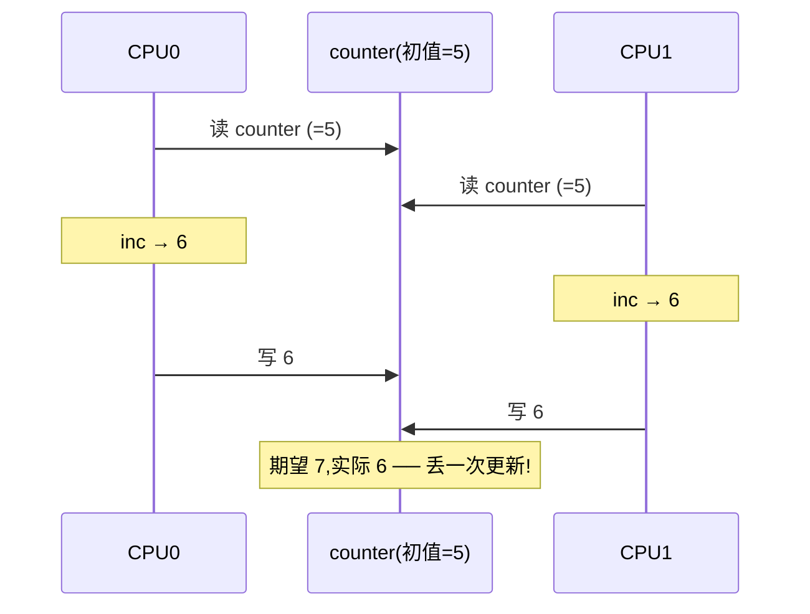
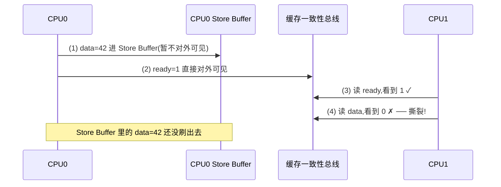
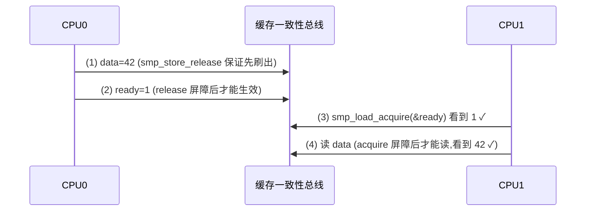
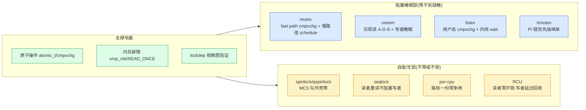
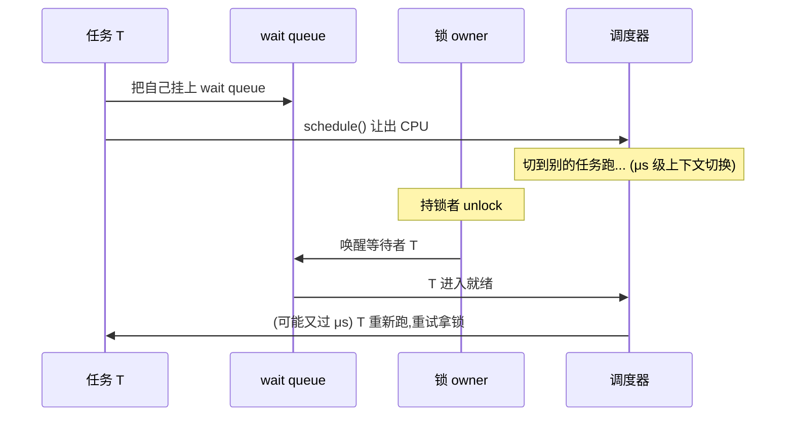
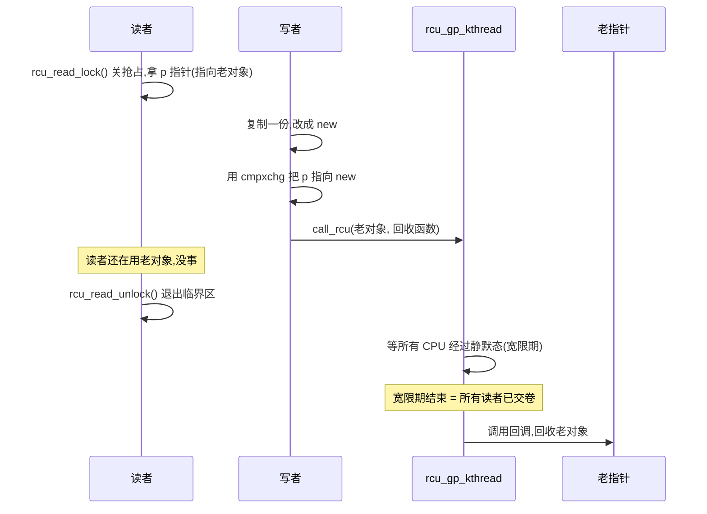

# 第一章 · 第一性原理:为什么多核需要同步

> 篇:P0 开篇
> 主线呼应:这一章是全书的**总览与定调**。你写 `counter++;` 一行代码,在单核上是天经地义的一句;在多核上,它可能丢更新。你用 `pthread_mutex_lock` 保护它,在无竞争时几乎免费、一有竞争就突然要"睡一觉"。你听说 RCU 读者不加锁,写者还能照样改——这听起来像是违法的,可它偏偏 sound。为什么?因为多核共享可变数据,会从三个方向同时攻击你:**竞争**(两个 CPU 同时改)、**可见性**(CPU A 的写 CPU B 看不见)、**有序性**(你写的代码顺序和 CPU 实际执行的顺序不一样)。读完这一章,你就拿到了全书剩余 17 章的钥匙:原子与屏障铺地基、自旋锁类死等、阻塞锁睡眠、读写锁读多写少、RCU 读者零开销——都是为了"既不出错又不被锁拖死"而存在的。

## 核心问题

**为什么单核上好好的程序,放到多核就需要"同步原语"?"不加同步"会从哪三个方向出错?同步原语又怎么分成"阻塞睡眠"和"自旋/无锁"两条路,各自的代价是什么?RCU 凭什么能做到"读者不加锁也不丢更新"?**

读完本章你会明白:

1. 多核共享可变数据的三个攻击面:**竞争**(原子性)、**可见性**(CPU 间看不到对方的写)、**有序性**(CPU 重排打破你的逻辑顺序)。
2. 同步原语的二分法:**阻塞睡眠锁**(mutex/rwsem/futex,等不到就睡,睡在 wait queue 上) vs **自旋/无锁**(spinlock/qspinlock 死等、seqlock 读者不阻塞写者、per-cpu 不竞争、RCU 读者根本不锁)。
3. fast path / slow path 分层:无竞争时一条 `cmpxchg` 搞定(纳秒级),有竞争才进慢路径(自旋或睡眠)——这是内核锁性能的命脉。
4. RCU 的契约:**读者只关抢占(零开销)**,写者复制一份改、老的延迟回收——为什么 sound?因为宽限期保证所有"开始时进入的读者"都退出了。
5. ★ 对照:锁与无锁绝非内核独有——Tokio 的 `cmpxchg`/Pin/无锁队列、Go runtime 的 `sync.Mutex`/channel、内存分配器的 per-CPU cache、调度器的 `rq->lock` 与延迟抢占,处处同源。

---

> **逃生阀**:这一章会出现"内存重排""缓存一致性""宽限期"等概念,如果你之前只写过单线程或用户态多线程、没碰过内核同步,不要慌——本章只立框架,每个概念都给一句话直觉,真正的深挖在第 1~5 篇。读不懂细节没关系,**抓住"阻塞睡眠 vs 自旋/无锁"这个二分法**就够了,它贯穿全书。

## 1.1 一句话点破

> **多核共享可变数据,会同时从竞争、可见性、有序性三个方向出错。同步原语的全部存在意义,就是既堵住这三个攻击面,又不被锁本身拖死。为此内核分了两条路:等不到就睡(mutex/rwsem/futex),要么死等要么根本不锁(spinlock/RCU/per-cpu/seqlock)——前者公平但要付上下文切换的代价,后者要么烧 CPU 要么靠契约绕过锁。RCU 走到极致:读者不取锁、不原子、不缓存行乒乓,代价是写者要延迟回收。每一步都既快又 sound。**

这是结论,不是理由。本章倒过来拆:先看三个攻击面,再看同步原语的两条路,然后用 `mutex_lock` 的 fast path 把"快"立起来,再用 RCU 的零开销读者把"sound"立起来,最后立起 ★对照。

---

## 1.2 攻击面之一:竞争(原子性)

先看最直观的攻击面。假设你有一个全局计数器 `counter`,两个线程同时执行 `counter++;`。这句 C 代码在 x86 上大概是三条指令:

```
  mov  counter, %eax    ; 读
  inc  %eax             ; 改
  mov  %eax, counter    ; 写
```

单核上,这三条指令无论如何交错都安全(只有一个执行流)。多核上就糟了——两个 CPU 同时读、各自加 1、各自写回,**结果丢了一次更新**:



这就是**竞争(race condition)**:读-改-写不是原子的,两个 CPU 的"改"撞在一起,其中一个的成果被另一个覆盖。

**怎么治**:让"读-改-写"变成不可分割的原子操作。要么用 `atomic_inc`(底层是带 `LOCK` 前缀的 `inc` 指令,硬件保证总线独占),要么用 `cmpxchg`(compare-and-swap,compare 失败就重来)。这些是**第 1 篇**(原子操作)的主题。

> **不这样会怎样**:如果没有原子操作,你只能用一把大锁包住 `counter++`,64 核每次自增都抢同一把锁——锁竞争随核数线性恶化,计数器从纳秒变成微秒。第 4 篇的 percpu-rwsem、第 5 篇的 RCU 就是为了"在多核上不再抢同一份共享数据"而生的。

---

## 1.3 攻击面之二:可见性(CPU 之间看不见对方的写)

第二个攻击面更阴险——就算你用了原子操作,也可能踩坑。看这段经典的"消息传递"代码:

```c
int data = 0;
int ready = 0;

// CPU 0(生产者)
void producer(void) {
    data = 42;       // (1) 先写数据
    ready = 1;       // (2) 再置标志
}

// CPU 1(消费者)
void consumer(void) {
    while (ready == 0) ;   // (3) 等标志
    print(data);           // (4) 读数据,期望 42
}
```

直觉上,消费者看到 `ready == 1` 时,`data` 一定已经是 42 了——因为生产者"先写 data 再写 ready"。**但多核上,这个直觉是错的**。原因有两个:

1. **编译器重排**:编译器看不出 `data` 和 `ready` 的逻辑顺序约束,可能把 (2) 排到 (1) 前面"优化"。
2. **CPU 乱序执行 + Store Buffer**:就算编译器没动,CPU 0 自己也可能让 (2) 先生效(Store Buffer 把 (1) 暂存,先让 (2) 对外可见)。CPU 1 于是看到 `ready == 1`,但 `data` 还是 0。



这就是**可见性问题**:CPU 0 的写,CPU 1 在某个时间点可能根本看不到——而且"看到两个变量的顺序"还可能和你写的顺序相反。

**怎么治**:内存屏障。生产者写完 `data` 后,插一个 `smp_store_release(&ready, 1)`(或先 `smp_wmb()` 再 `WRITE_ONCE(ready, 1)`);消费者读 `ready` 用 `smp_load_acquire(&ready)`(或先 `READ_ONCE` 再 `smp_rmb()`)。这对屏障**配对**保证:消费者看到 `ready == 1` 时,生产者 `data = 42` 一定已对它可见。



> **不这样会怎样**:少了屏障,生产者/消费者的执行序就可能撕裂。**这是一个会偶发、难复现、只在多核 + 高负载下才出现的 bug**——在内核里这种 bug 是灾难性的(锁的状态机可能读到撕裂数据,直接死锁或丢更新)。第 1 篇的 P1-03(内存屏障)会深挖 Store Buffer / Invalidate Queue / MESI 协议,把"为什么配对屏障 sound"讲透。

---

## 1.4 攻击面之三:有序性(CPU 和编译器都会重排)

第三个攻击面其实和可见性紧密相关,但值得单拎出来——因为它是"你写的代码顺序"和"实际执行顺序"之间的鸿沟。

CPU 为了性能,会做**乱序执行(out-of-order execution)**:只要单线程语义不变,它就敢把指令重排。编译器也一样,只要"as-if rule"满足(单线程结果不变),它就敢重排。这些重排在单核上是透明的——你看不见、也不会出错。**但在多核共享内存时,这种重排会破坏你的跨核逻辑**(就像 1.3 那段消息传递)。

**这就是为什么内核里有 `READ_ONCE` / `WRITE_ONCE`**:

- `READ_ONCE(x)` 告诉编译器:"读 `x` 这一步不能和相邻的内存访问合并、不能省略、不能重排到屏障外"。
- `WRITE_ONCE(x, v)` 同理,写给编译器的明确指令。

`READ_ONCE` / `WRITE_ONCE` 本身**不提供跨核排序**(那要靠 `smp_mb`/`smp_store_release`/`smp_load_acquire`),但它们是"告诉编译器和 CPU:这里是有跨核语义的共享访问,别用单线程那套重排规则"的最低保险。第 1 篇会详细讲这对宏和屏障家族。

> **钉死这件事**:三个攻击面——**竞争**(原子性)、**可见性**(CPU 间看不到对方的写)、**有序性**(CPU/编译器重排破坏你的逻辑顺序)——是多核共享可变数据的全部灾难来源。同步原语的每一行源码,都是在堵这三个洞中的某一个(或几个)。读任何一章,回到这张表问"它在堵哪个洞",答案就浮出来。

---

## 1.5 同步原语的二分法:阻塞睡眠 vs 自旋/无锁

三个攻击面摆清楚后,下一个问题是:**堵洞的手段那么多,内核怎么组织它们?** 答案是本书的二分法——所有同步原语按"等不到怎么办"分成两条路:

> **阻塞睡眠锁(mutex/rwsem/futex,等不到就睡,睡在 wait queue 上) vs 自旋/无锁(spinlock/qspinlock 死等、seqlock 读者不阻塞写者、per-cpu 不竞争、RCU 读者根本不锁)。**

### 阻塞睡眠一极:等不到就睡

`mutex_lock` 拿不到锁时,不烧 CPU——它把你挂到这把锁的 **wait queue** 上,调用 `schedule()` 让出 CPU 给别的任务跑(回扣调度器那本)。等持锁者 `mutex_unlock` 时,会唤醒 wait queue 上的下一个等待者。

- **好处**:持锁可以很久(睡着的进程不占 CPU),适合**长临界区**(如文件系统 IO、分配内存)。
- **代价**:上下文切换有开销(μs 级,要切内核栈、寄存器、TLB、cache),所以**短临界区用它亏**;而且持锁睡眠要小心优先级反转(第 9 章 rtmutex)。

### 自旋/无锁一极:要么死等要么根本不锁

`spin_lock` 拿不到锁时,**不睡**——它在 CPU 上原地 `cpu_relax()`(本质是 `pause` 指令)死等,反复查锁有没有释放。RCU 读者更激进:**根本不取锁**(只关抢占/禁迁移)。

- **spinlock 的好处**:延迟极低(ns 级),适合**极短临界区**(几条指令,如改一个 per-CPU 计数、改链表头)。
- **spinlock 的代价**:烧 CPU;持锁期间**绝不能睡眠**(否则别的 CPU 死等一个永远不醒的持锁者)——这是 IRQ 上下文不能睡眠的根。
- **RCU 的好处**:读者零开销(纳秒级,只增 preempt 计数,不取锁、不原子、不缓存行乒乓)。
- **RCU 的代价**:写者要延迟回收(等宽限期),且只能保护指针数据结构(读者拿快照)。

### 二分法的命脉



> **为什么这个二分法是命脉**:它直击同步原语的设计分野。睡要付出"上下文切换 + 唤醒延迟"的代价(μs 级),但持锁可以很久;自旋要付出"白白烧 CPU"的代价,但拿锁延迟极低(ns 级),且只在持锁很短时才划算;RCU 走到极致——读者根本不取锁,代价是写者要延迟回收。**所有同步原语的设计,都是在"睡 vs 自旋 vs 不锁"三选一里权衡**。后续每读一章,回到这个二分法问:"这一章属于哪一极?"。

往后任何一处看不懂,回到这个二分法。本书第 2 篇讲自旋锁类(自旋/无锁一极)、第 3 篇讲阻塞锁(阻塞睡眠一极)、第 4 篇讲读写锁(混合)、第 5 篇讲 RCU(自旋/无锁的极致)。

---

## 1.6 ★ 对照:锁与无锁绝非内核独有

本书和系列多本呼应。锁与无锁的思想不是 Linux 内核发明的,也远不限于内核——把它们钉在一起,你才看得到"并发同步"的全貌。

| 层 | 谁 | fast path | 等不到怎么办 |
|---|---|---|---|
| **用户态异步运行时** | **Tokio(《Tokio》第 3 本)** | `AtomicWaker`/无锁 `mpsc` 队列(`cmpxchg`)+ `Pin`(读者不搬走内存) | 任务让出,挂到 reactor |
| **语言级并发** | **Go runtime(《Go runtime》第 7 本)** | `sync.Mutex` fast path = `cmpxchg` + 自旋;`channel` 底层一把 mutex | 自旋失败进 `sema`(futex)睡 |
| **用户态内存分配** | **tcmalloc/jemalloc(《内存分配器》第 8 本)** | per-CPU `thread_local` cache,根本不竞争 | cache miss 才去中心链表 |
| **内核调度器** | **Linux 调度器(第 11 本)** | `rq->lock` 是 spinlock,`preempt_count` 抢占计数,`TIF_NEED_RESCHED` 延迟抢占 | 持锁不能睡(IRQ 上下文) |
| **内核同步原语** | **本书** | mutex `cmpxchg` fast path / RCU 读者关抢占零开销 | 慢路径 schedule 睡 / spinlock 死等 / RCU 写者延迟回收 |

几组关键对照,先记住,后面关键章会展开:

- **fast path cmpxchg**:Go 的 `sync.Mutex` 和内核 mutex 几乎是同款设计——`cmpxchg` 抢 fast path,失败才自旋/睡眠。Tokio 的 `AtomicWaker` 也是 `cmpxchg` 标记唤醒。**fast/slow 分层是跨语言通用的锁优化**。第 8 章 mutex 会正面讲内核版。
- **per-CPU / per-CPU cache**:内存分配器的 `thread_local` / per-CPU 链表,和内核的 per-cpu 计数器、percpu-rwsem 同源——都是"给每个执行流一份本地数据,消灭竞争"。第 12 章 percpu-rwsem 会回扣这本分配器。
- **"读者不搬走内存" / Pin vs RCU**:Tokio 的 `Pin`(把 future 钉在内存里,不让它被 move 走,这样自引用就 sound)和 RCU 的契约(读者拿的指针在宽限期内不会被回收)是**同一思想**——都是"用某种契约换无锁/无搬运"。第 13 章 RCU 会回扣。
- **延迟抢占 vs 协作抢占**:`TIF_NEED_RESCHED`(调度器那本)标记"该抢了",延迟到安全点才真切;Go runtime 的协作抢占也是"函数调用安全点检查抢占标志"。第 7 章 spin_lock_irqsave 会正面讲 IRQ 上下文不能睡眠的根。

> **钉死这件事**:锁与无锁不是内核专利。Tokio/Go/分配器/调度器都面对同一组问题(共享可变数据、并发安全、性能),解法也同源——`cmpxchg` fast path、per-CPU 数据、契约换无锁。本书讲内核同步原语的实现,正是这些跨语言思想的"权威实现版"。后续第 8/12/13 章会反复回扣这组对照,收尾章给总表。

---

## 1.7 技巧精解:mutex 的 fast path —— 一条 cmpxchg 怎么消灭绝大部分开销

这一章是定调章,我们把内核同步原语**最基础也最关键的设计**立清楚——fast path / slow path 分层。它决定了内核锁**为什么这么快**。先看 [`mutex_lock`](../linux/kernel/locking/mutex.c#L281-288)([mutex.c:281](../linux/kernel/locking/mutex.c#L281)):

```c
void __sched mutex_lock(struct mutex *lock)
{
    might_sleep();
    if (!__mutex_trylock_fast(lock))
        __mutex_lock_slowpath(lock);
}
EXPORT_SYMBOL(mutex_lock);
```

短短 4 行有效代码,藏了内核锁的核心智慧——**先试 fast path,失败才进 slow path**。fast path 是 [`__mutex_trylock_fast`](../linux/kernel/locking/mutex.c#L166-175)([mutex.c:166](../linux/kernel/locking/mutex.c#L166)):

```c
static __always_inline bool __mutex_trylock_fast(struct mutex *lock)
{
    unsigned long curr = (unsigned long)current;
    unsigned long zero = 0UL;

    if (atomic_long_try_cmpxchg_acquire(&lock->owner, &zero, curr))
        return true;

    return false;
}
```

就一条 `cmpxchg`(compare-and-swap)——**原子地**比较 `lock->owner` 是不是 0,如果是,就把它改成 `current`(当前 task 指针);如果不是 0(说明别人拿着锁),就返回 false。命中就返回,不命中才走 `__mutex_lock_slowpath` 进 wait queue 睡眠。

为什么这能消灭绝大部分开销?因为**绝大多数 `mutex_lock` 在实际运行中是无竞争的**(否则你的锁设计就有问题)。无竞争时,fast path 就是**一条原子指令**(纳秒级),不进 wait queue、不 `schedule()`、不切上下文——和一次普通赋值几乎一样便宜。

### `lock->owner` 是什么:`atomic_long_t` + 低位编码

[`struct mutex`](../linux/include/linux/mutex_types.h#L41-54)([mutex_types.h:41](../linux/include/linux/mutex_types.h#L41)):

```c
struct mutex {
    atomic_long_t           owner;        /* ← fast path 抢的就是这个字段 */
    raw_spinlock_t          wait_lock;
#ifdef CONFIG_MUTEX_SPIN_ON_OWNER
    struct optimistic_spin_queue osq;     /* Spinner MCS lock */
#endif
    struct list_head        wait_list;
    ...
};
```

注意:6.9 的 mutex **没有 `count` 字段**(老内核是 `atomic_t count`,4.10 后改成 `owner`)——fast path 直接在 `owner` 上 `cmpxchg`,把"持锁者是谁"和"锁状态"压进一个原子字。更妙的是,`owner` 的**低位还编码了标志**(`MUTEX_FLAG_WAITERS`/`MUTEX_FLAG_HANDOFF`/`MUTEX_FLAG_PICKUP`),这样慢路径可以通过这些标志通知 fast path:"有人在等,unlock 时要唤醒"。

### 反面对比:朴素 mutex 会撞什么墙

朴素的 mutex(老教材写法)不管有没有竞争,每次都走"进 wait queue → schedule → 被唤醒"完整路径:



无竞争时这一整套白做——每次 `mutex_lock` 都要付 μs 级的上下文切换 + 唤醒延迟,64 核机器上锁开销比临界区本身还贵一个数量级。

### 为什么 sound:fast path 失败由 slow path 兜底

`cmpxchg` 失败(锁被占)时,**立刻**进 [`__mutex_lock_slowpath`](../linux/kernel/locking/mutex.c#L1037-1041) → [`__mutex_lock_common`](../linux/kernel/locking/mutex.c#L573-746)([mutex.c:573](../linux/kernel/locking/mutex.c#L573))。慢路径把你挂到 `wait_list`,在持锁者跑着时还会先 [`mutex_optimistic_spin`](../linux/kernel/locking/mutex.c#L440-521)([mutex.c:440](../linux/kernel/locking/mutex.c#L440))**乐观自旋**一会儿(持锁者可能马上就放,睡下去反而亏);乐观自旋也拿不到才真正 `schedule()` 睡眠。

> **为什么 sound**:fast path 的 `cmpxchg_acquire` 用 `acquire` 内存序——它保证 fast path 之后的读写在 `cmpxchg` 之后才执行(防止临界区代码跑到锁外面去)。slow path 用 wait queue + `wake_up_process` 严格按 FIFO 唤醒,加上 `MUTEX_FLAG_HANDOFF` 防止饥饿。**无论 fast 还是 slow,临界区都受 owner 字段保护:只要 owner 不是 0,任何 `cmpxchg` 都会失败,你就进不了临界区**——这就是 mutex 不出错的根。第 8 章会把乐观自旋 + handoff + 等待队列全拆透。

> **钉死这件事**:fast path / slow path 分层是内核锁性能的命脉——**无竞争时一条 `cmpxchg` 搞定(纳秒),有竞争才付慢路径的代价**。mutex/rwsem/futex/spinlock 全是这个套路(差别只在 fast path 抢什么、slow path 睡还是自旋)。本书几乎每一章都会看到这对组合,把它钉死,你就掌握了内核锁的"快"那一半。下面再补一句"sound"那一半——RCU 读者凭什么零开销。

---

## 1.8 补一刀:RCU 读者凭什么零开销

fast path 讲了"快",但 mutex 读者还是要做一次 `cmpxchg`——多核读者仍会 cache line 乒乓。RCU 把"读者不取锁"走到极致。先看 [`rcu_read_lock`](../linux/include/linux/rcupdate.h#L777-784)([rcupdate.h:777](../linux/include/linux/rcupdate.h#L777)):

```c
static __always_inline void rcu_read_lock(void)
{
    __rcu_read_lock();          /* 只增 preempt 计数,关抢占 */
    __acquire(RCU);
    rcu_lock_acquire(&rcu_lock_map);   /* lockdep 用,无锁语义 */
    RCU_LOCKDEP_WARN(!rcu_is_watching(), ...);
}
```

读者**根本不取锁**——`__rcu_read_lock` 只是关掉本 CPU 的抢占(让读者不被调度走),不原子、不缓存行乒乓、不进任何 wait queue。64 核同时 `rcu_read_lock`,互相完全无干扰。这就是"读者零开销"。

写者要改数据时,不能就地改(读者可能正在读)——它**复制一份**修改,然后把老的指针"挂起来",用 [`call_rcu`](../linux/kernel/rcu/tree.c#L2836) 或 [`synchronize_rcu`](../linux/kernel/rcu/tree.c#L3600)([tree.c:3600](../linux/kernel/rcu/tree.c#L3600))等一个**宽限期(Grace Period)**之后再回收老的。

宽限期在等什么?等所有 CPU 都至少经过一次**静默态(Quiescent State)**——即不在 RCU 临界区。一旦所有 CPU 都静默过,就说明"宽限期开始时进入的所有读者都已经退出了"——老的指针可以安全回收。



> **为什么 sound**:写者把指针从 old 切到 new(用原子 store),宽限期开始**之后**进入的读者读到的是 new;宽限期开始**之前**进入的读者拿的是 old——RCU 保证 old 在宽限期结束前不会被回收(就是 `call_rcu`/`synchronize_rcu` 的契约)。所以读者拿到的指针,在它的整个临界区内**始终有效**。这就是"读者不加锁也不丢更新、不读到撕裂"的根。代价是写者要延迟回收(老对象在宽限期内还占着内存)。第 5 篇会用 5 章把这套(读者零开销、宽限期、静默态、tree 层级报告、srcu 可睡眠)全拆透。

> **钉死这件事**:`mutex_lock` 的 fast path(快)和 `rcu_read_lock` 的零开销(sound),代表了同步原语两个方向的极致——前者用 `cmpxchg` 消灭慢路径开销,后者用契约+宽限期彻底消灭读者开销。本书的所有章节,都是在这两个方向上的不同权衡。

---

## 章末小结

这一章是全书**总览与定调**,我们没有钻进 spinlock 或 RCU 的细节,但立起了贯穿全书的五样东西:

1. **三个攻击面**:竞争(原子性)、可见性(CPU 间看不到对方的写)、有序性(CPU/编译器重排)——同步原语都在堵这三个洞。
2. **二分法**:阻塞睡眠锁(mutex/rwsem/futex,等不到就睡)vs 自旋/无锁(spinlock/RCU/per-cpu/seqlock,死等或不锁)。
3. **fast path / slow path 分层**:无竞争时一条 `cmpxchg`(纳秒),有竞争才进慢路径——内核锁性能的命脉。
4. **RCU 的契约**:读者零开销(关抢占),写者延迟回收(等宽限期)——为什么 sound:宽限期保证所有读者已交卷。
5. **★ 对照**:锁与无锁绝非内核独有——Tokio cmpxchg/Pin、Go sync.Mutex/channel、分配器 per-CPU cache、调度器 rq->lock,处处同源。

### 五个"为什么"清单

1. **为什么单核好好的程序,多核就需要同步?** 多核共享可变数据会从三个方向出错:竞争(读-改-写不原子)、可见性(CPU 间看不到对方的写)、有序性(CPU/编译器重排)。同步原语就是堵这三个洞的。
2. **可见性和有序性问题怎么治?** 内存屏障(`smp_mb`/`smp_store_release`/`smp_load_acquire`)+ `READ_ONCE`/`WRITE_ONCE` 配对——禁止编译器/CPU 把关键访问重排到屏障外。少了屏障就会在某条执行序下读到撕裂数据。
3. **同步原语怎么分两条路?** 阻塞睡眠锁(等不到就睡,睡在 wait queue 上,适合长临界区)vs 自旋/无锁(死等或不锁,适合短临界区或读多写少)。迷路回到二分法。
4. **mutex 凭什么这么快?** fast path / slow path 分层——无竞争时一条 `cmpxchg_acquire` 就抢到锁(纳秒级),有竞争才进 wait queue 睡眠。无竞争是常态,所以锁几乎免费。
5. **RCU 读者凭什么零开销?** 读者只关抢占(`__rcu_read_lock`),不取锁、不原子、不缓存行乒乓。sound 的保证是宽限期:写者要等所有 CPU 经过静默态(= 所有开始时进入的读者已退出)才回收老对象。代价是写者延迟回收。

### 想继续深入往哪钻

- 本章点到的原子操作、内存屏障详见第 1 篇(P1-02、P1-03)。
- spinlock、seqlock、irqsave 详见第 2 篇(P2-05~07)。
- mutex / rtmutex / futex 详见第 3 篇(P3-08~10);本章的 `mutex_lock` fast path 在 P3-08 会把乐观自旋 + handoff 全拆透。
- RCU 的宽限期、tree 层级、srcu 详见第 5 篇(P5-13~17);本章的 `rcu_read_lock` 零开销在 P5-13 详讲,`synchronize_rcu`/`call_rcu` 在 P5-14。
- 想立刻看一眼源码,读 [`kernel/locking/mutex.c`](../linux/kernel/locking/mutex.c) 的 `mutex_lock`(L281)、`__mutex_trylock_fast`(L166)、`__mutex_lock_common`(L573);[`include/linux/rcupdate.h`](../linux/include/linux/rcupdate.h) 的 `rcu_read_lock`(L777)、`rcu_read_unlock`(L808);[`kernel/rcu/tree.c`](../linux/kernel/rcu/tree.c) 的 `synchronize_rcu`(L3600)、`call_rcu`(L2836)、`rcu_gp_kthread`(L1836)。
- 想观测锁与 RCU 运行,看 `/proc/lock_stat`(锁竞争统计)、`/sys/kernel/debug/rcu/rcudata`(RCU 宽限期状态)、`rcutorture`(RCU 压力测试);用 `perf lock`、`lockdep`(附录 B 详讲)。

### 引出下一章

我们立起了"三个攻击面"和"阻塞睡眠 vs 自旋/无锁"二分法、看到了 fast path 的快和 RCU 的零开销。但要真正钻进同步原语,得先看清它的地基——原子操作和内存屏障。下一章,我们从 [`include/linux/atomic/atomic-instrumented.h`](../linux/include/linux/atomic/atomic-instrumented.h) 的 `atomic_read`/`atomic_cmpxchg` 和 `READ_ONCE`/`WRITE_ONCE` 讲起,正式进入第 1 篇:原子操作、内存屏障、lockdep。这是后面所有同步原语的地基,先把"原子"和"有序"两个字搞扎实,后面读任何锁源码都不会迷路。
