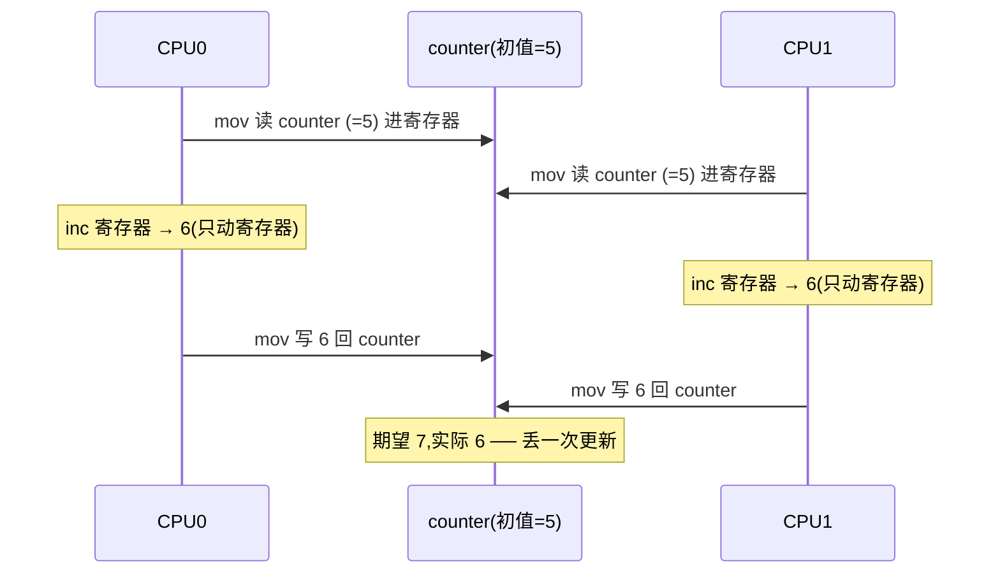
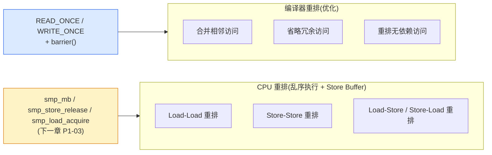
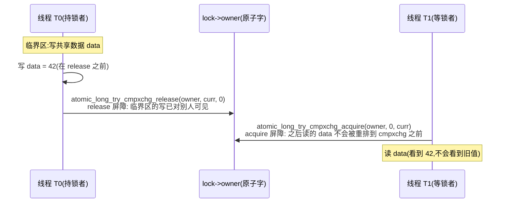
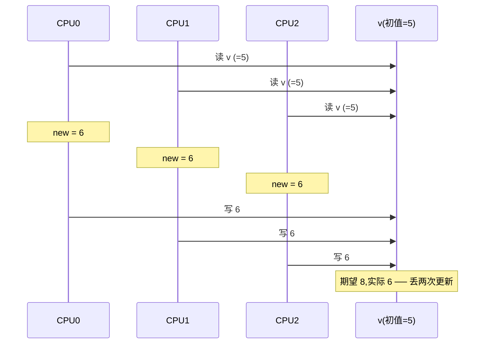
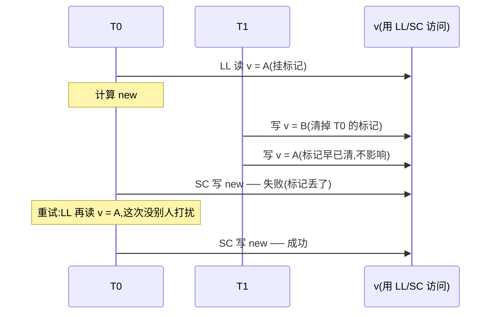

# 第二章 · 原子操作:atomic_t 与 cmpxchg

> 篇:P1 地基(原子操作 / 内存屏障 / lockdep)
> 主线呼应:上一章(P0-01)用 `counter++` 那条 mermaid 时序把"竞争(原子性)"这个攻击面立了起来——两个 CPU 同时读、各自加 1、各自写回,丢一次更新。这一章正面拆:**内核怎么把"读-改-写"变成不可分割的一步**。答案是一对地基件:`atomic_t`(把一个 `int` 包进结构体,强制你走原子 API)和 `cmpxchg`(compare-and-swap,内核锁性能的命脉)。P0-01 看到的 `mutex_lock` fast path 就是 `atomic_long_try_cmpxchg_acquire(&lock->owner, &zero, curr)` 一条原子指令,本章要拆开这条指令为什么 sound。读这一章时记住:这是后面所有同步原语(spinlock、mutex、rwsem、futex、RCU)的地基——地基不牢,后面全是空中楼阁。

## 核心问题

**为什么一句 `i++` 不是原子的?内核怎么把"读-改-写"封装成不可分割的原子操作?`atomic_t` 为什么是个结构体而不是 `int`?`READ_ONCE`/`WRITE_ONCE` 到底挡住了什么(编译器)又没挡住什么(CPU 重排)?`cmpxchg` 在 x86 上是 `lock cmpxchg`、在 ARM 上是 LDREX/STREX(LL/SC),这两种硬件实现为什么一个有 ABA 风险一个天然没有?原子操作的内存序参数 `relaxed`/`acquire`/`release`/`seq_cst` 各自的语义边界是什么,什么场景该选哪一档?**

读完本章你会明白:

1. `i++` 在 x86 上是"读-改-写"三步,三步之间能被另一个 CPU 的三步插进来——这就是竞争丢更新的硬件根。`atomic_t` 把这三步用 `LOCK` 前缀(或 LL/SC 指令对)粘成不可分割的一步。
2. `atomic_t` 为什么是 `typedef struct { int counter; } atomic_t;` 而不是 `typedef int atomic_t;`——**用类型系统强制你只能走 `atomic_read`/`atomic_add` 这些 API,直接 `v->counter++` 会被 sparse 工具警告**,把"误用普通算术"这种 bug 堵在编译期。
3. `READ_ONCE`/`WRITE_ONCE` 只挡编译器(不让编译器合并、省略、重排共享访问),不挡 CPU——挡 CPU 要靠下一章的 `smp_mb`/`smp_store_release`。把这两层分开,你才能看懂为什么 mutex fast path 用 `cmpxchg_acquire` 而不是 `cmpxchg`。
4. `cmpxchg(v, old, new)` 的语义("如果 `*v == old` 就把 `*v` 改成 `new` 并返回旧值,否则不改返回当前值")和它的硬件实现:ARM 的 LL/SC 天然无 ABA,x86 的 CAS 有 ABA 风险但内核绝大多数场景不怕。
5. 内存序四档(`relaxed`/`acquire`/`release`/`seq_cst`)的精确语义,以及内核里"无后缀 = full ordering"这条反直觉约定——选错档会在某条执行序下丢更新或读到撕裂。

> **逃生阀**:这一章会出现 `LOCK` 前缀、LL/SC、Store Buffer、ABA、acquire/release 这些词。如果你只写过用户态 `std::atomic`,不要慌——本章每个概念都配一句话直觉。**最关键是抓住"原子操作挡住的是竞争(原子性),可见性/有序性留给下一章的内存屏障"**。cmpxchg 的硬件实现细节看不懂没关系,记住"`LOCK cmpxchg` 在 x86 上保证读-改-写不可分割"这条就够读懂后面所有锁的 fast path。

---

## 2.1 一句话点破

> **`i++` 不是原子的,因为它编译成三条指令(读-改-写),三步之间另一个 CPU 能插进来。原子操作把这三步用硬件手段(`LOCK` 前缀或 LL/SC 指令对)粘成不可分割的一步,从而消灭竞争。`atomic_t` 用结构体包 `int` 强制你走原子 API,`READ_ONCE`/`WRITE_ONCE` 只挡编译器不挡 CPU,`cmpxchg` 是所有锁 fast path 的根基(无竞争一条指令搞定),内存序参数让你在"够用就好"和"全屏障"之间挑——选对了快、选错了错。**

这是结论,不是理由。本章倒过来拆:先看 `i++` 为什么会丢更新(硬件视角的三条指令)、再看 `atomic_t` 怎么治(类型 + API 设计)、再看 `READ_ONCE`/`WRITE_ONCE` 挡什么(编译器 vs CPU 的分野)、然后钻进 `cmpxchg`(x86 CAS vs ARM LL/SC)、最后拆内存序四档。

---

## 2.2 `i++` 为什么不是原子的:三条指令的插队

P0-01 已经用 mermaid 时序展示了"两个 CPU 同时 `counter++` 丢一次更新"。这里钻进硬件层,看为什么"一句 C 代码"会变成"三步可被打断的操作"。

`counter++` 这句 C,x86 编译器大概生成三条指令(简化示意,非源码原文):

```
  mov   counter, %eax    ; 读:从内存把 counter 读进寄存器
  inc   %eax             ; 改:在寄存器里加 1
  mov   %eax, counter    ; 写:把寄存器值写回内存
```

注意中间那条 `inc %eax`——它只动寄存器,**根本不碰内存**。也就是说,在"读"和"写"之间,内存里的 `counter` 值对别的 CPU 完全是可见的、可被改的。两个 CPU 的三条指令可以交错成这样(mermaid 复刻 P0-01 的关键执行序):



为什么 `mov ... ; inc ; mov` 不能原子?因为这三条指令之间,**CPU 没有任何"独占总线/缓存行"的承诺**。第一条 `mov` 读完就松手了,第二条 `inc` 在寄存器里跑(根本不碰内存),第三条 `mov` 写的时候,内存里的值可能早就被另一个 CPU 改了——但这个 CPU 不知道,它还按自己寄存器里的"老快照"写回。

> **不这样会怎样**:如果只能用普通算术保护共享计数器,你只能拿一把大锁把 `counter++` 包起来。64 核每条 `counter++` 都抢同一把锁,锁竞争随核数线性恶化,本来纳秒级的自增变成微秒级的锁开销——锁比临界区本身贵一个数量级。第 4 篇 percpu-rwsem、第 5 篇 RCU 就是为了"让多核不再抢同一份共享数据"而生的。

> **所以这样设计**:让"读-改-写"三步变成**一条不可分割的指令**(或一组硬件保证不可被打断的指令序列)。x86 的办法是给指令加 `LOCK` 前缀(`lock inc`、`lock cmpxchg`、`lock xadd`),硬件保证这条指令执行期间,被访问的缓存行被本 CPU 独占(MESI 协议的 Exclusive/Modified 状态);ARM/POWER 的办法是 LL/SC 指令对(LDREX/STREX 或 ldxr/stxr),先 Load-Link 一条,Store-Conditional 时检查"这条缓存行有没有被别的 CPU 写过",写过就失败重试。两种方案都让"读-改-写"在外界看来是瞬间完成的。

---

## 2.3 `atomic_t`:用类型系统强制你走原子 API

内核不让你直接 `counter++`。它给你一个专门类型 [`atomic_t`](../linux/include/linux/types.h#L175-L177)([types.h:175](../linux/include/linux/types.h#L175)):

```c
typedef struct {
    int counter;
} atomic_t;
```

第一个问题:**为什么是 `struct { int counter; }` 而不是 `typedef int atomic_t;`?**

> **不这样会怎样**:如果 `atomic_t` 就是 `int`,你写着写着就会忘,直接 `v++` 或 `v += 1`——编译器乖乖生成普通的三条指令,多核上立刻丢更新,而且**编译期没有任何警告**(因为对编译器来说 `int` 就是 `int`)。这种 bug 极难复现(只在多核 + 高并发 + 特定时序下才炸),排查成本极高。

> **所以这样设计**:把 `int` 包进一个匿名结构体,这样 `atomic_t` 和 `int` 就成了**两种不同的类型**。C 类型系统不允许 `atomic_t v; v++;` 这种写法直接通过(结构体没有 `++` 运算符),你必须写 `atomic_inc(&v);`。更重要的是,**内核的 sparse 静态检查工具会把"`atomic_t` 上的直接算术"标成警告**,把"误用普通算术"这种 bug 堵在编译期。这是**用类型系统把不变式钉死**的经典手法——和 Rust 用 `unsafe` / `Pin` 把"易出错的写法"挡在类型门外的思路同源(回扣系列《Tokio》那本)。

注意那个 `counter` 字段:**它在结构体里,但不代表你可以 `v.counter++`**——这同样会绕过原子语义。`atomic_t` 的 `counter` 字段存在的唯一理由是"给原子操作一个可寻址的 4 字节存储",所有访问必须走 `atomic_read`/`atomic_set`/`atomic_add` 这些 API。

### `atomic_read`/`atomic_set`:最朴素的原子读写

看 [`atomic_read`](../linux/include/linux/atomic/atomic-instrumented.h#L29-L34)([atomic-instrumented.h:29](../linux/include/linux/atomic/atomic-instrumented.h#L29)):

```c
static __always_inline int
atomic_read(const atomic_t *v)
{
    instrument_atomic_read(v, sizeof(*v));
    return raw_atomic_read(v);
}
```

就两件事:① `instrument_atomic_read` 是给 KASAN/KCSAN 等调试工具的钩子(检查有没有数据竞争);② `raw_atomic_read(v)` 才是真活。

注意 doc 注释明确写了 **"atomic load with relaxed ordering"**——`atomic_read` 是 **relaxed**(无内存序保证)的!这是新手最容易踩的坑:**`atomic_read` 只保证"这次读不被撕裂(不读到半新半旧)",不保证"读到的是最新值",更不保证"读之前的其它读写不会被重排到读之后"**。要后者,用 `atomic_read_acquire`(下面内存序小节详讲)。

`raw_atomic_read` 的真身在 [`atomic-arch-fallback.h`](../linux/include/linux/atomic/atomic-arch-fallback.h#L454-L458)([atomic-arch-fallback.h:454](../linux/include/linux/atomic/atomic-arch-fallback.h#L454)):

```c
static __always_inline int
raw_atomic_read(const atomic_t *v)
{
    return arch_atomic_read(v);
}
```

它进一步调 `arch_atomic_read`——这就进入体系结构相关代码了(本地未解压)。在 x86 上,`arch_atomic_read` 就是一条普通的 `mov` 指令(x86 上对齐的 4 字节读本身就是原子的,CPU 保证不会读到"半新半旧");在 ARM 上也是一条 `ldr`。**关键:对齐的标量读写在大多数 RISC/CISC 上本身就不撕裂**,所以 `atomic_read` 的"原子性"主要靠硬件给的承诺,不需要 `LOCK` 前缀。`atomic_read` 的"非原子风险"主要在**编译器重排**(这要靠 `READ_ONCE`,见下一节),不在硬件撕裂。

再看 [`atomic_set`](../linux/include/linux/atomic/atomic-instrumented.h#L64-L69)([atomic-instrumented.h:64](../linux/include/linux/atomic/atomic-instrumented.h#L64)):

```c
static __always_inline void
atomic_set(atomic_t *v, int i)
{
    instrument_atomic_write(v, sizeof(*v));
    raw_atomic_set(v, i);
}
```

同样是 relaxed。`atomic_set(v, i)` 不保证"在这之前的写对别的 CPU 可见"——要这条保证,用 `atomic_set_release`(下面详讲)。

> **钉死这件事**:`atomic_t` 的设计精髓不在"原子",而在**"用结构体 + 类型系统 + sparse 检查,强制你走原子 API"**。`atomic_read`/`atomic_set` 是 relaxed 的——它们只挡硬件撕裂,不挡编译器/CPU 重排,也不保证可见性。后两件事,前者靠 `READ_ONCE`/`WRITE_ONCE`(挡编译器)和内存屏障(挡 CPU,下一章),后者靠 `acquire`/`release`/`seq_cst` 内存序参数(本章后半)。把这三层分清楚,你才能看懂内核锁的 fast path 为什么写的是 `cmpxchg_acquire` 而不是 `cmpxchg`。

---

## 2.4 `READ_ONCE`/`WRITE_ONCE`:挡编译器,不挡 CPU

`atomic_read` 挡了硬件撕裂,但**编译器这一关它没挡**。考虑这段(典型的轮询循环):

```c
while (ready == 0)
    ;   /* 等别的 CPU 把 ready 改成 1 */
print(data);
```

编译器看到 `ready == 0` 这个判断,可能"聪明"地优化成:**只读一次 `ready`,如果第一次是 0,就死循环(因为它认为单线程语义下 `ready` 不会变)**。更糟的是,编译器可能把 `ready` 的读和 `print(data)` 重排——只要单线程结果不变(as-if rule),编译器就敢动。

> **不这样会怎样**:上面那段循环,编译后可能 `ready` 只被读一次,然后死循环永远跳不出来——即使别的 CPU 早把 `ready` 写成了 1。这是**编译器重排**的坑,只在 `-O2` 及以上优化级别出现,debug 编译(`-O0`)反而能跑——这种 bug 极度阴险,"测试通过生产炸"。

> **所以这样设计**:用 `READ_ONCE(x)` / `WRITE_ONCE(x, v)` 明确告诉编译器:"**这次访问有跨核语义,别用单线程那套重排规则**"。`READ_ONCE` 在编译器层面强制做三件事:① 这次读**真的会发生**(不能省略);② 这次读**只读一次**(不能合并多次读成一次);③ 这次读**不能和相邻访问重排**(具体不能跨过哪些屏障,见 `include/asm-generic/barrier.h`,本地未解压,在线 6.9)。

`READ_ONCE` 的定义在 `include/asm-generic/rwonce.h` + `include/asm-generic/barrier.h`(本地未解压,引在线 6.9)。它的核心实现是一对宏,大致长这样(简化示意,非源码原文):

```c
#define __READ_ONCE(x)  (*(const volatile __unqual_scalar_typeof(x) *)&(x))
#define READ_ONCE(x)    \
    ({                  \
        __unqual_scalar_typeof(x) __x = __READ_ONCE(x); \
        smp_read_barrier_depends(); \
        __x;            \
    })
```

两个关键点:① `volatile`——告诉编译器"这个访问有副作用,不准省略、不准合并、不准缓存进寄存器";② `__unqual_scalar_typeof`——拿到 `x` 的无修饰标量类型(内核自己的类型推导宏,见 [`compiler.h`](../linux/include/linux/compiler.h) L203 附近的 `__unqual_scalar_typeof`,本地有)。`smp_read_barrier_depends()` 是依赖屏障(DEC Alpha 这种弱内存模型才需要,x86/ARM 上是空操作)。

注意:**`READ_ONCE`/`WRITE_ONCE` 不提供跨核排序**——它们只挡编译器。要挡 CPU(让别的 CPU 看到你写的顺序),还得加 `smp_mb`/`smp_store_release`/`smp_load_acquire`(下一章 P1-03 详讲)。但 `READ_ONCE`/`WRITE_ONCE` 是**所有跨核共享访问的最低保险**——内核里凡是跨 CPU 共享的变量,几乎一律用 `READ_ONCE`/`WRITE_ONCE` 访问(后面 spinlock、seqlock、RCU 的源码会反复出现)。

`compiler.h` 里还有一个 [`barrier()`](../linux/include/linux/compiler.h#L85)([compiler.h:85](../linux/include/linux/compiler.h#L85)):

```c
# define barrier() __asm__ __volatile__("": : :"memory")
```

这是一条**编译器屏障**(空内联汇编 + `memory` clobber)——告诉编译器"内存被改了,所有缓存在寄存器里的变量都要重新从内存读,而且不能把这条屏障前后的内存访问重排到对面"。注意 `barrier()` 只挡编译器,**不挡 CPU**(CPU 该乱序还是乱序)。挡 CPU 要 `smp_mb`(下一章)。



> **钉死这件事**:`READ_ONCE`/`WRITE_ONCE` 挡编译器,`smp_mb`/`smp_store_release`/`smp_load_acquire` 挡 CPU——这两层分开,是内核同步原语源码读起来不迷路的关键。看到 `READ_ONCE` 不要以为"这就够了",看到 `smp_mb` 也不要以为"编译器的事它管了"。两层都要,缺一层都会在特定执行序下出错(下一章用消息传递模式的反例时序详讲)。

---

## 2.5 `cmpxchg`:所有锁 fast path 的根基

`atomic_read`/`atomic_set` 解决"单次读/写不撕裂",但很多场景需要"**读当前值 → 算出新值 → 写回**"这一整套不可分割——比如 P0-01 看到的 mutex fast path:"读 owner 是不是 0 → 如果是就改成 curr"。这就轮到 `cmpxchg`(compare-and-swap)上场了。

看 [`atomic_cmpxchg`](../linux/include/linux/atomic/atomic-instrumented.h#L1191-L1197)([atomic-instrumented.h:1191](../linux/include/linux/atomic/atomic-instrumented.h#L1191)):

```c
static __always_inline int
atomic_cmpxchg(atomic_t *v, int old, int new)
{
    kcsan_mb();
    instrument_atomic_read_write(v, sizeof(*v));
    return raw_atomic_cmpxchg(v, old, new);
}
```

**语义**(doc 注释):"If (`*v == old`), atomically updates `*v` to `new` with full ordering. Otherwise, `*v` is not modified and relaxed ordering is provided. **Return: The original value of `*v`.**" 拆开:

1. 比较 `*v` 和 `old`;
2. 如果相等,把 `*v` 改成 `new`,返回 `old`(表示成功);
3. 如果不等,什么都不改,返回 `*v` 的当前值(表示失败,但你可以从返回值知道"现在是谁占着")。

**关键:cmpxchg 是原子的**——"比较 + 改写"这两步在外界看来是瞬间完成的,中间不可能插进另一个 CPU 的写。怎么做到的?靠硬件指令。raw 层在 [`atomic-arch-fallback.h`](../linux/include/linux/atomic/atomic-arch-fallback.h#L2014-L2028)([atomic-arch-fallback.h:2014](../linux/include/linux/atomic/atomic-arch-fallback.h#L2014)):

```c
static __always_inline int
raw_atomic_cmpxchg(atomic_t *v, int old, int new)
{
#if defined(arch_atomic_cmpxchg)
    return arch_atomic_cmpxchg(v, old, new);
#elif defined(arch_atomic_cmpxchg_relaxed)
    int ret;
    __atomic_pre_full_fence();
    ret = arch_atomic_cmpxchg_relaxed(v, old, new);
    __atomic_post_full_fence();
    return ret;
#else
    return raw_cmpxchg(&v->counter, old, new);
#endif
}
```

三层 fallback:优先用 `arch_atomic_cmpxchg`(完整内存序版,比如 x86 的 `lock cmpxchg`);没有就用 `arch_atomic_cmpxchg_relaxed` + 前后补 full fence;再没有就退到通用的 `raw_cmpxchg`。这种"三层 fallback"是 6.2 引入的 [`linux/atomic/atomic-arch-fallback.h`](../linux/include/linux/atomic/atomic-arch-fallback.h) 自动生成机制——把"每个体系结构实现了哪些原子操作"的差异,用 `#if defined(arch_xxx)` 自动兜底,不必每个体系结构都自己写一遍全套 API。

### x86 上的 `lock cmpxchg`

x86 上 `arch_atomic_cmpxchg` 最终编译成(本地未解压 `arch/x86/include/asm/atomic.h`,引在线 6.9):

```
  lock cmpxchg [v], new
```

`cmpxchg` 这条指令本身做的事:**比较 `eax` 和 `[v]`,相等就把 `[v]` 改成 `new`,不等就把 `[v]` 装进 `eax`**。`eax` 里预先放 `old`。`lock` 前缀是关键——它告诉 CPU:"**这条指令执行期间,被访问的缓存行必须由本 CPU 独占**(MESI 协议下进入 Exclusive/Modified 状态),保证没有别的 CPU 同时改这个地址"。这就是 `cmpxchg` 原子性的硬件根:**缓存行独占 + 不可被打断**。

### `atomic_try_cmpxchg`:省一次读的优化

注意内核里 mutex fast path 实际用的是 [`atomic_try_cmpxchg_acquire`](../linux/include/linux/atomic/atomic-instrumented.h#L1297-L1303)([atomic-instrumented.h:1297](../linux/include/linux/atomic/atomic-instrumented.h#L1297))。看它和 `atomic_cmpxchg` 的区别(对照 L1274 的 `atomic_try_cmpxchg` doc):

> "`atomic_try_cmpxchg(v, old, new)`: `old` 是 `int *`(指针)而不是值。如果 `*v == *old` 就改成 `new` 返回 true;否则把 `*v` 的当前值**写回 `*old`**,返回 false。"

为什么多了个 `try` 版本?这是 cmpxchg 调用循环里的常见模式:

```c
int old = atomic_read(v);
while (!atomic_try_cmpxchg(v, &old, new))   /* 失败时 old 被自动更新 */
    /* 重新基于 old 计算 new,再重试 */;
```

如果用 `atomic_cmpxchg(v, old, new)`,失败时你拿到的是返回值(当前值),得自己再写一行 `old = ret;`。更关键的是 `try_cmpxchg` 在某些体系结构(尤其是 ARM LL/SC)上**能省一条 load 指令**(失败时 SC 的输入寄存器里本来就存着当前值,直接当返回值),所以热路径的 cmpxchg 循环一律用 `try_cmpxchg`。P0-01 看到的 [`__mutex_trylock_fast`](../linux/kernel/locking/mutex.c#L166-L175)([mutex.c:166](../linux/kernel/locking/mutex.c#L166))就是:

```c
static __always_inline bool __mutex_trylock_fast(struct mutex *lock)
{
    unsigned long curr = (unsigned long)current;
    unsigned long zero = 0UL;

    if (atomic_long_try_cmpxchg_acquire(&lock->owner, &zero, curr))
        return true;

    return false;
}
```

`atomic_long_try_cmpxchg_acquire(&lock->owner, &zero, curr)`——读 `owner` 是不是 0(无主),是就原子地改成 `curr`(当前 task 指针),acquire 内存序。这一条原子指令搞定拿锁,失败(返回 false)才进 slow path 睡眠。这就是 mutex "无竞争时一条 cmpxchg"的硬件根。

> **钉死这件事**:`cmpxchg(v, old, new)` 是所有锁 fast path 的根基——spinlock、mutex、rwsem、futex 的 fast path 全是它(差别只在抢哪个字段、用哪档内存序)。理解 cmpxchg,就理解了"内核锁无竞争时为什么这么便宜"——一条原子指令,纳秒级,不进内核慢路径、不切上下文、不睡 wait queue。

---

## 2.6 内存序四档:relaxed / acquire / release / seq_cst

回头看 `atomic_cmpxchg` 的源码注释:"If (`*v == old`), atomically updates `*v` to `new` with **full ordering**."——这个 "full ordering" 是什么?为什么 `atomic_read` 是 relaxed 而 `atomic_cmpxchg` 是 full?

内核的原子 API 有一个**反直觉约定**:**无后缀 = full ordering(= seq_cst = 最强)**,有后缀(`_relaxed`/`_acquire`/`_release`)= 自选强度。也就是说:

- `atomic_add_return(i, v)` —— **full ordering**(最强)
- `atomic_add_return_relaxed(i, v)` —— **relaxed**(最弱,无任何内存序保证)
- `atomic_add_return_acquire(i, v)` —— **acquire**(后面的读写在前面)
- `atomic_add_return_release(i, v)` —— **release**(前面的读写在前面)

看源码对比 [`atomic_add_return`](../linux/include/linux/atomic/atomic-instrumented.h#L119-L125)(full)和 [`atomic_add_return_relaxed`](../linux/include/linux/atomic/atomic-instrumented.h#L175-L180)(relaxed):

```c
static __always_inline int
atomic_add_return(int i, atomic_t *v)               /* full ordering */
{
    kcsan_mb();                                     /* ← 多了这条 */
    instrument_atomic_read_write(v, sizeof(*v));
    return raw_atomic_add_return(i, v);
}

static __always_inline int
atomic_add_return_relaxed(int i, atomic_t *v)       /* relaxed */
{
    instrument_atomic_read_write(v, sizeof(*v));
    return raw_atomic_add_return_relaxed(i, v);
}
```

**唯一区别就是 `kcsan_mb()`**——这是给 KCSAN(并发 sanitizer)的钩子,提示"这里需要一个 full memory barrier"。在实际非 KCSAN 编译里,full 版的 `raw_atomic_add_return` 在 x86 上用 `lock xadd`(LOCK 前缀自带 full barrier 语义),relaxed 版用不带 LOCK 的版本(如果体系结构支持)。

### 四档的精确语义(对照表)

| 内存序 | 语义(直觉化) | 它"钉死"什么 | 何时用 | x86 上的实现 |
|---|---|---|---|---|
| **relaxed** | "这次原子操作本身不撕裂,但不保证任何其它访问的顺序" | 只挡硬件撕裂 | 纯计数器(不需要和别的变量配对),如统计计数 | 普通 `add`/`inc`(x86 上对齐读写本来就原子) |
| **acquire** | "在这之后的读写,不能重排到这次操作之前"(单向门,只进不退) | 后续的访问"看见"了这次 acquire 加载的值 | **加载锁状态进入临界区**(mutex fast path 的 cmpxchg_acquire) | `mov`(x86 的 load 本身就是 acquire 语义,TSO 模型) |
| **release** | "在这之前的读写,不能重排到这次操作之后"(单向门,只退不进) | 临界区内的写"都对别人可见"了再放锁 | **释放锁**(mutex unlock 的 cmpxchg_release) | `mov` + 编译器屏障(TSO 下 store 不需要额外 CPU 屏障) |
| **seq_cst (full)** | "acquire + release + 全局顺序"(所有 CPU 看到的修改顺序一致) | 所有 CPU 看到同一个全局修改序 | 需要全局一致的场景(默认档,无后缀) | `lock` 前缀指令(`lock xadd`/`lock cmpxchg`) |

### acquire / release 的配对(下一章 P1-03 的核心)

`acquire` 和 `release` 是**配对**使用的——一个线程 release,另一个线程 acquire,中间夹着临界区。这是 mutex fast path 的命脉:



> **为什么 sound**:release 保证"临界区里的所有写,在 unlock 这条指令对别的 CPU 可见之前,都已对别的 CPU 可见";acquire 保证"这次 cmpxchg 之后的读写,不会被重排到 cmpxchg 之前"。两者配对,就保证 T1 进入临界区后看到的 `data` 一定是 T0 临界区里写的值——**不会读到撕裂或旧值**。如果 T0 用 `cmpxchg_relaxed` 放锁、T1 用 `cmpxchg_relaxed` 抢锁,CPU 就可能把"写 data"重排到"unlock"之后,或者把"读 data"重排到"lock"之前——T1 进临界区后看到的是 `data` 的旧值。这就是 mutex fast path 必须用 `_acquire`/`_release` 而不是 `_relaxed` 的根。

### 为什么默认是 full(seq_cst)?

`atomic_cmpxchg`(无后缀)是 full ordering——这是为了**安全默认**。full ordering 保证最强(全局一致修改序),即使你不确定该用哪档,用无后缀版一定不会错(只会"过强一点"导致性能略损)。如果你**明确知道**这块不需要跨核排序(纯计数器),才退到 `_relaxed` 省 fence;如果你**明确知道**是 acquire/release 配对(临界区进出),才用 `_acquire`/`_release`。这是内核的"安全默认 + 显式 opt-out"哲学——和 Rust 的 `unsafe`、内核的 `rcu_dereference` 必须配 `rcu_assign_pointer` 同源。

> **钉死这件事**:**无后缀 = full = seq_cst = 最强**。这是内核的反直觉约定(很多文档/C++ 的 `memory_order_seq_cst` 是默认但显式,内核是隐式默认)。读懂任何原子 API,先看它有没有后缀——有后缀说明作者**故意**选了弱序(为了性能),没后缀是安全默认。后面读 mutex fast path 看到 `cmpxchg_acquire`,你就知道"作者故意没用 full,因为 acquire 就够了,省一个 fence"。

---

## 2.7 技巧精解:cmpxchg 的 LL/SC 实现与 ABA 问题

这一章最硬核的技巧:**cmpxchg 在 x86(CAS)和 ARM(LL/SC)上的硬件实现差异,以及由此引出的 ABA 问题**。这件事直接关系到"cmpxchg 失败重试为什么最终会成功(或 ABA 下要小心)"——是 cmpxchg sound 的根。

### 朴素 read-modify-write 在多核会丢更新(反面对比)

如果 `cmpxchg` 不存在,你只能用朴素的 read-modify-write:

```c
int old = atomic_read(v);        /* 步骤 1: 读 */
int new = old + 1;               /* 步骤 2: 改(在寄存器里) */
atomic_set(v, new);              /* 步骤 3: 写 */
```

三个 CPU 同时跑这个:



三步之间互相能插队,丢更新。**cmpxchg 的存在就是治这个**——它把"比较 + 改写"粘成一条不可分割的指令。

### cmpxchg 循环:失败就重试,最终会成功

cmpxchg 的典型用法是循环:

```c
int old, new;
do {
    old = atomic_read(v);
    new = compute_new(old);
} while (!atomic_try_cmpxchg(v, &old, new));   /* CAS 失败就重试 */
```

> **为什么 sound(失败为什么最终会成功)**:假设两个 CPU 同时进这个循环。CPU0 先 cmpxchg 成功(把 v 从 5 改成 6),CPU1 的 cmpxchg 失败(v 不再是它读到的 5,而是 6)——但 `atomic_try_cmpxchg` 会把**当前值 6 自动写回 `old`**(这是 `try` 版本的妙处,见 L1267 doc),CPU1 下一轮循环从 6 开始,再 cmpxchg(把 v 从 6 改成 7),成功。**只要系统往前走(每个 cmpxchg 要么成功要么把 v 推进到新值),循环最终一定会成功**。这是 lock-free 算法的根基——叫"无锁进度(lock-free progress)"。

### x86 的 CAS 与 ABA 问题

x86 的 cmpxchg 是 **CAS(Compare-And-Swap)**:一条原子指令,比较 `eax` 和 `[v]`,相等就改。这种实现有个经典陷阱——**ABA 问题**。

ABA 场景:无锁栈的 push/pop。线程 T0 想弹栈顶(读到值 A),被切换走;线程 T1 把 A 弹出,又把 B push,又把 A push 回去(栈顶又是 A);T0 醒来,cmpxchg(栈顶, A, next)——**比较通过(栈顶确实是 A),成功**,但这个"A"已经是"另一个 A",`next` 指向的可能是已被释放的内存。

```mermaid
sequenceDiagram
    participant T0
    participant T1
    participant Stack as 栈顶指针
    Note over Stack: 栈顶 = A(指向节点 A,A.next = B)
    T0->>Stack: 读栈顶 = A,准备 CAS(A → B)
    Note over T0: 被切换走
    T1->>Stack: pop A(栈顶变 B)
    T1->>Stack: pop B(栈顶变 C)
    T1->>Stack: push A'(新节点,值碰巧也是 A)
    Note over Stack: 栈顶 = A'
    T0->>Note: 醒来
    T0->>Stack: CAS(栈顶, A, B)<br/>比较通过(栈顶确实是 A,虽然已是 A')
    Note over T0: 栈顶被改成 B,但 B 已被释放 ── use-after-free
```

ABA 的根:**CAS 比较的是"值",值"从 A 变成 A"在 CAS 看来和"没变过"无法区分**。

### ARM 的 LL/SC:天然无 ABA

ARM(以及 POWER、MIPS、RISC-V)用的是 **LL/SC(Load-Link / Store-Conditional)** 指令对(ARM 上是 `ldxr`/`stxr`,旧 ARM 是 `ldrex`/`strex`)。它的工作方式:

```
  ldxr r1, [v]        ; Load-Link: 读 v 到 r1,同时给这个地址"挂个标记"
  ... 计算 new ...
  stxr r2, r0, [v]    ; Store-Conditional: 写 v,但只在"标记还在"时才真写
                      ; 标记丢了就失败,r2 返回 0(失败)
```

**关键:LL 给地址挂的"标记"是会被任何对该地址的写操作清除的**(具体实现是缓存行的"监视位",MESI 协议下别的 CPU 一旦写这个缓存行,本 CPU 的标记就丢)。也就是说,**只要在 LL 和 SC 之间,`[v]` 被任何 CPU 写过(哪怕是 A→B→A),SC 就一定失败**——这就天然解决了 ABA 问题:ABA 的"A→B→A"在 LL/SC 看来是"中间被写过",SC 失败,重试。



> **为什么 sound(LL/SC)**:LL/SC 的"标记"是缓存行级的硬件机制——MESI 协议下,任何对这个缓存行的写都会让本 CPU 的标记失效。这个机制**比 CAS 表达力更强**:CAS 只能判断"值没变"(但区分不出"变了又变回"),LL/SC 能判断"这个地址没被写过"(无论值变没变回来)。代价是 LL/SC 之间不能有太多指令(标记有生存期,过长会被清掉导致 spurious failure,需要重试),且 LL/SC 不能嵌套(同一时刻一个 CPU 只能监视一个地址)。

### 内核怎么应对 ABA(x86 CAS)

内核的 cmpxchg 调用点几乎都不怕 ABA,因为:

1. **绝大多数 cmpxchg 循环是单调的**(计数器只增不减、状态机只朝一个方向走)。ABA 需要"A→B→A"的回路,单调场景不会发生。
2. **锁 fast path(cmpxchg owner, 0, curr)**:owner 字段是 task 指针,ABA 需要"task A 持锁 → 放锁 → task A 又持锁",但这种情况 fast path 直接成功(就是想抢锁嘛),不会有问题。
3. **真正怕 ABA 的无锁数据结构(无锁栈、无锁队列)**,内核用版本号(tagged pointer,把版本号压进指针高位)或 `cmpxchg128`(双字 CAS,一个字存指针、一个字存版本号)来对抗——版本号单调增,A→B→A 时版本号也对不上。典型例子是无锁队列的 head/tail(见 `include/linux/llist.h` 的 `llist_cmpxchg`)。

> **钉死这件事**:cmpxchg 在 x86 上是 CAS(比较值,有 ABA 风险),在 ARM/POWER 上是 LL/SC(比较"有没有被写过",天然无 ABA)。内核的 cmpxchg 调用点绝大多数场景不怕 ABA(单调计数、状态机);真正怕 ABA 的无锁结构用版本号或 `cmpxchg128` 对抗。**cmpxchg 循环失败重试最终会成功**——只要系统往前走(每个 cmpxchg 要么成功要么把 v 推进),这就是 lock-free progress 的根,也是 cmpxchg sound 的核心保证。

---

## 2.8 朴素的 `atomic_t` 之外:`atomic_long_t` / `atomic64_t` / `refcount_t`

`atomic_t` 只包 4 字节 `int`。但内核里很多场景需要 8 字节(比如 mutex 的 `owner` 字段要存 task 指针,64 位系统指针就是 8 字节)。内核提供:

- [`atomic64_t`](../linux/include/linux/types.h#L182-L184)([types.h:182](../linux/include/linux/types.h#L182)):64 位版,`s64 counter`,API 是 `atomic64_read`/`atomic64_cmpxchg` 等。
- `atomic_long_t`:在 64 位系统上等价 `atomic64_t`,32 位系统上等价 `atomic_t`——抽象掉 long 的位宽差异。mutex 的 `owner` 就是 `atomic_long_t`(见 [mutex_types.h](../linux/include/linux/mutex_types.h) L42)。
- `refcount_t`:专门做引用计数,在 `atomic_t` 之上加了"不能溢出到 0 以下、不能从 0 复活"的运行时检查(`refcount_inc`/`refcount_dec_and_test`)。这是 4.x 后引入的,把"引用计数 bug"(use-after-free、double-free)挡在更上层。`atomic_t` 还是 refcount_t 的选择是个设计取舍:`refcount_t` 更安全(运行时检查 + 调试钩子),`atomic_t` 更快(纯原子,无检查)。`rcuref_t`(types.h L187)是更新的方案,用原子 RMW 实现高效引用计数。

P0-01 / 本章讲的 `atomic_long_try_cmpxchg_acquire(&lock->owner, ...)` 就是 `atomic_long_t` 家族的 cmpxchg——它的源码和 `atomic_t` 版本结构完全一样,只是 `long` 代替 `int`。

---

## 章末小结

这一章是第 1 篇地基的第一块砖。我们没有钻进任何一把锁的细节,但立起了后面所有锁都依赖的三样东西:

1. **`atomic_t` 的类型设计**:用 `struct { int counter; }` 而不是 `int`,**强制你走原子 API**——这是"用类型系统把不变式钉死"的手法,sparse 把误用堵在编译期。`atomic_read`/`atomic_set` 是 relaxed 的,只挡硬件撕裂。
2. **`READ_ONCE`/`WRITE_ONCE`**:挡编译器(不合并、不省略、不重排),不挡 CPU(挡 CPU 是下一章 `smp_mb` 的活)。两层分开,是读内核同步源码不迷路的关键。
3. **`cmpxchg`**:所有锁 fast path 的根基——`cmpxchg(v, old, new)` 把"比较 + 改写"粘成一条不可分割的原子指令。x86 上是 `lock cmpxchg`(CAS,有 ABA 风险),ARM 上是 LL/SC(天然无 ABA)。`try_cmpxchg` 在失败时自动更新 `old`,省一次读,是热路径首选。
4. **内存序四档**:relaxed(最弱,纯计数器)/ acquire(后续访问不被重排到前面,进临界区)/ release(前面的访问不被重排到后面,出临界区)/ seq_cst(无后缀默认档,最强)。**内核反直觉约定:无后缀 = full ordering**。mutex fast path 用 `cmpxchg_acquire`、unlock 用 `cmpxchg_release`,这对配对保证临界区 sound。
5. **cmpxchg 循环 sound 的根**:失败重试最终会成功——只要系统往前走(每个 cmpxchg 要么成功要么把 v 推进到新值),这就是 lock-free progress。

### 五个"为什么"清单

1. **为什么 `i++` 不是原子的?** 它编译成"读-改-写"三条指令,中间那条 `inc` 只动寄存器,内存里的值在"读"和"写"之间对别的 CPU 完全可见、可改。两个 CPU 的三步交错,丢更新。
2. **`atomic_t` 为什么是结构体而不是 `int`?** 用类型系统强制你走 `atomic_inc` 这些 API——直接 `v++` 编译不过(结构体没有 `++`),sparse 还会警告。把"误用普通算术"堵在编译期。
3. **`READ_ONCE`/`WRITE_ONCE` 到底挡了什么?** 只挡编译器(不合并、不省略、不重排),不挡 CPU。挡 CPU 要靠下一章的 `smp_mb`/`smp_store_release`/`smp_load_acquire`。这两层分开是命脉。
4. **`cmpxchg` 在 x86 和 ARM 上为什么实现不同?** x86 是 CAS(一条 `lock cmpxchg` 指令,比较 `eax` 和 `[v]`,有 ABA 风险);ARM 是 LL/SC(`ldxr`/`stxr` 指令对,缓存行标记,天然无 ABA)。CAS 简单但有 ABA,LL/SC 表达力更强但有 spurious failure。
5. **内存序四档什么时候选哪一档?** 纯计数器(不和别的变量配对)→ relaxed;进临界区(加载锁状态)→ acquire;出临界区(释放锁)→ release;不确定或需要全局一致 → 无后缀(full/seq_cst)。**内核默认是 full,故意选弱序要加后缀**——看到后缀说明作者为了性能故意 opt-out。

### 想继续深入往哪钻

- 源码:读 [`include/linux/atomic/atomic-instrumented.h`](../linux/include/linux/atomic/atomic-instrumented.h)(全 API + doc),[`atomic-arch-fallback.h`](../linux/include/linux/atomic/atomic-arch-fallback.h)(三层 fallback 看体系结构差异);[`types.h`](../linux/include/linux/types.h) 的 `atomic_t`/`atomic64_t`/`atomic_long_t`/`refcount_t` 定义;[`compiler.h`](../linux/include/linux/compiler.h) 的 `barrier()`(L85)。`READ_ONCE`/`WRITE_ONCE` 在 `include/asm-generic/rwonce.h` + `barrier.h`(在线 6.9,本地未解压)。
- 体系结构实现:`arch/x86/include/asm/atomic.h`(`lock cmpxchg`、`lock xadd`),`arch/arm64/include/asm/atomic.h`(`ldxr`/`stxr` LL/SC)——本地未解压,引在线 6.9。
- cmpxchg 真实用例:mutex fast path [`mutex.c:166`](../linux/kernel/locking/mutex.c#L166)、第 5 章 qspinlock 的 `atomic_try_cmpxchg_acquire`、第 11 章 rwsem 乐观读 `atomic_long_try_cmpxchg_acquire`——后面几乎每章都会看到 cmpxchg。
- 工具观测:`CONFIG_KCSAN=y` 编译的内核,跑有数据竞争的程序会在 dmesg 看到 KCSAN 报告(它正好检查"该用 `READ_ONCE` 的地方没用");`scripts/checkpatch.pl` 会警告"`atomic_t` 上直接算术"。
- 延伸阅读:`Documentation/atomic_t.txt`、`Documentation/atomic_bitops.txt`、`Documentation/core-api/wrappers/`(内存屏障与 `READ_ONCE`/`WRITE_ONCE` 的内核文档,解释 acquire/release/relaxed 的语义)。

### 引出下一章

原子操作解决了**竞争(原子性)**这个攻击面——`atomic_t`/`cmpxchg`/`READ_ONCE`/`WRITE_ONCE` 把"读-改-写"变成不可分割的一步,把编译器重排挡在门外。但**还有两个攻击面没治:可见性(CPU 间看不到对方的写)和有序性(CPU 自己也会乱序执行)**。这两个攻击面的解药是**内存屏障**——`smp_mb`/`smp_rmb`/`smp_wmb`/`smp_store_release`/`smp_load_acquire`。

下一章 P1-03,我们钻进 Store Buffer 和 Invalidate Queue(MESI 协议的副产物),用经典的"消息传递"反例时序,讲清"少了 `smp_wmb`/`smp_rmb` 配对为什么会读到新标志位但旧数据",把 `smp_store_release`/`smp_load_acquire` 这对屏障的 sound 拆透。`cmpxchg_acquire` 里的那个 `_acquire` 后缀,正是下一章的主角之一。

> **钉死这件事**:原子操作只挡竞争(原子性)和编译器重排。CPU 乱序执行和跨核可见性,留给下一章的内存屏障。两章合起来,才是第 1 篇地基的完整图景——后面所有锁(spinlock/mutex/rwsem)和所有无锁结构(seqlock/RCU/per-cpu)都建在这块地基上。
