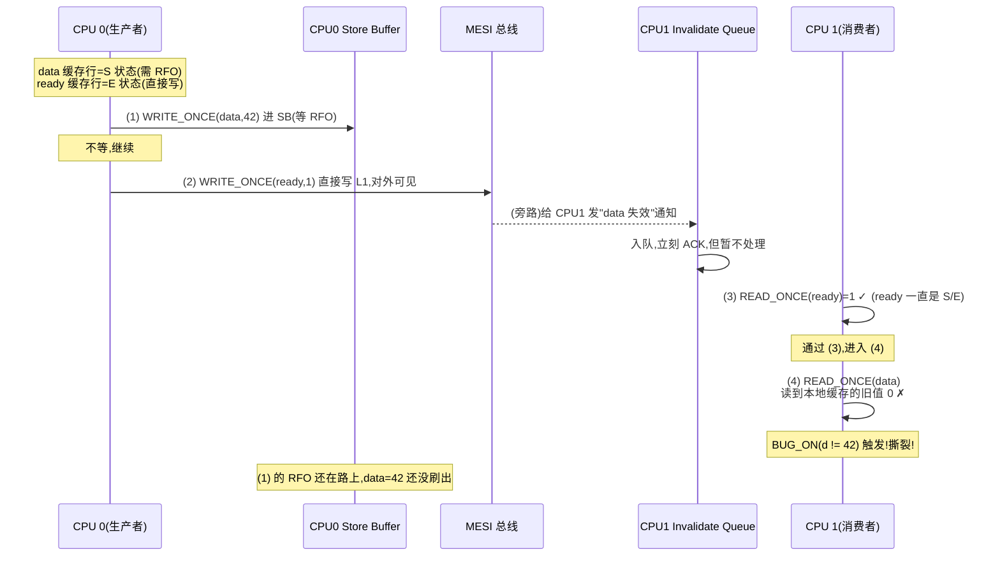
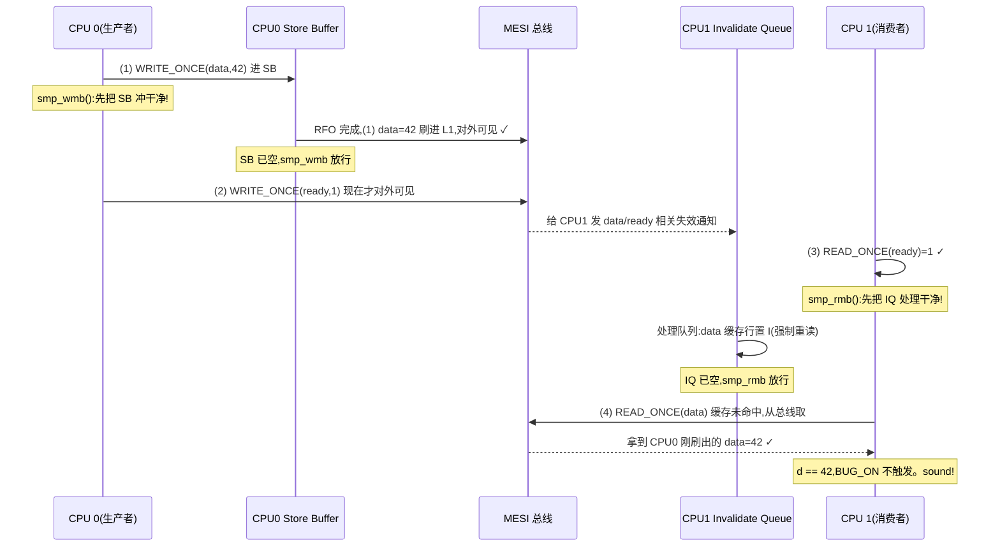

# 第三章 · 内存屏障:为什么重排会害死你

> 篇:P1 地基(原子操作、内存屏障、lockdep)
> 主线呼应:上一章你看到了 `atomic_t` 与 `cmpxchg` 怎么把**竞争**这一个攻击面堵上——让"读-改-写"在多核上不丢更新。但堵住竞争只是地基的三分之一。多核还会从另外两个方向攻击你:**可见性**(CPU A 的写,CPU B 在某个时刻看不到)和**有序性**(你写在前面的代码,实际执行时被排到后面去了)。这两个攻击面不是 `cmpxchg` 能治的——它们不是"同一份数据被同时改"的问题,而是"两个 CPU 对**内存访问顺序**的看法不一致"。治它们的药,叫**内存屏障(memory barrier)**。这一章就把 Store Buffer / Invalidate Queue / MESI 这套硬件机制、`barrier()` / `smp_mb` / `smp_rmb` / `smp_wmb` / `smp_store_release` / `smp_load_acquire` 这组宏、以及 `READ_ONCE` / `WRITE_ONCE` 这对"最低保险"全拆透,并把**经典消息传递模式**下"配对屏障为什么 sound"的所有执行序画清楚。这一章是全书"为什么 sound"的**根基之一**——后面 rwsem 乐观读的 A-D-S 手写(P4-11)、RCU 的宽限期有序保证(P5-14),全靠它。

## 核心问题

**为什么单线程下天经地义的"先写 data、再写 ready",在多核上会变成"消费者看到 ready==1 但 data 还是旧值"?Store Buffer 和 Invalidate Queue 到底在干什么、为什么会"重排"你的写和读?内核提供的四种屏障(`barrier()` 编译器屏障、`smp_mb` 全屏障、`smp_rmb`/`smp_wmb` 单向、`smp_store_release`/`smp_load_acquire` acquire/release)各自的力度和代价是什么?为什么说 `smp_wmb`(生产者) + `smp_rmb`(消费者)这对配对"在所有并发执行序下都 sound"?少一个屏障具体在哪条执行序下读到撕裂?**

读完本章你会明白:

1. **重排的两个源头**:编译器重排(as-if rule)与 CPU 乱序执行(Store Buffer 延迟写、Invalidate Queue 延迟失效)。前者用 `barrier()` 治,后者用 `smp_*` 屏障治。
2. **MESI 协议下的两个队列**:Store Buffer(写操作等缓存行拿到 Exclusive 时暂存)与 Invalidate Queue(收到失效通知时先排队、稍后处理),它们是"为什么会重排"的硬件根因——不是 CPU 故意捣乱,是性能优化带来的副作用。
3. **四种屏障的力度梯度**:`barrier()`(只挡编译器,不生成指令)、`smp_wmb`/`smp_rmb`(单向,挡一个方向的重排)、`smp_mb`(全屏障,两个方向都挡)、`smp_store_release`/`smp_load_acquire`(把"写/读一个变量"和"屏障"压成一步,更轻更不易写错)。
4. **配对屏障为什么 sound**:`smp_wmb`(生产者)逼 Store Buffer 先刷出去,`smp_rmb`(消费者)逼 Invalidate Queue 先处理完——两道闸门配对,就在所有执行序下保证了"看到 ready==1 时 data 已可见"。
5. `READ_ONCE` / `WRITE_ONCE` **只防编译器、不提供跨核排序**——它们是"告诉编译器这是有跨核语义的共享访问,别合并/省略/重排到屏障外"的最低保险,跨核排序还得靠 `smp_*` 屏障。

> **逃生阀**:这一章会出现 Store Buffer、Invalidate Queue、MESI、acquire/release 这些词,如果你之前只把 `smp_mb()` 当成"反正加上就安全"的玄学宏,不要慌。本章会把每个屏障拆成"它具体挡了哪条重排"——你只要记住**一句话核心:屏障不是给 CPU 的命令,是给 Store Buffer/Invalidate Queue 这两个硬件队列的"先冲水再干活"指令**。读不懂某个细节,回到这句。

---

## 3.1 一句话点破

> **你写的代码顺序,不是 CPU 实际执行的顺序,也不是别的 CPU 看到你的写的顺序。编译器会重排(as-if rule),CPU 也会重排(Store Buffer 暂存写、Invalidate Queue 延迟处理失效),只要单线程语义不变它们就敢乱来——可一旦多核共享内存,这种重排就会撕裂你的逻辑:消费者看到标志位变 1,数据却还是旧值。内存屏障就是给这两个队列下"先冲水"的命令,并按方向分四档:编译器屏障 `barrier()` 只管编译器、`smp_wmb`/`smp_rmb` 单向、`smp_mb` 双向、`smp_store_release`/`smp_load_acquire` 把屏障压进一次原子访问。生产者写 data 后 `smp_wmb` 再写 ready,消费者读 ready 后 `smp_rmb` 再读 data——两道闸门配对,在所有并发执行序下都保证"看到 ready==1 时 data 已可见"。这就是全书"为什么 sound"的根基。**

这是结论,不是理由。本章倒过来拆:先看编译器为什么敢重排(3.2),再看 CPU 为什么敢重排(3.3 Store Buffer + 3.4 Invalidate Queue),然后看四种屏障分别在挡什么(3.5~3.7),最后看 `READ_ONCE`/`WRITE_ONCE` 这对最低保险(3.8)和技巧精解里那张配对时序图(3.9)。

---

## 3.2 编译器重排:第一道暗箭

先看最容易被忽视的攻击面。假设你写了:

```c
int data = 0;
int ready = 0;

void producer(void) {
    data = 42;       // (1)
    ready = 1;       // (2)
}
```

直觉上,(1) 一定先于 (2) 执行——你代码就是这么写的。但编译器不这么看。编译器奉行的是 **as-if rule**:只要单线程下程序的可观测结果不变,它就敢把指令重排、合并、甚至省略。在编译器眼里,`data` 和 `ready` 是两个不相关的普通变量(它不知道你跨核等的就是这个顺序),它完全可能为了寄存器分配或流水线效率,把 (2) 排到 (1) 前面。

更要命的是,编译器还会做"合并写"(write combining)、"循环不变量外提"(hoisting)、"公共子表达式消除"——这些优化在单线程下是透明的,在多核共享内存下却会**直接撕裂你的跨核协议**。比如消费者 `while (ready == 0) ;` 这个忙等循环,编译器如果发现循环体里没改 `ready`,可能直接把它优化成 `if (ready == 0) while (1) ;`——死循环,因为编译器认为"没人改 ready,它永远是 0"。

**怎么治**:编译器屏障 `barrier()`。先看它的定义,在 [`include/linux/compiler.h`](../linux/include/linux/compiler.h#L85):

```c
/* Optimization barrier */
#ifndef barrier
/* The "volatile" is due to gcc bugs */
# define barrier() __asm__ __volatile__("": : :"memory")
#endif
```

就一行内联汇编,指令部分是空字符串(不生成任何 CPU 指令),关键是那个 `"memory"` clobber——它告诉编译器:"这条内联汇编可能读写**任意内存**,所以你别把跨越它的内存访问重排到另一边、也别缓存任何值到寄存器"。注意它**不生成任何机器码**,纯粹是编译期的栅栏。

> **不这样会怎样**:没有 `barrier()`,编译器就可能把 `while (ready == 0) ;` 优化成 `if (ready == 0) while (1) ;`——你的消费者永远等不到生产者。这种 bug 在打开 `-O2` 时偶发,`-O0` 下又消失,极难复现。`barrier()` 是"告诉编译器:这里有跨核语义,别用单线程那套优化规则"的最小手段。

`barrier()` 只挡编译器,**不挡 CPU**——CPU 的乱序执行照样发生。要挡 CPU,得用 `smp_*` 家族(下面 3.3 起讲)。但理解 `barrier()` 是基础:`READ_ONCE`/`WRITE_ONCE`/`smp_mb` 这些宏,底层都离不开"先挡住编译器"这一步——它们内部都包含等价于 `barrier()` 的编译器栅栏。

---

## 3.3 CPU 重排的硬件根因:Store Buffer

编译器重排是小儿科,真正反直觉的是 CPU 自己的重排。要理解它,得先看现代 CPU 的缓存层次和 **MESI 协议**。

MESI 是 x86(以及绝大多数 SMP 架构)缓存一致性协议的基石。每个缓存行(cache line)有四种状态:

- **M(odified)**:这个缓存行被本 CPU 改过,内存里的副本是过时的——本 CPU 独占,可随便读写。
- **E(xclusive)**:本 CPU 独占这个缓存行,但没改过——和内存一致。
- **S(hared)**:多个 CPU 都有这个缓存行的副本,都是只读的、和内存一致。
- **I(nvalid)**:本 CPU 的副本失效了,要用得重新去总线取。

写一个变量时,如果它的缓存行不在 M/E 状态(比如是 S,别的 CPU 也有副本),本 CPU 得先发一个 **Read-For-Ownership (RFO)** 请求到总线,让所有持有副本的 CPU 把自己的副本置 I,等拿到独占权后才能写。**这个 RFO 是要跨核通信的,要花上百个时钟周期**。如果 CPU 每次写都干等 RFO 完成,流水线就废了。

为了不让 CPU 干等,硬件加了一个缓冲区——**Store Buffer**:

```
   CPU 核心                       ┌─────────────────────┐
  ┌──────────────┐                │   Store Buffer      │
  │ 执行单元 EU  │──── 写操作 ──→ │  ┌───┐ ┌───┐ ┌───┐  │
  │              │                │  │addr│ │addr│ │...│  │
  │              │                │  │val │ │val │ │   │  │
  │              │  ←── 读命中 ── │  └───┘ └───┘ └───┘  │
  └──────────────┘   (先查 SB)   └─────────┬───────────┘
        │                                     │ 异步刷出
        │                                     ↓ (等 RFO 完成)
   ┌────┴────┐                          ┌──────────┐
   │  L1 $   │ ←── MESI 总线 ──→        │  其他 CPU │
   └─────────┘                          └──────────┘
```

Store Buffer 的作用:**CPU 把写操作丢进 Store Buffer 就立刻继续执行下一条指令**,不等 RFO 完成。等总线把独占权拿到了,Store Buffer 再异步把数据刷进 L1(这时才对其他 CPU 可见)。

**这是性能优化,但也是重排的温床**。看这段:

```c
data = 42;       // (1) 写 data
ready = 1;       // (2) 写 ready
```

假设 `data` 当前在 CPU 0 的缓存里是 S 状态(别的 CPU 也有副本,要 RFO),而 `ready` 恰好是 E 状态(本 CPU 独占,直接写)。那么:

- (1) 被丢进 Store Buffer,等 RFO;
- (2) 因为 ready 是 E 状态,**立刻写进 L1,立刻对其他 CPU 可见**;
- 过了上百拍,RFO 完成,(1) 才从 Store Buffer 刷进 L1。

结果:**别的 CPU 先看到 `ready==1`,后看到 `data==42`**。你的"先写 data 再写 ready"的顺序,在别的 CPU 眼里被倒过来了。这就是 P0-01 里那个消息传递反例的硬件根因——不是编译器干的,是 Store Buffer 干的。

> **不这样会怎样**:没有 Store Buffer,CPU 每次写 S 状态的缓存行都得干等 RFO(上百拍),流水线频繁 stall,性能崩盘。Store Buffer 是用"弱化内存序"换流水线效率的硬件妥协。代价就是:**你写的代码顺序 ≠ 别的 CPU 看到的写顺序**。这个代价得用软件的内存屏障来补。

---

## 3.4 Invalidate Queue:对称的另一面

故事还有另一半。Store Buffer 解决了"写"的延迟,但还有个对称的问题:当 CPU 0 拿到 RFO 要让别的 CPU 失效副本时,别的 CPU 收到 **Invalidate 消息**后得立刻应答"我失效了"。可如果那个 CPU 正忙(比如在做密集计算),立刻处理失效也会 stall 流水线。

硬件又加了一个缓冲区——**Invalidate Queue**:

```
   CPU 核心                       ┌─────────────────────┐
  ┌──────────────┐                │ Invalidate Queue    │
  │              │ ←── 失效消息 ──│  ┌─────┐ ┌─────┐    │
  │              │    (立刻 ACK)  │  │ addr │ │ addr│    │
  │ 执行单元 EU  │                │  └─────┘ └─────┘    │
  │              │                └─────────┬───────────┘
  │              │                          │ 稍后异步处理
  │              │                          ↓ (真正置 I)
   ┌────────────┴┐                   ┌──────────┐
   │   L1 $      │                   │  本 CPU  │
   └─────────────┘                   └──────────┘
```

CPU 收到 Invalidate 消息后,**立刻 ACK"我会失效"**,但真正的失效动作(把对应缓存行置 I)放进 Invalidate Queue,稍后处理。这又是一次"弱化内存序换性能"的妥协。

Invalidate Queue 造成的重排是**读方向**的:本 CPU 可能读到一个"已经被通知失效、但还没真正失效"的旧缓存行——因为失效消息还堆在队列里没处理。这听起来很可怕(读到陈旧数据),但其实在单 CPU 视角下不破坏任何事:只要本 CPU 在需要"看到别人的写"的关键点上,先把 Invalidate Queue 冲一遍,就没事。这就是 `smp_rmb` 的硬件意义——**它的一道核心动作就是"先把 Invalidate Queue 处理完,再继续读"**。

把 3.3 和 3.4 拼起来,内存重排的两条硬件根因就清楚了:

| 队列 | 在哪个 CPU 侧 | 造成的重排 | 谁来治 |
|---|---|---|---|
| Store Buffer | 写者(生产者) | 自己的写对外可见的顺序被打乱 | `smp_wmb`(逼 SB 先刷出) |
| Invalidate Queue | 读者(消费者) | 读到的可能是不该再信的旧副本 | `smp_rmb`(逼 IQ 先处理完) |

> **钉死这件事**:**内存重排不是 CPU"故意搞乱你",是 Store Buffer 和 Invalidate Queue 这两个为性能而生的硬件队列的副作用**。Store Buffer 让"写"延迟对外可见,Invalidate Queue 让"失效"延迟真正生效。屏障的本质,就是给这两个队列下"先冲水、再继续"的命令——`smp_wmb` 冲 Store Buffer(写者侧),`smp_rmb` 冲 Invalidate Queue(读者侧),`smp_mb` 两个都冲。记住这个,所有屏障的"为什么 sound"都有落点了。

---

## 3.5 `smp_wmb` / `smp_rmb`:一对单向闸门

理解了两个队列,四种屏障的差异就清楚了。先看最经典的一对:`smp_wmb`(写屏障)和 `smp_rmb`(读屏障)。

> ⚠️ `smp_mb` / `smp_rmb` / `smp_wmb` / `smp_store_release` / `smp_load_acquire` / `READ_ONCE` / `WRITE_ONCE` 都定义在 [`include/asm-generic/barrier.h`](https://elixir.bootlin.com/linux/v6.9/source/include/asm-generic/barrier.h)(在线 6.9,本地未解压)。下面描述它们的作用,并标注语义。

**`smp_wmb()`(Store Memory Barrier,写屏障)**:保证**屏障之前的所有写,在屏障之后的所有写对外可见之前,已经对外可见**。通俗说:把 Store Buffer 冲一遍——屏障前的写必须先从 SB 刷进 L1,屏障后的写才能进 L1。它只管"写→写"这一个方向的顺序,不管读。

**`smp_rmb()`(Load Memory Barrier,读屏障)**:保证**屏障之前的所有读,在屏障之后的所有读执行之前,已经完成**。通俗说:把 Invalidate Queue 冲一遍——屏障前读到的数据必须是"失效队列处理过之后的最新值",屏障后的读不能越过这道闸门。它只管"读→读"这一个方向。

两者都是**单向**的——`smp_wmb` 不挡读、`smp_rmb` 不挡写。为什么这么设计?因为单向屏障比全屏障便宜。x86 是 TSO(Total Store Order)模型,本来写→写就不重排,`smp_wmb` 在 x86 上甚至**编译成空指令**(no-op);只有在 ARM/POWER 这种更弱的内存模型上,`smp_wmb` 才生成真正的 `dmb ishst` 之类的指令。内核用 `smp_*` 前缀就是为了"在强模型架构上免费、在弱模型架构上才付代价"。

看一个真实用例——`seqlock` 的写端。[`include/linux/seqlock.h`](../linux/include/linux/seqlock.h#L420-L425):

```c
static inline void do_raw_write_seqcount_begin(seqcount_t *s)
{
    kcsan_nestable_atomic_begin();
    s->sequence++;          // 写:序号变奇数(表示写中)
    smp_wmb();              // ← 写屏障:序号的写必须先于临界区内的写对外可见
}
```

```c
static inline void do_raw_write_seqcount_end(seqcount_t *s)
{
    smp_wmb();              // ← 写屏障:临界区内的写必须先于序号的写对外可见
    s->sequence++;          // 写:序号变偶数(表示写完)
    kcsan_nestable_atomic_end();
}
```

读端配对,在 [`include/linux/seqlock.h#L300`](../linux/include/linux/seqlock.h#L300):

```c
#define raw_read_seqcount_begin(s)                    \
({                                                    \
    unsigned _seq = __read_seqcount_begin(s);         \
    smp_rmb();        /* ← 读屏障:读序号必须在读数据之前完成 */  \
    _seq;                                             \
})
```

以及 retry 端 [`seqlock.h#L400-L404`](../linux/include/linux/seqlock.h#L400-L404):

```c
static inline int do_read_seqcount_retry(const seqcount_t *s, unsigned start)
{
    smp_rmb();        /* ← 读屏障:读数据必须先于重读序号完成 */
    return do___read_seqcount_retry(s, start);
}
```

这套配对是 seqlock sound 的命脉,但它的机制和 3.9 要讲的消息传递模式是**同一套**——`smp_wmb`(写者)逼 Store Buffer 先刷、`smp_rmb`(读者)逼 Invalidate Queue 先处理。seqlock 只是把这个模式套在了"序号 + 数据"上。第 6 章(P2-06)会专门拆 seqlock,这里你只要记住:**这对单向屏障在 seqlock 里是被真实使用的、不是教科书玩具**。

> **不这样会怎样**:少了 `smp_wmb`,写者改完 `data` 但 sequence 还没刷出去时,序号先变了——读者看到偶数序号(以为写完),读到的却是写了一半的 data。少了 `smp_rmb`,读者读到序号后,Invalidate Queue 里堆着写者对 data 的失效通知没处理,读者继续读 data 时读到的是旧缓存行。**两个屏障少任一个,seqlock 都会在某条执行序下读到撕裂数据**。

---

## 3.6 `smp_mb`:全屏障,两个队列都冲

` smp_wmb` 和 `smp_rmb` 是单向闸门,有时候你需要**双向**——既挡写→写,又挡读→读(甚至还挡读写之间的某些重排)。这就是 `smp_mb`(Memory Barrier,全屏障)。

**`smp_mb()`**:把 Store Buffer 和 Invalidate Queue **都冲一遍**——屏障前的所有读写,必须全部完成(写要刷出、读要在 IQ 处理完之后),屏障后的读写才能开始。它是力度最大的屏障。

代价也最大:x86 上 `smp_mb` 编译成 `lock` 前缀指令或 `mfence`(不是 no-op,要付数十拍的代价);ARM 上是 `dmb ish`(更贵)。所以能用 `smp_wmb`/`smp_rmb` 解决的,就别上 `smp_mb`。

什么时候必须上 `smp_mb`?当一段代码里**既有读又有写**,且它们的相对顺序在跨核语义上必须保持时。看 RCU 的经典例子——[`kernel/rcu/tree.c`](../linux/kernel/rcu/tree.c#L271-L275):

```c
/*
 * Snapshot the ->dynticks counter with full ordering so as to allow
 * stable comparison of this counter with past and future snapshots.
 */
static int rcu_dynticks_snap(int cpu)
{
    smp_mb();  // Fundamental RCU ordering guarantee.
    return ct_dynticks_cpu_acquire(cpu);
}
```

注释直接写了"**Fundamental RCU ordering guarantee**"——这是 RCU 宽限期 sound 的根基之一。为什么要全屏障?因为 RCU 要判断"这个 CPU 是否已静默(不在 RCU 临界区)",这取决于"快照时的 `->dynticks` 计数"和"之前所有对 `->dynticks` 的写"之间的**全序关系**——既要保证之前的写已可见(Store Buffer 冲),又要保证快照的读不被旧缓存行污染(Invalidate Queue 冲),两个方向都得挡,所以用 `smp_mb`。第 14 章(P5-14)会深挖这套保证。

> **钉死这件事**:屏障的力度梯度——`barrier()`(只编译期,0 机器码) < `smp_wmb`/`smp_rmb`(单向,弱模型架构才生成指令) < `smp_mb`(双向,所有 SMP 架构都要付代价)。**能用轻的就别上重的**——这是内核屏障使用的第一原则。误用全屏障不会出错(只是慢),误用单向屏障(该用 `smp_mb` 的地方用了 `smp_wmb`)却会直接破坏内存序、读到撕裂。所以写屏障配对时,**先想清楚要挡哪个方向的重排**。

---

## 3.7 acquire / release:把屏障压进一次访问

`smp_wmb` + `smp_rmb` 这对配对虽然 sound,但写起来啰嗦——你得记住"先写数据、再 `smp_wmb`、再写标志",以及"先读标志、再 `smp_rmb`、再读数据"。内核提供了更顺手、也更不容易写错的两个宏:**`smp_store_release`** 和 **`smp_load_acquire`**。

> ⚠️ 这两个宏定义在 [`include/asm-generic/barrier.h`](https://elixir.bootlin.com/linux/v6.9/source/include/asm-generic/barrier.h)(在线 6.9,本地未解压)。

**`smp_store_release(p, v)`**(release 写):等价于"`smp_wmb()` 之后 `WRITE_ONCE(*p, v)`"——把"写屏障 + 写一个变量"压成一步。语义:**这个写之前的所有读写,都对其他 CPU 可见之后,这个写才可见**。它是一道"出口闸门"——临界区内的所有访问都"释放"出去了,才轮到这个标志写对外可见。

**`smp_load_acquire(p)`**(acquire 读):等价于"`READ_ONCE(*p)` 之后 `smp_rmb()`"——把"读一个变量 + 读屏障"压成一步。语义:**这个读完成之后,才允许它之后的所有读写执行**。它是一道"入口闸门"——只有读到这个标志,才允许进入临界区去读后面的数据。

用 acquire/release 重写消息传递模式,代码清爽得多:

```c
void producer(void) {
    data = 42;                          // (1)
    smp_store_release(&ready, 1);       // (2) release 写:保证 (1) 先于 (2) 可见
}

void consumer(void) {
    while (smp_load_acquire(&ready) == 0) ;   // (3) acquire 读
    print(data);                              // (4) 保证 (4) 读到的 data 不老于 (2)
}
```

更重要的是,**acquire/release 只单方向排序,比 `smp_mb` 轻**。release 只挡"屏障前的访问 → 这个写"这一个方向,acquire 只挡"这个读 → 屏障后的访问"这一个方向——它们不挡反方向的重排,所以在弱模型架构上能生成更省的指令(比如 ARM 上 release 用 `stlr`、acquire 用 `ldar`,比 `dmb` 便宜)。

看 rwsem 乐观读的真实配对——[`kernel/locking/rwsem.c`](../linux/kernel/locking/rwsem.c#L1074-L1076):

```c
for (;;) {
    set_current_state(state);
    if (!smp_load_acquire(&waiter.task)) {
        /* Matches rwsem_mark_wake()'s smp_store_release(). */
        break;
    }
```

唤醒端配对,在 [`rwsem.c#L561`](../linux/kernel/locking/rwsem.c#L561):

```c
smp_store_release(&waiter->task, NULL);
```

注释 `/* Matches rwsem_mark_wake()'s smp_store_release(). */` 一句话点破了**屏障配对**——读端的 `smp_load_acquire` 必须和写端的 `smp_store_release` **成对出现**,这是 A-D-S 手写为什么 sound 的命脉(第 11 章 P4-11 详讲)。

> **所以这样设计**:acquire/release 的妙处在于"**把屏障和那次关键访问绑死**"。用 `smp_wmb` 时,你得自己保证"`smp_wmb` 之后的那个写就是标志写",稍微一改代码就可能写错位置;用 `smp_store_release(&ready, 1)`,屏障和 `ready` 的写是一个原子操作,从语法上就消除了"屏障位置写错"的可能。**这是从"易错的两个动作"到"sound 的一个原语"的复杂度转移**——系列反复强调的"复杂度守恒"在这里又一次显形。

---

## 3.8 `READ_ONCE` / `WRITE_ONCE`:挡编译器的最低保险

最后看一对看似朴素、却必不可少的宏。**`READ_ONCE(x)` / `WRITE_ONCE(x, v)`** 告诉编译器:这次访问有跨核语义,**不要合并、不要省略、不要缓存到寄存器、不要重排到屏障外**。

> ⚠️ 定义在 [`include/asm-generic/barrier.h`](https://elixir.bootlin.com/linux/v6.9/source/include/asm-generic/barrier.h)(在线 6.9,本地未解压)。底层是用 `volatile` + `barrier()` 类似手段实现的。

关键认知:**`READ_ONCE` / `WRITE_ONCE` 本身不提供任何跨核排序**。它们只挡编译器,不挡 CPU。跨核排序还得靠 `smp_wmb` / `smp_rmb` / `smp_store_release` / `smp_load_acquire`。

那它们存在的意义是什么?是**"告诉编译器和 CPU:这是一次有共享语义的访问,别用单线程那套 as-if 优化规则对它"**的最低保险。看 `seqlock` 读端怎么用的——[`include/linux/seqlock.h`](../linux/include/linux/seqlock.h#L160):

```c
unsigned seq = READ_ONCE(s->seqcount.sequence);
```

为什么必须 `READ_ONCE`?因为编译器看到 `seq` 被读进局部变量、然后用 `seq` 做循环判断,可能把它缓存到寄存器,以后每次循环都用寄存器里的旧值——永远读不到写者更新后的序号。`READ_ONCE` 强制每次都从内存读。

再看 RCU 里铺天盖地的 `READ_ONCE` / `WRITE_ONCE`——[`include/linux/rcupdate.h`](../linux/include/linux/rcupdate.h#L80):

```c
#define rcu_preempt_depth() READ_ONCE(current->rcu_read_lock_nesting)
```

RCU 读者拿快照指针的经典宏([`rcupdate.h#L463`](../linux/include/linux/rcupdate.h#L463)):

```c
typeof(*p) *local = (typeof(*p) *__force)READ_ONCE(p);
```

这里 `READ_ONCE(p)` 是必须的——写者可能随时把 `p` 指向新副本并用 `call_rcu` 延迟回收老的,读者必须**原子地**拿到指针的一个一致快照(不能被编译器拆成两次访问、不能被缓存到寄存器)。但**仅靠 `READ_ONCE` 不足以保证读者拿到的指针有效**——还要靠宽限期的 `smp_mb()` 配对(第 14 章 P5-14)来保证"写者改指针 → 读者读指针"这对跨核访问的有序性。**`READ_ONCE` 是"防编译器拆台",屏障是"防 CPU 重排"——两道防线缺一不可**。

> **不这样会怎样**:少了 `READ_ONCE`,编译器可能把 `while (ready == 0) ;` 优化成死循环(它认为 `ready` 没人改)、把 `seq` 缓存到寄存器(永远读不到写者的更新)、把两次相邻的读合并成一次。这些都是真实的、在 `-O2` 下会偶发的 bug。`READ_ONCE` / `WRITE_ONCE` 是写无锁代码的**第一道卫生**——任何被跨核访问的共享变量,读写都要套上它,然后再考虑要不要加 `smp_*` 屏障。

| 宏 | 挡编译器 | 挡 CPU | 跨核排序 | 力度 |
|---|---|---|---|---|
| `barrier()` | ✓ | ✗ | ✗ | 最弱(只编译期) |
| `READ_ONCE`/`WRITE_ONCE` | ✓ | ✗ | ✗ | 防编译器拆台,不排序 |
| `smp_wmb`/`smp_rmb` | ✓ | ✓(单向) | ✓(单向) | 中 |
| `smp_store_release`/`smp_load_acquire` | ✓ | ✓(单向) | ✓(单向) | 中(更不易写错) |
| `smp_mb` | ✓ | ✓(双向) | ✓(双向) | 最强 |

---

## 3.9 技巧精解:经典消息传递模式——配对屏障为什么 sound

这一章的"为什么 sound"命脉就在这里。我们把 P0-01 里那个被 Store Buffer 撕裂的消息传递模式,在**所有执行序**下完整拆一遍:先看少一个屏障在哪条执行序下出错,再看加屏障后为什么 sound。

### 模式

```c
int data = 0;
int ready = 0;

// CPU 0(生产者)
void producer(void) {
    WRITE_ONCE(data, 42);              // (1) 写数据
    smp_wmb();                         // (W) 写屏障
    WRITE_ONCE(ready, 1);              // (2) 写标志
}

// CPU 1(消费者)
void consumer(void) {
    int r, d;
    do {
        r = READ_ONCE(ready);          // (3) 读标志
    } while (r == 0);
    smp_rmb();                         // (R) 读屏障
    d = READ_ONCE(data);               // (4) 读数据
    BUG_ON(d != 42);
}
```

要证明的命题:**在所有并发执行序下,消费者从 (3) 读到 `r == 1` 时,(4) 读到的 `d` 一定是 42**。

### 反例:少一对屏障会怎样

先把 (W) 和 (R) 都去掉,看会撞上哪条执行序。下面这张时序图是 P0-01 那张的深挖版,把 Store Buffer 和 Invalidate Queue 都画进去:



少了屏障,这条执行序下消费者从 (3) 看到 `ready==1`,从 (4) 读到的 `data` 却是 0。`BUG_ON` 触发。**这是一个只在高负载、特定缓存行状态、特定时序下才会复现的 bug**——在内核里这种 bug 是灾难。

注意这条时序里两个硬件队列各自干的坏事:

- **Store Buffer(CPU0 侧)**:把 (1) `data=42` 暂存,(2) 先对外可见——这是"写重排"。
- **Invalidate Queue(CPU1 侧)**:CPU1 收到了"data 要失效"的通知却没处理,继续读旧缓存行——这是"读陈旧"。

两个队列,两个方向,要分别治。

### 正解:加配对屏障为什么 sound

现在把 (W) `smp_wmb` 加回生产者、(R) `smp_rmb` 加回消费者,看为什么**所有执行序**都 sound。

生产者侧的 `smp_wmb` 做什么?**把 CPU0 的 Store Buffer 冲一遍**——保证 SB 里所有暂存的写(包括 (1) 的 `data=42`)都刷进 L1、对其他 CPU 可见之后,(2) 的 `ready=1` 才允许对外可见。

消费者侧的 `smp_rmb` 做什么?**把 CPU1 的 Invalidate Queue 处理一遍**——保证 IQ 里所有"该失效的缓存行"(包括 data 那一行)都真正置 I 之后,(4) 的 `READ_ONCE(data)` 才允许执行。



关键在于:**(2) 对外可见的瞬间,(1) 已经对 CPU1 可见了**(因为 `smp_wmb` 强制 SB 先冲);**(4) 执行的瞬间,Invalidate Queue 已经处理完了**(因为 `smp_rmb` 强制 IQ 先冲),所以 (4) 必然从总线重新取 `data`,取到的就是 CPU0 已刷出的 42。

### 为什么"所有执行序"都 sound

现在从执行序角度论证。假设消费者从 (3) 读到了 `ready == 1`(否则它一直在循环,没到 (4),不构成问题)。我们要证明:此时 (1) 的写对 CPU1 已可见。

1. **(2) 能对外可见,说明生产者已经过了 `smp_wmb`**——`smp_wmb` 是 SB 的闸门,过它意味着 SB 已空,(1) 已经刷进 L1 对外可见。
2. **(1) 对外可见 + MESI 总线广播** → CPU1 的 Invalidate Queue 里一定有一条"data 失效"通知(如果 data 原来在 CPU1 缓存里),或者 CPU1 缓存里压根没 data(下次读必从总线取)。
3. **消费者过了 `smp_rmb` 才执行 (4)**——`smp_rmb` 是 IQ 的闸门,过它意味着 IQ 已处理完,data 在 CPU1 缓存里要么是 I(强制重读),要么压根没缓存(也重读)。
4. **(4) 重读 data,拿到的是总线上的最新值**,而总线上的最新值此时已是 42(步骤 1 保证)。所以 `d == 42`。

无论两个 CPU 跑得多快、缓存行初始状态如何、总线延迟多大,这套论证都成立。**这就是"为什么 sound"**——配对屏障在 Store Buffer 和 Invalidate Queue 两个方向各下一道闸门,两道闸门的协同保证了跨核可见性的有序。

### 少一个屏障:逐一拆解

最后拆三种"少一个屏障"的失败模式,把配对的必要性钉死:

**(a) 只去掉 `smp_wmb`(生产者侧)**:生产者 (1) 进 SB,(2) 先对外可见。消费者即使 `smp_rmb` 把 IQ 冲干净,(4) 仍然可能从总线取——但此时 (1) 还在 CPU0 的 SB 里没刷出,总线上 `data` 还是旧值 0。**消费者看到 `ready==1`,但读到 `data==0`**。

**(b) 只去掉 `smp_rmb`(消费者侧)**:生产者 (1) 正常刷出,但消费者的 IQ 里堆着"data 失效"通知没处理,(4) 继续读本地缓存的旧 0。**消费者看到 `ready==1`,但读到 `data==0`**。

**(c) 用 `READ_ONCE`/`WRITE_ONCE` 替代屏障(只防编译器,不防 CPU)**:编译器是老实了,但 Store Buffer 和 Invalidate Queue 照样重排。结果同上。

> **为什么 sound**:配对屏障的 sound 性来自**双向闭环**——`smp_wmb` 把生产者的 SB 冲干净(写侧),(W) 之后的写才能出去;`smp_rmb` 把消费者的 IQ 处理干净(读侧),(R) 之后的读才能进行。两个方向的闸门配对,任何一个缺失都会留出一条执行序让数据撕裂。这就是为什么内存屏障**必须配对使用**,也是为什么内核代码里到处是 `/* Pairs with the smp_store_release() in xxx. */` 这种注释——配对是 sound 的前提,丢了配对就丢了 sound。

> **钉死这件事**:`smp_wmb`(生产者)+ `smp_rmb`(消费者)的配对,等价于 `smp_store_release`(生产者)+ `smp_load_acquire`(消费者)的配对——后者只是把"屏障 + 访问"压成了一步,语义上完全一致。本书后面 rwsem 的 A-D-S 手写(P4-11)、RCU 的宽限期有序(P5-14)全是这套配对的不同化身。**这一节是全书"为什么 sound"的根基,把它钉死,后面任何屏障配对你都能在脑子里放映出时序图**。

---

## 章末小结

这一章是**支撑地基**章,我们把内存屏障这一块地基铺好了。回到主线二分法:内存屏障既不属于"阻塞睡眠",也不属于"自旋/无锁"那一极——**它是两条路共同的地基**。`mutex_lock` 的 fast path 用 `cmpxchg_acquire`(acquire 内存序)、rwsem 乐观读的 A-D-S 手写用 `smp_load_acquire`/`smp_store_release` 配对、RCU 的宽限期用 `smp_mb`(fundamental ordering guarantee)、seqlock 用 `smp_wmb`/`smp_rmb` 配对——后面所有同步原语的 sound 性,都建立在这一章讲的"配对屏障为什么 sound"之上。

这一章立起了五样东西:

1. **重排的两个源头**:编译器重排(as-if rule,用 `barrier()` 治)和 CPU 乱序执行(Store Buffer 延迟写、Invalidate Queue 延迟失效,用 `smp_*` 屏障治)。
2. **两个硬件队列**:Store Buffer(写者侧,延迟写对外可见)与 Invalidate Queue(读者侧,延迟失效生效)。屏障的本质就是给这两个队列下"先冲水"的命令。
3. **四种屏障的力度梯度**:`barrier()`(只编译期,0 机器码)< `READ_ONCE`/`WRITE_ONCE`(防编译器,不排序)< `smp_wmb`/`smp_rmb`(单向)≈ `smp_store_release`/`smp_load_acquire`(单向,把屏障和访问绑死)< `smp_mb`(双向,最贵)。
4. **配对屏障为什么 sound**:`smp_wmb`(生产者)逼 SB 先刷、`smp_rmb`(消费者)逼 IQ 先处理,两道闸门协同,在所有执行序下保证"看到 ready==1 时 data 已可见"。少任一个都会撕裂。
5. **`READ_ONCE`/`WRITE_ONCE` 的边界**:只防编译器拆台,**不提供跨核排序**——跨核排序必须靠 `smp_*` 屏障。它们是写无锁代码的第一道卫生,不是万能药。

### 五个"为什么"清单

1. **为什么我写的代码顺序不等于 CPU 实际执行的顺序?** 因为编译器奉行 as-if rule 敢重排(单线程结果不变即可),CPU 有 Store Buffer(写延迟对外可见)和 Invalidate Queue(失效延迟生效)也敢重排。这两层都只在单核视角透明,在多核共享内存时会撕裂你的跨核逻辑。
2. **Store Buffer 和 Invalidate Queue 为什么会重排?** 它们是为性能而生的硬件队列:Store Buffer 让 CPU 不必干等 RFO(上百拍),Invalidate Queue 让收到失效的 CPU 不必立刻处理。代价是弱化了内存序——写延迟可见、失效延迟生效。屏障就是给它们下"先冲水"的命令。
3. **`smp_wmb` 和 `smp_rmb` 为什么必须配对?** `smp_wmb`(生产者)冲 Store Buffer,保证标志写之前数据已对外可见;`smp_rmb`(消费者)冲 Invalidate Queue,保证读数据前已处理完失效通知。两道单向闸门协同,才能在所有执行序下保证"看到标志时数据已可见"。少任一个都会留出一条执行序撕裂数据。
4. **acquire/release 凭什么比 `smp_mb` 轻?** 因为它们只单方向排序:`smp_store_release` 只挡"屏障前的访问 → 这个写",`smp_load_acquire` 只挡"这个读 → 屏障后的访问"。`smp_mb` 双向都挡。弱模型架构(ARM/POWER)上,acquire/release 能生成更省的指令(`ldar`/`stlr` 比 `dmb` 便宜)。能用轻的就别上重的。
5. **`READ_ONCE`/`WRITE_ONCE` 能不能替代屏障?** 不能。它们只防编译器(合并/省略/缓存到寄存器/重排到屏障外),**不提供任何跨核排序**。跨核排序必须靠 `smp_wmb`/`smp_rmb`/`smp_store_release`/`smp_load_acquire`/`smp_mb`。但写无锁代码时,任何跨核访问的共享变量都该套上它们——这是防编译器拆台的最低保险。

### 想继续深入往哪钻

- **源码**:[`include/linux/compiler.h`](../linux/include/linux/compiler.h) 的 `barrier()`(L85)、`barrier_data`(L102);[`include/linux/seqlock.h`](../linux/include/linux/seqlock.h) 的 `do_raw_write_seqcount_begin`(L420,`smp_wmb`)、`do_raw_write_seqcount_end`(L441)、`do_read_seqcount_retry`(L400,`smp_rmb`);[`kernel/locking/rwsem.c`](../linux/kernel/locking/rwsem.c) 的 `smp_load_acquire`(L1074)+ `smp_store_release`(L561)A-D-S 配对;[`kernel/rcu/tree.c`](../linux/kernel/rcu/tree.c) 的 `smp_mb`(L273,"Fundamental RCU ordering guarantee")。
- **`smp_mb`/`smp_rmb`/`smp_wmb`/`smp_store_release`/`smp_load_acquire`/`READ_ONCE`/`WRITE_ONCE` 定义**:[`include/asm-generic/barrier.h`](https://elixir.bootlin.com/linux/v6.9/source/include/asm-generic/barrier.h)(在线 6.9,本地未解压),配合 [`Documentation/memory-barriers.txt`](https://www.kernel.org/doc/Documentation/memory-barriers.txt)(在线,内核权威屏障文档)。
- **x86/ARM 体系结构实现**:`arch/x86/include/asm/barrier.h`、`arch/arm64/include/asm/barrier.h`(本地未解压,在线 6.9)。x86 是 TSO 模型,`smp_wmb` 编译成 no-op、`smp_mb` 才需要 `mfence`/`lock`;ARM64 是弱模型,`smp_wmb` 是 `dmb ishst`、acquire/release 是 `ldar`/`stlr`。这能解释"为什么屏障在不同架构上代价不同"。
- **观测**:用 KCSAN(运行时并发 sanitizer,`CONFIG_KCSAN=y`)能检测到"少了屏障导致的数据竞争";`lkdtm`(Linux Kernel Dump Test Module)里有故意写错屏障的例子可观测撕裂。
- **延伸阅读**:Paul McKenney 的《Is Parallel Programming Hard, And, If So, What Can You Do About It?》第 14~17 章(免费 PDF),把 MESI/Store Buffer/Invalidate Queue/屏障的硬件直觉讲得最透;《A Primer on Memory Consistency and Cache Coherence》第 4~5 章(Sorin et al.)是学术权威。

### 引出下一章

地基的三块——原子操作(P1-02)、内存屏障(本章)、lockdep——前两块讲完,我们知道了"怎么让共享访问不出错"。但**写出来的锁用得对不对,光靠人脑推演执行序是不够的——内核有几万把锁、几千条调用路径,谁能保证没有死锁、没有 IRQ 上下文睡了觉、没有违反加锁顺序?** 下一章 P1-04 就讲 lockdep:`lock_acquire`/`lock_release` 钩子怎么把每次加锁都记进依赖图、`validate_chain` 怎么在运行时检测死锁、`usage` 位图怎么管 IRQ 安全性。这是内核用**运行时验证**补"人脑推演不够"的最后一道地基,讲完它,第 2 篇我们就要正式进入"自旋锁类:不阻塞一极"了。
