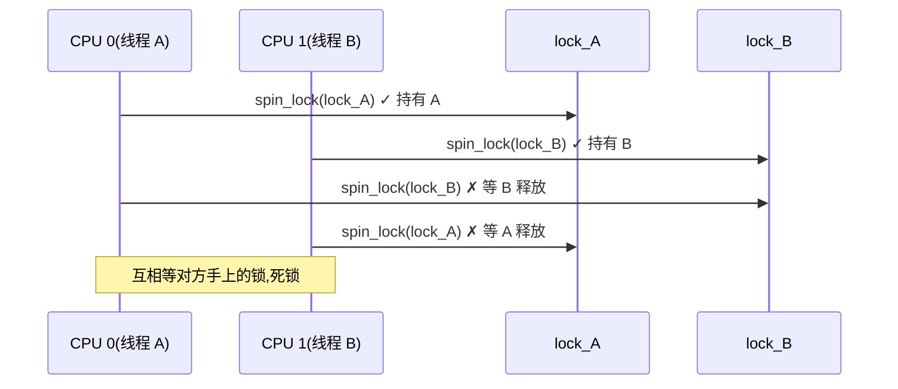
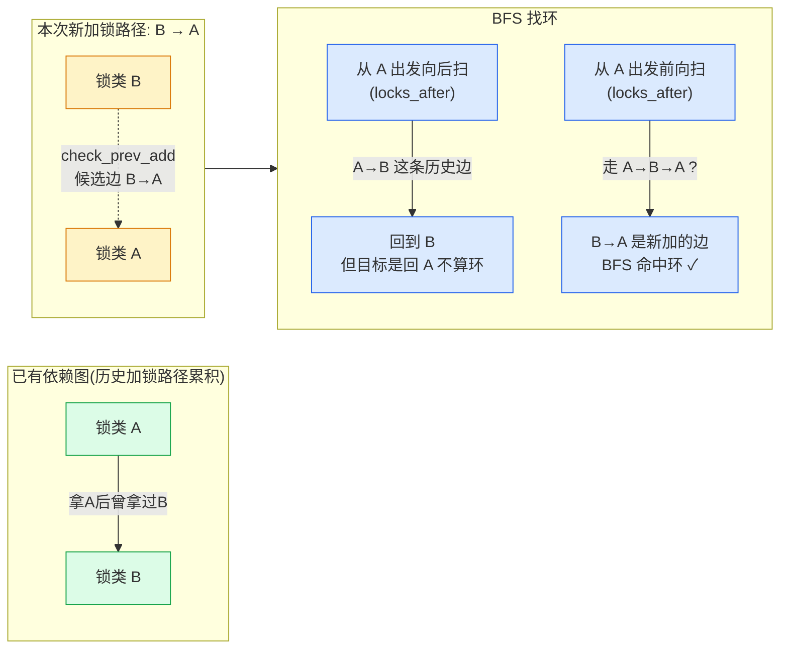
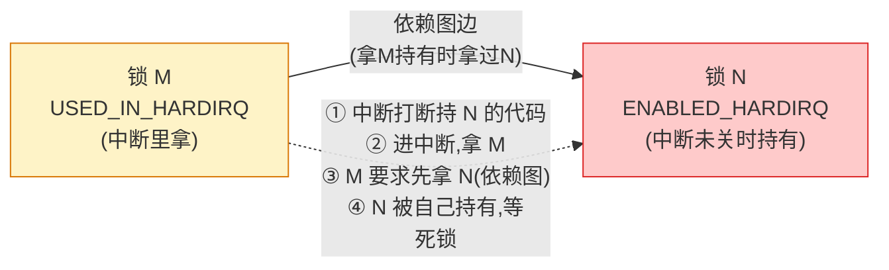
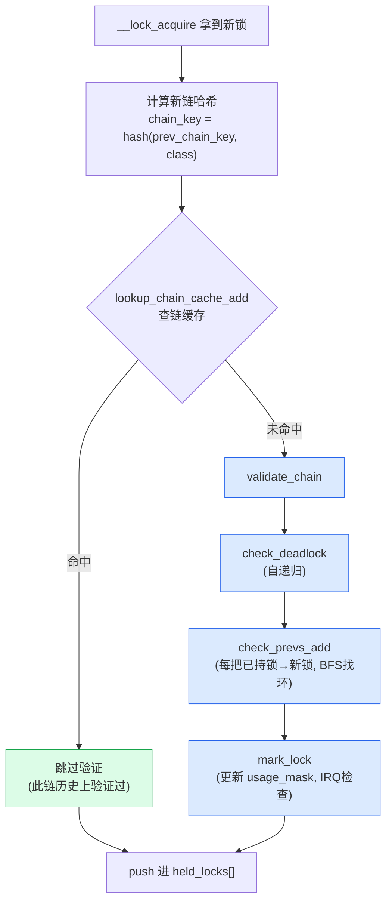
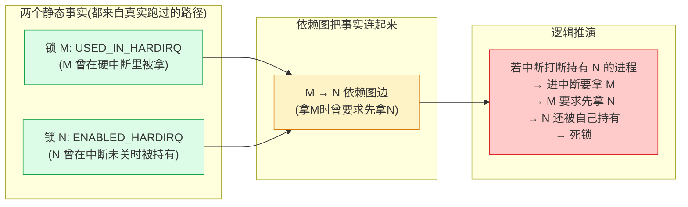

# 第四章 · lockdep 与运行时验证

> 篇:P1 地基
> 主线呼应:前两章我们立起了**原子操作**和**内存屏障**——前者堵住竞争,后者堵住可见性和有序性。可这两样,只是把"会出错的代码"挡在门外的一半。锁的源码里藏着另一类更阴险的 bug——**死锁**(两个 CPU 互相等对方手上的锁)和**IRQ 上下文误用**(在中断里拿了一把不该在中断拿的锁)。这些 bug 在开发环境低负载下根本不炸,只在生产环境高负载 + 中断恰好在某个时间点打断 + 某两个执行流恰好按相反顺序拿锁时,才偶发地挂死整机。等你重现问题时,系统早就死透了。这一章讲 **lockdep**:一个**运行时验证器**,在内核每次加锁、解锁时自动跑一遍检查——只要开发期跑过那条代码路径,死锁、IRQ 误用就当场被抓出来,**不依赖高负载触发**。它是内核同步原语质量的第一道闸门,也是后面所有章节(spinlock/mutex/rwsem)敢放手用锁的底气。

## 核心问题

**锁的正确性怎么验证?`spin_lock` 这一行普通代码,凭什么能让内核知道"你在中断里拿了这把锁会死锁"?lockdep 怎么在开发期就把"只在生产高负载下偶发炸"的死锁抓出来?它凭什么不漏报、不误报?**

读完本章你会明白:

1. **埋点机制**:`spin_lock`/`mutex_lock` 等所有锁 API 内部都自动调用 `lock_acquire`/`lock_release` 钩子——你写的每一行加解锁,lockdep 都能看见,无需手动埋点。
2. **依赖图与死锁检测**:每次拿锁都被记成"前一把锁 → 这把锁"的图边;新增边时用 BFS 在图里找环,有环即 ABBA 死锁。
3. **IRQ 安全性**:`usage` 位图记录每把锁"在哪些上下文(进程/软中断/硬中断)被用过",发现"irq-safe 锁通过新依赖链连到 irq-unsafe 锁"就报警——这能在不真触发中断的情况下,从静态依赖推出"一旦中断来了就死锁"。
4. **`struct held_lock` 持锁栈**:每个任务一份当前持锁栈(`task->held_locks[]`),lockdep 据此重建"我在拿这把锁之前,还拿着哪些锁"。
5. **开销权衡**:lockdep 是开发/调试期开(`CONFIG_PROVE_LOCKING`/`CONFIG_DEBUG_LOCK_ALLOC`)、生产可能关的工具——埋点本身有微秒级开销,且占用静态分配的依赖表。这是"开发期吃力,生产期省心"的设计。

---

> **逃生阀**:这一章会出现"`struct held_lock`"、"usage 位图 `LOCK_USED_IN_HARDIRQ`"、"BFS 找环"等概念。如果你只写过用户态多线程,没碰过内核锁验证,不要慌——本章不要求你立刻会写一个 lockdep,只要求你**抓住三件事**:① lockdep 在每次 `lock_acquire` 自动跑;② 死锁检测 = 依赖图里找环;③ IRQ 安全性 = usage 位图 + 依赖图前后向 BFS。把这三件事钉死,后面读 spinlock/mutex 章节时,你就能看懂那些 `lock_acquire(...)` 调用到底在防什么。

## 4.1 一句话点破

> **lockdep 是一个运行时锁验证器:它在每次 `lock_acquire`/`lock_release` 时自动跑——把每次加锁记成"前锁 → 这锁"的图边,在依赖图里用 BFS 找环就发现 ABBA 死锁;用 `usage` 位图记录每把锁"在哪些 IRQ 上下文被用过",发现 irq-safe 锁通过新依赖链连到 irq-unsafe 锁就报警。它不依赖高负载触发,只要开发期跑过那条路径,bug 当场炸。代价是开发期开启、生产可能关——开销权衡。**

这是结论,不是理由。本章倒过来拆:先看 lockdep 怎么在你毫无感知的情况下被自动调用(埋点),再看它怎么把每次加锁记成图边(依赖图),然后看它怎么在图里找环判死锁(`check_prevs_add` + `check_deadlock`),再补上 IRQ 安全性(usage 位图),最后看为什么它是"开发期开、生产可关"的开销权衡。

---

## 4.2 痛点先立:没有 lockdep,死锁长什么样

在拆 lockdep 之前,先把"它要解决的问题"立起来——否则你不知道它为什么值得这些开销。

考虑这段经典 ABBA 死锁:两个执行流,各持一把锁,再去抢对方的锁。



这段代码在开发环境低负载下,**完全跑得通**——只要 CPU 0 和 CPU 1 没在同一瞬间各自拿到一把锁,就永远不会撞上死锁分支。只有当两个线程恰好在毫秒级窗口内交错执行,死锁才发生。在生产环境 64 核 + 高负载 + 跑了几小时后,这个窗口终于被命中,系统挂死。

**痛点**:这种 bug 难复现、难诊断。你拿到一个"整机挂死"的现场,看到的只是 64 个 CPU 全在 `spin_lock` 上自旋,根本不知道**哪个执行流先动、按什么顺序拿锁**才撞成的死锁——而真正的因果链,在挂死前几小时就埋下了。

> **不这样会怎样**:如果没有 lockdep,内核同步代码质量只能靠"代码审查 + 压力测试"两条软手段——审查漏看一处潜在环就漏过,压力测试没命中那个时序就漏过。Linux 内核有几十万处加锁、上千把锁实例、横跨文件系统/网络/调度/驱动几十个子系统,**纯靠人工审依赖顺序根本不现实**。lockdep 用机器替人审,只要开发期跑过(比如开 `CONFIG_PROVE_LOCKING` 跑一遍 boot 自测和压力场景),所有"只要被跑到过"的加锁顺序都会被验证一遍。

lockdep 要解决的,就是"**把只在极端时序才暴露的死锁,提前在开发期一次性抓出来**"。下面看它怎么做到。

---

## 4.3 埋点:`spin_lock` 怎么自动调用 `lock_acquire`

lockdep 的第一个前提,是**它必须看得见你每一次加锁解锁**。如果靠程序员手动调 `lockdep_check()`,那必然漏——内核几十万处加锁,谁记得写?所以 lockdep 的设计是:**所有锁 API 内部统一埋点**,你写 `spin_lock(&lock)`,编译期就被替换成"`preempt_disable` + `lockdep 埋点` + `真正加锁`"三步,你毫无感知。

来看 6.9 内核 `spin_lock` 的展开链。你写:

```c
spin_lock(&my_lock);
```

经过 `include/linux/spinlock.h` 的 [内联 `spin_lock`](../linux/include/linux/spinlock.h#L349-L352):

```c
static __always_inline void spin_lock(spinlock_t *lock)
{
    raw_spin_lock(&lock->rlock);
}
```

再经 [`raw_spin_lock` 宏](../linux/include/linux/spinlock.h#L217)(`#define raw_spin_lock(lock) _raw_spin_lock(lock)`),最终在 SMP 配置下展开为 [spinlock_api_smp.h 的 `__raw_spin_lock`](../linux/include/linux/spinlock_api_smp.h#L130-L135)(内联):

```c
static inline void __raw_spin_lock(raw_spinlock_t *lock)
{
    preempt_disable();
    spin_acquire(&lock->dep_map, 0, 0, _RET_IP_);
    LOCK_CONTENDED(lock, do_raw_spin_trylock, do_raw_spin_lock);
}
```

短短 4 行,藏着埋点的命脉。除了关抢占(`preempt_disable`),关键是 [`spin_acquire`](../linux/include/linux/lockdep.h#L494)(展开为 `lock_acquire_exclusive`):

```c
#define spin_acquire(l, s, t, i)        lock_acquire_exclusive(l, s, t, NULL, i)
#define lock_acquire_exclusive(l, s, t, n, i)  lock_acquire(l, s, t, 0, 1, n, i)
```

——它把 `&lock->dep_map`(`struct lockdep_map` 嵌在每把锁里)传给 lockdep 的 [`lock_acquire` 主入口](../linux/kernel/locking/lockdep.c#L5719-L5759):

```c
void lock_acquire(struct lockdep_map *lock, unsigned int subclass,
                  int trylock, int read, int check,
                  struct lockdep_map *nest_lock, unsigned long ip)
{
    unsigned long flags;

    trace_lock_acquire(lock, subclass, trylock, read, check, nest_lock, ip);

    if (!debug_locks)
        return;

    if (unlikely(!lockdep_enabled())) {
        /* ... NMI 里 trylock 的特殊处理 ... */
        return;
    }

    raw_local_irq_save(flags);
    check_flags(flags);

    lockdep_recursion_inc();
    __lock_acquire(lock, subclass, trylock, read, check,
                   irqs_disabled_flags(flags), nest_lock, ip, 0, 0, 0);
    lockdep_recursion_finish();
    raw_local_irq_restore(flags);
}
EXPORT_SYMBOL_GPL(lock_acquire);
```

这一段是 lockdep 的总入口,几件事值得拆:

1. **`if (!debug_locks) return;`**:lockdep 一旦发现自身出了问题(比如依赖表爆了),会把 `debug_locks` 置 0,**整个 lockdep 自我关闭**——宁可放过验证也不让 lockdep 本身把系统带挂。这是"验证器不能比被验证者更危险"的工程原则。
2. **`raw_local_irq_save(flags)`**:lockdep 自己的运行要关中断——因为 lockdep 的状态(依赖图、持锁栈)是全局共享的,中断再进来调 lockdep 会递归破坏状态。这一步是 lockdep 自身 IRQ 安全性的根。
3. **`lockdep_recursion_inc()/finish()`**:防止 lockdep 自身的 trace 钩子(`trace_lock_acquire`)再触发 lockdep 形成递归。
4. **`__lock_acquire(...)`** 才是真正的验证逻辑入口——它把这次加锁记进任务的持锁栈、更新依赖图、跑死锁检测。

> **埋点的妙处**:你写 `spin_lock(&my_lock)`,**编译期**就被替换成"关抢占 + `spin_acquire` 埋点 + 真正加锁"。无论你在内核哪个子系统、哪条路径写加锁,埋点都自动生效——你**逃不掉**。这就是 lockdep 100% 覆盖的根。`spin_lock_irqsave`/`mutex_lock`/`down_read` 全都走类似埋点链(`spin_lock_irqsave` 在 [`__raw_spin_lock_irqsave`](../linux/include/linux/spinlock_api_smp.h#L104-L113) 里 `spin_acquire` + `local_irq_save`;mutex 在 `mutex_lock` 内部调 `lock_acquire`)。

> **钉死这件事**:lockdep 的覆盖靠**编译期埋点**——所有锁 API 的内联/宏展开链里都插了 `spin_acquire`/`lock_acquire` 调用。你写一行 `spin_lock`,lockdep 就看得见;不写就不写,只要写了就跑不掉。这是后面"只要跑过就抓得到"的前提。

---

## 4.4 锁类与锁实例:`struct lock_class` vs `struct lockdep_map`

进入验证逻辑前,要先理解 lockdep 的数据模型——它怎么把"成千上万把锁实例"收敛成可分析的图。

内核里一把"锁"其实分两层:

- **锁实例(lock instance)**:你代码里那个具体的 `spinlock_t my_lock;` 变量,运行时存在内存里,可能有成千上万个。
- **锁类(lock class)**:lockdep 把"所有用相同规则初始化的锁实例"归成一个类——比如同一个驱动里所有 `spin_lock_init(&x)` 出来的锁,通常共享同一个 `lock_class_key`,归一个类。

为什么这么分?因为死锁是**顺序问题**——只要锁 A 和锁 B 在某条路径上必须按 A→B 顺序拿,任何"同类的锁实例"都继承这个约束。lockdep 不需要分析每一把实例,只需要分析**类之间的依赖关系**。这把锁的数量从"百万级实例"压到"几千个类",验证才可行。

锁类靠 [`struct lock_class_key`](../linux/include/linux/lockdep_types.h#L75-L80) 标识——它在 `spin_lock_init` 宏里用一个 `static struct lock_class_key __key;` 静态变量声明:

```c
# define spin_lock_init(lock)                    \
do {                                               \
    static struct lock_class_key __key;          \
    __raw_spin_lock_init(spinlock_check(lock),   \
                 #lock, &__key, LD_WAIT_CONFIG); \
} while (0)
```

注意那个 `static __key`——它在**编译期**就是一个有唯一地址的静态变量,lockdep 用它的地址当 lock class 的"身份证号"。同一个 `spin_lock_init` 宏在源码里出现 N 次,就有 N 个不同的 `__key` 地址,对应 N 个锁类。

锁类本身在 [`struct lock_class`](../linux/include/linux/lockdep_types.h#L97-L146) 里描述(简化):

```c
struct lock_class {
    struct hlist_node        hash_entry;        /* 类哈希表挂点 */
    struct list_head         lock_entry;
    /*
     * 依赖图:每个节点挂"forward"(我能拿到哪些锁)
     * 和"backward"(我前面是哪些锁)两条邻接表
     */
    struct list_head         locks_after, locks_before;
    const struct lockdep_subclass_key *key;
    unsigned int             subclass;
    unsigned long            usage_mask;        /* IRQ 上下文使用位图 */
    const struct lock_trace *usage_traces[LOCK_TRACE_STATES];
    const char              *name;
    u8                       wait_type_inner;
    u8                       wait_type_outer;
    u8                       lock_type;
    ...
} __no_randomize_layout;
```

这里最关键的两个字段,直接对应 lockdep 的两大能力:

- **`locks_after`/`locks_before`**:依赖图的邻接表。`locks_after` 是"拿了这把锁之后,曾经还拿过哪些锁";`locks_before` 是反方向。死锁检测就在这两条邻接表上跑 BFS。
- **`usage_mask`**:IRQ 上下文使用位图。记录这把锁被拿时,任务处于什么上下文(进程/软中断/硬中断),以及这把锁是否"可能被中断打断时持有"。IRQ 安全性验证就靠它。

每把锁实例在初始化时,内嵌了一个 [`struct lockdep_map`](../linux/include/linux/lockdep_types.h#L185-L197)(嵌在 `spinlock_t`/`struct mutex` 等里面):

```c
struct lockdep_map {
    struct lock_class_key   *key;
    struct lock_class       *class_cache[NR_LOCKDEP_CACHING_CLASSES];
    const char              *name;
    u8                       wait_type_outer;
    u8                       wait_type_inner;
    u8                       lock_type;
    ...
};
```

`dep_map` 把锁实例映射到锁类。每次 `lock_acquire` 拿到一个 `dep_map`,先查 `class_cache`(快速缓存),没命中就用 `key` 地址哈希查 `struct lock_class`。这样"实例 → 类"的映射是 O(1) 的。

> **为什么这么设计**:锁实例可能有百万级(每打开一个文件、每注册一个网卡都带几把锁),但锁类只有几千级。lockdep 在**类**层面分析依赖,把百万级问题压成几千级,验证才在毫秒内跑得完。这是工程可行性的根。

---

## 4.5 持锁栈:每个任务的 `held_locks[]`

知道了"锁"怎么建模,再看"持锁状态"怎么建模——这是死锁检测要用的"我现在还拿着哪些锁"。

每个任务(`struct task_struct`)持有一个**当前持锁栈**(实际上是数组),在 [sched.h#L1179-L1183](../linux/include/linux/sched.h#L1179):

```c
# define MAX_LOCK_DEPTH         48UL

    int                      lockdep_depth;
    struct held_lock         held_locks[MAX_LOCK_DEPTH];
```

每拿一把锁,lockdep 把这次加锁的元数据 push 进 `held_locks[lockdep_depth]`,然后 `lockdep_depth++`;每放一把锁,反向 pop。`struct held_lock` 在 [`lockdep_types.h#L205-L256`](../linux/include/linux/lockdep_types.h#L205-L256):

```c
struct held_lock {
    u64                      prev_chain_key;    /* 之前累积的链哈希 */
    unsigned long            acquire_ip;        /* 加锁指令地址 */
    struct lockdep_map      *instance;          /* 锁实例的 dep_map */
    struct lockdep_map      *nest_lock;
    unsigned int             class_idx:MAX_LOCKDEP_KEYS_BITS;
    unsigned int             irq_context:2;     /* bit0=soft bit1=hard */
    unsigned int             trylock:1;
    unsigned int             read:2;
    unsigned int             check:1;
    unsigned int             hardirqs_off:1;
    unsigned int             sync:1;
    unsigned int             references:11;
    unsigned int             pin_count;
};
```

几个字段值得标注:

- **`prev_chain_key`**:一个 64 位滚动哈希——把"我之前拿的所有锁的锁类"按顺序哈希进一个数。lockdep 用它做"依赖链缓存"——同一条持锁链的哈希相同,验证结果可复用,避免对同一条链重复 BFS(这是 lockdep 性能优化的关键)。
- **`irq_context:2`**:这把锁是在哪个上下文拿的——`bit0` 软中断,`bit1` 硬中断。一个 `held_lock` 的 `irq_context` 直接决定它要不要参与 IRQ 安全性验证。
- **`class_idx`**:指向 `lock_classes[]` 数组里的 `struct lock_class`——这把锁属于哪个锁类。

这个栈就是 lockdep 重建"我拿着 A 还要去拿 B"的关键。当 `__lock_acquire` 被调用时,它知道:

- 任务当前持锁栈上有 `curr->held_locks[0..depth-1]`,这些是"我前面已经拿的锁"。
- 现在要拿的新锁(参数 `lock`),要 push 进栈顶。
- 死锁检测的输入是:**新锁 vs 栈上每一把已持锁**——尤其是栈顶那把(它是"直接前驱",最可能形成新依赖)。

> **为什么 sound**:`held_locks[]` 是任务私有的——只有当前任务自己会改自己的栈,且 lockdep 在 `raw_local_irq_save` 下运行(中断不会打断它),所以**持锁栈的更新是原子的、不被破坏的**。lockdep 看到的持锁栈,就是这个任务此刻真实的持锁状态。这是"验证基于的事实"不被并发破坏的根。

---

## 4.6 依赖图:每次加锁记成一条图边

现在到核心:lockdep 怎么把"加锁"变成"图边"。

每次 `__lock_acquire` 跑到 [`validate_chain`](../linux/kernel/locking/lockdep.c#L3822-L3881) 时,会做两件事:

1. **`check_deadlock`**:检查新锁是否就是任务自己已经持有的——自递归死锁(我拿着 A 又去拿 A)。
2. **`check_prevs_add`**:把"栈上每把已持锁 → 新锁"作为候选图边加入依赖图,加入前先做环检测。

先看 [`check_deadlock`](../linux/kernel/locking/lockdep.c#L3026-L3066):

```c
check_deadlock(struct task_struct *curr, struct held_lock *next)
{
    struct lock_class *class;
    struct held_lock *prev;
    struct held_lock *nest = NULL;
    int i;

    for (i = 0; i < curr->lockdep_depth; i++) {
        prev = curr->held_locks + i;
        ...
        if (hlock_class(prev) != hlock_class(next))
            continue;

        /* 允许 read-after-read 递归(read_lock(lock)+read_lock(lock)) */
        if ((next->read == 2) && prev->read)
            continue;
        ...
        print_deadlock_bug(curr, prev, next);
        return 0;
    }
    return 1;
}
```

逻辑直球:遍历自己的持锁栈,**如果新锁的锁类已经在栈上**(且不是允许的读递归),这就是自递归死锁——同一个任务想拿自己已经持有的锁,必然永远等不到(因为没人能替它放锁),当场报错。这是一个最简单但极常见的 bug:`spin_lock(A); spin_lock(A);`。

再看 `check_prevs_add`。它遍历栈上每把已持锁,对"直接前驱 prev → 新锁 next"这条候选边,调 [`check_prev_add`](../linux/kernel/locking/lockdep.c#L3091)(简化):

```c
check_prev_add(struct task_struct *curr, struct held_lock *prev,
               struct held_lock *next, ...)
{
    /*
     * 1. 把 prev → next 加进图(BFS 之前先加,BFS 时能查到)
     * 2. 从 next 出发向后向 BFS,看能不能回到 prev
     *    能 → 形成 prev → next → ... → prev 的环 = ABBA 死锁
     */
    ret = check_noncircular(&this, &target_entry, ...);
    if (ret) {
        /* 找到环!报 ABBA 死锁 */
        print_circular_bug(...);
        return 0;
    }
    /* 还要做 IRQ safe→unsafe 检测(下一节讲) */
    ...
    return 1;
}
```

关键就一行 BFS:**从 next 向后扫,看能否回到 prev**——如果能,就形成了 `prev → next → ... → prev` 的环,环就是死锁。

用一个具体例子把 ABBA 抓出来的过程画清楚。假设代码里先有过路径"拿 A 再拿 B",于是依赖图里有边 `A → B`。现在 lockdep 在跑一条新路径"拿 B 再拿 A",验证逻辑会:



注意:`check_prev_add` 在 BFS 之前就把 `prev → next` 边加进图(让它能被 BFS 命中),然后从 next 出发前向 BFS 找 prev。如果命中,说明加上这条边后图里出现了环——这就是 ABBA 的拓扑刻画。报错后,lockdep 把这条边**回滚**(否则后面所有验证都会撞这条假边)。

> **为什么 sound**(为什么依赖图找环能覆盖经典 ABBA 死锁):ABBA 死锁的拓扑定义就是"锁依赖图里存在环"——`A→B` 表示"曾经有人在拿 A 持有时去拿 B"(说明 A 必须先于 B),`B→A` 表示反过来。两条边同时存在,就是"既要 A 先于 B、又要 B 先于 A",逻辑矛盾,在合适的时序下必然死锁。**只要开发期跑过这两条加锁路径**,依赖图里就会有这两条边,lockdep 在加第二条边时 BFS 就命中环。所以"跑过 = 验证过"——开发期把所有加锁路径跑一遍(典型手段:开 `CONFIG_PROVE_LOCKING` 跑 boot + 子系统自测 + 压力场景),所有 ABBA 死锁都被抓光。

> **钉死这件事**:死锁检测 = 在依赖图里找环。每次加新边前,从新边的目标节点出发 BFS,看能不能回到源节点——能就是环,环就是死锁。这把"会偶发炸"的死锁,转成了"开发期跑过就立刻报警"的图论问题。这是 lockdep 的第一根支柱。

---

## 4.7 IRQ 安全性:`usage` 位图与"假想中断"死锁

依赖图找环抓的是**进程上下文**的 ABBA。但内核还有一类更阴险的死锁——**IRQ 上下文死锁**:一个执行流在持锁时被中断打断,中断处理里又去拿同一把锁。这种死锁**不形成进程上下文的环**,纯依赖图找环抓不到。lockdep 的第二根支柱——`usage` 位图——就是抓这个的。

先看问题。考虑这段代码:

```c
/* 进程上下文 */
void func(void) {
    spin_lock(&lock_A);          /* A 在进程上下文被拿 */
    do_something();              /* ← 这一刻,硬件中断打进来 */
    spin_unlock(&lock_A);
}

/* 硬中断处理 */
irqreturn_t handler(int irq, void *d) {
    spin_lock(&lock_A);          /* ← 又去拿 A,但 A 还被进程持有 */
    spin_unlock(&lock_A);
    return IRQ_HANDLED;
}
```

这段代码没有进程上下文的环(`func` 和 `handler` 都只拿一把锁 A),依赖图找环不会报警。但它**会真的死锁**:进程拿了 A,中断打断它,handler 又去拿 A,自旋等 A 释放——而 A 的释放要等进程继续跑,进程却被中断卡住了。这就是 `spin_lock_irqsave` 存在的全部理由(第 7 章 P2-07 详讲):拿 A 时必须同时关中断,否则中断来了就死锁。

lockdep 怎么在不真触发中断的情况下抓到它?靠 `usage` 位图。它给每把锁类记录两组信息:

1. **`LOCK_USED_IN_HARDIRQ`/`LOCK_USED_IN_SOFTIRQ`**:这把锁曾经在硬中断/软中断上下文被拿过(说明这把锁"会被中断处理路径使用")。
2. **`LOCK_ENABLED_HARDIRQ`/`LOCK_ENABLED_SOFTIRQ`**:这把锁曾经在"中断未禁用"的情况下被持有(说明这把锁"可能被中断打断")。

这两组 bit 的定义在 [lockdep_internals.h#L13-L48](../linux/kernel/locking/lockdep_internals.h#L13-L48),靠 `lockdep_states.h` 宏展开成 `HARDIRQ` 和 `SOFTIRQ` 两组([lockdep_states.h](../linux/kernel/locking/lockdep_states.h) 全文就两行):

```c
LOCKDEP_STATE(HARDIRQ)
LOCKDEP_STATE(SOFTIRQ)
```

展开后 `enum lock_usage_bit` 一共 10 个位(2 状态 × 4 变体 + USED/USED_READ):

```
位名                            含义
LOCK_USED_IN_HARDIRQ            曾在硬中断上下文被拿
LOCK_USED_IN_HARDIRQ_READ       曾在硬中断上下文被拿(读)
LOCK_ENABLED_HARDIRQ            曾在硬中断未禁用时被持有
LOCK_ENABLED_HARDIRQ_READ       同上(读)
LOCK_USED_IN_SOFTIRQ            曾在软中断上下文被拿
LOCK_USED_IN_SOFTIRQ_READ       同上(读)
LOCK_ENABLED_SOFTIRQ            曾在软中断未禁用时被持有
LOCK_ENABLED_SOFTIRQ_READ       同上(读)
LOCK_USED                       一般使用
LOCK_USED_READ                  一般使用(读)
```

这些位累加在 [`struct lock_class` 的 `usage_mask` 字段](../linux/include/linux/lockdep_types.h#L127)(unsigned long)。每次 `lock_acquire` 时,根据当前上下文(进程/软中断/硬中断、中断是否禁用),给锁类的 `usage_mask` 置对应位——逻辑在 [`mark_lock`](../linux/kernel/locking/lockdep.c#L4637-L4680):

```c
static int mark_lock(struct task_struct *curr, struct held_lock *this,
                     enum lock_usage_bit new_bit)
{
    unsigned long new_mask = 1 << new_bit;
    ...
    if (likely(hlock_class(this)->usage_mask & new_mask))
        return 0;                          /* 已置过,跳过 */

    if (unlikely(hlock_class(this)->usage_mask & (new_mask & ...)))
        return 0;

    if (!hlock_class(this)->usage_mask)
        save_trace(...);                   /* 第一次用这把锁,存 trace */

    hlock_class(this)->usage_mask |= new_mask;
    ...
    ret = mark_lock_irq(curr, this, new_bit);    /* ← 触发 IRQ 安全性检查 */
    ...
}
```

每次给 `usage_mask` 新增一个位,就触发 [`mark_lock_irq`](../linux/kernel/locking/lockdep.c#L4205),它会调用 [`check_usage_forwards`](../linux/kernel/locking/lockdep.c#L4088)/[`check_usage_backwards`](../linux/kernel/locking/lockdep.c#L4123) 做 BFS——这次 BFS 不是找环,而是找"**新置位的 IRQ 使用模式 × 已有依赖图** 的非法组合"。

具体规则注释在 [lockdep.c#L2695-L2715](../linux/kernel/locking/lockdep.c#L2695):

```
非法组合(就是死锁模式):
    LOCK_USED_IN_IRQ_*     → LOCK_ENABLED_IRQ_*
    LOCK_USED_IN_IRQ_*_READ → LOCK_ENABLED_IRQ_*
    LOCK_USED_IN_IRQ_*     → LOCK_ENABLED_IRQ_*_READ
    LOCK_USED_IN_IRQ_*_READ → LOCK_ENABLED_IRQ_*_READ
```

这组规则的逻辑直球:如果锁 M 标了 `USED_IN_HARDIRQ`(M 在中断里被拿),而通过依赖图(前向 BFS)能到达锁 N,N 标了 `ENABLED_HARDIRQ`(N 在中断未禁用时被持有),那么——



翻译成时序:某进程拿了 N(中断未禁用),中断打断它,进中断处理,处理里要拿 M(因为 M `USED_IN_HARDIRQ`)——但拿 M 的代码路径要按依赖图先拿 N(因为 M→N 是依赖边),N 还被进程自己持有,等不到,**死锁**。

lockdep 不需要真触发这个中断——它从"M `USED_IN_HARDIRQ`"和"N `ENABLED_HARDIRQ`"+ 依赖图"M→N"三个静态事实,**推演出**这个时序必然导致死锁,当场报警。

> **为什么 sound**(为什么 usage 位图能抓"中断里拿错锁"):usage 位图本质是把"动态的时序问题"翻译成"静态的图问题"。lockdep 记录两个事实——① 这把锁会在什么上下文被拿(USED_IN_IRQ);② 这把锁会在中断未关时被持有(ENABLED_IRQ)。这两个事实加上依赖图(锁之间的先后顺序),就足以**在不开中断的情况下,推演出"一旦中断来了就死锁"**。这就是 lockdep 不依赖高负载触发的根:它不靠重现 bug 报 bug,而是靠**已有事实的逻辑推演**报 bug。只要开发期跑过"在进程上下文持有 N"(N 标 `ENABLED_HARDIRQ`)、跑过"在中断里拿 M"(M 标 `USED_IN_HARDIRQ`)、跑过"M→N 的加锁顺序"(图里有这条边)——三条路径都跑过(不必同一次跑),lockdep 就能推断出死锁。这就是"跑过 = 验证过"的 IRQ 版。

> **钉死这件事**:IRQ 安全性靠 `usage` 位图 + 依赖图前后向 BFS。usage 位图记录每把锁"会在什么上下文被用";依赖图记录锁之间的顺序;两者组合就能**静态推演**出"中断来了会死锁"的场景——不需要真触发中断。这是 lockdep 不依赖高负载触发的根,也是 `spin_lock_irqsave` 这种 API 能被验证"用对地方了"的根。

---

## 4.8 反面对比:没有 lockdep,这类 bug 长什么样

为了把 lockdep 的价值钉死,看看没有它会怎样:

| bug 类型 | 没锁 lockdep | 有 lockdep |
|---|---|---|
| ABBA 进程上下文死锁 | 只在两个执行流恰好同时拿相反顺序的锁时挂死;开发环境低负载下永远不炸 | 开发期跑过两条加锁路径就报警 |
| IRQ 上下文误用(进程持锁被中断打断,中断里拿同锁) | 只在硬件中断恰好在该临界区窗口内触发时挂死;极难复现 | 开发期跑过"持锁路径"+"中断里拿锁路径"就报警 |
| 自递归(spin_lock(A) 后又 spin_lock(A)) | 必死,但首次发现时已经在某个不容易想到的路径 | 第一次跑到该路径立刻报 |
| 锁类误用(把一把需要 `irqsave` 的锁在中断未关时持有) | 中断来了死锁 | 第一次持有时检查 usage 位图就报 |

这些 bug 的共性:**因果链要等特定时序才暴露**。开发期跑测试,大概率跑不到那个时序,bug 就潜伏进生产;生产高负载跑几小时/几天,终于撞上时序,系统挂死;事后看 dump 只看到 64 个 CPU 全在自旋,根本不知道**几小时前的哪条路径埋的祸根**。lockdep 把"等时序触发"变成"跑过就报",是这类 bug 能在内核几十万处加锁里维持可控的唯一手段。

> **不这样会怎样**:Linux 内核从 2.6(2006 年引入 lockdep,作者 Ingo Molnar)起,主流内核都默认带 lockdep 选项;发行版的 debug kernel(`CONFIG_LOCKDEP=y`)在所有开发测试场景开;许多云厂商生产内核也保留 lockdep 可动态开启(`debug_locks` 开关)。**一个不开 lockdep 的内核,同步代码质量只能靠经验主义压力测试——而历史已经反复证明,压力测试抓不到所有时序死锁**。lockdep 是内核同步原语质量的"开发期吃力,生产期省心"投资。

---

## 4.9 技巧精解:依赖图 + usage 位图 —— 怎么做到不漏不误报

这一节把本章最硬的两个技巧单独拆透。

### 技巧一:依赖图找环的"链哈希缓存"

朴素做法是:每次加锁,对"已持锁栈上每把锁 → 新锁"都跑一遍全图 BFS 找环。N 把已持锁 × 全图 BFS,每次加锁开销 O(N × 图大小),百万次加锁下来 lockdep 自己把系统拖死。

lockdep 用 [`prev_chain_key`](../linux/include/linux/lockdep_types.h#L220) 滚动哈希优化。每条"已持锁链"用一个 64 位哈希唯一标识——push 一把锁时,新哈希 = hash(旧哈希, 新锁的 lock_class)。如果两条持锁链哈希相同,说明它们的"锁类序列"完全一致,**之前的验证结果可复用**——直接跳过 BFS。

看 [`__lock_acquire`](../linux/kernel/locking/lockdep.c#L4989) 里的核心:`lookup_chain_cache_add`。如果新链哈希命中缓存,说明这条链以前验证过没死锁(否则 lockdep 当场就把系统关了),直接复用结论;没命中才走 [`validate_chain`](../linux/kernel/locking/lockdep.c#L3822-L3881) 跑 BFS。



这个优化的命脉:**同一条持锁链的哈希稳定可复现**(锁类序列相同 → 哈希相同),所以"第一次跑某条链时付 BFS 的代价,后续无数次跑同一条链都免费"。开发期常见路径(`spin_lock(A); spin_lock(B);` 这种)只跑第一次时被 BFS 验证一次,之后每次进这条路径都只查哈希,O(1)。这是 lockdep 实测开销能压在"微秒级"而不是"毫秒级"的关键。

> **为什么 sound**:哈希缓存只缓存"验证通过"的结论——验证失败的(lockdep 报死锁)会立刻关掉 `debug_locks`,系统不会再走这条路径。所以缓存里只有"安全"的链,复用不会漏报。唯一风险是"哈希碰撞"——两条不同链哈希相同,导致一条本该报错的链被误判为安全。lockdep 用 64 位哈希 + 在 push 时还会校验 class 序列,实际碰撞概率可忽略。这是工程上的"足够 sound"。

### 技巧二:usage 位图怎么把"动态死锁"翻译成"静态图问题"

前面 4.7 节讲了用法,这里补一刀"为什么这么设计 sound"。

usage 位图妙在**它不需要 lockdep 真去跟踪中断**。朴素的 IRQ 死锁检测会想:"我能不能模拟一个中断,看会不会死锁?"——这要模型化整个中断子系统,工程上不可能。

lockdep 的偷懒之处:**它只记录两类静态事实**(USED_IN_IRQ / ENABLED_IRQ),然后用依赖图把这两个事实连起来——如果 USED_IN_IRQ 的锁通过依赖图能到 ENABLED_IRQ 的锁,就报警。这等于在说:**"如果以后真有中断来了,这里的时序必然死锁——我不等它真来,我现在就从已有事实推出来了。"**

这种"静态推演动态"的能力,是 lockdep 工程上最妙的地方。它把"中断死锁"这个看似动态的问题,**规约**成图论问题——只要依赖图是 sound 的(锁类之间的边都来自真实加锁路径),usage 位图是 sound 的(每把锁的 IRQ 使用位都来自真实跑过的上下文),那么"USED_IN_IRQ 锁 → ENABLED_IRQ 锁"的依赖存在 ⇒ 真实中断必然死锁,**这一推演是逻辑上 sound 的**。



> **为什么 sound**:推演的每一步都是逻辑必然——"中断打断持有 N 的进程"是 `ENABLED_HARDIRQ` 的定义;"进中断要拿 M"是 `USED_IN_HARDIRQ` 的定义;"M 要求先拿 N"是依赖图边的定义;"N 被自己持有等不到"是自递归死锁的定义。四个定义连起来 ⇒ 死锁。**lockdep 不需要真触发中断,它从已有事实的逻辑闭包里推出死锁必然性**。这就是 lockdep 不依赖高负载触发的工程原理——也是为什么"开发期跑过"等价于"生产期不会撞"。

### 反面对比:朴素验证会撞什么墙

朴素验证有两套:

1. **"开个中断试试"**:工程不可行——内核不能为验证目的任意注入中断(会破坏被验证代码的语义)。
2. **"压力测试等死锁"**:概率事件,跑几小时可能撞不到;撞到了也只剩 64 个 CPU 自旋的死现场,根本定位不到几小时前的祸根。

lockdep 的依赖图 + usage 位图是**第三条路**:不靠触发,靠推演。这是它能"开发期一次性抓光"所有跑过的路径上死锁的根。

> **钉死这件事**:lockdep 的两大技巧——链哈希缓存(让验证 O(1) 命中)、usage 位图静态推演(让 IRQ 死锁不必真触发就能抓)——共同保证了"开发期吃微秒级开销,生产期省掉整起死锁事故"。

---

## 4.10 开销权衡:为什么"开发期开,生产可关"

最后一块拼图:lockdep 既然这么好,为什么不全开?

答案是**开销**。lockdep 的埋点和验证有几层代价:

1. **静态内存**:`MAX_LOCKDEP_KEYS = 8192` 个锁类 × `struct lock_class`(~百字节)+ `MAX_LOCKDEP_ENTRIES` 条依赖边 × 边结构——加起来几 MB 静态分配,在嵌入式内核里是负担。
2. **每次加锁的运行时开销**:`lock_acquire` 进 raw_irq_save + 查链缓存 + push 持锁栈 + (未命中时)BFS。哪怕缓存命中,也是几十纳秒到几百纳秒——对热路径(spinlock 几十纳秒级临界区)是 2-3 倍开销。
3. **自身可能 OOM/爆表**:依赖表满了 lockdep 会自我关闭(`debug_locks = 0`),在那之前的验证结果依然有效,但之后的路径不再验证——这是工程上的"软关闭"。

所以内核配置分两档:

- **`CONFIG_PROVE_LOCKING=y` + `CONFIG_DEBUG_LOCK_ALLOC=y`**:全功能 lockdep,开发/调试内核默认开。
- **生产内核**:`CONFIG_LOCKDEP` 通常不开,或编译进去但运行时关(`debug_locks = 0`)。锁 API 的 `lock_acquire` 调用变成空操作(由 `if (!debug_locks) return;` 早退)。

这是经典的"开发期吃力,生产期省心"权衡——开发期付出微秒级每次加锁开销,换生产期不出死锁事故。和内核许多 debug 选项(`KASAN`/`KCSAN`/`DEBUG_PAGEALLOC`)同思路。

> **所以这样设计**:lockdep 是个**可选的、开发期开启的验证器**,不是同步原语本身的必经路径。生产环境关掉它,`spin_lock` 就回到 fast path + 自旋的纯性能路径;开发环境开它,把所有跑过的加锁路径验证一遍。这层"开关"是 lockdep 能进主线内核的关键——它不强制给所有人付开销。

---

## 章末小结

这一章是第 1 篇(地基)的收尾。我们没有讲任何一把"真正的锁",而是讲了内核怎么**验证**锁——这是后面所有章节(spinlock/mutex/rwsem)敢放手用的底气。把本章钉死五件事:

1. **埋点机制**:所有锁 API 内部统一调 `lock_acquire`/`lock_release`,你写一行 `spin_lock` 就自动埋点,逃不掉。
2. **锁类 vs 锁实例**:lockdep 在锁类(`struct lock_class`)层面分析依赖,把百万级锁实例压成几千级锁类,验证才可行。
3. **持锁栈**:`task->held_locks[]` 记录每个任务当前持锁,是死锁检测和依赖图重建的输入。
4. **依赖图找环**:每次加新边前 BFS 找环,有环即 ABBA 死锁;链哈希缓存让常见路径 O(1) 命中。
5. **usage 位图 + IRQ 安全性**:每把锁记录"曾在什么上下文被用",用静态事实推演"中断来了会死锁",不必真触发中断。

### 二分法归属

本章服务**支撑地基**——lockdep 本身不是锁,是验证工具。它不回答"等不到怎么办"(那是阻塞睡眠 vs 自旋/无锁的分野),它回答"**你用的锁会不会在某条执行序下死锁/破坏 IRQ 安全性**"。第 1 篇三件套至此齐了:**原子操作**(堵竞争)、**内存屏障**(堵可见性/有序性)、**lockdep**(验证锁的正确性)——后面才敢造真正的锁。

### 五个"为什么"清单

1. **为什么 `spin_lock` 会自动调 lockdep?** 编译期宏展开。`spin_lock` 内联调 `raw_spin_lock`,后者宏到 `_raw_spin_lock`,在 SMP 配置下展开为 `__raw_spin_lock`,内联里就一行 `spin_acquire(&lock->dep_map, ...)`,展开成 `lock_acquire(...)`。所有锁 API 都走这条埋点链,你逃不掉。
2. **死锁检测为什么不依赖高负载触发?** 因为它把"动态时序问题"翻译成"静态图论问题"——依赖图记录锁类之间的先后顺序(来自所有跑过的加锁路径),环即死锁。只要开发期跑过会形成环的两条路径,lockdep 就在加第二条边时 BFS 命中报警,不必等两个执行流真的同时撞上。
3. **usage 位图凭什么抓 IRQ 误用?** 它记录两个静态事实——锁曾在什么 IRQ 上下文被用(USED_IN_IRQ)、锁曾在中断未关时被持有(ENABLED_IRQ)。两个事实加上依赖图,逻辑推演出"中断来了必然死锁"——不必真触发中断。
4. **`struct held_lock` 的 `prev_chain_key` 是干什么的?** 滚动哈希,标识当前持锁链。哈希命中缓存时跳过 BFS,把 lockdep 的均摊开销从 O(图大小)压到 O(1)。这是 lockdep 性能的命脉。
5. **lockdep 为什么开发期开、生产可关?** 开销权衡。每次加锁有几十到几百纳秒埋点开销,加上几 MB 静态依赖表。开发期吃这点力换"所有跑过的路径都验证过",生产期关掉回到纯性能路径。这是"开发期吃力,生产期省心"的标准 debug 选项权衡。

### 想继续深入往哪钻

- 本章讲的是 lockdep 主干,完整实现细节见 [`kernel/locking/lockdep.c`](../linux/kernel/locking/lockdep.c)(6039 行)、内部头 [`kernel/locking/lockdep_internals.h`](../linux/kernel/locking/lockdep_internals.h)、公共接口 [`include/linux/lockdep.h`](../linux/include/linux/lockdep.h)、数据结构 [`include/linux/lockdep_types.h`](../linux/include/linux/lockdep_types.h)。
- 想看埋点的具体展开,读 [`include/linux/spinlock_api_smp.h`](../linux/include/linux/spinlock_api_smp.h) 的 `__raw_spin_lock`(L130)、`__raw_spin_lock_irqsave`(L104);[`kernel/locking/spinlock.c`](../linux/kernel/locking/spinlock.c) 的 `_raw_spin_lock_nested`(L375)看 `LOCK_CONTENDED` 宏和 `spin_acquire` 调用。
- 想看 IRQ 死锁推演规则,读 [`kernel/locking/lockdep.c`](../linux/kernel/locking/lockdep.c) 的 `mark_lock_irq`(L4205)、`check_usage_forwards`(L4088)、`check_usage_backwards`(L4123),以及 L2695-L2715 的规则注释。
- 想观测 lockdep 在跑,看 `/proc/lock_stat`(锁竞争统计,需 `CONFIG_LOCK_STAT=y`)、`/proc/lockdep`、`/proc/lockdep_chains`、`/proc/lockdep_stats`(依赖图统计);触发死锁报警时 dmesg 会打出 "WARNING: possible circular locking deadlock detected" 完整栈。
- 想看 lockdep 自测,读 [`lib/locking-selftest.c`](../linux/lib/locking-selftest.c)(本章未直接引用,本地未核行号,在线 6.9 可查),它跑各种 ABBA/IRQ 死锁场景验证 lockdep 自身。

### 引出下一章

第 1 篇三件套齐了——**原子操作**堵竞争(P1-02)、**内存屏障**堵可见性/有序性(P1-03)、**lockdep** 验证锁(P1-04)。地基铺好,后面正式进入两条路。下一章我们钻进第 2 篇——**自旋锁类:不阻塞一极**,从 [`kernel/locking/qspinlock.c`](../linux/kernel/locking/qspinlock.c) 的 `queued_spin_lock_slowpath` 讲起,看 spinlock 怎么从朴素 TAS、到 ticket lock、再到 MCS 队列锁 + qspinlock——把"缓存行乒乓"消灭在结构里。lockdep 验证的是锁的正确性,接下来几章要拆的是锁本身的性能与 sound。
