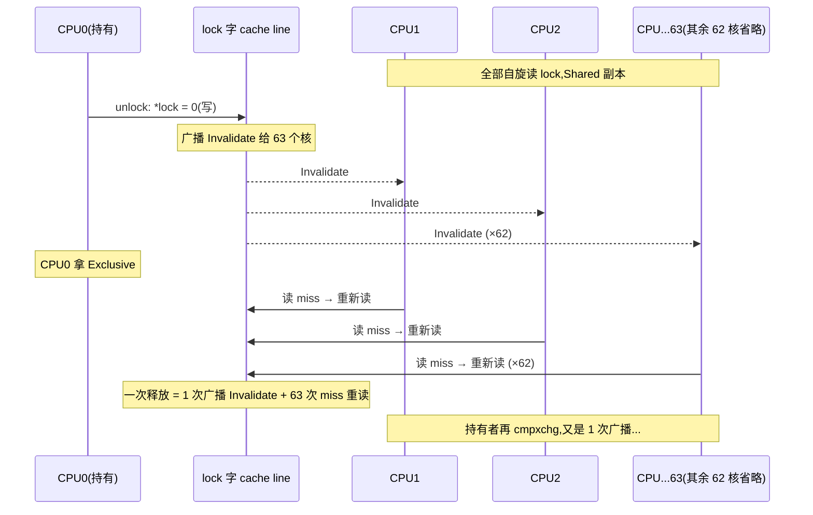
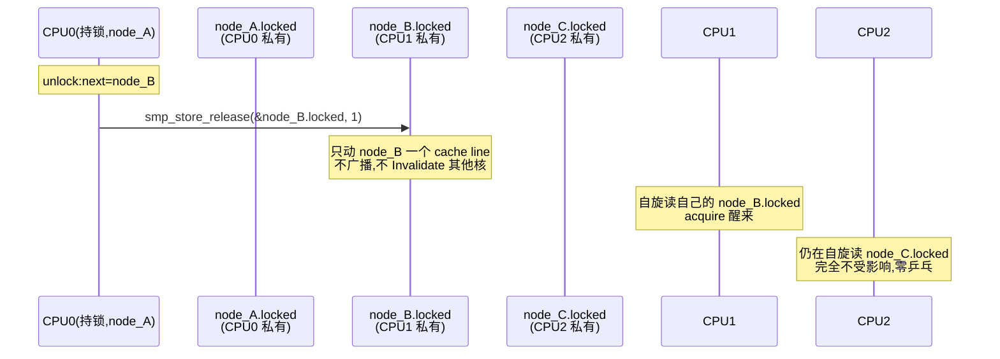
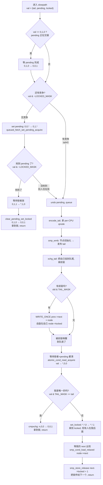
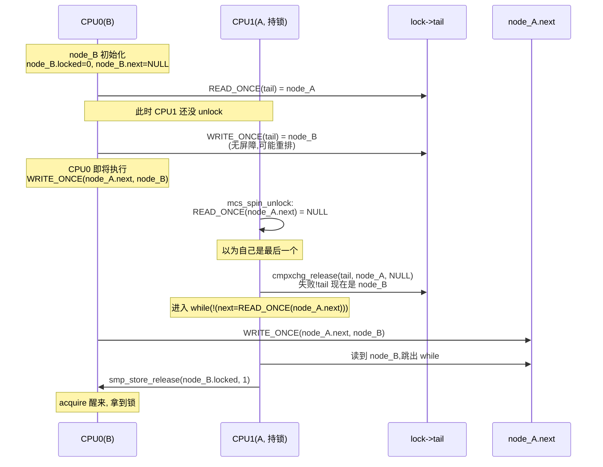

# 第五章 · spinlock 演进:从 ticket 到 qspinlock

> 篇:P2 自旋锁类(不阻塞一极)
> 主线呼应:第一章我们立起"阻塞睡眠 vs 自旋/无锁"二分法时说过,自旋锁那一极的代价是"白白烧 CPU"——但还没完。朴素自旋锁在多核上还有一个比烧 CPU 更致命的毛病:**缓存行乒乓(cache line ping-pong)**。64 个 CPU 抢一把锁,锁字所在的那个 cache line 在 64 个 CPU 之间来回广播 Invalidate,核数越多越慢,慢到锁本身比临界区贵一个数量级。这一章就是讲内核怎么把"乒乓"这件事从根上消灭的——从朴素的 test-and-set,到 ticket(解决公平),再到 MCS 队列锁(把乒乓消灭在结构里),最后到 qspinlock(把 MCS 的"locked + 队列尾指针"压进一个 32 位原子字)。`queued_spin_lock_slowpath` 是全书最难的源码之一,我们逐段拆开。读完这一章,你就拿到了自旋/无锁一极的第一块硬骨头,也理解了为什么 P2-06 的 seqlock、P2-07 的 irqsave 都要建立在 spinlock 之上。

## 核心问题

**朴素 test-and-set 自旋锁在 64 核机器上为什么会越来越慢(不是线性变慢,是核数越多越糟)?ticket lock 解决了什么、没解决什么?MCS 队列锁凭什么把"缓存乒乓"消灭掉?qspinlock 又凭什么把 MCS 压进一个原子字、让 fast path 还是只花一条 `cmpxchg`?`queued_spin_lock_slowpath` 那 200 多行带 `goto queue` 跳转的代码,到底把锁的获取分成了几个阶段,每个阶段为什么必须这么写才 sound(不丢唤醒、不破坏内存序、不死锁)?**

读完本章你会明白:

1. **朴素 TAS 自旋锁的两个病**:无序抢(不公平,可能饥饿)+ 缓存行乒乓(64 核抢一个字,每次释放广播 64 次 Invalidate),核数越多越慢。
2. **ticket lock 解决了公平**(next/owner 两张票,FIFO),**但没解决乒乓**——所有人还是自旋读同一个锁字。
3. **MCS 队列锁的核心洞察**:让每个 spinner 自旋在**自己的本地变量**上,释放时只唤醒队首的下一个——乒乓在结构层面消失了,代价是每个 spinner 要带一个节点。
4. **qspinlock 的工程压缩**:把 MCS 的"locked 位 + pending 位 + 队列尾(CPU 号 + 嵌套层)"压进一个 32 位原子字,无竞争时 fast path 仍是一条 `cmpxchg`,有竞争才建队;4 个 per-CPU `qnode` 留给 task/softirq/hardirq/nmi 四层嵌套。
5. **为什么 sound**:FIFO 公平(队列顺序唤醒)、不丢唤醒(tail 编码 CPU+index,`xchg_tail` 原子地换尾)、不破坏内存序(`smp_wmb` 隔离"初始化节点"和"发布 tail",`smp_cond_load_acquire`/`smp_store_release` 配对)、不死锁(持 spinlock 绝不能睡眠,见 P2-07)。
6. **★ 对照**:`rq->lock` 就是 spinlock(调度器那本讲它的应用,本书讲它的实现);Tokio 的无锁 `mpsc` 队列和 MCS 是同源思想——"用结构消灭竞争"。

---

> **逃生阀**:`queued_spin_lock_slowpath` 是全书源码密度最高、最难读的几段之一,带大量 `goto queue`、`pending` 位、`xchg_tail` 跳转。如果你第一次读觉得"这跳来跳去到底在干嘛",**正常**——它本质上是一个状态机,把锁的 32 位字在 `(tail, pending, locked)` 三段上做转移。本章会用一张状态转移图 + 一张流程图把它讲清。**抓住两件事**就够了:① 无竞争时只走 fast path(一条 `cmpxchg`),② 有竞争才进 slowpath 建 MCS 队列,每个 spinner 自旋在本地 `node->locked` 上。细节跳着读不丢主线。

## 5.1 一句话点破

> **朴素自旋锁让所有 CPU 自旋读同一个锁字,释放一次广播一次 Invalidate,64 核机器上锁字所在的 cache line 像皮球一样在 64 个核之间踢——核数越多越慢。MCS 队列锁的洞察是:让每个 spinner 自旋在自己的本地变量上,释放只通知队首下一个,乒乓在结构里就消灭了。qspinlock 再把这套 MCS 的"locked + pending + 队列尾指针"压进一个 32 位原子字,无竞争时 fast path 一条 `cmpxchg` 命中,有竞争才建队。每一步都既快又 sound:FIFO 公平、不丢唤醒、不破坏内存序。**

这是结论,不是理由。本章倒过来拆:先看朴素 TAS 撞什么墙,再看 ticket 治了什么没治什么,然后立起 MCS 的核心洞察(自旋在本地),最后钻进 `queued_spin_lock_slowpath` 看 qspinlock 怎么把 MCS 压进一个原子字。

---

## 5.2 朴素 TAS:公平与乒乓,两个病

最朴素的多核自旋锁就是 test-and-set(TAS):一个共享的整数 `lock`,0 表示空闲、1 表示占用,抢锁就是 `cmpxchg(&lock, 0, 1)`,失败就原地 `cpu_relax()` 重试。

```c
// 朴素 TAS(示意,非内核源码)
void spin_lock_tas(int *lock) {
    while (cmpxchg(lock, 0, 1) != 0)   // 抢不到
        cpu_relax();                    // pause,继续读
}
void spin_unlock_tas(int *lock) {
    *lock = 0;                          // 直接写 0
}
```

看起来天经地义,但多核上一撞就是两个病。

### 病一:无序抢,可能饥饿

抢锁完全靠"谁先看到 0 谁抢到",没有任何排队概念。64 个 CPU 都在自旋读 `lock`,持有者一释放(写 0),64 个 CPU 同时看到 0、同时 `cmpxchg`,只有一个成功——但**哪个成功是随机的**。极端情况下,某个 CPU 可能永远抢不到(每次都被人抢先),这就是**饥饿(lack of fairness)**。

> **不这样会怎样**:在内核里,如果中断处理路径上的 CPU 一直抢不到一把 spinlock,这把锁保护的中断处理就一直推不进——表现就是偶发的长尾延迟、甚至 softirq watchdog 触发。公平性不是"锦上添花",在锁竞争激烈的路径上是"能不能用"。

### 病二:缓存行乒乓,核数越多越慢

这才是更阴险的病。回想 P0-01 讲过的 MESI 缓存一致性:一个 cache line 在多核之间是**独占或共享**的,谁要写就要先让别的核"作废(Invalidate)"自己那份。朴素 TAS 锁的 `lock` 字就躺在一个 cache line 上,64 个 CPU 都在自旋**读**它——一开始 64 个核都有 Shared 副本。持有者 `unlock` 写 `*lock = 0` 时,要把这 64 份 Shared 副本全部 Invalidate,自己拿到 Exclusive,这本身就是一次跨全 socket 的广播。然后 64 个 CPU 同时 miss、重新读、又拿到 Shared——持锁者下一个 `cmpxchg` 成功,又把 64 份 Invalidate……



每次锁释放,都触发 1 次跨 63 核的广播 + 63 次重读 miss。**这个开销随核数 O(N) 增长**,N=64 时,锁本身的乒乓比临界区执行还贵一个数量级。更糟的是,cache line 还可能在 socket 之间飞(NUMA),延迟再翻几倍。

> **所以这样设计是错的**:朴素 TAS 在小核数(2~4 核)上还凑合,核数一上去就崩。它把"锁竞争"直接映射成了"cache line 竞争",而 cache line 竞争是硬件层面最贵的一种操作。

> **钉死这件事**:朴素 TAS 自旋锁有两个病——**无序抢(不公平)**和**缓存行乒乓(核数越多越慢)**。后者才是真正的性能杀手。后续所有改进(ticket、MCS、qspinlock)都是对着这两个病下刀的,但**只有 MCS 真正动了乒乓的根**。

---

## 5.3 ticket lock:治了公平,没治乒乓

Linux 早期(2.6 到 3.x)用的自旋锁是 **ticket lock**。它的思路像银行叫号:锁里有两个计数器,`next`(下一位要发的号)和 `owner`(现在轮到几号),抢锁时原子地取一个 `next` 号,然后自旋等 `owner` 涨到自己的号。

```
  ticket lock(简化示意,非当前内核源码)
  ┌────────────────────────────┐
  │ atomic_t next;   // 下一个号 │
  │ atomic_t owner;  // 当前号   │
  └────────────────────────────┘

  spin_lock:
    my_ticket = atomic_add_return(&next, 1)   // 取号
    while (READ_ONCE(owner) != my_ticket)     // 等叫号
        cpu_relax();
  spin_unlock:
    owner + 1                                  // 叫下一个号
```

### 治了什么:FIFO 公平

每个 CPU 取到的号是单调递增的,释放时只让号 +1,**严格按取号顺序进入临界区**。彻底消灭了饥饿——只要你取到号,前面就只有有限个人,你一定会轮到。

### 没治什么:乒乓还在

但 `owner` 字还是一个共享 cache line!64 个 CPU 还是**全在自旋读 `owner`**,持锁者 `unlock` 时把 `owner + 1`,又触发一次跨 63 核的 Invalidate + 63 次重读 miss。**乒乓的数量级和朴素 TAS 一样,只是公平性变好了**。

> **不这样会怎样**:ticket lock 在 16 核、32 核机器上还能用,但到了 64 核、96 核、NUMA 多 socket 的大机器上,锁的 cache line 在 socket 之间飞来飞去,延迟随核数线性恶化——这就是为什么 3.15(2014 年)开始 Linux 在 x86 默认启用 qspinlock,把 ticket 换掉。**公平性问题解决了,但性能问题在核数膨胀下又回来了**。

> **钉死这件事**:ticket lock 是一次**半成品**进步——它治了公平,没治乒乓。它揭示了一个更深的洞察:**乒乓的根不是"无序抢",而是"所有人自旋读同一个字"**。要真正消灭乒乓,必须换一个思路:让每个人自旋在自己的字上。这就是 MCS。

---

## 5.4 MCS 队列锁:把乒乓消灭在结构里

1991 年 Mellor-Crummey 和 Scott 的论文(就是 qspinlock.c [L32-L67](../linux/kernel/locking/qspinlock.c#L32-L67) 那段注释里提到的那篇)提出了一个反直觉但极妙的洞察:

> **如果每个 spinner 自旋读的是"自己的、私有的、别人根本不碰的"那个变量,那就不存在 cache line 竞争——因为没人来 Invalidate 它。**

具体做法是:每个抢锁者**带一个本地节点**入场,节点里有一个 `locked` 标志(初始为 0)。所有节点在锁的"等待队列"里串成链,持锁者 `unlock` 时只把**队首下一个节点**的 `locked` 置 1——只动一个 cache line,不广播。

```
  MCS 队列锁结构(对照 mcs_spinlock.h#L18-L22)
  ┌─────────────────────────────────────────────────────┐
  │ struct mcs_spinlock {                               │
  │     struct mcs_spinlock *next;  // 队列下一个        │
  │     int locked;   /* 1 if lock acquired */           │
  │     int count;    /* nesting,见 qspinlock */         │
  │ };                                                  │
  └─────────────────────────────────────────────────────┘

  锁本身只有一个 tail 指针,指向队尾节点
  ┌────────────┐
  │ lock->tail │──► [node_C] ──► [node_B] ──► [node_A(持有)]
  │  (队尾)   │     locked=0      locked=0      locked=1
  └────────────┘

  每个 spinner 只自旋读自己的 node->locked(私有 cache line,无乒乓)
  持锁者 unlock:把 next->locked = 1(只动 next 一个节点的 cache line)
```

### `mcs_spin_lock` 逐行看

参考实现就在内核里:[`mcs_spinlock.h` L64-L95](../linux/kernel/locking/mcs_spinlock.h#L64-L95):

```c
static inline
void mcs_spin_lock(struct mcs_spinlock **lock, struct mcs_spinlock *node)
{
    struct mcs_spinlock *prev;

    /* Init node */
    node->locked = 0;
    node->next   = NULL;

    prev = xchg(lock, node);                 // ① 原子地把 node 挂到队尾,拿到前驱
    if (likely(prev == NULL)) {
        return;                              // ② 我是第一个,直接拿锁
    }
    WRITE_ONCE(prev->next, node);            // ③ 让前驱知道我是它的下一个

    /* Wait until the lock holder passes the lock down. */
    arch_mcs_spin_lock_contended(&node->locked);   // ④ 自旋读自己的 node->locked
}
```

四步的精妙:

- **① `xchg(lock, node)`**:`xchg` 是原子的"换值",把 `lock->tail` 换成 `node`,返回原来的 tail。这一步**原子地完成了"我入队 + 拿到前驱"**,中间不会被别人插队(因为原子)。注意 [`mcs_spinlock.h` L73-L79](../linux/kernel/locking/mcs_spinlock.h#L73-L79) 的注释特别强调:`xchg` 自带的全局内存屏障,既保证了上面的 `node->locked = 0; node->next = NULL` 初始化在别人看到 `node` 之前完成,也提供了 LOCK 原语的 acquire 语义。
- **② `prev == NULL` 表示空队**:我是第一个来的,直接拿锁,不用自旋。
- **③ `WRITE_ONCE(prev->next, node)`**:这一步是**唤醒通道的铺设**——前驱 `unlock` 时要找它的 `next`,我得先告诉它"我是你的下一个"。这里有个 TOCTOU 经典难题(见下文 sound 分析)。
- **④ 自旋在自己的 `node->locked`**:关键!我**不读 `lock->tail`、不读任何共享字**,只读自己这个 `node`。这个 `node` 通常是栈上或 per-CPU 的,**别的 CPU 不会读它**(只有前驱会写它的 `locked`),所以这个 cache line 在我手里是 Exclusive/Modified,自旋读完全无开销。

### `mcs_spin_unlock` 与它的"等待 next 铺好"难题

[`mcs_spinlock.h` L101-L119](../linux/kernel/locking/mcs_spinlock.h#L101-L119):

```c
static inline
void mcs_spin_unlock(struct mcs_spinlock **lock, struct mcs_spinlock *node)
{
    struct mcs_spinlock *next = READ_ONCE(node->next);

    if (likely(!next)) {
        /* 我没看到下一个,可能我是最后一个 */
        if (likely(cmpxchg_release(lock, node, NULL) == node))
            return;                          /* 把 tail 清空,锁归还 */
        /* 否则:有人刚挂上来,但还没把 prev->next 写好,我等它 */
        while (!(next = READ_ONCE(node->next)))
            cpu_relax();
    }

    /* Pass lock to next waiter. */
    arch_mcs_spin_unlock_contended(&next->locked);   /* smp_store_release(&next->locked, 1) */
}
```

这里藏着一个**并发设计的经典难题**,也是 MCS sound 的关键:

**问题**:我(`node`)入队的第 ③ 步 `WRITE_ONCE(prev->next, node)` 在 `xchg` 之后才执行。如果前驱在我执行 `WRITE_ONCE(prev->next, node)` 之前就已经 `unlock` 了呢?前驱 `unlock` 时 `READ_ONCE(node->next)` 看到 `NULL`,会以为"我是最后一个",去 `cmpxchg_release(lock, node, NULL)`——但此时 `lock->tail` 已经被我换成了 `node`(因为我已经 `xchg` 过了),`cmpxchg` 失败,前驱就知道"有人刚挂上来但还没铺 next",于是进 `while` 循环等我把 `prev->next` 写好。

**为什么 sound**:前驱在 `cmpxchg_release(lock, node, NULL) == node` 失败后,**不放弃、不丢失**,而是**等**——`while (!(next = READ_ONCE(node->next)))` 死等我的 `WRITE_ONCE(prev->next, node)` 生效。一旦它读到 `next`,就用 `arch_mcs_spin_unlock_contended(&next->locked)` 把锁传给我(`smp_store_release(&next->locked, 1)`)。**关键不变式**:`xchg` 是原子的,所以"前驱看到的 `lock->tail`"和"我看到的 `lock->tail` 旧值"之间严格有序——要么前驱先(前驱清空 tail 成功,我 `xchg` 拿到 `prev == NULL`,直接拿锁),要么我先(我 `xchg` 拿到 `prev == 前驱`,前驱清空 tail 时看到我插入的 node,失败、走 `while` 等)。**不存在"前驱清空了锁、同时我 `xchg` 进去了却丢了"的执行序**——这就是不丢唤醒的根。

### 屏障配对:acquire-release 配对

`arch_mcs_spin_lock_contended` 是 [`mcs_spinlock.h` L32-L35](../linux/kernel/locking/mcs_spinlock.h#L32-L35) 定义的 `smp_cond_load_acquire(l, VAL)`,即**带 acquire 语义**的轮询读;`arch_mcs_spin_unlock_contended` 是 [`mcs_spinlock.h` L44-L45](../linux/kernel/locking/mcs_spinlock.h#L44-L45) 的 `smp_store_release((l), 1)`。这对 acquire-release 配对保证了:

- 持锁者临界区里的所有写,在它 `smp_store_release(&next->locked, 1)` 之前完成(release)。
- 后继者从 `smp_cond_load_acquire` 醒来后(acquire),能看到持锁者临界区的所有写。

**这就是为什么不会读到撕裂数据**:锁传递 = 一个 release + 一个 acquire,完整构成了 happens-before 边,临界区的数据在两个 CPU 之间无并发。

### MCS 消灭了乒乓:数量级对比

把 MCS 和朴素 TAS 在 64 核机器上对比:

| 项 | 朴素 TAS / ticket | MCS |
|---|---|---|
| 每个 spinner 自旋读什么 | 共享的 `lock` 字 | 自己的 `node->locked` |
| cache line 在谁手里 | 64 核 Shared,写时全 Invalidate | 自旋者是 Exclusive,无竞争 |
| 一次 unlock 触发 | 1 次广播 + 63 次 miss 重读 | **1 次** store(只动 next 一个 cache line) |
| 开销随核数 | O(N)(广播 + miss) | O(1)(释放只通知 1 个) |



**核数从 2 到 64,MCS 的 unlock 开销基本不变**——因为它只通知一个 CPU。这就是"把竞争消灭在结构里"的教科书案例。

> **钉死这件事**:MCS 的核心洞察不是什么花哨的原子操作,而是**重新组织数据布局**:让 spinner 自旋在自己的私有变量上,释放只通知队首下一个。乒乓的根("所有人读同一个字")被结构本身消灭了。这是 P0-01 提到的"用结构消灭竞争"在锁设计上的最高表达——后续 percpu-rwsem(per-cpu 计数器消灭读者乒乓)、RCU(读者不取锁消灭读者所有开销)都是这个思想的不同极致。

### MCS 的代价

MCS 不是免费的。它的代价有两个:

1. **每个 spinner 要一个节点**(`struct mcs_spinlock`,16 字节)。内核里不能随便 `kmalloc`(尤其在 spinlock 路径上,可能正持有别的东西、可能在中断里),所以 qspinlock 用 **per-CPU 静态分配**(下文详述)。
2. **无竞争时也要走一遍 `xchg`**。`xchg` 是一条原子指令,比 `cmpxchg`(可以 fast path 失败才走慢路径)贵——而绝大多数 spinlock 在实际运行中是无竞争的,这一条 `xchg` 就是浪费。这就是 qspinlock 要把 MCS"压成一个原子字、让 fast path 退化成 cmpxchg"的动机。

---

## 5.5 qspinlock:把 MCS 压进一个 32 位原子字

MCS 已经很好了,但 Linux 的 spinlock 是一个嵌入式的 `spinlock_t`,在 `struct` 里到处都是,**只能占 4 字节**(int 大小)。如果照搬 MCS——锁本身一个 8 字节 tail 指针、每个节点一个 8 字节 next 指针——根本塞不进 4 字节。qspinlock 的工程贡献是:**把 MCS 的"locked 位 + pending 位 + 队列尾编码"压进一个 32 位原子字**,同时保留 MCS 的"自旋在本地、释放只通知一个"的核心优势。

### 32 位字的位段布局

[`qspinlock.c` L50-L57](../linux/kernel/locking/qspinlock.c#L50-L57) 的注释把布局讲清楚了(对应 `include/asm-generic/qspinlock.h` 的 `struct qspinlock` 位段,**在线 6.9,本地未解压**):

```
  struct qspinlock 的 32 位原子字布局(对照 qspinlock.c 注释 L50-L67)

   31                                              8  7   1   0
  ┌─────────────────────────────────────────────────┬──────┬───┐
  │                   tail                          │pend. │lck│
  │      [ CPU 号高字节 ][ CPU 号低字节 ]            │ bit  │   │
  │      或 [idx][cpu+1]                            │      │ 1 │
  └─────────────────────────────────────────────────┴──────┴───┘
   │←──────── _Q_TAIL_BITS(24 位,3 字节)─────────→│←8bit→│1b│

  - locked(0 位,1 bit):0=空闲,1=被持有。fast path cmpxchg 抢的就是这一位。
  - pending(8 位,1 字节):有且仅有一个 CPU 是"待定"状态(持锁者刚放、我马上接)。
                          这是 fast path 和 MCS 队列之间的"过渡候车区",最多 1 个。
  - tail(高 24 位,3 字节):队列尾的编码,= encode_tail(cpu, idx)。
                          idx 是嵌套层(0~3:task/softirq/hardirq/nmi),
                          cpu 是 CPU 号(+1,这样 0 表示"无 tail")。
```

三个区段的来历(qspinlock.c 注释 L50-L57):

- **locked 用 1 位**就够了(0/1),但**扩展到 1 字节**是为了让支持字节级原子写的架构(如 x86)能直接 `WRITE_ONCE(lock->locked, 1)`,不动其他位——这是给 fast path 的优化。
- **pending 用 1 字节**:作为 fast path 之上的"二级候车区",持锁者刚放锁时,pending 位上的那个 CPU 能立刻接手,不用走完整的 MCS 入队(节省一次 `xchg`)。
- **tail 用 3 字节**:`encode_tail(cpu, idx)` 把 2 位嵌套 + CPU 号编码进去,足够覆盖 2^22 = 400 万 CPU(早够了);注释 [`qspinlock.c` L51-L57](../linux/kernel/locking/qspinlock.c#L51-L57) 解释了为什么嵌套层只用 2 位——同一 CPU 上 spinlock 最多嵌套 4 层(task/softirq/hardirq/nmi)。

### fast path:一条 cmpxchg

无竞争时,`queued_spin_lock`(`/include/asm-generic/qspinlock.h`,**在线 6.9,本地未解压**)就一条 `cmpxxchg`:

```c
// queued_spin_lock(简化,对照 asm-generic/qspinlock.h 在线 6.9)
static __always_inline void queued_spin_lock(struct qspinlock *lock)
{
    u32 val = atomic_read(&lock->val);

    if (likely(atomic_try_cmpxchg_acquire(&lock->val, &val, _Q_LOCKED_VAL)))
        return;                          // fast path: 0,0,0 → 0,0,1

    queued_spin_lock_slowpath(lock, val);   // 否则慢路径
}
```

`(tail=0, pending=0, locked=0)` 整个字是 0,cmpxchg 把它换成 `_Q_LOCKED_VAL`(locked=1)。命中就返回——**和朴素 TAS 的 fast path 一样便宜,一条原子指令**。这是 qspinlock 相对 MCS 的最大优势:**绝大多数 spinlock 在实际运行中是无竞争的,fast path 一条 `cmpxchg` 搞定,根本不进 MCS 慢路径**。`queued_spin_unlock` 更简单,就是 `WRITE_ONCE(lock->locked, 0)`——只清一位,字节级 store,不需要任何屏障(x86 上是强序的,其他架构在 `queued_spin_unlock` 实现里会加 `smp_store_release`)。

### per-CPU `qnode`:节点池

慢路径要 MCS 节点,qspinlock 不能 `kmalloc`,而是用 per-CPU 静态分配的 [`qnodes[MAX_NODES]`](../linux/kernel/locking/qspinlock.c#L109),`MAX_NODES = 4`([L70](../linux/kernel/locking/qspinlock.c#L70)):

```c
static DEFINE_PER_CPU_ALIGNED(struct qnode, qnodes[MAX_NODES]);
```

每个 CPU 有 4 个 `qnode`,正好对应 4 层嵌套(task/softirq/hardirq/nmi)。嵌套计数由 [`qspinlock.c` L401-L403](../linux/kernel/locking/qspinlock.c#L401-L403) 的 `node->count++` 管理:

```c
node = this_cpu_ptr(&qnodes[0].mcs);
idx = node->count++;
tail = encode_tail(smp_processor_id(), idx);
```

`qnodes[0].mcs.count` 是这个 CPU 的当前嵌套深度——第一次进 spinlock 是 idx=0(task),如果持着锁进了 softirq 又拿 spinlock 是 idx=1(softirq),再嵌 hardirq 是 idx=2,再嵌 nmi 是 idx=3。**为什么不会嵌套超过 4 层?因为内核的上下文嵌套就是这 4 层**,qspinlock.c [L407-L415](../linux/kernel/locking/qspinlock.c#L407-L415) 注释解释了——如果某架构真的嵌了 5 层(理论上极不可能),qspinlock 退化成"直接在 lock 字上自旋"(L416-L421 的 fallback),不优雅但 sound。

> **钉死这件事**:qspinlock 的工程压缩用三件事把 MCS 塞进 4 字节:① tail 编码 CPU 号+嵌套层(2+22 位足够),② per-CPU 静态节点池(不需要 malloc、不竞争),③ 把整个 MCS 状态压成一个原子字(fast path 还是 cmpxchg)。**无竞争时它退化成朴素 TAS,有竞争时它退化成 MCS**——两个世界的优点都拿到了。

---

## 5.6 拆 `queued_spin_lock_slowpath`:状态机逐段

这是本章最硬的一段。 [`queued_spin_lock_slowpath`](../linux/kernel/locking/qspinlock.c#L316-L567)([L316](../linux/kernel/locking/qspinlock.c#L316))有 250 行,但它本质是一个**状态机**:32 位字被切成 `(tail, pending, locked)` 三段,slowpath 做的就是"在这三段上做状态转移,最终让自己拿到 locked"。先把状态机画出来:



下面逐段拆。

### 第一段:`pending` 的过渡候车区(L336-L392)

```c
/* 0,1,0 -> 0,0,1 */
if (val == _Q_PENDING_VAL) {
    int cnt = _Q_PENDING_LOOPS;
    val = atomic_cond_read_relaxed(&lock->val,
                                   (VAL != _Q_PENDING_VAL) || !cnt--);
}

/* 如果有任何竞争(tail 非空或 pending),直接入队 */
if (val & ~_Q_LOCKED_MASK)
    goto queue;

/* trylock || pending:  0,0,* -> 0,1,* -> 0,0,1 */
val = queued_fetch_set_pending_acquire(lock);

if (unlikely(val & ~_Q_LOCKED_MASK)) {
    /* 我设 pending 时发现已经有竞争(tail 或 pending)→ 撤销, 入队 */
    if (!(val & _Q_PENDING_MASK))
        clear_pending(lock);
    goto queue;
}

/* 我是 pending 了,等持锁者放 */
if (val & _Q_LOCKED_MASK)
    smp_cond_load_acquire(&lock->locked, !VAL);

/* 0,1,0 -> 0,0,1: 清 pending, 设 locked, 我拿到锁了 */
clear_pending_set_locked(lock);
lockevent_inc(lock_pending);
return;
```

这一段是 qspinlock 的"二级 fast path"。核心想法:如果只有 1~2 个 CPU 在抢锁(常见情况),根本不值得建 MCS 队列——让"现持锁者 + 1 个 pending"两个 CPU 之间快速交接即可。

- 第一步:如果我进来时锁字正好是 `0,1,0`(pending 交接中),我**有限地自旋等它完成**(L336-L340)。`_Q_PENDING_LOOPS` 限制最多等几轮,保证前向推进。
- 第二步:`val & ~_Q_LOCKED_MASK` 检查除了 locked 位还有别的竞争(tail 或 pending)——有就直接入队。
- 第三步 [`queued_fetch_set_pending_acquire`](../linux/kernel/locking/qspinlock.c#L250-L253)([L250](../linux/kernel/locking/qspinlock.c#L250)):`atomic_fetch_or_acquire(_Q_PENDING_VAL, &lock->val)`,原子地置 pending 位,返回旧值。如果旧值只有 locked(没有 tail 也没有 pending),那 pending 位被我抢到了——我成了"候车区"的唯一一个。
- 第四步:`smp_cond_load_acquire(&lock->locked, !VAL)` 等持锁者清 locked。acquire 语义保证我看到持锁者临界区的所有写。
- 第五步 [`clear_pending_set_locked`](../linux/kernel/locking/qspinlock.c#L162-L164)([L162](../linux/kernel/locking/qspinlock.c#L162)):`0,1,0 → 0,0,1`,我清掉自己的 pending、置上 locked,正式持锁。**不用进 MCS 队列,不用 `xchg`,整个过程只有两次原子操作**。

> **不这样会怎样**:如果没有 pending 这层"过渡候车区",只要有一点点竞争就立刻建 MCS 队列——但 MCS 入队要 `xchg_tail`(下文),一次 `xchg` + 链表链接,比 pending 路径贵一倍以上。在轻度竞争(2~3 个 CPU)的真实工作负载上,pending 路径救了非常多的开销。**pending 位是 qspinlock 相对纯 MCS 的关键性能优化**,把"轻度竞争"也变成接近 fast path 的代价。

### 第二段:入队准备(L398-L447)

进入 `queue:` 标签,意味着 pending 路径没走通,要建 MCS 队列了:

```c
queue:
    lockevent_inc(lock_slowpath);
pv_queue:
    node = this_cpu_ptr(&qnodes[0].mcs);
    idx = node->count++;
    tail = encode_tail(smp_processor_id(), idx);
    ...
    if (unlikely(idx >= MAX_NODES)) {
        /* 极端:嵌套超 4 层,退化成直接自旋 lock 字 */
        while (!queued_spin_trylock(lock))
            cpu_relax();
        goto release;
    }

    node = grab_mcs_node(node, idx);
    ...
    node->locked = 0;
    node->next = NULL;
    pv_init_node(node);

    /* 入队前再试一次 trylock:可能刚有人放锁 */
    if (queued_spin_trylock(lock))
        goto release;

    /* 关键屏障:节点初始化必须先于"发布 tail"被别人看到 */
    smp_wmb();
```

几个细节:

- **`encode_tail(cpu, idx)`**( [`L116-L124](../linux/kernel/locking/qspinlock.c#L116-L124)):把 `(cpu+1)` 和 `idx` 编进 tail 位段。`cpu+1` 是为了区分"无 tail"(全 0)和"CPU 0, idx 0"(编码后是 1,不全 0)——[`L112-L114`](../linux/kernel/locking/qspinlock.c#L112-L114) 注释明说。
- **入队前再 trylock**( [`L446-L447](../linux/kernel/locking/qspinlock.c#L446-L447)):前面碰了 per-CPU cacheline(可能冷的),顺手再试一次 fast path。如果有人恰好这一刻放锁,我们直接拿到,跳过整个 MCS 流程——非常务实的优化。
- **`smp_wmb()` 是命脉**( [`L454](../linux/kernel/locking/qspinlock.c#L454)):写屏障,保证上面的 `node->locked = 0; node->next = NULL` 在下面的 `xchg_tail` **之前完成且对其他 CPU 可见**。没有这个屏障会怎样?下面用反例时序拆。

### 第三段:发布 tail,链入队列(L455-L488)

```c
/* 把 tail 设成我的编码,拿回旧 tail(= 我的前驱,如果有) */
old = xchg_tail(lock, tail);
next = NULL;

/* 旧 tail 非零 → 有前驱,我链上去 */
if (old & _Q_TAIL_MASK) {
    prev = decode_tail(old);

    /* 链入队列:让前驱知道我是它的下一个 */
    WRITE_ONCE(prev->next, node);

    pv_wait_node(node, prev);
    arch_mcs_spin_lock_contended(&node->locked);   /* 自旋在自己 node->locked */

    /* 等的时候,后继可能已经链上我了,顺手预取 */
    next = READ_ONCE(node->next);
    if (next)
        prefetchw(next);
}
```

[`xchg_tail`](../linux/kernel/locking/qspinlock.c#L221-L239)([L221](../linux/kernel/locking/qspinlock.c#L221))有两条实现路径,取决于 `_Q_PENDING_BITS`:

- 如果 `_Q_PENDING_BITS == 8`(x86 等,tail 和 pending 在不同字节),可以直接用 `xchg_relaxed(&lock->tail, ...)` 只换 tail 字节([L177-L185](../linux/kernel/locking/qspinlock.c#L177-L185))——relaxed 因为 tail 只是"队列尾指针",不带临界区数据,acquire/release 由后续的 MCS 节点传递负责。
- 否则,tail 和 pending 共用一个原子字,只能用 [`L221-L239`](../linux/kernel/locking/qspinlock.c#L221-L239) 的 `for(;;)` CAS 循环:`val = atomic_read(&lock->val); new = (val & LOCKED_PENDING_MASK) | tail; old = cmpxchg_relaxed(&lock->val, val, new);` 直到成功。任务里提到的 `for(;;)@L225` 就是这里——这是"只换 tail 段,保留 locked+pending 段"的标准做法。

`arch_mcs_spin_lock_contended(&node->locked)` 展开([`mcs_spinlock.h` L32-L35](../linux/kernel/locking/mcs_spinlock.h#L32-L35))就是 `smp_cond_load_acquire(&node->locked, VAL)`——**自旋读自己的 `node->locked`,直到前驱把它写成 1**。**这就是 MCS 消灭乒乓的核心**:我读的是自己的 per-CPU cacheline,别的 CPU 不动它,零乒乓。

### 第四段:到队首,等持锁者放,拿锁(L490-L541)

被前驱唤醒(`node->locked = 1`)意味着我到了队首:

```c
/* 我在队首了,等持锁者和 pending 都消失 */
val = pv_wait_head_or_lock(lock, node);   /* 非 PV 直接返回 0 */
if (val)
    goto locked;

val = atomic_cond_read_acquire(&lock->val, !(VAL & _Q_LOCKED_PENDING_MASK));

locked:
    /* 我是唯一的(tail == 我的编码),直接 cmpxchg 拿 */
    if ((val & _Q_TAIL_MASK) == tail) {
        if (atomic_try_cmpxchg_relaxed(&lock->val, &val, _Q_LOCKED_VAL))
            goto release;   /* n,0,0 → 0,0,1,无竞争 */
    }

    /* 否则后面还有人,set_locked 拿锁 */
    set_locked(lock);   /* *,*,0 → *,*,1 */

    /* 等我的 next 链上来(后继可能还没链),然后传锁给它 */
    if (!next)
        next = smp_cond_load_relaxed(&node->next, VAL);

    arch_mcs_spin_unlock_contended(&next->locked);   /* smp_store_release(&next->locked, 1) */
    pv_kick_node(lock, next);

release:
    trace_contention_end(lock, 0);
    __this_cpu_dec(qnodes[0].mcs.count);   /* 嵌套计数 -1 */
```

[`atomic_cond_read_acquire(&lock->val, !(VAL & _Q_LOCKED_PENDING_MASK))`](../linux/kernel/locking/qspinlock.c#L514)([L514](../linux/kernel/locking/qspinlock.c#L514))是"在队首等持锁者和 pending 都消失"。acquire 保证我看到持锁者临界区的写。

然后 `set_locked`([L262-L265](../linux/kernel/locking/qspinlock.c#L262-L265)):`WRITE_ONCE(lock->locked, _Q_LOCKED_VAL)`,只置 locked 位,**不清 tail**——因为我后面还有人,我得保留 tail 给后继的释放路径用。

最后:`arch_mcs_spin_unlock_contended(&next->locked)` 就是 MCS 那个 `smp_store_release(&next->locked, 1)`,把锁传给后继。

> **为什么 sound**(这一段的不变式):
> - **FIFO 公平**:队列通过 `xchg_tail` 原子链接,`prev->next = node` 严格按入队顺序,唤醒只发生在 `node->locked` 上,前驱传后继——没有插队。
> - **不丢唤醒**:`xchg_tail` 是原子的"换尾+拿前驱",前驱无论先 `unlock` 还是后 `unlock`,都会通过 `cmpxchg_release(lock, node, NULL)` 失败或 `READ_ONCE(node->next)` 等待,把锁传给我(对照 5.4 的 MCS 不变式)。
> - **不破坏内存序**:节点初始化与 tail 发布之间有 `smp_wmb`(下节详述),节点状态传递用 `smp_cond_load_acquire`/`smp_store_release` 配对。
> - **不死锁**:per-CPU `qnodes[4]` 保证了 4 层嵌套内每个 CPU 都有节点,不会"等不到节点";持 spinlock 期间**禁止睡眠**(否则别的 CPU 死等一个睡着的持锁者)——这是 P2-07 的主题。

---

## 5.7 技巧精解:把乒乓消灭在结构里——MCS 与 qspinlock 的两次抽象

这一节挑两个最硬核的技巧单独拆。

### 技巧一:让每个 spinner 自旋在本地变量(MCS 的核心抽象)

**问题重述**:朴素 TAS 的 cache line 乒乓,根因是"所有 spinner 自旋读同一个字"。能不能让每个人读自己的字?

**朴素地写会撞什么墙**:如果直接给每个 spinner 一个**完全独立的、栈上的**变量,然后让持锁者"找到下一个 spinner 的变量去写 1"——**怎么找到?** 你需要一个"队列"把 spinner 串起来,这就回到了 MCS:`lock->tail` 是队列尾,每个节点有 `next` 指针。问题是怎么**无锁地**把节点链入队列、怎么处理"前驱在我链上去之前就 unlock 了"的并发序——这就是 5.4 拆的那套 `xchg` + `cmpxchg_release` + `while (!(next = READ_ONCE(node->next)))` 的不变式。

**反例时序:如果少一个屏障会怎样**

假设我们把 [`mcs_spinlock.h` L73-L79](../linux/kernel/locking/mcs_spinlock.h#L73-L79) 注释里强调的"`xchg` 自带的屏障"去掉,改成一个普通的非原子 store 序列(示意,**非源码**):

```c
// 反例(错误!简化示意)
node->locked = 0;
node->next   = NULL;
prev = READ_ONCE(*lock);     // 错:不是原子 xchg
WRITE_ONCE(*lock, node);     // 错:发布 tail 没有屏障
```



**反例(去掉屏障)出错**:如果 `WRITE_ONCE(*lock, node)` 没有 release 语义,编译器/CPU 可能把"发布 tail"重排到"WRITE_ONCE(prev->next, node)"之前。这样 CPU1 在 `cmpxchg_release` 失败后,`while(!(next = READ_ONCE(node_A.next)))` **可能永远读不到 node_B**(因为 CPU0 的 `WRITE_ONCE(node_A.next, node_B)` 被某种乱序延迟)——死锁,持锁者 CPU1 死等,锁丢失。**真实源码用 `xchg`(自带 full barrier)替换了这两步,屏障保证了"初始化 → 发布 tail"的顺序,根除了这个 bug**。

> **为什么 sound**:`xchg` 是 `READ_ONCE + WRITE_ONCE + full barrier` 的原子组合,它保证了:① 别人看到 `lock->tail == node_B` 时,`node_B` 已经初始化好了(locked=0, next=NULL);② `node_B` 的发布是 acquire 语义,后续的 `WRITE_ONCE(prev->next, node_B)` 不会被重排到 `xchg` 之前。**这就是为什么源码注释 L73-L79 那段强调"We rely on the full barrier ... to order the initialization stores"**——少这个屏障就死锁,这不是性能问题,是正确性问题。

### 技巧二:把 MCS 压进一个原子字(qspinlock 的位段编码)

**问题**:MCS 那么好,但 `spinlock_t` 只能 4 字节,怎么塞下"locked + pending + 队列尾"?

**朴素地写会撞什么墙**:如果把 tail 用一个**指针**(8 字节)单独存,spinlock 就变 12 字节了——嵌入到 `struct inode`、`struct task_struct` 等热数据结构里,内存膨胀、cache 利用率下降。更糟的是,**fast path 还得 check 两个独立的字**(tail 和 locked),多一次原子读。

**qspinlock 的解法**:把 tail 压缩成 3 字节的"编码"(CPU 号 + 嵌套层),和 pending(1 字节)、locked(1 位)一起塞进一个 32 位原子字。解码时 [`decode_tail`](../linux/kernel/locking/qspinlock.c#L126-L132)([L126](../linux/kernel/locking/qspinlock.c#L126))用 `per_cpu_ptr(&qnodes[idx].mcs, cpu)` 找回真正的 MCS 节点——tail 字段不是指针,而是"指针的索引",需要时再解码。

**为什么 sound**:

- **tail 不会冲突**:CPU 号 + idx 编码唯一对应一个 `qnode`,per-CPU 静态分配,4 层嵌套够用。
- **fast path 一条 cmpxchg**:整个字是原子读改写的,(0,0,0) → (0,0,1) 一次成功。
- **多段独立修改**:x86 上 locked、pending、tail 在不同字节,可以独立字节级原子写(`WRITE_ONCE(lock->locked, 1)` 不动其他位);其他架构用 `atomic_andnot`/`atomic_add` 等组合操作([L195-L209](../linux/kernel/locking/qspinlock.c#L195-L209))。

> **钉死这件事**:qspinlock 用**位段编码 + per-CPU 节点池**把 MCS 塞进 4 字节,**这是工程压缩的胜利**。fast path 命中时一条 cmpxchg,有竞争才走 MCS——"轻度竞争走 pending,重度竞争走队列"的两级 fallback,把不同竞争强度都照顾到了。**它不是新发明,是把 MCS 这个学术成果做成工程可用**:每个细节(嵌套 4 层、pending 一字节、tail 编码、`smp_wmb`、acquire-release 配对)都有 sound 的理由。

---

## 5.8 持 spinlock 绝不能睡眠——引出 P2-07

讲完了 spinlock 的快和 sound,要钉死一条铁律(下章 P2-07 详述,这里立起来):

> **持 spinlock 期间,绝不能调用任何可能睡眠的函数(`schedule()`、`mutex_lock`、`kmalloc(GFP_KERNEL)`、`copy_from_user` 等)。**

为什么?spinlock 的设计前提是"持锁者很快放"——别的 CPU 在死等。如果你持着 spinlock 睡着了(被调度走),其他 CPU 上的 spinner 会**一直自旋到时间片结束**——白白烧 N 个 CPU 的周期,严重时触发 watchdog、soft lockup。这就是为什么:

- spinlock 拿锁前**关抢占**:`__raw_spin_lock` 里 [`preempt_disable()`](../linux/include/linux/spinlock_api_smp.h#L132)([spinlock_api_smp.h:130](../linux/include/linux/spinlock_api_smp.h#L130))。
- IRQ 上下文(中断处理)用的 spinlock 要 **关中断**:`spin_lock_irqsave`/`_raw_spin_lock_irqsave`([spinlock.c:160](../linux/kernel/locking/spinlock.c#L160)),否则中断里再拿同一把锁就死锁。
- softirq 上下文用的要 **关软中断**:`spin_lock_bh`/`_raw_spin_lock_bh`([spinlock.c:176](../linux/kernel/locking/spinlock.c#L176))。

这条铁律是 spinlock 与 mutex 的根本分野——mutex 持锁可以睡(慢路径 `schedule()`),spinlock 持锁绝不能睡。P2-07 会正面讲 `spin_lock_irqsave` 的"保存-恢复"机制和 IRQ 上下文不可睡眠的根。

---

## 5.9 ★ 对照:`rq->lock` 与 Tokio 无锁队列

本章标 ★。锁与无锁的思想在系列多本里都出现过,钉在一起看更清:

- **对照《Linux 调度器》**(姊妹篇,最强呼应):调度器那本的 `rq->lock` 就是 spinlock——每个 CPU 的运行队列(runqueue)用一把 spinlock 保护,调度器切换任务时拿它。**调度器那本讲了 `rq->lock` 的应用**(什么时候拿、拿多久、跨 CPU 借任务时怎么抢),本书正面讲它的**实现**(一条 `cmpxchg` fast path + MCS 慢路径)。两本天然互引:读 `scheduler_tick` → `task_tick` → `resched_curr` 时,看到 `rq_lock_irqsave(rq, &flags)`,你就知道它底层走的就是本章的 `queued_spin_lock_slowpath`。调度器还用 [`osq_lock`](../linux/kernel/locking/osq_lock.c)([L15-L19](../linux/kernel/locking/osq_lock.c#L15-L19),`struct optimistic_spin_node` 也是 MCS 变体,带 prev 指针)做 mutex/rwsem 的乐观自旋排队——思想同源。
- **对照《内存分配器》**:tcmalloc/jemalloc 的 per-CPU cache 和本章是同一种"用结构消灭竞争"的思想——给每个 CPU 一份本地数据,根本不竞争。spinlock 的 per-CPU `qnodes`、percpu-rwsem 的 `read_count`、分配器的 `thread_local` cache,全是这个套路的不同应用。
- **对照《Tokio》**:Tokio 的无锁 `mpsc` 队列(Crossbeam 算法)和 MCS 是同源——**多生产者通过 CAS 把自己节点链入队列尾,消费者从头部消费**。每个生产者操作的是自己的节点,节点之间通过 `next` 指针链接,这正是 MCS 的 `prev->next = node` 思路。Tokio 的 `AtomicWaker` 也是 cmpxchg fast path + 失败 fallback——和 qspinlock 的"fast path cmpxchg + 慢路径 MCS"是同一个 fast/slow 分层思想。
- **对照《Go runtime》**:Go 的 `sync.Mutex` fast path 也是 `cmpxchg`(int32 的低位编码 locked/woken/starving),失败后自旋一会、再进 sema 睡眠——和内核 mutex 更像(持锁可睡)。但 Go 的 `sync.Mutex` **没有 MCS 队列**(自旋失败直接睡),所以在重度竞争的 64 核机器上,内核 spinlock 反而更 scalable——这就是 qspinlock 的价值。

> **钉死这件事**:`rq->lock`(调度器)与 spinlock(本书)是同一个东西的应用层与实现层;MCS/Tokio mpsc/per-CPU cache 是"用结构消灭竞争"的不同表达。把这些钉在一起,你就看到了"并发同步"的全栈:从用户态无锁队列、语言级 mutex、到内核 spinlock——同一组问题(竞争/可见性/乒乓),同一组解法(cmpxchg fast path、本地数据、队列化)。

---

## 章末小结

这一章是第 2 篇(自旋锁类)的第一站,我们走完了自旋锁从朴素到极致的演进:

1. **朴素 TAS**:无序抢(不公平)+ 缓存行乒乓(核数越多越慢),64 核机器上锁本身比临界区贵。
2. **ticket lock**:用 next/owner 两张票治了公平(FIFO),**但乒乓还在**——所有人还是自旋读同一个 owner 字。
3. **MCS 队列锁**:洞察"让每个 spinner 自旋在自己的本地变量上",释放只通知队首下一个——乒乓在结构层面消灭,代价是每个 spinner 要带节点。
4. **qspinlock**:把 MCS 的"locked + pending + 队列尾编码"压进一个 32 位原子字,fast path 一条 cmpxchg,有竞争才建队;per-CPU 4 个 qnode 留给 task/softirq/hardirq/nmi 四层嵌套。
5. **sound 的四面**:FIFO 公平(队列顺序唤醒)、不丢唤醒(`xchg_tail` 原子换尾 + 前驱等 `prev->next`)、不破坏内存序(`smp_wmb` 隔离初始化与发布、`smp_cond_load_acquire`/`smp_store_release` 配对)、不死锁(per-CPU 节点 + 持锁禁睡眠)。
6. **★ 对照**:`rq->lock`(调度器那本)就是 spinlock 的应用层,Tokio 无锁 mpsc 与 MCS 同源,per-CPU cache 与 qnode 同源。

回扣二分法:**spinlock 属于"自旋/无锁"一极**(死等)。它和阻塞睡眠一极的 mutex(下一章 P3-08)的根本区别是——spinlock 持锁绝不能睡(因为别的 CPU 在死等),mutex 持锁可以睡(慢路径 `schedule()`)。这条分野决定了它们各自适合的临界区长度:spinlock 用于极短临界区(几条指令),mutex 用于长临界区(可能 IO、可能分配内存)。

### 五个"为什么"清单

1. **为什么朴素 TAS 自旋锁在 64 核机器上越来越慢?** 64 个 CPU 都自旋读同一个锁字,持锁者 `unlock` 时要广播 Invalidate 给 63 个核,每个核又重新读 miss——一次释放 = 1 次广播 + 63 次 miss,开销随核数 O(N) 增长。锁字所在的 cache line 在核之间乒乓,核数越多越慢。
2. **ticket lock 治了什么、没治什么?** 治了**公平**(next/owner 两张票,严格 FIFO,消灭饥饿),**没治乒乓**——所有人还是自旋读同一个 owner 字,广播 + miss 的开销和朴素 TAS 同一数量级。
3. **MCS 凭什么消灭乒乓?** 核心洞察:让每个 spinner 自旋在**自己的本地变量**(`node->locked`)上,这个 cache line 在自己手里 Exclusive,别的 CPU 不读它(只有前驱会写它一次)。释放只把队首下一个节点的 `locked` 置 1——只动一个 cache line,不广播。**乒乓在结构层面就消灭了**。
4. **qspinlock 凭什么把 MCS 压进 4 字节?** 三件事:① tail 编码 CPU 号 + 嵌套层(2 位 idx + 22 位 cpu,3 字节足够),② per-CPU 静态 `qnodes[4]` 节点池(不需要 malloc,4 层嵌套够用),③ 整个 MCS 状态压进一个 32 位原子字(fast path 一条 cmpxchg)。无竞争时退化成朴素 TAS,有竞争才建 MCS 队列。
5. **为什么 `queued_spin_lock_slowpath` 那套 `goto queue` 跳转 sound?** 它是一个状态机,在 `(tail, pending, locked)` 三段上做转移:`smp_wmb` 隔离节点初始化与 tail 发布(否则前驱可能永远读不到 `prev->next`,死锁);`xchg_tail` 原子换尾保证不丢唤醒;`smp_cond_load_acquire`/`smp_store_release` 配对保证临界区数据 happens-before。FIFO 顺序由队列链入顺序保证,公平。

### 想继续深入往哪钻

- **想看源码**:读 [`kernel/locking/qspinlock.c`](../linux/kernel/locking/qspinlock.c) 的 `queued_spin_lock_slowpath`(L316,逐段对照本章 5.6)、`encode_tail`(L116)、`xchg_tail`(L221,两个分支 L177/L221)、`mcs_spinlock.h` 的 `mcs_spin_lock`/`mcs_spin_unlock`(L64/L101);`include/asm-generic/qspinlock.h`(struct qspinlock 位段、`queued_spin_lock`/`queued_spin_unlock`/`queued_spin_trylock`,**在线 6.9,本地未解压**);`kernel/locking/osq_lock.c`(MCS 变体,mutex 乐观自旋用)。
- **想看历史**:git log `kernel/locking/qspinlock.c`,3.15(2014)引入 qspinlock by Waiman Long/Peter Zijlstra,3.x 之前是 ticket lock(`arch_spinlock_t` 里 `next`/`owner`)。
- **想观测锁竞争**:`/proc/lock_stat`(spinlock 等待统计,`config LOCK_STAT`)、`perf lock record/report`、`lockdep`(下章 P1-04 详);内核打开 `CONFIG_QUEUED_LOCK_STAT` 看 `lock_pending`/`lock_slowpath` 计数(qspinlock_stat.h)。
- **延伸阅读**:Mellor-Crummey & Scott 1991 原论文(链接在 qspinlock.c L39);`Documentation/locking/*`尤其是 `spinlocks.rst`;Peter Zijlstra 的 lock tutorial。

### 引出下一章

spinlock 解决了"互斥访问"——一次只让一个执行流进临界区。但很多真实场景是**读多写少**:比如统计计数、配置参数、jiffies 时间——大量 CPU 在**读**,偶尔有一个 CPU 在**写**。如果用 spinlock,所有读者互相互斥,完全没必要。能不能让**读者不互斥、读者不阻塞写者**?下一章 P2-06,我们看 seqlock 怎么用奇偶版本号 + `READ_ONCE` 重读,让读者最多多读几遍但不阻塞写者——这是"自旋/无锁"一极的另一个巧妙设计。再下一章 P2-07,我们正面讲持 spinlock 不能睡眠的根——IRQ 上下文、`spin_lock_irqsave` 的"保存-恢复"机制,以及它与 `preempt_disable` 的关系。
