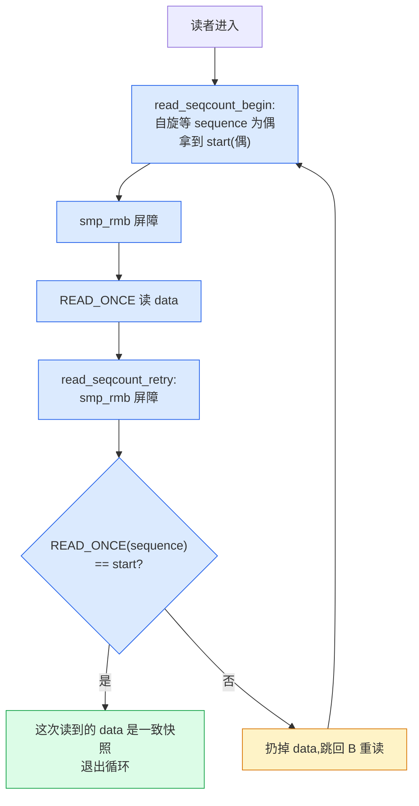
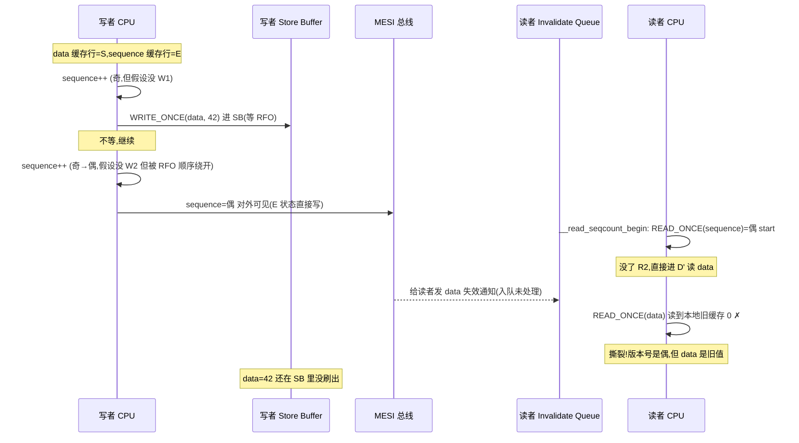
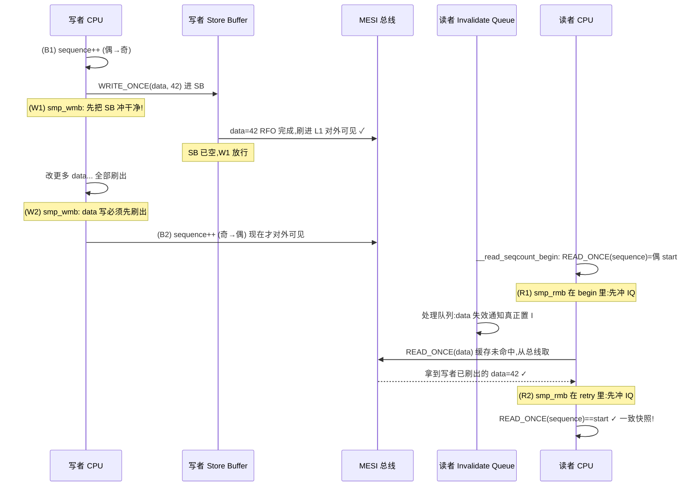
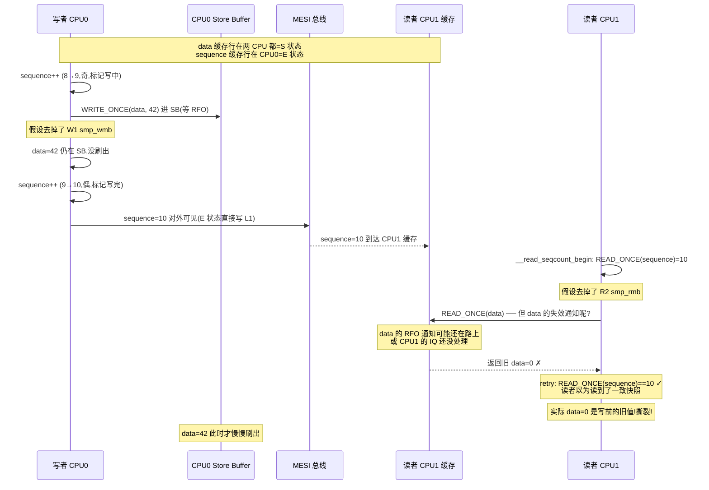

# 第六章 · 顺序锁 seqlock:读者不阻塞写者

> 篇:P2 自旋锁类(不阻塞一极)
> 主线呼应:上一章(P2-05)你看到了 spinlock/qspinlock 怎么用 MCS 队列把"等不到锁就自旋"做到极致——一把锁,任何时刻只一个 CPU 能进临界区,**读者和写者、读者和读者都互斥**。可现实里有一类场景让 spinlock(也包括后面第 11 章的 rwsem 读者)非常难受:**读极多、写极少,但写者绝对不能等读者**。最典型的就是时钟——`jiffies`、`ktime`、`xtime` 几乎每个热点路径都在读,而时钟中断每个 tick 才更新一次。用 spinlock 保护,读者要自旋等写者、写者要自旋等读者;用 rwsem,读者要原子加 count、64 核读者仍 cache line 乒乓。**这一章的 seqlock 给出第三条路:读者根本不取锁,只读一个版本号;读完数据再查一次版本号,变了就扔掉重读。读者最多多读几遍,但永远不阻塞写者,写者也永远不等读者。** 妙在它的 sound 性不是玄学——奇偶版本号 + `smp_wmb`/`smp_rmb` 配对(正是 P1-03 那套)保证读者要么读到写前的完整快照、要么读到写后的完整快照,绝不读到写一半的撕裂。这一章就把这套机制拆透。

## 核心问题

**读多写少但写者不能被读者拖住的场景(如 `jiffies`、`ktime`、`xtime`),怎么做到"读者不阻塞写者、写者不等读者",同时保证读者读到的是某个一致的快照、而不是写者改了一半的撕裂?seqlock 的版本号为什么用奇偶(写中为奇、写完为偶)?读者用 `READ_ONCE` + 重读循环凭什么等价于"拿到一致快照"?写者前后的 `smp_wmb` 和读者两次读版本号之间的 `smp_rmb` 配对(回扣 P1-03),少一个会在哪条执行序下读到半新半旧?`seqcount_t`(纯版本号,写者自己想办法互斥)和 `seqlock_t`(版本号 + 内嵌 spinlock)为什么要分两种?**

读完本章你会明白:

1. **seqlock 的契约**:读者用 `read_seqcount_begin` 拿开始版本号 → `READ_ONCE` 读数据 → `read_seqcount_retry` 检查版本号变了没,变了就扔掉重读。读者**不取任何锁**、不原子、不缓存行乒乓;写者用 `write_seqlock` 在写前后各翻转一次版本号。读者最多多读几遍,但**永远不阻塞写者,写者也永远不等读者**。
2. **奇偶版本号为什么 sound**:写者进入临界区前 `sequence++`(偶→奇,表示"写中"),退出时再 `sequence++`(奇→偶,表示"写完")。读者若开头读到奇数,说明写者正在写——`__read_seqcount_begin` 自旋等它变偶;若开头读到偶数 `s0`、读完数据 retry 时还是 `s0`,说明期间没有写者完成过一次完整的写——数据未被改,读到的是一致快照。
3. **`smp_wmb`/`smp_rmb` 配对(回扣 P1-03)为什么 sound**:写者 `sequence++` 后 `smp_wmb()` 再改数据(`do_raw_write_seqcount_begin`),数据改完 `smp_wmb()` 再 `sequence++`(`do_raw_write_seqcount_end`);读者 `read_seqcount_begin` 里读完开始版本号后 `smp_rmb()` 再读数据(`raw_read_seqcount_begin`),`read_seqcount_retry` 里先 `smp_rmb()` 再重读版本号(`do_read_seqcount_retry`)。这套配对逼 Store Buffer 先刷、Invalidate Queue 先处理,保证"读者看到偶版本号时,data 一定不是写者改了一半的"。
4. **`seqcount_t` vs `seqlock_t`**:纯 `seqcount_t` 只是一个 `unsigned sequence`,**不带任何写者互斥**——只适合"写者天然单 CPU、天然不重入"的场景(如时钟,只在硬中断里写)。`seqlock_t` = `seqcount_spinlock_t` + `spinlock_t`,写者 `write_seqlock` 自动拿内嵌 spinlock 互斥 + 自动禁抢占,适合普通"多写者可能并发"的场景。
5. **PREEMPT_RT 下的注意事项**:`seqcount_LOCKNAME_t` 在关联的锁可抢占时(mutex / PREEMPT_RT 下的 spinlock),`write_seqcount_begin` 会**主动 `preempt_disable`**——防止写者写到一半(版本号为奇)被抢占,读者重读循环干等。

> **逃生阀**:这一章会出现"奇偶版本号""重读循环""`smp_wmb`/`smp_rmb` 配对""PREEMPT_RT"这些词。如果你之前只把 `read_seqbegin`/`read_seqretry` 当成"反正套个 do-while 就安全"的模板代码,不要慌。本章只立一个核心直觉:**读者像边抄黑板边看老师有没有在擦——老师擦的时候(版本号为奇)就别抄,等老师写完(版本号为偶)再开始抄,抄完再看一眼版本号没变,这次的抄本就是一致的**。抓住这个,所有屏障配对、奇偶翻转的"为什么 sound"都有落点了。本章大量回扣 P1-03 的 Store Buffer / Invalidate Queue,迷路时回那一章。

---

## 6.1 一句话点破

> **读多写少且写者不能等读者的场景,seqlock 给出第三条路:读者根本不取锁,只读一个 `unsigned sequence` 版本号;写者进入临界区时把版本号从偶翻成奇(写中)、退出时再从奇翻成偶(写完)。读者读开头版本号 → 读数据 → 重读版本号,两次版本号相同且为偶,就一定读到了某个一致的快照。读者不阻塞写者、写者不等读者——读者最多多读几遍。它的 sound 不是玄学:奇偶版本号保证"版本号不变 ⇨ 期间无写者完成 ⇨ 数据未被改",写者前后的 `smp_wmb` 和读者两次读版本号之间的 `smp_rmb` 配对(正是 P1-03 那套)逼 Store Buffer 先刷、Invalidate Queue 先处理,保证读者看到的版本号和它读到的数据不会错位。这是"读者零开销"的雏形,也是 RCU 读者零开销(第 13 章)的思想源头。**

这是结论,不是理由。本章倒过来拆:先看朴素方案(rwsem)为什么会撞墙(6.2),再看 seqlock 的奇偶版本号机制(6.3),然后拆 `read_seqcount_begin`/`retry` 的重读循环为什么 sound(6.4),再拆写者两端的 `smp_wmb` 和它跟读者 `smp_rmb` 的配对(6.5),接着区分 `seqcount_t` 和 `seqlock_t` 两种用法(6.6),最后是 PREEMPT_RT 的抢占陷阱(6.7)、技巧精解(6.8)、★ 对照(6.9)、章末小结。

---

## 6.2 朴素方案为什么撞墙:rwsem 读者要等写者

先立动机。假设你在写时钟子系统,用一个全局 `struct timekeeper tk` 存当前时间,几乎每个热点路径(调度器、定时器、网络协议栈、ftrace)都在读它,而时钟中断每个 tick(默认 1ms 或 4ms)才更新它一次。**这是个极端的"读多写少",且写者(时钟中断处理)不能等读者——时钟中断有严格的时间预算,卡在等读者上会丢节拍。**

朴素的两个方案,都不行:

**方案一:spinlock 保护**。读者 `spin_lock(&tk_lock)`,写者也 `spin_lock(&tk_lock)`。问题:64 核机器上,成百上千个 CPU 在读 `tk`,每个读者都要 `cmpxchg` 抢同一把锁、抢不到就自旋;更糟的是写者(时钟中断)要等所有读者放锁才能进——**时钟中断被一群读者拖死**。这违反了"写者不能等读者"的硬约束。

**方案二:rwsem(读写信号量,第 11 章 P4-11)**。读者 `down_read`,写者 `down_write`。读者之间不互斥了,比 spinlock 好。但 rwsem 的读者 fast path 仍要做一次 `atomic_long_try_cmpxchg_acquire(&sem->count, ...)`——**64 核读者同时改同一个 `count`,缓存行在 64 个 CPU 之间乒乓,每个读者 fast path 都要付 cache miss 的代价**。而且 rwsem 写者慢路径要等所有读者退出临界区(它要 `atomic_long_sub` 让 count 变负,然后睡在 wait queue 上等最后一个读者 `up_read` 唤醒)。**时钟中断不能睡、不能等——rwsem 也不行。**

> **不这样会怎样**:朴素方案(rwsem)在时钟场景下有两个硬伤——(1)读者 fast path 仍要原子改一个共享 count,64 核读者 cache line 乒乓;(2)写者要等所有读者退出,而时钟中断不能等。seqlock 的设计目标就是**同时消灭这两个开销**:读者 fast path 只读一个本地缓存里大概率就有的版本号(`READ_ONCE(s->sequence)`),不原子改任何东西;写者改完数据翻转版本号就完事,不等任何读者——**读者最多多读几遍,但永远不被读者或写者阻塞**。

这就立起了 seqlock 的设计目标:**读者 fast path 零原子操作、零缓存行乒乓,写者不等读者**。代价是读者可能重读几次。读极多写极少时,这个代价微不足道。

---

## 6.3 奇偶版本号:写者怎么用最低位标记"写中"

seqlock 的核心数据结构,在 [`include/linux/seqlock_types.h`](../linux/include/linux/seqlock_types.h#L33-L38):

```c
typedef struct seqcount {
    unsigned sequence;
#ifdef CONFIG_DEBUG_LOCK_ALLOC
    struct lockdep_map dep_map;
#endif
} seqcount_t;
```

就一个 `unsigned sequence`——这就是全部的"锁"。没看错,**读者从头到尾不取它,只读它**。seqlock 的全部魔法,就在这个 `sequence` 的**最低位奇偶**上:

```
   sequence 的演化(一次写临界区):
   ┌──────────────────────────────────────────────────────────────┐
   │  ... 8 (偶,空闲)                                            │
   │     ↓ write_seqcount_begin: sequence++                       │
   │  ... 9 (奇,写中!读者若看到奇就自旋等或重读)                  │
   │     ↓ [写者改数据 data...]                                   │
   │     ↓ write_seqcount_end: sequence++                         │
   │  ... 10(偶,写完。读者若开始时读到 10、retry 时还是 10,一致) │
   └──────────────────────────────────────────────────────────────┘
```

**奇偶的语义**:

- **偶(even)**:没有写者在临界区(或者写者刚好完成了一次翻转)。读者可以放心开始读。
- **奇(odd)**:有写者正在临界区里改数据。读者若此刻开始读,可能读到撕裂——所以读者要**等它变偶**再开始。

为什么用"最低位奇偶"而不是单独一个 `bool writing` 标志?**因为 `sequence` 还要承载"是否变化过"的信息**——读者不仅要判断"现在有没有写者",还要判断"我读数据的期间,版本号有没有变"。把"写中"编进最低位、把"第几次写"编进高位,读者只需读一次 `sequence`、做一次比较,就同时拿到这两个信息。**这是一个用原子字的位编码消灭额外标志的经典内核技巧**(回扣 P0-01 的 `mutex` owner 低位编码、`rwsem` owner 低位编码——同源思想)。

写者两端的实现,在 [`include/linux/seqlock.h`](../linux/include/linux/seqlock.h#L420-L425):

```c
static inline void do_raw_write_seqcount_begin(seqcount_t *s)
{
    kcsan_nestable_atomic_begin();
    s->sequence++;          /* 偶→奇:标记"写中" */
    smp_wmb();              /* ← 关键屏障,6.5 拆 */
}
```

[`seqlock.h#L441-L446`](../linux/include/linux/seqlock.h#L441-L446):

```c
static inline void do_raw_write_seqcount_end(seqcount_t *s)
{
    smp_wmb();              /* ← 关键屏障,6.5 拆 */
    s->sequence++;          /* 奇→偶:标记"写完" */
    kcsan_nestable_atomic_end();
}
```

注意两次 `sequence++` 和两次 `smp_wmb()` 的**位置**:`begin` 是先 `++` 后 `wmb`,`end` 是先 `wmb` 后 `++`。这个顺序不是随手写的,它和读者的 `smp_rmb` 配对,是 seqlock sound 的命脉——6.5 会专门拆。这里先记住一件事:**写者改 data,被夹在"version 变奇"和"version 变偶"两次翻转之间**,中间那两次 `smp_wmb` 把 data 的写"夹紧"在版本号翻转之内。

> **钉死这件事**:seqlock 的版本号用最低位奇偶标记"写者是否在临界区",高位计数"第几次写"。读者只需读一次 `sequence` 就能同时拿到"现在能不能开始读(奇偶)"和"我读完后版本号变没变(全值比较)"两个信息。**这是用原子字的位编码消灭额外标志、把多语义压进单字访问的技巧**——和 mutex/rwsem 的 owner 低位编码同源。

---

## 6.4 读者重读循环:`read_seqcount_begin` / `read_seqcount_retry`

读者怎么用这个版本号?标准用法是一个 do-while 重读循环。看真实用例——`ktime_get_real_ts64`(读当前时间),在 [`kernel/time/timekeeping.c`](../linux/kernel/time/timekeeping.c#L823-L829):

```c
do {
    seq = read_seqcount_begin(&tk_core.seq);

    ts->tv_sec = tk->xtime_sec;
    nsecs = timekeeping_get_ns(&tk->tkr_mono);

} while (read_seqcount_retry(&tk_core.seq, seq));
```

四步:(1) `read_seqcount_begin` 拿开始版本号 `seq`;(2) 读数据(`xtime_sec`、`nsecs`);(3) `read_seqcount_retry` 检查版本号变没变;(4) 变了就扔掉这次结果,跳回 (1) 重读。**整个循环里,读者没有取任何锁——`seq` 只是一个局部变量,版本号是只读访问。**

逐步拆。`read_seqcount_begin` 在 [`seqlock.h#L310-L314`](../linux/include/linux/seqlock.h#L310-L314):

```c
#define read_seqcount_begin(s)                      \
({                                                  \
    seqcount_lockdep_reader_access(seqprop_const_ptr(s)); \
    raw_read_seqcount_begin(s);                     \
})
```

它调用 `raw_read_seqcount_begin`(去掉 lockdep 钩子),在 [`seqlock.h#L296-L302`](../linux/include/linux/seqlock.h#L296-L302):

```c
#define raw_read_seqcount_begin(s)                  \
({                                                  \
    unsigned _seq = __read_seqcount_begin(s);       \
    smp_rmb();                                      /* ← 关键屏障,6.5 拆 */ \
    _seq;                                           \
})
```

它先调 `__read_seqcount_begin` 自旋等到版本号变偶,再做一次 `smp_rmb`。`__read_seqcount_begin` 在 [`seqlock.h#L279-L288`](../linux/include/linux/seqlock.h#L279-L288):

```c
#define __read_seqcount_begin(s)                    \
({                                                  \
    unsigned __seq;                                 \
                                                    \
    while ((__seq = seqprop_sequence(s)) & 1)       /* 最低位=1 说明写者在写 */ \
        cpu_relax();                                /* 自旋等 */ \
                                                    \
    kcsan_atomic_next(KCSAN_SEQLOCK_REGION_MAX);    \
    __seq;                                          \
})
```

这里 `seqprop_sequence(s)` 展开为 `READ_ONCE(s->sequence)`(对纯 `seqcount_t`,见 [`seqlock.h#L209-L212`](../linux/include/linux/seqlock.h#L209-L212))。**`READ_ONCE` 防编译器缓存到寄存器(回扣 P1-03 的 3.8)——每次循环都从内存读最新的 `sequence`**。如果 `sequence` 当前是奇数(写者在临界区),读者 `cpu_relax()` 自旋等它变偶。等到偶数了,把这个偶数值作为 `start` 返回。

retry 端,`read_seqcount_retry` 在 [`seqlock.h#L397-L404`](../linux/include/linux/seqlock.h#L397-L404):

```c
#define read_seqcount_retry(s, start)                       \
    do_read_seqcount_retry(seqprop_const_ptr(s), start)

static inline int do_read_seqcount_retry(const seqcount_t *s, unsigned start)
{
    smp_rmb();                                              /* ← 关键屏障,6.5 拆 */
    return do___read_seqcount_retry(s, start);
}
```

最终比较在 [`seqlock.h#L380-L384`](../linux/include/linux/seqlock.h#L380-L384):

```c
static inline int do___read_seqcount_retry(const seqcount_t *s, unsigned start)
{
    kcsan_atomic_next(0);
    return unlikely(READ_ONCE(s->sequence) != start);   /* 变了就返回真(重读) */
}
```

只比较相等,不比较奇偶——为什么?因为读者开头已经被 `__read_seqcount_begin` 强制成偶数了(`start` 一定是偶数)。**只要 `READ_ONCE(s->sequence) != start`,就说明期间版本号变过——要么写者完成了一次写(`sequence` 从 `start` 变成 `start+2`),要么此刻又有写者进入(`sequence` 变成 `start+1` 即奇数)。任何一种情况,读者读到的 data 都可能不一致,必须扔掉重读。**



> **为什么 sound**(先给直觉,6.5 再严格拆):读者开头读到偶 `start`,说明"此刻没有写者在临界区"。读者读完 data 后 retry,如果 `sequence` 还是 `start`,说明**整个读期间没有任何写者进入过临界区**(否则 `sequence` 至少会变成 `start+1`)——所以读到的 data 是写者上次写完之后的完整快照,一致。如果 `sequence` 变了,说明有写者来过——可能正好在读者读 data 的中间改了——读者扔掉重读,直到某一次读期间没有写者打扰。

注意 retry 只检查"是否相等",**不重试"奇偶"判断**——因为读者进入循环时已经过了 `__read_seqcount_begin` 的奇偶过滤,`start` 必为偶;retry 时只要 `sequence` 是任何不等于 `start` 的值(无论奇偶),都意味着写者动过,读者都该重读。这是一种"宁可多读也不读到撕裂"的保守策略。

---

## 6.5 为什么重读能保证一致快照:写者 `smp_wmb` + 读者 `smp_rmb` 配对

6.4 给的"为什么 sound"是直觉。严格地讲,光有奇偶版本号还不够——**还得有 `smp_wmb`/`smp_rmb` 配对,否则会在某条执行序下读到"版本号没变但 data 半新半旧"**。这一节是本章的命脉,也是 P1-03 的正用——把那章讲的 Store Buffer / Invalidate Queue / 配对屏障,套到 seqlock 上。

先把写者和读者的屏障配对关系画出来(`do_raw_write_seqcount_begin` @ [`seqlock.h#L420-L425`](../linux/include/linux/seqlock.h#L420-L425)、`do_raw_write_seqcount_end` @ [`seqlock.h#L441-L446`](../linux/include/linux/seqlock.h#L441-L446)、`raw_read_seqcount_begin` @ [`seqlock.h#L296-L302`](../linux/include/linux/seqlock.h#L296-L302)、`do_read_seqcount_retry` @ [`seqlock.h#L400-L404`](../linux/include/linux/seqlock.h#L400-L404)):

```
   写者 CPU                              读者 CPU
   ─────────                             ─────────
   (B1) sequence++        (偶→奇)
   (W1) smp_wmb           ──────┐
                              │ 配对
   (D)  WRITE_ONCE(data, ...)  │
                              │
   (W2) smp_wmb           ──────┘
                                (R1) smp_rmb     ← raw_read_seqcount_begin 里
   (B2) sequence++        (奇→偶)
                                (D') READ_ONCE(data)
                                
                                (R2) smp_rmb     ← do_read_seqcount_retry 里
                                (E)  READ_ONCE(sequence) 比较
```

四道屏障两两配对:**(W1) 和 (R2) 配对**,**(W2) 和 (R1) 配对**。下面分别拆。

### (W1) + (R2) 配对:保证"读者看到偶版本号 ⇒ 没读到写者改了一半的 data"

这是最关键的一对,直接对应"为什么不会读到撕裂"。先看反例——少这两道屏障会怎样。

**反例时序(去掉 W1 和 R2)**:



少了 (W1) `smp_wmb`,写者的 `data=42` 还压在 Store Buffer 里没刷出去,`sequence` 却已经先变偶对外可见了;少了 (R2) `smp_rmb`,读者的 Invalidate Queue 里堆着"data 失效"通知没处理,继续读本地缓存的旧 0。**结果:读者看到偶版本号(以为没写者),读到的 data 却是写者改之前的旧值,撕裂数据**。

这正是 P1-03 第 3.9 节那个"消息传递"反例的 seqlock 化身——`sequence` 是"ready 标志",`data` 是"消息内容",少配对屏障就会"看到 ready 但读到旧 data"。

**正解:加 (W1) + (R2) 配对为什么 sound**:



关键论证:**(B2) `sequence` 变偶能对外可见,说明写者已经过了 (W2) `smp_wmb`——W2 是 Store Buffer 的闸门,过它意味着所有 data 的写都已刷进 L1 对外可见**。读者看到 `sequence` 为偶,就推出"data 的写已经全部刷出"。读者接下来 (R1) `smp_rmb` 把自己的 Invalidate Queue 冲干净,确保读 data 时不是读陈旧缓存;(R2) `smp_rmb` 在 retry 前再冲一次 IQ,确保重读 `sequence` 时看到的是最新值。**两道写屏障(W1、W2)夹紧 data 的写在版本号翻转之间,两道读屏障(R1、R2)确保读者读版本号和读 data 之间不被 IQ 拖累——这就是 seqlock sound 的全部秘密**。

> **钉死这件事**(seqlock 为什么 sound 的核心):**写者的两次 `sequence++` 各跟一道 `smp_wmb`,把 data 的修改夹紧在版本号翻转之内**——这保证"版本号变偶对外可见 ⇒ data 已全部对外可见"。**读者的 begin 和 retry 各一道 `smp_rmb`**——保证读版本号和读 data 不被 Invalidate Queue 拖累。四道屏障两两配对(W1↔R2、W2↔R1),所有执行序下都保证"读者看到偶版本号且 retry 不变 ⇒ 读到的 data 是一致快照"。**这是 P1-03 那套配对屏障的正用,seqlock 只是把消息传递模式套到了"版本号 + data"上**。

### (W2) + (R1) 配对:保证"读者在 begin 后读到的 data 不早于 begin 时版本号"

另一对屏障 (W2) `smp_wmb` 和 (R1) `smp_rmb` 配对,作用是保证读者在 `__read_seqcount_begin` 拿到 `start` 之后读到的 data,**不早于**这个 `start` 对应的写者快照。换句话说,防止读者读到"比 `start` 更老的 data"。

具体看反例:假设读者 begin 读到 `start = 10`(偶),然后读 data。如果没有 (R1) `smp_rmb`,读者的 Invalidate Queue 里可能还堆着版本号 `8→9→10` 那次写者改 data 时发出的失效通知,读者继续读本地缓存的旧 data(版本号 8 之前的值)。**读者看到版本号 10,读到的 data 却是版本号 8 之前的——撕裂**。加了 (R1) `smp_rmb`,读者在 begin 后先冲 IQ,确保 IQ 里的失效通知都处理完,读 data 时不会读到陈旧缓存。

(W2) `smp_wmb` 在写者侧配合——它保证 `sequence++`(变偶)之前,data 的写已经全部刷出。这样读者看到偶 `sequence` 并冲完 IQ 后,从总线取 data 拿到的就是最新值。

### 四道屏障的完整配对表

| 写者侧屏障 | 读者侧配对屏障 | 配对保证 |
|---|---|---|
| (W1) `smp_wmb` in `do_raw_write_seqcount_begin`(在 `sequence++` 之后) | (R2) `smp_rmb` in `do_read_seqcount_retry`(在重读 `sequence` 之前) | 读者 retry 时若看到偶版本号未变,data 的写已经全部对它可见(不会"看到偶但读旧 data") |
| (W2) `smp_wmb` in `do_raw_write_seqcount_end`(在 `sequence++` 之前) | (R1) `smp_rmb` in `raw_read_seqcount_begin`(在读 data 之前) | 读者 begin 拿到偶 `start` 后,读到的 data 不早于 `start` 对应的快照(不会"看到新版本号但读到更老 data") |

> **不这样会怎样**:少任一对屏障,都会在某条执行序下撕裂数据——要么"读者看到偶版本号但 data 是旧值",要么"读者看到新版本号但 data 是更老的值"。**这正是 P1-03 反复强调的"配对屏障必须成对出现"——丢了配对就丢了 sound**。内核源码里 [`seqlock.h#L519-L558`](../linux/include/linux/seqlock.h#L519-L558) 那段 `raw_write_seqcount_barrier` 的长注释也专门提醒:seqlock 周围的写都该用 `WRITE_ONCE` 标记,因为它们既不在 seqcount 的写临界区"内"(barrier 模式),又必须对读者可见——这是 P1-03 讲的"`WRITE_ONCE` 是写无锁代码的第一道卫生"的又一次现身。

---

## 6.6 `seqcount_t` vs `seqlock_t`:两种用法

到目前为止我们讲的"读者不取锁"都是 `seqcount_t` 的视角——它**只是一个 `unsigned sequence`,不带任何写者互斥**。这意味着写者必须**自己想办法互斥**(否则两个写者同时 `sequence++` 会乱)。内核提供两种典型用法:

### 用法一:`seqcount_t`(纯版本号,写者天然单 CPU)

最纯粹的用法。`seqcount_t` 只有版本号,**写者互斥靠"写者天然只在某个 CPU 上跑、天然不重入"**。典型例子就是时钟:时钟更新只在硬中断或特定的 timekeeping 核心里发生,天然单线程。

但这里有个**陷阱**——`seqcount_t` 的写临界区要求**禁抢占**(下面 6.7 拆为什么),纯 `seqcount_t` 自己不帮你禁。所以内核又提供了一系列带"关联锁"的变体,在 [`seqlock_types.h#L62-L72`](../linux/include/linux/seqlock_types.h#L62-L72):

```c
#define SEQCOUNT_LOCKNAME(lockname, locktype, preemptible, lockbase)    \
typedef struct seqcount_##lockname {                                    \
    seqcount_t      seqcount;                                           \
    __SEQ_LOCK(locktype *lock);                                         \
} seqcount_##lockname##_t;

SEQCOUNT_LOCKNAME(raw_spinlock, raw_spinlock_t,  false,    raw_spin)
SEQCOUNT_LOCKNAME(spinlock,     spinlock_t,      __SEQ_RT, spin)
SEQCOUNT_LOCKNAME(rwlock,       rwlock_t,        __SEQ_RT, read)
SEQCOUNT_LOCKNAME(mutex,        struct mutex,    true,     mutex)
```

也就是说有 `seqcount_raw_spinlock_t` / `seqcount_spinlock_t` / `seqcount_rwlock_t` / `seqcount_mutex_t` 四种"带关联锁"的 seqcount。**关联锁的作用**:一方面给 lockdep 提供写者互斥的验证信息,另一方面在 PREEMPT_RT 下(关联锁可抢占时)自动帮写者禁抢占(见 6.7)。timekeeping 用的就是 `seqcount_raw_spinlock_t`——见 [`kernel/time/timekeeping.c#L51`](../linux/kernel/time/timekeeping.c#L51)。

`seqprop_sequence`/`seqprop_preemptible`/`seqprop_assert` 这组泛型访问器(在 [`seqlock.h#L249-L263`](../linux/include/linux/seqlock.h#L249-L263))用 C11 `_Generic` 按类型分派到对应的 `__seqprop_*` 实现——这是 6.9 用泛型把"五种 seqcount 变体 + 关联锁差异"压进统一 API 的写法。

### 用法二:`seqlock_t`(seqcount + 内嵌 spinlock,写者用锁互斥)

更上层的封装,在 [`seqlock_types.h#L84-L91`](../linux/include/linux/seqlock_types.h#L84-L91):

```c
typedef struct {
    /*
     * Make sure that readers don't starve writers on PREEMPT_RT: use
     * seqcount_spinlock_t instead of seqcount_t. Check __SEQ_LOCK().
     */
    seqcount_spinlock_t seqcount;
    spinlock_t lock;
} seqlock_t;
```

`seqlock_t` = `seqcount_spinlock_t` + `spinlock_t`。**写者用内嵌的 spinlock 互斥**——`write_seqlock` 先 `spin_lock(&sl->lock)`,自动把别的写者挡在外面。读者还是 `read_seqbegin`/`read_seqretry`,根本不碰 `sl->lock`。看 [`seqlock.h#L820-L824`](../linux/include/linux/seqlock.h#L820-L824):

```c
static inline void write_seqlock(seqlock_t *sl)
{
    spin_lock(&sl->lock);                               /* 写者互斥 */
    do_write_seqcount_begin(&sl->seqcount.seqcount);    /* 翻版本号 + wmb */
}
```

`write_sequnlock` 在 [`seqlock.h#L833-L837`](../linux/include/linux/seqlock.h#L833-L837):

```c
static inline void write_sequnlock(seqlock_t *sl)
{
    do_write_seqcount_end(&sl->seqcount.seqcount);      /* wmb + 翻版本号 */
    spin_unlock(&sl->lock);                             /* 释放写者互斥 */
}
```

读者端,`read_seqbegin` 在 [`seqlock.h#L770-L777`](../linux/include/linux/seqlock.h#L770-L777):

```c
static inline unsigned read_seqbegin(const seqlock_t *sl)
{
    unsigned ret = read_seqcount_begin(&sl->seqcount);  /* 直接读版本号,不碰 lock */
    kcsan_atomic_next(0);
    kcsan_flat_atomic_begin();
    return ret;
}
```

`read_seqretry` 在 [`seqlock.h#L790-L799`](../linux/include/linux/seqlock.h#L790-L799):

```c
static inline unsigned read_seqretry(const seqlock_t *sl, unsigned start)
{
    kcsan_flat_atomic_end();
    return read_seqcount_retry(&sl->seqcount, start);   /* 只查版本号,不碰 lock */
}
```

**读者从头到尾不碰 `sl->lock`**——这是 seqlock 读者不阻塞写者的关键。写者之间用 `sl->lock` 互斥(这是 spinlock,第 5 章 P2-05 讲过),但写者从不等读者。

### 两种用法的对比

| 维度 | `seqcount_t`(纯) | `seqcount_LOCKNAME_t`(带关联锁) | `seqlock_t`(seqcount_spinlock + 内嵌 spinlock) |
|---|---|---|---|
| 版本号 | ✓ | ✓(内嵌) | ✓(内嵌) |
| 写者互斥 | **自己想办法** | 关联锁(给 lockdep 验证 + PREEMPT_RT 禁抢占) | **内嵌 spinlock 自动互斥** |
| 读者是否取锁 | ✗ | ✗ | ✗ |
| 典型场景 | 写者天然单 CPU 且自己禁抢占(少见) | timekeeping(用 raw_spinlock)、有特定关联锁语义 | 一般"多写者可能并发"的场景 |
| PREEMPT_RT 安全 | 需手动禁抢占 | 自动禁抢占(关联锁可抢占时) | 自动禁抢占(seqcount_spinlock_t) |

> **所以这样设计**:三种用法的分野,本质是**把"版本号机制"(永远免费)和"写者互斥"(代价不同)解耦**。读者永远免费,写者按需付代价——能用"天然单 CPU"消灭互斥代价(时钟)就用 `seqcount_t`,需要 lockdep 验证就用带关联锁的变体,普通场景就用 `seqlock_t` 一站式。**这是 fast/slow path 分层思想(回扣 P0-01)在 seqlock 上的延伸:读者永远走 fast path,写者根据场景选合适的 slow path**。

---

## 6.7 PREEMPT_RT 的陷阱:写者禁抢占防重入

`seqcount_LOCKNAME_t` 的注释(在 [`seqlock_types.h#L40-L55`](../linux/include/linux/seqlock_types.h#L40-L55))点破了一个 PREEMPT_RT 下的关键陷阱:

> For PREEMPT_RT, seqcount_LOCKNAME_t write side critical sections cannot disable preemption. ... To remain preemptible while avoiding a possible livelock caused by the reader preempting the writer, use a different technique: let the reader detect if a seqcount_LOCKNAME_t writer is in progress. If that is the case, acquire then release the associated LOCKNAME writer serialization lock. This will allow any possibly-preempted writer to make progress...

什么意思?要理解这个陷阱,先看**写者为什么必须禁抢占**(或禁中断)。考虑纯 `seqcount_t` 场景:

```
   写者 CPU0:
     sequence++       (偶→奇,version=9,写中)
     [改 data...]
     ─── 被抢占! ───
     [调度到别的任务跑,version 一直是 9]
     ─── 之后某时刻 ───
     sequence++       (奇→偶,version=10)
```

如果写者在 `sequence++`(变奇)之后、`sequence++`(变偶)之前**被抢占**,version 会一直是奇数。这时如果**同一 CPU 上调度回来的任务是个 seqlock 读者**,它会卡在 `__read_seqcount_begin` 的 `while (seq & 1) cpu_relax();` 自旋——**而它自旋等的写者,正是被它自己(或同 CPU 的别的任务)抢占的那个写者**。**死锁**:读者等写者完成,写者等读者让出 CPU,谁也跑不动。

这就是为什么 [`seqlock.h#L477-L482`](../linux/include/linux/seqlock.h#L477-L482) 的注释明确说:

> Context: sequence counter write side sections must be serialized and non-preemptible. Preemption will be automatically disabled if and only if the seqcount write serialization lock is associated, and preemptible.

实现上,`write_seqcount_begin` 宏(在 [`seqlock.h#L483-L491`](../linux/include/linux/seqlock.h#L483-L491))会检查关联锁是否"可抢占",可抢占就主动 `preempt_disable`:

```c
#define write_seqcount_begin(s)                         \
do {                                                    \
    seqprop_assert(s);                                 \
    if (seqprop_preemptible(s))                         \
        preempt_disable();                              /* ← 写者禁抢占 */ \
    do_write_seqcount_begin(seqprop_ptr(s));            \
} while (0)
```

对纯 `seqcount_t`,`__seqprop_preemptible` 永远返回 `false`([`seqlock.h#L214-L217`](../linux/include/linux/seqlock.h#L214-L217)),意思是"我假设调用者已经自己禁了抢占"——内核用 `__seqprop_assert` 调 `lockdep_assert_preemption_disabled()`([`seqlock.h#L219-L222`](../linux/include/linux/seqlock.h#L219-L222))在 lockdep 开时验证这一点。对 `seqcount_mutex_t`(关联锁是 mutex,可睡眠可抢占),`preemptible` 是 `true`,所以 `write_seqcount_begin` 会主动禁抢占。

PREEMPT_RT 下还有更妙的处理:读者在 `__seqprop_*_sequence`(在 [`seqlock.h#L157-L177`](../linux/include/linux/seqlock.h#L157-L177))里如果读到奇数版本号(说明有写者在临界区),会**主动 acquire + release 关联锁**——这等价于"帮被抢占的写者让路",让它跑到临界区末尾翻版本号。注释在 [`seqlock.h#L165-L174`](../linux/include/linux/seqlock.h#L165-L174):

```c
if (preemptible && unlikely(seq & 1)) {
    __SEQ_LOCK(lockbase##_lock(s->lock));      /* 帮写者让路 */
    __SEQ_LOCK(lockbase##_unlock(s->lock));
    /* Re-read the sequence counter since the (possibly
     * preempted) writer made progress. */
    seq = READ_ONCE(s->seqcount.sequence);
}
```

这是 PREEMPT_RT 用"读者让路"换"写者可抢占"的精巧设计——读者发现写者在写,就主动去拿一下关联锁(会让被抢占的写者有机会跑完),然后再读版本号。**避免了"读者等被抢占的写者,写者等读者让 CPU"的死锁**。

> **不这样会怎样**:如果写者在版本号为奇时被抢占,且没有 PREEMPT_RT 的"读者让路"机制,同 CPU 上的读者会死锁(自旋等一个永远跑不完的写者)。这是 PREEMPT_RT 把内核从"非抢占"改成"几乎完全抢占"时,所有"假设写者不会被中断/抢占"的旧代码都要修的根——seqcount 是典型受害者。**这也回扣了下一章 P2-07 要讲的"持 spinlock 时不能睡眠/被抢"——seqcount 写临界区虽然不是 spinlock,但有同款"禁抢占"要求**。

---

## 6.8 技巧精解:奇偶版本号 + READ_ONCE 重读为什么 sound

这一章的"技巧精解"挑 seqlock 最硬核的一对——奇偶版本号机制和读者重读循环——配真实源码和反例时序,拆透。

### 朴素方案的墙:用单一 bool 标志位

假设朴素地用一个 `bool writing` 标志 + 一个 `unsigned version` 计数器来代替奇偶版本号:

```c
/* 朴素方案(不存在,示意) */
bool writing;
unsigned version;

void writer_begin(void) { writing = true; smp_wmb(); }
void writer_end(void)   { smp_wmb(); version++; writing = false; }
unsigned reader_begin(void) {
    while (READ_ONCE(writing)) cpu_relax();
    unsigned v = READ_ONCE(version);
    smp_rmb();
    return v;
}
bool reader_retry(unsigned v) {
    smp_rmb();
    return READ_ONCE(writing) || READ_ONCE(version) != v;
}
```

这看起来等价于奇偶版本号,但**多了两件事**:(1) 读者要读两个字(`writing` 和 `version`),两次内存访问;(2) 写者要改两个字。**两个字段意味着两次缓存行访问、两次 `READ_ONCE`、可能落在不同的缓存行上**。奇偶版本号把它们压进**一个原子字**——读者只需一次 `READ_ONCE(s->sequence)`,就能同时拿到"现在有没有写者"(奇偶)和"是第几次写"(全值)。**少一次内存访问,在 64 核热路径上是巨大的收益**——这正是 `ktime_get` 这种每个时钟中断、每次调度都要调的函数所需要的。

> **所以这样设计**:奇偶版本号把"写者是否在临界区"和"版本计数"压进**一个原子字**的最低位和高位,读者只读一次 `READ_ONCE` 就拿到两个信息。这是"用位编码消灭额外字段"的内核招牌技巧,和 mutex/rwsem 的 owner 低位编码同源(回扣 P0-01 的 1.7、第 11 章的 rwsem owner)。

### 反例时序:少 (W1)+(R2) 配对会读到撕裂

这是 6.5 拆过的核心反例,这里再换个角度钉死。假设写者去掉 `do_raw_write_seqcount_begin` 里的 `smp_wmb`(W1),读者去掉 `do_read_seqcount_retry` 里的 `smp_rmb`(R2),看会撞上哪条执行序:



去掉 (W1) 和 (R2),这条执行序下读者看到偶版本号 10,retry 也是 10,但读到的 data 是 0(写前的旧值)。**`ktime_get` 在这种情况下会返回错误的时间——可能比真实时间慢几百纳秒,累积下来时钟漂移、定时器误触发**。这种 bug 在高负载 + 特定缓存行状态下偶发,极难复现。

### 正解:配对屏障为什么 sound

把 (W1) `smp_wmb` 和 (R2) `smp_rmb` 加回去,6.5 已详细论证。一句话总结:**(W1) 保证 sequence 变奇之前 data 的旧值已稳定;(W2) 保证 sequence 变偶之前 data 的新值已全部刷出;(R1) 保证读者读完 sequence 后 IQ 冲完再读 data;(R2) 保证读者重读 sequence 前 IQ 冲完**。四道屏障两两配对,任何执行序下读者要么读到写前的完整快照、要么读到写后的完整快照,绝不读到撕裂。

### 反面对比:rwsem 读者要等写者

回扣 6.2 的动机。同样的"读极多写极少"场景,用 rwsem 替代 seqlock 会怎样?

| 维度 | seqlock | rwsem |
|---|---|---|
| 读者 fast path | 一次 `READ_ONCE` 版本号 + 一次重读比较,**零原子操作** | `atomic_long_try_cmpxchg_acquire(&count, ...)`,**一次 cmpxchg** |
| 64 核读者同时读 | 各自读自己的本地缓存(版本号是只读访问),**零乒乓** | 同时改 `count`,缓存行在 64 个 CPU 间乒乓,**每个读者都付 cache miss** |
| 写者是否等读者 | **不等**(读者最多重读) | **等**(写者要等所有读者 `up_read`)
| 写者能否在硬中断里 | **能**(时钟中断就是这么干的) | **不能**(rwsem 写者会睡,硬中断不能睡) |
| 适用场景 | 读极多写极少、写者不能等读者、数据不含指针 | 读写都较多、临界区较长、写者可以睡 |

> **钉死这件事**:seqlock 不是 rwsem 的替代品,而是**互补**——seqlock 适合"读极多写极少且写者不能等读者、保护的是定长数据(不含指针)"的场景,rwsem 适合"读写都较多、临界区可长、保护的数据可能含指针"的场景。**seqcount_t 的注释明说:"This mechanism can't be used if the protected data contains pointers, as the writer can invalidate a pointer that a reader is following."**(见 [`seqlock_types.h#L20-L21`](../linux/include/linux/seqlock_types.h#L20-L21))——因为读者读到一半指针可能被写者改了,读者解引用一个失效指针就崩。RCU(第 13 章)才是"保护指针数据结构 + 读者零开销"的解。

---

## 6.9 ★ 对照:时钟是 seqlock 的舞台,per-CPU 是它的兄弟

seqlock 不是 Linux 内核独有的发明,锁与无锁的思想在系列多本里反复出现。这一章的 seqlock,有两个关键对照点:

**对照一:调度器的 `jiffies` / `xtime` / `ktime_get`**。这就是 seqlock 的"原生应用场景"。调度器在每次时钟中断里更新 `jiffies`,几乎每个调度决策、每个定时器超时检查、每个网络协议栈的超时重传都在读 `jiffies`。**这是一个典型的"读极多写极少且写者不能等读者"场景**——时钟中断处理有严格时间预算,不能卡在等读者上;而读者又遍布内核各个角落,用 spinlock/rwsem 都太贵。`ktime_get_real_ts64` / `ktime_get`(见 [`kernel/time/timekeeping.c#L823-L853`](../linux/kernel/time/timekeeping.c#L823-L853))就是标准的 seqcount 重读循环。**《Linux 调度器》那本(第 11 本)讲 jiffies、hrtimer 时会反复用到 seqlock——两本互引,本书讲 seqlock 实现,调度器那本讲 seqlock 在时钟子系统的应用**。

**对照二:内存分配器的 per-CPU 计数器**。tcmalloc/jemalloc(《内存分配器》第 8 本)用 per-CPU `thread_local` cache 消灭小对象分配的锁竞争——**和 seqlock 是同一思想的不同化身**:seqlock 是"读者不取锁,靠重读换一致性",per-CPU 是"给每个 CPU 一份本地数据,根本不竞争"。两者都是"把竞争消灭在结构里"(回扣 P0-01 的 1.6 表)。seqlock 适合"读多写少"、per-CPU 适合"每个 CPU 都要改"——选哪个看访问模式。

**对照三:Tokio 的乐观读思路**。《Tokio》那本讲 `AtomicWaker` / 无锁队列时,反复出现"先乐观地试,失败再重试"的套路——**和 seqlock 的"乐观读 + 重读"是同源思想**。Tokio 的无锁 `mpsc` 队列也是"生产者 cmpxchg 试,失败重试",本质都是"悲观路径很贵,乐观路径很便宜,绝大多数情况乐观命中"。seqlock 把这个思想用在了"读者乐观地读,发现写者打扰就重读"上。

> **★ 对照一句话**:seqlock 的"读者重读不阻塞写者",是"乐观路径 + 失败重试"思想在内核同步原语上的化身——时钟子系统的 `jiffies`/`ktime` 是它的原生舞台(对照调度器那本),per-CPU 数据是它"消灭竞争"思想的兄弟(对照分配器那本),Tokio 的乐观 cmpxchg 是它在用户态的远亲。

---

## 章末小结

这一章是**自旋/无锁一极**的继续。回到主线二分法:seqlock 读者**不取锁、不原子、不缓存行乒乓**——它走到了"读者不阻塞"的极致,代价是读者可能重读几次、且只能保护定长数据(不含指针)。这和第 5 章 P2-05 的 spinlock(读者也互斥)、第 11 章 P4-11 的 rwsem(读者原子加 count、写者等读者)形成鲜明对比——**seqlock 在"读极多写极少且写者不能等读者"的场景里,是无可替代的解**。

这一章立起了五样东西:

1. **seqlock 的契约**:读者 `read_seqcount_begin` 拿开始版本号 → 读数据 → `read_seqcount_retry` 检查版本号变了没,变了就重读。读者不取任何锁,写者用版本号奇偶标记"写中"。
2. **奇偶版本号**:写者进入临界区 `sequence++`(偶→奇),退出再 `sequence++`(奇→偶)。读者开头读到奇就自旋等、读到偶才进;retry 时版本号变了就重读。**把"写者是否在写"和"第几次写"压进一个原子字**。
3. **配对屏障为什么 sound**:写者两次 `sequence++` 各跟一道 `smp_wmb`(W1、W2),读者 begin 和 retry 各一道 `smp_rmb`(R1、R2),W1↔R2、W2↔R1 两两配对(回扣 P1-03),保证读者看到的版本号和读到的 data 不错位。
4. **`seqcount_t` vs `seqlock_t`**:纯 `seqcount_t` 只版本号、写者自己互斥(适合天然单 CPU 的时钟);`seqlock_t` 内嵌 spinlock、写者用锁互斥(适合一般多写者场景)。中间还有 `seqcount_LOCKNAME_t`(带关联锁,给 lockdep + PREEMPT_RT 用)。
5. **PREEMPT_RT 抢占陷阱**:写者必须在版本号为奇时禁抢占(否则同 CPU 读者死锁);`seqcount_LOCKNAME_t` 在关联锁可抢占时自动禁抢占,PREEMPT_RT 还会让读者主动 acquire 关联锁"帮写者让路"。

### 五个"为什么"清单

1. **为什么 seqlock 读者不阻塞写者?** 读者从头到尾不取任何锁,只读 `sequence` 版本号(只读访问,不原子改任何共享变量)。写者也不等读者——它改完 data 翻版本号就完事。读者若发现版本号变了,扔掉重读,最多多读几遍。**代价是读者可能重读,收益是读者永远免费**。
2. **奇偶版本号为什么 sound(直觉)?** 写者进入翻奇(写中),退出翻偶(写完)。读者若开头读到奇,说明写者正在写,自旋等;读到偶 `start` 后读 data,读完 retry 若还是 `start`,说明期间没有写者完成过一次写——data 未被改,读到一致快照。若 retry 时 `sequence` 变了,说明有写者来过,扔掉重读。
3. **配对屏障(W1/W2/R1/R2)为什么是 seqlock sound 的命脉?** 光有奇偶版本号不够,还要四道屏障两两配对。写者的 (W1) `smp_wmb` 在 `sequence++` 变奇之后,逼 SB 先刷(让 data 旧值先稳定);(W2) `smp_wmb` 在 `sequence++` 变偶之前,逼 data 新值先全部刷出。读者的 (R1) `smp_rmb` 在 begin 拿到版本号之后,逼 IQ 先处理(读到正确 data);(R2) `smp_rmb` 在 retry 重读版本号之前,逼 IQ 先处理(重读看到最新版本号)。W1↔R2、W2↔R1 配对,所有执行序下都保证"读者看到偶版本号且 retry 不变 ⇒ 读到的 data 是一致快照"。少任一对都会撕裂(具体时序见 6.5、6.8)。
4. **`seqcount_t` 和 `seqlock_t` 为什么分两种?** `seqcount_t` 只有版本号,不带写者互斥——适合"写者天然单 CPU"(如时钟,只在硬中断里写)。`seqlock_t` = `seqcount_spinlock_t` + `spinlock_t`,写者 `write_seqlock` 自动拿内嵌 spinlock 互斥——适合"多写者可能并发"的一般场景。**两种用法的读者都免费,差别只在写者怎么互斥**。
5. **PREEMPT_RT 下 seqcount 写者为什么要禁抢占?** 写者在版本号为奇时若被抢占,version 会一直停在奇数。同 CPU 上调度回来的读者会卡在 `__read_seqcount_begin` 的 `while (seq & 1) cpu_relax();` 自旋——而死等的正是被它抢占的写者。**死锁**。所以 `write_seqcount_begin` 在关联锁可抢占时主动 `preempt_disable`;PREEMPT_RT 还会让读者在看到奇版本号时主动 acquire+release 关联锁,"帮被抢占的写者让路"。

### 想继续深入往哪钻

- **源码**:[`include/linux/seqlock.h`](../linux/include/linux/seqlock.h) 的 `__read_seqcount_begin`(L279,重读循环核心)、`raw_read_seqcount_begin`(L296,R1 屏障)、`read_seqcount_begin`(L310)、`do___read_seqcount_retry`(L380)、`do_read_seqcount_retry`(L400,R2 屏障)、`do_raw_write_seqcount_begin`(L420,W1 屏障)、`do_raw_write_seqcount_end`(L441,W2 屏障)、`raw_write_seqcount_barrier`(L519-L558,配对屏障注释块)、`raw_write_seqcount_latch`(L734,Latch 变体)、`read_seqbegin`(L770)、`read_seqretry`(L790)、`write_seqlock`(L820)、`write_sequnlock`(L833);[`include/linux/seqlock_types.h`](../linux/include/linux/seqlock_types.h) 的 `seqcount_t`(L33)、`SEQCOUNT_LOCKNAME` 宏(L62)、`seqlock_t`(L84);`seqprop_*` 泛型访问器(L199-L263)。
- **真实用例**:[`kernel/time/timekeeping.c`](../linux/kernel/time/timekeeping.c) 的 `ktime_get_real_ts64`(L823-L829,经典重读循环)、`ktime_get`(L845-L850)、`timekeeping_get_delta`(L253-L259)、`tk_core.seq`(L51,`seqcount_raw_spinlock_t`)、`raw_write_seqcount_latch`(L422、L428,时钟子系统的 Latch 变体——用两份数据 + 奇偶切换让 NMI 都能安全读);[`kernel/time/sched_clock.c`](../linux/kernel/time/sched_clock.c) 也用 seqcount 读 `clocksource`。
- **变体**:`seqcount_latch_t`(L601-L739)是 seqlock 的"双缓冲"变体——用两份 data + 奇偶切换,让读者即使在写者写一半时也能读到一致快照(典型用于 NMI 可打断写者的场景,如 `clocksource` 的 `clocksource_watchdog`)。本书不展开,但要知其存在。
- **观测**:用 KCSAN(`CONFIG_KCSAN=y`)能检测 seqlock 读者少屏障时的数据竞争;`/proc/lock_stat` 看 `tk_core.seq` 关联锁的竞争统计;` Documentation/locking/seqlock.rst`(在线 6.9)是内核权威 seqlock 文档。
- **延伸阅读**:Paul McKenney 的《Is Parallel Programming Hard》第 9 章("Sequence Locks")把 seqlock 的奇偶机制和屏障配对讲得最透(免费 PDF);`Documentation/memory-barriers.txt`(在线)里"Cache coherency vs seqlock"一节专门讲 seqlock 的屏障要求。

### 引出下一章

seqlock 讲完了,但留下一个关键的尾巴——**写者用 `write_seqlock` 拿内嵌 spinlock,而 spinlock 持锁期间绝不能被中断抢占**(否则中断处理里再拿同一把锁就死锁)。时钟中断本身就是一个硬中断——它要在中断里 `write_seqlock` 更新 `tk`,这就要求"硬中断上下文里拿的 spinlock 必须禁中断"。`write_seqlock_irqsave` / `spin_lock_irqsave` 就是干这个的。下一章 P2-07 我们就讲**中断禁用与 `spin_lock_irqsave`**:为什么持 spinlock 时不能被中断(中断处理里再拿同一把锁就死锁)、`_irqsave` / `_bh` / `_irq` 三个变体的差异、IRQ 上下文绝不能睡眠的铁律(回扣调度器那本的抢占点)。这是"自旋/无锁一极"的最后一章,讲完它我们就进入第 3 篇——阻塞锁(mutex/rtmutex/futex)。
