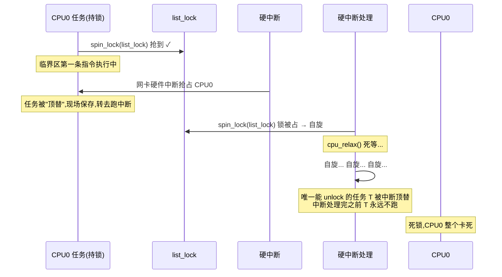
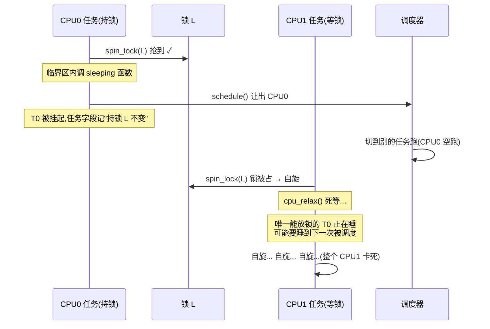
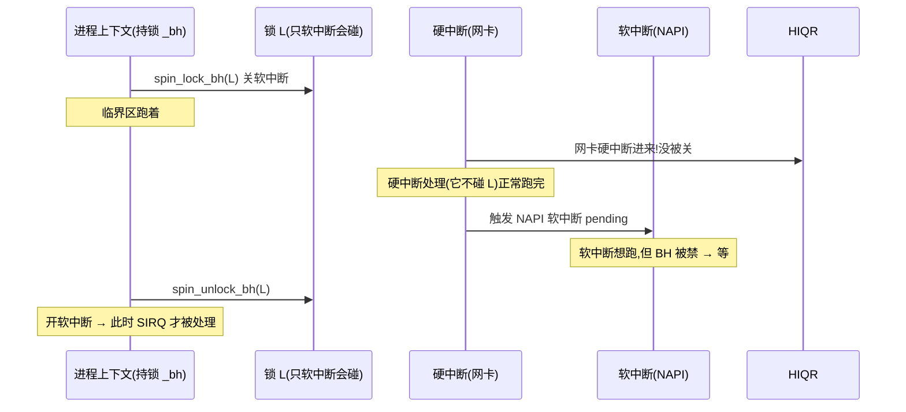

# 第七章 · 中断禁用与 `spin_lock_irqsave`

> 篇:P2 自旋锁类(收尾章)
> 主线呼应:第 5 章(`P2-05`)讲了 `spinlock` 怎么用 MCS 队列把"等锁"做到不烧缓存行,第 6 章(`P2-06`)讲了 `seqlock` 怎么让读者不阻塞写者。可这两章都藏了一个问题——**如果你拿的是普通 `spin_lock`,拿到锁的瞬间,本 CPU 被一个硬件中断打断,中断处理程序里再去拿同一把锁,会发生什么?** 答案是**单核上当场死锁**:CPU 0 的任务拿着锁 `L`,网卡中断进来,中断处理程序 `spin_lock(L)` —— 它会原地自旋,可唯一能放锁的那个任务**被中断抢走了、永远不会被调度回来放锁**。这个问题不是理论上的,内核里几乎每一处"被中断和进程上下文同时访问"的数据结构(`rq->lock`、网卡发送队列、定时器链表)都要解决它,解决方法就是本章的 `spin_lock_irqsave` / `spin_lock_bh`——**拿锁的同时,顺便把本 CPU 的硬中断(或软中断)关掉**。读完这一章,你就彻底理解了为什么 IRQ 上下文不能睡眠、为什么 `spin_lock` 内含禁抢占、为什么 `irqsave` 要"保存-恢复 flags"而不是无条件开关中断——以及这一整套机制为什么 sound。这一章也是第 2 篇自旋锁类的收尾,把"自旋/无锁一极"的三个变体(`spinlock` 互斥、`seqlock` 读者不阻塞写者、`irqsave` 中断安全)讲全。

## 核心问题

**为什么持 `spinlock` 时不能被中断?`spin_lock_irqsave` 的"保存-恢复 flags"为什么不是"无条件关中断"?为什么 IRQ/softirq 上下文绝对不能调用 `schedule()`?`spin_lock` 内部为什么隐含禁抢占?`spin_lock` / `spin_lock_irq` / `spin_lock_irqsave` / `spin_lock_bh` 这四个变体到底在什么场景下选哪一个?**

读完本章你会明白:

1. **死锁的两种姿势**:持 `spinlock` 被中断 → 中断处理里拿同锁,单核死锁;持 `spinlock` 睡眠 → 别的 CPU 死等一个永不醒的持锁者。这两条铁律是 IRQ 上下文不可睡眠的根。
2. **`irqsave` 的"保存-恢复"语义**:`local_irq_save(flags)` 把进入前的中断状态(开/关)存进 `flags` 再无条件关;`local_irq_restore(flags)` 根据 `flags` 决定开或不开——这才是支持嵌套的关键,不是"无条件开关"。
3. **`spin_lock` 内含禁抢占**:`__raw_spin_lock` 里 `preempt_disable()` 一定要在拿锁之前——否则在 `preempt_disable` 之前、`LOCK` 之后被抢占走,锁就漏了。
4. **`preempt_count` 的 bit 布局**:低 8 位抢占计数、8~15 位软中断计数、16~19 位硬中断计数、20~23 位 NMI 计数——`in_atomic()` / `in_hardirq()` / `in_serving_softirq()` / `in_task()` 全靠它判断当前上下文。
5. **★ 对照《Linux 调度器》**:`TIF_NEED_RESCHED` 的"延迟抢占"——标记该抢了,但延迟到下一个安全点(中断返回等)才真切——本章正面讲为什么 IRQ 上下文是"不安全点"不能睡。

---

> **逃生阀**:这一章会密集出现 `preempt_count`、`hardirq`/`softirq` 上下文、`local_irq_save`/`local_irq_restore` 这些词。如果你之前只写过用户态、没碰过中断上下文,不要慌——核心就一句话:**关掉本 CPU 的中断 = 让本 CPU 在临界区内不被任何异步事件打断**。记住这个目的,所有 `irqsave`/`bh`/`preempt_disable` 的设计都是为了实现这个目的(或它的一部分)。看到 `preempt_count` 那张 bit 表时,只看 bit 段的作用即可,不用记具体位宽。

## 7.1 一句话点破

> **持 `spinlock` 时被本 CPU 中断、中断里再拿同一把锁就死锁——因为唯一能放锁的那个执行流被中断"顶替"了,锁永远不会被放。`spin_lock_irqsave` 的解法是拿锁前先把本 CPU 硬中断关掉,把"被中断重入拿同锁"这条路堵死;`spin_lock_bh` 只关软中断,留给硬中断一线生机(适合"只被软中断和进程上下文共享"的数据);`spin_lock` 内含 `preempt_disable`,因为持锁被抢占走就等于持锁睡眠。整套机制 sound 的根是 `preempt_count` 的非零值让 `schedule()` 在 atomic 上下文里直接 BUG——IRQ 上下文不能睡眠,是 spinlock 作为"自旋、不睡"原语存在的铁底。**

这是结论,不是理由。本章倒过来拆:先看死锁的两种姿势,再看 `irqsave` 怎么堵死其中一种,再钻 `flags` 保存-恢复为什么支持嵌套,然后钻 `preempt_count` 的 bit 布局和 `_bh` 变体的设计取舍,最后用一张决策表把四个变体钉死。

---

## 7.2 反例:持 spinlock 被中断 → 单核死锁

先把"为什么需要 `irqsave`"用最直观的死锁场景立起来。假设有一个普通 `spinlock_t list_lock` 保护一个链表,任务上下文和网卡中断处理程序都要改它。CPU 0 上的任务这样写(朴素版):

```c
spin_lock(&list_lock);
list_add(&node, &list);   // ← 临界区
spin_unlock(&list_lock);
```

网卡中断处理程序也这样写:

```c
irqreturn_t nic_irq(int irq, void *dev) {
    spin_lock(&list_lock);          // ← 同一把锁
    list_add_tail(&pkt, &list);
    spin_unlock(&list_lock);
    return IRQ_HANDLED;
}
```

单看每段都对。但在多核(甚至单核)上,以下执行序会发生:



这是个**单核就能复现的死锁**——不需要多核竞争,只要本 CPU 的中断处理程序再去拿同一把锁。死锁的原因不是"两个 CPU 抢",而是**唯一能放锁的执行流被中断顶替了,而中断处理程序本身又需要那把锁**。中断处理程序绝不会自己 `schedule()`(那是另一个铁律,见 7.4),它要么放锁退出,要么死等——既然它死等,被中断顶替的任务就永远跑不回来,锁永远不放。

**怎么治**:拿锁前把本 CPU 的硬件中断关掉。任务上下文这样写就安全了:

```c
unsigned long flags;
spin_lock_irqsave(&list_lock, flags);
list_add(&node, &list);
spin_unlock_irqrestore(&list_lock, flags);
```

`spin_lock_irqsave` 在拿锁的同时关掉本 CPU 硬中断——这样在临界区内,本 CPU 不会被任何硬中断打断(中断会暂存在硬件中断控制器里,等开中断时再处理),自然就不会"中断处理程序重入拿同锁"。`spin_unlock_irqrestore` 放锁后,把中断状态恢复成进入前的样子。

> **不这样会怎样**:不用 `irqsave`、用普通 `spin_lock`,只要数据被硬中断和进程上下文共享,就会在"持锁被中断重入"这一条执行序上死锁。这是**内核代码里最常见、也最容易写错的一种死锁**——lockdep 会专门检测这种 IRQ 上下文的安全性(见第 4 章 P1-04,`lockdep` 的 `usage` 位图记录"这把锁是否在硬中断上下文被拿过")。

---

## 7.3 源码:`__raw_spin_lock_irqsave` 干了哪四件事

有了反例,看源码。`spin_lock_irqsave` 是一个宏,见 [`include/linux/spinlock.h`](../linux/include/linux/spinlock.h#L379-L382):

```c
#define spin_lock_irqsave(lock, flags)                          \
do {                                                            \
    raw_spin_lock_irqsave(spinlock_check(lock), flags);         \
} while (0)
```

它转发到 `raw_spin_lock_irqsave`,最终走到 [`kernel/locking/spinlock.c`](../linux/kernel/locking/spinlock.c#L159-L165) 的 `_raw_spin_lock_irqsave`(在线性内核默认内联,这里是 `!CONFIG_INLINE_SPIN_LOCK_IRQSAVE` 时的非内联版本):

```c
#ifndef CONFIG_INLINE_SPIN_LOCK_IRQSAVE
noinline unsigned long __lockfunc _raw_spin_lock_irqsave(raw_spinlock_t *lock)
{
    return __raw_spin_lock_irqsave(lock);
}
EXPORT_SYMBOL(_raw_spin_lock_irqsave);
#endif
```

真正的逻辑在 [`include/linux/spinlock_api_smp.h`](../linux/include/linux/spinlock_api_smp.h#L104-L113):

```c
static inline unsigned long __raw_spin_lock_irqsave(raw_spinlock_t *lock)
{
    unsigned long flags;

    local_irq_save(flags);                                   /* ① 保存中断状态 + 关硬中断 */
    preempt_disable();                                       /* ② 禁本 CPU 抢占 */
    spin_acquire(&lock->dep_map, 0, 0, _RET_IP_);            /* ③ lockdep 记一笔 */
    LOCK_CONTENDED(lock, do_raw_spin_trylock, do_raw_spin_lock);  /* ④ 真去抢锁(忙等) */
    return flags;                                            /* 把 flags 交给调用方保存 */
}
```

短短四行,藏了 `irqsave` 全部的设计智慧。逐一拆:

### ① `local_irq_save(flags)`:保存中断状态 + 关硬中断

这是"irqsave"的精髓所在。它**不是**无条件关中断,而是"**把进入前的中断状态(开或关)记到 `flags` 里,再无条件关掉**"。所以 `flags` 不是"中断是否被关"的标志位,而是**进入前的完整中断状态快照**。对应的 `local_irq_restore(flags)` 则是"**根据 `flags` 把中断状态恢复成进入前的样子**"——进入前是开的就开,进入前是关的就保持关。

`local_irq_save` / `local_irq_restore` 的定义见 [`include/linux/irqflags.h`](../linux/include/linux/irqflags.h#L208-L220)(开 `CONFIG_TRACE_IRQFLAGS` 时):

```c
#define local_irq_save(flags)                       \
    do {                                            \
        raw_local_irq_save(flags);                  \
        if (!raw_irqs_disabled_flags(flags))        \
            trace_hardirqs_off();                   \
    } while (0)

#define local_irq_restore(flags)                    \
    do {                                            \
        if (!raw_irqs_disabled_flags(flags))        \
            trace_hardirqs_on();                    \
        raw_local_irq_restore(flags);               \
    } while (0)
```

核心是 `raw_local_irq_save(flags)`(架构相关,在 x86 上展开成 `pushf; pop flags; cli` 之类)——**先取 EFLAGS 寄存器里的中断允许位存到 `flags`,再执行 `cli` 关中断**。`raw_local_irq_restore(flags)` 则根据 `flags` 里的位执行 `sti` 或 `cli`。

> **为什么 sound(关键 1)**:`flags` 是"**进入前的状态**"而不是"现在该不该开"——这一点决定了 `irqsave`/`irqrestore` **支持嵌套**。下一节专门拆。

### ② `preempt_disable()`:禁本 CPU 抢占

`preempt_disable()` 给本 CPU 的 `preempt_count` 加 1。这有两重作用:

- **防止持锁被抢占**:7.4 会讲,持 `spinlock` 被抢占走 = 持锁睡眠 = 别的 CPU 死等。`preempt_disable` 让本 CPU 在临界区内不被抢占。
- **配对 `spin_acquire`**:lockdep 假设"取锁期间不能被抢占重入"(否则两个持锁者的 `dep_map` 会串)。

注意 `preempt_disable` 在 `local_irq_save` 之后——但这一步其实没有先后依赖:因为 `local_irq_save` 之后中断已关,自然不会有抢占点(抢占点主要在中断返回时检查,见 7.6)。所以两行顺序无关,但**`preempt_disable` 必须在 `LOCK_CONTENDED`(真正抢锁)之前**,否则在拿锁后、禁抢占前被抢占,锁就漏了。

### ③ `spin_acquire`:lockdep 钩子

第 4 章(P1-04)详讲。`spin_acquire(&lock->dep_map, 0, 0, _RET_IP_)` 把"我在这里取了这把锁"记进 lockdep 的依赖图,用于检测死锁和 IRQ 安全性违规。不开 `CONFIG_LOCKDEP` 时它退化为 `barrier()`。

### ④ `LOCK_CONTENDED`:真正去抢锁

这是个宏,展开成"先 `trylock` 试,失败则调 `do_raw_spin_lock` 忙等"。`do_raw_spin_lock` 走的是第 5 章(P2-05)讲的 qspinlock 路径(MCS 队列)。注意:**`LOCK_CONTENDED` 不会睡眠**——它要么拿到锁、要么原地自旋(`cpu_relax()`/`pause`),绝不让出 CPU。

解锁的 [`__raw_spin_unlock_irqrestore`](../linux/include/linux/spinlock_api_smp.h#L146-L153) 是镜像的:

```c
static inline void __raw_spin_unlock_irqrestore(raw_spinlock_t *lock, unsigned long flags)
{
    spin_release(&lock->dep_map, _RET_IP_);          /* ① lockdep 记一笔 */
    do_raw_spin_unlock(lock);                        /* ② 放锁(原子 store 0) */
    local_irq_restore(flags);                        /* ③ 根据进入前状态恢复中断 */
    preempt_enable();                                /* ④ 解禁抢占(可能触发抢占) */
}
```

顺序要点:先放锁(`do_raw_spin_unlock`),再 `local_irq_restore`——**不能反过来**。如果先开中断再放锁,中断一来,中断处理程序去拿同一把锁(锁还没放),又死锁。开中断前必须确保锁已放。

> **钉死这件事**:`__raw_spin_lock_irqsave` = **关中断 + 禁抢占 + lockdep 钩子 + 真去抢锁(忙等)**。四件事按顺序,顺序不能反:`preempt_disable` 必须在抢锁之前;解锁时先放锁再开中断。这就是 `spin_lock_irqsave` 的全部实现,没有别的魔法。

---

## 7.4 为什么 sound:IRQ 上下文不能睡眠的铁律

上一节给出了 `irqsave` 的"怎么写",现在回答最关键的"为什么 sound"——**为什么 IRQ 上下文(以及任何持 `spinlock` 的上下文)绝对不能调用 `schedule()`?** 这条铁律一旦破坏,后果比 7.2 的死锁更严重、更隐蔽。

### 反例一:持 spinlock 睡眠 → 别的 CPU 死等

CPU 0 的任务拿了 `spin_lock(L)`,然后在临界区里不小心调了一个会睡眠的函数(`kmalloc(GFP_KERNEL)`、`copy_from_user`、`mutex_lock` 等都算):



这和 7.2 是同一类死锁——**唯一能放锁的执行流"消失了"**(7.2 是被中断顶替,这里是睡着被调度走),别的 CPU 死等一个不存在的释放者。`spinlock` 作为"自旋、不睡"原语的全部理由就在这里:**它假设持锁者始终在某个 CPU 上跑、不会消失**;一旦持锁者睡下去,这个假设就破了。

> **所以这样设计**:`spin_lock` 内含 `preempt_disable()`——把"被调度走"(哪怕只是被抢占,不是主动睡)这条路堵死。`preempt_disable` 之后,本 CPU 不会发生抢占式调度,持锁者会一直跑到 `spin_unlock` 为止。

### 反例二:IRQ 上下文直接 `schedule()` → 调度器自己死锁

更糟的是在中断处理程序里 `schedule()`。中断处理程序根本不是一个 task,它没有自己的 task_struct、不在任何 run queue 里——`schedule()` 假设"当前 task 可以被挂起、稍后被唤醒重跑",可中断处理程序一旦"让出 CPU",**就没有谁来唤醒它**。而且调度器自己就靠时钟中断和 `rq->lock`(也是 spinlock)运转——**中断里 `schedule()` 等于在持锁状态下让调度器自己也被中断、自己也死锁**。

内核对这条铁律的兜底是 **`might_sleep()`** 和 **`__schedule()` 的 atomic 检查**。看 [`kernel/sched/core.c`](../linux/kernel/sched/core.c#L5978-L5981) 在 `__schedule` 里:

```c
if (unlikely(in_atomic_preempt_off())) {
    __schedule_bug(prev);
    preempt_count_set(PREEMPT_DISABLED);
}
```

`in_atomic_preempt_off()` 检查 `preempt_count() != PREEMPT_DISABLE_OFFSET`——即"当前是 atomic 上下文(抢占了/IRQ 关了/在硬/软中断里)"。如果你在这样的上下文调 `schedule()`,内核直接 `__schedule_bug()` 打 BUG dump。这是**最后防线**,正常代码绝不该走到这里。

而 [`__might_sleep`](../linux/kernel/sched/core.c#L10112-L10127) 是更靠前的检测点:

```c
void __might_sleep(const char *file, int line)
{
    unsigned int state = get_current_state();
    WARN_ONCE(state != TASK_RUNNING && current->task_state_change,
            "do not call blocking ops when !TASK_RUNNING; ...");
    __might_resched(file, line, 0);
}
```

它在所有"会睡眠"的函数入口被调用(`might_sleep()` 宏展开,`CONFIG_DEBUG_ATOMIC_SLEEP` 时检测 IRQ 关、`in_atomic` 等违规)。如果你在硬中断里调 `mutex_lock`,`might_sleep()` 会立刻报警,堆栈告诉你"你在 atomic context 里调了 sleeping 函数"。

### 为什么 IRQ 上下文不能 sleep,内核用三条线守

把"IRQ 上下文不能睡"这条铁律的所有守卫钉在一起:

| 守卫 | 位置 | 作用 |
|---|---|---|
| **`preempt_disable()`(在 spin_lock 里)** | `__raw_spin_lock` 等所有 spinlock 入口 | 持锁期间本 CPU 不被抢占(堵"持锁被抢走"这条路) |
| **`in_atomic_preempt_off()` BUG** | `__schedule` 入口 | atomic 上下文里真有人调 schedule → 打 BUG |
| **`might_sleep()` 检测** | 所有睡眠函数入口(`mutex_lock`/`kmalloc`/`copy_from_user` 等) | 提前发现"在 IRQ/atomic 里调睡眠函数" → WARN |

> **为什么 sound**:`spinlock` 的契约是"持锁者始终在某个 CPU 上跑、不会消失"。`preempt_disable` 堵"被抢占走",`local_irq_save` 堵"被中断顶替后中断里再拿同锁",`__schedule_bug` 堵"主动 schedule",`might_sleep` 堵"调任何会间接 schedule 的函数"。四道闸一起,`spinlock` 在所有执行序下都不会死锁——**除非你自己写错**(忘了用 `irqsave`、在 IRQ 里调 `kmalloc(GFP_KERNEL)`),内核能尽力帮你抓出来。

---

## 7.5 技巧精解一:`flags` 保存-恢复为什么支持嵌套

现在钻第一个硬技巧:`irqsave` 的"保存-恢复 flags"为什么**不是**"无条件关中断 → 无条件开中断"。这是新手最容易误解的地方,也是 `irqsave` 比想象的要精妙的原因。

### 反例:如果 `irqsave` 是"无条件关 → 无条件开"

假设 `local_irq_disable()` / `local_irq_enable()` 是无条件开关(它们确实是),有人图省事写成:

```c
/* 假想的"朴素" irqsave(错误版) */
spin_lock_disable_irq_uncond(&lock);   /* 无条件 cli */
do_something();
spin_unlock_enable_irq_uncond(&lock);  /* 无条件 sti */
```

看起来对。但在嵌套场景下当场出错。CPU 0 的任务上下文:

```c
spin_lock_irqsave(&A, flags1);          /* 进 A 临界区,关中断 */
    /* 中间又调了另一个函数,那个函数里也用了 irqsave */
    do_other_thing();
spin_unlock_irqrestore(&A, flags1);     /* 出 A 临界区 */
```

而 `do_other_thing` 里:

```c
void do_other_thing(void) {
    spin_lock_irqsave(&B, flags2);      /* 进 B 临界区,中断本来已经关了 */
    ...
    spin_unlock_irqrestore(&B, flags2); /* ← 关键:这里恢复 flags2(B 进入前的状态) */
}
```

如果 `irqrestore` 是"无条件 `sti`",那么 `spin_unlock(B)` 一执行,**全局中断就被打开了**——而此时外层 `A` 的临界区还没结束!这违反了"持 A 期间中断必须关"的契约,紧接着的中断就能重入拿 A,死锁。

### 正确做法:`flags` 记的是"**进入前**"的状态

`local_irq_save(flags)` 把**进入前**的中断状态(开或关)记到 `flags` 里,再无条件关。所以:

- **第一次 `irqsave`(外层 A)**:`flags1` 记的是"中断本来开着",然后关中断。
- **嵌套 `irqsave`(内层 B)**:`flags2` 记的是"中断本来关着"(因为外层 A 关了),然后再关一次(幂等,不影响)。
- **`irqrestore(B, flags2)`**:因为 `flags2` 记的是"进入前关着",所以**不开中断**——保持关。
- **`irqrestore(A, flags1)`**:因为 `flags1` 记的是"进入前开着",所以**开中断**。

嵌套就这样 sound:每一层 `irqrestore` 都恢复到"**自己进入前**"的状态,而不是"全局应该开还是关"。嵌套 N 层,只有最外层 `irqrestore` 会真正开中断(如果最外层进入前是开的话),内层全保持关。

用 ASCII 把这个嵌套结构画清楚(假设最外层进入前中断是开的):

```
  进入前:中断开,flags=?
    │
    ▼
  spin_lock_irqsave(A, flags1)
    │  local_irq_save(flags1): flags1="开", 然后关中断(现在中断=关)
    │  preempt_disable, 抢锁 A
    │
    │   ▼ 嵌套调 do_other_thing()
    │
    │   spin_lock_irqsave(B, flags2)
    │     │  local_irq_save(flags2): flags2="关"(因为外层关了), 然后再关一次(幂等)
    │     │  preempt_disable, 抢锁 B
    │     │
    │     │  ... B 临界区 ...
    │     │
    │     ▼  spin_unlock_irqrestore(B, flags2)
    │        local_irq_restore(flags2): flags2="关" → 保持关(不开!)
    │        preempt_enable, 放锁 B
    │
    │   ◀ 返回外层
    │
    │  ... A 临界区(中断从头到尾关着) ...
    │
    ▼  spin_unlock_irqrestore(A, flags1)
       local_irq_restore(flags1): flags1="开" → 开中断(只有这一层开!)
       preempt_enable, 放锁 A
```

> **为什么 sound**:`flags` 是个**栈式快照**,不是全局开关。每一层 `irqsave`/`irqrestore` 自包含地恢复到"自己进入前"的状态,与外层无关。这就支持了任意深度嵌套——内核里 `spin_lock_irqsave` 的嵌套调用极其常见(一个持 `rq->lock` 的函数调了另一个也持别的 `spin_lock_irqsave` 的函数),靠的就是这套栈式语义。**如果用"无条件 cli/sti",嵌套一深就出错**——这就是为什么 `irqsave` 一定要"保存-恢复"而不是"无条件开关"。

### `spin_lock_irq` 为什么不保存 flags:不嵌套的承诺

对照一下 [`spin_lock_irq`](../linux/include/linux/spinlock.h#L374-L377)(不带 save 后缀的版本):

```c
static __always_inline void spin_lock_irq(spinlock_t *lock)
{
    raw_spin_lock_irq(&lock->rlock);
}
```

它内部是 [`__raw_spin_lock_irq`](../linux/include/linux/spinlock_api_smp.h#L115-L121):

```c
static inline void __raw_spin_lock_irq(raw_spinlock_t *lock)
{
    local_irq_disable();        /* 无条件关,不保存 */
    preempt_disable();
    spin_acquire(&lock->dep_map, 0, 0, _RET_IP_);
    LOCK_CONTENDED(lock, do_raw_spin_trylock, do_raw_spin_lock);
}
```

`local_irq_disable()` 不保存状态——它假设"调用者保证进入前中断是开的、且本函数不会嵌套"。这是个**更弱的契约**(更便宜,少传一个 `flags` 参数),但只适合"我自己确实知道进入前中断是开的、且我的临界区里不会嵌套 `irqsave`"的场景。

> **取舍**:`spin_lock_irqsave` 更安全(支持嵌套、对进入前状态无假设),`spin_lock_irq` 更便宜(少存一个 `flags`、解锁少一次 restore)。现代内核里**绝大多数用 `irqsave`**——`flags` 多一个 unsigned long 栈变量几乎不要钱,但嵌套出错的代价是死锁。`spin_lock_irq` 主要留给"明确知道上下文"的性能敏感路径。

---

## 7.6 技巧精解二:`preempt_count` 的 bit 布局与"为什么 sound"

现在钻第二个硬技巧:`preempt_count` 的 bit 布局。它是 7.4 那条"IRQ 不能睡"铁律的**底层支柱**——所有 `in_atomic()` / `in_hardirq()` / `in_serving_softirq()` / `in_task()` 判断,所有 `preempt_disable` / `local_bh_disable` / 硬中断进入,都改这个计数器。

### bit 布局(6.9 实测)

[`include/linux/preempt.h`](../linux/include/linux/preempt.h#L14-L53) 的头部注释把布局画得很清楚:

```
    preempt_count (32 bit) 布局:
   ┌───────────────────────────────────────────────────────────────┐
   │  bit 31      │ 30 ─ 24  │ 23 ─ 20  │ 19 ─ 16  │ 15 ─ 8  │ 7 ─ 0  │
   │ NEED_RESCHED │  NMI     │  HARDIRQ │  (扩展)  │ SOFTIRQ │ PREEMPT │
   │   (1 bit)    │ (4 bit)  │  (4 bit) │          │ (8 bit) │ (8 bit)│
   └───────────────────────────────────────────────────────────────┘
       0x80000000    0x00f00000  0x000f0000            0x0000ff00  0x000000ff
                                                              ↑           ↑
                                                       SOFTIRQ_MASK  PREEMPT_MASK
```

来自 [`preempt.h`](../linux/include/linux/preempt.h#L33-L48):

```c
#define PREEMPT_BITS    8
#define SOFTIRQ_BITS    8
#define HARDIRQ_BITS    4
#define NMI_BITS        4

#define PREEMPT_MASK    (__IRQ_MASK(PREEMPT_BITS) << PREEMPT_SHIFT)   /* 0x000000ff */
#define SOFTIRQ_MASK    (__IRQ_MASK(SOFTIRQ_BITS) << SOFTIRQ_SHIFT)   /* 0x0000ff00 */
#define HARDIRQ_MASK    (__IRQ_MASK(HARDIRQ_BITS) << HARDIRQ_SHIFT)   /* 0x000f0000 */
#define NMI_MASK        (__IRQ_MASK(NMI_BITS)     << NMI_SHIFT)       /* 0x00f00000 */
```

每个段是一个**计数器**而非单个标志位:

- **PREEMPT 段(8 bit,最大 256)**:`preempt_disable` 加 1,`preempt_enable` 减 1。`spin_lock` 在内部加了 1(下面讲),`spin_unlock` 减 1。**非零 = atomic 上下文 = 不能 schedule**。
- **SOFTIRQ 段(8 bit)**:进入软中断处理时加 1(准确说是加 `SOFTIRQ_OFFSET`),退出时减 1;`local_bh_disable` 加 `SOFTIRQ_DISABLE_OFFSET`(= 2×SOFTIRQ_OFFSET,下面讲为什么是 2)。**非零表示"软中断被禁或正在处理软中断"**。
- **HARDIRQ 段(4 bit,最大 15)**:进入硬中断处理时加 1(`irq_enter`),退出时减 1(`irq_exit`)。**非零 = 硬中断上下文**。
- **NMI 段(4 bit,最大 15)**:进入 NMI 处理时加 1,退出减 1。**非零 = NMI 上下文**。

注意 `HARDIRQ_BITS=4` 不是 1——因为"虽然现在所有中断处理都在中断关闭下跑(不能嵌套),但有些老古董驱动会在 handler 里重新 `local_irq_enable`,所以内核保留了 4 bit 给嵌套"。这条注释就在 preempt.h#L22-L25,这是内核兼容老硬件的妥协。

### 各段为什么这个位宽

- **PREEMPT 8 bit**:`spin_lock` 嵌套层数 + `preempt_disable` 显式调用 + RCU 读临界区(底层也是 `preempt_disable`)叠起来可能很深,8 bit(256)够用。
- **SOFTIRQ 8 bit**:软中断可以嵌套(一个 softirq 里又起了另一个 softirq,虽然内核限制不主动重入),8 bit 留足空间。
- **HARDIRQ 4 bit**:正常情况只到 1(中断不嵌套),留 4 bit 给古董驱动。
- **NMI 4 bit**:NMI 本身也不嵌套(x86),4 bit 是保险。

### `interrupt_context_level`:四级上下文

基于 preempt_count,内核定义了**四级执行上下文** [`interrupt_context_level`](../linux/include/linux/preempt.h#L90-L100):

```c
static __always_inline unsigned char interrupt_context_level(void)
{
    unsigned long pc = preempt_count();
    unsigned char level = 0;
    level += !!(pc & (NMI_MASK));
    level += !!(pc & (NMI_MASK | HARDIRQ_MASK));
    level += !!(pc & (NMI_MASK | HARDIRQ_MASK | SOFTIRQ_OFFSET));
    return level;
}
```

返回值 0~4 分别表示:**0=task 上下文、1=softirq 上下文、2=hardirq 上下文、3=NMI 上下文**(还有 `in_task()` / `in_hardirq()` / `in_serving_softirq()` / `in_nmi()` 一组宏判断)。这张表把"我现在在什么上下文"完全钉死:

| `interrupt_context_level()` | 上下文 | 能否 `schedule()` | 能否拿 `spin_lock` | 能否拿 `mutex` |
|---|---|---|---|---|
| 0 = `in_task()` | 进程上下文 | 可以 | 可以(用 `spin_lock` 即可) | **可以** |
| 1 = `in_serving_softirq()` | 软中断 | **不行** | 可以(用 `spin_lock_bh` 或 `spin_lock`) | **不行** |
| 2 = `in_hardirq()` | 硬中断 | **不行** | 只能 `spin_lock_irqsave` | **不行** |
| 3 = `in_nmi()` | NMI | **不行** | 只能 `spin_lock_irqsave`(且锁不能被 IRQ 上下文拿) | **不行** |

这张表是"IRQ 上下文不能睡眠"铁律的**全部体现**——`mutex` 内含 `might_sleep`,在 1/2/3 任一上下文调 `mutex_lock` 都会 WARN 甚至 BUG。

### `spin_lock` 内含禁抢占:看 `__raw_spin_lock`

为什么"`spin_lock` 拿了锁、本 CPU 不会被抢"是 `spin_lock` 的契约?看 [`__raw_spin_lock`](../linux/include/linux/spinlock_api_smp.h#L130-L135):

```c
static inline void __raw_spin_lock(raw_spinlock_t *lock)
{
    preempt_disable();                              /* ← 这就是禁抢占 */
    spin_acquire(&lock->dep_map, 0, 0, _RET_IP_);
    LOCK_CONTENDED(lock, do_raw_spin_trylock, do_raw_spin_lock);
}
```

第一行 `preempt_disable()` 把 `preempt_count` 的 PREEMPT 段加 1。从这一刻到 `spin_unlock` 里的 `preempt_enable()`(见 [`__raw_spin_unlock`](../linux/include/linux/spinlock_api_smp.h#L139-L144))减 1 之间,本 CPU 不会发生抢占式调度——所以持锁者会一气跑到放锁。

注意一个细节:`__raw_spin_lock`(普通版)**不关中断、不关软中断**,只关抢占。所以它只适合"数据不被硬中断/软中断访问"的场景——只要被硬中断访问,你必须用 `irqsave`;被软中断访问,你必须用 `_bh`。

> **取舍与命名**:`spin_lock`(普通版)做的最小动作是"禁抢占",这是因为持锁者绝不能睡(7.4)。`spin_lock_irqsave` 加做"关硬中断",`spin_lock_bh` 加做"关软中断",`spin_lock_irq` 加做"关硬中断但不保存 flags"(不嵌套场景)。命名规律:**后缀越长做的事越多**。

### 为什么 `_bh` 加 `SOFTIRQ_DISABLE_OFFSET = 2 × SOFTIRQ_OFFSET`

钻一个更精的点。看 [`__raw_spin_lock_bh`](../linux/include/linux/spinlock_api_smp.h#L123-L128):

```c
static inline void __raw_spin_lock_bh(raw_spinlock_t *lock)
{
    __local_bh_disable_ip(_RET_IP_, SOFTIRQ_LOCK_OFFSET);
    spin_acquire(&lock->dep_map, 0, 0, _RET_IP_);
    LOCK_CONTENDED(lock, do_raw_spin_trylock, do_raw_spin_lock);
}
```

`SOFTIRQ_LOCK_OFFSET` 是 [`SOFTIRQ_DISABLE_OFFSET + PREEMPT_LOCK_OFFSET`](../linux/include/linux/preempt.h#L177)。其中 [`SOFTIRQ_DISABLE_OFFSET = 2 * SOFTIRQ_OFFSET`](../linux/include/linux/preempt.h#L55)(注意是 **2 倍**!)。

为什么是 2 倍?这又是一个 sound 的细节。看 [`__local_bh_enable_ip`](../linux/kernel/softirq.c#L359-L389) 在解锁时的检测:

```c
void __local_bh_enable_ip(unsigned long ip, unsigned int cnt)
{
    WARN_ON_ONCE(in_hardirq());
    ...
    if (softirq_count() == SOFTIRQ_DISABLE_OFFSET)
        lockdep_softirqs_on(ip);
    __preempt_count_sub(cnt - 1);
    if (unlikely(!in_interrupt() && local_softirq_pending())) {
        do_softirq();                       /* ← 这里会跑 pending 的 softirq */
    }
    preempt_count_dec();
    ...
}
```

关键在 `softirq_count() == SOFTIRQ_DISABLE_OFFSET` 这个判断。`softirq_count()` 取 SOFTIRQ 段(8 bit)的值。如果 `local_bh_disable` 加的是 `SOFTIRQ_OFFSET`(1 倍),那么当**真正在处理一个 softirq 时**(此时 SOFTIRQ 段也加了 `SOFTIRQ_OFFSET`),`softirq_count()` 会是 2(1 自己禁的 + 1 真在跑 softirq),`bh_enable` 减 1 后变成 1,然后判断"是不是 `== SOFTIRQ_DISABLE_OFFSET`(=2)"就**永远不为真**——这会破坏 `bh_enable` 的 "现在要不要重新启用 softirq 处理" 逻辑。

为了**区分"我自己显式禁了 BH"和"我现在正在跑 softirq"**,内核把"显式禁 BH"加 2(`SOFTIRQ_DISABLE_OFFSET`),而"真在跑 softirq"加 1(`SOFTIRQ_OFFSET`)。这样 `softirq_count()`:

- 等于 2 → 我显式禁了 BH(且没在跑 softirq);
- 等于 1 → 我正在跑 softirq(没显式禁 BH);
- 等于 3 → 两者都有(我在跑 softirq,又显式禁了 BH)。

[`in_serving_softirq()`](../linux/include/linux/preempt.h#L128) 就是 `(softirq_count() & SOFTIRQ_OFFSET)` —— 只看最低那一位是不是 1。这样定义后,"我在跑 softirq"和"我禁了 BH"在 SOFTIRQ 段里不混淆,各自占用一位。

> **为什么 sound**:`_bh` 加 2 倍的 `SOFTIRQ_OFFSET`,是为了让"禁 BH"和"在跑 softirq"在 `preempt_count` 里**位不重叠**——禁 BH 占高位(0x200),跑 softirq 占低位(0x100)。这样 `bh_enable` 的恢复逻辑能精确判断"我是不是最后一个禁 BH 的人、现在该不该重新跑 softirq",嵌套也支持。这是个**为了不混淆两个含义而精心设计的位编码**——少想一步就会写错。

---

## 7.7 `_bh` vs `irqsave`:数据被谁访问就关谁

现在用 `preempt_count` 的视角,把 `_bh` 和 `irqsave` 的选择讲清楚。

### `_bh` 只禁软中断:留给硬中断一线生机

`spin_lock_bh` 只关软中断(`__local_bh_disable_ip`),**不关硬中断**。为什么这样设计?因为有很多数据结构只被**进程上下文和软中断**访问,不被硬中断访问。典型例子:网络协议栈的大部分处理(NAPI 软中断里跑)、tasklet。对这种数据,关硬中断是"过度防御"——硬中断进不来,本来能并发处理的设备事件就被拖慢了。



`_bh` 的设计哲学是:**最小化关掉的范围**——只关真正会重入拿锁的那一类中断。数据不被硬中断碰就不要关硬中断,这样硬中断延迟更低(网络设备的高吞吐就靠这个)。

### `irqsave` 关硬中断:硬中断会碰的数据

反过来,如果数据**会被硬中断处理程序访问**(比如网卡驱动的中断处理程序要改发送队列),那就必须关硬中断——`irqsave`。因为硬中断是**异步、不可延迟**的(网卡硬件 FIFO 满了就来不及了),你必须保证它能在毫秒级内得到处理,而数据的一致性又要求"持锁期间硬中断不能重入拿锁",所以持锁期间临时关掉硬中断、解锁后立刻处理。

> **选择规则**:数据**会被硬中断访问** → `spin_lock_irqsave`;**只被软中断和进程上下文访问** → `spin_lock_bh`;**只被进程上下文访问(且不会在中断里被间接调用)** → `spin_lock`。这条规则对应到"你要堵哪类异步事件"——硬中断最猛(`irqsave`),软中断次之(`_bh`),都不碰就最轻(`spin_lock`)。

---

## 7.8 四个变体的决策表

把四个变体的"做了什么、适合什么场景、代价"钉成一张表:

| 变体 | 关硬中断 | 关软中断 | 禁抢占 | 保存 flags | 典型场景 | 主要代价 |
|---|---|---|---|---|---|---|
| `spin_lock` | 否 | 否 | 是 | 否 | 数据只被进程上下文访问(`per_cpu` 变量、不碰 IRQ 的链表) | 不防 IRQ 重入 |
| `spin_lock_irq` | 是(无条件) | 否 | 是 | 否 | 数据被硬中断访问、**且代码不会嵌套** `irqsave` | 不支持嵌套,易出错 |
| `spin_lock_irqsave` | 是(保存-恢复) | 否 | 是 | 是 | 数据被硬中断访问、可能嵌套 | 多一个 `flags` 栈变量(几乎不要钱) |
| `spin_lock_bh` | 否 | 是 | 是 | 否 | 数据被软中断和进程上下文访问(网络栈) | 不防硬中断重入 |

加上"为什么不用普通 `spin_lock` 加显式 `local_irq_disable`" 的对照:

- **朴素 `local_irq_disable + spin_lock`**:能关中断、能拿锁,但**解锁顺序要自己保证**(先放锁再开中断)、**不支持嵌套**(没有 flags)、**lockdep 看不出关联**(两步分开)。所以内核**强烈推荐**用 `spin_lock_irqsave` 而不是手写两步。
- **`spin_lock_irqsave`**:四步原子地完成(关中断 → 禁抢占 → lockdep → 抢锁),顺序由内核保证,flags 自动管理。

### 一条决策口诀

> 数据被**硬中断**碰 → `spin_lock_irqsave`(可能嵌套就别用 `spin_lock_irq`)。
> 数据被**软中断**碰但**不被硬中断**碰 → `spin_lock_bh`。
> 数据只被**进程上下文**碰 → `spin_lock`(够用)。
> 数据会被**NMI**碰 → 仍然 `spin_lock_irqsave`,但要注意"锁不能被任何 IRQ 上下文拿过"——NMI 里拿的锁必须保证不被同 CPU 的 IRQ 处理程序拿过,否则 NMI 里拿不到锁。

---

## 7.9 PREEMPT_RT 一瞥:`spin_lock` 在 RT 上变成可睡眠的

本章最后留一笔给 PREEMPT_RT。在标准内核里,`spin_lock` 内含 `preempt_disable`、绝不能睡——这是 7.4 的铁律。但 PREEMPT_RT(实时补丁)为了**降低最大调度延迟**(让高优任务能在 μs 级内抢占任何执行流),把 `spinlock` 改成了底层用 `rt_spinlock`(基于 rtmutex 的可睡眠锁)。看 [`preempt.h`](../linux/include/linux/preempt.h#L157-L162) 的这段:

```c
#if !defined(CONFIG_PREEMPT_RT)
#define PREEMPT_LOCK_OFFSET     PREEMPT_DISABLE_OFFSET    /* 非 RT: spin_lock 禁抢占 */
#else
/* Locks on RT do not disable preemption */
#define PREEMPT_LOCK_OFFSET     0                          /* RT: spin_lock 不禁抢占 */
#endif
```

PREEMPT_RT 上 `spin_lock` **不再禁抢占**(PREEMPT_LOCK_OFFSET=0),底层换成可睡眠的 `rt_spinlock`——持锁期间可以 `schedule()`。这意味着 RT 上"`spin_lock` 不能睡"这条铁律**部分失效**(仅限 `spinlock_t`,raw spinlock 仍然不能睡)。

这是为什么第 9 章(P3-09)的 **rtmutex** 这么重要:rtmutex 不仅是优先级继承的载体,还是 PREEMPT_RT 上所有可睡眠 spinlock/mutex/rwsem 的**底层**。RT 把"自旋锁类"和"阻塞锁类"在 rtmutex 上**合二为一**——`spinlock` 的语义被弱化为"可睡眠、但保持互斥"。

> **钉死这件事**:标准内核里 `spin_lock` = `preempt_disable` + qspinlock,绝不睡;PREEMPT_RT 里 `spin_lock` = `rt_spinlock`,可以睡,代价是最大延迟更低但单次开销更高(进 wait queue、可能 schedule)。这两种语义在 6.9 通过 [`PREEMPT_LOCK_OFFSET`](../linux/include/linux/preempt.h#L158) 区分。本章的"IRQ 不能睡"铁律对标准内核成立;RT 上要区分 `spinlock_t`(可睡)和 `raw_spinlock_t`(不睡)。

---

## 7.10 ★ 对照《Linux 调度器》:`TIF_NEED_RESCHED` 的延迟抢占

本章是 ★ 对照章。和《Linux 调度器》那本的关键呼应点有两个。

### 呼应一:IRQ 上下文是"不安全点",延迟抢占就是为它准备的

调度器那本讲过 `TIF_NEED_RESCHED` 标志——时钟中断或唤醒路径发现"该抢了"(有更高优任务就绪),就给当前 task 打这个标志。但**打标志 ≠ 立刻切**——内核会延迟到下一个**安全点**才真切(`__schedule`):

- **进程上下文**:下一个**抢占点**(preempt_enable、中断返回、显式 schedule)。
- **IRQ 上下文**:**中断返回时**(ret_from_intr 检查标志)——**绝不在中断处理中途切**。

为什么?本章 7.4 给出了答案:**IRQ 上下文不是合法的 `schedule()` 上下文**。中断处理程序没有自己的 task_struct、不能被挂起。所以即便时钟中断发现"该抢了",它也只能给当前 task 打个标志,等中断返回、回到进程上下文后由 `ret_from_intr` 检查标志并调用 `__schedule`。**延迟抢占就是为了把"该抢"和"能抢"分离——IRQ 是"能抢"的禁区**。

### 呼应二:`rq->lock` 是 `spin_lock_irqsave` 的最大用户之一

调度器那本讲 `rq->lock`(每个 CPU 一个 run queue 自带的锁)保护 run queue 的所有操作。这把锁几乎全是 `spin_lock_irqsave` / `spin_lock_irq` 取的——因为 run queue 会被**进程上下文(scheduler_tick、try_to_wake_up)和硬中断(时钟中断里的 scheduler_tick)同时访问**。如果用普通 `spin_lock`,时钟中断里碰 `rq->lock` 就死锁(7.2 的反例)。所以 `rq->lock` 必须用 `irqsave`,把"持锁被时钟中断重入拿同锁"堵死。

这两本天然互引:调度器那本讲"`rq->lock` 怎么用、延迟抢占怎么工作",本书讲"为什么 `rq->lock` 必须 `irqsave`、为什么 IRQ 不能 schedule"。

> **★ 对照小栏**:本章的"IRQ 上下文不能睡"和调度器的"`TIF_NEED_RESCHED` 延迟抢占"是**同一枚硬币的两面**——前者说"IRQ 不是合法调度上下文",后者说"该抢也不在 IRQ 里抢,延迟到返回进程上下文"。两边对读,就能彻底理解"为什么 Linux 的抢占永远在安全点发生"。`rq->lock` 用 `irqsave` 则是这两个机制在调度器代码里的交汇点。

---

## 章末小结

这一章是第 2 篇自旋锁类的**收尾**,把"自旋/无锁一极"的三个变体讲全:`spinlock` 互斥(P2-05)、`seqlock` 读者不阻塞写者(P2-06)、`irqsave` 中断安全(本章)。核心是回答"持 `spinlock` 时被中断、被抢占、被调度怎么办"——所有 spinlock 变体都是在堵这一类"持锁期间执行流消失"的死锁。

回到全书二分法:**阻塞睡眠一极**(mutex/rwsem/futex)可以睡——持锁者被调度走,别的 CPU 等待者会被唤醒;**自旋/无锁一极**(spinlock/seqlock/per-cpu/RCU)**绝不能睡**——持锁者必须始终在某个 CPU 上跑。本章是后一极的底线:`preempt_disable` 堵"被抢占",`local_irq_save` 堵"被中断重入",`__schedule_bug` 堵"主动 schedule",`might_sleep` 堵"间接 schedule"。四道闸一起,spinlock 才 sound。

本章立起的五样东西:

1. **死锁的两种姿势**:持 `spinlock` 被中断重入拿同锁(单核死锁)、持 `spinlock` 睡眠(别的 CPU 死等)——这是 IRQ/atomic 上下文不能睡的根。
2. **`irqsave` 的"保存-恢复"语义**:`local_irq_save(flags)` 存的是"进入前"的状态,不是"现在该不该开"——这是支持任意深度嵌套的关键。
3. **`preempt_count` 的 bit 布局**:低 8 抢占、中 8 软中断、中 4 硬中断、中 4 NMI——`in_atomic`/`in_hardirq`/`in_serving_softirq`/`in_task` 全靠它判断。
4. **四个变体的选择**:`spin_lock`(只进程上下文)/ `spin_lock_irq`(数据被硬中断碰、不嵌套)/ `spin_lock_irqsave`(数据被硬中断碰、可能嵌套)/ `spin_lock_bh`(只被软中断碰)。
5. **★ 对照**:IRQ 上下文是"不安全点",`TIF_NEED_RESCHED` 延迟抢占专为它设;`rq->lock` 是 `irqsave` 的最大用户之一。

### 五个"为什么"清单

1. **为什么持 `spinlock` 时不能被中断?** 中断处理程序可能再去拿同一把锁,而唯一能放锁的执行流被中断顶替了——单核就死锁。治法是 `spin_lock_irqsave`:持锁前关掉本 CPU 硬中断,把重入拿锁堵死。
2. **为什么 `irqsave` 要"保存-恢复 flags"而不是"无条件关/开中断"?** 因为 `irqsave`/`irqrestore` 要支持**任意深度嵌套**——每一层恢复到"自己进入前"的状态(栈式快照),而不是"全局该不该开"。无条件开中断会在嵌套场景下提前打开、违反外层契约。
3. **为什么 IRQ/softirq 上下文绝对不能 `schedule()`?** IRQ 处理程序不是 task、没有 task_struct、不能被挂起;而且持 `spinlock` 调 `schedule()` 会让别的 CPU 死等。内核用三道闸守:`preempt_disable`(在 spin_lock 里)、`__schedule_bug`(在 `__schedule` 入口)、`might_sleep`(在所有睡眠函数入口)。
4. **为什么 `spin_lock` 内含禁抢占?** 因为持锁被抢占走 = 持锁者消失 = 别的 CPU 死等。`__raw_spin_lock` 第一行就是 `preempt_disable`,把这条路堵死。PREEMPT_RT 上这条被弱化(`PREEMPT_LOCK_OFFSET=0`),因为 RT 上 spinlock 底层换成可睡眠的 rt_spinlock。
5. **`spin_lock` / `spin_lock_irq` / `spin_lock_irqsave` / `spin_lock_bh` 怎么选?** 看数据被谁访问:被硬中断碰 → `irqsave`;只被软中断碰 → `_bh`;只被进程上下文碰 → 普通 `spin_lock`。嵌套用 `irqsave`,不嵌套用 `irq`。

### 想继续深入往哪钻

- 想直接看源码:读 [`include/linux/spinlock_api_smp.h`](../linux/include/linux/spinlock_api_smp.h#L104) 的 `__raw_spin_lock_irqsave`、[`kernel/locking/spinlock.c`](../linux/kernel/locking/spinlock.c#L160) 的 `_raw_spin_lock_irqsave`、[`include/linux/preempt.h`](../linux/include/linux/preempt.h#L14) 的 bit 布局注释、[`kernel/softirq.c`](../linux/kernel/softirq.c#L303) 的 `__local_bh_disable_ip` 和 `__local_bh_enable_ip`。
- 想观测:`/proc/<pid>/stack` 看 `preempt_count`、`/sys/kernel/debug/preempt_stat`(若开)、`ftrace` 的 `preempt_*` 钩子、lockdep 的 "in-hardirq" / "in-softirq" usage 报告。
- 想看应用:`kernel/sched/core.c` 里所有 `rq->lock` 的取锁点(几乎都是 `rq_lock_irqsave` / `double_rq_lock`)、网卡驱动里 TX 队列的 `spin_lock_irqsave`、定时器链表的 `spin_lock_irq`(`timer_base->lock`)。

### 引出下一章

第 2 篇自旋锁类至此讲完——`spinlock`/`seqlock`/`irqsave` 三个变体,都属于"自旋/无锁一极",持锁不睡。但接下来要讲的**阻塞睡眠一极**(mutex/rwsem/futex),恰恰相反:**可以睡**——持锁者被调度走,等待者挂 wait queue。第 8 章(`P3-08`)已经把 `mutex` 的 fast path(`cmpxchg`)+ 慢路径睡眠(`schedule`)讲透。但睡眠锁带来一个新问题:**优先级反转**——低优进程持锁、高优进程等它、中优进程又抢占低优,导致高优被中优间接拖死。这个问题的治法是 **优先级继承**(Priority Inheritance):持锁者临时继承等待者的最高优先级。下一章(`P3-09`)讲 `rtmutex` 怎么用 PI 链遍历(`rt_mutex_adjust_prio_chain`)实现优先级继承——而 rtmutex,正是本章 7.9 提到的 PREEMPT_RT 上所有可睡眠 spinlock/mutex/rwsem 的底层。本章说"自旋锁绝不睡",下一章说"睡眠锁怎么不因为优先级反转而 sound"——两章合起来,把"持锁者消失"这个死锁源的所有变体讲全。
