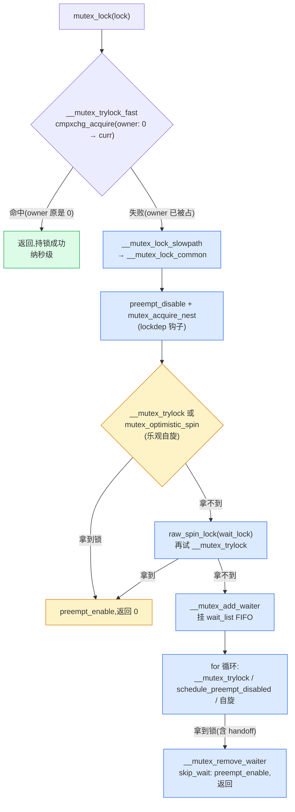
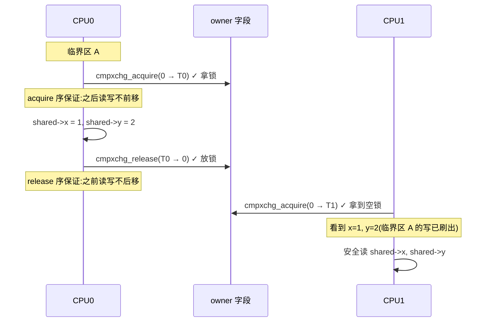
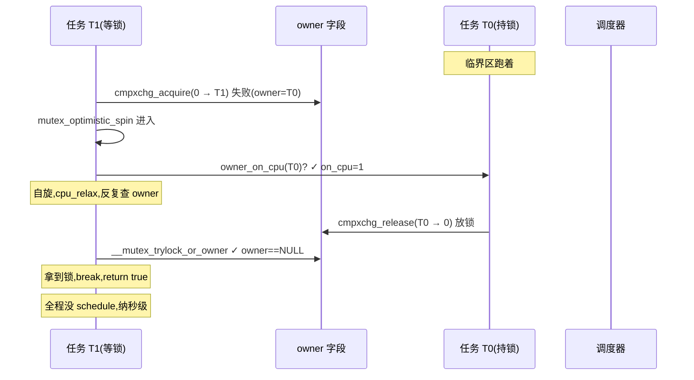
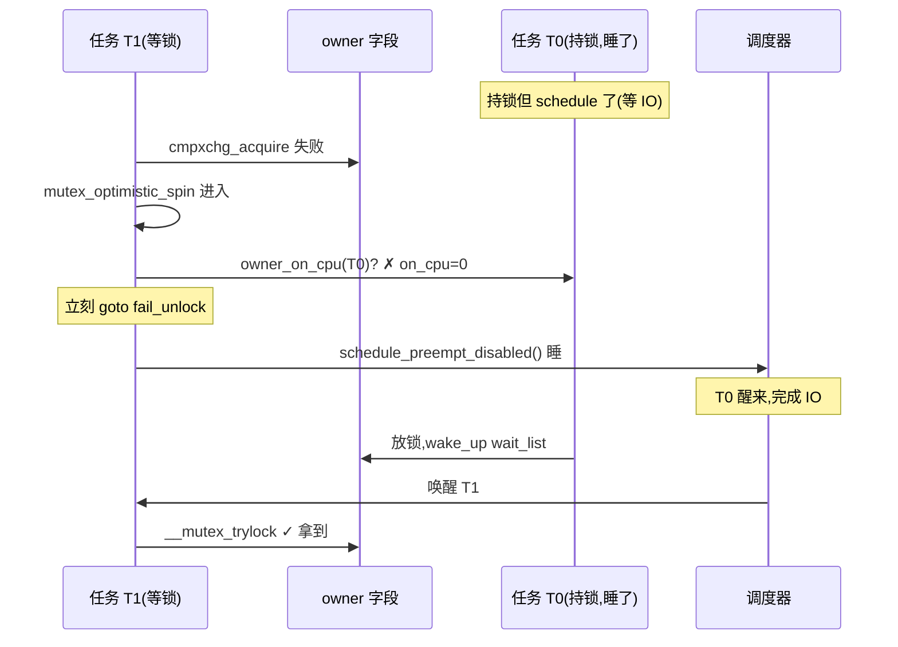
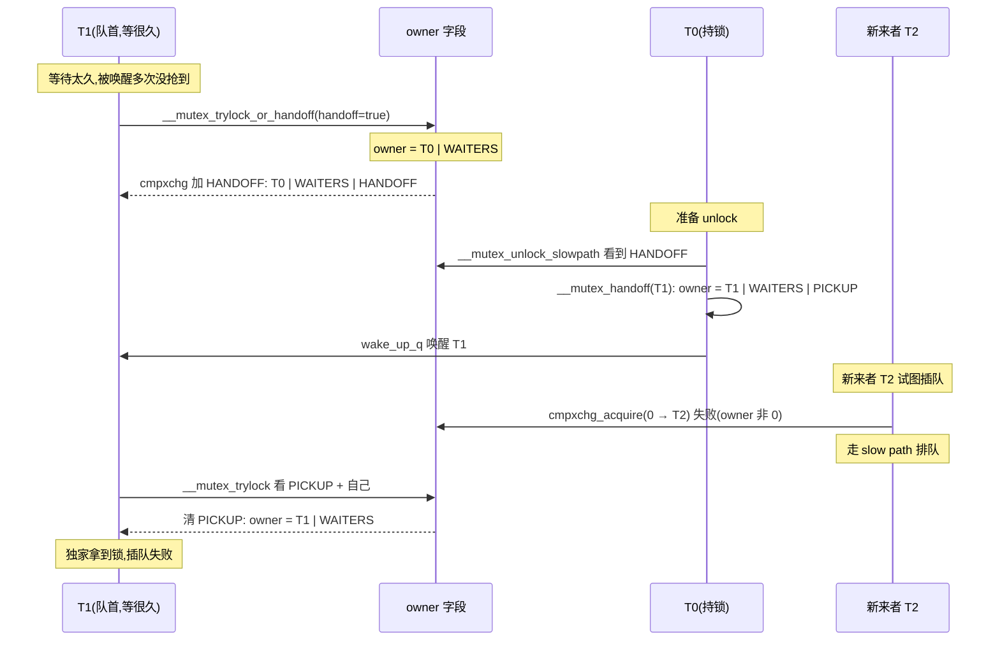
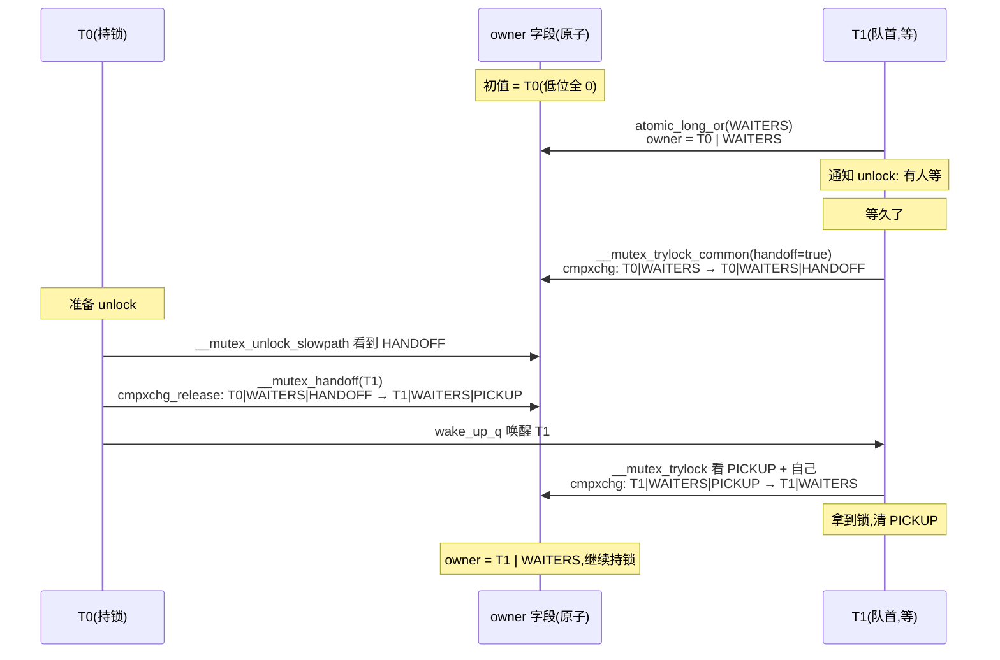
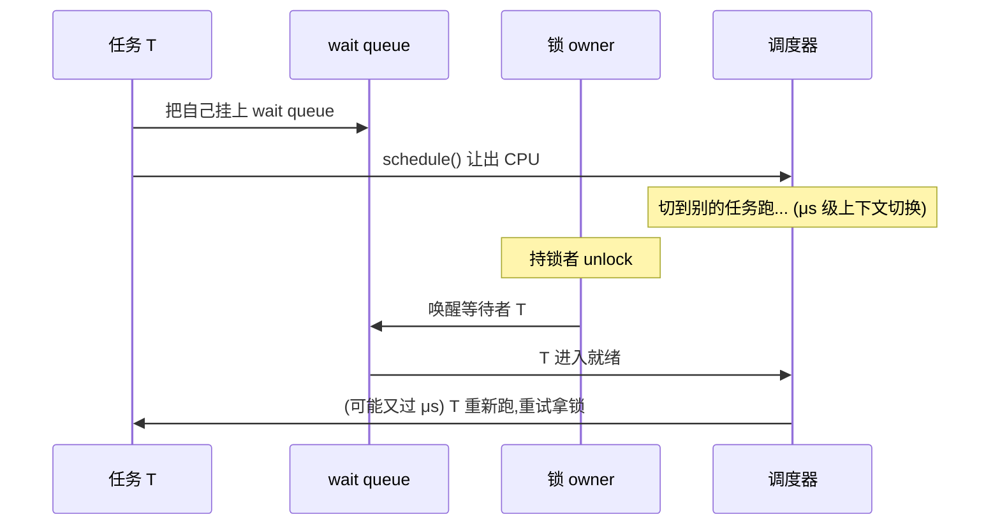

# 第八章 · mutex:fast path + 慢路径睡眠

> 篇:P3 阻塞锁:睡眠一极
> 主线呼应:上一章(P2-07)我们立起了"持 spinlock 绝不能睡眠"的铁律——IRQ 上下文一旦睡眠,另一个 CPU 就会死等一个永远醒不过来的持锁者。可是内核里大量临界区**天然要睡**(文件系统 IO、内存分配、等待设备),这些代码不能拿 spinlock 保护。于是内核需要一把**允许持锁者睡眠**的锁,这就是 mutex。可一旦允许睡眠,新问题接踵而至:持锁者睡下去后,等锁的人怎么办?所有人都进 wait queue 睡,无竞争时白白付 μs 级上下文切换;不放 wait queue 又怎么知道何时该醒?更阴险的是——持锁者明明马上就放(临界区就几条指令),你却 schedule 睡下去了,醒了才重试,这是纯粹的浪费。本章就把 [`kernel/locking/mutex.c`](../linux/kernel/locking/mutex.c) 这一套——fast path `cmpxchg` 抢 owner、慢路径 wait queue 睡眠、乐观自旋、owner 低位编码、handoff 防饥饿——**全拆透**,讲清每一步**为什么 sound**。

## 核心问题

**mutex 凭什么既允许持锁者睡眠又能不出错?无竞争时一条 `cmpxchg` 秒杀,有竞争时怎么走 wait queue + schedule 睡眠?持锁者还在 CPU 上跑就别睡——乐观自旋的退出条件为什么不会死锁、不会白烧?owner 字段怎么把 task 指针和三个标志位压进一个原子字?等太久的人怎么通过 HANDOFF 直接把锁抢过来又不破坏 FIFO 公平性?**

读完本章你会明白:

1. mutex 与 spinlock 的根本分野:**持锁可睡眠**——这一句决定了 mutex 走"阻塞睡眠一极",而 fast path 一条 `cmpxchg_acquire` 只是"无竞争时的捷径",失败才付睡眠的代价。
2. fast path / slow path 分层:`__mutex_trylock_fast` 用 `cmpxchg_acquire(0 → curr)` 无竞争秒杀,失败才进 `__mutex_lock_common` 慢路径。
3. owner 字段低位编码:`atomic_long_t owner` 把 task 指针(高位)+ `MUTEX_FLAG_WAITERS`/`HANDOFF`/`PICKUP`(低位 3 bit)压进一个原子字,慢路径用这些标志通知 fast path。
4. 乐观自旋(`mutex_optimistic_spin`):持锁者在 CPU 上跑就别睡——靠 `owner_on_cpu` 探测、`need_resched` 退出、`osq_lock` 限流(一次只一个 spinner),退出条件为何不死锁不白烧。
5. handoff 机制防饥饿:等太久设 `MUTEX_FLAG_HANDOFF`,unlock 时 `__mutex_handoff` 强制把锁交给队首,`MUTEX_FLAG_PICKUP` 让队首的 `__mutex_trylock_common` 拿到 exclusive 访问——为什么这套不会和 fast path 抢冲突。
6. ★ 对照:Go 的 `sync.Mutex` fast path 几乎是内核 mutex 的用户态翻版(`cmpxchg` + 自旋 + sema 睡眠),Tokio 的 `AtomicWaker` 也是 `cmpxchg` 标记唤醒——fast/slow 分层是跨语言通用的锁优化。

---

> **逃生阀**:这一章会出现 `cmpxchg_acquire`、`cmpxchg_release`、`atomic_long_or`、`need_resched`、`osq_lock`(MCS 锁)、`schedule_preempt_disabled`、wait queue FIFO、HANDOFF、PICKUP 等概念。如果你只写过 `pthread_mutex_lock`、没看过内核锁源码,不要慌——先抓住一条主线:**mutex 的所有花活,都是为了在"无竞争要快、有竞争要公平、等太久要不饿、持锁要能睡"这四个矛盾之间找平衡**。cmpxchg 负责"快",wait queue 负责"公平",乐观自旋负责"少睡",handoff 负责"不饿"。每个机制都是为了堵其中一个洞。读不懂 owner 低位编码的某条执行序没关系,先把 fast path → 乐观自旋 → wait queue → handoff 这条决策树记住,细节回头再抠。

## 8.1 一句话点破

> **mutex 用一个 `atomic_long_t owner` 字段把"持锁者是谁"和"锁的几位状态"压在一起,fast path 一条 `cmpxchg_acquire(0 → curr)` 无竞争秒杀,失败才进慢路径——慢路径先用乐观自旋(持锁者在跑就再等等)减少 schedule 次数,实在拿不到才挂 wait queue FIFO 睡眠。等太久的人通过 HANDOFF 标志让 unlock 把锁强制交给自己,防饥饿又不破坏公平。每一步的内存序(acquire / release)都精确配对,保证临界区不跑到锁外、unlock 的唤醒不丢、handoff 的交锁不被 fast path 偷走。**

这是结论,不是理由。本章倒过来拆:先看 mutex 为什么必须独立于 spinlock(8.2),再看 fast path 的 `cmpxchg` 怎么消灭绝大部分开销(8.3),然后进慢路径——乐观自旋(8.4)、wait queue 睡眠(8.5)、handoff 防饥饿(8.6),最后用 owner 低位编码把这一切串起来(8.7)。P0-01 的 1.7 技巧精解点过 fast path 的轮廓,本章是**全拆**——乐观自旋的退出条件、wait queue 的 FIFO、handoff 的状态转换、owner 编码的所有执行序,一个不漏。

---

## 8.2 mutex 与 spinlock 的分野:持锁可睡眠

回到二分法。第 2 篇讲的自旋锁(spinlock/qspinlock)是**自旋/无锁一极**——拿不到就 `cpu_relax()` 死等,绝不让出 CPU;代价是持锁期间**绝不能睡眠**(IRQ 上下文也不能睡),否则别的 CPU 会死等一个永远醒不过来的持锁者。可内核里大量临界区天然要睡:

- 文件系统路径:`inode` 锁、`i_mutex` —— 拿锁后可能要等磁盘 IO(读 page、写 journal)。
- 内存分配:`__alloc_pages` 在内存紧张时要睡眠等待 kswapd 回收。
- 设备驱动:`ioctl` 路径上要等硬件 ready,中间会 `wait_event`。

这些临界区**根本没法用 spinlock 保护**——持锁者一睡,系统就挂。于是内核需要一把"持锁可以睡眠"的锁,这就是 mutex。从 [`struct mutex`](../linux/include/linux/mutex_types.h#L41-54)([mutex_types.h:41](../linux/include/linux/mutex_types.h#L41)):

```c
struct mutex {
    atomic_long_t           owner;        /* ← fast path 抢的就是这个字段 */
    raw_spinlock_t          wait_lock;
#ifdef CONFIG_MUTEX_SPIN_ON_OWNER
    struct optimistic_spin_queue osq;     /* Spinner MCS lock */
#endif
    struct list_head        wait_list;
#ifdef CONFIG_DEBUG_MUTEXES
    void                    *magic;
#endif
#ifdef CONFIG_DEBUG_LOCK_ALLOC
    struct lockdep_map      dep_map;
#endif
};
```

注意三件事:

1. **没有 `count` 字段**。老内核(< 4.10)mutex 用 `atomic_t count` 表示锁状态,4.10 起合并到 `owner`——fast path 直接在 owner 上 `cmpxchg`,把"持锁者是谁"和"锁状态"压进一个原子字(后面 8.7 详讲低位编码)。**勿照搬老教材**。
2. **`wait_lock` 是 `raw_spinlock_t`**。它保护 `wait_list` 的链表操作——慢路径要进 wait queue 时拿它,解锁时也拿它,这是 mutex 自己内部用的 spinlock,**和"持锁可睡眠"不矛盾**(wait_lock 只在几条指令内持有,临界区极短)。
3. **`osq` 是个 MCS 锁**(`optimistic_spin_queue`),只用于乐观自旋时排队,保证多核同时自旋时只有队首一个真的在转(后面 8.4 详讲)。

> **不这样会怎样**:如果 mutex 内部也用一把普通 spinlock 保护整个 lock/unlock 操作,那持锁者拿锁时要先抢 spinlock、放锁时也要抢 spinlock——fast path 就退化成 spinlock 的性能,无竞争时也得原子操作两把锁。把"锁状态"压进 `owner` 原子字、fast path 只动 `owner`、`wait_lock` 只在慢路径动 `wait_list`,这三者分工才让 mutex 的无竞争路径做到"一条 `cmpxchg` 秒杀"。

### `might_sleep()` 和 `schedule_preempt_disabled`——睡眠的入口

mutex 的所有 lock API 开头都有一句 [`might_sleep()`](../linux/kernel/locking/mutex.c#L283)([mutex.c:283](../linux/kernel/locking/mutex.c#L283))。这个宏在 `CONFIG_DEBUG_ATOMIC_SLEEP` 下会检查"调用方是否在原子上下文(IRQ/持 spinlock/关抢占)",如果在就警告——因为持 mutex 睡眠是合法的,但**你不能在持 spinlock 或关抢占的情况下再去拿 mutex**(那等于在原子上下文睡眠,会死锁)。慢路径真正睡下去的地方是 `__mutex_lock_common` 里的 [`schedule_preempt_disabled()`](../linux/kernel/locking/mutex.c#L684)([mutex.c:684](../linux/kernel/locking/mutex.c#L684))——它调用主调度器 `schedule()` 让出 CPU,把自己挂到 wait queue 上等唤醒。

> **钉死这件事**:mutex 和 spinlock 的根本分野就一句话——**持 mutex 可以 `schedule()` 睡眠,持 spinlock 绝不能**。这一句决定了 mutex 适合长临界区(IO/分配/设备),spinlock 适合极短临界区(改计数/链表头)。本书"阻塞睡眠一极"从此正式开始。

---

## 8.3 fast path:一条 `cmpxchg_acquire` 怎么消灭绝大部分开销

P0-01 的 1.7 已经点过 fast path 的轮廓,这里深挖。先看 [`mutex_lock`](../linux/kernel/locking/mutex.c#L281-288)([mutex.c:281](../linux/kernel/locking/mutex.c#L281)):

```c
void __sched mutex_lock(struct mutex *lock)
{
    might_sleep();

    if (!__mutex_trylock_fast(lock))
        __mutex_lock_slowpath(lock);
}
EXPORT_SYMBOL(mutex_lock);
```

短短 4 行有效代码,藏了内核锁的核心智慧——**先试 fast path,失败才进 slow path**。fast path 是 [`__mutex_trylock_fast`](../linux/kernel/locking/mutex.c#L166-175)([mutex.c:166](../linux/kernel/locking/mutex.c#L166)):

```c
static __always_inline bool __mutex_trylock_fast(struct mutex *lock)
{
    unsigned long curr = (unsigned long)current;
    unsigned long zero = 0UL;

    if (atomic_long_try_cmpxchg_acquire(&lock->owner, &zero, curr))
        return true;

    return false;
}
```

就一条 `cmpxchg`(compare-and-swap)——**原子地**比较 `lock->owner` 是不是 0,如果是,就把它改成 `current`(当前 task 指针);如果不是 0(别人拿着),就返回 false。命中就返回 true,不命中才走 [`__mutex_lock_slowpath`](../linux/kernel/locking/mutex.c#L1037-1041)([mutex.c:1037](../linux/kernel/locking/mutex.c#L1037)) → [`__mutex_lock_common`](../linux/kernel/locking/mutex.c#L573-746)([mutex.c:573](../linux/kernel/locking/mutex.c#L573))。

`mutex_unlock` 也对称——[`__mutex_unlock_fast`](../linux/kernel/locking/mutex.c#L177-182)([mutex.c:177](../linux/kernel/locking/mutex.c#L177)):

```c
static __always_inline bool __mutex_unlock_fast(struct mutex *lock)
{
    unsigned long curr = (unsigned long)current;

    return atomic_long_try_cmpxchg_release(&lock->owner, &curr, 0UL);
}
```

unlock 时,如果 owner 还是 curr(没人在等),`cmpxchg_release(curr → 0)` 一条指令搞定;如果 owner 多了 WAITERS/HANDOFF 标志位(说明有人进过 wait queue),`cmpxchg` 失败,才走 [`__mutex_unlock_slowpath`](../linux/kernel/locking/mutex.c#L906-957)([mutex.c:906](../linux/kernel/locking/mutex.c#L906))去唤醒等待者。

### 为什么 fast path 能消灭绝大部分开销

因为**绝大多数 `mutex_lock` 在实际运行中是无竞争的**。无竞争时 fast path 就是**一条原子指令**(x86 上是 `LOCK CMPXCHG`,纳秒级),不进 wait queue、不 `schedule()`、不切上下文——和一次普通赋值几乎一样便宜。整条决策路径如下:



> **不这样会怎样**:朴素的 mutex(老教材写法)不管有没有竞争,每次都走"进 wait queue → schedule → 被唤醒重试"完整路径。无竞争时这一整套白做——每次 `mutex_lock` 都要付 μs 级的上下文切换 + 唤醒延迟,64 核机器上锁开销比临界区本身还贵一个数量级。

### `cmpxchg_acquire` 的 acquire 内存序:为什么临界区不跑到锁外

fast path 用的是 `cmpxchg_acquire` 而不是普通 `cmpxchg`——这个 `_acquire` 后缀是**acquire 内存序**。它的语义是:

- **acquire 之后的读/写,不能重排到 acquire 之前**。

这对锁的正确性是命脉。考虑临界区代码:

```c
mutex_lock(&m);     // (1) cmpxchg_acquire 拿锁
shared_data->x = 1; // (2) 改共享数据
shared_data->y = 2; // (3) 改共享数据
mutex_unlock(&m);   // (4) cmpxchg_release 放锁
```

如果没有 acquire 序,CPU/编译器可能把 (2)(3) 重排到 (1) 之前——那别的 CPU 看到的顺序就是"先改数据,再拿锁",共享数据就跑到锁外面去了,锁就废了。acquire 序保证 (2)(3) 严格在 (1) 之后才对其他 CPU 可见。对称地,unlock 用 `cmpxchg_release`——**release 之前的读/写,不能重排到 release 之后**。这保证 (2)(3) 严格在 (4) 之前完成,放锁之前数据已经刷出去。

> **为什么 sound**:`cmpxchg_acquire`(拿锁)和 `cmpxchg_release`(放锁)的 acquire/release 配对,在所有并发执行序下都保证:临界区内的读/写**绝不会跑到 lock 之前或 unlock 之后**。这是 mutex 不出错的内存序根。少了 `_acquire` / `_release`(用普通 `cmpxchg`),某条执行序下临界区代码就会"漏"到锁外——多核场景下表现为"明明加了锁,数据还是被改乱了",极难复现。



> **钉死这件事**:fast path 是"无竞争时的捷径"——一条 `cmpxchg_acquire` 秒杀(纳秒级)。它消灭了 wait queue、schedule、上下文切换的全部开销。代价是失败就立刻进慢路径(下两节)。**fast path / slow path 分层是内核锁性能的命脉**,mutex/rwsem/futex/spinlock 全是这个套路(差别只在 fast path 抢什么、slow path 睡还是自旋)。

---

## 8.4 乐观自旋:持锁者在跑就别睡

fast path 失败(锁被占),立刻进 `__mutex_lock_common`。但这不代表立刻睡——持锁者可能马上就放(临界区就几条指令),睡下去反而亏:你 schedule 让出 CPU,切到别的任务,等持锁者 unlock 唤醒你,你又被调度回来——一来一回 μs 级开销,而持锁者可能只持了几十 ns。为了堵这个洞,内核在进 wait queue 之前先试**乐观自旋**([`mutex_optimistic_spin`](../linux/kernel/locking/mutex.c#L440-514),[mutex.c:440](../linux/kernel/locking/mutex.c#L440))。

### 为什么要乐观自旋

回看 `__mutex_lock_common` 开头([mutex.c:607-620](../linux/kernel/locking/mutex.c#L607)):

```c
preempt_disable();
mutex_acquire_nest(&lock->dep_map, subclass, 0, nest_lock, ip);

trace_contention_begin(lock, LCB_F_MUTEX | LCB_F_SPIN);
if (__mutex_trylock(lock) ||
    mutex_optimistic_spin(lock, ww_ctx, NULL)) {
    /* got the lock, yay! */
    lock_acquired(&lock->dep_map, ip);
    ...
    preempt_enable();
    return 0;
}
```

慢路径入口先 `preempt_disable`(关抢占——乐观自旋期间不能被调度走),再试 `__mutex_trylock`(进 wait queue 前再抢一次,可能持锁者刚刚放了),失败就调 `mutex_optimistic_spin`。乐观自旋拿到就 `return 0` 直接返回——**根本不进 wait queue,根本不 schedule**。

> **不这样会怎样**:如果没有乐观自旋,每次 fast path 失败都立刻睡。持锁者持锁 100 ns,你却付了 μs 级 schedule + wakeup 的代价——这是 10 倍的浪费。在"持锁很短但偶尔争用"的典型场景(比如 inode 锁、page table 锁)下,这种浪费会累积成系统级延迟。

### 乐观自旋的内部:`mutex_can_spin_on_owner` + osq 排队 + `mutex_spin_on_owner`

[`mutex_optimistic_spin`](../linux/kernel/locking/mutex.c#L440-514) 分三步:

**第一步·入口检查**([mutex.c:444-462](../linux/kernel/locking/mutex.c#L444)):

```c
if (!waiter) {
    if (!mutex_can_spin_on_owner(lock))
        goto fail;

    if (!osq_lock(&lock->osq))
        goto fail;
}
```

`mutex_can_spin_on_owner`([mutex.c:392-417](../linux/kernel/locking/mutex.c#L392))是"自旋前的前置检查"——如果 `need_resched()`(本 CPU 该被抢了)就立刻退出不转,如果持锁者不在 CPU 上跑(`!owner_on_cpu(owner)`)也退出。这两个退出条件后面详讲为什么 sound。

`osq_lock(&lock->osq)` 是关键——`osq` 是个 MCS 锁([osq_lock.h:10](../linux/include/linux/osq_lock.h#L10)),多核同时想乐观自旋时,**只有队首一个 CPU 真的在转**,其他 CPU 在自己的本地变量上自旋等队首放权。这样 64 核同时争一把锁,不会 64 个 CPU 全在 owner 字段上 cache line 乒乓(回扣 P2-05 qspinlock 的 MCS 思想,完全同源)。`osq_lock` 拿不到(你不是队首)就直接 `goto fail`——不白烧,去睡。

**第二步·自旋循环**([mutex.c:464-486](../linux/kernel/locking/mutex.c#L464)):

```c
for (;;) {
    struct task_struct *owner;

    /* Try to acquire the mutex... */
    owner = __mutex_trylock_or_owner(lock);
    if (!owner)
        break;

    if (!mutex_spin_on_owner(lock, owner, ww_ctx, waiter))
        goto fail_unlock;

    cpu_relax();
}
```

每轮先 `__mutex_trylock_or_owner` 试一次(`cmpxchg` 抢 owner,抢到 owner==NULL 就 break 拿到锁);抢不到(返回当前 owner)就 `mutex_spin_on_owner` 盯着这个 owner 转。`mutex_spin_on_owner`([mutex.c:352-387](../linux/kernel/locking/mutex.c#L352))是核心:

```c
static noinline
bool mutex_spin_on_owner(struct mutex *lock, struct task_struct *owner, ...)
{
    bool ret = true;

    lockdep_assert_preemption_disabled();

    while (__mutex_owner(lock) == owner) {
        barrier();

        if (!owner_on_cpu(owner) || need_resched()) {
            ret = false;
            break;
        }

        if (ww_ctx && !ww_mutex_spin_on_owner(lock, ww_ctx, waiter)) {
            ret = false;
            break;
        }

        cpu_relax();
    }

    return ret;
}
```

自旋条件就两条:**owner 没换 + owner 还在 CPU 上跑 + 本 CPU 不需要被调度**。`owner_on_cpu(owner)` 看 `owner->on_cpu`(持锁者是不是正在某个 CPU 上跑,不是睡)、`vcpu_is_preempted(task_cpu(owner))`(在虚拟化下,持锁者的 vCPU 有没有被 hypervisor 抢走)、`need_resched()`(本 CPU 有没有更高优任务要跑)。任何一条不满足立刻 `ret = false` 退出。

**第三步·退出收尾**([mutex.c:488-513](../linux/kernel/locking/mutex.c#L488)):

```c
if (!waiter)
    osq_unlock(&lock->osq);

return true;

fail_unlock:
    if (!waiter)
        osq_unlock(&lock->osq);

fail:
    if (need_resched()) {
        __set_current_state(TASK_RUNNING);
        schedule_preempt_disabled();
    }

    return false;
```

退出时 unlock osq(让队首换人),如果是因为 `need_resched` 退出,顺便 `schedule_preempt_disabled` 让 CPU 给更高优任务。返回 false 告诉调用方"我没拿到,去睡吧"。

### 乐观自旋为什么 sound(命脉)

乐观自旋的 sound 性体现在**四个退出条件**,每一个都有明确的不死锁/不白烧的理由:

1. **owner 换了(`__mutex_owner(lock) != owner`)**:while 循环条件本身。原 owner 放锁了或者 handoff 给别人了,while 退出 → 回到外层 for 再试 `__mutex_trylock_or_owner`。不死锁——拿不到就返回 false 去睡。

2. **owner 不在 CPU 上跑(`!owner_on_cpu`)**:持锁者 schedule 睡下去了(可能等 IO、等内存)。这时你再转也没用——它醒了才会放锁,你不知道什么时候。立刻退出,去睡,等它 unlock 时唤醒你。**这是乐观自旋和"死等"的分野**——spinlock 会死等,mutex 不会。

3. **本 CPU 该被调度(`need_resched`)**:有更高优任务要跑,你不能独占 CPU 转圈。立刻退出,让 CPU 给更高优任务。**否则你一边自旋一边拖慢整个系统**,违背"乐观自旋只为短临界区服务"的设计。

4. **vCPU 被抢占(`vcpu_is_preempted`)**:虚拟化下持锁者的 vCPU 被 hypervisor 抢走,它根本没在跑。自旋纯粹浪费物理 CPU。退出。



对比持锁者睡下去的情况:



> **为什么 sound**:乐观自旋**不死锁**——退出条件覆盖了所有"转下去也没用"的情况(owner 换了/owner 睡了/本 CPU 该让/vCPU 被抢);**不白烧**——只有"owner 明明在 CPU 上跑、临界区明明马上结束"时才转;**不破坏公平**——`osq_lock` 保证一次只有一个 CPU 在转,不会插队抢在 wait queue 队首前面。这就是"乐观"二字的含义——乐观地假设持锁者马上就放,假设错了就立刻退出去睡。

### 注意:`__mutex_owner(lock)` 是投机读

`mutex_spin_on_owner` 注释明确说 ["owner is an entirely speculative pointer access and not reliable"](../linux/kernel/locking/mutex.c#L346-350)。自旋期间 `__mutex_owner(lock)` 读到的 owner 可能是过期的(owner 已经换了),但这没关系——while 循环每次都重新读,读到不一致最多多转一两圈。关键点是 `owner_on_cpu(owner)` 这个解引用——`owner` 指针在自旋期间会不会失效?不会,因为自旋期间 `preempt_disable` 等价于关掉了 RCU 临界区(注释 [mutex.c:362-367](../linux/kernel/locking/mutex.c#L362) 说得很清楚),`task_struct` 在这期间不会被回收。

> **钉死这件事**:乐观自旋是 mutex 慢路径的**第一道关卡**——fast path 失败后先不睡,先看持锁者在不在 CPU 上跑。在就再等等(纳秒级成本),不在就立刻睡(不白烧)。它把"持锁很短偶尔争用"这个最常见的场景从"睡眠 + 唤醒 μs 级开销"降到"自旋几十 ns"。退出条件四个(owner 换/owner 睡/本 CPU 让/vCPU 抢),覆盖所有"转下去没用"的情况,不死锁、不白烧。

---

## 8.5 慢路径核心:wait queue + `schedule_preempt_disabled`

乐观自旋也拿不到,才真正进 wait queue 睡眠。这是 mutex 的**阻塞睡眠一极**本体。回到 `__mutex_lock_common`,从 [mutex.c:622](../linux/kernel/locking/mutex.c#L622) 开始:

```c
raw_spin_lock(&lock->wait_lock);
/*
 * After waiting to acquire the wait_lock, try again.
 */
if (__mutex_trylock(lock)) {
    if (ww_ctx)
        __ww_mutex_check_waiters(lock, ww_ctx);

    goto skip_wait;
}
```

进 wait queue 前,先拿 `wait_lock`(raw spinlock,保护 wait_list 的链表操作),再试一次 `__mutex_trylock`——因为持锁者可能在乐观自旋期间已经放了。这次 `__mutex_trylock` 也失败,才正式挂 wait queue。

### 挂 wait queue:FIFO + WAITERS 标志

[mutex.c:633-651](../linux/kernel/locking/mutex.c#L633):

```c
debug_mutex_lock_common(lock, &waiter);
waiter.task = current;
if (use_ww_ctx)
    waiter.ww_ctx = ww_ctx;

lock_contended(&lock->dep_map, ip);

if (!use_ww_ctx) {
    /* add waiting tasks to the end of the waitqueue (FIFO): */
    __mutex_add_waiter(lock, &waiter, &lock->wait_list);
} else {
    ret = __ww_mutex_add_waiter(&waiter, lock, ww_ctx);
    if (ret)
        goto err_early_kill;
}
```

普通 mutex 用 [`__mutex_add_waiter`](../linux/kernel/locking/mutex.c#L204-213)([mutex.c:204](../linux/kernel/locking/mutex.c#L204))挂到 `wait_list` 尾部(`list_add_tail`,严格 FIFO):

```c
static void
__mutex_add_waiter(struct mutex *lock, struct mutex_waiter *waiter,
           struct list_head *list)
{
    debug_mutex_add_waiter(lock, waiter, current);

    list_add_tail(&waiter->list, list);
    if (__mutex_waiter_is_first(lock, waiter))
        __mutex_set_flag(lock, MUTEX_FLAG_WAITERS);
}
```

注意第二行——**如果你是第一个等待者**(`__mutex_waiter_is_first`),就 `__mutex_set_flag(lock, MUTEX_FLAG_WAITERS)`,即 `atomic_long_or(MUTEX_FLAG_WAITERS, &lock->owner)`([mutex.c:185-188](../linux/kernel/locking/mutex.c#L185))——把 owner 字段的 bit0 置 1。这个标志的用途是**告诉 unlock 的 fast path**:"别用 `cmpxchg_release(curr → 0)` 一走了之,有人等着,你得走 slow path 唤醒他们"。

> **为什么 sound**:`MUTEX_FLAG_WAITERS` 是慢路径通知 fast path 的**单向信号**。它设上去之后,持锁者下次 unlock 时 `__mutex_unlock_fast` 里的 `cmpxchg_release(curr → 0)` 必然失败(owner 字段实际是 `curr | MUTEX_FLAG_WAITERS`,不等于 `curr`),于是 fallback 到 [`__mutex_unlock_slowpath`](../linux/kernel/locking/mutex.c#L906-957) 去唤醒等待者。**没有这个标志,unlock 的 fast path 一走,等待者就永远睡死**——这是 wait queue 不丢唤醒的根。

`struct mutex_waiter` 定义在内部头 [`kernel/locking/mutex.h`](../linux/kernel/locking/mutex.h#L14-21)([mutex.h:14](../linux/kernel/locking/mutex.h#L14),注意是 `kernel/locking/` 下,不是 `include/linux/`):

```c
struct mutex_waiter {
    struct list_head    list;
    struct task_struct  *task;
    struct ww_acquire_ctx *ww_ctx;
#ifdef CONFIG_DEBUG_MUTEXES
    void            *magic;
#endif
};
```

它在**等待者的内核栈上分配**(看 `__mutex_lock_common` 里的 `struct mutex_waiter waiter;`,栈变量),挂到 `wait_list` 上。`task` 字段指向等待者自己,unlock 时靠它找到要唤醒的 task。

### for 循环:trylock / 检查信号 / schedule / 醒来重试

挂完 wait queue,设状态([mutex.c:653](../linux/kernel/locking/mutex.c#L653))`set_current_state(state)`(通常是 `TASK_UNINTERRUPTIBLE`),进入 for 循环([mutex.c:655-705](../linux/kernel/locking/mutex.c#L655)):

```c
for (;;) {
    bool first;

    if (__mutex_trylock(lock))
        goto acquired;

    if (signal_pending_state(state, current)) {
        ret = -EINTR;
        goto err;
    }

    if (ww_ctx) {
        ret = __ww_mutex_check_kill(lock, &waiter, ww_ctx);
        if (ret)
            goto err;
    }

    raw_spin_unlock(&lock->wait_lock);
    schedule_preempt_disabled();

    first = __mutex_waiter_is_first(lock, &waiter);

    set_current_state(state);
    if (__mutex_trylock_or_handoff(lock, first))
        break;

    if (first) {
        trace_contention_begin(lock, LCB_F_MUTEX | LCB_F_SPIN);
        if (mutex_optimistic_spin(lock, ww_ctx, &waiter))
            break;
        trace_contention_begin(lock, LCB_F_MUTEX);
    }

    raw_spin_lock(&lock->wait_lock);
}
```

这个 for 循环是 mutex 慢路径的**心跳**。每一轮做这几件事:

1. **再试 `__mutex_trylock`**——可能持锁者刚刚 unlock,正好 handoff 给你了(下节详讲)。拿到就 `goto acquired`。
2. **检查信号**(只在 `TASK_INTERRUPTIBLE` 状态)——如果是要响应信号的 lock(如 `mutex_lock_interruptible`),收到信号就 `goto err` 退出,返回 `-EINTR`。注意:即使退出也要 `__mutex_remove_waiter` 把自己从 wait_list 摘掉,否则 wait_list 留下垃圾。
3. **放掉 `wait_lock`,schedule 睡眠**——这一句 `schedule_preempt_disabled()` 是真正让出 CPU 的地方。当前任务被挂起,调度器选别的任务跑。直到有人 unlock 唤醒你,你才从这里返回。
4. **醒来后检查队首 + 试 lock/handoff**——`__mutex_waiter_is_first` 看自己是不是队首,`__mutex_trylock_or_handoff` 在队首时尝试设 HANDOFF(下节详讲)。
5. **队首还可以乐观自旋**——注意 `mutex_optimistic_spin(lock, ww_ctx, &waiter)` 这次传了 `&waiter`,表示"我是 wait queue 里的人",自旋逻辑允许 wait queue 队首同时参与自旋(不是从 osq 队尾重新排,见 [mutex.c:444-462](../linux/kernel/locking/mutex.c#L444) 的 `if (!waiter)` 分支)。

### 为什么 for 循环要重复 trylock

这个 for 循环的设计反映了一个关键事实:**mutex 的 lock 状态在 wait_lock 之外也可能变**。持锁者放锁的 fast path(`cmpxchg_release`)根本不拿 wait_lock——所以你 schedule 睡下去后,**unlock 可能发生在你拿 wait_lock 之前**。这就是为什么 for 循环每次醒来、每次拿到 wait_lock 都要重新 `__mutex_trylock`——否则你会错过那次 unlock。

更妙的是 **handoff 路径**:`__mutex_unlock_slowpath` 在设了 HANDOFF 时,会把 owner 字段**直接改成下一个等待者的 task 指针**(下节详讲),fast path `cmpxchg(0 → curr)` 必然失败(owner 不是 0)。这种情况下,等待者醒来后 `__mutex_trylock(lock)` 会调 [`__mutex_trylock_common`](../linux/kernel/locking/mutex.c#L103-137),看到 PICKUP 标志 + owner 是自己,就清掉 PICKUP 拿到锁——这就是 for 循环里的 `__mutex_trylock` 能"捡起"handoff 的机制。

> **为什么 sound**:for 循环 + 反复 trylock 是 mutex **不丢锁**的根。unlock 有两条路径——fast path(无等待者,直接 `cmpxchg_release(curr → 0)`)+ slow path(有等待者或 HANDOFF,改 owner + 唤醒)。等待者每轮醒来都重新 trylock,无论 unlock 走哪条路径都能感知到。少了这层 trylock,会出现"unlock 已发生、等待者却没感知"的丢锁。

---

## 8.6 handoff:等太久直接把锁抢过来

到这里,mutex 已经有了 fast path(快)、乐观自旋(少睡)、wait queue FIFO(公平)。但这些还不够——FIFO 公平有个漏洞:**unlock 的 fast path 释放锁后,任何任务都可以抢**,包括刚调用 `mutex_lock` 还没进 wait queue 的新来者。如果新来者恰好在你被唤醒的瞬间抢到(owner 字段短暂为 0 的窗口),你就被"插队"了。短时间内偶尔插队无伤大雅,但在高负载下,等待者可能永远抢不到——这就是**饥饿**。

为了堵这个洞,内核加了 handoff 机制。看 `__mutex_lock_common` for 循环里的 [mutex.c:694-702](../linux/kernel/locking/mutex.c#L694):

```c
if (__mutex_trylock_or_handoff(lock, first))
    break;

if (first) {
    trace_contention_begin(lock, LCB_F_MUTEX | LCB_F_SPIN);
    if (mutex_optimistic_spin(lock, ww_ctx, &waiter))
        break;
    trace_contention_begin(lock, LCB_F_MUTEX);
}
```

`first` 表示自己是队首。队首调 [`__mutex_trylock_or_handoff`](../linux/kernel/locking/mutex.c#L142-145)([mutex.c:142](../linux/kernel/locking/mutex.c#L142)) → [`__mutex_trylock_common(lock, handoff=true)`](../linux/kernel/locking/mutex.c#L103-137)([mutex.c:103](../linux/kernel/locking/mutex.c#L103)):

```c
static inline struct task_struct *__mutex_trylock_common(struct mutex *lock, bool handoff)
{
    unsigned long owner, curr = (unsigned long)current;

    owner = atomic_long_read(&lock->owner);
    for (;;) { /* must loop, can race against a flag */
        unsigned long flags = __owner_flags(owner);
        unsigned long task = owner & ~MUTEX_FLAGS;

        if (task) {
            if (flags & MUTEX_FLAG_PICKUP) {
                if (task != curr)
                    break;
                flags &= ~MUTEX_FLAG_PICKUP;
            } else if (handoff) {
                if (flags & MUTEX_FLAG_HANDOFF)
                    break;
                flags |= MUTEX_FLAG_HANDOFF;
            } else {
                break;
            }
        } else {
            MUTEX_WARN_ON(flags & (MUTEX_FLAG_HANDOFF | MUTEX_FLAG_PICKUP));
            task = curr;
        }

        if (atomic_long_try_cmpxchg_acquire(&lock->owner, &owner, task | flags)) {
            if (task == curr)
                return NULL;
            break;
        }
    }

    return __owner_task(owner);
}
```

这段是 mutex 低位编码的**精华**。当 `handoff=true` 且 owner 字段高位非空(锁被占)时:

- 如果已经有 HANDOFF 标志了(`flags & MUTEX_FLAG_HANDOFF`),`break`——别再设,别人设过了。
- 否则把 HANDOFF 标志加进 flags,`cmpxchg_acquire` 把 owner 从 `task | old_flags` 改成 `task | old_flags | MUTEX_FLAG_HANDOFF`。

设上 HANDOFF 之后,持锁者的 unlock 慢路径会看到这个标志,做出特殊处理。看 [`__mutex_unlock_slowpath`](../linux/kernel/locking/mutex.c#L906-957)([mutex.c:906](../linux/kernel/locking/mutex.c#L906)):

```c
static noinline void __sched __mutex_unlock_slowpath(struct mutex *lock, unsigned long ip)
{
    struct task_struct *next = NULL;
    DEFINE_WAKE_Q(wake_q);
    unsigned long owner;

    mutex_release(&lock->dep_map, ip);

    owner = atomic_long_read(&lock->owner);
    for (;;) {
        MUTEX_WARN_ON(__owner_task(owner) != current);
        MUTEX_WARN_ON(owner & MUTEX_FLAG_PICKUP);

        if (owner & MUTEX_FLAG_HANDOFF)
            break;

        if (atomic_long_try_cmpxchg_release(&lock->owner, &owner, __owner_flags(owner))) {
            if (owner & MUTEX_FLAG_WAITERS)
                break;

            return;
        }
    }

    raw_spin_lock(&lock->wait_lock);
    debug_mutex_unlock(lock);
    if (!list_empty(&lock->wait_list)) {
        struct mutex_waiter *waiter =
            list_first_entry(&lock->wait_list,
                     struct mutex_waiter, list);

        next = waiter->task;

        debug_mutex_wake_waiter(lock, waiter);
        wake_q_add(&wake_q, next);
    }

    if (owner & MUTEX_FLAG_HANDOFF)
        __mutex_handoff(lock, next);

    raw_spin_unlock(&lock->wait_lock);

    wake_up_q(&wake_q);
}
```

关键路径:

1. **无 HANDOFF + 无 WAITERS**:`cmpxchg_release(curr → 0)` 成功后 `return`,无人唤醒——这其实和 fast path 等价(但 `__mutex_unlock_fast` 已经先试过了,走到这里说明 fast path 失败,即 owner 有标志位)。
2. **无 HANDOFF + 有 WAITERS**:`cmpxchg_release(curr → 0 | WAITERS)` 成功后 `break`,**清空 owner 的 task 部分,保留 WAITERS 标志**(注意 `__owner_flags(owner)` 只保留低 3 位,task 部分清零)。然后进 wait_lock 块,wake up 队首。**这是"普通公平"路径——unlock 把锁释放(owner 高位清零),但保留 WAITERS 防止新来者 fast path 偷锁,然后唤醒队首**。等等,这里有个细节:`__owner_flags(owner)` 只保留了 WAITERS 位,owner 字段变成 `0 | WAITERS`,新来者 fast path `cmpxchg(0 → curr)` 失败(因为 owner 是 `0 | WAITERS` 不等于 0),走 slow path → 排队。这就防止了新来者插队。
3. **有 HANDOFF**:`break` 进 wait_lock 块,调 [`__mutex_handoff(lock, next)`](../linux/kernel/locking/mutex.c#L231-249)([mutex.c:231](../linux/kernel/locking/mutex.c#L231)):

```c
static void __mutex_handoff(struct mutex *lock, struct task_struct *task)
{
    unsigned long owner = atomic_long_read(&lock->owner);

    for (;;) {
        unsigned long new;

        MUTEX_WARN_ON(__owner_task(owner) != current);
        MUTEX_WARN_ON(owner & MUTEX_FLAG_PICKUP);

        new = (owner & MUTEX_FLAG_WAITERS);
        new |= (unsigned long)task;
        if (task)
            new |= MUTEX_FLAG_PICKUP;

        if (atomic_long_try_cmpxchg_release(&lock->owner, &owner, new))
            break;
    }
}
```

`__mutex_handoff` 把 owner 字段改成 `next_task | WAITERS | PICKUP`(清掉 HANDOFF,加上 PICKUP)——**锁的所有权直接交给队首任务**,但队首任务还没真正"拿"到锁,它在 PICKUP 标志下等待。然后 wake_up_q 唤醒队首。

队首任务从 schedule 醒来,回到 for 循环 [mutex.c:664-665](../linux/kernel/locking/mutex.c#L664):

```c
if (__mutex_trylock(lock))
    goto acquired;
```

`__mutex_trylock` → `__mutex_trylock_common(handoff=false)`,看到 owner 的 PICKUP 位 + 高位是自己:

```c
if (flags & MUTEX_FLAG_PICKUP) {
    if (task != curr)
        break;
    flags &= ~MUTEX_FLAG_PICKUP;
}
```

清掉 PICKUP 位,owner 变成 `curr | WAITERS`,`cmpxchg_acquire` 成功,`return NULL` 表示拿锁成功。这就是**handoff 完整路径**——队首任务通过 PICKUP 标志"独家"拿到锁,任何其他任务看到 PICKUP 但 owner 高位不是自己都 `break` 失败。



### handoff 为什么 sound

handoff 的 sound 性体现在三件事:

1. **HANDOFF 只能由队首设**:for 循环里 `__mutex_trylock_or_handoff(lock, first)` 只在 `first == true`(自己是队首)时才设 HANDOFF。非队首想设也设不了(`__mutex_trylock_common` 里 `if (handoff) { ... flags |= MUTEX_FLAG_HANDOFF; }` 这条分支要 `handoff=true` 才进)。所以 HANDOFF 严格对应"队首等太久了"。
2. **HANDOFF 设了之后,unlock 不能直接 fast path 释放**:`__mutex_unlock_slowpath` 的第一个 for 看到 `owner & MUTEX_FLAG_HANDOFF` 就 `break`,**不走 cmpxchg_release(curr → 0)**,直接进 wait_lock 块做 handoff。这保证了"锁一定被交给队首,不会被 fast path 偷走"。
3. **PICKUP 让 handoff 的接收方独家拿锁**:owner 字段被改成 `next_task | WAITERS | PICKUP`,只有 next_task 能清掉 PICKUP 拿到锁(其他任务看 PICKUP 但 owner 高位不是自己,`break` 失败)。这就是"独家"的机制保证。

> **为什么 sound**:handoff 在状态机上保证了**队首一旦设了 HANDOFF,锁的所有权就一定流到队首**——unlock 看到 HANDOFF 强制 handoff,新来者看到 owner 非 0 + PICKUP 无法插队。这套机制不破坏 FIFO(还是按 wait_list 顺序),也不饿死任何人(等够久就能 handoff)。少掉任何一环都会出问题——没有 HANDOFF,新来者持续插队致队首饥饿;没有 PICKUP,handoff 改 owner 后队首和其他人平等竞争,可能被另一个新来者抢走。

> **钉死这件事**:handoff 是 mutex **防饥饿的最后一道保险**。它通过三个低位标志(WAITERS/HANDOFF/PICKUP)和 unlock 路径的协同,把"锁的所有权转移"从一个隐式过程变成显式状态机。下一节我们就把这三个标志位全拆开,看 owner 字段是怎么把它们和 task 指针压在一起的。

---

## 8.7 owner 字段低位编码:一个原子字装下"持锁者 + 状态"

前面四节反复提到 owner 字段的低位标志,这节把它们彻底拆开。回到 mutex.c 顶部的 [注释 + 宏定义 mutex.c:59-72](../linux/kernel/locking/mutex.c#L59):

```c
/*
 * @owner: contains: 'struct task_struct *' to the current lock owner,
 * NULL means not owned. Since task_struct pointers are aligned at
 * at least L1_CACHE_BYTES, we have low bits to store extra state.
 *
 * Bit0 indicates a non-empty waiter list; unlock must issue a wakeup.
 * Bit1 indicates unlock needs to hand the lock to the top-waiter
 * Bit2 indicates handoff has been done and we're waiting for pickup.
 */
#define MUTEX_FLAG_WAITERS	0x01
#define MUTEX_FLAG_HANDOFF	0x02
#define MUTEX_FLAG_PICKUP	0x04

#define MUTEX_FLAGS		0x07
```

这段注释把全部秘密说清楚了。`atomic_long_t owner` 是一个 64 位(64 位系统)原子字,它的位分成两部分:

```
 struct mutex 的 owner 字段编码(64 位系统):

 ┌─────────────────────────────────────────────────────────────────┐
 │ atomic_long_t owner                                             │
 ├─────────────────────────────────────────────────────────────────┤
 │  高 61 位                    │  低 3 位                          │
 │  task_struct * (持锁者)      │  WAITERS │ HANDOFF │ PICKUP       │
 │  NULL 表示无人持锁           │  bit0    │ bit1    │ bit2         │
 └─────────────────────────────────────────────────────────────────┘

  WAITERS  (bit0): wait_list 非空;unlock 必须发唤醒
  HANDOFF  (bit1): 队首等太久;unlock 必须 handoff 给队首
  PICKUP   (bit2): handoff 已完成;等队首来 PICKUP 拿走

  MUTEX_FLAGS = 0x07,掩码取低 3 位
```

### 为什么 task 指针的低位是 0

关键前提是注释那句 "task_struct pointers are aligned at least L1_CACHE_BYTES"。`task_struct` 是个大数据结构,内核用 `kmalloc` 分配它时,返回地址**至少按 L1 cache 行对齐**(通常 64 字节,或更多)。这意味着 `task_struct *` 的低 6 位(bit0~bit5)必然是 0——内核就可以"白用"这 6 位中的低 3 位来存标志。

- bit0(WAITERS)、bit1(HANDOFF)、bit2(PICKUP)——三个标志位全在 task 指针的对齐保证的"零位"里。
- 取持锁者 task:`__owner_task(owner)` = `(task_struct *)(owner & ~MUTEX_FLAGS)` —— 把低 3 位清零就是干净的 task 指针。
- 取标志:`__owner_flags(owner)` = `owner & MUTEX_FLAGS` —— 把高位清零就是三个标志。

> **为什么 sound**:低位编码不会和 task 指针冲突,因为 `task_struct` 至少 8 字节对齐(实际是 cache 行对齐),低 3 位永远是 0。`__owner_task` 取高位得到的就是原始 task 指针,`__owner_flags` 取低位得到的就是干净标志位。这是 mutex 用一个原子字同时存"持锁者身份"和"锁状态"的根——既省内存,又让所有状态变更都能通过一次 `cmpxchg` 原子完成。

### 三个标志的完整状态转换

把三个标志和 owner 的高位(task 指针)放在一起看,mutex 的状态机如下:

| owner 高位(task) | 低 3 位(flags) | 含义 | 下一次会怎么变 |
|---|---|---|---|
| NULL(0) | 000 | 锁空闲 | fast path `cmpxchg(0 → curr)` 拿锁 |
| T0 | 000 | T0 持锁,无等待者 | unlock 走 fast path `cmpxchg_release(T0 → 0)` |
| T0 | 001 (WAITERS) | T0 持锁,wait_list 有人 | unlock 走 slow path,清 task 保留 WAITERS,唤醒队首 |
| T0 | 011 (WAITERS+HANDOFF) | T0 持锁,队首要求 handoff | unlock 走 slow path,`__mutex_handoff(T1)`:owner = T1 \| WAITERS \| PICKUP |
| T1 | 101 (WAITERS+PICKUP) | T1 已被指定为下一任,但还没取走 | T1 醒来 `__mutex_trylock`:清 PICKUP,owner = T1 \| WAITERS,T1 持锁 |
| T1 | 001 (WAITERS) | T1 持锁,wait_list 仍有别人 | 循环回第二行 |

这张表是 mutex 的**状态机**。每一次转换都是一次 `cmpxchg`(或 `atomic_long_or`/`andnot`)——所以**状态变更永远原子**,不会有"task 改了但 flags 没改"的撕裂窗口。这是 mutex 在多核并发下不出错的根。

### 慢路径里所有动 owner 的代码点

为了让你看清整个 owner 字段的生命周期,列出 mutex.c 里所有改 owner 的代码:

- **fast path lock**:[`__mutex_trylock_fast`](../linux/kernel/locking/mutex.c#L166-175) `cmpxchg_acquire(0 → curr)`。只在 owner 完全是 0 时成功。
- **fast path unlock**:[`__mutex_unlock_fast`](../linux/kernel/locking/mutex.c#L177-182) `cmpxchg_release(curr → 0)`。只在 owner 完全是 curr 时成功(无标志位)。
- **通用 trylock**:[`__mutex_trylock_common`](../linux/kernel/locking/mutex.c#L103-137) 一个 for 循环里 `cmpxchg_acquire`,处理所有"task 字段为 0 时抢锁"、"看到 PICKUP 是自己时清 PICKUP"、"handoff=true 时加 HANDOFF"等情况。
- **设/清标志**:[`__mutex_set_flag`](../linux/kernel/locking/mutex.c#L185-188) `atomic_long_or`,`[`__mutex_clear_flag`](../linux/kernel/locking/mutex.c#L190-193) `atomic_long_andnot`。原子位运算,不改 task 部分。
- **handoff**:[`__mutex_handoff`](../linux/kernel/locking/mutex.c#L231-249) for 循环里 `cmpxchg_release`,把 owner 从 `current | WAITERS | HANDOFF` 改成 `next | WAITERS | PICKUP`。
- **unlock slow path**:[`__mutex_unlock_slowpath`](../linux/kernel/locking/mutex.c#L906-957) for 循环里 `cmpxchg_release(curr | flags → flags)`(清 task,保留 flags)。

每一条都是 `cmpxchg` 或原子位运算——没有任何一条是"先读后写"的非原子操作。这是 mutex 在并发下不出错的**实现根**。

> **钉死这件事**:owner 字段低位编码是 mutex 全部精妙的载体。三个低位标志(WAITERS/HANDOFF/PICKUP)+ task 指针高位,压在一个 `atomic_long_t` 里,所有状态变更通过一次原子操作完成。fast path 只看"是不是 0",slow path 通过设标志通知 fast path"别走捷径"。handoff 通过 PICKUP 让接收方独家拿锁。这一套设计把"持锁者身份"和"锁的状态机"合并成一个原子字,既快(无竞争时一条 cmpxchg)又 sound(所有状态变更原子,不会撕裂)。

---

## 8.8 技巧精解:owner 低位编码 + fast/slow path 分层

这一章最硬核的两个技巧,挑出来单独拆透:**owner 字段低位编码** 和 **fast/slow path 分层**。它们是 mutex 性能和正确性的双重命脉。

### 技巧一:owner 字段低位编码

**问题**:mutex 需要同时表示"持锁者是谁"(task 指针,64 位)+ 三个状态位(等待者/饥饿/handoff)。朴素做法是用两个字段:`task_struct *owner` 和 `unsigned long flags`。但这会带来两个麻烦:(1) 改两个字段要两把锁或两次 `cmpxchg`,中间有撕裂窗口;(2) fast path 想"无竞争时一条 cmpxchg 拿锁"做不到——你必须同时检查 owner 和 flags。

**技巧**:利用 task 指针的天然对齐(至少 L1 cache 行对齐,低 6 位全 0),把三个标志位**压进 task 指针的低位**。这样一个 `atomic_long_t owner` 同时表示持锁者 + 状态,fast path 一条 `cmpxchg_acquire(0 → curr)` 就能"抢空锁"——因为 0 表示 owner 高位 NULL + 低位全 0,完全无锁空闲。

**反例**:假设我们用两个字段 `task_struct *owner; unsigned long flags;`。fast path 想抢锁:

```c
// 朴素两字段方案(反例,非源码)
if (lock->owner == NULL) {
    lock->owner = current;     // (1) 改 owner
    smp_mb();                  // (2) 内存屏障
    if (lock->flags == 0)      // (3) 查 flags
        return true;
    // flags 非零,得回退
    lock->owner = NULL;
    return false;
}
```

这套会撞墙:第一,(1) 和 (3) 之间别的 CPU 可能改 flags,你看到的是过期状态;第二,fast path 不再是"一条原子指令",退化成多次内存访问 + 屏障,性能崩;第三,回退时 `lock->owner = NULL` 又可能和别的等待者的 cmpxchg 竞争,需要更多同步。

压进一个原子字后,fast path 就是一条 `cmpxchg`——原子性由硬件保证,没有撕裂窗口。设/清标志用 `atomic_long_or` / `atomic_long_andnot`(原子位运算),也只动低位不影响 task 部分。整个锁状态变更都是原子的。

**为什么 sound**:

1. **task 指针的低位必然是 0**(对齐保证),`__owner_task(owner & ~MUTEX_FLAGS)` 取高位得到的永远是干净的 task 指针。不会被标志位污染。
2. **三个标志位互不冲突**:WAITERS(bit0)、HANDOFF(bit1)、PICKUP(bit2)独立,可以任意组合。组合语义明确(状态机表见 8.7)。
3. **所有改 owner 的操作都是原子**(`cmpxchg` 或 `atomic_long_or/andnot`),多核并发下不会撕裂。



整个状态机每一步都是一次原子操作,没有撕裂窗口。这就是 owner 低位编码的 sound 性。

### 技巧二:fast/slow path 分层

**问题**:mutex 的性能命脉是"无竞争时纳秒级"。但 mutex 又必须支持 wait queue、schedule 睡眠、handoff、lockdep 检查等重量级操作。这两者怎么共存?

**技巧**:分层。fast path 只管无竞争情况——一条 `cmpxchg_acquire(0 → curr)`,失败立刻 fallback。所有重量级逻辑(wait queue、schedule、乐观自旋、handoff、lockdep)全塞进 slow path,通过低位标志位和 fast path 通信。这样:

- 无竞争路径极短(几条指令,纳秒级)。
- 有竞争路径功能完备(完整状态机)。
- 两层之间通过 owner 字段低位标志松耦合——slow path 设 WAITERS,fast path unlock 看到 WAITERS 走 slow path;slow path 设 HANDOFF,unlock slow path 看到 HANDOFF 做 handoff。

**反例**:如果所有路径都走完整流程(朴素 mutex):



无竞争时这一整套白做——每次 `mutex_lock` 都要付 μs 级的上下文切换 + 唤醒延迟。fast/slow 分层后,无竞争路径是一条 `cmpxchg`(纳秒级),和朴素方案的 μs 级相差 1000 倍以上。

**为什么 sound**:fast/slow 分层不会丢锁——fast path 失败立刻进 slow path(`if (!__mutex_trylock_fast(lock)) __mutex_lock_slowpath(lock);`),两层之间无缝衔接。slow path 的所有状态变更(WAITERS/HANDOFF/PICKUP)都反映在 owner 字段上,fast path 在 unlock 时通过 `cmpxchg_release(curr → 0)` 的失败自然感知到("owner 不等于 curr 了,有人动过 flags,走 slow path")。两层之间的"通信"完全通过原子字的标志位,无需额外锁或内存屏障。

> **钉死这件事**:owner 低位编码 + fast/slow 分层是 mutex 性能和正确性的双重命脉。前者让"持锁者 + 状态"压进一个原子字,后者让"无竞争纳秒、有竞争功能完备"。两者协同,mutex 在 64 核机器上无竞争时几乎免费,有竞争时公平不饿。这两条技巧也是 rwsem/rtmutex/futex 共用的设计思想——后续章节会反复看到它的变种。

---

## 8.9 ★ 对照:锁与无锁绝非内核独有

本书独有特色。mutex 的设计思想远不限于内核,跨语言对照能看清"锁优化"的通用套路。

- **对照《Go runtime》**:`sync.Mutex` 几乎是内核 mutex 的用户态翻版。Go 的 `sync.Mutex` 也有 fast path(`atomic.CompareAndSwapInt32` 抢 state 字段,0 → locked)+ 自旋(持锁者在跑就转几圈)+ sema 睡眠(慢路径挂 `semaRoot.waitList`,通过 `gopark`/`goready` 让出/恢复 goroutine)。state 字段也用低位编码:`mutexLocked`(bit0)、`mutexWoken`(bit1)、`mutexStarving`(bit2,对应内核的 HANDOFF!),高位存等待者数量。Go 甚至也有"饥饿模式"——等超过 1ms 就切到饥饿模式,直接 handoff。**这套设计在内核和用户态独立演化出了几乎一样的形态**,说明它是锁优化的局部最优解。详细对照见 Go runtime 那本。

- **对照《Tokio》**:`AtomicWaker` 用 `cmpxchg` 标记唤醒(对应内核的 WAITERS 标志位),`mpsc` 队列用 `cmpxchg` 链入链表。Tokio 的任务让出(挂 reactor)对应内核的 schedule 睡眠——差别是 Tokio 是协作式(任务自己 `await` 让出),内核是抢占式(调度器强制)。fast/slow 分层在 Tokio 里也无处不在:无竞争时一条原子操作,有竞争才进慢路径(链表 + 唤醒)。

- **对照《内存分配器》**:tcmalloc 的 per-CPU cache 在 fast path 取 span(本地无锁),slow path 才去中心 free list 抢——和 mutex 的 fast/slow 分层同构。差别是分配器抢的是"内存"不是"锁",但"本地 fast、中心 slow"的分层思想完全一致。

- **对照《Linux 调度器》**:mutex 的乐观自旋用 `osq`(MCS 锁)排队,保证一次只有一个 spinner——和 qspinlock 的 MCS 思想完全同源(P2-05 详讲)。调度器那本的 `rq->lock` 是 spinlock,持锁不能睡;mutex 持锁可以睡,但慢路径用 spinlock(`wait_lock`)保护 wait_list——两种锁在同一系统里各司其职。

> **钉死这件事**:fast/slow 分层 + 低位编码 + 自旋/睡眠混合 + 饥饿 handoff,这四样是跨语言通用的锁优化套路。内核 mutex 是这套套路的"权威实现版",Go 的 `sync.Mutex` 是它的用户态复刻。学透内核 mutex,你看任何语言的锁实现都能一眼看穿。

---

## 章末小结

这一章把 mutex 的 fast path + 慢路径睡眠全拆透,回到二分法:**mutex 是阻塞睡眠一极**(慢路径 schedule 睡眠在 wait queue 上),fast path `cmpxchg` 只是"无竞争时的捷径",乐观自旋是"持锁者在跑就少睡"的混合策略。本章立起了六样东西:

1. **mutex 与 spinlock 的分野**:持锁可睡眠——这一句决定了 mutex 走阻塞睡眠一极,适合长临界区(IO/分配/设备)。
2. **fast path / slow path 分层**:`cmpxchg_acquire(0 → curr)` 无竞争秒杀(纳秒级),失败立刻进 slow path。fast/slow 通过 owner 低位标志松耦合通信。
3. **乐观自旋**:持锁者在 CPU 上跑就再等等(`mutex_optimistic_spin` + `osq` MCS 排队),退出条件四个(owner 换/owner 睡/本 CPU 让/vCPU 抢)——不死锁、不白烧。
4. **wait queue FIFO + schedule 睡眠**:乐观自旋也拿不到才挂 wait_list,`schedule_preempt_disabled` 让 CPU。WAITERS 标志通知 unlock"有人等,走 slow path"。
5. **handoff 防饥饿**:队首等太久设 HANDOFF,unlock 强制 `__mutex_handoff` 把锁交给队首,PICKUP 让队首独家取锁。不破坏 FIFO,不饿死任何人。
6. **owner 字段低位编码**:task 指针(高位,利用对齐保证低 3 位为 0)+ WAITERS/HANDOFF/PICKUP(低位 3 bit)压进一个 `atomic_long_t`。所有状态变更通过原子操作,无撕裂窗口。

### 五个"为什么"清单

1. **为什么 mutex 持锁可以睡眠,spinlock 不行?** mutex 拿不到锁会让出 CPU(schedule),别的 CPU 不会被"死等一个睡着的持锁者"——它们要么也睡了,要么在干别的。spinlock 拿不到锁死等(`cpu_relax`),如果持锁者睡了,等待者永远等不到。所以 mutex 适合长临界区(IO/分配),spinlock 适合极短临界区(改计数/链表头)。

2. **mutex 无竞争时为什么这么快?** fast path 一条 `cmpxchg_acquire(0 → curr)`(纳秒级),不进 wait queue、不 schedule、不切上下文。无竞争是绝大多数情况,所以锁几乎免费。

3. **乐观自旋为什么 sound(不死锁、不白烧)?** 四个退出条件覆盖所有"转下去也没用"的情况——owner 换了(while 退出)、owner 不在 CPU 上(它睡了,你转也没用)、本 CPU need_resched(让给更高优)、vCPU 被抢(物理 CPU 上白烧)。`osq` MCS 锁保证一次只有一个 spinner,不插队、不乒乓。退出后立刻去睡,等 unlock 唤醒。

4. **wait queue 怎么不丢唤醒?** 第一个等待者挂上 wait_list 时设 `MUTEX_FLAG_WAITERS`,unlock 的 fast path `cmpxchg_release(curr → 0)` 因此失败(owner 是 `curr | WAITERS`,不等于 curr),fallback 到 slow path 唤醒。等待者 for 循环每轮醒来都重新 trylock,无论 unlock 走 fast 还是 slow 路径都能感知。

5. **handoff 怎么防饥饿又不破坏公平?** 队首等太久时设 HANDOFF(只有队首能设),unlock 看到 HANDOFF 强制 `__mutex_handoff` 把 owner 改成队首 task + PICKUP。新来者看到 owner 非 0(且 PICKUP 时不是自己)无法插队。队首醒来 `__mutex_trylock` 看到 PICKUP + 自己,清掉 PICKUP 拿锁。这套状态机严格按 wait_list FIFO 顺序转移所有权,等够久就 handoff,所以既公平又不饿。

### 想继续深入往哪钻

- 本章点到但没深挖的 `osq` MCS 锁:`include/linux/osq_lock.h`、`kernel/locking/osq_lock.c`。它是 qspinlock 的 MCS 思想在"乐观自旋排队"上的应用,P2-05 讲过 MCS 原理,这里看一个具体实现。
- 本章的 `might_sleep()`、`schedule_preempt_disabled()` 涉及调度器交互,详见调度器那本的抢占点章节(`TIF_NEED_RESCHED`、`preempt_count`)。
- lockdep 钩子(`mutex_acquire_nest`/`lock_acquired`/`mutex_release`)见 P1-04。
- 想观测 mutex 性能:`/proc/lock_stat`(锁竞争统计,看 contention count + wait time)、`perf lock`(锁事件采样)、`lockdep`(死锁检测,附录 B 详讲)、`/sys/kernel/debug/mutex`(如果开了 CONFIG_DEBUG_MUTEXES)。
- 想看实战:在内核源码里 grep `mutex_lock(` 的调用点,会发现 fs/inode.c、mm/page_alloc.c、drivers/ 处处是 mutex——它们的临界区都涉及可能睡眠的操作(IO、分配、设备交互),这正是 mutex 存在的意义。

### 引出下一章

mutex 解决了"持锁可睡眠",但带来了一个新问题:**优先级反转**(Priority Inversion)。低优进程持锁,高优进程等它;这时中优进程抢占低优进程——高优被中优间接拖死,因为中优根本不抢锁、不参与等待,却通过"抢占低优"间接阻塞了高优。历史上 1997 年火星探路者(Mars Pathfinder)就因为这种 bug 在火星上反复软重启。内核的解法是 **rtmutex**(实时 mutex):让持锁者**临时继承**等待者的最高优先级(优先级继承,Priority Inheritance,PI),中优就抢不动低优了。下一章 P3-09,我们拆 `task_blocks_on_rt_mutex` 和 `rt_mutex_adjust_prio_chain`——一条 PI 链怎么遍历锁等待图、链上每个持锁者怎么继承最高优先级、为什么不会成环。
