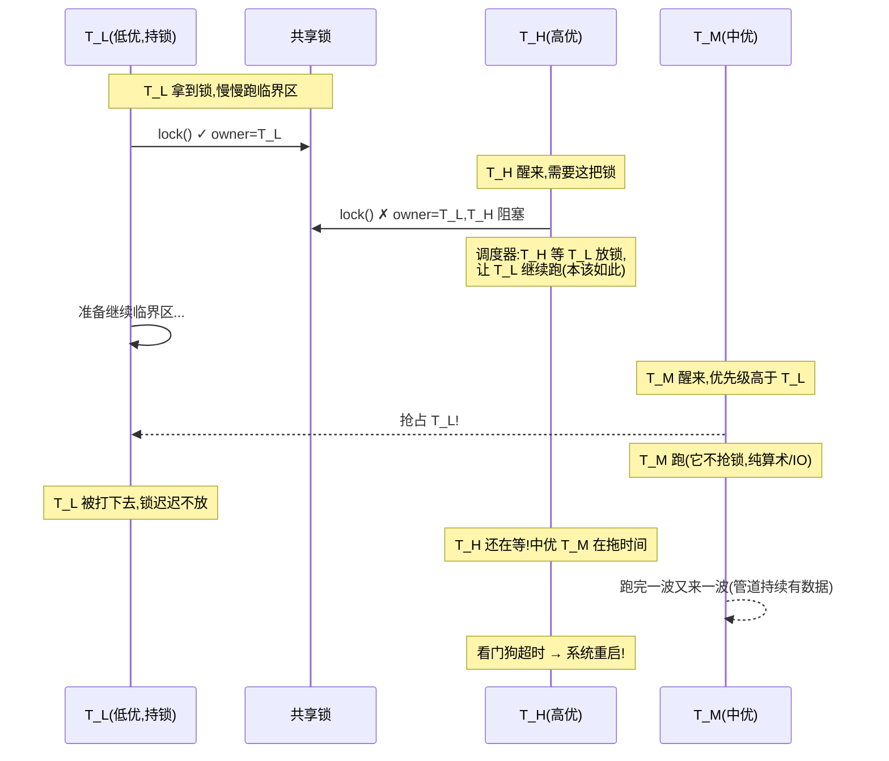
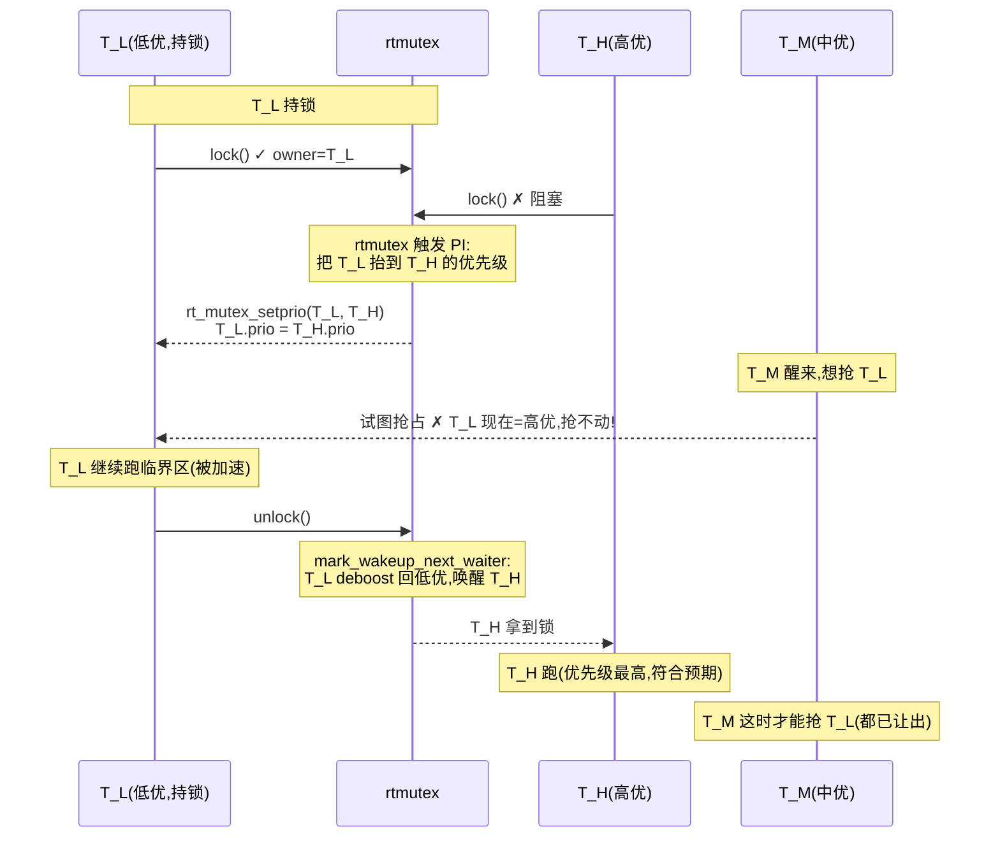
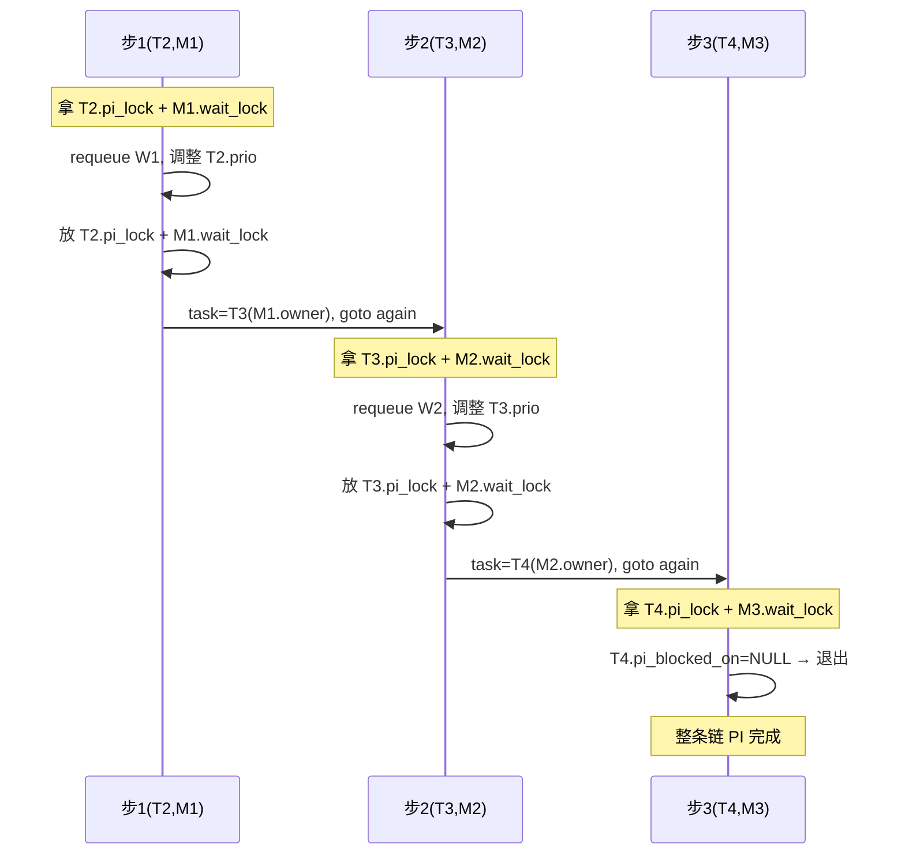
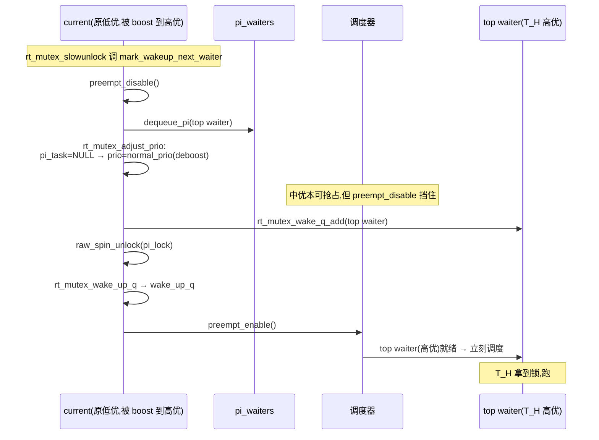

# 第九章 · rtmutex:优先级继承

> 篇:P3 阻塞锁:睡眠一极
> 主线呼应:上一章(P3-08)我们让 mutex 学会了"持锁可以睡眠"——慢路径 `schedule_preempt_disabled()` 把等锁的任务挂去 wait queue,等持锁者 `mutex_unlock` 唤醒。这是阻塞睡眠一极的本体。可一旦允许持锁者睡眠,一个阴险的故障就冒了出来:**优先级反转**(priority inversion)。低优进程持锁睡下去(或慢慢跑),高优进程等它放锁;这时一个**根本不抢这把锁**的中优进程跑来抢占低优进程——中优不参与锁竞争,却通过"把低优打下去"间接阻塞了高优。高优被中优拖死,违背"高优先跑"的实时承诺。历史上 1997 年火星探路者号(Mars Pathfinder)就在火星表面因这种 bug 反复软重启;Jupiter 探测器也踩过同类坑。本章拆 [`kernel/locking/rtmutex.c`](../linux/kernel/locking/rtmutex.c) 的解法——**优先级继承**(Priority Inheritance, PI):让持锁者**临时继承**等待者的最高优先级,中优就抢不动它,它快点放锁,高优早点拿到。核心算法是 `rt_mutex_adjust_prio_chain`——一条沿着"等待→持锁者"上传的 PI 链,链上每个持锁者都继承最高优先级。讲清它**为什么不成环、为什么继承后还能恢复**,是本章的命脉。

## 核心问题

**优先级反转是怎么发生的——中优不抢锁,凭什么把高优拖死?rtmutex 的 PI 链怎么沿"等待→持锁者"把最高优先级一层层传上去,链上每个持锁者都"临时变成高优"?这条链为什么不会无限循环(成环)?持锁者继承上去的优先级,为什么在 `rt_mutex_unlock` 之后会自动回落到原值?rtmutex 凭什么是 PREEMPT_RT 实时内核上 mutex/spinlock/rwsem 的共同底层?**

读完本章你会明白:

1. **优先级反转**的完整时序:低优持锁→中优抢占低优→高优被间接拖死。这是一个"中优不参与锁竞争,却通过调度器优先级把高优卡死"的反直觉故障。
2. **优先级继承(PI)** 的契约:持锁者临时继承等待者中的最高优先级,被抬上去后中优抢不动它,它快点放锁——这就是 rtmutex 的全部存在意义。
3. **PI 链遍历**(`rt_mutex_adjust_prio_chain`):任务 T1 等 M1(持锁者 T2),T2 又等 M2(持锁者 T3)... 链上每个持锁者都继承 T1 的优先级。算法沿链一步步走,每步只持两把锁,可抢占。
4. **PI 链为什么 sound**:等待图无环(锁有唯一 owner + 等待者 pi_blocked_on 单值)→ 链不会无限;`detect_deadlock` + `max_lock_depth=1024` 双兜底;继承的优先级在 unlock 后通过 `mark_wakeup_next_waiter` 重算回落。
5. **rtmutex 的两副面孔**:非 RT 内核里它主要被 **futex(FUTEX_LOCK_PI)** 用(下一章 P3-10);PREEMPT_RT 内核里 mutex/spinlock/rwsem 全部基于 rtmutex,保证实时性。

---

> **逃生阀**:这一章会出现 `pi_blocked_on`、`pi_waiters`(rbtree)、`pi_top_task`、`rt_mutex_adjust_prio_chain`、`task_blocks_on_rt_mutex`、`mark_wakeup_next_waiter`、PREEMPT_RT、FUTEX_LOCK_PI 等概念。如果你只听过"优先级反转"这个词却没追过 PI 链怎么走,不要慌——抓住一条主线:**rtmutex 干的全部事情,就是在 task_blocks_on_rt_mutex 时沿"等待→持锁者"走一条链,把等待者的最高优先级一路上抛,让每个持锁者临时变高优**。算法的难点不是"怎么传",而是"怎么保证这条链走得完、不成环、unlock 后能恢复"。读不懂某条锁序细节没关系,先把"低优持锁→中优抢占→高优被拖死"的反例时序和"PI 让低优变高优→中优抢不动→快点放锁"的正解时序钉死,细节回头再抠。

## 9.1 一句话点破

> **优先级反转的根,是"持锁者的调度优先级"和"锁的紧急程度"脱节——低优持锁者霸占着高优急需的锁,调度器却只看优先级办事,中优一插足就把低优打下去,高优间接被锁死。rtmutex 的解法一句话:让持锁者临时"变成"等锁的人里优先级最高的那个,于是中优抢不动它,它跑完临界区快点放锁,高优立刻接手。这套"临时继承"通过 PI 链遍历实现——任务开始等一把 rtmutex 时,内核沿"等待→持锁者"的等待图走一条链,链上每个持锁者的 `prio` 都被抬到 max(自己, 等待者最高);链的终止靠"等待图无环 + 每步重检 + max_lock_depth 兜底";unlock 时把队首唤醒、自己 deboost,优先级自然回落。PI 链是这个机制的全部精妙所在,也是本章要彻底拆透的对象。**

这是结论,不是理由。本章倒过来拆:先看优先级反转怎么把火星探路者号搞重启(9.2),再看 rtmutex 的数据结构(owner + 优先级 rbtree waiters + task 的 pi_waiters)(9.3),然后进 task_blocks_on_rt_mutex 看 PI 怎么触发(9.4),再拆 PI 链遍历的核心算法(9.5),接着看 unlock 怎么 deboost(9.6),最后讲 rtmutex 在非 RT 内核(futex PI)和 PREEMPT_RT 内核(所有锁的底层)的两副面孔(9.7)。

---

## 9.2 优先级反转:Mars Pathfinder 为什么在火星上反复重启

先看故障本身。这是 1997 年 NASA 火星探路者号真实发生过的事,后来经 Glenn Reeves(Mars Pathfinder 软件负责人)公开回顾才广为人知——它把"优先级反转"这个学术概念变成了一个差点毁掉任务的工程事故。

### 反例时序:无 PI 时,高优被中优间接拖死

假设系统里有三个任务,优先级 **高 > 中 > 低**:

- **高优 T_H**:实时控制任务(火星探路者里是总线管理 watchdog,定期喂看门狗)。
- **中优 T_M**:通信/数据管道任务(火星探路者里是气象数据上传)。
- **低优 T_L**:后台任务,偶尔拿一把共享锁做点维护。

某次执行序:



关键点:**T_M 根本不参与锁竞争**(它不需要那把锁),却通过"抢占 T_L"间接把 T_H 卡死。调度器一切照规矩办事——T_M 优先级高于 T_L,该抢就抢;T_H 优先级最高,但它睡在 wait queue 上,调度器看不见它。结果高优被中优**间接**拖死,违背"高优先跑"的承诺。

Mars Pathfinder 的具体表现:任务跑几天后就 watchdog 超时,系统整机重启。地面团队下载遥测数据后,发现每次重启前都有一段"T_H 想拿锁但拿不到"的日志。根因就是优先级反转——共享的总线锁被低优任务持有,中优的通信任务抢走了 CPU。后来 NASA 上传补丁开起了 `FUTEX_LOCK_PI`(rtmutex 的 PI 机制),问题立刻消失。

> **不这样会怎样**:如果没有 PI,实时系统里只要出现"低优持锁 + 中优抢 CPU + 高优等锁"这个组合,就会触发优先级反转。**这不是偶发 bug,是结构性故障**——只要这个组合出现,高优一定被拖。工业实时系统(航天、汽车 ADAS、工业控制)对此零容忍。这也是 POSIX 1003.1 把 `_POSIX_THREAD_PRIO_INHERIT`(`PTHREAD_PRIO_INHERIT`)写进标准的原因——用户态 pthread_mutex 也有 PI 模式,底层在 Linux 上就是 futex + rtmutex。

### 正解时序:PI 让持锁者临时变高优

rtmutex 的解法用一句话讲:**T_H 阻塞在锁上时,把持锁者 T_L 的优先级临时抬到 T_H 的优先级**。这一抬,T_M 就抢不动 T_L 了(它现在"变成了"高优),T_L 得以快速跑完临界区放锁,锁一放 T_H 立刻拿走。看正解时序:



这就是 PI 的核心契约——**持锁者被临时"染色"成等待者中的最高优先级**,让所有中优任务都抢不动它,逼迫它快点放锁。继承不是永久的:unlock 时 deboost,优先级回落。

> **钉死这件事**:优先级反转的根是"持锁者优先级"和"锁的紧急程度"脱节,PI 的解法是把两者临时绑定。rtmutex 比 mutex 多的全部东西,就是这一套 PI 链遍历 + deboost 机制。本章剩下的全部篇幅,都在拆"PI 链怎么走、为什么不成环、deboost 为什么 sound"。

---

## 9.3 数据结构:owner + 优先级 rbtree + task 的 pi_waiters

拆算法之前,先认清 rtmutex 用到的几个数据结构。它们和普通 mutex 有两处关键不同:(1) 等待队列是**按优先级排序的 rbtree**,不是 FIFO 链表;(2) 每个 task_struct 上多了 **pi_waiters**(我作为 owner,有哪些人在等我手里的锁)+ **pi_blocked_on**(我正等在谁的锁上)。这两棵树是 PI 链遍历的命脉。

### struct rt_mutex_base:owner 编码 + HAS_WAITERS 位

从 [`struct rt_mutex_base`](../linux/include/linux/rtmutex.h#L23-27)([rtmutex.h:23](../linux/include/linux/rtmutex.h#L23)):

```c
struct rt_mutex_base {
    raw_spinlock_t      wait_lock;
    struct rb_root_cached   waiters;
    struct task_struct  *owner;
};
```

字段含义:

- **`wait_lock`**:`raw_spinlock_t`,保护 `waiters` rbtree 的链表操作。注意它和 mutex 的 `wait_lock` 一样是 raw spinlock——rtmutex 内部用 spinlock 保护自己的状态机,**和"rtmutex 是睡眠锁"不矛盾**(wait_lock 只在几条指令内持有)。
- **`waiters`**:`rb_root_cached`,按优先级排序的红黑树,**缓存 leftmost 节点**(`rb_leftmost`),即最高优先级等待者。和 mutex 的 `list_head wait_list`(FIFO)截然不同——rtmutex 要按优先级唤醒,所以用 rbtree。
- **`owner`**:`struct task_struct *`,持锁者。低位编码 `RT_MUTEX_HAS_WAITERS`(bit0),见 [rtmutex_common.h:155](../linux/include/linux/rtmutex.h#L155) `#define RT_MUTEX_HAS_WAITERS 1UL`。

[`rt_mutex_owner`](../linux/kernel/locking/rtmutex_common.h#L157-162)([rtmutex_common.h:157](../linux/kernel/locking/rtmutex_common.h#L157))取 owner 时清掉低位:

```c
static inline struct task_struct *rt_mutex_owner(struct rt_mutex_base *lock)
{
    unsigned long owner = (unsigned long) READ_ONCE(lock->owner);
    return (struct task_struct *) (owner & ~RT_MUTEX_HAS_WAITERS);
}
```

这套 owner 低位编码比 mutex 简单——只有一个 bit(HAS_WAITERS),不像 mutex 有 WAITERS/HANDOFF/PICKUP 三位。原因:rtmutex 的所有操作都走 slow path(下面 9.4 详讲),不需要那么复杂的 fast/slow 通信。

```
 struct rt_mutex_base 的 owner 字段编码(64 位):

 ┌──────────────────────────────────────────────────────────────┐
 │ struct task_struct *owner                                    │
 ├──────────────────────────────────────────────────────────────┤
 │  高 63 位                     │  bit0                         │
 │  task_struct *(持锁者)        │  RT_MUTEX_HAS_WAITERS         │
 │  NULL 表示无人持锁            │  waiters rbtree 非空          │
 └──────────────────────────────────────────────────────────────┘
```

> **为什么 sound**:owner 低位编码和 mutex 同源(回扣 P3-08 的 8.7)——`task_struct` 指针至少按 L1 cache 行对齐,低位必然是 0,内核白用 bit0 存 HAS_WAITERS。`rt_mutex_owner()` 清掉 bit0 得到的就是干净的 task 指针。fast path 的 `cmpxchg_acquire(NULL → curr)` 只有在 owner 完全是 NULL 时成功——HAS_WAITERS 位的设置会强制新来者走 slow path。

### struct rt_mutex_waiter:一棵 waiter 同时在两棵 rbtree 里

rtmutex 的等待者结构 [`struct rt_mutex_waiter`](../linux/kernel/locking/rtmutex_common.h#L52-59)([rtmutex_common.h:52](../linux/kernel/locking/rtmutex_common.h#L52)):

```c
struct rt_mutex_waiter {
    struct rt_waiter_node  tree;       /* 挂进 lock->waiters */
    struct rt_waiter_node  pi_tree;    /* 挂进 owner->pi_waiters */
    struct task_struct    *task;
    struct rt_mutex_base  *lock;
    unsigned int           wake_state;
    struct ww_acquire_ctx *ww_ctx;
};
```

其中 [`struct rt_waiter_node`](../linux/kernel/locking/rtmutex_common.h#L32-36)([rtmutex_common.h:32](../linux/kernel/locking/rtmutex_common.h#L32))是排序键的载体:

```c
struct rt_waiter_node {
    struct rb_node  entry;
    int             prio;       /* 等待者的优先级(数值小=优先级高) */
    u64             deadline;   /* deadline 任务的截止期(SCHED_DEADLINE) */
};
```

**一个 waiter 同时存在于两棵 rbtree**——这是 rtmutex 设计的精髓:

- **`tree`**:挂在那把锁的 `lock->waiters` 上,排序键是等待者自己的 `prio`。这棵树用来在 unlock 时找"最高优先级等待者"(leftmost)唤醒。
- **`pi_tree`**:挂在锁的**持锁者**的 `owner->pi_waiters` 上,排序键同样来自等待者。这棵树用来回答"这个 task 当前被哪些人催着放锁"——leftmost 就是 `task_top_pi_waiter`,即"催得最急的那个",它的优先级就是 task 应该继承到的优先级。

**两棵树分别由不同的锁保护**,这是 rtmutex 锁序的根:

- `lock->waiters` 由 `lock->wait_lock` 保护。
- `task->pi_waiters` 由 `task->pi_lock` 保护。

同一段代码要先动 `lock->waiters` 再动 `owner->pi_waiters`,就要先拿 `wait_lock` 再拿 `pi_lock`。内核锁序规定([rtmutex.c 顶部注释 L629-632](../linux/kernel/locking/rtmutex.c#L629)):`rtmutex->wait_lock → task->pi_lock`——拿 wait_lock 之后才能拿 pi_lock。9.5 会看到 PI 链遍历怎么小心绕开锁序反转。

> **为什么 sound**:一个 waiter 有两份排序键(`tree` 和 `pi_tree`),因为它们进入两棵由不同锁保护的 rbtree,排序键的更新必须独立。`waiter_update_prio` 更新 `tree` 副本([rtmutex.c:359-367](../linux/kernel/locking/rtmutex.c#L359)),`waiter_clone_prio` 从 `tree` 副本复制到 `pi_tree` 副本([rtmutex.c:372-381](../linux/kernel/locking/rtmutex.c#L372))。两份副本各自由所在树的锁保护,更新时不会撕裂。这是 rtmutex 在多核并发下正确的根。

### task_struct 上的 pi 字段

每个任务 task_struct 上有四个与 PI 相关的字段([sched.h:1144-1154](../linux/include/linux/sched.h#L1144)):

```c
raw_spinlock_t         pi_lock;        /* L1144:保护本任务的 pi 状态 */
struct rb_root_cached  pi_waiters;     /* L1150:我在持锁期间,谁在等我(pi_tree 挂这) */
struct task_struct    *pi_top_task;    /* L1152:pi_waiters 的 leftmost 对应的 task(缓存) */
struct rt_mutex_waiter *pi_blocked_on; /* L1154:我正阻塞在哪个 waiter 上(单值!) */
```

- **`pi_lock`**:保护本任务的 `pi_waiters`、`pi_blocked_on`、`pi_top_task`。注意每个任务都有自己的 `pi_lock`,所以多核同时调 PI 链时不会全挤一把锁——每个任务一把。
- **`pi_waiters`**:我作为 owner 时,所有催我放锁的等待者(按优先级排序)。leftmost 是 `task_top_pi_waiter`,即"我该继承到谁的优先级"。
- **`pi_top_task`**:`pi_waiters` leftmost 对应的 task 指针(缓存,避免每次都去查 rbtree)。`rt_mutex_setprio` 会用它做快速判断(不变就 deboost 跳过,[core.c:7164](../linux/kernel/sched/core.c#L7164))。
- **`pi_blocked_on`**:**单值**。我当前阻塞在哪个 `rt_mutex_waiter` 上。这个字段是 PI 链遍历的命脉——`rt_mutex_adjust_prio_chain` 靠它知道"这个 task 还在不在链上、在哪把锁的 waiter 上"(9.5 详讲)。

> **为什么 `pi_blocked_on` 是单值**:一个任务同一时刻只能阻塞在一把锁上(它只能在一个 wait queue 上睡)。这是 PI 链**不会分叉**的根——链上每个节点只有一个"我现在阻塞在哪",所以从 T_H 出发追"等锁 → 持锁者 → 持锁者又等什么锁",是一条**线性链**,不是树。这个线性性是 PI 链遍历能终止的关键之一(9.5 详讲)。

### 排序键:prio + deadline

[`rt_waiter_node_less`](../linux/kernel/locking/rtmutex.c#L391-407)([rtmutex.c:391](../linux/kernel/locking/rtmutex.c#L391))定义了 rbtree 的排序规则:

```c
static __always_inline int rt_waiter_node_less(struct rt_waiter_node *left,
                                                struct rt_waiter_node *right)
{
    if (left->prio < right->prio)
        return 1;
    /* prio 数值小 = 优先级高,所以 left 优先级更高就排前 */
    if (dl_prio(left->prio))
        return dl_time_before(left->deadline, right->deadline);
    return 0;
}
```

排序规则:(1) `prio` 数值小的排前(内核里 prio 值小=优先级高,SCHED_FIFO 的 prio 在 1~99);(2) 同 prio 下,如果是 deadline 任务(SCHED_DEADLINE),按 deadline 早的排前。这棵 rbtree 的 leftmost 永远是"最该被唤醒/最该被继承"的那个等待者。

注意 [`__waiter_prio`](../linux/kernel/locking/rtmutex.c#L346-354)([rtmutex.c:346](../linux/kernel/locking/rtmutex.c#L346)):

```c
static __always_inline int __waiter_prio(struct task_struct *task)
{
    int prio = task->prio;
    if (!rt_prio(prio))
        return DEFAULT_PRIO;
    return prio;
}
```

非 RT 任务(普通 SCHED_NORMAL 的 prio 是 DEFAULT_PRIO=120)在 rtmutex 的 rbtree 里被强制当作 DEFAULT_PRIO——**这意味着 rtmutex 主要服务 RT 任务**。普通任务也能用 rtmutex(它的 prio 全映射到 DEFAULT_PRIO,按 FIFO 排队),但 PI 的价值(高优 vs 低优)只在 RT 任务间体现。

> **钉死这件事**:rtmutex 的数据结构为 PI 而生——锁里按优先级排序的 `waiters` rbtree,task 里按优先级排序的 `pi_waiters` rbtree,两者靠 `pi_blocked_on` 这条单值反向指针串起来。这套结构让"谁在催我放锁"(pi_waiters)和"我正等在谁那"(pi_blocked_on)都是 O(1) 或 O(log N) 可查的,PI 链遍历才得以高效。

---

## 9.4 task_blocks_on_rt_mutex:任务开始等一把 rtmutex,PI 触发点

现在拆算法。先看 PI 的入口——[`task_blocks_on_rt_mutex`](../linux/kernel/locking/rtmutex.c#L1200-1300)([rtmutex.c:1200](../linux/kernel/locking/rtmutex.c#L1200))。这个函数在任务 **T 开始等一把 rtmutex** 时被调用,它做三件事:(1) 把 waiter 挂进锁的 `waiters` 树;(2) 如果 T 是最高优先级等待者,把自己挂进持锁者的 `pi_waiters` 树,并调 `rt_mutex_adjust_prio` 抬升持锁者优先级;(3) 如果持锁者本身也在等另一把锁,触发 PI 链遍历。

逐段看。**入口**:

```c
static int __sched task_blocks_on_rt_mutex(struct rt_mutex_base *lock,
                                            struct rt_mutex_waiter *waiter,
                                            struct task_struct *task,
                                            struct ww_acquire_ctx *ww_ctx,
                                            enum rtmutex_chainwalk chwalk)
{
    struct task_struct *owner = rt_mutex_owner(lock);
    struct rt_mutex_waiter *top_waiter = waiter;
    struct rt_mutex_base *next_lock;
    int chain_walk = 0, res;

    /* 早死锁检测:任务等自己持有的锁 */
    if (owner == task && !(build_ww_mutex() && ww_ctx))
        return -EDEADLK;
    ...
```

第一件事——**早死锁检测**:如果锁的 owner 就是我自己,直接返回 `-EDEADLK`,不要 enqueue 到自己上。这是个优化,也是正确性兜底(9.5 会讲链上的死锁检测)。

**第二件事——把 waiter 挂进 lock 的 waiters 树,设 pi_blocked_on**:

```c
    raw_spin_lock(&task->pi_lock);
    waiter->task = task;
    waiter->lock = lock;
    waiter_update_prio(waiter, task);     /* 用 task 的 prio 填 waiter->tree.prio */
    waiter_clone_prio(waiter, task);      /* 从 tree 复制到 pi_tree */

    if (rt_mutex_has_waiters(lock))
        top_waiter = rt_mutex_top_waiter(lock);  /* 记下原 leftmost */
    rt_mutex_enqueue(lock, waiter);              /* 挂进 lock->waiters */

    task->pi_blocked_on = waiter;                /* ← 命脉:我正阻塞在这个 waiter 上 */

    raw_spin_unlock(&task->pi_lock);
```

注意三件事:

1. **waiter 同时填两份排序键**:`waiter_update_prio` 填 `tree.prio`,`waiter_clone_prio` 复制到 `pi_tree.prio`。两份分别由 `wait_lock` 和 `pi_lock` 保护,独立更新。
2. **挂 `lock->waiters` 树**:`rt_mutex_enqueue` 按 prio 插入 rbtree。
3. **`task->pi_blocked_on = waiter`**:这就是 PI 链的反向指针——"我现在阻塞在这个 waiter 上"。注意它只持 `task->pi_lock` 设这一个字段,因为这是 task 自己的状态。

**第三件事——如果我是新 leftmost,把自己挂进 owner 的 pi_waiters,抬升 owner 优先级**:

```c
    if (!owner)
        return 0;     /* 锁没主(可能 unlock 正进行),直接走,会被 retry */

    raw_spin_lock(&owner->pi_lock);
    if (waiter == rt_mutex_top_waiter(lock)) {
        /* 我成了新 leftmost!替换 owner->pi_waiters 里的旧 leftmost */
        rt_mutex_dequeue_pi(owner, top_waiter);
        rt_mutex_enqueue_pi(owner, waiter);

        rt_mutex_adjust_prio(lock, owner);   /* ← 抬升 owner 优先级 */
        if (owner->pi_blocked_on)
            chain_walk = 1;                   /* owner 也在等别的锁,要追链 */
    } else if (rt_mutex_cond_detect_deadlock(waiter, chwalk)) {
        chain_walk = 1;
    }

    next_lock = task_blocked_on_lock(owner);  /* owner 等在哪把锁上 */
    raw_spin_unlock(&owner->pi_lock);

    if (!chain_walk || !next_lock)
        return 0;
```

关键在 `rt_mutex_adjust_prio(lock, owner)`——这就是 PI 抬升动作。看它的实现 [`rt_mutex_adjust_prio`](../linux/kernel/locking/rtmutex.c#L524-537)([rtmutex.c:524](../linux/kernel/locking/rtmutex.c#L524)):

```c
static __always_inline void rt_mutex_adjust_prio(struct rt_mutex_base *lock,
                                                  struct task_struct *p)
{
    struct task_struct *pi_task = NULL;

    if (task_has_pi_waiters(p))
        pi_task = task_top_pi_waiter(p)->task;   /* 取 pi_waiters leftmost 对应的 task */

    rt_mutex_setprio(p, pi_task);   /* 实际抬升 */
}
```

就这么几句。`pi_task` 就是"催得最急的那个等待者"——`p->pi_waiters` 的 leftmost 对应的 task。然后调 [`rt_mutex_setprio`](../linux/kernel/sched/core.c#L7150)([core.c:7150](../linux/kernel/sched/core.c#L7150)),把 `p` 的 `prio` 改成 `pi_task` 的优先级。这个函数在 `kernel/sched/core.c` 里——**PI 抬升最终落到调度器**,改 prio、重入队、可能触发抢占。这就是"持锁者临时变高优"的全部动作。

> **为什么 sound**:`rt_mutex_adjust_prio` 取的是 **pi_waiters 的 leftmost**(优先级最高的等待者)。如果新 waiter 不是 leftmost(它优先级比现有 leftmost 低),就不动 owner 的优先级——因为 owner 已经被至少这么高的优先级抬着了,加一个更低的催的人不影响继承值。这就是 PI 的"取 max"语义:**owner 继承的是所有等待者的最高优先级**,不是平均,不是求和。新来个低优的催的人,不会把 owner 的优先级拉低。

**第四件事——如果 owner 自己也在等别的锁,触发 PI 链遍历**:

```c
    /* owner 还在等别的锁(next_lock),把 owner 当新 task 继续追链 */
    get_task_struct(owner);    /* ↑ 持引用,防止 owner 跑没了 */
    raw_spin_unlock_irq(&lock->wait_lock);    /* 放掉 wait_lock,链上要拿别的锁 */

    res = rt_mutex_adjust_prio_chain(owner, chwalk, lock,
                                     next_lock, waiter, task);

    raw_spin_lock_irq(&lock->wait_lock);    /* 追完链重新拿 */
    return res;
```

注意这里把 `lock->wait_lock` **放掉**了——因为 PI 链遍历要拿链上每把锁的 `wait_lock`,如果一直持着当前锁的 wait_lock 走链,会违反锁序(链上的锁没有固定顺序)。所以策略是:**每走一步放掉当前 wait_lock,拿下一步的 wait_lock**,这就是 9.5 要讲的"逐步 walk"。

> **钉死这件事**:`task_blocks_on_rt_mutex` 是 PI 的单步触发器——它只处理"我直接阻塞在这把锁上"这一步,做完三件事(挂 waiters 树、设 pi_blocked_on、可能抬升 owner 优先级)。如果 owner 自己也在等别的锁,它把 owner 交给 `rt_mutex_adjust_prio_chain` 继续追链。**PI 是接力,不是一锤子买卖**——每一步只动一把锁、抬一个 owner,链上多步连起来才是完整 PI。

---

## 9.5 技巧精解(一):PI 链遍历 `rt_mutex_adjust_prio_chain`

这是本章最硬核的技巧。一个等待链可能是:

```
T1 等 M1(持锁者 T2),T2 等 M2(持锁者 T3),T3 等 M3(持锁者 T4)...
```

T1 的优先级要传到 T2、T3、T4 每一个——因为 T1 被 T2 拖,T2 被 T3 拖,T3 被 T4 拖,只要任何一个中间持锁者被中优抢占,整条链都被拖。所以 PI 要**沿链一路上抛**。这就是 `rt_mutex_adjust_prio_chain` 干的事。算法难点不在"怎么传",而在:**怎么保证链走得完、不成环、每步只持两把锁不冲突**。

### PI 链:从 T1 沿"等待→持锁者"上传

先用图把 PI 链结构钉死:

```mermaid
flowchart LR
    T1["T1(高优)<br/>pi_blocked_on→W1"]
    W1["W1<br/>(M1 的 waiter)"]
    M1["M1<br/>owner=T2"]
    T2["T2(中优)<br/>pi_blocked_on→W2"]
    W2["W2<br/>(M2 的 waiter)"]
    M2["M2<br/>owner=T3"]
    T3["T3(低优)<br/>pi_blocked_on=NULL<br/>(没等别的锁)"]
    T1 -.阻塞.-> W1
    W1 -.属于.-> M1
    M1 -.owner.-> T2
    T2 -.继承 T1.prio.-> T2
    T2 -.阻塞.-> W2
    W2 -.属于.-> M2
    M2 -.owner.-> T3
    T3 -.继承 T1.prio.-> T3
    classDef task fill:#dbeafe,stroke:#2563eb
    classDef waiter fill:#fef3c7,stroke:#d97706
    classDef lock fill:#dcfce7,stroke:#16a34a
    class T1,T2,T3 task
    class W1,W2 waiter
    class M1,M2 lock
```

T1 阻塞在 M1 上(owner=T2)→ T2 阻塞在 M2 上(owner=T3)→ T3 不等任何锁(链到头)。PI 链遍历从 T2 开始(因为 task_blocks_on_rt_mutex 已经处理了 T1→T2 这一步),沿"owner 等什么锁 → 那锁的 owner"一路走,把 T1 的优先级一路上抛给 T2、T3。

### 算法的核心循环结构

[`rt_mutex_adjust_prio_chain`](../linux/kernel/locking/rtmutex.c#L675-1071)([rtmutex.c:675](../linux/kernel/locking/rtmutex.c#L675))有 1100 多行注释 + 代码,看着吓人,结构其实是 `again: → retry: → [1..13] → goto again` 的循环。每轮做四件事:(1) 锁住当前 task 的 pi_lock,读它的 `pi_blocked_on`;(2) 检查退出条件(链到头/状态变了/优先级已够高);(3) 拿到下一步的 wait_lock,做 requeue(更新 waiter 在 rbtree 的位置)和 adjust_prio(抬升 owner);(4) 放掉当前锁,owner 变新 task,`goto again`。

把骨架抽出来(简化,非源码原文):

```c
static int __sched rt_mutex_adjust_prio_chain(struct task_struct *task, ...)
{
    int depth = 0;
    struct rt_mutex_waiter *waiter, *top_waiter = orig_waiter;
    struct rt_mutex_base *lock;
    ...

again:
    if (++depth > max_lock_depth) {   /* max_lock_depth=1024 兜底 */
        ...
        return -EDEADLK;
    }

retry:
    raw_spin_lock_irq(&task->pi_lock);              /* [1] */

    waiter = task->pi_blocked_on;                    /* [2] 当前 task 等在哪个 waiter */
    /* [3] 检查退出条件 1(详见下) */
    if (!waiter) goto out_unlock_pi;
    if (orig_waiter && !rt_mutex_owner(orig_lock)) goto out_unlock_pi;
    if (next_lock != waiter->lock) goto out_unlock_pi;
    if (top_waiter && !task_has_pi_waiters(task)) goto out_unlock_pi;
    ...

    /* [4] 拿到 task 等的那把锁 */
    lock = waiter->lock;

    /* [5] trylock 锁的 wait_lock(避免锁序反转) */
    if (!raw_spin_trylock(&lock->wait_lock)) {
        raw_spin_unlock_irq(&task->pi_lock);
        cpu_relax();
        goto retry;
    }

    /* [6] 死锁检测:当前锁是 orig_lock,或 owner 是 top_task → -EDEADLK */
    if (lock == orig_lock || rt_mutex_owner(lock) == top_task) {
        ret = -EDEADLK;
        ...
    }

    /* [7] requeue waiter:更新它在 lock->waiters 树里的位置(可能优先级变了) */
    rt_mutex_dequeue(lock, waiter);
    waiter_update_prio(waiter, task);
    rt_mutex_enqueue(lock, waiter);

    /* [8] 放掉当前 task 的 pi_lock,放 task 引用 */
    raw_spin_unlock(&task->pi_lock);
    put_task_struct(task);

    /* [9] 锁没主了?链到头 */
    if (!rt_mutex_owner(lock)) { ... return 0; }

    /* [10] 拿到锁的 owner,作为下一步的 task */
    task = get_task_struct(rt_mutex_owner(lock));
    raw_spin_lock(&task->pi_lock);

    /* [11] 如果 waiter 是 leftmost,把它挂进 owner 的 pi_waiters,抬升 owner 优先级 */
    if (waiter == rt_mutex_top_waiter(lock)) {
        rt_mutex_dequeue_pi(task, prerequeue_top_waiter);
        waiter_clone_prio(waiter, task);
        rt_mutex_enqueue_pi(task, waiter);
        rt_mutex_adjust_prio(lock, task);     /* ← 抬升 owner */
    } else if (prerequeue_top_waiter == waiter) {
        /* waiter 原是 leftmost,现在不是了:换新 leftmost 进 owner 的 pi_waiters */
        ...
        rt_mutex_adjust_prio(lock, task);
    }

    /* [12] 准备下一步 */
    next_lock = task_blocked_on_lock(task);
    top_waiter = rt_mutex_top_waiter(lock);

    /* [13] 放掉所有锁 */
    raw_spin_unlock(&task->pi_lock);
    raw_spin_unlock_irq(&lock->wait_lock);

    if (!next_lock) goto out_put_task;     /* owner 没等别的锁,链到头 */
    ...
    goto again;
}
```

这就是 PI 链遍历的全部骨架。每轮用一个 task、一把 lock、一个 waiter,把 owner 抬升后,owner 变新 task,继续追。

### 退出条件:链为何不会无限

**PI 链遍历为什么不成环、不会无限循环?** 这是本章最关键的 sound 性。内核用了**四道防线**,层层兜底:

#### 防线一:等待图本身的结构保证(无环的根本)

锁等待图天然倾向于无环:每把 rtmutex 有**唯一 owner**(`lock->owner` 单值),每个 task 同一时刻**只阻塞在一把锁上**(`task->pi_blocked_on` 单值)。所以从任意 task 出发,沿"阻塞 → 锁 → owner → 阻塞 → 锁 → owner..."走,是一条**线性链**,不是树,更不会成环(成环要求某 task 同时等两把锁,或者某锁有两个 owner,都不可能)。

> **不这样会怎样**:如果允许一个 task 同时阻塞在多把锁上(像 rwsem 那种共享等待),等待图就成分叉的树,PI 链遍历要 BFS/DFS 整棵树,复杂度爆炸;更糟的是,如果允许锁有多个 owner(共享锁),等待图可能成环,A 等 B,B 等 A,PI 链就死循环。**rtmutex 用"唯一 owner + 单值 pi_blocked_on"的结构,把等待图限制成线性链**,这是 PI 能高效、不成环的根。

#### 防线二:逐步重检(链状态可能在两步之间变化)

注意 `rt_mutex_adjust_prio_chain` 在每一步之间会**放掉所有锁**([13] 处)。这意味着两步之间,链的状态可能变化:owner 可能 unlock 了、task 可能被信号打断了、waiter 可能被别的路径 dequeue 了。所以每一步 `retry` 都要重新读状态、重新检查退出条件——这就是 [3] 处那一堆 `if (...) goto out_unlock_pi` 的用意:

- `if (!waiter)`:task 不再阻塞在任何 waiter 上(它可能被唤醒了)。退出。
- `if (orig_waiter && !rt_mutex_owner(orig_lock))`:**触发这次 PI 链的原始锁已经没主了**(持锁者 unlock 了)。这意味着 T1 可能已经拿到锁,整条链的继承意义消失。退出。
- `if (next_lock != waiter->lock)`:**task 移到别的锁上等了**(链结构变了)。我们之前存的 `next_lock` 失效。退出——因为 PI 已经被这次链遍历修改过,新的链结构会被新触发的一次 PI 重新处理。
- `if (top_waiter && !task_has_pi_waiters(task))`:task 已经没有 pi_waiters 了(deboost 到位)。退出。
- `if (rt_waiter_node_equal(&waiter->tree, task_to_waiter_node(task)))`:waiter 的优先级和 task 当前优先级一样,**没有进一步 PI 调整必要**(task 已经被至少这么高优先级抬着了)。退出。

**这些退出条件层层把守**,保证链不会无意义地走下去。

#### 防线三:死锁检测(`detect_deadlock`)

如果配置了 `CONFIG_DEBUG_RT_MUTEXES`,或者调用方传了 `RT_MUTEX_FULL_CHAINWALK`(futex PI 就是这种),`detect_deadlock` 会启用。在 [6] 处:

```c
if (lock == orig_lock || rt_mutex_owner(lock) == top_task) {
    ret = -EDEADLK;
    ...
}
```

两个条件:当前锁就是触发链的原始锁(绕一圈回来了)、当前锁的 owner 是发起链的 top_task——都意味着**等待图出现了环**,立刻返回 `-EDEADLK`。这是对防线一的运行时验证。

注意 `task_blocks_on_rt_mutex` 入口的早检测(L1225):

```c
if (owner == task && !(build_ww_mutex() && ww_ctx))
    return -EDEADLK;
```

任务等自己持有的锁直接拒,不进链。

#### 防线四:`max_lock_depth` 兜底

[`max_lock_depth = 1024`](../linux/kernel/locking/rtmutex_api.c#L14)([rtmutex_api.c:14](../linux/kernel/locking/rtmutex_api.c#L14))是绝对兜底——`if (++depth > max_lock_depth) return -EDEADLK;`。即使前面三道防线都失守(理论上不该发生,但 ww_mutex 等特殊场景可能制造伪环),也不会无限循环,直接返回错误并打 warning。这个值可通过 sysctl 调(`/proc/sys/kernel/max_lock_depth`)。

> **为什么 sound**(PI 链终止的完整论证):**结构上**——等待图是线性链(单 owner + 单 pi_blocked_on);**逻辑上**——每步重检 5 个退出条件,任一满足就退;**异常上**——死锁检测发现环立刻返回 `-EDEADLK`;**绝对兜底**——`max_lock_depth=1024` 硬上限。四道防线叠加,保证 `rt_mutex_adjust_prio_chain` 一定终止。**这就是"PI 链不成环"的工程根**。

### 锁序:为什么每步只持两把锁

PI 链遍历的锁序约束很严:每一步**最多持两把锁**——当前 task 的 `pi_lock` + 当前 lock 的 `wait_lock`。锁序规定([rtmutex.c:629-632](../linux/kernel/locking/rtmutex.c#L629)):`wait_lock → pi_lock`(wait_lock 在外,pi_lock 在内)。

但 PI 链遍历需要"先拿 task 的 pi_lock,再拿锁的 wait_lock"——这是**反序**!所以 [5] 用 `raw_spin_trylock` 而不是 `raw_spin_lock`:

```c
/* [5] We need to trylock here as we are holding task->pi_lock,
 * which is the reverse lock order versus the other rtmutex operations.
 */
if (!raw_spin_trylock(&lock->wait_lock)) {
    raw_spin_unlock_irq(&task->pi_lock);
    cpu_relax();
    goto retry;
}
```

trylock 失败(别人已经拿了 wait_lock)就放掉 pi_lock 重试——这是为了避免反序死锁。注释里写得很清楚:"the reverse lock order versus the other rtmutex operations"。**持有 `task->pi_lock` 期间,task 不会被卸载(生命周期保证),所以即使 trylock 失败重试,task 还在**——这是反序能 sound 的根。

> **为什么 sound**(反序不死锁):常规 rtmutex 操作锁序是 `wait_lock → pi_lock`。PI 链遍历因为要"先看 task 等什么,再拿那个锁",必须反序。用 `trylock` 避免反序死锁——拿不到就放掉已持有的 pi_lock 重试,绝不阻塞在 wait_lock 上。**持 pi_lock 期间 task 生命周期受 pi_lock 自身保护**,trylock 失败也不会让 task 跑没了。这种"持 A 拿 B,反序时用 trylock"是内核里处理反向锁序的标准技巧——rwsem 的乐观读、内存分配器的某些路径也用。

### 反例:朴素 BFS 遍历会撞什么墙

为了衬托这套设计的妙处,看反例。假设朴素的 PI 实现是:**一次拿住链上所有锁,然后走整条链**。

```c
// 朴素反例(非源码,仅示意)
void naive_pi_chain(struct task_struct *start) {
    /* 一次性锁住链上所有 wait_lock */
    List locks = collect_all_locks_on_chain(start);   /* ← 撞墙 1 */
    for (lock in locks) raw_spin_lock(&lock->wait_lock);

    /* 走链,更新所有 owner 优先级 */
    for (task in chain) {
        rt_mutex_adjust_prio(task_current_lock, task);
    }

    /* 一次性解锁 */
    for (lock in locks) raw_spin_unlock(&lock->wait_lock);
}
```

这套会撞三堵墙:

1. **收集锁要遍历链,但遍历链就要拿锁**——鸡和蛋。`collect_all_locks_on_chain` 不拿锁就读链,会读到撕裂数据;拿锁就陷入死循环。
2. **一次持 N 把 wait_lock**,锁序无法保证。链上锁的获取顺序无规律,极易死锁。
3. **持锁时间过长**——链有 N 步,持所有锁 N 步的时间,期间所有相关的 rtmutex 操作都被阻塞,实时性崩。

内核的实际做法是**逐步 walk**——每步只持当前 task 的 pi_lock + 当前 lock 的 wait_lock,做完 [7][11] 立刻放掉([8][13]),下一步重新拿。这样:

- 任意时刻最多持两把锁。
- 持锁时间是单步,极短。
- 每步可抢占(代码里有 `preempt_disable` 的地方都成对)。



> **钉死这件事**:PI 链遍历是逐步 walk,不是一次拿住所有锁。每步只持当前 task 的 pi_lock + 当前 lock 的 wait_lock,做完立刻放,下一步重新拿。这种设计让任意时刻最多持两把锁,持锁时间极短,可抢占。同时用 trylock 处理反向锁序,用四道防线保证链终止。

---

## 9.6 unlock 与 deboost:继承的优先级为何会回落

讲完了 boost(抬升),讲 deboost(回落)。继承上去的优先级,在 `rt_mutex_unlock` 之后必须自动恢复——否则持锁者永久变高优,系统优先级全乱。这是 PI sound 性的另一半。

### mark_wakeup_next_waiter:deboost 的核心

unlock 慢路径 [`rt_mutex_slowunlock`](../linux/kernel/locking/rtmutex.c#L1407-1466)([rtmutex.c:1407](../linux/kernel/locking/rtmutex.c#L1407))在发现有等待者时,调 [`mark_wakeup_next_waiter`](../linux/kernel/locking/rtmutex.c#L1308-1352)([rtmutex.c:1308](../linux/kernel/locking/rtmutex.c#L1308)):

```c
static void __sched mark_wakeup_next_waiter(struct rt_wake_q_head *wqh,
                                             struct rt_mutex_base *lock)
{
    struct rt_mutex_waiter *waiter;

    raw_spin_lock(&current->pi_lock);

    waiter = rt_mutex_top_waiter(lock);   /* 取 leftmost = 最高优先级等待者 */

    /* 从 current->pi_waiters 移除 waiter,deboost */
    rt_mutex_dequeue_pi(current, waiter);
    rt_mutex_adjust_prio(lock, current);  /* ← deboost:重算 current 优先级 */

    /* 锁仍有等待者(新 leftmost 顶上),保留 HAS_WAITERS 位 */
    lock->owner = (void *) RT_MUTEX_HAS_WAITERS;

    /* 命脉:deboost 后 preempt_disable,等唤醒 top waiter 之后再 preempt_enable */
    preempt_disable();
    rt_mutex_wake_q_add(wqh, waiter);
    raw_spin_unlock(&current->pi_lock);
}
```

三个动作:

1. **从 `current->pi_waiters` 移除最高优先级 waiter**:`rt_mutex_dequeue_pi(current, waiter)`。这个 waiter 即将被唤醒拿锁,它不再是 current 的催锁人。
2. **`rt_mutex_adjust_prio(lock, current)`**:**重算 current 的优先级**。回到 9.4 的 `rt_mutex_adjust_prio`——它取 `pi_waiters` 当前 leftmost(移除原 leftmost 后的新 leftmost),调 `rt_mutex_setprio(current, new_pi_task)`。**如果 pi_waiters 空了,`pi_task=NULL`,`rt_mutex_setprio` 会把 current 的 prio 恢复到 `normal_prio`**(原始优先级)。这就是 deboost。
3. **唤醒 top waiter**:`rt_mutex_wake_q_add(wqh, waiter)` 把 top waiter 加到 wake queue,稍后 `rt_mutex_wake_up_q` 统一唤醒。

> **为什么继承的优先级会恢复**:`rt_mutex_setprio(p, NULL)` 时([core.c:7159](../linux/kernel/sched/core.c#L7159))`prio = __rt_effective_prio(NULL, p->normal_prio)`,即"没有 pi_task 时,回到 `normal_prio`"。**`normal_prio` 是任务原始的调度优先级,不被 PI 改动**。所以 `rt_mutex_adjust_prio` 在 pi_waiters 清空时,自然把 prio 落回 normal_prio。这就是 deboost 的完整机制——不是显式"恢复",而是"重算时 pi_task 为空,自然回落"。这种"重算而非记账"的设计,避免了维护"原优先级副本"的额外状态。

### preempt_disable 的命脉:deboost 后到唤醒前的窗口

`mark_wakeup_next_waiter` 里有一段极其关键的注释([rtmutex.c:1338-1348](../linux/kernel/locking/rtmutex.c#L1338)):

```c
    /*
     * We deboosted before waking the top waiter task such that we don't
     * run two tasks with the 'same' priority (and ensure the
     * p->pi_top_task pointer points to a blocked task). This however can
     * lead to priority inversion if we would get preempted after the
     * deboost but before waking our donor task, hence the preempt_disable()
     * before unlock.
     */
    preempt_disable();
```

这段话讲了一个**反直觉的细节**:**deboost 必须先于唤醒 top waiter**——否则会出现"两个任务同优先级"(current 还在继承的高优,新唤醒的 top waiter 也是这个高优),调度器选择哪个跑不确定,可能选错(选了 current 继续跑,top waiter 白被唤醒)。但先 deboost 又有风险:**current 一旦被 deboost 回低优,中优立刻能抢占它,抢占发生在"current 还没唤醒 top waiter 之前"——top waiter 仍然睡,而 current 被中优打下去,高优 top waiter 间接又被拖**。这就是注释说的 "priority inversion if we would get preempted after the deboost but before waking"。

解法:`preempt_disable()` 在 deboost 之前,`preempt_enable()` 在唤醒之后(在 [`rt_mutex_wake_up_q`](../linux/kernel/locking/rtmutex.c#L560-573) 的末尾 L572)。这样 deboost → 唤醒 top waiter 的整个窗口里,**current 不会被抢占**,top waiter 一定被 wake 进就绪队列。然后 preempt_enable 时,调度器看到 top waiter(高优)就绪,立刻切过去。



> **为什么 sound**:deboost 和唤醒的顺序是个微妙的折衷——先 deboost 后唤醒会暴露"被中优抢占"的窗口;先唤醒后 deboost 会出现"两个同优先级任务"。内核的解法是 `preempt_disable` 把这个窗口封死——deboost 后到唤醒前的间隙,本 CPU 不响应抢占。**代价是这段窗口禁了抢占(几十条指令),换的是 PI 的正确性**。这种"关键窗口 preempt_disable"是内核里常见手法,调度器切换、RCU 宽限期切换都类似。

### deboost 是否触发链式 deboost

注意:当 current 被 deboost,它自己如果也阻塞在别的锁上(它是另一把锁的 waiter),它的 deboost 也会影响那把锁的 owner 的 pi_waiters——理论上要重新计算那 owner 的优先级(可能也降)。这是怎么处理的?

答案在 `mark_wakeup_next_waiter` **不直接处理链式 deboost**,因为 unlock 路径下 current 是**正在运行的任务**(它在调 unlock,没阻塞)。deboost 只改 current 自己的 prio,不影响别人。如果 current 后来又去等别的锁,那次 `task_blocks_on_rt_mutex` 会重新走 PI 链,带上新的(已回落的)优先级。

链式 deboost 发生在另一种场景:**waiter 主动放弃等待**(`remove_waiter`,[rtmutex.c:1535](../linux/kernel/locking/rtmutex.c#L1535),信号/超时时触发)。那里有完整的 PI 链反向走,deboost 沿链上传。机制对称——只是入口不同。

> **钉死这件事**:deboost 是 PI 的另一半 sound 性——unlock 时 top waiter 从 owner 的 pi_waiters 移除,`rt_mutex_adjust_prio` 重算 owner 优先级(pi_waiters 空了就回 `normal_prio`)。deboost 和唤醒 top waiter 之间的窗口用 `preempt_disable` 封死,防止 current 在 deboost 后被中优抢占、导致 top waiter 唤醒丢失。继承的优先级不靠"记账",靠"重算"——这套设计简洁且 sound。

---

## 9.7 rtmutex 的两副面孔:futex PI 与 PREEMPT_RT

讲完了 rtmutex 本身的算法,看它的应用场景。rtmutex 在 Linux 内核里有**两副面孔**,理解这点对把它和 mutex/futex 的关系理清至关重要。

### 面孔一:非 RT 内核里,rtmutex 主要被 futex PI 用

在你日常跑的普通服务器内核(`CONFIG_PREEMPT_NOT_RT` 或 `CONFIG_PREEMPT_VOLUNTARY`)里,rtmutex 不是直接给业务代码用的。它主要被 **futex 的 FUTEX_LOCK_PI** 用——也就是用户态 `pthread_mutexattr_setprotocol(PTHREAD_PRIO_INHERIT)` 的 pthread_mutex。这条路径:

```c
// 用户态(简化)
pthread_mutex_t m;
pthread_mutexattr_t attr;
pthread_mutexattr_init(&attr);
pthread_mutexattr_setprotocol(&attr, PTHREAD_PRIO_INHERIT);  /* ← 启用 PI */
pthread_mutex_init(&m, &attr);
pthread_mutex_lock(&m);   /* ← 内核里走 futex(FUTEX_LOCK_PI),底层 rtmutex */
```

rtmutex_api.c 里专门有一组 futex 接口([rtmutex_api.c:148-200](../linux/kernel/locking/rtmutex_api.c#L148)):

- [`rt_mutex_futex_trylock`](../linux/kernel/locking/rtmutex_api.c#L148):futex PI 锁的 trylock。
- [`__rt_mutex_futex_unlock`](../linux/kernel/locking/rtmutex_api.c#L165):futex PI 锁的 unlock。
- [`rt_mutex_start_proxy_lock`](../linux/kernel/locking/rtmutex_api.c#L339)/[`rt_mutex_wait_proxy_lock`](../linux/kernel/locking/rtmutex_api.c#L371):**代理加锁**(proxy locking)——futex 的特殊需求,允许"任务 A 触发锁等待,任务 B 实际睡"。

这组接口注释明确写 "Special API call for PI-futex support"([rtmutex_api.c:223-235](../linux/kernel/locking/rtmutex_api.c#L223))。futex 为什么要这套?因为 futex 锁的 owner 可能**不在内核里**(它在用户态 `cmpxchg` 拿到锁,根本没进内核),要等它放锁就得在内核里建一个"代理"owner——proxy locking 让另一个任务代为持有 rtmutex,让 PI 链能挂上去。下一章 P3-10 详讲 futex 时会回扣这套。

> **为什么 futex 要用 rtmutex**:`PTHREAD_PRIO_INHERIT` 是 POSIX 实时扩展,要求用户态互斥锁也支持 PI(避免用户态优先级反转)。但用户态没法自己做 PI 链(它看不到别的进程的 task_struct),必须进内核。futex 的解法是:**用户态无竞争时 `cmpxchg` 秒杀(不进内核)**,有竞争时 `FUTEX_LOCK_PI` 进内核,内核给这把 futex 关联一个 rtmutex,后续 PI 全走 rtmutex 的算法。这是 futex 和 rtmutex 的天然契合点,也是非 RT 内核里 rtmutex 存在的主要意义。

### 面孔二:PREEMPT_RT 内核里,rtmutex 是所有锁的底层

在 `CONFIG_PREEMPT_RT` 内核(完全抢占实时内核,工业实时系统的选择)里,rtmutex 的地位完全不同——它是**所有阻塞锁的底层**:

- **mutex** 在 PREEMPT_RT 上就是 rtmutex 的封装(看 [rtmutex_api.c:492-611](../linux/kernel/locking/rtmutex_api.c#L492) 的 `#ifdef CONFIG_PREEMPT_RT` 块,`mutex_lock` 直接调 `__rt_mutex_lock(&lock->rtmutex, state)`)。
- **spinlock**(在 PREEMPT_RT 上是"sleeping spinlock")底层也是 rtmutex。`spin_lock` 在 RT 内核里**可以睡眠**(因为它本质是 rtmutex),只是它用特殊的 `TASK_RTLOCK_WAIT` 状态(`rtlock_slowlock_locked`,[rtmutex.c:1806](../linux/kernel/locking/rtmutex.c#L1806))。
- **rwsem** 同理。

为什么 PREEMPT_RT 要把所有锁都建成 rtmutex?因为**实时性的核心承诺是"高优任务能在确定时间内拿到 CPU 和它需要的锁"**。普通 mutex 没法保证这点——低优持锁者会被任意中优任务抢占,高优等锁等不到(就是 9.2 的优先级反转)。把 mutex 换成 rtmutex,持锁者继承等待者最高优先级,中优抢不动它,高优就能在确定时间内拿到锁。PREEMPT_RT 把这个保证推广到**所有锁**(spinlock/rwsem 也可能被持有期间触发软中断/调度,所以也需要 PI 保护)。

> **为什么 PREEMPT_RT 上 spinlock 能睡眠**:普通内核的 spinlock 持锁期间绝不能睡眠(IRQ 上下文不能睡,见 P2-07)。但 PREEMPT_RT 把 spinlock 改成了 rtmutex 封装,持锁者不再是"死等"而是"睡在 wait queue 上",所以可以睡眠。代价是延迟变高(从 ns 级自旋变成 μs 级睡眠切换),但换来实时性(高优任务能抢到)。这是 PREEMPT_RT 的根本权衡——用吞吐量换延迟确定性。

### 两副面孔的对比

| 维度 | 非 RT 内核 | PREEMPT_RT 内核 |
|------|-----------|----------------|
| rtmutex 主要用途 | futex(FUTEX_LOCK_PI)代理锁 | mutex/spinlock/rwsem 的底层 |
| 普通 mutex 实现 | `kernel/locking/mutex.c`(owner + WAITERS/HANDOFF/PICKUP) | rtmutex 封装(见 rtmutex_api.c#L562) |
| spinlock 持锁能否睡眠 | 否(IRQ 上下文禁睡) | 是(sleeping spinlock,基于 rtmutex) |
| PI 是否默认开启 | 否(只在 FUTEX_LOCK_PI 时) | 是(所有锁都有 PI) |
| 典型场景 | 服务器、桌面 | 工业控制、航天、汽车 ADAS |

> **钉死这件事**:rtmutex 有两副面孔。非 RT 内核里,它主要给 futex PI 用(用户态 `PTHREAD_PRIO_INHERIT` 的底层);PREEMPT_RT 内核里,它是所有阻塞锁(mutex/spinlock/rwsem)的底层,保证实时性。这就是为什么 `kernel/locking/rtmutex.c` 顶部注释写 "RT-Mutexes: simple blocking mutual exclusion locks with PI support"——"PI support" 是它区别于普通 mutex 的全部存在意义。下一章 P3-10 讲 futex 时,我们会看到 futex 怎么在用户态 cmpxchg + 内核 rtmutex 之间分工。

---

## 9.8 技巧精解(二):PI 链遍历的"取 max"语义

第二个要单独拆透的技巧:**PI 继承的是"等待者中的最高优先级"(取 max),不是平均、不是求和、不是任意一个**。这个语义看似显然,实际暗藏精妙——它和 rbtree 的 leftmost 缓存、`task_top_pi_waiter` 的 O(1) 查询、deboost 时的自然回落都绑在一起。

### 取 max 的语义从哪来

回到 [`rt_mutex_adjust_prio`](../linux/kernel/locking/rtmutex.c#L524-537):

```c
static __always_inline void rt_mutex_adjust_prio(struct rt_mutex_base *lock,
                                                  struct task_struct *p)
{
    struct task_struct *pi_task = NULL;
    if (task_has_pi_waiters(p))
        pi_task = task_top_pi_waiter(p)->task;   /* ← 取 leftmost = 最高优 */
    rt_mutex_setprio(p, pi_task);
}
```

`task_top_pi_waiter(p)`([rtmutex_common.h:147-153](../linux/kernel/locking/rtmutex_common.h#L147))是:

```c
static inline struct rt_mutex_waiter *task_top_pi_waiter(struct task_struct *p)
{
    return rb_entry(p->pi_waiters.rb_leftmost, struct rt_mutex_waiter, pi_tree.entry);
}
```

直接读 `pi_waiters.rb_leftmost`——rbtree 缓存的 leftmost 节点,即排序最小的(优先级最高的)。O(1)。

所以 `rt_mutex_adjust_prio` 的语义就是:**p 的继承优先级 = max(p 的所有 pi_waiters 的优先级)**。如果 pi_waiters 空了(没人催),`pi_task=NULL`,回到 `normal_prio`。

### 为什么是 max,不是别的

**为什么必须取 max**:考虑持锁者 T_L 持锁 M,有两个等待者 T_H1(prio=10)和 T_H2(prio=20),T_L 自己 prio=50(数值大=优先级低)。PI 抬升的目的是"让 T_L 跑得快到不拖累任何等待者",所以 T_L 必须至少被抬到 T_H1 的优先级(10)——这是最严的要求。如果只抬到 T_H2(20),T_L 仍可能被某个 prio=15 的中优任务抢占,T_H1 还是被拖。**取 max(最高优 = 数值最小)是 PI 的数学本质**——持锁者优先级不能低于任何一个等待者。

**为什么不取平均/求和**:平均会"稀释"——两个高优等待者加一个低优等待者,平均下来持锁者优先级不够高,仍被中优拖。求和没物理意义(优先级不是可加量)。max 是唯一 sound 的选择。

### rbtree 怎么让"取 max"O(1)

rbtree + `rb_leftmost` 缓存让"取 max"变成 O(1):

- **插入新 waiter**:`rt_mutex_enqueue_pi` 按 prio 插入 rbtree(O(log N)),如果新节点变成 leftmost,自动更新 `rb_leftmost`(rbtree.c 内部维护)。
- **查询 top waiter**:`task_top_pi_waiter` 直接读 `rb_leftmost`(O(1))。
- **删除 waiter**:`rt_mutex_dequeue_pi` 从 rbtree 移除(O(log N)),`rb_leftmost` 自动调整。

所以 PI 链遍历每一步调 `rt_mutex_adjust_prio`,都是 O(1) 查询 + O(log N) 更新。N 是 owner 的 pi_waiters 数量,实际很小(通常 1~3 个),所以 PI 链遍历每步几乎常数时间。

### 反例:朴素数组怎么撞墙

如果用数组存 pi_waiters,每次"取 max"要 O(N) 扫一遍,PI 链每步 O(N),总复杂度 O(N²)。N 大时(一个 task 持有很多锁,催的人多)性能崩。rbtree 把"取 max"压到 O(1),把"插入/删除"压到 O(log N),这是 rtmutex 在大量等待者场景下仍高效的关键。

> **为什么 sound**(取 max 的完整论证):(1) **数学上**——PI 的承诺是"持锁者优先级不低于任何等待者",max 是唯一满足这个承诺的算子;(2) **实现上**——rbtree + leftmost 缓存让 max 查询 O(1);(3) **deboost 时**——max 重算是幂等的(去掉一个 waiter 后取剩下 waiter 的 max,如果空了就回 normal_prio),不需要维护"原优先级"状态。三件事叠加,PI 的"取 max"语义既数学正确,又工程高效。

---

## 9.9 轻对照:Go runtime 的 sync.Mutex 没有 PI

本书这一章按规划可不做 ★对照(用户拍板),但为了完整,给一段轻量对照。

- **对照《Go runtime》**:Go 的 `sync.Mutex` **没有 PI**。原因:Go 的 GMP 调度不严格按优先级(Go 1.14 后有异步抢占,但 goroutine 没有"实时优先级"概念,所有 goroutine 在调度器眼里基本平等)。没有严格优先级,就没有"高优被中优间接拖死"的优先级反转,自然也不需要 PI。Go runtime 的饥饿模式(`mutexStarving`,等超过 1ms 切饥饿模式,直接 handoff 给队首)解决的是**公平性**问题(FIFO 饥饿),不是实时性问题。内核 rtmutex 解决的是**实时性**问题(优先级保证),这是两者设计目标的根本区别。

- **对照 Tokio/内存分配器**:同 Go,Tokio 的 `AtomicWaker`、tcmalloc 的 per-CPU cache 都没有 PI——它们不运行在严格优先级的调度模型下。PI 是**实时系统**特有的需求,普通用户态运行时/分配器用不到。

> **钉死这件事**:PI 是实时系统的招牌技巧,非实时系统(Go/Tokio/分配器)用不到。Linux 内核提供 rtmutex 是为了服务实时工作负载(工业控制、航天、ADAS)和 POSIX 实时扩展(`PTHREAD_PRIO_INHERIT`)。理解 rtmutex,你就理解了 Linux 实时性的核心机制——这也是它和普通 mutex(`mutex.c`)同根但不同命的原因。

---

## 章末小结

回到二分法:**rtmutex 仍是阻塞睡眠一极**——它和 mutex 一样,拿不到锁就 schedule 睡眠在 wait queue(rbtree)上,持锁可以睡眠。它和 mutex 的区别只有一条:**它支持优先级继承(PI)**,让持锁者临时继承等待者最高优先级,解决睡眠锁的优先级反转副作用。本章立起了七样东西:

1. **优先级反转**:低优持锁→中优抢占低优→高优被间接拖死。Mars Pathfinder 真实故障。
2. **PI 的契约**:持锁者临时继承等待者最高优先级,中优抢不动它,它快点放锁。
3. **rtmutex 数据结构**:owner + 低位 HAS_WAITERS;锁的 `waiters`(按优先级 rbtree);task 的 `pi_waiters`(按优先级 rbtree)+ `pi_blocked_on`(单值反向指针)。
4. **task_blocks_on_rt_mutex**:PI 单步触发器——挂 waiters 树、设 pi_blocked_on、可能抬升 owner。owner 若也等别的锁,交给链遍历。
5. **PI 链遍历 `rt_mutex_adjust_prio_chain`**:逐步 walk,每步只持两把锁(pi_lock + wait_lock),用 trylock 处理反向锁序。四道防线保证终止(线性链结构 + 5 个退出条件 + detect_deadlock + max_lock_depth=1024)。
6. **deboost**:unlock 时 top waiter 从 pi_waiters 移除,`rt_mutex_adjust_prio` 重算 owner 优先级(pi_waiters 空则回 normal_prio)。deboost 和唤醒间用 preempt_disable 封窗口。
7. **取 max 语义**:PI 继承的是所有等待者最高优先级(rbtree leftmost,O(1) 查询)。数学上 max 是唯一满足"持锁者优先级不低于任何等待者"承诺的算子。
8. **rtmutex 两副面孔**:非 RT 内核里被 futex PI 用;PREEMPT_RT 内核里是 mutex/spinlock/rwsem 共同底层。

### 五个"为什么"清单

1. **为什么普通 mutex 会触发优先级反转,rtmutex 不会?** 普通 mutex 持锁者的调度优先级和锁的紧急程度脱节——低优持锁者霸占高优急需的锁,中优任务一抢占低优,高优就被锁死。rtmutex 让持锁者临时继承等待者最高优先级,中优抢不动它,它快点放锁。

2. **PI 链遍历为什么不成环?** 四道防线:(a) 等待图是线性链(每锁单 owner + 每 task 单 pi_blocked_on);(b) 每步重检 5 个退出条件(链到头/状态变/优先级已够高等);(c) `detect_deadlock` 发现环立刻返回 -EDEADLK;(d) `max_lock_depth=1024` 绝对兜底。

3. **PI 链遍历每步只持两把锁,怎么做到的?** 逐步 walk——每步拿当前 task 的 pi_lock + 当前 lock 的 wait_lock,做完立刻放。反向锁序用 `raw_spin_trylock` 处理(拿不到就放 pi_lock 重试)。持 pi_lock 期间 task 生命周期受保护,trylock 失败也不会让 task 跑没。

4. **继承的优先级为什么在 unlock 后会恢复?** unlock 时 `mark_wakeup_next_waiter` 把 top waiter 从 owner 的 pi_waiters 移除,调 `rt_mutex_adjust_prio` 重算——pi_waiters 空了就 `pi_task=NULL`,`rt_mutex_setprio` 让 prio 回到 `normal_prio`(原始优先级)。不靠"记账",靠"重算",简洁且 sound。

5. **rtmutex 在非 RT 内核和 PREEMPT_RT 内核里分别干什么?** 非 RT 内核:主要被 futex 的 `FUTEX_LOCK_PI` 用(用户态 `PTHREAD_PRIO_INHERIT` 的 pthread_mutex 底层),走 proxy locking 那套。PREEMPT_RT 内核:mutex/spinlock/rwsem 全部基于 rtmutex,所有阻塞锁都有 PI,保证实时性(spinlock 在 RT 上变成 sleeping spinlock)。

### 想继续深入往哪钻

- 本章点到但没深挖的 ww_mutex(wait-wound mutex):`rtmutex.c` 里有大量 `build_ww_mutex()` 分支(`__ww_mutex_add_waiter` 等),它是 GPU 驱动用的特殊锁。详见 `Documentation/locking/ww-mutex-design.rst`。
- PREEMPT_RT 的完整图景:`Documentation/locking/rt-mutex-design.rst`(rtmutex 设计文档)、`CONFIG_PREEMPT_RT` 的 Kconfig、Thomas Gleixner 的实时系列文章。
- rtmutex 与调度器的交互:`rt_mutex_setprio` 在 `kernel/sched/core.c:7150`,涉及调度类切换(SCHED_NORMAL ↔ SCHED_FIFO ↔ SCHED_DEADLINE),详见调度器那本。
- 想观测 rtmutex:`/proc/sys/kernel/max_lock_depth`(链深度上限)、`/proc/lock_stat`(锁竞争统计)、`lockdep`(死锁检测,CONFIG_DEBUG_RT_MUTEXES 时 rtmutex 的死锁检测全开)、`trace-cmd record -e sched:sched_pi_setprio`(观测 PI 抬升事件)。
- 想看实战:`grep rt_mutex_lock(` 的调用点不多(主要在 futex、CPU freq 调度器、某些实时驱动),但 PREEMPT_RT 内核里 `mutex_lock` 的调用点全是 rtmutex 的间接调用。

### 引出下一章

第 3 篇阻塞锁就讲完了 mutex(P3-08)和 rtmutex(本章)。但还有一个用户态的盲区:你写 `pthread_mutex_lock(&m)`,在**无竞争时**根本不进内核——它在用户态用 `cmpxchg` 试一下,抢到就完事;只有抢不到才 `sys_futex(FUTEX_WAIT)` 进内核睡眠。这套"用户态 fast path + 内核 slow path"的契约是怎么设计的?内核的 futex 怎么和 rtmutex 协作实现 `FUTEX_LOCK_PI`?下一章 P3-10,我们拆 `kernel/futex/`(本地未解压,引在线 6.9 源码)——看 futex 的双 fast path、`futex_q` 的 hash 桶、`FUTEX_LOCK_PI` 怎么挂上 rtmutex 的 PI 链。
