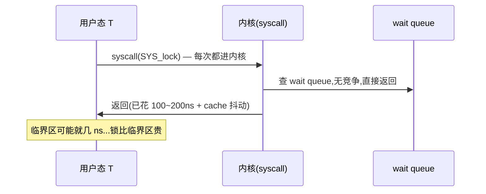
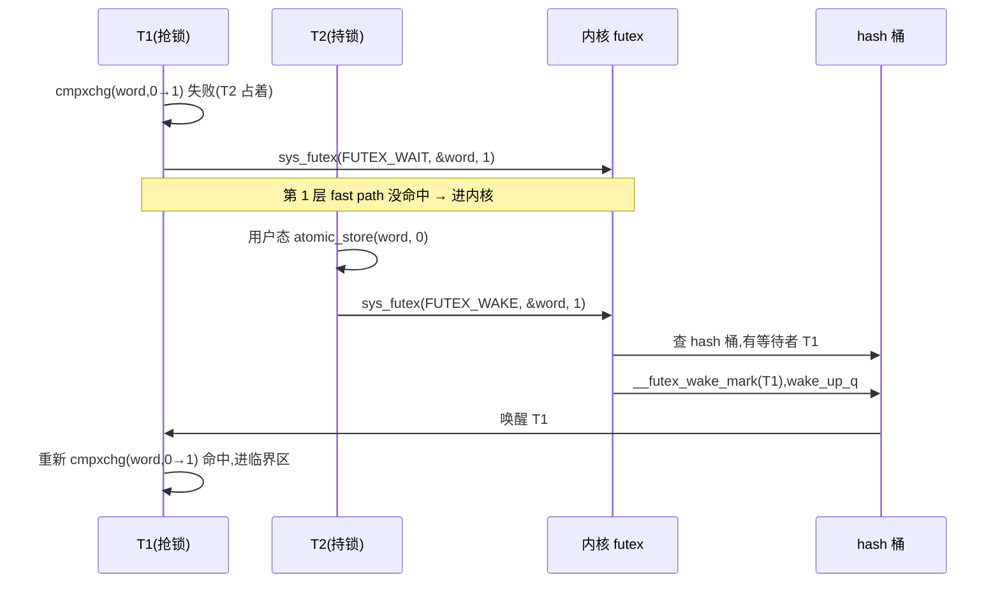
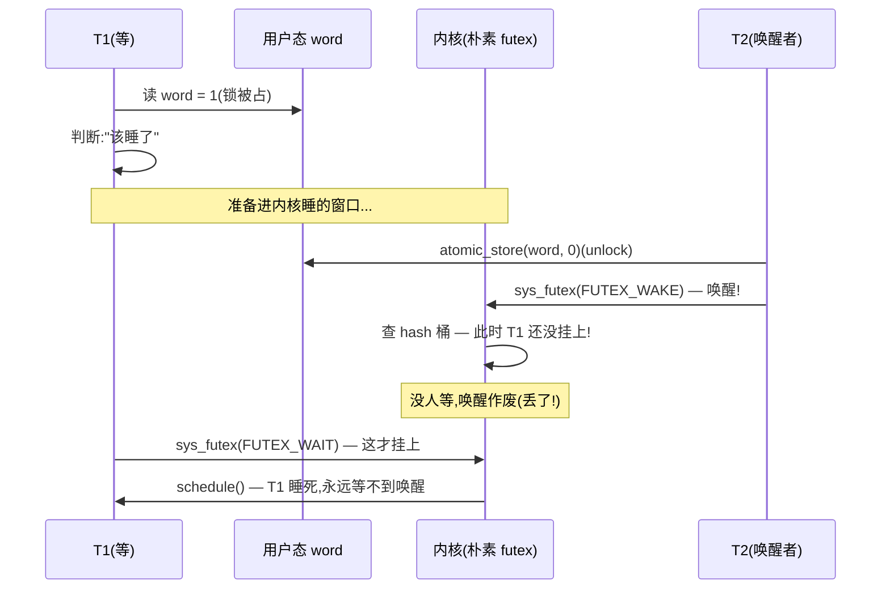
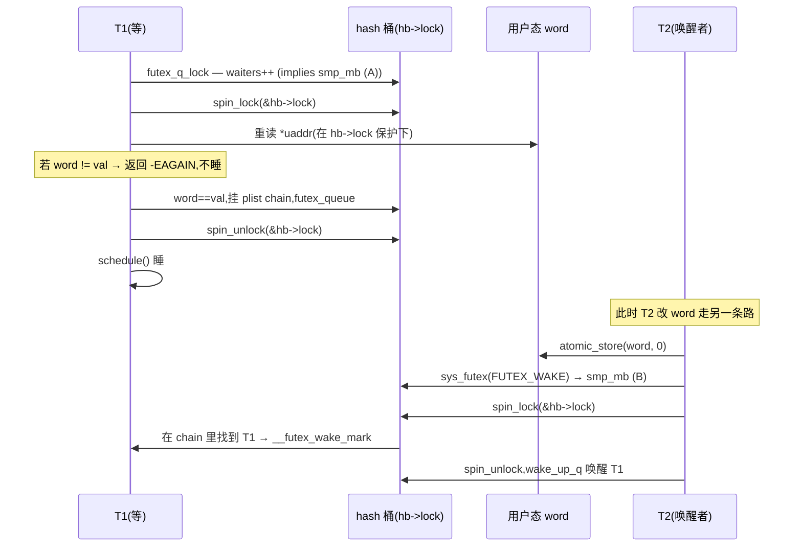
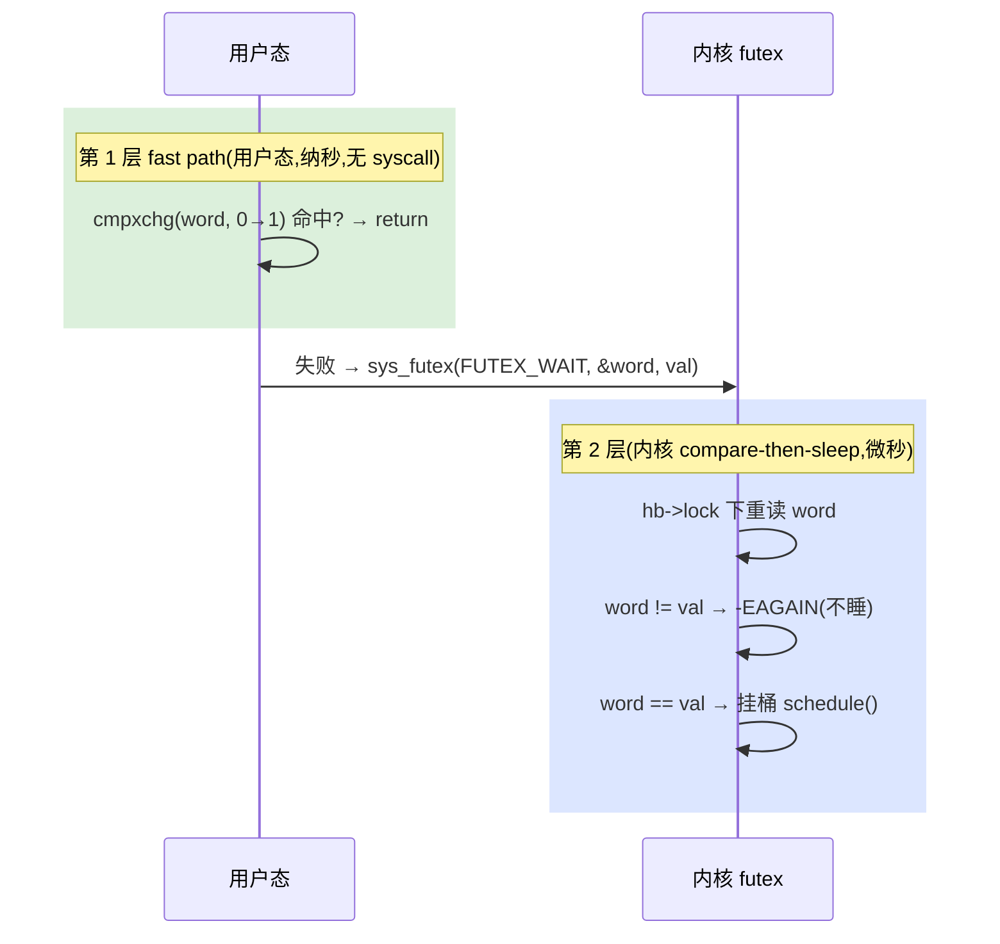
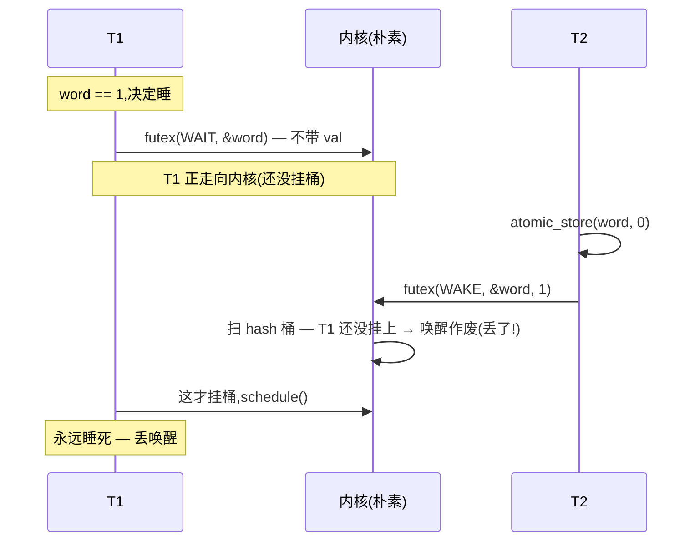
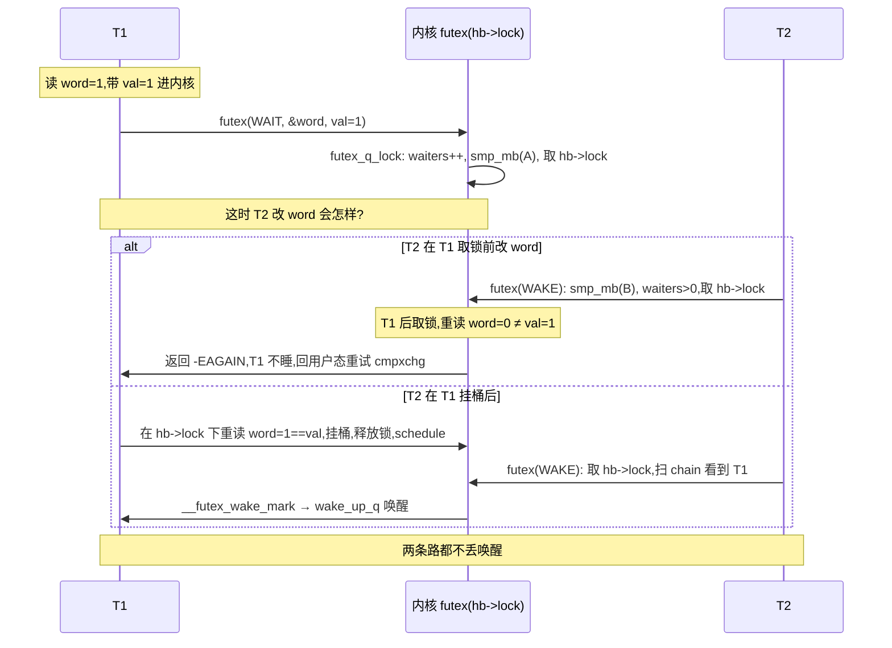

# 第十三篇 · 第 10 章 · futex:用户态锁的 fast path

> 篇:第 3 篇(阻塞睡眠锁)
> 主线呼应:你已经看过 [`mutex_lock`](../linux/kernel/locking/mutex.c#L281) 在内核里怎么做 fast path —— 一条 `cmpxchg_acquire` 抢 `owner` 字段,抢到就进临界区,抢不到挂 wait queue 睡。那是**内核内部的锁**。可你在用户态写的 `pthread_mutex_lock` 呢?它一样要保护共享数据、一样要面对多核竞争,但它跑在用户态进程里,地址是**用户态虚拟地址**,内核根本不认识你的 `pthread_mutex_t`。更扎心的是:绝大多数 `pthread_mutex_lock` 是**无竞争**的(临界区设计得好的话),如果每次都老老实实 `syscall` 进内核挂 wait queue,64 核机器上一次锁开销 μs 级,比临界区本身还贵一个数量级。futex(fast userspace mutex)就是为这件事生的:**无竞争时纯用户态一条 `cmpxchg` 秒杀,根本不进内核;抢不到才 `sys_futex(FUTEX_WAIT)` 进内核睡在 hash 桶上**。它和内核 mutex 是同一种"fast/slow 分层"思想,但把 fast path 推到了**用户态**。读完这一章,你就讲得清"`pthread_mutex` 凭什么无竞争时不进内核"了。

## 核心问题

**为什么 `pthread_mutex` 在无竞争时不进内核?futex 怎么做到"用户态一条 `cmpxchg` 抢锁、抢不到才进内核睡",又凭什么不会丢唤醒?为什么 `FUTEX_WAIT` 要带一个"期望值"`val` 做原子比较?hash 桶凭什么把同一把锁的等待者挂一起?`FUTEX_LOCK_PI` 又为什么要请 rtmutex 出场(接第 9 章)?**

读完本章你会明白:

1. **futex 的双 fast path**:用户态先 `cmpxchg` 试锁(word=0→1),命中就完事(纯用户态、无 syscall、纳秒级);失败才 `sys_futex(FUTEX_WAIT, &word, expected)` 进内核。**第一层 fast path 在用户态**——这是 futex 区别于内核 mutex 的灵魂。
2. **FUTEX_WAIT 的 compare-then-sleep**:进内核后,**原子地**重读 `*uaddr` 与 `expected` 比较,变了就立刻返回 `-EAGAIN`(不睡);没变才挂 `futex_q` 上、`schedule()`。这一步是防"丢唤醒"(lost wakeup)的命脉。
3. **hash 桶布局**:`futex_queues` 是全局 hash 表,`futex_hash()` 用 `jhash2` 把 `union futex_key`(物理页 + 偏移)映到桶;同一把锁(同一 word)的所有等待者挂同一桶的 `plist_head chain` 上。
4. **futex word 的原子性契约**:用户态的 `cmpxchg` 和内核的 `futex_get_value_locked` 必须对同一 4 字节做对齐原子访问——这是内核与用户态握手的根基。
5. **★ 对照**:Go runtime 的 `sync.Mutex` 争用时,底层 `runtime.semacquire` 在 Linux 上**就是调 `futex`**(sema.go → `lock_sema`/`note` → `futex`);Tokio 的 `park`/`unpark` 在 Linux 上也落到 `futex`/condvar。用户态锁的内核底座,绕来绕去都是 futex。

---

> **逃生阀**:这一章会出现"futex word""hash 桶""`FUTEX_WAIT` 的 `val`""丢唤醒"等概念。如果你只写过 `pthread_mutex`、没想过它底下是什么,不要慌——抓住一句话就行:**futex 把锁的"判断"留在用户态(一条 `cmpxchg`),只把"睡觉/叫醒"这件用户态做不到的事交给内核**。读不懂 hash 桶细节没关系,先理解"为什么 `val` 要原子比较防丢唤醒",这是 futex sound 的全部。本章所有源码引**在线 Linux 6.9**(`kernel/futex/` 本地未解压,显式标注);行号不稳处只标函数名。

## 10.1 一句话点破

> **futex 把锁的 fast path 推到用户态:无竞争时一条 `cmpxchg` 命中,根本不进内核(纳秒级);抢不到才 `sys_futex(FUTEX_WAIT)` 进内核,而内核做的第一件事是"原子地比较 `*uaddr` 是不是你给的 `expected`"——变了就不睡(返回 `-EAGAIN`),没变才挂 hash 桶 `schedule()`。这个"compare-then-sleep 原子性"是 futex 不丢唤醒的命脉:它堵住了"用户态判断完、准备睡"和"唤醒者改 word、唤醒"之间的窗口。unlock 时 `sys_futex(FUTEX_WAKE, &word, 1)` 去 hash 桶里叫醒一个等待者。整条链路上,内核和用户态握手的唯一契约是:那个 4 字节的 futex word,双方都得对齐原子访问。**

这是结论,不是理由。本章倒过来拆:先看朴素的"每次都进内核"为什么会撞墙,再拆双 fast path,然后用反例时序把"丢唤醒"立起来、看 `FUTEX_WAIT` 的 compare 怎么堵它,接着拆 hash 桶和 `futex_q`,最后把 `FUTEX_LOCK_PI` 接回第 9 章的 rtmutex,再立 ★对照。

---

## 10.2 朴素方案会撞的墙:每次锁都进内核

要理解 futex 为什么这么设计,先看"不做 futex 会怎样"。最朴素的用户态互斥锁(很多老教材就是这么写的)长这样:

```c
// 朴素方案(反例):所有锁操作都进内核
struct naive_mutex { int fd; };   // 用 eventfd / pipe 当唤醒源

void lock(struct naive_mutex *m) {
    syscall(SYS_naive_lock, &m->fd);   // 每次都进内核
}
void unlock(struct naive_mutex *m) {
    syscall(SYS_naive_unlock, &m->fd); // 每次都进内核
}
```

这套方案在**无竞争**时(绝大多数情况)有多亏?一次系统调用在 x86_64 上大概 100~200ns 的纯开销(用户态→内核态切换、寄存器保存、TLB/cache 抖动),进了内核还要拿内核自己的锁、改 wait queue、可能 `schedule()` 切上下文(μs 级)。可你的临界区可能就一行 `counter++`(几纳秒)。**锁开销比被保护的代码还贵一个数量级**,这在高并发场景下是灾难。



这就是**朴素方案的核心矛盾**:**绝大多数锁是无竞争的,可朴素方案不管有没有竞争,每次都付系统调用的代价**。这正是 fast/slow 分层思想(回扣第 8 章 mutex)在用户态要解决的——能不能让"无竞争"这条路完全不经过内核?

> **不这样会怎样**:如果用户态锁老老实实每次进内核,64 核机器上锁密集型程序(数据库连接池、内存分配器的热路径)会被 syscall 开销吃掉一大半 CPU。glibc 早期 `pthread_mutex` 在 Linux 2.6 之前就是朴素方案,被吐槽得不行——这也是 futex(fast userspace mutex,Rusty Russell 2002 提出)直接动机:把无竞争路径彻底搬到用户态。

> **所以这样设计**:futex 的核心思想一句话——**"判断"留在用户态(用户态自己 `cmpxchg` 试锁),"睡觉/叫醒"这件用户态做不到的事才进内核**。无竞争是常态,所以常态下零 syscall;争用是少数,才付 syscall 的代价。这和内核 mutex 的 fast/slow 分层是同一种智慧,只不过 futex 把 fast path 推过了用户态/内核态边界。

---

## 10.3 双 fast path:用户态 cmpxchg + 内核 wait queue

futex 的名字 "fast userspace mutex" 已经把话说了一半:**fast path 在 userspace**。一把典型的 futex 锁(用户态封装,如 glibc `pthread_mutex`)长这样:

```c
// futex 锁的用户态封装(简化示意,非 glibc 源码原文)
typedef struct { atomic_int val; } futex_lock;

void lock(futex_lock *m) {
    // 第 1 层 fast path:用户态 cmpxchg 试锁,0→1
    int expected = 0;
    if (atomic_compare_exchange_strong(&m->val, &expected, 1))
        return;                       // 命中!无 syscall,纳秒级,完事
    // 第 1 层没命中:有人占着,进内核睡
    // 把"当前 word 值"作为 expected 传进去
    sys_futex(&m->val, FUTEX_WAIT, expected, NULL);
    // 被唤醒后重试 cmpxchg
}

void unlock(futex_lock *m) {
    // 用户态先把 word 改回 0(fast path 释放)
    atomic_store(&m->val, 0);
    // 通知内核:有人在等的话叫醒一个
    sys_futex(&m->val, FUTEX_WAKE, 1, NULL);
}
```

这里藏着**两层 fast path**:

1. **第 1 层(用户态)**:`lock` 先用 `cmpxchg` 把 word 从 0 改成 1。命中就 `return`,**整条路径没碰过内核**——就是一条 `lock cmpxchg` 指令(回扣第 1 章,`cmpxchg` 带 `LOCK` 前缀保证总线原子)。纳秒级。**绝大多数调用走这一层**。
2. **第 2 层(内核 fast path)**:`unlock` 时 `atomic_store(&m->val, 0)` 也在用户态完成,然后 `sys_futex(FUTEX_WAKE, &m->val, 1)` 进内核——但内核的 `futex_wake` 会先 `futex_hb_waiters_pending(hb)` 看 hash 桶有没有等待者,**没人等就立刻返回**(连 hb->lock 都不取)。所以即便 unlock 进了内核,无等待者时开销也极小。



**为什么这能消灭绝大部分 syscall**:因为绝大多数 `lock` 是无竞争的——第 1 层 `cmpxchg` 就命中了,根本不进内核。glibc 的 `pthread_mutex_lock` 在 PTHREAD_MUTEX_NORMAL 模式下就是这个套路:先 `cmpxchg`,失败才 `FUTEX_WAIT`。实测无竞争时 `pthread_mutex_lock` 几十纳秒,和一次原子指令一个量级;有竞争才落到 μs 级( syscall + 上下文切换)。

> **钉死这件事**:futex 的"快"全靠**第 1 层 fast path 在用户态**——一条 `cmpxchg` 命中就不进内核。这和内核 mutex 的 fast path(`__mutex_trylock_fast` 的 `cmpxchg_acquire`)是**同一种思想**,只不过 futex 把这条 `cmpxchg` 搬到了用户态进程的地址空间。理解了这一点,你就理解了 futex 名字里 "fast userspace" 的全部含义。

---

## 10.4 命脉:FUTEX_WAIT 的 compare-then-sleep 防丢唤醒

光有"用户态 cmpxchg + 内核 wait queue"还不够——这里藏着一个要命的并发陷阱,叫**丢唤醒(lost wakeup)**。它是 futex 设计上**最 sound 的地方**,也是为什么 `FUTEX_WAIT` 的签名长这样:

```c
// futex(2) 手册(权威契约)摘录
int futex(u32 *uaddr, int futex_op, u32 val, ...);
//                              ^^^^^^^^
// FUTEX_WAIT:原子地检查 *uaddr == val,是则睡;不是则返回 -EAGAIN
```

> **手册原文(FUTEX_WAIT(2const))**:"The purpose of the comparison with the expected value is to prevent lost wake-ups."(与期望值比较的目的就是防止丢唤醒。)

为什么必须比较?看反例时序。假设 `FUTEX_WAIT` **不做**比较(纯朴素的"进了内核就睡"):



这就是**丢唤醒**:T1 在"判断 word==1"和"真正挂上 hash 桶 schedule()"之间有一个窗口;T2 的唤醒恰巧落在这个窗口里——T2 改 word=0、`FUTEX_WAKE`,内核去 hash 桶一看没人,T1 还没挂上,唤醒作废;然后 T1 才挂上、`schedule()` 睡死。**T1 再也等不到下一次唤醒**(因为 unlock 已经发过了),整个程序卡死。

这是无锁同步里最经典、最阴险的 bug——它只在特定交错时序下出现、难复现、压测才暴露。futex 的解法是:**把"比较 word"和"挂桶 schedule()"用 hash 桶锁串成原子操作**。看内核怎么做(`kernel/futex/waitwake.c` 开头的官方注释,在线 6.9,本地未解压):

```
The waiter reads the futex value in user space and calls futex_wait().
This function computes the hash bucket and acquires the hash bucket lock.
After that it reads the futex user space value again and verifies that
the data has not changed. If it has not changed it enqueues itself into
the hash bucket, releases the hash bucket lock and schedules.

                            — kernel/futex/waitwake.c, L16-21 (在线 6.9)
```

把这段翻译成执行序:



关键点:**"重读 word" 和 "挂桶 schedule()" 都在 `hb->lock` 串行化下**,而 waker 改 word 后也要取同一把 `hb->lock` 才能扫 chain——**waiter 和 waker 在 hash 桶锁上握手**。所以:

- 若 T2 的唤醒**先于** T1 取锁:等 T1 取到锁、重读 word,word 已被改过(`!= val`),T1 立刻返回 `-EAGAIN`,**根本不睡**,回用户态重试 `cmpxchg`——唤醒不丢。
- 若 T2 的唤醒**晚于** T1 挂桶:T2 取锁扫 chain,一定能看到 T1,唤醒它——唤醒不丢。

**这就是 compare-then-sleep 的 sound**:`FUTEX_WAIT` 的 `val` 参数让内核能区分"该睡"和"已被唤醒过、别睡了"两种情况,用 `hb->lock` 把"比较"和"入睡"做原子,堵死了丢唤醒窗口。

> **为什么 sound**:在所有 T1/T2 交错时序下,要么 (a) T1 在 `hb->lock` 里看到 word 已变,不睡(返回 `-EAGAIN`);要么 (b) T1 已挂桶,T2 取同一把 `hb->lock` 一定扫到它。**不存在"T1 看到旧 word、T2 改 word 唤醒作废、T1 再睡死"的窗口**——因为这个窗口被 `hb->lock` + `val` 比较堵死了。少了 `val` 这一步,futex 就会在某条交错下丢唤醒;这就是为什么 `FUTEX_WAIT` 的签名非带 `val` 不可。

### 还有一个微妙的优化:waiters 计数 + smp_mb

但还有个问题:`futex_wake` 每次都进 hash 桶、取 `hb->lock` 扫 chain,即便没人等(无等待者),也得付一次锁开销。能不能"没人等就立刻返回、连 `hb->lock` 都不取"?看 `futex_wake`(waitwake.c:155,在线 6.9):

```c
int futex_wake(u32 __user *uaddr, unsigned int flags, int nr_wake, u32 bitset)
{
    ...
    hb = futex_hash(&key);
    /* Make sure we really have tasks to wakeup */
    if (!futex_hb_waiters_pending(hb))
        return ret;              // 没人等,连 hb->lock 都不取,直接返回
    spin_lock(&hb->lock);
    plist_for_each_entry_safe(this, next, &hb->chain, list) {
        if (futex_match(&this->key, &key)) {
            ...
            this->wake(&wake_q, this);
            if (++ret >= nr_wake) break;
        }
    }
    spin_unlock(&hb->lock);
    wake_up_q(&wake_q);
    return ret;
}
```

这里 `futex_hb_waiters_pending(hb)` 读桶的 `waiters` 计数(`struct futex_hash_bucket` 的 `atomic_t waiters` 字段,见 futex.h:115)。但**有了这个优化,会不会破坏 sound?**——会不会"waiter 正要挂、waker 看到 waiters=0 就溜了"?这就是 `futex_q_lock`(core.c:526)注释说的精妙之处:

```
Increment the counter before taking the lock so that a potential waker
won't miss a to-be-slept task that is waiting for the spinlock.
                                                — kernel/futex/core.c, L533-540 (在线 6.9)
```

```c
struct futex_hash_bucket *futex_q_lock(struct futex_q *q)
{
    hb = futex_hash(&q->key);
    futex_hb_waiters_inc(hb);   /* implies smp_mb(); (A) */  // 先递增!
    q->lock_ptr = &hb->lock;
    spin_lock(&hb->lock);
    return hb;
}
```

**waiter 在取 `hb->lock` 之前**就 `waiters++`,并带 `smp_mb()`(A)。waker 侧改完 word 也 `smp_mb()`(B)再读 `waiters`。这对屏障 (A)/(B) 配对保证:**waiter 要么已被 waker 看到(挂桶后唤醒),要么 waker 看到 `waiters>0` 去取锁扫 chain**(扫到挂桶中的 waiter,或扫不到——但扫不到说明 waiter 还没取到锁,它取到锁后会重读 word 发现已变,返回 `-EAGAIN`)。无论哪种,都不丢唤醒。

waitwake.c 开头的官方注释甚至把这个执行序画成了内存序表(`X:=waiters, Y:=futex`,`w[X]=1 w[Y]=1 ...`),它本质就是经典的"消息传递"屏障配对(回扣第 1 章 P1-03):**waiters 计数是"我在等"的消息,word 改写是"我解锁了"的消息,一对 `smp_mb` 保证这两条消息不会错过**。

> **钉死这件事**:futex 防"丢唤醒"有两层保障——(1)**`FUTEX_WAIT` 的 `val` + `hb->lock` 内重读 word**,把"比较"和"入睡"原子化;(2)**`waiters` 计数 + `smp_mb()` (A)/(B) 配对**,让 waker 的"无人 fast path"不会错过一个正在等 `hb->lock` 的 waiter。两层合起来,在所有交错时序下都不丢唤醒。这就是 futex sound 的全部命脉。少了任何一层,都会在特定时序下睡死。

---

## 10.5 hash 桶布局:futex_q 怎么挂

理解了 sound,再看物理结构:等待者到底挂在哪?内核**不为每个 futex word 单独建 wait queue**(那得多少内存?),而是**全局一张 hash 表** `futex_queues`,把所有进程、所有 futex word 的等待者**按 hash 分桶**,同一桶里用一个 `plist_head`(优先级链表)串起来。

```
 全局 futex_queues[hashsize] (core.c L50-55, 在线 6.9)
 ┌──────────────────────────────────────────────────────────┐
 │ struct futex_hash_bucket {                                │
 │     atomic_t       waiters;   ← futex_hb_waiters_pending 读这个 │
 │     spinlock_t     lock;      ← compare-then-sleep 的握手锁  │
 │     struct plist_head chain;  ← 同桶所有 futex_q 挂这条链      │
 │ } ____cacheline_aligned_in_smp;                           │
 └──────────────────────────────────────────────────────────┘
        ↑ futex_hash(key) = jhash2(key) & (hashsize-1)
        │
   ┌────┴───────────────────────────────────────────┐
   │桶0│桶1│桶2│ ... │桶k│ ... │桶 hashsize-1 │
   └────┴────┴────┴─────┴────┴─────┴──────────────┘
                          │
        每个桶的 chain(优先级链表 plist_head):
        ┌──────────────────────────────────────────┐
        │ futex_q(word=A, prio) ↔ futex_q(word=B) ↔ ... │
        └──────────────────────────────────────────┘
        (同桶不同 word 的等待者会混在一起,用 futex_match 区分)
```

`struct futex_q`(futex.h:171,在线 6.9)是每个等待任务一个:

```c
struct futex_q {
    struct plist_node list;        // 挂 hb->chain(按优先级排序,RT 用)
    struct task_struct *task;      // 等待的任务
    spinlock_t *lock_ptr;          // 指向所在桶的 hb->lock
    futex_wake_fn *wake;           // 唤醒回调(普通 futex 用 futex_wake_mark)
    void *wake_data;
    union futex_key key;           // 这个 word 的"身份"(物理页+偏移)
    struct futex_pi_state *pi_state;   // PI futex 用(见 10.6)
    struct rt_mutex_waiter *rt_waiter; // requeue_pi 用
    u32 bitset;                    // FUTEX_WAKE_BITSET 的位掩码
    ...
};
```

几个关键设计:

**1. `union futex_key` 是 word 的"身份证"。** `futex_q.key` 不是用户态虚拟地址——因为两个进程可能把同一物理页映射到不同虚拟地址(共享内存、fork COW)。内核用 `get_futex_key`(core.c:221,在线 6.9)把 `uaddr` 翻译成 `{mm, 物理页, 偏移}` 的三元组,这样**同一物理 word 的所有等待者**(跨进程也算)拿到同一个 key,挂同一个桶,`futex_match` 比较时判定为"同一把锁"。这是 futex 能跨进程用的根基(`FUTEX_PRIVATE_FLAG` 跳过跨进程检测,更快)。

**2. `plist_head` 按优先级排序,为 RT 准备。** 普通 futex 用普通优先级挂尾部;RT 任务(`FUTEX_LOCK_PI`)按实时优先级排序,唤醒时高优先级先醒。这就是为什么 chain 用 `plist` 而不是普通 `list_head`。

**3. `wake` 回调多态。** 普通 futex 的 `wake` 指向 `futex_wake_mark`(waitwake.c:134,在线 6.9)——把 `futex_q` 从 chain 摘下、设 `lock_ptr=NULL`、把 task 加进 `wake_q`;PI futex 用不同的唤醒路径(走 rtmutex)。所以 `futex_wake` 里 `this->wake(&wake_q, this)` 是一个间接调用,适配不同 futex 类型。

**4. `wake_q` 批量唤醒。** `futex_wake` 扫 chain 时,把要唤醒的 task 先 `wake_q_add_safe` 进 `wake_q`,**在释放 `hb->lock` 之后**才 `wake_up_q(&wake_q)` 真正唤醒(拿每个 task 的 pi_lock、改状态、加进就绪队列)。为什么?因为唤醒过程要拿一堆锁(task 的 pi_lock、调度器 rq 锁),如果在持有 `hb->lock` 时做,锁嵌套深、持锁久、易死锁。`wake_q` 是内核通用的"延迟唤醒"模式(回扣调度器那本),把"摘 chain"和"真唤醒"解耦。

> **为什么 hash 而不是 per-word wait queue**:Linux 上同时可能有几百万个 futex word(每个 `pthread_mutex_t`、每个 `sem_t`、每个条件变量都是),给每个建 wait queue 内存爆了。hash 到固定数量的桶(`futex_hashsize`,典型 256×CPU 数),桶里用 plist 串——**桶间无锁(不同桶可并行)、桶内一把锁**。代价是同桶不同 word 的 futex 会共享一把 `hb->lock`(hash 冲突),但只要 hashsize 够大、`jhash2` 够散,冲突概率低。这是"用 hash 摊薄锁竞争"的经典套路(回扣第 12 章 percpu-rwsem 也是同源思想:把竞争消灭在结构里)。

---

## 10.6 FUTEX_LOCK_PI:请 rtmutex 出场(接第 9 章)

到这里讲的 `FUTEX_WAIT`/`FUTEX_WAKE` 是**非 PI 的**普通 futex——它解决"无竞争不进内核"和"防丢唤醒",但**不解决优先级反转**。可用户态也有实时优先级需求(音频线程、工业控制),低优先级线程占着用户态锁、被高优先级线程等的时候,一样会优先级反转(回扣第 9 章 rtmutex 的动机)。`FUTEX_LOCK_PI` 就是 futex 的 PI 版,它直接**复用 rtmutex**(接 P3-09)。

看 `do_futex` 的分发(`kernel/futex/syscalls.c:84`,在线 6.9):

```c
case FUTEX_LOCK_PI:
case FUTEX_LOCK_PI2:
    return futex_lock_pi(uaddr, flags, timeout, 0);
case FUTEX_UNLOCK_PI:
    return futex_unlock_pi(uaddr, flags);
```

`futex_lock_pi`(pi.c:918,在线 6.9)和普通 `FUTEX_WAIT` 的关键区别:**它在用户态 `cmpxchg` 失败后,不是简单地睡 wait queue,而是把当前任务挂到一个 rtmutex 上**。`struct futex_pi_state`(futex.h:124)内嵌一个 `struct rt_mutex_base pi_mutex`:

```c
struct futex_pi_state {
    struct list_head list;
    struct rt_mutex_base pi_mutex;   // ← 内核就是靠它做 PI
    struct task_struct *owner;
    refcount_t refcount;
    union futex_key key;
};
```

抢 `FUTEX_LOCK_PI` 时:`futex_lock_pi_atomic`(pi.c:515,在线 6.9)先在用户态 word 上做带 `FUTEX_WAITERS` 标志的 `cmpxchg`(把 owner TID 写进 word,同时置上"有等待者"位);失败则任务作为 waiter 挂进 `pi_mutex` 的 wait queue——这条 wait queue 的优先级调整走第 9 章讲的 [`rt_mutex_adjust_prio_chain`](../linux/kernel/locking/rtmutex.c) PI 链遍历:当高优先级任务在 `FUTEX_LOCK_PI` 上阻塞,它会**沿 PI 链提升持锁者(以及持锁者所等的下一把锁的持有者...)的优先级**,直到链尾。

**为什么 PI futex 必须用 rtmutex 而不是普通 plist wait queue**:因为 PI(优先级继承)本身就是一个**有向图传播问题**(第 9 章讲透的 PI 链),rtmutex 把这套实现磨得很扎实(futex 重写一遍代价大、还容易错)。futex 复用 rtmutex,等于把"用户态锁"接到"内核 PI 引擎"上——这是 Linux 把用户态锁的 PI 能力做出来的关键。`FUTEX_UNLOCK_PI` 时,通过 word 上编码的 owner TID 校验(只有 owner 才能 unlock),再走 rtmutex 的 release 路径,把 PI 提升的优先级降回去,唤醒最高优先级的等待者。

> **钉死这件事**:`FUTEX_LOCK_PI` = futex 的用户态 fast path + rtmutex 的 PI 内核底座。普通 `FUTEX_WAIT`/`WAKE` 是 plist wait queue(无 PI);`LOCK_PI` 把等待者挂进 `pi_mutex`,PI 链遍历复用第 9 章那套。这就是 futex 与 rtmutex 的衔接点——用户态 PI 锁,内核里跑 rtmutex 引擎。

---

## 10.7 技巧精解:双 fast path + compare-then-sleep 反例时序

这一章最硬的两个技巧,单独拆透。

### 技巧 1:双 fast path——为什么 fast path 必须在用户态

第一个技巧看似平淡(用户态 cmpxchg 谁不会),但它背后有个**非平凡的边界划分**:为什么 fast path 必须在用户态、而不能"用户态只发 syscall、内核里做 cmpxchg"?

**反面对比**:如果把 fast path 放内核(朴素方案),每次 `lock` 都要 `syscall → 内核 cmpxchg → 返回`,即便无竞争也付 syscall 开销(100~200ns + cache 抖动)。64 核锁密集场景,这是性能黑洞。

**futex 的解法**:把"判断 word==0"这一步**留在用户态**——用户态 `cmpxchg` 命中就 `return`,**根本不进内核**。内核只在"用户态 cmpxchg 失败"或"需要叫醒人"时才介入。这个边界划分的本质是:**判断逻辑不依赖任何内核状态,只依赖那个 4 字节 word,所以它完全可以在用户态做**;内核只需要提供"睡觉/叫醒"这个用户态做不到的能力(用户态没法让自己 schedule 出去、也没法跨进程叫醒另一个睡眠线程)。



> **为什么 sound**:用户态 `cmpxchg` 和内核 `futex_get_value_locked`/`futex_wake` 都对**同一 4 字节 word** 做对齐原子访问——这是双方握手的契约(`futex(2)` 手册明确要求 word 必须 4 字节对齐)。只要双方都遵守"原子访问 word"的契约,用户态看到 word=0、内核看到 word=0 就是同一个事实,fast path 的判断不会和内核状态脱节。少了这个契约(比如用户态用非原子写、内核用非原子读),fast path 就会在某条交错下错判(用户态以为抢到、内核以为没人抢),锁就坏了。**这就是为什么 futex word 必须是 `atomic_int` 且 4 字节对齐**——它是用户态/内核态共享同一事实的唯一保证。

### 技巧 2:compare-then-sleep——反例时序立 sound

第二个技巧是本章 sound 的命脉,前面 10.4 已经立过反例时序,这里换个角度钉死:**为什么 `FUTEX_WAIT` 必须带 `val`,去掉它会怎样?**

**反面对比(朴素 FUTEX_WAIT 不带 val)**:



**futex 的解法(FUTEX_WAIT 带 val,内核原子比较)**:



> **为什么 sound**:`hb->lock` 把"重读 word 比较"和"挂桶 schedule()"串成临界区,waker 改 word 后也必须取同一把 `hb->lock` 才能扫 chain——**waiter 和 waker 在 `hb->lock` 上握手**,不存在"T1 看旧 word 决定睡 / T2 改 word 唤醒作废 / T1 才睡"的窗口。`val` 是内核判断"我是不是来晚了"的唯一依据:word 已变(`!= val`)说明唤醒已经发过,别睡了,返回 `-EAGAIN`。这套在所有 T1/T2 交错时序下都不丢唤醒,这就是 futex sound 的全部。

---

## 10.8 ★ 对照:Go runtime 的 sema 底层就是 futex

锁与无锁绝非内核独有(回扣第 1 章),futex 是这条线最生动的一例——**用户态锁的内核底座,绕来绕去都是 futex**:

| 层 | 谁 | fast path | 争用时 |
|---|---|---|---|
| **用户态异步运行时** | **Tokio(《Tokio》第 3 本)** | `AtomicWaker`(`cmpxchg`)标记唤醒 | 任务让出,`park` 在 Linux 上落到 `futex`/condvar |
| **语言级并发** | **Go runtime(《Go runtime》第 7 本)** | `sync.Mutex` fast path = `cmpxchg` + 自旋 | 自旋失败 `runtime.semacquire` → `lock_sema` → Linux 上 `futex(FUTEX_WAIT_PRIVATE)` |
| **C 用户态** | **glibc `pthread_mutex`** | `cmpxchg` 试锁(本章讲的) | `FUTEX_WAIT`/`FUTEX_WAKE` |
| **内核底座** | **Linux futex(本章)** | (用户态 cmpxchg,内核不介入) | hash 桶 + `hb->lock` compare-then-sleep |

几个关键对照,钉死:

- **Go 的 `sync.Mutex` 争用时落到 futex**:`sync.Mutex.Lock()` fast path 也是 `cmpxchg`(state 字段 0→1);争用时调 `runtime.semacquire`(src/runtime/sema.go),`semaRoot` 维护一棵 `sudog` 平衡树,真正睡眠时 `lock_sema` → 在 Linux 上就是 `futex(FUTEX_WAIT_PRIVATE)`;`Unlock` 唤醒走 `semarelease` → `futex(FUTEX_WAKE_PRIVATE)`。**Go 的锁底层就是 futex**——你用 Go channel、`sync.Mutex`,底下跑的就是本章这套。Go 把 futex 又包了一层 sema(用 sudog 平衡树解决"futex 唤醒只能 nr 个、Go 想按 goroutine 调度"的问题),但内核接口就是 futex。
- **Tokio 的 `park`/`unpark`**:Tokio 调度器让任务睡眠时,`park` 在 Linux 上落到 `futex`(或 condvar,底层也常是 futex)——和 futex 防"丢唤醒"的 `val` 比较是同一种思路(用户态先 `cmpxchg` 标记、再进内核睡)。Tokio 的 `AtomicWaker` 那套"先 `cmpxchg` 设标志、再 unpark"也是为了堵同样的丢唤醒窗口——和 futex 的 compare-then-sleep 同源。
- **fast path cmpxchg 跨语言同源**:Go `sync.Mutex` / glibc `pthread_mutex` / 内核 mutex / futex 第 1 层,全是"一条 `cmpxchg` 抢 fast path,失败才进慢路径"。**fast/slow 分层是跨语言通用的锁优化**,第 8 章正面讲过内核版,本章把同一思想推到用户态极致(连 fast path 都搬到用户态)。

> **钉死这件事**:你在 Go 里写 `mu.Lock()`、在 Rust/Tokio 里 `task::yield_now().await`、在 C 里 `pthread_mutex_lock`,在 Linux 上底下跑的都是本章这套 futex。用户态锁的内核底座就是 futex——"用户态 cmpxchg fast path + 内核 compare-then-sleep 防 lost wakeup"这套思想,是所有 Linux 用户态锁的共同祖先。

---

## 章末小结

这一章我们把阻塞锁的最后一员——**用户态锁的内核底座 futex**——拆透了。回到全书二分法:futex 属于**阻塞睡眠一极**(争用时进内核睡 hash 桶),但它的灵魂是把 fast path **推过用户态/内核态边界**,让无竞争路径完全不进内核。

1. **futex 的双 fast path**:第 1 层在用户态(一条 `cmpxchg` 命中,纳秒级、零 syscall);第 2 层在内核(`FUTEX_WAIT` 的 compare-then-sleep,微秒级)。无竞争是常态,所以常态零 syscall——这是 futex 名字 "fast userspace" 的全部含义。
2. **FUTEX_WAIT 的 compare-then-sleep**:进内核后,在 `hb->lock` 下**原子地**重读 `*uaddr` 与 `val` 比较,变了返回 `-EAGAIN`(不睡),没变才挂桶 `schedule()`。这一步堵死了"丢唤醒"窗口。
3. **hash 桶 + `futex_q`**:全局 `futex_queues` 用 `jhash2` 把 `union futex_key`(物理页+偏移)映到桶,桶里 `plist_head chain` 串 `futex_q`。同物理 word(跨进程也算)挂同桶、`futex_match` 判同锁。桶间无锁、桶内 `hb->lock`。
4. **sound 的两层保障**:(a) `val` + `hb->lock` 重读 word 原子化比较和入睡;(b) `waiters` 计数 + `smp_mb()` (A)/(B) 配对,让 waker 的"无人 fast path"不漏掉正在等锁的 waiter。两层合起来,所有交错时序下都不丢唤醒。
5. **FUTEX_LOCK_PI 接 rtmutex**:用户态 PI 锁 = futex 用户态 fast path + rtmutex 内核 PI 引擎(`struct futex_pi_state` 内嵌 `rt_mutex_base`)。复用第 9 章的 PI 链遍历,把用户态锁接到内核 PI 能力上。
6. **★ 对照**:Go `sync.Mutex`/channel、Tokio `park`/`unpark`、glibc `pthread_mutex` 在 Linux 上**底下全是 futex**——用户态锁的内核底座绕来绕去都是它。

### 五个"为什么"清单

1. **为什么 `pthread_mutex` 无竞争时不进内核?** 因为它底层用 futex:用户态先 `cmpxchg`(word 0→1),命中就 `return`,根本没 `syscall`。无竞争是常态,所以常态零 syscall。只有 `cmpxchg` 失败才 `sys_futex(FUTEX_WAIT)` 进内核睡 hash 桶。
2. **FUTEX_WAIT 为什么带 `val`?** 为了防丢唤醒。内核进 `FUTEX_WAIT` 后在 `hb->lock` 下重读 `*uaddr`,与 `val` 比较:变了(说明唤醒已发过)就返回 `-EAGAIN` 不睡;没变才挂桶 `schedule()`。这一步把"比较 word"和"入睡"在 `hb->lock` 下原子化,堵死"用户态判断完准备睡、waker 改 word 唤醒作废、waiter 睡死"的窗口。
3. **hash 桶为什么用 `&word` 哈希?** 内核不为每个 futex word 建 wait queue(内存爆),而是全局一张 `futex_queues` hash 表,`jhash2(union futex_key)` 映到桶。`key` 是物理页+偏移(不是虚拟地址),所以**同物理 word 跨进程也挂同桶**。桶内 `plist_head chain` 串所有等待者,`futex_match` 区分同桶不同 word。
4. **FUTEX_LOCK_PI 为什么用 rtmutex?** 因为优先级继承(PI)是个有向图传播问题,rtmutex 在第 9 章已经把 PI 链遍历磨透。`struct futex_pi_state` 内嵌 `rt_mutex_base pi_mutex`,等待者挂进 `pi_mutex` 的 wait queue,PI 链遍历复用 `rt_mutex_adjust_prio_chain`。用户态 PI 锁 = futex 用户态 fast path + rtmutex 内核 PI 引擎。
5. **futex word 为什么必须 4 字节对齐且原子访问?** 这是用户态与内核握手的唯一契约。用户态 `cmpxchg` 和内核 `futex_get_value_locked` 必须对同一 4 字节做对齐原子访问,双方看到的 word 值才是同一个事实。非对齐/非原子会让 fast path 判断与内核状态脱节,在某条交错下错判(用户态以为抢到、内核以为没人),锁就坏了。

### 想继续深入往哪钻

- 本章源码(⚠️ **在线 Linux 6.9,本地 `kernel/futex/` 未解压**):
  - `kernel/futex/waitwake.c`(在线 6.9):`futex_wake`(L155)、`futex_wake_op`(L253)、`futex_wait_queue`(L343)、`__futex_wake_mark`(L110)、`futex_wake_mark`(L134);开头 L10-90 的官方注释把防丢唤醒的内存序表讲透了,必读。
  - `kernel/futex/core.c`(在线 6.9):`futex_hash`(L116)、`futex_q_lock`(L526,`waiters++` 在取锁前)、`futex_q_unlock`(L549)、`__futex_unqueue`(L512)、`futex_get_value_locked`(L464)、`get_futex_key`(L221)。
  - `kernel/futex/futex.h`(在线 6.9):`struct futex_hash_bucket`(L115)、`struct futex_q`(L171)、`struct futex_pi_state`(L124)、`futex_match`(L212)。
  - `kernel/futex/pi.c`(在线 6.9):`futex_lock_pi`(L918)、`futex_unlock_pi`(L1112)、`futex_lock_pi_atomic`(L515)。
  - `kernel/futex/syscalls.c`(在线 6.9):`do_futex`(L84,老 syscall 分发)、`SYSCALL_DEFINE6(futex_wait)`(L370,futex2)。
- **本地有的相关文件**:`kernel/futex/` 本地未解压;`io_uring/` 下有个 `futex.c`(只是 io_uring 对 futex 的异步包装,FUTEX_WAIT/WAKE 多了一个 io_uring 通道,**非 futex 核心**,可作扩展阅读)。
- **权威契约**:`futex(2)` man page、`FUTEX_WAIT(2const)` man page(明确写了 "The purpose of the comparison with the expected value is to prevent lost wake-ups")。
- **观测**:`/proc/sys/kernel/`(futex 相关 sysctl 很少,主要是 `panic_on_oops`);`perf trace` 看 `futex` syscall 频次(密集 futex 是锁竞争信号);`perf lock` 看用户态锁等待(依赖 glibc ld);`bcc`/`bpftrace` 的 `futex` tracepoint 抓 `futex_queue`/`futex_wake`。
- **延伸阅读**:Ulrich Drepper "Futexes are tricky"(经典论文,讲 ABA 和 cmpxchg 失败回退);Linux `Documentation/locking/futex2.rst`;《Linux 内核机制》那本的中断/系统调用章可以对照看 `sys_futex` 的入口路径。

### 引出下一章

到这里第 3 篇阻塞锁的三个主角讲完了:**mutex**(第 8 章,内核内 fast/slow 分层)、**rtmutex**(第 9 章,PI 链)、**futex**(本章,用户态锁的内核底座)。它们有一个共同特点——**都是"排他锁"**,读者和写者抢同一把锁。可现实里有大量**读多写少**的场景(路由表、配置、RCU 之外的快速路径):几十个 CPU 同时读、偶尔有人写,如果用 mutex,读者之间也互相挡,白白损失并发度。能不能让**多个读者同时进、写者来了才独占**?这就是读写锁的动机。下一章第 4 篇,我们从 [`rwsem`](../linux/kernel/locking/rwsem.c) 的**乐观读 A-D-S 手写**讲起——它能让读者在完全不 `schedule`、甚至不取写者锁的情况下读完临界区,只在最后检查一个版本号。rwsem 为什么 sound(不读到撕裂)、A-D-S 三步怎么配屏障,正是第 4 篇的开场。读者和写者的拉锯,从这里开始。
