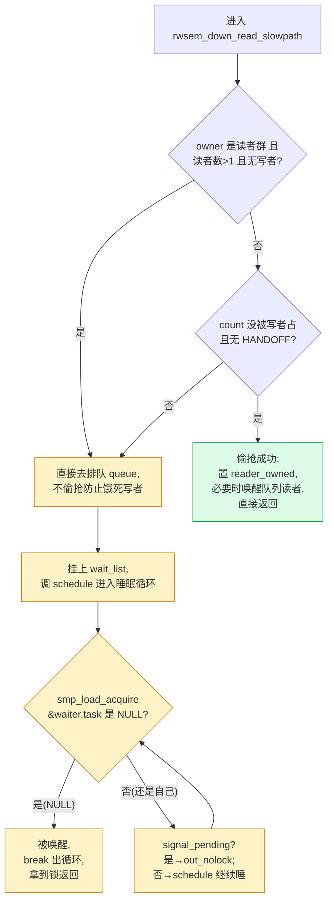
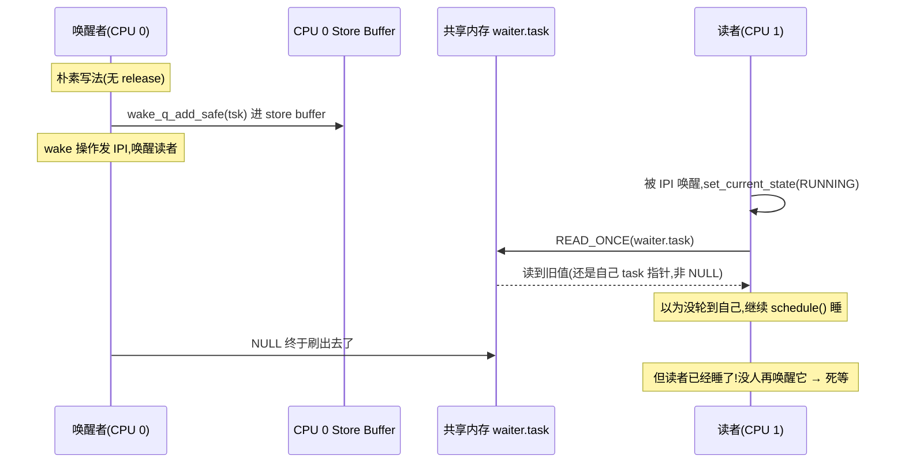
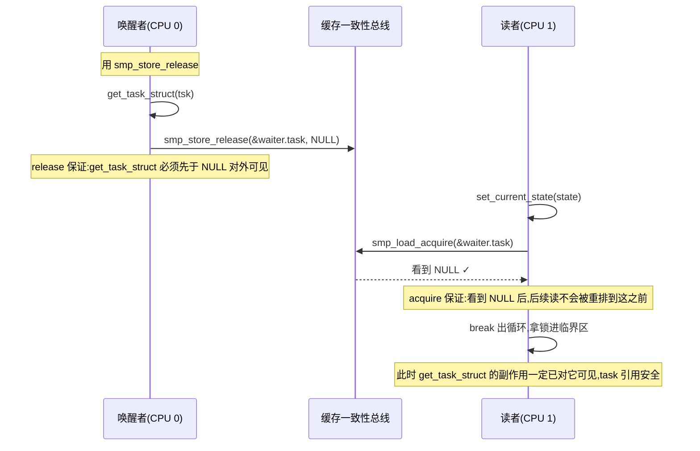
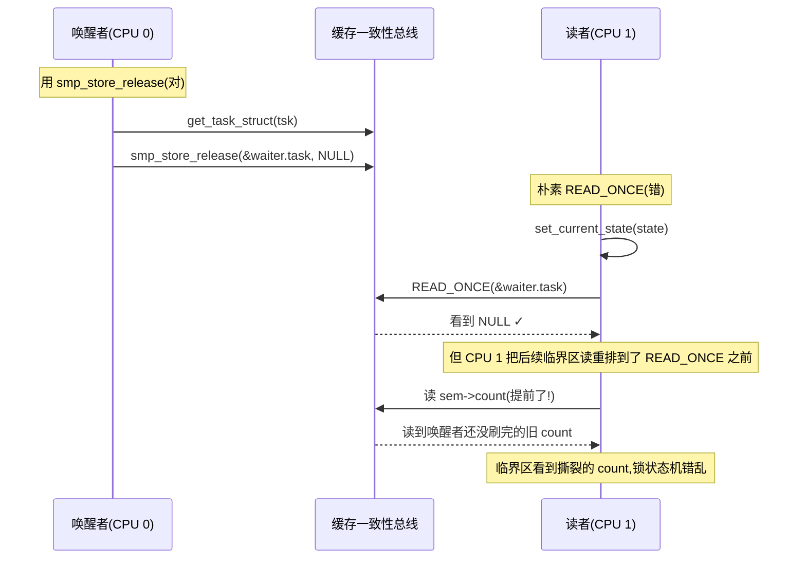

# 第十一篇 · rwsem:乐观读的 A-D-S 三段手写

> 篇:P4 读写锁(首章)
> 主线呼应:读到第 3 篇,你已经见过 `mutex` 的全貌——fast path 一条 `cmpxchg` 抢锁、慢路径睡在 wait queue、持锁者跑着就先乐观自旋一会儿。但 `mutex` 是**独占**的:同一时刻只有一个执行流能进临界区。现实的内核负载里,有大量场景是**读多写少**——文件系统的 inode 元数据、内存管理的 VMA 树、内核模块的配置表——几十个 CPU 同时读、偶尔改一下。用 mutex 保护这些结构,等于让所有读者排队、互相挡道,几十核的读带宽全被一把锁压扁。于是内核给出了读写信号量 `rwsem`:**多个读者可以同时持锁,写者必须独占**。但故事到这还没结束:rwsem 的真正难点不在"允许多读者",而在一个叫**乐观读(Optimistic Read)**的 fast path——读者用一条原子加试一下,命中就直接走,不进 wait queue;只有试失败(写者正在写、或者已有太多读者挤在前面)才进慢路径睡眠。这条乐观读的慢路径,用了内核里最经典、也最容易讲歪的一对手写屏障——读者的 `smp_load_acquire(&waiter.task)` 配唤醒者的 `smp_store_release(&waiter.task, NULL)`,合称 **A-D-S(Acquire-Do-Release)三段手写**。这一对屏障配对为什么不会让读者读到撕裂数据,是本章的命脉,也是全书"为什么 sound"最硬核的几处之一。

## 核心问题

**rwsem 怎么做到"多读者共享、单写者独占",同时让读者 fast path 几乎免费?当读者乐观读失败、被迫进 wait queue 睡眠时,唤醒它的那对 `smp_load_acquire` / `smp_store_release` 手写屏障,凭什么保证读者要么看到完整的"我被唤醒了"、要么看到完整的"还没轮到我",绝不会读到半个撕裂数据——这对配对的每一行,如果在某条执行序下被去掉或被改反,具体会在哪里出错?**

读完本章你会明白:

1. **rwsem 的两套快路径**:读者用 `atomic_long_add_return_acquire(&sem->count, RWSEM_READER_BIAS)` 在 `count` 字段里"加一个读者",写者用 `cmpxchg_acquire` 抢 writer lock 位——和 mutex 的 fast path 同款分层思想,只是读者不抢独占,而是"加一份"。
2. **乐观读的"偷抢"哲学**:读者慢路径不立刻去睡,先反复偷抢——只要 `count` 没被写者占、没有 HANDOFF 标志,就自己把读者计数加一、直接返回,顺带唤醒队列里其它等着的读者。这叫 **optimistic lock stealing**。
3. **A-D-S 三段手写**:Acquire(读者 set_current_state + `smp_load_acquire(&waiter.task)`)→ Do(`schedule()` 睡眠,被唤醒)→ Release(唤醒者 `smp_store_release(&waiter.task, NULL)` 配对)。**这是手写屏障的正用**,把 `waiter.task` 这个共享字段当成"门牌号",acquire/release 配对建立 happens-before,保证读者看到的等待状态一致。
4. **owner 字段的低位编码**:`RWSEM_READER_OWNED`(bit 0,标记"现在是读者群在持锁")+ `RWSEM_NONSPINNABLE`(bit 1,标记"别再乐观自旋了")——这两个标志决定写者能不能乐观自旋,是防止写者空转烧 CPU 的关键。
5. ★ 对照:Tokio 的 `AtomicWaker`(用 `store_release` / `load_acquire` 唤醒异步任务)和 rwsem 的 A-D-S 是同款手写;P1-03 的消息传递屏障配对是它的理论基础。

---

> **逃生阀**:这一章是全书最难也最关键的"为什么 sound"之一。如果你看到 `smp_load_acquire` / `smp_store_release` 头大,先回去翻 P1-03(内存屏障)的"消息传递"小节——本章的 A-D-S 就是那个模式的内核实战版。如果一时吃不下"少一个 release 会读到撕裂"的反例时序,**抓住一句金句就够**:"唤醒者把 `waiter.task` 写 NULL 用 `smp_store_release`,读者读 `waiter.task` 用 `smp_load_acquire`,配对建立 happens-before——读者要么看到旧值(自己 task 指针,继续睡)、要么看到 NULL(已被唤醒),绝不存在第三个中间态。"这句话立住,本章就立住了。

## 11.1 一句话点破

> **rwsem 的乐观读,本质是把"读者是不是被唤醒了"这个跨核通信的事实,压在一个 `waiter.task` 指针上:读者读它、唤醒者写它,两边用 acquire/release 手写屏障配对,建立起"先写后读"的 happens-before 链。少了 release,写者的"先 `get_task_struct` 再写 NULL"就会被 CPU 重排,读者在另一核可能读到撕裛建立的等待状态——以为自己被唤醒了但 task 引用早已飞了。配上这对屏障,这条链就 sound 了:读者要么还睡在 schedule 里,要么已经安全地被移出 wait queue,第三态不存在。**

这是结论,不是理由。本章倒过来拆:先看朴素的 rwsem 读者每次进 wait queue 排队有多亏,再看乐观读 fast path 怎么把绝大多数 reader 排队消掉,然后钻进慢路径的 A-D-S,最后把这对屏障"为什么 sound"用反例时序图拆透。

---

## 11.2 为什么需要 rwsem:mutex 在读多写少下的浪费

先把 rwsem 的存在理由立起来,这是理解乐观读"为什么这么卖力"的前提。

朴素的 mutex,本质是"同一时刻只有一个持锁者"。在读多写少的场景下,这是**反业务的**:几十个 CPU 同时读一棵 VMA 树,逻辑上互相不挡道(读不改数据),mutex 却逼它们排队——你 `mutex_lock` 拿到锁、读完、`mutex_unlock`,下一个 CPU 才能进。64 核机器,读带宽被压成 1 个 CPU 的带宽,浪费肉眼可见。

> **不这样会怎样**:如果用 mutex 保护 VMA 树、inode 元数据这些"读多写少"的结构,64 核机器在读密集负载下,锁的 wait queue 会排成长龙,fast path 的 `cmpxchg` 命中率断崖式下降——锁从纳秒级退化成微秒级,内核整体吞吐被一把锁掐死。这就是为什么内核需要 rwsem:**让多个读者同时持锁,只在写者出现时才把读者挡住**。

rwsem 的契约很简洁:

- **多个读者**可以同时持锁(读者之间不互斥)。
- **写者必须独占**(写者出现时,既不能有别的写者,也不能有任何读者)。
- 持锁期间**可以睡眠**(rwsem 是 semaphore 家族,不是 spinlock,所以临界区可以 `schedule()`)。

这套契约的 fast path 是关键——它必须**让读者在无写者时几乎免费**(几条原子指令,不进 wait queue),否则"多读者"的福利就被 fast path 开销吃光了。下一节拆这个 fast path。

---

## 11.3 rwsem 的结构:`count` 与 `owner` 双字段

讲 fast path 之前,先认识 rwsem 的两个核心字段([`include/linux/rwsem.h`](../linux/include/linux/rwsem.h#L48-L67)):

```c
struct rw_semaphore {
    atomic_long_t count;            /* 读者数 + writer locked + waiters + handoff */
    atomic_long_t owner;            /* 持锁者 task 指针 + 低位标志 */
#ifdef CONFIG_RWSEM_SPIN_ON_OWNER
    struct optimistic_spin_queue osq;   /* spinner MCS lock */
#endif
    raw_spinlock_t wait_lock;       /* 保护 wait_list 的自旋锁 */
    struct list_head wait_list;     /* 睡眠的等待者链表 */
    ...
};
```

这两个字段,各自压了多重信息,是 rwsem 的全部状态:

### `count` 字段:读者计数 + 三个标志位

`count` 的位布局在 [`rwsem.c`](../linux/kernel/locking/rwsem.c#L81-L128) 的开头注释里有完整定义(64 位系统):

```text
  bit 0     : writer locked bit      (RWSEM_WRITER_LOCKED)
  bit 1     : waiters present bit    (RWSEM_FLAG_WAITERS)
  bit 2     : lock handoff bit       (RWSEM_FLAG_HANDOFF)
  bit 3-7   : reserved
  bit 8-62  : 55-bit reader count    (RWSEM_READER_BIAS = 1<<8,每个读者加一份)
  bit 63    : read fail bit          (RWSEM_FLAG_READFAIL,防溢出哨兵)
```

读者拿锁,就是**原子地把 `count` 加一个 `RWSEM_READER_BIAS`**(即加 `1<<8`)——读者计数器从 0 涨到 55 位的空间,够用了。写者拿锁,是把 bit 0 置 1。两者互斥由一个简单事实保证:**写者置 bit 0 前,要先确认 reader 计数为 0**(否则会和读者撞),读者加计数前,要先确认 bit 0 是 0。所有这些都在 fast path 用一条原子指令完成。

> **钉死这件事**:rwsem 把"几个读者、有没有写者、有没有等待者、要不要 handoff"这五件事压进一个原子字 `count`。读者 fast path 是 `add_return_acquire`,写者 fast path 是 `cmpxchg_acquire`——一个加法、一个比较交换,这是 rwsem"快"的根。位布局的设计,让"读者加 1"和"写者抢锁"两种操作在硬件原子上不冲突,各自用合适的原子指令。

### `owner` 字段:持锁者指针 + 低位标志

`owner` 是一个 `atomic_long_t`,它的**高位**存一个 `task_struct *` 指针(写者持锁时是自己;读者持锁时是"最后一个拿锁的读者",只是个提示,不精确),**低位 2 个 bit** 编码两个标志([`rwsem.c`](../linux/kernel/locking/rwsem.c#L63-L65)):

```text
  struct rw_semaphore 的 owner 字段编码(64 位简化):
  ┌───────────────────────────────────────────────────────────────┐
  │ atomic_long_t owner                                           │
  │   高位: struct task_struct *  (写者=自己 / 读者=最后拿锁的读者)│
  │   bit 0: RWSEM_READER_OWNED  (现在是读者群在持锁,只是提示)    │
  │   bit 1: RWSEM_NONSPINNABLE  (别乐观自旋了,自旋也不会拿到)   │
  └───────────────────────────────────────────────────────────────┘
```

这两个低位标志各自有专门的目的:

- **`RWSEM_READER_OWNED`(bit 0)**:由 [`__rwsem_set_reader_owned`](../linux/kernel/locking/rwsem.c#L170-L177) 在读者拿锁时置 1。它告诉**乐观自旋的写者**:"现在持锁的是读者群,不是单个写者"——这影响自旋策略(下面 11.5 会讲)。
- **`RWSEM_NONSPINNABLE`(bit 1)**:由 [`rwsem_set_nonspinnable`](../linux/kernel/locking/rwsem.c#L228-L239) 在某些条件下置 1,意思是"写者别再乐观自旋了"。具体什么时候置——下一节讲。

> **为什么 owner 要编码标志**:因为乐观自旋的写者,在自旋循环里**每一轮都要读 owner 字段**判断"持锁者还在不在跑"。如果它每次都要再读一次 count、再查 wait_list,自旋开销就大了。把"持锁者是谁 + 能不能自旋"压进 owner 一个原子字,自旋者一条 `atomic_long_read(&sem->owner)` 就拿到全部判断依据——这是把乐观自旋做快的关键。

---

## 11.4 读者 fast path:一条 `add_return_acquire`

现在看读者 fast path。公开接口 [`down_read`](../linux/kernel/locking/rwsem.c#L1523-L1530) 经 `LOCK_CONTENDED` 宏分派,最终落到 [`__down_read_common`](../linux/kernel/locking/rwsem.c#L1243-L1259),核心就两行:

```c
static __always_inline int __down_read_common(struct rw_semaphore *sem, int state)
{
    ...
    preempt_disable();
    if (!rwsem_read_trylock(sem, &count)) {        /* ← fast path 在这里 */
        if (IS_ERR(rwsem_down_read_slowpath(sem, count, state))) {
            ...
        }
    }
    preempt_enable();
    return ret;
}
```

fast path 就是 [`rwsem_read_trylock`](../linux/kernel/locking/rwsem.c#L241-L254):

```c
static inline bool rwsem_read_trylock(struct rw_semaphore *sem, long *cntp)
{
    *cntp = atomic_long_add_return_acquire(RWSEM_READER_BIAS, &sem->count);

    if (WARN_ON_ONCE(*cntp < 0))
        rwsem_set_nonspinnable(sem);

    if (!(*cntp & RWSEM_READ_FAILED_MASK)) {
        rwsem_set_reader_owned(sem);
        return true;
    }

    return false;
}
```

三件事:

1. **原子加**:把 `count` 原子地加上 `RWSEM_READER_BIAS`(一个读者的份额),返回加完之后的值。**注意是 `acquire` 内存序**——这一条非常重要,等下讲。
2. **读失败检查**:把加完的 `count` 跟 [`RWSEM_READ_FAILED_MASK`](../linux/kernel/locking/rwsem.c#L127-L128) 比一下,这个 mask 包括 `WRITER_LOCKED | FLAG_WAITERS | FLAG_HANDOFF | FLAG_READFAIL`。如果这些位有任何一位是 1(说明:有写者持锁、或队列里有人在等、或 handoff 标志置了、或读者太多快溢出),fast path 失败,返回 false,`__down_read_common` 把它送进慢路径。
3. **置读者 owned**:如果 fast path 命中,把 owner 字段的 `RWSEM_READER_OWNED` 位置 1(`rwsem_set_reader_owned`),给乐观自旋的写者一个提示"现在是读者群"。

### 为什么 fast path 用 `acquire` 内存序

[`atomic_long_add_return_acquire`](../linux/include/linux/atomic/atomic-instrumented.h) 的 `acquire` 语义,保证了:

- fast path 之前的读写,不会被重排到这条原子加**之后**(写→读方向被锁住)。
- fast path 之后的读写(也就是临界区里的代码),**不会被重排到这条原子加之前**(读→写方向也锁住)——这是 `acquire` 的核心。

> **为什么 sound**:读者的临界区代码(读 VMA 树、读 inode 等)如果被 CPU 重排到 `add_return_acquire` **之前**执行,就会出现"你以为拿了锁、其实没拿,代码已经跑进了临界区"的撕裂——这正是 P1-03 章讲的"内存重排会害死你"在锁上的体现。`acquire` 把读者临界区的代码钉死在 fast path 之后,临界区逻辑看到的共享数据一定是一致快照(要么全部在写者写之前,要么全部在写者写之后)。这是读者 fast path sound 的根。

### 反面对比:如果读者不用原子加会怎样

朴素地写 `sem->count += RWSEM_READER_BIAS; if (... failed ...) ...`,在多核上立刻翻车:两个 CPU 同时读 `count`、各自加 `BIAS`、各自写回,丢一次更新——读者计数少了一个,后续 `up_read` 时计数对不上,锁状态机直接错乱。这就是 P0-01 章讲的"竞争"攻击面,在 rwsem 读者 fast path 上是**每天都发生的高频路径**,所以必须用原子加。`acquire` 内存序是额外保证——单纯 `atomic_add_return_relaxed` 也防止了竞争,但允许临界区代码被重排到加法之前,所以 rwsem 选了 `acquire`。

---

## 11.5 乐观读慢路径:偷抢 + A-D-S

fast path 失败时,读者进 [`rwsem_down_read_slowpath`](../linux/kernel/locking/rwsem.c#L995-L1101)。这里藏了 rwsem 最精华的两段:**乐观偷抢块**和 **A-D-S 三段手写**。先把整个慢路径的形状画出来:



### 11.5.1 乐观偷抢:没写者就别睡

慢路径**第一件事不是去睡,而是再偷抢一次**。看 [`rwsem_down_read_slowpath`](../linux/kernel/locking/rwsem.c#L1003-L1032) 开头:

```c
    /*
     * To prevent a constant stream of readers from starving a sleeping
     * writer, don't attempt optimistic lock stealing if the lock is
     * very likely owned by readers.
     */
    if ((atomic_long_read(&sem->owner) & RWSEM_READER_OWNED) &&
        (rcnt > 1) && !(count & RWSEM_WRITER_LOCKED))
        goto queue;

    /*
     * Reader optimistic lock stealing.
     */
    if (!(count & (RWSEM_WRITER_LOCKED | RWSEM_FLAG_HANDOFF))) {
        rwsem_set_reader_owned(sem);
        lockevent_inc(rwsem_rlock_steal);

        /*
         * Wake up other readers in the wait queue if it is
         * the first reader.
         */
        if ((rcnt == 1) && (count & RWSEM_FLAG_WAITERS)) {
            raw_spin_lock_irq(&sem->wait_lock);
            if (!list_empty(&sem->wait_list))
                rwsem_mark_wake(sem, RWSEM_WAKE_READ_OWNED, &wake_q);
            raw_spin_unlock_irq(&sem->wait_lock);
            wake_up_q(&wake_q);
        }
        return sem;
    }
```

两件事:

1. **第一个 if(防饿死)**:如果 owner 是读者群(`RWSEM_READER_OWNED`)、当前读者数已经大于 1、且没有写者在抢——说明读者流源源不断地来。这时如果继续偷抢,新读者会永远抢在沉睡的写者前面,写者被饿死。所以这种情况下**直接跳过偷抢,去排队**,给写者留口饭吃。
2. **第二个 if(偷抢)**:如果 `count` 没被写者占(`RWSEM_WRITER_LOCKED` 位为 0)、也没有 `HANDOFF` 标志(写者没在强制要求交接),那这个读者就**直接偷抢成功**——它的 `RWSEM_READER_BIAS` 份额在 `rwsem_read_trylock` 调用时就已经加进 count 了,这里只是把 owner 标记为读者群,然后返回。

> **偷抢为什么会成功**:`rwsem_read_trylock` 失败的原因往往是 `count` 里有 `WAITERS` 位或 `HANDOFF` 位——比如队列里有等待者。但只要有等待者不等于这些等待者是写者,也不等于写者一定会立刻抢到。如果队列里是读者、或者写者还在睡、或者 handoff 还没触发,这个新读者"挤进来"是无害的(读者和读者不互斥)。所以内核让读者在慢路径开头再试一次偷抢,可以省下大量无谓的睡眠开销。

> **不这样会怎样**:如果慢路径每次都直接进 wait queue 睡眠,读多写少场景下,每个失败的 fast path 都要付完整的上下文切换——64 核机器上,锁吞吐会被睡眠/唤醒的 μs 级开销压成 1/64。乐观偷抢让绝大多数 fast path 失败的读者,在快路径失败后还能用几条原子指令"挤进来",不睡就走——这是 rwsem 读者性能的命脉。

### 11.5.2 排队:A-D-S 的 A(Acquire)

偷抢不成功(写者占着、或有 handoff、或读者太多),读者去排队。这是 A-D-S 三段手写的**第一段——Acquire**:

```c
queue:
    waiter.task = current;                      /* L1035,准备等待 */
    waiter.type = RWSEM_WAITING_FOR_READ;
    waiter.timeout = jiffies + RWSEM_WAIT_TIMEOUT;
    waiter.handoff_set = false;

    raw_spin_lock_irq(&sem->wait_lock);
    ...
    rwsem_add_waiter(sem, &waiter);

    /* we're now waiting on the lock, but no longer actively locking */
    count = atomic_long_add_return(adjustment, &sem->count);
    ...
    raw_spin_unlock_irq(&sem->wait_lock);
    ...

    /* wait to be given the lock */
    for (;;) {
        set_current_state(state);                            /* L1073 */
        if (!smp_load_acquire(&waiter.task)) {               /* L1074 */
            /* Matches rwsem_mark_wake()'s smp_store_release(). */
            break;                                            /* L1076 */
        }
        if (signal_pending_state(state, current)) {
            ...
        }
        schedule_preempt_disabled();                          /* L1086 */
        lockevent_inc(rwsem_sleep_reader);
    }

    __set_current_state(TASK_RUNNING);
    ...
    return sem;
```

这段就是 A-D-S 的精华。逐行拆:

- **A(Acquire)**:`waiter.task = current;` 把自己的 task 指针挂到栈上的 `struct rwsem_waiter`,再把这个 waiter 挂到 `sem->wait_list` 上。此时 `waiter.task` 是自己的 task 指针(非 NULL)。然后 `set_current_state(TASK_UNINTERRUPTIBLE)` 把自己置成"不可中断睡眠"状态。
- **A 的关键屏障**:`if (!smp_load_acquire(&waiter.task))` —— 读自己的 `waiter.task`,**用 `acquire` 内存序**。如果读到 NULL,说明被唤醒者已经把它清零(表示"轮到你了,起来拿锁");如果读到自己的 task 指针(非 NULL),说明还没轮到,继续睡。
- **D(Do)**:`schedule_preempt_disabled()` —— 真正让出 CPU,进调度器睡。被唤醒后回到 for 循环顶端,重新 `set_current_state` + `smp_load_acquire` 检查。

**注意,这个循环里读 `waiter.task` 用 `smp_load_acquire` 不是随便选的**——它要和唤醒者的 `smp_store_release` 严格配对,这是 sound 的命脉,等下技巧精解会画透。

### 11.5.3 释放:A-D-S 的 S(Release)

唤醒发生在另一边——写者 `up_write` 或前一个读者 `up_read` 触发 [`rwsem_wake`](../linux/kernel/locking/rwsem.c#L1203-L1217),它持有 `wait_lock` 后调用 [`rwsem_mark_wake`](../linux/kernel/locking/rwsem.c#L411-L568)(**⚠️ 6.9 已改名,老资料里的 `__rwsem_mark_wake` 在 6.9 不存在**)。这个函数把队列里的读者都"批准"拿锁,然后在 [`rwsem_mark_wake`](../linux/kernel/locking/rwsem.c#L548-L567) 末尾的关键 2nd pass:

```c
    /* 2nd pass */
    list_for_each_entry_safe(waiter, tmp, &wlist, list) {
        struct task_struct *tsk;

        tsk = waiter->task;
        get_task_struct(tsk);

        /*
         * Ensure calling get_task_struct() before setting the reader
         * waiter to nil such that rwsem_down_read_slowpath() cannot
         * race with do_exit() by always holding a reference count
         * to the task to wakeup.
         */
        smp_store_release(&waiter->task, NULL);
        /*
         * Ensure issuing the wakeup (either by us or someone else)
         * after setting the reader waiter to nil.
         */
        wake_q_add_safe(wake_q, tsk);
    }
```

这是 A-D-S 的**第三段——Release**。三件事,顺序不能错:

1. **`get_task_struct(tsk)`**:先给读者的 task 增加一个引用计数。这步是"保险",防止读者的 task 在被唤醒前就因为别的原因(信号、`do_exit`)被释放。
2. **`smp_store_release(&waiter->task, NULL)`**:**用 `release` 内存序**把 `waiter->task` 清零。这一步就是给读者的 `smp_load_acquire` 发的"门牌号变了"信号——读者看到 NULL,就知道"轮到我了"。
3. **`wake_q_add_safe(wake_q, tsk)`**:把读者挂到 wake queue 上,稍后真正唤醒(发 IPI / 改 runqueue)。

注意**第 2 步和第 3 步的顺序严格固定**:`smp_store_release` 写 NULL 在前,`wake_q_add_safe` 在后。源码注释 L562-565 一句"Ensure issuing the wakeup ... after setting the reader waiter to nil"——这正是在说"门牌号必须先于唤醒生效",否则会出现唤醒到达、读者起来、却读到旧 `waiter.task`(非 NULL)的怪象。这个顺序的正确性,等下技巧精解用反例拆透。

> **钉死这件事**:rwsem 的读者慢路径,把"自己被唤醒了吗"这件跨核通信的事,压在 `waiter.task` 这一个指针上:读者循环里 `smp_load_acquire(&waiter.task)` 看它是不是 NULL,唤醒者 `smp_store_release(&waiter.task, NULL)` 把它写 NULL。**这是一对经典的消息传递屏障配对**(见 P1-03),不是随便写的——它的 sound 性,正是本章的命脉。

---

## 11.6 owner 低位编码:为什么需要 `RWSEM_NONSPINNABLE`

讲 A-D-S 之前,先把 owner 字段的两个低位标志补完——它们影响的是另一条路径:**写者的乐观自旋**。

### `RWSEM_READER_OWNED`:读者群的提示

读者拿锁时,`rwsem_set_reader_owned` 把 owner 字段的 bit 0 置 1,高位塞自己的 task 指针(只是"最后拿锁的读者"的提示,不是所有读者)。这给**乐观自旋的写者**一个信号:"现在是读者群在持锁,不是单个写者"。

为什么写者关心这个?因为 [`rwsem_optimistic_spin`](../linux/kernel/locking/rwsem.c#L819-L881) 在自旋循环里会判断 owner 的状态:

```c
    for (;;) {
        enum owner_state owner_state;

        owner_state = rwsem_spin_on_owner(sem);
        if (!(owner_state & OWNER_SPINNABLE))
            break;

        /* Try to acquire the lock */
        taken = rwsem_try_write_lock_unqueued(sem);
        ...

        if (owner_state == OWNER_READER) {
            /*
             * Time-based reader-owned rwsem optimistic spinning
             */
            if (prev_owner_state != OWNER_READER) {
                if (rwsem_test_oflags(sem, RWSEM_NONSPINNABLE))
                    break;
                rspin_threshold = rwsem_rspin_threshold(sem);
                ...
            }

            else if (!(++loop & 0xf) && (sched_clock() > rspin_threshold)) {
                rwsem_set_nonspinnable(sem);
                lockevent_inc(rwsem_opt_nospin);
                break;
            }
        }
        ...
    }
```

逻辑:写者在 owner 是读者群时,会**带超时地自旋一段时间**(`rspin_threshold`,根据当前读者数算一个上限,大约几十微秒)。如果超时还拿不到锁,就调 [`rwsem_set_nonspinnable`](../linux/kernel/locking/rwsem.c#L228-L239) 把 owner 的 bit 1 置 1,然后退出自旋,去睡。

### `RWSEM_NONSPINNABLE`:别再自旋了

`RWSEM_NONSPINNABLE` 一旦置 1,**所有写者都立即放弃乐观自旋**——因为已经有一个写者用超时证明了"在这把锁上自旋不值得"。继续让别的写者自旋只会浪费 CPU。

[`rwsem_set_nonspinnable`](../linux/kernel/locking/rwsem.c#L228-L239) 本身写得有点巧:

```c
static inline void rwsem_set_nonspinnable(struct rw_semaphore *sem)
{
    unsigned long owner = atomic_long_read(&sem->owner);

    do {
        if (!(owner & RWSEM_READER_OWNED))
            break;
        if (owner & RWSEM_NONSPINNABLE)
            break;
    } while (!atomic_long_try_cmpxchg(&sem->owner, &owner,
                                      owner | RWSEM_NONSPINNABLE));
}
```

注意两件事:

1. **只在 `RWSEM_READER_OWNED` 还置着时才置 NONSPINNABLE**。如果读者已经全放锁(OWNER 标志被清了),那就别置——写者马上就能拿锁,自旋是划算的,不该禁掉。
2. **用 `cmpxchg` 循环**,而不是 `atomic_or`——因为要同时检查两个标志位,不能盲目改。

> **为什么 sound**:`RWSEM_NONSPINNABLE` 的语义是"读者群持锁且自旋已证明不划算"。这个标志只影响乐观自旋(可选优化),不影响正确性——所以哪怕某条执行序下它被设错(比如刚置 1 读者就全放了),最坏后果只是"某个写者少自旋一次、多睡一次",不会丢更新、不会死锁。这是 sound 的关键:这个标志是**性能提示**,不是正确性必需。

> **不这样会怎样**:如果没有 NONSPINNABLE 这个逃生阀,读者群持锁很久的场景下,所有写者都会一直乐观自旋——64 核机器上 63 个写者绕着一群慢吞吞的读者烧 CPU,纯纯浪费。NONSPINNABLE 让写者"试过、不划算、去睡",把 CPU 还给系统。这是 rwsem 在"读者多 + 慢"场景下不至于烧机的原因。

---

## 11.7 技巧精解:A-D-S 手写屏障配对为什么 sound

本章的"技巧精解"挑最硬核的一对:**读者 `smp_load_acquire(&waiter.task)` 与唤醒者 `smp_store_release(&waiter.task, NULL)` 的配对**。这是 rwsem"为什么不会读到撕裂数据"的命脉,也是 P1-03 章讲的"消息传递屏障配对"在内核锁里的真实实战。

### 11.7.1 朴素写法会撞什么墙

先把朴素写法画出来——假设我们不用 acquire/release,只用普通读写:

```c
/* 唤醒者(rwsem_mark_wake 2nd pass)的朴素写法 */
tsk = waiter->task;
get_task_struct(tsk);
WRITE_ONCE(waiter->task, NULL);      /* ← 朴素:不用 release */
wake_q_add_safe(wake_q, tsk);

/* 读者(rwsem_down_read_slowpath 循环)的朴素读法 */
for (;;) {
    set_current_state(state);
    if (!READ_ONCE(waiter.task))     /* ← 朴素:不用 acquire */
        break;
    schedule_preempt_disabled();
}
```

朴素写法在单核上完全正确。多核上,在某些 CPU 架构(尤其是弱内存序的 ARM、POWER)上,会撞上**两堵墙**:

**第一堵墙:唤醒者的 `WRITE_ONCE(waiter->task, NULL)` 与 `wake_q_add_safe` 之间,可能被 CPU 重排。** CPU 看不出 `waiter->task = NULL` 和 `wake_q_add(tsk)` 的逻辑依赖,在 Store Buffer 优化下,它可能让 wake 操作先生效、NULL 写还没刷出去。于是:



读者被 IPI 唤醒后,看到 `waiter.task` 还是自己的旧指针(因为 NULL 写还没刷出),以为没轮到自己,又 `schedule()` 睡回去——但唤醒者的 wake 已经发过了,不会再发第二次。读者**永久睡死**。这是丢唤醒的经典症状。

**第二堵墙:`get_task_struct(tsk)` 与 `WRITE_ONCE(waiter->task, NULL)` 之间,可能被 CPU 重排。** 如果 NULL 写先刷出、`get_task_struct` 还没生效,读者在另一核看到 NULL 起来、跑临界区、出 `up_read`,然后这个 task 因为别的路径(比如被信号杀掉)`do_exit`——但唤醒者这边的 `get_task_struct` 还没拿到引用,task 已被释放,然后唤醒者访问 `tsk` 就是 use-after-free。源码注释 L555-560 明明白白写了这点:

> Ensure calling `get_task_struct()` before setting the reader waiter to nil such that `rwsem_down_read_slowpath()` cannot race with `do_exit()` by always holding a reference count to the task to wakeup.

### 11.7.2 acquire/release 配对为什么 sound

`smp_store_release` / `smp_load_acquire` 这对屏障,本质是 P1-03 章讲的**消息传递模式**(message passing)的内核实战。配对规则:

- **唤醒者用 `smp_store_release(&waiter->task, NULL)`**:release 屏障保证——**屏障之前的所有读写(get_task_struct、wake_q 的准备),都对其它 CPU 可见之后,才让 NULL 写可见**。换句话说,当读者在另一核看到 `waiter.task == NULL`,它一定也看到了唤醒者之前的全部操作(get_task_struct 已生效、wake_q 已准备好)。
- **读者用 `smp_load_acquire(&waiter.task)`**:acquire 屏障保证——**读者看到 NULL 之后,后续的读(临界区代码、读 sem 状态等)不会被重排到 acquire 之前**。也就是说,读者进临界区时,它看到的共享数据一定包含了唤醒者 release 之前的全部修改。

合起来,这条 happens-before 链是 sound 的:



读者要么看到**完整的旧值**(自己的 task 指针,继续睡)、要么看到**完整的新值**(NULL + 唤醒者全部前置操作),**第三态不存在**——这就是不读到撕裂的根。

> **为什么 sound**:`smp_store_release` / `smp_load_acquire` 这对屏障,把唤醒者的"前置操作"(get_task_struct + wake 准备)和读者的"后置操作"(进临界区、读共享数据)用 release/acquire 的 happens-before 边连起来。**只要读者 acquire 读到 release 写的值(NULL),它就一定能看到 release 之前的全部修改**——这是 P1-03 章讲的 release/acquire 配对的核心语义,在 rwsem 上实战。少了任何一个屏障,这条边就断了:少 release,前置操作可能晚于 NULL 可见;少 acquire,读者的后置操作可能跑到 acquire 之前(看到旧数据)。**只要配对完整,读者绝不会读到撕裂数据**。

### 11.7.3 反例时序:如果只用 `smp_store_release`、读者不用 `acquire`

为了把 sound 性讲透,画一个具体的反例——假设唤醒者老老实实用了 `smp_store_release`,但读者这边图省事改成了普通 `READ_ONCE`:



读者 CPU 看到 NULL 后,**临界区的读操作**(`sem->count` 等)被 CPU 重排到了 `READ_ONCE` 之前——因为普通 `READ_ONCE` 不阻止后续读往前走。结果读者读到的是唤醒者还没把 count 调整完的旧值,临界区看到撕裂状态。这就是为什么读者必须用 `smp_load_acquire`,不能省。

> **钉死这件事**:A-D-S 的 sound 性,来自**读者 acquire + 唤醒者 release 的严格配对**。任何一边用普通读写代替,都会在弱内存序架构上撞墙——在 x86 上可能侥幸不出错(因为 x86 是 TSO,store 之间不重排),但内核要在 ARM、POWER、RISC-V 这些弱序架构上跑,屏障配对就是命脉。rwsem 这段代码,是 P1-03 章理论在内核实战里的范本。

### 11.7.4 信号路径的副屏障:`wait_lock`

顺带说一句另一个相关的屏障——读者循环里如果收到信号(`signal_pending_state`),走 [`out_nolock`](../linux/kernel/locking/rwsem.c#L1078-L1085) 路径退出。源码注释 L1083 明确写了:

```c
        if (signal_pending_state(state, current)) {
            raw_spin_lock_irq(&sem->wait_lock);
            if (waiter.task)
                goto out_nolock;
            raw_spin_unlock_irq(&sem->wait_lock);
            /* Ordered by sem->wait_lock against rwsem_mark_wake(). */
            break;
        }
```

这条 `/* Ordered by sem->wait_lock against rwsem_mark_wake(). */` 注释说的是:读者在收到信号时,要重新拿 `wait_lock` 才能看 `waiter.task`——因为 `wait_lock` 是一把自旋锁,它本身提供完整的 acquire/release 屏障(拿锁 acquire、放锁 release),所以读者在锁内看 `waiter.task` 的值,一定和 `rwsem_mark_wake`(也持有 `wait_lock`)对 `waiter.task` 的写互斥可见。**这是另一对屏障配对——靠自旋锁的 acquire/release 而不是手写 acquire/release**。

为什么这里不用 `smp_load_acquire`?因为信号路径是冷路径(正常情况下读者不会被信号中断),用 `wait_lock` 互斥更简洁;正常路径(循环顶端的 `smp_load_acquire`)是热路径,用手写屏障免去拿锁开销。这种"热路径手写屏障、冷路径用锁"的分层,是内核同步代码的常见模式。

---

## 11.8 ★ 对照:Tokio AtomicWaker / Go runtime / 调度器

本章的 A-D-S 手写屏障,绝非 Linux 内核独有。把它和系列其它书的同源思想钉一起,你才看得到"并发同步"的全貌。

- **对照《Tokio》的 `AtomicWaker`**:Tokio 的 `AtomicWaker` 是异步任务之间"通知唤醒"的原语,核心就是一对 `store_release` / `load_acquire`——一个 task 注册 waker、另一个 task 触发唤醒,用 release/acquire 屏障配对保证"要么没唤醒、要么完整唤醒",和 rwsem 的 A-D-S 是**同一思想的不同载体**。差别只在:rwsem 的"唤醒"是让睡着的内核线程起来;AtomicWaker 的"唤醒"是让挂起的 future 重新被 poll。机制(sound 的 release/acquire 配对)完全一样。
- **对照《Go runtime》的 `sync.Mutex`**:Go 的 mutex fast path 也是 `cmpxchg`,失败进 sema(底层 futex)睡眠——这和 rwsem 的 fast/slow 分层同款。但 Go 没有"乐观读"——`sync.RWMutex` 的读者 fast path 只用 `atomic.AddInt32`,读写互斥靠信号量,不像 rwsem 这么卖力做"乐观偷抢 + A-D-S 手写"。原因是 Go 用户态程序对锁延迟更敏感、对原始性能要求没内核那么苛刻,所以选了简单但稍慢的实现。
- **对照《Linux 调度器》的 wait queue 唤醒**:调度器那本讲过 `wake_up_process` / `try_to_wake_up`——它内部也是用 `smp_mb` / `set_current_state` 配对,保证"唤醒者看到的 task state 和被唤醒者看到的等待状态一致"。rwsem 的 A-D-S 是这套机制在锁上的应用——`set_current_state(TASK_UNINTERRUPTIBLE)` + `smp_load_acquire(&waiter.task)` 的组合,正是 `try_to_wake_up` 那套"先设状态、后查条件"模式的实战。

> **钉死这件事**:rwsem 的 A-D-S 手写屏障,是 P1-03 章的"消息传递模式"在内核锁上的标准范本。同样的 release/acquire 配对,在 Tokio 的 AtomicWaker、Go 的 sema、调度器的 wait queue 唤醒里都能找到——**跨语言、跨层次,内核锁、用户态异步、语言级并发,用的都是同一对屏障**。把它钉死,你就掌握了"跨核通知"的本质。

---

## 章末小结

本章是第 4 篇(读写锁)的首章,我们钻透了 rwsem 的乐观读路径,尤其是 A-D-S 三段手写的 sound 性——这是全书"为什么 sound"命脉章之一。

把这一章钉死的五样东西:

1. **rwsem 的双字段状态机**:`count`(读者数 + 三个标志位)和 `owner`(持锁者指针 + 两个低位标志)。读者 fast path 是 `add_return_acquire`,写者 fast path 是 `cmpxchg_acquire`——两种原子操作不冲突,各走各的快路径。
2. **乐观读的偷抢哲学**:读者慢路径开头会再偷抢一次——只要 `count` 没被写者占、没有 HANDOFF,就直接挤进来返回,不进 wait queue。这把读多写少场景下的睡眠开销压到了最小。代价是要小心防饿死(读者群持锁时跳过偷抢)。
3. **A-D-S 三段手写**:Acquire(`waiter.task = current` + `set_current_state` + `smp_load_acquire(&waiter.task)`)→ Do(`schedule_preempt_disabled` 睡眠)→ Release(唤醒者 `get_task_struct` + `smp_store_release(&waiter.task, NULL)` + `wake_q_add_safe`)。这是 P1-03 章消息传递屏障配对的标准范本。
4. **owner 低位编码的两个标志**:`RWSEM_READER_OWNED`(读者群持锁,只是提示)+ `RWSEM_NONSPINNABLE`(别再乐观自旋了)。前者影响写者自旋策略,后者是写者超时后给所有写者的"放弃自旋"信号——纯性能提示,不影响正确性。
5. ★ 对照:rwsem 的 A-D-S 和 Tokio 的 AtomicWaker、调度器的 wait queue 唤醒,用的是**同一对 release/acquire 屏障**——"跨核通知"的本质是跨语言跨层次的。

### 五个"为什么"清单

1. **为什么需要 rwsem,不能直接用 mutex?** mutex 是独占的,在读多写少场景下会把 64 核的读带宽压成 1 核。rwsem 让多个读者同时持锁,只在写者出现时互斥——直接把读密集负载的吞吐放大几十倍。
2. **读者 fast path 为什么用 `add_return_acquire` 而不是普通 `atomic_add_return`?** `acquire` 内存序保证读者临界区代码不会被 CPU/编译器重排到加锁之前——否则"以为拿了锁、其实没拿,代码已经跑进临界区"的撕裂会发生。原子加防竞争,acquire 防重排,两个攻击面一起堵。
3. **乐观读的"偷抢"为什么不破坏公平?** 偷抢有两个限制:读者群已持锁(rcnt>1)时跳过偷抢(给写者留口饭);HANDOFF 标志置了不偷抢(写者已强制要求交接)。加上 HANDOFF 超时机制,写者最坏等 RWSEM_WAIT_TIMEOUT 就能拿到锁,不会被无限饿死。
4. **A-D-S 为什么必须 `smp_load_acquire` / `smp_store_release` 配对?** 这对屏障建立 happens-before 链:唤醒者 release 保证前置操作(get_task_struct + wake 准备)先于 NULL 对外可见;读者 acquire 保证看到 NULL 后后续读不被重排到 acquire 之前。**少了任何一边,弱内存序架构上会丢唤醒或读到撕裂**。这是 P1-03 章消息传递模式的内核实战。
5. **`RWSEM_NONSPINNABLE` 为什么不影响正确性?** 它只是"别再乐观自旋了"的性能提示——写者看到它就放弃自旋去睡,最坏后果是"少自旋一次、多睡一次",不会丢更新、不会死锁。它的存在让 rwsem 在"读者多 + 慢"场景下不至于烧 CPU。

### 想继续深入往哪钻

- **本章用到的原子操作与内存屏障**:见 P1-02(原子操作 atomic_t/cmpxchg)、P1-03(内存屏障)。P1-03 的"消息传递模式"是本章 A-D-S 的理论基础,放一起读最透。
- **rwsem 的乐观自旋**:`rwsem_optimistic_spin`(L819)和 `rwsem_spin_on_owner`、osq(MCS lock)——这些在 P3-08(mutex fast path + 慢路径睡眠)章已正面拆过,rwsem 的乐观自旋是同款思想的复用。回 P3-08 复习。
- **rwsem 在 PREEMPT_RT 上的变体**:`CONFIG_PREEMPT_RT` 下,rwsem 用的是 [`rwbase_rt`](../linux/include/linux/rwbase_rt.h)(基于 rtmutex,本章讲的乐观读路径在 RT 上**不存在**)——RT 关注实时性,乐观自旋会破坏延迟保证,所以 RT 走纯睡眠路径。见 P3-09(rtmutex 优先级继承)。
- **观测 rwsem**:用 `/proc/lock_stat`(`/sys/kernel/debug/lockdep/chains`)看 rwsem 的 contention、wait time、hold time;用 `perf lock record/report` 抓锁竞争热点;`lockdep` 在配置 `CONFIG_LOCKDEP` 时会检查 rwsem 的死锁与 IRQ 安全性。本章提到的 `lockevent_inc(rwsem_rlock_steal)` 等计数,在配置 `CONFIG_LOCK_EVENT_COUNTS` 时可从 `/sys/kernel/debug/rwsem_stats` 读。
- **想立刻看一眼源码,读**:[`kernel/locking/rwsem.c`](../linux/kernel/locking/rwsem.c) 的 `rwsem_read_trylock`(L241)、`rwsem_down_read_slowpath`(L996,尤其 L1012-L1032 偷抢块和 L1072-L1088 A-D-S 循环)、`rwsem_mark_wake`(L411,尤其 L548-L567 2nd pass 的 smp_store_release)、`rwsem_set_nonspinnable`(L228);[`include/linux/rwsem.h`](../linux/include/linux/rwsem.h) 的 `struct rw_semaphore`(L48-L67)。

### 引出下一章

本章讲的 rwsem,在读者 fast path 上已经做了所有能做的优化——乐观读、A-D-S 手写屏障、乐观自旋。但它**还有一个甩不掉的尾巴**:所有读者都要改同一个 `count` 字段。64 核机器上,64 个读者同时 `atomic_long_add_return_acquire(&sem->count, ...)`——原子加在 cache line 上是排他的,这条 cache line 在 64 个 CPU 之间乒乓来乒乓去,每次原子加都是几十纳秒的 cache 同步开销。读多写少的极端场景(比如 sysbench 大量只读查询),这个 cache line 乒乓会成为 rwsem 的瓶颈。下一章 **P4-12 percpu-rwsem** 用一个激进设计消灭这个乒乓:**给每个 CPU 一个本地 `read_count` 计数器**,读者只 `this_cpu_inc` 本地计数(零争用,cache line 不动);写者拿锁时,才挨个把所有 CPU 的本地计数和全局状态切换到慢路径(用 `rcu_sync` + `synchronize_rcu`)。代价是写者很重——但读多写少场景下,读者零争用换来的吞吐提升,完全值回票价。我们下一章见。
