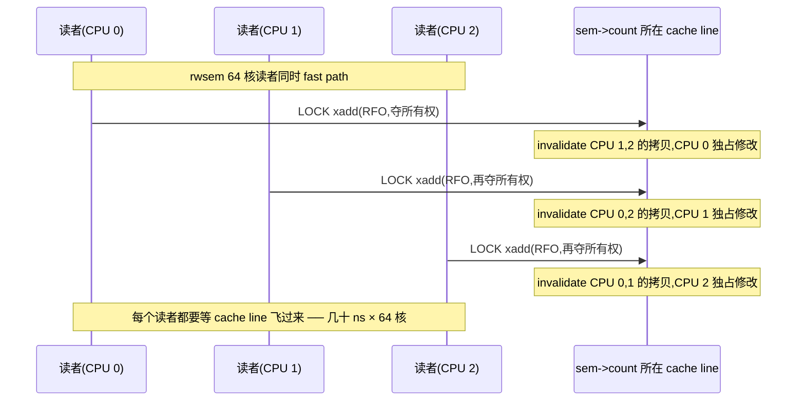
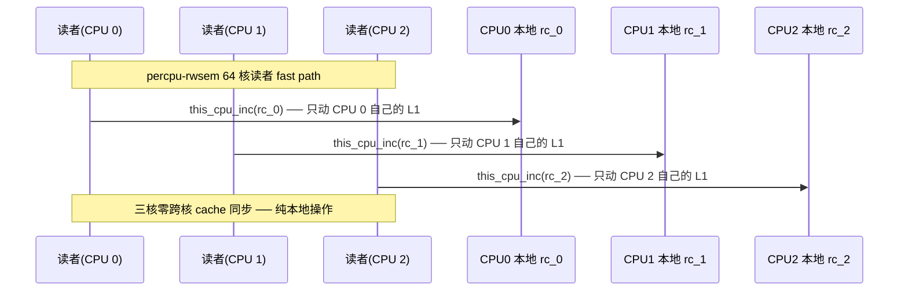
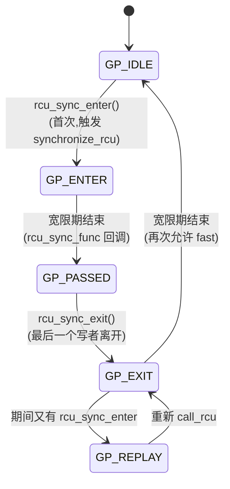
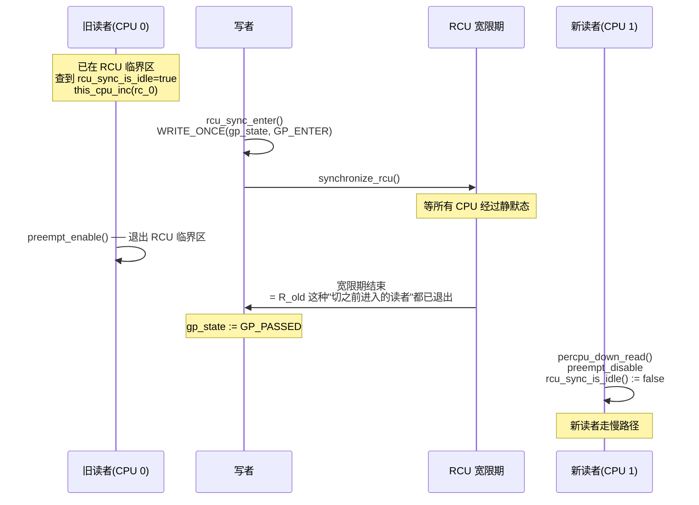
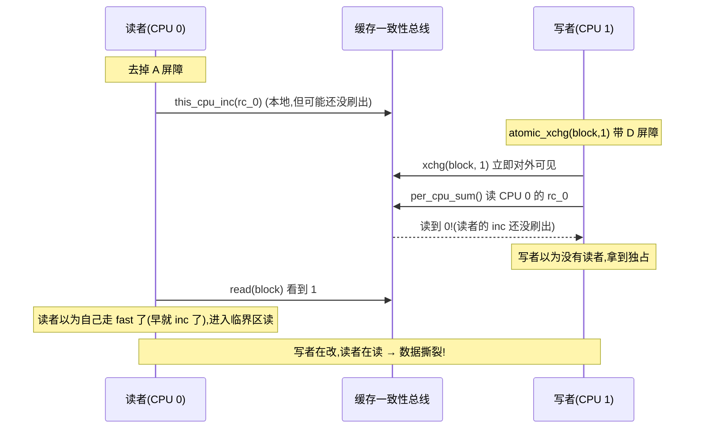
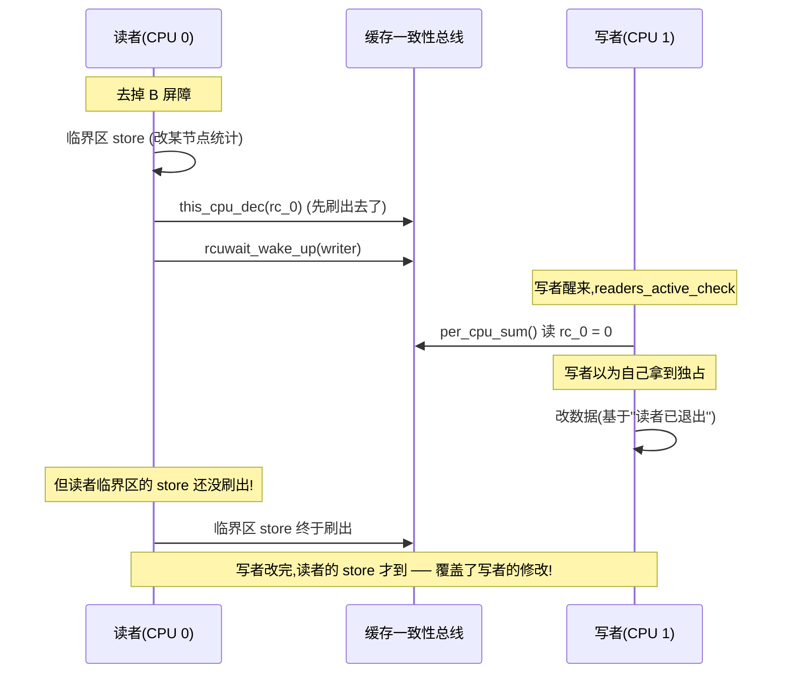

# 第十二篇 · percpu-rwsem:per-cpu 计数器换读者零争用

> 篇:P4 读写锁(末章)
> 主线呼应:读到上一章末尾,你已经把 rwsem 的乐观读路径吃透了——读者 fast path 一条 `atomic_long_add_return_acquire(&sem->count, RWSEM_READER_BIAS)` 就挤进临界区、A-D-S 三段手写屏障保证慢路径不丢唤醒、owner 低位标志控制乐观自旋。**rwsem 已经把"多读者"这件事做到了它能力范围内的极限**。但故事还没完:rwsem 的读者 fast path 再快,也是**所有读者改同一个 `count` 字段**。这条 `count` 在内存里只有一份,它存在哪个 CPU 的 cache line 里?——任意一个 CPU 上。64 核机器上,64 个读者同时 `atomic_add_return_acquire` 这条 cache line,会发生什么?**缓存一致性协议(MESI)会让这条 cache line 在 64 个 CPU 之间乒乓来乒乓去**,每次原子加都触发一次跨核 invalidate + 重新读入,几十纳秒的 cache 同步开销摊到每个读者头上。rwsem 的乐观读解决了"读者要不要睡"的问题,却解决不了"读者要不要抢同一条 cache line"的问题。本章讲一个激进设计:**percpu-rwsem**——给每个 CPU 一个本地 `read_count` 计数器,读者只 `this_cpu_inc` 本地计数(动的是**自己 CPU 的 cache line**,零跨核争用);写者拿锁时,才挨个把所有 CPU 的本地计数和全局状态切换到慢路径(借 `rcu_sync` 状态机 + `synchronize_rcu` 宽限期,确保所有快路径读者都已退出)。读者几乎免费、写者非常贵——但读极多写极少的场景(cgroup 切换、静默态切换、superblock 冻结),这笔交易血赚。本章是全书"为什么 sound"最硬核的几处之一:写者凭什么确信"所有快路径读者都已退出"?答案藏在 `rcu_sync` 状态机 + 两对 `smp_mb`(A 配 D、B 配 C)的精巧配对里。

## 核心问题

**rwsem 在 64 核读者同时 fast path 时,为什么会 cache line 乒乓?percpu-rwsem 用 per-cpu 本地 `read_count` 把读者争用消灭到零,但写者怎么确信"在它切换状态之前进入的所有快路径读者都已经退出了"——具体地,`rcu_sync_enter` + `synchronize_rcu` + `per_cpu_sum` 这三步怎么配合,以及读者快路径里的 `smp_mb`(A)、读者放锁的 `smp_mb`(B)、写者切状态的 `atomic_xchg`(D)、写者求和后的 `smp_mb`(C)这四道屏障两两配对,具体堵的是哪条执行序?**

读完本章你会明白:

1. **rwsem 的乒乓病根**:读者 fast path 的 `atomic_long_add_return_acquire(&sem->count, ...)` 在 64 核同时进入时,每次都触发 MESI invalidate——核越多,锁越慢,可扩展性是负的。
2. **percpu-rwsem 的结构**:`struct percpu_rw_semaphore` 里 `read_count` 是 `unsigned int __percpu *`,每个 CPU 一份本地计数;外加 `rss`(rcu_sync 状态机)、`block`(全局快慢路径开关)、`writer`(rcuwait)、`waiters`(wait queue)。
3. **读者快路径**:`percpu_down_read` 内联([include/linux/percpu-rwsem.h#L47-L71])先 `preempt_disable`(同时进入 RCU-sched 读临界区),查 `rcu_sync_is_idle(&sem->rss)`——若 idle(状态机在 `GP_IDLE`),直接 `this_cpu_inc(*sem->read_count)` 完事(零争用,只动本地 cache line);否则进慢路径 `__percpu_down_read`。快路径**凭什么 sound**:preempt_disable 保证读者在 `this_cpu_inc` 那条 CPU 上跑完(不会被迁移),rcu_sync 的 idle 检查 + 一条 RCU 宽限期 + `smp_mb` 配对,保证写者要么看到读者的 `read_count` 自增、要么读者看到写者的 `block=1`。
4. **写者重路径**:`percpu_down_write` 先 `rcu_sync_enter` 切全局状态(fast→slow,借 `synchronize_rcu` 等一个宽限期让所有"在切之前已进入"的读者都被看见),再 `__percpu_down_write_trylock` 用 `atomic_xchg(&sem->block, 1)`(同时带 `smp_mb` D)做写者互斥,然后 `rcuwait_wait_event` + `readers_active_check`(逐 CPU 求和 + `smp_mb` C)等所有读者清零。
5. ★ 对照《内存分配器》tcmalloc/jemalloc 的 per-CPU cache——同源思想:**把竞争消灭在结构里,每核一份**。对照《Go runtime》sync.Pool 的 per-P 本地缓存也是同款。

---

> **逃生阀**:这一章最难的是写者"等所有读者退出"那段,涉及 `rcu_sync` 状态机、RCU 宽限期、四道 `smp_mb` 的两两配对。如果你之前没接触过 per-cpu 变量和 RCU 宽限期,**先抓三句金句**:(1)读者只动**自己 CPU** 的计数,根本不和别的 CPU 打交道,所以零争用;(2)写者先用 `rcu_sync_enter` 把全局状态从 fast 切到 slow,借 RCU 宽限期让所有"切之前进入的快路径读者"都跑到 `percpu_up_read` 退出;(3)切换之后新读者看 `rcu_sync_is_idle` 为 false,自动走慢路径去 `wait queue` 排队。这三句话立住,本章的骨架就立住了。细节里的四道屏障配对,等真碰到"读者在切换瞬间正在进入"的边角执行序再回来查。

## 12.1 一句话点破

> **percpu-rwsem 把"读者计数"这一份共享数据,**拆成 64 份——每 CPU 一份**。读者只对自己那份做 `this_cpu_inc`,动的是自己 CPU 的 L1 cache line,跨核零争用。写者付的代价是把全局状态从 fast 切到 slow(借 `rcu_sync` + 一个 RCU 宽限期,让所有"切之前进入的快路径读者"都跑到放锁)、再逐 CPU 求和等清零——非常重。但只要读极多写极少,读者省下的纳秒 × 上亿次,远远盖过写者偶尔付的微秒。这个设计 sound 的根,是 `rcu_sync_enter` 把状态切换的"通知"借 RCU 宽限期送达所有 CPU、加上读者快路径 `smp_mb`(A) 与写者切状态 `atomic_xchg`(D)、读者放锁 `smp_mb`(B) 与写者求和 `smp_mb`(C) 的两两配对——堵死了"读者在切换瞬间正在进入"那条竞态窗口。

这是结论,不是理由。本章倒过来拆:先看 rwsem 在 64 核同时读时撞的"乒乓"墙,再看 percpu-rwsem 怎么用 per-cpu 拆解,然后钻读者快路径的零争用、写者重路径的切换 + 等宽限期 + 逐 CPU 求和,最后把 `rcu_sync` 状态机和四道屏障配对的"为什么 sound"用反例时序拆透。

---

## 12.2 为什么需要 percpu-rwsem:rwsem 的 cache line 乒乓

先立起 percpu-rwsem 的存在理由。上一章末尾已经预告了 rwsem 的"甩不掉的尾巴":所有读者 fast path 都改同一份 `count`。现在把这个"尾巴"具体化——它到底有多伤?

`atomic_long_add_return_acquire(&sem->count, RWSEM_READER_BIAS)` 这条指令,在 x86 上展开是带 `LOCK` 前缀的 `add`(`lock xadd`)。`LOCK` 前缀在硬件层的语义是:**独占这条 cache line**——具体地,CPU 0 发出一个 Read-For-Ownership(RFO)信号,把包含 `sem->count` 的那条 cache line 从所有别的 CPU 的 cache 里失效掉(invalidate),拉到自己 cache 里独占修改。等下个 CPU 1 也 `atomic_add`,它又要把这条 cache line 从 CPU 0 夺过来(再 invalidate CPU 0 的拷贝)。



这就是**缓存行乒乓(cache line ping-pong)**。在 64 核机器上,如果 64 个读者同时 fast path,这条 cache line 像个皮球一样在 64 个核之间飞来飞去,**每个读者都要等它飞到自己 cache 里才能改**。一次原子加从理想情况下的几纳秒,退化成几十甚至上百纳秒的 cache 同步延迟——而且**核越多越慢**(可扩展性是负的)。

> **不这样会怎样**:用 rwsem 保护一个被 64 核高频读的结构(例如 `tasklist_lock` 在某些老路径、或 sysbench 注入只读查询),读者 fast path 的 cache line 乒乓会成为头号瓶颈。`/proc/lock_stat` 里会看到这把锁的 `contention` 随核数线性恶化——加再多核都不解决问题,甚至越加越慢。这就是为什么内核在 cgroup、superblock 冻结、memory hotplug 这些**读极多写极少**的场景,放弃 rwsem 改用 percpu-rwsem:**让读者根本不抢同一条 cache line**。

---

## 12.3 percpu-rwsem 的结构:per-CPU 计数器 + rcu_sync + block 开关

先认识 percpu-rwsem 的全部字段([include/linux/percpu-rwsem.h#L12-L21]):

```c
struct percpu_rw_semaphore {
    struct rcu_sync      rss;                 /* ← 状态机,管 fast/slow 切换 */
    unsigned int __percpu *read_count;        /* ← 每 CPU 一份本地读者计数 */
    struct rcuwait       writer;              /* ← 写者在这睡,等读者清零 */
    wait_queue_head_t    waiters;             /* ← 切到慢路径的读者/写者排队 */
    atomic_t             block;               /* ← 全局快慢路径开关:0=fast,1=slow */
#ifdef CONFIG_DEBUG_LOCK_ALLOC
    struct lockdep_map   dep_map;
#endif
};
```

五个字段,各自的角色:

```
  struct percpu_rw_semaphore(简化布局):

  ┌────────────────────────────────────────────────────────────────┐
  │ struct rcu_sync rss        ← 状态机 GP_IDLE/ENTER/PASSED/EXIT/REPLAY │
  │                              (rcu_sync_is_idle 判断读者走 fast/slow) │
  ├────────────────────────────────────────────────────────────────┤
  │ unsigned int __percpu *    │  CPU 0 │ CPU 1 │ CPU 2 │ ... │ CPU N │
  │   read_count    ──────────>│  rc_0  │  rc_1  │  rc_2  │ ... │  rc_N │
  │                            │(本地) │(本地) │(本地) │     │(本地) │
  ├────────────────────────────────────────────────────────────────┤
  │ struct rcuwait writer      ← 写者在这 rcuwait_wait_event 等读者清零    │
  │ wait_queue_head_t waiters  ← 切到 slow 的读者/写者在这排队睡眠          │
  │ atomic_t block             ← 0=读者可走 fast path, 1=读者必须走 slow  │
  └────────────────────────────────────────────────────────────────┘
```

### `read_count`:per-CPU 计数器是读者零争用的根

`read_count` 的类型是 `unsigned int __percpu *`——`__percpu` 是内核里 per-cpu 变量的标记。`alloc_percpu(int)`(见 [`__percpu_init_rwsem`](../linux/kernel/locking/percpu-rwsem.c#L14-L31) 的 L17)给每个 CPU 分配一份独立的 `unsigned int`,把这 N 份的偏移塞进 `sem->read_count`。访问时用 `this_cpu_inc(*sem->read_count)` 这种 per-cpu 原语,硬件上**只读写当前 CPU 的那份**——不触发任何跨核 cache 同步。



读者写自己 CPU 的 cache line,这 line 在自己 CPU 的 L1 里,不会被别的 CPU invalidate——**根本不存在共享**,所以也就没有乒乓。这是 percpu-rwsem 读者快路径的全部精华。

### `rss`(rcu_sync):状态机管 fast/slow 切换

`struct rcu_sync` 是个轻量的状态机(详见 [`include/linux/rcu_sync.h#L17-L23`](../linux/include/linux/rcu_sync.h#L17-L23) 和 [`kernel/rcu/sync.c`](../linux/kernel/rcu/sync.c)),五个状态([sync.c#L13](../linux/kernel/rcu/sync.c#L13)):



读者快路径只关心一件事:`rcu_sync_is_idle(&sem->rss)` 返回什么。看这个内联函数([rcu_sync.h#L32-L37](../linux/include/linux/rcu_sync.h#L32-L37)):

```c
static inline bool rcu_sync_is_idle(struct rcu_sync *rsp)
{
    RCU_LOCKDEP_WARN(!rcu_read_lock_any_held(),
             "suspicious rcu_sync_is_idle() usage");
    return !READ_ONCE(rsp->gp_state); /* GP_IDLE */
}
```

就一行:`!gp_state`——状态机在 `GP_IDLE`(值 0)时返回 true,读者走 fast path;否则 false,读者走慢路径。**注意那个 `RCU_LOCKDEP_WARN(!rcu_read_lock_any_held(), ...)`**——它在提醒调用者:你必须在一个 RCU 读临界区里调它。这个约束在读者快路径里靠 `preempt_disable` 满足(下一节讲为什么)。

> **钉死这件事**:percpu-rwsem 把"读者走哪条路"压在一个布尔判断 `rcu_sync_is_idle(&sem->rss)` 上。写者切换这个判断的值(从 idle 切到非 idle),借 RCU 宽限期把切换的"通知"送达所有 CPU——读者要么在切换前读到 idle(走 fast)、要么在切换后读到非 idle(走 slow),竞态窗口由屏障配对堵死。

### `block`:写者互斥的开关

`block` 是一个 `atomic_t`。它有两个作用:

1. **写者之间互斥**:写者拿锁时用 `atomic_xchg(&sem->block, 1)`([__percpu_down_write_trylock](../linux/kernel/locking/percpu-rwsem.c#L84-L90) L89),只有从 0 抢到 1 的写者才进临界区,别的写者抢不到。同时 `atomic_xchg` 本身带全屏障(`smp_mb`),这是配对屏障 D 的来源。
2. **告诉新读者走慢路径**:一旦 `block` 被置 1,任何尝试走快路径的读者在 [`__percpu_down_read_trylock`](../linux/kernel/locking/percpu-rwsem.c#L48-L82) L73 那条 `if (likely(!atomic_read_acquire(&sem->block)))` 上失败,跳到慢路径排队。

> **为什么需要两个标志(`rss` 状态 + `block` 开关)**:`rss` 状态机是"全局读者侧的快慢路径指示",`block` 是"写者是否在场"。读者进 fast path 的条件是 `rcu_sync_is_idle && !block`(两个条件在快慢路径的不同位置检查,具体见 12.4)。写者 `percpu_down_write` 把这两个状态按一个**严格顺序**翻转:先 `rcu_sync_enter`(切 `rss`)+ 等宽限期 → 再置 `block`。这个顺序是 sound 的命脉,12.5 拆。

---

## 12.4 读者快路径:为什么 `this_cpu_inc` 是零争用

现在正式钻读者快路径。公开接口 [`percpu_down_read`](../linux/include/linux/percpu-rwsem.h#L47-L71) 是个内联函数:

```c
static inline void percpu_down_read(struct percpu_rw_semaphore *sem)
{
    might_sleep();
    rwsem_acquire_read(&sem->dep_map, 0, 0, _RET_IP_);

    preempt_disable();
    /*
     * We are in an RCU-sched read-side critical section, so the writer
     * cannot both change sem->state from readers_fast and start checking
     * counters while we are here. ...
     */
    if (likely(rcu_sync_is_idle(&sem->rss)))
        this_cpu_inc(*sem->read_count);
    else
        __percpu_down_read(sem, false); /* Unconditional memory barrier */
    /*
     * The preempt_enable() prevents the compiler from
     * bleeding the critical section out.
     */
    preempt_enable();
}
```

四件事,顺序不能乱:

1. **`preempt_disable()`**:关抢占。这步做两件事:(a) 让后续 `this_cpu_inc` 不被迁移到别的 CPU(否则计数错位,见 12.7);(b) **同时进入 RCU-sched 读临界区**——在 Linux 内核里,`preempt_disable()` 等价于 `rcu_read_lock_sched()`(P5-13 会详讲)。注释 L54-61 明明白白说"We are in an RCU-sched read-side critical section"。
2. **查 `rcu_sync_is_idle(&sem->rss)`**:查状态机。**必须在一个 RCU 读临界区里查**——这正是上面 `preempt_disable` 的第二个目的。为什么必须这样,12.5 讲写者 `synchronize_rcu` 时拆透。
3. **走 fast / 走 slow**:
   - 状态 idle(`GP_IDLE`):`this_cpu_inc(*sem->read_count)` 一句,完事。这是读者快路径的全部内容——一条 per-cpu 自增指令。
   - 状态非 idle:`__percpu_down_read(sem, false)` 进慢路径([percpu-rwsem.c#L167-L183](../linux/kernel/locking/percpu-rwsem.c#L167-L183)),里面会调用 `__percpu_down_read_trylock`(再试一次)失败后 `percpu_rwsem_wait` 睡眠在 `sem->waiters` 队列上。
4. **`preempt_enable()`**:开抢占,同时退出 RCU-sched 读临界区。注释 L66-69 强调:"The preempt_enable() prevents the compiler from bleeding the critical section out"——`preempt_enable` 里有 `barrier()`,防止编译器把临界区代码(读者读共享数据的那些代码)"漏出"到 `preempt_enable` 之后,这会破坏 RCU-sched 读临界区的边界。

### 读者快路径的全部开销

读者走 fast path 时,**总开销**就是这几条指令:

```text
  preempt_disable      ; 写 preempt_count,本地 cache line
  READ_ONCE(gp_state)  ; 读 rss,本地 cache 命中(没写者时这个字段不动)
  this_cpu_inc(rc)     ; 写本 CPU 的 read_count,本地 cache line
  preempt_enable       ; 写 preempt_count
```

**全部是本地 cache line 操作**——没有一次跨核 cache 同步,没有 `LOCK` 前缀(`this_cpu_inc` 在 x86 上展开为非原子的 `incl %gs:rc`,因为 preemption 已关、中断就算来也只是延迟,这条 CPU 上没有并发)。这就是 percpu-rwsem 读者"几乎免费"的根。

> **为什么 sound**:`this_cpu_inc` 之所以不需要原子指令,是因为 `preempt_disable` 把当前 task 钉死在这条 CPU 上——同一 CPU 上没有别的执行流并发改 `read_count`(中断就算抢占也只是临时打断,中断处理里不会再调 `percpu_down_read`)。所以这个计数器**单 CPU 视角下是串行的**,不需要原子性保证。多核的并发性,由"每个 CPU 一份独立的 `read_count`"在结构上消灭——根本不共享。

### 读者慢路径 `__percpu_down_read`

状态不是 idle 时(`rcu_sync_is_idle` 返回 false),读者走 [`__percpu_down_read`](../linux/kernel/locking/percpu-rwsem.c#L167-L183):

```c
bool __sched __percpu_down_read(struct percpu_rw_semaphore *sem, bool try)
{
    if (__percpu_down_read_trylock(sem))
        return true;

    if (try)
        return false;

    trace_contention_begin(sem, LCB_F_PERCPU | LCB_F_READ);
    preempt_enable();
    percpu_rwsem_wait(sem, /* .reader = */ true);
    preempt_disable();
    trace_contention_end(sem, 0);

    return true;
}
```

注意 [`__percpu_down_read_trylock`](../linux/kernel/locking/percpu-rwsem.c#L48-L82) 内部已经做了一次"再试一次":

```c
static bool __percpu_down_read_trylock(struct percpu_rw_semaphore *sem)
{
    this_cpu_inc(*sem->read_count);            /* L50 */

    /*
     * ... 注释:由于 preempt 已关,自增和自减在同一 CPU 上,避免"一个 CPU 加另一个 CPU 减"问题。
     * 如果读者错过了写者对 sem->block 的赋值,那么写者一定能看到读者的自增。
     * 反过来,任何在写者扫到之后才自增的读者,一定能看到 block=1,
     * 因此一定会立即减回自己的 read_count,所以写者错过它们也无所谓。
     */
    smp_mb(); /* A matches D */

    if (likely(!atomic_read_acquire(&sem->block)))
        return true;

    this_cpu_dec(*sem->read_count);
    /* Prod writer to re-evaluate readers_active_check() */
    rcuwait_wake_up(&sem->writer);
    return false;
}
```

这段注释 L52-65 是全章最精华的注释,直接把 sound 性写明了。拆它:

1. **先加再查**:`this_cpu_inc` 在前(L50),`if (!atomic_read_acquire(&sem->block))` 在后(L73)。这保证:**如果读者错过写者的 `block=1` 赋值,那么写者一定看到读者的 `read_count` 自增**——这是配对屏障 A 配 D 的核心语义(下一节反例拆透)。
2. **失败要回滚**:如果 `block` 已是 1(写者在写),读者要立即 `this_cpu_dec`(L76)把自己刚才的 `inc` 撤回去——否则 `read_count` 永远清不了零,写者永远等不到。
3. **主动踢写者一下**:`rcuwait_wake_up(&sem->writer)`(L79)——回滚后,可能写者正好在 `readers_active_check` 里求和,看到的 sum 仍然非零,睡回去了。读者回滚后 sum 变 0 了,但要等写者自己醒就太慢。所以读者主动唤醒写者重新检查。

慢路径里如果 trylock 还是失败,`preempt_enable`(让出 RCU 临界区才能睡),然后 [`percpu_rwsem_wait`](../linux/kernel/locking/percpu-rwsem.c#L141-L165) 把读者挂到 `sem->waiters` 队列上 `schedule()` 睡眠,睡到写者 `percpu_up_write` 唤醒它。

> **钉死这件事**:读者慢路径 `__percpu_down_read_trylock` 是"再试一次"——它不是直接睡,而是先把本地 `read_count` 加 1,再做一次"全屏障 + 读 block"。这个"加在前、查在后"的顺序不是随便写的,是配对屏障 A 的来源,和写者置 block 时的 `atomic_xchg`(自带 D 屏障)严格配对。少了 A,会出现"读者看不到 block=1,但写者也看不到读者的 inc"的撕裂——具体怎么撕裂,12.7 反例拆。

---

## 12.5 写者重路径:rcu_sync_enter + 等 RCU 宽限期 + 逐 CPU 求和

读者这么便宜,代价全压到写者头上。看 [`percpu_down_write`](../linux/kernel/locking/percpu-rwsem.c#L224-L257):

```c
void __sched percpu_down_write(struct percpu_rw_semaphore *sem)
{
    bool contended = false;

    might_sleep();
    rwsem_acquire(&sem->dep_map, 0, 0, _RET_IP_);

    /* Notify readers to take the slow path. */
    rcu_sync_enter(&sem->rss);

    /*
     * Try set sem->block; this provides writer-writer exclusion.
     * Having sem->block set makes new readers block.
     */
    if (!__percpu_down_write_trylock(sem)) {
        trace_contention_begin(sem, LCB_F_PERCPU | LCB_F_WRITE);
        percpu_rwsem_wait(sem, /* .reader = */ false);
        contended = true;
    }

    /* smp_mb() implied by __percpu_down_write_trylock() on success -- D matches A */
    /*
     * If they don't see our store of sem->block, then we are guaranteed to
     * see their sem->read_count increment, and therefore will wait for them.
     */

    /* Wait for all active readers to complete. */
    rcuwait_wait_event(&sem->writer, readers_active_check(sem), TASK_UNINTERRUPTIBLE);
    if (contended)
        trace_contention_end(sem, 0);
}
```

三步:**切换全局状态 → 抢 block → 等读者清零**。逐个拆。

### 第一步:`rcu_sync_enter` 切全局状态

[`rcu_sync_enter`](../linux/kernel/rcu/sync.c#L105-L140) 把 `sem->rss` 状态机从 `GP_IDLE` 推到至少 `GP_PASSED`。核心是这一段([sync.c#L128-L140](../linux/kernel/rcu/sync.c#L128-L140)):

```c
    if (gp_state == GP_IDLE) {
        /*
         * ... this simply does the "synchronous"
         * call_rcu(rcu_sync_func) which does GP_ENTER -> GP_PASSED.
         */
        synchronize_rcu();
        rcu_sync_func(&rsp->cb_head);
        return;
    }

    wait_event(rsp->gp_wait, READ_ONCE(rsp->gp_state) >= GP_PASSED);
```

`rcu_sync_enter` 返回后,所有 CPU 上后续调用 `rcu_sync_is_idle` 都会返回 false——**因为 `gp_state` 已 >= `GP_PASSED`(非 0)**。这是写者通知所有读者"以后走慢路径"的机制。

**这里 `synchronize_rcu` 是 sound 的命脉**——它在等什么?等一个 RCU 宽限期,等所有 CPU 都至少经过一次静默态(不在 RCU 读临界区里)。回忆读者快路径:读者用 `preempt_disable` 进了 RCU-sched 读临界区,在 `rcu_sync_is_idle` 返回 true 后,会在**这个临界区里**做 `this_cpu_inc`。写者的 `synchronize_rcu` 等的就是:**所有在写者改 `gp_state` 之前已经查过 `rcu_sync_is_idle` 看到 true、正在这个临界区里执行的读者,都跑完 `preempt_enable` 退出 RCU 临界区**。



**为什么要等这个宽限期**:如果写者不等宽限期,直接改 `gp_state` 到 `GP_PASSED`,那么 CPU 0 上的旧读者可能已经查过 `rcu_sync_is_idle` 拿到 true、正在 `this_cpu_inc` 的半路上——它后来放锁时按 fast path 走 `this_cpu_dec`(也是本地减),写者根本看不见。读者走了 fast path 的 dec,但写者不知道,在 `readers_active_check` 里干等 sum 清零——**死等**。宽限期保证这种情况不存在:**宽限期结束时,所有"切之前进入的快路径读者"都已 `preempt_enable` 退出临界区**——它们要么已经放完锁(`rc_0` 减回 0)、要么还在持锁但写者能看见(因为这时它们已经过了静默态,后续会走慢路径)。

> **为什么 sound(粗版)**:`rcu_sync_enter` 里的 `synchronize_rcu` 把"切状态这个动作的可见性"和"读者退出 RCU 临界区"绑定——RCU 宽限期结束时,要么写者看到 `gp_state := GP_PASSED` 已经对旧读者可见(那旧读者下次进 fast path 会读到非 idle、走慢路径)、要么写者看到旧读者已经退出临界区(它要么放完锁、要么在下次进入时被切到慢路径)。竞态窗口被宽限期消灭。

### 第二步:`__percpu_down_write_trylock` 抢 block(写者互斥)

状态切完,写者抢 block([percpu-rwsem.c#L84-L90](../linux/kernel/locking/percpu-rwsem.c#L84-L90)):

```c
static inline bool __percpu_down_write_trylock(struct percpu_rw_semaphore *sem)
{
    if (atomic_read(&sem->block))
        return false;

    return atomic_xchg(&sem->block, 1) == 0;
}
```

`atomic_xchg(&sem->block, 1)` 是把 `block` 原子地置 1,返回旧值。**只有返回 0 的写者才算抢到**——这保证多个写者同时来时只有一个能进。同时 `atomic_xchg` 在所有架构上都是**全屏障**(`smp_mb` 语义)——这就是配对屏障 D 的来源([percpu-rwsem.c#L244](../linux/kernel/locking/percpu-rwsem.c#L244) 注释 "smp_mb() implied by __percpu_down_write_trylock() on success -- D matches A")。

> **为什么先切 rss 再置 block,不能反过来**:如果先置 block 再切 rss,会出现什么?读者 fast path 里查 `rcu_sync_is_idle` 是 true(因为 rss 还没切),走 `this_cpu_inc`;这时 block 已经被置 1,读者却已经在 fast path 里加完计数了——它根本没看到 block。然后写者 `readers_active_check` 求和,看到这条读者加的计数,死等清零——而读者其实已经走 fast path 放锁了(`this_cpu_dec`),写者不知道。**死锁**。所以必须先切 rss(借宽限期把旧读者"赶走"或看见)、再置 block——这个顺序是 sound 的根。

### 第三步:`readers_active_check` 等所有读者清零

block 抢到后,写者要等所有"已进入的读者"放锁。这一步是 [`rcuwait_wait_event(&sem->writer, readers_active_check(sem), TASK_UNINTERRUPTIBLE)`](../linux/kernel/locking/percpu-rwsem.c#L253),核心是 [`readers_active_check`](../linux/kernel/locking/percpu-rwsem.c#L209-L222):

```c
static bool readers_active_check(struct percpu_rw_semaphore *sem)
{
    if (per_cpu_sum(*sem->read_count) != 0)
        return false;

    /*
     * If we observed the decrement; ensure we see the entire critical
     * section.
     */
    smp_mb(); /* C matches B */

    return true;
}
```

`per_cpu_sum`(宏定义见 [percpu-rwsem.c#L185-L193](../linux/kernel/locking/percpu-rwsem.c#L185-L193))就是 `for_each_possible_cpu` 把每个 CPU 的 `read_count` 加起来。如果 sum 不是 0,说明还有读者在临界区——返回 false,写者通过 `rcuwait_wait_event` 睡回(等读者 `percpu_up_read` 里的 `rcuwait_wake_up(&sem->writer)` 唤醒它重新检查)。如果 sum 是 0,再做一道 `smp_mb`(C 配 B),返回 true——写者正式独占。

**为什么求和为 0 还要 `smp_mb`(C)**:因为求和是"读"操作,读者 `percpu_up_read` 里减完 count 后还要继续跑临界区尾巴的代码——写者"看到 sum=0"后,还要保证能看到读者**整个临界区**的副作用(否则写者以为读者退出了,改数据,但读者的 store 还没刷出去,撕裂)。这道 C 屏障和读者放锁的 B 屏障配对,堵的就是这条撕裂——12.7 反例拆透。

### 写者放锁:`percpu_up_write`

写完临界区,写者 [`percpu_up_write`](../linux/kernel/locking/percpu-rwsem.c#L259-L287) 放锁,三步:

```c
void percpu_up_write(struct percpu_rw_semaphore *sem)
{
    rwsem_release(&sem->dep_map, _RET_IP_);

    /*
     * Signal the writer is done, no fast path yet.
     * ... we force it through the slow path which guarantees an
     * acquire and thereby guarantees the critical section's consistency.
     */
    atomic_set_release(&sem->block, 0);          /* L273 */

    /* Prod any pending reader/writer to make progress. */
    __wake_up(&sem->waiters, TASK_NORMAL, 1, sem);

    /*
     * Once this completes (at least one RCU-sched grace period hence) the
     * reader fast path will be available again. ...
     */
    rcu_sync_exit(&sem->rss);                    /* L285 */
}
```

注意顺序:**先清 block(L273)→ 唤醒队列(L278)→ `rcu_sync_exit`(L285)**。`atomic_set_release(&sem->block, 0)` 用 release 序,保证写者临界区的所有 store 在 block 清 0 之前对读者可见——所以新进快路径的读者(看见 block=0)看到的一定是写者写完的数据。

`rcu_sync_exit` 启动**另一个 RCU 宽限期**([sync.c#L152-L167](../linux/kernel/rcu/sync.c#L152-L167)),这个宽限期结束后状态机才回到 `GP_IDLE`——**此时读者才重新允许走 fast path**。为什么放锁不立刻允许 fast path?源码注释 L267-272 解释:新读者可能"没看到写者临界区的结果",所以强制它们再走一次慢路径(慢路径里有 acquire),保证看到写者临界区的修改。等宽限期过后,所有读者都"绕了一圈"经过静默态,这才能重新走 fast path。

> **钉死这件事**:写者拿锁 + 放锁的完整路径要付**两次 RCU 宽限期**(一次 enter、一次 exit)、一次逐 CPU 求和、若干屏障。在 64 核机器上,每个宽限期是几十微秒到毫秒级,逐 CPU 求和是 64 次跨核读——**写者延迟是读者 fast path 的几千倍**。但只要读多写少(例如 cgroup 切换几秒一次、superblock 冻结几小时一次),读者省下的纳秒 × 上亿次调用,完全值回票价。这就是 percpu-rwsem 的不对称本质:**读者几乎免费、写者非常贵**,专为读极多写极少场景而存在。

---

## 12.6 读者放锁:fast 和 slow 两种路径

读者放锁 [`percpu_up_read`](../linux/include/linux/percpu-rwsem.h#L97-L122) 也是内联,和 `percpu_down_read` 对称:

```c
static inline void percpu_up_read(struct percpu_rw_semaphore *sem)
{
    rwsem_release(&sem->dep_map, _RET_IP_);

    preempt_disable();
    if (likely(rcu_sync_is_idle(&sem->rss))) {
        this_cpu_dec(*sem->read_count);
    } else {
        /*
         * slowpath; reader will only ever wake a single blocked writer.
         */
        smp_mb(); /* B matches C */
        this_cpu_dec(*sem->read_count);
        rcuwait_wake_up(&sem->writer);
    }
    preempt_enable();
}
```

两种路径:

- **状态 idle**:直接 `this_cpu_dec`——零开销。读者进 fast、出 fast,从头到尾不跨核。
- **状态非 idle(写者在等)**:`smp_mb()` B 配写者的 C + `this_cpu_dec` + `rcuwait_wake_up(&sem->writer)`。这里的 `smp_mb` 和 `rcuwait_wake_up` 很关键——读者减完计数,必须主动唤醒写者(`rcuwait_wake_up`),否则写者还在 `rcuwait_wait_event` 里睡,根本不知道有读者退出了。

> **为什么 slow 路径放锁要有 `smp_mb`(B)**:写者 `readers_active_check` 看到的是"`read_count` sum == 0"——但读者减 count 之前可能还有临界区的 store 没刷出去。如果读者只 `this_cpu_dec` 没有 B 屏障,写者看到 sum=0 后立刻改数据,可能撞上读者临界区还没刷完的 store。B 配 C 保证:**写者看到读者的 dec,一定也看到读者整个临界区的副作用**。具体反例 12.7 拆。

---

## 12.7 技巧精解:四道屏障两两配对为什么 sound

本章技巧精解挑**四道 `smp_mb` 的两两配对**:A 配 D、B 配 C。这是 percpu-rwsem 全部 sound 性的命脉,也是全书"屏障配对"思想最精巧的一处——比 rwsem 的 A-D-S 配对更复杂,因为它涉及"读者正在进入"和"读者正在退出"两个方向的竞态。

### 12.7.1 A 配 D:读者进入 vs 写者切状态

先看代码锚点:

- **A 屏障**:读者 [`__percpu_down_read_trylock`](../linux/kernel/locking/percpu-rwsem.c#L48-L82) L67,`this_cpu_inc` 在前,`atomic_read_acquire(&sem->block)` 在后,中间 A。
- **D 屏障**:写者 [`__percpu_down_write_trylock`](../linux/kernel/locking/percpu-rwsem.c#L84-L90) L89 的 `atomic_xchg(&sem->block, 1)`,自带全屏障 D(源码注释 [percpu-rwsem.c#L244](../linux/kernel/locking/percpu-rwsem.c#L244) 明确写了 "smp_mb() implied ... -- D matches A")。

配对的逻辑是经典的"消息传递"模式(P1-03 章已立)的变种:

- **读者侧**:`this_cpu_inc(rc)` → `smp_mb`(A)→ `read(block)`。
- **写者侧**:`xchg(block, 1)`(带 D)→ `per_cpu_sum(rc)`。

**A 配 D 的语义**:**如果读者没看到写者写的 block=1,那么写者一定看到读者写的 read_count 自增**。这是源码注释 [percpu-rwsem.c#L57-65](../linux/kernel/locking/percpu-rwsem.c#L57-L65) 那段话的内核版翻译。

#### 反例:去掉 A 会怎样

假设读者没有 A 屏障:

```c
/* 读者(错版) */
this_cpu_inc(*sem->read_count);
/* smp_mb();  ← 假设去掉 A */
if (!atomic_read_acquire(&sem->block))   /* 看到 block=0,以为可以走 fast */
    return true;
```

在弱内存序架构(ARM、POWER)上,会出现:



读者以为自己在 fast path(`this_cpu_inc` 已经做了),进入临界区读数据;写者以为没读者(sum 看到的是 0),开始独占改数据——**读者读到写者改了一半的数据,撕裂**。这就是少 A 的后果。

**有了 A 配 D**:读者的 `this_cpu_inc` 在 A 屏障之前、写者的 `per_cpu_sum` 在 D 屏障之后,所以**读者要么看到 block=1(走慢路径)、要么写者看到读者的 inc(等读者清零)**——两个攻击面堵一个,sound。

> **为什么 sound**:`smp_mb` A 配 D 是 P1-03 章消息传递屏障配对的变体。读者的 store(`this_cpu_inc`)和写者的 store(`block=1`)通过一对全屏障建立 happens-before 边:要么读者的 store 先被写者看见(写者等)、要么写者的 store 先被读者看见(读者走慢路径)。**第三态不存在,数据不撕裂**。

### 12.7.2 B 配 C:读者退出 vs 写者求和

B 和 C 配对堵的是另一条竞态——读者退出时:

- **B 屏障**:读者 [`percpu_up_read`](../linux/include/linux/percpu-rwsem.h#L97-L122) L112 slow 路径里,`this_cpu_dec` 之前的 `smp_mb`(B)。注释 L113-117 明确:"if they see our decrement ... they will also see our critical section"。
- **C 屏障**:写者 [`readers_active_check`](../linux/kernel/locking/percpu-rwsem.c#L209-L222) L219,`per_cpu_sum` 在前,`smp_mb`(C)在后。注释 L214-218 明确:"If we observed the decrement; ensure we see the entire critical section"。

**B 配 C 的语义**:**写者看到读者减到 0 的 dec,一定也看到读者整个临界区的 store**。

#### 反例:去掉 B 会怎样

假设读者放锁没有 B:

```c
/* 读者(错版) */
/* smp_mb();  ← 假设去掉 B */
this_cpu_dec(*sem->read_count);
rcuwait_wake_up(&sem->writer);
```

读者临界区里可能有 store(比如读一个链表、顺便更新了链表节点上的统计字段)。这些 store 在弱内存序架构上,可能晚于 `this_cpu_dec` 对外可见:



读者临界区的 store 晚于 dec 对外可见,写者以为读者已退出、改了数据,然后读者的 store 才到——**覆盖写者的修改**,数据错乱。

**有了 B 配 C**:读者临界区的 store 在 B 之前、`this_cpu_dec` 在 B 之后;写者 `per_cpu_sum` 在 C 之前、看到 sum=0 后 C 在求和之后。所以**写者看到 sum=0,意味着读者 dec 已对它可见,进而意味着读者整个临界区的 store 都已对它可见**(B 屏障建立的 happens-before 边)。写者改数据时,读者已经完全退出——不撕裂。

> **为什么 sound**:B 配 C 是 P1-03 章消息传递模式的另一对配对,只不过这次传的不是"flag",而是"读者临界区的副作用 + dec"。读者用 B 保证"先临界区 store、后 dec";写者用 C 保证"看到 dec 后、再读临界区访问的数据"。配对完整,写者永远不会基于"读者已退出"的假象去覆盖读者未刷完的 store。

### 12.7.3 为什么 rcu_sync_is_idle 必须在 RCU 临界区里调

最后回头看一个边角问题:`rcu_sync_is_idle` 那个 `RCU_LOCKDEP_WARN(!rcu_read_lock_any_held(), ...)` 为什么强制要在 RCU 临界区里调?

读者快路径靠 `preempt_disable` 进了 RCU-sched 读临界区(这是 P5-13 会详讲的:preempt_disable 等价于 `rcu_read_lock_sched`)。**读者查 `rcu_sync_is_idle` 拿到 true 后,要在 `preempt_enable` 之前做完 `this_cpu_inc`**——这样写者的 `rcu_sync_enter` 里的 `synchronize_rcu` 才能正确地等到这个读者退出。如果读者在查完 idle 后、做 inc 之前被抢占(`preempt_enable` 提前发生),那就脱离了 RCU 临界区,写者的宽限期可能在这里"穿过去",导致读者的 inc 在写者求和之后才发生——撕裂。`preempt_disable` 把这一段包成一个原子区间,RCU 宽限期要么在它之前过去(那读者根本没进 fast)、要么在它之后过去(那写者能看见读者的 inc)——这正是源码注释 L54-61 的意思。

> **钉死这件事**:percpu-rwsem 的全部 sound 性,藏在四道屏障配对 + 一次 RCU 宽限期里。A 配 D 堵"读者正在进入"的竞态(读者要么看到 block=1 走慢路径、要么写者看到读者的 inc);B 配 C 堵"读者正在退出"的竞态(写者看到 dec 一定看到整个临界区);`rcu_sync_enter` 里的 `synchronize_rcu` 堵"切状态的通知还没送达"的竞态(等所有旧读者退出 RCU 临界区)。**这三道保险合起来,在 64 核并发的所有执行序下,既不丢读者(读者要么被切到慢路径、要么被写者看见)、也不撕裂(读者临界区的 store 一定被写者完整看到)**。这是 percpu-rwsem 的命脉,删任何一道屏障都会在某条执行序下出错。

---

## 12.8 ★ 对照:内存分配器 / Go runtime / 调度器

percpu-rwsem 的"per-CPU 本地数据"思想,绝非 Linux 内核独有。把它和系列其它书的同源设计钉一起,才看得到"把竞争消灭在结构里"的全貌。

- **★ 对照《内存分配器》的 per-CPU cache**:tcmalloc/jemalloc 把"每个线程 / 每个 CPU 一份本地 cache"做到了极致——TCMalloc 8.x 之后把 cache 从 per-thread 改成 per-CPU(用 `thread_local` + per-CPU 数组),jemalloc 的 tcache 也是每线程一份。**思想完全同源**:分配快路径只动本地 cache(零跨核争用,不抢中心 freelist),cache miss 才去中心链表搬一批(慢路径,重)。对照 percpu-rwsem:读者快路径只动本地 `read_count`(零跨核),写者切换状态、逐 CPU 求和是慢路径(重)。两者都把"高频热路径的争用"消灭在"每核一份本地数据"里。区别只在:分配器的"中心"是 freelist,percpu-rwsem 的"中心"是写者——但本质都是"快路径本地化、慢路径中心化"的分层。
- **对照《Go runtime》的 `sync.Pool`**:Go 的 `sync.Pool` 也是 per-P(物理核)本地池——每个 P 一份 `poolLocal`,Get/Put 优先动本地,miss 才去别的 P 偷。和 percpu-rwsem 同款思想:热路径本地化。差别是 `sync.Pool` 没有"写者"概念,它是缓存池不是锁;但消灭争用的机制(per-P 本地)一样。
- **对照《Linux 调度器》的 per-CPU rq**:调度器那本讲过 `rq` 是 per-CPU 的(每 CPU 一个 `struct rq`),调度器快路径(`try_to_wake_up`、`scheduler_tick`)只动本地 `rq->lock`(spinlock),跨 CPU 唤醒才进慢路径(`migrate_task`)。这是同一思想——把"每 CPU 一份状态"做进结构,消灭跨核争用。percpu-rwsem 是这个思想在"读写锁"上的应用。
- **对照 P2-06 的 seqlock**:seqlock 读者也是"不阻塞写者"(重读版本号),percpu-rwsem 读者是"不抢同一份计数器"(per-CPU 本地计数)。两者解决的是不同维度的争用:seqlock 解决"读者要不要挡写者",percpu-rwsem 解决"读者要不要挡读者"。读者读者之间的争用,只有 per-CPU 数据能彻底消灭。

> **钉死这件事**:per-CPU 本地数据,是并发设计里"消灭争用"最普适的一招——tcmalloc 的 per-CPU cache、jemalloc 的 tcache、Go 的 sync.Pool、调度器的 per-CPU rq、percpu-rwsem 的 per-CPU read_count、甚至 P5 篇要讲的 RCU(per-CPU 静默态报告),全都是同源思想:**把高频热路径上的共享数据拆成每核一份,让跨核 cache 同步从根本上不存在**。本书和系列多本反复出现这个模式,是因为它是多核性能设计的命门——把它钉死,你就掌握了"为什么内核在 64 核机器上还能这么快"的关键一招。

---

## 章末小结

本章是第 4 篇(读写锁)的末章,我们把"读写锁"做到了极致:rwsem 仍有 cache line 乒乓,percpu-rwsem 把读者争用彻底消灭——代价是写者重路径。

把这一章钉死的五样东西:

1. **rwsem 的乒乓病根**:所有读者 fast path 都改同一份 `count`,64 核同时 `atomic_add_return_acquire` 触发 MESI invalidate——cache line 在核间乒乓,核越多越慢,可扩展性是负的。
2. **percpu-rwsem 的结构**:`struct percpu_rw_semaphore` 把读者计数拆成 `unsigned int __percpu *read_count`(每 CPU 一份),外加 `rss`(rcu_sync 状态机,管 fast/slow 切换)、`block`(全局开关)、`writer`(rcuwait)、`waiters`(wait queue)。
3. **读者快路径零争用**:`percpu_down_read` 内联 `preempt_disable` 进 RCU-sched 临界区 → `rcu_sync_is_idle` 查状态 → idle 则 `this_cpu_inc(*sem->read_count)`(只动本地 cache line,无 `LOCK` 前缀,零跨核争用)。preempt_disable 保证读者不被迁移、`this_cpu_inc` 单 CPU 串行不需原子。
4. **写者重路径三步**:`rcu_sync_enter`(切 rss + `synchronize_rcu` 等宽限期让旧读者退出)→ `__percpu_down_write_trylock`(`atomic_xchg(&sem->block, 1)`,带 D 屏障,写者互斥)→ `rcuwait_wait_event` + `readers_active_check`(`per_cpu_sum` 逐 CPU 求和等清零 + C 屏障)。放锁 `percpu_up_write` 还要付**第二次宽限期**(`rcu_sync_exit`)。**写者延迟是读者 fast path 的几千倍**。
5. **四道屏障两两配对**:A(`__percpu_down_read_trylock` L67)配 D(`__percpu_down_write_trylock` 的 `atomic_xchg`)堵"读者正在进入"的撕裂;B(`percpu_up_read` L112)配 C(`readers_active_check` L219)堵"读者正在退出"的撕裂。读者要么被切到慢路径、要么被写者看见 inc,第三态不存在。
6. ★ 对照:per-CPU 本地数据是并发设计普适招式——tcmalloc per-CPU cache、jemalloc tcache、Go sync.Pool、调度器 per-CPU rq,和 percpu-rwsem 同源,都是"把竞争消灭在结构里"。

### 五个"为什么"清单

1. **为什么 rwsem 在 64 核读密集负载下会慢?** rwsem 所有读者 fast path 都 `atomic_long_add_return_acquire(&sem->count, ...)` 同一份 `count`,触发 MESI invalidate——cache line 在 64 核间乒乓,每次原子加几十纳秒 cache 同步,核越多越慢。可扩展性是负的。
2. **为什么 percpu-rwsem 读者 `this_cpu_inc` 不需要原子指令?** `preempt_disable` 把读者钉死在当前 CPU 上,同一 CPU 上没有别的执行流并发改 `read_count`(中断只是临时打断,不会重入 `percpu_down_read`)。所以 `read_count` 单 CPU 视角下是串行的,不需要原子性。多核的并发性,由"每 CPU 一份独立的 read_count"在结构上消灭——根本不共享。
3. **为什么写者要先 `rcu_sync_enter` 再置 `block`,不能反过来?** 如果先置 block 再切 rss,会出现"读者在切之前已查过 idle=true 走了 fast path 加计数、写者求和看到这条计数死等"的死锁——读者其实已经放锁(走 fast dec),写者不知道。先切 rss + `synchronize_rcu` 宽限期,保证所有"切之前进入的快路径读者"都跑到 `preempt_enable` 退出临界区,写者才能安全地置 block、求和。
4. **A 配 D、B 配 C 这两对屏障具体堵什么?** A 配 D 堵"读者正在进入"的撕裂——读者要么看到 block=1 走慢路径、要么写者看到读者的 inc 等清零,第三态不存在。B 配 C 堵"读者正在退出"的撕裂——写者看到读者 dec 到 0,一定也看到读者整个临界区的 store。少了任何一边,弱内存序架构上会丢读者或撕裂。
5. **为什么 percpu-rwsem 适合"读极多写极少"场景?** 读者 fast path 几条本地指令(纳秒级,零跨核争用),写者重路径要付两次 RCU 宽限期 + 逐 CPU 求和(几十微秒到毫秒级)。只要读多写少,读者省下的纳秒 × 上亿次调用,完全值回写者偶尔的微秒开销。典型场景:cgroup 切换、superblock 冻结、memory hotplug、静默态切换——这些场景写几秒/几小时一次,读每秒上万次。

### 想继续深入往哪钻

- **本章用到的 per-cpu 原语**:`this_cpu_inc` / `this_cpu_dec` / `per_cpu_sum`,定义在 [`include/linux/percpu-defs.h`](../linux/include/linux/percpu-defs.h#L485-L505)(L485-488 注释明确"implied preemption/interrupt protection")。per-CPU 变量的分配 `alloc_percpu` 在 mm 系列 percpu 章有详讲。
- **本章用到的 RCU 宽限期**:`synchronize_rcu`、宽限期、静默态——这些是第 5 篇的主题。本章只是"用",P5-13(RCU 原理)、P5-14(grace period)、P5-15(tree RCU 层级报告)会深挖。`rcu_sync` 状态机本章略引,P5-17 详讲。
- **本章用到的内存屏障**:A/D/B/C 四道 `smp_mb` 配对,理论基础是 P1-03(内存屏障)的"消息传递模式"。回 P1-03 复习配对语义,放一起读最透。
- **percpu-rwsem 的真实用例**:grep `DEFINE_PERCPU_RWSEM` / `percpu_init_rwsem` 在内核源码里能找到一堆用例——`cgroup_threadgroup_rwsem`(cgroup 切换)、`fs/super.c::percpu_rwsem` 的 superblock 冻结(`freeze_super`)、`mm/memory_hotplug.c` 的内存热插拔。挑一个读,看"读极多写极少"的真实场景。
- **观测 percpu-rwsem**:`/proc/lock_stat` 看 contention(percpu-rwsem 在 `LCB_F_PERCPU` 标志下统计)、`perf lock record/report`、`lockdep`(配置 `CONFIG_LOCKDEP`)检查死锁与 IRQ 安全性。
- **想立刻看一眼源码,读**:[`kernel/locking/percpu-rwsem.c`](../linux/kernel/locking/percpu-rwsem.c) 的 `__percpu_down_read_trylock`(L48-82,尤其 L50 `this_cpu_inc`、L67 `smp_mb` A、L73 `atomic_read_acquire(block)`)、`__percpu_down_read_trylock` 的 `atomic_xchg`(L89,带 D)、`__percpu_down_read`(L167)、`readers_active_check`(L209,L219 `smp_mb` C)、`percpu_down_write`(L224,L232 `rcu_sync_enter`、L253 `rcuwait_wait_event`)、`percpu_up_write`(L259,L273 `atomic_set_release(block, 0)`、L285 `rcu_sync_exit`);[`include/linux/percpu-rwsem.h`](../linux/include/linux/percpu-rwsem.h) 的 `struct percpu_rw_semaphore`(L12-L21)、`percpu_down_read`(L47-L71)、`percpu_up_read`(L97-L122,L112 `smp_mb` B);[`kernel/rcu/sync.c`](../linux/kernel/rcu/sync.c) 的状态机枚举(L13)、`rcu_sync_enter`(L105,L133 `synchronize_rcu`)、`rcu_sync_exit`(L152)、`rcu_sync_func`(L57,L85 回到 `GP_IDLE`)。

### 引出下一章

第 4 篇到这就讲完了——读写锁的两极:rwsem 用乐观读把"读者 fast path"做到了 cmpxchg 的极限,percpu-rwsem 用 per-CPU 计数器把"读者争用"做到了零跨核。**但两者都有个甩不掉的尾巴:读者还是要动一个计数器**——rwsem 动 count、percpu-rwsem 动 read_count。每次拿锁放锁都要 `this_cpu_inc`/`this_cpu_dec`,每次都要进 RCU-sched 读临界区(`preempt_disable`)。这个开销在 64 核、每秒上亿次读的场景下,仍然是个大头。

下一章 P5-13 进入第 5 篇——RCU(Read-Copy-Update)。RCU 走到极致:**读者连计数器都不要**。`rcu_read_lock` 只增加 preempt 计数,不原子、不取锁、不动任何 per-CPU 计数器——64 核读者互相完全无干扰。代价是写者要复制一份改、老的延迟回收(等宽限期)。RCU 凭什么读者不加锁也不丢更新?宽限期到底在等什么?这是第 5 篇 5 章要拆透的核心。我们下一章见。
