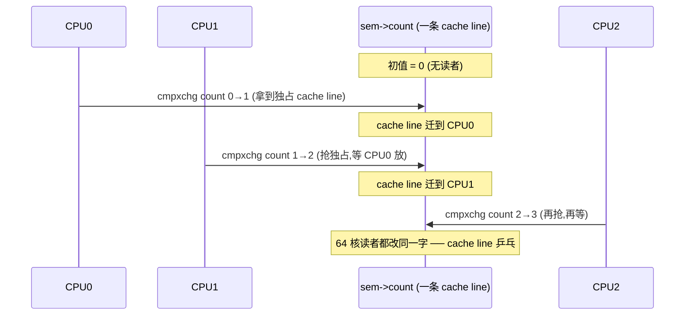
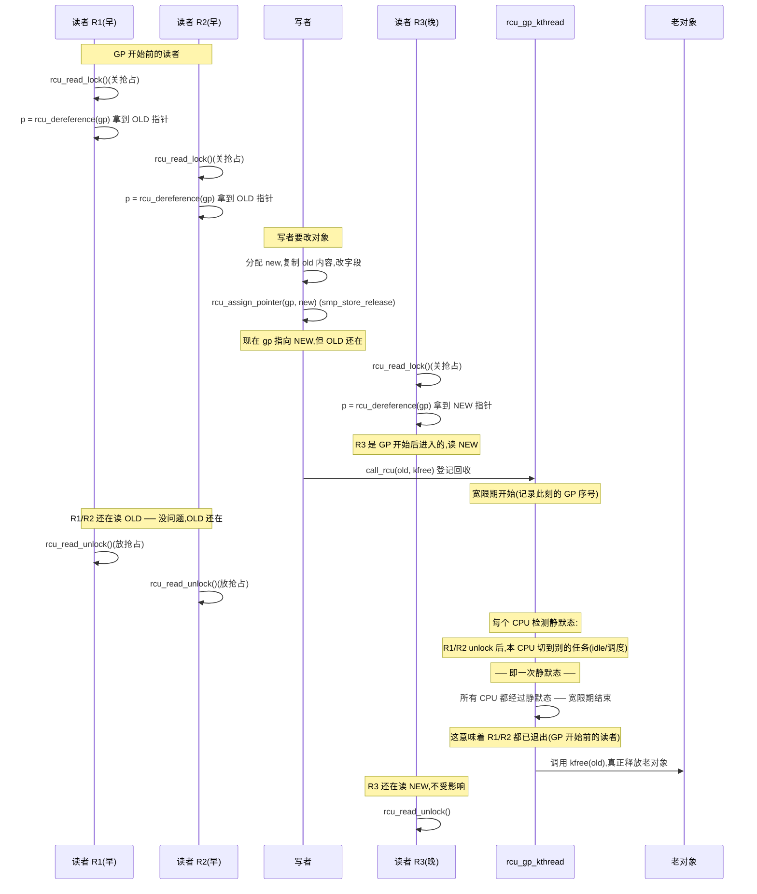
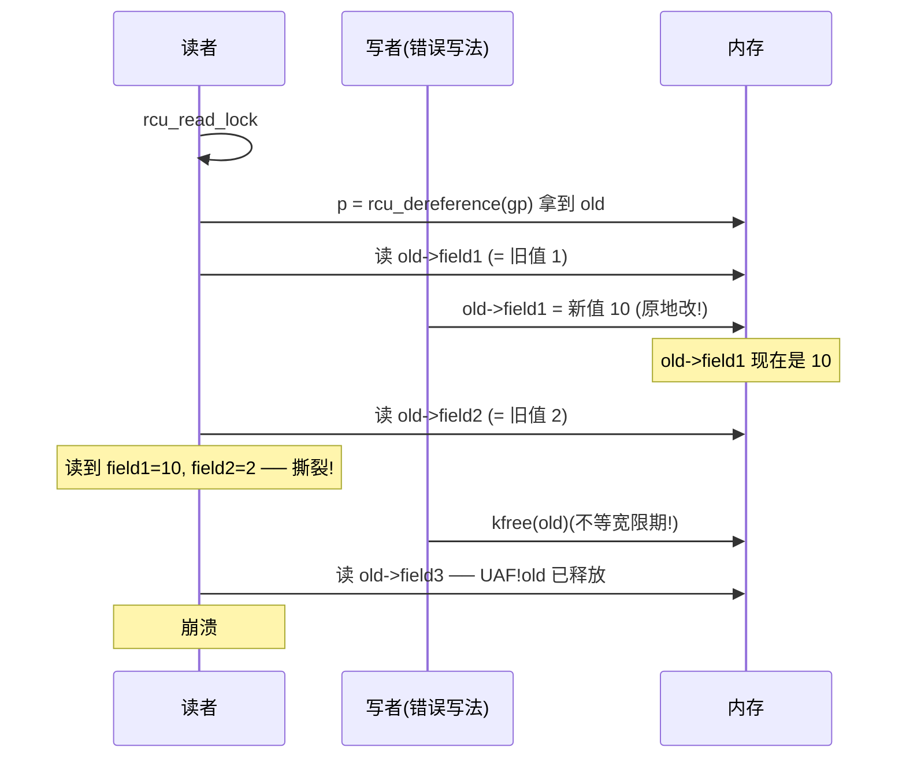

# 第十三篇 · 第 13 章 · RCU 原理:读者无锁,写者延迟回收

> 篇:P5 RCU(读者零开销的终极解)
> 主线呼应:这一章是第 5 篇 RCU 重头戏(5 章)的**定调章**。在第 4 篇末尾我们看见了 rwsem 的局限——多读者虽然不互斥,但每个读者仍要原子地改那把 `count`,64 核一起读时,`count` 所在的 cache line 在核间乒乓,读者实际上**还是有开销**。RCU 把这条路走到极致:读者**根本不取锁**——不原子、不 cache line 乒乓、不进 wait queue。这听起来像在违法,可它偏偏 sound。为什么?因为 RCU 改写了读者与写者的契约:**读者只声明"我在临界区里"(只动本地 preempt 计数),写者改前复制一份、老的等所有读者交卷后再回收**。读完这一章,你就拿到了第 5 篇剩余 4 章的钥匙:宽限期、静默态、tree 层级报告、srcu 可睡眠读者——都是在为这个契约的"sound"那一半服务。

## 核心问题

**RCU(Read-Copy-Update)的契约是什么?读者为什么可以不加锁(`rcu_read_lock` 只增 preempt 计数)、写者为什么必须复制一份改、老对象为什么要等宽限期再回收?为什么这套听起来纵容读者的契约偏偏 sound——不丢更新、不读到撕裂、不 use-after-free?为什么 RCU 只能保护指针数据结构?**

读完本章你会明白:

1. RCU 的核心契约——三个动作:**读者只标记进入临界区**(关抢占或增 nesting,不取锁)、**写者复制一份改**(Copy,不就地改)、**老对象等宽限期回收**(Update 的"延迟"那一半)。
2. 为什么读者零开销:[`rcu_read_lock`](../linux/include/linux/rcupdate.h#L777-784) 是 `static __always_inline`,内部 [`__rcu_read_lock`](../linux/include/linux/rcupdate.h#L90-93) 非 PREEMPT 内核下就一行 `preempt_disable()`——不原子、不 cache line 乒乓。
3. 为什么 sound:**宽限期(Grace Period)保证所有"宽限期开始前进入的读者"都已退出**,所以老指针可安全回收;读者拿的是快照指针,写者改的是新副本,二者在宽限期内并存。
4. RCU 只能保护**指针数据结构**——读者拿一份指针快照,不能原地改;写者用 [`rcu_assign_pointer`](../linux/include/linux/rcupdate.h#L526-535) 发布新指针,读者用 [`rcu_dereference`](../linux/include/linux/rcupdate.h#L684-690) 取快照——这是 RCU 的 Publish-Subscribe API 对。
5. ★ 对照 Tokio 的 `Pin`:Tokio 把 future 钉在内存里不让 move,自引用就 sound;RCU 把老指针钉在内存里不让回收(直到宽限期结束),读者快照就 sound——**同一思想:用契约换无锁/无搬运**。

---

> **逃生阀**:这一章会出现"宽限期""静默态""preempt 计数""publish-subscribe"这些概念。如果你之前只把 RCU 当成"一个不用锁的奇怪东西",没真正读过 [`kernel/rcu/tree.c`](../linux/kernel/rcu/tree.c),不要慌——本章只把 RCU 的**契约和为什么 sound**立清楚,把读者侧(`rcu_read_lock`/`rcu_dereference`)和写者侧(`rcu_assign_pointer`/`call_rcu`/`synchronize_rcu`)的端到端时序画透。**宽限期到底在等什么、怎么知道所有读者都交卷了**,留给第 14 章(P5-14)。本章抓住一句话就够:**读者只声明在场,写者只追加不原地改,老的等所有读者退场再回收**。

## 13.1 一句话点破

> **RCU 不是"锁",而是读者与写者的一份契约:读者只声明"我在场"(关抢占,不取锁),写者改前复制一份、用原子 store 把指针切到新副本上,老副本要等一个"宽限期"(所有开始时进入的读者都退出了)之后才能回收。读者不加锁不丢更新、不读到撕裂的根,在于读者拿的永远是一份完整一致的快照——老指针在宽限期内不会被回收,新指针已经原子地发布出去。代价是写者要延迟回收、且 RCU 只能保护指针数据结构。**

这是结论,不是理由。本章倒过来拆:先看 rwsem 读者的开销天花板,再看 RCU 读者凭什么把开销砍到零(只关抢占);然后把写者侧的"复制 + 切指针 + 延迟回收"端到端走一遍,证明这套契约为什么 sound;最后给出 RCU 的 Publish-Subscribe API 对(`rcu_assign_pointer` + `rcu_dereference`),并立起 ★ 对照。

---

## 13.2 从 rwsem 的天花板说起:读者仍有 cache line 乒乓

第 4 篇末尾我们讲完 rwsem 的乐观读,看见了它对朴素读写锁的进步——读者 fast path 是 `atomic_long_try_cmpxchg_acquire`,无竞争时一条原子指令搞定,不进 wait queue。但 rwsem 的读者**仍然要原子地改那把 [`count`](../linux/include/linux/rwsem.h#L49)**——这是 rwsem 的结构性限制。

考虑一个 64 核机器,64 个 CPU 同时 `down_read` 同一把 rwsem。每个读者的 fast path 都要 `cmpxchg` 改 `sem->count`(把读者计数加 1)。`count` 在内存里是**同一个 cache line**——64 个 CPU 抢着改它,MESI 协议下这条 cache line 在核间乒乓:CPU 0 拿到独占权改完,CPU 1 抢走,CPU 2 再抢……每次 cache line 迁移都是几十到上百纳秒的延迟。



这就是 rwsem 的天花板:**读者不互斥,但读者计数共享**,多核读者必然 cache line 乒乓。第 12 章的 percpu-rwsem 把这个开销推给了写者(读者只动本地 `read_count`,零争用),但读者仍要 `this_cpu_inc`——动的是 per-CPU 本地变量,虽不乒乓,但**仍有一次原子写**。能不能把读者的开销再砍一刀,**连这一次原子写都省掉**?

RCU 给的答案是:**读者只动本地 preempt 计数(或不动任何共享状态,只动 task 本地的 nesting 计数),根本不碰任何全局共享变量**。

> **不这样会怎样**:如果坚持用 rwsem 保护一个 64 核每秒上万次读的只读数据结构(如路由表、policy 表),读者 fast path 的 cache line 乒乓会成为系统开销的大头——你的"读"白付了同步代价,而数据本身根本没人在改。RCU 的存在意义就是:**消除读者的同步开销,哪怕写者要为此付出"延迟回收 + 复制"的代价**。读多写少的场景下(路由表几小时才更新一次,但每秒被查几百万次),这个交易极其划算。

---

## 13.3 读者侧:`rcu_read_lock` 凭什么零开销

来看 RCU 读者进入临界区的入口 [`rcu_read_lock`](../linux/include/linux/rcupdate.h#L777-784)([rcupdate.h:777](../linux/include/linux/rcupdate.h#L777)):

```c
static __always_inline void rcu_read_lock(void)
{
    __rcu_read_lock();          /* 真正"关抢占"或"增 nesting"的动作 */
    __acquire(RCU);             /* sparse 检查用,无运行时开销 */
    rcu_lock_acquire(&rcu_lock_map);   /* lockdep 钩子,生产内核里空操作 */
    RCU_LOCKDEP_WARN(!rcu_is_watching(),
             "rcu_read_lock() used illegally while idle");
}
```

⚠️ 注意 6.9 的 [`rcu_read_lock`](../linux/include/linux/rcupdate.h#L777) 是 `static __always_inline` **函数**,不是老资料里的 `#define` 宏——这点必须钉死,后面读者会看到 `static __always_inline` 是为了让编译器把它**彻底内联掉**,连一次函数调用开销都不留。三行里只有第一行 `__rcu_read_lock()` 是真有开销的;`__acquire` 是给 sparse 静态分析器看的;`rcu_lock_acquire` 在 [`CONFIG_DEBUG_LOCK_ALLOC`](../linux/include/linux/rcupdate.h#L348-352) 关闭时(生产内核就是这样)是 `do { } while (0)` 空宏;`RCU_LOCKDEP_WARN` 在 [`CONFIG_PROVE_RCU`](../linux/include/linux/rcupdate.h#L424-427) 关闭时也是空。所以**生产内核里,`rcu_read_lock` 等价于只调 `__rcu_read_lock()`**。

`__rcu_read_lock` 有两个实现,取决于内核配置:

### 非 PREEMPT_RCU(TREE_RCU/TINY_RCU,服务器内核默认)

[`__rcu_read_lock`](../linux/include/linux/rcupdate.h#L90-93)([rcupdate.h:90](../linux/include/linux/rcupdate.h#L90))是 `static inline`:

```c
static inline void __rcu_read_lock(void)
{
    preempt_disable();
}

static inline void __rcu_read_unlock(void)
{
    preempt_enable();
}
```

就一行 `preempt_disable()`——**把当前 CPU 的抢占计数(`preempt_count`)加 1**。这是个**纯本 CPU 的 per-CPU 变量**,不进任何 wait queue、不取任何锁、不碰任何跨核共享的 cache line。64 个 CPU 同时 `rcu_read_lock`,各自动各自的 `preempt_count`,**互不干扰,零争用,零乒乓**。

`preempt_count` 是什么?它是当前 task 栈上(实现在体系结构代码里,x86 上是 `gs:pcpu_offset` 处的一个 per-CPU 字段)的一个 32 位整数,记录"当前 CPU 不能被抢占的原因数"——bit 0-7 是抢占计数(`PREEMPT_MASK`),bit 8-15 是软中断计数,bit 16-19 是硬中断计数,bit 20-23 是 NMI 计数(详见第 12 本《内核机制》对 `preempt_count` 的拆解)。`preempt_disable()` 就是把 bit 0-7 加 1——意思是"现在这一刻,本 CPU 多了一个不能被抢占的理由"。`preempt_enable()` 反向减 1,如果归零且 `TIF_NEED_RESCHED` 置位,才在抢占点真正切走。

```
 struct task_struct (per-CPU 当前 task)
 ┌──────────────────────────────────────────────┐
 │ ...                                          │
 │ __preempt_count (实为 per-CPU,贴在 task 栈) │
 │ ┌──┬──┬──┬──┬──┬──┬──┬──┬──┬──┬───────────┐ │
 │ │..│NMI│HWIRQ│SOFTIRQ│ PREEMPT (0-7 bit)   │ │
 │ └──┴──┴──┴──┴──┴──┴──┴──┴──┴──┴───────────┘ │
 │                          ↑                   │
 │       rcu_read_lock → preempt_disable()      │
 │       把这个 8-bit 计数 +1                   │
 │                                              │
 │ rcu_read_unlock → preempt_enable() 反向 -1   │
 └──────────────────────────────────────────────┘

  64 个 CPU 各自的 preempt_count,互不可见、零争用
```

这是 RCU 读者零开销的根——它**根本不碰任何共享状态**,只动本 CPU 的 `preempt_count`。

### PREEMPT_RCU(实时内核,允许读者被抢占)

PREEMPT_RT 内核要支持"读者临界区内可被抢占/可睡眠",非 PREEMPT 那套"关抢占"行不通——它的 [`__rcu_read_lock`](../linux/kernel/rcu/tree_plugin.h#L400-408) 走另一条路:

```c
void __rcu_read_lock(void)
{
    rcu_preempt_read_enter();      /* current->rcu_read_lock_nesting++ */
    if (IS_ENABLED(CONFIG_PROVE_LOCKING))
        WARN_ON_ONCE(rcu_preempt_depth() > RCU_NEST_PMAX);
    if (IS_ENABLED(CONFIG_RCU_STRICT_GRACE_PERIOD) && rcu_state.gp_kthread)
        WRITE_ONCE(current->rcu_read_unlock_special.b.need_qs, true);
    barrier();  /* critical section after entry code. */
}
```

它增的是当前 task 的 [`rcu_read_lock_nesting`](../linux/kernel/rcu/tree_plugin.h#L377-380) 字段(`current->rcu_read_lock_nesting++`,允许嵌套),**不关抢占**——读者仍可被调度走。这给实时系统带来了延迟更低的读者,但代价是宽限期检测复杂得多(被抢占的读者还没退出,得等它真正 `rcu_read_unlock`)。第 16 章(P5-16 srcu)会更详细对比。

> 本章后续除非特别说明,默认走**非 PREEMPT_RCU(服务器默认)** 这条主线——它最直观,也是绝大多数发行版的配置。PREEMPT_RCU 的差异在第 14、16 章展开。

### 为什么关抢占让读者"可被识别为已交卷"

这是 RCU sound 的第一块拼图,值得单独说透。**为什么关抢占的读者,等 CPU 经过一次"不在临界区"的状态,就一定退出了?**

非 PREEMPT_RCU 内核下,读者一旦 `rcu_read_lock` 关了抢占,在本 CPU 上就**不会被调度走**——它要么在用户态(根本没进 RCU 临界区),要么在内核态跑临界区代码,中间不会切到别的 task。这意味着:

- 一个 CPU 上的所有 RCU 读者,要么**全部运行完**(从 `rcu_read_lock` 到 `rcu_read_unlock`),要么**根本没开始**——不存在"读者挂在等待队列里,半截没跑完"这种状态。
- 所以"CPU 经过一次上下文切换 / 一次 idle / 一次用户态返回"这种**静默态(Quiescent State)** 时,这个 CPU 上的所有"宽限期开始前进入的读者"必然都已经 `rcu_read_unlock` 了——因为如果有读者还挂着,关抢占就阻止不了这次切换。

> **钉死这件事**:非 PREEMPT_RCU 下,**关抢占 = 读者不会被切走 = 静默态(CPU 切走)出现时,所有读者都已退场**。这是"宽限期"能识别"读者交卷"的根本机制。第 14 章会正面拆 [`rcu_sched_clock_irq`](../linux/kernel/rcu/tree.c#L2275) 怎么在 tick 里检测静默态。

### 反面对比:rwsem 读者 vs RCU 读者

| 维度 | rwsem 读者 fast path | RCU 读者 |
|------|---------------------|----------|
| 取锁 | 原子 `cmpxchg(&count)` | **不取锁**,只 `preempt_disable()` |
| 共享状态 | `sem->count`(共享 cache line) | **无**,只动本 CPU `preempt_count` |
| 64 核同时读 | cache line 乒乓 | **零乒乓**,各动各的 |
| 嵌套 | 需要读者计数(`count` 高位) | preempt 计数天然支持嵌套(+1/-1) |
| 可睡眠 | 是(慢路径 schedule) | 非 PREEMPT 不能(关抢占);PREEMPT_RCU 可 |

> **为什么 sound(读者侧)**:`rcu_read_lock` 关抢占后,读者在本 CPU 上不会被打断,这意味着读者拿到的指针快照,在它整个临界区内**始终有效**(写者要回收老指针,必须等宽限期结束;宽限期结束需要这个 CPU 经过静默态;经过静默态意味着这个读者已经 unlock 了)。读者不需要锁——它不需要"阻止写者",只需要保证"自己拿着的指针不被写者提前回收"。这件事由宽限期的契约兜底。下一节看写者侧怎么兑现这个契约。

---

## 13.4 写者侧:Copy —— 不原地改,复制一份

RCU 的"U"(Update)不是直接覆盖老对象——那样正在读老对象的读者会读到撕裂数据。RCU 的写者流程是 **Read-Copy-Update** 字面意思:

1. **Read**:写者先取当前指针(用 `rcu_dereference_protected`,因为写者侧持有写锁,不需要 `rcu_read_lock` 保护);
2. **Copy**:分配一个新对象,把老对象的内容复制过去,改的是**新副本**;
3. **Update**:`rcu_assign_pointer` 把 RCU 保护的指针原子地切到新副本;
4. **延迟回收**:`call_rcu` 或 `synchronize_rcu` 等宽限期后回收老对象。

来看发布新指针的 [`rcu_assign_pointer`](../linux/include/linux/rcupdate.h#L526-535)([rcupdate.h:526](../linux/include/linux/rcupdate.h#L526)):

```c
#define rcu_assign_pointer(p, v)                            \
do {                                                        \
    uintptr_t _r_a_p__v = (uintptr_t)(v);                   \
    rcu_check_sparse(p, __rcu);                             \
                                                            \
    if (__builtin_constant_p(v) && (_r_a_p__v) == (uintptr_t)NULL)  \
        WRITE_ONCE((p), (typeof(p))(_r_a_p__v));            \
    else                                                    \
        smp_store_release(&p, RCU_INITIALIZER((typeof(p))_r_a_p__v)); \
} while (0)
```

核心是 `smp_store_release(&p, v)`——用 **release 内存序**把新指针写出去。`release` 的语义是:这条 store **之前的所有读写**(也就是写者对新副本做的所有修改)在 `release` 之前完成,**任何通过 `rcu_dereference` 看到这个新指针的读者,也一定能看到新副本的全部内容**。这就是 RCU 的 **Publish(发布)** 语义。

> **不这样会怎样**:如果写者朴素地写 `p = new_ptr;`(普通 store,无内存序),在多核上 CPU 可能把这个 store 重排到"填充新对象内容"之前——读者看到 `p` 指向新地址,但跑去读新对象的字段,字段可能还没初始化(因为"填充字段"的 store 被重排到"切指针"之后了)。这是经典的"发布了一半"撕裂。`smp_store_release` 强制顺序:**先填好新对象,再切指针**,切出去的瞬间,新对象一定完整。读者侧的 `rcu_dereference`(下一节)用 `READ_ONCE` + 依赖序配对,保证看到新指针就看到完整内容。

### 读者侧:rcu_dereference —— 订阅快照

读者进入临界区后,要**取** RCU 保护的指针快照,用 [`rcu_dereference`](../linux/include/linux/rcupdate.h#L684-690):

```c
#define rcu_dereference(p) rcu_dereference_check(p, 0)
```

它最终展开到 [`__rcu_dereference_check`](../linux/include/linux/rcupdate.h#L467-474),核心是:

```c
typeof(*p) *local = (typeof(*p) *__force)READ_ONCE(p);
```

—— **一次 `READ_ONCE`**,读到的是当前 `p` 的某个值(可能是老的,也可能是新的,取决于切指针的时刻)。`READ_ONCE` 保证编译器不会把这次读合并/省略/重排;依赖序(`dependency-ordering`)保证读者之后通过 `local` 解引用读字段的操作,发生在这次读之后。

这是 RCU 的 **Subscribe(订阅)** 语义。读者一旦 `rcu_dereference`,它就**锁定了一份快照**:要么是宽限期开始前的老对象,要么是发布之后的新对象——**不会是发布一半的撕裂**。

> **钉死这件事**:[`rcu_assign_pointer`](../linux/include/linux/rcupdate.h#L526) 用 `smp_store_release` 发布(publish),[`rcu_dereference`](../linux/include/linux/rcupdate.h#L690) 用 `READ_ONCE` 订阅(subscribe)——这对 API 是 RCU 的命脉。release-acquire 配对保证:**写者发布出去的瞬间,新对象完整;读者订阅到的那一刻,看到的就是完整的**。这是 RCU "不读到撕裂" 的根。

### 为什么 RCU 只能保护指针数据结构

从上面 Copy + Update 的流程可以推出一个硬限制:**RCU 保护的对象,必须通过指针访问**。

- 读者拿的是指针快照(`rcu_dereference` 读一次 `p`),之后**通过这个快照指针解引用**访问对象——所以对象的**地址在读者临界区内必须稳定**。RCU 的契约是"老地址在宽限期内不回收",正好满足这一点。
- 写者改的不是对象本身,而是**指针的指向**(`rcu_assign_pointer`)——所以 RCU 保护的是**指针字段**,不是内联数据。

如果数据是**内联在一个结构体里的整数字段**,RCU 没法保护——读者读字段时拿不到"指针快照",写者没法"复制一份改"(读者就原地读,看不到你切指针)。这种场景要用 seqlock(第 6 章)或 atomic(第 2 章)。**RCU 的领域是"指针数据结构"**:链表、树、哈希桶、路由表、policy 表、文件系统元数据。

---

## 13.5 延迟回收:call_rcu 与 synchronize_rcu —— 等宽限期

写者把指针切到新副本后,**老对象不能立刻释放**——可能有读者正拿着老指针在临界区里读。怎么办?RCU 给两个 API:

- [`synchronize_rcu`](../linux/kernel/rcu/tree.c#L3600)([tree.c:3600](../linux/kernel/rcu/tree.c#L3600)):**阻塞调用者,直到宽限期结束**。
- [`call_rcu`](../linux/kernel/rcu/tree.c#L2836)([tree.c:2836](../linux/kernel/rcu/tree.c#L2836)):**不阻塞**,把"宽限期结束后回调 `func`"这件事登记到 RCU 子系统,立刻返回。

来看 [`synchronize_rcu`](../linux/kernel/rcu/tree.c#L3600-3637):

```c
void synchronize_rcu(void)
{
    unsigned long flags;
    struct rcu_node *rnp;

    RCU_LOCKDEP_WARN(lock_is_held(&rcu_bh_lock_map) ||
             lock_is_held(&rcu_lock_map) ||
             lock_is_held(&rcu_sched_lock_map),
             "Illegal synchronize_rcu() in RCU read-side critical section");
    if (!rcu_blocking_is_gp()) {
        if (rcu_gp_is_expedited())
            synchronize_rcu_expedited();
        else
            wait_rcu_gp(call_rcu_hurry);   /* 真正等宽限期 */
        return;
    }
    /* 单 CPU、非 PREEMPT 等特殊情况:vacuous grace period */
    ...
}
EXPORT_SYMBOL_GPL(synchronize_rcu);
```

主体是 [`wait_rcu_gp(call_rcu_hurry)`](../linux/kernel/rcu/tree.c#L3613)——它内部就是"登记一个回调,然后睡到宽限期结束回调被调用"。SMP 多 CPU 系统上,`synchronize_rcu` 调用后会阻塞,直到 RCU 子系统确认"所有 CPU 都至少经过一次静默态",才唤醒它返回。注意开头的 `RCU_LOCKDEP_WARN`——**禁止在 RCU 临界区内调 `synchronize_rcu`**(否则自己等自己,死锁)。

`call_rcu` 走非阻塞路径,看 [`__call_rcu_common`](../linux/kernel/rcu/tree.c#L2708)([tree.c:2708](../linux/kernel/rcu/tree.c#L2708),`call_rcu` 和 `call_rcu_hurry` 的公共实现):

```c
void call_rcu(struct rcu_head *head, rcu_callback_t func)
{
    __call_rcu_common(head, func, enable_rcu_lazy);
}
EXPORT_SYMBOL_GPL(call_rcu);
```

它把 `(head, func)` 登记到**当前 CPU 的 `rcu_data` 结构**里的回调队列,然后唤醒 [`rcu_gp_kthread`](../linux/kernel/rcu/tree.c#L1836)(RCU 宽限期内核线程)去推进宽限期。宽限期结束后,`rcu_do_batch` 会批量调用所有挂着的 `func`——也就是真正释放老对象。

> **钉死这件事**:`synchronize_rcu` 是同步的(调用者睡),`call_rcu` 是异步的(登记回调立刻返回,宽限期结束后由 [`rcu_gp_kthread`](../linux/kernel/rcu/tree.c#L1836) 批量调)。热路径上(写者频繁)用 `call_rcu` 不阻塞;冷路径或写者必须等老对象回收完才能继续(如模块卸载)用 `synchronize_rcu`。还有 [`call_rcu_hurry`](../linux/kernel/rcu/tree.c#L2783-2787),专门用于"这个回调必须尽快执行"的场景(它把 lazy 标志关掉)。

### 宽限期:RCU sound 的命脉

宽限期是什么?**RCU 子系统确认"所有宽限期开始前进入的读者都已退出"所需的时间窗口**。它的端到端流程:

1. **写者发布新指针**(`rcu_assign_pointer`),老指针还挂着;
2. **写者登记回收**(`call_rcu(old, free_func)`),把"释放老指针"挂到当前 CPU 的回调队列;
3. **宽限期开始**:RCU 子系统(由 [`rcu_gp_kthread`](../linux/kernel/rcu/tree.c#L1836) 驱动)启动一个新的宽限期,在每个 CPU 上**等待它经过一次静默态**;
4. **静默态**:一个 CPU 不在 RCU 临界区的时刻(上下文切换、idle、用户态返回、非 PREEMPT_RCU 下任何 `preempt_count` 归零的点)。详见第 14 章(P5-14);
5. **宽限期结束**:所有 CPU 都经过静默态——意味着"宽限期开始前进入的读者"都已 `rcu_read_unlock`(否则关抢占会阻止静默态出现);
6. **回调执行**:`rcu_do_batch` 批量调用所有挂着的 `func`,老指针被真正释放。

下面是端到端时序,画三个读者(R1/R2/R3)交错:



注意几个关键点:

- **R1/R2 在 GP 开始前进入** → 它们拿 OLD;**R3 在 GP 开始后(指针已切)进入** → 它拿 NEW。RCU 不需要读者之间互相协调,各拿各的快照。
- **老对象在宽限期内还活着** → R1/R2 不会 use-after-free。
- **宽限期结束 = 所有"GP 开始前进入的读者"都已退出** → 此时老对象再无任何读者持有,可安全回收。
- **R3 不影响这次宽限期** → 它读的是 NEW,对 OLD 的回收无碍。

> **为什么 sound(命脉证明)**:设宽限期在时刻 `T0` 开始,在时刻 `T1` 结束。
> (a) `T0` 之前进入临界区的读者,要么在 `T0` 之前已经退出(它读完后老指针再也无人持有),要么在 `T0` 之后还活着——但非 PREEMPT_RCU 下它关了抢占,本 CPU 在它退出前无法经过静默态。
> (b) `T1` 结束意味着"所有 CPU 都至少经过一次静默态"——任一 CPU 经过静默态时,该 CPU 上"GP 开始前进入的读者"必然已退出(否则关抢占阻止静默态)。
> (c) 所以 `T1` 时,**没有任何"GP 开始前进入的读者"还在持有老指针**——老指针可安全回收。
> (d) `T0` 之后进入的读者读到的是新指针(`rcu_assign_pointer` 在 `T0` 之前已完成),它们不持有老指针,与回收无碍。
> 这四步合起来,就是 RCU"读者不加锁也不丢更新、不读到撕裂、不 use-after-free"的**完整 sound 证明**。第 14 章会正面拆 [`rcu_sched_clock_irq`](../linux/kernel/rcu/tree.c#L2275) 怎么在 tick 里检测静默态、`rcu_node` 树怎么聚合报告。

---

## 13.6 技巧精解:读者零开销为什么 sound

这一节单独拆透本章最硬核的两个问题:**读者零开销的"零"到底指什么**、**为什么这个零开销的读者契约偏偏不丢更新**。

### 技巧一:读者零开销的反面对比

朴素认知里"读共享数据要加锁"——rwsem 读者即便乐观读也是 `cmpxchg`,percpu-rwsem 读者是 `this_cpu_inc`。RCU 把这件事推到极致:**读者连一次原子写都没有**。

非 PREEMPT_RCU 内核下,`rcu_read_lock` 实际开销 = `preempt_disable()` = 本 CPU 的 `preempt_count` 加 1。这是**一次普通的本 CPU 内存写**,不原子指令、不 cache line 乒乓、不进任何 wait queue。64 个 CPU 同时 `rcu_read_lock`,各自写各自的 `preempt_count`(本 CPU 的 per-CPU 变量),**完全无干扰**。

反面对比表:

| 操作 | rwsem 读者 | percpu-rwsem 读者 | **RCU 读者** |
|------|-----------|-------------------|-------------|
| 共享状态访问 | `sem->count`(共享) | per-CPU `read_count`(本地) | **无共享状态** |
| 原子指令 | `cmpxchg`(acquire) | `this_cpu_inc`(原子 per-CPU 写) | **无原子指令**(普通 per-CPU 写) |
| cache line 乒乓 | 64 核抢一个 count,乒乓 | 不乒乓(本地) | **不乒乓(本地 preempt_count)** |
| 写者开销 | 读者计数增减 | 切换 + synchronize_rcu | **复制 + 切指针 + call_rcu + 宽限期** |
| 限制 | 临界区可睡 | 读者快路径零争用,写者很重 | **只能保护指针;写者延迟回收;非 PREEMPT 读者不能睡** |

**RCU 把读者的开销全部转移给了写者**——读者换来零开销的代价是:写者要复制、要切指针、要登记回调、要等宽限期。**这个交易在"读极多写极少"的场景极其划算**(路由表、policy、namespace、文件系统元数据——读每秒百万次,写几小时一次)。这就是 RCU 的存在理由。

### 技巧二:读者拿快照为什么 sound

这是反直觉的部分——读者**没取锁**,凭什么不读到撕裂?凭什么不 use-after-free?

**关键洞察**:RCU 读者拿的不是"对象当前状态",而是**一份指针快照**。读者 `rcu_dereference` 读一次 `p`,之后**通过这个快照指针**解引用访问对象——它读的永远是"读指针那一刻"的对象状态(老或新之一),**不会读到一半被写者改了**。

为什么?三个保证:

1. **指针切换是原子的**:`rcu_assign_pointer` 用 `smp_store_release`,读者要么看到老指针,要么看到新指针——**不会看到半个指针**。
2. **对象内容在读者拿到快照后不会被改**:写者不原地改对象(那样正在读的读者会撕裂),它复制一份改新副本,只切指针。**老对象在宽限期内内容冻结**。
3. **老对象在宽限期内不会被回收**:写者用 `call_rcu`/`synchronize_rcu` 等宽限期,宽限期保证"所有 GP 开始前进入的读者都已退出"。

这三条合起来,读者拿快照后,**整个临界区内,它持有的对象地址稳定、内容不变、不会被释放**——这就是"不加锁也 sound"的根。

### 反例:朴素写法会撞什么墙

假设写者**就地改对象**(不复制不切指针),还**立即释放**(不等宽限期):

```c
/* 错误写法 1:原地改 */
void writer_bad_inplace(void) {
    p->field1 = new1;        /* 半截改 */
    p->field2 = new2;        /* 读者可能读到 field1 是新的、field2 是老的 */
}

/* 错误写法 2:不等宽限期就释放 */
void writer_bad_free(void) {
    old = rcu_dereference_protected(gp, 1);
    rcu_assign_pointer(gp, new);
    kfree(old);              /* UAF!读者可能正拿着 old */
}
```

第一种会读到撕裂(field1 和 field2 不一致);第二种会 use-after-free(读者拿着 old 的指针,但 old 已经释放了)。

时序图(反面):



RCU 的设计就是为了堵这两个洞——**复制 + 切指针**堵撕裂(老对象不变),**等宽限期回收**堵 UAF(老对象不释放)。

> **为什么 sound(本章命脉)**:RCU 用三个动作堵住两个洞。Copy(写者复制一份改)→ 老对象内容冻结 → 读者不撕裂;宽限期延迟回收 → 老对象在所有读者退出前不释放 → 读者不 UAF。读者零开销(关抢占)换来的是写者付出"复制 + 切指针 + 等宽限期"的代价。这个交易在"读多写少 + 保护指针数据结构"的场景下极其划算——这就是 RCU 凭什么这么快,又凭什么 sound。

---

## 13.7 ★ 对照 Tokio Pin —— 用契约换无锁/无搬运

本书和《Tokio》那本呼应。RCU 的思想——**用契约换无锁**——和 Tokio 的 `Pin` 是同源。

Tokio(更准确地说是 Rust 语言)的 [`Pin`](https://doc.rust-lang.org/std/pin/) 解决的问题是:**异步 future 是自引用的**(它的内部状态可能含一个指向自己的指针),一旦 future 被 move 到新地址,自引用就失效——读旧地址,撕裂。Rust 没办法"禁止 move",于是 `Pin` 用**契约**解决:`Pin<&mut Future>` 保证这个 future **永远不会被 move**(只要它被 pin 住)。契约换无搬运——你不要 move 它,它就 sound。

RCU 解决的问题是:**读者不取锁**,但读者拿的指针不能被写者提前回收——否则 use-after-free。Linux 没办法"禁止写者改指针",于是 RCU 用**契约**解决:**老指针在宽限期内不会被回收**(只要宽限期没结束,写者就 commit 不释放它)。契约换无锁——读者不要取锁,指针就 sound。

| 维度 | Tokio `Pin` | **Linux RCU** |
|------|-------------|---------------|
| 痛点 | 自引用 future 被 move → 自引用失效 → 撕裂 | 读者拿快照指针被提前回收 → UAF |
| 契约 | "Pin 住就不 move" | "宽限期内不回收老指针" |
| 换来的 | 无搬运(自引用 sound) | **无锁**(读者零开销) |
| 谁承担代价 | future 的拥有者(必须用 `Box::pin`/`pin!` 钉住) | **写者**(复制 + 切指针 + 等宽限期) |
| 实现机制 | 类型系统(`Pin<P>` 是 newtype,`Unpin` 标记可 move) | preempt 计数 + 静默态检测 + rcu_gp_kthread |

> **钉死这件事**:RCU 和 `Pin` 都是**用契约换性能**的典范——都不是"加更强的同步",而是"立一条规矩,规矩保证 sound"。Rust 在类型系统里立(编译期保证),Linux 在运行时立(preempt 计数 + 宽限期检测)。**这是"无锁/无搬运"思想的两个权威实现**。第 18 章的总对照表会把它们钉在一起。

---

## 章末小结

这一章是第 5 篇(RCU 重头戏)的**定调章**,我们把 RCU 的核心契约立清楚了:

1. **读者侧零开销**:[`rcu_read_lock`](../linux/include/linux/rcupdate.h#L777-784) 是 `static __always_inline`,非 PREEMPT 内核下 [`__rcu_read_lock`](../linux/include/linux/rcupdate.h#L90-93) 就一行 `preempt_disable()`——不取锁、不原子、不 cache line 乒乓。64 核读者各动各的 `preempt_count`,零争用。
2. **写者侧 Copy + 切指针 + 延迟回收**:`rcu_assign_pointer`(`smp_store_release`)发布新指针,`call_rcu`/`synchronize_rcu` 等宽限期后回收老对象。
3. **Publish-Subscribe API 对**:`rcu_assign_pointer` 发布,`rcu_dereference`(`READ_ONCE`)订阅——release-acquire 配对保证不撕裂。
4. **为什么 sound 的命脉证明**:宽限期结束 = 所有"GP 开始前进入的读者"都已退出(非 PREEMPT 下关抢占阻止静默态,静默态出现就证明读者退场) → 老指针可安全回收。
5. **★ 对照 Tokio Pin**:用契约换无锁/无搬运——RCU 宽限期内不回收,Pin 钉住不 move,同源思想。

回到二分法:**RCU 属于"自旋/无锁一极"的极致**——读者根本不锁。rwsem/percpu-rwsem 还在"用最小的锁达成读多写少",RCU 直接把读者的锁开销砍到零,代价是写者要付出"复制 + 延迟回收"。这是同步原语在"读"那一侧能达到的天花板。

### 五个"为什么"清单

1. **为什么 RCU 读者可以不取锁?** 因为读者只声明"我在场"(关抢占,非 PREEMPT_RCU),不动任何共享状态——读者不需要"阻止写者",只需要保证自己拿的指针不被提前回收。后者由宽限期的契约兜底。
2. **为什么 RCU 读者拿快照不读到撕裂?** 写者不原地改对象(否则撕裂),而是复制一份改新副本,只切指针(`rcu_assign_pointer`)。读者 `rcu_dereference` 拿的是某一时刻的指针快照——老指针内容冻结、新指针已完整发布(release 序)。
3. **为什么宽限期能保证老指针安全回收?** 宽限期结束 = 所有 CPU 经过静默态 = 所有"GP 开始前进入的读者"都已 unlock(关抢占阻止静默态,静默态出现即证明读者退场)。此时老指针再无读者持有,可回收。
4. **为什么 RCU 只能保护指针数据结构?** 读者拿的是指针快照,通过解引用访问对象——对象地址在临界区内必须稳定,这要求被保护的是"通过指针访问"的数据(链表/树/哈希)。内联字段没法保护(写者切不了字段指针),要用 seqlock 或 atomic。
5. **为什么非 PREEMPT_RCU 读者不能睡眠?** `rcu_read_lock` 关了抢占,睡眠需要调度(进 `schedule`),而关抢占正是禁止调度——所以读者不能 sleep。PREEMPT_RCU(实时内核)用 `nesting` 计数代替关抢占,允许读者被抢占/睡,代价是宽限期检测复杂(第 16 章 srcu 是其延伸)。

### 想继续深入往哪钻

- **本章源码**:读 [`include/linux/rcupdate.h`](../linux/include/linux/rcupdate.h) 的 `rcu_read_lock`(L777)、`rcu_read_unlock`(L808)、`rcu_assign_pointer`(L526)、`rcu_dereference`(L690)、非 PREEMPT 的 `__rcu_read_lock`(L90);[`kernel/rcu/tree_plugin.h`](../linux/kernel/rcu/tree_plugin.h) 的 PREEMPT_RCU 版 `__rcu_read_lock`(L400);[`kernel/rcu/tree.c`](../linux/kernel/rcu/tree.c) 的 `synchronize_rcu`(L3600)、`call_rcu`(L2836)、`call_rcu_hurry`(L2783)、`__call_rcu_common`(L2708)。
- **下一章 P5-14**:正面拆宽限期的实现——[`rcu_sched_clock_irq`](../linux/kernel/rcu/tree.c#L2275) 怎么在 tick 里检测静默态,`rcu_report_qs_rdp`/`rcu_report_qs_rnp` 怎么报告,宽限期状态机怎么驱动。
- **观测**:`/sys/kernel/debug/rcu/rcudata`(每个 CPU 的 RCU 状态)、`/sys/kernel/debug/rcu/rcugp`(当前宽限期序号)、`/sys/kernel/debug/rcu/rcuhier`(rcu_node 树);`rcutorture` 是 RCU 压力测试模块;`rcutree.use_softirq`、`rcutree.kthread_prio` 等启动参数。
- **延伸阅读**:`Documentation/RCU/`(尤其是 `Design/Memory-Ordering/Tree-RCU-Memory-Ordering.rst`,讲宽限期的内存序保证);Paul McKenney 的 *Is Parallel Programming Hard, and if so, what can you do about it?* 一书的 RCU 章节;LWN 上的 "What is RCU?" 系列文章。

### 引出下一章

这一章把 RCU 的**契约**立清楚了——读者只关抢占、写者复制改、老者等宽限期。但"宽限期"这个词,我们只给了概念定义("等所有 CPU 经过静默态"),没讲实现。**宽限期到底在等什么?怎么知道所有读者都交卷了?** 第 14 章(P5-14)正面拆 [`rcu_sched_clock_irq`](../linux/kernel/rcu/tree.c#L2275) 在 tick 中断里怎么检测每个 CPU 是否静默、怎么把"我静默了"报告给 RCU 子系统、宽限期状态机怎么从 `RCU_GP_IDLE` 走到 `RCU_GP_DONE`——这是 RCU sound 那一半的工程实现,也是第 15 章 tree RCU 层级报告的基础。读完第 14 章,你就能讲清"宽限期凭什么等得到所有读者交卷"。
