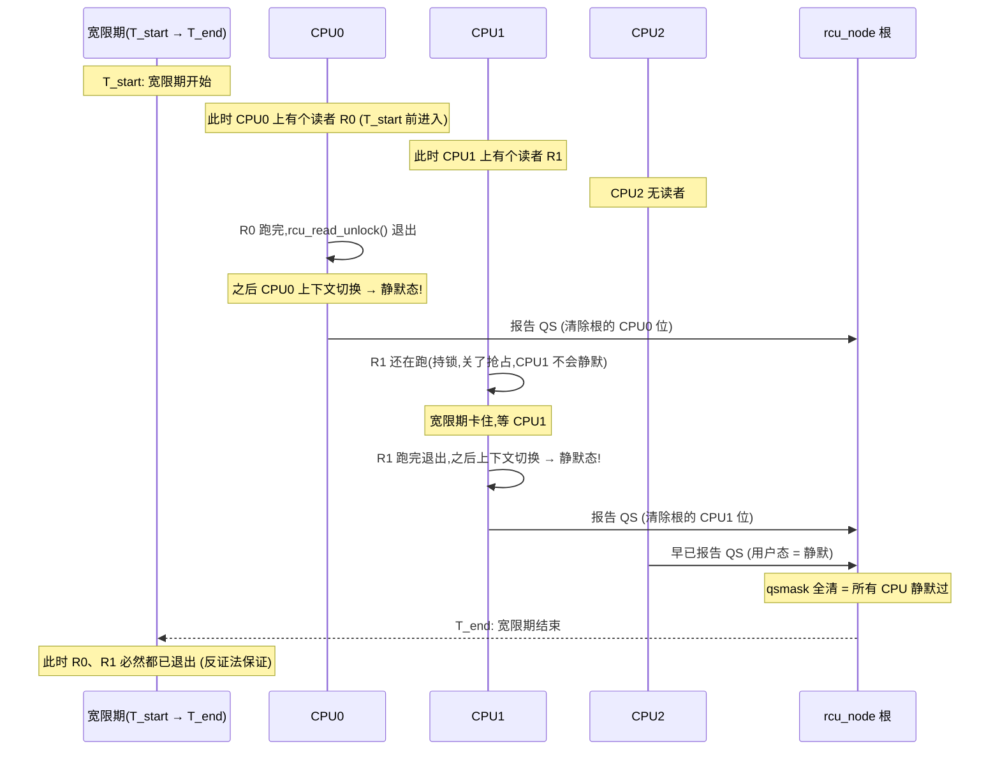
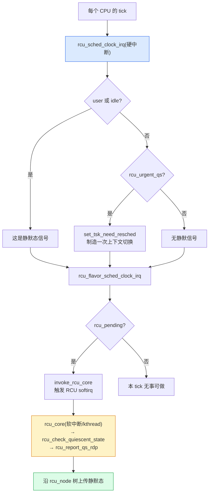
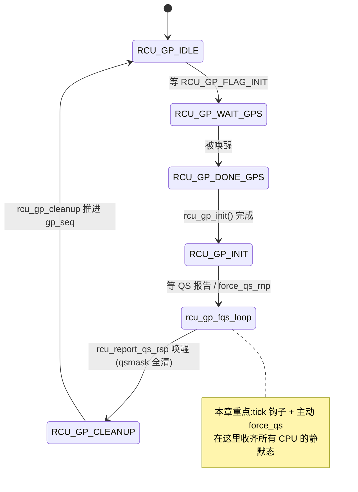
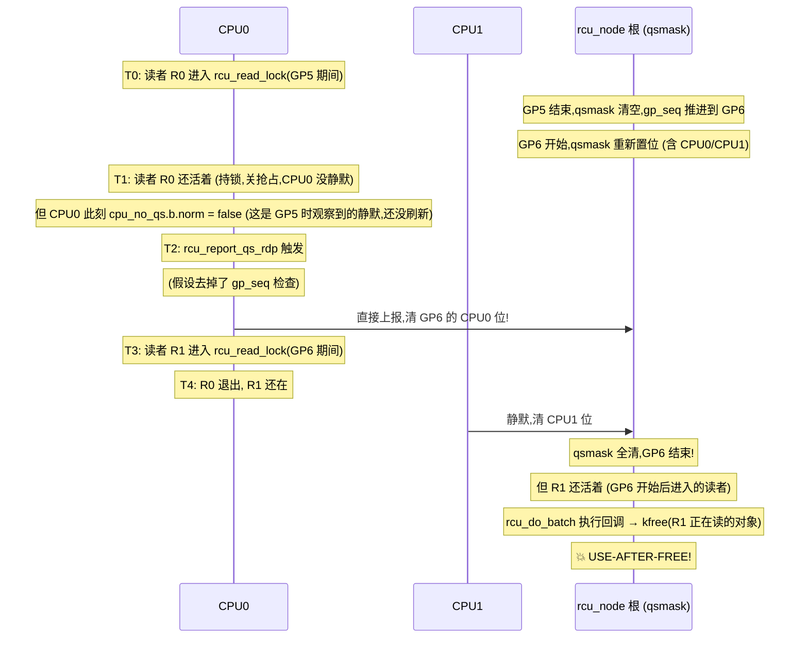
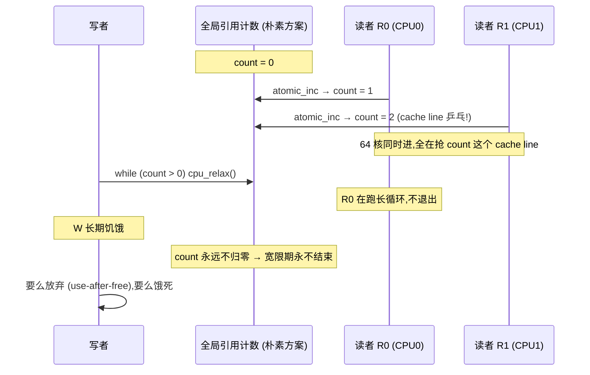

# 第十四篇 · grace period 与 quiescent state:宽限期在等什么

> 篇:P5 RCU:读者零开销的终极解
> 主线呼应:上一章(P5-13)立起了 RCU 的契约——读者只 `rcu_read_lock` 关一下抢占(零开销),写者复制一份改、老对象**延迟回收**。"延迟"这两个字悬在半空没落地:**等到什么时候才能回收老对象?** 这一章就正面回答这个问题。宽限期(Grace Period)在等什么?在等**所有 CPU 都至少经过一次静默态(Quiescent State)**——也就是不在 RCU 临界区。怎么知道每个 CPU 都静默过了?靠 tick 钩子 [`rcu_sched_clock_irq`](../linux/kernel/rcu/tree.c#L2275)(6.9 改名,别照搬老资料里的 `rcu_check_callbacks`)在每个时钟中断里检测。报告怎么汇总?靠 `rcu_report_qs_rdp` → `rcu_report_qs_rnp` → `rcu_report_qs_rsp` 这条上传链,从 CPU 的 `rcu_data` 一路传到 `rcu_node` 树根,根节点收齐 = 宽限期结束。结束后,排队等回收的回调(老对象)由 `rcu_do_batch` 批量执行。这一章把"宽限期"从一句口号变成一条可逐行追踪的源码路径,并回答全书最关键的一个 sound 问题:**为什么"每 CPU 至少一次静默"等价于"宽限期开始时进入的所有读者都已退出"**。
> 二分法归属:**自旋/无锁一极**(RCU 读者无锁的延续:宽限期完全不动读者的奶酪,只靠被动观测静默态判定回收时机)。

## 核心问题

**RCU 写者要"延迟回收"老对象,延迟到何时?宽限期在等什么、怎么判定结束?为什么"所有 CPU 至少经过一次静默态"就足以保证宽限期开始时进入的所有读者都已交卷——而不需要给读者装引用计数?`synchronize_rcu`(阻塞等)和 `call_rcu`(注册回调异步等)走的分别是哪条路?回收的回调(`rcu_do_batch`)为什么不会和正在到来的下一个宽限期冲突?**

读完本章你会明白:

1. **宽限期的本质**:它不是在等"所有读者退出",而是在等"每个 CPU 至少经过一次静默态"——后者是前者的**可观测充分条件**,而且检测成本极低(只需看 tick 时 CPU 在不在 RCU 临界区)。
2. **静默态是什么**:上下文切换、进入用户态、idle、离开 `rcu_read_lock`……都是"这个 CPU 此刻不在 RCU 临界区"的证据。tick 钩子 `rcu_sched_clock_irq` 怎么把这种证据转成一次 QS 报告。
3. **报告链怎么上传**:`rcu_report_qs_rdp`(本 CPU 的 `rcu_data` 翻 `cpu_no_qs` 标志)→ `rcu_report_qs_rnp`(沿 `rcu_node` 树逐层清 `qsmask` 位图)→ `rcu_report_qs_rsp`(根节点清完,唤醒 `rcu_gp_kthread`)。
4. **回收回调的分段机制**:`call_rcu` 把回调挂进 `rcu_segcblist` 的四段(`RCU_DONE_TAIL` / `RCU_WAIT_TAIL` / `RCU_NEXT_READY_TAIL` / `RCU_NEXT_TAIL`),按"它属于哪个未来宽限期"分段;宽限期结束后 `rcu_segcblist_advance` 把到期的段并入 `RCU_DONE_TAIL`,`rcu_do_batch` 一次性批量执行。这把"成千上万个 `call_rcu` 各自等自己的宽限期"压缩成"少数几个宽限期 + 一批执行"。
5. **为什么 sound**:关抢占的读者让 CPU **不可能**在读者存活期间静默(被抢走的进程没运行,谈不上"上下文切换出 RCU 临界区");所以一旦 CPU 静默过,这个 CPU 上宽限期开始时还活着的读者必然全部退出。所有 CPU 都满足 ⇒ 全部读者退出。**不需要引用计数,不需要看读者一眼。**

---

> **逃生阀**:这一章会出现 `gp_seq`(宽限期编号)、`qsmask`(静默态位图)、`cpu_no_qs`(本 CPU 还没静默标志)、`rcu_segcblist`(回调四段链表)等几个数据结构。如果你没读过 P5-13,只要记住一件事:**RCU 读者只关抢占、不取锁,写者改完后老对象不能立刻 `kfree`,得等"所有开始时进入的读者退出"——本章讲内核怎么实现这个"等"。** 抓住"`rcu_sched_clock_irq` 在每个 tick 检测静默 → 报告沿 `rcu_node` 树上传 → 根收齐 = 宽限期结束 → `rcu_do_batch` 执行回调"这条主干,细节再慢慢看。

## 14.1 一句话点破

> **宽限期不数读者,它数 CPU。每个 CPU 只要经过一次"不在 RCU 临界区"的瞬间(静默态),宽限期就能断定:这个 CPU 上,宽限期开始时还活着的读者全退出了。所有 CPU 都静默过 ⇒ 所有读者都退出了 ⇒ 老对象可以回收。这套"用 CPU 维度替代读者维度"的偷天换日,把"读者计数"那种 O(读者数) 的代价,降到 O(CPU 数) 的位图检测——而 CPU 数远小于读者数,且 tick 本来就要发生。**

这是结论,不是理由。本章倒过来拆:先看朴素做法为什么走不通(14.2),再看静默态这个"替代维度"为什么 sound(14.3),然后逐段追源码:tick 钩子怎么检测(14.4)、报告怎么上传(14.5)、回调怎么分段怎么回收(14.6),最后把 `synchronize_rcu` 和 `call_rcu` 的两条路钉死(14.7)。

---

## 14.2 朴素做法走不通:为什么不能给读者装引用计数

RCU 要回收老对象,必须等"开始时进入的读者都退出"。最容易想到的朴素做法:**给老对象(或 RCU 全局)装一个原子引用计数**,读者进入时 `atomic_inc`,退出时 `atomic_dec`,写者 `while (atomic_read(&count) > 0) cpu_relax();`。

听起来天经地义,实际上撞三堵墙:

**第一堵墙:性能墙。** 读者要做一次原子加,64 核同时进入临界区,抢同一个 cache line,每核的 `atomic_inc` 都要独占总线——这就是 P0-01 讲过的"原子计数在多核上 cache line 乒乓"。RCU 的整个卖点就是"读者零开销",装上计数就废了。读者要的就是不原子、不取锁、不乒乓。

**第二堵墙:饥饿墙。** 如果读者长期不退出(比如一个长循环,或者被高优先级任务抢走 CPU 长期不跑),计数永远不归零,宽限期永远不结束。写者要么饿死,要么放弃正确性(强行回收 → use-after-free)。

**第三堵墙:定义墙。** "读者"在内核里不是一个显式对象——一段中断处理、一段 softirq、一段被 `preempt_disable` 包起来的代码、一段 NMI 都是 RCU 读者(P5-13 讲过 v5.0 起这些都被自动当作读者)。你怎么给"一段被抢占禁掉的代码"装引用计数?它根本没有"进入/退出"的显式调用点。

> **不这样会怎样**:如果用引用计数,RCU 就退化成一个"还要抢 cache line 的读写锁",彻底失去了它存在的理由。Paul McKenney 选了一条完全不同的路:**不数读者,数 CPU**。每个 CPU 在宽限期内只要出现过一次"不在任何 RCU 临界区"的瞬间,就足以证明这个 CPU 上宽限期开始时进入的所有读者都已退出。把"读者退出"这件 O(读者数) 的事,转换成"CPU 经过静默态"这件 O(CPU数) 的事——后者用一张位图就够。

这就是宽限期设计的根本动机:**用 CPU 维度的可观测事件,替代读者维度的不可观测状态**。下一节讲这个替换为什么 sound。

---

## 14.3 静默态为什么 sound:从读者维度换到 CPU 维度

这是本章最关键的一节,也是 RCU 全书最关键的一个推理。先看定义。

### 什么是静默态(Quiescent State)

**静默态 = 这个 CPU 此刻不在任何 RCU 临界区**。内核识别静默态的方式不是去查"有没有读者",而是查"这个 CPU 是不是处于某种必然不在 RCU 临界区的状态"。具体有四类:

1. **上下文切换**(`schedule`):进程被换下 CPU。进程被换下前必然已经执行过所有 `rcu_read_unlock`(因为 `rcu_read_lock` 关了抢占,持有它的进程**根本不会被换下**)。所以一个进程被 schedule 出去,它手上不可能还捏着 RCU 读锁——这一刻 CPU 上没有它代表的读者。
2. **进入用户态**:用户态代码不在任何 `rcu_read_lock` 里(用户态的 RCU 读者由"进入/退出内核"间接体现)。CPU 跑用户态时,内核里没有它持的 RCU 读锁。
3. **idle(空闲)**:idle 循环不持 RCU 读锁。
4. **离开 `rcu_read_unlock`**:严格说这一条对 PREEMPT_RTU 才单独算(PREEMPT_RCU 下读者可被抢占,所以不能靠"上下文切换"判定,得靠显式的 `rcu_read_unlock` 计数);对非 PREEMPT 的 RCU,前三条已经够。

关键点:**这四类事件都是"CPU 自己一定会发生"的副作用**,不是"读者主动报告"。读者什么都不用做,只要 CPU 跑着跑着自然就会上下文切换、进用户态、idle——RCU 在 tick 里观测这些副作用,就推断出"这个 CPU 静默过了"。

### 为什么"每 CPU 至少一次静默"⇒"宽限期开始时的读者都退出了"

这个推理是 RCU 正确性的命脉,我们用反证法钉死。

> **断言**:宽限期开始于时刻 `T_start`。如果到时刻 `T_end`,每个 CPU 都至少经过了一次静默态,那么:在 `[T_start, T_end]` 区间内,任何在 `T_start` 之前进入、且在 `T_end` 时还活着的 RCU 读者都不存在。

**反证**:假设存在这样一个读者 `R`,它在 `T_start` 之前进入了 `rcu_read_lock`,到 `T_end` 时还没退出。读者 `R` 必然跑在某个 CPU `C` 上(或者被 `C` 抢占了正在等机会)。

- **情况一**:`C` 在 `[T_start, T_end]` 内发生了上下文切换 / 进用户态 / idle 之一。但 `rcu_read_lock` **关了抢占**(P5-13 讲过 `__rcu_read_lock` 增 `preempt_count`),持有读锁的进程**不可能被 schedule 出去**;它也不能进用户态(它还在内核里执行临界区代码);更不会 idle(它在跑)。**矛盾**:既然 `R` 还活着,`C` 不可能静默。
- **情况二**:`C` 在 `[T_start, T_end]` 内没发生任何静默事件。但我们断言"每个 CPU 都静默过",所以 `C` 静默过——又矛盾。

两种情况都矛盾,原断言成立。**QED**。

> **为什么 sound**:这个推理的根,是 P5-13 立的那条铁律——**`rcu_read_lock` 关抢占**。正因为关了抢占,持锁读者所在的 CPU 在读者存活期间不可能静默(不会 schedule、不会 idle、不会进用户态)。所以"CPU 静默"和"读者退出"在非 PREEMPT_RCU 下是**充分必要**的对偶关系。PREEMPT_RCU(读者可被抢占)下推理稍复杂(被抢占的读者不再占 CPU,所以"CPU 上下文切换"不足以证明读者退出,得靠 `rcu_read_unlock` 显式计数),但结论一样:RCU 通过 `rcu_node` 上的 `gp_tasks` 链表显式跟踪被抢占的读者,所有这种读者都退出后才能算这个 CPU 静默。本章先讲非 PREEMPT 主干,PREEMPT 细节留 P5-15。



这张图把整个推理可视化:**只要还有读者活着,它所在的 CPU 就不可能静默;所以所有 CPU 都静默过 = 没有读者活着**。宽限期不是在"等读者",是在"等 CPU 静默"——后者用一张位图就能跟踪。

### 反面对比:朴素做法的失败复现

如果不用"CPU 静默"这个维度,而是朴素地"扫所有 task 看谁持了 RCU 读锁":内核里 task 数以万计,扫一遍要拿 tasklist_lock,在 1000 核机器上完全不可行。而且中断/softirq/NMI 里的"读者"根本不是 task,没法这么扫。RCU 选了**唯一可行**的维度:**只看 CPU,不看读者**。

> **钉死这件事**:RCU 的宽限期机制之所以 sound,根在于 `rcu_read_lock` 关抢占——这条副作用把"读者退出"这件无法直接观测的事,转成了"CPU 静默"这件可观测的事。**这是 RCU 整套设计的正确性地基,所有后续技巧(tree 层级、GP 状态机、srcu 双槽)都建立在这个等价之上。**

---

## 14.4 静默态怎么检测:tick 钩子 rcu_sched_clock_irq

理论立完了,看内核怎么落地。每个 CPU 都有时钟中断(tick),RCU 在 tick 里挂了个钩子,叫 [`rcu_sched_clock_irq`](../linux/kernel/rcu/tree.c#L2275)(函数声明在 [tree.c:2275](../linux/kernel/rcu/tree.c#L2275)):

```c
/*
 * This function is invoked from each scheduling-clock interrupt,
 * and checks to see if this CPU is in a non-context-switch quiescent
 * state, for example, user mode or idle loop.  It also schedules RCU
 * core processing.  If the current grace period has gone on too long,
 * it will ask the scheduler to manufacture a context switch for the sole
 * purpose of providing the needed quiescent state.
 */
void rcu_sched_clock_irq(int user)
{
    unsigned long j;

    if (IS_ENABLED(CONFIG_PROVE_RCU)) {
        j = jiffies;
        WARN_ON_ONCE(time_before(j, __this_cpu_read(rcu_data.last_sched_clock)));
        __this_cpu_write(rcu_data.last_sched_clock, j);
    }
    trace_rcu_utilization(TPS("Start scheduler-tick"));
    lockdep_assert_irqs_disabled();
    raw_cpu_inc(rcu_data.ticks_this_gp);
    /* The load-acquire pairs with the store-release setting to true. */
    if (smp_load_acquire(this_cpu_ptr(&rcu_data.rcu_urgent_qs))) {
        /* Idle and userspace execution already are quiescent states. */
        if (!rcu_is_cpu_rrupt_from_idle() && !user) {
            set_tsk_need_resched(current);
            set_preempt_need_resched();
        }
        __this_cpu_write(rcu_data.rcu_urgent_qs, false);
    }
    rcu_flavor_sched_clock_irq(user);
    if (rcu_pending(user))
        invoke_rcu_core();
    if (user || rcu_is_cpu_rrupt_from_idle())
        rcu_note_voluntary_context_switch(current);
    lockdep_assert_irqs_disabled();

    trace_rcu_utilization(TPS("End scheduler-tick"));
}
```

逐段拆。

### 第一段:`user` 参数就是静默态信号

`user` 是调用方(架构相关的时钟中断处理)传进来的,表示"这个 tick 发生时,CPU 在跑用户态还是内核态"。`user == true` 意味着 CPU 此刻在用户态——**这就是静默态**。同理 `rcu_is_cpu_rrupt_from_idle()` 表示这个 tick 是从 idle 状态打断的——也是静默态。所以 tick 钩子天然就能识别两类静默态:**用户态**和 **idle**。

### 第二段:rcu_urgent_qs —— 制造静默态的强制手段

如果宽限期拖太久(某个 CPU 一直没静默),RCU 会设 `rcu_data.rcu_urgent_qs = true`。下一个 tick 进来,`smp_load_acquire` 读到 true,如果当前既不是 idle 也不是用户态(即 CPU 卡在内核态),就**主动设 `TIF_NEED_RESCHED`** 强迫调度器尽快做一次上下文切换——**制造一个静默态**(回扣调度器那本的延迟抢占:这里只是标记"该抢了",真正切上下文还要等调度点)。

> **为什么 sound**:注意 `rcu_urgent_qs` 用 `smp_load_acquire` 读写(设置它的另一端用 `smp_store_release`)。这里配对的内存序保证:设置 urgent 的 CPU(写者侧)对 `rcu_state.gp_flags` 等状态的更新,在 urgent 被读到之前对读取 CPU 可见。少了这对 acquire/release,可能出现"urgent 已设但读者看到的 GP 状态是旧的"这种撕裂。

### 第三段:rcu_flavor_sched_clock_irq —— PREEMPT_RCU 的钩子

非 PREEMPT 下静默态主要靠 user/idle/上下文切换识别;PREEMPT_RCU 下读者可被抢占,得额外跟踪。`rcu_flavor_sched_clock_irq(user)` 是个钩子函数,在 PREEMPT_RCU 配置下展开成对 `rcu_tasks` 的检查——本章不展开,留 P5-15。

### 第四段:invoke_rcu_core —— 触发 RCU 软中断

`rcu_pending(user)` 判断这个 CPU 是否有 RCU 的事要做(回调要执行、本 CPU 该报告 QS、有新的 GP 开始/结束要同步……,见 [tree.c:3925](../linux/kernel/rcu/tree.c#L3925))。如果有,`invoke_rcu_core()` 唤起 RCU 的 softirq(或 rcuc kthread),后者会调用 `rcu_core` → `rcu_check_quiescent_state` → `rcu_report_qs_rdp`,把静默态正式报告上去。

> **不这样会怎样**:为什么不在 tick 钩子里直接报告?因为 tick 是硬中断上下文,要做的事(拿 `rcu_node` 自旋锁、改位图、可能唤醒 kthread)开销不小,在硬中断里干不合适。所以 tick 只**标记**,真正报告放到软中断/kthread 里(软中断可以 `spin_lock`,硬中断里 `spin_lock` 要 `irqsave`)。这是 fast/slow path 分层在 RCU 内部的体现:**tick 是 fast path(只观测和标记),`rcu_core` 是 slow path(正式报告)**。

### rcu_pending:判断"这个 CPU 有没有 RCU 的事"

[`rcu_pending`](../linux/kernel/rcu/tree.c#L3925) 是 tick 钩子决定"要不要触发 `rcu_core`"的判据,精简看几个关键分支:

```c
/* Is the RCU core waiting for a quiescent state from this CPU? */
gp_in_progress = rcu_gp_in_progress();
if (rdp->core_needs_qs && !rdp->cpu_no_qs.b.norm && gp_in_progress)
    return 1;

/* Does this CPU have callbacks ready to invoke? */
if (!rcu_rdp_is_offloaded(rdp) &&
    rcu_segcblist_ready_cbs(&rdp->cblist))
    return 1;
```

第一个分支:**RCU 全局正在等这个 CPU 的静默态**(`core_needs_qs == true`),而且这个 CPU **已经观察到自己静默过了**(`cpu_no_qs.b.norm == false`,意思是"不再缺静默态")——那就要进 `rcu_core` 把静默态报告上去。`cpu_no_qs` 这个名字很容易误导,它实际是个"还差一次静默态"标志,见 14.5 节展开。

第二个分支:**本 CPU 有回调可以执行了**(宽限期结束,`RCU_DONE_TAIL` 段非空)——进 `rcu_core` 调 `rcu_do_batch`。

`rcu_pending` 返回 0 就什么也不做,RCU 这次 tick 完全 idle——绝大多数 tick 都是这样。



这张流程图把"tick 硬中断做最少的事、把重活丢给软中断"的分层钉死。下面看软中断里那条报告链。

---

## 14.5 报告链:rcu_report_qs_rdp → rcu_report_qs_rnp → rcu_report_qs_rsp

`rcu_core`(软中断)调 [`rcu_check_quiescent_state`](../linux/kernel/rcu/tree.c#L2076),后者核心逻辑只有几句([tree.c:2076](../linux/kernel/rcu/tree.c#L2076)):

```c
static void
rcu_check_quiescent_state(struct rcu_data *rdp)
{
    /* Check for grace-period ends and beginnings. */
    note_gp_changes(rdp);

    if (!rdp->core_needs_qs)
        return;
    if (rdp->cpu_no_qs.b.norm)
        return;

    /* Tell RCU we are done (but rcu_report_qs_rdp() will be the judge). */
    rcu_report_qs_rdp(rdp);
}
```

三步:**(a) 同步 GP 开始/结束事件**(`note_gp_changes`),**(b) 检查"我还需要报告静默吗"**(`core_needs_qs`),**(c) 检查"我观察到静默了吗"**(`cpu_no_qs.b.norm` 为 false 才有静默可报)。两个条件都满足才调 `rcu_report_qs_rdp`。

### rcu_data 的几个关键字段

进 `rcu_report_qs_rdp` 之前,得先认清 `struct rcu_data` 里这几个字段(见 [tree.h:178](../linux/kernel/rcu/tree.h#L178)):

| 字段 | 类型 | 含义 |
|------|------|------|
| `core_needs_qs` | `bool` | RCU 全局正在等的宽限期,需要这个 CPU 报告一次静默态 |
| `cpu_no_qs` | `union rcu_noqs` | "这个 CPU 还缺一次静默态"。`.b.norm == true` 表示**还没**观察到静默;`.b.norm == false` 表示**已经**观察到静默,可以上报 |
| `gp_seq` | `unsigned long` | 这个 CPU 当前看到的宽限期编号 |
| `mynode` | `struct rcu_node *` | 这个 CPU 在 `rcu_node` 树里的叶子节点 |
| `grpmask` | `unsigned long` | 这个 CPU 在 `mynode->qsmask` 里对应的位 |
| `cblist` | `struct rcu_segcblist` | 本 CPU 的回调分段链表(14.6 节展开) |

> **命名陷阱**:`cpu_no_qs.b.norm` 的名字极其反直觉。它不是"CPU 没有静默态",而是"**还**没有为本次宽限期记录到静默态"。`b.norm == true` = 缺静默,`b.norm == false` = 不缺(已有静默,可上报)。它的清零发生在 tick 钩子观测到静默态时(`rcu_flavor_sched_clock_irq` 内部会清)。下面看到 `rcu_report_qs_rdp` 里那句 `if (rdp->cpu_no_qs.b.norm ...) return` 的意思就是:**如果这个 CPU 还缺静默态,现在没什么可报的,返回**。

### rcu_report_qs_rdp:本 CPU 的静默态提交

[`rcu_report_qs_rdp`](../linux/kernel/rcu/tree.c#L2008)([tree.c:2008](../linux/kernel/rcu/tree.c#L2008)):

```c
static void
rcu_report_qs_rdp(struct rcu_data *rdp)
{
    unsigned long flags;
    unsigned long mask;
    bool needacc = false;
    struct rcu_node *rnp;

    WARN_ON_ONCE(rdp->cpu != smp_processor_id());
    rnp = rdp->mynode;
    raw_spin_lock_irqsave_rcu_node(rnp, flags);
    if (rdp->cpu_no_qs.b.norm || rdp->gp_seq != rnp->gp_seq ||
        rdp->gpwrap) {

        /*
         * The grace period in which this quiescent state was
         * recorded has ended, so don't report it upwards.
         * We will instead need a new quiescent state that lies
         * within the current grace period.
         */
        rdp->cpu_no_qs.b.norm = true;	/* need qs for new gp. */
        raw_spin_unlock_irqrestore_rcu_node(rnp, flags);
        return;
    }
    mask = rdp->grpmask;
    rdp->core_needs_qs = false;
    if ((rnp->qsmask & mask) == 0) {
        raw_spin_unlock_irqrestore_rcu_node(rnp, flags);
    } else {
        ...
        rcu_disable_urgency_upon_qs(rdp);
        rcu_report_qs_rnp(mask, rnp, rnp->gp_seq, flags);
        /* ^^^ Released rnp->lock */
        ...
    }
}
```

逐段:

**前置检查**(`if (rdp->cpu_no_qs.b.norm || rdp->gp_seq != rnp->gp_seq || rdp->gpwrap)`):这是宽限期的"时间窗口"正确性。**这个静默态必须发生在当前宽限期内**,否则不算数。`rdp->gp_seq != rnp->gp_seq` 表示"我观察到静默态那时记录的 GP 编号,已经和现在节点上的 GP 编号对不上"——意思是那个静默态属于上一个宽限期,这个宽限期我还没静默过,**重置 `cpu_no_qs.b.norm = true`**,等下一次静默。这一条是宽限期正确性的核心:**每个 CPU 必须在本次宽限期窗口内各静默一次,跨宽限期的静默不算数**。

> **为什么 sound**:如果没有这个 `gp_seq` 检查,CPU0 在 GP5 结束后、GP6 开始前静默了一次,然后报告上去清掉 GP6 的位图——但 GP6 开始时 CPU0 上可能有新进入的读者,这次静默不能证明它们退出了。所以静默态必须**重新观测**一次。`rdp->gp_seq != rnp->gp_seq` 检查就是为此:它强制每个 CPU 为每个宽限期都单独观测一次静默。

**正式上报**(`rcu_report_qs_rnp(mask, rnp, rnp->gp_seq, flags)`):如果检查都通过,本 CPU 的静默态有效,把它对应的位 `mask` 通过 `rcu_report_qs_rnp` 上传给 `mynode` 节点。注意 `rnp->gp_seq` 作为参数 `gps`(grace period snapshot)传下去——下层用它确保"我清的位图属于同一个宽限期"。

### rcu_report_qs_rnp:沿 rcu_node 树逐层清位图

[`rcu_report_qs_rnp`](../linux/kernel/rcu/tree.c#L1905)([tree.c:1905](../linux/kernel/rcu/tree.c#L1905))是层级报告的核心。本章先看它的逻辑骨架(完整的树形结构、为什么需要树,留 P5-15):

```c
static void rcu_report_qs_rnp(unsigned long mask, struct rcu_node *rnp,
                              unsigned long gps, unsigned long flags)
    __releases(rnp->lock)
{
    unsigned long oldmask = 0;
    struct rcu_node *rnp_c;

    raw_lockdep_assert_held_rcu_node(rnp);

    /* Walk up the rcu_node hierarchy. */
    for (;;) {
        if ((!(rnp->qsmask & mask) && mask) || rnp->gp_seq != gps) {
            /* Our bit already cleared, or GP is over. */
            raw_spin_unlock_irqrestore_rcu_node(rnp, flags);
            return;
        }
        WARN_ON_ONCE(oldmask);
        WARN_ON_ONCE(!rcu_is_leaf_node(rnp) &&
                     rcu_preempt_blocked_readers_cgp(rnp));
        WRITE_ONCE(rnp->qsmask, rnp->qsmask & ~mask);
        ...
        if (rnp->qsmask != 0 || rcu_preempt_blocked_readers_cgp(rnp)) {
            /* Other bits still set at this level, so done. */
            raw_spin_unlock_irqrestore_rcu_node(rnp, flags);
            return;
        }
        rnp->completedqs = rnp->gp_seq;
        mask = rnp->grpmask;
        if (rnp->parent == NULL) {
            /* No more levels. Exit loop holding root lock. */
            break;
        }
        raw_spin_unlock_irqrestore_rcu_node(rnp, flags);
        rnp_c = rnp;
        rnp = rnp->parent;
        raw_spin_lock_irqsave_rcu_node(rnp, flags);
        oldmask = READ_ONCE(rnp_c->qsmask);
    }

    /* Last CPU to pass through a QS for this GP. */
    rcu_report_qs_rsp(flags); /* releases rnp->lock. */
}
```

这段是本章的灵魂。逻辑用 `for (;;)` 逐层往上爬:

**第 1 步:检查位是否还有效**。`rnp->qsmask & mask` 看本层位图里这位还在不在(没被并发清掉);`rnp->gp_seq != gps` 看节点的 GP 编号还是不是这次(防止宽限期中途结束又被新的覆盖)。

**第 2 步:清位**。`WRITE_ONCE(rnp->qsmask, rnp->qsmask & ~mask)` 把本 CPU(或本子组)对应的位清掉。`qsmask` 是 `struct rcu_node` 里的核心位图([tree.h:48](../linux/kernel/rcu/tree.h#L48) `unsigned long qsmask; /* CPUs or groups that need to switch in */`),每个叶子节点用一个 `unsigned long`(64 位)管最多 64 个 CPU;每个 CPU 在 `qsmask` 里占一位(`rdp->grpmask`)。位被清 = 这个 CPU 已经静默过。

**第 3 步:本层还有没清的位吗?**`if (rnp->qsmask != 0 || ...)` 如果本层位图还没清完(还有别的 CPU/子组没静默),**解锁返回**——本层还没收齐,不用往上传。

**第 4 步:本层收齐,往上传一层**。`mask = rnp->grpmask`(本节点在父节点位图里对应的位),`rnp = rnp->parent`,锁住父节点,继续循环。

**第 5 步:爬到根了**(`rnp->parent == NULL`),跳出循环,调 `rcu_report_qs_rsp`。

> **为什么 sound**:这条链的关键是**每层只在自己收齐时才往上传一层**——避免根节点被频繁打扰。这把"1000 个 CPU 直接报告给根"压缩成"16 个叶子节点各收 64 个 CPU,收齐才上报;4 个中间节点各收 4 个叶子,收齐才上报;根只收 4 个中间节点"。这是 tree RCU 的 SMP 可扩展性命脉,P5-15 会把树形结构彻底拆透。本章只需要理解:**根节点 `qsmask` 全清 = 所有 CPU 都静默过 = 宽限期结束**。

### rcu_report_qs_rsp:根节点收齐,唤醒 rcu_gp_kthread

[`rcu_report_qs_rsp`](../linux/kernel/rcu/tree.c#L1880)([tree.c:1880](../linux/kernel/rcu/tree.c#L1880))非常短:

```c
static void rcu_report_qs_rsp(unsigned long flags)
    __releases(rcu_get_root()->lock)
{
    raw_lockdep_assert_held_rcu_node(rcu_get_root());
    WARN_ON_ONCE(!rcu_gp_in_progress());
    WRITE_ONCE(rcu_state.gp_flags,
               READ_ONCE(rcu_state.gp_flags) | RCU_GP_FLAG_FQS);
    raw_spin_unlock_irqrestore_rcu_node(rcu_get_root(), flags);
    rcu_gp_kthread_wake();
}
```

根节点收齐的瞬间,它做的事就两件:**(a) 给 `gp_flags` 或上 `RCU_GP_FLAG_FQS`,(b) 唤醒 `rcu_gp_kthread`**。宽限期主循环 `rcu_gp_kthread` 醒来后走 `rcu_gp_cleanup` 收尾:推进 `gp_seq` 编号、把"完成的宽限期"通知到所有 CPU 的 `rcu_data`(让它们各自把回调从等待段挪到 `RCU_DONE_TAIL`)、自己进入下一轮 `RCU_GP_IDLE`。

### rcu_gp_kthread 主循环(点到为止)

[`rcu_gp_kthread`](../linux/kernel/rcu/tree.c#L1836) 是宽限期的驱动主循环(本章不展开状态机细节,留 P5-15):

```c
static int __noreturn rcu_gp_kthread(void *unused)
{
    rcu_bind_gp_kthread();
    for (;;) {

        /* Handle grace-period start. */
        for (;;) {
            ...
            WRITE_ONCE(rcu_state.gp_state, RCU_GP_WAIT_GPS);
            swait_event_idle_exclusive(rcu_state.gp_wq,
                             READ_ONCE(rcu_state.gp_flags) &
                             RCU_GP_FLAG_INIT);
            ...
            WRITE_ONCE(rcu_state.gp_state, RCU_GP_DONE_GPS);
            if (rcu_gp_init())
                break;
            ...
        }

        /* Handle quiescent-state forcing. */
        rcu_gp_fqs_loop();

        /* Handle grace-period end. */
        WRITE_ONCE(rcu_state.gp_state, RCU_GP_CLEANUP);
        rcu_gp_cleanup();
        WRITE_ONCE(rcu_state.gp_state, RCU_GP_CLEANED);
    }
}
```

三段:**(1) 等启动**(`RCU_GP_WAIT_GPS`,等 `RCU_GP_FLAG_INIT`,由 `call_rcu`/`synchronize_rcu` 触发),**(2) 强制静默态检测循环**(`rcu_gp_fqs_loop`,定期 `force_qs_rnp` 主动询问各 CPU 是否静默——这是被动的 tick 报告之外的**主动**机制,对付"CPU 不进用户态也不切上下文"的极端情况),**(3) 收尾**(`rcu_gp_cleanup`,推进 `gp_seq`)。

GP 状态机的状态宏见 [tree.h:411](../linux/kernel/rcu/tree.h#L411):

```c
#define RCU_GP_IDLE      0   /* Initial state and no GP in progress. */
#define RCU_GP_WAIT_GPS  1   /* Wait for grace-period start. */
#define RCU_GP_DONE_GPS  2   /* Wait done for grace-period start. */
#define RCU_GP_INIT      4   /* Grace-period initialization. */
#define RCU_GP_CLEANUP   7   /* Grace-period cleanup started. */
```



> **钉死这条报告链**:`rcu_sched_clock_irq`(tick 硬中断,标记静默)→ `rcu_core`(软中断)→ `rcu_check_quiescent_state` → `rcu_report_qs_rdp`(本 CPU `rcu_data`)→ `rcu_report_qs_rnp`(沿 `rcu_node` 树逐层清 `qsmask`)→ `rcu_report_qs_rsp`(根收齐,唤醒 `rcu_gp_kthread`)→ `rcu_gp_cleanup`(推进 `gp_seq`,宽限期正式结束)。每一环都有 `gp_seq` 快照比对,**保证静默态不会跨宽限期串台**。

---

## 14.6 回收链:rcu_segcblist 分段 + rcu_do_batch 批量执行

宽限期结束只是"老对象可以回收了",真正的回收动作由**回调**完成。写者通过 [`call_rcu`](../linux/kernel/rcu/tree.c#L2836) 注册回调:"等宽限期过后,帮我执行这个函数(通常是 `kfree`)"。问题来了:一千个写者各自 `call_rcu`,这些回调怎么管?它们等待的宽限期编号各不相同(有的等 GP5,有的等 GP7),怎么保证每个回调在它该等的宽限期结束后才执行?

答案就是 **`rcu_segcblist`:按未来宽限期编号分段的回调链表**。

### rcu_segcblist 的四段结构

每个 CPU 的 `rcu_data` 里有一个 `cblist`(见 [tree.h:178](../linux/kernel/rcu/tree.h#L178)),类型是 [`struct rcu_segcblist`](../linux/include/linux/rcu_segcblist.h#L206):

```c
struct rcu_segcblist {
    struct rcu_head *head;
    struct rcu_head **tails[RCU_CBLIST_NSEGS];
    unsigned long gp_seq[RCU_CBLIST_NSEGS];
    ...
    long seglen[RCU_CBLIST_NSEGS];
    u8 flags;
};
```

四段由常量定义([rcu_segcblist.h:60](../linux/include/linux/rcu_segcblist.h#L60)):

```c
#define RCU_DONE_TAIL       0   /* Also RCU_WAIT head. */
#define RCU_WAIT_TAIL       1   /* Also RCU_NEXT_READY head. */
#define RCU_NEXT_READY_TAIL 2   /* Also RCU_NEXT head. */
#define RCU_NEXT_TAIL       3
#define RCU_CBLIST_NSEGS    4
```

四段语义([rcu_segcblist.h:36-58](../linux/include/linux/rcu_segcblist.h#L36) 注释):

```
 [head, *tails[RCU_DONE_TAIL]):
     回调的宽限期已过,可以立即执行 (rcu_do_batch 取这一段)
 [*tails[RCU_DONE_TAIL], *tails[RCU_WAIT_TAIL]):
     等待当前 GP (从本 CPU 视角)
 [*tails[RCU_WAIT_TAIL], *tails[RCU_NEXT_READY_TAIL]):
     在下一个 GP 开始前到达,可由下一个 GP 处理
 [*tails[RCU_NEXT_READY_TAIL], *tails[RCU_NEXT_TAIL]):
     可能在下一个 GP 开始后到达 (尚未分配 GP 编号)
```

每段配一个 `gp_seq[i]`:**这一段里的回调,要等编号为 `gp_seq[i]` 的宽限期结束后才能执行**。`tails[]` 是分段指针(指向每段末尾的 `next` 字段地址);`seglen[]` 是每段长度。一个链表四个尾指针,就把回调按"等哪个 GP"自动分了类。

```
 rcu_segcblist 结构 (简化):
 ┌──────────────────────────────────────────────────────────────────┐
 │  head → [cb][cb][cb] | [cb][cb] | [cb] | [cb][cb][cb]            │
 │        DONE_TAIL      WAIT_TAIL   NEXT_READY  NEXT               │
 │        (可执行)       (等当前GP)  (等下个GP)  (尚未分配GP)         │
 │                                                                  │
 │  tails[0]─┐  tails[1]─┐  tails[2]─┐  tails[3]─┐                  │
 │           ↓           ↓           ↓           ↓                  │
 │        (指向每段尾部 rcu_head 的 next 字段地址)                    │
 │                                                                  │
 │  gp_seq[0]: 不用      gp_seq[1]: 当前GP  gp_seq[2]: 下GP         │
 │  gp_seq[3]: 不用 (NEXT 段尚未分配 GP 编号)                        │
 └──────────────────────────────────────────────────────────────────┘
```

### call_rcu 怎么入队

[`__call_rcu_common`](../linux/kernel/rcu/tree.c#L2709)(`call_rcu` 和 `call_rcu_hurry` 都调它,[tree.c:2709](../linux/kernel/rcu/tree.c#L2709))简化骨架:

```c
static void
__call_rcu_common(struct rcu_head *head, rcu_callback_t func, bool lazy_in)
{
    unsigned long flags;
    struct rcu_data *rdp;

    ...
    head->func = func;
    head->next = NULL;
    local_irq_save(flags);
    rdp = this_cpu_ptr(&rcu_data);
    ...
    if (unlikely(rcu_rdp_is_offloaded(rdp)))
        call_rcu_nocb(rdp, head, func, flags, lazy);
    else
        call_rcu_core(rdp, head, func, flags);
    local_irq_restore(flags);
}
```

`call_rcu_core` 内部调 [`rcutree_enqueue`](../linux/kernel/rcu/tree.c#L2600) → [`rcu_segcblist_enqueue`](../linux/kernel/rcu/rcu_segcblist.c#L340)。`rcu_segcblist_enqueue` 把回调**追加到 `RCU_NEXT_TAIL` 段末尾**(最后一段,尚未分配 GP 编号)。

> **不这样会怎样**:如果一进来就给回调分配"当前 GP 编号",会出现一个问题——如果这个回调到达时当前 GP 已经快结束了,它就被分配到一个马上结束的 GP,等它真正能执行时那个 GP 早已结束,但中间到达的读者可能还没退出——回收太早,use-after-free。所以新回调先进 `NEXT_TAIL`(无 GP 编号),等 `rcu_accelerate_cbs` 给它**保守估计**一个 GP 编号(下一个未来的 GP)。

### rcu_accelerate_cbs:给回调分配保守的 GP 编号

[`rcu_accelerate_cbs`](../linux/kernel/rcu/tree.c#L1087)([tree.c:1087](../linux/kernel/rcu/tree.c#L1087))的关键一句:

```c
gp_seq_req = rcu_seq_snap(&rcu_state.gp_seq);
if (rcu_segcblist_accelerate(&rdp->cblist, gp_seq_req))
    ret = rcu_start_this_gp(rnp, rdp, gp_seq_req);
```

`rcu_seq_snap` 取一个"未来某个 GP 编号"快照(保守的);[`rcu_segcblist_accelerate`](../linux/kernel/rcu/rcu_segcblist.c#L537) 把 `NEXT_TAIL` 段里所有回调的 `gp_seq` 都设成这个保守值,并视情况把它们前移到 `NEXT_READY_TAIL` 段。同时如果还没有为这个 GP 编号启动宽限期,`rcu_start_this_gp` 就去启动一个。

> **为什么 sound**:`rcu_seq_snap` 给的 GP 编号一定**严格大于**当前正在进行的 GP。所以分配了这个编号的回调,要等到那个未来 GP 结束才能执行——这意味着"从现在起到那个 GP 结束"之间,所有 CPU 都至少静默过一次(那个未来 GP 的判定要求)⇒ 这期间所有进入又退出的读者都已退出 ⇒ **回调执行时,call_rcu 之前进入的所有读者都已退出**。保守换安全。

### rcu_segcblist_advance + rcu_do_batch:GP 结束,执行回调

宽限期结束后,`rcu_gp_cleanup` 会通过 `note_gp_changes` 把"GP 完成了"的消息传到每个 CPU 的 `rcu_data`。`rcu_core` 调 [`rcu_segcblist_advance`](../linux/kernel/rcu/rcu_segcblist.c#L480)——把所有 `gp_seq[i] <= 当前已完成 GP` 的段并入 `RCU_DONE_TAIL` 段(代码里是逐段挪 `tails[RCU_DONE_TAIL]`):

```c
void rcu_segcblist_advance(struct rcu_segcblist *rsclp, unsigned long seq)
{
    int i, j;
    ...
    for (i = RCU_WAIT_TAIL; i < RCU_NEXT_TAIL; i++) {
        if (ULONG_CMP_LT(seq, rsclp->gp_seq[i]))
            break;
        WRITE_ONCE(rsclp->tails[RCU_DONE_TAIL], rsclp->tails[i]);
        rcu_segcblist_move_seglen(rsclp, i, RCU_DONE_TAIL);
    }
    ...
}
```

`RCU_DONE_TAIL` 段非空了 ⇒ 有回调可以执行。`rcu_core` 接着调 [`rcu_do_batch`](../linux/kernel/rcu/tree.c#L2119) 批量执行。

[`rcu_do_batch`](../linux/kernel/rcu/tree.c#L2119) 关键骨架(去掉限流细节):

```c
static void rcu_do_batch(struct rcu_data *rdp)
{
    ...
    struct rcu_cblist rcl = RCU_CBLIST_INITIALIZER(rcl);
    struct rcu_head *rhp;
    ...

    /* If no callbacks are ready, just return. */
    if (!rcu_segcblist_ready_cbs(&rdp->cblist)) {
        ...
        return;
    }

    ...
    rcu_nocb_lock_irqsave(rdp, flags);
    ...
    /* 取出 DONE 段所有回调到本地 rcl */
    rcu_segcblist_extract_done_cbs(&rdp->cblist, &rcl);
    ...
    rcu_nocb_unlock_irqrestore(rdp, flags);

    /* Invoke callbacks. */
    tick_dep_set_task(current, TICK_DEP_BIT_RCU);
    rhp = rcu_cblist_dequeue(&rcl);

    for (; rhp; rhp = rcu_cblist_dequeue(&rcl)) {
        rcu_callback_t f;
        count++;
        ...
        f = rhp->func;
        ...
        f(rhp);
        ...
    }
    ...
}
```

两步:**(1) 一次性把 `RCU_DONE_TAIL` 段全部摘下来放到本地临时链表 `rcl`**(持锁);**(2) 释放锁后,在 for 循环里逐个执行回调**(`f(rhp)` 通常是 `kfree`)。两步分离的原因:**执行回调可能很慢(可能触发缺页、可能 schedule),不能持 `rcu_node` 锁**。

**限流**(blimit):`rcu_do_batch` 不是无脑一次性执行完所有 DONE 段回调——它有个批量上限 `bl`,加上时间限制(避免在软中断里耗太久,见 [tree.c:2104](../linux/kernel/rcu/tree.c#L2104) `rcu_do_batch_check_time`)。一批跑不完,留给下一轮软中断。这是 RCU 的"不剥夺其他软中断向量"的礼貌。

> **为什么 sound**:`rcu_segcblist_extract_done_cbs` 把 DONE 段摘下来后,即使还有新的宽限期在并发推进,新的回调只能进 `NEXT_TAIL`/`WAIT_TAIL`,不会混进已经被摘走的 `rcl`——分段结构天然把"已就绪"和"未就绪"隔开。执行回调期间,这些回调的 GP 早已结束,它们指向的老对象此时**没有任何活着的读者**(宽限期的 sound 保证),`kfree` 安全。

---

## 14.7 两条路:synchronize_rcu 阻塞等 vs call_rcu 异步等

最后把 `synchronize_rcu` 和 `call_rcu` 钉死。它们都是"等一个宽限期",但走的路完全不同。

### synchronize_rcu:阻塞当前线程

[`synchronize_rcu`](../linux/kernel/rcu/tree.c#L3600)([tree.c:3600](../linux/kernel/rcu/tree.c#L3600))简化骨架:

```c
void synchronize_rcu(void)
{
    unsigned long flags;
    struct rcu_node *rnp;

    RCU_LOCKDEP_WARN(lock_is_held(&rcu_bh_lock_map) ||
                     lock_is_held(&rcu_lock_map) ||
                     lock_is_held(&rcu_sched_lock_map),
                     "Illegal synchronize_rcu() in RCU read-side critical section");
    if (!rcu_blocking_is_gp()) {
        if (rcu_gp_is_expedited())
            synchronize_rcu_expedited();
        else
            wait_rcu_gp(call_rcu_hurry);
        return;
    }
    ...
}
```

**关键点**:

1. **不能在 RCU 临界区里调 `synchronize_rcu`**(`RCU_LOCKDEP_WARN` 检测)。因为 `synchronize_rcu` 要等宽限期,而宽限期要等所有读者退出——如果你自己就是读者,等的就是你自己,死锁。
2. **走 `wait_rcu_gp(call_rcu_hurry)`**:它的实现思路是——**自己挂一个回调到 `call_rcu_hurry`(立即触发宽限期的版本),然后阻塞当前线程等回调执行**。回调执行 = 宽限期结束 = 醒来。所以 `synchronize_rcu` 本质上还是用 `call_rcu` 机制,只是在外面套了一层"把回调转成唤醒自己"。

> **为什么不直接自旋等**:因为宽限期可能很长(几毫秒到几秒),自旋会烧 CPU;而且 `synchronize_rcu` 调用者通常是进程上下文,可以睡——睡才是正确的选择(回扣调度器:进程等待事件 = 睡在 wait queue 上,不烧 CPU)。这对应二分法的**阻塞睡眠一极**(虽然 RCU 整体是自旋/无锁一极,但 `synchronize_rcu` 的"等"本身是睡)。

### call_rcu:注册回调,立即返回

[`call_rcu`](../linux/kernel/rcu/tree.c#L2836) 简化骨架(走 `__call_rcu_common`,见 [tree.c:2709](../linux/kernel/rcu/tree.c#L2709)):

```c
void call_rcu(struct rcu_head *head, rcu_callback_t func)
{
    __call_rcu_common(head, func, enable_rcu_lazy);
}
```

把回调挂到本 CPU 的 `rcu_segcblist` 末尾,可能顺便启动一个宽限期(如果回调数量超过阈值 `qhimark`,见 `call_rcu_core` 里的 [`rcu_force_quiescent_state`](../linux/kernel/rcu/tree.c#L2652) 触发逻辑),**立即返回**。调用者继续跑,回调在某个未来宽限期结束后由 `rcu_do_batch` 异步执行。

### 两条路对比

| 维度 | `synchronize_rcu` | `call_rcu` |
|------|-------------------|------------|
| 调用者行为 | **阻塞**,等宽限期结束才返回 | **立即返回**,回调异步执行 |
| 适用上下文 | 进程上下文(不能在 RCU 临界区、不能在硬中断) | 任何上下文(包括硬中断) |
| 内存开销 | 一个 wait queue entry | 一个 `rcu_head`(调用者预先分配) |
| 内部实现 | 本质是 `call_rcu_hurry` + 阻塞等回调 | 直接入队 + 可能触发宽限期 |
| 典型用法 | "我现在就要安全回收,代码线性写" | "我不急,等会儿帮我回收,别阻塞我" |
| 二分法 | 阻塞睡眠(调用者睡) | 自旋/无锁(调用者不睡) |

> **为什么两者并存**:`synchronize_rcu` 写法直观(线性代码,返回时老对象已可回收),但调用者要睡——在不能睡的上下文(硬中断、持自旋锁)用不了。`call_rcu` 适合任何上下文,但调用者要预先分配 `rcu_head`(通常嵌在要释放的对象里),且回调执行时机不确定。两者覆盖不同场景,内核里 `call_rcu` 用得远比 `synchronize_rcu` 多(性能路径几乎全用 `call_rcu`)。

---

## 14.8 技巧精解:静默态检测为什么 sound —— 反例时序

本章最关键的 sound 推理已经在 14.3 节给过反证。这里用一个**反例时序图**把"如果不这么设计会出错"具象化。我们设想两种朴素错误,看分别在哪个执行序下炸。

### 反例一:不在 `rcu_report_qs_rdp` 里检查 `gp_seq`

假设有人"优化":把 [`rcu_report_qs_rdp`](../linux/kernel/rcu/tree.c#L2008) 里 `if (rdp->cpu_no_qs.b.norm || rdp->gp_seq != rnp->gp_seq || rdp->gpwrap)` 这个检查去掉,直接拿 `cpu_no_qs.b.norm == false` 就上报清位图。这会发生什么?



> **为什么会出错**:CPU0 在 GP5 时观察到的静默态(`cpu_no_qs.b.norm = false`),被错误地用来清 GP6 的位图。但 GP6 是新宽限期,它要求**每个 CPU 在 GP6 窗口内重新静默一次**。去掉 `gp_seq` 检查,就把 GP5 的静默串台到了 GP6——R1 这个 GP6 开始后才进入的读者,本应阻止 GP6 结束,却因为 CPU0 的"过期静默"被无视。**这就是为什么 `rdp->gp_seq != rnp->gp_seq` 这一行必须在**——它强制每个 CPU 为每个宽限期单独观测静默。

### 反例二:给读者装引用计数(回扣 14.2)



这正是 14.2 讲的三堵墙的可视化。RCU 的解法:**不数读者,数 CPU**。把 `count` 从"读者数"换成"CPU 静默位图"——位图大小固定(几个 `unsigned long`),不随读者数增长;每个 CPU 自己负责清自己的位,不需要抢全局 cache line(锁的是自己叶子的 `rcu_node`,见 P5-15)。

### 这个技巧为什么妙

把"等所有读者退出"这件**不可观测**的事(读者没有显式身份、可能在中断/NMI/softirq 里),转成"等所有 CPU 经过静默态"这件**可观测**的事(CPU 状态天然可查)。这个转换成立的前提,是 `rcu_read_lock` 关抢占这条副作用——它让"读者活着"和"CPU 不静默"成为对偶。**RCU 的全部正确性,建立在这个对偶之上**。

> **钉死这件事**:RCU 的宽限期机制是**用 CPU 维度的可观测事件,替代读者维度的不可观测状态**。这个替换 sound 的根,是 `rcu_read_lock` 关抢占(读者持锁时 CPU 不会静默)。每条报告链上的 `gp_seq` 比对,保证每个 CPU 为每个宽限期单独观测一次静默——不串台。少任何一个环节(关抢占、gp_seq 检查、位图清位),都会在某个并发执行序下 use-after-free。

---

## 14.9 ★ 对照

| 层 | 谁 | 等什么 | 怎么判定"等到了" |
|---|---|---|---|
| **内核 RCU** | **本书** | 所有 CPU 至少一次静默态 | `rcu_node` 根 `qsmask` 全清 |
| **内核调度器**(姊妹篇) | tick 钩子 `scheduler_tick` | 当前任务时间片用完 | `curr->se.sum_exec_runtime` 超过 ideal_runtime,设 `TIF_NEED_RESCHED` |
| **Tokio**(异步运行时) | `Drop` + 引用计数 | 所有 `Arc`/`Rc` 引用消失 | `Arc::strong_count` 归零时 `Drop::drop` 执行 |
| **Go runtime** | `sync.WaitGroup` | 所有 `wg.Done()` 调用 | 内部计数器归零,唤醒 `wg.Wait()` |

几组关键呼应:

- **tick 同源**:本章的 [`rcu_sched_clock_irq`](../linux/kernel/rcu/tree.c#L2275) 和调度器的 `scheduler_tick` 都是**同一个时钟中断**里挂的钩子。调度器用它判时间片,RCU 用它检测静默态——一次 tick 干两件事。回扣 P0-01 讲的"延迟抢占":RCU 在 `rcu_urgent_qs` 里设 `TIF_NEED_RESCHED` 强迫上下文切换,用的就是调度器那套机制——制造静默态 = 制造一次调度。
- **"等引用消失"**:Tokio 的 `Arc`/`Rc` 用引用计数保证"所有引用消失才 Drop",这是**读者维度**的等待(朴素 RCU 方案,14.2 讲的失败做法)。RCU 走得更远——**完全不数引用**,靠 CPU 静默态替代。代价是 RCU 只能保护指针(读者拿快照),不能像 `Arc` 那样共享可变数据。
- **批量执行**:`rcu_do_batch` 一次性执行一批回调,和 Tokio 的 task 一次 poll 一批、Go 的 `runnext` 批量调度——都是"攒一波再处理,摊薄开销"的同源思想。
- **延迟唤醒**:`rcu_gp_kthread` 睡在 `swait` 上等 `RCU_GP_FLAG_INIT`,被 `call_rcu` 唤醒;Go 的 `g` 睡在 `sema` 上被 channel 唤醒;Tokio 的 task 挂在 reactor 上被 I/O 事件唤醒——都是"事件驱动睡眠"的同款模式(对应二分法的阻塞睡眠一极,虽然 RCU 整体是无锁)。

---

## 章末小结

这一章把"宽限期"从一个口号变成了一条可逐行追踪的源码路径。我们立起了:

1. **宽限期的本质**:不数读者,数 CPU。每个 CPU 经过一次静默态(不在 RCU 临界区)就清掉 `qsmask` 上对应位,根节点清完 = 宽限期结束。
2. **静默态为什么 sound**:`rcu_read_lock` 关抢占,持锁读者让 CPU 不可能静默(不 schedule、不 idle、不进用户态)。反证法保证:所有 CPU 静默 ⇒ 所有读者退出。每条报告链上的 `gp_seq` 比对,保证每个 CPU 为每个宽限期单独观测一次静默,不串台。
3. **检测机制**:tick 钩子 `rcu_sched_clock_irq`(6.9 改名)在每个时钟中断里观测 `user`/`idle`,标记静默;`rcu_urgent_qs` 在宽限期拖延时强制制造上下文切换;真正报告丢给软中断 `rcu_core` 做。
4. **报告链**:`rcu_report_qs_rdp`(本 CPU `rcu_data`)→ `rcu_report_qs_rnp`(沿 `rcu_node` 树逐层清 `qsmask`)→ `rcu_report_qs_rsp`(根收齐,唤醒 `rcu_gp_kthread`)→ `rcu_gp_cleanup`(推进 `gp_seq`,宽限期结束)。
5. **回收机制**:`call_rcu` 把回调挂进 `rcu_segcblist` 四段之一(按未来 GP 编号分段);宽限期结束后 `rcu_segcblist_advance` 把到期段并入 `RCU_DONE_TAIL`,`rcu_do_batch` 批量执行。`synchronize_rcu` 本质是 `call_rcu_hurry` + 阻塞等回调。

### 五个"为什么"清单

1. **为什么宽限期不直接数读者?** 读者在内核里没有显式身份(中断/softirq/NMI/被 `preempt_disable` 包的代码都算),而且朴素引用计数会 cache line 乒乓(64 核读者抢一个 count)且会被长读者饿死。RCU 用"CPU 经过静默态"这个可观测事件替代——CPU 数远小于读者数,且 tick 本来就要发生,检测成本几乎免费。
2. **为什么"每 CPU 至少一次静默"等价于"所有读者退出"?** 因为 `rcu_read_lock` 关抢占。持锁读者所在 CPU 在读者存活期间不可能静默(不 schedule、不 idle、不进用户态)。反证:若有读者活着,它所在 CPU 不可能静默;所以所有 CPU 静默 ⇒ 无读者活着。这是 RCU 正确性地基。
3. **为什么每个 CPU 要为每个宽限期重新静默一次?**(`gp_seq` 检查)防止跨宽限期的静默串台。CPU 在 GP5 结束后、GP6 开始前静默了一次,不能用来清 GP6 的位图——GP6 是新宽限期,它要求 GP6 窗口内重新观测静默。`rcu_report_qs_rdp` 里 `rdp->gp_seq != rnp->gp_seq` 这一行强制每个 CPU 为每个宽限期单独静默,否则会 use-after-free(见 14.8 反例一)。
4. **`synchronize_rcu` 和 `call_rcu` 有何区别?** `synchronize_rcu` 阻塞调用者(进程上下文,睡在 wait queue 上),内部用 `call_rcu_hurry` + 等回调唤醒自己;`call_rcu` 立即返回,回调异步执行,可在任何上下文用(包括硬中断)。性能路径几乎全用 `call_rcu`(不阻塞),`synchronize_rcu` 用于"我现在就要回收,代码线性写"的场景。
5. **回调为什么不会和下一个宽限期冲突?** `rcu_segcblist` 把回调按"等哪个 GP"分四段,GP 结束后 `rcu_segcblist_advance` 只把 `gp_seq[i] <= 已完成 GP` 的段并入 `RCU_DONE_TAIL`。`rcu_do_batch` 只执行 `RCU_DONE_TAIL` 段。新到达的回调只能进 `NEXT_TAIL`(无 GP 编号),由 `rcu_accelerate_cbs` 保守分配一个**未来** GP 编号,绝不会和已就绪段混在一起。

### 想继续深入往哪钻

- 本章点到的 GP 状态机(`RCU_GP_IDLE`→`WAIT_GPS`→`INIT`→...→`CLEANUP`)在 P5-15 会彻底拆透,连同 `rcu_gp_init`/`rcu_gp_cleanup`/`rcu_gp_fqs_loop` 全流程。
- 本章只画了"报告沿树上传"的骨架,**树形结构本身**(`rcu_node` 层级、为什么 64 CPU 一个叶子、三层树覆盖 4096 CPU)是 P5-15 的主题。
- 想立刻看源码,读 [`kernel/rcu/tree.c`](../linux/kernel/rcu/tree.c) 的 `rcu_sched_clock_irq`(L2275)、`rcu_report_qs_rdp`(L2008)、`rcu_report_qs_rnp`(L1905)、`rcu_report_qs_rsp`(L1880)、`rcu_do_batch`(L2119)、`rcu_gp_kthread`(L1836)、`__call_rcu_common`(L2709)、`synchronize_rcu`(L3600);[`kernel/rcu/rcu_segcblist.c`](../linux/kernel/rcu/rcu_segcblist.c) 的 `rcu_segcblist_enqueue`(L340)、`rcu_segcblist_advance`(L480)、`rcu_segcblist_accelerate`(L537);[`include/linux/rcu_segcblist.h`](../linux/include/linux/rcu_segcblist.h) 的段常量(L60)和 `struct rcu_segcblist`(L206)。
- 想观测 RCU 运行,看 `/sys/kernel/debug/rcu/rcudata`(每个 CPU 的 `gp_seq`/`cpu_no_qs`/`cblist` 各段长度)、`/sys/kernel/debug/rcu/rcugo`(GP 状态机当前状态)、`rcutorture`(RCU 压力测试,验证 sound);用 `trace-cmd` 抓 `rcu_grace_period`/`rcu_quiescent_state_report`/`rcu_callback` 等 trace 事件,肉眼追一次完整的宽限期。
- 内存序细节:`call_rcu` 到回调执行之间的内存屏障契约,见 `Documentation/RCU/Design/Memory-Ordering/Tree-RCU-Memory-Ordering.rst`——`rcu_segcblist_advance` 与 `rcu_node` 锁之间的 `smp_mb__after_unlock_lock()` 是回调执行顺序对宽限期完成可见的保证。

### 引出下一章

本章把宽限期的主干讲透了,但留下一个明显的悬念:**核数上千时,"所有 CPU 直接报告给根"会让根节点的锁成为瓶颈**。`rcu_node` 树就是为解决这个问题而生的——叶子节点管若干 CPU,中间节点聚合,根节点只接收少数几个中间节点的报告。这把"1000 CPU 抢根锁"压缩成"16 叶子锁 + 4 中间锁 + 1 根锁"的层级结构,每层锁竞争大幅降低。下一章 P5-15,我们把 `rcu_node` 树的层级结构、GP 状态机的每个状态、`rcu_gp_init`/`rcu_gp_cleanup`/`force_qs_rnp` 的完整流程拆透,讲清 tree RCU 怎么把"等所有 CPU 静默"这件事做成 O(log N)。
