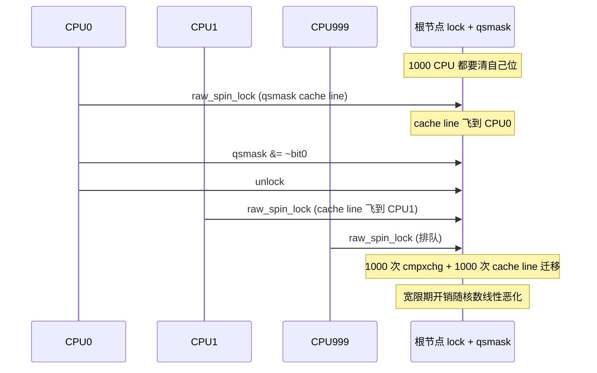
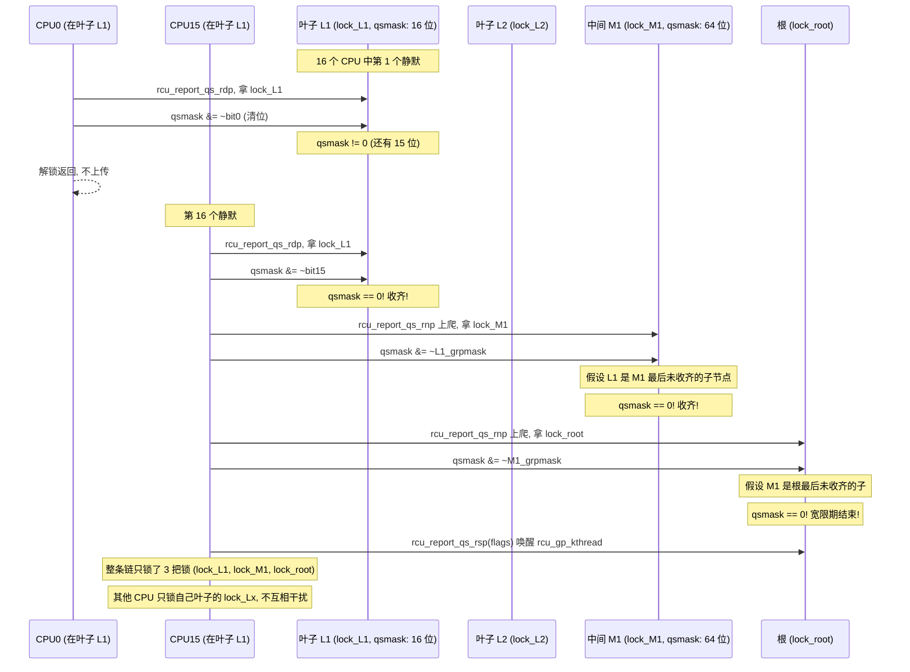
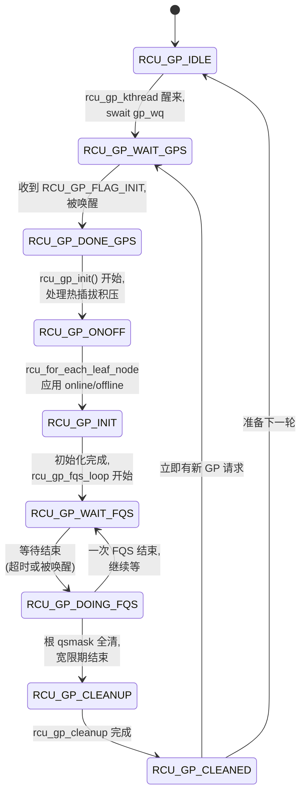
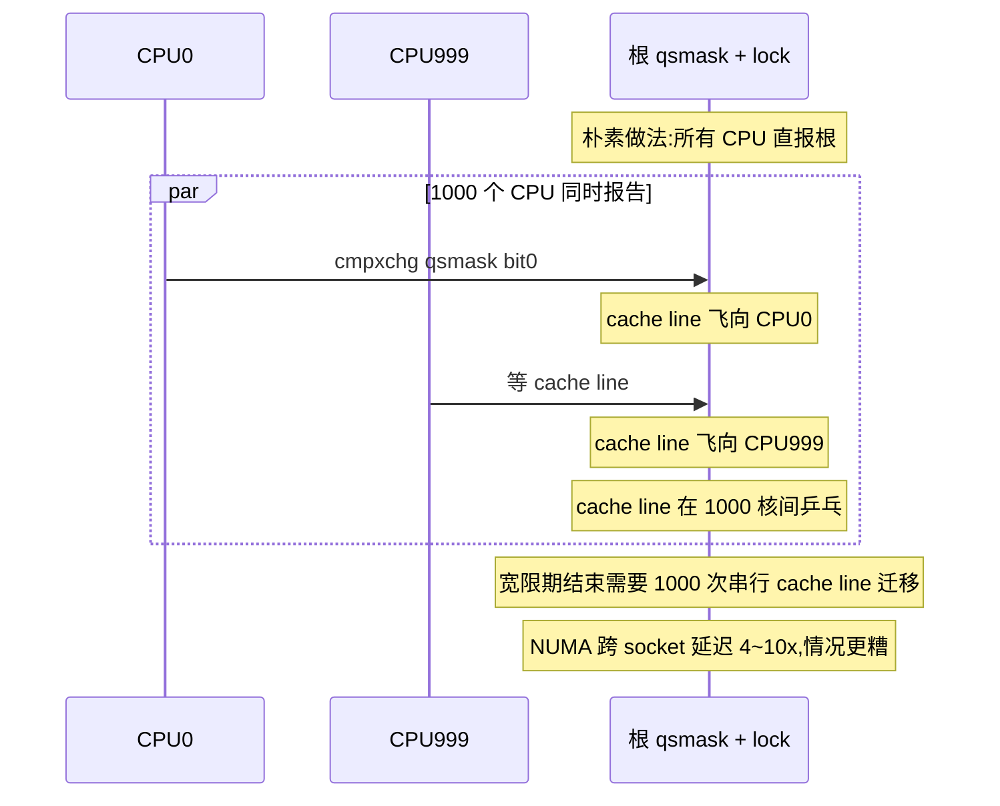
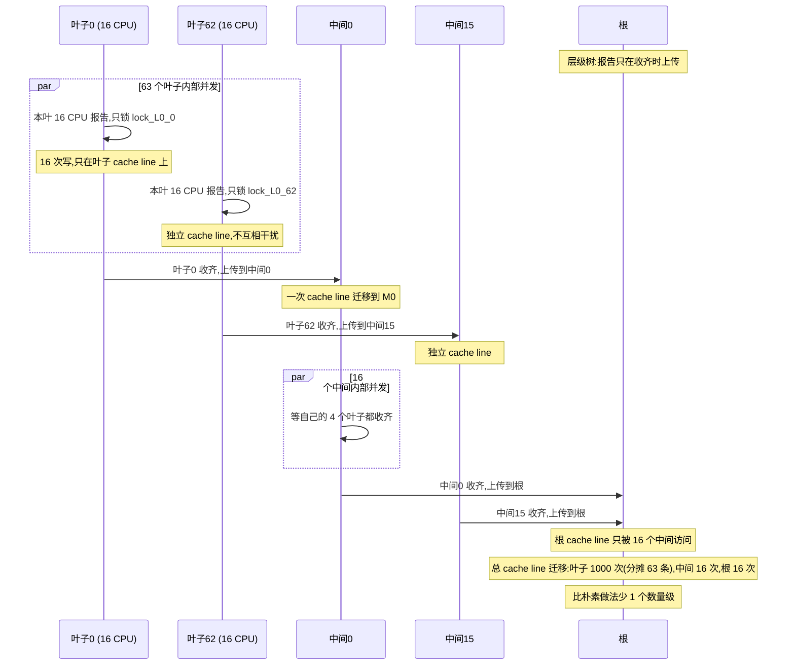
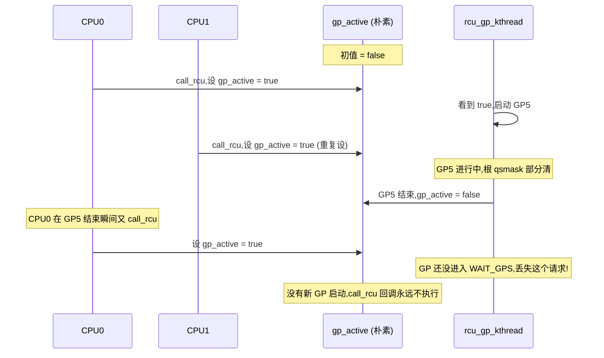

# 第十五篇 · 第 15 章 · tree RCU 的层级报告:rcu_node 树

> 篇:P5 RCU:读者零开销的终极解
> 主线呼应:上一章(P5-14)把宽限期的报告链拆透了——`rcu_sched_clock_irq` 在 tick 里观测静默态,`rcu_report_qs_rdp` → `rcu_report_qs_rnp` → `rcu_report_qs_rsp` 把静默信号一路传到根节点,根 `qsmask` 全清 = 宽限期结束。但那张时序图藏了一个巨大的"如果在 1000 核上"的问题:**报告链的终点是根节点,意味着每一条静默报告都要拿根节点的 `->lock`**。一台 1000 核机器上,如果所有 CPU 都直接抢根锁,这条锁会成为系统级瓶颈——根的 `qsmask` 所在的 cache line 在 1000 个核之间乒乓,宽限期反而被锁拖死。本章就回答:**怎么把"等所有 CPU 静默"这件事,在 1000 核上做成 O(log N) 而不是 O(N)**。答案是 [`struct rcu_node`](../linux/kernel/rcu/tree.h#L41-L139) 组成的层级树:叶子节点管若干 CPU、中间节点聚合子节点、根节点只接收少数几个中间节点的报告。**每层节点都有自己独立的 `raw_spinlock_t lock`**,竞争被分摊到 N 个叶子锁 + 几个中间锁 + 一个根锁上,根锁几乎不被竞争。再加上 [`rcu_gp_kthread`](../linux/kernel/rcu/tree.c#L1836-1869) 这个 `for (;;)` 主循环驱动的 GP 状态机(`RCU_GP_IDLE` → `RCU_GP_INIT` → 等静默 → `RCU_GP_CLEANUP`),整套机制构成了 tree RCU 的工程核心,也是 RCU 在大规模 SMP 上能 scale 的命脉。
> 二分法归属:**自旋/无锁一极**。rcu_node 的 `->lock` 是 raw_spinlock(P2-05 讲过),但本层只锁自己,层级结构本身把全局共享状态打散,这是"用结构消灭竞争"——同 per-cpu 计数器一个量级。

## 核心问题

**为什么所有 CPU 直接报告给根节点会在 1000 核上崩溃?rcu_node 层级树怎么把"O(N) 抢根锁"降到"O(扇出) 抢叶子锁"?树高 = log_fanout(NR_CPUS) 为什么让根锁几乎不被竞争?GP 状态机(`rcu_gp_kthread` 的 `for(;;)` 驱动 IDLE → INIT → 等静默 → CLEANUP)为什么要用 `#define` 常量而不是 enum,为什么不全用一个原子标志位?`gp_seq`(低 2 位状态 + 高位计数器)怎么编号宽限期、保证每个 CPU 在每个 GP 窗口内单独静默?`force_quiescent_state`(FQS)为什么是必要的兜底——被动等 tick 报告之外,主动"逼"静默?**

读完本章你会明白:

1. **rcu_node 树的几何**:叶子节点数 = `NR_CPUS / RCU_FANOUT_LEAF`(默认每叶 16 CPU),中间节点每层扇出 `RCU_FANOUT`(默认 32 或 64),树高 = `RCU_NUM_LVLS`(编译期根据 NR_CPUS 算出,1~4 层);1000 核树高 3 层,524288 核才到 4 层上限。
2. **层级报告为什么 sound**:叶子收齐本组 `qsmask` 才往上传一层、中间收齐才往上传一层——根 `qsmask` 全清 = 所有叶子 `qsmask` 全清 = 所有 CPU 静默。每层独立 `->lock`,根锁竞争被层级结构消灭。
3. **GP 状态机的状态宏**:`RCU_GP_IDLE`/`WAIT_GPS`/`DONE_GPS`/`ONOFF`/`INIT`/`WAIT_FQS`/`DOING_FQS`/`CLEANUP`/`CLEANED`(共 9 个 `#define` 常量,在 [tree.h:411-419](../linux/kernel/rcu/tree.h#L411-L419)),驱动 [`rcu_gp_kthread`](../linux/kernel/rcu/tree.c#L1836-1869) 的 for(;;) 循环;6.9 是 `#define` 不是 enum,也不在 enum 里——这是常被人照搬老资料搞错的点。
4. **`gp_seq` 的编号机制**:低 2 位是 GP 状态(00=IDLE,01/10=进行中),高位是单调递增的 GP 计数器;每个 CPU 用 `rdp->gp_seq != rnp->gp_seq` 检查"我看到的静默是不是过期了"——这是跨宽限期不串台的命脉。
5. **FQS 的兜底作用**:某些 CPU 长期不进用户态、不上下文切换(如纯内核计算循环),被动 tick 永远观测不到静默;`rcu_force_quiescent_state` 通过 IPI/`resched_cpu` 主动"逼"它让出 CPU,这是宽限期不会无限拖延的最后保险。
6. **★ 对照调度域 sched_domain**:Linux 调度器的 sched_domain 也是层级树(MC → SMT → NUMA → DIE),用同样的"层级分摊竞争"思想解决"load_balance 在 1000 核上抢一个锁"的问题。同源思想,内核不同子系统都用。

---

> **逃生阀**:这一章是 RCU 重头戏里最工程的一章,会出现 `rcu_node`/`rcu_data`/`rcu_state` 三个核心数据结构、9 个 GP 状态宏、`gp_seq` 编号机制、FQS 兜底机制。如果你只记得 P5-14 的报告链但不关心"1000 核会怎样",本章会显得很工程。**抓住一件事就够:层级树 + 每层独立锁 = SMP 可扩展性。** 把"所有 CPU 抢一把根锁"在脑子里换成"每层节点有自己的锁,报告只在收齐时才往上传"——这就是 tree RCU 的全部秘密。GP 状态机和 FQS 是为了"驱动 + 兜底",不是核心难点。

## 15.1 一句话点破

> **1000 个 CPU 直接报告给根节点,会让根节点的 `->lock` 成为系统级瓶颈——根 `qsmask` 那条 cache line 在 1000 个核之间乒乓,宽限期反而被锁拖死。tree RCU 把 CPU 分组成树形 rcu_node,每个叶子管若干 CPU(默认 16)、每个中间节点管若干子节点(默认 32~64),报告"沿树上传":叶子收齐本组静默才报中间,中间收齐才报根。根锁的争用者从 1000 个 CPU 降到 4 个中间节点。树高 = log_fanout(NR_CPUS),1000 核树高 3 层,根锁几乎不被竞争。GP 状态机(`rcu_gp_kthread` 的 `for(;;)` 循环 + 9 个 `#define` 状态宏)驱动 IDLE → INIT → 等静默 → CLEANUP 生命周期,`gp_seq` 低 2 位状态 + 高位计数器单调编号,每个 CPU 用它检查"我的静默是不是过期了"。这套机制把"等所有 CPU 静默"从 O(N) 降到 O(log N),是 RCU 在大规模 SMP 上 scale 的命脉。**

这是结论,不是理由。本章倒过来拆:先看朴素做法("所有 CPU 直报根")会撞什么墙(15.2),再看 rcu_node 树的几何结构怎么把竞争分摊(15.3),然后追报告沿树上传的源码、证明 sound(15.4),接着拆 GP 状态机和 `rcu_gp_kthread` 主循环(15.5),最后讲 FQS 兜底(15.6)和层级树的初始化几何(15.7),立起 ★ 对照。

---

## 15.2 朴素做法会撞什么墙:所有 CPU 直接报根

要把 P5-14 立的报告链放到大规模 SMP 上检视。回忆那条链:`rcu_report_qs_rdp` → `rcu_report_qs_rnp` → `rcu_report_qs_rsp`,终点是根节点。问题在 [`rcu_report_qs_rdp`](../linux/kernel/rcu/tree.c#L2008-L2135)([tree.c:2008](../linux/kernel/rcu/tree.c#L2008))第一句关键操作:

```c
rnp = rdp->mynode;
raw_spin_lock_irqsave_rcu_node(rnp, flags);
```

——它要拿 `rdp->mynode` 的 `->lock`。如果"mynode 永远是根节点"(朴素做法),那 1000 个 CPU 的所有报告都要拿同一把根锁。

> **不这样会怎样**:假设你把 rcu_node 树退化成单节点(只有根,所有 CPU 直接挂在根上)。一台 1000 核机器上,每个 CPU 静默一次就要拿一次根锁——1000 次 `raw_spin_lock_irqsave`。spinlock 是 spinlock(P2-05 讲过 qspinlock 怎么把"自旋在共享变量"优化成"自旋在本地变量"),但**前提是有竞争时才走 MCS 队列**;1000 个 CPU 抢同一把锁,MCS 鏖战,持锁者每次切换都让整条链路 cache line 乒乓。更糟的是,根 `qsmask` 这条 cache line 本身也是共享的——每个 CPU 报告时 `WRITE_ONCE(rnp->qsmask, rnp->qsmask & ~mask)` 改一位,1000 次写,cache line 在 1000 个核之间飞。

具体撞墙的时序(朴素做法 = 单根节点):



这是**线性恶化**:核数越多,根锁越堵。Paul McKenney 在 2000 年代的 RCU 早期版本就是这么做的(`struct rcu_ctrlblk` 单节点),在 8 核机器上还勉强,16 核以上就明显退化。这就是 tree RCU 出现的直接动机——**SMP 可扩展性**。

> **钉死这件事**:所有同步原语在大规模 SMP 上都要回答"会不会有热点锁"。spinlock 有 qspinlock(MCS 压一个字)、mutex 有乐观自旋、per-cpu 计数器把全局 count 拆成本地。RCU 的回答是:**把"所有 CPU 报告给根"拆成"按层级上报"**——这是 tree RCU 名字里 "tree" 的来源。

---

## 15.3 rcu_node 树的几何:叶子、中间、根

来看 [`struct rcu_node`](../linux/kernel/rcu/tree.h#L41-L139)([tree.h:41](../linux/kernel/rcu/tree.h#L41))的核心字段——这就是层级树的一个节点:

```c
struct rcu_node {
    raw_spinlock_t __private lock;        /* 本节点的锁 */
    unsigned long gp_seq;                  /* 跟踪 rcu_state.gp_seq */
    unsigned long gp_seq_needed;           /* 跟踪最远未来 GP 请求 */
    unsigned long completedqs;             /* 本节点所有 QS 完成 */
    unsigned long qsmask;                  /* CPUs 或子组,需要静默 */
    unsigned long rcu_gp_init_mask;        /* GP 初始化时离线 CPU */
    unsigned long qsmaskinit;              /* 每个 GP 初值 */
    unsigned long qsmaskinitnext;          /* 下个 GP 初值(热插拔用) */
    ...
    unsigned long grpmask;                 /* 在父节点 qsmask 里对应的位 */
    int grplo;                             /* 本节点最低 CPU 号 */
    int grphi;                             /* 本节点最高 CPU 号 */
    u8 grpnum;                             /* 在父节点里的组号 */
    u8 level;                              /* 0=根,叶子层最大 */
    bool wait_blkd_tasks;
    struct rcu_node *parent;               /* 父节点,根为 NULL */
    ...
    raw_spinlock_t fqslock ____cacheline_internodealigned_in_smp;
    spinlock_t exp_lock ____cacheline_internodealigned_in_smp;
    ...
} ____cacheline_internodealigned_in_smp;
```

几个字段必须钉死:

- **`->lock`**(L42):**本节点自己的 raw_spinlock**。报告改本节点的 `qsmask` 前要拿这把锁。这是层级树分散竞争的根:每层每节点一把独立锁,N 个节点的 N 把锁分摊了"原本根锁独扛"的竞争。
- **`->qsmask`**(L48):**静默位图**。叶子节点里每一位对应一个 CPU(`leaf_node_cpu_bit`);中间节点里每一位对应一个**子节点**(不是 CPU)。"位被清" = 对应 CPU 或子组已静默。
- **`->grpmask`**(L77):本节点在**父节点 `qsmask`** 里对应的位。每个节点只有一个父,所以 `grpmask` 只有一个 bit 被置位。
- **`->parent`**(L87):父节点指针,根节点为 NULL。
- **`->level`**(L82):本节点在第几层,**根是 level 0**(注意:这里是"根=0,叶子=最大",不是反过来),叶子层 level 最大。
- **`->grplo`/`->grphi`**(L79-80):本节点管的 CPU 号区间。叶子的 `[grplo, grphi]` 是 16 个连续 CPU;中间节点的区间包含所有子树的 CPU。
- **`->fqslock`**(L128):FQS(`force_quiescent_state`)用的另一把锁,**和 `->lock` 分离**,避免 FQS 路径和报告路径互相阻塞;`____cacheline_internodealigned_in_smp` 保证它独占 cache line,不和其他字段伪共享。

> **命名小坑**:`level = 0` 是根,**不是叶子**。源码里 `rcu_for_each_node_breadth_first` 从根(`level[0]`)开始遍历,往叶子方向走。读源码看到 `if (!rnp->parent)` 意思是"我是根"。

### 树的几何:扇出和层数

层级树的形状由两个常量决定,见 [`include/linux/rcu_node_tree.h`](../linux/include/linux/rcu_node_tree.h#L33-L90)([rcu_node_tree.h:33](../linux/include/linux/rcu_node_tree.h#L33)):

```c
#ifdef CONFIG_RCU_FANOUT
#define RCU_FANOUT CONFIG_RCU_FANOUT
#else
# ifdef CONFIG_64BIT
# define RCU_FANOUT 64
# else
# define RCU_FANOUT 32
#endif

#ifdef CONFIG_RCU_FANOUT_LEAF
#define RCU_FANOUT_LEAF CONFIG_RCU_FANOUT_LEAF
#else
#define RCU_FANOUT_LEAF 16
#endif

#define RCU_FANOUT_1    (RCU_FANOUT_LEAF)              /* 16 */
#define RCU_FANOUT_2    (RCU_FANOUT_1 * RCU_FANOUT)    /* 16*64 = 1024 */
#define RCU_FANOUT_3    (RCU_FANOUT_2 * RCU_FANOUT)    /* 16*64^2 = 65536 */
#define RCU_FANOUT_4    (RCU_FANOUT_3 * RCU_FANOUT)    /* 16*64^3 = 524288 */
```

注意:

- **`RCU_FANOUT_LEAF = 16`** 是**叶子节点扇出**:每个叶子管 16 个 CPU(可在启动时用 `rcu_fanout_leaf=` 调,见 [tree.c:110](../linux/kernel/rcu/tree.c#L110))。
- **`RCU_FANOUT = 64`** 是**中间节点扇出**:每个中间节点最多 64 个子节点。
- **`RCU_NUM_LVLS`** 是层数,编译期根据 `NR_CPUS` 选 1/2/3/4 层(见下表)。
- **`NUM_RCU_NODES`** 是所有节点总数(编译期算出),`rcu_state.node[NUM_RCU_NODES]` 一次性静态分配。

| NR_CPUS 上限 | RCU_NUM_LVLS | 树形(默认 64-bit, fanout_leaf=16, fanout=64) |
|--------------|-------------|------------------------------------------------|
| 16 | 1 | 只有根(根=叶子),所有 CPU 挂根 |
| 1024 | 2 | 根 → 16~64 叶子(每叶 16 CPU) |
| 65536 | 3 | 根 → 16~64 中间 → 各 16~64 叶子 |
| 524288 | 4 | 根 → 中间 → 中间 → 叶子 |

> **钉死这件事**:tree RCU 的"tree"在工程上对应**编译期静态分配 + 编译期算层数**——`NUM_RCU_NODES` 是常量,`rcu_state.node[]` 是定长数组。运行时不需要动态分配,这对启动早期(init 阶段)就可用 RCU 至关重要。所以哪怕你只有 8 核,如果 `CONFIG_NR_CPUS` 是 8192,内核编译出来的 `rcu_state` 就有 9 个节点(2 层)。这是 RCU 几何"在编译期定下"的关键。

### 一台 1000 核机器上的 rcu_node 树(3 层示例)

设 NR_CPUS = 1000,fanout_leaf = 16,fanout = 64:

```
                            根 (level 0)
                            qsmask: 64 位 (最多 64 子)
                            lock: 根锁
                          /    |    \
                        /      |      \
                       /       |       \
            中间节点 A (level 1)  B  ...   P  (16 个中间节点)
            qsmask: 64 位         ↑
            lock: A 锁
              /  |  \
            /    |    \
          叶子   叶子   叶子   (每中间节点下挂 ~3 叶子,A 管约 48 CPU)
          (level 2)
          qsmask: 16 位
          lock: 叶子锁
          每叶 16 CPU

统计:
  叶子数 = ceil(1000/16) = 63 个
  中间数 = ceil(63/64) = 1 层(本例 1 个中间层,16 个中间节点)
  根 = 1
  总节点数 ≈ 80 (rcu_state.node[80])
  树高 = 3
```

这张图里**锁的分布**:80 个节点,80 把 `raw_spinlock_t lock`。一次宽限期内:

- 每个 CPU 报告时只拿**自己叶子的锁**(自己 `rdp->mynode` 的锁)。
- 叶子收齐本组 16 位才往上报一次中间,中间收齐才往上报根。
- 根只被少数中间节点访问(本例 16 次),远少于"1000 CPU 直接报根"。

**根锁的争用者从 1000 降到 16**——这就是 tree RCU 把"O(N) 抢根锁"降到"O(扇出) 抢叶子锁"的具体含义。

### 反面对比:单根节点 vs 层级树

| 维度 | 单根节点(朴素) | **层级树(tree RCU)** |
|------|----------------|----------------------|
| 1000 核上根锁争用者 | 1000 个 CPU | ~16 个中间节点 |
| 1000 核上报告一次的 cache line 迁移 | ~1000 次 | 叶子内 ~16 次,根 16 次 |
| `qsmask` cache line 飞的次数 | 1000 次 | 16 次 |
| 宽限期总延迟 | 随核数线性恶化 | 树高 log(1000) ≈ 3 层,近常数 |
| 锁竞争瓶颈 | 1 把根锁 | 80 把锁分摊,无瓶颈 |
| 8 核 / 1000 核的差距 | 几十倍 | 几乎无差距 |

> **不这样会怎样**:如果坚持用单根节点,RCU 在大规模 NUMA 机器上根本不可用——根 `qsmask` 这条 cache line 在 NUMA 节点之间跨 socket 飞行,延迟尤其惨重(NUMA 跨节点延迟是同节点的 4~10 倍)。Paul McKenney 在 2008 年引入 hierarchical RCU(就是 tree RCU)正是为了解决"在 4096 核机器上 RCU 还能用"。这是 RCU 从玩具变工程关键设施的转折点。

---

## 15.4 层级报告为什么 sound:沿树上传,不漏不重

P5-14 讲报告链时已经追过 [`rcu_report_qs_rnp`](../linux/kernel/rcu/tree.c#L1905-1962) 的骨架,本章我们重点看**它怎么利用层级结构**。重看关键循环:

```c
static void rcu_report_qs_rnp(unsigned long mask, struct rcu_node *rnp,
                              unsigned long gps, unsigned long flags)
    __releases(rnp->lock)
{
    ...
    /* Walk up the rcu_node hierarchy. */
    for (;;) {
        if ((!(rnp->qsmask & mask) && mask) || rnp->gp_seq != gps) {
            raw_spin_unlock_irqrestore_rcu_node(rnp, flags);
            return;
        }
        ...
        WRITE_ONCE(rnp->qsmask, rnp->qsmask & ~mask);
        ...
        if (rnp->qsmask != 0 || rcu_preempt_blocked_readers_cgp(rnp)) {
            /* Other bits still set at this level, so done. */
            raw_spin_unlock_irqrestore_rcu_node(rnp, flags);
            return;
        }
        rnp->completedqs = rnp->gp_seq;
        mask = rnp->grpmask;
        if (rnp->parent == NULL) {
            /* No more levels. Exit loop holding root lock. */
            break;
        }
        raw_spin_unlock_irqrestore_rcu_node(rnp, flags);
        rnp_c = rnp;
        rnp = rnp->parent;
        raw_spin_lock_irqsave_rcu_node(rnp, flags);
        oldmask = READ_ONCE(rnp_c->qsmask);
    }

    /* Last CPU to pass through a QS for this GP. */
    rcu_report_qs_rsp(flags); /* releases rnp->lock. */
}
```

这段是层级报告的灵魂,逐句拆:

**第 1 步·查位**(`rnp->qsmask & mask`):看本层位图里这位还在不在。可能已经被并发清掉了(别的报告路径走过),那就直接返回——避免重复报告。

**第 2 步·查 GP**(`rnp->gp_seq != gps`):看本节点 GP 编号还是不是这次(用 `gps` 快照)。宽限期可能在我爬树的过程中结束了,新宽限期开始了,我的 `gps` 过期——这时也得返回,不能拿过期静默去清新 GP 的位图。

**第 3 步·清位**(`WRITE_ONCE(rnp->qsmask, rnp->qsmask & ~mask)`):把本 CPU(或本子组)对应的位清掉。注意 `WRITE_ONCE`——保证编译器不重排、不合并,这是并发正确性的最低保险(回扣 P1-03)。

**第 4 步·本层收齐判断**(`rnp->qsmask != 0`):**关键一句**。如果本层位图还没清完(还有别的 CPU 或子组没静默),**解锁返回**——不往上传。只有本层完全收齐了,才走第 5 步。

**第 5 步·往上传一层**:`mask = rnp->grpmask`(本节点在父节点位图里对应的位,只有一个 bit)、`rnp = rnp->parent`(往上爬一层)、`raw_spin_lock_irqsave_rcu_node(rnp, flags)`(锁父节点的锁,不是同一把锁)。然后回到第 1 步,在父节点上重复。

**第 6 步·爬到根**(`rnp->parent == NULL`):跳出循环,调 `rcu_report_qs_rsp` 通知根完成。

### 这条链的 sound 证明

**为什么层级报告不漏不重**:

- **不漏**:每个 CPU 在每个宽限期里静默一次,就会走一遍这条链(从叶子起)。叶子节点的位被清 ⇔ 该 CPU 静默;叶子所有位清完 ⇔ 叶子收齐;叶子收齐 ⇔ 在父节点清掉自己的 `grpmask` 位;以此类推,根收齐 ⇔ 所有中间收齐 ⇔ 所有叶子收齐 ⇔ 所有 CPU 静默。**链条严格传递,没有漏报的可能。**
- **不重**:每个 CPU 一次宽限期里只走一次链(清完位后,`rnp->qsmask & mask` 就是 0,第 1 步就 return);每个中间节点往上传也只走一次(清完位后,本层 `qsmask != 0` 一旦变 0,才往上传;上传后下一次想再传,位已清,第 1 步返回)。**没有重报的可能。**
- **跨 GP 安全**:每一步都有 `rnp->gp_seq != gps` 检查。即使爬到一半,新宽限期启动了 `gp_seq` 推进,本次报告立即终止——不会把旧 GP 的静默串台到新 GP。



这张时序图钉死了层级报告的两个关键性质:**(a) 同一叶子内的 16 个 CPU 只在"叶子收齐"那一刻才往中间报一次,16 次 CPU 报告 → 1 次中间报; (b) 每层锁是独立的,叶子锁被抢只是 16 个 CPU 之间,根锁几乎只被"中间收齐"事件访问(每个中间收齐才一次)**。

> **为什么 sound(层级树正确性地基)**:设宽限期 `T` 内,任意 CPU `c` 静默 ⇒ `c` 必然走一次 `rcu_report_qs_rdp` 清掉自己叶子的位 ⇒ 叶子的位集合 ⇒ 叶子所有位清完 ⇒ 父节点清掉叶子对应位 ⇒ 根 qsmask 全清 ⇒ `rcu_report_qs_rsp` 唤醒 `rcu_gp_kthread` ⇒ 宽限期结束。每一步都有 GP 快照 `gps` 比对防止串台,所以**根 qsmask 全清 ⇔ 本次 GP 内所有 CPU 静默**,等价于 P5-14 立的"所有读者退出"。

### 锁分离:每层独立 lock,FQS 用独立 fqslock

注意 `struct rcu_node` 有两把锁:`->lock`(主要锁,保护 `qsmask`/`gp_seq` 等)和 `->fqslock`(FQS 路径专用)。FQS 是 [`rcu_force_quiescent_state`](../linux/kernel/rcu/tree.c#L2372-2392) 主动"逼"静默的路径,它会沿树爬升(见注释 "Funnel through hierarchy to reduce memory contention"),走 `fqslock` 而不是 `->lock`——**避免 FQS 长时间持锁阻塞正常报告路径**。这是"同一结构多把锁,分路径加锁"的典型内核技巧,在 P2-05 的 spinlock 优化里也见过(乐观自旋的 OSQ 和主锁分离)。

---

## 15.5 GP 状态机:rcu_gp_kthread 的 for(;;) 主循环

宽限期的生命周期由 [`rcu_gp_kthread`](../linux/kernel/rcu/tree.c#L1836-1869)([tree.c:1836](../linux/kernel/rcu/tree.c#L1836))驱动。这是 RCU 的"心跳"——一个内核线程,在一个 `for(;;)` 死循环里推进宽限期。完整骨架(去掉 trace 和 slow delay):

```c
static int __noreturn rcu_gp_kthread(void *unused)
{
    rcu_bind_gp_kthread();
    for (;;) {

        /* Handle grace-period start. */
        for (;;) {
            WRITE_ONCE(rcu_state.gp_state, RCU_GP_WAIT_GPS);
            swait_event_idle_exclusive(rcu_state.gp_wq,
                             READ_ONCE(rcu_state.gp_flags) &
                             RCU_GP_FLAG_INIT);
            ...
            WRITE_ONCE(rcu_state.gp_state, RCU_GP_DONE_GPS);
            if (rcu_gp_init())
                break;
            ...
        }

        /* Handle quiescent-state forcing. */
        rcu_gp_fqs_loop();

        /* Handle grace-period end. */
        WRITE_ONCE(rcu_state.gp_state, RCU_GP_CLEANUP);
        rcu_gp_cleanup();
        WRITE_ONCE(rcu_state.gp_state, RCU_GP_CLEANED);
    }
}
```

外层 `for(;;)` 是无限循环——一个宽限期结束,立即检查有没有新的宽限期请求,有就再开一轮,没有就睡。内层 `for(;;)` 是"等启动"——睡在 `rcu_state.gp_wq` 上,等 `RCU_GP_FLAG_INIT` 标志被置(由 `call_rcu`/`synchronize_rcu` 通过 `rcu_start_this_gp` 触发)。

### GP 状态机的 9 个状态

状态的取值见 [tree.h:411-419](../linux/kernel/rcu/tree.h#L411-L419):

```c
/* Values for rcu_state structure's gp_flags field. */
#define RCU_GP_FLAG_INIT 0x1   /* 需要 GP 初始化 */
#define RCU_GP_FLAG_FQS  0x2   /* 需要 force-quiescent-state */
#define RCU_GP_FLAG_OVLD 0x4   /* 回调过载 */

/* Values for rcu_state structure's gp_state field. */
#define RCU_GP_IDLE       0    /* 初始状态,无 GP 进行中 */
#define RCU_GP_WAIT_GPS   1    /* 等 GP 启动 */
#define RCU_GP_DONE_GPS   2    /* GP 启动的等待完成 */
#define RCU_GP_ONOFF      3    /* GP 初始化期间的热插拔 */
#define RCU_GP_INIT       4    /* GP 初始化 */
#define RCU_GP_WAIT_FQS   5    /* 等 force-quiescent-state 时间 */
#define RCU_GP_DOING_FQS  6    /* force-quiescent-state 等待完成 */
#define RCU_GP_CLEANUP    7    /* GP 收尾已开始 */
#define RCU_GP_CLEANED    8    /* GP 收尾已完成 */
```

⚠️ **6.9 的关键事实**:这些状态是 `#define` **宏常量,不是 enum**。老资料里常常出现 enum 写法或拼写差异(`GP_WAIT_GPS`/`GP_DONE_GPS`/`GP_ONOFF`/`GP_DOING_FQS`/`GP_CLEANED` 这些是 6.x 后逐步加进去的)。本书以本地 6.9 源码为准,9 个状态宏。

为什么用 `#define` 而不是 enum?**因为它们要被 `trace_rcu_grace_period` trace 点用,trace 点的格式字符串要直接吃整数值**——宏常量是整数常量表达式,能在编译期被替换到 trace 的 `print_fmt` 字符串里;enum 也行但历史原因 RCU 选了宏。这是工程细节,不影响理解。

### 状态机迁移图



注意几个关键迁移:

- **`RCU_GP_IDLE → RCU_GP_WAIT_GPS`**:rcu_gp_kthread 进入睡眠,等 `RCU_GP_FLAG_INIT`。**IDLE 状态下没有宽限期**,任何 CPU 静默报告都会被 `rcu_report_qs_rdp` 里的 `gp_seq` 检查挡掉(因为 `rdp->gp_seq != rnp->gp_seq`)。
- **`RCU_GP_DONE_GPS → RCU_GP_INIT`**:`rcu_gp_init()` 真正启动宽限期——`rcu_seq_start(&rcu_state.gp_seq)` 把低 2 位从 00 变成 01(下一节拆 `gp_seq`),然后 `rcu_for_each_node_breadth_first` 给每个节点的 `qsmask` 重新赋初值(`rnp->qsmask = rnp->qsmaskinit`),再 `WRITE_ONCE(rnp->gp_seq, rcu_state.gp_seq)` 把新 GP 编号通知所有节点。
- **`RCU_GP_INIT → RCU_GP_WAIT_FQS`**:初始化完成,进入 FQS 等待循环。这一阶段一直等到根 `qsmask` 全清(`rcu_gp_fqs_check_wake` 检查 `!READ_ONCE(rnp->qsmask)`)。
- **`RCU_GP_DOING_FQS → RCU_GP_CLEANUP`**:宽限期结束,`rcu_gp_cleanup` 推进 `gp_seq`(低 2 位从 01 回到 00,高位 +1),把"完成"通知所有节点的 `gp_seq`,触发回调推进。

### 为什么不全用一个原子标志位?

朴素的写法是用一个原子 int 表示"GP 状态",`cmpxchg` 改状态。为什么 RCU 要拆 9 个状态?**因为 GP 状态机不是简单的"开/关",而是一个有阶段的生命周期**:

- **等待启动**(`WAIT_GPS`)和**等静默**(`WAIT_FQS`)要分开睡,前者等"开始事件",后者等"超时或被 FQS 唤醒"——睡眠的条件和唤醒源不同。
- **初始化中**(`INIT`)和**收尾中**(`CLEANUP`)是"正在改全局状态,不能被打断"的临界区,需要被 trace 看到。
- **`gp_state` 是只写的诊断字段**——`WRITE_ONCE` 写,trace 和 `/sys/kernel/debug/rcu/rcudata` 读。它不参与同步决策(同步用 `gp_seq` 和锁),只用于观测"现在 GP 卡在哪一步"。所以**它可以是简单状态宏,不需要原子操作**——`WRITE_ONCE` + 锁提供的内存屏障已经足够保证可见性。

> **为什么 sound**:`gp_state` 是诊断字段,不是同步字段——它不参与"决定 GP 是否结束"。真正决定 GP 结束的是 `rcu_state.gp_seq` 的低 2 位 + 根节点 `qsmask == 0` + 持根锁。`gp_state` 只是把"GP 在哪一步"暴露给观测工具。**如果 gp_state 显示 `RCU_GP_INIT` 但实际 GP 已经在收尾,这不会引起正确性问题——只是观测不准**。这种"诊断状态机 + 同步状态机"分离是内核常见设计,避免诊断开销污染热路径。

### rcu_gp_init:启动一个宽限期

[`rcu_gp_init`](../linux/kernel/rcu/tree.c#L1428-1566)([tree.c:1428](../linux/kernel/rcu/tree.c#L1428))关键片段:

```c
static noinline_for_stack bool rcu_gp_init(void)
{
    ...
    raw_spin_lock_irq_rcu_node(rnp);
    if (!READ_ONCE(rcu_state.gp_flags)) {
        /* Spurious wakeup, tell caller to go back to sleep.  */
        raw_spin_unlock_irq_rcu_node(rnp);
        return false;
    }
    WRITE_ONCE(rcu_state.gp_flags, 0); /* Clear all flags: New GP. */

    if (WARN_ON_ONCE(rcu_gp_in_progress())) {
        /* Grace period already in progress, don't start another. */
        raw_spin_unlock_irq_rcu_node(rnp);
        return false;
    }

    /* Advance to a new grace period and initialize state. */
    record_gp_stall_check_time();
    rcu_seq_start(&rcu_state.gp_seq);     /* 关键:启动 GP,gp_seq 低 2 位变 01 */
    ...
    raw_spin_unlock_irq_rcu_node(rnp);

    /* 应用热插拔积压 */
    WRITE_ONCE(rcu_state.gp_state, RCU_GP_ONOFF);
    rcu_for_each_leaf_node(rnp) {
        ...
        oldmask = rnp->qsmaskinit;
        rnp->qsmaskinit = rnp->qsmaskinitnext;
        ...
    }

    /* 给每个节点的 qsmask 赋初值,通知新 GP 编号 */
    WRITE_ONCE(rcu_state.gp_state, RCU_GP_INIT);
    rcu_for_each_node_breadth_first(rnp) {
        rcu_gp_slow(gp_init_delay);
        raw_spin_lock_irqsave_rcu_node(rnp, flags);
        ...
        rnp->qsmask = rnp->qsmaskinit;                  /* 关键:重置静默位图 */
        WRITE_ONCE(rnp->gp_seq, rcu_state.gp_seq);       /* 关键:通知新 GP 编号 */
        ...
        raw_spin_unlock_irq_rcu_node(rnp);
        cond_resched_tasks_rcu_qs();
        WRITE_ONCE(rcu_state.gp_activity, jiffies);
    }
    ...
    return true;
}
```

几个关键点:

- **`rcu_seq_start(&rcu_state.gp_seq)`**:`gp_seq` 低 2 位从 00(IDLE)变成 01(GP 进行中),高位不变。这一刻开始,任何 CPU 看到的 `gp_seq` 都和 IDLE 时不同——这是 `rcu_report_qs_rdp` 里 `rdp->gp_seq != rnp->gp_seq` 检查能识别"新 GP"的根。
- **`rnp->qsmask = rnp->qsmaskinit`**:每个节点的 `qsmask` 重置成本组"当前在线 CPU"的位图(`qsmaskinit` 在热插拔时维护)。这一刻开始,所有 CPU 都"未静默"——它们要重新观测静默并报告。
- **`WRITE_ONCE(rnp->gp_seq, rcu_state.gp_seq)`**:把新 GP 编号下发给每个节点。这是关键——`rcu_report_qs_rdp` 里的 `gp_seq` 比对用的是节点级 `gp_seq`,不是全局 `rcu_state.gp_seq`(虽然它们最终会同步)。
- **广度优先遍历**(`rcu_for_each_node_breadth_first`):从根开始,一层一层往下初始化。这保证**父节点先初始化**,子节点的报告上来时,父节点的 `qsmask` 已经是新 GP 的初值——不会出现"子节点报上来,父节点还是旧 GP 状态"的撕裂。

> **为什么 sound**:`rcu_gp_init` 持根锁推进 `gp_seq`,然后**广度优先**逐层给节点赋初值。父先于子初始化 ⇒ 子的报告到达父时,父已经是新 GP 状态 ⇒ `gps` 比对正确。如果改成深度优先或乱序,可能出现"子节点报告了,父节点还是旧 GP,qsmask 还是清空状态"——报告被吞掉,新 GP 卡住。**广度优先初始化是层级树正确性的小细节,大意义。**

### rcu_gp_cleanup:收尾一个宽限期

[`rcu_gp_cleanup`](../linux/kernel/rcu/tree.c#L1718-1831)([tree.c:1718](../linux/kernel/rcu/tree.c#L1718))关键片段:

```c
static noinline void rcu_gp_cleanup(void)
{
    ...
    raw_spin_lock_irq_rcu_node(rnp);
    rcu_state.gp_end = jiffies;
    gp_duration = rcu_state.gp_end - rcu_state.gp_start;
    if (gp_duration > rcu_state.gp_max)
        rcu_state.gp_max = gp_duration;

    rcu_poll_gp_seq_end(&rcu_state.gp_seq_polled_snap);
    raw_spin_unlock_irq_rcu_node(rnp);

    /* 把新 gp_seq 下发给所有节点 */
    new_gp_seq = rcu_state.gp_seq;
    rcu_seq_end(&new_gp_seq);                            /* gp_seq 低 2 位回到 00,高位 +1 */
    rcu_for_each_node_breadth_first(rnp) {
        raw_spin_lock_irq_rcu_node(rnp);
        ...
        WARN_ON_ONCE(rnp->qsmask);                       /* 警告:不应该还有未清位 */
        WRITE_ONCE(rnp->gp_seq, new_gp_seq);             /* 通知节点:GP 结束 */
        ...
        raw_spin_unlock_irq_rcu_node(rnp);
        ...
    }
    rnp = rcu_get_root();
    raw_spin_lock_irq_rcu_node(rnp);

    trace_rcu_grace_period(rcu_state.name, rcu_state.gp_seq, TPS("end"));
    rcu_seq_end(&rcu_state.gp_seq);                      /* 关键:全局 gp_seq 推进 */
    ASSERT_EXCLUSIVE_WRITER(rcu_state.gp_seq);
    WRITE_ONCE(rcu_state.gp_state, RCU_GP_IDLE);
    ...
}
```

- **`rcu_seq_end(&new_gp_seq)`**:`gp_seq` 低 2 位从 01 变回 00,高位 +1。下一个 GP 启动时,高位会再 +1(变成 `rcu_seq_start` 的副作用)——所以每个 GP 有一个唯一的高位编号。
- **广度优先下发新 `gp_seq`**:和 `rcu_gp_init` 一样,父先于子更新 `gp_seq`。子节点的 `rcu_data` 通过 `note_gp_changes` 异步感知到 `gp_seq` 推进(不用等下一个 tick,RCU softirq 里就会检查)。
- **`WARN_ON_ONCE(rnp->qsmask)`**:每个节点的 `qsmask` 此时应该全清(否则不会进入 cleanup)——这是个不变式断言。

### gp_seq 的编号机制

[`gp_seq`](../linux/kernel/rcu/tree.h#L338) 是 `unsigned long`,低 2 位是状态,高位是计数器(见 [kernel/rcu/rcu.h:57](../linux/kernel/rcu/rcu.h#L57)):

```c
#define RCU_SEQ_CTR_SHIFT    2
#define RCU_SEQ_STATE_MASK   ((1 << RCU_SEQ_CTR_SHIFT) - 1)
```

- **低 2 位 = 0 (00)**:GP 未进行(IDLE)。
- **低 2 位 = 1 (01)**:GP 进行中(由 `rcu_seq_start` 设置)。
- **低 2 位 = 2 (10)**:特殊状态(SRCU 用,普通 RCU 不用)。
- **低 2 位 = 3 (11)**:未使用。
- **高位 = GP 计数器**:每结束一个 GP,`rcu_seq_end` 把高位 +1。

```
gp_seq 布局:
  ┌─────────────────────────────┬───┐
  │      高位:GP 计数器          │低2│
  │  (每结束一个 GP 加 1, 单调)  │位 │
  └─────────────────────────────┴───┘
                                 ↑
                            00 = IDLE
                            01 = 进行中
```

为什么用低 2 位而不是单独一个字段?**因为 `gp_seq` 要被无锁读**(CPU 之间共享)。`unsigned long` 的读写在所有架构上都是原子的(回扣 P1-02),所以一次 `READ_ONCE(gp_seq)` 就能拿到完整的"GP 编号 + 状态"。如果拆成两个字段(`gp_ctr` + `gp_state`),读它们之间可能被并发更新撕裂——读到 `gp_ctr=5, gp_state=IDLE` 但实际是 `gp_ctr=6, gp_state=进行中`。压进一个字、低 2 位编码状态,一次原子读就拿到一致快照。**这是"用位编码换原子性"的典型内核技巧**(mutex 的 owner 字段低位编码 waiters/handoff 也是同源,见 P3-08)。

> **为什么 sound**:`gp_seq` 是单调递增的(`rcu_seq_end` 高位 +1,`rcu_seq_start` 不改高位只改低 2 位)。任意两个时刻 `T1 < T2`,`gp_seq(T1) <= gp_seq(T2)`(数值比较)。所以 `ULONG_CMP_LT`/`ULONG_CMP_GE` 这些比较宏可以直接用数值比较——不会出现"GP5 的 gp_seq 数值上大于 GP6"的混乱。每个 CPU 的 `rdp->gp_seq` 跟踪自己看到的 GP 编号,`rdp->gp_seq != rnp->gp_seq` 就意味着"我的视角和节点不一致,得重新观测静默"——这是跨宽限期不串台的命脉(P5-14 反例一已经讲过)。

---

## 15.6 FQS:被动等不到时主动"逼"静默

到目前为止,我们假设 CPU 会通过 tick 主动报告静默(`rcu_sched_clock_irq` 在 tick 里观测到 user/idle 就报告)。但有一种 CPU **永远不会主动静默**:它跑在内核态,既不进用户态,也不上下文切换,也不 idle——比如一个紧密的内核计算循环,`preempt_disable` 期间。这种 CPU 的 tick 进来,既不是 user 也不是 idle,RCU 检测不到静默。宽限期会卡住,直到这个 CPU 跑完循环。

如果这个循环特别长(几秒),宽限期就拖几秒——`synchronize_rcu` 调用者睡几秒,系统看起来"卡住"。这就是 **FQS(Force Quiescent State)** 要解决的问题:**RCU 主动"逼"这种 CPU 静默**。

### rcu_gp_fqs_loop:周期性扫描

[`rcu_gp_fqs_loop`](../linux/kernel/rcu/tree.c#L1632-1713)([tree.c:1632](../linux/kernel/rcu/tree.c#L1632))是 rcu_gp_kthread 在 `RCU_GP_INIT` 之后进入的循环。简化骨架:

```c
static noinline_for_stack void rcu_gp_fqs_loop(void)
{
    bool first_gp_fqs = true;
    int gf = 0;
    unsigned long j;
    ...
    struct rcu_node *rnp = rcu_get_root();

    j = READ_ONCE(jiffies_till_first_fqs);
    ...
    for (;;) {
        ...
        WRITE_ONCE(rcu_state.jiffies_force_qs, jiffies + j);
        smp_wmb();
        ...
        WRITE_ONCE(rcu_state.gp_state, RCU_GP_WAIT_FQS);
        (void)swait_event_idle_timeout_exclusive(rcu_state.gp_wq,
                                 rcu_gp_fqs_check_wake(&gf), j);
        ...
        WRITE_ONCE(rcu_state.gp_state, RCU_GP_DOING_FQS);
        /* 根 qsmask 全清 = 宽限期结束,跳出循环 */
        if (!READ_ONCE(rnp->qsmask) &&
            !rcu_preempt_blocked_readers_cgp(rnp))
            break;
        /* 时间到了或被 FQS 请求唤醒,做一次强制扫描 */
        if (!time_after(rcu_state.jiffies_force_qs, jiffies) ||
            (gf & (RCU_GP_FLAG_FQS | RCU_GP_FLAG_OVLD))) {
            rcu_gp_fqs(first_gp_fqs);
            ...
        }
    }
}
```

关键逻辑:

- **睡眠等超时**(`swait_event_idle_timeout_exclusive`):带超时的睡眠,睡 `j` 个 jiffies(`jiffies_till_first_fqs` 初值,默认约 1 个调度周期)。期间被唤醒(由 `rcu_report_qs_rsp` 在根收齐时唤醒,或 `rcu_force_quiescent_state` 唤醒)就提前醒。
- **跳出条件**(`!READ_ONCE(rnp->qsmask)`):根 qsmask 全清 = 宽限期结束,跳出循环,进入 cleanup。
- **FQS 触发**(时间到或被 FQS 请求):调 `rcu_gp_fqs(first_gp_fqs)` 做一次主动扫描。

### rcu_gp_fqs:做一次主动扫描

[`rcu_gp_fqs`](../linux/kernel/rcu/tree.c#L1595-1627)([tree.c:1595](../linux/kernel/rcu/tree.c#L1595)):

```c
static void rcu_gp_fqs(bool first_time)
{
    ...
    struct rcu_node *rnp = rcu_get_root();

    WRITE_ONCE(rcu_state.gp_activity, jiffies);
    WRITE_ONCE(rcu_state.n_force_qs, rcu_state.n_force_qs + 1);
    ...
    if (first_time) {
        /* 第一次:扫所有叶子,记录 dyntick-idle 快照 */
        force_qs_rnp(dyntick_save_progress_counter);
    } else {
        /* 后续:扫所有叶子,对没静默的 CPU 主动逼 */
        force_qs_rnp(rcu_implicit_dynticks_qs);
    }
    /* 清 FQS 标志,防立即重入 */
    if (READ_ONCE(rcu_state.gp_flags) & RCU_GP_FLAG_FQS) {
        raw_spin_lock_irq_rcu_node(rnp);
        WRITE_ONCE(rcu_state.gp_flags,
                   READ_ONCE(rcu_state.gp_flags) & ~RCU_GP_FLAG_FQS);
        raw_spin_unlock_irq_rcu_node(rnp);
    }
}
```

- **第一次 FQS**(`first_time == true`):调 [`force_qs_rnp(dyntick_save_progress_counter)`](../linux/kernel/rcu/tree.c#L2313-L2366),遍历所有叶子节点,对每个 CPU 调 `dyntick_save_progress_counter`——记录它的 dyntick 计数器快照(`rcu_data->dynticks_snap`)。**dyntick 计数器**(见 `rcu_data.dynticks`)记录 CPU 进出 dyntick-idle(即 NOHZ tickless idle)的次数,如果 GP 期间它变了,说明它经过了一次 dyntick-idle = 静默。
- **后续 FQS**:调 `force_qs_rnp(rcu_implicit_dynticks_qs)`,对每个还没静默的 CPU 检查——dyntick 变了吗?如果在内核态循环,dyntick 没变,那就**调 `resched_cpu(cpu)` 强制设置那个 CPU 的 `TIF_NEED_RESCHED`**,逼它尽快调度(回扣调度器那本的延迟抢占)。下一次调度点它会做上下文切换——上下文切换 = 静默态!

### force_qs_rnp 的层级结构

[`force_qs_rnp`](../linux/kernel/rcu/tree.c#L2313-L2366)([tree.c:2313](../linux/kernel/rcu/tree.c#L2313))**只遍历叶子节点**(`rcu_for_each_leaf_node`),不爬树:

```c
static void force_qs_rnp(int (*f)(struct rcu_data *rdp))
{
    ...
    rcu_for_each_leaf_node(rnp) {
        unsigned long mask = 0;
        unsigned long rsmask = 0;

        raw_spin_lock_irqsave_rcu_node(rnp, flags);
        ...
        if (rnp->qsmask == 0) { /* 本叶子已收齐 */
            ...
            continue;
        }
        for_each_leaf_node_cpu_mask(rnp, cpu, rnp->qsmask) {
            struct rcu_data *rdp;
            int ret;

            rdp = per_cpu_ptr(&rcu_data, cpu);
            ret = f(rdp);              /* dyntick_save 或 implicit_dynticks */
            if (ret > 0) {
                mask |= rdp->grpmask;  /* 这个 CPU 静默了,记录 */
            }
            if (ret < 0)
                rsmask |= rdp->grpmask; /* 这个 CPU 要被 resched */
        }
        if (mask != 0) {
            /* 有 CPU 静默了,通过正常报告链上报 */
            rcu_report_qs_rnp(mask, rnp, rnp->gp_seq, flags);
        } else {
            raw_spin_unlock_irqrestore_rcu_node(rnp, flags);
        }
        /* 对 rsmask 里的 CPU 设置 TIF_NEED_RESCHED */
        for_each_leaf_node_cpu_mask(rnp, cpu, rsmask)
            resched_cpu(cpu);
    }
}
```

注意:`force_qs_rnp` 发现某 CPU 静默了,还是通过 `rcu_report_qs_rnp` 上报——**复用层级报告链**,不另开路径。这是层级树的复用价值:**主动 FQS 和被动 tick 报告走同一条链**,层级结构对两者一视同仁。

### rcu_force_quiescent_state:外部触发的 FQS

除了 `rcu_gp_fqs_loop` 周期性触发 FQS,还有外部触发入口 [`rcu_force_quiescent_state`](../linux/kernel/rcu/tree.c#L2372)([tree.c:2372](../linux/kernel/rcu/tree.c#L2372))。它由 `call_rcu` 在回调积压过载时调用(见 [tree.c:2652](../linux/kernel/rcu/tree.c#L2652))。简化骨架:

```c
void rcu_force_quiescent_state(void)
{
    ...
    struct rcu_node *rnp;
    struct rcu_node *rnp_old = NULL;

    if (!rcu_gp_in_progress())
        return;
    /* Funnel through hierarchy to reduce memory contention. */
    rnp = raw_cpu_read(rcu_data.mynode);
    for (; rnp != NULL; rnp = rnp->parent) {
        ret = (READ_ONCE(rcu_state.gp_flags) & RCU_GP_FLAG_FQS) ||
               !raw_spin_trylock(&rnp->fqslock);
        if (rnp_old != NULL)
            raw_spin_unlock(&rnp_old->fqslock);
        ...
        rnp_old = rnp;
    }
    ...
    /* 沿 fqslock 漏斗上行,最终唤醒 rcu_gp_kthread 触发 FQS */
}
```

注释里有句关键:**"Funnel through hierarchy to reduce memory contention"**。它沿着 `fqslock`(不是 `->lock`,前面讲过两把锁分离)从叶子向根爬,**逐层 trylock**——拿不到就放弃,因为已经有人在触发 FQS 了。这是"漏斗"模式:**多个 CPU 同时触发 FQS,只让一个能爬到根**,避免 1000 个 CPU 同时抢根锁唤醒 kthread。和层级报告链同源——**用层级结构消灭竞争**。

> **为什么 sound**:FQS 不破坏 P5-14 立的静默态 sound 推理。`resched_cpu` 设置 `TIF_NEED_RESCHED`,但 CPU 真正上下文切换还要等调度点(延迟抢占,见 P2-07 和调度器那本)。切换发生时,这个 CPU 上宽限期开始时进入的读者必然已经 unlock(关抢占阻止切换)——所以"经过一次上下文切换 = 静默 = 读者已退出"的推理依然成立。FQS 只是**加速**这个过程的触发,不改变 sound 性质。**少 FQS 不会错,只是慢**——某些极端工作负载下宽限期可能拖很久;有 FQS 兜底,宽限期有上界。

---

## 15.7 技巧精解:rcu_node 树 + GP 状态机为什么 sound

这一节拆透本章最硬核的两个技巧:**层级树为什么 sound**(根 qsmask 收齐 ⇔ 所有 CPU 静默)和 **GP 状态机为什么不死锁不漏**(gp_seq 单调 + 状态机严格单向)。

### 技巧一:层级树——把 O(N) 锁竞争降到 O(扇出)

朴素做法("所有 CPU 直接报根")在 1000 核上撞墙(15.2),层级树的解法是**把 CPU 分组**。我们来做一个量化对比:

**朴素做法(单根节点)**:

- 锁数量:1 把(根锁)
- 一次报告拿锁次数:1 次(根锁)
- 根锁争用者:1000 个 CPU
- 根 `qsmask` cache line 在 1000 核之间飞的次数:~1000(每次清位)
- 宽限期总延迟:随核数线性恶化

**层级树(3 层,叶子=16,中间=64)**:

- 锁数量:80 把(1 根 + 16 中间 + 63 叶子)
- 一次 CPU 报告拿锁次数:1~3 次(自己叶子 1 次,叶子收齐才往中间+根爬,加起来最多 3 次)
- **每个叶子锁的争用者**:仅本组 16 个 CPU
- 中间锁争用者:最多 64 个子叶子(实际上只有"收齐的叶子"才报,平均更少)
- 根锁争用者:最多 16 个中间节点(同上,实际更少)
- 根 `qsmask` cache line 在核间飞的次数:~16(中间收齐才报一次)
- 宽限期总延迟:树高 log_64(1000) ≈ 2~3 层,近常数

**为什么这个分散 sound**:每个 CPU 的报告只动**自己叶子的 qsmask 位**,16 个 CPU 共享一条 cache line(叶子 `qsmask`),最多 16 次 cache line 迁移——这是局部性。叶子收齐才向中间报一次,中间的 `qsmask` cache line 只被"叶子收齐事件"触碰——频率远低于"每 CPU 一次"。根的 `qsmask` cache line 只被"中间收齐事件"触碰——频率更低。

**反面对比**(去掉层级,所有 CPU 直报根):





> **为什么 sound(层级树命脉)**:层级树不改变 P5-14 立的 sound 推理——"每 CPU 至少一次静默 ⇔ 所有读者退出"。它只改变**报告路径**——把"直报根"换成"沿树上传"。传递性保证:叶子收齐 ⇔ 本组所有 CPU 静默;中间收齐 ⇔ 所有子叶子收齐 ⇔ 所有子组 CPU 静默;根收齐 ⇔ 所有中间收齐 ⇔ 所有 CPU 静默。每一步的 `gp_seq` 比对保证不串台。**层级树是工程优化,不是新的 sound 假设**——它建立在 P5-14 的 CPU 静默 ⇔ 读者退出的等价之上。

### 技巧二:GP 状态机——单调 gp_seq + 严格单向迁移

GP 状态机用 9 个状态宏,看似复杂,实际是**严格单向的有限状态机**:

```
IDLE → WAIT_GPS → DONE_GPS → ONOFF → INIT → WAIT_FQS ↔ DOING_FQS → CLEANUP → CLEANED → (回到 IDLE)
```

两个性质必须钉死:

**性质一:状态严格单向**(除 `WAIT_FQS ↔ DOING_FQS` 这个"等待-唤醒"对偶)。状态只能往前走,不能往回。这避免了"GP 已经 cleanup 了又跳回 init"这种混乱。状态机由 `rcu_gp_kthread` 单线程驱动——**只有一个执行流改 `gp_state`**,不需要原子操作,`WRITE_ONCE` + 锁的内存屏障就够。

**性质二:gp_seq 单调递增**。任意两次 `gp_seq` 的读取 `T1 < T2`,`gp_seq(T1) <= gp_seq(T2)`(数值比较)。这是因为:

- `rcu_seq_start` 只改低 2 位(00 → 01),高位不变。
- `rcu_seq_end` 改低 2 位回到 00,高位 +1。
- 所以 GP5 结束后 gp_seq = (5<<2 | 0) = 20,GP6 开始 = (5<<2 | 1) = 21,GP6 结束 = (6<<2 | 0) = 24。数值单调。

**单调性的用途**:任何 CPU 可以用 `ULONG_CMP_LT(my_gp_seq, current_gp_seq)` 判断"我落后了"——这就是 `rcu_segcblist_advance` 判断"哪些回调可以执行了"的依据。每个 CPU 的 `rdp->gp_seq` 跟踪自己看到的最新 GP 编号,通过 `note_gp_changes` 异步更新——不用每 tick 都同步。

### 反例:状态机不严格单向会怎样

假设朴素设计:用一个布尔 `gp_active` 表示"GP 是否进行中"。`call_rcu` 把它从 false 改成 true,宽限期结束把它改回 false。



朴素的 `gp_active` 布尔无法区分"GP5 进行中"和"GP6 应该启动"。RCU 的解法:

- **`gp_flags` 是位掩码**(`RCU_GP_FLAG_INIT`/`FQS`/`OVLD`),`call_rcu` 通过 `or` 设置 INIT 位(不覆盖其他位),`rcu_gp_kthread` 在 IDLE 时检查 INIT 位决定是否启动。
- **`gp_seq` 单调编号**,`rcu_accelerate_cbs` 用 `rcu_seq_snap` 取一个"未来 GP 编号",把它登记到 `gp_seq_needed`,rcu_gp_kthread 看到 `rnp->gp_seq_needed > rnp->gp_seq` 就知道要启动新 GP。
- **状态机 + 编号**组合,保证"每次 GP 请求都被记住,直到它对应的 GP 完成"。

> **为什么 sound(GP 状态机命脉)**:状态机严格单向 + gp_seq 单调,共同保证:**任何 GP 请求要么被立即满足(当前 GP 涵盖它),要么被登记到 `gp_seq_needed` 等待下一个 GP**。没有请求会丢失,没有 GP 会被并发启动(`rcu_gp_init` 里 `WARN_ON_ONCE(rcu_gp_in_progress())` 防御)。每个 CPU 用 `rdp->gp_seq` 跟踪进度,`note_gp_changes` 异步感知 GP 推进——不需要每 tick 同步,开销极低。这是大规模 SMP 上 GP 状态机能 scale 的根。

### rcu_node 的 ->lock 为什么是 raw_spinlock

最后讲一个工程细节:`struct rcu_node` 的 `->lock` 是 `raw_spinlock_t`(见 [tree.h:42](../linux/kernel/rcu/tree.h#L42))。**raw_spinlock**(P2-05 讲过)是"真正的"自旋锁,不会被 PREEMPT_RT 转成 sleep lock。为什么 RCU 必须用 raw?

- **RCU 的报告路径在中断上下文**:`rcu_sched_clock_irq` 在 tick 硬中断里,最终通过 softirq 调 `rcu_report_qs_rdp` 拿 `rcu_node->lock`。**硬中断/softirq 不能睡眠**(P2-07 铁律),所以这把锁必须是 raw_spinlock,绝对不能在 PREEMPT_RT 下退化成可睡的 rt_mutex。
- **RCU 自己被 PREEMPT_RT 依赖**:PREEMPT_RT 的 mutex/spinlock 在慢路径里要用 RCU(`call_rcu` 等),如果 RCU 的 `->lock` 退化成 mutex,会出现"RCU 回收需要 mutex → mutex 慢路径需要 RCU"的循环依赖。raw_spinlock 不依赖任何睡眠原语,打破循环。

> **钉死这件事**:RCU 的 `->lock` 是 raw_spinlock,**在任何配置下都自旋**。这是 RCU 能在 PREEMPT_RT 上工作的前提,也是为什么"持 RCU 节点锁的代码必须极短"——自旋锁持锁越长,其他 CPU 烧的 CPU 越多。`rcu_report_qs_rnp` 等路径都极短(几条指令清位图),持锁时间 ns 级。

---

## 15.8 ★ 对照:层级分摊竞争,内核处处同源

本章的核心思想——**用层级结构分摊锁竞争**——在 Linux 内核的多个子系统都出现过。把它们钉在一起,你才看得到"大规模 SMP 可扩展性"的通用套路。

| 子系统 | 数据结构 | 层级思想 | 解决什么 |
|--------|----------|----------|----------|
| **RCU(本书)** | `rcu_node` 树 | 叶子→中间→根,每层独立锁 | 1000 核上报不抢根锁 |
| **调度器(姊妹篇)** | `sched_domain`/`sched_group` | MC → SMT → NUMA → DIE,每域独立 | load_balance 在 1000 核上不抢一个 rq 锁 |
| **内存分配器(第 8 本)** | tcmalloc per-CPU → central → page heap | 三层快慢道 | 64 核 malloc 不抢一把全局锁 |
| **Go runtime(第 7 本)** | GMP 的 P(per-CPU runqueue)→ global runq | 每 P 本地队列 + 全局兜底 | goroutine 调度不抢一把全局锁 |
| **Tokio(第 3 本)** | per-worker 任务队列 + 全局 injector | 每 worker 本地 + 全局共享 | 异步任务不抢一把全局队列锁 |

几组关键呼应:

- **rcu_node 树 vs sched_domain**:两者都是**编译期/启动期确定形状的层级树**。`sched_domain` 在启动时按 NUMA 拓扑构建(MC → SMT → NUMA → DIE),`load_balance` 沿域层级扩散——先在最低域(MC,共享 L2)做均衡,失败再往上走。RCU 的 `rcu_node` 树在启动时按 `NR_CPUS` 构建(叶子 → 中间 → 根),报告沿树上传——叶子收齐才往中间走。**同源思想:把全局竞争拆成局部竞争,按层级聚合。**
- **rcu_node 的扇出 vs tcmalloc 的三层快慢道**:RCU 叶子节点扇出 16(本地缓存级,16 CPU 共享一把锁),中间节点扇出 64(中心级),根(全局级)。tcmalloc 的 per-CPU cache(本地)、central free list(中心)、page heap(全局),也是三层。**都是"近端快+远端兜底"的层级结构**——把高频访问放在本地(低争用),低频访问放远端(集中处理)。
- **GP 状态机 vs Tokio 调度循环**:`rcu_gp_kthread` 的 `for(;;)` + 状态机,和 Tokio worker 的 `for(;;)` + 状态机(running → idle → parked)同构。两者都是**单线程驱动的事件循环**,用状态机管理生命周期,睡眠在条件变量上等事件(`swait` vs `condvar`)。这种"专用内核线程 + 状态机"模式是处理复杂异步状态机的通用手段。

> **钉死这件事**:"层级 + 分摊"是大规模 SMP 可扩展性的万能套路。锁竞争本质上来自"多个执行流抢同一份共享数据",解法无非两条:**要么把数据拆成 per-X(per-CPU、per-node、per-worker),消灭共享;要么把共享组织成层级树,让高频访问集中在叶子层(局部竞争),低频访问才传到根(全局竞争被分摊)**。RCU 的 `rcu_node` 树是第二条路的权威实现,调度器的 `sched_domain` 也是。读本书任何一章,都可以问:"这把锁是不是 hot lock?如果是,内核是怎么用层级或 per-X 把它打散的?"

---

## 章末小结

这一章把 tree RCU 的工程核心拆透了。我们立起了:

1. **rcu_node 层级树**:`struct rcu_node` 组成的树,叶子管若干 CPU(默认 16),中间聚合子节点,根定宽限期完成。每层每节点有独立 `raw_spinlock_t lock`,竞争被分摊。1000 核 3 层,根锁只被少数中间节点访问。
2. **层级报告**:`rcu_report_qs_rdp` → `rcu_report_qs_rnp`(沿树上传,每层只在自己收齐时往上传一层)→ `rcu_report_qs_rsp`(根收齐,唤醒 `rcu_gp_kthread`)。传递性保证:根 qsmask 全清 ⇔ 所有 CPU 静默。
3. **GP 状态机**:`rcu_gp_kthread` 的 `for(;;)` 驱动 9 个状态宏(`RCU_GP_IDLE`/`WAIT_GPS`/`DONE_GPS`/`ONOFF`/`INIT`/`WAIT_FQS`/`DOING_FQS`/`CLEANUP`/`CLEANED`)。状态严格单向,单线程驱动,`WRITE_ONCE` + 锁屏障保证可见性。
4. **gp_seq 编号**:低 2 位状态 + 高位计数器,单调递增。每个 CPU 用 `rdp->gp_seq != rnp->gp_seq` 检查"过期静默",保证跨 GP 不串台。
5. **FQS 兜底**:`rcu_gp_fqs_loop` 周期性扫描,`force_qs_rnp` 主动检查 dyntick / `resched_cpu` 强制调度。`rcu_force_quiescent_state` 通过 fqslock 漏斗上行,外部触发 FQS。
6. **★ 对照 sched_domain / tcmalloc / GMP / Tokio worker**:层级分摊竞争,内核通用套路。

回到二分法:**RCU 属于"自旋/无锁一极"**——读者根本不锁(P5-13),写者用宽限期延迟回收(P5-14)。本章的 `rcu_node` 树 + GP 状态机,是 RCU 在**大规模 SMP 上**保持"自旋/无锁"特性的工程支撑。没有层级树,1000 核上根锁会成为新的瓶颈,RCU 就退化成"还是要抢锁"。tree RCU 把这件事彻底消灭在结构里——**读者零开销不变,写者的延迟回收也 scale**。

### 五个"为什么"清单

1. **为什么 1000 核上不能让所有 CPU 直接报根?** 1000 个 CPU 抢一把根锁、改同一条 `qsmask` cache line,锁竞争和 cache line 乒乓随核数线性恶化。NUMA 上跨 socket 延迟 4~10 倍,更惨。朴素单根节点 RCU 在 16 核以上就明显退化——这就是 hierarchical/tree RCU 出现的直接动机。
2. **rcu_node 树怎么把 O(N) 降到 O(扇出)?** 每个叶子管若干 CPU(默认 16),中间聚合,根只接收少数中间。叶子锁竞争者仅本组 16 CPU;中间锁竞争者是少数子叶子;根锁竞争者是少数中间(1000 核约 16 个)。一次 CPU 报告只锁自己叶子(1 次),叶子收齐才上传(加 2 次,共最多 3 次)。锁总数 = 节点数(1000 核约 80 把),分散全局热点。
3. **GP 状态机为什么要拆 9 个状态而不是用一个原子标志?** GP 是有阶段的生命周期:等启动、初始化、等静默、收尾——每阶段的睡眠条件和唤醒源不同。单布尔无法区分"等启动"和"等静默"。状态严格单向(除 WAIT_FQS↔DOING_FQS 对偶),单线程驱动,`WRITE_ONCE` + 锁屏障保证可见性——不需要原子操作,因为只有 `rcu_gp_kthread` 一个执行流写。
4. **gp_seq 为什么用低 2 位编码状态?** `gp_seq` 是跨 CPU 共享字段,需要无锁读。`unsigned long` 读写原子,一次 `READ_ONCE` 拿到"GP 编号 + 状态"一致快照。拆成两字段(`gp_ctr` + `gp_state`)会在并发更新时撕裂。低位编码状态、高位计数器单调,既保证原子快照,又能用数值比较(`ULONG_CMP_LT`)判断新旧——这是 mutex owner 低位编码、qspinlock 编码同样的内核技巧。
5. **FQS 为什么是必要的?** 某些 CPU 跑纯内核态计算循环,既不进用户态也不上下文切换也不 idle,tick 检测不到静默,宽限期会无限拖延。`rcu_gp_fqs_loop` 周期性主动扫描,`force_qs_rnp` 检查 dyntick 计数器、对没静默的 CPU 调 `resched_cpu` 强制设置 `TIF_NEED_RESCHED`,逼它做一次上下文切换 = 静默态。FQS 不改变 sound 推理(上下文切换 = 静默 = 读者退出依然成立),只加速触发——保证宽限期有上界。

### 想继续深入往哪钻

- **本章源码**:读 [`kernel/rcu/tree.h`](../linux/kernel/rcu/tree.h) 的 `struct rcu_node`(L41)、`struct rcu_data`(L178)、`struct rcu_state`(L328)、GP 状态宏(L411-L419);[`kernel/rcu/tree.c`](../linux/kernel/rcu/tree.c) 的 `rcu_state`(L85)、`rcu_gp_init`(L1428)、`rcu_gp_fqs_loop`(L1632)、`rcu_gp_cleanup`(L1718)、`rcu_gp_kthread`(L1836)、`rcu_report_qs_rnp`(L1905)、`force_qs_rnp`(L2313)、`rcu_force_quiescent_state`(L2372);[`kernel/rcu/rcu.h`](../linux/kernel/rcu/rcu.h) 的 `RCU_SEQ_CTR_SHIFT`(L57)、`rcu_seq_state`(L78)、`rcu_seq_start`(L94);[`include/linux/rcu_node_tree.h`](../linux/include/linux/rcu_node_tree.h) 的 `RCU_FANOUT`/`RCU_FANOUT_LEAF`/`RCU_NUM_LVLS`(L33-L90)。
- **观测 RCU 树**:看 `/sys/kernel/debug/rcu/rcudata`(每个 CPU 的 `gp_seq`/`mynode`/`grpmask`)、`/sys/kernel/debug/rcu/rcugp`(当前 GP 编号 + 状态)、`/sys/kernel/debug/rcu/rcuhier`(整棵 rcu_node 树的 dump,能看到每个节点的 `qsmask`/`level`/`grplo`-`grphi`);启动时加 `rcutree.dump_tree=1` 让内核打印树形布局(见 [tree.c:5132](../linux/kernel/rcu/tree.c#L5132) `rcu_dump_rcu_node_tree`)。
- **调参**:启动参数 `rcutree.jiffies_till_first_fqs` / `rcutree.jiffies_till_next_fqs`(FQS 间隔)、`rcutree.rcu_fanout_leaf`(叶子扇出)、`rcutree.rcu_fanout_exact`(强制精确扇出);模块参数 `rcutree.use_softirq`(用 softirq 还是 rcuc kthread)。
- **延伸阅读**:`Documentation/RCU/Design/Requirements/Requirements.rst` 的 "Tree RCU" 一节(讲层级树的 design rationale)、Paul McKenney 的 *Is Parallel Programming Hard* 一书第 12 章 "Tree RCU";LWN 系列文章 "Tree RCU: When Is It Safe to Reclaim Memory?" 讲 tree RCU 的演化史(从 v5.0 `rcu_sched_state` 合并到 `rcu_state` 到现在的形态)。

### 引出下一章

本章把 tree RCU 在大规模 SMP 上的工程核心拆透了——`rcu_node` 层级树让 1000 核上报告不抢根锁,GP 状态机和 `gp_seq` 编号让宽限期生命周期严格单向。但 P5-13 立的契约里有一条我们一直默认成立:**非 PREEMPT_RCU 读者不能睡眠**(关抢占)。这个限制在服务器内核上没问题(读者本来就短),但在实时系统上是个大坑——实时系统要求"任意代码都能被抢占,包括 RCU 读者",否则最坏_case 延迟不可控。**普通 RCU 读者不能睡,那要睡怎么办?** 第 16 章(P5-16)讲 **srcu(Sleepable RCU)**——一种读者可以睡眠(可以 `schedule`)、可以持有任意久的 RCU 变体。代价是宽限期检测复杂得多(用双计数槽,而不是关抢占 + 静默态)。srcu 是 P5 篇的另一个极端,和普通 RCU 形成对照:一个走"读者零开销但不能睡",一个走"读者能睡但有计数开销"。读完 P5-16,你就能讲清 RCU 家族的两种读者契约,以及它们各自适合的场景。
