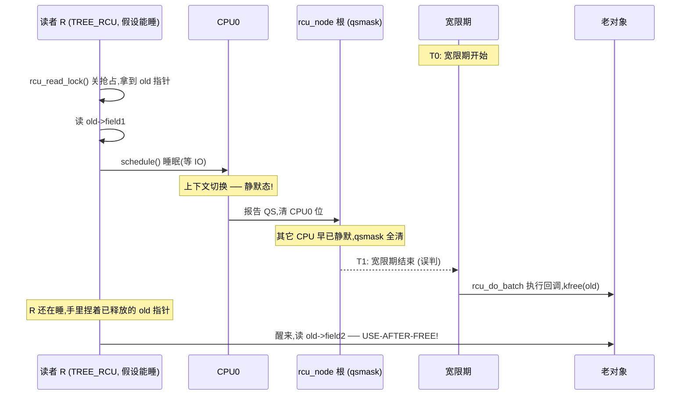
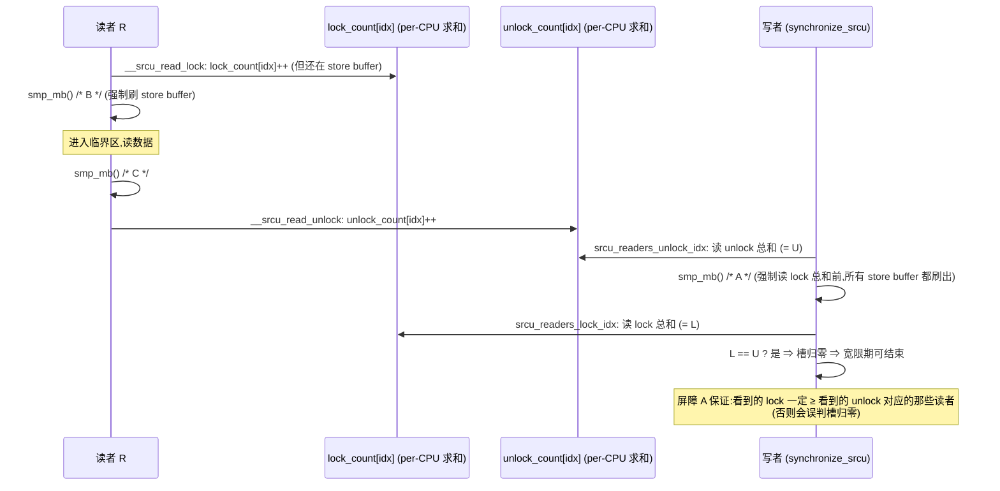
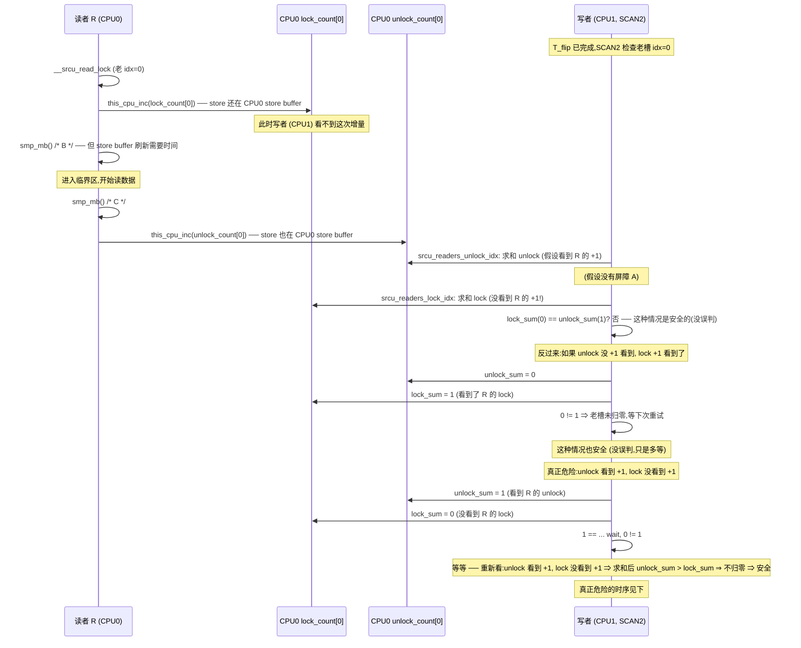
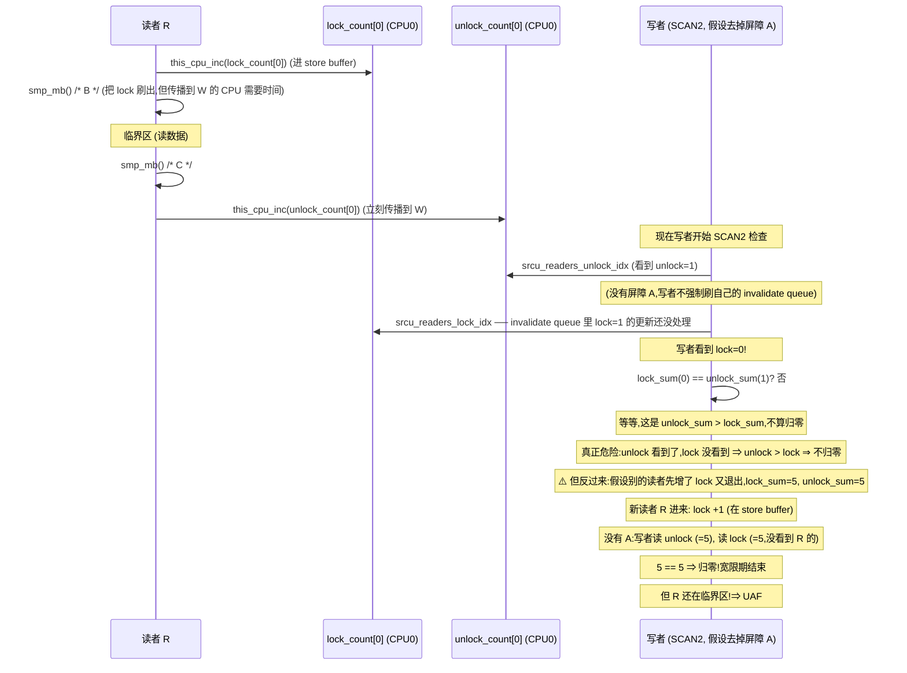

# 第十六篇 · 第 16 章 · srcu:可睡眠的 RCU 读者

> 篇:P5 RCU(读者零开销的终极解)
> 主线呼应:前 3 章(P5-13/14/15)我们把 tree RCU 的读者零开销、宽限期、`rcu_node` 层级报告全拆透了——但留下一个一直没兑现的承诺。P5-13 末尾讲"读者凭什么零开销"时说,非 PREEMPT_RCU 的读者**关了抢占,所以不能睡**;P5-14 讲宽限期判定时,整张反证法的根,就是"`rcu_read_lock` 关抢占,持锁读者让 CPU 不可能静默"。换句话说,**tree RCU 的整套 sound,是钉在"读者不睡"这条副作用上的**。可偏偏内核里有一批读者必须能睡:它进临界区后要拿一把 mutex、要等一个 IO、要 `kmalloc(GFP_KERNEL)` 触发回收——这些动作都会 `schedule()`。读者一睡,tree RCU 的静默态判定立刻被废掉(被调度走反而被算成静默),宽限期会误判结束,老对象提前回收 → use-after-free。这一章就讲 srcu(Sleepable RCU)怎么补上这块缺口:**读者进临界区不再关抢占,而是往一个 per-CPU 计数器里加 1,允许 `schedule`**;宽限期不再靠"CPU 静默态"判定,而是靠**两个计数槽(idx 0/1)的翻转 + 等老槽归零**。读完这一章,你就拿到了 RCU 在"读者可睡眠"场景下的完整 sound 证明,也看清 srcu 与 tree RCU 的根本分野:**tree RCU 数 CPU(静默态近似),srcu 数读者(计数器精确)**——前者快但读者不能睡,后者读者能睡但更重。
> 二分法归属:**自旋/无锁一极**(srcu 读者**不取锁**,只增 per-CPU 计数器,代价是允许睡眠换来精确计数;它仍是无锁一极的变体,不属于阻塞睡眠锁)。

## 核心问题

**tree RCU 读者为什么不能睡?如果读者睡了,静默态判定会怎样被废掉、为什么会 use-after-free?srcu 怎么换一套判定——读者不再关抢占而是往双计数槽(`srcu_lock_count[2]`/`srcu_unlock_count[2]`)里加 1,宽限期靠 `srcu_flip` 翻转 `srcu_idx` + 等老槽 lock/unlock 计数相等,这套为什么 sound?srcu 比 tree RCU 重在哪、代价是什么?NMI 上下文为什么还要 `_nmisafe` 变体?**

读完本章你会明白:

1. **tree RCU 读者不能睡的根**:非 PREEMPT_RCU 下 `__rcu_read_lock` = `preempt_disable`,睡眠需要 `schedule` 而关抢占正是禁止 `schedule`;即便用 PREEMPT_RCU(读者可被抢占),也还有"读者睡了被算静默、宽限期误判"的隐患。srcu 用**计数器代替关抢占**,从根上解掉这个约束。
2. **双计数槽怎么工作**:每个 CPU 一个 [`srcu_data`](../linux/include/linux/srcutree.h#L24),里面两个原子计数槽 [`srcu_lock_count[2]`](../linux/include/linux/srcutree.h#L26) 和 [`srcu_unlock_count[2]`](../linux/include/linux/srcutree.h#L27);任意时刻全局有个当前槽 [`srcu_idx`](../linux/include/linux/srcutree.h#L97)(0 或 1)。[`__srcu_read_lock`](../linux/kernel/rcu/srcutree.c#L712) 读 `srcu_idx` 决定进哪个槽,把那个槽的 lock 计数 +1,返回 idx;[`__srcu_read_unlock`](../linux/kernel/rcu/srcutree.c#L728) 拿这个 idx,把对应槽的 unlock 计数 +1。
3. **宽限期怎么判定**:[`srcu_flip`](../linux/kernel/rcu/srcutree.c#L1091) 翻转 `srcu_idx`(0↔1),**新读者从此进新槽**;等老槽的 lock 计数 == unlock 计数([`srcu_readers_active_idx_check`](../linux/kernel/rcu/srcutree.c#L462))= 老槽里所有读者都已退出 = 宽限期结束。不靠静默态近似,靠**精确计数**。
4. **为什么 sound**:翻转那一刻,任何"已经在临界区"的读者都还捏着**老 idx**(它进临界区时读到的 idx);之后进的新读者拿新 idx。等老槽计数归零,就**精确地**等到了所有老读者退出——不需要静默态近似,所以读者睡多久都没关系,计数器记得清清楚楚。
5. **srcu 的代价 + `_nmisafe`**:读者要 `this_cpu_inc`(比 tree RCU 的 `preempt_disable` 重一次原子写 + 两次 `smp_mb`),宽限期要扫描所有 CPU 的计数器;`_nmisafe` 变体用 RMW 原子(代替 `this_cpu_inc`),因为 NMI 可在任何指令打断,**不能用会被中断打断的 per-CPU 读写序列**。

---

> **逃生阀**:这一章会出现"`srcu_idx` 翻转"、"双计数槽"、"lock 计数 vs unlock 计数"、"SCAN1/SCAN2 状态"等概念。如果你已经读过 P5-13/14/15,只要记住一句话就够:**tree RCU 靠"CPU 经过静默态"近似判定读者退出(快但读者不能睡);srcu 靠"双计数槽 + 等老槽 lock/unlock 相等"精确判定读者退出(读者能睡但更重)**。本章就是在拆这个"精确"是怎么做到的、为什么 sound。读者侧抓住 [`__srcu_read_lock`](../linux/kernel/rcu/srcutree.c#L712) → 计数 +1 / [`__srcu_read_unlock`](../linux/kernel/rcu/srcutree.c#L728) → 计数 +1,宽限期抓住 [`srcu_flip`](../linux/kernel/rcu/srcutree.c#L1091) → 翻 idx + [`srcu_readers_active_idx_check`](../linux/kernel/rcu/srcutree.c#L462) → 等老槽相等,主干就立起来了。

## 16.1 一句话点破

> **srcu 用"双计数槽 + 翻转 idx"替代"关抢占 + 静默态检测"——读者进临界区不再关抢占,而是往当前 idx 对应的 per-CPU lock 计数器加 1;宽限期开始时翻转 idx,新读者进新槽,等老槽的 lock 计数 == unlock 计数,就是所有老读者都退出了。因为判定靠的是精确计数(不是"CPU 经过静默态"这种近似),读者睡多久都无所谓——计数器记得。代价是读者比 tree RCU 重(一次原子写 + 内存屏障),宽限期也要扫所有 CPU 的计数。**

这是结论,不是理由。本章倒过来拆:先看 tree RCU 读者睡了会撞什么墙(16.2),再讲双计数槽这个"换一套判定维度"的设计(16.3),然后逐段追源码:读者进出临界区(16.4)、宽限期主流程(16.5)、双槽何时翻转、归零何时检测(16.6),最后把 srcu 的代价、适用场景和 `_nmisafe` 变体讲清(16.7)。

---

## 16.2 tree RCU 读者为什么不能睡:静默态判定会被废掉

srcu 的一切设计,都是为了堵 tree RCU 的一个洞:**tree RCU 的宽限期判定,依赖读者不睡**。先把这个洞看清楚,才能理解 srcu 为什么必须换一套机制。

### 复习:tree RCU 靠"CPU 经过静默态"判定宽限期

P5-14 讲透了:tree RCU 的宽限期不是数读者,而是数 CPU。每个 CPU 经过一次"不在 RCU 临界区"的瞬间(上下文切换、idle、用户态返回)就清掉 `rcu_node->qsmask` 上对应位,根节点清完 = 宽限期结束。这套机制 sound 的根,P5-14 的反证法给过:**`rcu_read_lock` 关抢占 ⇒ 持锁读者所在的 CPU 在读者存活期间不可能静默**。反过来说,**只要 CPU 静默过了,这个 CPU 上宽限期开始时还活着的读者必然全部退出**。

这条反证法的前提是"`rcu_read_lock` 关抢占"。一旦读者睡了,这条前提崩了。

### 如果 tree RCU 读者能睡:静默态判定立刻被废

假设我们朴素地"放开"tree RCU 读者,允许它在临界区里 `schedule()`(就是 srcu 要做的事)。会发生什么?读者 `schedule()` 让出 CPU 的瞬间,**内核会做一次上下文切换**——而上下文切换正是 P5-14 列的静默态之一。于是:



这就是 tree RCU 读者不能睡的根本原因:**读者 `schedule` 自己制造了静默态**,而静默态正是宽限期判定"读者已退出"的依据。读者还活着,宽限期却认为它退出了——老对象被提前回收,use-after-free。

> **不这样会怎样**:P5-13 讲过,非 PREEMPT_RCU 的 [`__rcu_read_lock`](../linux/include/linux/rcupdate.h#L90) 是 `preempt_disable()`——它从机制上**禁止了 `schedule`**(关抢占期间调度器不会切走当前 task),所以 tree RCU 读者压根**睡不了**,上述时序物理上不可能发生。PREEMPT_RCU 走另一条路(用 `current->rcu_read_lock_nesting++` 不关抢占),允许读者被抢占,但代价是宽限期检测复杂得多(`rcu_node->blkd_tasks` 链表显式跟踪被抢占的读者),且**仍不允许读者主动 `schedule`**——被抢占是被动,主动睡眠是另一回事。两条路都绕开"读者主动睡"。

### 真实场景:有些读者必须能睡

可内核里偏偏有一批读者,进临界区后必须能睡。举例:

- **notifier chain**(通知链):内核子系统之间互相通知事件(如 CPU 热插拔、网络配置变更)。读者(被通知方)在回调里可能要 `kmalloc(GFP_KERNEL)`、可能要等一个 mutex——都会 `schedule`。
- **某些驱动**:设备表用 RCU 保护,但查表的路径上可能触发缺页处理、可能等 DMA 完成——都要睡。
- **debugfs/trace**:被观测的代码路径里,可能要拿一把可睡的锁。

这些场景用 tree RCU 不行(读者不能睡),用普通读写锁也不行(性能差),用 percpu-rwsem 也行(它能睡)但比 srcu 重。**srcu 就是给这种"读者既要零开销又要能睡"的场景设计的**。它的核心动作就一句:**用计数器代替关抢占**——读者进临界区不再 `preempt_disable`,而是往一个 per-CPU 计数器加 1,然后该睡就睡。

> **钉死这件事**:tree RCU 的 sound 钉在"`rcu_read_lock` 关抢占"上,关抢占让读者不能睡;读者一旦睡,自己制造静默态,宽限期误判,UAF。srcu 要做的事就是**换一套判定机制**——不再靠静默态近似,而是靠**精确计数**判定读者退出。下一节看双计数槽怎么实现这个"精确计数"。

---

## 16.3 双计数槽:用"翻转 idx + 等老槽归零"换掉"静默态"

这是 srcu 设计的灵魂。先讲清楚要解决什么问题,再看双计数槽怎么解。

### 朴素做法走不通:全局引用计数

最朴素的思路是给 srcu 装一个**全局原子引用计数**:读者 `atomic_inc(&srcu_readers)`,退出 `atomic_dec`,宽限期 `while (atomic_read(&srcu_readers) > 0)`。P5-14 的 14.2 节讲过为什么这套行不通——三堵墙:

1. **性能墙**:64 核读者抢同一个 cache line 做 `atomic_inc`,乒乓开销比 tree RCU 高几个数量级,违背"读者零开销"。
2. **饥饿墙**:如果老读者长期不退出(它睡了在等 IO),计数永远不归零,宽限期永远不结束,写者饿死。
3. **更深的正确性墙**:就算性能不是问题,**这个朴素方案根本没法判断"宽限期"**。注意宽限期要等的是"**宽限期开始那一刻**已经进入的读者",不是"现在还在的所有读者"。如果新读者源源不断进来,计数永远不归零,宽限期永远结束不了——它无法区分"老读者"和"新读者"。

第 3 堵墙才是最深的。tree RCU 用"CPU 经过静默态"巧妙绕过了这堵墙(它根本不数读者);srcu 要回到"数读者"的路上,就必须解决"区分新老读者"的问题。

### 双计数槽的灵感:用 idx 标记"新老"

srcu 的解法很妙:**给计数器配两个槽(idx 0 和 idx 1),任意时刻有个当前 idx,新读者都进当前槽;宽限期开始时翻转 idx,之后的新读者进新槽,这样老槽里只剩宽限期开始前进来的老读者**。等老槽的 lock 计数 == unlock 计数(进入 == 退出),就说明所有老读者都走了——这就是宽限期的精确判定。

```
 srcu 双计数槽的直觉 (CPU 视角,实际是 per-CPU):

  时间轴 ─────────────────────────────────────────────────────►
            T0 (GP 开始)              flip idx         T1 (老槽归零)
            │                         │                │
  idx = 0   │◀──── 老读者陆续进 ────▶│                │
  (老槽)    │  lock_count[0]++        │ 等老槽归零     │ lock_count[0]==unlock_count[0]
            │                         │                │ ⇒ 老读者全退 ⇒ 宽限期结束
            │                         │                │
  idx = 1                            ▶│◀── 新读者进 ──►
  (新槽)                              │ lock_count[1]++
                                      │ (不归零也无所谓,等下一个 GP)
```

这个设计把"区分新老读者"这件难事,转成了"**翻转 idx + 等老槽归零**"两件简单事。它有个隐含的约束:**翻转之后进的新读者不会污染老槽的计数**(因为它们读到的 idx 已经是新值,进的是新槽)。这一点靠 `srcu_flip` 的内存序保证,见 16.6 节。

### 为什么这套能"读者可睡"

注意双计数槽的判定方式——"lock 计数 == unlock 计数"——**完全不依赖读者是否在 CPU 上跑**。读者可以在临界区里睡一万年,只要它最终 `srcu_read_unlock`,unlock 计数就会 +1,老槽的 lock 计数和 unlock 计数最终相等。宽限期判定只看计数器,不看 CPU 状态,所以读者睡不睡都无所谓。

这就是 srcu 换掉"静默态近似"、改用"精确计数"的意义:**计数器是读者进出的精确账本,睡多久都记得清**。代价是读者进出各多一次原子写 + 两次 `smp_mb`,宽限期要扫所有 CPU 的计数器——比 tree RCU 重,但换来读者能睡。

> **钉死这件事**:srcu 的核心设计 = **双计数槽(idx 0/1)+ `srcu_flip` 翻转 + 等老槽 lock/unlock 计数相等**。它把"区分新老读者"这件难事转成了"翻转 idx + 等老槽归零"。判定靠精确计数,不看 CPU 状态,所以读者睡多久都行。下一节逐行拆读者侧源码。

---

## 16.4 读者侧:`__srcu_read_lock` / `__srcu_read_unlock`

先看读者进临界区做什么。公开 API 是 [`srcu_read_lock`](../linux/include/linux/srcu.h#L209)(内联包装),它调真正的实现 [`__srcu_read_lock`](../linux/kernel/rcu/srcutree.c#L712)([srcutree.c:712](../linux/kernel/rcu/srcutree.c#L712)):

```c
int __srcu_read_lock(struct srcu_struct *ssp)
{
    int idx;

    idx = READ_ONCE(ssp->srcu_idx) & 0x1;
    this_cpu_inc(ssp->sda->srcu_lock_count[idx].counter);
    smp_mb(); /* B */  /* Avoid leaking the critical section. */
    return idx;
}
```

三步:

1. **读当前 idx**:`READ_ONCE(ssp->srcu_idx) & 0x1`。`srcu_idx` 是个递增的 `unsigned int`,低 bit 就是当前槽(0 或 1);`& 0x1` 取低 bit。`READ_ONCE` 保证编译器不合并/省略这次读。
2. **当前槽 lock 计数 +1**:`this_cpu_inc(ssp->sda->srcu_lock_count[idx].counter)`。`ssp->sda` 是 per-CPU 数组(每个 CPU 一份 `srcu_data`),`this_cpu_inc` 在**本 CPU** 的那份上原子地加 1。
3. **内存屏障 B**:`smp_mb()`。注释 "Avoid leaking the critical section"——防止临界区里的读"漏"到 lock 计数 +1 **之前**(否则写者看到的 lock 计数还没 +1,以为没读者,提前结束宽限期,读者却已经在读数据)。返回 idx 给调用者,作为 `srcu_read_unlock` 的参数。

读者退出临界区,公开 API [`srcu_read_unlock`](../linux/include/linux/srcu.h#L282) 调 [`__srcu_read_unlock`](../linux/kernel/rcu/srcutree.c#L728)([srcutree.c:728](../linux/kernel/rcu/srcutree.c#L728)):

```c
void __srcu_read_unlock(struct srcu_struct *ssp, int idx)
{
    smp_mb(); /* C */  /* Avoid leaking the critical section. */
    this_cpu_inc(ssp->sda->srcu_unlock_count[idx].counter);
}
```

两步:

1. **内存屏障 C**:`smp_mb()`。防止临界区里的读"漏"到 unlock 计数 +1 **之后**(否则写者看到 unlock 已 +1,以为读者退出了,其实读者还在临界区尾巴上读数据)。
2. **对应槽 unlock 计数 +1**:`this_cpu_inc(ssp->sda->srcu_unlock_count[idx].counter)`。注意 idx 是 [`__srcu_read_lock`](../linux/kernel/rcu/srcutree.c#L712) 返回的那个——读者**自己记着**自己进的是哪个槽,退出时也加到那个槽的 unlock 上。这意味着 srcu 读者**必须在同一个 context 里 lock/unlock**(同 task,或同 task 的同上下文);跨 context(比如 lock 在进程上下文、unlock 在 irq)会让 idx 串错。`srcu_down_read`/`srcu_up_read` 是为这种"semaphore-like"用法设计的变体,本章不展开。

### 与 tree RCU 读者对比

```
 tree RCU 读者 (非 PREEMPT)              srcu 读者
 ┌──────────────────────────┐           ┌──────────────────────────────────────┐
 │ rcu_read_lock():         │           │ srcu_read_lock():                    │
 │   preempt_disable()      │           │   idx = READ_ONCE(srcu_idx) & 1      │
 │   (动本 CPU preempt_count)│          │   this_cpu_inc(lock_count[idx])      │
 │                          │           │   smp_mb() /* B */                   │
 │ ★ 关抢占 ⇒ 不能 schedule │           │ ★ 不关抢占 ⇒ 可以 schedule           │
 │                          │           │   (锁无关,只动了计数器)              │
 │ rcu_read_unlock():       │           │ srcu_read_unlock(idx):               │
 │   preempt_enable()       │           │   smp_mb() /* C */                   │
 │                          │           │   this_cpu_inc(unlock_count[idx])    │
 └──────────────────────────┘           └──────────────────────────────────────┘
   判定靠"CPU 静默态"近似                  判定靠"lock 计数 == unlock 计数"精确
   静默态 = 上下文切换/idle/用户态          计数器归零 = 读者退出 (读者睡多久都行)
```

这张对照表是本章的灵魂:**tree RCU 关抢占,srcu 不关抢占只增计数器**。这一字之差,改写了"读者能不能睡"这个根本约束。

### 反面对比:朴素 srcu 读者会撞什么墙

假设把 [`__srcu_read_lock`](../linux/kernel/rcu/srcutree.c#L712) 写成"**先增计数,再读 idx**"(顺序反了),会怎样?

```c
/* 错误写法 */
int __srcu_read_lock_bad(struct srcu_struct *ssp)
{
    int idx;
    /* 先随便挑一个 idx 增计数 */
    this_cpu_inc(ssp->sda->srcu_lock_count[READ_ONCE(ssp->srcu_idx) & 1].counter);
    /* 再读 idx 返回 */
    idx = READ_ONCE(ssp->srcu_idx) & 0x1;
    return idx;
}
```

这看起来"差不多",其实有个致命漏洞:**写者可能在两次读之间翻转 idx**。读者第一次读到 idx=0(还没增计数),写者翻转 idx=1,读者第二次读也读到 1,于是把 lock 加到槽 1(新槽)——但宽限期开始时它在槽 0 的视角里"不存在",宽限期会认为老槽 0 的所有读者都已退出,而它还在用老对象。UAF。

[`__srcu_read_lock`](../linux/kernel/rcu/srcutree.c#L712) 把 idx 读取和计数 +1 严格绑在一起(先读 idx、再给那个 idx 加),就是为了避免这种串台。屏障 B 进一步保证"读 idx + 增计数"整体在临界区之前完成,屏障 C 保证"减计数"在临界区之后才让写者看到。

> **为什么 sound(读者侧)**:[`__srcu_read_lock`](../linux/kernel/rcu/srcutree.c#L712) 的三步(读 idx → 给 idx 槽加 lock → 屏障 B)是原子的语义单元——**读者一旦进入,它进入的 idx 就定了,不会被 `srcu_flip` 串台**。屏障 B 保证"增 lock 计数"在临界区任何读之前对写者可见;屏障 C 保证"增 unlock 计数"在临界区任何读之后才对写者可见。写者看到 lock[idx] 加了 1,就一定知道"这个 idx 有个老读者";看到 lock[idx]==unlock[idx],就一定知道"这个 idx 的所有老读者都退出了"。读者睡多久都行,只要它最终 unlock,unlock 计数总会 +1,等式总会成立。

---

## 16.5 宽限期主流程:SCAN1 → flip → SCAN2

读者侧清楚了,看写者侧怎么推进宽限期。srcu 的宽限期状态机比 tree RCU 简单——只有 3 个状态([srcutree.h:128](../linux/include/linux/srcutree.h#L128)):

```c
/* Values for state variable (bottom bits of ->srcu_gp_seq). */
#define SRCU_STATE_IDLE   0
#define SRCU_STATE_SCAN1  1
#define SRCU_STATE_SCAN2  2
```

注意比 tree RCU 的 5+ 个状态(`RCU_GP_IDLE/WAIT_GPS/DONE_GPS/INIT/CLEANUP` 等)少得多——srcu 没有"每 CPU tick 检测静默态"那套机制(它根本不靠静默态),所以也没有"等 QS 报告"的状态。整个宽限期就是一个**主动扫描**的过程:状态机进 SCAN1 → 扫描新槽归零 → flip → 进 SCAN2 → 扫描老槽归零 → 结束。

### 主流程:srcu_advance_state

核心驱动是 [`srcu_advance_state`](../linux/kernel/rcu/srcutree.c#L1647)([srcutree.c:1647](../linux/kernel/rcu/srcutree.c#L1647)),它被 workqueue(`process_srcu`)调度执行。简化骨架:

```c
static void srcu_advance_state(struct srcu_struct *ssp)
{
    int idx;

    mutex_lock(&ssp->srcu_sup->srcu_gp_mutex);

    /* 状态 1: IDLE → SCAN1,启动宽限期 */
    idx = rcu_seq_state(smp_load_acquire(&ssp->srcu_sup->srcu_gp_seq));
    if (idx == SRCU_STATE_IDLE) {
        /* ... 检查是否真需要 GP,需要则 srcu_gp_start() ... */
        if (idx == SRCU_STATE_IDLE)
            srcu_gp_start(ssp);
        /* ... */
    }

    /* 状态 2: SCAN1,等新槽归零,然后 flip */
    if (rcu_seq_state(READ_ONCE(ssp->srcu_sup->srcu_gp_seq)) == SRCU_STATE_SCAN1) {
        idx = 1 ^ (ssp->srcu_idx & 1);    /* 新槽 = 当前 idx 的反 */
        if (!try_check_zero(ssp, idx, 1)) {
            mutex_unlock(&ssp->srcu_sup->srcu_gp_mutex);
            return; /* 新槽还有读者,稍后重试 */
        }
        srcu_flip(ssp);                    /* 翻转 idx,新读者进新槽 */
        rcu_seq_set_state(&ssp->srcu_sup->srcu_gp_seq, SRCU_STATE_SCAN2);
    }

    /* 状态 3: SCAN2,等老槽归零,结束 */
    if (rcu_seq_state(READ_ONCE(ssp->srcu_sup->srcu_gp_seq)) == SRCU_STATE_SCAN2) {
        idx = 1 ^ (ssp->srcu_idx & 1);    /* 老槽 = 翻转后的反 = 翻转前的原 idx */
        if (!try_check_zero(ssp, idx, 2)) {
            mutex_unlock(&ssp->srcu_sup->srcu_gp_mutex);
            return; /* 老槽还有读者,稍后重试 */
        }
        srcu_gp_end(ssp);                  /* 宽限期结束 */
    }
}
```

这里有个**反直觉但关键**的细节:**SCAN1 等的是"新槽"(翻转后的 idx)归零,SCAN2 等的是"老槽"(翻转前的 idx)归零**。换句话说,srcu 的宽限期是"**先翻 idx、再等两边都归零**"两阶段:

- **SCAN1 阶段**:此刻还没 flip,新读者在进 idx=N。先等"**即将成为新槽**"的那一边(1^N)归零——这一步是为了保证**翻转之前,上一轮 GP 留下的旧新槽是空的**(上一轮 GP 的 SCAN2 已经清空过它,但中间又过了一段时间,可能有残留)。这是一个对称性检查,确保 flip 干净。
- **flip**:`srcu_flip` 翻转 `srcu_idx`,新读者从此进新槽。
- **SCAN2 阶段**:等老槽(原 idx)归零——这就是**真正的宽限期判定**:老槽里只剩 flip 之前进来的老读者,等它们全部退出。

为什么 SCAN1 也要等?这是 srcu 设计的精细之处:**避免老 GP 的尾巴混进新 GP**。如果没有 SCAN1 的预检,直接 flip,可能出现"flip 之后老槽里同时有上一轮 GP 的残留读者和这一轮的老读者",计数语义就乱了。SCAN1 把上一轮清干净,flip 才干净。

### srcu_gp_start:启动一个新宽限期

[`srcu_gp_start`](../linux/kernel/rcu/srcutree.c#L773)([srcutree.c:773](../linux/kernel/rcu/srcutree.c#L773))很短:

```c
static void srcu_gp_start(struct srcu_struct *ssp)
{
    int state;

    lockdep_assert_held(&ACCESS_PRIVATE(ssp->srcu_sup, lock));
    WARN_ON_ONCE(ULONG_CMP_GE(ssp->srcu_sup->srcu_gp_seq, ssp->srcu_sup->srcu_gp_seq_needed));
    WRITE_ONCE(ssp->srcu_sup->srcu_gp_start, jiffies);
    WRITE_ONCE(ssp->srcu_sup->srcu_n_exp_nodelay, 0);
    smp_mb(); /* Order prior store to ->srcu_gp_seq_needed vs. GP start. */
    rcu_seq_start(&ssp->srcu_sup->srcu_gp_seq);
    state = rcu_seq_state(ssp->srcu_sup->srcu_gp_seq);
    WARN_ON_ONCE(state != SRCU_STATE_SCAN1);
}
```

记录 GP 开始时间戳、推 `srcu_gp_seq` 进入 SCAN1 状态。注意最后一行 `WARN_ON_ONCE(state != SRCU_STATE_SCAN1)`——`rcu_seq_start` 推进 seq 后状态必然是 SCAN1,这是 srcu 状态机的起点。

### try_check_zero + srcu_readers_active_idx_check:判定槽是否归零

宽限期的判定全靠 [`try_check_zero`](../linux/kernel/rcu/srcutree.c#L1071)([srcutree.c:1071](../linux/kernel/rcu/srcutree.c#L1071)):

```c
static bool try_check_zero(struct srcu_struct *ssp, int idx, int trycount)
{
    unsigned long curdelay;

    curdelay = !srcu_get_delay(ssp);

    for (;;) {
        if (srcu_readers_active_idx_check(ssp, idx))
            return true;
        if ((--trycount + curdelay) <= 0)
            return false;
        udelay(srcu_retry_check_delay);
    }
}
```

它反复调 [`srcu_readers_active_idx_check`](../linux/kernel/rcu/srcutree.c#L462)([srcutree.c:462](../linux/kernel/rcu/srcutree.c#L462))检查 idx 槽是否归零,`trycount` 限制了重试次数——如果老读者睡了太久(典型情况),这次 SCAN 重试不通过,函数返回 false,[`srcu_advance_state`](../linux/kernel/rcu/srcutree.c#L1647) 解锁返回,workqueue 一会儿再调度它重试。

`srcu_readers_active_idx_check` 是宽限期判定的**核心**:

```c
static bool srcu_readers_active_idx_check(struct srcu_struct *ssp, int idx)
{
    unsigned long unlocks;

    unlocks = srcu_readers_unlock_idx(ssp, idx);   /* sum 所有 CPU 的 unlock_count[idx] */
    smp_mb(); /* A */
    return srcu_readers_lock_idx(ssp, idx) == unlocks;   /* sum 所有 CPU 的 lock_count[idx] */
}
```

就两行(加一个屏障):

1. **先求和所有 CPU 的 unlock 计数**:[`srcu_readers_unlock_idx`](../linux/kernel/rcu/srcutree.c#L440) 遍历 `for_each_possible_cpu`,累加 `srcu_unlock_count[idx]`。
2. **屏障 A**:`smp_mb()`。这是 srcu 最精妙的屏障,下面单独拆。
3. **再求和所有 CPU 的 lock 计数**:[`srcu_readers_lock_idx`](../linux/kernel/rcu/srcutree.c#L423) 同样遍历累加 `srcu_lock_count[idx]`。
4. **比较**:lock 总和 == unlock 总和 ⇒ 这个 idx 槽归零 ⇒ 所有"进入过这个 idx 的老读者"都已退出 ⇒ 返回 true。

注意"求和"的语义:`lock_count[idx] - unlock_count[idx]` = 当前持有 srcu_read_lock(idx) 且尚未 srcu_read_unlock(idx) 的读者数。归零 == 没有这样的读者。

### 屏障 A 为什么必须:Store-Buffering 配对

屏障 A 是 srcu 正确性的命脉之一,源码注释([srcutree.c:470](../linux/kernel/rcu/srcutree.c#L470))说得很清楚:

> Make sure that a lock is always counted if the corresponding unlock is counted. Needs to be a smp_mb() as the read side may contain a read from a variable that is written to before the synchronize_srcu() in the write side. In this case smp_mb()s A and B act like the store buffering pattern.

意思是:**写者侧的"读 unlock → 屏障 A → 读 lock"序列,必须和读者侧的"增 lock → 屏障 B → 临界区读 → 屏障 C → 增 unlock"序列配对**,形成 store buffering 模式。少了屏障 A,可能出现"写者看到 unlock 已 +1,但 lock 还没 +1"的撕裂(读者屏障 B 之前的 lock 增还在 store buffer 里没刷出),写者误判槽归零,宽限期提前结束,UAF。这个问题在 16.8 技巧精解里用反例时序图单独拆透。



> **为什么 sound(宽限期判定)**:[`srcu_readers_active_idx_check`](../linux/kernel/rcu/srcutree.c#L462) 的"先读 unlock、屏障 A、再读 lock"是有讲究的顺序——配合读者侧的"增 lock、屏障 B、临界区、屏障 C、增 unlock",形成完整的 store buffering 配对。**写者看到的 lock 总和,一定不小于"它看到的 unlock 总和对应的那些读者"的 lock 增量**。如果它看到 L == U,意味着没有任何读者的 lock 增量漏看了,老槽真的空了。少了屏障 A,这条推理崩塌,会 UAF(见 16.8 反例)。

---

## 16.6 srcu_flip:翻转 idx 的两道屏障

[`srcu_flip`](../linux/kernel/rcu/srcutree.c#L1091)([srcutree.c:1091](../linux/kernel/rcu/srcutree.c#L1091))是 srcu 设计的另一个关键点,源码很短但屏障意味深长:

```c
static void srcu_flip(struct srcu_struct *ssp)
{
    smp_mb(); /* E */  /* Pairs with B and C. */

    WRITE_ONCE(ssp->srcu_idx, ssp->srcu_idx + 1); /* Flip the counter. */

    smp_mb(); /* D */  /* Pairs with C. */
}
```

核心动作就一句:`WRITE_ONCE(ssp->srcu_idx, ssp->srcu_idx + 1)`——把 `srcu_idx` 加 1,低 bit 翻转(0↔1)。**新读者读到新 idx,进新槽**。但前后各一个 `smp_mb` 不是多余的,源码注释([srcutree.c:1093-1120](../linux/kernel/rcu/srcutree.c#L1093))花了一大段解释为什么这两道屏障(以及对 forward progress 的贡献):

- **屏障 E(在 flip 之前)**:配对读者侧的 B 和 C。它保证**flip 之前写者已经观察到的所有读者的 lock 增量,在 flip 之后仍然有效**——换句话说,flip 不会"丢掉"任何在它之前进入的读者。
- **屏障 D(在 flip 之后)**:配对读者侧的 C。它保证**flip 之后,任何读者如果还看到老 idx 进老槽,它的下一次 `__srcu_read_lock` 一定看到新 idx**(否则老槽会被新读者持续污染,老槽永远归不了零,宽限期饿死——这是 forward progress 问题)。

源码注释里这段写得非常坦诚([srcutree.c:1116-1120](../linux/kernel/rcu/srcutree.c#L1116)):

> This means that the following smp_mb() is redundant, but it stays until either (1) Compilers learn about this sort of control dependency or (2) Some production workload running on a production system is unduly delayed by this slowpath smp_mb().

意思是:**理论上屏障 D 是冗余的**(因为前面 SCAN1 的 `srcu_readers_active_idx_check` 里的控制依赖已经提供了所需排序),但"编译器不懂控制依赖",所以保留屏障 D 直到编译器进化或实测证明它真的拖累了生产负载。这是内核源码里典型的"宁可保守也不踩坑"的工程态度——屏障便宜(几纳秒),数据竞争昂贵(UAF)。

### 翻转之后,为什么老槽不会被新读者污染

这是 srcu 设计 sound 的另一个关键点,值得单独说。`srcu_flip` 翻转 idx 之后,**新读者读到新 idx,进新槽**。会不会有读者"读到老 idx、却进新槽"或"读到新 idx、却进老槽"?

看 [`__srcu_read_lock`](../linux/kernel/rcu/srcutree.c#L712-720) 的顺序:

```c
idx = READ_ONCE(ssp->srcu_idx) & 0x1;       /* 先读 idx */
this_cpu_inc(ssp->sda->srcu_lock_count[idx].counter);  /* 再用这个 idx 增计数 */
smp_mb(); /* B */
```

`idx` 是个**局部变量**,读者一旦读到它,就用它索引计数器——**读者进入的槽,就是它读到 idx 的那一刻的当前槽**。flip 之后读到新 idx 的读者,进新槽;flip 之前读到老 idx 的读者(还来不及增计数的),进老槽。**没有"读到老 idx 但加了新槽"的串台**,因为 idx 和计数器的索引关系是同一个局部变量。

唯一的麻烦是:flip 之后,可能有读者"已经读到老 idx、但还没来得及给老槽加 lock 计数"。这种读者的 lock 计数会加到老槽,**让老槽看起来不归零**——这是 forward progress 问题。屏障 D 就是为了缓解它:**它保证读者的下一次 `__srcu_read_lock`(下一次进出临界区)会看到新 idx**,不会无限期地给老槽加计数。源码注释里那段"Nt + Nc"(任务数 + CPU 数)的分析([srcutree.c:485-535](../linux/kernel/rcu/srcutree.c#L485))就是在证明:**即使最坏情况下,老槽最多被多加 Nt+Nc 次计数,然后必然归零**——所以宽限期不会无限期拖延。

> **钉死这件事**:[`srcu_flip`](../linux/kernel/rcu/srcutree.c#L1091) 用前后两道屏障(配对读者侧的 B/C)保证:**翻转之后,新读者进新槽;最坏情况下老槽被多加有限次计数(Nt+Nc),然后必然归零**——这是 srcu 宽限期 forward progress 的保证。屏障 D 看似冗余但保留,是内核工程"保守优于踩坑"的体现。

---

## 16.7 srcu 的代价、适用场景、`_nmisafe` 变体

### srcu 比 tree RCU 重在哪

把 srcu 读者和 tree RCU 读者开销对照一下:

| 维度 | tree RCU 读者(非 PREEMPT) | srcu 读者 |
|------|---------------------------|-----------|
| 进临界区 | `preempt_disable()`(本地写,无屏障) | `READ_ONCE(idx)` + `this_cpu_inc`(per-CPU 原子写)+ `smp_mb()` |
| 出临界区 | `preempt_enable()`(本地写) | `smp_mb()` + `this_cpu_inc` |
| 内存屏障 | 0 次 | 2 次(B 进、C 出) |
| 能否睡眠 | **不能**(关抢占) | **能**(不关抢占) |
| 宽限期判定 | tick 检测静默态(被动,O(CPU) 位图) | 主动扫描计数器(O(CPU) 求和,且要扫两遍) |

srcu 的读者**每次进出临界区多 2 次 `smp_mb` 和 2 次原子写**——比 tree RCU 重得多。`smp_mb` 在 x86 上是 `mfence`(几十纳秒),在弱内存序架构(ARM/POWER)上更贵。所以 srcu 不是 tree RCU 的"升级版",而是"**为了读者能睡,付更高读者开销**"的另一种 trade-off。

宽限期方面,srcu 也要比 tree RCU 重:tree RCU 靠 tick 被动收集静默态报告(摊到每个 tick 几乎免费),srcu 要主动扫所有 CPU 的计数器(两次 SCAN 各扫一遍,每次都 `for_each_possible_cpu` 求和)。在 1000 核机器上,这个扫描不是免费的。

### srcu 的适用场景:读者要睡 + 读多写少

srcu 适合什么场景?**读者必须能睡,且读极多写极少**。典型用例:

- **`notifier_chain`**:通知链的读者(回调)可能要 `kmalloc(GFP_KERNEL)`、可能等 mutex,这些操作都会 `schedule`。Linux 的 [blocking notifier chain](https://www.kernel.org/doc/html/latest/core-api/notifier.rst) 用 srcu 保护链表遍历。
- **某些设备驱动的查表路径**:查表时可能触发缺页(内存分配)、等 DMA。
- **debugfs/trace 路径**:被观测代码里可能要拿可睡锁。
- **RCU Tasks Trace**(P5-17 会讲):用于 tracing,读者范围窄但可能睡。

不适合的场景:读者极高频但不需要睡(用 tree RCU,更便宜);读者要互斥写者(用 rwsem 或 percpu-rwsem)。**srcu 是"读者能睡"这个特定约束下的最优解**,不是通用替代。

### `_nmisafe` 变体:为什么 NMI 里需要另一套

最后看 [`__srcu_read_lock_nmisafe`](../linux/kernel/rcu/srcutree.c#L742)([srcutree.c:742](../linux/kernel/rcu/srcutree.c#L742))和 [`__srcu_read_unlock_nmisafe`](../linux/kernel/rcu/srcutree.c#L759)([srcutree.c:759](../linux/kernel/rcu/srcutree.c#L759))。它们存在的原因是:**NMI(不可屏蔽中断)可以在任何指令处打断 CPU**,包括 `this_cpu_inc` 的中间。

来看普通版 [`__srcu_read_lock`](../linux/kernel/rcu/srcutree.c#L712):

```c
idx = READ_ONCE(ssp->srcu_idx) & 0x1;
this_cpu_inc(ssp->sda->srcu_lock_count[idx].counter);   /* ← 这一句在 NMI 里不安全 */
```

`this_cpu_inc` 在 x86 上展开成 `inc %gs:offset` 一条指令(原子),看似没问题。但在某些架构上(如需要分段实现的 per-CPU),它展开成"读 per-CPU 偏移 → 加 → 写回"多条指令。如果 NMI 在中间打断,且 NMI handler 里也调了 `__srcu_read_lock`(同一个 srcu_struct),就会出现**两个执行流同时改同一个 per-CPU 计数器,丢更新**。

nmisafe 版本用 **RMW 原子操作**代替 `this_cpu_inc`:

```c
int __srcu_read_lock_nmisafe(struct srcu_struct *ssp)
{
    int idx;
    struct srcu_data *sdp = raw_cpu_ptr(ssp->sda);

    idx = READ_ONCE(ssp->srcu_idx) & 0x1;
    atomic_long_inc(&sdp->srcu_lock_count[idx]);     /* ← RMW 原子,任何点都能被打断 */
    smp_mb__after_atomic(); /* B */
    return idx;
}
```

关键差别:`atomic_long_inc(&sdp->srcu_lock_count[idx])` 是**真正的 RMW 原子指令**(x86 上是 `lock inc`),它在硬件级别不可被打断——NMI 在它之前或之后打断都安全,不会撕碎这次增量。代价是比 `this_cpu_inc` 稍贵(`lock` 前缀指令比非 `lock` 的 per-CPU 操作慢几纳秒),所以只在 NMI 上下文用。

注意 `raw_cpu_ptr`(不是 `this_cpu_ptr`)——它读 per-CPU 指针但不做迁移保护,因为 NMI 不会被打断迁移。屏障也从 `smp_mb()` 换成 `smp_mb__after_atomic()`(配对 RMW 原子的更便宜屏障)。

> **钉死这件事**:`_nmisafe` 变体的存在,是因为 NMI 能在任何指令打断,`this_cpu_inc` 在某些架构上是多指令序列会被撕碎。改用 RMW 原子(`atomic_long_inc` + `lock` 前缀)让单次增量硬件不可分,任何点被打断都安全。**普通上下文用 `__srcu_read_lock`(更便宜),NMI 里用 `__srcu_read_lock_nmisafe`(更安全)**——这是 srcu 对上下文敏感的精细设计。

---

## 16.8 技巧精解:双计数槽为什么 sound —— 反例时序

本章最硬核的两个问题,单独拆透:**为什么"等老槽 lock/unlock 相等"等价于"老读者全退了"**、**屏障 A/B/C 为什么必须、少了会怎样**。

### 技巧一:双计数槽的 sound 证明

设 `srcu_flip` 在时刻 `T_flip` 完成。我们要证明:`T_flip` 之前进入临界区的所有读者(老读者),到 SCAN2 检测出"老槽 lock==unlock"的时刻 `T_done`,都已退出。

**证明**:

(a) **`T_flip` 之前进入的读者,它的 idx 必然是老 idx**。因为 [`__srcu_read_lock`](../linux/kernel/rcu/srcutree.c#L712) 是"先读 idx、再用这个 idx 增计数",读者读到的 idx 是它进临界区那一刻的 `srcu_idx` 值——`T_flip` 之前 `srcu_idx` 还是老值。**屏障 E**(`srcu_flip` 之前)保证了写者已观察到的读者 lock 增量不会因 flip 丢失。

(b) **`T_flip` 之后进入的读者,它的 idx 必然是新 idx**。flip 用 `WRITE_ONCE` 改 `srcu_idx`,之后任何 `READ_ONCE(srcu_idx)` 都可能读到新值(取决于何时刷缓存)。**屏障 D**(`srcu_flip` 之后)+ 读者侧的 B/C 屏障,保证读者**下一次**进出临界区一定看到新 idx——这是 forward progress 的保证(否则老槽会被无限污染)。

(c) **SCAN2 检测"老槽 lock==unlock"** = "进入过老槽的读者数 == 退出过老槽的读者数"。每个老读者进入老槽 lock +1,退出老槽 unlock +1——所以"lock==unlock"当且仅当**每个进入老槽的读者都已经退出**。

(d) 由 (a)(c),`T_done` 时,所有 `T_flip` 之前进入的读者都已退出。**QED**。

注意这套证明**完全不依赖读者是否在 CPU 上跑**——读者睡了一万年,只要它最终 `srcu_read_unlock`,unlock 计数总会 +1,等式总会成立。这就是 srcu 换掉"静默态近似"的意义:**计数器是精确账本,睡多久都算得清**。

### 技巧二:屏障 A 为什么必须 —— 反例时序

现在反过来证明:如果去掉 [`srcu_readers_active_idx_check`](../linux/kernel/rcu/srcutree.c#L462) 里的**屏障 A**(只保留"读 unlock → 读 lock"两步),会在哪条执行序下出错。



让我重画这张图,把真正危险的时序说清。**危险的执行序**是:读者增 lock(进 store buffer)→ 写者读 lock(没看到)→ 读者增 unlock(刷出 store buffer,lock 和 unlock 一起对写者可见)→ 写者读 unlock(看到了)。这种情况下,写者看到 `lock_sum < unlock_sum`——不归零,安全。

反过来,**没有屏障 A 时,可能看到 unlock 但看不到 lock 吗**?看读者侧:屏障 B 保证"增 lock"在"临界区读"之前对其它 CPU 可见,屏障 C 保证"临界区读"在"增 unlock"之前完成。但**没有屏障 A,写者的"读 unlock"和"读 lock"之间没有排序**——CPU 可能重排这两次读(或缓存一致性导致 unlock 的可见性先于 lock 到达写者 CPU)。

真正危险的时序:



最后这段才是真正的危险:**老槽本来 lock_sum == unlock_sum == 5(5 个老读者都已退出)**,新读者 R(误进老槽,因为没屏障 D 强制看新 idx)给老槽 lock +1。写者**没有屏障 A,先读 unlock(=5)再读 lock,但 lock 的 +1 还在 R 的 store buffer 里没传播过来**,写者读到 lock=5——误判归零,宽限期结束,R 还在临界区,UAF。

屏障 A 强制写者在两次读之间做一次完整的 `mfence`(刷自己的 invalidate queue + 等 store buffer 传播),保证看到的 lock 和 unlock 是同一时刻的一致快照。**少了它,在 store buffering 时序下会 UAF**。

> **为什么 sound(屏障 A/B/C 的配对)**:读者侧 B(进)C(出)两道屏障 + 写者侧 A(判定时)一道屏障,组成 srcu 的 store buffering 模式。**A 配对 B**:写者的"读 unlock → 屏障 A → 读 lock",和读者的"增 lock → 屏障 B → 临界区",形成经典的 store buffering 解法;**A 配对 C**:写者的屏障 A 又保证读者的"临界区 → 屏障 C → 增 unlock"的 unlock 增量不会早于 lock 增量被写者看到。三道屏障缺一不可,少一道都会在某个并发执行序下误判宽限期,UAF。这是 srcu sound 的命脉。

---

## 章末小结

这一章把 srcu(可睡眠 RCU 读者)的设计拆透了,我们立起了:

1. **tree RCU 读者不能睡的根**:非 PREEMPT 下 `__rcu_read_lock` = `preempt_disable`,机制上禁止 `schedule`;且读者一旦睡,自己制造静默态,废掉宽限期判定,UAF。
2. **srcu 的核心设计**:双计数槽(idx 0/1)+ `srcu_flip` 翻转 + 等老槽 lock/unlock 计数相等。读者进临界区 [`__srcu_read_lock`](../linux/kernel/rcu/srcutree.c#L712) 读当前 idx、给那个槽 lock 计数 +1,退出 [`__srcu_read_unlock`](../linux/kernel/rcu/srcutree.c#L728) 给对应槽 unlock 计数 +1。判定靠精确计数,不看 CPU 状态,所以读者睡多久都行。
3. **宽限期主流程**:状态机 IDLE → SCAN1(等新槽归零 + `srcu_flip` 翻转 idx)→ SCAN2(等老槽归零)→ `srcu_gp_end`。判定核心 [`srcu_readers_active_idx_check`](../linux/kernel/rcu/srcutree.c#L462):求和所有 CPU 的 unlock → 屏障 A → 求和所有 CPU 的 lock,相等即槽归零。
4. **为什么 sound**:`srcu_flip` 之前进入的读者 idx 是老值,之后进入的是新值;SCAN2 检测老槽归零 = 所有老读者退出。屏障 A/B/C(D/E)的 store buffering 配对保证判定不撕裂。
5. **srcu 的代价 + `_nmisafe`**:读者进出各 2 次原子写 + 2 次 `smp_mb`(比 tree RCU 重);宽限期主动扫所有 CPU 计数器(比 tree RCU 被动 tick 检测重)。`_nmisafe` 用 RMW 原子代替 `this_cpu_inc`,因为 NMI 能撕碎 per-CPU 多指令序列。

回到二分法:**srcu 仍属于"自旋/无锁一极"**——读者**不取锁**(只增 per-CPU 计数器,不进 wait queue,不让出 CPU)。它和 tree RCU 的区别在于:**tree RCU 用关抢占换零开销(读者不能睡),srcu 用计数器换可睡眠(读者有少量开销)**。两者都是"用某种契约换不取锁"——tree RCU 的契约是"读者关抢占",srcu 的契约是"读者进出都记账"。代价也从"读者不能睡"换成"读者进出多两次原子写 + 屏障"。

### 五个"为什么"清单

1. **为什么 tree RCU 读者不能睡?** 非 PREEMPT_RCU 的 [`__rcu_read_lock`](../linux/include/linux/rcupdate.h#L90) 是 `preempt_disable()`,关抢占期间 `schedule` 不会切走当前 task——机制上禁止睡眠。更深层:tree RCU 靠"CPU 经过静默态"判定宽限期,而读者 `schedule` 自己就制造了静默态(上下文切换),会让宽限期误判结束 → 老对象提前回收 → UAF。
2. **srcu 怎么换一套判定?** 用双计数槽 + 翻转 idx。读者进临界区 [`__srcu_read_lock`](../linux/kernel/rcu/srcutree.c#L712) 读当前 idx、给那个槽 lock 计数 +1,退出 [`__srcu_read_unlock`](../linux/kernel/rcu/srcutree.c#L728) 给对应槽 unlock 计数 +1;宽限期开始 [`srcu_flip`](../linux/kernel/rcu/srcutree.c#L1091) 翻转 idx,新读者进新槽;等老槽 lock==unlock([`srcu_readers_active_idx_check`](../linux/kernel/rcu/srcutree.c#L462))= 老读者全退 = 宽限期结束。判定靠精确计数,不看 CPU,读者睡多久都行。
3. **为什么"老槽 lock==unlock"等价于"老读者全退"?** 每个老读者进老槽时 lock[idx] +1,退出时 unlock[idx] +1。`srcu_flip` 之前进入的读者 idx 必是老值(屏障 E 保证),之后进入的必是新值(屏障 D 保证 forward progress)。所以老槽 lock 计数精确对应"进入过老槽的读者数",unlock 计数精确对应"退出过老槽的读者数",二者相等 ⇔ 每个进入的都已退出。不依赖读者是否在 CPU 上跑。
4. **屏障 A/B/C 为什么必须?** 读者侧 B(进)C(出)+ 写者侧 A(判定时)组成 store buffering 模式。A 配对 B:防止写者"读到 unlock 但没读到 lock";A 配对 C:防止 unlock 增量早于 lock 增量被写者看到。少任何一道,在 store buffering 时序下会误判宽限期(老槽看起来归零了,其实还有读者),UAF。详见 16.8 反例时序。
5. **srcu 比 tree RCU 重在哪?适用什么场景?** 读者进出各多 2 次原子写 + 2 次 `smp_mb`(tree RCU 读者只 `preempt_disable`,零屏障);宽限期主动扫所有 CPU 计数器(tree RCU 被动 tick 检测)。适用于**读者必须能睡**(notifier chain、某些驱动查表路径、debugfs/trace)且读多写少的场景。`_nmisafe` 变体用 RMW 原子代替 `this_cpu_inc`,因为 NMI 能在任何指令打断,撕碎 per-CPU 多指令序列。

### 想继续深入往哪钻

- **本章源码**:读 [`kernel/rcu/srcutree.c`](../linux/kernel/rcu/srcutree.c) 的 `__srcu_read_lock`(L712)、`__srcu_read_unlock`(L728)、`__srcu_read_lock_nmisafe`(L742)、`__srcu_read_unlock_nmisafe`(L759)、`srcu_gp_start`(L773)、`srcu_readers_active_idx_check`(L462,屏障 A 在 L479)、`srcu_funnel_gp_start`(L989)、`try_check_zero`(L1071)、`srcu_flip`(L1091,屏障 E/D)、`srcu_advance_state`(L1647)、`srcu_gp_end`(L842)、`__synchronize_srcu`(L1377);[`include/linux/srcutree.h`](../linux/include/linux/srcutree.h) 的 `struct srcu_data`(L24)、`struct srcu_node`(L49)、`struct srcu_usage`(L63)、`struct srcu_struct`(L96)、状态常量(L128-130);[`include/linux/srcu.h`](../linux/include/linux/srcu.h) 的 `srcu_read_lock`(L209)、`srcu_read_unlock`(L282)、`srcu_down_read`(L268)、`srcu_up_read`(L323)。
- **内存序细节**:屏障 A/B/C/D/E 的完整配对关系,见 `Documentation/RCU/Design/Expedited-Grace-Periods/Expedited-Grace-Periods.rst` 和 `Documentation/RCU/Design/Requirements/Requirements.rst` 的 SRCU 章节;Paul McKenney 的 *Is Parallel Programming Hard* 一书的 SRCU 章节。
- **观测**:`/sys/kernel/debug/rcu/srcudata`(每个 CPU 的 srcu 计数器)、`rcutorture` 的 srcu 测试场景(`torture_type=srcu`);用 `trace-cmd` 抓 `rcu_srcu_grace_period` 等 trace 事件。
- **下一章 P5-17**:srcu 是普通 RCU 的变体(读者能睡)。还有更轻量的基于 RCU 的同步原语——`rcu_sync`(被 percpu-rwsem 用)和 Tasks Trace RCU。它们都用 RCU 机制构建更上层的同步原语,把"等宽限期"封装成简洁的 API。

### 引出下一章

这一章讲清了 srcu——RCU 在"读者可睡眠"场景下的变体。至此 RCU 重头戏的 4 章主线讲完了:tree RCU(读者零开销 + 静默态 + tree 层级)+ srcu(读者可睡 + 双计数槽)。但 RCU 不只是"读者无锁的数据结构保护",它还是**构建其它同步原语的基石**。下一章 P5-17 讲两个基于 RCU 的轻量同步原语:[`rcu_sync`](../linux/kernel/rcu/sync.c)(被 percpu-rwsem 用,做"写者通知读者切换开始/结束",只触发一次 `synchronize_rcu` 避免重复)和 Tasks Trace RCU(用于 tracing,读者范围更窄,宽限期更短)。读完 P5-17,你就看清了 RCU 不只是"原语",还是"原语的原语"——Linux 同步原语生态的最底层基石。
