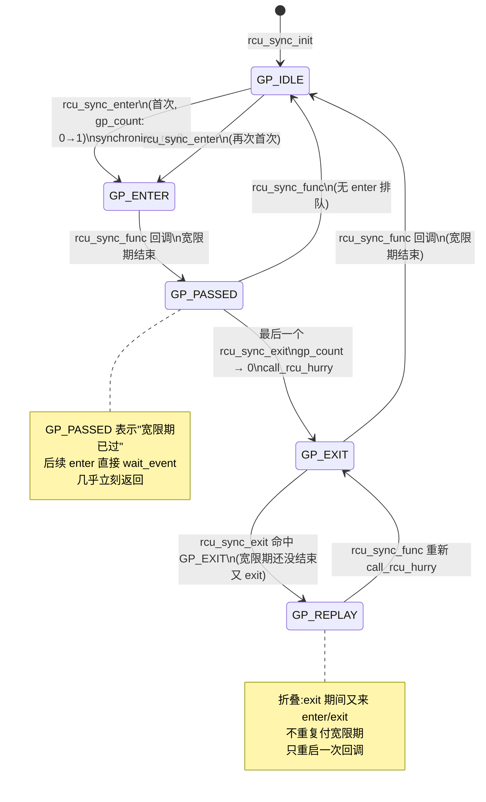
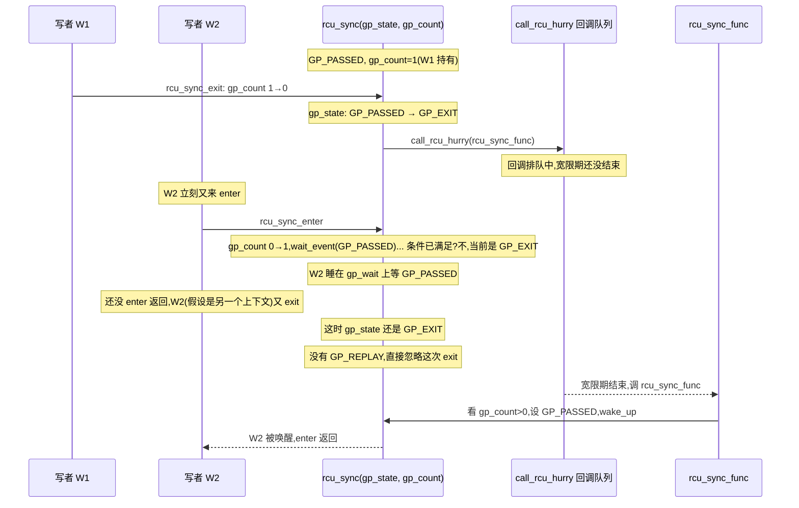
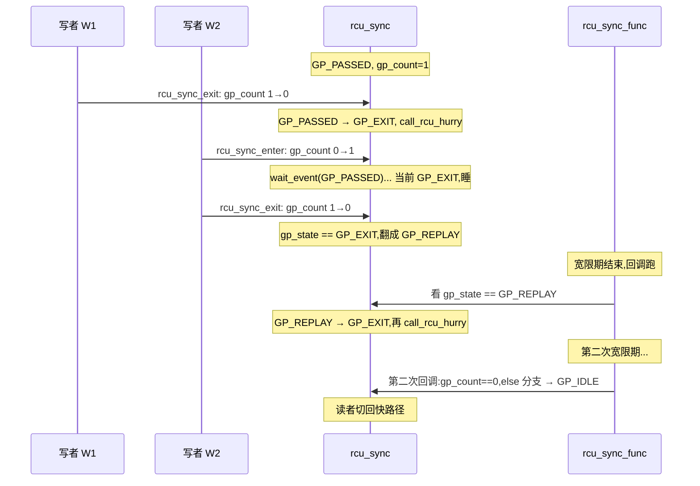

# 第十七篇 · RCU 同步原语家族:`rcu_sync` 与 Tasks Trace

> 篇:P5 RCU:读者零开销的终极解
> 主线呼应:前四章把 RCU 本体拆透了——P5-13 立起"读者零开销、写者延迟回收"的契约,P5-14 把宽限期拆成"每 CPU 一次静默态"的可观测过程,P5-15 用 `rcu_node` 树把"等所有 CPU 静默"磨到 SMP 可扩展,P5-16 让读者也能睡眠(srcu 双计数槽)。这一章是第 5 篇的**收尾章**,它回答一个自然的追问:**RCU 这么便宜,能不能拿它当地基,往上搭更省的同步原语?** 答案是能,而且内核里真的有两个招牌建筑。第一个是 [`rcu_sync`](../linux/kernel/rcu/sync.c)([sync.c](../linux/kernel/rcu/sync.c)):它专门服务于一类反复出现的模式——"读者走快路径,写者要把读者切到慢路径、改完再切回去",朴素做法是每次切换都 `synchronize_rcu` 一遍,写者连发就反复付宽限期;`rcu_sync` 用一个**只认状态翻转的小状态机**把这件事压成"每次切换只付一次宽限期"。它就藏在 P4-12 提过的 `percpu_rw_semaphore` 体内(`struct percpu_rw_semaphore` 第一个字段就是 `struct rcu_sync rss`)。第二个是 **Tasks Trace RCU**([kernel/rcu/tasks.h](../linux/kernel/rcu/tasks.h)):专门给 ftrace/bpf 用的 RCU 变体,它的读者标记(`rcu_read_lock_trace`)只动一个 per-task 计数器,宽限期只等"正在跑的 task",不等"所有 CPU 静默"——更窄、更快。读完这一章,RCU 家族的全貌就拼齐了:**RCU 不只是"读者零开销"这一个原语,它还是一个被反复复用的地基**。
> 二分法归属:**自旋/无锁一极**(基于 RCU 的轻量原语,读者侧不取锁)。

## 核心问题

**RCU 这么便宜,能不能拿它当零件,搭出更省的同步原语?朴素的"每次写都 `synchronize_rcu`"贵在哪里,`rcu_sync` 的状态机凭什么把连续切换折叠成"只付一次宽限期"?Tasks Trace RCU 又凭什么比普通 RCU 更快——它把宽限期的"等"换成了什么更小的集合?**

读完本章你会明白:

1. **`rcu_sync` 解决什么**:反复出现的"读者快路径 ↔ 写者慢路径"切换,朴素做法每次都 `synchronize_rcu`,写者连发要反复等宽限期;`rcu_sync` 用一个 5 态状态机(`GP_IDLE`/`GP_ENTER`/`GP_PASSED`/`GP_EXIT`/`GP_REPLAY`)加一个计数 `gp_count`,只在**状态翻转**时付一次宽限期,连续 `enter` 只记 count、不重复付。
2. **`rcu_sync` 为什么能被 `percpu_rw_semaphore` 复用**:它把"切换状态"和"具体等什么"解耦——`rcu_sync` 只关心"读者该不该走慢路径",读者侧 `rcu_sync_is_idle` 是个一次 `READ_ONCE` 的判断,写者侧 `rcu_sync_enter`/`exit` 负责把切换的代价折叠掉。
3. **Tasks Trace RCU 凭什么更窄更快**:普通 RCU 宽限期要等"所有 CPU 静默"(idle/用户态/上下文切换),Tasks Trace 宽限期只等"宽限期开始那一刻在跑的 task"——它的 holdout list 是 task 集合而不是 CPU 集合,跑完的 task 自动退出列表,不需要等整台机器静默;读者侧 `rcu_read_lock_trace` 只动 `current->trc_reader_nesting` 一个计数,可睡眠、可在 idle/nohz_full 用。
4. **为什么 sound**:状态机的每一步都对应一次"已经付过宽限期 ⇒ 旧读者已退出"的事实——`GP_PASSED` 这个状态名字本身就是"宽限期已过"的物证;`GP_REPLAY` 解决"宽限期还没结束就又来新切换"的折叠,而不是省掉宽限期。Tasks Trace 的 holdout 集合 + `need_qs` 标志保证"宽限期开始时在跑的读者要么已退出,要么被 IPI 标记后退出"。
5. **基于 RCU 搭高层原语的思想**:RCU 不只是 `rcu_read_lock`/`synchronize_rcu` 这一对手柄,它还是 `percpu_rw_semaphore`(P4-12)、`rcu_sync`、Tasks Trace、甚至 SLUB 延迟释放(P6-18 会讲)的共同地基。理解了这一章,你就拿到了"用 RCU 当零件"的方法论。

---

> **逃生阀**:这一章会出现一个 5 态状态机(`GP_IDLE`/`GP_ENTER`/`GP_PASSED`/`GP_EXIT`/`GP_REPLAY`)和 `gp_count` 计数,以及 Tasks Trace 的 `trc_reader_nesting`、`holdout list`、`need_qs` 等术语。如果你没读过 P5-13~16,只要记住一件事:**RCU 读者不取锁,写者要等"宽限期"才能回收/确认;本章讲的是怎么把"反复等宽限期"折叠成"只等必要的几次"。** 抓住"`rcu_sync` = 给 percpu-rwsem 用的状态机小助手"和"Tasks Trace = 给 ftrace/bpf 用的更窄 RCU"两条主线,细节再慢慢看。

## 17.1 一句话点破

> **`rcu_sync` 的全部智慧,是把"状态"和"是否已为这个状态付过宽限期"绑在一起:只要状态没变,宽限期就付过一次就够。连续的 `rcu_sync_enter` 只是把 `gp_count++`,宽限期是第一次 enter 触发的、后来的 enter 直接 `wait_event` 那个还没结束的宽限期;连续的 `rcu_sync_exit` 同理,只有最后一个 exit(计数归零)才真正启动一次宽限期把读者切回快路径。Tasks Trace RCU 走得更远:它把"宽限期等谁"从"所有 CPU 静默"换成"开始时在跑的 task 集合",这个集合通常很小,所以更快。**

这是结论,不是理由。本章倒过来拆:先看 P4-12 留的钩子——`percpu_rw_semaphore` 为什么需要 `rcu_sync`(17.2),再拆 `rcu_sync` 的 5 态状态机为什么能把连续切换折叠成"只付一次宽限期"(17.3),然后看 `percpu-rwsem` 怎么复用它(17.4),最后看 Tasks Trace RCU 是怎么把"宽限期"换得更小的(17.5~17.6)。

---

## 17.2 从 P4-12 的钩子开始:`percpu_rw_semaphore` 缺什么

P4-12(percpu-rwsem)讲过 [`struct percpu_rw_semaphore`](../linux/include/linux/percpu-rwsem.h#L12-21)([percpu-rwsem.h:12](../linux/include/linux/percpu-rwsem.h#L12))。这个读写信号量的卖点:读者快路径**零争用**,每核只动自己 CPU 上的 `read_count`(`this_cpu_inc(*sem->read_count)`),不抢任何全局 cache line;代价是写者很重——`percpu_down_write` 要做两件事:

1. **通知读者走慢路径**(去抢 `sem->block` 这把全局锁)。
2. **等已经在快路径里进去的读者全部退出**(它们的 `read_count` 加了 1,但还没看到 `block=1`),这一步必须等宽限期。

第 2 步是 P4-12 没正面拆的——为什么"等已经在快路径里进去的读者退出"等价于"等一个 RCU 宽限期"?直觉是这样的:

```mermaid
sequenceDiagram
    participant R as 读者 R
    participant S as sem->rss(rcu_sync)
    participant W as 写者 W
    participant GP as 宽限期
    R->>R: preempt_disable(); rcu_read_lock(隐含)
    R->>R: this_cpu_inc(read_count) ── 进快路径
    Note over R: 这段在 RCU-sched 读者临界区里
    W->>W: 想 down_write:必须确保此后新读者看到 block=1
    W->>S: rcu_sync_enter() 通知读者走慢路径
    Note over W: 还得等"enter 之前已进快路径的读者"退出
    S->>GP: synchronize_rcu() ── 等 enter 之前在跑的读者退出
    GP->>S: 宽限期结束 = 旧读者全退
    W->>W: 现在可以 set block=1,新读者必走慢路径
    R->>R: preempt_enable(); rcu_read_unlock
    Note over R: 旧读者退完
```

[`percpu_down_read`](../linux/include/linux/percpu-rwsem.h#L47-71)([percpu-rwsem.h:47](../linux/include/linux/percpu-rwsem.h#L47))里那段注释把这点讲得很清楚:读者进快路径前先 `preempt_disable()`(等于隐含 `rcu_read_lock`),再 `this_cpu_inc(*sem->read_count)`;写者 `rcu_sync_enter` 之后,等宽限期结束,就能保证"所有 enter 之前已 `this_cpu_inc` 的读者,要么已经退出了(对应 `preempt_enable`),要么即将退出"——因为关抢占的读者让 CPU 不可能在他们持锁期间经过静默态(回扣 P5-14)。

> **钉死这件事**:`percpu_rw_semaphore` 的写者侧,需要"等一个 RCU 宽限期"这个动作。问题是:写者可能反复来——比如短时间多次 `percpu_down_write`/`up_write`,或者多个写者排队。**如果每次 down_write 都自己调 `synchronize_rcu`,就反复付宽限期开销**(几毫秒到几十毫秒一次,在写频繁的场景下非常显眼)。这正是 `rcu_sync` 登场的地方。

### 朴素做法:每次 `down_write` 都 `synchronize_rcu`,贵在哪

假设我们不用 `rcu_sync`,直接在 `percpu_down_write` 里写:

```c
/* 朴素做法(简化示意,非源码原文) */
void my_down_write(struct percpu_rw_semaphore *sem) {
    synchronize_rcu();       /* 等旧读者退出 */
    set_block(sem, 1);
    /* ... 写临界区 ... */
}
void my_up_write(struct percpu_rw_semaphore *sem) {
    set_block(sem, 0);
    synchronize_rcu();       /* 等待:让刚刚看到 block=0 的读者确定性地进入快路径 */
}
```

这套朴素做法在一个场景下特别亏:**短时间内的连续写者**。比如 W1 拿锁、放锁,W2 立刻拿锁——两次 `synchronize_rcu` 是背靠背的,每次都要等几毫秒。问题是:W1 已经把读者切到慢路径过了,W2 来的时候读者**还在慢路径**(因为 W1 释放到 W2 拿锁之间可能根本没宽限期发生过,读者根本没机会切回快路径)。W2 完全不需要再付一次"切换"的代价,但朴素做法每次都付。

更糟的是 up 那侧:W1 释放锁后,理论上要让读者回到快路径,这需要等一个宽限期("确保此后新读者看到 block=0 这件事被所有 CPU 接受")。但如果 W2 立刻就来拿锁,**这个"切回快路径"的宽限期根本就是浪费**——读者还没回到快路径就被 W2 又切到慢路径了。

> **不这样会怎样**:朴素 `synchronize_rcu` 每次都付,在写者密集时变成"一次写操作 = 一次毫秒级等待",写吞吐被宽限期开销封顶。`rcu_sync` 的全部价值就是:**把这种"每次都付"折叠成"状态翻转时才付"**。

---

## 17.3 `rcu_sync` 的状态机:只在翻转时付一次宽限期

### 结构:四个字段,三个动作

[`struct rcu_sync`](../linux/include/linux/rcu_sync.h#L17-23)([rcu_sync.h:17](../linux/include/linux/rcu_sync.h#L17))小得吓人:

```c
/* Structure to mediate between updaters and fastpath-using readers.  */
struct rcu_sync {
    int             gp_state;       /* 状态机的当前状态 */
    int             gp_count;       /* 当前有多少个 enter 还没对应的 exit */
    wait_queue_head_t gp_wait;      /* 等"宽限期已过"的写者睡在这 */
    struct rcu_head  cb_head;        /* call_rcu 用的回调头 */
};
```

四个字段就支撑起整个状态机。公开接口只有四个函数(见 [rcu_sync.h:39-42](../linux/include/linux/rcu_sync.h#L39)):

| 函数 | 调用者 | 作用 |
|---|---|---|
| [`rcu_sync_init`](../linux/kernel/rcu/sync.c#L21-25) | 初始化时 | 把 `gp_state`/`gp_count` 清零,初始化等待队列 |
| [`rcu_sync_enter`](../linux/kernel/rcu/sync.c#L105-140) | 写者进慢路径 | 通知读者走慢路径,可能要付一次宽限期 |
| [`rcu_sync_exit`](../linux/kernel/rcu/sync.c#L152-167) | 写者回快路径 | 计数归零时,启动一次宽限期把读者切回快路径 |
| [`rcu_sync_dtor`](../linux/kernel/rcu/sync.c#L173-190) | 销毁时 | `rcu_barrier` 确保在飞的回调全跑完 |

读者侧的唯一接触点是 [`rcu_sync_is_idle`](../linux/include/linux/rcu_sync.h#L32-37)([rcu_sync.h:32](../linux/include/linux/rcu_sync.h#L32)):

```c
static inline bool rcu_sync_is_idle(struct rcu_sync *rsp)
{
    RCU_LOCKDEP_WARN(!rcu_read_lock_any_held(),
             "suspicious rcu_sync_is_idle() usage");
    return !READ_ONCE(rsp->gp_state); /* GP_IDLE */
}
```

一次 `READ_ONCE`,在 RCU 读临界区里——读者几乎不付任何代价。`percpu_down_read` 就用它当快路径的闸门。

### 状态机:5 个状态,2 条主线

[`sync.c`](../linux/kernel/rcu/sync.c#L13) 的开头定义了状态:

```c
enum { GP_IDLE = 0, GP_ENTER, GP_PASSED, GP_EXIT, GP_REPLAY };
```

注意:**老资料里你看到的可能是 3 态或 4 态**(`GP_IDLE`/`GP_ENTER`/`GP_EXIT`,或者外加一个 `GP_PENDING`),6.9 实际是**这 5 态**。`GP_REPLAY` 是为"宽限期还在跑、新切换又来了"这种折叠场景加的——下面会专门讲。把它们画出来:



把状态机读懂,关键在三件事:

1. **`GP_IDLE` 是稳态**:读者走快路径(`rcu_sync_is_idle` 返回 true)。
2. **`GP_PASSED` 表示"宽限期已过,读者确凿在慢路径"**:从 `GP_IDLE` 第一次进 `GP_ENTER` 要付一次宽限期,过了就停在 `GP_PASSED`;此后再来 `rcu_sync_enter`,**`wait_event` 一个已经满足的条件,几乎立刻返回**,不重新付宽限期。
3. **`GP_EXIT`/`GP_REPLAY` 处理折叠**:`rcu_sync_exit` 把 `gp_count` 减 1,只有减到 0 才启动一次宽限期把读者切回 `GP_IDLE`;如果宽限期还没结束就又来 enter/exit,用 `GP_REPLAY` 表示"那次 exit 需要重播",但不重新付。

### `rcu_sync_enter`:第一次付,后续只是计数

[`rcu_sync_enter`](../linux/kernel/rcu/sync.c#L105-140)([sync.c:105](../linux/kernel/rcu/sync.c#L105)):

```c
void rcu_sync_enter(struct rcu_sync *rsp)
{
    int gp_state;

    spin_lock_irq(&rsp->rss_lock);
    gp_state = rsp->gp_state;
    if (gp_state == GP_IDLE) {
        WRITE_ONCE(rsp->gp_state, GP_ENTER);
        WARN_ON_ONCE(rsp->gp_count);
    }
    rsp->gp_count++;                    /* ← 永远加 1 */
    spin_unlock_irq(&rsp->rss_lock);

    if (gp_state == GP_IDLE) {
        /* 第一次 enter:同步付一次宽限期 */
        synchronize_rcu();
        rcu_sync_func(&rsp->cb_head);
        return;
    }

    wait_event(rsp->gp_wait, READ_ONCE(rsp->gp_state) >= GP_PASSED);
}
```

两条路径:

- **`gp_state == GP_IDLE`**:这是"快路径状态下的首次 enter"。状态翻成 `GP_ENTER`,然后**在锁外**调 `synchronize_rcu()`(同步阻塞等宽限期),再调 [`rcu_sync_func`](../linux/kernel/rcu/sync.c#L57-88) 把状态推进到 `GP_PASSED`。这一次 enter 是真正付宽限期的——因为读者原本在快路径,必须确保"此前的所有快路径读者"都退出。
- **`gp_state` 已经是 `GP_ENTER`/`GP_PASSED`/`GP_EXIT`/`GP_REPLAY` 之一**:`gp_count++` 之后,直接 `wait_event` 等 `gp_state >= GP_PASSED`。这一句是关键:**如果状态已经是 `GP_PASSED`,条件立刻满足,直接返回**——连一次宽限期都不付。如果状态还在 `GP_ENTER`(第一次 enter 的宽限期还没跑完),就在 `gp_wait` 上睡,等那个还没跑完的宽限期结束(`rcu_sync_func` 会 `wake_up_locked`)。

> **钉死这件事**:连续的 `rcu_sync_enter`,只有第一次付宽限期。后续的 enter 只是 `gp_count++` 加一个 `wait_event`(条件已满足时立刻返回)。这就是"状态机记录已付"的全部魔法——状态本身就是"宽限期付过了吗"这个事实的物证。

源码里 [`rcu_sync_enter` 的注释](../linux/kernel/rcu/sync.c#L100-103)([sync.c:100](../linux/kernel/rcu/sync.c#L100))直接把这件事说穿了:"closely spaced calls to `rcu_sync_enter()` can optimize away the grace-period wait via a state machine"。

### `rcu_sync_func`:状态机的发动机

[`rcu_sync_func`](../linux/kernel/rcu/sync.c#L57-88)([sync.c:57](../linux/kernel/rcu/sync.c#L57))是宽限期结束后的回调(`rcu_sync_call` 通过 [`call_rcu_hurry`](../linux/kernel/rcu/tree.c#L2783) 注册,见 [sync.c:29-32](../linux/kernel/rcu/sync.c#L29))。它负责把状态机推进到下一态:

```c
static void rcu_sync_func(struct rcu_head *rhp)
{
    struct rcu_sync *rsp = container_of(rhp, struct rcu_sync, cb_head);
    unsigned long flags;

    WARN_ON_ONCE(READ_ONCE(rsp->gp_state) == GP_IDLE);
    WARN_ON_ONCE(READ_ONCE(rsp->gp_state) == GP_PASSED);

    spin_lock_irqsave(&rsp->rss_lock, flags);
    if (rsp->gp_count) {
        /* 至少还有一个 enter 没匹配 exit:把状态定到 GP_PASSED,唤醒等待者 */
        WRITE_ONCE(rsp->gp_state, GP_PASSED);
        wake_up_locked(&rsp->gp_wait);
    } else if (rsp->gp_state == GP_REPLAY) {
        /* 又有新 exit 来了:重启一次宽限期 */
        WRITE_ONCE(rsp->gp_state, GP_EXIT);
        rcu_sync_call(rsp);
    } else {
        /* 宽限期跑完,没有 enter 排队,切回 idle */
        WRITE_ONCE(rsp->gp_state, GP_IDLE);
    }
    spin_unlock_irqrestore(&rsp->rss_lock, flags);
}
```

三条分支:

- **`gp_count > 0`**:状态从 `GP_ENTER` 推到 `GP_PASSED`,唤醒所有等在 `gp_wait` 上的后续 enter(它们 `wait_event` 的条件现在满足了)。**这是"宽限期付过"这个事实被广播出去的时刻**。
- **`gp_state == GP_REPLAY`**:宽限期跑完,但中途又来了 exit(看下面),需要重启一次宽限期——重置成 `GP_EXIT` 再 `call_rcu_hurry`。
- **else**:没有 enter 排队,直接回 `GP_IDLE`,读者又能走快路径了。

> **为什么 sound(状态机分支)**:每个 `WRITE_ONCE(gp_state, ...)` 都发生在**宽限期结束之后**(因为 `rcu_sync_func` 本身是 `call_rcu_hurry` 注册的回调)。所以 `GP_PASSED` 这个状态值就**物证般地**意味着"宽限期已过,所有 enter 之前在跑的读者都退出了"。后续的 `enter` 看到这个值,不需要再付——因为它要等的"enter 之前在跑的读者"是 enter 自己,而 enter 之前的所有更早的读者,已经在第一次 enter 付的那次宽限期里退出了。**这个推理是状态机之所以 sound 的根**。

### `rcu_sync_exit`:只有最后一个才启动宽限期

[`rcu_sync_exit`](../linux/kernel/rcu/sync.c#L152-167)([sync.c:152](../linux/kernel/rcu/sync.c#L152)):

```c
void rcu_sync_exit(struct rcu_sync *rsp)
{
    WARN_ON_ONCE(READ_ONCE(rsp->gp_state) == GP_IDLE);
    WARN_ON_ONCE(READ_ONCE(rsp->gp_count) == 0);

    spin_lock_irq(&rsp->rss_lock);
    if (!--rsp->gp_count) {                 /* ← 只有计数归零才进 */
        if (rsp->gp_state == GP_PASSED) {
            WRITE_ONCE(rsp->gp_state, GP_EXIT);
            rcu_sync_call(rsp);              /* call_rcu_hurry */
        } else if (rsp->gp_state == GP_EXIT) {
            /* 之前那个 EXIT 的宽限期还没结束,这次 exit 折叠进去 */
            WRITE_ONCE(rsp->gp_state, GP_REPLAY);
        }
    }
    spin_unlock_irq(&rsp->rss_lock);
}
```

两个关键点:

1. **`gp_count` 是计数**:每个 `enter` 加 1,每个 `exit` 减 1,只有减到 0 才考虑启动宽限期。**连续的 enter/exit 对(嵌套写者)折叠成"最后一个 exit 才付"**——这是状态机省开销的第二处。
2. **`GP_REPLAY` 折叠**:如果 `GP_EXIT` 状态下宽限期还没结束(`rcu_sync_func` 还没被调),又来一个 exit,状态翻成 `GP_REPLAY`。等 `rcu_sync_func` 跑时(看上面那条 `else if (gp_state == GP_REPLAY)` 分支),它会**重启**一次宽限期——但只重启一次,不是每次 exit 重启一次。

> **不这样会怎样**:如果 `rcu_sync_exit` 每次都 `call_rcu_hurry`,连续的 enter/exit 对就会触发连续的宽限期——典型场景:`percpu_down_write`/`up_write` 反复来,每次都付一个宽限期,完全失去了 `rcu_sync` 的意义。**`gp_count` 把"什么时候该付"和"什么时候不该付"分得清清楚楚**:有人在用慢路径(gp_count > 0)就不切回快路径;只有没人用了,才一次性切回。

### `rcu_sync_dtor`:销毁前的 `rcu_barrier`

[`rcu_sync_dtor`](../linux/kernel/rcu/sync.c#L173-190)([sync.c:173](../linux/kernel/rcu/sync.c#L173))很短但有个细节:

```c
void rcu_sync_dtor(struct rcu_sync *rsp)
{
    int gp_state;

    WARN_ON_ONCE(READ_ONCE(rsp->gp_count));
    WARN_ON_ONCE(READ_ONCE(rsp->gp_state) == GP_PASSED);

    spin_lock_irq(&rsp->rss_lock);
    if (rsp->gp_state == GP_REPLAY)
        WRITE_ONCE(rsp->gp_state, GP_EXIT);
    gp_state = rsp->gp_state;
    spin_unlock_irq(&rsp->rss_lock);

    if (gp_state != GP_IDLE) {
        rcu_barrier();                       /* ← 等所有在飞的 call_rcu 回调 */
        WARN_ON_ONCE(rsp->gp_state != GP_IDLE);
    }
}
```

如果销毁时状态还不是 `GP_IDLE`(说明还有 `GP_EXIT` 的回调在飞),就调 [`rcu_barrier`](../linux/kernel/rcu/tree.c)——它会等当前所有通过 `call_rcu` 注册但还没执行的回调跑完。这是销毁时的安全网:**不能让一个 `rcu_sync` 结构被释放后,还有一个 `rcu_sync_func` 回调在某个 `rcu_data` 的回调队列里等执行**(那会 use-after-free)。

> **钉死这件事**:`rcu_sync` 的所有"省"都来自两处折叠——`gp_state` 把"宽限期付过了"这个事实记下来,后续 enter 不重复付;`gp_count` 把"还有谁在用慢路径"这个事实记下来,嵌套的 enter/exit 折叠成"首次 enter + 最后 exit 才付宽限期"。状态机的 5 个状态,每个都对应一件已经发生的事(`GP_IDLE`=初始 / `GP_ENTER`=正在付 enter 的宽限期 / `GP_PASSED`=enter 的宽限期付过 / `GP_EXIT`=正在付 exit 的宽限期 / `GP_REPLAY`=exit 的宽限期需要重启)。

---

## 17.4 `percpu_rw_semaphore` 怎么用 `rcu_sync`:一次完整的协作

把 `rcu_sync` 当零件组装到 `percpu_rw_semaphore` 里,是它最招牌的用例。回扣 P4-12 的源码,把协作画成时序:

```mermaid
sequenceDiagram
    participant R as 读者 R
    participant Sem as percpu_rw_semaphore
    participant S as sem->rss (rcu_sync)
    participant W as 写者 W
    participant GP as RCU 宽限期

    Note over R,S: 读者快路径
    R->>R: preempt_disable(); rcu_read_lock_sched(隐含)
    R->>Sem: rcu_sync_is_idle(&rss) == true?
    Sem-->>R: gp_state == GP_IDLE,是
    R->>R: this_cpu_inc(*read_count)
    R->>R: preempt_enable()
    Note over R: 在快路径里读

    Note over W,GP: 写者:首次 down_write
    W->>S: rcu_sync_enter()
    Note over S: gp_state: GP_IDLE → GP_ENTER
    S->>GP: synchronize_rcu() 等旧读者退出
    GP-->>S: 宽限期结束,GP_ENTER → GP_PASSED
    S-->>W: enter 返回(读者此后必走慢路径)
    W->>Sem: set block=1(原子 xchg)
    W->>Sem: readers_active_check 等 read_count 求和归零
    Note over W: 写临界区

    Note over W,S: 写完:up_write
    W->>Sem: atomic_set_release(block, 0)
    W->>S: rcu_sync_exit()
    Note over S: gp_count → 0
    Note over S: gp_state: GP_PASSED → GP_EXIT
    S->>GP: call_rcu_hurry(rcu_sync_func)
    GP-->>S: 宽限期结束,GP_EXIT → GP_IDLE
    Note over R: 读者又能走快路径了
```

具体的源码钩子在三个地方:

**读者快路径**([percpu-rwsem.h:47-71](../linux/include/linux/percpu-rwsem.h#L47)):

```c
static inline void percpu_down_read(struct percpu_rw_semaphore *sem)
{
    ...
    preempt_disable();
    if (likely(rcu_sync_is_idle(&sem->rss)))
        this_cpu_inc(*sem->read_count);              /* ← 快路径 */
    else
        __percpu_down_read(sem, false);              /* ← 慢路径:走 wait queue */
    preempt_enable();
}
```

注意:**读者进快路径前先 `preempt_disable`**(等价于 `rcu_read_lock_sched`)。这正是宽限期能"等旧读者退出"的依据——关抢占的读者让 CPU 不可能在他们持锁期间静默(P5-14 讲过),所以宽限期结束就保证他们退出了。

**写者进慢路径**([percpu-rwsem.c:224-257](../linux/kernel/locking/percpu-rwsem.c#L224)):

```c
void __sched percpu_down_write(struct percpu_rw_semaphore *sem)
{
    ...
    /* Notify readers to take the slow path. */
    rcu_sync_enter(&sem->rss);                       /* ← 这里可能付宽限期 */

    /* Try set sem->block; this provides writer-writer exclusion. */
    if (!__percpu_down_write_trylock(sem)) {
        ...
        percpu_rwsem_wait(sem, /* .reader = */ false);
        ...
    }
    ...
    /* Wait for all active readers to complete. */
    rcuwait_wait_event(&sem->writer, readers_active_check(sem), TASK_UNINTERRUPTIBLE);
    ...
}
```

`rcu_sync_enter` 之后,读者侧的 `rcu_sync_is_idle` 已经返回 false(因为 `gp_state != GP_IDLE`),新读者都走慢路径。`__percpu_down_write_trylock` 通过原子 xchg 抢 `sem->block`,提供写者-写者互斥。最后的 `readers_active_check` 等所有 `read_count` 求和归零(那些已经在快路径里的旧读者)——这是 P4-12 的重点,本章不重复。

**写者回快路径**([percpu-rwsem.c:259-287](../linux/kernel/locking/percpu-rwsem.c#L259)):

```c
void percpu_up_write(struct percpu_rw_semaphore *sem)
{
    ...
    atomic_set_release(&sem->block, 0);
    __wake_up(&sem->waiters, TASK_NORMAL, 1, sem);
    rcu_sync_exit(&sem->rss);                        /* ← 触发状态机回 GP_IDLE */
}
```

`rcu_sync_exit` 把 `gp_count` 减 1;如果是最后一个 exit,启动一次宽限期,结束后状态回 `GP_IDLE`,读者又能走快路径。

### 为什么 `rcu_sync` 和 `percpu_rw_semaphore` 是天生一对

回扣 P4-12 的设计目标:读者快路径要**零争用**(per-CPU 计数)、零阻塞(不取任何锁)。这要求**判断"该不该走快路径"本身也必须几乎免费**。`rcu_sync_is_idle` 满足这个要求:它只是一次 `READ_ONCE(gp_state)`,在 RCU 读临界区里。

而写者侧的代价——切换状态、等宽限期——被 `rcu_sync` 折叠到"只在状态翻转时付"。这样,`percpu_rw_semaphore` 就同时拿到了两个好东西:**读者极快 + 写者不反复付宽限期**。

> **为什么 sound(percpu-rwsem 复用 rcu_sync)**:`rcu_sync` 把"切换状态"和"具体等什么"解耦——它只关心"读者该不该走慢路径",不关心慢路径里发生了什么。`percpu_rw_semaphore` 在慢路径里用 `sem->block` + `wait queue`,这套是它自己的;`rcu_sync` 只负责"通知读者走慢路径"和"切回快路径"的时机管理。这种**关注点分离**让 `rcu_sync` 可以被任何有类似"快慢路径切换"模式的原语复用。

---

## 17.5 Tasks Trace RCU:把宽限期换得更小

`rcu_sync` 是"基于 RCU 搭状态机"的招牌,Tasks Trace RCU 是另一个方向:**直接把 RCU 的宽限期换得更小**。

### 动机:ftrace/bpf 为什么要专用 RCU

普通 RCU(`rcu_read_lock`/`synchronize_rcu`)的宽限期要等"所有 CPU 静默"——也就是每个 CPU 都经过一次 idle、用户态或上下文切换。这对大多数用途够用,但对 ftrace 和 bpf 不够好:

1. **ftrace/bpf 的读者非常多、非常频繁**:每个 tracepoint 都可能挂 bpf 程序,每个 bpf 程序的执行都是 RCU 读者。读者开闭的频率远高于普通 RCU 的宽限期结束频率。
2. **ftrace/bpf 的读者经常在 idle、nohz_full、异常入口里**:普通 RCU 在这些上下文里有讲究(不能任意用 srcu/ preempt RCU),Tasks Trace 专门为这些场景设计。
3. **写者(bpf 程序的替换、tracepoint 的开关)希望宽限期尽快结束**:用户态 `bpf(PROG_DETACH)` 是个同步调用,它希望"立刻确定旧 bpf 程序再也不会被调用",等几毫秒的普通宽限期太慢。

[`tasks.h`](../linux/kernel/rcu/tasks.h#L1365-1417) 的开头注释把 Tasks Trace RCU 的设计目标列得清楚:explicit read-side markers(显式读者标记,允许 PREEMPT=n 也能用)、可在 idle/异常入口/CPU 热插拔路径用(类似 srcu)、读者侧开销接近 Preemptible RCU(便宜)。代价也写在注释里:宽限期会发 IPI、会影响 nohz_full 用户态。

### 关键差别:宽限期等的是 task 集合,不是 CPU 集合

普通 RCU 的宽限期等"所有 CPU 至少经过一次静默态";Tasks Trace 的宽限期等"宽限期开始那一刻在跑的 task 集合"——这个集合通常很小。

具体怎么做?看 [`rcu_tasks_trace_pregp_step`](../linux/kernel/rcu/tasks.h#L1714-1765)([tasks.h:1714](../linux/kernel/rcu/tasks.h#L1714)):

```c
static void rcu_tasks_trace_pregp_step(struct list_head *hop)
{
    ...
    cpus_read_lock();
    /* 把"当前在每个 CPU 上跑的 task"快照下来,加进 holdout list */
    for_each_online_cpu(cpu) {
        rcu_read_lock();
        t = cpu_curr_snapshot(cpu);
        if (rcu_tasks_trace_pertask_prep(t, true))
            trc_add_holdout(t, hop);                 /* ← 加入 holdout 集合 */
        rcu_read_unlock();
        cond_resched_tasks_rcu_qs();
    }
    /* 处理在读者里被阻塞的 task */
    for_each_possible_cpu(cpu) {
        ...
    }
    cpus_read_unlock();
}
```

**holdout list 是 task 集合**——宽限期开始那一刻在 CPU 上跑的 task,加上当时在读者里阻塞的 task。宽限期结束的条件是:**这个集合里所有 task 都报告过静默态**(退出 RCU Tasks Trace 读者)。

报告怎么发生?两种方式:

- **主动报告**:task 在 `rcu_read_unlock_trace` 退出读者时,通过 `rcu_read_unlock_trace_special` 检查 `need_qs` 标志,如果被标记了就更新自己的状态(见 [tasks.h:1480-1508](../linux/kernel/rcu/tasks.h#L1480))。
- **IPI 强制**:对于一直没退出的 task,宽限期 kthread 通过 IPI 让它"立刻报告"——看 [`trc_wait_for_one_reader`](../linux/kernel/rcu/tasks.h#L1632-1675)([tasks.h:1632](../linux/kernel/rcu/tasks.h#L1632))里的 `smp_call_function_single`。

> **钉死这件事**:Tasks Trace 把宽限期的"等"换成了一个更小的集合。普通 RCU 等所有 CPU 静默(CPU 集合),Tasks Trace 等宽限期开始时在跑的 task 退出(task 集合)。**这两个集合的大小天差地别**:一台 64 核机器,CPU 集合就是 64;但宽限期开始时在跑的 task 通常只有十几个(很多 CPU 在 idle,或者跑的是不在 trace 读者里的用户态 task)。集合小 ⇒ 宽限期短 ⇒ 写者(bpf detach)更快返回。

### 读者侧:`rcu_read_lock_trace` 只动一个计数

[`rcu_read_lock_trace`](../linux/include/linux/rcupdate_trace.h#L48-58)([rcupdate_trace.h:48](../linux/include/linux/rcupdate_trace.h#L48)):

```c
static inline void rcu_read_lock_trace(void)
{
    struct task_struct *t = current;

    WRITE_ONCE(t->trc_reader_nesting, READ_ONCE(t->trc_reader_nesting) + 1);
    barrier();
    if (IS_ENABLED(CONFIG_TASKS_TRACE_RCU_READ_MB) &&
        t->trc_reader_special.b.need_mb)
        smp_mb(); // Pairs with update-side barriers
    rcu_lock_acquire(&rcu_trace_lock_map);
}
```

读者侧只做三件事:**写自己的 `trc_reader_nesting` 计数**(一次 `WRITE_ONCE`)、可能的内存屏障(只有开了 heavyweight reader 选项才有)、lockdep 钩子(无锁语义)。**没有原子指令、没有 cache line 乒乓**(计数在 task_struct 里,task_struct 是 per-task 的,天然不争用)。这就是"开销接近 Preemptible RCU"的来源——比普通 RCU 的 `rcu_read_lock`(只关抢占)略重一点点,因为多了个 `WRITE_ONCE`,但本质上仍是读者侧零争用。

退出 [`rcu_read_unlock_trace`](../linux/include/linux/rcupdate_trace.h#L69-85) 时,如果 `need_qs` 被标记(说明宽限期在等这个 task),会走 [`rcu_read_unlock_trace_special`](../linux/kernel/rcu/tasks.h#L1480-1508) 走 cmpxchg 把自己的状态上报。

### 为什么 sound(Tasks Trace 的 holdout + need_qs)

Tasks Trace 的 sound 性要回答两个问题:

1. **怎么保证"宽限期开始时在跑的所有读者"都被纳入 holdout 集合?** `rcu_tasks_trace_pregp_step` 用 `for_each_online_cpu` + `cpu_curr_snapshot` 快照每个 CPU 当前在跑的 task,加上扫描所有在读者里阻塞的 task(`rtp_blkd_tasks` 链表)。这个扫描本身在 `cpus_read_lock` 保护下进行,期间 CPU 热插拔被禁。
2. **怎么保证 holdout 集合里的 task "退出读者"能被宽限期观测到?** 每个 task 进入读者时 `trc_reader_nesting++`;宽限期开始时给在跑的 task 设上 `need_qs` 标志(`rcu_trc_cmpxchg_need_qs`);task 退出读者时检查这个标志,如果设了就上报"我退出了"。如果 task 一直不退出,IPI 强制它要么退出、要么明确表示还在读者里(进 holdout 继续等)。

[`trc_inspect_reader`](../linux/kernel/rcu/tasks.h#L1584-1629)([tasks.h:1584](../linux/kernel/rcu/tasks.h#L1584))把这三态处理集中在一个函数里:`nesting == 0`(不在读者里)直接判 QS、`nesting < 0`(正在进出)重试、`nesting > 0`(在读者里)设 `need_qs` 让它在退出时上报。

> **为什么 sound**:`trc_reader_nesting` 的写入虽然不是原子的(读者侧用 `READ_ONCE`/`WRITE_ONCE`),但宽限期侧通过 IPI 在远端 CPU 上跑 `trc_inspect_reader`(经由 `task_call_func`),这个 IPI 处理和读者侧的指令流是严格串行的(IPI 中断在两条读者指令之间发生时,要么看到 enter 前的状态、要么看到 enter 后的状态)。结合 `smp_mb`(在 `rcu_ld_need_qs`/`rcu_st_need_qs` 里)和 `need_qs` 的 `cmpxchg`,保证了"宽限期看到的读者 nesting 状态"和"读者真正退出读者临界区"之间的有序性。**这套屏障 + cmpxchg + IPI 的组合,就是 Tasks Trace 在所有执行序下不出错的根**。

---

## 17.6 技巧精解:状态机的"折叠"为什么 sound

这是本章最硬的一处技巧,值得单独拆透。`rcu_sync` 的状态机里,**`GP_REPLAY`** 这个状态的存在理由不直观——为什么需要它?把它放到一个反面时序里看,就明白了。

### 反面:如果没有 `GP_REPLAY`

假设把 `rcu_sync_exit` 的 `else if (gp_state == GP_EXIT)` 那条分支去掉(也就是 `GP_EXIT` 状态下又来一个 exit 时什么都不做),会发生什么?看这条时序:



问题在最后:**宽限期结束时,`gp_count > 0`(因为 W2 的 enter),所以 `rcu_sync_func` 把状态设成 `GP_PASSED`**。但读者其实**从来没切回过快路径**——`GP_EXIT` 的宽限期是为了切回 `GP_IDLE`,但被 W2 的 enter 截胡了。这本身没问题(读者继续走慢路径),**但 W2 后来 exit 时,状态是 `GP_PASSED`,它会走 `GP_PASSED → GP_EXIT → call_rcu` 这条正常路径**——也就是说,W2 的 exit 会再付一次宽限期。这不算错,但浪费了一次宽限期的检测机会。

更糟的情况是另一种时序:**W1 exit 后,在 `call_rcu_hurry` 的宽限期结束之前,W2 enter 然后 exit**。如果没有 `GP_REPLAY`,W2 的 exit 在 `GP_EXIT` 状态下被忽略,然后 `rcu_sync_func` 看见 `gp_count == 0`,直接把状态设成 `GP_IDLE`——**但 W2 的 exit 实际上需要一次宽限期来切回 idle**(让读者看到 W2 写临界区的结果)。这就有正确性问题了:`GP_IDLE` 太早,读者在 W2 的写还没"广播"完之前就走快路径了。

### 正解:`GP_REPLAY` 把"需要再付一次"记下来

`rcu_sync_exit` 里那条 `else if (gp_state == GP_EXIT)` 分支把状态设成 `GP_REPLAY`,意思就是"刚才那次 `call_rcu` 的宽限期跑完后,**重新再来一次**":



关键:**`GP_REPLAY` 让 `rcu_sync_func` 在第一次宽限期结束时,重启一次宽限期**。这第二次宽限期覆盖了 W2 的 exit——它确保 W2 的写临界区被所有 CPU 看到。**没有 GP_REPLAY,这次宽限期可能被省掉,导致读者在看到 W2 写之前就走快路径**。

`GP_REPLAY` 还有一个分支:`rcu_sync_dtor` 里 `if (rsp->gp_state == GP_REPLAY) WRITE_ONCE(rsp->gp_state, GP_EXIT)`——销毁时把 `GP_REPLAY` 当成 `GP_EXIT` 处理(因为反正要 `rcu_barrier` 等所有回调跑完,不需要重播)。

> **为什么 sound(GP_REPLAY)**:`GP_REPLAY` 不是省宽限期,而是**把"宽限期该重新跑"这件事记下来**。它的存在是为了避免一种错误:宽限期跑完时,因为 `gp_count` 又变了(中途有新的 enter/exit),状态机的"下一步"该是什么不明确。`GP_REPLAY` 明确说:"再跑一次宽限期,然后再看 `gp_count`"。这样无论 enter/exit 怎么交错,状态机的每一步都对应一个清晰的"宽限期已过 ⇒ 某个事实成立"的推理。**这就是状态机之所以 sound 的核心——状态是事实的物证,迁移是事实的更新,GP_REPLAY 是"事实需要重新确认"的标记**。

---

## 章末小结

这一章是第 5 篇(RCU 重头戏)的收尾章,没有再钻一个新机制,而是把"基于 RCU 搭高层原语"这个思想立起来。本章给的两块建筑:

1. **`rcu_sync`**:服务于"读者快路径 ↔ 写者慢路径"的反复切换。用 5 态状态机(`GP_IDLE`/`GP_ENTER`/`GP_PASSED`/`GP_EXIT`/`GP_REPLAY`)加 `gp_count` 计数,把"每次切换都付宽限期"折叠成"状态翻转时才付"。被 `percpu_rw_semaphore` 当零件用,读者侧 `rcu_sync_is_idle` 一次 `READ_ONCE`,写者侧 enter/exit 自动折叠。
2. **Tasks Trace RCU**:服务于 ftrace/bpf。把宽限期的"等"从"所有 CPU 静默"换成"宽限期开始时在跑的 task 集合"(holdout list),集合更小、宽限期更短;读者侧 `rcu_read_lock_trace` 只动 per-task 的 `trc_reader_nesting`,开销接近 Preemptible RCU。

### 五个"为什么"清单

1. **为什么 `percpu_rw_semaphore` 要用 `rcu_sync`?** 因为它的写者侧需要"等一个 RCU 宽限期"来确保旧读者退出,而写者可能反复来(短时间多次 `down_write`),每次都 `synchronize_rcu` 太贵。`rcu_sync` 把这件事折叠成"状态翻转时才付"。
2. **`rcu_sync` 凭什么把连续 `enter` 折叠成只付一次宽限期?** `gp_state` 记录"宽限期付过了吗",`GP_PASSED` 这个值就是物证。后续 `enter` 只是 `gp_count++` 加 `wait_event`(条件已满足时立刻返回)。状态机把"是否已付"和"还有谁在用"两个事实绑在状态变量里。
3. **`GP_REPLAY` 这个状态为什么必须存在?** 它处理"宽限期还在跑、又来 enter/exit"的折叠。没有它,`rcu_sync_func` 在宽限期结束时不知道"该切回 idle 还是再跑一次"。`GP_REPLAY` 是"事实需要重新确认"的标记——它不省宽限期,它确保状态机每一步都对应一个清晰的"宽限期已过 ⇒ 某事实成立"的推理。
4. **Tasks Trace RCU 凭什么比普通 RCU 快?** 宽限期等的是"宽限期开始时在跑的 task 集合",而不是"所有 CPU 静默"。前者通常小得多(很多 CPU 在 idle 或跑不在 trace 读者里的 task)。代价是宽限期会发 IPI、影响 nohz_full 用户态。
5. **基于 RCU 搭高层原语的共性是什么?** 读者侧都用"几乎零开销的标记"(`rcu_sync_is_idle` 一次 `READ_ONCE`、`rcu_read_lock_trace` 一次 `WRITE_ONCE`),写者侧都付宽限期。RCU 提供的是"等旧读者退出"这个原语,高层原语把它包装成更省的接口。这是 RCU 作为"地基"的价值——它不只是 `rcu_read_lock`/`synchronize_rcu` 这一对,还是 percpu-rwsem/rcu_sync/Tasks Trace/SLUB 延迟释放的共同基础。

### 想继续深入往哪钻

- 源码:[`kernel/rcu/sync.c`](../linux/kernel/rcu/sync.c)(整个文件就 191 行,从头读到尾,加上 [`include/linux/rcu_sync.h`](../linux/include/linux/rcu_sync.h) 一共不到 250 行,适合一口气读完);[`kernel/locking/percpu-rwsem.c`](../linux/kernel/locking/percpu-rwsem.c)(看 `rcu_sync_enter`/`exit` 怎么嵌进 `percpu_down_write`/`up_write`);[`kernel/rcu/tasks.h`](../linux/kernel/rcu/tasks.h)(Tasks Trace 部分从 1363 行的注释开始,到 1962 行,是 Tasks Trace RCU 的全部实现);[`include/linux/rcupdate_trace.h`](../linux/include/linux/rcupdate_trace.h)(读者侧 API)。
- 想看 `rcu_sync` 还被谁用?在源码树里 `grep -r "rcu_sync" --include="*.c" --include="*.h"`——除了 percpu-rwsem,还有 `kernel/cgroup/cgroup.c` 等少数地方。
- 想观测 Tasks Trace RCU 运行,看 `/sys/kernel/debug/rcu/rcudata`(它会列出每种 RCU 变体的宽限期状态,包括 Tasks Trace),或者用 `rcutorture` 模块的 Tasks Trace 测试。
- 想理解 Tasks Trace 为什么是"task 集合"而不是"CPU 集合",读 [`Documentation/RCU/tasks.rst`](https://www.kernel.org/doc/Documentation/RCU/tasks.rst)(在线 6.9,本地未解压 Documentation/)——它讲了 Tasks RCU、Tasks Rude RCU、Tasks Trace RCU 三兄弟的差别。

### 引出下一章

第 5 篇(RCU 重头戏)到此收尾。我们用 5 章把 RCU 拆透了:P5-13 立契约(读者零开销、写者延迟回收)、P5-14 拆宽限期(每 CPU 一次静默)、P5-15 拆 SMP 可扩展性(`rcu_node` 树)、P5-16 拆可睡眠读者(srcu 双计数槽)、本章拆"基于 RCU 搭高层原语"(`rcu_sync` + Tasks Trace)。RCU 家族(tree/srcu/Tasks Trace/rcu_sync)全貌拼齐。

下一章(P6-18)是全书的收尾章。我们会把目光从 RCU 拉回整本书:**SLUB 怎么用 `call_rcu` 延迟释放 slab 页**(对照 mm 系列的 slab 章),然后给一张**总对照表**——Linux 同步原语 vs Tokio(cmpxchg/Pin/无锁队列)vs Go runtime(sync.Mutex/channel)vs 内存分配器(per-CPU cache)vs 调度器(rq->lock/TIF_NEED_RESCHED),把锁与无锁这条思想轴贯穿起来;最后用"复杂度守恒"作哲学收束——锁的复杂度不消灭,只从"易出错的手写"转移到"sound 的原语"。

### 回扣二分法

本章两个主角都属于**自旋/无锁一极**。`rcu_sync` 本身不是锁,它是给锁(`percpu_rw_semaphore`)用的状态机小助手——它服务的读者侧(`rcu_sync_is_idle`)是一次 `READ_ONCE`,完全不取锁;写者侧的 `synchronize_rcu`/`call_rcu_hurry` 是 RCU 写者的标准动作,不是睡眠锁。Tasks Trace RCU 的读者(`rcu_read_lock_trace`)只动 per-task 计数,不取任何锁——和普通 RCU 一样属于"读者根本不锁"的极致。**整个第 5 篇都在自旋/无锁这一极里**,RCU 把"读者不锁"走到极致,本章再把"基于 RCU 的更省、更窄的原语"立起来,这就是无锁一极的丰富度。
