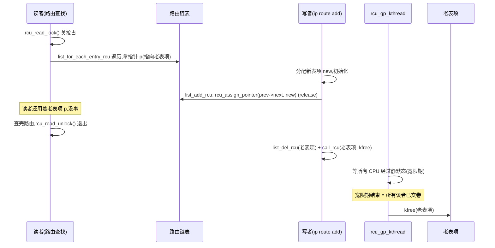
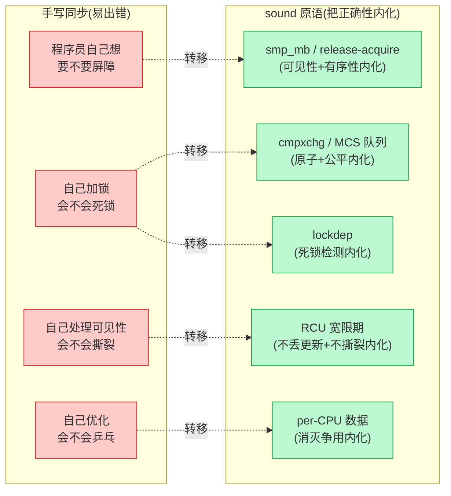

# 第十八篇(章) · 应用回扣:SLUB/RCU 释放 + ★对照总表 + 哲学收束

> 篇:P6 收尾(全书最后一章)
> 主线呼应:这一章是全书的**收束章**。前 17 章,我们把同步原语一件件拆开看——原子操作与屏障铺地基,spinlock/qspinlock/seqlock 自旋死等或不阻塞读者,mutex/rwsem/futex 睡眠在 wait queue 上,rtmutex 用优先级继承治反转,percpu-rwsem 用 per-CPU 计数换读者零争用,RCU 用"读者不锁 + 写者延迟回收"把读者开销砍到零,然后宽限期、tree 层级、srcu、rcu_sync 把 RCU 推到极致。这些机制不是孤岛,它们一起构成了一整套"既不出错又不被锁拖死"的工程兵器谱。现在退一步,做三件事:**(1) 把这些机制落到真实用例上**——SLUB 的 `kmem_cache_free` 怎么用 `call_rcu` 延迟释放 slab、内核链表 `list_add_rcu`/`list_for_each_entry_rcu` 怎么让读者无锁遍历、路由表 fib 怎么靠 RCU 做千万级转发查找;**(2) 给一张 ★对照总表**,把全书涉及的机制和 Tokio(cmpxchg/Pin/无锁队列)、Go runtime(sync.Mutex fast path/channel/sema)、内存分配器(per-CPU cache)、Linux 调度器(rq->lock/preempt_count/TIF_NEED_RESCHED 延迟抢占)一一钉死——锁与无锁不是内核专利,同源思想处处可见;**(3) 哲学收束**:复杂度守恒——锁的复杂度不消灭,只从"易出错的手写(每个程序员自己写屏障/加锁)"转移到"sound 的原语(内核提供 cmpxchg/MCS/RCU,把正确性内化进机制)"。读完这一章,你该有"多核同步全景在胸"的感觉。

## 核心问题

**全书的机制,在真实内核代码里是怎么被用起来的?把 Linux 同步原语和 Tokio/Go runtime/内存分配器/Linux 调度器摆在一起,它们共享了哪几组同源思想?最终,锁与无锁的复杂度被转移到了哪里?**

读完本章你会明白:

1. SLUB 怎么把"slab 延迟释放"做成 RCU 的标准用法(`SLAB_TYPESAFE_BY_RCU` + `call_rcu`),以及 SLUB 的 fast path 怎么用 per-CPU `this_cpu_cmpxchg_double` 做到无锁分配/释放。
2. 内核 RCU 链表(`list_add_rcu`/`list_for_each_entry_rcu`)为什么是"读者无锁遍历 + 写者复制改链"的标准范本,以及它和 fib 路由表查找的关系。
3. ★ 对照总表:把全书机制和系列其它书(Tokio/Go runtime/内存分配器/Linux 调度器)的同源设计钉在一起——fast path cmpxchg、per-CPU 本地数据、Pin vs RCU 契约换无锁、延迟抢占、release/acquire 配对——五组核心对照。
4. 哲学收束:复杂度守恒——锁的复杂度不消灭,只从"易出错的手写"转移到"sound 的原语"。性能与正确性的张力(睡 vs 自旋 vs 不锁三选一)、可扩展性(per-cpu/RCU 把竞争消灭在结构里)。

---

> **逃生阀**:这一章不再讲新的源码细节(前面 17 章已经把"为什么 sound"全拆透了),只做回扣、对照、收束。如果前面某章你跳着读了,本章的对照总表也能帮你补全——把它当"全景地图"用。

## 18.1 一句话点破

> **多核共享可变数据,从竞争、可见性、有序性三个方向出错。同步原语的全部存在意义,是既堵住这三个攻击面,又不被锁本身拖死。内核把这条路磨了几十年,得到了一套分层方案:原子与屏障铺地基,cmpxchg 做 fast path、MCS 队列做自旋公平、wait queue + schedule 做睡眠、per-CPU 数据消灭读者争用、RCU 用契约换读者零开销。这些机制没有一个是孤岛——它们一起回答了同一个问题:"怎么让 64 核机器上的共享数据,既不出错又不被锁拖死。"而它的思想远不限于内核:Tokio 的 cmpxchg/Pin、Go 的 sync.Mutex/channel、tcmalloc 的 per-CPU cache、调度器的 rq->lock/延迟抢占,全是同源。锁的复杂度不消灭,只从"每个程序员自己写屏障加锁"转移到"内核把正确性内化进 cmpxchg/MCS/RCU"——这就是这本书的全部。**

这是结论。本章倒过来分三步走:先看真实用例(SLUB 的 `call_rcu` + 链表 RCU + fib),再用一张大表把全书机制和跨语言同源钉在一起,最后讲复杂度守恒。

---

## 18.2 应用回扣:RCU 在真实内核里怎么用

前 17 章我们拆 RCU 时,用的是"读者关抢占、写者复制改、老对象延迟回收"的抽象契约。现在看它在真实内核里的两个标准用法。

### 18.2.1 SLUB 的 slab 延迟释放:`SLAB_TYPESAFE_BY_RCU` + `call_rcu`

SLUB 是内核默认的 slab 分配器(`mm/slub.c`),它分配的对象(如 `task_struct`、`inode`、`sk_buff` 的私有结构)经常被别的子系统**通过指针引用**,而且引用方常常用 RCU 读者保护——典型场景是网络栈和文件系统:一个 `inode` 可能被 dentry 查找路径在 RCU 临界区里 dereference,如果 slab 释放时立刻把页面还给 buddy,RCU 读者就可能撞上 use-after-free。

SLUB 给这种场景留了一个标志 [`SLAB_TYPESAFE_BY_RCU`](../linux/mm/slub.c#L2433)([slub.c:2433](../linux/mm/slub.c#L2433)):带这个标志的 cache,释放 slab 时**不立刻 free 页面**,而是把它挂到 RCU 宽限期上,等所有"可能还拿着这个 slab 里对象指针的 RCU 读者"都退场了再真正释放。看 [`free_slab`](../linux/mm/slub.c#L2423-2437)([slub.c:2423](../linux/mm/slub.c#L2423)):

```c
static void free_slab(struct kmem_cache *s, struct slab *slab)
{
    if (kmem_cache_debug_flags(s, SLAB_CONSISTENCY_CHECKS)) {
        /* ...debug 检查... */
    }

    if (unlikely(s->flags & SLAB_TYPESAFE_BY_RCU))
        call_rcu(&slab->rcu_head, rcu_free_slab);   /* ← 延迟释放 */
    else
        __free_slab(s, slab);                        /* ← 立刻释放 */
}
```

两条路:**不带 `SLAB_TYPESAFE_BY_RCU`** 的 cache(绝大多数),slab 空 了直接 [`__free_slab`](../linux/mm/slub.c#L2402-2414)([slub.c:2402](../linux/mm/slub.c#L2402)) → `__free_pages` 还给 buddy;**带这个标志**的 cache(如 `files_cache`、部分网络协议族的 sock cache),走 [`call_rcu(&slab->rcu_head, rcu_free_slab)`](../linux/mm/slub.c#L2434)——把"真正释放"挂到一个 RCU 回调上,等宽限期结束后由 [`rcu_do_batch`](../linux/kernel/rcu/tree.c#L2119)(P5-14 讲过)调 `rcu_free_slab` 完成释放。

注意一个微妙的点:`SLAB_TYPESAFE_BY_RCU` 保证的是**对象所在的内存在宽限期内不会被回收**(返回 buddy),**但不保证对象内容不被改**——也就是说,RCU 读者 dereference 这个指针拿到的是"曾经有效的对象",但里面的字段可能被同对象的另一次分配复用改写了。所以用这个标志的子系统,必须自己保证读者只读"稳定不变"的字段(如 `inode->i_ino`),或者在对象里有独立的 RCU 保护(如 `inode->i_rcu`)。这就是 RCU 契约的细化——**延迟回收的粒度是"页面不还给 buddy",不是"对象内容冻结"**。读者要 sound,还得自己想清楚读哪些字段安全。

> **钉死这件事**:SLUB 的 `SLAB_TYPESAFE_BY_RCU` + `call_rcu` 是 RCU 在内核里最经典的"延迟释放"用法——把"释放一个被 RCU 读者可能引用的对象"这件事,转交给 RCU 的宽限期机制兜底。前 5 章拆的 `rcu_gp_kthread`、静默态、`rcu_node` 树,全是为了让这个 `call_rcu` 的回调在**所有读者退场之后**才被调。SLUB 只是用户之一——内核里 `kfree_rcu`、文件系统的 `iput`、网络栈的 `sock_put` 都是这个套路。

### 18.2.2 SLUB 的 fast path:per-CPU `this_cpu_cmpxchg_double`

RCU 解决"释放"问题,但 SLUB 的**分配/释放热路径**还有另一个同步原语的应用:per-CPU 本地 cache + `cmpxchg` 做无锁 fast path。SLUB 每个 CPU 维护一个 [`struct kmem_cache_cpu`](../linux/mm/slub.c#L384-400)([slub.c:384](../linux/mm/slub.c#L384)):

```c
struct kmem_cache_cpu {
    union {
        struct {
            void **freelist;        /* 下一个可用对象 */
            unsigned long tid;      /* 全局唯一事务 ID */
        };
        freelist_aba_t freelist_tid;
    };
    struct slab *slab;              /* 当前分配来源 slab */
    /* ...partial 链表、统计... */
    local_lock_t lock;
};
```

`freelist` + `tid` 被压成一个 16 字节的对齐块,SLUB 用 `this_cpu_cmpxchg_double` **原子地同时比较和交换两者**——这是 x86 `CMPXCHG16B` 指令的内核包装。看 [`__slab_alloc_node`](../linux/mm/slub.c#L3622-3695) 的 fast path([slub.c:3622](../linux/mm/slub.c#L3622)):

```c
c = raw_cpu_ptr(s->cpu_slab);
tid = READ_ONCE(c->tid);
barrier();
object = c->freelist;
slab = c->slab;

if (!USE_LOCKLESS_FAST_PATH() ||
    unlikely(!object || !slab || !node_match(slab, node))) {
    object = __slab_alloc(s, gfpflags, node, addr, c, orig_size);   /* slow path */
} else {
    void *next_object = get_freepointer_safe(s, object);
    /* fast path:原子地比较+替换 freelist 和 tid */
    if (unlikely(!__update_cpu_freelist_fast(s, object, next_object, tid))) {
        note_cmpxchg_failure("slab_alloc", s, tid);
        goto redo;
    }
    stat(s, ALLOC_FASTPATH);
}
return object;
```

这套设计的精妙之处,我们对照前面讲过的机制:

- **per-CPU 本地 cache**(回扣 P4-12 percpu-rwsem):每个 CPU 一份 `kmem_cache_cpu`,分配快路径只动本地 `freelist`,不抢中心 [`struct kmem_cache_node`](../linux/mm/slub.c#L425-434)([slub.c:425](../linux/mm/slub.c#L425))的 `list_lock`——本地缓存命中时零跨核争用。这和 percpu-rwsem 的 `read_count`、调度器的 per-CPU `rq`、tcmalloc 的 per-CPU span cache 是同一招(详见 18.3 总表)。
- **`tid` 防 ABA + 防迁移**(回扣 P1-02 cmpxchg 的 ABA):`tid` 是一个全局唯一的事务 ID,每次 fast path 操作会让它自增。`this_cpu_cmpxchg_double` 同时比较 `freelist` 和 `tid`——如果中间被中断处理抢占(中断里又分配了一次,`freelist` 改了又改回原值),`tid` 不匹配,cmpxchg 失败,重做。这就是 cmpxchg 经典 ABA 问题的标准解(加一个版本号)。
- **`raw_cpu_ptr` + `barrier()`**(回扣 P1-03 内存屏障):`raw_cpu_ptr` 读 per-CPU 数据时不禁迁移,但 `tid` 必须和 `freelist` 在同一个 CPU 上读到——中间插一个编译器屏障 `barrier()`,防止编译器把两次读重排,把不一致的状态混到一起。如果期间真的被迁移到别的 CPU,cmpxchg 也会因为 `tid` 不匹配失败,redo。

> **钉死这件事**:SLUB 的 fast path 是 P1 篇(原子/屏障)、P4 篇(per-CPU)在真实内核里的综合应用——**per-CPU freelist 消灭跨核争用**(回扣 percpu-rwsem)、**`tid` + `cmpxchg_double` 治 ABA**(回扣 P1-02)、**`barrier()` 防编译器重排**(回扣 P1-03)。前 17 章拆的机制不是孤岛,它们在 SLUB 的几十行 fast path 里被一起用上。

### 18.2.3 RCU 链表:`list_add_rcu` / `list_for_each_entry_rcu`

RCU 的另一个标准用法是"读者无锁遍历链表 + 写者复制改链"。内核提供了一整套 RCU 版链表 API([include/linux/rculist.h](../linux/include/linux/rculist.h))。写者加节点用 [`list_add_rcu`](../linux/include/linux/rculist.h#L104-107)([rculist.h:104](../linux/include/linux/rculist.h#L104)):

```c
static inline void list_add_rcu(struct list_head *new, struct list_head *head)
{
    __list_add_rcu(new, head, head->next);
}

static inline void __list_add_rcu(struct list_head *new,
        struct list_head *prev, struct list_head *next)
{
    if (!__list_add_valid(new, prev, next))
        return;

    new->next = next;
    new->prev = prev;
    rcu_assign_pointer(list_next_rcu(prev), new);   /* ← release 发布 */
    next->prev = new;
}
```

关键的技巧在第 4 行——**`prev->next` 用 `rcu_assign_pointer` 写,而不是普通赋值**。`rcu_assign_pointer` 内部是 `smp_store_release`(P5-13 讲过),保证 `new->next` 和 `new->prev` 的初始化**对读者先可见**,然后 `prev->next = new` 才生效。读者从 `prev` 顺着 next 指针读到 `new` 时,看到的 `new` 已经是完整的——这就是"不读到撕裂数据"的根。

读者遍历用 [`list_for_each_entry_rcu`](../linux/include/linux/rculist.h),它展开后是 `for (...; pos = list_entry_rcu(...); ...)`,内部用 `rcu_dereference`(`READ_ONCE` + 屏障)订阅 next 指针。读者必须在 RCU 临界区里(`rcu_read_lock` ... `rcu_read_unlock`),写者改完链后老节点要用 `list_del_rcu` + `kfree_rcu`(或 `call_rcu`)延迟回收。

**这个模式在内核里无处不在**:

- **路由表 fib**:内核路由查找(`net/ipv4/fib_trie.c`)走 RCU——每个 CPU 收到包查路由表时,`rcu_read_lock` 后用 `list_for_each_entry_rcu` / trie 树的 RCU 版遍历,无锁查找;控制平面更新路由(用户态 `ip route add` 或路由协议)时,改路由表项后用 `call_rcu` 延迟回收老表项。一台转发千万 pps 的路由器,每秒上千万次路由查找全是 RCU 无锁读——这就是为什么 RCU 是网络栈的命门。
- **进程 `task_struct` 遍历**:遍历所有进程(`for_each_process`)在部分路径下用 RCU 读,创建/销毁进程时用 RCU 延迟回收 `task_struct`。
- **namespace 切换 / cgroup**:很多地方用 RCU 做无锁查找 + 延迟回收。



> **钉死这件事**:`list_add_rcu` / `list_for_each_entry_rcu` 是 RCU "读者无锁遍历 + 写者复制改链" 的标准 API。`rcu_assign_pointer`(`smp_store_release`)和 `rcu_dereference`(`READ_ONCE` + 屏障)这对 Publish-Subscribe 对,是 P5-13 章立的 RCU 命脉在链表上的具体应用。fib 路由表、`task_struct` 遍历、namespace 切换,全是这个套路——RCU 之所以是内核招牌技巧,正是因为它在千万级查找热路径上消灭了锁开销。

---

## 18.3 ★ 对照总表:锁与无锁,同源思想处处可见

这是本章的重头。把全书涉及的机制,和系列其它书(Tokio/Go runtime/内存分配器/Linux 调度器)摆在一起,钉死"锁与无锁非内核独有"。

### 18.3.1 总表

| 思想 | Linux 同步原语(本书) | Tokio(第 3 本) | Go runtime(第 7 本) | 内存分配器(第 8 本) | Linux 调度器(第 11 本) |
|------|----------------------|------------------|----------------------|---------------------|------------------------|
| **fast path cmpxchg** | mutex `cmpxchg_acquire`(P3-08)、rwsem `try_cmpxchg`(P4-11)、qspinlock fast path(P2-05)、futex 用户态 cmpxchg(P3-10)、SLUB `this_cpu_cmpxchg_double`(18.2.2) | `AtomicWaker` cmpxchg 标记唤醒、Crossbeam/mpsc cmpxchg 链入队列 | `sync.Mutex` fast path `CompareAndSwapInt32`(state 低位编码 locked/woken/starving)、`sync/atomic` 全家桶 | tcmalloc per-CPU span cache fast path 无锁取 | `rq->lock` 是 spinlock,fast path cmpxchg |
| **owner/state 字段低位编码** | mutex owner 压 WAITERS/HANDOFF/PICKUP(P3-08)、rwsem owner 压 READER_OWNED/NONSPINNABLE(P4-11)、count 字段位布局 | `AtomicWaker` 一个 atomic 字段压"已注册/已唤醒" | `sync.Mutex` state 低位 3 bit + 高位等待数 | (分配器不直接用,但 size class 压高位编码) | `preempt_count` 一个字段压抢占 + 软中断 + 硬中断 + NMI 计数(P2-07) |
| **per-CPU / 本地数据消灭竞争** | percpu-rwsem `read_count`(P4-12)、per-cpu 计数器、SLUB `kmem_cache_cpu`(18.2.2)、RCU per-CPU 静默态报告(P5-14) | (Tokio 单线程 worker,默认无跨线程争用) | `sync.Pool` per-P 本地池、`sync/atomic` Value 的 fast path | tcmalloc per-CPU cache、jemalloc per-thread tcache、mimalloc per-thread heap | per-CPU `struct rq`、per-CPU `rq->lock`、per-CPU load 统计 |
| **MCS 队列 / 局部自旋** | qspinlock(P2-05)、mutex/rwsem 乐观自旋用的 `osq`(P3-08/P4-11) | Crossbeam mpsc 队列(节点之间用 `next` 链接,生产者各自操作自己的节点) | (Go sync.Mutex 自旋失败直接睡,无 MCS) | (分配器不用锁排队) | (调度器 `rq->lock` 跨 CPU 借任务时仍是 qspinlock) |
| **wait queue + schedule 睡眠** | mutex/rwsem/futex 慢路径(P3-08/P4-11/P3-10)、rtmutex PI 链(P3-09) | task 让出(挂 reactor poll)、waker 唤醒(`AtomicWaker`) | `sync.Mutex` 自旋失败进 sema `gopark`/`goready`、channel 阻塞挂 `hchan.buf` 上的 wait queue、netpoller | (分配器 cache miss 不睡,直接走 slow path 搬一批) | `schedule()` 主体、`try_to_wake_up` 唤醒、`wait_queue` 头 |
| **release/acquire 屏障配对** | rwsem 乐观读 A-D-S(P4-11)、`rcu_assign_pointer` + `rcu_dereference`(P5-13)、percpu-rwsem A/B/C/D 四道屏障(P4-12)、smp_mb/rmb/wmb(P1-03) | `AtomicWaker` `store_release`/`load_acquire` 唤醒、Crossbeam 节点发布 `store_release`、Pin 保证 future 引用 sound | `sync/atomic` `Load`/`Store` 的 acquire/release、channel 发送接收的 happens-before | (分配器少用,但 span 发布用原子) | wait queue 唤醒用 smp_mb 配对、`try_to_wake_up` 的 `smp_mb__after_spinlock` |
| **"用契约换无锁/无搬运"** | RCU 读者零开销 + 写者延迟回收(P5-13~17)、宽限期保证老指针不提前回收 | `Pin<&mut Future>` 保证不被 move,自引用 sound(P5-13 对照) | (Go 没有直接对应,但 `unsafe` + channel 的 happens-before 契约类似) | (分配器用 size class 隔离 + thread cache 的所有权契约) | (调度器用 preempt_count 契约:计数 > 0 不能抢占) |
| **延迟抢占 / 协作-抢占混合** | spinlock 持锁不能睡(P2-07)、IRQ 上下文不可睡眠、preempt_disable 计数 | 任务 `await` 让出是协作式;Tokio 没有内核抢占 | GMP 协作抢占(函数调用安全点检查抢占标志)+ 异步抢占(signal-based) | (分配器不直接涉及) | **★ 姊妹篇核心**:`TIF_NEED_RESCHED` 标记该抢、延迟到安全点真切、`preempt_count` 控制能不能抢、EEVDF/deadline 调度策略 |
| **运行时验证 / 死锁检测** | lockdep 依赖图(P1-04) | (Tokio 无内置,但 async runtime 错误能暴露 task hang) | Go runtime 死锁检测(所有 goroutine 阻塞时 panic "all goroutines are asleep") | (分配器用 ASAN/KASAN 检测 UAF) | sched debug `/proc/sched_debug`、cgroup bandwidth 限额 |

### 18.3.2 关键几组对照展开

总表钉死了同源映射,下面挑五组最关键的展开,把这五条思想彻底讲透——它们是"为什么 64 核机器上内核还能这么快"的命门,也是本书与系列其它书的连接点。

#### 第一组:fast path cmpxchg —— 跨语言通用的锁优化

> 无竞争时一条原子指令(纳秒级),有竞争才进慢路径——这是内核 mutex、Go sync.Mutex、Tokio AtomicWaker、SLUB fast path 的共同设计。

内核 mutex 的 fast path 是一条 `cmpxchg_acquire(0 → curr)`(P3-08)。Go 的 `sync.Mutex` 几乎是它的用户态翻版——`atomic.CompareAndSwapInt32(&m.state, 0, mutexLocked)`,失败才自旋、再失败进 sema 睡眠;state 字段低位编码 `mutexLocked`(bit0)、`mutexWoken`(bit1)、`mutexStarving`(bit2),高位存等待者数量——这套位布局和内核 mutex 的 owner 低位编码(回扣 P3-08 的 WAITERS/HANDOFF/PICKUP)是同一种技巧。Tokio 的 `AtomicWaker` 也是 cmpxchg——一个 `AtomicUsize` 压"注册的 waker 引用 + 唤醒标志",无竞争时一条 `compare_exchange` 完成注册/唤醒。

为什么跨语言独立演化出同一种设计?因为**无竞争是绝大多数情况**(否则你的锁设计就有问题),把无竞争路径做到极致短(几条指令、纳秒级),有竞争才付慢路径代价——这是锁优化的局部最优解。内核 mutex、Go sync.Mutex、Tokio AtomicWaker,分别在自己的生态里独立走到了这个解。学透一个,你看任何语言的锁实现都能一眼看穿。

#### 第二组:per-CPU / 本地数据 —— 把竞争消灭在结构里

> 64 核抢同一份 `count`,触发 MESI invalidate,cache line 乒乓,核越多越慢。解法:给每核一份本地数据,根本不共享——percpu-rwsem 的 read_count、SLUB 的 kmem_cache_cpu、tcmalloc 的 per-CPU cache、调度器的 per-CPU rq、Go sync.Pool 的 per-P 池,全是同源。

P4-12 章拆过 percpu-rwsem 为什么能消灭读者争用——读者只动本地 `this_cpu_inc(*sem->read_count)`,不抢同一份全局 count,64 核读者互不干扰。SLUB 的 fast path(18.2.2)是同一招——每个 CPU 一份 `kmem_cache_cpu`,分配快路径只动本地 `freelist`,不抢 `kmem_cache_node->list_lock`。tcmalloc 8.x 把 cache 从 per-thread 改成 per-CPU(避免线程迁移导致 cache 失效),jemalloc 的 tcache 是每线程一份,Go 的 `sync.Pool` 是 per-P(物理核)本地池——思想完全同源:**热路径只动本地数据,慢路径才去中心结构搬一批**。

调度器的 per-CPU `struct rq` 是这个思想在"运行队列"上的应用——每个 CPU 一个 rq,调度快路径(`try_to_wake_up`、`scheduler_tick`)只动本地 `rq->lock`,跨 CPU 唤醒/负载均衡才进慢路径。rcu_node 树(P5-15)也是这个思想在"宽限期报告"上的应用——CPU 分组成树形,叶子节点管若干 CPU,避免所有 CPU 都报告给根节点成瓶颈。

> **钉死这件事**:per-CPU / 本地数据是并发设计里"消灭争用"最普适的一招。它不是内核专利——tcmalloc、jemalloc、Go sync.Pool、Tokio 的单线程 worker,都在用。把它钉死,你就掌握了"为什么内核在 64 核机器上还能这么快"的关键一招。

#### 第三组:Pin vs RCU —— 用契约换无锁/无搬运

> 都是"立一条规矩,规矩保证 sound"——Rust 在类型系统里立(Pin 钉住不 move),Linux 在运行时立(RCU 宽限期内不回收)。

P5-13 章对照过:Rust 的 `Pin<&mut Future>` 解决的是自引用 future 被 move 后自引用失效——`Pin` 用契约保证"只要 pin 住就不 move",换"无搬运"(自引用 sound)。RCU 解决的是读者拿的指针被写者提前回收——RCU 用契约保证"老指针在宽限期内不回收",换"无锁"(读者零开销)。两者都不是"加更强的同步",而是"立一条规矩,规矩保证 sound"。差别只在:Rust 在类型系统里立(编译期保证),Linux 在运行时立(preempt 计数 + 静默态检测 + rcu_gp_kthread)。

为什么这是同源思想?因为它们都抓住了同一个本质——**有时候,解决并发问题的最佳方式不是"更狠的锁",而是"约定一个不变式,不变式让并发自动 sound"**。RCU 约定"宽限期内不回收",Pin 约定"pin 住不 move"——都是把"容易出错的运行时检查"换成"契约保证的不变式"。这是并发设计里"换思路"的最高境界。

#### 第四组:延迟抢占 —— 标记一个"该做某事了"的标志,延迟到安全点才真切

> `TIF_NEED_RESCHED` 标记"该抢占了",延迟到抢占点(中断返回、抢占计数归零)才真切——这是内核的延迟抢占。Go runtime 的协作抢占(函数调用安全点检查抢占标志)、Tokio 的任务让出(任务自己 await 让出),都是同一思想的不同应用。

调度器那本(P3-11 抢占点)讲过:内核标记 `TIF_NEED_RESCHED` 不立刻切,而是等到下一个抢占点(中断返回用户态/内核态、`preempt_count` 归零)才真切——这避免了"在任何指令位置都能切"的复杂度(要保存全部寄存器、处理任意中间状态),把抢占限制在"安全点"。延迟抢占的代价是"响应延迟略增"(等中断或抢占点),换来的是"实现简单 + sound"。

这套"标记 + 延迟执行"的模式在同步原语里也随处可见:

- **mutex 的 HANDOFF 标志**(P3-08):队首等太久设 HANDOFF,但 unlock 时才真切把锁交给队首——不是"立刻抢",而是"标记一下,unlock 时执行"。
- **RCU 的回调延迟执行**(P5-14):`call_rcu` 不是立刻执行回调,而是挂到宽限期内,等宽限期结束 `rcu_do_batch` 才批量执行——标记 + 延迟。
- **rwsem 的读者唤醒**(P4-11):写者释放时不是立刻唤醒读者,而是把读者从慢路径"偷"出来——慢路径的 wake_up 也是延迟到合适的点。
- **percpu-rwsem 的写者切换**(P4-12):`rcu_sync_enter` 切 rss 状态,但读者要等到下次进入临界区才"看见"切换——标记 + RCU 宽限期通知。

Go 的协作抢占(Go 1.14 前是纯协作,函数调用安全点检查抢占标志;Go 1.14+ 加了信号抢占)和 Tokio 的任务让出(任务自己 `await` 让出 reactor)是同一思想在用户态的应用——**"在任何位置都能切"太复杂,所以约定在安全点切**。差别只在:内核用硬件中断触发抢占点,Go/Tokio 用协作或信号。

> **钉死这件事**:延迟抢占 / 标记-延迟执行,是"把复杂度限制在安全点"的通用招式。内核用 `TIF_NEED_RESCHED`,Go 用协作抢占,Tokio 用任务让出;同步原语里 mutex HANDOFF、RCU 回调、rwsem 唤醒全是这个套路。它的本质是**用"略增响应延迟"换"实现简单 + sound"**——这是工程上极常见的取舍。

#### 第五组:release/acquire 配对 —— 跨核通知的标准协议

> 读者 `smp_load_acquire` + 唤醒者 `smp_store_release`——这对屏障配对,是 rwsem 乐观读 A-D-S、RCU publish-subscribe、Tokio AtomicWaker、调度器 wait queue 唤醒的通用协议。

P4-11 章拆过 rwsem 乐观读的 A-D-S 手写——读者慢路径循环里 `smp_load_acquire(&waiter.task)` 看唤醒者有没有把它写 NULL,唤醒者 `smp_store_release(&waiter.task, NULL)` 写入。P1-03 章讲过这是经典的消息传递屏障配对(生产者 release 写 ready,消费者 acquire 读 ready,看到 ready 后面的 data 一定可见)。

这对配对在跨语言、跨层次里反复出现:

- **Tokio `AtomicWaker`**:唤醒者 `store_release` 写"已唤醒",被唤醒者 `load_acquire` 读——和 rwsem 一模一样。
- **RCU `rcu_assign_pointer` + `rcu_dereference`**:前者 `smp_store_release` 发布新指针,后者 `READ_ONCE` + 屏障订阅——release-acquire 配对保证读者看到的新对象完整(P5-13 命脉)。
- **Go channel**:发送方 release,接收方 acquire,Go 内存模型明确规定了 happens-before——这是 channel 跨 goroutine 通信 sound 的根。
- **调度器 wait queue 唤醒**:`try_to_wake_up` 写 `task->state = TASK_RUNNING`(release),被唤醒任务在 `schedule()` 里 acquire 读自己的 state——配对。

为什么这对配对这么通用?因为它精准地堵住了 P1-03 章讲的"消息传递模式"的可见性 / 有序性洞——**生产者先写数据再 release 写标志,消费者 acquire 读标志再读数据**,任何弱内存序架构(ARM/POWER/RISC-V)都不会撕裂。这是跨核通知的标准协议,内核锁、用户态异步、语言级并发用的都是同一对。

> **钉死这件事**:release/acquire 配对是跨核通知的标准协议,跨语言、跨层次通用。rwsem A-D-S、RCU publish-subscribe、Tokio AtomicWaker、Go channel、调度器 wait queue 唤醒,全是它的具体应用。把它钉死,你就掌握了"跨核通信"的本质。

---

## 18.4 哲学收束:复杂度守恒

把应用回扣和对照总表放完,该收束了。这本书从头到尾拆了 17 章机制,最后这一节我们退一步,问一个问题:**锁的复杂度,被转移到了哪里?**

### 18.4.1 复杂度不消灭,只转移

一个朴素的多核程序,每个程序员自己写同步——加什么锁、什么时候加、要不要屏障、读者会不会读到撕裂数据、会不会死锁、64 核会不会乒乓——全靠程序员自己想清楚。这种"手写同步"的复杂度极高,而且极易出错:少一个 `smp_mb` 就会在 ARM 上偶发丢更新、忘一个 `spin_unlock` 就会死锁、临界区里不小心睡了就会挂死整个 CPU。

内核同步原语做的事情,本质上是**把这些复杂度从"每个程序员手写"转移到"少数几个 sound 的原语"**——把正确性内化进机制:



这就是**同步原语的复杂度守恒**:复杂度不消灭,只转移。原本散落在每个程序员脑子里的"我这里要不要加屏障"、"我会不会死锁"、"读者会不会撕裂",被收敛到 cmpxchg、MCS、RCU、lockdep 这些**经过几十年审查、在所有并发执行序下都 sound** 的原语里。程序员只需要知道"用 mutex 保护这段临界区"、"用 RCU 做读多写少的查找",正确性由原语兜底。

> **钉死这件事**:这本书拆的不是"锁怎么用",而是"锁凭什么 sound"——也就是这些原语**怎么把正确性内化进机制**。cmpxchg 内化了"原子地比较-交换",MCS 队列内化了"公平 + 不乒乓",RCU 宽限期内化了"等所有读者退场",release-acquire 配对内化了"跨核通知的可见性 + 有序性",lockdep 内化了"死锁检测"。每一个原语,都是把一类"易出错的复杂度"收敛进"sound 的实现"。这就是同步原语存在的全部意义。

### 18.4.2 性能与正确性的张力:睡 vs 自旋 vs 不锁

复杂度守恒的另一面,是**性能与正确性的张力**。同步原语的所有设计,最终都在回答一个问题:**"等不到怎么办?"**——而内核给了三个答案:

- **睡(mutex/rwsem/futex)**:等不到就让出 CPU,睡在 wait queue 上。优点:持锁可以很久(睡着的进程不占 CPU),适合长临界区。代价:上下文切换 μs 级开销,短临界区用它亏;持锁睡眠要小心优先级反转(→ rtmutex)。
- **自旋(spinlock/qspinlock)**:等不到就 `cpu_relax` 死等。优点:延迟极低(ns 级),适合极短临界区。代价:烧 CPU;持锁绝不能睡(→ IRQ 上下文不可睡眠)。
- **不锁(RCU/per-cpu/seqlock)**:读者根本不取锁(或只动本地数据)。优点:读者零开销,适合读多写少热路径。代价:写者要延迟回收 / 写者要切换状态 / 读者要重读,代价转移到写者或读者重读。

这就是本书的二分法(阻塞睡眠 vs 自旋/无锁)的本质——**睡 vs 自旋 vs 不锁三选一**。每选一条路,正确性都由对应原语兜底:睡的 sound 由 wait queue + schedule + handoff 保证,自旋的 sound 由 cmpxchg + MCS 队列保证,不锁的 sound 由 RCU 宽限期 + per-CPU 数据隔离 + seqlock 重读保证。同步原语的设计,就是在"性能(快)"和"正确性(sound)"之间找平衡,而每条路都找到了自己的局部最优。

### 18.4.3 可扩展性:把竞争消灭在结构里

最后一个收束点是**可扩展性(scalability)**。一台 64 核机器,如果所有 CPU 都抢同一把锁,锁本身比临界区贵一个数量级。内核的解法是把竞争消灭在结构里:

- **per-CPU 数据**(percpu-rwsem、SLUB kmem_cache_cpu、调度器 rq、RCU 静默态报告):每核一份,根本不共享。
- **RCU 读者零开销**(rcu_read_lock 只关抢占):读者完全不抢任何共享数据,64 核读者互不干扰。
- **MCS 队列**(qspinlock、osq):每个 spinner 自旋在自己的本地变量上,缓存行乒乓消失。
- **rcu_node 树**(P5-15):CPU 分组成树形,宽限期报告按层级上传,避免根节点成瓶颈。

这些设计的共同思想是——**与其让多个执行流抢同一份共享数据然后想办法优化锁,不如从结构上让它们根本不抢**。这是内核在 64 核、128 核、上千核机器上还能保持线性的命门。它也是 P4-12 percpu-rwsem 章对照的 tcmalloc per-CPU cache、调度器 per-CPU rq 的同源思想——"消灭竞争"是并发设计里最普适、最高境界的一招。

> **钉死这件事**:可扩展性的本质,是"把竞争消灭在结构里"。per-CPU 数据、RCU 读者零开销、MCS 局部自旋、rcu_node 层级报告——全是这个思想的不同应用。这是同步原语在 64 核机器上还能这么快的根,也是为什么 RCU 被称为"21 世纪最重要的同步原语"——它把读者开销砍到零,让千万级查找热路径成为可能。

---

## 章末小结

这一章是全书**收束章**,我们没有再拆新的源码细节,而是做了三件事:把前 17 章机制落到真实用例(SLUB call_rcu + 链表 RCU + fib)、给一张 ★对照总表钉死跨语言同源、用"复杂度守恒"收束哲学。回到全书二分法:**阻塞睡眠锁(mutex/rwsem/futex)等不到就睡,自旋/无锁(spinlock/qspinlock/seqlock/per-cpu/RCU)要么死等要么根本不锁,原子/屏障/lockdep 铺地基**——所有同步原语的设计都在这三类里权衡。

### 全书二分法总回顾

把全书的 17 章机制,按二分法归类回扣:

**支撑地基(第 1 篇 P1-02~04)**:

- 原子操作 `atomic_t` / `cmpxchg`(P1-02):让"读-改-写"不可分割,治竞争。
- 内存屏障 `smp_mb` / `smp_store_release` / `smp_load_acquire` + `READ_ONCE` / `WRITE_ONCE`(P1-03):治可见性和有序性,跨核通知的协议。
- lockdep 依赖图(P1-04):运行时验证锁的正确性。

**自旋/无锁一极(第 2、4、5 篇)**:

- spinlock / qspinlock / MCS 队列(P2-05):死等,但公平 + 不乒乓。
- seqlock(P2-06):读者用奇偶版本号重读,不阻塞写者。
- `spin_lock_irqsave` / `spin_lock_bh`(P2-07):IRQ 上下文不可睡眠的根。
- percpu-rwsem(P4-12):per-CPU 计数换读者零争用。
- RCU 读者零开销(P5-13):只关抢占,不取锁。
- grace period / quiescent state(P5-14):宽限期等所有 CPU 静默。
- tree RCU 的 `rcu_node` 树(P5-15):层级报告,SMP 可扩展。
- srcu(P5-16):双计数槽,读者可睡眠。
- `rcu_sync` / Tasks Trace(P5-17):基于 RCU 的轻量原语。

**阻塞睡眠一极(第 3、4 篇)**:

- mutex(P3-08):fast path cmpxchg + 慢路径 wait queue + 乐观自旋 + handoff。
- rtmutex(P3-09):优先级继承,治优先级反转。
- futex(P3-10):用户态 cmpxchg + 内核 wait queue,用户态锁的 fast path。
- rwsem(P4-11):乐观读 A-D-S 手写屏障配对 + 写者睡眠。

**收束(本章 P6-18)**:SLUB call_rcu + 链表 RCU + ★对照总表 + 复杂度守恒。

### 五个"为什么"清单

1. **SLUB 释放 slab 为什么要用 `call_rcu`?** 因为带 `SLAB_TYPESAFE_BY_RCU` 标志的 cache,其对象可能被别的子系统在 RCU 临界区里 dereference。直接释放还 buddy 会导致 use-after-free。用 `call_rcu(&slab->rcu_head, rcu_free_slab)` 把释放挂到 RCU 宽限期内,等所有读者退场后再释放。注意:这只保证页面不还 buddy,不保证对象内容不变——读者还得自己保证读的字段稳定。

2. **SLUB 的 fast path 凭什么无锁?** per-CPU `kmem_cache_cpu` 让每个 CPU 一份本地 freelist,`this_cpu_cmpxchg_double` 原子地比较+交换 freelist 和 tid——`tid` 治 ABA(中间被中断重入会不匹配)、per-CPU 消灭跨核争用、`barrier()` 防编译器重排。三者协同,fast path 零跨核同步。

3. **`list_add_rcu` 为什么用 `rcu_assign_pointer` 而不是普通赋值?** `rcu_assign_pointer` 内部是 `smp_store_release`,保证 `new->next` / `new->prev` 的初始化对读者先可见,然后 `prev->next = new` 才生效。读者从 prev 顺着 next 读到 new 时,看到的 new 是完整的——这就是"不读到撕裂数据"的根。

4. **跨语言为什么都演化出 fast path cmpxchg + 低位编码?** 因为无竞争是绝大多数情况,把无竞争路径做到极致短(纳秒级)、有竞争才进慢路径——是锁优化的局部最优解。低位编码把"持锁者 + 状态"压进一个原子字,让一次原子操作就能完成 fast path。内核 mutex、Go sync.Mutex、Tokio AtomicWaker 独立演化出同一种设计。

5. **复杂度守恒:锁的复杂度转移到了哪里?** 从"每个程序员手写屏障/加锁/想可见性"转移到"少数几个 sound 原语"——cmpxchg 内化原子性、MCS 内化公平、RCU 宽限期内化"不丢更新"、release-acquire 配对内化跨核通知、lockdep 内化死锁检测。程序员只需要知道"用 mutex"、"用 RCU",正确性由原语兜底。这就是同步原语存在的全部意义。

### 往哪钻

这本书到此结束,但你的旅程还可以继续:

- **附录 A · 全景脉络**:一张 mutex_lock fast/slow path 完整时序图 + rwsem 乐观读 A-D-S 时序 + RCU 宽限期端到端时序(读者→写者→call_rcu→rcu_gp_kthread→宽限期结束→rcu_do_batch)——把本书所有关键路径用图串起来。
- **附录 B · 源码阅读路线与延伸**:`kernel/locking/` / `kernel/rcu/` / `kernel/futex/` 的阅读地图、观测工具(`/proc/lock_stat`、`/sys/kernel/debug/rcu`、`rcutorture`、`perf lock`、`lockdep`)、与用户态(`pthread_mutex`、`std::mutex`、futex(2))的对照、与 Tokio/Go runtime/内存分配器/Linux 调度器系列互引。
- **进阶读物**:
  - Paul E. McKenney 的《Is Parallel Programming Hard, And, If So, What Can You Do About It?》——RCU 之父写的并行编程教材,免费 PDF,RCU 部分最权威。
  - 《Perf Book》(同作者)——RCU 进阶。
  - kernel documentation:`Documentation/locking/`、`Documentation/RCU/`——内核自带,权威。
  - Isolation/内存序:Herb Sutter 的《atomic weapons》talk、Linux 内核内存模型(LKMM)文档。
  - 系列其它书:《Tokio》第 3 本(无锁队列/Pin/AtomicWaker)、《Go runtime》第 7 本(GMP/sync.Mutex/channel)、《内存分配器》第 8 本(per-CPU cache)、《Linux 调度器》第 11 本(rq->lock/TIF_NEED_RESCHED/EEVDF)——把本书的对照总表里的每一条都钻深。

### 引出附录

正文 17 章 + 收尾章到此全部讲完。如果你还没看过瘾,想要一张"全景时序图"把所有关键路径串起来,看附录 A;如果你想要一份"源码阅读地图 + 观测工具清单",看附录 B。这本书讲的是"内核同步原语凭什么这么设计、`kernel/locking/*.c` / `kernel/rcu/tree.c` 里那些 cmpxchg fast path、MCS 队列、A-D-S 手写、rcu_node 树到底在干什么、为什么 sound"——读完,你该能在脑子里放映出多核同步的全过程,并看清它和 Tokio cmpxchg/Pin、Go sync.Mutex/channel、tcmalloc per-CPU cache、调度器 rq->lock/延迟抢占的同源。**锁与无锁不是内核专利,同源思想处处可见;复杂度不消灭,只转移到 sound 的原语——这就是这本书的全部。**
