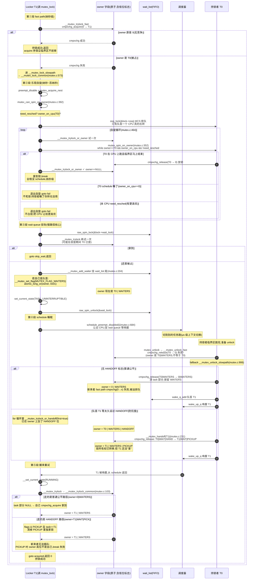
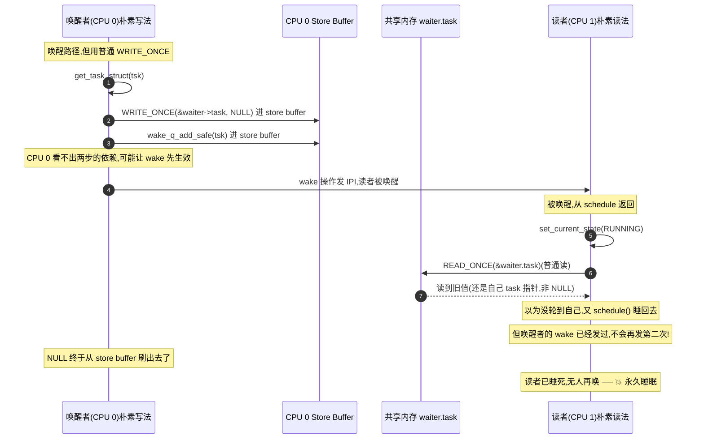

# 附录 A · 全景脉络:三大主线机制的端到端时序

> 篇:附录
> 定位:这是全书散落各章关键时序的**汇总串联**。前面 17 章按"原子屏障地基 → 自旋锁类 → 阻塞锁 → 读写锁 → RCU"的次序逐章拆透,每一章内部都有自己的 mermaid 时序图。但同步原语是一整套**并发执行**的系统,真正看清"为什么 sound",要把一章之内画不全的跨章拼接补齐:一次 `mutex_lock` 从用户态调用到睡下去再到醒来的**完整旅程**,一次 rwsem 乐观读从 fast path 失败到 A-D-S 屏障配对唤醒的**跨核通信**,一次 RCU 宽限期从读者进入临界区到老对象被 `kfree` 回收的**端到端证据链**。本附录不引入新内容,只把这三件最大、最频繁被问、最考验"是否真的读透"的事,各画一张端到端总图,配串联解说。
>
> 怎么用本附录:每张图前有一段"这张图在讲什么"帮你定位,图后有一段"关键步骤解说"把全书的 why 和技巧串起来。如果某一步你忘了细节,图旁标了对应正文章节的源码行号,**回到那一章读它的"技巧精解"小节**,那里有反面时序和源码逐行拆解。本附录不重复那些细节,只负责让三条主线在脑里成片。

## A.0 三大主线为什么值得单独汇总

全书 17 章按子模块组织,但读者最容易"读完每章都懂、合上书想不出全貌"。这是因为三件事的 sound 证明**横跨多章**:

1. **mutex 的 fast/slow 分层**:fast path(P3-08 的 8.3 节)→ 乐观自旋(8.4)→ wait queue 睡眠(8.5)→ handoff 防饥饿(8.6)→ owner 低位编码(8.7),五段在章内是五节,但**一次真实的 `mutex_lock` 调用可能依次穿过它们**——不画成一张时序图,你脑里没有"整条决策树"的形状。
2. **rwsem 的 A-D-S 屏障配对**:读者侧(P4-11 的 11.5.2)用 `smp_load_acquire(&waiter.task)`,唤醒者侧(11.5.3 的 `rwsem_mark_wake` 2nd pass)用 `smp_store_release(&waiter.task, NULL)`,这条 happens-before 链**横跨两个 CPU、两段代码**——单看一边不知道它在防什么,合起来才 sound。
3. **RCU 的宽限期**:读者侧(`rcu_read_lock` 在 P5-13)→ 写者侧(`rcu_assign_pointer` + `call_rcu` 在 13.4-13.5)→ tick 钩子检测静默态(`rcu_sched_clock_irq` 在 P5-14)→ `rcu_node` 树层级报告(P5-15)→ 根收齐宽限期结束 → `rcu_do_batch` 回收老对象(14.6)。**五个角色在四个章节里**,单读一章你只看见一片叶子,看不见整棵树。

本附录就是这三棵树。

---

## A.1 总图一:mutex_lock 的 fast/slow path 端到端时序

### 这张图在讲什么

`mutex_lock` 是内核里调用频率最高的同步原语之一(inode 锁、VMA 锁、设备驱动配置处处都是)。它把"无竞争要快、有竞争要公平、等太久要不饿、持锁要能睡"四个矛盾压进一个 [`atomic_long_t owner`](../linux/include/linux/mutex_types.h#L42) 字段。**一次真实的 lock 调用,会依次穿过五个决策点**:fast path 的 cmpxchg → 乐观自旋的 osq 排队 → wait queue 的 FIFO 挂钩 → schedule 睡眠 → unlock 的唤醒 + 可能的 handoff。每个决策点都有明确的退出条件,退出条件覆盖了所有"走下去也没用"的情况——这是 mutex 不死锁、不白烧、不饿死的根。

下面这张图把 [`mutex_lock`](../linux/kernel/locking/mutex.c#L281) 的全旅程画在一张时序图上,参与者:Locker(调 `mutex_lock` 的任务)、`owner` 字段(原子字,带三个低位标志)、`wait_list`(FIFO 等待队列)、调度器、持锁者 T0。



### 关键步骤解说(串联全书知识点)

**① fast path 是"无竞争时的捷径",纳秒级。** 一条 [`cmpxchg_acquire(0 → T1)`](../linux/kernel/locking/mutex.c#L171) 原子指令——比较 owner 是不是 0,是就改成自己。**生产环境里绝大多数 mutex_lock 都走这一段**(否则你的锁设计就有问题)。`_acquire` 后缀的内存序把读者临界区代码钉死在拿锁之后,不会跑到锁外——少了 `_acquire`,某条执行序下"明明加了锁、数据还是被改乱了",极难复现(P3-08 的 8.3 节有完整反例)。fast path 失败立刻 fallback,不重试、不自旋——这一段是 P0-01 立的"fast/slow path 分层是内核锁性能的命脉"在 mutex 上的真实形态。

**② 乐观自旋是"持锁者在跑就少睡"的混合策略。** fast path 失败后不立刻 schedule——持锁者可能只持几十 ns 就放,睡下去反而亏 μs 级唤醒。所以先 [`mutex_optimistic_spin`](../linux/kernel/locking/mutex.c#L440) 试试。这里有两层 sound 保证:**第一,`osq_lock(&lock->osq)` 是 MCS 锁**(P2-05 讲过 MCS 思想),64 核同时想自旋时**只有队首一个 CPU 真的在转**,其他 CPU 在自己的本地变量上自旋等队首放权——不会 64 个 CPU 全在 owner 字段上 cache line 乒乓。**第二,四个退出条件**(`__mutex_owner` 换了 / `owner_on_cpu==0` / `need_resched` / vCPU 被抢)覆盖了所有"转下去也没用"的情况(P3-08 的 8.4 节有完整推理)——spinlock 会死等,mutex 不会,这是"乐观"二字的全部含义。

**③ wait queue FIFO 是"实在拿不到就睡"的兜底。** 乐观自旋也失败,才正式挂 `wait_list`。注意 [`__mutex_add_waiter`](../linux/kernel/locking/mutex.c#L204) 里的关键一句:`__mutex_waiter_is_first` 时 `__mutex_set_flag(MUTEX_FLAG_WAITERS)` —— 用 `atomic_long_or` 把 owner 的 bit0 置 1。**这是慢路径通知 fast path 的单向信号**:设上之后,持锁者下次 unlock 时 `__mutex_unlock_fast` 的 `cmpxchg_release(curr → 0)` 必然失败(owner 实际是 `curr | WAITERS`,不等于 `curr`),于是 fallback 到 `__mutex_unlock_slowpath` 唤醒。**没有这个标志,unlock 一走了之,等待者就永远睡死**——这是 wait queue 不丢唤醒的根。

**④ schedule 睡眠是"阻塞睡眠一极"的本体。** [`schedule_preempt_disabled`](../linux/kernel/locking/mutex.c#L684) 调用主调度器让出 CPU——这一刻付出 μs 级上下文切换的代价,换来"持锁可以很久"(睡着的进程不占 CPU)。这一段是 mutex 与 spinlock 的根本分野(P3-08 的 8.2 节):**持 mutex 可以睡、持 spinlock 绝不能睡**——spinlock 持锁者一旦睡了,另一个 CPU 就会死等一个永远醒不过来的持锁者。

**⑤ unlock 唤醒 + handoff 防饥饿。** 持锁者 unlock 时,根据 owner 字段当前标志走两条路。**普通公平路径**:`cmpxchg_release(T0|WAITERS → 0|WAITERS)`——清掉 task 部分,**保留 WAITERS**。这一步极妙:owner 字段变成 `0 | WAITERS`,新来者的 fast path `cmpxchg_acquire(0 → x)` 必然失败(因为 owner 不等于 0),被迫走 slow path 排到队尾——**这就防止了新来者在唤醒窗口内插队**。**HANDOFF 路径**:队首 T1 等太久(在 for 循环里 `__mutex_trylock_or_handoff(first=true)` 设过 HANDOFF),unlock 看到这个标志 [`__mutex_handoff(T1)`](../linux/kernel/locking/mutex.c#L231) 把 owner 改成 `T1 | WAITERS | PICKUP`——锁所有权已转移,但 T1 还没"拿"。新来者看到 PICKUP 但 owner 高位不是自己,`break` 失败,无法插队。T1 醒来清掉 PICKUP 拿到独家锁。**这套三个低位标志(WAITERS/HANDOFF/PICKUP)+ 状态机的协同,是 mutex 既公平又不饿人的根**——P3-08 的 8.6/8.7 节有完整状态机表和每个标志的执行序拆解。

**⑥ for 循环每轮都重试 trylock 是 mutex 不丢锁的根。** 注意慢路径的 for 循环每一轮醒来、每一轮拿到 `wait_lock` 都要 `__mutex_trylock`——因为持锁者放锁的 fast path 根本不拿 `wait_lock`,**unlock 可能发生在你拿 wait_lock 之前**。少了这层 trylock,会出现"unlock 已发生、等待者却没感知"的丢锁。

把这张图钉在脑里,你就掌握了**阻塞睡眠一极的典型形态**:fast path cmpxchg + 乐观自旋(osq MCS 排队)+ wait queue FIFO 睡眠 + 低位标志通知 + handoff 防饥饿。rwsem/futex/Go 的 `sync.Mutex` 全是这个套路的变种——后续两张总图分别看 rwsem 怎么把它改造成"乐观读",和 RCU 怎么彻底抛弃这套而走另一极。

---

## A.2 总图二:rwsem 乐观读的 A-D-S 三段手写端到端时序

### 这张图在讲什么

rwsem 是"多读者共享、单写者独占"的读写信号量,用在 VMA 树、inode 元数据、内核模块配置表这些**读多写少**的场景。它的难点不在允许多读者,而在读者 fast path 失败后的慢路径——用了内核里最经典也最容易讲歪的一对**手写屏障配对**:读者用 [`smp_load_acquire(&waiter.task)`](../linux/kernel/locking/rwsem.c#L1074) 等被唤醒,唤醒者用 [`smp_store_release(&waiter.task, NULL)`](../linux/kernel/locking/rwsem.c#L558) 配对。**这对屏障配对为什么 sound**,是全书"为什么 sound"最硬核的几处之一——它把"我是否被唤醒"这件跨核通信的事实压在一个共享指针上,用 P1-03 章讲的"消息传递屏障配对"理论在内核锁上落地。

下面这张图画的是**正常路径(屏障配对完整)**,参与者:读者 T1(CPU 1)、`waiter.task` 共享字段、唤醒者 T0(CPU 0,可能是写者放锁或前一个读者放锁)。

```mermaid
sequenceDiagram
    autonumber
    participant R as 读者 T1(CPU 1)
    participant Cnt as count + owner 字段
    participant Wt as waiter.task(共享)
    participant Waker as 唤醒者 T0(CPU 0)
    participant WQ as sem->wait_list

    Note over R: fast path 试一次
    R->>Cnt: down_read → __down_read_common(mutex.c:1243)
    R->>Cnt: rwsem_read_trylock(L241)<br/>atomic_long_add_return_acquire(count, READER_BIAS)
    alt count 无 WRITER_LOCKED/WAITERS/HANDOFF/READFAIL
        Note over R: 命中,置 RWSEM_READER_OWNED<br/>直接返回(纳秒级)
    else 有写者或队列有人
        Note over R: fast path 失败,进 rwsem_down_read_slowpath(L996)

        Note over R: 偷抢块(L1003):没写者就别睡
        alt owner 是读者群 且 rcnt>1
            Note over R: 跳过偷抢 goto queue(防饿死写者)
        else 无 WRITER_LOCKED 且无 HANDOFF
            R->>Cnt: rwsem_set_reader_owned 挤进来
            Note over R: 偷抢成功,直接返回
        end

        Note over R: 排队 ── A-D-S 的 A(Acquire)
        R->>Wt: waiter.task = current(L1035)<br/>waiter.type = RWSEM_WAITING_FOR_READ
        R->>WQ: rwsem_add_waiter 挂 wait_list
        R->>Cnt: atomic_long_add_return(adjustment, count)<br/>(置 WAITERS 标志)
        R->>R: set_current_state(TASK_UNINTERRUPTIBLE)(L1073)

        Note over R: 关键屏障:smp_load_acquire
        R->>Wt: smp_load_acquire(&waiter.task)(L1074)<br/>acquire 序:看到 NULL 后,后续读不前移

        alt waiter.task 还是 current(非 NULL)
            Note over R: 还没轮到我
            R->>R: schedule_preempt_disabled(L1086)<br/>── D(Do):真正让出 CPU 睡
            Note over R: 醒来回到 for 循环顶端,重设状态,重读

            Note over Waker: 放锁路径(up_write/up_read → rwsem_wake)
            Waker->>WQ: raw_spin_lock_irq(&sem->wait_lock)
            Waker->>WQ: rwsem_mark_wake(sem, wake_type, &wake_q)(L411)
            Note over Waker: 在 wait_list 里挑要唤醒的读者<br/>2nd pass(L548-567)

            Note over Waker: ── S(Release)三步,顺序不能错
            Waker->>Waker: ① get_task_struct(tsk)<br/>给读者 task 加引用计数(防 do_exit 释放)
            Waker->>Wt: ② smp_store_release(&waiter->task, NULL)(L558)<br/>release 序:① 必须先于 NULL 对外可见
            Note over Waker: ③ wake_q_add_safe(wake_q, tsk)<br/>挂 wake queue,稍后真唤醒
            Note over Waker: 注释 L562:Ensure issuing wakeup<br/>after setting the reader waiter to nil
            Waker->>WQ: raw_spin_unlock_irq
            Waker->>R: wake_up_q 发 IPI 唤醒读者

            Note over R: 被 IPI 唤醒,从 schedule 返回
            R->>R: for 循环顶端:重设 set_current_state
            R->>Wt: smp_load_acquire(&waiter.task) 再读一次
            Wt-->>R: 看到 NULL ✓
            Note over R: acquire 保证:<br/>看到 NULL 后,后续临界区读不前移<br/>── 即 ① 的 get_task_struct 副作用已对它可见
            Note over R: break 出循环
            R->>R: __set_current_state(RUNNING)
            Note over R: 拿到锁,进临界区<br/>此时 count 已被唤醒者调整,看到一致状态
        end
```

### 配图:少 release 会读到撕裂数据(反例对照)

只画正常路径,sound 性显不出来。下面这张图把"如果唤醒者不用 `smp_store_release`、读者不用 `smp_load_acquire`"的朴素写法画出来——在弱内存序架构(ARM/POWER/RISC-V)上会撞墙。



### 关键步骤解说(串联全书知识点)

**① 读者 fast path 是 `atomic_long_add_return_acquire`,不是 cmpxchg。** rwsem 的 [`rwsem_read_trylock`](../linux/kernel/locking/rwsem.c#L241) 不像 mutex 那样"抢 owner",而是**原子地把 count 加一个 `RWSEM_READER_BIAS`(即加 1<<8)**——多个读者可以同时加,因为"加法"在硬件原子上可重叠。加完检查 `count` 有没有 `WRITER_LOCKED/WAITERS/HANDOFF/READFAIL`,有就失败。**`_acquire` 内存序**保证读者临界区代码不会被重排到加锁之前——这是 P1-03 章讲的"内存重排会害死你"在锁上的体现,少了 acquire,临界区代码可能跑到加锁之前执行,出现"以为拿了锁其实没拿"的撕裂。

**② 乐观偷抢是"读多写少场景的省睡哲学"。** fast path 失败后不立刻排队——先 [`rwsem_down_read_slowpath`](../linux/kernel/locking/rwsem.c#L996) 开头的偷抢块再试一次:只要 `count` 没被写者占、没有 HANDOFF,就直接挤进来返回,不进 wait queue。这把"fast path 偶尔失败但写者没真占"的高频路径从"睡眠 + 唤醒 μs 级开销"降到几条原子指令。但偷抢有两个限制:**读者群已持锁(rcnt>1)时跳过偷抢**(给写者留口饭,防饿死);**HANDOFF 置了不偷抢**(写者已强制要求交接)。这两个限制的合理性,在 P4-11 的 11.5.1 节有完整推理。

**③ A-D-S 三段手写的"A"在读者侧。** [`waiter.task = current`](../linux/kernel/locking/rwsem.c#L1035) 把自己 task 指针挂到栈上的 `rwsem_waiter`,再挂到 `sem->wait_list`。然后 `set_current_state(TASK_UNINTERRUPTIBLE)` 设状态,**最后 [`smp_load_acquire(&waiter.task)`](../linux/kernel/locking/rwsem.c#L1074) 读这个字段**——如果读到 NULL,说明被唤醒者清零了(轮到我了);如果读到自己的 task 指针,说明还没轮到,继续睡。**这个 `smp_load_acquire` 不是随便选的**,它要和唤醒者的 `smp_store_release` 严格配对。

**④ A-D-S 三段手的"D"是 schedule 睡眠。** [`schedule_preempt_disabled`](../linux/kernel/locking/rwsem.c#L1086) 让出 CPU,挂 wait queue 等唤醒。这一段和 mutex 的慢路径一样,是"阻塞睡眠一极"的本体——rwsem 是 semaphore 家族,临界区可以 `schedule()`。

**⑤ A-D-S 三段手的"S"在唤醒者侧,**顺序严格固定三步:**① `get_task_struct(tsk)` 加引用计数**(防读者的 task 在被唤醒前因为别的原因 `do_exit` 被释放);**② [`smp_store_release(&waiter->task, NULL)`](../linux/kernel/locking/rwsem.c#L558) 用 release 序写 NULL**(给读者发"门牌号变了"信号);**③ `wake_q_add_safe(wake_q, tsk)`** 挂 wake queue 稍后真唤醒。**第 2 步和第 3 步的顺序在源码注释里钉死**——`Ensure issuing the wakeup ... after setting the reader waiter to nil`。**反过来会让 wake 先于 NULL 生效**,读者被 IPI 唤醒后看到 `waiter.task` 还是旧值,又睡回去,而 wake 不会再发第二次,读者永久睡死。反例对照图把这件事画透了。

**⑥ 为什么这对屏障 sound。** 把 P1-03 章的"消息传递屏障配对"理论搬过来:**唤醒者 `smp_store_release` 保证——屏障之前的所有读写(`get_task_struct`、wake 的准备)都对其它 CPU 可见之后,才让 NULL 写可见**。换句话说,读者在另一核看到 `waiter.task == NULL` 时,它一定也看到了唤醒者之前的全部操作。**读者 `smp_load_acquire` 保证——看到 NULL 之后,后续的读(临界区代码、读 sem 状态)不会被重排到 acquire 之前**。合起来:读者要么看到完整的旧值(自己 task 指针,继续睡)、要么看到完整的新值(NULL + 唤醒者全部前置操作),**第三态不存在**——这就是不读到撕裂的根。少了任何一边,弱内存序架构上会丢唤醒或读到撕裂数据。**在 x86 上可能侥幸不出错(x86 是 TSO,store 之间不重排),但内核要在 ARM/POWER/RISC-V 上跑,屏障配对就是命脉**。

**⑦ 冷路径用 wait_lock 互斥代替手写屏障。** 读者循环里如果收到信号(`signal_pending_state`),走 [`out_nolock`](../linux/kernel/locking/rwsem.c#L1078) 路径——这里重新拿 `wait_lock` 才看 `waiter.task`,因为 `wait_lock` 自身提供完整 acquire/release 屏障。这种"热路径手写屏障、冷路径用锁"的分层,是内核同步代码的常见模式——P4-11 的 11.7.4 节有展开。

把这张图钉在脑里,你就掌握了**跨核通知的本质**:`smp_load_acquire` / `smp_store_release` 这对屏障。同样的配对,在 Tokio 的 `AtomicWaker`、Go 的 sema、调度器的 `wake_up_process` 里都能找到——这是并发同步跨语言跨层次的共同语言。

---

## A.3 总图三:RCU 宽限期的端到端时序

### 这张图在讲什么

RCU 是"读者零开销的终极解":读者只 `rcu_read_lock` 关一下抢占(零开销),写者复制一份改、老对象延迟回收。但"延迟到何时"——也就是**宽限期**——这件事横跨 P5-13/14/15 三章,参与者有五个:**读者**(只关抢占)、**写者**(复制 + 切指针 + 注册回调)、**rcu_gp_kthread**(宽限期驱动)、**rcu_node 树**(层级报告)、**老对象**(等待回收)。一次完整的 RCU 操作,从读者进临界区开始,经过写者发布新指针、注册回调、tick 钩子检测静默态、报告沿树上传、根收齐宽限期结束,最后 `rcu_do_batch` 调 `kfree(old)` 回收老对象——**全旅程跨越五个角色、四个章节、两个 CPU、多次软中断和内核线程调度**。下面这张图把它们画在一张上。

```mermaid
sequenceDiagram
    autonumber
    participant R1 as 读者 R1(GP 前进入)
    participant R2 as 读者 R2(GP 前进入)
    participant W as 写者 W
    participant R3 as 读者 R3(GP 后进入)
    participant Old as 老对象
    participant New as 新对象
    participant GP as rcu_gp_kthread
    participant Tick0 as CPU0 tick
    participant Tick1 as CPU1 tick
    participant Leaf as rcu_node 叶子
    participant Root as rcu_node 根
    participant Batch as rcu_do_batch

    Note over R1,R2: ── 阶段①读者进入(P5-13)──
    R1->>R1: rcu_read_lock()(rcupdate.h:777)<br/>__rcu_read_lock → preempt_disable()<br/>只动本 CPU preempt_count,零开销
    R1->>Old: p = rcu_dereference(gp)(rcupdate.h:690)<br/>READ_ONCE,拿到 OLD 指针快照
    R2->>R2: rcu_read_lock()
    R2->>Old: p = rcu_dereference(gp) 拿到 OLD

    Note over W: ── 阶段②写者复制改 + 切指针(P5-13)──
    W->>New: 分配 new,复制 old 内容,改字段<br/>(不动 old!)
    W->>New: rcu_assign_pointer(gp, new)(rcupdate.h:526)<br/>smp_store_release(&gp, new)<br/>── release 序:填好 new 在切指针之前
    Note over W: 现在 gp 指向 NEW,OLD 还在,R1/R2 还在读 OLD

    Note over R3: R3 在切指针后进入
    R3->>R3: rcu_read_lock()
    R3->>New: p = rcu_dereference(gp) 拿到 NEW<br/>(切指针后进入的读者读新)
    Note over R3: R3 不影响这次宽限期

    Note over W: ── 阶段③注册回调(P5-14)──
    W->>W: call_rcu(&old->rcu, kfree_rcu)(tree.c:2836)<br/>__call_rcu_common(L2709) 入队到本 CPU cblist
    W->>W: rcu_accelerate_cbs 给回调分配保守 GP 编号
    W->>GP: 若需要,rcu_start_this_gp 启动新宽限期
    Note over Old: 老对象挂回调队列,等宽限期结束才能 kfree

    Note over GP: ── 阶段④rcu_gp_kthread 驱动宽限期(P5-15)──
    GP->>GP: rcu_gp_kthread for(;;)(tree.c:1836)
    GP->>GP: rcu_gp_init(L1428) 初始化新 GP<br/>根 qsmask 置位(所有 CPU 待静默)<br/>gp_seq 推进
    Note over GP: GP 状态机:RCU_GP_IDLE → RCU_GP_INIT<br/>→ 等 QS → RCU_GP_CLEANUP

    Note over Tick0,Tick1: ── 阶段⑤tick 检测静默态(P5-14)──
    Note over R1: R1 跑完临界区
    R1->>R1: rcu_read_unlock()(rcupdate.h:808)<br/>preempt_enable
    Note over R2: R2 跑完临界区
    R2->>R2: rcu_read_unlock()

    Note over Tick0: CPU0 下一次 tick(可能切到别的任务/idle/用户态)
    Tick0->>Tick0: rcu_sched_clock_irq(user)(tree.c:2275)<br/>观测 user 或 idle = 静默态信号!
    Tick0->>Tick0: rcu_pending 返回 1<br/>invoke_rcu_core 触发 softirq
    Note over Tick0: softirq: rcu_core → rcu_check_quiescent_state<br/>→ rcu_report_qs_rdp(L2008)
    Tick0->>Tick0: rcu_report_qs_rdp 检查<br/>rdp->gp_seq == rnp->gp_seq(没过期?)
    Tick0->>Leaf: rcu_report_qs_rnp(mask, mynode, gp_seq)(L1905)<br/>WRITE_ONCE(rnp->qsmask, qsmask & ~mask)<br/>清 CPU0 对应位

    Note over Leaf: 叶子层本组 CPU 都静默过 ⇒ qsmask==0
    Leaf->>Root: 沿树上传:rcu_report_qs_rnp 逐层<br/>每层独立 raw_spinlock,根锁几乎不竞争
    Note over Root: 根 qsmask 还有 CPU1 位,继续等

    Note over Tick1: CPU1 上 R2 已 unlock
    Tick1->>Tick1: rcu_sched_clock_irq 检测到静默
    Tick1->>Leaf: rcu_report_qs_rnp 清 CPU1 位
    Leaf->>Root: 叶子本组收齐,再上传

    Note over Root: ── 阶段⑥根收齐,宽限期结束(P5-14/15)──
    Note over Root: 根 qsmask == 0 = 所有 CPU 静默过
    Root->>GP: rcu_report_qs_rsp(L1880)<br/>gp_flags |= RCU_GP_FLAG_FQS<br/>rcu_gp_kthread_wake
    GP->>GP: 醒来,rcu_gp_cleanup(L1718)<br/>推进 gp_seq,GP 完成
    Note over GP: 反证法(P5-14 14.3):<br/>所有 CPU 静默 ⇒ 没有读者还活着<br/>因为 rcu_read_lock 关抢占,<br/>持锁读者所在 CPU 不可能静默

    Note over GP: ── 阶段⑦回调回收老对象(P5-14 14.6)──
    GP->>Batch: note_gp_changes 把 GP 完成通知到每个 CPU 的 rcu_data
    Batch->>Batch: rcu_core → rcu_segcblist_advance<br/>把 gp_seq[i] ≤ 已完成 GP 的段并入 RCU_DONE_TAIL
    Batch->>Batch: rcu_do_batch(L2119)<br/>摘下 RCU_DONE_TAIL 全部回调
    loop 逐个执行
        Batch->>Old: f(head) 通常就是 kfree(old)
        Note over Old: 老对象真正释放
    end
    Note over Old: 此时所有 GP 前进入的读者(R1/R2)都已退出<br/>── 反证法保证 ── kfree 安全

    Note over R3: R3 还在读 NEW,不受影响,继续跑
    R3->>R3: rcu_read_unlock()(某个时刻退出)
```

### 关键步骤解说(串联全书知识点)

**① 读者零开销的根:只关抢占,不动任何共享状态。** [`rcu_read_lock`](../linux/include/linux/rcupdate.h#L777) 是 `static __always_inline`,非 PREEMPT_RCU 内核下 [`__rcu_read_lock`](../linux/include/linux/rcupdate.h#L90) 就一行 `preempt_disable()`——把本 CPU 的 preempt_count 加 1。**这是个纯本 CPU 的 per-CPU 变量**,不进任何 wait queue、不取任何锁、不碰任何跨核共享的 cache line。64 个 CPU 同时 `rcu_read_lock`,各自动各自的 preempt_count,**零争用,零乒乓**。这是 RCU 把读者开销推到极致的根(P5-13 的 13.3 节有完整对比表)。

**② 写者复制改 + 切指针的 Publish-Subscribe。** RCU 的写者**不原地改对象**(否则正在读的读者会撕裂),而是分配新对象、复制内容、改新副本,**最后用 [`rcu_assign_pointer`](../linux/include/linux/rcupdate.h#L526) 的 `smp_store_release` 把指针切到新副本**——release 序保证"填好新对象内容"在"切指针"之前完成,**任何通过 `rcu_dereference` 看到新指针的读者,也一定看到新对象的完整内容**。读者侧的 [`rcu_dereference`](../linux/include/linux/rcupdate.h#L690) 是 `READ_ONCE` + 依赖序——读者要么看到老指针,要么看到新指针,**不会看到半个指针**。这对 API 是 RCU "不读到撕裂" 的根。

**③ 注册回调 + 分配保守 GP 编号换安全。** [`call_rcu(&old->rcu, kfree_rcu)`](../linux/kernel/rcu/tree.c#L2836) 把"宽限期结束后帮我执行 `kfree(old)`"挂到本 CPU 的 `rcu_segcblist` 的 `RCU_NEXT_TAIL` 段。然后 [`rcu_accelerate_cbs`](../linux/kernel/rcu/tree.c#L1087) 用 `rcu_seq_snap` 给回调分配一个**严格大于当前 GP** 的保守编号——**保守换安全**:这个编号对应一个未来 GP,等它结束意味着所有 CPU 都静默过一次,意味着 call_rcu 之前进入的所有读者都已退出。P5-14 的 14.6 节有完整推理。

**④ rcu_gp_kthread 驱动宽限期生命周期。** [`rcu_gp_kthread`](../linux/kernel/rcu/tree.c#L1836) 是个 `for (;;)` 主循环,三段:**(1) 等启动**(`RCU_GP_WAIT_GPS`,等 `RCU_GP_FLAG_INIT`,由 `call_rcu`/`synchronize_rcu` 触发);**(2) `rcu_gp_init`** 初始化新宽限期,根 `qsmask` 置位、`gp_seq` 推进;**(3) 等静默 + 收尾**(`rcu_gp_cleanup`)。9 个状态宏(`RCU_GP_IDLE`/`WAIT_GPS`/`DONE_GPS`/`INIT`/`WAIT_FQS`/.../`CLEANED`,[tree.h:411-419](../linux/kernel/rcu/tree.h#L411-L419))驱动状态机——P5-15 的 15.5 节有完整状态图。

**⑤ tick 检测静默态是"用 CPU 维度替代读者维度"的偷天换日。** 每个 CPU 的 tick 里挂了 [`rcu_sched_clock_irq`](../linux/kernel/rcu/tree.c#L2275)(6.9 改名,老资料里的 `rcu_check_callbacks` 已不存在)。它在硬中断里做最少的事:**观测 `user` 参数(用户态/idle)是不是静默信号**,是就标记本 CPU `cpu_no_qs.b.norm = false`(已观测到静默),然后 `invoke_rcu_core` 触发软中断做正式报告。**为什么不在硬中断里直接报告?** 因为报告要拿 `rcu_node` 自旋锁,在硬中断里开销大;tick 只标记,把重活丢给软中断——这是 fast/slow path 分层在 RCU 内部的体现(P5-14 的 14.4 节有完整流程图)。

**⑥ rcu_node 树层级报告把 SMP 可扩展性做到 O(log N)。** [`rcu_report_qs_rdp`](../linux/kernel/rcu/tree.c#L2008)(本 CPU `rcu_data`)→ [`rcu_report_qs_rnp`](../linux/kernel/rcu/tree.c#L1905)(沿树逐层清 `qsmask`)→ [`rcu_report_qs_rsp`](../linux/kernel/rcu/tree.c#L1880)(根收齐,唤醒 `rcu_gp_kthread`)。**关键技巧**:叶子节点管若干 CPU(默认 16),收齐本组 `qsmask` 才往上传一层;中间节点收齐才往上传一层;根锁的争用者从"1000 个 CPU"降到"几个中间节点"。每层节点有独立的 `raw_spinlock_t lock`,竞争分摊到 N 个叶子锁 + 几个中间锁 + 一个根锁上。1000 核树高 3 层,根锁几乎不被竞争——P5-15 的 15.3/15.4 节有完整几何结构和层级上传的源码拆解。

**⑦ 反证法证明宽限期 sound(全书最关键的推理之一)。** 设宽限期在 `T_start` 开始,`T_end` 结束。**断言**:`T_end` 时没有任何"`T_start` 之前进入、且仍活着"的读者。**反证**:若有这样的读者 R,它必然在某 CPU C 上。但 `rcu_read_lock` **关了抢占**,持锁的 R 不会被 schedule 出去、不会 idle、不会进用户态——**C 不可能静默**。而 `T_end` 意味着所有 CPU 都静默过——矛盾。**QED**。这条对偶关系——"读者持锁时 CPU 不静默"——是 RCU 全部正确性的地基。每条报告链上的 `rdp->gp_seq != rnp->gp_seq` 比对,保证每个 CPU 为每个宽限期单独观测一次静默,不串台——P5-14 的 14.3/14.8 节有完整反证和反例时序。

**⑧ rcu_segcblist 分段 + rcu_do_batch 批量执行,避免回调和新 GP 冲突。** 每个 CPU 的回调按"等哪个 GP"分四段(`RCU_DONE_TAIL`/`WAIT_TAIL`/`NEXT_READY_TAIL`/`NEXT_TAIL`)。宽限期结束后 `rcu_segcblist_advance` 只把 `gp_seq[i] ≤ 已完成 GP` 的段并入 `RCU_DONE_TAIL`,然后 [`rcu_do_batch`](../linux/kernel/rcu/tree.c#L2119) **摘下 DONE 段释放锁,再逐个执行回调**(执行回调可能慢,不能持锁)。新到达的回调只能进 `NEXT_TAIL`(无 GP 编号),绝不会和已就绪段混在一起——P5-14 的 14.6 节有完整分段机制。`rcu_do_batch` 还有批量上限 `blimit` + 时间限制,避免在软中断里耗太久——这是"不剥夺其他软中断向量"的礼貌。

**⑨ synchronize_rcu vs call_rcu 的两条路。** [`synchronize_rcu`](../linux/kernel/rcu/tree.c#L3600) 阻塞调用者(进程上下文,睡在 wait queue 上),内部用 `call_rcu_hurry` + 等回调唤醒自己——本质还是 `call_rcu` 机制,只是套了一层"把回调转成唤醒自己"。[`call_rcu`](../linux/kernel/rcu/tree.c#L2836) 立即返回,回调异步执行,**可在任何上下文用(包括硬中断)**。性能路径几乎全用 `call_rcu`(不阻塞);`synchronize_rcu` 用于"我现在就要安全回收,代码线性写"的场景(如模块卸载)——P5-14 的 14.7 节有完整对比表。

把这张图钉在脑里,你就掌握了**自旋/无锁一极的极致形态**:读者只关抢占(零开销)+ 写者复制改 + 宽限期保证所有读者退出 + tree 层级报告做到 SMP 可扩展 + 分段回调批量回收。RCU 凭什么这么快?**因为它把读者的全部开销都转移给了写者,然后用几十年的工程把写者的代价磨到了极致**。

---

## A.4 收尾:从全景到源码

三张总图画完了,回到全书的二分法:

- **图一(mutex)**和**图二(rwsem)**属于**阻塞睡眠一极**——拿不到锁就 `schedule()` 让出 CPU,代价是 μs 级上下文切换,换来持锁可以很久。差别只在 mutex 是独占、rwsem 支持多读者。两者共用同一套设计哲学:fast path 一条原子指令 + 乐观自旋减少睡眠 + wait queue FIFO 公平 + 低位标志通知 + (mutex)handoff 防饥饿。rwsem 多了"A-D-S 手写屏障配对"这一对跨核通知的精华。
- **图三(RCU)**属于**自旋/无锁一极的极致**——读者根本不取锁(只关抢占),写者复制改 + 等宽限期回收。它和阻塞锁走的是**完全不同的路**:阻塞锁用"睡眠换持锁时长",RCU 用"读者零开销换写者延迟回收"。两者在同一系统里各司其职,内核开发者按临界区性质(读多写少?独占?长临界区?)选合适的原语。

三张图覆盖了全书最硬核的几条技巧:**owner 字段低位编码**(mutex/rwsem 共用)、**MCS 队列锁**(`osq` 乐观自旋排队、qspinlock 的思想源头)、**A-D-S 手写屏障配对**(rwsem 跨核通知的命脉)、**RCU 读者零开销**(只关抢占)、**静默态 + rcu_node 树层级报告**(SMP 可扩展的命脉)、**rcu_segcblist 分段 + rcu_do_batch**(回调不冲突的命脉)。每一条都既是性能优化(把竞争降到极致),又是正确性陷阱(少一个 `smp_mb`、写反一个 acquire/release 就丢更新/读到撕裂)。这套技巧密度,正是本书作为"内核招牌技巧密度最高的一本"的底气。

想继续深入:

- **每张图的源码细节**:回到对应正文章节的"技巧精解"小节——图一看 P3-08 的 8.4/8.6/8.7 节(乐观自旋 + handoff + owner 低位编码),图二看 P4-11 的 11.5/11.7 节(乐观读慢路径 + A-D-S 配对为什么 sound),图三看 P5-13/14/15 的 13.3/14.3/14.5/14.6/15.3/15.4 节。
- **三大主线之外的章节**:原子操作与内存屏障(P1-02/03,地基)、lockdep(P1-04,验证)、spinlock/qspinlock(P2-05,MCS 思想)、seqlock(P2-06,奇偶版本号)、irqsave(P2-07,IRQ 上下文不可睡眠)、rtmutex(P3-09,优先级继承)、futex(P3-10,双 fast path)、percpu-rwsem(P4-12,per-cpu 计数器)、srcu(P5-16,可睡眠读者)、rcu_sync(P5-17,基于 RCU 的轻量原语)——这些机制的源码细节,见对应正文。
- **源码阅读路线 + 观测工具 + 与用户态/其他语言互引**:见**附录 B**(源码路线与延伸),那里有 `kernel/locking/`/`kernel/rcu/`/`kernel/futex/` 的阅读地图、`/proc/lock_stat`/`lockdep`/`/sys/kernel/debug/rcu`/`rcutorture` 等观测工具的用法、以及和 Tokio/Go runtime/调度器的互引索引。

附录 B 见。
