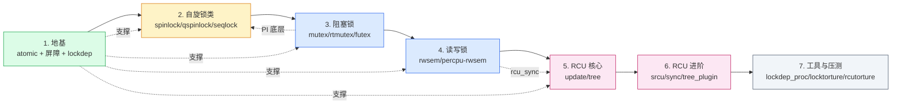

# 附录 B · 源码阅读路线与延伸

> 读完全书 18 章,你已经能在脑子里放映出多核同步的全过程:一次 `mutex_lock` 怎么走 fast path、一次 rwsem 乐观读为什么不会读到撕裂、一次 RCU 读端为什么零开销、宽限期怎么在 `rcu_node` 树上层层汇聚。但本书只是把你送到了"理解"这一站。下一站是"自己钻进源码,自己动手观测,自己把内核原语和用户态、和别的系统对上"。
>
> 这个附录就是**路标**:给你一张"读源码往哪走、读完往哪钻"的地图。它分四大块——
>
> 1. **源码阅读地图**:按"地基→自旋→阻塞→读写→RCU"的顺序,告诉你 `kernel/locking/` 和 `kernel/rcu/` 里**先读哪个文件、读哪几个函数、难点在哪**。
> 2. **观测工具**:怎么把锁竞争、RCU 宽限期、死锁**看在眼里**(`/proc/lock_stat`、`lockdep`、`/sys/kernel/debug/rcu/`、`rcutorture`、`perf lock`、`bpftrace`)。
> 3. **用户态对照**:`pthread_mutex`/`std::mutex`/`std::atomic`/Rust/Go 这些你天天用的东西,底下对应内核哪一层。
> 4. **跨系列互引 + 进阶读物**:本书和《Tokio》《Go runtime》《内存分配器》《Linux 调度器》怎么对读,以及 Paul McKenney 的 RCU 论文、`Documentation/RCU/`、内核邮件列表在哪。
>
> 一个诚实的边界:**本书本地源码只 sparse 解压了 `kernel/locking/` + `kernel/rcu/` + `include/linux/`**(Linux 6.9)。**`kernel/futex/`、`include/asm-generic/`、`arch/`、`Documentation/` 本地未解压**——这些部分本书一律标注"在线 6.9",你跟读时也请用在线源码(本书所有在线引用都给 raw 链接)。这不影响主线阅读,但读 futex 的双 fast path、读 `smp_mb` 的体系结构实现时,要去 elixir 上看。

---

## B.1 源码阅读地图

### 为什么需要一张地图

`kernel/locking/` 下 21 个 `.c`、`kernel/rcu/` 下 10 个 `.c`,加上一堆内部头(`mutex.h`、`tree.h`、`tree_plugin.h`)、一堆宏(`raw_spin_lock`、`LOCK_CONTENDED`、`__read_seqcount_begin`)、一堆体系结构相关代码(`asm/atomic.h`、`asm-generic/qspinlock.h`)。**直接按文件名啃,会陷在宏和 fallback 里出不来**。这张地图按"本书主线"(地基→自旋→阻塞→读写→RCU)给顺序,每个文件只点**最该读的函数**和**最容易卡住的难点**。

一句话原则:**先读 fast path,再读 slow path;先读数据结构(`struct`),再读操作函数;遇到宏,先展开再往下走**。

### 阅读顺序总览



实线箭头是**推荐阅读顺序**(有依赖),虚线是"那一块会用到这块"。下面按 7 个阶段展开。

### 阶段 1 · 地基(先读,不读后面全卡)

| 文件(本地路径) | 必读函数/符号 | 难点提示 |
|---|---|---|
| `include/linux/atomic/atomic-instrumented.h` | `atomic_read`、`atomic_set`、`atomic_cmpxchg`、`atomic_try_cmpxchg` | 这是**生成器输出**的文件(由 `atomic-arch-fallback.h` + 脚本生成),读起来满屏宏。建议:只看 `cmpxchg`/`try_cmpxchg` 系列签名,**别从头读到尾**;想知道 LL/SC vs CAS 的底层,跳到 `arch/`(本地未解压,看在线)。 |
| `include/linux/compiler.h` | `barrier()` @L85、`READ_ONCE`/`WRITE_ONCE` 宏 | 编译器屏障。难点:`READ_ONCE`/`WRITE_ONCE` 不是原子操作,是"阻止编译器把一次访问拆成多个/重排",用 `volatile` + `__unqualified_scalar` 实现。 |
| `include/asm-generic/barrier.h`(**本地未解压,引在线 6.9**) | `smp_mb`、`smp_rmb`、`smp_wmb`、`smp_store_release`、`smp_load_acquire` | 体系结构相关(本地 `asm-generic/` 未解压)。难点:`smp_mb` 在 x86 上是 `mfence`、在 ARM 上是 `dmb ish`——**屏障是给多核之间"排顺序"的,不是保证原子**。这是 P1-03 的命脉。 |
| `kernel/locking/lockdep.c` | `lock_acquire` @L5719、`lock_release` @L5761、`validate_chain` @L3822 | lockdep 是**运行时**的依赖图 + 死锁检测。难点:依赖图怎么用 `class_key`(不是锁实例)建边、IRQ 安全性怎么用 `usage` 位图(4 类上下文 × 2 方向)。 |
| `include/linux/lockdep_types.h` | `struct lock_class_key` @L75、`struct held_lock` @L205、`LOCKDEP`、`LOCK_STAT` 编译开关 | 数据结构。难点:`held_lock` 链成每任务"当前持锁栈",lockdep 靠遍历它做循环检测。 |

> **这一阶段的目标**:建立"原子操作 + 屏障 + lockdep 是支撑后面所有锁的地基"的直觉。读完你应该能回答:`i++` 为什么不是原子的?为什么 `smp_wmb` 配 `smp_rmb` 能保证消息传递?lockdep 怎么发现 AB-BA 死锁?

### 阶段 2 · 自旋锁类(等不到就自旋,或读者根本不阻塞)

| 文件(本地路径) | 必读函数/符号 | 难点提示 |
|---|---|---|
| `include/linux/spinlock.h` | `spin_lock` @L349(内联)、`spin_lock_irqsave` 宏 @L379、`spin_lock_bh` | 这是**所有 `spin_lock_*` 的入口**,宏展开后调用 `_raw_spin_*`。难点:`spin_lock` 在 PREEMPT 和非 PREEMPT 下行为不同(`preempt_disable` 是否真禁抢占);`irqsave` 的"保存-恢复 EFLAGS"为什么要存 flags。 |
| `include/linux/spinlock_types.h` | `raw_spinlock_t`、`spinlock_t`、`DEFINE_SPINLOCK` | `spinlock_t` 在非 RT 上就是 `raw_spinlock_t`,在 PREEMPT_RT 上会被换成 rtmutex。 |
| `kernel/locking/spinlock.c` | `_raw_spin_lock` @L152、`_raw_spin_lock_irqsave` @L160、`_raw_spin_lock_bh` @L176、`_raw_spin_unlock` @L184 | 这些是 `spin_lock_*` 宏的**慢路径落地**(实现在 PREEMPT 时走调度)。难点:`_raw_spin_lock_irqsave` 为什么要先 `local_irq_save` 再 `__raw_spin_lock_irqsave`——因为 IRQ 上下文不可睡眠,持锁期间被中断打断就死锁。 |
| `kernel/locking/qspinlock.c` | `queued_spin_lock_slowpath` @L316、文件头 MCS 论文注释 @L32-L46 | **本书最硬核的 MCS/qspinlock 实现**。难点:一个原子字里塞了 `locked`(1 bit)+ `pending`(1 bit)+ `tail`(16 bit CPU+idx)。slowpath 分三段:pending bit 乐观自旋、MCS 队列入队、队首自旋在本地 `mcs_spin_lock.locked` 上(消灭缓存行乒乓)。建议:边读边画一个"原子字布局图"和"MCS 节点链表图"。 |
| `include/asm-generic/qspinlock.h`(**本地未解压,引在线 6.9**) | `struct qspinlock`(位域布局)、`queued_spin_lock`/`queued_spin_unlock`/`queued_spin_trylock`(内联 fast path) | fast path:`queued_spin_lock` 是 `try_cmpxchg(lock, 0, _Q_LOCKED_VAL)`,命中直接返回。难点:位域 `struct qspinlock` 的字节序与小端假设。 |
| `include/linux/seqlock.h` | `__read_seqcount_begin` 宏 @L279、`read_seqbegin` @L770、`read_seqretry` @L790、`write_seqlock` @L820、`write_sequnlock` @L833 | **seqlock 全在头文件**(没单独 .c)。难点:读者用版本号奇偶重读(写前奇、写后偶),读者读到奇数说明写者正在写——重读。**为什么 sound**:读者最多多读几遍,但永远读到一致快照。 |
| `include/linux/seqlock_types.h` | `seqcount_t` @L33、`seqlock_t` @L84 | `seqcount_t` 是纯版本号(无锁保护),`seqlock_t` = `seqcount_t` + `spinlock_t`(写者用 spinlock 互斥)。 |
| `kernel/locking/osq_lock.c` | `osq_lock` @L93、`osq_unlock` @L210 | **乐观自旋队列**(Optimistic Spin Queue),被 mutex/rwsem 用。难点:每个 CPU 自旋在自己的 per-CPU `mcs_spin_lock.locked` 上,这是 MCS 思想的"乐观自旋变体"——持锁者在跑就排队等,持锁者睡了就也去睡。 |

> **这一阶段的目标**:理解"要么死等(spinlock/qspinlock),要么读者根本不阻塞(seqlock)"两条不阻塞路径。读完你应该能回答:MCS 队列为什么能消灭缓存行乒乓?seqlock 的奇偶版本号为什么能保证读者读到一致快照?

### 阶段 3 · 阻塞锁(等不到就睡,睡在 wait queue 上)

| 文件(本地路径) | 必读函数/符号 | 难点提示 |
|---|---|---|
| `include/linux/mutex_types.h` | `struct mutex` @L41、`atomic_long_t owner` @L42 | **owner 字段低位编码**是 mutex 的灵魂:低位塞 waiters/handoff 标志。难点:为什么不用单独的 `waiters` 字段?——为了 fast path 一次 `cmpxchg` 同时改 owner + waiters。 |
| `kernel/locking/mutex.h` | `struct mutex_waiter` @L14、`MUTEX_FLAGS` 宏 | wait queue 节点。难点:`mutex_waiter.task` 的 acquire/release 配对(和 rwsem 一样)。 |
| `kernel/locking/mutex.c` | `__mutex_trylock_fast` @L166(含 `cmpxchg_acquire` @L171)、`__mutex_unlock_fast` @L177、`__mutex_add_waiter` @L205、`mutex_optimistic_spin` @L440、`__mutex_lock_common` @L573、`mutex_lock` @L281、`mutex_unlock` @L542 | **本书最长的一个文件之一**。建议读顺序:`mutex_lock` → `__mutex_trylock_fast`(fast path)→ `__mutex_lock_common`(slow path)→ `mutex_optimistic_spin`(乐观自旋)→ `mutex_unlock`。难点:乐观自旋为什么 sound(持锁者在另一个 CPU 跑就再等等,睡了就也睡)、handoff 机制(等待太久直接把锁交给你,防饥饿)。 |
| `kernel/locking/rtmutex.c` | `task_blocks_on_rt_mutex` @L1200、`rt_mutex_adjust_prio_chain` @L675、`rt_mutex_adjust_prio` @L524 | **PI(优先级继承)链遍历**。难点:`rt_mutex_adjust_prio_chain` 是有限深度的 DFS(防环),沿锁等待图把最高优先级往上传。在 PREEMPT_RT 上,mutex/spinlock/rwsem 底层都是 rtmutex。 |
| `kernel/locking/rtmutex_api.c` | `rt_mutex_lock` @L69、`rt_mutex_unlock` @L138 | rtmutex 的导出 API。 |
| `kernel/futex/{core.c,pi.c,waitwake.c,requeue.c,futex.h}`(**本地未解压,引在线 6.9**) | `sys_futex`、`futex_wait`、`futex_wake`、`futex_q` 结构 | **futex 是用户态锁的内核半边**。难点:用户态先 `cmpxchg` 试(无竞争不进内核),失败才 `sys_futex(FUTEX_WAIT)` 进内核睡在 `futex_q` 上,挂在 per-hash-bucket 的 hash 桶。这是 P3-10 的核心,**本书本地源码无 futex,行号以在线 6.9 为准**。 |
| `kernel/locking/semaphore.c` | `down` @L54、`down_interruptible` @L77、`up` @L183、`__down` @L252、`__up` @L272 | 经典计数信号量(较老,少用)。难点:`up` 可在中断上下文调用(`mutex_unlock` 不行)。 |

> **这一阶段的目标**:理解"等不到就睡"的完整机制——fast path cmpxchg 抢、乐观自旋避免马上睡、真不行进 wait queue schedule 睡眠、unlock 唤醒。读完你应该能回答:mutex 的 owner 字段为什么要编码 waiters?PI 链怎么防优先级反转?futex 怎么做到无竞争不进内核?

### 阶段 4 · 读写锁(读者与读者不互斥)

| 文件(本地路径) | 必读函数/符号 | 难点提示 |
|---|---|---|
| `include/linux/rwsem.h` | `struct rw_semaphore` @L48(`count` @L49、`owner` @L55、`osq` @L57) | **rwsem 也是 owner 低位编码**:`RWSEM_READER_OWNED`/`RWSEM_NONSPINNABLE`。难点:count 是 `atomic_long_t`,负数=写者持有、正数=读者数。 |
| `kernel/locking/rwsem.c` | `rwsem_read_trylock` @L241、`rwsem_mark_wake` @L411、`rwsem_optimistic_spin` @L819、`rwsem_down_read_slowpath` @L996(`smp_load_acquire` @L1074)、`__up_read` @L1338、`down_read` @L1523、`down_write` @L1576、`up_read` @L1619、`up_write` @L1629 | **本书最绕的一个文件**(乐观读 + 乐观自旋 + A-D-S 手写)。建议读顺序:`down_read` → `rwsem_read_trylock`(fast path)→ `rwsem_down_read_slowpath`(@L1012-1032 乐观偷抢块、@L1072 for 循环、@L1074 `smp_load_acquire(&waiter.task)` 配对 `rwsem_mark_wake` 的 `smp_store_release`)。难点:**A-D-S 手写为什么 sound**——`smp_load_acquire`/`smp_store_release` 配对保证读者看到的 `waiter.task` 不撕裂。 |
| `include/linux/percpu-rwsem.h` | `struct percpu_rw_semaphore` @L12、`percpu_down_read` @L47(内联)、`percpu_up_read` @L97(内联) | 数据结构 + 内联 fast path。 |
| `kernel/locking/percpu-rwsem.c` | `__percpu_down_read_trylock` @L48(含 `this_cpu_inc(*sem->read_count)` @L50)、`__percpu_down_read` @L167、`percpu_down_write` @L224(含 `rcu_sync_enter` @L232) | **per-cpu 计数器换读者零争用**。难点:读者只 `this_cpu_inc` 本地计数(零 cache line 乒乓),写者要重得多——`rcu_sync_enter` 切换 + `synchronize_rcu` 等所有读者退到慢路径。 |

> **这一阶段的目标**:理解"读者快路径零争用"的两条路——rwsem 用乐观读 + A-D-S 手写、percpu-rwsem 用 per-cpu 计数器。读完你应该能回答:rwsem 乐观读为什么不会读到撕裂数据?percpu-rwsem 读者为什么零争用,写者为什么这么重?

### 阶段 5 · RCU 核心(读者零开销的终极解,全书重头戏)

| 文件(本地路径) | 必读函数/符号 | 难点提示 |
|---|---|---|
| `include/linux/rcupdate.h` | `rcu_read_lock` @L777(`static __always_inline`)、`rcu_read_unlock` @L808、`rcu_lock_acquire` @L327、`__rcu_read_lock` @L90 | **`rcu_read_lock` 只是内联 + 增 preempt 计数**,不取锁、不原子、不缓存行乒乓——这是 RCU 读者零开销的根。难点:不同构建(`CONFIG_PREEMPTION`)下 `__rcu_read_lock` 实现不同(关抢占 vs 关迁移)。 |
| `kernel/rcu/update.c` | `init_rcu_head` @L458、`rcu_barrier`、polled RCU API | RCU 的杂项入口 + 早期 SRCU。 |
| `kernel/rcu/tree.c` | `call_rcu` @L2836、`synchronize_rcu` @L3600、`rcu_gp_init` @L1428、`rcu_gp_kthread` @L1836、`rcu_gp_cleanup` @L1718、`rcu_sched_clock_irq` @L2275(6.9 改名)、`rcu_report_qs_rdp` @L2009、`rcu_report_qs_rnp` @L146/L1905、`rcu_do_batch` @L2119 | **本书最大的一个文件**(~3700 行)。建议读顺序:`synchronize_rcu`(等宽限期)→ `call_rcu`(异步注册回调)→ `rcu_gp_kthread`(GP 主循环)→ `rcu_gp_init`/`rcu_gp_cleanup`→ `rcu_sched_clock_irq`(tick 钩子检测静默态)→ `rcu_report_qs_rdp`/`rcu_report_qs_rnp`(报告上传)→ `rcu_do_batch`(宽限期后批量回调)。难点:GP 状态机(`RCU_GP_IDLE`/`RCU_GP_INIT`/`RCU_GP_CLEANUP`)驱动整个流程;静默态检测靠 tick 钩子发现"CPU 不在 RCU 临界区"。 |
| `kernel/rcu/tree.h` | `struct rcu_node` @L41、`struct rcu_data` @L178、`struct rcu_state` @L328、GP 状态宏 @L411-419 | **RCU 的核心数据结构**。难点:`rcu_node` 是层级树的节点(叶子管若干 CPU,中间聚合,根定 GP 完成);`rcu_data` 是 per-CPU;`rcu_state` 是全局。读这文件前先画一棵树。 |

> **这一阶段的目标**:理解 RCU 读者凭什么零开销、宽限期到底在等什么、tree RCU 怎么扩展到上千核。读完你应该能回答:`rcu_read_lock` 为什么不用任何原子操作?宽限期结束的充要条件是什么?`rcu_node` 树为什么能避免根节点成锁瓶颈?

### 阶段 6 · RCU 进阶(可睡眠读者 + 轻量原语家族)

| 文件(本地路径) | 必读函数/符号 | 难点提示 |
|---|---|---|
| `kernel/rcu/srcutree.c` | `__srcu_read_lock` @L712、`__srcu_read_unlock` @L728、`srcu_funnel_gp_start` @L989 | **Sleepable RCU**:读者可以睡眠。难点:**双计数槽**(`srcu_idx` 在 0/1 间切换)——新读者进新槽,等老槽计数清零就是宽限期。`srcu_funnel_gp_start` 是 srcu 的 GP 启动(和 tree.c 的 `rcu_gp_init` 对应)。 |
| `include/linux/srcu.h` | `struct srcu_struct`、`srcu_read_lock`、`srcu_read_unlock` | srcu 的对外 API(内联 + 调 `__srcu_*`)。 |
| `kernel/rcu/sync.c` | `rcu_sync_init` @L21、`rcu_sync_enter` @L105、`rcu_sync_exit` @L152、`rcu_sync_func`(GP 回调) | **基于 RCU 的轻量同步原语**,被 percpu-rwsem 用。难点:`rcu_sync` 用一个状态机 + 一次 GP 完成读者快/慢路径切换,避免每次 `percpu_down_write` 都 `synchronize_rcu`。 |
| `kernel/rcu/tree_plugin.h` | RCU 的各种"插件"(RCU-tasks、NOCB_OFFLOAD、stall 检测等) | 这是**包含大量 `#ifdef` 的扩展机制**。难点:`tree_plugin.h` 不是单独编译单元,是 `#include` 进 `tree.c` 的(把可选功能拆出去)。Tasks Trace RCU(用于 Tracing)在这里。 |

> **这一阶段的目标**:理解 RCU 家族的变种——srcu 让读者可睡、rcu_sync 让 percpu-rwsem 的写者更轻、Tasks Trace RCU 收窄读者范围。读完你应该能回答:srcu 为什么需要两个计数槽?rcu_sync 怎么省下重复的 `synchronize_rcu`?

### 阶段 7 · 工具与压测(读累了,看它们怎么被验证)

| 文件(本地路径) | 必读函数/符号 | 难点提示 |
|---|---|---|
| `kernel/locking/lockdep.c`(已读)+ `kernel/locking/lockdep_proc.c` | `lockdep_stats_show`、`/proc/lockdep` 输出 | lockdep 的 proc 接口,读它理解 `/proc/lockdep`/`/proc/lockdep_chains`/`/proc/lockdep_stats` 输出怎么来。 |
| `kernel/locking/lock_events.c` | `lockevent_*` 计数 | qspinlock/mutex/rwsem 的快速路径命中统计(`/sys/kernel/debug/qspinlock` 等),读它理解"乐观自旋命中率"怎么测。 |
| `kernel/locking/locktorture.c` | `lock_torture_*` | **锁的压力测试模块**(模块加载后持续打锁)。难点:它怎么验证正确性(用统计计数 + 周期校验)。 |
| `kernel/rcu/rcutorture.c` | `rcu_*torture_*`、`rcu_torture_writer`、`rcu_torture_reader` | **RCU 的旗舰压测模块**,几百个读者/写者并发,验证宽限期正确性 + 读者看到的数据一致性。难点:它怎么在并发下验证"读者不会看到已释放的内存"。 |
| `kernel/rcu/rcuscale.c`、`kernel/rcu/refscale.c` | `rcuscale_*`、`refscale_*` | RCU 性能/可扩展性基准(测 `synchronize_rcu` 延迟、读者吞吐)。 |

> **这一阶段可选**——你已经能把锁/RCU 的实现和它们的验证/压测对上,可以自己动手跑(见 B.2)。

### 诚实标注:本地未解压的部分

本书本地 sparse 只解压了 `kernel/locking/` + `kernel/rcu/` + `include/linux/`(Linux 6.9)。下列部分**本地没有,跟读时用在线源码**(elixir/bootlin 或 GitHub torvalds/linux tag v6.9):

| 缺失目录 | 涉及本书内容 | 在线阅读建议 |
|---|---|---|
| `kernel/futex/` | P3-10 futex 双 fast path(`core.c`/`pi.c`/`waitwake.c`/`requeue.c`) | elixir.bootlin.com/linux/v6.9/source/kernel/futex |
| `include/asm-generic/barrier.h` | P1-03 `smp_mb`/`smp_rmb`/`smp_wmb`/`smp_store_release`/`smp_load_acquire` 定义 | elixir.bootlin.com/linux/v6.9/source/include/asm-generic/barrier.h |
| `include/asm-generic/qspinlock.h` | P2-05 `struct qspinlock` 位域 + `queued_spin_lock`/`unlock`/`trylock` 内联 | elixir.bootlin.com/linux/v6.9/source/include/asm-generic/qspinlock.h |
| `arch/x86/include/asm/atomic.h` 等 | P1-02 原子操作的体系结构实现(LL/SC vs CAS、`cmpxchg` 指令) | elixir.bootlin.com/linux/v6.9/source/arch/x86/include/asm/atomic.h |
| `Documentation/locking/`、`Documentation/RCU/` | 进阶读物(见 B.4) |elixir.bootlin.com/linux/v6.9/source/Documentation/RCU |

> 一个提醒:在线引用看版本号——本书统一 **6.9**,内核同步原语在 6.x 间仍有演进(6.7 拆 futex、`rcu_check_callbacks` 改名 `rcu_sched_clock_irq`、`rcu_sched_state` 合并为 `rcu_state`)。**别拿 5.x 的博客行号对 6.9 的源码,会全错位**。

---

## B.2 观测工具:把锁竞争和宽限期看在眼里

读完源码是"知道它怎么工作",真要信,得**动手观测**。Linux 给了一整套把锁/RCU 内部状态暴露出来的接口。下表把它们钉在一起,并标了对应本书哪一章。

### 工具速查表

| 工具 | 看什么 | 怎么用 | 对应本书章节 |
|---|---|---|---|
| **`/proc/lock_stat`** | 锁竞争统计:每把锁的争用次数、等待时间、持有时间、`<contention>`、`<waittime-total>` | `cat /proc/lock_stat`;启用 `echo 1 > /proc/sys/kernel/lock_stat` | P2-05(spinlock 竞争)、P3-08(mutex 慢路径) |
| **`/proc/lockdep`、`/proc/lockdep_chains`、`/proc/lockdep_stats`** | lockdep 运行时状态:已观察的锁类、依赖链、统计 | `cat /proc/lockdep_chains`;内核编译带 `CONFIG_LOCKDEP=y` | P1-04 lockdep |
| **`/sys/kernel/debug/qspinlock`、`/sys/kernel/debug/mutex`、`/sys/kernel/debug/rwsem`(若启用 `CONFIG_LOCK_EVENTS`)** | fast/slow path 命中率:`lock_pending`、`lock_slowpath`、`opt_lock_slow` | `cat /sys/kernel/debug/qspinlock` | P2-05、P3-08、P4-11 |
| **`/sys/kernel/debug/rcu/rcudata`** | 每个 CPU 的 RCU 状态:`qlen`(回调队列长度)、`gp_seq`(当前 GP 序号)、`cpu_no_qs`(还没静默) | `cat /sys/kernel/debug/rcu/rcudata`;`CONFIG_RCU_TRACE=y` | P5-13~P5-15 |
| **`/sys/kernel/debug/rcu/rcugp`** | 当前/上一个宽限期序号 + 状态 | `cat /sys/kernel/debug/rcu/rcugp` | P5-14 |
| **`/sys/kernel/debug/rcu/rcuhier`** | `rcu_node` 树的层级视图(`qsmask`/`grplo`/`grphi`) | `cat /sys/kernel/debug/rcu/rcuhier` | P5-15 tree RCU |
| **`/sys/kernel/debug/rcu/hierarchical_stats`、`srcu*`** | srcu 计数槽状态、读者计数 | `cat /sys/kernel/debug/rcu/srcudata` | P5-16 srcu |
| **`rcutorture` 模块** | RCU 压力测试(并发读者/写者,验证宽限期正确性) | `modprobe rcutorture nreaders=16 nwriters=4`;`dmesg` 看结果 | P5 全篇 |
| **`locktorture` 模块** | 锁压力测试(spinlock/mutex/rwsem 并发打锁) | `modprobe locktorture`torture_type=spin_lock`;`dmesg` | P2~P4 |
| **`perf lock`** | 锁性能剖析(基于 lockdep,统计每把锁的等/持时间) | `perf lock record ./your_app`;`perf lock report` | 全书 |
| **`perf sched`** | 调度剖析(看 mutex 慢路径的 `schedule()` 睡眠唤醒延迟) | `perf sched record`;`perf sched latency` | P3-08、P3-09 |
| **`bpftrace`/`bcc`** | 追踪任意内核函数(如 `queued_spin_lock_slowpath`、`__mutex_lock_slowpath`、`rcu_gp_kthread`) | `bpftrace -e 'kprobe:queued_spin_lock_slowpath { @[comm] = count(); }'` | 全书 |
| **`ftrace`(`/sys/kernel/debug/tracing/`)** | 函数级追踪(看一次 `mutex_lock` 调用了哪些子函数) | `echo function > current_tracer`;`echo mutex_lock > set_ftrace_filter` | 全书 |
| **`/sys/kernel/debug/tracing/events/lock/`** | lockdep 事件(`contention_begin`/`contention_end`) | `echo 1 > /sys/kernel/debug/tracing/events/lock/lock_contention_begin/enable` | P1-04、P2-05 |
| **RCU stall warning(`dmesg`)** | RCU 宽限期超时(>60s 未结束)的告警 + 栈 | `dmesg | grep "RCU detected stall"`;触发:故意在 `rcu_read_lock` 里睡 | P5-14(宽限期不结束的诊断) |

### 怎么用:三个典型场景

**场景 1:怀疑某把 spinlock 成瓶颈**

```bash
# 1. 开启 lock_stat
echo 1 > /proc/sys/kernel/lock_stat
# 跑你的负载
# 2. 看哪把锁竞争最重(按 con+bounces 列排序)
cat /proc/lock_stat | head -20
# 3. 用 bpftrace 看是 fast path 还是 slow path
bpftrace -e 'kprobe:queued_spin_lock_slowpath { @[comm, kstack(3)] = count(); } interval:s:5 { print(@); clear(@); }'
```

如果看到某把锁 `slowpath` 命中多,基本就是 cache line 乒乓——这时候该考虑 seqlock/per-cpu/RCU(P2-06/P4-12/P5-13)。

**场景 2:看一次宽限期的完整旅程**

```bash
# 1. 看 rcu_node 树结构
cat /sys/kernel/debug/rcu/rcuhier
# 2. 触发一次 synchronize_rcu(写个小模块,或用 sysrq)
# 3. 看 GP 序号变化 + 每个 CPU 的回调队列
watch -n 0.5 'cat /sys/kernel/debug/rcu/rcugp; cat /sys/kernel/debug/rcu/rcudata | head'
# 4. 用 bpftrace 追踪 GP 主循环
bpftrace -e 'kprobe:rcu_gp_init { time("GP init\n"); } kprobe:rcu_gp_cleanup { time("GP cleanup\n"); } kprobe:rcu_do_batch { @ = count(); }'
```

**场景 3:诊断 RCU stall(宽限期不结束)**

```bash
# dmesg 会出现:
# INFO: task ... blocked for more than 120 seconds.
# RCU_GPV_kthread R0 g1234 f0x0 ... ->state: ...
# 这意味着某个 CPU 卡在 RCU 临界区(没经过静默态)
# 看栈:哪个函数在 rcu_read_lock 里睡眠/死循环了
dmesg | grep -A 30 "RCU detected stall"
```

stall 是 RCU 调试最常见的坑——**`rcu_read_lock` 里绝不能睡眠**(P5-13)。看到 stall,八成是有人在 RCU 临界区里调了 `schedule()`/`mutex_lock`/`copy_from_user`(可能睡眠)。

> 一个提醒:`/proc/lock_stat`、lockdep、`CONFIG_LOCK_EVENTS` 本身**有性能开销**(锁统计可能让吞吐掉 5%~30%),生产环境只开诊断窗口,别常开。

---

## B.3 用户态对照:你天天用的锁,底下对应内核哪一层

锁与无锁不是内核独有。你天天写的 `pthread_mutex`、`std::mutex`、`std::atomic`、Rust `Mutex`、Go `sync.Mutex`,底下都和本书讲的内核原语同源。下表把它们钉在一起。

### 用户态 ↔ 内核原语对照表

| 用户态 | 底层机制 | 对应内核原语 | 对应本书章节 |
|---|---|---|---|
| `pthread_mutex_lock`(glibc,PTHREAD_MUTEX_NORMAL) | 无竞争:`cmpxchg` 在用户态抢;争用:`futex(FUTEX_WAIT)` 睡眠 | mutex(用户态 cmpxchg)+ futex | P3-08 + P3-10 |
| `pthread_mutex_lock`(PTHREAD_MUTEX_PI) | PI futex:`FUTEX_LOCK_PI` 触发内核 rtmutex PI 链 | rtmutex + PI futex | P3-09 + P3-10 |
| `pthread_spin_lock` | 纯用户态自旋(`cmpxchg` 死等),不进内核 | spinlock(用户态实现) | P2-05 |
| `pthread_rwlock_rdlock` | 读者计数 + 写者标志(用户态 cmpxchg),争用 futex | rwsem(用户态版) | P4-11 |
| `std::mutex`(C++) | 封装 `pthread_mutex` 或直接 futex | 同 pthread_mutex | P3-08 + P3-10 |
| `std::atomic<T>::compare_exchange_weak/strong` | 映射到 `cmpxchg` 指令(无内核介入) | `atomic_t` + `cmpxchg` | P1-02 |
| `std::atomic<T>::load/store`(memory_order_acquire/release) | 映射到 `smp_load_acquire`/`smp_store_release` 或更弱的屏障 | 内存屏障 | P1-03 |
| `std::shared_mutex`(C++17) | 多读者单写者,读者计数 + 写者标志 | rwsem | P4-11 |
| Rust `std::sync::atomic::AtomicUsize` | 映射到 `cmpxchg`/`fetch_add` 指令 | `atomic_t` + `cmpxchg` | P1-02 |
| Rust `std::sync::atomic::fence(Ordering::SeqCst)` | 映射到 `smp_mb` | `smp_mb` | P1-03 |
| Rust `std::sync::Mutex` | 无竞争:用户态 fast path;争用:走 `futex`(Linux) | mutex + futex | P3-08 + P3-10 |
| Rust `std::sync::RwLock` | 读者计数 + 写者标志,争用 futex | rwsem | P4-11 |
| Go `sync.Mutex` | fast path:`atomic.CompareAndSwapInt32`;慢路径:`semacquire` 睡在 `sync.Sema` 上 | mutex(用户态 cmpxchg)+ 类 futex | P3-08 |
| Go `sync.RWMutex` | 读者计数 + 写者等待位,争用 `semacquire` | rwsem | P4-11 |
| Go `sync/atomic.AddInt32`/`CompareAndSwapInt32` | 映射到原子指令 | `atomic_t` + `cmpxchg` | P1-02 |
| Go `channel`(无缓冲) | `hchan` 用一把 mutex 保护 + `sendq`/`recvq` 等待队列(类似 wait queue) | mutex + wait queue | P3-08 |
| Java `synchronized`/`ReentrantLock` | JVM 偏向锁→轻量级锁→重量级锁(走 futex) | mutex + futex | P3-08 + P3-10 |
| Java `AtomicInteger.compareAndSet` | JNI 映射到 `cmpxchg` | `atomic_t` + `cmpxchg` | P1-02 |
| `futex(2)` 系统调用手册(`man 2 futex`) | 直接接口 | futex | P3-10 |

### 三个关键对照

**1. fast path 一致:从内核 mutex 到 Go `sync.Mutex`**

本书 P3-08 讲内核 `mutex_lock` 的 fast path 是 `cmpxchg_acquire(&lock->owner, 0, curr)`(mutex.c#L171)。Go 的 `sync.Mutex.Lock()` 几乎是同款——`atomic.CompareAndSwapInt32(&m.state, 0, mutexLocked)`。**思想完全同源**:无竞争时一次原子指令搞定,失败才进慢路径(内核进 wait queue + schedule;Go 进 `semacquire` 睡在信号量上)。差别只在"慢路径睡在哪":内核睡在内核 wait queue,Go 睡在 runtime 的 `sema` 表(底层在 Linux 上还是 futex)。

**2. A-D-S 手写:从 rwsem 乐观读到 std::atomic**

本书 P4-11 讲 rwsem 读者慢路径用 `smp_load_acquire(&waiter.task)` 配对唤醒者的 `smp_store_release`,保证读者看到的等待状态不撕裂。C++ `std::atomic<T>::load(memory_order_acquire)` 和 `store(memory_order_release)` 是**同一对原语的用户态版**——只要你在共享内存上做"flag + data"的消息传递,就该用这对。本书 P1-03 给的反例(Store Buffer 重排导致读到新 data 但旧 flag)在用户态同样会炸。

**3. RCU 的"读者零开销"在用户态的近亲**

RCU 的精髓是"读者完全不取锁,只关抢占/禁迁移,代价是写者延迟回收"。用户态没有"关抢占",但有**近亲**:

- **Rust 的 `Arc` + `epoch-based reclamation`**(Crossbeam):读者拿一个 epoch 计数(类似 RCU 的宽限期),写者等所有读者离开当前 epoch 才回收——**思想几乎和 RCU 同源**。
- **Tokio 的 `Pin`**:`Pin<P>` 保证被指向的内存不会被 move/释放,读者可以安全地持有 `&Pin<&T>`——和 RCU"读者拿快照指针,写者不动老的"是同一种契约(用"不搬走"换无锁)。这是为什么本书 P5-13/P6-18 反复对照 Tokio。

> 想深挖用户态锁的实现,两条路:① 读 glibc `nptl/pthread_mutex_lock.c`(它直接调 `lll_lock`→`futex`);② 读 Go `src/runtime/sync_mutex.go` 和 `src/runtime/sema.go`(Go runtime 怎么实现信号量睡眠)。本书附录 B 不展开,但这是从内核往用户态延伸的自然下一步。

---

## B.4 跨系列互引 + 进阶读物

### 和本系列其他书的对照点

本书的核心特色是"★ 对照多本"——锁与无锁绝非内核独有。下面给每本对照书的"对读入口",想深入对照时往这钻。

| 对照书 | 共同思想 | 本书对照章 | 想深入往哪钻 |
|---|---|---|---|
| **《Tokio 设计与实现深入浅出》** | 用"契约"换无锁:`Pin` 不搬内存 ≈ RCU 读者拿快照指针;`mpsc`/Crossbeam 无锁队列 ≈ qspinlock 的 MCS 思想;`AtomicWaker` ≈ futex 唤醒 | P1-02(cmpxchg)、P3-08(乐观自旋)、P5-13(RCU 读者零开销)、P6-18(总表) | 读 Tokio 的 `mpsc.rs`(无锁队列)、`AtomicWaker.rs`(唤醒)、`Pin` 章节 |
| **《Go runtime 设计与实现深入浅出》** | fast/slow path 分层:`sync.Mutex` fast path cmpxchg + 慢路径 sema 睡眠,和内核 mutex 同款;channel = mutex + wait queue | P3-08(mutex)、P3-10(futex)、P6-18(总表) | 读 Go `src/runtime/sync_mutex.go`、`sema.go`、`chan.go` |
| **《内存分配器设计与实现深入浅出》** | per-CPU cache:`thread_local`/per-CPU 链表消灭竞争,和 percpu-rwsem/per-cpu 计数器同源 | P4-12(percpu-rwsem)、P6-18(总表) | 读 tcmalloc 的 `ThreadCache`、jemalloc 的 `tcache`、mimalloc 的 per-CPU |
| **《Linux 调度器设计与实现深入浅出》** | rq->lock 是 spinlock、preempt_count、TIF_NEED_RESCHED 延迟抢占;mutex 慢路径 `schedule()` 走调度器 | P2-05(spinlock)、P2-07(irqsave)、P3-08(mutex schedule)、P6-18(总表) | 读调度器的 `rq->lock`、`try_to_take_task`、`__schedule` |

**对读方法**:把同一段并发场景在两本书里对着读。比如"两个线程抢一个共享变量",在本书是 `spin_lock`/`mutex_lock`,在 Go 书是 `sync.Mutex.Lock()`,在 Tokio 书是 `mpsc` 发消息——你会看到**同一组底层原语**(cmpxchg/屏障/wait queue)在不同语言/不同抽象层复现。

### 进阶读物

#### 内核文档(`Documentation/`,本地未解压,引在线 6.9)

| 路径 | 内容 |
|---|---|
| `Documentation/RCU/`(在线 6.9) | RCU 官方文档集,几十篇 .rst:从 `rcu.rst`(RCU 概念入门)到 `Design/Memory-Ordering.txt`(RCU 的内存序陷阱)、`Data-Structures.txt`(rcu_node 树详解)、`checklist.rst`(RCU 使用 checklist) |
| `Documentation/locking/(在线 6.9)` | 锁相关文档:`lockdep-design.rst`(lockdep 内部)、`lockstat.rst`(`/proc/lock_stat` 说明)、`spinlocks.rst`(spinlock 使用) |
| `Documentation/core-api/wrappers/atomic_t.rst`、`memory-barriers.txt`(在线 6.9) | 原子操作和内存屏障的官方说明,**`memory-barriers.txt` 是必读**(几百页,讲清所有屏障语义) |

在线链接:`https://elixir.bootlin.com/linux/v6.9/source/Documentation/RCU`(本书统一 6.9)。

#### Paul McKenney 的 RCU 著作(必读)

RCU 的主要设计者,他的书和论文是 RCU 的权威:

| 资料 | 价值 |
|---|---|
| **《Is Parallel Programming Hard, And, If So, What Can You Do About It?》**(Paul McKenney,免费 PDF) | 并行编程通论,讲 RCU 的来龙去脉(从硬件到 API)。第 9-12 章专讲 RCU。**RCU 入门最佳读物**。 |
| **《A Tour Through RCU: A RCU Processing Cycle》**(USENIX ;login:,2017) | 一次宽限期的端到端旅程,和本书 P5-14 互补(更细节、更偏硬件)。 |
| **《Structured Parallel Programming》**(McKenney 系列论文) | RCU 的设计哲学——"读者零开销"的代价和适用场景。 |
| **RCU 论文集**(google "Paul McKenney RCU papers") | 数十篇:从 1998 最初的 RCU 论文到 tree RCU、srcu、Tasks Trace RCU。 |

#### 其他经典

| 资料 | 价值 |
|---|---|
| **MCS 论文**("Algorithms for Scalable Synchronization on Shared-Memory Multiprocessors",Mellor-Crummey & Scott,1991) | MCS 队列锁原论文,qspinlock 的祖先。`qspinlock.c` 文件头 @L35 就引了它。 |
| **《The Art of Multiprocessor Programming》**(Maurice Herlihy & Nir Shavit) | 并发编程教材,讲 spinlock/seqlock/RCU 的算法层(不绑 Linux)。 |
| **Linux 内核邮件列表**(LKML,lore.kernel.org) | 同步原语的演进辩论都在这。搜 "qspinlock"、"rcu"、"PREEMPT_RT" 能看到几十年讨论。 |
| **`tools/memory-model/`(在线 6.9)** | Linux 内存模型(LKMM)的形式化定义 + `litmus` 测试工具,验证内存序语义。**想钻"为什么这个屏障 sound"的终极答案在这**。 |

#### 社区与持续追踪

- **Paul McKenney 的博客**(paulmck.livejournal.com):RCU 的最新进展、stall 案例、性能调优。
- **LKML 的 `linux-rt-users`、`rcu` 邮件列表**:PREEMPT_RT 和 RCU 的讨论。
- **kernel.org 的 commit log**:跟踪 6.x → 7.x 同步原语的演进(本书定 6.9,后续会有改名/重构)。

---

## 一句话收尾

这本书讲的不是"Linux 锁怎么用",而是"内核同步原语凭什么这么设计、`kernel/locking/*.c`/`kernel/rcu/tree.c` 里那些 cmpxchg fast path、MCS 队列、A-D-S 手写、rcu_node 树到底在干什么、为什么 sound"。读完正文,你已经能在脑子里放映出多核同步的全过程。**这个附录是路标——往源码钻、往工具钻、往用户态钻、往论文钻**。下一步往哪走,看你的兴趣:

- 想**把实现抠到底**:按 B.1 的顺序啃 `kernel/locking/qspinlock.c` + `kernel/rcu/tree.c`,配 B.4 的 McKenney 书。
- 想**动手观测**:按 B.2 在你的机器上开 `/proc/lock_stat` + `rcutorture` + bpftrace。
- 想**和用户态对上**:按 B.3 读 glibc `nptl` + Go runtime `sync_mutex.go`。
- 想**看跨语言同源**:按 B.4 把本书和《Tokio》《Go runtime》《内存分配器》对着读。

锁与无锁,复杂度守恒——它不消灭,只从"易出错的手写"转移到"sound 的原语"。读完本书 + 这个附录,你应该既看得懂原语的精妙,也看得懂它们把复杂度收到了哪里。
