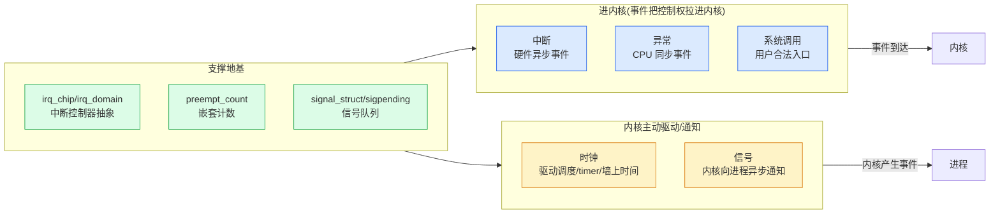

# 第一章 · 第一性原理:为什么内核要管中断与系统调用

> 篇:P0 开篇
> 主线呼应:这一章是全书的**总览与定调**。你写一个用户态程序,`read()` 一调,控制权就跳进内核;你敲一下键盘,CPU 立刻被打断冲进内核;你设的 `setitimer` 到点,内核会主动把你叫醒;别人 `kill` 你,你的进程迟早会被迫停下当前工作处理这个"信件"。**中断、系统调用、时钟、信号**——这四个机制,都是**事件跨越用户态/内核态边界**的瞬间,合起来构成内核的**事件驱动骨架**。为什么内核必须管这些?因为用户/内核边界是操作系统的命脉,而事件驱动是 CPU 不被白白烧掉的前提。读懂这一章,你就拿到了全书剩余 20 章的钥匙:中断怎么把 CPU 拉进内核、系统调用怎么合法进、时钟怎么主动驱动调度与定时、信号怎么通知进程。

## 核心问题

**用户态和内核态明明跑在同一个 CPU 上,为什么要划一条边界?事件(网卡收到包、用户敲键盘、定时器到点、别人发信号)凭什么要把控制权拉进内核?这四个机制合起来构成什么?内核非管不可的本质约束是什么?**

读完本章你会明白:

1. 用户/内核边界是 OS 的命脉:**特权级隔离**让用户进程不能直接碰硬件、不能破坏其他进程。
2. **事件驱动 vs 轮询**的本质权衡:轮询浪费 CPU,事件驱动需要 CPU 能被打断——这就是中断存在的根本理由。
3. **进内核 vs 内核主动**:中断/异常/系统调用是"把控制权拉进内核",时钟/信号是"内核主动驱动/通知",这是全书的二分法。
4. 四个机制的全貌:**中断**(外部异步事件)、**系统调用**(用户合法入口)、**时钟**(内核主动驱动心跳)、**信号**(内核向进程的异步通知)。
5. ★ 对照:中断↔io_uring 完成事件、时钟↔Tokio 时间轮、信号↔Go channel/panic、系统调用↔Go runtime systrap——内核的事件模型和用户态运行时拼起来才是完整图景。

> **逃生阀**:如果你已经熟悉 ring 0/ring 3、IDT、`SYSCALL` 指令这些词,可以直接跳到 1.5 节(全书二分法)和 1.7 节(★对照)。但 1.2~1.4 的"为什么"推导,即使你懂术语也建议读,因为本书后面所有章节都在这套"为什么"上展开。

---

## 1.1 一句话点破

> **内核必须管中断和系统调用,是因为用户/内核之间有条特权边界——用户进程不能直接碰硬件、不能直接看其他进程,所以"事件来了"必须由内核接管处理、"用户要用硬件"必须走内核这道合法入口。中断是被拉进内核,系统调用是合法进内核,时钟和信号则是内核主动向外驱动。这四个机制合起来,就是内核的"事件驱动骨架"。**

这是结论,不是理由。本章倒过来拆:先看用户/内核边界为什么存在,再看"事件驱动 vs 轮询"的本质权衡,然后看四个机制各自的角色,最后立起全书二分法和 ★对照。

---

## 1.2 用户/内核边界:操作系统的命脉

打开任何一个 Linux 进程的 `/proc/<pid>/status`,你会看到 `Uid`、`Gid` 这些字段,但**没有**"你直接读硬盘第 N 个扇区"的权限。一个普通用户进程不能:

- 直接读写硬盘、网卡、显卡的硬件端口(`in`/`out` 指令)。
- 直接看另一个进程的内存。
- 直接修改页表、设置中断处理函数。
- 直接停 CPU、改时钟频率。

为什么不让?**因为如果没有这条边界,一个有 bug 的程序(或恶意程序)能搞挂整台机器**。x86 CPU 提供硬件支撑:它把执行状态分成几个**特权级**(ring),Linux 用了两个:ring 0(内核态,什么都行)和 ring 3(用户态,被限制)。用户进程跑在 ring 3,内核跑在 ring 0。

> **不这样会怎样**:如果没有特权级隔离,DOS 时代那样任意程序都能直接写硬件端口,一个程序写错显卡寄存器能让屏幕乱码,一个病毒能直接改硬盘分区表把整盘数据抹掉。多任务根本无从谈起——一个进程能改另一个进程的内存,"隔离"就成空话。所以**用户/内核边界是命脉**:用户进程想干任何"碰硬件/碰全局资源"的事,必须**委托内核代劳**。

那用户进程怎么委托?**通过系统调用**。系统调用是用户态**合法进入**内核的唯一入口(`SYSCALL` 指令,第 8 章详讲)。用户态一旦执行 `SYSCALL`,CPU 立刻切到 ring 0,跳到内核预设的入口函数(`do_syscall_64`),内核检查参数、代你办事、再切回 ring 3。这是**主动进**——用户主动让出 CPU 给内核。

但很多事件不是用户主动发起的:**网卡收到一个包、用户敲了一下键盘、定时器到点了、另一个进程 `kill` 你了**——这些事件需要 CPU **被打断**、立刻去处理。这就是**中断**:CPU 正在跑用户进程,被一个硬件信号(或软件条件)打断,自动跳进内核预设的处理函数;内核处理完再回来。这是**被动进**。

> **钉死这件事**:用户/内核边界(privilege boundary)决定了三件事:① 用户进程碰硬件必须**委托内核**(系统调用);② 外部事件必须由**内核接管**(中断);③ 内核要主动驱动/通知进程,也只能在它**返回用户态那一刻**生效(时钟/信号)。本书的四个机制,都是围绕这条边界的"跨越"。

---

## 1.3 事件驱动 vs 轮询:为什么必须有中断

那为什么不让 CPU 不停地"主动去看"事件有没有来?比如让 CPU 每秒一百万次去查网卡有没有包、键盘有没有按下、定时器到没到点?这叫**轮询(polling)**。

轮询的代价巨大:

- **CPU 永远闲不下来**:就算没有任何事件,CPU 也得不停查——空转烧电、占着 CPU 别的程序跑不动。
- **延迟和效率的死结**:查得勤(高频率),CPU 几乎全在查上,业务跑不动;查得松(低频率),事件响应慢,网卡包可能因为来不及取而丢掉。
- **多设备协调难**:CPU 怎么知道该先查网卡还是先查键盘?挨个查一遍,慢;查的过程中新事件又来了,更慢。

更好的办法是**事件驱动(event-driven)**:让事件**自己**来通知 CPU。CPU 平时专心跑业务,事件来了,**硬件发个信号**给 CPU,CPU 立刻被打断、跳到预设的处理函数;处理完再回来。这个"硬件信号"就是**中断(interrupt)**。

```
 轮询 vs 事件驱动(简化):

  轮询:    CPU 一直问"有没有?有没有?有没有?..."
           ┃查┃查┃查┃查┃查┃查┃查┃查┃查┃
                              ↑ 大量 CPU 时间浪费在"查"上

  事件驱动: CPU 专心跑业务,事件来了才被打断
           ┃业务┃业务┃业务┃ ↘ 网卡中断 ┃处理┃业务┃业务┃
                                ↑
                          CPU 被拉进内核处理事件,完事回来
```

这就是中断存在的根本理由:**让 CPU 不必空转查事件,事件自己来叫醒它**。

> **不这样会怎样**:如果没有中断、只有轮询,一台机器哪怕只是挂着等网卡来包,也得让 CPU 跑满 100% 不停地查——闲置功耗和满载功耗一样高、其他进程没 CPU 用。**事件驱动 + 中断,是 CPU 资源不被白白烧掉的前提**。

但中断有个连锁问题:**中断处理函数在中断上下文里跑,这个上下文不是任何用户进程**——它没有 task 结构、不能睡眠、不能拿阻塞锁(第 4 章详讲)。所以"事件到了"内核立刻被拉进去做事,但很多事(比如把网卡收到的包推给协议栈)其实可以**稍后**再干。于是内核把事件处理分成两段:**上半部**(hardirq,中断里立刻干最紧急的事)和**下半部**(softirq/workqueue,中断退出后接力干剩下的事,第 5、6、7 章详讲)。

这套"上半部快收快放、下半部延后接力"的模式,正是 Linux 处理一切外部事件的核心骨架。

---

## 1.4 四个机制各是什么角色

把中断、系统调用、时钟、信号摊开,你会发现它们正好覆盖"事件跨越用户/内核边界"的所有形态:

| 机制 | 谁触发 | 方向 | 性质 |
|------|------|------|------|
| **中断(interrupt)** | 硬件(网卡/键盘/磁盘等) | 用户态 → 内核 | 被动进内核,异步外部事件 |
| **异常(exception/trap)** | CPU 自己(缺页/除零等) | 用户态 → 内核 | 被动进内核,同步事件 |
| **系统调用(syscall)** | 用户程序主动 `SYSCALL` | 用户态 → 内核 | 主动合法进内核 |
| **时钟(timer/tick)** | 时钟硬件周期触发 | 内核 → 调度/timer | 内核主动驱动心跳 |
| **信号(signal)** | 内核或别的进程 `kill` | 内核 → 用户进程 | 内核向进程的异步通知 |

前三个(中断、异常、系统调用)都是**把控制权拉进内核**——用户态正跑着,被某个事件打断冲进内核。后两个(时钟、信号)是**内核主动向外**——内核内部产生事件,要么推进自己(时钟驱动调度/timer/墙上时间),要么通知用户进程(信号)。

具体看:

### 中断:外部异步事件

网卡收到一个包,PCIe 总线给 CPU 发个中断信号;CPU 立刻停下当前指令(可能正在跑用户进程 A),保存现场,跳到内核预设的中断处理函数(在 IDT 表里查,第 2 章详讲);内核的网卡驱动上半部把包从网卡 ring buffer 拷走、`raise_softirq(NET_RX_SOFTIRQ)` 标记"待会儿处理";中断返回,CPU 回到进程 A。中断退出时(`irq_exit`),内核发现 softirq pending 位被置了,就在中断上下文里接着跑 `__do_softirq`(实际是 6.9 的 `handle_softirqs`)把包推给协议栈。整个过程,进程 A 完全不知情——它的时间片被中断"借走"了一小段。

```
 一次网卡 RX 中断(简化):

  用户进程 A 在跑 ────► 网卡中断 CPU
                         │
                         ▼ (CPU 自动保存现场、查 IDT、跳内核)
                      内核 hardirq 上下文:
                        ├─ 网卡驱动上半部:拷包到内核内存
                        └─ raise_softirq(NET_RX_SOFTIRQ)
                         │
                      irq_exit:发现 softirq pending
                         │
                      softirq 上下文(handle_softirqs):
                        └─ net_rx_action:推包给协议栈
                         │
                         ▼ (中断返回,CPU 回用户态)
  用户进程 A 继续跑(完全不知情)
```

### 系统调用:用户合法入口

中断是"被动进",但用户进程经常需要**主动**进内核:`read` 一个文件、`socket` 创建套接字、`gettimeofday` 读时间、`fork` 创建子进程。这些事用户进程自己干不了(没权限碰硬件),只能**委托内核**。系统调用就是这道合法入口:用户进程执行 `SYSCALL` 指令,CPU 立刻切到 ring 0、跳到内核入口 `do_syscall_64`,内核根据系统调用号(`%eax`)在 `sys_call_table[]` 数组里找到对应函数(`sys_read`/`sys_socket`/...)执行,执行完 `SYSRET` 切回用户态。整个过程是**同步的、用户主动的**——用户知道这次调用要进内核、要花时间。

### 时钟:内核主动驱动的心跳

如果没有时钟,CPU 跑一个进程就一口气跑到结束——没办法实现"时间片轮转"(上一本《调度器》的基础)、没办法 `sleep(10)`、没办法 `setitimer` 定时。时钟硬件(`clock_event_device`,第 12 章)周期性(或单次)给 CPU 发中断,内核借这个中断驱动整个时间维度:

- **调度**:每个 tick 调 `scheduler_tick` 减时间片、判断要不要切换(回扣调度器 P1-04)。
- **定时器**:hrtimer 红黑树(第 14 章)挑出到期的定时器、调它们的回调。
- **墙上时间**:timekeeping 更新 `xtime`(第 13 章),`gettimeofday` 读的就是它。
- **CPU idle 省电**:NOHZ(第 15 章)让 CPU 进 idle 时停掉周期 tick,等下一个事件来。

时钟是**内核主动向外**的典型:它由硬件触发,但内核借它推进整个系统的"时间感"——调度的时间片、用户的 `sleep`、定时任务,全靠它。

### 信号:内核向进程的异步通知

进程 A 正在跑,内核或进程 B `kill -9 A`——这是"通知 A 你该挂了"。但内核不会立刻把 A 杀掉(可能 A 正持有锁、正在系统调用里),而是**先把信号挂到 A 的 pending 队列**(第 17 章 `complete_signal`),把 `task_struct->thread_info->flags` 的 `_TIF_SIGPENDING` 位置上,然后**等 A 返回用户态前一刻**才真正调它的 handler(第 18 章)。这种"延迟到安全点才处理"的模式,和中断的"上下半部切分"思路同构——内核先记账,等能处理时再处理。

信号是**内核主动向外**的另一典型:它由内核(或别的进程)发起,但内核只在用户态边界上"当面交付"。

> **钉死这件事**:四个机制正覆盖"事件跨越用户/内核边界"的所有形态——前三个把控制权**拉进**内核(中断/异常被动、系统调用主动),后两个是内核**主动向外**(时钟驱动自己、信号通知进程)。这就是本书的骨架。

---

## 1.5 全书二分法:进内核 vs 内核主动

把上面四个机制摊开,它们可以清晰地归到两条线上,这就是全书的**二分法**:

> **进内核(中断/异常/系统调用入口,事件把控制权拉进内核) vs 内核主动驱动/通知(时钟触发调度、信号投递,内核向外)。**

- **进内核这一面**:
  - **中断**:硬件中断入口 `handle_arch_irq` → `handle_irq_event` → `__handle_irq_event_percpu`(`kernel/irq/handle.c` L139)→ 各驱动 handler;上半部/下半部切分;softirq 接力(`__do_softirq`/`handle_softirqs`,`kernel/softirq.c` L586/L511);workqueue 可睡眠工作(`process_one_work`,`kernel/workqueue.c` L3166)。
  - **异常**:CPU 触发(缺页/除零),走异常入口,不可恢复则 `force_sig` 投信号。
  - **系统调用**:`SYSCALL` 指令 → `do_syscall_64` → `sys_call_table[]`;通用入口框架 `kernel/entry/common.c`(`syscall_enter_from_user_mode_prepare` L74、`syscall_exit_to_user_mode` L215);VDSO 让读时间避免进内核(第 10 章)。

- **内核主动驱动/通知这一面**:
  - **时钟**:`clocksource`/`clock_event_device` 硬件抽象;`timekeeper` 维护墙上时间;`hrtimer_interrupt`(`kernel/time/hrtimer.c` L1788)处理到期 timer,驱动调度/timer;NOHZ 让 idle CPU 停 tick;POSIX timer 把用户态 `setitimer` 映射成 hrtimer。
  - **信号**:`do_send_sig_info`(`kernel/signal.c` L1294)→ `complete_signal`(L995)挂 pending;`exit_to_user_mode_loop`(`kernel/entry/common.c` L90)检查 `_TIF_SIGPENDING`;`get_signal`(L2675)取信号;`__setup_rt_frame` 在用户栈构 sigframe。

支撑这两者的地基:IRQ domain/`irq_chip` 抽象、`preempt_count` 嵌套计数、`task_struct` 的 `pending`/`sighand`/`thread_flags`、per-CPU 数据结构。



往后读任何一章,看不懂就回到这个二分法问:"这是在**把控制权拉进内核(进内核)**,还是在**内核主动向外驱动/通知(内核主动)**,或是在**支撑这两者(抽象/计数/队列)**?"

举两个例子让你确认这套二分法好使:

- **一次 `read(fd, buf, 100)`**:用户调 `SYSCALL` 进内核(进内核这一面)→ 内核查文件、数据没来挂进程睡眠 → 数据来了,网卡中断把 CPU 拉进内核(进内核这一面)→ 网卡 hardirq + softirq 推包给协议栈 → 协议栈唤醒那个进程 → 进程再次被调度跑 → `read` 返回用户态。整个过程,进内核这一面反复触发,但每次都是有"事件"把它拉进去。
- **一次 `kill -9 A`**:发信号方调 `kill` 系统调用进内核(进内核)→ 内核把信号挂到 A 的 pending(内核主动那一面的"信号投递")→ A 持续在跑(可能在另一核)→ A 即将返回用户态前,内核检查 `_TIF_SIGPENDING`、调它的 SIGKILL 默认动作杀掉它(内核主动那一面的"信号处理")。一面是被动进,一面是主动出,合起来完成"信号杀死进程"。

---

## 1.6 ★ 对照:内核事件模型 vs Tokio/Go/io_uring

本书讲的是**内核**的事件驱动机制,而用户态也有自己的一套事件模型——Tokio 的事件循环、Go runtime 的 channel/panic、io_uring 的完成事件。把它们放一起,就拼出了"一个事件怎么被处理"的**完整全栈**:

| 层 | 谁 | 事件驱动机制 | 备注 |
|---|---|---|---|
| 用户态运行时 | **Tokio**(《Tokio》书) | ` mio` epoll 就绪 → 异步 task 调度 | 内核 hardirq + softirq 的用户态版 |
| 用户态运行时 | **Go runtime**(《Go runtime》书) | channel 投递、panic 杀 goroutine、netpoller | 信号 channel/panic 的用户态版 |
| 用户态运行时 | **io_uring**(《块设备 IO》书) | CQE 完成队列轮询 | 中断驱动 vs 主动轮询的代际差 |
| 内核 | **本书** | 中断/softirq/workqueue/hrtimer/信号 | 事件驱动骨架 |

几对关键的对照,你先记住,后面关键章会展开:

- **中断上半部/下半部** ↔ **Tokio 的 ` mio` + 异步 task**:内核 hardirq 只做"最少的事"(从网卡拷包、置 softirq 位),softirq/workqueue 接力干重活;Tokio 的 ` mio` 只做"epoll_wait 取就绪事件",上层 task 接力处理。**两层切分**是同构的。
- **hrtimer 红黑树 + softexpires** ↔ **Tokio 时间轮(`tokio::time::wheel`)**:内核 hrtimer 用**红黑树**找最早到期的 timer(精确、O(log n)),Tokio 用**层级时间轮**(批量、O(1))。**精度 vs 批量的取舍**——内核要纳秒级精确,用户态运行时要百万级 timer 的高吞吐,选了不同的数据结构。
- **NOHZ idle 停 tick** ↔ **Tokio 进程空闲 park 线程**:内核进 idle 时停掉周期 tick,让 CPU 真睡;Tokio 运行空闲时 park worker 线程,让出 CPU。**都是"没事干就别空转"**。
- **信号延迟投递** ↔ **Go channel(异步延迟)、panic(同步杀 goroutine)**:内核信号投递只挂 pending、返回用户态才跑 handler;Go channel 投递入队、收方稍后取;Go panic 同步地把当前 goroutine 杀掉,像信号的 fatal 默认动作。
- **`SYSCALL` 指令入口** ↔ **Go runtime 的 systrap**:用户态合法进内核(`SYSCALL`)和合法进 Go runtime(`runtime.systemstack`/systrap)是同构的"受控跨越"。
- **传统中断** ↔ **io_uring CQE 完成事件**:传统中断是"内核主动通知用户"(异步抢占),io_uring 的 CQE 是"用户主动轮询完成队列"(同步可批),**两种事件模型的代际差**——io_uring 的核心创新之一就是"少进内核、用轮询换批量"。

> **钉死这件事**:内核的事件模型(中断/时钟/信号)和用户态运行时的事件模型(Tokio/Go/io_uring)是**两层**——用户态运行时最终也建立在内核之上(Tokio 的 ` mio` 最终走 epoll 系统调用、Go 的 netpoller 也走 epoll、io_uring 是内核提供的新接口)。本书讲"内核怎么处理事件",前面几本讲"用户态怎么在内核之上再抽象事件处理"。合起来才是完整图景。后续第 5 章(上下半部)、第 14 章(hrtimer)、第 15 章(NOHZ)、第 18 章(信号处理)、第 21 章(总表)会反复回扣这组对照。

---

## 1.7 技巧精解:softirq 的 per-CPU 位图 + 抢占计数

这一章是定调章,我们把内核机制两个最基础也最容易被忽略的工程设计立清楚——它们决定了**事件处理长什么样**,也是后面所有章节的地基。

### 技巧一:softirq 的 per-CPU pending 位图 —— 用一个 32 位整数承载"待处理事件"

softirq 是中断的"续集":hardirq 里干不完的事,置一个 softirq pending 位,中断退出时内核接着跑 softirq 把它处理掉(第 6 章详讲)。Linux 怎么记录"有哪些 softirq 待处理"?朴素地写,会用一个链表或数组:

```c
/* 朴素的、糟糕的写法(示意,非源码) */
struct softirq_pending {
    int nr;
    struct softirq_action *queue[NR_SOFTIRQS];
};
```

这会**每次中断都改一个共享数据结构**,多核要抢锁,锁竞争直接吞掉 softirq 的性能优势(softirq 存在的意义就是快)。

Linux 的做法极其巧妙:**每个 CPU 一个 32 位整数**,每一位代表一种 softirq(NET_RX/TIMER/TASKLET/...),bit N 置 1 表示"第 N 种 softirq 待处理"。这个整数就存在 per-CPU 变量里:

```c
/* kernel/softirq.c,简化 */
static struct softirq_action softirq_vec[NR_SOFTIRQS] __cacheline_aligned_in_smp;
/* (softirq_vec 是全局的:所有 CPU 共用一份 action 表,注册一次) */
/* pending 位图是 per-CPU 的:每个 CPU 一个 __softirq_pending */
```

softirq 主循环(`handle_softirqs`,6.9 `__do_softirq` 已瘦身成它的薄包装,[softirq.c:511](../linux/kernel/softirq.c#L511))用一个 `ffs` 找到第一个置位的位、调对应的 action:

```c
/* kernel/softirq.c,简化自 handle_softirqs */
pending = local_softirq_pending();   /* 读本 CPU 的位图 */
while ((softirq_bit = ffs(pending))) {  /* 找第一个置位的位 */
    h = softirq_vec + (softirq_bit - 1);
    h->action(h);                       /* 调对应 softirq 的处理函数 */
    pending >>= softirq_bit;
}
```

> 见 [softirq.c:511-584](../linux/kernel/softirq.c#L511-L584),6.9 完整循环逻辑(含 `MAX_SOFTIRQ_RESTART` 防饿死、`wakeup_softirqd` 兜底)都在这里;`__do_softirq`@L586 只是 `handle_softirqs(false)` 的一行包装。

> **反面对比**:如果用全局链表/数组,每核每次置 pending 都要抢同一把自旋锁,64 核机器上 softirq 的锁竞争会占满 CPU。**per-CPU 32 位位图**让每个 CPU 只动自己的整数、零锁竞争;`ffs` 是单条 CPU 指令,O(1) 找第一个置位。这是"把并发瓶颈消灭在数据结构设计里"的典范,和上一本《调度器》的 per-CPU `rq`、第 8 本《内存分配器》的 per-cpu cache、上一本 mm 的 per-cpu pageset 是同一套思路——**凡是高频并发改的计数,首选 per-CPU 无锁化**。

### 技巧二:`preempt_count` 嵌套计数 —— 用一个整数回答"我现在在哪层上下文"

内核随时需要回答:"我现在在中断上下文吗?在 hardirq 还是 softirq?能不能睡眠?"朴素地写,会用几个布尔标志:

```c
/* 朴素的、糟糕的写法(示意,非源码) */
bool in_hardirq, in_softirq, in_nmi;
```

这**处理不了嵌套**:hardirq 里又来了个 NMI、softirq 里又来了个 hardirq——每个标志需要计数(进一次出一次匹配)。Linux 的做法:**一个整数 `preempt_count`,用不同 bit 段表示不同上下文的嵌套层数**:

```
 preempt_count 的 bit 布局(简化,见 include/linux/preempt.h):

 ┌────────────────────────────────────────────────────────┐
 │ NMI count │ hardirq count │ softirq count │ preempt disable │
 │ (几位)    │ (几位)        │ (几位)        │ (几位)          │
 └────────────────────────────────────────────────────────┘
     进 NMI +1    进 hardirq +1   进 softirq +1  关抢占 +1
```

- 进 hardirq:`preempt_count_add(HARDIRQ_OFFSET)`([preempt.h:52](../linux/include/linux/preempt.h#L52) `HARDIRQ_OFFSET = 1 << HARDIRQ_SHIFT`)。
- 出 hardirq:`preempt_count_sub(HARDIRQ_OFFSET)`。
- 进 softirq、NMI 同理,各加/减自己的 OFFSET。

判断当前上下文只要查对应的 bit 段([preempt.h:141-142](../linux/include/linux/preempt.h#L141-L142)):`in_irq() = hardirq_count()`、`in_softirq() = softirq_count()`、`in_interrupt() = (NMI | HARDIRQ | SOFTIRQ)`。

> **为什么这套设计 sound**:① **嵌套安全**:hardirq 里嵌套 NMI,每层都 `add` 自己的 OFFSET,出的时候 `sub` 自己的 OFFSET,计数永远匹配,不会"进了又进但记成一次";② **判断 O(1)**:一个整数 + bit 段掩码,`in_interrupt()` 是几条汇编;③ **一处存储**:不用维护几个独立的标志,一个 per-task(实际是 per-thread_info)的整数就够。

它最重要的一条**正确性约束**是:**`in_interrupt()` 非零时绝不能睡眠**——因为睡眠要"挂起当前 task、调度别人",但你此刻不是任何 task(是中断上下文,`current` 是被中断的进程,不是你),没法挂起。所以内核所有"会睡眠"的 API(`mutex_lock`、`schedule`、`wait_event`)开头都有 `might_sleep()` 检查(在调试配置下 `BUG_ON(in_interrupt())`)。第 4 章会详讲。

> **钉死这件事**:softirq 的 per-CPU 位图(并发无锁化)+ `preempt_count` 嵌套计数(上下文状态机)是内核事件处理的"账本工程"——它们决定了事件处理**可并发、可嵌套**的骨架。这种"用数据结构设计消灭问题"的思路,在全书反复出现(IRQ domain 的层级映射、hrtimer 的 per-CPU cpu_base、信号 pending 队列),是 Linux 内核工程美学的核心。下一节开始的第 1 篇,就从硬件中断入口讲起。

---

## 章末小结

这一章是全书**总览与定调**,我们没有钻进 softirq 或 hrtimer 的细节,但立起了贯穿全书的五样东西:

1. **用户/内核边界**:特权级隔离是 OS 命脉,用户碰硬件/全局资源必须委托内核。
2. **事件驱动 vs 轮询**:轮询浪费 CPU,事件驱动需要中断——这是中断存在的根本理由。
3. **四个机制**:中断(被动进)、系统调用(主动进)、时钟(内核主动驱动)、信号(内核向进程通知)。
4. **二分法 + ★对照**:进内核(中断/异常/系统调用)vs 内核主动(时钟/信号);内核事件模型 vs Tokio/Go/io_uring,拼起来是完整全栈。
5. **两个工程地基**:softirq per-CPU 位图(无锁并发)+ `preempt_count`(嵌套上下文)。

### 五个"为什么"清单

1. **为什么用户进程不能直接碰硬件?** 用户/内核特权级边界让用户进程被限制在 ring 3,碰硬件必须委托内核代劳(系统调用)。这是多任务隔离的命脉。
2. **为什么内核要管中断,不能让进程自己轮询?** 轮询让 CPU 永远闲不下来、浪费电、占着 CPU;事件驱动 + 中断让 CPU 平时跑业务、事件来了才被打断。
3. **系统调用和中断什么区别?** 系统调用是用户**主动合法**进内核(`SYSCALL` 指令);中断是事件**被动**把 CPU 拉进内核。前者同步、后者异步。
4. **时钟和信号为什么是"内核主动"?** 时钟由硬件触发但内核借它主动推进调度/timer/墙上时间;信号由内核或别的进程发,内核主动投递给目标进程。它们都是内核"向外"产生事件。
5. **和 Tokio/Go/io_uring 什么关系?** 用户态运行时的事件模型(Tokio mio+task、Go channel、io_uring CQE)建立在内核之上,但思路和内核事件处理同构(上下半部切分、延迟处理)。两本合起来才是完整图景。

### 想继续深入往哪钻

- 本章点到的 IDT/中断入口/softirq/workqueue 详见第 2~7 章(第 1 篇)。
- 系统调用入口详见第 8 章(`SYSCALL` 指令、`sys_call_table`)。
- hrtimer/NOHZ 详见第 14、15 章。
- 信号投递和处理详见第 17、18 章。
- 想立刻看一眼内核事件处理的全貌,读 [`kernel/softirq.c`](../linux/kernel/softirq.c) 的 `handle_softirqs`(L511)、`__do_softirq`(L586)、`__irq_exit_rcu`(L627);[`kernel/irq/handle.c`](../linux/kernel/irq/handle.c) 的 `__handle_irq_event_percpu`(L139);[`kernel/time/hrtimer.c`](../linux/kernel/time/hrtimer.c) 的 `hrtimer_interrupt`(L1788);[`kernel/signal.c`](../linux/kernel/signal.c) 的 `complete_signal`(L995);[`kernel/entry/common.c`](../linux/kernel/entry/common.c) 的 `exit_to_user_mode_loop`(L90)。
- 想观测事件处理,看 `/proc/interrupts`(各 IRQ 计数)、`/proc/softirqs`(各 softirq 计数)、`/proc/timer_list`(hrtimer/tick)、`/proc/<pid>/status` 的 SigQ/SigPnd/ShdPnd;用 `perf stat -e irq`、`ftrace` 的 `irq`/`signal`/`sched` 事件、`strace`(系统调用追踪)、`bpftrace`。

### 引出下一章

我们立起了"内核必须管这四个机制"和二分法。但要真正钻进去,得先看清"事件怎么把 CPU 拉进内核"——也就是中断的**电气本质**:CPU 每条指令执行完都会查中断引脚、被拉进内核时硬件做了什么。下一章,我们从 x86 中断向量号、IDT(中断描述符表)、`handle_arch_irq` 入口讲起,正式进入第 1 篇:中断与软中断。
